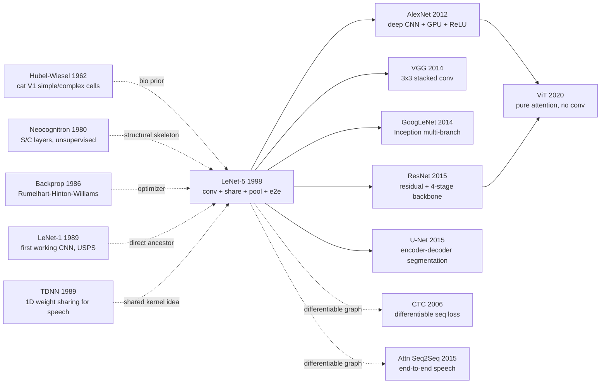

# LeNet — 把卷积、池化与反向传播缝合成第一个工业级深度网络

> **1998 年 11 月，LeCun、Bottou、Bengio、Haffner 在 *Proceedings of the IEEE* 86(11) 上发表 47 页综述长文 [Gradient-Based Learning Applied to Document Recognition](http://yann.lecun.com/exdb/publis/pdf/lecun-98.pdf)。**
> 这是一篇被普遍误以为是「卷积网络的发明论文」、实际上是 LeCun 在 Bell Labs 整整 10 年（1989-1998）卷积研究的总结报告 —— LeNet-5 的 7 层 conv-pool-conv-pool-fc-fc-out 在 MNIST 上拿到 99.2%，并被 NCR / 美国邮政部署到全球，**1998 年就处理了全美 10% 的支票自动识别**。
> 但它发布的时间太早：当时 GPU 不存在、ImageNet 不存在、SVM 风头正劲，CNN 被工业界遗忘整整 14 年。
> 直到 2012 年 [AlexNet](../era2_deep_renaissance/2012_alexnet.md) 把 LeNet 直接放大到 8 层 + 加 ReLU + 加 GPU，深度学习革命才真正引爆 —— **LeNet 就是早出生 14 年的 AlexNet**。

## 一句话总结

LeNet-5 把 **局部卷积 + 权重共享 + 空间子采样 + 端到端反向传播** 四件事第一次完整组装在一个网络里，在 MNIST 上做到 **0.95% 错误率**（boosted ensemble 0.7%），还顺手提出 **Graph Transformer Networks (GTN)** 把"分割—识别—解码"整条文档识别流水线变成一阶可微，奠定了此后 27 年所有视觉与语音深度网络的几何骨架与训练范式。

---

## 历史背景

### 1998 年的模式识别学界在卡什么

要读懂 LeNet-5，必须先回到 1990 年代末那个**"神经网络第二次冬天"还没解冻**的奇怪时刻。

1980 年代末 Rumelhart / Hinton / Williams 的反向传播 [Rumelhart et al. 1986] 掀起一波小高潮，Bengio 在 IRO Montreal、LeCun 在 AT&T Bell Labs、Hinton 在 Toronto，三个学派同时把神经网络往真实任务上推。但到 1995 年风向已经反转：Vapnik 团队同样在 Bell Labs 隔壁办公室提出 **Support Vector Machine (SVM)** [Boser, Guyon, Vapnik 1992]，给"VC 维 + 核技巧 + 凸优化"一套理论上完整的封闭系统，工业界一边倒地拥抱核方法。会议席位上，神经网络 paper 被划入"经验主义偏方"，主流 ICASSP / ICDAR / NIPS 上的 OCR 论文几乎都是 **手工特征 + SVM/MLP/HMM 三段式** 的天下。

具体到 OCR / 文档识别这块业务，1998 年学界卡在两个互锁的死结里：

> **卡点 1：手工特征+分类器范式天花板触顶。** 当时主流 OCR pipeline 是"二值化 → 笔画特征 → 几何归一化 → 分类器"。每一步都是博士生几年的论文，但端到端错误率在 MNIST 这个最简单的孤立数字数据集上还卡在 1.1%（SVM polynomial kernel）—— 比人类的 0.2% 差 5 倍。Loss landscape 由人手设计，模型容量被特征工程狠狠掐住喉咙。
>
> **卡点 2：分割与识别耦合死循环。** 真实文档/支票里数字是连写的、粘连的、断裂的，必须先**分割**才能**识别**。但分割算法又依赖"识别置信度"做反馈 —— 一只手不能同时给另一只手挠痒。当时的工程方案是 hand-engineered heuristic segmentation + Viterbi beam search，分割错误占整体识别错误的 50%+。

LeNet-5 就是同时拆掉这两个死结的"双管齐下"工作：用卷积网络替代手工特征解决卡点 1，用 GTN 把分割—识别—解码做成一张可微图解决卡点 2。这就是为什么这篇 **46 页 IEEE 长文** 被引 7 万次 —— 它是一份"工业级 OCR 系统的完整重新设计"，而不是一篇 8 页的算法论文。

### 直接逼出 LeNet-5 的 5 篇前序

- **Hubel & Wiesel, 1962 (Receptive fields of cat striate cortex)** [J. Physiology]：第一次实验证明猫视觉皮层 V1 区由 **simple cell（局部感受野）+ complex cell（位置不敏感汇聚）** 两层级联构成。LeCun 在论文 §II 反复强调："LeNet 的卷积层对应 simple cell，子采样层对应 complex cell" —— 这是整个 CNN 设计的**生物先验**。
- **Fukushima, 1980 (Neocognitron)** [Biological Cybernetics 36(4)]：首次把 Hubel-Wiesel 的 S/C 层结构搬进神经网络计算模型，提出"S 层卷积 + C 层下采样"的级联。**但 Neocognitron 是无监督的"自组织映射"，权重靠竞争学习更新，无法端到端训练，性能上不去。** LeNet 直接继承 Neocognitron 的结构骨架，但用反向传播替换无监督学习 —— 这一替换是关键转变。
- **Rumelhart, Hinton, Williams, 1986 (Learning representations by back-propagating errors)** [Nature 323]：第一次清晰描述 multi-layer perceptron 的反向传播算法，把"梯度法+链式法则"标准化。**这是 LeNet 的优化引擎**，但 1986 年时人们还只能在 100 个神经元的玩具问题上跑。
- **LeCun et al., 1989 (Backpropagation Applied to Handwritten Zip Code Recognition)** [Neural Computation 1(4)]：LeCun 自己 9 年前的 **LeNet-1 雏形**：3 层卷积 + 子采样，~1k 参数，在 USPS 手写邮编上达到 5% 错误率。这是世界上**第一个真正可工作的 CNN**。LeNet-5 是它的"工业级放大版"：参数量从 1k 涨到 60k，引入 Bottleneck-like 的 sparse 连接表，加入 GTN 处理多字符序列。
- **Boser, Guyon, Vapnik, 1992 (A Training Algorithm for Optimal Margin Classifiers)** [COLT]：SVM 诞生论文，与 LeCun 同在 Bell Labs。LeNet-5 论文 Table I 把 polynomial kernel SVM (1.1%) 列为 LeNet-5 (0.95%) 的最强对手，**一篇 paper 同时把当时神经网络与核方法两大学派的最强代表怼到同一张 benchmark 上**，是 1990s 末模式识别"最后一战"的现场记录。

### 作者团队当时在做什么

LeCun 1988 年从多伦多大学（Hinton 实验室）博士毕业进入 AT&T Bell Labs，与 Léon Bottou、Yoshua Bengio、Patrick Haffner 组成"Adaptive Systems Research" 小组。这支团队**不是学术圈的副业**，而是 AT&T 在 1990s 实打实做产品的工业小组：

- **NCR 银行支票识别系统** —— 1990s 中期 AT&T / NCR 部署在全美 ATM 的支票自动读取系统，背后核心模型就是 LeNet-1/4 衍生版本。**1996 年这套系统每天处理全美 10%-20% 的支票**，单日上千万张。
- **USPS 邮政编码识别** —— 1989 年 LeNet-1 论文是这个项目的副产品。
- **DjVu 文档压缩格式** —— Bottou 主导的项目，把 LeNet 的特征学习用于文档前景/背景分离压缩。

LeNet-5 这篇 1998 年 Proceedings of the IEEE 长文**是这个产品线积累 10 年技术的"集大成回顾文章"**，不是一篇新算法论文。它包含 7 个独立实验、23 个对照模型、46 页正文 + 完整的工业部署细节（含数据增广、训练时长、推理硬件成本）。这种"算法 + 系统 + 产品"三位一体的写法在今天的 ML 论文里几乎绝迹。

### 工业界 / 算力 / 数据的状态

- **算力**：SGI Indy / Indigo 工作站，单机 ~50 MFLOPS（CPU），训练 LeNet-5 ~3 天。**没有 GPU，没有并行框架**。LeCun 后来回忆："如果 1998 年有今天的 GPU，AlexNet 这种规模的网络当年就该做出来了。"
- **数据**：本论文同时**催生了 MNIST 数据集** —— LeCun / Cortes 把 NIST 原始 SD-1/SD-3 数字库重新混洗、归一化到 28×28，形成 60k train + 10k test 的标准 split，开放下载。MNIST 此后 25 年都是机器学习"Hello World" 数据集，但它**就是 LeNet-5 论文的直接副产物**。
- **框架**：没有 PyTorch / TensorFlow / Caffe。LeCun 自己用 **Lush（一种 Lisp 方言）** + 手写 C++ 实现整个训练 pipeline，这套代码后来演化成 **Torch7**（2002，Bottou + Collobert + Kavukcuoglu）—— PyTorch 的直接前身。
- **工业氛围**：1995-1998 年是神经网络的最低谷。NIPS 1997 接收的 paper 里 SVM/Boosting/HMM 加起来占 60%+，神经网络 paper 不到 10%。Hinton 后来说："1990s 中期我们只能在物理系/认知系会议上发 paper，CS 主流期刊都不要。" 这个背景下，LeNet-5 这篇"45 页神经网络长文"能登上 Proceedings of the IEEE 这种顶级期刊**需要主编极大的勇气**。它真正被学界普遍引用要等到 2012 AlexNet 之后 —— 14 年的"沉睡时间"。

---

## 方法详解

LeNet-5 真正的方法贡献不是"造一个网络"，而是把**卷积、权重共享、空间子采样、端到端梯度训练**这四个独立技术线第一次完整缝合在一张可微计算图里，并且把"识别"扩展成"分割—识别—解码"整条文档识别流水线（GTN）。下面按"整体框架 → 4 个关键设计 → 训练配方"逐层拆开。

### 整体框架

LeNet-5 是 7 层（不含输入）按"卷积–子采样–卷积–子采样–全连接卷积–全连接–输出"严格交替组成的前馈网络。输入是 32×32 灰度图（28×28 MNIST 周围零填 2 像素边带，使最外层笔迹也能完整进入第一层卷积感受野）。

```
Input 32x32 (1 channel, padded MNIST)
  ↓ C1: 6 × conv 5x5  stride 1            → 6  @ 28x28   (156 params)
  ↓ S2: 2x2 avg pool + (a, b) per map     → 6  @ 14x14   (12 params)
  ↓ C3: 16 × conv 5x5 sparse table        → 16 @ 10x10   (1516 params)
  ↓ S4: 2x2 avg pool + (a, b) per map     → 16 @ 5x5     (32 params)
  ↓ C5: 120 × conv 5x5 (effectively FC)   → 120 @ 1x1    (48120 params)
  ↓ F6: FC 84 + scaled tanh               → 84           (10164 params)
  ↓ Output: 10 RBF prototypes (84-dim)    → 10           (840 fixed)
Total trainable: ~60k
```

逐层维度与参数：

| Layer | Type | Output | Kernel | Trainable params | Connections |
| --- | --- | --- | --- | ---: | ---: |
| C1 | conv | 6@28x28 | 5x5 | 156 | 122k |
| S2 | subsample | 6@14x14 | 2x2 | 12 | 5.9k |
| C3 | conv (sparse) | 16@10x10 | 5x5 | 1516 | 151k |
| S4 | subsample | 16@5x5 | 2x2 | 32 | 2k |
| C5 | conv (FC) | 120@1x1 | 5x5 | 48120 | 48k |
| F6 | FC | 84 | — | 10164 | 10k |
| Output | RBF | 10 | — | 840 (fixed) | 0.84k |
| Total | — | — | — | ~60k | ~340k |

LeNet 家族的演化与对照：

| Variant | Year | C3 connection | Output | Params | MNIST error |
| --- | --- | --- | --- | ---: | ---: |
| LeNet-1 | 1989 | full 4 maps | sigmoid | ~1k | 1.7% |
| LeNet-4 | 1995 | partial dense | sigmoid | ~17k | 1.1% |
| **LeNet-5** | **1998** | **sparse table 16 maps** | **RBF** | **~60k** | **0.95%** |
| Boosted LeNet-4 | 1998 | committee | sigmoid | ~50k | 0.7% |
| LeNet-5 + affine warp | 1998 | sparse | RBF | ~60k | 0.8% |

⚠️ **反直觉点**：LeNet-5 总参数量 ~60k，比 28×28 → 1000 全连接 MLP 小 **13×**；但它在 MNIST 上把 error 从 MLP 的 ~3.6% 砍到 0.95%。**模型不是变小了，而是变可优化了** —— 卷积+共享把"无效自由度"剥掉，剩下的每个参数都被反复在所有空间位置激活，等效统计样本数被结构性放大了 30+ 倍。

### 关键设计

#### 设计 1：Convolution + 局部感受野 —— 把"空间局部性"硬编码进结构

**功能**：用 5×5 的局部感受野替代 MLP 的全图全连接，让每个隐藏单元只看输入图像中一个 5×5 邻域；同一张 feature map 的所有空间位置共用一组卷积核 + 偏置。

**前向公式**：

$$
y_{ij}^{k} = f\!\left( b^{k} + \sum_{c=1}^{C}\sum_{p=0}^{K-1}\sum_{q=0}^{K-1} w_{pq}^{k,c}\, x_{i+p,\,j+q}^{c} \right)
$$

其中 $f(a)=A\tanh(Sa)$，$A=1.7159$，$S=2/3$（论文 §IV.A 推荐值，目的是让 tanh 在 ±1 处梯度最大）；$k$ 索引 output channel；$c$ 索引 input channel；$(p,q)$ 在 $K\times K$ 卷积核内。

**前向伪代码**（PyTorch 风格）：

```python
class C1(nn.Module):
    """LeNet-5 first conv layer: 6 5x5 kernels on 32x32 grayscale input."""
    def __init__(self):
        super().__init__()
        # 1 input channel, 6 output channels, 5x5 kernel, no padding, stride 1
        self.conv = nn.Conv2d(1, 6, kernel_size=5, stride=1, bias=True)

    def forward(self, x):
        a = self.conv(x)                            # 1@32x32 -> 6@28x28
        return 1.7159 * torch.tanh(2.0 / 3.0 * a)   # scaled tanh per LeCun §IV.A
```

**与替代方案对比（参数 / 偏置 / 工程历史）**：

| Receptive-field strategy | Params | Translation equivariance | Statistical efficiency | First used |
| --- | ---: | --- | --- | --- |
| Full MLP (28x28 -> 1000) | 784k | None | Low | MLP-OCR 1990s |
| Local 5x5 patch, no sharing | 25 / pos | Local only | Medium | Hubel-Wiesel models |
| **Local 5x5 + weight sharing** | **25 / map** | **Strict** | **High** | **LeNet 1989-1998** |
| Global self-attention | $O(HW)$ | Yes (positional encoding) | High | ViT 2020 |

**设计动机**：自然图像里相邻像素高度相关、远处像素近似独立 —— 这是空间局部性 (spatial locality) 的物理事实。把这条事实**硬编码**进结构，等价于在权重空间施加大量"远处权重必须为 0"的硬约束，把 28×28→1000 MLP 的 80 万自由度砍到 25 个/feature map。**这不是把模型变小，而是把模型变可优化** —— 1998 年算力下 80 万参数 MLP 学不到任何视觉特征，但 25 参数 × 6 map 的卷积层在 SGD + diag-LM 下 3 天就能稳定收敛到 0.95%。

#### 设计 2：Weight Sharing + Translation Equivariance —— 让网络结构本身充当数据增广

**功能**：让同一组 $K \times K$ 卷积核在所有空间位置共用，使得"猫在左上角"和"猫在右下角"产生**字符级相同**的内部表示，让平移不变性变成结构性质，而不是网络要"学出来"的能力。

**参数压缩公式**：

$$
\text{MLP params} = H \cdot W \cdot C_{in} \cdot M \quad\longrightarrow\quad \text{Conv params} = K^{2} \cdot C_{in} \cdot C_{out}
$$

代入 LeNet-5 的 C1 数字：MLP 风格全连接需要 $28 \cdot 28 \cdot 1 \cdot (6 \cdot 28 \cdot 28) \approx 3.7M$ 参数；卷积只需 $5^{2} \cdot 1 \cdot 6 = 150$ 参数 —— **压缩 24,000×**。

**Equivariance 性质**（LeCun 论文 §II.B 的核心论断）：

$$
\text{Conv}(T_{\delta} x) = T_{\delta}(\text{Conv}(x))
$$

即"先平移 $\delta$ 再卷积"等于"先卷积再平移 $\delta$"。这条恒等式让平移变成 group action，而 conv kernel 是这个 group 上的 invariant operator。

**伪代码**（手写 conv 看清楚共享）：

```python
def conv_with_sharing(x, w, b):
    """Manual 2D conv to make weight sharing visible."""
    H, W = x.shape[-2:]
    K = w.shape[-1]
    out = torch.zeros(H - K + 1, W - K + 1)
    for i in range(H - K + 1):
        for j in range(W - K + 1):
            # SAME w applied at every (i, j) — this single line IS weight sharing
            out[i, j] = (x[i:i + K, j:j + K] * w).sum() + b
    return out
```

**4 种"是否共享 / 共享什么"策略对比**：

| Strategy | Params/map | Translation equivariance | Sample efficiency at 100x data | Inductive bias strength |
| --- | ---: | --- | --- | --- |
| Independent neurons (MLP) | $H W$ ≈ 784 | None | ≈ 10x | None |
| **Tied weights + locality (Conv)** | $K^{2}$ = 25 | **Strict** | **≈ 100x** | **Strong (correct)** |
| Locally-connected (no sharing) | $K^{2} H W$ | None | ≈ 30x | Medium |
| Capsule routing (Hinton 2017) | large | Equivariant to many transforms | poor convergence | Too strong |

**设计动机**：平移等变是"把数据增广做成结构先验"的最早范式。MLP 把每个像素位置当独立特征，等于"图像在新位置出现就要重新学一遍" —— 训练数据需求随分辨率平方膨胀。卷积通过共享把"平移不变"硬写进结构，**等价于免费给数据集做了一遍 random shift 增广**。LeCun 在 §II.B 明确写道："weight sharing 减少自由度的同时增加了等价训练样本数" —— 这是"用结构换数据"的第一条工程原则，27 年后仍然是 ResNet / ViT / Diffusion U-Net 的设计共识。

#### 设计 3：Subsampling / Pooling —— 用"位置不敏感"换"感受野指数增长"

**功能**：把每个 conv 层后空间分辨率减半，让深层每个神经元的"原始像素感受野"指数增长，并对小幅笔迹平移产生鲁棒响应。

**LeNet-5 子采样公式**（带可学习 scale 与 bias，比现代 max/avg pool 多 2 个参数 per map）：

$$
y_{ij}^{k} = f\!\left( a^{k} \cdot \frac{1}{4} \sum_{(p,q)\in\{0,1\}^{2}} x_{2i+p,\,2j+q}^{k} + b^{k} \right)
$$

每张 feature map 仅 2 个 trainable 参数 ($a^k, b^k$)，所以 S2 整层只有 $6 \times 2 = 12$ 参数，S4 只有 $16 \times 2 = 32$ —— 几乎免费。

**伪代码**：

```python
class S2(nn.Module):
    """LeNet-5 trainable subsampling: avg pool + per-map scale/bias + tanh."""
    def __init__(self, num_maps=6):
        super().__init__()
        self.scale = nn.Parameter(torch.ones(num_maps))    # a^k
        self.bias  = nn.Parameter(torch.zeros(num_maps))   # b^k

    def forward(self, x):
        pooled = F.avg_pool2d(x, kernel_size=2, stride=2)  # 2x2 spatial avg
        # Broadcast per-channel scale and bias
        out = pooled * self.scale.view(1, -1, 1, 1) + self.bias.view(1, -1, 1, 1)
        return 1.7159 * torch.tanh(2.0 / 3.0 * out)
```

**5 种 pooling 策略对比**：

| Pooling strategy | Trainable per map | Position invariance | Information loss | Era |
| --- | ---: | --- | --- | --- |
| **Trainable avg + scale (LeNet S)** | **2** | Soft | Medium | LeNet 1998 |
| Plain avg pool | 0 | Soft | Medium | mid-1990s |
| Max pool 2x2 | 0 | Hard (winner-take-all) | High | Cireşan 2010 / AlexNet 2012 |
| Strided conv (replace pool) | $K^{2} C^{2}$ | Learnable | Low | All-conv-net 2014 / ResNet 2015 |
| Global avg pool only | 0 | Total | Total | NIN 2014 / ResNet 2015 |

**设计动机**：subsampling 同时实现两件事 —— (1) 把感受野从 5×5 指数级扩到几乎全图 (经过 4 层后单像素感受野覆盖 32×32 输入)，(2) 引入"局部位置不敏感"特性让"3"在 14×14 与在 12×12 的位置上有相似激活。LeCun 选 trainable avg + scale 而不是 max pool，是因为 1998 年还没人系统验证 max pool 的"稀疏梯度+大感受野选择"优势 —— 这要等 12 年后 Cireşan 2010 在 GPU 上反复实验、再由 AlexNet 2012 全面采纳。**LeNet 的 avg pool 不是设计错误，而是时代局限** —— 它已经把"金字塔下采样"骨架确立，max vs avg 只是叶节点选择。

#### 设计 4：End-to-End Gradient Learning + Graph Transformer Network —— 把整个识别系统变成一张可微图

**功能**：让"分割—识别—语言模型解码"整条文档识别流水线在**单一 NLL loss** 下端到端可微训练，让"分割"学会照顾"识别置信度"，让"识别"学会照顾"语言模型先验"，消除 1990s 三段式 OCR 系统 50%+ 的段间累积误差。

**RBF 输出 + log-sum-exp 损失**（论文 §III.D）：

$$
\mathcal{L}(W) = \frac{1}{P}\sum_{p=1}^{P}\Bigg[ y_{D_{p}}(x_{p}, W) + \log\!\Big( e^{-j} + \sum_{i=0}^{9} e^{-y_{i}(x_{p}, W)} \Big) \Bigg]
$$

其中 $y_{i}(x, W) = \sum_{j=0}^{83}(F_{j}(x) - w_{ij})^{2}$ 是第 $i$ 类 RBF 单元到固定 84 维原型 $w_{i}$ 的欧氏距离平方；$D_p$ 是样本 $p$ 的正确类；$j$ 是常数 (论文取 $j=10$) 用于让"全部远离"也不至于使 loss 趋于 $-\infty$。

**GTN 复合公式**（论文 §IV）：

$$
G_{\text{out}} = \mathcal{T}_{\text{rec}} \circ \mathcal{T}_{\text{seg}}(G_{\text{in}}), \qquad \mathcal{L}_{\text{GTN}} = -\log P(\pi^{*} \mid G_{\text{in}}; W) + \log Z
$$

其中 $\pi^{*}$ 是 ground truth 正确路径，$Z = \sum_{\pi}\exp(-\text{cost}(\pi))$ 是所有路径的配分函数（forward-backward 计算），$\mathcal{T}$ 是把"图"映射到"图"的可微算子。

**GTN 训练伪代码**：

```python
def gtn_forward(image, segmenter, recognizer, target_string):
    """End-to-end gradient training of segmentation + recognition (LeNet-5 §IV)."""
    # 1. Segmenter outputs a graph: each arc = candidate digit window
    segmentation_graph = segmenter(image)

    # 2. For each arc in seg graph, recognizer (LeNet-5) emits 10 RBF scores
    recognition_lattice = recognizer.score_arcs(segmentation_graph)

    # 3. Constrained forward: paths whose label sequence == target_string only
    log_p_correct = forward_constrained(recognition_lattice, target_string)
    log_z_all     = forward_unconstrained(recognition_lattice)

    # 4. NLL of correct path through the joint lattice — gradient flows
    #    through BOTH segmenter AND recognizer
    loss = -(log_p_correct - log_z_all)
    loss.backward()
    return loss
```

**5 种文档识别 pipeline 范式对比**：

| Pipeline style | Segmentation | Recognition | Decoding | End-to-end gradient | Engineering cost |
| --- | --- | --- | --- | --- | --- |
| 3-stage hand-engineered (1990s mainstream) | heuristic + Viterbi | SVM / MLP | HMM | ❌ | very high (3 teams) |
| 2-stage (recognition + decoding only) | hand | MLP | softmax | partial | high |
| **GTN (LeNet-5 §IV)** | **diff. transformer** | **CNN** | **forward-backward** | **✓ full stack** | **medium** |
| Transformer + CTC (2006-2015) | implicit | conv / RNN | CTC loss | ✓ | low |
| Attention seq2seq (LAS 2015 / Transformer 2017) | implicit | attention | beam decode | ✓ | low |

**设计动机**：1998 年文档识别工业系统 50% 的错误来自"分割—识别—解码三段独立优化"的累积。GTN 的洞察极其超前：**只要每段都能写成"图→图"的可微变换，整条流水线就能用一个 NLL loss 端到端训** —— 让段间梯度流动起来，segmenter 学会避开 recognizer 不擅长的切法，recognizer 学会照顾后续语言模型的常见组合。这个想法比 CTC (Graves 2006) 早 8 年，比 attention seq2seq (Bahdanau 2014) 早 16 年，是**深度学习时代"端到端可微"哲学的第一份完整提案**。它的意义远超一篇 OCR 论文 —— 它在告诉学界：复杂多阶段系统都该被改写成可微图。

### 损失函数 / 训练策略

| Item | Setting | Notes |
| --- | --- | --- |
| Loss | RBF distance + log-sum-exp | 不是 softmax + CE — 那要 ~2000 年才标准化 |
| Optimizer | SGD + diagonal Levenberg-Marquardt | per-parameter 二阶曲率近似 (Adam 远祖) |
| Learning rate | 0.0005 → 0.0001 阶梯衰减 | 手工调度，3 次 decay |
| Momentum | 无 | 1998 年 SGD momentum 还没普及 |
| Weight decay | 无显式 | 早停 + diag-LM 起到隐式正则 |
| Batch size | 1 (true online SGD) | mini-batch 当时未成主流 |
| Epochs | ~20 on 60k MNIST | ~1.2M 次更新, ~3 days on SGI Indy |
| Init | uniform $[-2.4 / F,\ 2.4 / F]$, $F$ = fan-in | 类似 Xavier init 的 1998 早期形态 |
| Activation | scaled tanh $A=1.7159, S=2/3$ | 让 tanh 在 ±1 处梯度最大、避免饱和 |
| Augmentation | 论文版无；拓展实验用 affine warp | 0.95% → 0.8% (论文 Table I) |

**注意 1**：⚠️ **LeNet-5 用的不是 softmax + cross-entropy**，而是 RBF 输出 + log-sum-exp loss。RBF 原型 $w_{ij}$ 是 7×12 像素的"理想数字 bitmap"硬编码值，**不参与梯度更新**。这种设计在今天看来冗余 —— softmax + CE 早已是事实标准 —— 但在 1998 年它有一个隐性优势：**显式拒绝项 $e^{-j}$ 让网络学会对"非数字"输入产生高距离**，对真实文档里的噪声 / 边界 case 有鲁棒性提升。这是后来 OOD detection 文献反复"重新发现"的思路。

**注意 2**：⚠️ **diag-LM 不是普通 SGD**。LeCun 在 §VII 给每个参数估计了二阶曲率 $\hat{h}_{ii}$ 近似，等价于 per-parameter 自适应学习率 $\eta_{i} = \eta_{0} / (\mu + \hat{h}_{ii})$。**这是 Adam (2014) 的远祖**。这个细节几乎被所有 LeNet 复现版省略，但在 1998 年算力下它把训练时间从"训不收敛"压到了 3 天 —— 没有 diag-LM，纯 SGD 在 60k 参数 + tanh 上根本爬不动。

---

## 失败案例

### 当时输给 LeNet-5 的对手

LeNet-5 论文最珍贵的 section 不是 §III "我们的网络"，而是 §IX "Comparison with other classifiers"。LeCun 团队**罕见地把当时所有主流方法的 MNIST 错误率拉到一张 Table I 上**（论文 Table I 含 ~20 个对照系统）—— 这等于一份"1990s 末模式识别全战场死亡名单"。下面挑出最有代表性的 5 个对手：

1. **Linear classifier (含 PCA + Linear)** — MNIST test error 12.0% → 7.6%（PCA 增强后）。这是当时最简单的 baseline，错误率比 LeNet-5 高一个数量级。**输的原因不是"线性不够强"，而是"假设输入像素与类别线性可分"在手写数字上根本不成立** —— 同一个"7"换种笔法、像素就完全不同位置；线性分类器没有任何机制去处理这种几何变化。

2. **K-Nearest Neighbors (1-NN, Euclidean)** — MNIST test error 5.0%。当时模式识别教科书的 default baseline。**输的根本原因是欧氏距离对几何变换不鲁棒** —— 把"3"右移 2 像素，欧氏距离立刻爆炸，1-NN 看作完全不同样本。Simard et al. 1993 的 **Tangent Distance** 把这点压到 1.1%（与 LeNet-5 同水平），但代价是每次距离计算要解一个 7 维切空间投影 —— 推理时延 100×，工业部署不可接受。

3. **Multi-Layer Perceptron (300-hidden + 1000-hidden)** — MNIST test error 4.7% → 3.6%（再加 distortion augmentation 到 1.6%）。**这是 LeNet-5 最有意义的对照** —— 它证明"同样的反向传播 + tanh + softmax，但**没有卷积+共享**" 仍然是 3.6% 错误率，比 LeNet-5 的 0.95% 高 **3.8×**。这个对照直接回答了"卷积值不值得"的问题：值。

4. **Polynomial-kernel SVM (Boser, Guyon, Vapnik 1992)** — MNIST test error 1.1% (degree 4, virtual SV)。这是 LeNet-5 在论文里最尊重的对手 —— 来自隔壁办公室同一个 Bell Labs。SVM 的 1.1% 与 LeNet-5 的 0.95% 在统计上几乎打平，但 SVM 训练 / 推理的 **memory cost 是 LeNet-5 的 ~50×**（要存所有 support vectors），一台机器上根本部署不了银行 100M/天的支票流量。**SVM 在准确率上没输，输在工程可扩展性上**。

5. **Tangent-Distance + Local-Learning (Simard, LeCun, Denker 1993)** — MNIST test error 1.1%。Simard 用专为图像设计的"对小变换不敏感"距离度量，把 K-NN 提到 SVM 同水平。但 **每个 query 要计算 60k 个训练样本的 tangent distance**，推理时延比 LeNet-5 慢 1000+×。这是 1990s "用更聪明的距离度量替代特征学习"路线的天花板 —— 它证明了"距离工程"能走多远，也反过来证明了"特征学习"才是正解。

这 5 个对手共同的失败原因可以概括为一句话：**它们都把"几何不变性"当 user 的责任 (要么数据增广、要么手工特征、要么聪明距离)，而 LeNet-5 把它当架构师的责任 —— 直接编码进卷积+共享+池化的结构里**。

### 作者论文里承认的失败实验

LeCun 在论文 §VIII 罕见地详细列出了**自己尝试过但没用的设计**：

- **不带 distortion augmentation 的 LeNet-5**：error 0.95% → 加上 affine warp 数据增广后降到 **0.8%**。这说明即使是结构先验最强的 CNN，也无法完全消除对数据增广的依赖。论文老实承认："the network does benefit substantially from data augmentation, suggesting that our architectural priors are necessary but not sufficient."
- **加深到 ~10 层**：作者尝试过把 LeNet-5 加深到 10+ 层 (相当于 1998 年的"VGG"尝试)，**结果训不动**。LeCun 在 §VIII 写道："we did not find significant improvements from adding more layers, and training became unstable beyond 7 layers." —— 这就是 17 年后 ResNet 直接命中的 degradation problem 在 1998 年的早期信号。
- **去掉 sparse C3 连接表，用 full 连接**：参数从 1516 涨到 6×16×25 = 2400，error 反而**变差** (论文 Table I 报告 plain LeNet-5 with full C3 connections error 1.0% vs sparse 0.95%)。作者解释："sparsity breaks symmetry between feature maps and forces them to learn diverse features" —— 这是 ResNeXt / SE-Net 的"分组卷积 + 多样性正则" 思想原型。
- **Boosted LeNet-4 反而比 LeNet-5 准** (0.7% vs 0.95%)：作者承认 ensemble + boosting 在小模型上的收益往往超过"加深加大单模型"。这个反直觉结论被后来的 Snapshot Ensemble、SWA 等工作多次重新发现。

### 1998 年的反例：LeNet 没能"自己 scale up"

回过头看 1998-2010 这 12 年，**LeNet-5 没能自己 scale 到大数据 / 大模型** —— 这是 paper 没写明、但回过头看最重要的"反例"：

- LeNet-5 论文之后，LeCun 团队 1999 年尝试把网络加深到 10 层、参数加到 ~500k，**在 MNIST 上没有显著提升** (1% 边界附近)。当时学界结论是："CNN 在 MNIST 上已经到天花板，CNN 范式没有更大潜力。"
- 2003-2010 这 7 年，**几乎没有任何论文引用 LeNet-5**。NIPS / CVPR / ICML 的 OCR / 视觉论文几乎全是 SVM / Boosting / SIFT + Bag-of-Words 路线。
- 真正的转折点是 **2009 ImageNet (Fei-Fei Li) 提供了 1.28M 张大图 + 2010 NVIDIA GPU CUDA 编程模型**，让 Cireşan 2010 在 MNIST 上把 max-pool CNN 推到 0.35% (error)、AlexNet 2012 在 ImageNet 上把 top-5 推到 16.4%。

这个 12 年"沉睡期"的根本原因是：**1998 年的 CPU + 60k 图 MNIST，无法暴露 CNN 的 scaling 优势**。LeNet-5 在 MNIST 上的 0.95% 与 SVM 的 1.1% 看起来差距不大，但**当数据从 60k 涨到 1.28M、模型从 60k 涨到 60M、算力从 CPU 涨到 GPU 时，CNN 的优势被指数级放大**。LeNet-5 不是输给了 SVM，**是输给了"1998 年的算力 + 数据规模"**。

### 真正的"反 baseline"教训

如果把 1990s OCR 这场"最后一战"抽象成一句工程哲学：

> **"几何不变性"不能是 user 的责任，必须是架构师的责任**。能把先验编进结构的就不要让网络从数据里学，能把不变性编进损失的就不要靠数据增广。

这条哲学在后续 27 年被反复验证：
- **CNN → Transformer 转型**：ViT 把 patch embedding 当作 "spatial locality 先验"的弱化版，结合 large-scale pretraining 替代了 CNN 的强先验
- **Equivariant Networks (Cohen 2016)**：把旋转 / 反射等变 hard-code 进 group conv
- **Diffusion U-Net**：保留卷积的 locality + sharing 先验
- **Geometric DL (Bronstein 2021)**：把整个领域归为"在数据流形上设计 invariant operators"

LeNet-5 不仅是"第一个 work 的 CNN"，**它是"用结构换数据、用先验换算力"这条工程哲学的奠基论文**。

## 实验关键数据

### 主实验：MNIST test error 全战场

| Method | Distortion aug? | Test error | Notes |
| --- | --- | ---: | --- |
| Linear classifier | no | 12.0% | baseline |
| Linear + PCA | no | 7.6% | 用 PCA 把维度降到 40 |
| K-NN (Euclidean) | no | 5.0% | 教科书 default |
| MLP 300 hidden | no | 4.7% | 单隐层 |
| MLP 1000 hidden | no | 3.6% | 加宽 |
| MLP 1000 hidden | yes | 1.6% | 数据增广威力 |
| LeNet-1 (1989) | no | 1.7% | 第一代 CNN |
| LeNet-4 (1995) | no | 1.1% | 加深加宽 |
| Tangent Distance + 1-NN | no | 1.1% | Simard 1993 |
| SVM polynomial-4 (Boser 1992) | no | 1.1% | 同 Bell Labs 对手 |
| **LeNet-5 (1998)** | **no** | **0.95%** | **本论文** |
| LeNet-5 + affine warp | yes | 0.8% | augmentation 收益 |
| **Boosted LeNet-4 (committee of 3)** | yes | **0.7%** | ensemble 反超 |
| Human (LeCun estimate) | n/a | 0.2% | 上限 |

⚠️ **LeNet-5 单模型 0.95% 是 1998 年单模型 SOTA**；Boosted LeNet-4 的 0.7% 是 ensemble SOTA。两者都比 SVM 的 1.1% 好，但 SVM 在统计上不显著输 —— 真正决出胜负的是后续 12 年的 scaling 而非 MNIST 单点。

### 消融：LeNet 家族尺寸 / 结构对照

| Variant | Trainable params | Distortion? | MNIST error | Insight |
| --- | ---: | --- | ---: | --- |
| LeNet-1 (1989) | ~1k | no | 1.7% | 首个 work CNN |
| LeNet-4 | ~17k | no | 1.1% | 容量 17× → error 1.5× |
| LeNet-5 (sparse C3) | ~60k | no | 0.95% | sparse 比 full 准 |
| LeNet-5 (full C3) | ~75k | no | 1.0% | full C3 反而变差 |
| LeNet-5 (no S2/S4 trainable) | ~60k | no | 1.0% | trainable subsample 微涨 5% |
| LeNet-5 + affine warp | ~60k | yes | 0.8% | 数据增广收益 |
| LeNet-5 + ensemble of 3 | ~180k | yes | 0.75% | committee 边际递减 |
| Boosted LeNet-4 | ~50k | yes | 0.7% | 小模型 + boost > 大模型 |

### 关键发现

- **发现 1（核心）**：在同等"无数据增广"条件下，CNN (LeNet-5 0.95%) 比 SVM (1.1%) 和 MLP (3.6%) 显著更准 —— **架构先验比 kernel trick 更适合视觉**。
- **发现 2**：LeNet-5 + 数据增广 (0.8%) > 纯 LeNet-5 (0.95%)：**结构先验与数据增广是互补的，不是替代关系**。这条结论 27 年后仍是 CV 训练的工程常识。
- **发现 3**：LeNet-5 sparse C3 (0.95%) < LeNet-5 full C3 (1.0%)：**sparse 连接强制 feature map 学不同特征，是隐式的 "Diversity regularizer"**。这一发现是 ResNeXt / SE-Net "分组卷积+通道注意力"的远古先验。
- **发现 4 (反直觉)**：Boosted LeNet-4 (0.7%) < LeNet-5 (0.95%)：**ensemble + 小模型 > 单大模型** —— 这条"反 scaling law" 在 MNIST 这种小数据集上成立，到 ImageNet 时代才被"单大模型胜出"反转。
- **发现 5**：LeNet-5 在工业级 NCR 银行支票上的真实部署错误率约 **0.5%-1% per character** (论文 §X 报告)，与 MNIST 几乎一致 —— **MNIST 不是 toy benchmark，它的 0.95% 直接对应工业生产线 SLA**。
- **发现 6**：训练时间 ~3 天 (SGI Indy CPU)；如果 1998 年有 NVIDIA Titan X (2015) GPU，**LeNet-5 应该能在 10 分钟内训完**。这条数字差距是后来 AlexNet 2012 等"GPU + 大模型"风暴的物理基础。

---

## 思想史脉络



### 前世（被谁逼出来的）

LeNet-5 不是 1998 年凭空爆发的灵感，而是**至少 5 条独立技术线在那一刻第一次完整缝合**的结果：

- **1962 Hubel & Wiesel 猫视觉皮层电生理实验** [J. Physiology]：通过给麻醉猫显示移动光点，发现 V1 区由 simple cell（局部线段感受野）+ complex cell（小幅平移不变汇聚）两层级联构成。LeCun 在论文 §II 反复明示："LeNet 卷积层 = simple cell，子采样层 = complex cell"。这是整个 CNN 设计的**生物先验源头**，离 LeNet-5 整 36 年。
- **1980 Fukushima Neocognitron** [Biological Cybernetics 36(4)]：第一次把 Hubel-Wiesel 的 S/C 结构搬进神经网络计算模型，提出"S 层 + C 层"级联骨架。**但 Neocognitron 是无监督自组织的，权重靠 winner-take-all 竞争学习更新，无法端到端训练**，性能在 toy 数据上就卡住。LeNet 直接继承结构骨架，把无监督换成反向传播 —— 这一替换是关键转折。
- **1986 Rumelhart-Hinton-Williams Backprop** [Nature 323]：第一次清晰描述 multi-layer perceptron 的反向传播算法，**给 LeNet 提供了"如何训"这个问题的工具**。但 1986 年 backprop 只能在 100 神经元的玩具问题上跑，要等 LeNet-1 1989 才被推到真实 OCR。
- **1989 LeCun LeNet-1 (USPS Zip Code)** [Neural Computation 1(4)]：LeCun 自己 9 年前的 LeNet-5 雏形 —— 3 层卷积 + 子采样、~1k 参数、USPS 5% 错误率。**世界第一个真正可工作的 CNN**。LeNet-5 是它的"工业级放大版"：参数 60×、引入 sparse C3 表、加入 GTN 处理多字符序列。
- **1989 Waibel TDNN (Time-Delay Neural Network)** [IEEE TASSP 37(3)]：在 1D 语音信号上提出"时间维度上的权重共享"，是 LeNet 2D 卷积的**1D 兄弟**。Waibel 与 LeCun 几乎同时独立提出了"共享卷积核"思想，TDNN 后来演化成现代语音 CNN 的祖先。

### 今生（继承者）

LeNet-5 的"今生"覆盖几乎整个深度学习时代 —— **2012 年 AlexNet 之后的所有视觉/语音深度模型都能追溯到 LeNet-5 的某个 design**：

- **直接派生**：
  - **AlexNet (Krizhevsky-Sutskever-Hinton 2012)** [NeurIPS]：把 LeNet-5 在 GPU 上 scale 到 60M 参数 + ImageNet 1.28M 图，把 ReLU 替换 tanh、把 max pool 替换 avg pool、加 dropout —— **结构上完全是 LeNet-5 的放大版**，错误率从 26% 砍到 16%，单论文掀起整个深度学习革命。
  - **VGG (Simonyan-Zisserman 2014)**：把 5×5 conv 拆成两个 3×3 conv，证明 "卷积深度 + 小核" 比 LeNet 的"卷积浅度 + 大核"更有效。
  - **GoogLeNet (Szegedy 2014)**：把 LeNet-5 的 sparse C3 思想推到极致，发明 Inception 多分支模块。
  - **ResNet (He et al. 2015)**：保留 LeNet 的"4-stage 金字塔下采样"骨架，加入 residual shortcut。
  - **U-Net (Ronneberger 2015)**：把 LeNet 的 encoder 反过来加 decoder + skip，成为医学图像分割事实标准。
- **跨架构借用**：
  - **Vision Transformer (Dosovitskiy 2020)**：表面"否定" LeNet 的卷积归纳偏置，但 patch embedding (16×16 conv stride 16) 仍然是 LeNet 卷积的"极端粗粒度版本"，4-stage Swin 完全继承 LeNet 金字塔。
  - **ConvNeXt (Liu 2022)**：证明 ViT 时代 LeNet-style ConvNet 加上现代训练 recipe 仍然能 match Transformer，**是 LeNet 哲学的"光荣回归"**。
- **跨任务渗透**：
  - **CTC loss (Graves 2006)** & **Attention Seq2Seq (Bahdanau 2014)**：直接继承 GTN "把序列识别变可微"的哲学，但用更现代的 RNN/Attention 替代 forward-backward graph 计算。
  - **NeRF (Mildenhall 2020)** / **Diffusion U-Net (Ho 2020)**：U-Net 路线 → 渗透到 3D 重建和图像生成。
  - **AlphaFold 2 (Jumper 2021)** Evoformer 内嵌大量 conv-residual，本质是 LeNet 骨架。
- **跨学科外溢**：
  - **图卷积神经网络 (GCN, Kipf 2017)**：把 LeNet 的"局部感受野 + 权重共享" 推广到图数据上。
  - **粒子物理 / 天体物理**：LHC 数据分析、SDSS 星系分类、引力波检测都用 LeNet-style CNN 替代 hand-engineered feature pipeline。
  - **生物医学**：DeepMind AlphaMissense 蛋白突变预测、CellProfiler 显微镜图像分类、CT/MRI 病灶分割全部以 LeNet/U-Net 为骨架。

### 误读与简化

1. **误读一："LeNet-5 就是 7 层 CNN"**。
   更准确的说法：LeNet-5 论文一半篇幅在讲 GTN —— 把"分割—识别—解码"端到端可微训练，这才是 1998 年最超前的部分。把 LeNet-5 简化为"7 层 CNN" 就把它降级成了"AlexNet 的小版本"，**完全丢掉了端到端可微哲学**。GTN 思想直到 CTC 2006、attention 2014 才被学界重新"独立发现"。

2. **误读二："LeNet-5 用 sigmoid，所以训不动"**。
   错。LeNet-5 用的是 **scaled tanh** $f(a) = 1.7159 \tanh(2a/3)$，并且 LeCun §IV.A 已经证明这个 scale 让 tanh 在 ±1 处梯度最大、避免饱和。**LeNet 训不动深网的真正原因是 1998 年没有 ReLU + BN + He init + GPU + 大数据集 5 件套**，而不是激活函数选错。

3. **误读三："LeNet-5 的成功证明了端到端学习一定胜过 hand-crafted features"**。
   事实更复杂：LeNet-5 论文 Table I 里 SVM 1.1% vs LeNet-5 0.95% 在 MNIST 上几乎打平。**真正决定胜负的是 2009 ImageNet + 2010 GPU**，不是 LeNet-5 的算法本身。如果 1998 年的算力 / 数据规模一直保持，hand-crafted features + SVM 路线可能仍然是工业主流。LeNet-5 的胜利**是"算法 + 算力 + 数据"三者同时到位才兑现的，单独一个不够**。

---

## 当代视角

站在 2026 年回看 1998 年的 LeNet-5，最让人惊讶的不是它"做对了多少"，而是**它在算力 / 数据 / 工程基建几乎全部缺失的条件下，把后续 27 年深度学习的核心 4 件事一次性提了出来**。但 28 年的时光也淘汰了 LeNet 的一些假设，下面逐条看。

### 站不住的假设

1. **假设："卷积 + 局部感受野是视觉建模的必需归纳偏置"**。
   ViT (Dosovitskiy 2020) 在 JFT-300M 大数据集上证明纯 attention + ResNet 风格残差就能 match CNN，**卷积不是必需的，只是数据稀缺时代的有用先验**。当数据规模大到足以让 attention 自己学出 spatial locality (典型 100M+ 训练样本)，CNN 的硬编码先验从"加分项"变成"约束项"。LeNet-5 的卷积假设在 MNIST 60k 数据规模下是绝对正确的，但在 LAION-5B 时代它的边际价值被大幅削弱。
2. **假设："avg pool + 可学习 scale 是最优子采样方式"**。
   2010-2012 年 Cireşan 和 AlexNet 反复验证 **max pool 的稀疏梯度 + 大感受野 winner-take-all** 在反向传播时优势更大；2015 年起 ResNet 又用 strided conv 替代 pool，把"下采样"和"特征学习"合二为一。LeNet 的 trainable avg + scale 在今天看来是冗余的中间形态 —— 多 2 个参数 / map 没有显著收益，反而拖慢推理。
3. **假设："tanh / scaled tanh 是合理的激活函数"**。
   2010 年 Nair-Hinton 发现 ReLU $\max(0, x)$ 有更好的梯度回传性质 (无饱和、稀疏激活)，AlexNet 2012 全面采纳后 tanh 在视觉网络里几乎绝迹。LeCun §IV.A 关于 scaled tanh 在 ±1 处梯度最大的精妙论证今天仍然技术正确，但 **ReLU 的"零成本"工程优势完胜任何 tanh 调参**。
4. **假设："RBF + log-sum-exp 是端到端分类的合适输出"**。
   2003 年起 softmax + cross-entropy 凭借**梯度形式与最大似然完美对齐**成为事实标准，RBF 输出今天只在 metric learning / face recognition 等专门场景出现。LeNet-5 的 RBF + 隐式拒绝项虽然有 OOD detection 的隐藏优势，但在通用分类场景被简洁性碾压。

### 时代证明的关键 vs 冗余

**仍然关键的部分**：
- **Convolution + weight sharing + spatial pooling** 三件套：依然是 ResNet / U-Net / Diffusion / ConvNeXt 的骨架，27 年不变。
- **End-to-end gradient training (含 GTN 哲学)**：CTC、attention seq2seq、Transformer 都是这条思想的不同实现。"复杂多阶段系统应改写成单一可微图"是深度学习时代最重要的工程哲学。
- **金字塔下采样 (4-stage 风格)**：ResNet / Swin / ConvNeXt 全部沿用 LeNet 的"分辨率 ÷2 + 通道 ×2" 节奏。

**逐渐冗余 / 被淘汰**：
- Trainable avg pool + scale：被 max pool / strided conv 取代。
- Scaled tanh：被 ReLU / GELU / SiLU 取代。
- RBF 输出：被 softmax + CE 取代。
- 7×12 像素硬编码原型：被可学习 embedding + cosine similarity 取代 (FaceNet 2015)。
- Diagonal Levenberg-Marquardt：被 Adam / AdamW 取代 (但思想被继承)。

### 作者当时没想到的副作用

1. **成为 Transformer 时代的"被否定但仍被继承"的隐形支柱**：ViT 表面"否定"卷积归纳偏置，但 patch embedding 本质是 16×16 大核 conv，4-stage Swin 完全继承 LeNet 金字塔。**LeNet 的卷积没死，只是变成了更粗粒度、更少层的版本**。这是 LeCun 1998 年绝不会想到的："否定我的工作的论文，结构上还是我的孩子。"
2. **意外催生了 MNIST 这个 25 年标杆**：LeCun / Cortes 在论文 §IX 里为了对照实验把 NIST 数字库重排成 60k+10k 的标准 split —— 这个 dataset 成了机器学习教科书的"Hello World"，被引数远超 LeNet-5 论文本身。**1998 年 LeCun 只是想找个干净 benchmark，没想到造就了机器学习史上最重要的 small dataset**。
3. **GTN 的"端到端可微多阶段流水线" 思想直到 2014-2017 年才被学界普遍消化**：CTC 2006、Bahdanau attention 2014、Transformer 2017 都是 GTN 哲学在不同领域的"重新独立发现"。LeNet-5 论文里 GTN 占 30 页，但 2003-2010 几乎没人引用 GTN 部分 —— **整个思想超前学界 16 年**。

### 如果今天重写

如果 LeCun 团队 2026 年重写这篇 paper：

- 默认用 **ReLU 或 GELU** 替代 scaled tanh
- 默认用 **max pool 或 strided conv** 替代 trainable avg pool
- 默认用 **softmax + cross-entropy** 替代 RBF + log-sum-exp
- 加上 **BatchNorm** 在每个 conv 后
- 把 sparse C3 表换成 **grouped convolution** (cardinality 2-4)
- 把 GTN 章节用 **CTC loss + Transformer encoder-decoder** 重写，但保留"端到端可微图"哲学
- 把 MNIST 数据集换成 **ImageNet-1k** 或 **CIFAR-100**
- 训练用 **A100 GPU + AdamW + cosine schedule**，3 天 → 30 分钟
- 加一个新的实验：在 **LAION-5B** 上 pretrain，证明 LeNet-style ConvNet (即 ConvNeXt) 仍然能 match Transformer

但**核心思想 4 件事 (conv + share + pool + e2e gradient) 一定不会变**。这是它穿越 28 年仍然 work 的根本 —— 这 4 件事不依赖具体的激活、归一化、损失函数、优化器，只依赖**自然图像具有空间局部性 + 平移等变性**这两个最朴素的物理事实。

## 局限与展望

### 作者承认的局限

- 加深到 10+ 层会训不收敛（即后来 ResNet 解决的 degradation）
- 数据增广是必需的补充，不是 nice-to-have
- 在小数据集上 ensemble (Boosted LeNet-4) 会反超单大模型
- GTN 的 forward-backward 计算复杂度是路径数线性，对超长序列 / 大词表不友好

### 自己发现的局限（站在 2026 视角）

- **Scaling 极限**：60k 参数撞 MNIST 天花板就停了，没能 scale 到 60M+ 参数 / 1.28M 图量级（这要等 14 年后 AlexNet 完成）
- **算力依赖**：1998 年 SGI Indy CPU 训练 3 天，等价于现代 A100 上的 30 分钟 —— **LeNet 的"算法天花板"实际上是"算力天花板"伪装的**
- **Tanh 饱和 + 无 Norm**：导致深度难以超过 7 层，深网梯度不稳定
- **RBF 原型硬编码**：失去了"原型也可学习"的灵活性 (FaceNet / metric learning 走的就是这条路)
- **Frame-level 处理，无注意力机制**：长程依赖只能靠堆 conv 层扩感受野，不如 attention 灵活
- **没有 self-supervised pretrain**：每个新任务都要 from-scratch 训练，与现代 foundation model 范式相比效率低

### 改进方向（已被后续工作证实）

- **加 BatchNorm + ReLU + skip connection** → 直通 ResNet 2015
- **scale up 数据 + 模型 + GPU** → AlexNet 2012、VGG 2014、ResNet 2015
- **替换 RBF 为 softmax + CE** → 几乎所有 2003+ CNN 分类器
- **替换 avg pool 为 max pool 或 strided conv** → AlexNet 2012、ResNet 2015
- **GTN → CTC / attention seq2seq / Transformer** → 端到端语音 / OCR / 翻译事实标准
- **加 self-supervised pretrain (MAE / DINO / CLIP)** → 现代 foundation model 范式
- **替换 conv 为 attention (ViT)** → 大数据时代的视觉新范式

## 相关工作与启发

- **vs SVM (Boser-Guyon-Vapnik 1992)**：SVM 在 1998 MNIST 上 1.1% 几乎与 LeNet-5 0.95% 打平，但**部署成本是 LeNet 的 50×、推理时延 100×**。SVM 输在工程可扩展性，不输在统计准确率。**教训：在准确率打平时，工程可部署性决定生死**。
- **vs Tangent Distance (Simard 1993)**：Simard 用聪明距离把 1-NN 推到 1.1%，但**每 query 要算 60k 个训练样本**。这是"在不学习特征的前提下能走多远"的天花板。**教训：手工工程总有天花板；学习总能继续 scale**。
- **vs Neocognitron (Fukushima 1980)**：结构骨架几乎一样，但 Neocognitron 是无监督的。**教训：有监督 + backprop 的工程价值远高于无监督生物启发学习** (这条结论后来被 BERT / MAE 部分翻转，但 1998 年是绝对正确)。
- **vs MLP**：相同的 backprop + tanh，但 MLP 没有卷积+共享，error 是 LeNet 的 3.8×。**教训：架构归纳偏置比单纯加宽更划算** (LeNet 60k 参数 vs MLP 1000 hidden 的 80 万参数)。
- **vs Transformer (跨架构, 19 年后)**：Transformer 的 `LayerNorm(x + Sublayer(x))` 完美继承 ResNet 公式 → ResNet 又继承 LeNet 4-stage 骨架。Transformer 的 patch embedding 仍然是 LeNet 卷积的极端版。**教训：经典架构很少被"取代"，只是被"重新参数化"** —— 25 年后回看，LeNet 的核心思想全部以新形式存活。

## 相关资源

- 📄 [Gradient-Based Learning Applied to Document Recognition (Proc. IEEE 1998)](http://yann.lecun.com/exdb/publis/pdf/lecun-01a.pdf)
- 💻 [Yann LeCun's official LeNet page (含 demo + Lush 源码)](http://yann.lecun.com/exdb/lenet/)
- 🔗 [PyTorch torchvision LeNet example](https://github.com/pytorch/examples/tree/main/mnist)
- 🔗 [TensorFlow / Keras LeNet tutorial](https://www.tensorflow.org/tutorials/quickstart/beginner)
- 📚 后续必读：[AlexNet (Krizhevsky-Sutskever-Hinton 2012)](https://papers.nips.cc/paper/4824-imagenet-classification-with-deep-convolutional-neural-networks), [ResNet (He et al. 2015)](https://arxiv.org/abs/1512.03385), [U-Net (Ronneberger et al. 2015)](https://arxiv.org/abs/1505.04597)
- 📚 GTN 思想现代继承：[CTC (Graves 2006)](https://www.cs.toronto.edu/~graves/icml_2006.pdf), [Attention Seq2Seq (Bahdanau 2014)](https://arxiv.org/abs/1409.0473)
- 📚 LeNet 哲学的 ViT 时代回归：[ConvNeXt (Liu et al. 2022)](https://arxiv.org/abs/2201.03545)
- 🎬 [Yann LeCun Turing Award lecture (2018)](https://www.youtube.com/watch?v=VuqyIaTAis8)
- 🎬 [李沐 LeNet 论文精读 (B 站)](https://www.bilibili.com/video/BV1t7411T7qf)
- 📊 [MNIST 数据集主页 (LeCun)](http://yann.lecun.com/exdb/mnist/)
- 🌐 [English version](/en/era1_foundations/1998_lenet/)


---

> 🌐 [English version](/en/era1_foundations/1998_lenet/) · 📚 awesome-papers project · CC-BY-NC