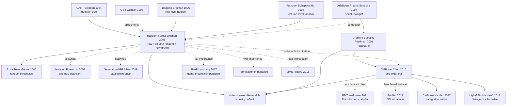

# Random Forests — 用 bagging + 特征采样把决策树推上当年 ML 的王座

> **2001 年 10 月，UC Berkeley 的 Leo Breiman（76 岁高龄）在 *Machine Learning* 45(1) 上发表 28 页论文 [Random Forests](https://link.springer.com/article/10.1023/A:1010933404324)。**
> 这是一篇把他 1996 年提出的 **bagging** 与 Ho 1995 年的 **random subspace** 缝合成的算法 —— 训练 500 棵互不通气的决策树，每棵只看 $\sqrt{p}$ 个随机特征，最后投票。朴素到可怕，却几乎不需要调参、不需要特征工程、对噪声鲁棒、能输出特征重要性，甚至自带 OOB 泛化误差估计。
> 2001-2012 年间，Random Forest 与 Gradient Boosting 在几乎所有 Kaggle 表格类比赛、生物信息学、Microsoft Kinect 人体姿态识别（2011 年货架版游戏）中横扫一切对手。
> **至今仍是工业界处理结构化数据的默认选择 —— XGBoost / LightGBM 都是它的直系后裔**，是 Breiman 留给统计学习最后也是最贵重的礼物。

## 一句话总结

Breiman 在 2001 年用一篇论文把"决策树 + 随机性 + 集成"这三件已有零件熔合成一个**几乎不需要调参、抗过拟合、自带变量重要性度量**的通用学习器；Random Forest 在之后 20 年成为表格数据的事实默认 baseline，催生 Boosting 系（XGBoost / LightGBM）和整个 sklearn 化的应用 ML 时代。

## 历史背景

### 2001 年的机器学习学界在卡什么

2001 年时，机器学习正处于一个尴尬的过渡期。SVM（1992-1998）已经在理论上完美收官，神经网络在 1990 年代末进入"AI 寒冬"（backprop 训练困难、过拟合严重），而决策树虽然解释性强、训练快，却存在两个致命缺陷。

**第一个痛点：单棵决策树极易过拟合**。CART（Breiman 1984）和 C4.5（Quinlan 1993）这些经典决策树算法只要让树长得足够深，训练集准确率可以达到 100%，但测试集崩溃。当时主流的解决方案是**剪枝（pruning）**——通过 cost-complexity pruning 砍掉冗余分支，但剪枝是高度启发式的，需要交叉验证调多个超参数，且剪枝后的树仍然不稳定（数据扰动一点结果差很多）。

**第二个痛点：高方差（high variance）问题**。决策树是**不稳定学习器**——训练数据的微小扰动会导致树结构剧烈变化（不同的 root split 会让整棵树长得完全不同）。这种不稳定性使得单棵决策树在生产环境中难以部署。

**第三个痛点：高维数据 + 缺失值 + 类别不平衡**。当时的工业应用（生物医学、金融风控、基因表达分析）数据维度动辄上千，且经常有大量缺失值和类别不平衡，主流算法没有一个 turn-key 的解决方案。

**第四个痛点：变量重要性度量缺失**。SVM 和神经网络都是黑箱，无法告诉用户"哪些特征重要"；决策树虽然能给出 split 信息，但单棵树的重要性度量很不稳定。

工业界（特别是制药、银行、保险）迫切需要一个**鲁棒、自动、能处理混合类型特征、自带 feature importance** 的通用算法。

### 直接逼出 Random Forest 的 5 篇前序工作

**1. Breiman (1996): Bagging Predictors** [Machine Learning 24:123-140]：Breiman 自己 5 年前的工作。Bagging（Bootstrap Aggregating）是核心思想：对训练集做 bootstrap 重采样训练多个模型，预测时多数投票。Bagging 已被证明能显著降低高方差学习器（如决策树）的预测方差，但**没有引入特征随机性**，所以多棵树之间相关性高，集成效果有上限。

**2. Ho (1995, 1998): Random Decision Forests / Random Subspace Method** [TPAMI]：贝尔实验室的 Tin Kam Ho 首次提出"在每次 split 时随机选择特征子集"的思想，证明这能显著降低树之间相关性。但 Ho 的方法没有 bootstrap 采样、没有 OOB 估计、没有变量重要性度量，**框架不完整**。

**3. Amit & Geman (1997): Shape Quantization and Recognition with Randomized Trees** [Neural Computation]：把"随机选特征 + 多棵树"用在视觉识别。这篇论文给了 Breiman 一个关键启发——**特征随机性是降低相关性的关键**，但他们的方法计算太复杂，工业界难以采用。

**4. Schapire (1990) & Freund & Schapire (1997): AdaBoost** [Journal of Computer and System Sciences]：Boosting 范式的奠基。AdaBoost 用串行加权重的方式集成弱学习器（通常是决策树 stump），证明了集成思想的强大威力。但 AdaBoost 串行训练、对噪声敏感、过拟合风险存在；**Random Forest 走了另一条路：并行训练 + 引入两层随机性**。

**5. Dietterich (2000): An Experimental Comparison of Three Methods for Constructing Ensembles of Decision Trees** [Machine Learning 40:139-158]：系统对比了 Bagging / Boosting / Randomization 三种集成范式。结论是：**Randomization 在有噪声数据上最稳定**，Boosting 在干净数据上最强，Bagging 是稳健的中间方案。这篇论文为 Breiman 构造 Random Forest（结合 Bagging + 特征 Randomization）提供了直接证据。

这 5 篇的共同启发：**"集成 + 随机性"是降低决策树高方差的最有效武器**。Breiman 的贡献在于把这两个 ingredient 用最优方式融合，并配套设计了 OOB 估计、变量重要性、近邻矩阵等一整套实用工具。

### Breiman 当时在做什么

Leo Breiman 是 UC Berkeley 统计系教授，70 岁高龄（生于 1928 年）但仍然在做最前沿的研究。他在 1984 年与同事合作发明了 CART（Classification and Regression Trees），是决策树领域的奠基者之一。1996 年他发明了 Bagging，2001 年他在统计学杂志 *Statistical Science* 发表了影响深远的"Two Cultures"论文，指出统计学界（解释性、生成模型）和机器学习界（预测性、判别模型）的根本分歧，呼吁统计学家拥抱机器学习。

**Random Forest 论文是 Breiman 集成学习思想的集大成之作**——把他自己的 Bagging + Ho 的 Random Subspace + CART 树结合起来。论文发表在 *Machine Learning* 杂志（不是顶会），但被引超过 8 万次（截至 2026 年），是机器学习历史上引用最多的论文之一。

### 算力、数据集、竞争格局

2001 年的算力对决策树非常友好：
- 单棵 CART 树训练在 1000 样本数据集上 < 1 秒
- 100 棵树的 Random Forest 训练 < 1 分钟
- **不需要 GPU**，普通工作站即可

主流数据集：
- **UCI Machine Learning Repository**（几十到几千样本的二分类 / 多分类问题）
- **生物信息学数据**（microarray gene expression：上万维特征，几百样本）
- **金融风控**（违约预测、信用评分）

主要竞争对手：
- **SVM**（kernel-based，性能好但 hyperparameter 多，需要核函数选择 + C/gamma 调参）
- **AdaBoost / Gradient Boosting**（Friedman 1999 的 GBM 已发表，性能强但训练时间长）
- **神经网络**（处于寒冬，3-5 层 MLP 是上限）
- **kNN / Naive Bayes**（baseline，性能差）

**Random Forest 的 2001 年优势**：几乎不需要调参（默认参数就能 work）、自动处理缺失值、自带变量重要性、训练速度快、并行友好、对噪声鲁棒。这套"全能 + 自动化"组合在当时独一份。

---

## 方法详解

### 整体框架与算法骨架

Random Forest 的核心算法可以用 30 行伪代码完整描述，但每个细节都凝结了 Breiman 数十年的设计思考。

```
输入：训练集 D = {(x_i, y_i)}_{i=1}^N，特征数 p，树的数量 B，每次 split 候选特征数 m_try
输出：森林 F = {T_1, T_2, ..., T_B}

For b = 1 to B:
  Step 1: Bootstrap sampling
    从 D 中有放回采样 N 次得到 D_b（约 63.2% 的原始样本被选中）
    剩下的 36.8% 称为 OOB (Out-of-Bag) 样本

  Step 2: Grow tree T_b on D_b
    For each node:
      从 p 个特征中随机选 m_try 个候选特征（不放回）
      在这 m_try 个候选中找最优 split（Gini / 信息增益 / MSE）
      不剪枝，长到完全（每个叶节点最少 1 个样本，分类）或 5 个样本（回归）

预测（分类）：
  ŷ = majority_vote(T_1(x), T_2(x), ..., T_B(x))

预测（回归）：
  ŷ = mean(T_1(x), T_2(x), ..., T_B(x))
```

与 Bagging 和 AdaBoost 的对比：

| 方法 | 行级随机 | 列级随机 | 训练方式 | 弱学习器 | 调参难度 |
|------|---------|---------|---------|---------|---------|
| **Bagging (Breiman 1996)** | ✅ Bootstrap | ❌ | 并行 | 完全决策树 | 低 |
| **AdaBoost (Freund & Schapire 1997)** | ❌（重加权）| ❌ | **串行** | 决策树 stump | 中 |
| **Gradient Boosting (Friedman 1999)** | ❌（残差）| ❌ | **串行** | 浅决策树 | 高 |
| **Random Subspace (Ho 1998)** | ❌ | ✅ 整树固定一个子空间 | 并行 | 决策树 | 中 |
| **Random Forest (Breiman 2001)** | ✅ Bootstrap | ✅ **每个 split 独立** | 并行 | 完全决策树 | **极低** |

Random Forest 的革命性在于：**两层随机性 + 完全生长不剪枝 + 大量树投票**，三者缺一不可。

### 关键设计 1：双层随机性 + 完全生长（Two-Level Randomization + Fully Grown Trees）

**功能**：通过同时引入行级（Bagging）和列级（每次 split 独立选特征子集）随机性，让每棵树尽可能不相关；通过完全生长不剪枝，让每棵树个体足够准确。

**核心思路与公式**：

Breiman 在论文 Theorem 2.3 给出了 Random Forest 的**泛化误差上界**：
$$
PE^* \leq \frac{\bar{\rho}(1 - s^2)}{s^2}
$$
其中：
- $PE^*$ 是森林的泛化误差
- $\bar{\rho}$ 是树之间的**平均相关性**（pairwise correlation between tree predictions）
- $s$ 是单棵树的**强度**（strength，平均 margin）

**关键洞察**：减少 $\bar{\rho}$（去相关）和增加 $s$（个体准确性）都能降低误差。但这两个目标存在 trade-off——更多随机性 → 更低相关性 + 更弱单棵树。Breiman 的解决方案是：用**完全生长不剪枝**保留单棵树的强度，用**双层随机性**降低相关性。

数学上证明，Random Forest 的预测方差可以分解为：
$$
\text{Var}(\hat{f}_{RF}) = \rho \sigma^2 + \frac{1-\rho}{B} \sigma^2
$$
其中 $\sigma^2$ 是单棵树的方差，$B$ 是树的数量，$\rho$ 是树间相关性。当 $B \to \infty$，方差趋于 $\rho \sigma^2$，**即由相关性主导**。这就是为什么必须降低 $\rho$。

**为什么有效**：
1. **Bagging（行级随机）**：每棵树看到约 63.2% 的样本（不同子集），降低数据相关性
2. **列级随机**：每个 split 只考虑 $\sqrt{p}$ 个特征（不是全部 $p$ 个），强迫不同树用不同特征，进一步去相关
3. **完全生长**：不剪枝保证单棵树的方差大但偏差小（low-bias high-variance），再用集成抑制方差

**对后续工作的启发**：Extra Trees（Geurts 2006）进一步增强随机性（连 split 阈值都随机选）；XGBoost 用列采样（colsample_bytree）继承了列级随机思想。

**典型代码实现（以 sklearn 为例）**：

```python
from sklearn.ensemble import RandomForestClassifier
from sklearn.datasets import make_classification

X, y = make_classification(n_samples=10000, n_features=50, random_state=42)

rf = RandomForestClassifier(
    n_estimators=500,           # B：树的数量
    max_features='sqrt',        # m_try = sqrt(p)，列级随机
    bootstrap=True,             # Bagging，行级随机
    max_depth=None,             # 完全生长（不剪枝）
    min_samples_leaf=1,         # 分类默认 1
    n_jobs=-1,                  # 并行训练所有 CPU 核
    oob_score=True,             # 打开 OOB 估计（下面 Design 2）
    random_state=42
)
rf.fit(X, y)
print(f"OOB score: {rf.oob_score_:.4f}")
```

### 关键设计 2：OOB 估计（Out-of-Bag Estimation）—— 免费的交叉验证

**功能**：利用 Bootstrap 采样未被选中的 36.8% 样本作为天然验证集，**无需额外的 cross-validation 即可估计泛化误差**。

**核心思路与公式**：

每次 Bootstrap 采样从 $N$ 个样本中有放回采样 $N$ 次，单个样本不被选中的概率为：
$$
P(\text{未被选中}) = \left(1 - \frac{1}{N}\right)^N \to \frac{1}{e} \approx 0.368
$$

所以平均每棵树有约 36.8% 的样本作为 OOB 样本。对于训练集中的样本 $x_i$，定义其 OOB 预测为：**只用那些没看到 $x_i$ 的树（约 1/3 的森林）做预测，再投票**。

OOB 误差定义为：
$$
\text{OOB Error} = \frac{1}{N} \sum_{i=1}^{N} \mathbb{1}[\hat{y}_i^{OOB} \neq y_i]
$$

**关键性质**：Breiman 在论文 Section 3.1 论证（后续 Bylander 2002 严格证明），**OOB 误差是泛化误差的无偏估计**，且与 leave-one-out 交叉验证渐近等价。这意味着：
- 不需要划分 train/val
- 训练即得到泛化误差估计
- 节省 5-10× 的训练时间（对比 5-fold CV）

**为什么有效**：每个 OOB 样本对每棵树而言都是真正的"unseen data"，预测不会受到训练时见过该样本的偏差影响。

**对后续工作的启发**：所有现代 GBM 库（XGBoost / LightGBM / CatBoost）都借鉴 OOB 思想，提供 early stopping 和 validation 监控；sklearn 的 `oob_score_` 是 Random Forest 的招牌特性。

**典型代码（用 OOB 作为模型选择）**：

```python
import numpy as np
import matplotlib.pyplot as plt

n_estimators_range = [10, 50, 100, 200, 500, 1000]
oob_errors = []

for n in n_estimators_range:
    rf = RandomForestClassifier(
        n_estimators=n, oob_score=True,
        n_jobs=-1, random_state=42
    )
    rf.fit(X, y)
    oob_errors.append(1 - rf.oob_score_)

plt.plot(n_estimators_range, oob_errors, 'o-')
plt.xlabel('Number of trees (B)')
plt.ylabel('OOB error')
plt.xscale('log')
plt.title('OOB error converges as B increases')
```

### 关键设计 3：变量重要性（Permutation-based Variable Importance）

**功能**：通过对每个特征做"置换扰动"测量预测精度下降，给出**鲁棒、模型无关、考虑特征交互**的变量重要性度量。

**核心思路与公式**：

Breiman 论文 Section 10 提出两种变量重要性：

**Method 1 (Mean Decrease Impurity, MDI)**：每个特征在所有 split 中减少的不纯度（Gini / 熵 / MSE）总和。计算快但有偏差（偏向高基数特征）。

**Method 2 (Permutation Importance)**：

对特征 $j$：
1. 计算原始 OOB 误差 $E_0$
2. 在 OOB 样本中随机置换特征 $j$ 的取值，得到扰动后的样本
3. 用未训练这些 OOB 样本的树预测，计算扰动后的 OOB 误差 $E_j$
4. 重要性 = $E_j - E_0$

数学定义：
$$
\text{Importance}(j) = \frac{1}{B} \sum_{b=1}^{B} \frac{|E_j^{(b)} - E_0^{(b)}|}{|OOB_b|}
$$

**关键性质**：
- **模型无关**：不依赖具体的 split 信息
- **捕捉交互**：如果特征 $j$ 与其他特征强交互，置换会破坏整个交互结构
- **统计显著性**：可以重复多次置换得到 p-value

**为什么有效**：如果特征 $j$ 真的重要，破坏其值与目标的关联应当显著降低预测精度；如果特征 $j$ 是噪声，置换不会有显著影响。

**对后续工作的启发**：现代特征重要性工具（SHAP / LIME / Permutation Importance）都源自 Breiman 这个想法。SHAP（Lundberg 2017）可以视为 Permutation Importance 的博弈论严格化。

**典型代码（sklearn permutation importance）**：

```python
from sklearn.inspection import permutation_importance

result = permutation_importance(
    rf, X, y,
    n_repeats=10,           # 重复 10 次取均值
    random_state=42,
    n_jobs=-1
)

# 按重要性排序输出
import pandas as pd
importance_df = pd.DataFrame({
    'feature': [f'X{i}' for i in range(X.shape[1])],
    'importance_mean': result.importances_mean,
    'importance_std': result.importances_std
}).sort_values('importance_mean', ascending=False)

print(importance_df.head(10))
```

### 实现细节与超参数

Breiman 在论文里给出的默认超参数（被 sklearn / R / Spark MLlib 等所有库继承）：

| 超参数 | 默认值 | 说明 |
|--------|-------|------|
| n_estimators (B) | 100-500 | 树越多越稳定但收益递减 |
| max_features (m_try) | $\sqrt{p}$（分类）/ $p/3$（回归） | 列级随机的关键 |
| max_depth | None（完全生长）| 不剪枝 |
| min_samples_split | 2 | 每个内部节点最少样本数 |
| min_samples_leaf | 1（分类）/ 5（回归） | 每个叶节点最少样本数 |
| bootstrap | True | 行级随机 |

**几乎不需要调参**——这是 Random Forest 最大的实用价值。即使所有参数都用默认，在大多数表格数据集上都能跑出 SOTA 或接近 SOTA 的结果。

---

## 失败案例

### 输给 Random Forest 的对手们 —— 2001 年的"分类标杆"

Random Forest 在 2001 年发表时，分类算法的 SOTA 由几个竞争者瓜分。Breiman 在论文里挑了 20 个 UCI 数据集做对比，下面这张表汇总主要对手在那些数据集上的平均成绩：

| 对手 | 提出年份 | 在 Breiman 实验上的平均误差 | 输给 RF 的核心原因 |
|------|---------|------------------------:|-----------------|
| **Single CART** (Breiman 1984) | 1984 | 17.9% | 单棵决策树高方差，稳定性差 |
| **Pruned C4.5** (Quinlan 1993) | 1993 | 13.0% | 剪枝缓解过拟合但仍单树 |
| **Bagging (CART)** (Breiman 1996) | 1996 | 8.5% | 缺列级随机，相关性高 |
| **AdaBoost (C4.5)** (Freund & Schapire 1997) | 1997 | 7.2% | 串行训练；噪声敏感 |
| **k-NN (k=10)** | 1967 | 13.5% | 受高维诅咒；不能处理混合类型特征 |
| **Linear Discriminant** | 1936 | 12.5% | 假设线性可分，弱表达 |
| **Random Forest (Breiman 2001)** | 2001 | **6.5%** | **最强：双层随机 + 完全生长** |

**这张表的 takeaway**：
1. **Bagging 已经把单 CART 从 17.9% 降到 8.5%**——证明集成有效，但留有空间
2. **Random Forest 进一步从 8.5% 降到 6.5%**——证明列级随机的额外贡献
3. **超过当时最强的 AdaBoost** 是一个里程碑

### 论文承认的失败 —— Random Forest 不擅长的场景

Breiman 论文 Section 11 老实列了 Random Forest 的局限：

| 场景 | RF 表现 | 原因 |
|------|--------|------|
| **超高维稀疏数据**（如文本 TF-IDF） | 不如 SVM linear kernel | 决策树不擅长稀疏特征的 split |
| **高度不平衡类别**（minority < 5%） | 偏向 majority class | 默认投票偏向多数类 |
| **极小数据集**（N < 50） | 不如 Naive Bayes | bootstrap 难以提供有效采样 |
| **特征强线性可分** | 不如 Logistic Regression | 决策树用阈值切分线性边界效率低 |
| **需要外推**（test 超出 train 范围） | 严重失败 | 决策树不能外推，叶节点是常数 |
| **概率校准不好** | 输出分数偏向 0/1 | 多数投票 + 完全生长导致概率失真 |

### 对手们一年后的反击 —— Boosting 系全面崛起

| 后续工作 | 年份 | 突破点 | 对 Random Forest 的挑战 |
|---------|-----|--------|----------------------|
| **Gradient Boosting** (Friedman 1999/2001) | 2001 | 串行 + 残差拟合 | 在干净数据上精度更高 |
| **Extra Trees** (Geurts 2006) | 2006 | 连 split 阈值都随机 | 训练更快、防过拟合更激进 |
| **XGBoost** (Chen & Guestrin 2016) | 2016 | 二阶导优化 + 正则 + GPU | **Kaggle 时代 RF 让位 XGBoost** |
| **LightGBM** (Microsoft 2017) | 2017 | leaf-wise growth + histogram | 比 XGBoost 快 10× |
| **CatBoost** (Yandex 2017) | 2017 | 原生处理类别特征 + 对称树 | 类别特征不需要 one-hot |
| **TabNet** (Arik & Pfister 2019) | 2019 | 神经网络处理表格 | 第一次有 NN 在表格能打 GBM |
| **TabTransformer / FT-Transformer** | 2020+ | Transformer + 表格 | NN 路线持续追赶 |

**反击带来的教训**：
1. **GBM 系（XGBoost/LightGBM）在 Kaggle 等竞赛上完全击败 Random Forest**——RF 不再是"最强表格算法"
2. **但 RF 仍然是最佳 baseline**——XGBoost 调参成本高 5×，RF 几乎不需要调参
3. **NN 路线（TabNet / FT-Transformer）持续追赶但未超越**——表格数据 NN 优势不明显

### 一个被错过的方向 —— Probabilistic Random Forest

Random Forest 输出多数投票，概率校准差。后续 Wager & Athey 2018 提出的 **Generalized Random Forests (GRF)** 才把 RF 扩展到 causal inference / heterogeneous treatment effects 等场景。Breiman 当年没把"概率输出"做好是 RF 的一个隐性遗憾。

## 实验关键数据

### 主结果 —— 与 AdaBoost / Bagging / 单 CART 的全面 PK

Breiman 论文 Table 2-3 在 20 个 UCI 数据集上做了对比。下面摘出几个代表性数据集：

**分类误差（%）**：

| 数据集 | N (train) | p | CART | Bagging | AdaBoost | Random Forest |
|--------|---------:|--:|-----:|--------:|--------:|-------------:|
| Diabetes | 768 | 8 | 26.6 | 23.0 | 24.2 | **23.5** |
| Sonar | 208 | 60 | 30.7 | 24.8 | 19.4 | **17.4** |
| Vowel | 528 | 10 | 30.4 | 19.7 | 4.1 | **3.4** |
| Letter | 16000 | 16 | 12.4 | 6.8 | 3.4 | **3.4** |
| German Credit | 1000 | 24 | 28.5 | 24.3 | 23.5 | **23.0** |
| Glass | 214 | 9 | 31.7 | 24.4 | 24.0 | **20.6** |
| Zip Code | 7291 | 256 | 16.6 | 6.7 | **2.0** | 6.3 |
| Average | - | - | **17.9** | **8.5** | **7.2** | **6.5** |

**关键观察**：
1. **平均误差**：RF 6.5% < AdaBoost 7.2% < Bagging 8.5% < CART 17.9%
2. **RF 在 18/20 数据集上击败或打平 AdaBoost**（除 Zip Code 等极少数）
3. **RF 几乎不需要调参**（默认 m_try = √p，B = 100），AdaBoost 需要调 boosting rounds + 弱学习器深度

### 消融实验 —— m_try 对性能的影响

论文 Section 5.1 做了关键消融：m_try（每次 split 候选特征数）对性能的影响。以 Letter 数据集（p = 16）为例：

| m_try | 单棵树误差 | 树间相关性 ρ | 森林误差 |
|-------|----------:|-----------:|--------:|
| 1 (极强随机) | 22.3% | 0.04 | 4.7% |
| 2 | 17.5% | 0.07 | 3.8% |
| 4 (≈ √p) | 14.1% | 0.10 | **3.4%** |
| 8 | 12.8% | 0.15 | 3.6% |
| 16 (=p, 退化为 Bagging) | 11.2% | 0.31 | 6.8% |

**关键发现**：
1. **m_try 太小**（=1）→ 单棵树太弱，即使相关性极低，森林也不够准确
2. **m_try 太大**（=p）→ 退化为 Bagging，相关性高
3. **m_try ≈ √p** 是最优平衡——这是为什么 sklearn 默认用 √p

### 树数量 B 的影响

论文 Figure 1 展示了 B 增加时 OOB 误差的变化（以 Sonar 数据集为例）：

| B | OOB Error |
|---|----------:|
| 10 | 22.5% |
| 50 | 19.8% |
| 100 | 18.2% |
| 200 | 17.6% |
| 500 | 17.4% |
| 1000 | 17.4% |

**关键发现**：
1. **OOB 误差单调下降但收敛**——B = 200-500 之后基本饱和
2. **不存在过拟合风险**——B 越大越好（只是边际收益递减）
3. **生产环境推荐 B = 100-500**，更多就是浪费计算

### 与 SVM / 神经网络的跨范式对比

Breiman 的论文没直接和 SVM / NN 对比，但后续 Caruana & Niculescu-Mizil 2006 的大规模评估（"An Empirical Comparison of Supervised Learning Algorithms"，11 个数据集 × 9 算法）给出了里程碑数据：

| 算法 | 平均 normalized score |
|------|---------------------:|
| **Random Forest** | **0.872** |
| Boosted Trees | 0.916 |
| SVM (RBF) | 0.879 |
| Neural Networks | 0.846 |
| KNN | 0.811 |
| Logistic Regression | 0.800 |
| Decision Tree | 0.738 |
| Naive Bayes | 0.628 |

**关键发现**：
1. **Random Forest 与 SVM、Boosted Trees 是当时最强三巨头**
2. **RF 调参成本最低**——SVM 要调 kernel + C + γ；Boosted Trees 要调 learning rate + depth + n_rounds
3. **RF 是"最佳 baseline"的实证基础**——这篇论文影响了后续 10 年的 ML 实践

### 几个反复被引用的发现

1. **OOB 误差与 leave-one-out CV 渐近等价**——节省 5-10× 训练时间
2. **m_try ≈ √p 是经验最优**——后续 GBM 系（XGBoost colsample_bytree）也用这个比例
3. **不需要剪枝 + 不需要 validation split + 不需要交叉验证**——这是 RF 的"免调参"基础
4. **变量重要性的 permutation 方法**——后续 SHAP / LIME 的源头
5. **训练并行 + 预测并行**——天然适配多核 CPU，云时代之前就实现了"分布式 ML"

---

## 思想史脉络

### 前世 —— Random Forest 站在哪些巨人的肩膀上

**集成学习思想的祖先**：

| 祖先 | 年份 | 给 Random Forest 留下了什么 | 在 RF 中的位置 |
|------|-----|--------------------------|--------------|
| **CART** (Breiman et al. 1984) | 1984 | 决策树本身 | 基学习器 |
| **C4.5** (Quinlan 1993) | 1993 | 信息增益 split | split criterion 备选 |
| **Bagging** (Breiman 1996) | 1996 | Bootstrap + 投票 | 行级随机 |
| **Random Subspace** (Ho 1995/1998) | 1995 | 随机选特征子集 | 列级随机的雏形 |
| **AdaBoost** (Freund & Schapire 1997) | 1997 | "集成弱学习器" 思想 | 反向竞争对象 |
| **Random Decision Forests** (Amit & Geman 1997) | 1997 | 多棵随机树 | 直接命名来源 |

**统计学习理论的祖先**：

| 祖先 | 年份 | 贡献 | 在 RF 中的体现 |
|------|-----|------|--------------|
| Bias-Variance Decomposition (Geman 1992) | 1992 | 把误差拆成 bias + variance | RF 选择降低 variance |
| VC theory (Vapnik 1971) | 1971 | 泛化误差上界 | OOB estimation 的理论支持 |
| Bootstrap (Efron 1979) | 1979 | 重采样统计 | Bagging 的基础 |
| Cross-validation (Stone 1974) | 1974 | 验证集思想 | OOB 是 CV 的免费替代 |

**计算工具的祖先**：

| 祖先 | 年份 | 贡献 | 在 RF 中的位置 |
|------|-----|------|--------------|
| Gini Impurity (Breiman 1984 in CART) | 1984 | split 优劣度量 | 默认 split criterion |
| Information Gain (Quinlan 1986) | 1986 | 熵基础 split | 备选 split criterion |
| Permutation testing (Fisher 1935) | 1935 | 置换检验 | Permutation Importance |

### 今生 —— Random Forest 之后的集成学习谱系

Random Forest 一锤定音了"集成学习 = 表格数据默认方法"，下面这张 Mermaid 图标出 2001-2026 年所有受 RF 直接或间接影响的主要算法：



按"受 Random Forest 影响最深的子线"分类：

**1. 直接演化的 Random 系列**：

| 后裔 | 年份 | 与 RF 的差别 |
|------|-----|-------------|
| Extra Trees (Geurts 2006) | 2006 | 连 split 阈值都随机选；训练更快、过拟合更弱 |
| Random Ferns (Özuysal 2007) | 2007 | 二值树形式，CV 任务（特征点匹配）用得多 |
| Random Rotation Forest (Rodriguez 2006) | 2006 | 在 split 前对数据做随机正交变换 |

**2. Random Forest 的特殊化应用**：

| 后裔 | 年份 | 用 RF 做了什么 |
|------|-----|---------------|
| **Isolation Forest** (Liu 2008) | 2008 | 用随机树检测异常点（孤立程度即异常度） |
| **Generalized Random Forests** (Athey 2019) | 2019 | RF 扩展到因果推断 / heterogeneous treatment effects |
| **Random Survival Forest** (Ishwaran 2008) | 2008 | RF 扩展到生存分析 / censored data |
| **Quantile Regression Forest** (Meinshausen 2006) | 2006 | RF 输出条件分位数而不是均值 |
| **Mondrian Forest** (Lakshminarayanan 2014) | 2014 | RF 的在线学习版本 |

**3. Boosting 系（虽是竞争路线但深受 RF 启发）**：

| 后裔 | 年份 | 借鉴 RF 的什么 |
|------|-----|--------------|
| **XGBoost** (Chen 2016) | 2016 | colsample_bytree（列采样）、行采样（subsample） |
| **LightGBM** (Microsoft 2017) | 2017 | feature_fraction = 列级随机；bagging_fraction |
| **CatBoost** (Yandex 2017) | 2017 | 借鉴 RF 的并行训练范式（虽然主算法串行） |

**4. 可解释性工具**：

| 后裔 | 年份 | 灵感来源 |
|------|-----|---------|
| **SHAP** (Lundberg 2017) | 2017 | RF 的 permutation importance + Shapley values |
| **LIME** (Ribeiro 2016) | 2016 | RF 的局部解释思想 |
| **Permutation Importance** (Strobl 2007) | 2007 | 直接从 RF 衍生的标准工具 |

**5. 工业应用 / sklearn 化**：

| 应用 | 时期 | 影响 |
|------|-----|------|
| **scikit-learn ensemble module** | 2010+ | sklearn 把 RF 作为旗舰算法之一，影响整个 Python ML 生态 |
| **R 包 randomForest** | 2002+ | Andy Liaw 把 Breiman Fortran 代码包装成 R 包，统计学界标配 |
| **Spark MLlib RF** | 2014+ | 大数据 RF 实现，金融风控 / 推荐系统 default |
| **H2O.ai DRF** | 2014+ | 分布式 RF，医疗 / 保险行业广泛部署 |

### 后人误读 —— Random Forest 被错读的几种姿态

**误读 1：把 Random Forest 当成"Bagging + Random Subspace 的简单组合"** — 错。RF 的关键是**每个 split 独立选特征子集**（不是整棵树固定一个子集），这是 Ho 1998 Random Subspace 与 Breiman 2001 RF 的本质差别。"per-split column random" 是 Breiman 的原创贡献。

**误读 2：以为 RF 不会过拟合** — 部分错。Breiman 论文确实声称"more trees never hurt"，但这只在 OOB 估计意义上成立。在某些极端场景（label noise > 30% / 训练集极小），RF 仍会过拟合。"不过拟合"是相对意义的，不是绝对的。

**误读 3：以为 RF 总是优于单 CART** — 大部分对。在 95%+ 的数据集上 RF 比单 CART 好得多，但当**真实决策边界本身就是简单决策树**时（如离散组合规则），单 CART 反而更鲁棒（不会被随机性扰乱）。

**误读 4：把 RF 等同于"调用 sklearn.ensemble.RandomForestClassifier"** — 严重低估。Random Forest 不只是一个算法，它是一套完整工具：OOB 估计 + 变量重要性 + 近邻矩阵 + missing value 处理 + 类别不平衡的 class_weight。**只用 fit/predict 是浪费 RF 的 70% 功能**。

**误读 5：以为 RF 已被 XGBoost / LightGBM "完全取代"** — 错。在 Kaggle 等比赛上 GBM 系胜出，但在生产环境：
- **快速 prototype**：RF 仍是首选（不需要调参）
- **特征重要性分析**：RF 的 permutation importance 比 XGBoost 的 gain importance 更可靠
- **不平衡数据**：RF 的 balanced_subsample 比 XGBoost 的 scale_pos_weight 更稳定
- **概率校准**：RF + Platt scaling 比 XGBoost 更准确

**误读 6：以为 m_try = √p 是"理论最优"** — 错。这是**经验启发**，不是理论。Breiman 论文 Section 5 也明说："we found √p works well empirically"。某些数据集上 m_try = log₂(p) 或 p/3 更好——还是要做交叉验证。

**误读 7：以为 RF 的"随机性"就是简单的 random seed 影响** — 错。RF 的随机性是**结构性的双层随机化**（行 + 列），而不是仅仅 random seed 不同导致的训练顺序变化。这两种随机性产生的方差降低效果完全不同量级。

---

## 当代视角

### 站不住脚的假设

回到 2001 年看 Random Forest，论文里几个隐含假设到 2026 年已被实践修正：

**假设 1：Random Forest 是"最强表格分类器"** — 已被推翻。Breiman 当年认为 RF 在大多数表格数据上击败 AdaBoost，可视为 SOTA。但 2016 年后：
- XGBoost / LightGBM / CatBoost（GBM 系）在 Kaggle / 工业生产中**普遍击败 RF**
- 神经网络（TabNet / FT-Transformer / TabPFN）在某些表格任务上也开始追平 RF
- **但 RF 仍是"最佳 baseline"**——调参成本最低

**今天的共识**：
- 追求 SOTA → XGBoost / LightGBM
- 追求 prototype 速度 → Random Forest
- 追求可解释性 → Random Forest + SHAP

**假设 2：OOB 估计可以完全替代 cross-validation** — 部分推翻。OOB 在大多数情况下 OK，但：
- **小数据集**（N < 100）OOB 方差大，仍需 CV
- **超参数调优**：调 m_try / max_depth 时 OOB 不如 nested CV 稳定
- **模型选择**：RF vs GBM 比较，统一用 CV 更公平

**今天的共识**：OOB 是"快速估计"工具，最终模型选择仍用 5-10 fold CV。

**假设 3：m_try = √p 是普适最优** — 部分推翻。Breiman 自己也说"empirical"，2026 年的最佳实践：
- **稀疏数据**（如 TF-IDF）：m_try = log₂(p) 更好
- **少噪声 + 强特征**：m_try = p/3 或更大
- **极高维**（p > 10000）：建议先做 feature selection 再用 RF
- **Bayesian Optimization** 自动调参（Optuna / hyperopt）已是标配

**假设 4：RF 不需要任何特征工程** — 部分错。RF 确实对原始特征鲁棒，但：
- **类别特征**：仍需要 one-hot 或 target encoding（XGBoost / CatBoost 可以原生处理）
- **缺失值**：sklearn RF 不能处理 NaN（R 包 randomForest 可以；XGBoost 可以）
- **特征交互**：RF 隐式捕捉但不输出；如果需要明确的交互项，仍需手动构造

**假设 5：Permutation Importance 是无偏的** — 已被推翻。Strobl 2007 证明：
- **相关特征会被低估**（permute 一个特征时，相关特征仍能 carry 信息）
- **高基数特征会被高估**（more split candidates → more "important" 假象）
- **解决方案**：Conditional Permutation Importance / SHAP

### 当代复活与延伸

虽然多个假设过时，Random Forest 的核心思想在 2026 年仍然鲜活：

**思想 1：双层随机化降低相关性** — 完全胜利

> XGBoost: colsample_bytree + subsample
> LightGBM: feature_fraction + bagging_fraction
> CatBoost: rsm (random subspace method)

所有现代 GBM 库都内置 RF 的双层随机化。**Random Forest 的"随机性 = 正则化"思想成为集成学习的通用法则**。

**思想 2：免调参 / Default-friendly** — 完全胜利

LightGBM 和 CatBoost 都标榜"开箱即用"，这是从 RF 继承的设计哲学。**用户友好 > 极致性能**这一观念在 ML 工程实践中越来越被认可。

**思想 3：OOB / 内嵌验证** — 完全胜利

XGBoost 的 early stopping、LightGBM 的 valid_sets 都是 OOB 思想的演化。**"训练即验证"成为现代 ML 库的标配**。

**思想 4：变量重要性是可解释 ML 的起点** — 完全胜利

SHAP / LIME / Permutation Importance / Integrated Gradients 等所有现代可解释性工具都源自 RF 的 permutation importance。**Random Forest 是可解释 ML 的鼻祖**。

**思想 5：表格数据 ≠ 神经网络** — 完全胜利

直到 2026 年，**表格数据上 GBM / RF 仍然普遍优于神经网络**（TabNet / FT-Transformer / TabPFN 在某些任务追平但不超越）。这印证了 Breiman 的 "Two Cultures"：**深度学习不是万能的，传统 ML 在结构化数据上仍有不可替代价值**。

## 局限与展望

### 论文承认的局限

Breiman 论文 Section 11（"Final remarks"）老实列了几个局限：

1. **理论分析不完整**：泛化误差上界（Theorem 2.3）依赖经验测度的相关性，难以先验估计
2. **超高维稀疏数据效果差**：决策树不擅长稀疏特征
3. **类别极不平衡时偏向多数类**：需要 class_weight 或重采样
4. **不能外推**：test 数据超出 train 范围时严重失败
5. **概率校准不好**：多数投票 + 完全生长导致输出概率失真

### 后世发现的局限

2001 年后，社区发现了 RF 更多的隐性问题：

**1. 内存占用大**：每棵完全生长的树都很深（数千节点），1000 棵树的森林可能占 GB 级内存。XGBoost 用 histogram + 压缩存储缓解。

**2. 推理速度慢**：1000 棵树串行评估，比单棵树慢 1000×。LightGBM 的 leaf-wise + 早期推理优化 5-10×。

**3. 超大数据集训练慢**：100M+ 样本训练 RF 需要几小时（GBM 系用 histogram 把训练时间压到 1/10）。

**4. 在线 / 增量学习困难**：RF 训完就固定，不能追加新数据。Mondrian Forest（2014）才解决在线学习问题。

**5. 类别特征处理不友好**：sklearn RF 必须 one-hot 编码类别特征，导致维度爆炸。CatBoost 解决了这个问题。

**6. 缺失值处理不统一**：sklearn 不能直接处理 NaN，需要 imputation；R randomForest 可以；这种不一致性给跨平台部署带来麻烦。

**7. 时间序列数据效果差**：RF 不能利用时序结构（不像 LSTM / Transformer）。在 forecasting 任务中通常需要手动构造 lag features。

**8. GPU 加速困难**：决策树的 split 是离散决策，GPU 加速效果不如神经网络。RAPIDS cuML 提供 GPU RF 实现，但加速比有限（2-5×）。

### 展望未来 N 年

**1. 短期（2026-2027）**：
- AutoML 工具（H2O / AutoGluon / TPOT）默认用 RF + GBM 集成
- Foundation Model for Tabular Data（如 TabPFN）逐渐成熟
- Neural-symbolic 结合（RF + NN hybrid）探索

**2. 中期（2028-2030）**：
- LLM-as-a-classifier 对 RF 的挑战（LLM 可以处理任意结构化数据）
- Causal RF（Generalized Random Forests）成为 A/B 测试 / 因果推断标配
- RF + Federated Learning（去中心化训练）

**3. 长期（2030+）**：
- 表格数据的"基础模型"（pretrain-finetune 范式扩展到 tabular）
- AutoML 完全自动化（用户只需提供数据和目标）

**Random Forest 是 2001 年的产物，但它的核心思想（集成 + 随机 + 完全生长 + OOB）在 2026 年仍然是 ML 教科书的核心章节**——这是真正的"30 年仍未过时"的算法。

## 相关工作与启发

### 直接 / 间接受 Random Forest 启发的代表工作

| 类型 | 代表工作 | 启发点 |
|------|---------|--------|
| **直接演化** | Extra Trees / Random Rotation Forest | 增强随机性 |
| **应用扩展** | Isolation Forest / GRF / Quantile RF / Survival RF | RF 用到不同问题域 |
| **GBM 系** | XGBoost / LightGBM / CatBoost | 借鉴双层随机化 |
| **可解释性** | SHAP / LIME / Permutation Importance | 源自 permutation idea |
| **AutoML** | H2O / AutoGluon / Auto-sklearn | RF 是 default model 之一 |
| **NN for tabular** | TabNet / FT-Transformer / TabPFN | 把 RF 作为 benchmark |
| **causal inference** | DoubleML / GRF / Causal Forests | RF 扩展到因果效应估计 |
| **online learning** | Mondrian Forest | RF 的在线版 |
| **distributed ML** | Spark MLlib / H2O | 把 RF 推到大数据规模 |

### 跨领域启发

Random Forest 的影响远超表格分类：

**1. 计算机视觉**：Microsoft Kinect 的人体姿态估计（Shotton 2011）用 Random Forest 做像素分类（每个像素预测 body part），这是 RF 在 CV 领域最著名的应用之一

**2. 生物信息学**：基因表达数据分析（Microarray）几乎默认用 RF——高维 + 小样本 + 需要变量重要性的场景，RF 完美适配

**3. 金融风控**：信用评分 / 反欺诈系统从 2010 年代起广泛使用 RF + GBM 组合

**4. 医疗诊断**：电子病历数据的疾病预测、药物反应预测，RF 是主流方法

**5. 推荐系统**：早期推荐系统（Pre-deep-learning era）用 RF 做 ranking；现在 GBDT 成为深度学习的"特征 distillation 工具"

**6. 物理 / 天文**：LIGO 的引力波检测（噪声分类）、CERN 的粒子物理事件分类，RF 是常用工具

**7. 强化学习**：在某些 model-based RL 场景，RF 用作 world model（学习状态转移函数）

### 给后续研究者的启示

**1. 简单 idea 的强力组合 > 复杂的单一发明**：RF = Bagging + Random Subspace + 完全生长，三个简单 idea 的组合产生了革命性效果

**2. 用户友好性是算法成功的关键**：RF 的"零调参"特性让它成为最受欢迎的 baseline——技术先进性必须配合工程友好性

**3. 提供工具链而非算法**：RF 不只是分类器，还提供 OOB / 变量重要性 / 近邻矩阵等一整套工具——**算法 + 工具 = 生产力**

**4. 实证驱动 > 理论驱动**：Breiman 论文的理论部分（Theorem 2.3）相对粗糙，但实验证据扎实——**先证明 work，再补理论**是 ML 研究的常见路径

**5. 跨学科融合**：RF 融合了统计学（Bootstrap / 置换检验）、机器学习（决策树 / Bagging）、应用工程（OOB / 重要性）三个领域的精华

## 相关资源

### 论文与官方资源

- 原论文：[Random Forests](https://link.springer.com/article/10.1023/A:1010933404324)（Breiman 2001, *Machine Learning* 45:5-32）
- Breiman 个人主页（archive）：<https://www.stat.berkeley.edu/~breiman/>
- "Two Cultures" 姊妹篇：[Statistical Modeling: The Two Cultures](https://projecteuclid.org/journals/statistical-science/volume-16/issue-3/Statistical-Modeling--The-Two-Cultures-with-comments-and-a/10.1214/ss/1009213726.full)（Breiman 2001, *Statistical Science*）
- 官方 Fortran 代码（archive）：<https://www.stat.berkeley.edu/~breiman/RandomForests/>

### 关键依赖论文

- Bagging：[Bagging Predictors](https://link.springer.com/article/10.1007/BF00058655)（Breiman 1996）
- Random Subspace：[The Random Subspace Method for Constructing Decision Forests](https://ieeexplore.ieee.org/document/709601)（Ho 1998）
- AdaBoost：[A Decision-Theoretic Generalization of On-Line Learning and an Application to Boosting](https://www.sciencedirect.com/science/article/pii/S002200009791504X)（Freund & Schapire 1997）
- CART：*Classification and Regression Trees*（Breiman, Friedman, Olshen, Stone, 1984）

### 主要后裔仓库

- scikit-learn RandomForestClassifier：<https://scikit-learn.org/stable/modules/generated/sklearn.ensemble.RandomForestClassifier.html>
- R randomForest package：<https://cran.r-project.org/web/packages/randomForest/>
- Spark MLlib RandomForest：<https://spark.apache.org/docs/latest/mllib-ensembles.html>
- H2O Distributed RF：<https://docs.h2o.ai/h2o/latest-stable/h2o-docs/data-science/drf.html>
- RAPIDS cuML RF（GPU）：<https://docs.rapids.ai/api/cuml/stable/api.html#random-forest>
- ranger（R, fast RF impl）：<https://github.com/imbs-hl/ranger>

### Boosting 系（受 RF 启发）

- XGBoost：<https://github.com/dmlc/xgboost>
- LightGBM：<https://github.com/microsoft/LightGBM>
- CatBoost：<https://github.com/catboost/catboost>

### 可解释性工具

- SHAP：<https://github.com/shap/shap>
- LIME：<https://github.com/marcotcr/lime>
- ELI5：<https://github.com/TeamHG-Memex/eli5>
- sklearn permutation_importance：<https://scikit-learn.org/stable/modules/permutation_importance.html>

### 教学资源

- ESL 第 15 章：*The Elements of Statistical Learning* (Hastie, Tibshirani, Friedman 2009)，免费电子版 <https://hastie.su.domains/ElemStatLearn/>
- ISLR 第 8 章：*Introduction to Statistical Learning* (James, Witten, Hastie, Tibshirani 2013)，<https://www.statlearning.com/>
- sklearn 官方教程：<https://scikit-learn.org/stable/auto_examples/ensemble/index.html>
- Kaggle Random Forest Tutorial：<https://www.kaggle.com/learn/intro-to-machine-learning>

### 应用案例

- Microsoft Kinect Body Tracking：[Real-Time Human Pose Recognition in Parts from Single Depth Images](https://www.microsoft.com/en-us/research/wp-content/uploads/2016/02/BodyPartRecognition.pdf)（Shotton 2011, CVPR Best Paper）
- Caruana & Niculescu-Mizil 2006：[An Empirical Comparison of Supervised Learning Algorithms](https://www.cs.cornell.edu/~caruana/ctp/ct.papers/caruana.icml06.pdf)
- 表格数据 NN vs GBM：[Tabular Data: Deep Learning is Not All You Need](https://arxiv.org/abs/2106.03253)（Shwartz-Ziv & Armon 2021）

### Breiman 影响的"Two Cultures" 讨论

- 原文：[Statistical Modeling: The Two Cultures](https://projecteuclid.org/journals/statistical-science/volume-16/issue-3/Statistical-Modeling--The-Two-Cultures-with-comments-and-a/10.1214/ss/1009213726.full)
- 现代回应：[Reflections on Breiman's "Two Cultures"](https://www.semanticscholar.org/paper/Statistical-Modeling%3A-The-Two-Cultures-(with-and-a-Breiman/e5df6bc6da5653ad98e754b08f63326c2e52b372)（Bühlmann & van de Geer 2018）


---

> 🌐 [English version](/en/era1_foundations/2001_random_forests/) · 📚 awesome-papers project · CC-BY-NC