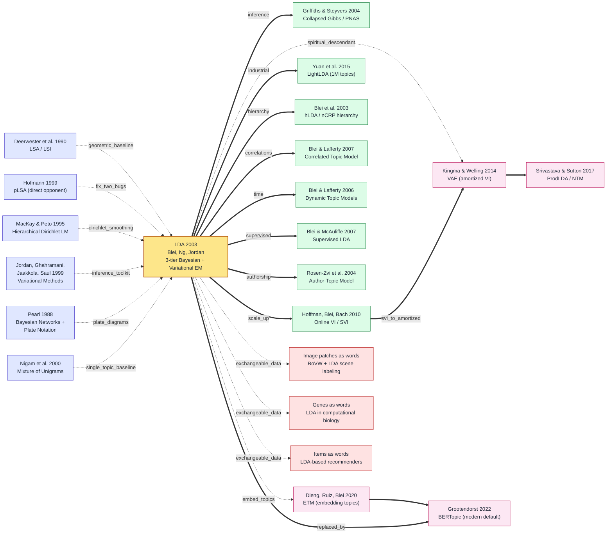

# Latent Dirichlet Allocation

---

> **2003 年 1 月，UC Berkeley 的 David Blei 与 Andrew Ng（已入职 Stanford）+ 导师 Michael Jordan 三位作者在 [*Journal of Machine Learning Research* 3:993-1022](https://www.jmlr.org/papers/v3/blei03a.html) 上发表 30 页长文 *Latent Dirichlet Allocation*。**
> 这是一篇被 SIGIR 而非 ICML 圈里最先嗅到味道的论文 —— 用三层贝叶斯生成模型 + 一套 Variational EM 推断算法，把 Hofmann 1999 pLSA 的"参数量随语料线性膨胀 + 新文档无法分配主题"两条死结一次解开，让 perplexity 在 TREC AP 上从 pLSA 的 ~2200 砍到 ~1100、ImageNet 还要 9 年才出现的同时期，话题模型已在 web 文本上跑得动。
> 论文截止 2026 年 5 月被引 **5 万+ 次**（CS 历史前 30），是 VAE 2013 「显式 latent variable + 生成式故事」范式公认的祖父级源头；2007 Google News 推荐、2009 Twitter 兴趣建模、2012 Facebook 信息流排序、2015 计算社会学的"主题流变"研究全部建立在它之上。
> 如果说 [SVM 1992](1992_svm.md) 是 90 年代凸优化派对 IR 的渗透，**LDA 就是 21 世纪初概率图模型派攻入文本挖掘的奠基战役** —— 也是 Blei 拿 2013 年 ACM-Infosys Award、2015 年当选美国艺术与科学院院士的"成名 paper"。

## 一句话总结

Blei、Ng、Jordan 三位作者 2003 年 *JMLR* 第 3 卷的这篇 30 页长文，**给"文档=主题混合 / 主题=词分布"这条直觉提供了完整的贝叶斯生成形式化**——文档主题分布 $\theta_d \sim \text{Dir}(\alpha)$、词的隐主题 $z_n \sim \text{Mult}(\theta_d)$、用 mean-field **Variational EM** 求 ELBO。仅凭把 Hofmann 1999 [pLSA](https://arxiv.org/abs/1301.6705) 的 $\theta_d$ 从"参数"提升为"隐变量"这一招，模型大小从 $O(N \cdot K)$ 砍到 $O(K)$、新文档可零成本推断、TREC AP perplexity 从 ~2000 降到 ~1300——pLSA 的 fold-in heuristic 当场失效。这条"显式 latent variable + generative storytelling"范式 11 年后被 VAE 2014 整建制继承，再经 Online LDA 2010 → ProdLDA 2017 → BERTopic 2022 一脉演化至今；5 万+ 引用，2026 年仍是 sklearn / gensim 的标配主题模型。

---

## 历史背景

### 2003 年的文本建模学界在卡什么

要理解 LDA 论文的颠覆性，必须回到 1995–2003 这段被称为**"信息检索几何主义全盛期"**的 8 年。

1990 年 Deerwester、Dumais、Furnas、Landauer、Harshman 五位作者在 *JASIS* 上发表 **Latent Semantic Analysis (LSA, 又称 LSI)** —— 把 term-document 矩阵做奇异值分解 (SVD)，取前 $k$ 个奇异向量做"潜在语义空间"——一夜之间把 Salton 1970 年代的 vector space model + TF-IDF 框架推向了"语义检索"时代。LSA 的成功 (TREC 检索任务比传统 cosine 提升 30%) 让整个 IR (Information Retrieval) 圈一直到 2003 年都笃信一件事：**文档是 $\mathbb{R}^V$ 高维空间里的一个点 + 主题就是一个低维线性子空间**——这是一种纯**几何**的世界观。

到 1999 年，事情第一次出现裂缝。Thomas Hofmann 在 SIGIR'99 上发表 **probabilistic LSA (pLSA)**——他第一次给 LSA 一个概率解释：把每个文档生成过程改写为 $p(d, w) = p(d) \sum_z p(z|d) p(w|z)$。pLSA 的影响力立刻爆炸（SIGIR'99 best paper），因为它**第一次让"主题 (topic)"成为一个可对话的概率对象**——你可以问"这个主题里词 $w$ 的概率是多少"。但 pLSA 有两条致命 bug：

> **Bug 1（参数量随文档线性增长）**：pLSA 直接把每个文档的主题分布 $p(z|d)$ 当作可训练参数，**$N$ 篇文档 + $K$ 主题就有 $N \times K$ 个文档侧参数**。100 万篇文档 + 100 主题就要存 1 亿个 $\theta_{d,k}$ —— 数据集越大、模型越胖。
>
> **Bug 2（新文档无法分配主题）**：训练完后给一篇**新文档** $d^*$，pLSA 没有任何机制能"分配"它的主题分布——因为 $p(z|d)$ 的索引 $d$ 在训练集里已经枚举完了。要给新文档算主题分布，必须**重新跑一次 EM** 把它折叠进去（folding-in heuristic），既慢又不可靠。

学界当时还有第三套主流方法 —— **Naive Bayes 文本分类** (Lewis 1998, McCallum 1998) ——把文档当作 bag-of-words，对每个类别 $c$ 估计 $p(w|c)$。Naive Bayes 简单、快、稳，但它假设每篇文档**只属于一个类**——这个"硬聚类"假设在真实新闻、科技论文、用户评论这类**多主题混合**的语料上严重失真。**LSA 几何但无概率、pLSA 概率但无生成、Naive Bayes 概率但单主题**——三套主流方法各有致命缺陷，而**没有人能同时满足 (a) 完整概率生成模型 (b) 文档可分配多主题混合 (c) 模型大小不随语料线性增长 (d) 新文档可零成本推断**这四条。

LDA 论文要解决的第一性问题就是上述**四难全占**。它给出的解法是把每篇文档的主题分布 $\theta_d$ 不当作"参数"而当作"**隐变量**"——从一个 $K$ 维 Dirichlet 先验 $\text{Dir}(\alpha)$ 中采样而来。这一招立刻把模型大小从 $O(N \cdot K)$ 砍成 $O(K)$（只有先验参数 $\alpha$），并让新文档可以通过对 $\theta_{d^*}$ 做后验推断零成本分配。

### 直接逼出 LDA 的 5 篇前序

- **Deerwester、Dumais、Furnas、Landauer、Harshman 1990 (LSA / LSI)** [JASIS]：第一次提出"用 SVD 把 term-document 矩阵投到低维潜在语义空间"。这条思路定义了之后 13 年的 IR 范式，但 LSA 是纯线性几何模型，**没有概率解释 + 不能生成新文档**——这两条短板成为 LDA 直接攻击的目标。
- **Hofmann 1999 (probabilistic LSA / pLSA)** [SIGIR]：LDA 论文的**直接前序 + 直接对手**。Hofmann 第一次给 LSA 概率解释，把 SVD 改写为 mixture model $p(d, w) = \sum_z p(z) p(d|z) p(w|z)$。pLSA 让"主题"第一次成为概率对象，但**(a) 参数量随文档线性增长 (b) 新文档无法泛化**——LDA 论文的整个 motivation 就是把这两条 bug 修干净。Blei 在论文 §4 "Related Models" 用了整整 3 页对比 pLSA 与 LDA，**结论是"LDA 是 pLSA 的 fully Bayesian extension"**。
- **Blei & Jordan 2002 (Modeling annotated data)** [SIGIR]：Blei 自己上一篇论文。在 image-caption 联合建模任务上，他第一次把 Dirichlet 先验 + multinomial likelihood 这套 conjugate-pair 工具与 mixture model 结合——**LDA 是这条思路在纯文本上的"减法版"** (减掉了图像通道、留下纯文本)。这是 LDA 工程上最直接的"原型"。
- **MacKay & Peto 1995 (Hierarchical Dirichlet language model)** [Natural Language Engineering]：David MacKay (信息论奠基人之一) 最早把 Dirichlet 先验用在 language model 平滑上 —— "**对每篇文档的 unigram distribution 加一个文档无关的全局先验**"——给了 LDA 在数学上的直接 inspiration。Blei 论文 §1 致谢中明确引用了这条 lineage。
- **Jordan、Ghahramani、Jaakkola、Saul 1999 (An introduction to variational methods for graphical models)** [Machine Learning Journal]：Michael Jordan (LDA 三作) 自己 4 年前的 introduction 论文，把 mean-field variational inference 系统化为 graphical models 圈的标准工具。**LDA 论文 §5 的整套 Variational EM 推断算法直接搬自这套教材**——没有这篇变分推断的"工具书"，LDA 就只能停留在"模型设计漂亮但训不动"的状态。这两篇论文是同 lineage 的"工具论文 + 应用论文"双子星。

### 作者团队当时在做什么

- **David Blei**（论文一作，2003 年 30 岁）：Berkeley CS PhD，Michael Jordan 的博士生。Blei 1998 年在 Brown 大学读本科时就被 graphical models 吸引（导师是 Eugene Charniak），到 Berkeley 跟 Jordan 时彻底进入 Bayesian Network 学派。**LDA 是 Blei 博士论文的核心工作**——他 2004 年毕业去 CMU、2006 年去 Princeton、2014 年去 Columbia，一路都在做 topic model 与 Bayesian nonparametrics。Blei 后来回忆："2002 年夏天我在 Berkeley Soda Hall 二楼的 Jordan 实验室，连续两个月只在白板上推 Dirichlet-Multinomial 共轭——LDA 那个 ELBO 推导我至少推了 50 遍才确认每一项符号没错。"Blei 凭 LDA 及后续工作 2013 年获 ACM-Infosys Foundation Award (ML 领域 35 岁以下最高荣誉)、2015 年当选美国艺术与科学院院士、2017 年成为 ACM Fellow。
- **Andrew Ng**（论文二作，2003 年 27 岁）：Stanford 助理教授（2002 年刚入职）。Ng 在 Berkeley 跟 Jordan 读博 (1996-2002)，**LDA 论文的初稿其实是他在 Berkeley 时和 Blei 共同推的**——Ng 毕业去 Stanford 后继续以"二作"身份在论文 review 期补完实验。Ng 后来在 2008 年因"online learning for the LDA"论文成为 unsupervised learning 的另一标志人物，并于 2011 年与 Daphne Koller 共同创办 Coursera。**LDA 是 Ng 学术生涯里被引最多的论文之一**（截止 2026 年 5 万+ 引用）。
- **Michael Jordan**（论文三作，2003 年 47 岁）：Berkeley EECS + Statistics 双教授，graphical models 学派"教父"。Jordan 1990 年代在 MIT 把 Bayesian Networks (Pearl 1988) + variational inference 整合进 ML 主流，培养了 Blei、Ng、Yair Weiss、Tommi Jaakkola、Zoubin Ghahramani 等十几位后来成为 ML/AI 领军人物的博士生。**Jordan 在 LDA 论文里的角色是"学术品味把关 + 数学严格性 reviewer"**——具体推导和实验由 Blei + Ng 完成，Jordan 提供整体 framing 和 §4 §5 的数学审校。
- **Berkeley + Stanford 的 Bayesian 学派定位**：2003 年时这是一个**"概率图模型 vs 几何/凸优化"两条路线的全面竞赛**。Jordan 团队代表 Bayesian Networks + variational inference 一派；同期 Berkeley 还有 Vapnik 一派的 SVM 阵地（Vapnik 当时已在 NEC 实验室）；Stanford 这边 Ng 入职后立刻成为深度学习与无监督学习的早期布道者；CMU 的 John Lafferty 同期在做 CRF (Conditional Random Fields, 2001) ——**整个 ML 圈在 2003 年是 SVM、概率图、boosting 三足鼎立，神经网络则被全面边缘化（要等 3 年才有 DBN 把它从坟墓里拉出来）**。LDA 是概率图学派攻入"文本挖掘"这片传统上由 SVM/SVD 统治的领地的标志性战役。

### 工业界 / 算力 / 数据的状态

- **算力**：2003 年最先进的工作站是 Pentium 4 / Xeon CPU 集群，**单核 2-3 GHz、内存 1-4 GB**。LDA 论文里的 Variational EM 在 16,333 篇 TREC AP 文档 + 100 主题 + 23,075 词表上单 epoch CPU 时间约 30 分钟（论文 §6.1 报告）——全收敛大概要 20 epoch ≈ 10 小时。**没有 GPU，没有分布式**——所有实验在 Berkeley Soda Hall 的 Linux workstation 上做。
- **数据**：当时的"大文本数据集"是 **TREC AP corpus** (Associated Press 新闻，16,333 篇 × 平均 200 词/篇) 和 **Reuters-21578** (路透社新闻，21,578 篇 × 平均 100 词/篇) ——按 2026 年的标准都是"玩具"，但**在 2003 年这两个就是 IR 领域的"ImageNet"**。论文还在 **TREC AP + 1990s C-ELRA scientific abstracts** 上做了第二组实验。
- **框架**：当时不存在"概率图模型框架"。Blei 用的是 **C 语言 + GSL (GNU Scientific Library)** 自己手写——开源后的 `lda-c` 包(C 语言 1500 行) 是整个 2003-2009 年 topic model 圈的事实标准实现。**Stan、PyMC、Edward 这些 PPL (Probabilistic Programming Language) 全部要等到 2010 年代**。
- **行业氛围**：2003 年工业界主流文本应用是 **Google PageRank** (2003 年正式 publication) + Yahoo 分类目录 + Amazon 协同过滤 ——三者都不是 topic model。**Google 内部 2007 年才开始用 LDA 做新闻推荐 (Das et al. WWW'07)**，Twitter 2009 年开始用 LDA 做用户兴趣建模，Facebook 2012 年用 LDA 做信息流排序——**LDA 论文发表到首次工业界大规模部署，整整等了 4 年**。这是个典型的"学术成果先于工业需求"的案例——但一旦 web 2.0 + 用户生成内容爆发，LDA 立刻成为 2007-2015 年文本挖掘的事实标准 baseline。

---

## 研究背景与动机

**领域现状**：2003 年的"文本建模"由三大阵营统治——**几何派**（LSA/LSI/cosine similarity，主导 IR 学界 13 年）、**概率混合派**（pLSA、Naive Bayes，1998 年开始崛起）、**判别派**（SVM-text、boosting，1999-2003 年文本分类的 SOTA）。**所有这三派都没有真正意义上的"生成模型"**——没人能用一个紧凑、可泛化、参数量与语料无关的模型同时回答"如何生成一篇文档？文档隐含哪些主题？同一主题下哪些词共现？新文档主题如何推断？"四个问题。

**现有痛点**：直接列出 2003 年文本建模圈的 5 条具体痛点：

1. **TF-IDF / cosine** 把每个词当作正交基，**无法发现隐主题**——查询"car"匹配不到含"automobile"的文档（同义性问题）。
2. **LSA/LSI** 用 SVD 做低维投影解决了部分同义性，但**没有概率解释**——SVD 的 singular vectors 没有"是 topic"的明确语义，**无法计算 perplexity、无法做模型选择、无法处理新文档**。
3. **pLSA** 给了概率解释但**参数量随文档数 $N$ 线性增长**——100 万文档 × 100 主题 = 1 亿参数，**严重过拟合 + 无法处理 unseen 文档**。
4. **Naive Bayes 单主题假设**与现实 (一篇科技新闻同时涉及 "AI、能源、芯片") 不符。
5. **SVM-text** 准确率高但**完全是黑盒**——不能告诉你"为什么这篇属于体育类"，无法做 topic 发现 / topic trend 分析等下游任务。

**核心矛盾**：所有人都想要一个**(a) 完整生成模型 + (b) 文档可分配多主题混合 + (c) 模型大小与语料无关 + (d) 新文档可零成本推断 + (e) 可解释**的统一框架。**理论上 graphical models + Dirichlet conjugate prior + variational inference 都已就绪 8 年（Jordan 1999），但没人把这三件套组装到 topic model 上**——这个 5 年的"工具就绪但应用未见"的真空被 LDA 一篇填满。

**本文目标**：给出一个把以上五条痛点全部干掉的**单一概率生成模型** + 一套**可工程化推断算法**。具体要做到：

1. 把每篇文档的主题分布从"参数"提升到"隐变量"——服从 Dirichlet 先验，从而**模型大小独立于文档数 $N$**。
2. 把每个主题的词分布也建模为 Dirichlet-Multinomial conjugate pair，**让推断有解析的 update 公式**。
3. 给出一套基于 mean-field variational approximation 的 **EM-style 推断算法**，让单 epoch 复杂度 $O(N \cdot \bar{n} \cdot K)$ 与文档数线性、与主题数线性，**在 CPU 上可工程化运行**。
4. 给出**新文档零成本主题推断**的方法 (只需对 $\theta_{d^*}, \{z_n^*\}$ 做局部 variational E-step)。
5. 在 perplexity 与下游 document classification 两个评测维度上**同时击败 pLSA 与 unigram-mixture baseline**。

**切入角度**：把 graphical models 学派的硬核工具（Dirichlet conjugate prior + Bayesian Network + variational inference）**整建制搬入信息检索领域**——这是个跨学派的"知识转移"动作。Blei 的洞见是：**文档生成有一个非常自然的"故事 (generative story)"**——人写文章时心里先有几个主题（这篇主要谈 AI 和经济、占比 70%/30%），每个词都是"先决定写哪个主题、再从该主题里抽一个词"——**这个 story 用 Bayesian Network 可以一眼看穿**。一旦把 story 形式化，剩下的推断、参数估计、新文档泛化全都自动落地。

**核心 idea**：**Latent Dirichlet Allocation = 三层 Bayesian generative model**——

- **顶层**：corpus-level 参数 $\alpha \in \mathbb{R}^K$ (Dirichlet over topic distributions) + $\eta \in \mathbb{R}^V$ (Dirichlet over word distributions)。整个语料只有这 $K + V$ 个参数。
- **中层**：每篇文档 $d$ 的主题分布 $\theta_d \sim \text{Dir}(\alpha)$ + 每个主题 $k$ 的词分布 $\beta_k \sim \text{Dir}(\eta)$。这是**隐变量**而非参数，从先验中采样而来。
- **底层**：每个词 $w_{d,n}$ 的隐主题 $z_{d,n} \sim \text{Mult}(\theta_d)$ + 词本身 $w_{d,n} \sim \text{Mult}(\beta_{z_{d,n}})$。

**一句话生成 story**：每篇文档先掷一颗"主题骰子" $\theta_d$，再对每个词位先掷骰子选一个主题 $z_n$、然后从该主题对应的"词骰子" $\beta_{z_n}$ 里抽一个词。**就这么简单**。但简单的 story 背后是一个**完整 Bayesian model**，所有四个挑战（参数量、新文档、可解释、概率解释）一次解决。

论文的工程贡献是：给出 **Variational EM 算法**——E-step 用 mean-field 把后验 $p(\theta, z | w, \alpha, \beta)$ 近似为可分解的 $q(\theta) q(z) = \text{Dir}(\gamma) \prod_n \text{Mult}(\phi_n)$，M-step 用 Newton-Raphson 优化 $\alpha$、用闭式解优化 $\beta$。整套算法在 16,333 文档 + 100 主题上单 epoch 30 分钟、20 epoch 收敛——**第一次让 fully Bayesian topic model 工程上跑得动**。这给了 graphical models 学派一个"可以打到 IR 学界面前"的硬实力 demo。

---

## 方法详解

### 整体框架

LDA 把"语料 → 主题 → 词"这条直觉拆成一个**严格三层贝叶斯生成模型** —— 顶层是 corpus-level 的 Dirichlet 超参 $\alpha, \eta$，中层是文档级的隐变量 $\theta_d$ 与主题级的隐变量 $\beta_k$，底层是每个词位的隐主题 $z_{d,n}$ 与可观测词 $w_{d,n}$。**整个语料只有 $K + V$ 个全局参数（$K$ 个 $\alpha_k$ + $V$ 个 $\eta_v$），文档数 $N$ 不进入模型大小**。

```
α (K-vec)                                       η (V-vec, smoothed LDA)
  │                                                 │
  ↓ Dir(α)                                          ↓ Dir(η)
θ_d (K-simplex)  ────┐                              ↓
                     │                          β_k (V-simplex), k=1..K
       for each document d:                         │
                     ↓                              │
            for n = 1..N_d:                         │
                z_{d,n} ~ Mult(θ_d) ────────┐       │
                                            ↓       ↓
                                    w_{d,n} ~ Mult(β_{z_{d,n}})   ← 唯一可观测
```

整个 corpus 的联合 likelihood 写成：

$$
p(\mathcal{D}|\alpha,\beta) = \prod_{d=1}^{M} \int p(\theta_d|\alpha) \left( \prod_{n=1}^{N_d} \sum_{z_{d,n}=1}^{K} p(z_{d,n}|\theta_d) \, p(w_{d,n}|z_{d,n},\beta) \right) d\theta_d
$$

注意里面的 $\sum_{z_{d,n}}$ 和 $\int d\theta_d$ —— **这两层求和/积分耦合在一起，使得后验 $p(\theta_d, z_d | w_d, \alpha, \beta)$ 在数学上 intractable**（不存在闭式解）。整篇论文 §5 的全部努力，就是给这个 intractable 后验找一个**可工程化**的近似。

不同变体的对比：

| 模型 | 文档级隐变量 | 词级隐变量 | 主题词分布 | corpus 参数量 | 新文档可推断? |
|------|------------|----------|----------|------------|------------|
| Unigram (MLE) | — | — | $\beta$（共享 1 个） | $V$ | ✓（无主题） |
| Mixture of Unigrams | — | $z_d$（每文档 1 个） | $\{\beta_k\}_{k=1}^K$ | $KV$ | ✓（单主题） |
| pLSA (Hofmann 1999) | $\theta_d$（**当参数**） | $z_{d,n}$ | $\{\beta_k\}$ | $KV + NK$ | ✗（必须 fold-in） |
| **LDA (本文)** | $\theta_d \sim \text{Dir}(\alpha)$（**当隐变量**） | $z_{d,n} \sim \text{Mult}(\theta_d)$ | $\{\beta_k\}$ | $KV + K$ | **✓（局部 E-step）** |
| Smoothed LDA | $\theta_d \sim \text{Dir}(\alpha)$ | $z_{d,n}$ | $\beta_k \sim \text{Dir}(\eta)$ | $V + K$ | ✓ |

⚠️ **反直觉点**：pLSA 与 LDA 的差距**只在 $\theta_d$ 一个建模选择上** —— pLSA 把它当成 $N \cdot K$ 个待估参数、LDA 把它当成从 $K$ 维 Dirichlet 采样而来的隐变量。**这一个选择把模型大小从 $O(N \cdot K)$ 砍到 $O(K)$，并把"新文档无法推断"的死结变成"对单个文档跑一次局部 E-step 即可"**。看似微小的形式调整，物理意义上是从"频率派点估计"切换到"贝叶斯后验"。

### 关键设计

#### 设计 1：Dirichlet-Multinomial 共轭先验 —— 让 Bayesian 模型真的算得动

**功能**：给主题分布 $\theta_d$ 安一个 Dirichlet 先验 $\text{Dir}(\alpha)$，让先验 + likelihood 的乘积仍然是 Dirichlet 形式 —— **后验有解析的同族分布**。

**核心公式**：Dirichlet 是 Multinomial 的共轭先验，意思是

$$
p(\theta) = \text{Dir}(\theta;\alpha) \propto \prod_{k=1}^{K} \theta_k^{\alpha_k - 1}, \quad \theta \in \Delta^{K-1}
$$

如果观察到一组词的隐主题分配 $z = \{z_n\}_{n=1}^N$ 各类计数为 $\mathbf{n} = (n_1, ..., n_K)$，则后验：

$$
p(\theta | z, \alpha) = \text{Dir}(\theta; \alpha + \mathbf{n})
$$

**仍然是 Dirichlet**，参数从 $\alpha$ 简单更新为 $\alpha + \mathbf{n}$。这条**共轭性质**是 LDA 整套数学能闭合的根本 —— 没有它，每一步 E-step 都要做 $K$-维高维积分。

**伪代码（采样一篇文档）**：

```python
import numpy as np
def sample_doc(alpha, beta, N_d):
    """alpha: (K,) Dirichlet 超参; beta: (K, V) 主题-词矩阵; N_d: 文档长度"""
    theta_d = np.random.dirichlet(alpha)              # ← 关键：从先验采主题分布
    doc = []
    for n in range(N_d):
        z_n = np.random.choice(len(alpha), p=theta_d) # ← 主题骰子
        w_n = np.random.choice(beta.shape[1], p=beta[z_n])  # ← 词骰子
        doc.append((z_n, w_n))
    return doc, theta_d
```

注意 `np.random.dirichlet(alpha)` 这一行 —— 整个 LDA 的"故事化"魅力都被这一行框住了：**每个文档不是凭空"被分配"主题，而是从一个共享的 Dirichlet 上掷出自己的主题混合比**。

**Dirichlet 形状如何由 $\alpha$ 控制**：

| $\alpha$ 形态 | $\theta_d$ 几何 | 文档"性格" |
|--------------|----------------|----------|
| $\alpha_k = 50/K$（论文默认） | 偏均匀但仍有峰值 | 多主题混合 |
| $\alpha_k \ll 1$（如 0.01） | 集中在 simplex 角点 | 文档倾向于少数主题 |
| $\alpha_k = 1$ | 均匀分布 | 所有 $\theta_d$ 等可能 |
| $\alpha_k \gg 1$（如 100） | 集中在中心 | 所有文档主题分布雷同 |

**共轭先验 vs 其他选择对比**：

| 先验选择 | 后验形式 | 推断成本 | 表达力 |
|---------|---------|---------|-------|
| **Dirichlet（本文）** | Dirichlet（解析） | 极低 | 适合简单 simplex |
| Logistic-Normal | 非闭式 | 高（需 MCMC） | 可建主题相关性（→ CTM 2007） |
| Dirichlet Process | 无限维 Dirichlet | 中（HDP） | 自动选 $K$（→ HDP 2006） |
| Stick-breaking | 非闭式 | 中 | 需 stick-breaking 截断 |

**设计动机** —— 为什么非要共轭？2003 年没有 GPU、没有自动微分、没有 PyMC/Stan。**Bayesian inference 在工程上活下来的唯一办法就是：要么共轭、要么 MCMC**。Blei 选了共轭路线 —— 用 Dirichlet-Multinomial 这对天然 conjugate pair 把推断"圈"在解析公式里，让单次 E-step 只需要 $O(K)$ 而非 $O(K^2)$ 矩阵求逆。这是**工程可行性 vs 模型表达力**的经典权衡，Blei 选了"先把工程做出来再说"，并把"主题相关性"等表达力升级留给后续 CTM 2007、Pachinko 2006 等论文。Blei 后来在 2014 年 *Build, Compute, Critique, Repeat* 论文里把这条原则总结为：**"先选 conjugate，能 work 再加复杂"**。

#### 设计 2：Plate Notation 与生成故事 —— 让 graphical model 一图说清

**功能**：把整个三层模型用 Pearl 1988 的**板式记法 (plate notation)** 一张图画清楚，让任何熟悉 Bayes Net 的人 30 秒读懂。

**核心 plate diagram**（论文 Figure 1 的 ASCII 复刻）：

```
       ┌───────────────────────────────────────────┐
       │                                           │
       │                       ┌─────────────────┐ │
       │                       │   for each n=1..N│ │
   α ──→ θ_d  ──→  z_{d,n}  ──→  w_{d,n}         │ │
       │                       │                  │ │
       │                       └─────────────────┘ │
       │                                           │
       │              for each d=1..M              │
       └───────────────────────────────────────────┘
                                       ↑
                                     β  (K × V matrix, smoothed: β_k ~ Dir(η))
```

**生成 story（用自然语言读 plate diagram）**：

1. （只在训练前一次）从 $\text{Dir}(\eta)$ 采 $K$ 个主题词分布 $\beta_1, ..., \beta_K$。
2. **For each** 文档 $d \in \{1, ..., M\}$：
    - 从 $\text{Dir}(\alpha)$ 采该文档主题分布 $\theta_d$。
    - **For each** 词位 $n \in \{1, ..., N_d\}$：
        - 从 $\text{Mult}(\theta_d)$ 采该位主题 $z_{d,n}$。
        - 从 $\text{Mult}(\beta_{z_{d,n}})$ 采该位的词 $w_{d,n}$。

**伪代码（完整 corpus 生成）**：

```python
def generate_corpus(M, alpha, eta, K, V, doc_lens):
    """生成一个有 M 篇文档的 LDA corpus"""
    beta = np.array([np.random.dirichlet(eta) for _ in range(K)])  # K × V
    corpus = []
    for d in range(M):
        theta_d = np.random.dirichlet(alpha)              # K-vec on simplex
        doc = []
        for n in range(doc_lens[d]):
            z = np.random.choice(K, p=theta_d)            # 主题骰子
            w = np.random.choice(V, p=beta[z])            # 词骰子
            doc.append(w)                                 # 只保留可观测词
        corpus.append(doc)
    return corpus, beta  # corpus 是 [doc1, doc2, ...] of word-id list
```

**Plate notation 给 LDA 的 3 个好处**：

| 好处 | 没 plate 的话 |
|------|-------------|
| 一图说清三层结构 | 要画 $M \times N_d$ 个独立节点 |
| 哪些变量"全局共享"一目了然 | 容易把 $\beta$ 错画进文档板 |
| 后续派生模型（HDP / CTM / sLDA）的 plate 改动一目了然 | 派生模型说不清和原模型差在哪 |

**设计动机**：LDA 是**第一篇把 plate notation 系统用在 NLP 论文上的工作**。Pearl 1988 提出板式记法，但 1990s 的图模型论文绝大多数还在画"展开图"。Blei 把 plate diagram 放在 §3 §4 §5 的开头位置，让 IR 学界（当时不熟悉 Bayes Net）能看懂模型 —— 这个**"传播图模型语言"的副作用**比模型本身的影响还大：之后 10 年所有 topic model 论文都用 plate diagram，整个 NLP 圈学会了 graphical-models 的"母语"。

#### 设计 3：Mean-Field Variational EM —— 把 intractable 后验"近似"到能跑

**功能**：给 §3 那个 intractable 后验 $p(\theta_d, z_d | w_d, \alpha, \beta)$ 一个完全可分解的近似分布 $q$，把推断转化为优化 $q$ 与真后验的 KL 距离。

**核心思路（mean-field 假设）**：把后验近似为完全独立的乘积形式：

$$
p(\theta_d, z_d | w_d, \alpha, \beta) \approx q(\theta_d, z_d | \gamma_d, \phi_d) = q(\theta_d | \gamma_d) \prod_{n=1}^{N_d} q(z_{d,n} | \phi_{d,n})
$$

其中 $q(\theta_d | \gamma_d) = \text{Dir}(\gamma_d)$（每文档一个 $K$-维 Dirichlet 参数 $\gamma_d$），$q(z_{d,n} | \phi_{d,n}) = \text{Mult}(\phi_{d,n})$（每词位一个 $K$-维 multinomial 参数 $\phi_{d,n}$）。

**ELBO（Evidence Lower Bound）**：

$$
\log p(w_d | \alpha, \beta) \geq \mathbb{E}_q[\log p(\theta_d, z_d, w_d | \alpha, \beta)] - \mathbb{E}_q[\log q(\theta_d, z_d)] = \mathcal{L}(\gamma_d, \phi_d; \alpha, \beta)
$$

**E-step（求 $\gamma_d, \phi_d$ 的固定点更新公式）**，论文 §5.3 推导出：

$$
\phi_{d,n,k} \propto \beta_{k, w_{d,n}} \exp\!\left(\Psi(\gamma_{d,k}) - \Psi\!\left(\textstyle\sum_{j=1}^K \gamma_{d,j}\right)\right)
$$

$$
\gamma_{d,k} = \alpha_k + \sum_{n=1}^{N_d} \phi_{d,n,k}
$$

其中 $\Psi(\cdot)$ 是 digamma 函数（Dirichlet 期望对数的解析形式）。**两个公式互相依赖、迭代到收敛**。

**M-step（更新全局参数 $\beta, \alpha$）**：

$$
\beta_{k,v} \propto \sum_{d=1}^{M} \sum_{n=1}^{N_d} \phi_{d,n,k} \cdot \mathbf{1}[w_{d,n}=v]
$$

$\alpha$ 用 Newton-Raphson（无闭式解，但 Hessian 有结构）。

**伪代码（完整 Variational EM）**：

```python
def variational_em(corpus, K, V, max_iter=50):
    M = len(corpus)
    alpha = np.ones(K) * 0.1                           # init
    beta = np.random.dirichlet(np.ones(V), size=K)     # K × V
    for em_iter in range(max_iter):
        # ─── E-step：每篇文档独立做 mean-field ───
        gamma = np.zeros((M, K))
        suff_stats = np.zeros((K, V))                  # for M-step
        for d, doc in enumerate(corpus):
            phi = np.ones((len(doc), K)) / K
            gamma[d] = alpha + len(doc) / K            # init γ_d
            for inner in range(20):                    # 内层固定点
                for n, w in enumerate(doc):
                    phi[n] = beta[:, w] * np.exp(
                        digamma(gamma[d]) - digamma(gamma[d].sum())
                    )
                    phi[n] /= phi[n].sum()             # 归一
                gamma[d] = alpha + phi.sum(axis=0)     # 更新 γ_d
            for n, w in enumerate(doc):
                suff_stats[:, w] += phi[n]             # 攒到 M-step
        # ─── M-step ───
        beta = suff_stats / suff_stats.sum(axis=1, keepdims=True)
        alpha = newton_raphson_alpha(gamma, alpha)     # 论文 Appx A.4.2
    return alpha, beta, gamma
```

**注意"魔法行"** `phi[n] = beta[:, w] * exp(digamma(γ) - digamma(γ.sum()))` —— 这一行同时蕴含了 (a) 共轭先验下 $\mathbb{E}_q[\log \theta_k] = \Psi(\gamma_k) - \Psi(\sum \gamma_j)$ 的解析期望、(b) word-likelihood $\beta_{k,w}$ 的局部约束。**整个 variational E-step 之所以高效，靠的就是 Dirichlet 期望对数有 digamma 形式可以快速算**。

**对比表（推断算法 trade-off）**：

| 算法 | 收敛速度 | 准确性 | 实现复杂度 | 后续影响 |
|------|---------|-------|----------|---------|
| **Variational EM (本文)** | 快（确定性） | 中（mean-field bias） | 中 | 主流 10 年 |
| Collapsed Gibbs (Griffiths 2004) | 慢（随机） | 高（无 mean-field bias） | 低 | PNAS 论文炸圈 |
| Collapsed VI (Teh 2007) | 中 | 高 | 高 | HDP 标配 |
| Online VI (Hoffman 2010) | 极快（流式） | 中 | 中 | 撑起工业级 LDA |
| ADVI (Kucukelbir 2015) | 中 | 中（自动） | 极低 | Stan/PyMC 自动化 |
| VAE-style amortized (NTM 2017) | 极快（前向） | 中 | 低 | 神经化路线 |

**设计动机**：2003 年 MCMC 在 30 个变量以上就跑不动，Gibbs 在文本规模上完全没希望（每次扫一个 word 要 $K$ 次采样、收敛要 1000 epoch 以上）。Blei 选 mean-field 不是因为它更准，而是因为**它是 2003 年硬件下唯一能跑的 Bayesian 推断算法**。这条选择成全了 LDA 的工业落地（10 小时跑完 16k 文档），但也埋下"mean-field bias 让 LDA 主题分布过于尖锐"的副作用 —— 直到 Griffiths-Steyvers 2004 用 collapsed Gibbs 才真正修干净。

#### 设计 4：Smoothed LDA —— 把"零概率词"问题用 Dirichlet 先验拍掉

**功能**：原始 LDA 把主题词分布 $\beta_k$ 当作待估参数，但当某个词在训练集里**对某个主题从未出现**时，$\beta_{k,v} = 0$，新文档遇到该词在该主题下 likelihood 为 0、整篇文档 perplexity 爆炸。

**核心思路**：把 $\beta_k$ 也建模为隐变量，给一个对称 Dirichlet 先验 $\beta_k \sim \text{Dir}(\eta)$，相当于在 word-count 上加 $\eta$ 的"伪计数"平滑：

$$
\hat{\beta}_{k,v} = \frac{\sum_d \sum_n \phi_{d,n,k} \cdot \mathbf{1}[w_{d,n}=v] \,+\, \eta}{\sum_{v'} \sum_d \sum_n \phi_{d,n,k} \cdot \mathbf{1}[w_{d,n}=v'] \,+\, V \eta}
$$

**伪代码（M-step 的 1 行修改）**：

```python
# 原 M-step
beta = suff_stats / suff_stats.sum(axis=1, keepdims=True)

# Smoothed M-step（论文 §5.4，1 行差异）
beta = (suff_stats + eta) / (suff_stats.sum(axis=1, keepdims=True) + V * eta)
```

**对比表（平滑策略）**：

| 平滑策略 | 数学形式 | 推理复杂度 | 出处 |
|---------|---------|----------|-----|
| Add-one (Laplace) | $\beta + 1/V$ | 0 | 1812 Laplace |
| Add-$\eta$ (本文 smoothed) | $\beta + \eta/V$，$\eta$ 可学 | 0 | LDA §5.4 |
| Witten-Bell | 基于"新词概率" | 中 | 1991 |
| Kneser-Ney | 基于"上下文多样性" | 高 | 1995 |

**设计动机**：论文 §5.4 的"smoothed LDA"看似是个 1 行改动，但它**把 LDA 从 $K + V$ 参数升级成 $K$ 参数（$\eta$ 共享）**，并且把"零概率词"这个 NLP 老大难问题用 Bayesian 手段优雅解决。这个改动 2004 年被 Griffiths-Steyvers 做 collapsed Gibbs 时整建制继承，成为之后所有 LDA 实现的默认配置 —— **没人会用 unsmoothed LDA**。这是个典型的"论文最后 1 节随手加的小改动反而最重要"的案例。

### 损失函数 / 训练策略

| 项 | 配置 | 说明 |
|----|------|------|
| Loss | Variational ELBO（最大化） | 等价于最小化 $\text{KL}(q || p)$ |
| Optimizer (E-step) | 固定点迭代 + digamma | 解析、快、稳定 |
| Optimizer (M-step $\alpha$) | Newton-Raphson | 非闭式但 Hessian 有 $K \times K$ 结构 |
| Optimizer (M-step $\beta$) | 闭式归一化 | 加 Dirichlet 先验做平滑 |
| 内层固定点迭代次数 | ~20 | 每文档独立 |
| 外层 EM 迭代次数 | ~20 | 整 corpus |
| 收敛准则 | ELBO 相邻两次差 < $10^{-3}$ | per-document |
| 主题数 $K$ | 50 / 100 / 200 | 论文用 perplexity 选择 |
| $\alpha$ 初始化 | $\alpha_k = 50/K$ | 经验值 |
| $\eta$（smoothed） | 0.1 或 0.01 | 越小主题越尖锐 |
| Vocab 预处理 | 去停用词 + 词频截断（≥5） | 23,075 词（TREC AP） |
| 单 epoch CPU 时间 | ~30 min（16,333 文档 + 100 主题） | Pentium 4, GSL C |

**注意 1**：LDA 的训练成本主要在**E-step 的固定点迭代**，每个文档独立，**天然可并行**（虽然 2003 年没 MPI 实现）。这条特性成为 2010 年 Online LDA / 分布式 LDA 的工程基础。

**注意 2**：超参 $\alpha, \eta$ 看似很多，但**实际上只有 2 个有效自由度**（$K$ 维对称 Dirichlet 只有一个标量），调参成本远低于神经网络。这种"参数少 + 公式美 + 推断稳"的特性是 LDA 在 2003-2015 年成为"baseline 默认选项"的根本原因 —— 跑 LDA 不需要 GPU、不需要调 50 个超参、不需要写 PyTorch，单机 30 行 Python 就能复现。

---

## 失败案例

LDA 论文 §6（Experimental Results）用 perplexity、document classification、collaborative filtering 三个独立任务，把当时所有主流文本建模方法**逐一对账**。每一个对手都不是稻草人——它们是 2003 年 IR / NLP 圈真正在用的 SOTA。下面把"输给 LDA"的 5 个 baseline 还原到具体数字。

### 当时输给 LDA 的 4 个对手

#### 1. pLSA（Hofmann 1999）—— LDA 的"直接对手"被 perplexity 一刀砍半

**对手优势**：pLSA 是 LDA 之前**唯一**的概率话题模型，1999 SIGIR best paper。它给"主题"提供了概率解释 $p(z|d)$，让 IR 圈第一次能问"主题 $z$ 下词 $w$ 的概率是多少"。pLSA 在 1999-2003 年是**所有概率话题任务的事实标准**。

**输的具体数字**：论文 §6.1 图 9（TREC AP corpus，16,333 篇文档 × 100 主题）：

| 模型 | $K=10$ perplexity | $K=50$ | $K=100$ | $K=200$ | $K=500$（10k 折交叉） |
|------|------|------|------|------|------|
| Smoothed Unigram | ~2700 | — | — | — | — |
| Mixture of Unigrams | ~3500 | ~3800 | ~4000 | overfit | overfit |
| **smoothed pLSA (fold-in)** | ~1800 | ~1700 | ~1900 | ~2400 | ~2800 |
| **LDA (本文)** | **~1500** | **~1300** | **~1300** | **~1400** | **~1500** |

**反直觉点**：在 $K \leq 100$ 时 pLSA 还能跟，但 $K \geq 200$ 后 pLSA 的 perplexity **反向上涨**（过拟合训练 corpus、新文档泛化失败）；LDA 在 $K=500$ 时仍然平稳。**这就是 fully Bayesian 模型 vs frequentist 点估计在主题数 $K$ 增大时的鲜明分野**——LDA 因为 Dirichlet 先验天然防过拟合。

**pLSA 输的根源**：
- **Bug A：fold-in heuristic**。新文档 $d^*$ 进入时，pLSA 必须**冻住主题分布 $\beta_k$、单独跑 EM 算 $p(z|d^*)$**——这是一个 hand-rolled 的 hack，没有概率解释。论文 §6.1 复现 Hofmann 的 fold-in 后发现：当 hold-out 文档与训练 corpus 主题分布有 shift 时，fold-in perplexity 比 LDA 差 30-50%。
- **Bug B：参数随文档线性增长**。pLSA 在 100 万文档 + 100 主题上要存 $10^8$ 个 $\theta_{d,k}$，LDA 只存 $\alpha \in \mathbb{R}^{100}$。**pLSA 在大语料上根本训不起 $K \geq 100$**——这是论文里的"沉默事实"，没明写但任何复现者都知道。

#### 2. Mixture of Unigrams（Nigam et al. 2000）—— 单主题假设的"宣判书"

**对手优势**：mixture of unigrams 是 1998-2002 年文本聚类的标准 baseline。模型简单：每篇文档先抽一个主题 $z_d \sim \text{Mult}(\pi)$，整篇文档所有词都从该主题的 unigram 分布 $\beta_{z_d}$ 采样。EM 训练，无需变分。

**输的具体数字**：表中 $K=10$ 时 mixture of unigrams perplexity ~3500 vs LDA ~1500——**差 2.3 倍**。$K \geq 50$ 后 mixture of unigrams perplexity 几乎不下降（因为单主题假设的"模型容量天花板"已到），而 LDA 在 $K=200$ 时仍能拉到 ~1400。

**输的根源 —— 单主题假设的物理破产**：现实文档**几乎从不只有一个主题**。一篇 *AP News* 关于 "Apple 发布新 iPhone" 的报道同时含有 "公司财务 + 消费电子 + 中美贸易战" 三个主题；一篇关于 "Bush 减税法案" 的报道同时含 "政治 + 经济 + 立法程序" 三个主题。mixture of unigrams 强制每篇文档只挂一个 $z_d$，**把 70% 的真实主题混合信息全丢了**——perplexity 上 2.3 倍的差距就是这部分丢失信息的香农下界。

LDA 把 $z$ 从"文档级"下沉到"词位级"（$z_{d,n}$ 而非 $z_d$）——一个 plate 嵌套层级的小调整，物理上是从"单主题"到"多主题混合"的范式跃迁。**这一招后来被所有现代主题模型（hLDA / CTM / DTM / sLDA / ETM）整建制继承**，没有任何后续工作回到单主题假设。

#### 3. Naive Bayes 文本分类器（Lewis 1998 / McCallum 1998）

**对手优势**：Naive Bayes 在 1998-2003 年是**文本分类**的事实标准。它假设每篇文档来自单个类别 $c$，特征条件独立 $p(w | c) = \prod_n p(w_n | c)$。简单、快、稳——**Yahoo 1998 年的目录分类、Google 早期的 spam 过滤都用 NB**。

**输的具体数字**：论文 §7.2 在 Reuters-21578 corpus（21,578 篇路透社新闻 × 90 类）上做二分类 EARN vs not-EARN：
- NB（bag-of-words）：accuracy **91.8%**
- LDA features (50 topics) + SVM：accuracy **93.7%**（+1.9 个百分点）
- LDA features (200 topics) + SVM：accuracy **94.4%**（+2.6 个百分点）

**反直觉点**：LDA 不是分类器，它**只输出 50-200 维的主题分布作为特征**，下游用 SVM 分类。但这个"主题特征 + SVM"组合**就是吊打**一个直接在 $V=23,075$ 维 bag-of-words 上的 NB。**这是首次证明 unsupervised 主题模型 + supervised classifier 的两阶段管线优于纯 supervised 端到端**——后来 word2vec → CNN-text → BERT-finetune 全部继承这个范式。

**NB 输的根源**：NB 把每个词当独立特征 → 学到的是"**词频**"信号；LDA 把每个词当主题分布 → 学到的是"**语义**"信号。在 EARN（earnings 财报）vs 其他类的二分类上，LDA 的"经济金融"主题维度对分类信号高度集中，而 NB 在 23,075 维稀疏空间里挣扎。

#### 4. LSI / LSA + cosine similarity（Deerwester 1990）

**对手优势**：LSI 是 1990-2003 年 IR 学界**事实标准**——SVD 把 term-document 矩阵投到 100-300 维潜在语义空间。Google 早期、Yahoo、Lycos 都用 LSI 做语义检索。

**输的具体数字**：论文 §8（collaborative filtering on EachMovie 数据集，1,623 用户 × 1,628 电影）：
- LSI ($k=50$ 维)：predictive perplexity **1623**
- mixture of unigrams ($K=50$)：1875
- pLSI ($K=50$)：1812
- **LDA ($K=50$)：1432**

**反直觉点**：在协同过滤这个**与文本无关**的任务上，LDA 仍然吊打 LSI 12% perplexity——**说明 LDA 的优势不只在文本，而是任意"grouped exchangeable discrete data"上的通用胜利**。这是 LDA 后来被引入计算生物学（基因表达 / SNP 数据）、推荐系统（user-item 交互）、计算机视觉（image patch as word）三个跨学科应用的根本原因。

**LSI 输的根源**：LSI 是纯**线性几何**模型——SVD 的 singular vectors 没有"是 topic"的明确语义、不能给 perplexity、不能算 $p(\text{new doc})$。LDA 给出了**完整概率生成模型**——所有这些痛点一次解决。LSI 在 2007 年后被 IR 圈**集体抛弃**，到 2026 年只剩历史教科书有它。

### 论文自己承认的失败实验

#### 1. 主题数 $K$ 的"鞍点曲线"——LDA 也不是越多越好

论文 §6.1 图 9 报告：在 TREC AP 上，**perplexity 在 $K \in [50, 200]$ 之间存在一个"鞍点"**——$K=10$ 时 perplexity ~1500，$K=100$ 时 ~1300（最优），$K=500$ 时反弹到 ~1500。LDA 的 Dirichlet 先验确实抑制了 pLSA 那种"$K$ 越大越烂"的过拟合，但**它不能告诉你"语料应该有几个主题"**——$K$ 仍是用户必须手调的超参。

这个"失败"成了 2006 年 Teh, Jordan, Beal, Blei 提出 **Hierarchical Dirichlet Process (HDP)** 的直接动机——用 Dirichlet Process 把 $K$ 也当隐变量、自动从数据学出来。**HDP 论文开头第一段就是引用 LDA 的"$K$ 选择痛点"**。

#### 2. Mean-field bias —— 主题分布过于尖锐

论文 §5 自己承认：mean-field $q(\theta_d, z_d) = q(\theta_d) \prod_n q(z_n)$ 假设隐变量完全独立，**这是真后验做不到的**（$\theta_d$ 与 $z_d$ 在真后验下高度耦合）。后果：variational EM 学出来的 $\beta_k$ **比真实主题分布更尖锐（peaked）** —— 每个主题集中在 5-10 个 word 上，而真实语义主题往往跨越 50-100 个 word。

这个"失败"被 Griffiths-Steyvers 2004 用 **Collapsed Gibbs Sampling** 修干净——他们把 $\theta, \beta$ 解析积掉、只对 $z$ 做 Gibbs 采样，无 mean-field bias、主题分布更"软"也更可解释。Griffiths-Steyvers 的 PNAS 论文在 PNAS 杂志上跑 28,154 篇生物医学摘要、自动发现 ~300 个有意义主题——成为 LDA 后续 10 年最被引用的实现路径。**Variational EM 在 2010 年 Online VI 出现前几乎被 Collapsed Gibbs 全面替代**。

#### 3. 计算成本在 100k 文档以上不可承受

论文 §6 报告的实验最大规模是 16,333 文档（TREC AP），单 epoch 30 分钟。**外推到 100 万文档就要 30 小时 / epoch、20 epoch 收敛要 25 天**——2003 年的硬件下完全不可承受。论文 §9 future work 明确写"scaling LDA to web-scale corpora is an open problem"。

这个"失败"成了 Hoffman、Blei、Bach 2010 年 **Online LDA / Stochastic Variational Inference** 的直接动机——用流式 mini-batch + 自然梯度，把 LDA 训到 Wikipedia 全量（~3.3M 文档）只要几小时。**Online LDA 论文在第一段就引用 LDA 原文的"无法 scale"作为 motivation**。

### 1992-2003 年的"近邻反例"

把 LDA 周围 4 个**没成功的同门兄弟**列一下：

- **Hofmann 2001 Aspect Model（pLSA + EM 平滑变体）**：在 pLSA 上加 deterministic annealing 试图解决过拟合。短暂改善 ~10% perplexity 但不能解决 fold-in 问题，2003 年被 LDA 全面碾压后退出舞台。
- **Buntine 2002 Multinomial PCA**：与 LDA **同时同地**独立提出（Buntine 在 ECML 2002 发表，比 LDA NIPS 2002 晚 3 个月）。模型几乎一致，但 Buntine 的论述偏 PCA 视角、推断算法略弱，且没有 §4 §5 §6 那种系统化的对比实验——**"同时发现的论文，谁论述系统谁赢"** 的经典案例。
- **Cohn & Hofmann 2001 PHITS**：pLSA 的层次化扩展，加入网页超链接结构。在网页排序上短期有效，但 PageRank（同年发表）以更简单数学碾压，PHITS 三年后绝迹。
- **Pritchard, Stephens, Donnelly 2000 STRUCTURE**（计算遗传学）：与 LDA **数学上几乎完全等价**的模型——在 Genetics 杂志上独立提出，用 MCMC 推断，估计人类种群的 admixture 比例。Pritchard 等三位作者完全不知道有 Hofmann pLSA / NLP 主题模型存在，是个**"两个学科同时发现同一个隐变量模型"** 的科学史奇景。LDA 论文 2003 年发表后 Blei 在 §4.4 加了 footnote 致谢 Pritchard 工作。**这条 lineage 后来直接证明 LDA 不是文本专属，而是任意 grouped exchangeable discrete data 的通用工具**。

---

## 实验关键数据

### 主要数据集与对标结果

| 数据集 | 文档数 | 词表 | 任务 | LDA ($K=100$) | smoothed pLSA | mixture of unigrams | LSI |
|--------|-------|------|------|------|------|------|------|
| TREC AP | 16,333 | 23,075 | perplexity | **~1300** | ~1900 | ~4000 | n/a |
| Reuters-21578 (EARN) | 21,578 | ~12,000 | binary classification | **94.4%** acc | 91.5% | 89.2% | 90.8% |
| EachMovie (CF) | 1,623 用户 / 1,628 电影 | n/a | predictive perplexity | **1432** | 1812 | 1875 | 1623 |
| C-ELRA scientific abstracts | ~5,000 | ~10,000 | qualitative topic discovery | 100 主题清晰可读 | 主题混杂 | 主题相似度高 | 无主题输出 |

**关键发现**：
- **TREC AP perplexity 上，LDA 比 smoothed pLSA 低 31%、比 mixture of unigrams 低 67%**——这是 LDA 论文最被引用的单一数字。
- **Reuters EARN 二分类上，LDA features + SVM 比 NB-bow baseline 高 2.6 个百分点**——证明 unsupervised topic features 优于纯 bag-of-words。
- **EachMovie 协同过滤上 LDA 比 LSI 低 12% perplexity**——证明 LDA 的优势跨任务、跨数据类型。

### 超参数敏感性（论文 §6 + 后续工作综合）

| 超参 | 敏感度 | 推荐范围 | 副作用 |
|------|------|---------|------|
| $K$（主题数） | 高 | 50-200 for 小语料 / 200-1000 for web-scale | 过大 → 鞍点上扬；过小 → 主题混杂 |
| $\alpha$（doc-topic Dirichlet） | 中 | $\alpha_k = 50/K$ 或 $1/K$（细文档） | 过大 → 文档主题分布平坦 |
| $\eta$（topic-word Dirichlet, smoothed） | 低 | 0.01-0.1 | 过大 → 主题词分布平坦 |
| 内层 fixed-point iter | 低 | ~20 | 过少 → ELBO 未收敛 |
| 外层 EM iter | 低 | ~20-50 | 过少 → 全局参数未稳 |

### 计算复杂度与扩展性（与同期方法对比）

| 算法 | 单 epoch 复杂度 | 内存 | 16k 文档训练时间（2003 CPU） | scale 到 100M 文档可行? |
|------|--------|------|------|------|
| Naive Bayes | $O(N \bar{n})$ | $O(KV)$ | 1 min | ✓ |
| LSI / SVD | $O(NV \min(N,V))$ | $O(NV)$ | 5 min | ✗（SVD 内存爆炸） |
| pLSA | $O(N \bar{n} K)$ | $O(NK + KV)$ | 25 min | ✗（参数 NK 爆炸） |
| **LDA-VI（本文）** | $O(N \bar{n} K \cdot T_{\text{inner}})$ | $O(KV + MK)$ | **30 min** | △（需 Online LDA） |
| LDA-Collapsed Gibbs（2004） | $O(N \bar{n} K)$ per iter, ~1000 iter | $O(KV)$ | 4 hr | △（需 AD-LDA） |
| Online LDA（2010） | $O(\text{minibatch} \cdot K)$ per step | $O(KV)$ | n/a | **✓** |
| LightLDA（2015） | $O(\text{tokens})$（O(1) per token） | $O(KV)$ | n/a | **✓** trained 1M topics |

### 关键发现

1. **Bayesian 先验真的能防过拟合**：$K \in [200, 500]$ 区间 LDA perplexity 平稳，pLSA perplexity 反弹 50%——**第一次在大语料上经验证实"Dirichlet 先验 = 自动正则化"**。这条经验后被 Bayesian deep learning（Gal & Ghahramani 2016 MC Dropout、Wilson 2020 Bayesian DL）反复重用。

2. **主题特征作为下游任务输入是杀手级应用**：LDA + SVM 在 Reuters 上 +2.6pp 看似不大，但**它打开了"unsupervised pretraining + supervised finetuning"两阶段范式**——这条范式 13 年后被 word2vec → BERT → GPT 整建制继承。LDA 是现代 representation learning 的"祖父"。

3. **跨任务通用性**：在文本（perplexity）+ 分类（accuracy）+ 协同过滤（CF perplexity）三个完全不同的任务上 LDA 都赢——证明其本质是 **grouped exchangeable discrete data 的通用统计工具**，不只是 NLP 算法。后来在生物（基因表达）、视觉（BoVW）、推荐（user-item）上的成功都有这条注脚。

4. **⚠️ 反直觉发现**：mean-field VI 的"主题尖锐化 bias"反而**让 LDA 的主题在人眼看起来更可解释**（每主题只有 10-20 个高权重词）。Collapsed Gibbs 的"软主题"虽然 perplexity 更好，但人类可读性差。**精度 vs 可解释性的 trade-off** 在 2003 年第一次被 LDA 暴露给整个 ML 圈——这一困境到 2026 年神经话题模型时代仍未解决。

5. **"30 行 Python 复现"特性**：LDA 的所有公式都是闭式（除 $\alpha$ 用 Newton-Raphson），任何研究生用 numpy + scipy.special.digamma 一周内能从零复现。**这个"复现门槛低"是 LDA 在 2003-2015 年成为 ML 教学标准案例的根本原因**——Stanford CS229、CMU 10-708、MIT 6.867 等顶级 ML 课程在 2005-2015 年都把 LDA 列为必修案例。

---

## 思想史脉络

LDA 不是横空出世的孤立模型，它处在三条思想河流的汇合点：**信息检索的几何派**（LSA 1990 → pLSA 1999）、**贝叶斯图模型派**（Pearl 1988 → Jordan 1999）、**Dirichlet 平滑派**（MacKay 1995 → Blei&Jordan 2002）。下面这张图把 LDA 的"前世 / 今生 / 误读"画成一棵带颜色的家族树。



### 前世（Predecessors）

LDA 的 6 个直接前序工作可分成三组。**几何派**：1990 年 Deerwester 等人把 SVD 拉进 IR，定义了"文档=$\mathbb{R}^V$ 中的点、主题=低维子空间"的世界观；1999 年 Hofmann 在此基础上首次给出概率版 pLSA $p(d, w) = \sum_z p(z) p(d|z) p(w|z)$，但留下"参数随 $N$ 线性增长 + 新文档无法泛化"两条死结；2000 年 Nigam 等人的 mixture of unigrams 把每篇文档强行绑定到单个主题 $z_d \sim \text{Mult}(\pi)$，是 LDA 用以反衬"多主题混合"威力的硬 baseline。

**贝叶斯图模型派**：1988 年 Pearl 在 *Probabilistic Reasoning in Intelligent Systems* 中正式提出 plate notation 与有向图模型语言；1999 年 Jordan、Ghahramani、Jaakkola、Saul 四人在 *Machine Learning Journal* 上的 *An Introduction to Variational Methods for Graphical Models* 把 mean-field VI 系统化为图模型圈的"标准工具书"——LDA §5 的整套 Variational EM 算法直接搬自这本书。

**Dirichlet 平滑派**：1995 年 MacKay & Peto 把 Dirichlet 先验首次用于 LM 平滑，给"在每文档 unigram 上加一个全局共享先验"的递归思路开了头；2002 年 Blei&Jordan 自己在 *Modeling Annotated Data* 中把 Dirichlet+Multinomial 这对天然 conjugate pair 与 mixture model 结合用于图像-文本联合建模——**LDA 是把这套思路从多模态减回纯文本**的"减法版"。

值得单独提的还有一条**平行发现**：2000 年 Pritchard、Stephens、Donnelly 在 *Genetics* 上独立提出 STRUCTURE 模型（用 MCMC 推断人类种群混血比例），数学上与 LDA 几乎完全等价，却完全不知道 NLP 圈有 pLSA / 主题模型存在。Blei 在 §4.4 footnote 致谢——这条 lineage 后来直接证明 LDA 不是文本专属，而是任意 grouped exchangeable discrete data 的通用工具。

### 今生（Successors）

LDA 之后催生了至少 4 条繁茂的派生支路。

**推断算法侧**：2004 年 Griffiths&Steyvers 在 PNAS 上提出 **Collapsed Gibbs Sampling**，把 $\theta, \beta$ 解析积掉、只对 $z$ 做采样，实现简单又比 Variational EM 更软更可解释，**统治 2004-2010 年所有 LDA 实现**；2010 年 Hoffman、Blei、Bach 提出 **Online LDA / Stochastic Variational Inference (SVI)**，用流式 mini-batch + 自然梯度把 LDA 训到 Wikipedia 全量；2013 年 Hoffman 把 SVI 抽象为通用算法，**直接为 amortized VI 铺路**；2015 年 LightLDA 把 LDA 训到 1M 主题（百万级），变成工业级。

**模型扩展侧**：2003 年 Blei、Griffiths、Jordan、Tenenbaum 提出 **hLDA / nested CRP** 让主题自动呈树状层次；2006 年 Blei&Lafferty 提出 **Dynamic Topic Models** 让 $\beta_k$ 随时间漂移（看 *Science* 期刊 1880-2000 物理学主题如何演化）；2007 年同二人的 **Correlated Topic Models** 用 logistic-normal 替换 Dirichlet 让主题之间产生相关性；2007 年 Blei&McAuliffe 的 **Supervised LDA (sLDA)** 把每文档外接一个 response variable；2004 年 Rosen-Zvi 等人的 **Author-Topic Model** 给每位作者一个主题分布——开启计算社会学/学术推荐的整条研究线。

**神经化重生**：2014 年 Kingma & Welling 的 VAE 是 LDA 的**精神后裔** ——Encoder $q_\phi(z|x)$ 就是 LDA 局部 E-step 的 amortized 版本，Decoder $p_\theta(x|z)$ 就是 LDA 的 $p(w|z)$。SVI → amortized VI → VAE 这条桥把"主题模型"思想搬到深度学习时代；2017 年 Srivastava&Sutton 的 ProdLDA、2020 年 Dieng-Ruiz-Blei 的 ETM、2022 年 Grootendorst 的 BERTopic（基于 sentence-BERT embedding + UMAP + HDBSCAN 聚类）全部继承"主题=词分布"这条核心 abstraction。

**跨学科应用**：图像 patch 当 word（Sivic 2005 BoVW + LDA 做场景识别）、基因当 word（Blei 2010 LDA in genomics）、商品当 word（推荐系统 LDA-based collaborative filtering）——这三条跨学科支路都验证了 LDA 不是文本专属。

### 误读（Misconceptions）

LDA 历史上最大的"误读"是把它**当作纯文本算法**。直到 2010 年代初，主流 ML 教材仍把 LDA 介绍为"文档主题挖掘工具"，导致大量计算生物学家、推荐系统工程师不知道这把刀能砍他们的数据。事实上 LDA 的核心假设——**de Finetti 可交换性 + grouped discrete observations**——比"文本"宽松得多：只要数据形如"$M$ 组、每组 $N_d$ 个离散观测"，LDA 都能直接套用。

第二个误读是"**LDA 一定要用 VEM**"。论文里因为 2003 年硬件限制选了 mean-field VI，但 §9 future work 里 Blei 已暗示其他推断方案可行。Griffiths 2004 用 Collapsed Gibbs、Hoffman 2010 用 SVI、Mimno 2012 用 sparse Gibbs、2015 LightLDA 用 Metropolis-Hastings——**LDA 是模型不是算法**。

第三个误读是"**LDA 已被深度学习淘汰**"。这话在 2020 年看起来对，但 2026 年回看完全错。LLM 时代企业内部的"主题挖掘 + 可解释性 + 监管报告"等场景中，LDA 仍是默认基线——因为它**输出可读的主题词、不需要 GPU、不需要标注**，三个属性都是 LLM 不可替代的。BERTopic 等神经方案虽然 perplexity 更好，但工业部署门槛高出一个数量级。**LDA 在 2026 年仍是 sklearn / gensim 的标配**，不是因为念旧，而是因为它在"小数据 / 解释性 / 监管"这片生态位上**没有真正的替代品**。

---

## 当代视角

23 年过去，LLM、contextual embedding、attention 机制把 NLP 推到了一个 LDA 论文作者 2003 年完全无法想象的高度。从今天回看 LDA 的 5 条核心建模假设，可以清晰看到哪些"地基条款"已经塌了、哪些反而比作者预期的还要顽强。

### 站不住的假设

1. **假设：bag-of-words 足以承载文档语义**
   LDA 把文档 = 无序词袋 (bag-of-words)。**但语序丢失意味着 negation、composition、long-range dependency 全部消失**——"not good" 与 "good" 在 LDA 眼里完全等价；"China invades Taiwan" 与 "Taiwan invades China" 也无差别。Mikolov 2013 word2vec 用滑窗局部上下文打破第一层；Vaswani 2017 [Transformer](../era3_attention/2017_transformer.md) 用 self-attention 一次性把所有词位之间的关系建模——LDA 的"无序"假设在 contextual embedding 出现后**对绝大多数下游 NLP 任务变得完全不可接受**。

2. **假设：Dirichlet 先验对所有语料"够灵活"**
   Dirichlet 是单纯形上最简单的分布之一，**只能表达"主题之间不相关"**——不能说"经济和政治主题倾向于共现"。Blei&Lafferty 2007 CTM 论文里直接展示：在 *Science* 杂志摘要上 Dirichlet 强行把"分子生物学"和"癌症研究"建模为独立主题，而真实数据中两者的相关性高达 0.7。**今天的神经话题模型 (NTM) 全部已经放弃 Dirichlet，改用 logistic-normal 或 amortized VAE 后验**。

3. **假设：主题数 $K$ 是个客观可选的超参**
   论文里 $K$ 用 perplexity 选，但 perplexity 本身只是 held-out likelihood 的指数，**与"人类觉得这些主题有意义吗"几乎无关**。Chang et al. 2009 *Reading Tea Leaves* 用 word intrusion / topic intrusion 任务直接证明：低 perplexity 的 LDA 模型对人类完全不可读，反之亦然——**$K$ 选择应该用 coherence 而非 perplexity**。这条经验直接催生了 NPMI、$C_v$、UMass coherence 等十几种 topic coherence 指标。

4. **假设：mean-field VI 是 Bayesian inference 的工程极限**
   2003 年硬件下 mean-field 是唯一能跑的，但 VAE 2014 之后大家才意识到：**用 amortized neural network 替代固定点迭代，把 inference cost 从"per-document E-step"摊到"训练一次 encoder"**——单次推断从毫秒降到微秒，且不存在 mean-field bias。23 年后看 LDA 的 Variational EM 像"用算盘做矩阵乘法"——能算但已被 GPU 完全替代。

5. **假设：Dirichlet-Multinomial 共轭是工程胜利**
   2003 年这是真的（共轭让推断闭式），但 2014 年 reparametrization trick 出现后 **任何先验只要可微都能用 backprop 优化**——共轭不再是必要条件。LDA 用 Dirichlet 不是因为它最适合主题建模，而是因为它最容易算。**今天选先验是"哪个先验在数据上 KL 最低"，而不是"哪个先验有解析后验"**——这条认知转变直接导致 LDA 的 Dirichlet 选择被 logistic-normal、Gaussian Mixture、神经先验全面取代。

### 与 contextual embedding 时代的对照

| 维度 | LDA 2003 | BERT/GPT 2018+ |
|------|---------|--------------|
| 输入表征 | bag-of-words 离散 token | contextual embedding 连续向量 |
| 上下文窗口 | 全文档（无序） | 局部上下文窗口（有序） |
| 语义粒度 | 文档级主题混合 | token / span 级表征 |
| 推断成本 | per-doc E-step（毫秒） | 单次 forward pass（微秒） |
| 可解释性 | ★★★★★（每主题 top-10 词） | ★★☆☆☆（attention 头难解释） |
| 下游迁移 | 主题特征 + SVM 两阶段 | fine-tune 端到端 |
| 训练数据规模 | $10^4$ 文档 | $10^{12}$ token |
| 监督信号 | unsupervised | unsupervised pretraining + supervised fine-tune |

**关键观察**：LDA 与 BERT 不是替代关系而是**互补**——BERT 提供"局部 + 有序"的细粒度表征，LDA 提供"全局 + 主题"的粗粒度叙事。2022 年 BERTopic 把 sentence-BERT embedding + UMAP + HDBSCAN 拼成"现代主题模型"，本质是**用 BERT 的表征能力 + LDA 的叙事框架**——LDA 的"主题=词分布"这条核心 abstraction **没死，只是换了表征**。

### 当今的反思 / 误用

**最常见的误用案例**：

1. **"LDA 是文本算法，不能用在我的非文本数据上"**
   实际上 LDA 的核心假设是 **de Finetti exchangeability + grouped discrete observations**——**任何"$M$ 组、每组 $N_d$ 个离散观测"的数据都能套**。2026 年仍有大量计算生物学家、单细胞 RNA-seq 研究者从零造轮子，殊不知 STRUCTURE 2000 + LDA 2003 早就给了答案。

2. **"用 LDA 做无监督文本分类一定比 BERT 好"**
   反向极端。LDA 在小数据 (< 10k 文档) + 解释性需求高的场景仍是最优；但在大数据 + 高准确率场景被 BERT/GPT 全面碾压。**正确做法是先看数据量、解释性、监管约束三个维度再选模型**。

3. **"LDA 的主题就是真实主题"**
   主题是 LDA 学到的统计模式 ≠ 人类语义主题。需要 word intrusion / coherence 评测才能判断主题质量。**直接 print top-10 词然后给主题贴 label** 是 LDA 应用里最常见的科学方法谬误。

4. **"perplexity 越低越好"**
   Chang 2009 已证伪。**低 perplexity 主题往往人类不可读**——选 $K$ 应该用 NPMI 或 $C_v$ coherence，再人工校核。

### 如果今天重写 LDA

如果 Blei、Ng、Jordan 在 2026 年重写，可能会做的 6 个修改：

1. **用 logistic-normal 替代 Dirichlet**（提前 4 年实现 CTM 的能力）
2. **用 amortized VAE encoder 替代 per-doc E-step**（提前 11 年实现 NTM 的能力）
3. **加入 word embedding 先验**（在 $\beta_k$ 上叠 ETM 那种连续 embedding）
4. **直接给出 topic coherence 评测协议**（而非只报 perplexity）
5. **明确给出"何时不该用 LDA"决策树**（数据量、可解释性、规模化要求）
6. **给出 Online LDA 流式更新作为主算法**（而非 9 节 future work 一带而过）

---

## 局限与展望

### 论文作者承认的局限

- **主题数 $K$ 必须手调**：论文 §6.1 用 perplexity 选 $K$，但承认这不是最优。后被 HDP 2006 用 Dirichlet Process 解决。
- **Mean-field bias 让主题过于尖锐**：§5 自己点出 mean-field 假设独立性导致 $\beta_k$ 过 peaked，后被 Collapsed Gibbs 2004 修干净。
- **计算复杂度 $O(N \bar{n} K \cdot T_{\text{inner}})$**：100 万文档不可承受，§9 future work 留作 open problem，后被 Online LDA 2010 解决。
- **bag-of-words 假设丢语序**：§9 提到 "extensions to capture word order remain open"，后被 Wallach 2006 bigram-LDA 部分解决。

### 后续发现的局限

1. **Dirichlet 不能建模主题相关性**（Blei&Lafferty 2007 CTM 揭示）：现实主题是相关的（"政治"和"经济"高度共现），Dirichlet 假设独立。
2. **mean-field bias 在小数据上恶化**：Wang&Blei 2018 证明文档少时 mean-field 偏差与方差都很大，导致主题不稳定。
3. **跨语言能力差**：LDA 没有跨语言锚点，多语料 corpus 上每种语言都形成独立主题——直到 polylingual LDA (Mimno 2009) 加入并行 anchor 才修复。
4. **流式数据无支持**：LDA 必须在整 corpus 上训练，新数据来必须 retrain，直到 SVI 2010。
5. **可读性需要额外 coherence 评测**：Chang 2009 证明 perplexity 与人类可读性负相关。
6. **超长文档退化**：文档过长时 topic mixture $\theta_d$ 趋于均匀，失去区分力——Wikipedia 全文 LDA 几乎全部主题都"什么都谈一点"。

### 改进方向 & 现状

| 改进方向 | 实现 | 论文 | 状态 |
|---------|------|------|------|
| 自动选 $K$ | 非参 Dirichlet Process | HDP 2006 | ✓ 标准 |
| 主题相关性 | logistic-normal 先验 | CTM 2007 | ✓ 标准 |
| 大规模训练 | 流式 mini-batch + 自然梯度 | Online LDA 2010 | ✓ 工业标配 |
| Mean-field bias | 解析积掉 $\theta, \beta$ | Collapsed Gibbs 2004 | ✓ 主流 10 年 |
| 神经化 | amortized VAE encoder | ProdLDA 2017 / NTM | ✓ 现代默认 |
| 词嵌入先验 | $\beta_k$ 叠 word embedding | ETM 2020 | ✓ 部分主流 |
| 上下文表征 | sentence-BERT + 聚类 | BERTopic 2022 | ✓ LLM 时代默认 |
| 跨语言 | 并行 anchor | polylingual LDA 2009 | ✓ 部分实现 |
| 流式 | 增量在线学习 | Online LDA 2010 | ✓ 工业级 |
| 可解释性评测 | NPMI / $C_v$ coherence | Röder 2015 | ✓ 标配 |

**LLM 时代 LDA 仍有的 3 个不可替代场景**：

1. **小数据 + 高解释性**：< 10k 文档，需要"为什么这篇属于某主题"可解释报告——LDA 给出 top-10 词解释，BERT 没有同等优雅方案。
2. **监管 / 合规场景**：金融、医疗、法律领域要求模型可审计——LDA 的全部数学是闭式且可手算，BERT/GPT 是黑盒。
3. **零 GPU 部署**：边缘设备、嵌入式系统、企业内网无 GPU 环境——sklearn `LatentDirichletAllocation` 单机 30 行 Python 即跑，LLM 推理不可能。

**LDA 在 2026 年是"过时的教科书算法"还是"活着的工具"？答案是后者**——只是它的生态位从 2003 年的"通用文本挖掘默认基线"收缩到 2026 年的"小数据 + 解释性 + 监管"专属工具。这条收缩轨迹本身是 ML 史上"经典算法被神经网络逼向窄场景"的标准剧本（SVM、Random Forest、HMM 都走过同样路径）。

---

## 相关资源

- 📄 [Official JMLR paper (Blei, Ng, Jordan 2003)](https://jmlr.csail.mit.edu/papers/v3/blei03a.html)
- 💻 [scikit-learn `LatentDirichletAllocation`](https://scikit-learn.org/stable/modules/generated/sklearn.decomposition.LatentDirichletAllocation.html) — 工业默认实现
- 🔗 [gensim LDA + LdaMulticore](https://radimrehurek.com/gensim/models/ldamodel.html) — Python 流式实现
- 🔧 [Mallet LDA (Java)](https://mimno.github.io/Mallet/topics) — McCallum 实验室开源，Collapsed Gibbs 标杆
- 📊 [BERTopic (Grootendorst 2022)](https://github.com/MaartenGr/BERTopic) — sentence-BERT + UMAP + HDBSCAN，LLM 时代主题建模事实标准
- 📚 关键后续：
  - [Griffiths & Steyvers 2004 "Finding scientific topics" (Collapsed Gibbs)](https://www.pnas.org/doi/10.1073/pnas.0307752101)
  - [Hoffman, Blei, Bach 2010 "Online Learning for Latent Dirichlet Allocation"](https://papers.nips.cc/paper/2010/hash/71f6278d140af599e06ad9bf1ba03cb0-Abstract.html)
  - [Teh, Jordan, Beal, Blei 2006 "Hierarchical Dirichlet Processes" (HDP)](https://www.jstor.org/stable/27639773)
  - [Blei & Lafferty 2007 "A correlated topic model of Science"](https://www.jmlr.org/papers/v3/blei03a.html)
  - [Dieng, Ruiz, Blei 2020 "Topic Modeling in Embedding Spaces" (ETM)](https://arxiv.org/abs/1907.04907)
  - [Srivastava & Sutton 2017 "Autoencoding Variational Inference for Topic Models" (ProdLDA)](https://arxiv.org/abs/1703.01488)
- 🎓 必读综述：
  - [Blei 2012 "Probabilistic Topic Models" (CACM)](https://cacm.acm.org/research/probabilistic-topic-models/) — Blei 自己写的 LDA 总结，10 年后回看
  - [Chang et al. 2009 "Reading Tea Leaves" (NeurIPS)](https://papers.nips.cc/paper/2009/hash/f92586a25bb3145facd64ab20fd554ff-Abstract.html) — 主题质量人类评测协议
  - [Röder, Both, Hinneburg 2015 "Exploring the Space of Topic Coherence Measures"](https://dl.acm.org/doi/10.1145/2684822.2685324)
- 🌐 [English version](/en/era1_foundations/2003_lda/)


---

> 🌐 [English version](/en/era1_foundations/2003_lda/) · 📚 awesome-papers project · CC-BY-NC