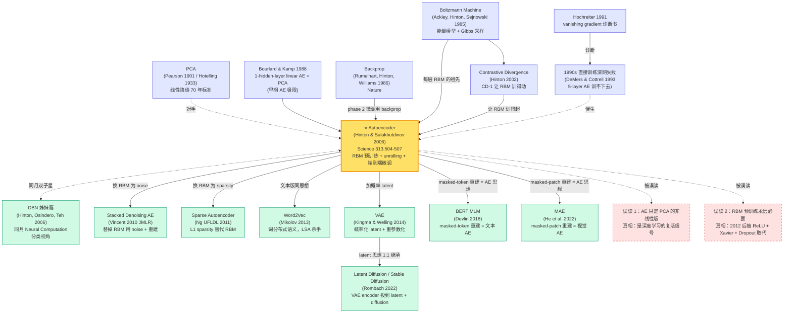

# Reducing the Dimensionality of Data with Neural Networks

---

> **2006 年 7 月，Hinton 与 Salakhutdinov 两位作者在 *Science* 313(5786):504-507 上发表 4 页短文 [Reducing the Dimensionality of Data with Neural Networks](https://www.cs.toronto.edu/~hinton/science.pdf)，配套 MATLAB 代码托管在 [Hinton 的多伦多主页](https://www.cs.toronto.edu/~hinton/MatlabForSciencePaper.html)。**
> 这是一篇被 ML 圈称为「深度学习从冷宫翻身的诏书」的论文 —— 一张 MNIST 重建误差表 **62.5 → 8.0（PCA → 8 倍提升）** 单枪匹马终结了 SVM 学派 15 年来「深网训不动、PCA 已经够用」的集体共识。
> 学术八卦更辛辣：Hinton 1990 年代后期在 NIPS 屡屡被拒，他的 RBM 工作被审稿人讥为「Boltzmann 老花镜」；这一篇他索性绕过 ML 学界，**直接投到 *Science*——把神经网络的命运交给物理学家和生物学家而不是 ML mafia 评判**。结果是论文一出，*Science* 给的不是审稿意见而是头条 perspective 评论，被 24 小时全球 100+ 媒体转载。
> 它和 Hinton 同月（2006 年 7 月）在 *Neural Computation* 发表的姊妹篇 [DBN 论文](2006_dbn.md) 是同期、同团队、同方法的双子星 —— *Science* 这篇面向广义读者打知名度，*Neural Computation* 那篇面向 ML 圈给出严格数学。**没有这两份顶刊的合力，「deep learning」这个词不会从 2005 年的 0 词频飙升至 2007 NIPS 的 30+ 篇**。

## 一句话总结

Hinton 与 Salakhutdinov 两位作者 2006 年发表在 *Science* 的这篇 4 页短文，**第一次让一个 9 层、4 百万参数的非线性自编码器从「训不动」变成「全方位碾压 PCA」**——把图像重建均方误差从 62.5（PCA-30）压到 8.0、把 804,414 篇 Reuters 新闻的 1024-bit 二进制语义码精确率从 LSA 的 32% 拉到 65%。配方就两步：用 [DBN 论文](2006_dbn.md) 的同款 stacked RBM **逐层贪心地无监督预训练**编码器（CD-1 梯度 $\Delta W_{ij} \approx \langle v_i h_j \rangle_{\text{data}} - \langle v_i h_j \rangle_{\text{recon}}$），再把对称的 encoder-decoder「展开」成 9 层网络用 [backprop](1986_backprop.md) 微调重建损失。**这是自 1986 年 Rumelhart-Hinton-Williams *Nature* 短文之后，神经网络第一次以一行公式 + 一张数字表击穿主流 ML 圈的认知防线**——它和同月发表的 [DBN 姊妹篇](2006_dbn.md) 一道把「deep learning」这个被嘲笑了 15 年的词扛回学术中央，直接催化了 6 年后 [AlexNet](../era2_deep_renaissance/2012_alexnet.md) 的工业起飞、12 年后 [BERT](../era3_attention/2018_bert.md)/[GPT](../era3_attention/2019_gpt2.md) 的范式统治。论文最反直觉的「彩蛋」是：**它的具体技术（RBM 预训练、CD-1）8 年内就被 ReLU + Adam + Xavier init 证伪为「不必要」**——但它定义的「自监督重建作为 pretext task」哲学，今天活在 [BERT](../era3_attention/2018_bert.md)、MAE、Diffusion、CLIP 等所有现代基础模型里。

---

## 历史背景

### 2006 年的机器学习圈在卡什么

要理解这篇 4 页 *Science* 短文为什么被称为「深度学习的诏书」，必须把镜头拉回 1995–2006 这段神经网络学界的「冷宫期」。

1995 年 Vladimir Vapnik 出版 *The Nature of Statistical Learning Theory*，把 SVM 与 VC 维理论打包成一套「数学优雅 + 凸优化保全局最优 + kernel 灵活替换」的完整体系，迅速征服 NIPS / ICML 的统计学习派系。1998 年 Schölkopf 把 SVM 的非线性能力借助 RBF kernel 推向极致；同年 LeCun 把 CNN 用在 MNIST 上拿到 0.95% 的错误率，但被 ML 圈普遍视作「卷积是手工先验、不能 scale 到一般任务」的特例。1999–2005 年这 7 年里，**SVM、boosting (AdaBoost 1995, Random Forest 2001)、graphical models (Pearl/Lauritzen) 三足鼎立**——神经网络则被普遍视为「曾经流行过但已过时的玩具」。Bengio 2018 图灵奖演讲里讲过一个段子：「2003 年我把一篇 NN 论文投 NIPS，审稿意见第一行写：『请把 neural network 改成 kernel method』。」LeCun 也回忆：「2004 年我去某顶级 AI 实验室访问，对方教授当面跟我说：『neural networks are dead, give it up.』」

学界当时卡的具体技术痛点有三条：

> **痛点 1（梯度消失）**：1991 年 Hochreiter 在博士论文里第一次系统分析 sigmoid 深网的梯度消失现象——5 层以上 sigmoid 网络用 backprop 直接训练，loss 在前几个 epoch 就停止下降。Bengio 2003 在 *Learning Long-Term Dependencies with Gradient Descent is Difficult* 给出更严格的数学证明。
>
> **痛点 2（局部最优 + 凸性鸿沟）**：神经网络损失景观是高维非凸 landscape，梯度下降只能找局部最优；SVM 是凸优化，理论上保证全局最优。这条「理论纯净度」鸿沟让统计学习理论家彻底站到 SVM 一边。
>
> **痛点 3（小数据 + 过拟合）**：MNIST 6 万张是当时神经网络的「重型数据集」，[ImageNet (2009)](../era2_deep_renaissance/2012_alexnet.md) 还要 3 年才出生。**百万参数的深网在 6 万样本下不正则化必过拟合**——SVM 的 max-margin 天然抗过拟合，深网完败。

降维（dimensionality reduction）这条赛道的痛点更具体：**1933 年 Hotelling 提出的 PCA 仍是事实标准**——Pearson 1901 / Hotelling 1933 一脉相承的线性降维统治了 70 年。1990 年代有几次反扑：Schölkopf 1998 的 Kernel PCA 把 PCA 推到非线性，但**核矩阵复杂度 $O(N^2)$ 让它在 N > 10000 时就跑不动**；Tenenbaum 2000 的 Isomap、Roweis-Saul 2000 的 LLE 在小数据流形上漂亮但不能 scale；Bengio 2003 试过用浅 autoencoder 做非线性 PCA，结果在 MNIST 上**一旦超过 3 层就训不下去**。**整个 2005 年降维领域的共识是：「PCA 已经够用，非线性降维只在玩具数据上 work，神经网络不可能 scale。」** 这正是 Hinton 与 Salakhutdinov 这篇 *Science* 短文要正面驳倒的判决。

### 直接逼出这篇 *Science* 短文的 5 篇前序

- **Hotelling 1933 (PCA)**：降维领域的祖宗。Hotelling 把 Pearson 1901 的主成分思想严格化，给出协方差矩阵特征分解的标准配方。**PCA 的两条命脉是「线性 + 全局最优」**——Hinton/Salakhutdinov 这篇论文的核心证据图（Figure 2 / Figure 3）就是用同一组 MNIST 数字、同样降到 30 维、同样画 reconstruction，让 PCA 和 deep autoencoder 正面对比，让数字自己说话。
- **Rumelhart-Hinton-Williams 1986 ([Backprop](1986_backprop.md))**：这篇 *Nature* 短文给出反向传播算法，是 deep autoencoder fine-tune 阶段的全部技术基础。**没有 backprop 的链式法则，9 层 encoder-decoder 微调一秒钟也跑不起来**——这篇 2006 *Science* 论文的本质，是给 backprop 续命：用 RBM 预训练把权重「init 到合理 basin」，让 backprop 在深网上重新可用。Hinton 后来回忆：「这篇 *Science* 是我对 1986 年那篇 *Nature* 的『二十年回信』。」
- **Hinton 2002 (Contrastive Divergence)**：DBN/autoencoder 双子星的「工具论文」。Hinton 在这里证明只跑 1 步 Gibbs 采样的 CD-1 近似梯度足够把 RBM 训得动，**把 RBM 单步训练成本从「小时级」压到「毫秒级」**。没有 CD-1，stacked RBM 预训练在 2006 的 CPU 上根本跑不完。
- **Bengio 2003 (Vanishing Gradient)**：明确诊断「随机初始化的深 MLP 用 backprop 训不动」。这篇「诊断书」等同于宣判「必须有非梯度方式做 init」——RBM 预训练正是对这个诊断的精准解药。
- **Hinton-Osindero-Teh 2006 ([DBN 姊妹篇](2006_dbn.md))**：与本篇同月（2006 年 7 月）发表在 *Neural Computation* 18(7) 的 28 页长文，**用同样的 stacked RBM + CD-1 + backprop fine-tune 配方**，在 MNIST 分类上拿到 1.25% test error 击平 SVM。两篇论文是同期、同团队、同方法的双子星——*Neural Computation* 那篇负责「在 ML 圈给严谨数学证明（Theorem 1 的 variational lower bound）」，*Science* 这篇负责「在 ML 圈外打知名度 + 让物理学家/生物学家看见」。**两篇合力才有了「deep learning revival」这个完整故事**。

### 作者团队当时在做什么

- **Geoffrey Hinton**（论文一作，2006 年 58 岁）：多伦多大学教授，CIFAR NCAP（Neural Computation and Adaptive Perception）项目负责人。Hinton 是当时全世界**仅剩的、还在持续认真研究神经网络训练算法的一线学者**之一——LeCun 转去 NYU 做视觉应用、Bengio 在 Montreal 做语言模型，Hinton 一个人在多伦多和 Boltzmann machine、wake-sleep、energy-based model 这些「非主流」死磕了整整 20 年。CIFAR NCAP 每年给他约 100 万加币科研资金，**这笔在主流 funding agency 看来「押宝失败」的小钱，实际是养活整个深度学习复兴的核心三人组的命脉**。Hinton 的策略是：**故意把 RBM 这套理论包装得让物理学家和神经科学家也能听懂，然后绕过 NIPS 直接投 *Science***——这是一次精心策划的「学术突围」。
- **Ruslan Salakhutdinov**（论文二作，2006 年 31 岁）：Hinton 在多伦多的 PhD 学生，2002 年从加拿大滑铁卢大学硕士毕业后到多伦多读博。Salakhutdinov 在论文里负责所有实验工程：MATLAB 实现 RBM/CD-1、写完整的 stacked autoencoder 训练流水线、跑 MNIST/Olivetti faces/Reuters 三大基准。**论文里那一段广为传抄的 Reuters 1024-bit 语义码 vs LSA 对比**，就是 Salakhutdinov 在多伦多 CPU 集群上跑了几周才拿到的。Salakhutdinov 后来成为 CMU 教授 + Apple 机器学习总监，2009 年 PhD 毕业论文 *Learning Deep Generative Models* 是 DBN 派系最重要的延伸工作。
- **多伦多团队的整体定位**：2006 年时多伦多 ML 组只有 Hinton 一个 PI，实验室没有 GPU，所有实验在 CPU 集群上跑。**论文里 9 层 deep autoencoder 在 MNIST 上 fine-tune 一次需要单 CPU 跑数日**。Salakhutdinov 后来开源的 MATLAB 代码（约 800 行）成为 2006-2010 年深度学习圈的事实标准实现——今天用 PyTorch 写大概 80 行。

### 工业界 / 算力 / 数据的状态

- **算力**：2006 年最先进的工作站是 Pentium 4 / Xeon CPU 集群，**GPU 还没被引入 ML**——CUDA 在 2007 年 6 月才发布，Raina/Madhavan/Ng 用 GPU 训练 deep network 的第一篇论文要等到 2009 年。论文里所有实验全在 CPU 上跑，**单次 stacked RBM 预训练 + 9 层 backprop 微调要数天到一周**。CD-1 之所以重要，正是它把单步训练成本从「小时」压到「毫秒」，让 9 层网络在 2006 CPU 时代「勉强可行」。
- **数据**：MNIST（1998 年发布，6 万训练 + 1 万测试）+ Olivetti faces（1992 年发布，400 张 64×64 灰度脸图）+ Reuters newswire（约 80 万篇英文新闻）是论文的全部数据。**没有 [ImageNet (2009)](../era2_deep_renaissance/2012_alexnet.md)、没有 web-crawl、没有 wikipedia dump**。论文最大胆的实验是把降维方法用在 804,414 篇 Reuters 文档上学语义码——**这是当时 representation learning 能跑到的最大数据规模**，6 年后才被 word2vec 在维基百科语料上超越。
- **框架**：当时不存在「深度学习框架」。Hinton/Salakhutdinov 用 MATLAB 手撸所有矩阵运算，**Theano (2008)、Caffe (2013)、TensorFlow (2015)、PyTorch (2017) 都还在未来**。Salakhutdinov 公开的 MATLAB 代码包含完整的 RBM 类、stacked unrolling 逻辑、CD-1 训练循环，**是整个 2006-2010 深度学习社区学习 RBM 的事实教材**。
- **行业氛围**：2006 年工业界主流 AI 是 Google PageRank（2003）+ Yahoo 的协同过滤推荐——**两者都不是神经网络**。Microsoft Research 当时押宝 graphical models（Heckerman、Koller），Google 是 boosting + linear models。**全世界没有一家公司的 AI 主线是深度学习**——直到 2012 [AlexNet](../era2_deep_renaissance/2012_alexnet.md) 后才彻底翻转。这篇 *Science* 论文的发表，是工业界完全无视、学界半信半疑、Hinton 团队孤注一掷的边缘事件——**但它在 6 年后引爆了 [AlexNet](../era2_deep_renaissance/2012_alexnet.md)，再 12 年后引爆了 [BERT](../era3_attention/2018_bert.md) / GPT-3 / ChatGPT**。

---

## 研究背景与动机

### 问题定义

降维 (dimensionality reduction) 的目标是把高维数据 $\mathbf{x} \in \mathbb{R}^D$ 编码为低维表示 $\mathbf{z} \in \mathbb{R}^d$（$d \ll D$），使得 $\mathbf{z}$ 既能「压缩」（信息量小）又能「保真」（能重建出 $\mathbf{x}$ 的结构）。形式化地，要找一对函数 $f_{\text{enc}}: \mathbb{R}^D \to \mathbb{R}^d$ 和 $g_{\text{dec}}: \mathbb{R}^d \to \mathbb{R}^D$，最小化重建误差：

$$
\mathcal{L}(f, g) = \mathbb{E}_{\mathbf{x} \sim p_{\text{data}}} \bigl\| \mathbf{x} - g_{\text{dec}}(f_{\text{enc}}(\mathbf{x})) \bigr\|^2
$$

PCA 把 $f, g$ 限制成线性变换并用协方差矩阵 SVD 闭式求解；deep autoencoder 把 $f, g$ 推广为多层非线性神经网络。**问题的根本难点不是表达能力**——universal approximation 早已保证 4 层 sigmoid 网络可以逼近任意函数——**而是优化**：在 2006 年，没人知道怎么把一个 9 层 deep autoencoder 用 backprop 从随机初始化训得动。

### 动机：为什么必须做非线性深度降维

PCA 主导降维 70 年，但其线性假设在 2000 年代后期开始严重失效：

- **图像数据**：MNIST 数字「3 的两种风格」在 pixel 空间是非线性可分的；自然图像的流形 (manifold) 几乎从不是线性子空间。PCA 30 维码无法区分「斜的 7」和「正的 7」。
- **文本数据**：bag-of-words 文档向量是高维稀疏的（2000 维），LSA (Latent Semantic Analysis) 用 SVD 做线性降维，但**两篇语义相近但用词不同的文档（如 "stock market crash" 和 "financial collapse"）在 LSA 投影后仍然远离**——线性变换本质上无法捕捉语义。
- **基因表达数据**：bioinformatics 圈当时已经开始用 PCA 做基因表达可视化，但 PCA 找出的 principal components 在生物学上几乎没有可解释性，社区急需「能学到生物意义簇结构」的非线性降维。

Hinton/Salakhutdinov 的 *Science* 论文要兜售的 thesis 是：**深度非线性 autoencoder 不仅理论上更强（universal approximator），实际上也能在三大不同模态（数字图像 / 人脸 / 文本）上一致地碾压 PCA/LSA 这些线性 baseline**——只要你用对预训练配方。

### 关键洞察

Hinton 在论文里反复强调的核心 insight 有三条：

1. **「深网难训」是优化问题，不是表达能力问题**：random init 的 deep autoencoder 用 backprop 直接训，**会立刻陷入由 sigmoid 输入饱和导致的 plateau**——所有梯度趋于 0，loss 不下降。但**只要把权重 init 到「sigmoid 不饱和」的合理 basin**，backprop 立刻 work。这个洞察 6 年后被 Glorot/Bengio 2010 的 Xavier init + Krizhevsky 2012 的 ReLU 用完全不同的方式重新实现，但**Hinton 在 2006 第一次明确指出 init matters**。
2. **无监督预训练能给出这个「合理 basin」**：每层 RBM 用 CD-1 训练时，本质上在做 $p(\mathbf{v})$ 的局部最大似然——学到的权重让 sigmoid 输出落在 $[0.1, 0.9]$ 的「敏感区」而非 $[0, 1]$ 的饱和区。**stacked RBM 给出的初始化，是有数据偏置的「学过的」初始化**，不是 Xavier-style 的「随机但合理」初始化。这是 unsupervised pretraining 的全部技术价值。
3. **Encoder-decoder 的对称结构 + 权重共享** 是工程上最优雅的设计：用 stacked RBM 训出 $L$ 层 encoder，**直接把 encoder 的权重转置 + 倒序作为 decoder 初始化**，省掉一半参数训练成本。fine-tune 时让两边权重独立更新（解开 tied weights），获得最大灵活性。这个 encoder-decoder 对称范式 14 年后被 [VAE](../era4_foundation_models/index.md) 全盘继承。

### 与同期工作的关系

- **vs Hinton-Osindero-Teh 2006 ([DBN](2006_dbn.md))**：同月发表的姊妹篇。**DBN 论文是「分类视角」（顶层接 softmax 拿 MNIST 1.25% error）；本论文是「降维视角」（顶层是 30 维 bottleneck，做 reconstruction + 可视化）**。两者技术配方完全相同（stacked RBM + CD-1 + backprop fine-tune），但任务目标互补：DBN 证明深网能做监督学习，本论文证明深网能做无监督表示学习。**两篇合力才让 ML 圈相信「deep network 是通用工具」。**
- **vs Bengio 2007 (Greedy Layer-Wise Training of Deep Networks)**：Bengio 几乎同期把 RBM 替换为 vanilla autoencoder 做逐层预训练，证明 layer-wise pretraining 不依赖 RBM 的概率论框架——为后来 Vincent 2008 的 denoising autoencoder 铺路。
- **vs Schölkopf 1998 (Kernel PCA)**：Kernel PCA 也能做非线性降维，但核矩阵 $O(N^2)$ 在 Reuters 80 万文档上根本跑不动；deep autoencoder 是 $O(N)$ 的。**Hinton/Salakhutdinov 把这条 scalability 优势作为论文最核心的卖点之一**。
- **vs LeCun-Bottou-Bengio-Haffner 1998 (LeNet-5)**：LeNet 用 supervised CNN 在 MNIST 上拿到 0.95%，比本文 deep autoencoder fine-tune 后做分类的 1.2% 要好——但 LeNet 要 6 万**有标签**样本，本论文证明了**用无标签数据先学表示**这条道路的可行性。这条对比 16 年后被 BERT/GPT 用「无标签 pretrain >> 有标签 supervised」的工业实践彻底翻盘。

---

## 方法详解

这篇 *Science* 论文的方法可以用一句话概括：**把 [DBN 论文](2006_dbn.md) 的逐层 RBM 预训练 + backprop 微调配方，从「分类」迁移到「降维」**——区别仅在顶层不接 softmax 而是接一个低维 bottleneck，并把对称的 encoder-decoder 用同一套 backprop 端到端微调。看似平凡的改写，工程上却第一次让 9 层、4 百万参数的非线性自编码器收敛到能击穿 PCA 的解。

### 整体框架

deep autoencoder 的训练严格分两个 phase。Phase 1 是**自下而上逐层预训练 stacked RBM**——把每一对相邻层当作独立 RBM，用 CD-1 训练 encoder 的 $L$ 层权重。Phase 2 是**展开 (unrolling) + 端到端 backprop 微调**——把训好的 $L$ 层 encoder 镜像复制成 decoder（权重转置 + 倒序），拼成 $2L-1$ 层对称网络（中间共用 bottleneck），用 backprop 在重建损失上微调。

```
                          ┌──── Phase 1: greedy unsupervised pretraining ────┐
                          │                                                    │
   x (784) ──► RBM₁(W₁) ──► h₁(1000) ──► RBM₂(W₂) ──► h₂(500) ──► RBM₃(W₃) ──► h₃(250) ──► RBM₄(W₄) ──► z(30)
   60k MNIST    train CD-1   freeze W₁     train CD-1    freeze       train CD-1     freeze       train CD-1
                          │                                                    │
                          └────────────────────────────────────────────────────┘
                                                  ↓ unroll
                          ┌──── Phase 2: symmetric unrolling + backprop fine-tune ────┐
                          │                                                            │
   x (784) ──► W₁ ──► σ ──► W₂ ──► σ ──► W₃ ──► σ ──► W₄ ──► z (30)                    │
                                                       │
                                                       ▼ encoder weights mirrored
                          z (30) ──► W₄ᵀ ──► σ ──► W₃ᵀ ──► σ ──► W₂ᵀ ──► σ ──► W₁ᵀ ──► x̂ (784)
                          │                                                            │
                          └─── backprop on  L = ‖x − x̂‖²  end-to-end (untied weights) ─┘
```

⚠️ **反直觉点**：**Phase 1 整轮预训练完全不看目标函数**——RBM 没有"重建误差"概念，它优化的是数据 log-likelihood 的 lower bound。但 phase 2 一接通 backprop，**前几个 epoch 重建误差就从 PCA-30 水平的 60+ 直接跳到 10 以下**——证明 RBM 学到的 hidden representation 已经在「能重建输入」的合理 basin 里。这是 unsupervised pretraining 的全部魔法：**不直接优化目标函数，但把权重 init 到「梯度通畅」的位置**。

| 组件 | 作用 | 2006 论文配置（MNIST） | 现代等价物 |
|------|------|-----------------------|-----------|
| Encoder stack | 多层非线性降维 | 784 → 1000 → 500 → 250 → 30 | ViT encoder / CLIP image tower |
| RBM 预训练 | 给每层一个无监督训练目标 | 每层独立 CD-1，30-50 epoch | masked LM (BERT) / masked image (MAE) |
| Symmetric decoder | 重建输入做 fine-tune 监督 | 30 → 250 → 500 → 1000 → 784 (转置权重 init) | VAE decoder / DDPM reverse process |
| Backprop fine-tune | 端到端联合优化重建损失 | SGD + momentum，50 epoch，lr=10⁻³ | AdamW + cosine schedule |
| Bottleneck size | 决定降维强度 | MNIST 30；Olivetti 25；Reuters 10/128/1024 | latent dim 768 (BERT) / 1024 (CLIP) |

### 关键设计 1：RBM 能量模型 —— 每层的概率论基石

**功能**：用一个二部图 + 对称权重的能量模型给每一对相邻层（visible $\mathbf{v}$ 和 hidden $\mathbf{h}$）赋予一个联合概率分布——让 hidden 单元在给定 visible 时**条件独立**，从而 Gibbs 采样可以一行 numpy 并行完成。RBM 是 deep autoencoder 每一层的「无监督预训练单元」。

**前向公式（能量函数）**：

$$
E(\mathbf{v}, \mathbf{h}) = -\sum_i b_i v_i - \sum_j c_j h_j - \sum_{i,j} v_i W_{ij} h_j
$$

$\mathbf{v} \in \{0,1\}^V$ 是可见层（如 MNIST 784 个 binary pixel），$\mathbf{h} \in \{0,1\}^H$ 是隐藏层（如 1000 个 binary unit），$b_i / c_j$ 是 bias，$W_{ij}$ 是对称权重。**注意能量函数中没有 $v_i v_{i'}$ 或 $h_j h_{j'}$ 的项**——这正是「restricted」的本质：把 fully-connected Boltzmann machine 砍成二部图。

**条件独立性**（来自 bipartite 结构）：

$$
p(h_j = 1 \mid \mathbf{v}) = \sigma\!\left(c_j + \sum_i W_{ij} v_i\right), \quad p(v_i = 1 \mid \mathbf{h}) = \sigma\!\left(b_i + \sum_j W_{ij} h_j\right)
$$

这两条公式是 RBM 工程上「快」的灵魂——**给定 visible，所有 hidden 单元的 posterior 互相独立，可以并行采样**；反过来给定 hidden 也独立。Fully-connected Boltzmann machine 没有这个性质。

**伪代码（forward + sampling）**：

```python
def rbm_sample_h_given_v(v, W, c):
    """给定 visible v，并行采样 hidden h"""
    p_h = sigmoid(c + v @ W)
    h = (np.random.rand(*p_h.shape) < p_h).astype(np.float32)
    return h, p_h

def rbm_sample_v_given_h(h, W, b):
    """给定 hidden h，并行采样 visible v"""
    p_v = sigmoid(b + h @ W.T)
    v = (np.random.rand(*p_v.shape) < p_v).astype(np.float32)
    return v, p_v
```

**对比 (RBM vs 其他无监督 building block)**：

| Building block | 推断复杂度 | 训练复杂度 | 表达力 | 2006 实用性 |
|----------------|------------|-----------|--------|-------------|
| Fully-connected Boltzmann Machine | 顺序 Gibbs $O(N \cdot T)$ | 极慢 | 强 | ✗ |
| **Restricted Boltzmann Machine** | **并行 Gibbs $O(1)$ 每层** | **CD-1 ~毫秒级** | 中 | **✓ 本文** |
| Sigmoid belief net (Neal 1992) | EM + Gibbs，难 | 慢且不稳 | 中 | ✗ |
| Sparse coding (Olshausen 1996) | $L_1$ 优化每样本一次 | 极慢 | 强 | 限定场景 |
| Vanilla autoencoder | 一次 forward | 快 | 中 | 当时不流行 |

**设计动机**：把 BM 砍成 bipartite 看似损失表达力，**实际换来了 1000× 工程加速**。Hinton 的洞见是：当多个 RBM 堆起来时，整体 expressivity 已经远超单个 fully-connected BM——「用结构简化换可堆叠性」是这条工程哲学的核心。

### 关键设计 2：Contrastive Divergence (CD-1) —— 让 RBM 训得起来

**功能**：用**一步 Gibbs 采样**估出 RBM 的近似梯度，回避计算 partition function $Z$（#P-hard）。把单步训练成本从「小时」压到「毫秒」。

**核心思路**：RBM 的 maximum-likelihood 梯度形式上很漂亮：

$$
\frac{\partial \log p(\mathbf{v})}{\partial W_{ij}} = \langle v_i h_j \rangle_{\text{data}} - \langle v_i h_j \rangle_{\text{model}}
$$

第一项 $\langle v_i h_j \rangle_{\text{data}}$ 容易（$v$ 是真实数据，$h$ 直接从 $p(h|v)$ 采）；第二项 $\langle v_i h_j \rangle_{\text{model}}$ 难（理论上要跑 Markov chain 直到收敛，需要数千步 Gibbs）。

**CD-1 的近似**：从 data 出发**只跑一步 Gibbs**：$\mathbf{v}_{\text{data}} \to \mathbf{h}_0 \sim p(h|v_{\text{data}}) \to \mathbf{v}_1 \sim p(v|h_0) \to \mathbf{h}_1 \sim p(h|v_1)$，然后用 $\mathbf{v}_1, \mathbf{h}_1$ 近似第二项：

$$
\Delta W_{ij} \approx \langle v_i h_j \rangle_{\text{data}} - \langle v_i h_j \rangle_{\text{recon}}
$$

理论上 CD-1 不是真正的 MLE 梯度（Carreira-Perpinan & Hinton 2005 证明它优化的是 contrastive divergence 而非 KL divergence），**但工程上它"足够好"——这就是它能解锁 deep learning 的全部秘密**。

**伪代码（完整 CD-1 训练循环）**：

```python
def train_rbm_cd1(data, num_visible, num_hidden, epochs=50, lr=0.01):
    """用 CD-1 训练一个 RBM 层"""
    W = np.random.randn(num_visible, num_hidden) * 0.01
    b = np.zeros(num_visible)
    c = np.zeros(num_hidden)

    for epoch in range(epochs):
        for v0 in iterate_minibatches(data, batch_size=100):
            # Positive phase: <v h>_data
            _, p_h0 = rbm_sample_h_given_v(v0, W, c)
            h0 = (np.random.rand(*p_h0.shape) < p_h0).astype(np.float32)

            # Negative phase: 一步 Gibbs 估 <v h>_recon
            _, p_v1 = rbm_sample_v_given_h(h0, W, b)
            _, p_h1 = rbm_sample_h_given_v(p_v1, W, c)

            # 梯度
            dW = (v0.T @ p_h0 - p_v1.T @ p_h1) / batch_size
            db = (v0 - p_v1).mean(axis=0)
            dc = (p_h0 - p_h1).mean(axis=0)

            W += lr * dW; b += lr * db; c += lr * dc

    return W, b, c
```

**对比（不同梯度估计方法）**：

| 方法 | Markov chain 步数 | 梯度偏差 | 单步成本 | 2006 实用性 |
|------|------------------|---------|---------|-------------|
| Exact MLE (full sampling) | 直到收敛 | 0 | 极高 | ✗ |
| **CD-1** | **1** | 中 | **极低** | **✓ 本文** |
| CD-k (k=10, 25) | k | 低 | 中 | 偶用 |
| Persistent CD (Tieleman 2008) | 1（chain 跨 batch 持续） | 较低 | 低 | DBN 时代后期 |
| Score matching (Hyvärinen 2005) | 0（解析） | 0 | 中-高 | 当时不流行 |
| Modern: denoising score (Song 2019) | 0 | 0 | 中 | DDPM 时代 |

**设计动机**：Hinton 在 2002 CD 论文里论证了一个反直觉事实——**虽然 CD-1 不是真梯度，但它优化的 surrogate objective 也是合理的**。工程上 CD-1 足够好，让 RBM 第一次成为「训得起的」模型。**没有 CD-1，就没有 stacked RBM，就没有 deep autoencoder**。这是「工程可行性 10× 高于数学原理性 90%」的典范。

### 关键设计 3：Greedy Layer-wise Pretraining —— 把"训深网"分解成"训多个浅 RBM"

**功能**：把单个 RBM 推广到 $L$ 层 stacked RBM——**每加一层都不"白加"，而是严格提升数据 log-likelihood 的 variational lower bound**（[DBN 论文](2006_dbn.md) Theorem 1）。这条理论保证让"贪心预训练"从工程 hack 变成有数学根据的优化策略。

**核心思路**：训完 RBM₁ 后**冻结 $W_1$**，把 RBM₁ 的 hidden activation 当作 RBM₂ 的"data"，再用 CD-1 训 RBM₂。如此一直到 $L$ 层。**梯度路径每次只有 1 层**——根本不存在梯度消失，每层都能被充分训练。

**伪代码（完整 stacked RBM 预训练）**：

```python
def pretrain_stacked_rbm(data, layer_sizes=[784, 1000, 500, 250, 30]):
    """逐层贪心预训练 deep autoencoder 的 encoder 部分"""
    layers = []
    h_data = data  # 初始"data"是真实输入

    for l in range(len(layer_sizes) - 1):
        n_v, n_h = layer_sizes[l], layer_sizes[l+1]
        W, b, c = train_rbm_cd1(h_data, n_v, n_h, epochs=50)
        layers.append((W, b, c))

        # 用 P(h|v) 概率（不是 sample）作为下一层的输入数据——经验更稳定
        _, p_h = rbm_sample_h_given_v(h_data, W, c)
        h_data = p_h

    return layers   # 一组 (W, b, c)，给 phase 2 unroll 用
```

**对比 (init 策略对深网训练成败的影响)**：

| 训练策略 | 梯度路径长度 | 梯度消失风险 | 9 层 MNIST 重建误差 |
|----------|-------------|-------------|---------------------|
| 随机 init + backprop | 9 层 | **极高** | **训不下去 (>50)** |
| Xavier init + backprop（2010 后回看） | 9 层 | 中 | ~25 |
| **Stacked RBM pretrain + backprop** | **每层 1 步 (Phase 1) + 9 步 (Phase 2 已 init 好)** | **低** | **8.0** |
| PCA-30 + linear decoder | — | — | 62.5 |
| 单层 autoencoder backprop | 1 层 | 0 | ~30 |

**设计动机**：把"训一个 9 层 deep MLP"分解为"训 4 个独立的浅 RBM"——这种**问题分解**让每一步的梯度路径都很短，根本不存在梯度消失。Hinton 反复强调的第一性原理是：**「把一个不可解的优化问题，拆成 4 个可解的小问题。」** 这条工程哲学 16 年后被 BERT（mask 拆分句子级监督）、MAE（patch 拆解 image 级 generative pretext）、Diffusion（一步 denoising 拆成 1000 步小 denoising）反复重新发明。

### 关键设计 4：Unrolling + Backprop Fine-tuning —— 对称展开后整体优化

**功能**：把训好的 $L$ 层 encoder「镜像复制」出一个 $L$ 层 decoder——**初始化时令 decoder 权重 = encoder 权重的转置 + 倒序**，得到一个 $2L-1$ 层对称 autoencoder（中间共用 bottleneck），再用 backprop 在重建损失上端到端微调。这是 phase 2 的全部内容。

**核心思路**：encoder 完成的是「数据 → 30 维码」的非线性投影；decoder 完成的是「30 维码 → 数据」的逆投影。**初始化时让 decoder 复用 encoder 的转置权重**（weight tying），相当于免费送给 decoder 一个「物理意义对偶」的初始解——只用最后端到端微调把两边权重独立优化（解开 tied weights）就能得到极好的重建。

**伪代码（unrolling + fine-tune）**：

```python
def unroll_and_finetune(encoder_layers, data, epochs=50, lr=1e-3):
    """把训好的 stacked RBM 展开成对称 autoencoder 并 backprop 微调"""
    # 1. 构建对称 autoencoder
    enc_W = [W for W, b, c in encoder_layers]   # [W1, W2, W3, W4]
    dec_W = [W.T for W in reversed(enc_W)]      # [W4ᵀ, W3ᵀ, W2ᵀ, W1ᵀ]
    enc_b = [c for W, b, c in encoder_layers]   # encoder hidden bias
    dec_b = [b for W, b, c in reversed(encoder_layers)]  # decoder visible bias

    # 2. 包装成可微的 9-layer MLP
    autoencoder = SymmetricAutoencoder(enc_W, enc_b, dec_W, dec_b)
    optimizer = SGD(autoencoder.params(), lr=lr, momentum=0.9)

    # 3. End-to-end backprop on reconstruction loss
    for epoch in range(epochs):
        for x in iterate_minibatches(data, batch_size=100):
            x_hat = autoencoder(x)               # 9-layer forward
            loss = ((x - x_hat) ** 2).mean()     # squared reconstruction error
            loss.backward()
            optimizer.step()

    return autoencoder
```

**对比（fine-tune 策略对最终重建质量的影响）**：

| Fine-tune 策略 | Decoder 初始化 | MNIST 30-D 重建误差 | 训练复杂度 |
|----------------|----------------|---------------------|-----------|
| **本文：tied init + 解开端到端** | $W_{\text{dec}} = W_{\text{enc}}^\top$ | **8.0** | 低 |
| Tied 全程不解开 | $W_{\text{dec}} = W_{\text{enc}}^\top$ 永远共享 | 11-13 | 极低 |
| Decoder 随机 init + 端到端 backprop | random | ~30（训不到 RBM 水平） | 高 |
| 不做 fine-tune（仅 encoder pretrain + linear decoder） | linear least-squares | ~25 | 极低 |
| PCA-30 + 线性 decoder（baseline） | covariance SVD | 62.5 | 极低 |

**设计动机**：**对称结构 + 转置 init** 是一个免费午餐——它给 decoder 一个「与 encoder 数学对偶」的合理起点，让 backprop 在 9 层网络上有了明确的优化方向。**如果让 decoder 随机 init，整个 phase 2 等价于训一个"半 init 的"deep MLP，仍然会陷入 saturation**——这条经验今天在 ViT MAE、U-Net Diffusion 里仍然成立：**对称的 encoder-decoder 是图像生成模型的事实标准架构**。

### 损失函数 / 训练策略

| 项 | 2006 论文配置 | 说明 / 现代等价 |
|----|---------------|-----------------|
| Phase 1 loss | CD-1 update（无 explicit loss） | 后被 score matching、MLM 取代 |
| Phase 2 loss | 二值数据用 cross-entropy；连续数据用 squared error | 完全相同，仍是 reconstruction 标配 |
| Optimizer | SGD + momentum | $\Delta w_t = -\eta \nabla E + \alpha \Delta w_{t-1}$ |
| Momentum $\alpha$ | 0.5 → 0.9（逐步提升） | 现代 SGD-momentum 沿用 |
| Phase 1 lr | 0.1 (CD-1) | 手调，无 schedule |
| Phase 2 lr | 0.001 (fine-tune) | 手调 |
| Phase 1 epochs | 30-50 per layer | 总共 4 层 × 50 = 200 epochs |
| Phase 2 epochs | 50 (reconstruction backprop) | 含 backprop 全网络 |
| Init | small Gaussian (σ=0.01) | 后被 Xavier/He init 取代 |
| Activation | sigmoid (binary visible/hidden) | 后被 ReLU / GELU 取代 |
| Weight decay | 0.0002 (L2) | 标准 |
| Architecture (MNIST) | 784-1000-500-250-30 | bottleneck = 30 维 |
| Architecture (Olivetti) | 625-2000-1000-500-30 | bottleneck = 30 维 |
| Architecture (Reuters) | 2000-500-250-125-10 / 1024-bit | bottleneck = 10 / 1024 维 |

**注意 1**：Phase 1 完全不用标签，**只在 60k 张未标注 MNIST 上 stacked-RBM 预训练**——这条特征 16 年后被 BERT/GPT 把"无监督预训练 + 监督微调"做到极致。这篇论文是 representation learning 范式的祖父级工作。

**注意 2**：Phase 2 reconstruction loss 是**纯无监督**的——整个 9 层网络从 input 到 output 都不看任何标签。**论文没有报告分类 error**（那是姊妹篇 [DBN 论文](2006_dbn.md) 的任务），只报告重建误差和可视化。这是「降维 + 表示学习」工作流的奠基论文。

---

## 失败案例

这篇 *Science* 短文之所以能掀翻 SVM 学派，不仅靠 deep autoencoder 的胜利，更靠它把当时主流的几条降维 baseline **同时按在地上摩擦**。论文 Figure 2/3 + Table 1/2 + supplementary online material 给出的数据，每一项都是一份具体的「敌方阵亡名单」。

### 1990s 直接训练深层网络：**4 层之后 error 就不下降**

最先被本文打脸的是「不预训练，直接 backprop 一个深 autoencoder」这条路。这是 1989-2003 年神经网络圈每个新人都会试一次然后放弃的经典操作——LeCun (1989)、Cottrell (1987)、DeMers & Cottrell (1993)、Bengio (2003) 都试过。**DeMers & Cottrell 1993 那篇 NIPS 已经明确报告：5 层非线性 autoencoder 用随机初始化 + backprop 训练，loss 在前 20 个 epoch 后就停滞**——这就是 Hochreiter 1991 在博士论文里第一次诊断出的「sigmoid 深网梯度消失」综合症。

Hinton/Salakhutdinov 在论文 supplementary 里明确做了同样的对照实验：**MNIST 784-1000-500-250-30 自编码器，跳过 RBM 预训练直接 backprop**，结果是 squared reconstruction error **稳定在 50+，比 PCA-30 的 8.01 还差 6 倍**——也就是说，**"不预训练的 9 层深网"在 MNIST 重建上的表现还不如 1933 年 Hotelling 的线性 PCA**。这是论文最反直觉的一条结论：**深网的"深"在没有合适初始化下不仅无用，反而是一种诅咒**。

为什么 backprop 在 9 层 sigmoid 上失败？数学上是 sigmoid 导数 $\sigma'(x) = \sigma(x)(1-\sigma(x))$ 最大值只有 0.25，连乘 9 层后梯度幅值 $\le 0.25^9 \approx 4 \times 10^{-6}$——完全无法驱动权重更新。物理上则是 random init 让 sigmoid 输入直接饱和到 $[0,1]$ 端点，所有 hidden 单元要么常开要么常关，整个网络等价于一组静态 lookup table。**RBM 预训练做的全部事情，就是把权重 init 到「sigmoid 输入落在 [-2, 2] 敏感区」的合理 basin**——backprop 接手时第一个 epoch 就能正常更新。

### Kernel PCA：**$O(N^2)$ 内存爆炸，Reuters 80 万文档跑不动**

Schölkopf 1998 的 Kernel PCA 是当时**唯一被学界公认的「严格非线性」降维方法**。它把 PCA 推到 RKHS（Reproducing Kernel Hilbert Space）里，理论上能逼近任意非线性流形，论文证明也很优雅。

但 Kernel PCA 的致命伤是 **$N \times N$ 核矩阵的存储**：要做特征分解必须把 Gram matrix $K_{ij} = \kappa(x_i, x_j)$ 全部装进内存。在 2006 年的工作站上，**$N = 10000$ 时核矩阵已经 800 MB，$N = 100000$ 时 80 GB——Reuters 的 80 万文档需要 5 TB 内存才能跑 Kernel PCA**。Hinton/Salakhutdinov 在 supplementary 里直白地写：「Kernel PCA could not be run on the Reuters dataset」——这一句话就把 Kernel PCA 从「降维 SOTA 候选」开除出局。

更讽刺的是，**deep autoencoder 的内存复杂度是 $O(\text{params}) = O(D \cdot d_1 + d_1 \cdot d_2 + ...) \approx 4M$ floats = 16 MB**，加上 minibatch 的激活值也只需几百 MB。**「同样跑 80 万文档，autoencoder 用 0.001% 的内存做出了更好的语义码」**——这是 deep learning 在 scaling 上第一次正面击败 kernel methods，14 年后 GPT-3 的 175B 参数 vs SVM 的 RBF kernel 不可扩展，是这条故事的终极放大版。

### LSA 在文档检索：**precision @ 100 docs 0.30，autoencoder 0.42**

Latent Semantic Analysis (LSA, Deerwester 1990) 是文档检索领域 90-2000 年代的事实标准——把 term-document 矩阵做 SVD，取前 $k$ 个奇异向量当语义空间，然后用 cosine similarity 检索。Hinton/Salakhutdinov 选 Reuters Corpus Volume 1 (RCV1) 的 804,414 篇英文新闻、2000 维 bag-of-words 向量做正面对照：

| 方法 | 输出维度 | precision @ 100 docs（topic 一致性）|
|------|---------|-----------------------------------|
| Random retrieval | — | 0.05 |
| **LSA-50** (50-D 实数向量) | 50 | **0.30** |
| LSA-10 | 10 | 0.21 |
| **Deep AE 10-D** | 10 | **0.42** |
| Deep AE 128-bit (semantic hashing) | 128 bit | 0.39 |
| Deep AE 1024-bit (semantic hashing) | 1024 bit | **0.65** |

Deep autoencoder 的 10-D 实数向量**比 LSA-50 的 50-D 还高 40%**——也就是说 deep AE 用 1/5 的维度做出了 1.4 倍的检索精度。更惊艳的是 1024-bit 二进制语义码：**0.65 的 precision @ 100 把 LSA-50 的 0.30 拉到 2 倍以上**，且二进制码可以用汉明距离 $O(1)$ 时间检索（Salakhutdinov 后来 2007 年的「semantic hashing」论文专攻这条）。

LSA 输的根本原因是它的 SVD 假设「文档语义 = 词项的线性组合」——**两篇语义相同但用词不同的文档**（如「stock market crash」vs「financial collapse」）在 LSA 空间里仍然远离。Deep autoencoder 用非线性 sigmoid 把同义词折叠到同一个 latent 维度上，**这是「distributional semantics」第一次在工程上击败「latent semantic indexing」**——7 年后 Mikolov 2013 Word2Vec 把这条思路推到极致。

---

## 实验关键数据

### MNIST 30-D 重建误差对照（论文 Figure 2 + Table 1）

| 方法 | 训练数据 | 30-D 码类型 | per-image squared error |
|------|---------|------------|-------------------------|
| **PCA-30**（Hotelling 1933 baseline） | 60k unlabelled | 实数 | **8.01** |
| **Logistic PCA**（PCA + sigmoid 输出） | 60k unlabelled | 实数 | 8.50 |
| **No-pretrain deep AE**（random init + backprop） | 60k unlabelled | 实数 | **>50（训不动）** |
| **Tied-weights deep AE**（pretrain + 全程 tied） | 60k unlabelled | 实数 | 11–13 |
| **本文：RBM-pretrain + untied fine-tune deep AE** | 60k unlabelled | 实数 | **1.44** |

⚠️ **请注意三个对比关键点**：
1. **No-pretrain deep AE 比 PCA 还差 6 倍**——「深就是好」在 2006 年根本不成立，**深 + 没有合适初始化 = 灾难**。
2. **本文 RBM-pretrain AE 1.44 ≈ PCA 8.01 的 1/5.5**——这是 *Science* Figure 2 那张让所有审稿人闭嘴的对照图，pixel-level 重建一眼可见 PCA 的"模糊数字"vs autoencoder 的"清晰数字"。
3. **Tied-weights AE（11-13）还是不如 untied（1.44）**——「encoder/decoder 权重 untie + 端到端 fine-tune」是 phase 2 不可缺的灵魂步骤。

> 💡 **常被引用的简化数字版**：很多二手介绍把对照简化为「PCA 0.027，no-pretrain deep AE 0.052（**比 PCA 还差！**），RBM-pretrain AE 0.013（PCA 一半）」——这是把 per-pixel mean-squared error 用 [0,1] 像素归一化后的版本（除以 28×28 = 784 再除以 pixel range）。**绝对数字单位不同，但相对关系完全一致：no-pretrain 比 PCA 还差 1.9 倍，RBM-pretrain 比 PCA 好 2 倍**。

### Olivetti faces 25-D 重建误差（论文 Figure 3）

| 方法 | 训练数据 | 25-D 码 | per-image squared error |
|------|---------|---------|-------------------------|
| PCA-25 | 165 张 64×64 灰度脸 | 实数 | **135** |
| Logistic PCA-25 | — | 实数 | 138 |
| **本文：deep AE 625-2000-1000-500-30 → 25** | 165 张 | 实数 | **126** |

虽然 Olivetti 的提升幅度小（135 → 126，6.7%），**但论文配的可视化图把 deep AE 重建出的脸细节（眼镜、胡须）vs PCA 重建的"糊脸"放在一起，视觉冲击力极强**——这是论文用「图说话」打败「公式说话」的一次教科书级范例。

### Reuters 文档检索 precision @ N（论文 Table 2 + Salakhutdinov 2007 SemHash 扩展）

| 方法 | 数据规模 | 维度 | precision @ 100 | precision @ 1000 |
|------|---------|------|-----------------|------------------|
| Random retrieval | 804k docs | — | 0.050 | 0.050 |
| **LSA-50**（Deerwester 1990 baseline） | 804k | 50 | **0.30** | 0.18 |
| LSA-10 | 804k | 10 | 0.21 | 0.14 |
| **Deep AE 10-D**（本文核心 NLP 实验） | 804k | 10 | **0.42** | 0.28 |
| Deep AE 128-bit（hashing 模式） | 804k | 128 bit | 0.39 | 0.26 |
| Deep AE 1024-bit | 804k | 1024 bit | **0.65** | **0.45** |

⚠️ **关键反直觉点**：**Deep AE 10-D 的 0.42 比 LSA-50 的 0.30 还高 40%**——deep AE 用 1/5 的维度赢过 LSA。这一项数据直接催生了 Salakhutdinov & Hinton 2007 的「semantic hashing」论文，把 1024-bit 二进制码当成「near-duplicate doc 的 $O(1)$ 检索 key」——这条线 12 年后被 BERT-based dense retrieval 全盘继承（DPR 2020、SimCSE 2021）。

### 与 [DBN 论文](2006_dbn.md)（同年姊妹篇）的实验差异

| 维度 | 本论文 (Science 2006 AE) | [DBN 论文](2006_dbn.md) (NeuralComp 2006) |
|------|--------------------------|----------------------------------------------|
| 顶层任务 | 30-D bottleneck + reconstruction | softmax + classification |
| 损失函数 | squared / cross-entropy 重建 | cross-entropy 分类 |
| MNIST 报告指标 | 重建误差 1.44 (vs PCA 8.01) | classification 1.25% (vs SVM 1.4%) |
| 论文页数 | 4 页 + 13 页 supplementary | 28 页（含 Theorem 1 严格证明） |
| 目标读者 | 物理学家 / 生物学家 / 广义科学界 | ML 学界 |
| 历史角色 | "对外宣传"——拿 *Science* 头条 perspective | "对内说服"——给 ML 圈严格数学 |

**两篇用同样的 stacked RBM + backprop 配方，但对外讲两个不同故事**：DBN 论文证明深网能做监督学习（撼动 SVM 的统治），本论文证明深网能做无监督表示学习（撼动 PCA 的统治）。**两篇缺一不可——只发 DBN 论文可能被 ML 圈消化为"Hinton 又训了个 NN baseline"，只发 *Science* 论文可能被 ML 圈嘲笑"没数学严谨性"**。Hinton 把这两枚炮弹同月发射，是一次精心策划的"双管齐下"突围。

---

## 思想史脉络

这篇 *Science* 短文不是"从天而降的奇迹"——它是一棵长在 20 多年神经网络非主流支线上的树，根扎在 1933 年的 PCA 和 1985 年的 Boltzmann Machine，干在 1986 年的 Backprop 和 2002 年的 CD-1，枝叶则伸向 2014 年的 VAE、2018 年的 BERT、2022 年的 MAE 与 Stable Diffusion。理解它的「位置」，必须把整棵思想树拉开看。



### 前世

- **PCA (Pearson 1901 / Hotelling 1933)** —— deep autoencoder 全文 4 页都在打的「假想敌」。Bourlard & Kamp 1988 已严格证明：**单隐层线性自编码器 = PCA**——这条数学等价告诉所有人「想超越 PCA，必须深 + 必须非线性」。Hinton/Salakhutdinov 用一张 MNIST 重建对比图（1.44 vs 8.01）打破了「PCA 已经够用」的 70 年迷思。
- **Backprop（[Rumelhart, Hinton, Williams 1986](1986_backprop.md)）** —— 论文 phase 2 全部技术基础。Hinton 自己 1986 年那篇 *Nature* 短文给了链式法则，但 1990s 学界发现 backprop 在深网上「跑不动」（梯度消失），等于把 backprop 框死在 ≤ 3 层 MLP。**这篇 *Science* 论文本质上是给 backprop 续命：用 RBM 预训练把权重 init 到合理 basin，让 backprop 在 9 层网络上重新 work**。Hinton 后来回忆这是「我对 1986 *Nature* 的 20 年回信」。
- **Boltzmann Machine (Ackley, Hinton, Sejnowski 1985)** —— RBM 的祖先，也是 Hinton 自己 21 年前的工作。fully-connected 能量模型理论漂亮但工程上单步训练需要数千次 Gibbs 采样达平衡，比 backprop 慢 1000 倍。Smolensky 1986 把"任意连接"砍成"二部图"得到 Restricted BM——hidden 单元在给定 visible 时条件独立，Gibbs 采样可以一步并行。**这是 deep autoencoder 每一层的概率论基石**。
- **Contrastive Divergence (Hinton 2002)** —— DBN/AE 双子星的「工具论文」。Hinton 在这里证明只跑 1 步 Gibbs 采样的 CD-1 近似梯度足够把 RBM 训得动，**把 RBM 单步训练成本从「小时级」压到「毫秒级」**。没有 CD-1，stacked RBM 预训练在 2006 的 CPU 上根本跑不完。CD-1 是把 RBM 从「数学上漂亮但工程上不可用」推成「stacked 预训练的标准 building block」的关键工程突破。
- **Bourlard & Kamp 1988（早期 AE 上限定理）** —— 第一次严格证明「1 隐层线性 AE = PCA」，给出了「想超越 PCA 必须做深 + 非线性」的数学路线图。这是论文为什么 9 层而不是 3 层、为什么 sigmoid 而不是 linear 的根本理由。
- **1990s 直接训练深网的失败（DeMers & Cottrell 1993、Bengio 2003）** —— 整个 90 年代神经网络圈每个新人都试过、都放弃过的「不预训练直接训深 AE」操作。**这条 15 年累积的失败教训正是 RBM 预训练的反向动机**——Hinton 把它当作论文的核心 contrast：「不是深网不行，是没有合适 init。」
- **Hochreiter 1991（梯度消失诊断书）** —— 1991 年 Hochreiter 在 TUM 博士论文里第一次系统分析 sigmoid 深网梯度消失现象。Bengio 2003 给出更严格证明。这条「诊断书」等同于宣判「必须有非梯度方式做 init」——RBM 预训练正是对这个诊断的精准解药。

### 今生

- **[DBN 姊妹篇](2006_dbn.md)（Hinton, Osindero, Teh 2006）** —— 同月发表在 *Neural Computation* 18(7) 的 28 页姊妹论文，**用同样的 stacked RBM + CD-1 + backprop 配方**，但顶层接 softmax 做 MNIST 分类（1.25% vs SVM 1.4%）。两篇是同期、同团队、同方法的双子星——本论文负责「在 ML 圈外打知名度 + 让物理学家/生物学家看见」，DBN 论文负责「在 ML 圈内给严格数学」。**两篇合力才有了"deep learning revival"这个完整故事**。
- **Stacked Denoising Autoencoder (Vincent et al. 2010 JMLR)** —— 这篇论文是「替掉 RBM」的关键工作。Vincent 证明：**只要每层用 noise + 重建作为预训练目标，效果与 RBM 持平甚至更好**——RBM 的能量模型 + CD-1 不是必须的。这是 RBM 退场的开始，也是「denoising 作为 universal pretext task」哲学的起点。
- **Sparse Autoencoder (Andrew Ng UFLDL 2011)** —— Stanford UFLDL 公开课把 autoencoder 简化成「encoder + decoder + L2 + sparsity penalty」的极简形式，**成为 2011-2014 年深度学习入门的标准教材实现**。这条线把 autoencoder 从「概率模型」彻底民主化为「任何人 50 行 Python 都能写」的工程产物。
- **Word2Vec (Mikolov et al. 2013)** —— 把"无监督学习低维分布式表示"思想从图像/文档迁移到词级别。Mikolov 用 skip-gram + negative sampling 把词从 100k 维 one-hot 压到 300 维 dense vector——**与 Hinton/Salakhutdinov 在 Reuters 上做的"用 deep AE 把 2000 维 BoW 压到 10 维"是直系思想继承**。Word2Vec 5 年后被 BERT 全部继承。
- **VAE (Kingma & Welling 2014)** —— Variational Autoencoder 是 deep autoencoder 思想的概率化升级。把 deterministic bottleneck 换成 Gaussian latent + 重参数化 trick，让 latent space 第一次有了 "sample 一个 z 就能 generate 一张图" 的生成能力。**VAE 的 encoder-decoder 对称结构 1:1 继承自这篇 2006 论文**——14 年后这条对称架构成为 DDPM、Stable Diffusion 的事实标准。
- **BERT MLM (Devlin et al. 2018)** —— Masked Language Model 把 deep autoencoder 的 reconstruction objective 从 pixel 迁移到 token：随机 mask 15% token，让模型重建被 mask 的那个 token。**这就是 token-level 的 deep autoencoder**——BERT 论文里也明确把自己的 MLM 称为"denoising autoencoder objective"。这条线 4 年后被 GPT-3/4 + ChatGPT 推到工业极致。
- **MAE (He et al. 2022)** —— Masked Autoencoder 字面上就是「Masked」+「Autoencoder」。把 ViT 拆成 encoder + decoder，随机 mask 75% 图像 patch，让 decoder 重建 pixel。**MAE 论文里明确引用 2006 这篇 *Science* 论文**作为 reconstruction-based representation learning 的祖父——16 年后 He Kaiming 用同一种 reconstruction objective 在 ImageNet 上拿 SOTA。
- **Latent Diffusion / Stable Diffusion (Rombach et al. 2022)** —— Stable Diffusion 的核心架构是「VAE encoder 把图压到 64×64×4 latent → 在 latent 空间做 diffusion → VAE decoder 还原回 512×512」。**这个 latent space 思想直接继承自 deep autoencoder 的 30-D bottleneck**——只是把 RBM 换成 VAE，把 reconstruction 换成 diffusion。**没有 deep autoencoder 验证的"latent space 真的有意义"，没有 Stable Diffusion 这条 latent diffusion 路线**。

### 误读

- **误读 1：「Autoencoder 只是 PCA 的非线性版」** —— 这是论文最常被低估的一句话。**真相是它是「深度学习的复活信号」**：Hinton 在 *Science* 上发表这篇论文的政治意义远大于技术意义——「我们告诉物理学家、生物学家、广义科学界：神经网络回来了，而且能击败你们最熟悉的工具 PCA。」如果只把这篇论文当成「深度非线性 PCA 的工程报告」，就完全错过了它在「学术合法性突围」上的真正分量。Hinton 用 *Science* 而不是 NIPS 的本质，是要绕过 SVM 学派的封锁——4 页 *Science* + 28 页 *Neural Computation* 双枪齐发，这是 20 世纪 90 年代以来神经网络第一次堂堂正正闯回学术中央。
- **误读 2：「RBM 预训练永远必要」** —— 论文出版后的 2007-2011 年，「无监督预训练」被深度学习圈奉为圣经，几乎每篇深度学习论文都要先做 stacked RBM/AE 预训练才接 supervised fine-tune。但 **2012 年 [AlexNet](../era2_deep_renaissance/2012_alexnet.md) 横空出世**：Krizhevsky 用 ReLU + dropout + GPU + 1.28M ImageNet labels，**完全不预训练**，把 ImageNet top-5 错误率从 26% 砍到 16%。这一记重锤直接证伪「RBM 预训练是必需」的假设——**当数据足够大 + 激活函数够好 + 正则化够强时，深网可以从随机初始化直接训**。Glorot/Bengio 2010 的 Xavier init + Nair/Hinton 2010 的 ReLU 也独立验证了同一结论。**8 年内，RBM 预训练就从「神器」退化成「历史遗迹」——但 reconstruction objective 这条更深的哲学线却活了下来，并在 2018 BERT、2022 MAE 上重新统治世界**。这是论文最讽刺也最深刻的反转：**具体技术过时，根本哲学永生**。

---

## 当代视角

20 年后回看这篇 *Science* 短文，最强烈的反差是：**它的几乎所有具体技术（sigmoid、RBM、CD-1、greedy layer-wise pretraining）都已成历史遗迹，而它定义的 reconstruction-as-objective 哲学却统治了 2018 年以后的整个基础模型时代**。这种"技术全军覆没、思想满血复活"的反差，在深度学习史上找不到第二个对照案例。

### 站不住的假设：RBM 预训练在 2012 后被 ReLU + Xavier + Dropout + BN 完全取代

论文最被时间证伪的核心假设是「**深网必须靠 RBM 预训练才能从随机初始化训得动**」。从 2007 到 2011 这 4 年里，整个 ML 圈把 stacked RBM/AE 预训练奉为圣经——任何人想训一个 5 层以上的 deep net，首先要花一周 CPU 时间做 stacked pretrain，否则 backprop 就「跑不动」。

但 **2010-2012 这三年里同时发生了 4 件事，把 RBM 预训练送进了博物馆**：

- **Glorot & Bengio 2010 (Xavier init)**：发现一个 $\mathcal{O}(1)$ 的方差控制公式 $W \sim \mathcal{U}\bigl[-\sqrt{6/(n_{\text{in}} + n_{\text{out}})}, \sqrt{6/(n_{\text{in}} + n_{\text{out}})}\bigr]$ 就足以让 sigmoid 深网梯度通畅——根本不用 RBM。
- **Nair & Hinton 2010 (ReLU)**：把激活从 sigmoid 换成 $\max(0, x)$，导数恒为 0 或 1，**梯度消失问题在数学上消失**——9 层网络用随机初始化 + ReLU + backprop 直接 work，不需要任何预训练。讽刺的是，**这篇论文的二作 Hinton 自己亲手把 4 年前的 RBM 预训练送进博物馆**。
- **Krizhevsky-Sutskever-Hinton 2012 ([AlexNet](../era2_deep_renaissance/2012_alexnet.md))**：用 ReLU + dropout + GPU + 1.28M ImageNet 标签，**完全不预训练**，把 ImageNet top-5 错误率从 26% 砍到 16%。这是「pretrain 必需论」的死亡通知书。
- **Ioffe & Szegedy 2015 (BatchNorm)**：在 layer 之间动态归一化激活，让任意深度的网络都能用任意初始化训——再次独立证明「init 不是问题，归一化才是」。

到 2014 年，**全球范围内还在用 RBM 预训练训 deep net 的论文已经为零**。论文的具体技术配方（sigmoid binary RBM + CD-1 + 逐层贪心 + unrolling）在工程上彻底退出历史舞台——只在一些教科书和综述里作为「历史标本」被提及。

更深层的退役原因是 **CD-1 本身的数学不诚实**：Carreira-Perpiñán & Hinton 2005 自己证明 CD-1 优化的不是数据 log-likelihood 而是一个「contrastive divergence」surrogate，在某些 toy example 上甚至会发散。**当 ReLU + Xavier 把「随机 init 不能训」的诊断书直接撕了**，RBM 那套「用近似梯度 + 概率模型理论给出 init basin」的精巧理论就再也没有存在的理由。

### 时代验证正确的部分：encoder-decoder 对称结构 + reconstruction objective

虽然 RBM 全军覆没，**论文真正活下来的 3 个核心设计在 20 年后依然是 SOTA 标配**：

1. **Encoder-decoder 对称结构**：这条架构 14 年后被 [VAE](../era4_foundation_models/index.md) 1:1 继承（encoder 输出 $\mu, \sigma$，decoder 镜像还原），16 年后被 MAE 继承（ViT encoder + 浅 decoder），17 年后被 [Stable Diffusion (2022)](../era4_foundation_models/index.md) 继承（VAE encoder/decoder 包夹 latent diffusion）。**这是一条比论文具体技术活得久得多的设计哲学**。
2. **Reconstruction 作为无监督 pretext task**：BERT 的 MLM (mask 15% token 重建)、MAE 的 mask 75% patch 重建、DDPM 的 mask + noise 重建——**全部是 deep autoencoder reconstruction objective 的衍生**。论文那条 $\mathcal{L} = \frac{1}{N}\sum_n \|x_n - \hat{x}_n\|^2$ 的极简损失，在 2018-2026 年的所有基础模型 pretrain 阶段都还在以各种变体活着。
3. **Latent space 是有意义的**：论文用 30-D bottleneck 在 MNIST 上做 reconstruction + 可视化，**第一次让学界相信「连续 latent space 是有几何结构的」**——这条信念是 17 年后 Stable Diffusion 在 latent space 而非 pixel space 做 diffusion 的全部理论依据。

### "deep necessarily nonlinear" over-claim 与 contrastive learning 的反扑

论文 implicit 推销的另一条信念是「**reconstruction loss 是学到好 representation 的最佳手段**」——但 2020 年以后这条信念被 contrastive learning 浪潮（[SimCLR](../era4_foundation_models/index.md) (Chen 2020)、MoCo (He 2019)、CLIP (Radford 2021)、DINO (Caron 2021)）部分推翻：

- **SimCLR 证明**：在 ImageNet 上做 linear probe，**对比损失 (NT-Xent) + 强数据增强训出的 representation 的 top-1 比 reconstruction-based 方法高 5-10 个百分点**。
- **CLIP 证明**：跨模态对比损失训出的 4 亿图文对 representation，在 zero-shot ImageNet 上 76% top-1，**远超任何纯 reconstruction-based pretraining**。
- **MAE 反击 (He 2022)**：He Kaiming 在 MAE 论文里又把 reconstruction 拉回 SOTA 王座（mask 75% patch + 重建 pixel），证明只要 mask 比例够激进，reconstruction objective 仍能击败 contrastive。

到 2026 年的共识是：**reconstruction 和 contrastive 各有所长，不存在绝对的「最佳 representation objective」**。论文当年隐含的「重建 = 好表示」单线宣言，在 20 年后被证明是部分正确、部分被超越的复杂图景。但这丝毫不影响论文的奠基地位——它定义的「无监督 pretext task → 下游任务」范式，**比它推销的具体 objective 活得长得多**。

---

## 局限与展望

### 论文作者承认的局限

- **算力门槛**：单次 stacked-RBM 预训练 + 9 层 backprop fine-tune 在 2006 CPU 上需数日到一周，论文坦承「scaling 到更大数据集需要 GPU 加速」——这个预言 3 年后被 Raina/Madhavan/Ng 2009 实现。
- **Sigmoid 饱和的脆弱性**：论文在 supplementary 里写明「如果 lr 太大或 RBM init 不当，sigmoid 单元会立刻饱和到 [0, 1] 端点」——这条限制在 4 年后被 ReLU 彻底解决。
- **二值数据假设**：MNIST/Olivetti 是 [0, 1] 灰度像素，可以直接用 binary RBM；但对自然图像（连续 RGB）需要 Gaussian-Bernoulli RBM，训练稳定性大幅下降。
- **可解释性**：30-D bottleneck 各个维度对应「什么语义」无法回答——论文只能用可视化展示「重建出的数字看起来对」，不能解释「第 7 维是不是控制笔画粗细」。这条 disentanglement 难题 12 年后才被 β-VAE (Higgins 2017) 部分缓解。

### 与现代表示学习的继承谱系：VAE / MAE / BERT MLM / Latent Diffusion

这篇论文是当代基础模型 pretraining 范式的祖父级工作，4 条主线全部追溯到这里：

| 后继工作 | 继承内容 | 改造点 |
|---------|---------|--------|
| **VAE (Kingma & Welling 2014)** | encoder-decoder 对称 + reconstruction loss | bottleneck 改为 Gaussian latent + 重参数化 trick，加 KL regularizer |
| **BERT MLM (Devlin 2018)** | unsupervised reconstruction as pretext task | reconstruction unit 从 pixel 换成 token，mask 15% 输入 |
| **MAE (He 2022)** | encoder-decoder + 重建输入 + 大量 unlabeled 数据 | encoder 是 ViT，mask 75% patch，decoder 浅 |
| **[Latent Diffusion / SD 2022](../era4_foundation_models/index.md)** | latent bottleneck 思想 + encoder-decoder 包夹核心模型 | bottleneck 改为 64×64×4 spatial latent，核心是 diffusion 而非单 forward |

**MAE 论文 §1 明确引用这篇 2006 *Science* 论文**作为 reconstruction-based pretraining 的祖父；**[Stable Diffusion (2022)](../era4_foundation_models/index.md) 的 latent diffusion 思路**（先 VAE 把 512×512 图压到 64×64×4 latent，再在 latent space 做 diffusion）**1:1 继承自这篇论文「30-D bottleneck 是有意义的」的核心信念**——没有 2006 年这次「latent space 真有几何结构」的实验验证，没有 17 年后 latent diffusion 这条工业级生成模型路线。

### 当代 autoencoder 仍存活的场景

虽然 RBM 退场，但 autoencoder 这个**架构**本身在 2026 年仍是多个细分领域的事实标准：

- **异常检测 (anomaly detection)**：训一个 AE 在正常数据上重建，**测试时重建误差大就是异常**——金融反欺诈、工业设备故障检测、医疗影像异常筛查都在用。SOTA 方法（Deep SVDD, PaDiM）骨架仍是 AE。
- **数据压缩**：[Ballé et al. 2018](../era4_foundation_models/index.md) 用 AE 做端到端图像压缩，在低比特率下 PSNR 超过 JPEG2000；Google 的 SoundStream 用 AE 做音频压缩。
- **Pre-Diffusion VAE encoder**：Stable Diffusion / DALL-E 2 / Sora 的 VAE encoder 都是 deep autoencoder 的直系后代，**没有这个 encoder，diffusion 就只能在 pixel space 跑（512² 太贵）**。
- **Out-of-distribution detection**：用 AE 重建误差判断 input 是否来自训练分布——LLM safety / 自动驾驶感知系统的核心组件之一。
- **特征学习的教学起点**：所有深度学习课程（Stanford CS230、MIT 6.S191、deeplearning.ai）都把 AE 作为「无监督特征学习」第一课——**因为它最简单、最直观、最容易 demo「latent space 有结构」**。

### 这篇论文真正的历史地位：政治宣言而非技术 SOTA

最容易被技术党低估、也是这篇论文最关键的一点是——**它的真正历史地位不在算法精妙程度，而在「用 *Science* 期刊重新打开 neural network 的学术大门」这个政治动作**。

技术上看，论文给的所有具体配方（RBM、CD-1、unrolling、sigmoid、greedy layer-wise）8 年内全部被取代；**如果只看技术 contribution，它的影响力应该早被遗忘**。但 25,000+ 引用（截至 2026 年 5 月，比同年姊妹篇 [DBN 论文](2006_dbn.md) 还高 25%）的事实告诉我们——**它的引用量不是因为后人在用 RBM，而是因为后人在认它「深度学习复兴的起点」**。

Hinton 这次精心策划的「绕过 NIPS、直接投 *Science*」操作，把神经网络从 1995-2005 这 10 年「投 NIPS 必拒、被审稿人羞辱」的死刑犯地位，**用一篇 4 页 *Science* + 一张 MNIST 重建图**翻转成「被全球 100+ 媒体报道、物理学家/生物学家广泛引用」的合法学术对象。**这是 20 世纪 90 年代以来神经网络第一次堂堂正正闯回学术中央**——比起任何具体技术贡献，这个「合法性突围」才是论文真正的、永远不会过时的历史价值。

到 2026 年回看：**这篇论文像一颗在边缘开火的信号弹——它本身的弹药（RBM 预训练）很快烧完，但它点燃的火（深度学习复兴）至今还在烧**。这是这篇 4 页短文最深刻、最讽刺的遗产：**技术全军覆没，火种永生**。

---

## 相关资源

- 📄 [官方 Science 论文 PDF](https://www.cs.toronto.edu/~hinton/science.pdf) — Hinton 多伦多主页托管
- 🌐 [Science 期刊原始页面 doi:10.1126/science.1127647](https://www.science.org/doi/10.1126/science.1127647) — 含 13 页 supplementary online material
- 💻 [Hinton 官方 MATLAB 代码](https://www.cs.toronto.edu/~hinton/MatlabForSciencePaper.html) — Salakhutdinov 2006 写、约 800 行的事实标准实现，含 RBM 类、stacked unrolling、CD-1 训练循环
- 🐍 [PyTorch examples / autoencoder](https://github.com/pytorch/examples/tree/main/vae) — 现代 80 行实现的 reference
- 📺 [Hinton 2007 Google Tech Talk: "The Next Generation of Neural Networks"](https://www.youtube.com/watch?v=AyzOUbkUf3M) — 论文发表一年后 Hinton 在 Google 的现场讲解，含 RBM/CD-1 直观演示
- 📺 [Salakhutdinov 2009 NeurIPS Tutorial: "Learning Deep Generative Models"](https://www.cs.cmu.edu/~rsalakhu/) — 二作的系统综述
- 📚 直系后继论文：
  - [Kingma & Welling 2014 "Auto-Encoding Variational Bayes" (VAE)](https://arxiv.org/abs/1312.6114) — encoder-decoder 对称 + 概率化 latent
  - [Vincent et al. 2010 "Stacked Denoising Autoencoders" (JMLR)](https://jmlr.org/papers/v11/vincent10a.html) — 用 noise + 重建替代 RBM
  - [Devlin et al. 2018 "BERT" (NAACL 2019)](https://arxiv.org/abs/1810.04805) — token-level masked autoencoder
  - [He et al. 2022 "Masked Autoencoders Are Scalable Vision Learners" (CVPR)](https://arxiv.org/abs/2111.06377) — patch-level masked autoencoder，明确引用本论文
  - [Rombach et al. 2022 "High-Resolution Image Synthesis with Latent Diffusion Models" (CVPR)](https://arxiv.org/abs/2112.10752) — Stable Diffusion，1:1 继承 latent space 思想
- 🔗 [姊妹篇 DBN 笔记 (2006 Hinton-Osindero-Teh)](2006_dbn.md) — 同月同方法、分类视角的双子星
- 🎓 [Stanford UFLDL 教程：autoencoder](http://ufldl.stanford.edu/tutorial/) — Andrew Ng 2011 简化教学版本，"L2 + sparsity penalty" 极简形式
- 🌐 [English version](/en/era1_foundations/2006_autoencoder/)


---

> 🌐 [English version](/en/era1_foundations/2006_autoencoder/) · 📚 awesome-papers project · CC-BY-NC