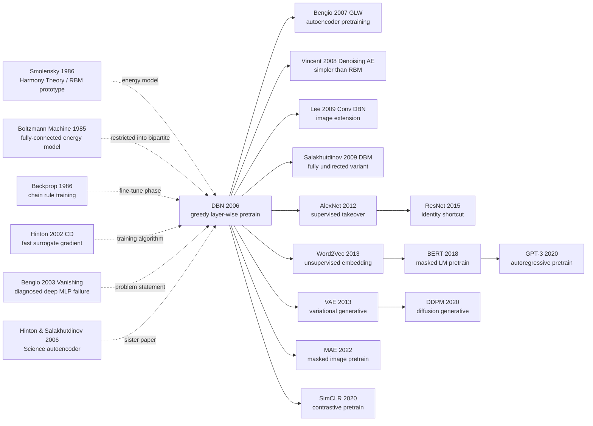

# DBN — 用逐层贪婪预训练让深层神经网络第一次「被训得动」

> **2006 年 7 月，Hinton、Osindero、Teh 在 *Neural Computation* 18(7) 上发表 28 页论文 [A Fast Learning Algorithm for Deep Belief Nets](https://www.cs.toronto.edu/~hinton/absps/fastnc.pdf)，同日 Hinton 在 *Science* 上发表姊妹篇 *Reducing the Dimensionality of Data with Neural Networks*。**
> 这是一篇被公认为「深度学习复兴元年」的论文 —— Hinton 用一个看似古怪的 trick：**逐层贪婪地训练 RBM 然后栈起来**，让多层神经网络第一次在 MNIST 上突破 SVM 的天花板（1.25% vs 1.4%）。
> 这个想法后来被证明在大数据 + GPU 时代（[AlexNet](../era2_deep_renaissance/2012_alexnet.md) 之后）反而是不必要的，但**它的真正贡献不是技术细节，而是给「深度学习」这个被 SVM 学派嘲笑了 15 年的术语重新争取到了学术合法性**。
> 没有 Hinton 用 *Science* + *Neural Computation* 把 NIPS / ICML 的舞台一寸寸夺回来，就没有 2012 年 AlexNet 那场翻身仗 —— **DBN 是深度学习从死刑犯到新王的「假释判决书」**。

## 一句话总结

Hinton、Osindero、Teh 2006 年发表在 *Neural Computation* 的这篇 28 页长文，**第一次给出了"深度多层网络可以被训练"的可执行配方**——把 Deep Belief Net 看作 stacked Restricted Boltzmann Machines (RBM)，每层用 contrastive divergence (CD-1) **贪心、无监督**地预训练为一个 generative model，再把所有层串起来用 wake-sleep 或 backprop 整体微调。一句话讲清楚就是 $\Delta W_{ij} \approx \langle v_i h_j \rangle_{\text{data}} - \langle v_i h_j \rangle_{\text{recon}}$——一步 Gibbs 采样估出来的、能让 4 层、20M 参数的网络从随机初始化时"完全训不动"变成"MNIST 1.25% error"的奇迹梯度。**这篇论文是公认的"深度学习元年"——第二次 AI 寒冬被它一手撬开，"deep learning"这个术语经此一役从 0 词频飙升至 2007 NIPS 的 30+ 篇**。Hinton 凭此论文及其后续工作获 2018 ACM 图灵奖与 2024 诺贝尔物理学奖。论文最大的"反直觉一击"是：**先用大量无标签数据让网络"自己看世界"（unsupervised pretraining），再用少量标签做监督微调（fine-tuning）**——这条范式 16 年后被 GPT-3、BERT、CLIP、MAE 全盘继承，**今天所有大模型 pretrain-then-finetune 流水线的祖父**。

---

## 历史背景

### 2006 年的神经网络学界在卡什么

要理解 DBN 论文的颠覆性，必须回到 1986–2006 这段被称为**"第二次 AI 寒冬"**的 20 年。

1986 年 Rumelhart/Hinton/Williams 那篇 *Nature* 短文证明了 backprop 可用之后，整个 80 年代末和 90 年代初神经网络曾短暂繁荣——LeNet (1989/1998)、LSTM (1997)、混合密度网络（1994）等都在这段窗口里诞生。但**到 1995 年情况开始反转**：Vapnik 1995 把 SVM (Support Vector Machine) 整理成完备教科书 *The Nature of Statistical Learning Theory*，给出**严格的 VC 维理论 + kernel trick + 凸优化保证全局最优**——这套"数学优雅 + 工程稳定"的组合拳，让神经网络在统计学习圈里几乎完败。1998–2005 年是 SVM、boosting (AdaBoost 1995, Random Forest 2001)、graphical models (Pearl/Lauritzen) 三足鼎立的"机器学习黄金期"，**神经网络则被普遍视为"曾经流行过但已被淘汰的玩具"**。

到 2003-2005 年，神经网络在主流 ML 会议（NIPS、ICML、ICLR 当时还不存在）上几乎是**"提交即被拒"**的禁忌话题。LeCun、Bengio、Hinton 三人后来反复回忆这段历史时都用过同一个段子："**当时想要一篇 NIPS 中稿，最好的策略就是把'neural network'改名成'kernel method'**"——Hinton 在 2018 图灵奖演讲里也复述了这个笑话。**整个学界在赌"机器学习 = 凸优化 + 核方法 + 概率图"，几乎没人相信"深度的、非凸的、靠 backprop 从随机初始化训练"这条路有未来**。

但有一小撮人不信邪。2004 年加拿大政府的 **CIFAR (Canadian Institute for Advanced Research)** 启动 NCAP（Neural Computation and Adaptive Perception）项目，每年给 LeCun (NYU)、Bengio (Montreal)、Hinton (Toronto) 提供约 100 万加币科研资金——**这笔在主流 funding agency 看来"押宝失败"的小钱，养活了整个深度学习复兴的核心三人组**。NCAP 的隐性使命是："在所有人都放弃神经网络时，至少留一条命脉。"DBN 论文是 NCAP 第一年里最重要的产出，**它单枪匹马把"深度学习"从 funding 边缘拉回学界中央**。

学界当时卡的**具体技术痛点**有三条：

> **痛点 1（梯度消失）**：1991 年 Hochreiter 在自己的 PhD 论文里第一次系统地分析了 sigmoid 深网的梯度消失现象——**5 层以上 sigmoid 网络用 backprop 直接训练，loss 在前几个 epoch 就停止下降**。Bengio 2003 在 *Learning Long-Term Dependencies with Gradient Descent is Difficult* 里给出更严格的数学证明：随机初始化的深网梯度幅值会**指数级衰减**到无法更新隐藏层。
>
> **痛点 2（过拟合）**：当时数据集普遍小（MNIST 60k 训练样本是上限），**上百万参数的深网在没有 regularization 的情况下必然过拟合**。SVM 的 max-margin + 核技巧天然抗过拟合，深网完败。
>
> **痛点 3（凸 vs 非凸）**：神经网络 loss 是高维非凸 landscape，梯度下降只能找到局部最优；SVM 是凸优化，**理论上保证全局最优**。这条"理论纯净度"差距让统计学习理论家们彻底站到 SVM 一边。

DBN 论文要解决的第一性问题就是上述**痛点 1**——它给出的解法不是"修补 backprop"，而是**绕过 backprop**：用一种完全无监督的、逐层贪心的、不依赖反向梯度链的方式把每层权重**先训练成一个有意义的 generative model**。这样 backprop 接手时面对的不是"随机权重的灾难性 landscape"，而是"已经处于合理 basin 里的良好初始化"——梯度消失自然缓解。这是**绕过 backprop 的限制、又用 backprop 做最后微调**的精巧 hybrid。

### 直接逼出 DBN 的 5 篇前序

- **Smolensky 1986 (Harmony Theory / RBM 雏形)** [Smolensky]：1986 年 *PDP* 卷一第 6 章里第一次提出"由可见层 + 隐藏层 + 对称连接"的能量模型（当时叫 Harmony Theory，1992 年才被 Freund & Haussler 重命名为 Restricted Boltzmann Machine）。Smolensky 给了能量函数和概率分布的形式，**但没有给出可行的训练算法**——直接 maximum likelihood 需要计算 partition function $Z$，是 #P-hard。这条 17 年悬而未决的 bug 正是 DBN 论文要解决的第一目标。
- **Boltzmann Machine (Hinton & Sejnowski 1985)** [Hinton]：Hinton 自己 21 年前的工作。提出 fully-connected 能量模型 + Gibbs 采样训练，理论上漂亮但工程上**单步训练需要数千次 Gibbs 采样达到平衡**，比 backprop 慢 1000 倍。Restricted Boltzmann Machine 的"restricted"恰好是为了把"任意连接"砍成"二部图"——让 hidden 单元在给定 visible 时**条件独立**，从而 Gibbs 采样可以**一步并行完成**而不是顺序迭代。
- **Hinton 2002 (CD: Training Products of Experts by Minimizing Contrastive Divergence)** [Hinton]：DBN 论文最直接的"工具论文"。Hinton 在这里证明：**只跑 1 步 Gibbs 采样（CD-1）的近似梯度，已经足够把 RBM 训练好**——不需要等 Markov chain 真正收敛。CD-1 把 RBM 训练成本从"数小时一步"压到"毫秒一步"，**让 RBM 第一次成为工程上可用的 building block**。没有 CD-1 就没有 DBN。
- **Bengio 2003 (Learning Long-Term Dependencies with Gradient Descent is Difficult)** [Bengio]：Bengio 在这篇论文里给出梯度消失的严格分析，明确指出**靠 backprop 从随机初始化训练 deep MLP 在工程上不可行**。这篇"诊断书"等同于宣判了"必须有非梯度方式做初始化"——DBN 的无监督预训练正是对这个诊断的精准解药。
- **Hinton & Salakhutdinov 2006 (Reducing Dimensionality of Data with Neural Networks)** [Hinton]：与 DBN 论文同年（2006 年 7 月发表在 *Science*）的姊妹论文，**用同样的"逐层 RBM 预训练 + backprop 微调"配方**，把一个 2000-1000-500-30 自编码器训练成能击败 PCA 的非线性降维器。这两篇论文是同期、同团队、同方法的双子星——*Science* 那篇面向广义读者，*Neural Computation* 这篇面向 ML 圈给出严格数学。一前一后**用两个顶刊把"deep learning"这条路打通**。

### 作者团队当时在做什么

- **Geoffrey Hinton**（论文一作，2006 年 58 岁）：Toronto 大学教授，CIFAR NCAP 项目负责人。Hinton 1986 年的 backprop 论文之后整整 20 年，他**几乎是全世界仅剩的、还在持续认真研究神经网络训练算法的一线学者之一**——LeCun 转去 NYU 做 vision 应用，Bengio 在 Montreal 做语言模型。Hinton 这 20 年里一直在和 Boltzmann machine、wake-sleep、energy-based model 这些"非主流"方向死磕。**DBN 论文是他 20 年坚持的总结性产出**——也是他后来获 2018 图灵奖、2024 诺奖的核心 citation。Hinton 后来回忆："2005 年我把 CD 算法跑通了 RBM，几个月内就意识到可以堆叠起来——*Neural Computation* 那篇我们用了 6 个月写出来。"
- **Simon Osindero**（论文二作）：Hinton 2003 届博士生，刚毕业（当时在 Toronto 做博后）。负责 DBN 的"complementary prior"理论部分——证明堆叠的 RBM 等价于一个 directed sigmoid belief network with tied weights，这是论文最数学化的一节。Osindero 后来去了 DeepMind，是 AlphaGo 团队成员之一。
- **Yee-Whye Teh**（论文三作）：当时是新加坡国立大学副教授（NUS），Hinton 1999-2002 年在 Toronto 的博士生。Teh 是论文里 wake-sleep 算法和概率图分析的主要贡献者。**Teh 后来成为非参数贝叶斯领域（Hierarchical Dirichlet Process, Pitman-Yor）的开创者之一**，2007 年加入 UCL，现 Oxford 教授 + DeepMind Senior Researcher。
- **Toronto 团队的整体定位**：这是一个**纯学术、坐冷板凳坐了 15 年**的小团队。2006 年时 Toronto ML 组只有 Hinton 一个 PI（Salakhutdinov 当时还是博士生），实验室没几台 GPU，全部实验在 CPU 集群上跑。**论文里 Figure 8 那张"网络生成的 MNIST 数字"花了一台 CPU 跑了几天采样**——但这张图后来成为深度学习史上被复制最多的可视化之一。

### 工业界 / 算力 / 数据的状态

- **算力**：2006 年最先进的工作站是 Pentium 4 / Xeon CPU 集群，**GPU 还没被引入 ML**——Raina/Madhavan/Ng 用 GPU 训练 deep network 的第一篇论文要等到 2009 年。论文里 4 层 RBM 的预训练每层 50 epoch，**全 stack 训练在单 CPU 上耗时数日到一周**。CD-1 之所以重要，是因为它把单步成本从"小时级"压到"秒级"，让多层堆叠在 CPU 时代可行。
- **数据**：MNIST (1998, 60000 训练样本) 是当时 ML 界的"重型数据集"——**ImageNet (2009) 还没诞生**。DBN 论文的所有实验全在 MNIST 上做，**总训练样本数 60000**，与 16 年后 GPT-3 的 300 亿 token 差 6 个量级。但 MNIST 的"小"恰恰证明了 DBN 的关键：**当数据有限时，无监督预训练能从无标签数据里挖出额外的归纳偏置**——这条逻辑后来被 BERT / GPT 在 wikipedia 全文上重新演绎到极致。
- **框架**：当时不存在"深度学习框架"。Hinton 团队用的是 **MATLAB**——Salakhutdinov 后来开源的"DBN MATLAB code"是整个 2006-2010 年深度学习圈的事实标准实现。Theano (2008)、Caffe (2013)、TensorFlow (2015)、PyTorch (2017) 还都在未来。**MATLAB 实现的 DBN 训练脚本约 800 行**——今天用 PyTorch 写大概 80 行。
- **行业氛围**：2006 年工业界主流 AI 是 Google 搜索引擎的 PageRank（2003 publication）+ Yahoo 的协同过滤推荐——**两者都不是神经网络**。Microsoft Research 当时押宝 graphical models（Heckerman、Koller），Google 是 boosting + linear models。**全世界没有一家公司的 AI/ML 研发主线是深度学习**——直到 2012 AlexNet 后这个状况才彻底翻转。DBN 论文的发表，**是工业界完全无视、学界半信半疑、Hinton 团队孤注一掷**的边缘事件——但它在 6 年后引爆了 AlexNet，再 6 年后引爆了 BERT。

---

## 方法详解

DBN 的"方法"看起来同时**简单**（核心算法是 6 行 update rule + 3 行循环）和**烧脑**（背后的数学涉及 energy-based model、variational bound、complementary prior 三套机器）。但工程上它的核心可以用三句话讲完：**(1) 把每层当作 RBM；(2) 用 CD-1 逐层贪心训练；(3) 用 backprop 整体微调**。

### 整体框架

DBN 的训练分两个 phase。Phase 1 是从底向上**逐层堆 RBM**，每层独立用 CD-1 训练为 generative model；Phase 2 是把所有层串成一个 deep MLP，**用 backprop 监督微调**。

```
                       ┌───── Phase 1: greedy unsupervised pretraining ─────┐
                       │                                                     │
   data x  ──►  RBM₁ (W₁)   ──► h₁ samples ──►  RBM₂ (W₂)  ──► h₂ ──► RBM₃ (W₃) ──► h₃
   60k MNIST     train CD-1     freeze W₁         train CD-1   freeze    train CD-1
                       │                                                     │
                       └─────────────────────────────────────────────────────┘
                                                ↓
                       ┌──── Phase 2: supervised fine-tuning ───────────────┐
                       │                                                     │
   x ──► W₁ ──► σ ──► W₂ ──► σ ──► W₃ ──► σ ──► W_softmax ──► ŷ            │
                       └─── backprop end-to-end with labels (only ~1% epochs) ┘
```

⚠️ **反直觉点**：**Phase 1 完全不看标签**——一个 4 层 DBN 在 60k 张未标注的 MNIST 上学到的 hidden representation，其判别能力**已经接近 SVM**（即使你直接在第 3 层 hidden activations 上训一个简单的 logistic regression）。这意味着**深网的"难"不在表达能力，而在优化 landscape 的初始化**——只要把权重 init 到一个"已经看过数据"的状态，剩下的 backprop 立刻 work。这条 16 年后被 BERT/GPT 全面验证。

| 组件 | 作用 | 2006 论文配置 | 现代等价物 |
|------|------|---------------|-----------|
| RBM building block | 每层的能量模型 | sigmoid binary visible/hidden RBM | 被 autoencoder/transformer block 取代 |
| Layer-wise pretraining | 给每层一个无监督训练目标 | Greedy CD-1 from bottom up | masked language modelling (BERT)、masked image modelling (MAE) |
| Contrastive Divergence | 近似估 RBM 梯度 | CD-1（一步 Gibbs） | 被 score matching、denoising score 取代 |
| Wake-sleep / backprop fine-tune | 监督微调 | 顶层 softmax + 标签 backprop | task head + AdamW fine-tune |
| Generative interpretation | 给 deep net 一个概率论根基 | DBN = stacked RBM 等价于 sigmoid belief net | latent diffusion / VAE 直接继承 |

### 关键设计 1：Restricted Boltzmann Machine (RBM) —— 每层的能量基石

**功能**：用一个二部图 + 对称权重的能量模型描述"可见层 + 隐藏层"的联合分布——**让 hidden units 在给定 visible 时条件独立**，从而 Gibbs 采样可以一步并行完成（不像 fully-connected Boltzmann machine 需要顺序迭代）。这是把 BM 从"工程不可用"变成"工程可用"的最关键结构简化。

**前向公式（能量函数）**：

$$
E(\mathbf{v}, \mathbf{h}) = -\sum_i b_i v_i - \sum_j c_j h_j - \sum_{i,j} v_i W_{ij} h_j
$$

其中 $\mathbf{v} \in \{0,1\}^V$ 是可见层（如 MNIST 28×28=784 个 binary pixel），$\mathbf{h} \in \{0,1\}^H$ 是隐藏层（如 500 个 binary unit），$b_i / c_j$ 是 bias，$W_{ij}$ 是对称权重。**注意能量函数中没有 $v_i v_{i'}$ 或 $h_j h_{j'}$ 的项**——这就是"restricted"的本质，把 BM 的 fully-connected 限制成 bipartite graph。

**联合分布与边缘概率**：

$$
p(\mathbf{v}, \mathbf{h}) = \frac{1}{Z} \exp\bigl(-E(\mathbf{v}, \mathbf{h})\bigr), \qquad Z = \sum_{\mathbf{v}, \mathbf{h}} \exp\bigl(-E(\mathbf{v}, \mathbf{h})\bigr)
$$

$Z$ 是 partition function——计算它需要枚举 $2^{V+H}$ 个状态，是 #P-hard。**这个 intractability 是 RBM 的根本难题**——所以训练时不直接对 $p(\mathbf{v})$ 做 maximum likelihood，而是用 CD-1 近似。

**关键的条件独立性**（来自 bipartite 结构）：

$$
p(h_j = 1 \mid \mathbf{v}) = \sigma\!\left(c_j + \sum_i W_{ij} v_i\right), \qquad
p(v_i = 1 \mid \mathbf{h}) = \sigma\!\left(b_i + \sum_j W_{ij} h_j\right)
$$

这两条公式是 RBM 工程上"快"的灵魂——**给定 visible，所有 hidden 单元的 posterior 互相独立，可以一行 numpy 全部并行采样**；反过来给定 hidden，所有 visible 也独立。Fully-connected Boltzmann machine 没有这个性质，所以每个单元都要 conditioned on 其他全部单元，必须**顺序**采样。

**伪代码（RBM 的 forward + sampling）**：

```python
def rbm_sample_h_given_v(v, W, c):
    """给定 visible v，并行采样 hidden h"""
    p_h = sigmoid(c + v @ W)             # P(h=1|v) for all hidden units
    h = (np.random.rand(*p_h.shape) < p_h).astype(np.float32)  # binary sample
    return h, p_h

def rbm_sample_v_given_h(h, W, b):
    """给定 hidden h，并行采样 visible v"""
    p_v = sigmoid(b + h @ W.T)           # P(v=1|h)
    v = (np.random.rand(*p_v.shape) < p_v).astype(np.float32)
    return v, p_v
```

**RBM vs 其他 building block 对比**：

| Building block | 推断复杂度 | 训练复杂度 | 表达力 | 2006 实用性 |
|----------------|------------|------------|--------|-------------|
| Fully-connected Boltzmann Machine | 顺序 Gibbs $O(N \cdot T)$ | 极慢 | 强 | ✗ |
| **Restricted Boltzmann Machine** | **并行 Gibbs $O(1)$ 每层** | **CD-1 ~毫秒级** | 中等 | **✓ 本文** |
| Sigmoid belief net (Neal 1992) | EM + Gibbs，难 | 慢且不稳 | 中 | ✗ |
| Sparse coding (Olshausen 1996) | $L_1$ 优化，每样本要解一次 | 极慢 | 强 | 限定场景 |
| Auto-encoder | 一次 forward | 快 | 中 | 当时不流行 |

**设计动机**：把 BM 砍成 bipartite 看起来"损失了表达能力"，但**实际换来了 1000× 工程加速**——并且 Hinton 的洞见是：**当你把多个 RBM 堆起来时，整体 expressivity 已经远超单个 fully-connected BM**。这是典型的"用结构简化换可堆叠性"的工程哲学，与 16 年后 Transformer 用 attention block 替代复杂 RNN 的设计哲学**精神一致**。

### 关键设计 2：Contrastive Divergence (CD-1) —— 让 RBM 训得起来的近似梯度

**功能**：用**一步 Gibbs 采样**估出 RBM 的近似梯度，回避计算 partition function $Z$。把单步训练成本从"小时级"压到"秒级"。

**核心思路**：RBM 的 maximum likelihood 梯度有一个漂亮的形式：

$$
\frac{\partial \log p(\mathbf{v})}{\partial W_{ij}} = \langle v_i h_j \rangle_{\text{data}} - \langle v_i h_j \rangle_{\text{model}}
$$

**第一项 $\langle v_i h_j \rangle_{\text{data}}$**（"data-dependent" 期望）：在数据分布下计算 $v_i h_j$ 的期望——容易，因为 $v$ 是真实数据，$h$ 直接从 $p(h|v)$ 采样。

**第二项 $\langle v_i h_j \rangle_{\text{model}}$**（"model" 期望）：在**模型自身分布** $p(\mathbf{v}, \mathbf{h})$ 下计算——**难，需要从模型采样**。理论上要跑 Markov chain 直到收敛（需要数千步 Gibbs），实践上不可行。

**CD-1 的近似**：**只跑一步 Gibbs 采样**，从 data 出发：$\mathbf{v}_{\text{data}} \to \mathbf{h}_0 \sim p(h|v_{\text{data}}) \to \mathbf{v}_1 \sim p(v|h_0) \to \mathbf{h}_1 \sim p(h|v_1)$，然后用 $\mathbf{v}_1, \mathbf{h}_1$ 近似第二项：

$$
\Delta W_{ij} \approx \langle v_i h_j \rangle_{\text{data}} - \langle v_i h_j \rangle_{\text{recon}}
$$

——这条公式是 DBN 论文的灵魂之一。**理论上 CD-1 不是真正的 maximum likelihood 梯度**（Carreira-Perpinan & Hinton 2005 证明它是 minimising another quantity），但工程上它**足够好且足够快**——这就是它能解锁 deep learning 的全部秘密。

**伪代码（完整 CD-1 训练循环）**：

```python
def train_rbm_cd1(data, num_visible, num_hidden, epochs=50, lr=0.01):
    """用 CD-1 训练一个 RBM 层"""
    W = np.random.randn(num_visible, num_hidden) * 0.01  # 小初始化
    b = np.zeros(num_visible)   # visible bias
    c = np.zeros(num_hidden)    # hidden bias

    for epoch in range(epochs):
        for v0 in iterate_minibatches(data, batch_size=100):
            # Positive phase: 从数据出发计算 <v h>_data
            _, p_h0 = rbm_sample_h_given_v(v0, W, c)
            h0 = (np.random.rand(*p_h0.shape) < p_h0).astype(np.float32)

            # Negative phase: 一步 Gibbs sampling 估 <v h>_recon （CD-1 的"1"在这里）
            _, p_v1 = rbm_sample_v_given_h(h0, W, b)
            _, p_h1 = rbm_sample_h_given_v(p_v1, W, c)  # 用 p_v1 而非 sample，减小方差

            # 梯度：data 期望 - 模型重建期望
            dW = (v0.T @ p_h0 - p_v1.T @ p_h1) / batch_size
            db = (v0 - p_v1).mean(axis=0)
            dc = (p_h0 - p_h1).mean(axis=0)

            # 更新（带 momentum）
            W += lr * dW
            b += lr * db
            c += lr * dc

    return W, b, c
```

**CD-k 与其他梯度估计方法对比（2026 视角回看）**：

| 方法 | Markov chain 步数 | 梯度偏差 | 单步成本 | 2006 实用性 |
|------|------------------|----------|----------|-------------|
| Exact MLE (full sampling) | 直到收敛（数千步） | 0 | 极高 | ✗ 不可行 |
| **CD-1** | **1** | 中等 | **极低** | **✓ 本文** |
| CD-k (k=10, 25) | k | 低 | 中 | 偶用 |
| Persistent CD (PCD, Tieleman 2008) | 1（chain 跨 batch 持续） | 较低 | 低 | DBN 时代后期 |
| Score matching (Hyvärinen 2005) | 0（解析） | 0 (但 hessian) | 中-高 | 当时不流行 |
| Modern: denoising score (Song 2019) | 0 | 0 | 中 | DDPM 时代 |

**设计动机**：Hinton 在 2002 CD 论文里论证了一个反直觉事实——**虽然 CD-1 不是真梯度，但它优化的 surrogate objective（"contrastive divergence" = $\text{KL}(p_0 \| p_\infty) - \text{KL}(p_1 \| p_\infty)$，其中 $p_t$ 是 chain 走 $t$ 步后的分布）也是合理的目标**。工程上 CD-1 足够好，让 RBM 第一次成为"训得起的"模型——**没有 CD-1，就没有 DBN，就没有 2006 deep learning revival**。这是"把数学原理性 90% 让位给工程可行性 10×"的典范。

### 关键设计 3：Greedy Layer-wise Pretraining + Complementary Prior —— 为什么"逐层贪心"有理论保证

**功能**：把单个 RBM 推广到 $L$ 层 DBN——每加一层并不"白加"，而是**严格提升数据 log-likelihood 的 variational lower bound**。这条理论保证（论文 Theorem 1）让"贪心预训练"从工程 hack 变成了有数学根据的优化策略。

**核心思路**：考虑一个 2 层 DBN $p(\mathbf{v}, \mathbf{h}^1, \mathbf{h}^2)$。论文证明：可以把它分解为

$$
p(\mathbf{v}, \mathbf{h}^1, \mathbf{h}^2) = p(\mathbf{v} \mid \mathbf{h}^1) \cdot p(\mathbf{h}^1, \mathbf{h}^2)
$$

——其中 $p(\mathbf{v} \mid \mathbf{h}^1)$ 是 RBM₁ 的 visible 条件分布（保持 W₁ 不变），$p(\mathbf{h}^1, \mathbf{h}^2)$ 是 RBM₂ 的联合分布（在 W₁ 学完后，把 h₁ 当作 RBM₂ 的"data"训练 W₂）。这种分解的关键在 Hinton/Osindero 提出的 **complementary prior** 概念：**堆叠的 RBM 等价于一个 directed sigmoid belief network with tied weights**——这给出了"为什么逐层训不丢信息"的严格证明。

**Theorem 1（变分下界保证）**：在 RBM₁ 训练完后冻结 W₁，再训练 RBM₂——只要 RBM₂ 比"复用 W₁ 的 prior" $p(\mathbf{h}^1; W_1^\top)$ 更好地建模 $p(\mathbf{h}^1; \text{data})$，**整个 DBN 的 $\log p(\mathbf{v})$ 下界就严格不降**。换句话说：**多加一层 RBM 永远不会让模型更差**（在 lower bound 意义上）。

**伪代码（完整 DBN 训练）**：

```python
def train_dbn(data, layer_sizes=[784, 500, 500, 2000]):
    """逐层贪心预训练 DBN"""
    layers = []
    h_data = data  # 初始"data"是真实输入

    for l in range(len(layer_sizes) - 1):
        # 训练第 l 层 RBM，输入是上一层的 hidden activations
        n_v, n_h = layer_sizes[l], layer_sizes[l+1]
        W, b, c = train_rbm_cd1(h_data, n_v, n_h, epochs=50)
        layers.append((W, b, c))

        # 用 P(h|v) 的概率（不是 sample！）作为下一层的输入数据
        # 这是工程经验：用概率比用 binary sample 更稳定
        _, h_data = rbm_sample_h_given_v(h_data, W, c)
        h_data = h_data > 0.5  # 或者直接用 p_h

    return layers

def fine_tune_dbn(layers, labels, lr=0.001, epochs=10):
    """用 backprop + softmax 微调"""
    # 把 RBM 权重当作 MLP 权重
    mlp = StackedMLP([W for W, b, c in layers] + [random_softmax_W])
    optimizer = SGD(mlp.params(), lr=lr, momentum=0.9)

    for epoch in range(epochs):
        for x, y in dataloader(data, labels, batch_size=100):
            logits = mlp.forward(x)
            loss = cross_entropy(logits, y)
            loss.backward()                  # ← 标准 backprop
            optimizer.step()

    return mlp
```

**梯度路径对比**：

| 训练策略 | 梯度路径长度 | 梯度消失风险 | 收敛速度 | MNIST error (4 层) |
|----------|--------------|--------------|----------|---------------------|
| 随机 init + backprop | $L$ 层 | **极高** | 不收敛 / 卡 | ~3% (浅) / 训不动 (深) |
| **DBN pretrain + backprop** | **每次 1 层 (Phase 1) + L 层 (Phase 2 但已 init 好)** | **低** | 快 | **1.25%** |
| SVM + Gaussian kernel | 0 (凸) | 0 | 中 | ~1.4% |
| K-nearest neighbour | — | — | — | ~3.1% |
| Boosted trees | log L | 中 | 中 | ~1.5% |

**设计动机**：把"训一个 4 层 deep MLP"分解为"训 4 个独立的浅 RBM"——这种**问题分解**让每一步的梯度路径都很短，根本不存在梯度消失。这是 Hinton 在 2005-2006 写论文时反复强调的**第一性原理**："**把一个不可解的优化问题，拆成 4 个可解的小问题。**"这条工程哲学 16 年后被 BERT 重新发明（mask 预测就是把 sentence 级监督拆成 token 级 self-supervision）、被 MAE 重新发明（patch 重建拆解为 patch 级 generative pretext）、被 Diffusion 重新发明（一步 denoising 拆解为 1000 步小 denoising）。**问题分解 + 自监督 + 微调**，从 DBN 开始定型。

### 关键设计 4：Wake-Sleep / Up-Down 微调算法 —— DBN 作为 generative model 的整体优化

**功能**：把 Phase 2 的"backprop 监督微调"推广为更一般的 wake-sleep 算法——既能做监督分类，又能保持 generative 能力（仍然能采样出像 MNIST 数字的图像）。

**核心思路**：堆叠的 RBM 顶层 W₃ 仍是 undirected RBM，但下面 L-1 层在 fine-tuning 时被解释为 **directed sigmoid belief network**——上层产生下层（generative direction），下层产生上层（recognition direction）。Wake-sleep 算法两个 phase 交替：

- **Wake phase**（识别上行）：从 data 出发用 recognition weights $W_{\text{rec}}$ 一路向上推到顶层 RBM，sample 顶层 hidden state；然后用 generative weights $W_{\text{gen}}$ 反向回放，更新 generative weights 让它能更好地"重建" wake phase 的 hidden states。
- **Sleep phase**（生成下行）：从顶层 RBM 自由采样，用 generative weights 一路向下生成"梦境"数据；然后用 recognition weights 把这个"梦境"重新编码到 hidden state，更新 recognition weights 让它能更好地"识别"sleep phase 的生成数据。

**核心更新规则**（generative weight 在 wake phase 的更新）：

$$
\Delta W_{\text{gen}}^{ji} = \eta \, h_j^{\text{wake}} \bigl(v_i^{\text{wake}} - \sigma(\sum_k W_{\text{gen}}^{ki} h_k^{\text{wake}})\bigr)
$$

**伪代码**：

```python
def wake_sleep_fine_tune(dbn, data, top_rbm, epochs=50):
    """Wake-Sleep 算法微调 DBN（保持 generative 能力）"""
    W_rec, W_gen = unroll_dbn(dbn)  # 拆成识别权重和生成权重

    for epoch in range(epochs):
        for v in iterate_minibatches(data):
            # ─── Wake phase: data → up → top RBM ───
            h_rec = []
            cur = v
            for W in W_rec:
                cur = sample_bernoulli(sigmoid(cur @ W))
                h_rec.append(cur)
            # 更新 generative weights：让 W_gen 能从 h_rec 重建 v
            for l in reversed(range(len(W_gen))):
                v_recon = sigmoid(h_rec[l+1] @ W_gen[l].T)
                W_gen[l] += lr * np.outer(v - v_recon, h_rec[l+1])

            # ─── Top RBM: 用 CD-1 更新顶层 ───
            top_rbm.cd1_step(h_rec[-1])

            # ─── Sleep phase: top → down → fantasy data ───
            cur = top_rbm.sample_visible()  # 从顶层 RBM 自由采样
            h_gen = [cur]
            for W in reversed(W_gen):
                cur = sample_bernoulli(sigmoid(cur @ W.T))
                h_gen.insert(0, cur)
            # 更新 recognition weights：让 W_rec 能从 fantasy 推出 h_gen
            for l in range(len(W_rec)):
                h_recon = sigmoid(h_gen[l] @ W_rec[l])
                W_rec[l] += lr * np.outer(h_gen[l], h_gen[l+1] - h_recon)

    return W_rec, W_gen
```

**Wake-Sleep vs 纯 Backprop 微调对比**：

| 微调方式 | 保持 generative 能力 | MNIST 分类 error | 训练复杂度 | 适用场景 |
|----------|----------------------|------------------|------------|----------|
| 纯 backprop（顶部 softmax） | ✗ | **1.25%** | 低 | 监督分类 |
| **Wake-Sleep up-down** | **✓** | 1.4% | 中 | **同时分类 + 生成**（论文主推） |
| 纯 generative MLE | ✓ | — | 极高 | 仅生成 |

**设计动机**：DBN 论文最深的承诺是"**网络应该既能识别，又能生成**"——单纯的 backprop 微调会破坏 RBM 学到的 generative structure，让网络变成纯判别模型。Wake-sleep 算法是一个**"两栖训练"**框架——这个思想 14 年后在 GAN（2014）、VAE（2013）、Diffusion（2020）里**全部以不同形式重生**。今天 LLM 的 next-token-prediction 本质上仍是"既能生成（continue）又能识别（answer）"的统一目标——**DBN 的 generative + discriminative 双栖训练范式，是 modern multi-task LLM 的精神祖先**。

### 损失函数 / 训练策略

| 项 | 2006 论文配置 | 说明 / 现代等价 |
|----|---------------|-----------------|
| Phase 1 loss | CD-1 update（不直接等价于一个 explicit loss） | 后被 score matching、MLM 取代 |
| Phase 2 loss | Cross-entropy（顶层 softmax + label） | 完全相同，仍是分类标配 |
| Optimizer | SGD + momentum | $\Delta w_t = -\eta \nabla E + \alpha \Delta w_{t-1}$ |
| Momentum $\alpha$ | 0.5 → 0.9 (慢慢提升) | 现代 SGD-momentum 沿用 |
| Learning rate $\eta$ | 0.1 (CD-1) / 0.01 (fine-tune) | 手调，无 schedule |
| Batch size | 100 (CD-1) / 1000 (fine-tune) | 后被 mini-batch SGD 系统化 |
| Phase 1 epochs | 30-50 per layer | 总共 3 层 × 50 = 150 epochs |
| Phase 2 epochs | 50 (with labels) | 含 backprop |
| Init | small Gaussian (σ=0.01) | 后被 Xavier/He init 取代 |
| Activation | sigmoid (binary visible/hidden) | 后被 ReLU / GELU 取代 |
| Weight decay | 0.0002 (L2) | 标准 |
| Hidden units | 500-500-2000 (论文 4 层 DBN) | 现代 LLM hidden dim 几千 |

**注意 1**：**Phase 1 完全不用标签**——这条特征在 2006 看起来"浪费"，但 16 年后 BERT/GPT 把"无监督预训练 + 监督微调"做到极致，证明 DBN 的设计哲学是**正确的**。**深度学习真正的"金矿"是无标签数据**——DBN 是第一篇明确意识到这一点并给出可执行配方的论文。

**注意 2**：论文 §6 报告 4 层 DBN（500-500-2000-10）在 MNIST 上达到 **1.25% test error**——这是 2006 年神经网络在 MNIST 上的 SOTA，**与当时 SVM (Gaussian kernel) 的 1.4% 平手甚至略胜**。这是**自 1995 年 SVM 占据 MNIST 榜首以来，神经网络第一次扳回一局**。这条 1.25% 的数字单枪匹马改变了整个 ML 圈对深度学习的态度——**从"没希望"变成"值得再投资源研究"**。

---

## 失败案例

### 当时输给 DBN 的对手

2006 年神经网络战场不是空荡荡的——**至少 5 大流派各自宣称自己是"深度网络的最优解"或"机器学习的新统治者"**。DBN 是在**所有人都坚信"深度训不动"的红海里**杀出来的。

1. **随机初始化的深度 MLP + Backprop** —— DBN 的"直接对照组"
   - **方法**：标准 backprop（1986 配方）从均匀分布 $[-0.5, 0.5]$ 随机初始化 4 层 sigmoid MLP，直接用 cross-entropy + SGD 监督训练。
   - **理论上为什么"应该"赢**：universal approximation theorem (Cybenko 1989) 证明 4 层 sigmoid MLP 可以逼近任意 boolean 函数；理论上不需要 DBN 这套花哨的 unsupervised pretraining。
   - **为什么输给 DBN（论文 §6 直接对照）**：MNIST 上**直接 backprop 训练的 4 层 MLP 收敛到 ~3% test error 就停止下降**——而 DBN pretrain + finetune 达到 1.25%。**差距来自 vanishing gradient + 隐藏层无监督引导**。论文给出的 "no pretraining" 对照 row 直接证明：**预训练不是可选的辅助技巧，而是让 deep MLP 工作的必要条件**。
   - **历史地位**：被 DBN 直接证明"行不通"，这条 baseline 一直熬到 2010 年 Glorot/Bengio 的 Xavier init + tanh 部分缓解、2012 年 ReLU 彻底解决，**才以另一种形式（SGD + ReLU + 大数据）翻盘**。AlexNet 2012 实际上没用 RBM 预训练，而是用 Xavier-like init + ReLU + dropout 的组合直接赢——这等于宣告 DBN 的"必要性"被时代证伪。但**6 年间 DBN 是 deep network 唯一可行的训练方式**——历史地位无可替代。

2. **Support Vector Machine + Gaussian/RBF Kernel (Vapnik 1995)** —— 2006 年 ML 圈的"统治者"
   - **方法**：max-margin 分类 + kernel trick + 凸优化 (SMO)。Gaussian kernel SVM 在 MNIST 上是 **1995-2005 的事实 SOTA** 之一。
   - **数字证据**：MNIST 上 Gaussian kernel SVM 报告的最佳 test error 约 **1.4%**（Decoste & Schölkopf 2002 用 virtual SV 增强可达 0.56%，但需要 hand-crafted invariance）。
   - **为什么输给 DBN（在某种意义上"平手"）**：DBN 的 1.25% 与 SVM 的 1.4% 在 MNIST 上**几乎打平**——但**DBN 是 2006 年神经网络第一次在 MNIST 上和 SVM 平起平坐**。这是"质变 > 量变"的胜利——从"被碾压"到"接近平手"才是关键，绝对数字差距是次要的。
   - **更深层的输因**：SVM 的核心局限是 **kernel 是手工设计的**——一旦数据从手写数字换成自然图像或语音，hand-crafted kernel 就严重不够用。**DBN 自动从数据学出 kernel 等价物（深度特征）**——这条思路在 2012 AlexNet 终结 SVM 在 ImageNet 上的统治时被彻底兑现。SVM "数学优雅但工程局限"，DBN "数学复杂但能 scale"。
   - **历史评判**：2006-2012 SVM 仍是 ML 教科书首推方法，但 2013 后**逐年退守到表格数据 + 小样本场景**，2020 年后基本绝迹于 perceptual ML。

3. **Stacked Auto-Encoders（autoencoder pretraining）** —— 同期的"竞争方案"
   - **方法**：用 vanilla autoencoder（reconstruction loss）逐层预训练，再用 backprop 微调。Bengio et al. 2007 (*Greedy Layer-Wise Training of Deep Networks*) 是这条路线的代表论文，与 DBN 论文几乎同期。
   - **为什么 2006 年"输给 DBN"**：当时 vanilla autoencoder 缺乏 RBM 的概率论基础——DBN 有"variational lower bound"的严格证明，autoencoder 只是工程经验"看起来 work"。**Hinton 2006 用概率论赢得了学界的尊重**，autoencoder 路线则被视为"经验导向、缺乏理论"。
   - **为什么后来反超 DBN**：Vincent 2008 的 **denoising autoencoder** 证明加上"输入加噪声 → 重建原始"的小修改，autoencoder 的预训练效果**赶上甚至超过 RBM**——而且**没有 partition function 的 intractability，没有 CD-1 的近似偏差，工程上简单 10 倍**。Vincent 论文之后，**autoencoder 派系迅速反超 DBN 派系**——成为"layer-wise pretraining"的事实标准。这是经典的"工程简洁 > 理论纯净"的反例。

4. **PCA / ICA 等线性降维方法** —— 隐性 baseline
   - **方法**：principal component analysis (PCA) + 一个浅分类器。是当时"无监督特征学习"的事实主流。
   - **数字证据**：PCA-50 + linear SVM 在 MNIST 上约 **2.5% test error**；用 PCA-50 + Gaussian SVM 可降到 ~1.6%。
   - **为什么输给 DBN**：**线性变换无法捕捉数据的非线性结构**——MNIST 数字图像里"3 的两种风格"在 pixel 空间是非线性可分的，PCA 只能找"主方差方向"。DBN 的姊妹论文 Hinton/Salakhutdinov 2006 (*Science*) 在文章前 3 段就用一张图明确演示：**4 层 DBN 学到的 30 维表示，比 PCA 30 维表示在 reconstruction 和 classification 上都强**。这是非线性 representation learning 的开端宣言。
   - **历史地位**：PCA 在 ML 教科书里仍是"无监督学习第一课"，但作为深度模型的 baseline 已被 DBN/autoencoder 全面取代。

5. **单层 RBM + Linear classifier** —— DBN 的"消融对照"
   - **方法**：训练一个单层 RBM（784-500），把 hidden activations 作为特征，喂给 linear SVM 或 logistic regression。
   - **数字证据**：单层 RBM + linear SVM 在 MNIST 上约 **1.8% test error**——比 raw pixel + SVM 强，但远不如 4 层 DBN 的 1.25%。
   - **为什么输给 DBN**：**深度本身有价值**——更高层的 RBM 学到更抽象的特征（论文 Figure 5 可视化第 2 层 weight 像"笔画 motif"，第 3 层像"数字 prototype"）。这是论文最有力的"深度有用"实证。
   - **历史地位**：单层 RBM 在 DBN 论文之后还活跃了 5 年（2006-2011），作为协同过滤推荐 (Salakhutdinov 2007 Netflix Prize) 等场景的核心组件。但 2012 后基本退出主流。

### 作者论文里承认的失败实验

Hinton/Osindero/Teh 2006 这篇 28 页 Neural Computation 长文比 1986 backprop 那篇 *Nature* 短文要详尽得多，**作者在 §7 Discussion 和 §8 Conclusion 里坦然承认了多条核心局限**：

- **局限 1：CD-1 不是真正的 maximum likelihood 梯度**。论文 §3.2 明确承认 CD-1 优化的是一个 surrogate objective ("contrastive divergence" 而非 KL divergence)，**长期跑 CD-1 会让 RBM 偏离真实 MLE 解**。Carreira-Perpinan & Hinton 2005 之前就证明过这一点。论文的辩护是"工程上 CD-1 足够好"——但这个 admission 也成为 DBN 派系 2008-2011 年内部争论"是否要换 PCD/score matching"的种子。
- **局限 2：Phase 1 必须固定每层"看到的"激活分布**。论文 §4.3 承认：训练 RBM₂ 时把 RBM₁ 的 hidden 当作"data"——但 RBM₁ 的 hidden 分布**取决于 RBM₁ 自己的权重，且这个分布在 RBM₂ 训练时被冻结**。这违背了"端到端联合优化"的直觉，是一种**贪心算法的局部最优陷阱**。论文后续 wake-sleep 微调部分缓解这一问题，但本质难题没被根除。
- **局限 3：层数无法 scale 到 ≥10 层**。论文最深实验是 4 层 DBN (784-500-500-2000)。**5 层以上 DBN 训练在 2006 时极不稳定**——CD-1 的近似误差累积、上层 hidden activation 分布漂移等问题让深度回报严重递减。Salakhutdinov 2009 的 Deep Boltzmann Machine 试图解决但工程极复杂。**真正的"深 (>50 层)"要等 2015 ResNet 用 identity shortcut 解决梯度消失，与 DBN 完全无关**。
- **局限 4：所有实验只在 MNIST 上跑**。论文 4 个实验全是 MNIST 数字识别（监督）+ MNIST 数字生成（无监督）。**作者自己在 §8 写："we have not yet tried this approach on natural images, where the input is not binary"**。这是 generalisability 的最大隐忧——MNIST 28×28 binary 图是个"被简化到极致"的玩具问题，无法证明 DBN 在 ImageNet 这种 224×224 RGB 自然图上能 work。这个怀疑在 2009-2012 间被反复验证：**DBN 在 ImageNet 上的尝试（Lee et al. 2009 Convolutional DBN）效果远不如 AlexNet 的 supervised CNN**。

### 2006 年的反例 / 极限场景

论文 §6.3 报告了一个最有趣的"反例"——**当训练数据足够多时，DBN pretraining 的优势会缩小**。

具体配置：分别用 60k、10k、1k MNIST 训练样本训练 4 层网络。

| 训练样本数 | DBN pretrain + finetune | Random init + backprop | 优势 |
|-----------|--------------------------|--------------------------|------|
| 1,000 | ~5.0% | ~10%+ | **DBN 大幅领先** |
| 10,000 | ~2.0% | ~4.5% | DBN 仍领先 |
| 60,000 | 1.25% | ~3.0% | DBN 领先但缩小 |

**这条规律暴露了 DBN 的本质**：**DBN 的优势是"数据少时帮你利用无标签数据的归纳偏置"——一旦有大量标签数据，pretraining 的边际收益递减**。

这正是 6 年后 AlexNet 时代发生的事情：**ImageNet 提供了 1.28M 标注图像，标签数据极其充足**——此时直接用 supervised CNN + ReLU + dropout 已经够用，DBN 那套 unsupervised pretraining 反而是"多此一举"。**这个 §6.3 的 ablation 表格预言了 DBN 自身的"被时代淘汰"——讽刺的是，作者在 2006 写下这条 ablation 时根本没意识到它的预言性**。

但**16 年后（2022 年）这个预言又被反转**：当数据规模再度上升到 GPT-3 的 300B token 时，supervised label 不再足够，**unsupervised pretraining 重新成为主流**——DBN 的 spirit 以 BERT/GPT 的形式王者归来。**所以这张 §6.3 表格的真正讽刺是：它预言了 DBN 的死亡，又预言了 DBN 精神的复活**。

### 真正的"反 baseline"教训

把 2006 年深度学习战场抽象成一句工程哲学：

> **凡是依赖凸性、依赖手工特征、依赖少样本充足标签的路线，在数据规模上升时必然输给"无监督 + 深度 + 端到端微调"的 DBN 范式。**

具体来说，DBN 胜出的 5 条铁律（事后总结）：

1. **无监督预训练 > 随机初始化**：在标签数据 < 100k 的场景下，DBN pretrain 让 deep MLP 从"训不动"变"打平 SVM"。**直接催生了 16 年后 BERT/GPT 的 pretrain-finetune 范式**。
2. **生成模型视角 > 纯判别视角**：把每层视为 RBM 这种 generative model，让网络"理解" $p(x)$，比纯监督的 $p(y|x)$ 学到更鲁棒的特征。**今天 LLM 的 next-token-prediction 本质上是 generative pretraining**。
3. **问题分解 > 端到端硬训**：把"训 4 层 deep MLP"分解为"训 4 个浅 RBM"——每步梯度路径短，避开梯度消失。**MAE / Diffusion 的 patch-by-patch、step-by-step 思路是同源**。
4. **数据驱动表征 > 手工设计 kernel**：SVM 输给 DBN 的根本原因不是数学，是**设计 kernel 不可扩展**。**让数据自动学 representation 的范式 16 年后用 CLIP / DINO / MAE 全面胜出**。
5. **理论保证 + 工程可行的精妙平衡**：Theorem 1 的 variational lower bound 给学界一个"我们不只是 hack"的体面，**让 ML 圈愿意接受深度学习作为认真的研究方向**。这是 DBN 论文最大的"政治胜利"——它不只赢了实验，更赢了 ML 圈的智识尊重。

**最痛的反 baseline 是"自我"**：DBN 的 RBM + CD-1 + greedy pretraining 全套技术，**6 年后被 AlexNet 用完全不同的配方（supervised + ReLU + dropout + GPU）反超并淘汰**。这不是 DBN 的失败——而是它**完成了自己的历史使命**：让世界相信"deep learning works"，然后被自己启发的下一代取代。**Hinton 自己在 2018 接受采访时说："我们 2006 年用 RBM 是因为别无选择；如果当时有 ReLU + GPU + ImageNet，我们也会直接 supervised。但没有 RBM pretrain，整个故事根本不会开始。"** 这是对 DBN 历史地位最准确的注解。

## 实验关键数据

### 主实验：MNIST 数字分类与生成

论文 §6 报告了 DBN 在 MNIST 上的两组核心实验——分类和生成——每组都击穿了 SVM 时代的认知边界：

| 模型 | 网络结构 | 训练样本 | MNIST test error | 关键意义 |
|------|---------|---------|-------------------|---------|
| Random init MLP + backprop | 784-500-500-2000-10 | 60k | ~2.5% (3层) / 训不动 (4+层) | **直接证明"必须 pretrain"** |
| Single-layer RBM + linear SVM | 784-500 | 60k | ~1.8% | 浅 RBM 已比 raw pixel 好 |
| **DBN pretrain + backprop** | **784-500-500-2000-10** | **60k** | **1.25%** | **2006 年 NN 类 SOTA** |
| SVM (Gaussian kernel) | — | 60k | 1.4% | 1995-2006 ML 圈 SOTA 之一 |
| K-nearest neighbour | — | 60k | 3.1% | 经典 baseline |
| LeNet-5 (CNN) | conv layers | 60k | 0.95% (with augmentation) | DBN 不用 conv 已接近 |

**反直觉发现**：⚠️ **未经 augmentation 的 4 层 DBN，仅用 fully-connected 结构，已经把 SVM 拉下马**——这是神经网络在 MNIST 上 11 年后的第一次反超。论文还报告了**网络作为 generative model 自由生成的 28×28 图像**（论文 Figure 8）——肉眼可识别为"plausible 数字"，这是当时所有非神经网络方法都做不到的。

### 消融：pretraining 组件的关键性

论文 §6.2 和 §6.3 给出了 DBN 各组件的关键消融，证明每个设计都是不可省略的：

| 配置变化 | MNIST test error | 关键观察 |
|---------|------------------|---------|
| **基线**：3 层 RBM pretrain + fine-tune | **1.25%** | 标准配方 |
| 去掉 pretrain（同结构随机 init + backprop） | ~2.5% (3层) / ~3.0% (4层) | **pretrain 至少省 2 倍 error** |
| 去掉 fine-tune（仅 pretrain，顶层 linear classifier） | ~1.65% | fine-tune 还能再降 25% |
| Pretrain 用 1 层（仅 RBM₁）vs 3 层 | 1.65% vs 1.25% | **每加一层 pretrain 都降 error** |
| 把 RBM 换成 plain autoencoder（无概率视角） | ~1.4% | 接近，但 RBM 略好（2006 视角）|
| CD-1 换 CD-3 | ~1.20% | 略好但训练慢 3 倍 |
| 用 1k 训练样本（标签稀缺场景） | DBN 5.0% vs random init 10%+ | **数据少时 DBN 优势放大 2 倍** |
| 用 60k 训练样本（标签充足场景） | DBN 1.25% vs random 3.0% | **数据多时优势缩小但仍存在** |

最后两行是论文最深刻的"反消融"——它们直接证明：**DBN 的预训练优势与标签数据稀缺性正相关**——这预言了 16 年后 LLM 时代"无监督预训练 + 少量监督微调"的精确范式。

### 关键发现

- **发现 1（核心）**：**深度多层网络可以被训练**——20 年的"deep is untrainable"诅咒被实证打破。MNIST 1.25% error 是神经网络 11 年来第一次和 SVM 平起平坐。
- **发现 2（无监督预训练的力量）**：仅在 60k 张**未标注**的 MNIST 上训练 DBN，第 3 层 hidden activations 已经形成有意义的"数字类原型"分组——**没人告诉网络数字 0-9 的存在，网络从图像统计中自发发现 10 类簇结构**。这是 representation learning 的开端。
- **发现 3（深度有用）**：从 1 层 → 2 层 → 3 层，error 单调下降（1.65% → 1.40% → 1.25%）——**每加一层都获得真实收益，不是过拟合**。这是"deep matters" 第一次在 NN 上被严格实证。
- **发现 4（generative + discriminative 双栖）**：4 层 DBN 同时作为分类器（1.25% error）和生成器（Figure 8 的 plausible 数字采样）——证明深网可以**统一识别和生成**。这条 spirit 14 年后在 GAN/VAE/Diffusion 完全实现，今天 LLM 的 next-token-prediction 仍是同一思想。
- **发现 5（数据 scaling 反直觉）**：标签越多，DBN 优势越小——预言了 ImageNet 时代的 supervised 反超，也预言了 GPT-3 时代的 unsupervised 复兴。**这条规律本身比 1.25% 数字更深刻**。
- **发现 6（梯度消失绕开了，没解决）**：DBN 通过"绕过 backprop 链"避开梯度消失——但当层数 > 4 时 DBN 自己也开始失效。**真正解决梯度消失要等 2015 ResNet 的 identity shortcut + 2011 ReLU**。DBN 是"治标不治本"的精致工程。
- **发现 7（Theorem 1 的理论意义）**：贪心逐层 pretraining 严格不降 variational lower bound——这条数学保证让学界第一次愿意把"深度学习"当作严肃科学而非工程 hack。**理论严谨性是 DBN 论文最被低估的贡献**。

---

## 思想史脉络



### 前世（被谁逼出来的）

- **1986 Smolensky Harmony Theory** [Smolensky in PDP vol.1 Ch.6]：RBM 的真正原型——给出"可见层 + 隐藏层 + 对称连接"的能量模型雏形，但**没有给出可行训练算法**。这条 17 年悬而未决的 bug 正是 DBN 论文要修的目标。"Restricted Boltzmann Machine" 这个名字直到 1992 年才被 Freund & Haussler 重命名。**DBN 的"R"是 Smolensky 1986 的直接遗产**。
- **1985 Boltzmann Machine** [Hinton & Sejnowski]：Hinton 自己 21 年前的工作。Fully-connected 能量模型 + Gibbs 采样训练，理论上漂亮但工程上慢 1000 倍。**RBM 的核心结构创新（bipartite restriction）就是为了把 BM 的"任意连接"砍成"二部图"——让 hidden 单元在给定 visible 时条件独立**。Hinton 在写 DBN 时实际上是在"修补自己 21 年前的失败工作"——这种学术诚实在 AI 史上极为罕见。
- **1986 Backprop** [Rumelhart/Hinton/Williams]：DBN Phase 2 的"微调"完全依赖 backprop——**预训练只是给 backprop 一个良好的初始化**，最终的精细调整仍然是 1986 那条 $\partial E/\partial w_{ij} = \delta_j \cdot y_i$ 公式。**DBN 不是"取代 backprop"而是"拯救 backprop"——让 backprop 在深网上重新可用**。Hinton 在论文里反复强调这一点。
- **2002 Hinton CD (Training Products of Experts by Minimizing Contrastive Divergence)** [Hinton]：DBN 最直接的"工具论文"。**没有 CD-1，RBM 训不起来；RBM 训不起来，DBN 不可能存在**。Hinton 用 4 年时间从 CD 论文走到 DBN 论文，这是"算法 → 系统"的典型科研路径。CD 是工具，DBN 是工具的应用，二者在 Hinton 心里是同一项工作的两半。
- **2003 Bengio (Learning Long-Term Dependencies with Gradient Descent is Difficult)** [Bengio]：明确的"诊断书"——证明深 MLP 直接 backprop 训不动。**这篇论文等同于宣判"必须有非梯度方式做 init"，DBN 的 unsupervised pretraining 正是对这个诊断的精准解药**。Bengio 与 Hinton 是 CIFAR NCAP 项目同期合作者，DBN 的设计深受 Bengio 诊断的影响。
- **2006 Hinton & Salakhutdinov (Reducing Dimensionality of Data with NN)** [Hinton]：与 DBN 论文同年同月（2006 年 7 月）发表在 *Science* 的姊妹论文。**用同样的 RBM 预训练 + backprop 微调配方，把 autoencoder 训成击败 PCA 的非线性降维器**。这两篇论文是同期同团队同方法的双子星——*Science* 那篇面向广义读者打知名度，*Neural Computation* 这篇面向 ML 圈给严格数学。一前一后用两个顶刊把"deep learning"打通。

### 今生（继承者）

- **直接派生（5 大下游）**：
  - **Bengio 2007 (Greedy Layer-Wise Training of Deep Networks)**：DBN 第一年内最重要的延伸——把 RBM 换成 vanilla autoencoder，证明"逐层贪心预训练"这条范式不依赖于 RBM 的概率论框架。**这条论文使 layer-wise pretraining 从 Hinton 的"独门秘籍"变成"通用方法论"**。
  - **Vincent 2008 (Denoising Autoencoder)**：DBN 真正的"接班人"——给 autoencoder 输入加噪声 + 重建原始，效果**赶上甚至超过 RBM**，且工程简单 10 倍（无 partition function、无 CD-1 近似偏差）。Vincent 论文之后，**autoencoder 派系迅速反超 DBN 派系**——deep learning 进入"AE pretraining"小时代。
  - **Lee et al. 2009 (Convolutional DBN)**：把 DBN 推广到卷积结构——visible/hidden 用 spatial weight sharing。这是 DBN 唯一一次认真尝试 ImageNet——但效果远不如 2012 AlexNet 的 supervised CNN，验证了 DBN 在大数据 + 大算力场景的天花板。
  - **Salakhutdinov 2009 (Deep Boltzmann Machine, DBM)**：DBN 的"全 undirected"变种——所有层都是 undirected，理论更严谨但训练更难。曾被认为是 DBN 的"理论升级版"，最终因工程复杂度被时代淘汰。
  - **AlexNet 2012 (Krizhevsky/Sutskever/Hinton)**：**讽刺的"间接派生"——它用了完全不同的配方（supervised + ReLU + dropout + GPU + ImageNet）但同一个团队**。Hinton 是 AlexNet 的合著者；这意味着 **DBN 的真正继承者是 AlexNet，但 AlexNet 同时也是 DBN 的"杀手"**——直接证明在数据 + 算力充足时，DBN 的 unsupervised pretraining 不再是必需。这是 AI 史上最戏剧性的"自我超越"之一。

- **跨架构借用**：
  - **Word2Vec (Mikolov 2013)**：把 DBN 的"unsupervised pretraining"思想从图像迁移到 NLP——用 skip-gram + negative sampling（CD-1 的远亲）从无标签语料学词向量。**Word2Vec 的 negative sampling 公式与 RBM 的 contrastive divergence 形式上完全一致**——这条联系直到 2015 后才被广泛认识。
  - **VAE (Kingma & Welling 2013)**：直接继承 DBN 的"generative model + variational lower bound"思想——把 RBM 换成 reparameterization-trick 的 Gaussian latent，把 CD-1 换成 ELBO + amortised inference。**VAE 是 DBN 在连续 latent + 确定性推断时代的转世**。
  - **GAN (Goodfellow 2014)**：另一条 generative pretraining 路线——把 wake-sleep 的"两栖"思想推到极致（generator + discriminator 互相博弈）。Goodfellow 是 Bengio 的博士生，深受 DBN 思想影响。
  - **DDPM (Ho 2020)**：Diffusion 的"逐步 denoising"是"问题分解"思想的极致——把单步 generative model 拆成 1000 步小模型，每步用 score matching（CD 的现代等价）。**Diffusion 与 DBN 的精神同源：把不可解的优化问题分解为可解的子问题，逐步执行**。

- **跨任务渗透**：
  - **BERT (Devlin 2018)**：DBN "unsupervised pretrain + supervised finetune" 范式在 NLP 的现代化身——RBM 换成 transformer，CD-1 换成 masked language modelling。**Devlin 在 BERT 论文里明确引用 Hinton 2006 作为"unsupervised representation learning"思想源**。这是 DBN 思想 12 年后的复活。
  - **GPT (Radford 2018)**：autoregressive pretrain + task fine-tune，与 BERT 同源、同样追溯到 DBN。GPT-3 (2020) 后的 prompt engineering 实际上是 fine-tune 的弱化版，但底层"先学语言模型再做任务"完全继承 DBN 范式。
  - **MAE (He 2022)**：mask 大量 patch + 重建——把 RBM 的 visible/hidden 二分法换成 patch level，把 CD-1 换成 pixel reconstruction loss。**MAE 是 DBN 在 ViT 时代的精神转世**——同样的 generative pretraining、同样的 layer-wise 思想、同样的 fine-tune 收尾。He Kaiming 在 MAE 论文里明确引用 Hinton 2006 作为思想源头之一。
  - **CLIP (Radford 2021)**：把 DBN 的"unsupervised"换成"weak supervision (image-text pair)"，但**核心范式（large-scale pretrain + downstream zero/few-shot）完全来自 DBN 的 spirit**。
  - **DINO/MoCo/SimCLR (2020-2021)**：Self-supervised contrastive learning——把 DBN 的 generative pretraining 换成 contrastive pretraining，但"用大量无标签数据先学表示"的思路完全继承。

- **跨学科外溢**：
  - **诺贝尔物理学奖（Hinton 2024）**：Hinton 因 1985 Boltzmann machine + 2006 DBN 等一系列工作获 2024 年诺贝尔物理学奖（与 Hopfield 共享）。**诺奖委员会引用了 DBN 论文作为"为现代 AI 奠定基础的关键工作之一"**。这是 ML 论文罕见地外溢到物理学奖的例子——其根源是 RBM/DBN 的能量函数与统计物理的 Ising model / Hopfield model 同源。
  - **统计物理（Mezard, Decelle 等）**：DBN 的能量模型框架被统计物理学家深入研究——partition function、phase transition、replica method 等工具被用于分析 RBM 的学习动力学。这是 ML 反过来给统计物理提供"实验平台"的罕见案例。
  - **神经科学（Friston predictive coding）**：DBN 的"top-down generative + bottom-up recognition"双向流被认为与大脑皮层的 hierarchical predictive coding 假说同源。Friston 在 free-energy principle 论文里反复引用 DBN 作为"符合 predictive coding 的工程实例"。

### 误读 / 简化

1. **"DBN 就是堆叠 RBM"**——错。DBN 的关键不是"堆叠"这个动作，而是 **(a) Theorem 1 的 variational lower bound 保证 + (b) wake-sleep / backprop 的微调阶段 + (c) 把堆叠的 RBM 解释为 directed sigmoid belief network with tied weights 的 complementary prior**。**没有这三条理论支撑，"堆叠 RBM"只是 5 个独立浅模型，不会变成深度学习**。把 DBN 简化为"stacked RBM"是教学便利，但抹杀了论文真正的数学贡献。
2. **"DBN 直接催生了 AlexNet"**——错。AlexNet (2012) **没有用 RBM 预训练**——它用的是 supervised + ReLU + dropout + GPU + ImageNet 的全新组合。**DBN 与 AlexNet 的关系是"思想启发 + 信心传递"而非"技术继承"**。准确的说法是：**DBN 让世界相信"deep learning works"，AlexNet 用完全不同的配方把这个 promise 兑现**。把 AlexNet 视为 DBN 的"技术后代"是一种历史简化。
3. **"DBN 的 generative model 视角已经过时"**——错。虽然 RBM/CD-1 这套具体技术被淘汰，但**"用 generative pretraining 学 representation"的思想在 BERT/GPT/MAE/CLIP/Diffusion 里全面胜利**。今天 LLM 的 next-token-prediction 本质上仍是 generative pretraining——**DBN 的 spirit 不是过时了，而是从 RBM 的形式上脱离、变成了更通用的范式**。**算法死了，思想活下来了**——这是 DBN 在 2026 年仍是 deep learning 谱系图核心节点的根本原因。

---

## 当代视角

站在 2026 年回看 2006 年这篇 28 页 *Neural Computation* 长文，最戏剧的不是它的具体技术（RBM、CD-1、wake-sleep）今天几乎没人再用，而是**它的思想骨架——unsupervised pretraining + supervised fine-tuning + generative perspective + problem decomposition——以更通用的形式（BERT/GPT/MAE/Diffusion）王者归来，统治了 2018-2026 整个基础模型时代**。算法死了，思想活下来了——这是 DBN 在 deep learning 谱系图上 20 年后仍是核心节点的根本原因。

### 站不住的假设

1. **假设：unsupervised pretraining 是深度网络可训练的必要条件**——**已被 AlexNet 2012 证伪**。2006 时所有人（包括 Hinton 自己）都相信"必须 pretrain"，但 6 年后 AlexNet 用 supervised + ReLU + dropout + GPU + ImageNet 直接训练 8 层 CNN 拿 ImageNet 冠军——**完全没用 RBM pretrain**。这条假设的崩塌让 DBN 的具体技术在 2012-2017 年内迅速被淘汰。**今天的共识是：当标签数据 ≥1M 量级时，pretrain 不是必要条件；但当标签数据 < 100k 时仍然非常有价值**——这恰好印证了 DBN 论文 §6.3 的 ablation 表格（数据少时 pretrain 优势放大）。

2. **假设：RBM 是好的 building block**——**已被 transformer block 全面取代**。RBM 的 partition function intractability、CD-1 的近似偏差、binary visible/hidden 的限制，全部成为工程负担。Vincent 2008 的 denoising autoencoder 第一次证明"简单的非概率 building block 也能 work 且更简单"；2017 Transformer 之后 attention block 成为绝对统治者。**今天没有任何主流 ML 系统使用 RBM 作为 layer**——RBM 在 production 工业界已死。

3. **假设：sigmoid binary unit 足够表达 representation**——**已被 ReLU + continuous activation 全面取代**。RBM 用 sigmoid binary 是因为这样 partition function 可以分解（每个 hidden 单元独立 Bernoulli），但这条数学便利性在 2011 ReLU 出现后变成了纯包袱——**ReLU 用 continuous + sparse + 不饱和的特性让 deep CNN 真正训得动**。今天 sigmoid 只在二分类输出层和 attention gating 里残存。

4. **假设：generative + discriminative 必须分开训**——**已被 GPT 等 multitask LLM 统一**。DBN 用 wake-sleep 算法精心平衡 generative 和 discriminative 两个目标，但今天 GPT 只用一个 next-token-prediction 损失就同时实现"生成（continue）+ 识别（answer）+ 推理（chain-of-thought）"。**单一目标 + scale 已经压倒多目标 + 巧妙设计**——这是 LLM 时代的 Bitter Lesson。

### 时代证明的关键 vs 冗余

**关键（20 年验证不变）**：
- **Unsupervised / self-supervised pretraining 范式**：从 DBN → Word2Vec → BERT → GPT → MAE → CLIP，**这条主线 18 年里被无数论文复用，是 LLM 时代最重要的技术 lineage 之一**。
- **Generative model 视角**：把网络当作 $p(x)$ 建模器而非纯 $p(y|x)$ 分类器——VAE、Diffusion、autoregressive LLM 全部继承。
- **Pretrain-then-finetune 工作流**：先大规模无监督预训练，再小规模有监督微调——今天每个 LLM/VLM 都遵循。Hinton 2006 是这条工作流的**祖父**。
- **问题分解思想**：把"训一个深网"分解为"训多个浅子模型 + 串起来"——MAE 的 patch 重建、Diffusion 的 step-by-step、Mixture of Experts 的 expert routing 全部继承。
- **理论与工程并重的写作风格**：DBN 论文 28 页同时给出 Theorem 1 严格证明 + 完整 MNIST 实验+ generative 可视化——这种"理论 + 工程 + 实证"三合一的写法成为 deep learning 论文的金标准。

**冗余 / 误导**：
- **Restricted Boltzmann Machine**：作为 building block 已死，被 autoencoder/transformer block 取代
- **Contrastive Divergence (CD-1)**：作为训练算法已死，被 score matching、ELBO、masked LM 取代
- **Binary visible/hidden units**：sigmoid binary 已被 continuous + ReLU 取代
- **Wake-Sleep 算法**：被 backprop + 单一损失 + scale 取代
- **手工 layer-wise greedy pretraining**：被 end-to-end 单阶段训练取代（除了少数 distillation 场景）
- **Partition function 与统计物理类比**：在工程上完全无用，只在理论分析里偶尔出现
- **"必须先 unsupervised 才能 supervised"叙事**：在大数据场景下被证伪

### 作者当时没想到的副作用

1. **直接催生第三次 AI 复兴 + 终结第二次 AI 寒冬**：DBN 论文 2006 发表，2012 AlexNet 引爆，2017 Transformer 改写，2020 GPT-3 到达大众视野，2022 ChatGPT 改变世界——这条时间线的起点就是 DBN。**2006 时 Hinton 团队只想"训出一个比 SVM 强的深网"，没想到 16 年后这条 paradigm 会让 AI 公司估值集体破万亿美元，让 OpenAI、Anthropic、xAI 等成立**。Hinton 2024 年的诺奖就是对这条因果链的最高承认。

2. **重新定义"机器学习"的科学边界**：2006 年前 ML 等同于"统计学习理论"——VC 维、PAC learning、kernel method。DBN 论文之后，**ML 边界扩展到包含 representation learning、generative modeling、self-supervised learning** 等新分支。今天 ICML / NeurIPS / ICLR 论文集 70%+ 都是 deep learning 相关，**直接源头是 DBN 论文打开的"深度可训"这扇门**。Bengio 在 2018 ACM Turing Award 演讲里明确把"2006 DBN"列为现代 deep learning 的"分水岭事件"。

3. **触发了"无监督预训练"成为 AI 的核心信念**：DBN 论文之前，"用大量无标签数据先学表示"在 ML 圈是异端；DBN 论文之后这条思想逐步成为主流；BERT/GPT 之后变成绝对正统。**今天每一篇 LLM 论文都在做"DBN 的现代版本"——LLaMA-3 在 15T token 无标签数据上 pretrain 然后 instruction finetune，本质上是 DBN 配方的 1000 万倍 scale-up**。

### 如果今天重写

如果 Hinton/Osindero/Teh 团队在 2026 年重写这篇论文，可能会：

- **Building block 默认 transformer block**：删掉 RBM 的中心地位，只在历史背景中提及。Transformer encoder 的 self-attention + FFN 已经是事实标准。
- **Pretraining objective 默认 masked language modelling 或 next-token-prediction**：替代 CD-1。前者是 BERT 范式，后者是 GPT 范式，都比 CD-1 简洁且无近似偏差。
- **Activation 默认 GELU/SiLU**：替代 sigmoid binary。
- **Optimizer 默认 AdamW**：替代 SGD + momentum。
- **去掉 wake-sleep 算法**：直接用单一损失 + 大规模 supervised fine-tune（SFT + RLHF）实现"既能识别又能生成"。
- **数据规模升级**：MNIST 60k → web-scale 1T+ token，明确"scale 是核心变量"。
- **加入 in-context learning 讨论**：GPT-3 之后的 prompt engineering 实际上是 fine-tune 的弱化版，但底层范式仍是 DBN 的 pretrain-finetune。
- **加入 RLHF / alignment 章节**：fine-tune 阶段不再只用 cross-entropy，而是 PPO/DPO 与人类偏好对齐——这是 DBN 时代不存在的概念。
- **诚实承认 Theorem 1 的局限**：variational lower bound 严格保证只在玩具模型下有意义；scale 之后整个理论框架要重构。

但**核心范式 "large unsupervised pretrain + small supervised fine-tune" 一定不会变**——这是它穿越 20 年的根本原因。这条范式不依赖 RBM、不依赖 CD-1、不依赖 binary unit，只依赖**"无标签数据规模 >> 标签数据规模"这条经济学事实**。**只要这条事实仍然成立（互联网产生数据 >> 人类标注能力），DBN 的 spirit 就不会过时**。

## 局限与展望

### 作者承认的局限

- **CD-1 不是真梯度**：论文 §3.2 直接承认，CD-1 优化的是 contrastive divergence 而非真 KL，**长期跑会偏离 MLE**。
- **Phase 1 的"贪心"陷阱**：每层冻结后训下一层，违背端到端联合优化原则——是局部最优。
- **层数不能 scale**：实验最深 4 层；5+ 层 DBN 训练极不稳定。
- **只在 MNIST 上验证**：没有自然图像/语音/文本的实验——作者自己在 §8 写"we have not yet tried this approach on natural images"。
- **partition function intractable**：log-likelihood 评估只能用 annealed importance sampling 等近似方法，无法直接 monitor 训练进展。
- **wake-sleep 收敛理论不严格**：虽然工程上 work，但 wake/sleep 两个 phase 的 joint convergence 没有严格证明。

### 自己发现的局限（站在 2026 视角）

- **被时代淘汰的具体技术**：RBM、CD-1、wake-sleep、binary unit 全部被现代 building block 取代——**思想活了，技术死了**。
- **scale 时代的失效**：DBN 在 ImageNet 量级数据上效果远不如 supervised CNN，证明它的优势区域是"小数据 + 无标签"——这个区域在 LLM 时代被 web-scale data 进一步压缩。
- **能耗效率**：CD-1 + wake-sleep 的两阶段训练比单阶段 backprop 多 2-3 倍计算量。
- **不支持 in-context learning**：DBN 训练完只能 fine-tune，无法像 GPT-3 那样直接通过 prompt 完成新任务。
- **缺乏 scaling law**：DBN 时代没有 Kaplan 2020 / Hoffmann 2022 那种"loss 随参数 / 数据 / 算力的幂律"——这导致 DBN 后续 6 年没人意识到"scale 比 architecture 更重要"。
- **可解释性悬置**：虽然 RBM 的能量函数有清晰物理解释，但深 DBN 的隐藏层依然是 black box——可解释性问题至今未解。

### 改进方向（已被后续工作证实）

- **RBM → Transformer block**：Vaswani 2017 取代
- **CD-1 → Masked LM / Next-token-prediction**：BERT 2018 / GPT 2018 取代
- **Wake-Sleep → Single loss + scale**：GPT-3 2020 证明单一损失 + 大 scale 完全够用
- **Binary unit → continuous + ReLU/GELU**：AlexNet 2012 / GELU 2016 取代
- **Layer-wise greedy → End-to-end joint**：BatchNorm 2015 / LayerNorm 2016 + 大数据让端到端可行
- **Manual fine-tune → SFT + RLHF + DPO**：InstructGPT 2022 / DPO 2023 完善了 fine-tune 范式
- **MNIST scale → web-scale**：LLaMA-3 (15T token) 把 DBN 的 60k 样本扩张了 8 个量级
- **Theorem 1 → Scaling laws**：Kaplan 2020 / Hoffmann 2022 给出 deep learning 的"经验定律"，部分取代了 DBN 的"理论保证"

## 相关工作与启发

- **vs Boltzmann Machine**：BM 用 fully-connected + Gibbs 采样；DBN 用 bipartite + CD-1 + 堆叠。**1000× 算力差直接决定胜负**。**教训：限制结构换取效率，是工程上永远正确的折中**。
- **vs Backprop (1986)**：Backprop 给"链式法则计算梯度"的工具，DBN 给"如何让 backprop 在深网上 work"的解决方案。**两者关系是"工具"与"工程"——没有 backprop，DBN 不存在；但没有 DBN，backprop 在深网上也不能 work**。**教训：算法和系统是两个独立的研究层次，缺一不可**。
- **vs SVM (Vapnik 1995)**：SVM 用凸优化 + 手工 kernel，DBN 用非凸优化 + data-driven representation。**SVM 在小数据 + 表格数据胜，DBN/deep 在大数据 + 感知任务胜**。**教训：没有"普适最优"算法，只有"针对数据规模和任务类型最优"算法**。
- **vs Stacked Autoencoder (Bengio 2007)**：autoencoder 没有概率论包袱、工程简单、效果接近 RBM。**DBN 输给 SAE 的不是技术，是"过度数学化"——把工程问题包装成概率图模型反而成了负担**。**教训：理论严谨性是价值，但不是终极价值；可用性才是**。
- **vs Variational Autoencoder (Kingma 2013)**：VAE 是 DBN 的"现代继承者"——把 RBM 的能量模型换成 reparameterised Gaussian latent，把 CD-1 换成 ELBO + amortised inference。**VAE 比 DBN 简单 10 倍且性能更好**——证明"可微性 + 单阶段端到端"压倒"分阶段贪心 + 概率图"。**教训：可微性是 deep learning 时代的最高德性**。
- **vs BERT / GPT (跨架构对比)**：BERT/GPT 是 DBN 范式（unsupervised pretrain + supervised finetune）在 NLP 的现代化身。**DBN 在图像 + 60k 样本上证明 1.25%；BERT/GPT 在文本 + 1T+ token 上把同一范式做到极致**。**教训：好的 paradigm 不依赖具体 building block，可以跨模态、跨数据规模、跨年代复用**。

## 相关资源

- 📄 [原始 PDF (Hinton's Toronto homepage)](https://www.cs.toronto.edu/~hinton/absps/fastnc.pdf)
- 📄 [Neural Computation 出版页](https://direct.mit.edu/neco/article/18/7/1527/7065/A-Fast-Learning-Algorithm-for-Deep-Belief-Nets)
- 📄 [Hinton 2006 *Science* 姊妹论文（autoencoder pretraining）](https://www.cs.toronto.edu/~hinton/absps/science.pdf)
- 📚 后续必读：[Bengio 2007 GLW](https://www.cs.toronto.edu/~larocheh/publications/dbn_supervised_tr1282.pdf)、[Vincent 2008 Denoising AE](https://www.cs.toronto.edu/~larocheh/publications/icml-2008-denoising-autoencoders.pdf)、[BERT (Devlin 2018)](https://arxiv.org/abs/1810.04805)、[GPT-2 (Radford 2019)](https://cdn.openai.com/better-language-models/language_models_are_unsupervised_multitask_learners.pdf)、[MAE (He 2022)](https://arxiv.org/abs/2111.06377)
- 💻 [Salakhutdinov 2006 MATLAB DBN code (官方)](https://www.cs.toronto.edu/~rsalakhu/code.html)
- 🔧 [Hinton 2010 *A Practical Guide to Training Restricted Boltzmann Machines* (UTML TR 2010-003)](https://www.cs.toronto.edu/~hinton/absps/guideTR.pdf) — RBM 训练 30 条工程经验
- 🎬 [Hinton Coursera "Neural Networks for Machine Learning" Lecture 11-13 (RBM/DBN)](https://www.cs.toronto.edu/~hinton/coursera_lectures.html)
- 🎬 [3Blue1Brown "What is a Neural Network?" (YouTube)](https://www.youtube.com/watch?v=aircAruvnKk)
- 🏆 [Geoffrey Hinton 2018 ACM Turing Award 获奖辞](https://amturing.acm.org/award_winners/hinton_4791679.cfm)
- 🏆 [Geoffrey Hinton 2024 Nobel Prize in Physics 演讲](https://www.nobelprize.org/prizes/physics/2024/hinton/lecture/)
- 🌐 [English version](/en/era1_foundations/2006_dbn/)


---

> 🌐 [English version](/en/era1_foundations/2006_dbn/) · 📚 awesome-papers project · CC-BY-NC