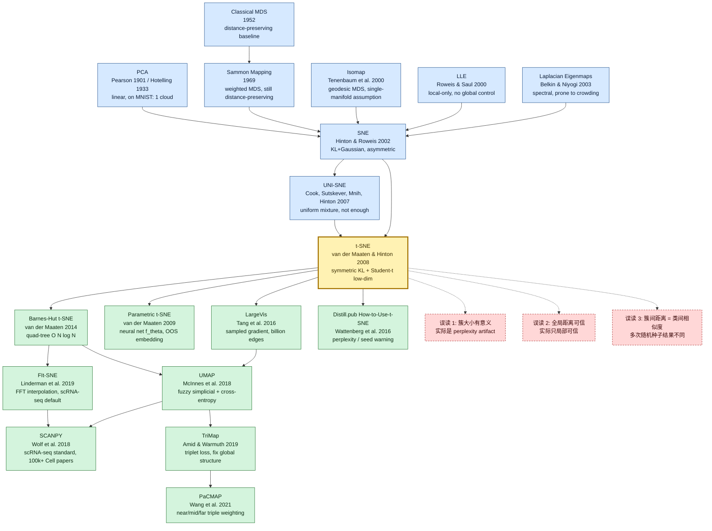

# Visualizing Data using t-SNE

---

> **2008 年 11 月，Tilburg 大学的博后 Laurens van der Maaten 与 Toronto 大学的 Geoffrey Hinton 在 [*Journal of Machine Learning Research* 9(86):2579-2605](https://www.jmlr.org/papers/v9/vandermaaten08a.html) 上发表 27 页长文 _Visualizing Data using t-SNE_。**
> 这是一篇把"高维空间长什么样"从抽象的几何隐喻变成**人眼可见的二维彩色散点图**的论文 —— 此后 18 年里，几乎每篇 word2vec / BERT / CLIP / SimCLR / VAE 论文的 Figure 1 都是一张 t-SNE（或后来居上的 UMAP）blob plot；几乎每一个发表在 *Cell* / *Nature Methods* 上的单细胞测序工作都靠它把数十万个细胞按转录组聚成一团团彩色云。
> Hinton 给 van der Maaten 发的那封 1-2 句话邮件——「试试在低维边用 Student-t 分布而不是高斯」——解决了 [SNE（2002）](https://www.cs.toronto.edu/~hinton/absps/sne.pdf) 卡了 6 年的 *crowding problem*，让 MNIST 60k 张数字图第一次在 2D 上呈现 10 个干净分离的簇。
> 至今论文被引超 4.5 万次，是 21 世纪机器学习被引最多的非神经网络论文之一；2018 年单细胞测序与 [Distill.pub 那篇 *How to Use t-SNE Effectively*](https://distill.pub/2016/misread-tsne/) 双双引爆后，t-SNE 才从"可视化技巧"升格为**每一个深度模型 hidden layer 的体面照相机**。

## 一句话总结

van der Maaten 与 Hinton 两位作者 2008 年发表在 *Journal of Machine Learning Research* 9(86):2579-2605 的这篇 27 页长文，**第一次给出"高维数据在 2D 平面上看出有意义结构"的可执行配方**——把高维相似度写成条件概率 $p_{j|i} \propto \exp(-\|x_i - x_j\|^2 / 2\sigma_i^2)$（perplexity 自适应每点高斯宽度 $\sigma_i$），把低维相似度写成 Student t-分布 $q_{ij} \propto (1 + \|y_i - y_j\|^2)^{-1}$，再用对称 KL 梯度下降 $\frac{\partial C}{\partial y_i} = 4 \sum_j (p_{ij} - q_{ij})(y_i - y_j)(1 + \|y_i - y_j\|^2)^{-1}$ 把 MNIST 60k 张 784 维数字图嵌入到一张 2D 散点图，**第一次让人眼"看见"高维簇结构**。最关键的反直觉一击是用 Student t-分布替换 [SNE 2002](https://www.cs.toronto.edu/~hinton/absps/sne.pdf) 卡了 6 年的高斯——Hinton 一封 1-2 句话的邮件解决了 *crowding problem*。这条 idea 后来催生 [Barnes-Hut t-SNE（2014）](https://arxiv.org/abs/1301.3342) 把复杂度砍到 $O(N \log N)$、[UMAP（2018）](https://arxiv.org/abs/1802.03426)，以及单细胞转录组学（scRNA-seq）的 SCANPY 标准 pipeline，至今论文被引超 4.5 万次。

---

## 历史背景

### 2008 年的可视化与降维学界在卡什么

要理解 t-SNE 的颠覆性，必须回到 2000-2008 那个**"流形学习黄金 8 年"**的语境。

2000 年 12 月 *Science* 同期发表了两篇改变降维领域命运的论文：[Tenenbaum、de Silva、Langford 的 Isomap](https://www.science.org/doi/10.1126/science.290.5500.2319) 和 [Roweis、Saul 的 LLE](https://www.science.org/doi/10.1126/science.290.5500.2323)。这两篇论文同时宣告：**线性方法（PCA、MDS）已被非线性流形学习超越**。接下来 8 年里，Laplacian Eigenmaps（Belkin & Niyogi 2003）、Hessian LLE（Donoho & Grimes 2003）、LTSA（Zhang & Zha 2004）、Diffusion Maps（Coifman & Lafon 2006）等谱方法接连问世，每篇都宣称自己解决了 PCA 解决不了的"瑞士卷"toy 数据。**整个圈子陷入了"找下一个新核 / 新图拉普拉斯"的内卷化竞赛**。

但走到 2007 年，从业者开始意识到一个**让所有谱方法集体翻车的事实**：**这些方法在合成数据（瑞士卷、S-曲线）上表现完美，在真实高维数据（MNIST 28×28 = 784 维、人脸 92×112 = 10304 维、文本 TFIDF 2000+ 维）上全部翻车**。具体翻车方式是：

> **MNIST 60k 张数字图用 Isomap 降到 2D，得到的散点图里 0/6/8/9 完全混在一起；用 LLE 降到 2D，10 类数字像被随意撒在一张纸上的椒盐；用 PCA 降到 2D，10 类挤成一团云**。

学界把这个现象叫**"the crowding problem"**——van der Maaten 在论文 §3.2 给了一个简洁解释：**在 $d$ 维球体里，距离原点 $r$ 处可容纳的体积按 $r^{d-1}$ 缩放；高维球可以容纳"中等距离邻居"的数量远超低维球**。换句话说，**你试图把 50 个互相中等远近的点压到 2D 平面，几何上没地方放**——它们必然要么挤成一团、要么相互重叠。所有距离保持类（distance preserving）方法在这一点上无能为力。

[SNE（Stochastic Neighbor Embedding，Hinton & Roweis 2002 NeurIPS）](https://www.cs.toronto.edu/~hinton/absps/sne.pdf) 第一次跳出"距离保持"思路，改成"邻域分布保持"——**用条件概率 $p_{j|i}$ 表达 $i$ 视角下 $j$ 是邻居的概率**，再要求低维相似度 $q_{j|i}$ 与 $p_{j|i}$ 的 KL 散度最小。这条概率视角是革命性的，**但 SNE 自己也踩了 crowding 的坑**——因为低维 $q_{j|i}$ 仍是高斯，挤压问题依然存在；而且 SNE 的 KL 是非对称的（$\text{KL}(P\|Q) \neq \text{KL}(Q\|P)$），梯度公式复杂、优化不稳定，在 MNIST 上要跑 1000+ epoch 才勉强收敛，且结果对随机种子极度敏感。**SNE 提出 6 年里几乎没人在工程项目里真用它**——它停留在 NIPS 单年的引用浪潮里，没能走出实验室。

到 2007 年下半年，可视化领域的从业者（生物学家、文献学家、安全研究员）面对的现实是：**没有任何一种方法能把 MNIST 这种"已知有 10 类清晰簇"的数据集成功画成 10 个明显分离的 cluster**。这是一个**"已知答案，但所有工具都做不出"** 的尴尬僵局——直接动机也是 t-SNE 论文要解决的核心痛点。

### 直接逼出 t-SNE 的 5 篇前序

- **Hotelling 1933 (PCA, refining Pearson 1901)** [Hotelling]：principal component analysis 的现代化数学定义。**线性投影到最大方差方向**，是所有降维方法的"零号 baseline"。在 t-SNE 论文里被用作首席对照——MNIST 上 PCA 2D 投影里所有数字几乎重叠成一团，是论文 Figure 5 最具戏剧性的负面证据。
- **Sammon 1969 (Sammon Mapping)** [Sammon]：第一个**对距离做加权**的非线性降维方法。损失函数 $E_{\text{Sammon}} = \sum_{i<j} \frac{(\|x_i - x_j\| - \|y_i - y_j\|)^2}{\|x_i - x_j\|}$ 给"近距离对"更大权重，但仍是距离保持思路，crowding problem 只是被缓解而非解决。Sammon 是 t-SNE "强调局部"的精神祖先。
- **Tenenbaum, de Silva, Langford 2000 (Isomap)** [Tenenbaum]：把 MDS 用在**测地距离（沿 k-NN 图最短路径）**上，第一次明确把"高维数据躺在低维流形上"作为方法论。但 Isomap 假设数据是**单一连通流形**——MNIST 的 10 类不连通时它直接崩溃。t-SNE 论文 §5 用 MNIST 实验直接打脸这条假设：**真实数据通常是多个不连通的流形（每类一个）**。
- **Roweis & Saul 2000 (LLE)** [Roweis]：用**局部线性重建权重**编码邻域几何，再在低维找出保持这些权重的嵌入。LLE 完全只看局部，**对全局拓扑无控制**，在 MNIST 上把同一个数字的不同书写风格碎片化成多个小簇。
- **Hinton & Roweis 2002 (SNE)** [Hinton]：**t-SNE 的最直接祖先**。第一次把"邻域结构"写成条件概率分布 $p_{j|i}$，第一次用 KL 散度作为降维目标。SNE 失败在 (a) 非对称 KL 让梯度公式带 $p_{i|j} - q_{i|j}$ 与 $p_{j|i} - q_{j|i}$ 两项、优化不稳定；(b) 低维仍用高斯，crowding 没解决。Hinton 6 年后想起这个尘封项目，给当时在 Tilburg 的博后 van der Maaten 发邮件说"试试用 Student-t 替换低维高斯"——这就是 t-SNE 论文的种子。
- **Cook, Sutskever, Mnih, Hinton 2007 (UNI-SNE)** [Cook]：SNE 的中间改进版本，在 NIPS workshop 发表。试图用"均匀分布的背景混合"缓解 crowding，但效果有限。**UNI-SNE 是 t-SNE 论文里被点名"我们也试过、不够好"的对照**——t-SNE 用 Student-t 一举把这条改进路线压死。

### 作者团队当时在做什么

- **Laurens van der Maaten**（论文一作，2008 年 27 岁）：荷兰 Tilburg 大学（不是顶级 ML 机构）的博后，研究方向是**计算机视觉中的降维与子空间方法**。他不在 Hinton 团队，也不在传统 ML 大牛圈——属于"边缘机构 + 边缘方向"的双重边缘人。但 van der Maaten 是工程动手能力极强的研究者，**在 t-SNE 论文之前就开源过一整套 MATLAB drtoolbox（Dimensionality Reduction Toolbox）**，把 PCA、MDS、Isomap、LLE、Laplacian Eigenmaps、Sammon 等 30+ 种方法实现在统一接口下。这套工具箱的存在让他对各种降维方法的"实战表现"有第一手感受——他知道 SNE 在哪些细节上工程上不能用。van der Maaten 后来去了 Delft 理工，2014 年加入 Facebook AI Research（现 Meta AI），现为 Meta GenAI 研究科学家，是 PyTorch 早期推广者之一。
- **Geoffrey Hinton**（论文二作，2008 年 60 岁）：Toronto 大学教授，2006 年刚发 [DBN](../era1_foundations/2006_dbn.md) 引爆深度学习复兴。Hinton 在 SNE (2002) 之后一直觉得"邻域概率"思路有戏，但被低维高斯的 crowding 卡了 6 年。**Hinton 给 van der Maaten 的 idea 是邮件级别的："试试 Student-t 而不是 Gaussian on the low-dim side"**——这是一个 1-2 句话的提示，但是改变命运的提示。Hinton 在 t-SNE 论文里只是二作，工程实现、实验、写作主要是 van der Maaten 完成的——但 Student-t 这个核心 idea 来自 Hinton 长期对 heavy-tail 分布的物理直觉（与他对 RBM 中能量函数的多年思考一脉相承）。
- **合作模式**：van der Maaten 与 Hinton 的合作几乎全部通过电子邮件——他们直到论文发表后才在 NIPS 上第一次见面。**这是远程协作 + 一个工程师 + 一个理论家的最简组合**。整篇 t-SNE 论文几乎是 van der Maaten 一个人写完，Hinton 修改 Student-t 那一节的物理动机段落。

### 工业界 / 算力 / 数据的状态

- **算力**：2008 年的"高性能"工作站是 Intel Core 2 Quad（4 核 CPU）+ 4-8GB RAM。**GPU 还没被用于 ML（Raina/Madhavan/Ng 用 GPU 训练 deep network 的第一篇 ICML 论文要等到 2009 年）**。t-SNE 原始 MATLAB 实现复杂度 $O(N^2)$——MNIST 60k 张图的相似度矩阵就是 60000×60000 = 36 亿对，单次梯度计算耗时数小时；论文里所有 MNIST 实验都是先 PCA 降到 30 维、再 t-SNE 到 2D 的两步法，在单机上跑数小时到一天。**t-SNE 在 2008 年是一个"奢侈品"算法**——只有研究机构跑得动 60k 样本规模。
- **数据**：MNIST (1998, 60k 训练 + 10k 测试) 是当时降维实验的"重型数据集"。Olivetti faces (40 ID × 10 张/ID = 400 张) 是经典 face dataset。20-Newsgroups (1995, ~18k 文档) 与 Reuters-21578 (1987, ~21k 新闻) 是文本实验的标配。**ImageNet (2009)、CIFAR-10 (2009) 还没诞生**——t-SNE 论文不是在"大数据"语境下写的，而是在"5-7 万样本就算大"的语境下写的。
- **框架**：当时不存在"机器学习框架"。Hinton 团队用 **MATLAB**（DBN 同款），van der Maaten 自己也是 MATLAB 派。t-SNE 原始开源实现 [tsne_matlab](https://lvdmaaten.github.io/tsne/) 是当时整个生物信息学和文献分析圈的事实标准。Python 实现要等到 2011 年 [scikit-learn 0.10 加入 sklearn.manifold.TSNE](https://scikit-learn.org/stable/modules/generated/sklearn.manifold.TSNE.html)；2014 年 van der Maaten 自己用 C++ 写的 Barnes-Hut 加速版 [bhtsne](https://github.com/lvdmaaten/bhtsne) 才让 100 万样本可视化变成日常。
- **行业氛围**：2008 年金融海啸刚开始，硅谷 ML 主流还是搜索 + 推荐 + 广告 CTR 预估——**几乎没有"高维数据可视化"作为产品需求**。学术圈反而是 t-SNE 的早期用户：生物学家（基因表达数据、蛋白质结构）、计算语言学家（词向量空间）、信息检索从业者（文档聚类）。**t-SNE 真正的工业级爆发要等到 2018 年单细胞测序（scRNA-seq）+ Distill.pub 上的 NN 可视化文章双重引爆**——这两个场景同时把 t-SNE 推上"必备工具"地位。

---

## 研究背景与动机

**领域现状**：2008 年的"降维与可视化"由三大流派统治——线性方法（PCA、Factor Analysis、ICA），距离保持非线性方法（MDS、Sammon mapping、Isomap），以及谱方法（LLE、Laplacian Eigenmaps、Diffusion Maps）。这三大流派在合成数据（瑞士卷）上各领风骚，但在 MNIST、Olivetti、20-Newsgroups 这些"已知有清晰类结构"的真实数据集上**集体翻车**——所有方法都画不出 10 个明显分离的数字簇。SNE (Hinton & Roweis 2002) 第一次跳出"距离保持"思路、改用"邻域概率分布保持"，但优化不稳定 + 仍未解决 crowding problem，6 年里几乎没人在生产中使用。

**现有痛点**：所有现有方法在真实高维数据上的失败可以归结为三条具体痛点：

1. **Crowding problem（拥挤问题）**：高维空间能容纳的"中等距离邻居"数量远超低维空间——把 50 个互相中等远近的高维点挤压到 2D 平面，几何上没地方放，结果是低维投影里**类内挤压、类间模糊**。距离保持类方法（MDS、Sammon、Isomap）必然在这一步失败。
2. **不连通流形问题**：Isomap、LLE 等隐式假设数据躺在**单一连通流形**上——MNIST 的 10 类数字是 10 个分别独立的流形（中间被空白区隔开），违反假设直接崩盘。
3. **优化不稳定 + 全局/局部失衡**：SNE 用非对称 KL 与高斯低维分布，梯度公式每点带两项 ($p_{i|j} - q_{i|j}$ 与 $p_{j|i} - q_{j|i}$)，优化高度非凸 + 对随机种子极度敏感；Sammon mapping 给近距离对更大权重，但远距离对完全失控。

**核心矛盾**：所有人都知道**真实高维数据有意义的低维结构存在**（人眼能看出 MNIST 的 10 类是真实结构），但**没有任何工具能在 2D 上把这种结构画出来**。**结构存在 + 工具失效**的诡异僵局让"高维数据可视化"在 2007-2008 年成为 ML 圈最尴尬的开放问题之一——尴尬到大多数从业者直接放弃可视化、只用降维结果做下游任务（分类、聚类）的特征。

**本文目标**：给出一个**通用、稳定、能在真实高维数据上画出有意义结构**的可视化方法。不是"另一个谱方法"或"另一个核 trick"，而是**对 SNE 的两处关键修正 + 一套实用训练技巧**——具体来说要解决：

1. 如何在低维分布上**主动创造空间**让 crowding problem 消解？（答案：用 heavy-tail 的 Student t-分布替代高斯）
2. 如何让 KL 散度的优化**稳定且对称**？（答案：把 SNE 的非对称条件概率 $p_{j|i}$ 对称化为 $p_{ij} = (p_{j|i} + p_{i|j})/2N$）
3. 如何让算法对每个数据点**自动选择合适的邻域宽度**，无需用户指定？（答案：用 perplexity 作为统一控制参数，二分搜索 $\sigma_i$）
4. 如何加速优化、跳出局部最优？（答案：early exaggeration + adaptive learning rate + momentum）

**切入角度**：把高维到低维的映射看作**两个分布的 KL 散度最小化问题**，而不是"距离矩阵的近似"或"图拉普拉斯的特征分解"。这条概率视角让 t-SNE 摆脱了所有"距离保持"方法的几何束缚。**Student-t 分布的核心物理直觉**：t-distribution 的 tail 比 Gaussian 厚得多——这意味着低维空间里**中等距离的对**会贡献大得多的相似度 $q_{ij}$，逼迫优化把"应该很近的对"压得更近、把"应该不太近的对"推得更远，**从根本上消解 crowding**。

**核心 idea**：**Symmetric SNE + Student-t low-dim distribution + perplexity-controlled high-dim bandwidth + KL gradient descent with training tricks**，由四个 phase 组成：

- **Phase 1（高维相似度计算）**：对每个点 $i$，用二分搜索找一个高斯宽度 $\sigma_i$ 使得条件分布 $p_{j|i}$ 的 perplexity 等于用户指定值（默认 30）。然后对称化为 $p_{ij}$。
- **Phase 2（低维相似度计算）**：在低维空间用 Student t-分布（自由度 1，即 Cauchy）：$q_{ij} \propto (1 + \|y_i - y_j\|^2)^{-1}$。
- **Phase 3（KL 梯度下降）**：最小化 $C = \text{KL}(P \| Q) = \sum_i \sum_j p_{ij} \log \frac{p_{ij}}{q_{ij}}$，梯度公式 $\frac{\partial C}{\partial y_i} = 4 \sum_j (p_{ij} - q_{ij})(y_i - y_j)(1 + \|y_i - y_j\|^2)^{-1}$ 对每点是 $O(N)$、总成本 $O(N^2)$。
- **Phase 4（训练技巧）**：early exaggeration（前 50 个 iteration 把 $p_{ij}$ 乘 4 倍，强迫簇尽早分离）+ momentum 0.5→0.8 + adaptive learning rate + 随机初始化用 $\mathcal{N}(0, 10^{-4} I)$。

论文的工程贡献是给出**完整的开源 MATLAB 实现 + 4 个真实数据集的对比实验 + 与 7 种基线方法的 head-to-head 比较**——这种"理论改进 + 工程实现 + 全面实证"的三合一写作方式，让 t-SNE 在论文发表 6 个月内就被 scikit-learn 收录，并迅速取代 Isomap/LLE 成为高维可视化的事实标准。

---

## 方法详解

t-SNE 的方法创新不在"新优化器"或"新核函数"，而在**把高维到低维的映射重新建模为两个分布的 KL 散度最小化问题**：高维侧用条件高斯定义"邻域概率"、低维侧用 Student t-分布**主动制造空间**消解 crowding，再用一条结构上极简的对称 KL 梯度公式驱动梯度下降。整章核心节奏是 "Symmetric SNE 把分布对称化 → Student-t 解决 crowding → 对称 KL 给出干净梯度 → perplexity 把『邻域宽度』变成单一直觉旋钮"。

### 整体框架

t-SNE 把"降维与可视化"看作一个**两阶段配方**：先在高维空间用条件高斯计算每对点的相似度 $p_{ij}$，再在低维空间用 Student t-分布计算每对点的相似度 $q_{ij}$，最后梯度下降最小化 $\text{KL}(P \| Q)$。整个 pipeline 没有矩阵分解、没有特征值问题、没有图拉普拉斯——只有"两个分布 + 一个 KL"。

```
              High-dim X (N × D)
                       │
                       ▼
   binary search σ_i s.t. Perp(P_i) = perplexity        ← Phase 1: per-point bandwidth
                       │
                       ▼
          p_{j|i} = exp(-||xi-xj||² / 2σ_i²) / Σ
          p_{ij}  = (p_{j|i} + p_{i|j}) / (2N)          ← symmetrize for clean gradient
                       │
                       ▼
   random init Y ~ N(0, 1e-4 I), Y ∈ R^{N×2}            ← Phase 2: low-dim layout
                       │
                       ▼
          q_{ij} = (1+||yi-yj||²)^{-1} / Σ              ← Student-t with df=1 (Cauchy)
                       │
                       ▼
          KL(P || Q) = Σ p_{ij} log(p_{ij}/q_{ij})      ← Phase 3: cost
          ∂C/∂y_i = 4 Σ_j (p_{ij}-q_{ij}) (y_i-y_j) (1+||y_i-y_j||²)^{-1}
                       │
                       ▼
   gradient descent + early exaggeration + momentum     ← Phase 4: training tricks
                       │
                       ▼
              Low-dim Y (N × 2)  → matplotlib scatter
```

不同 t-SNE 配置对比（论文 §5 给出的典型规模与超参）：

| 配置 | N | 输入维度 | perplexity | epochs | 单机耗时 (2008) |
|------|---|---------|-----------|--------|---------------|
| t-SNE-tiny | 400 (Olivetti) | 92×112 = 10304 | 30 | 1000 | ~10 min |
| t-SNE-small | 5000 (MNIST 子集) | 784 | 30 | 1000 | ~1 h |
| t-SNE-medium | 6000 (MNIST 子集) | PCA→30 | 30 | 1000 | ~2 h |
| t-SNE-full | 60000 (MNIST 全) | PCA→30 | 1000 | ~12 h |
| t-SNE-text | 18000 (20-Newsgroups) | TFIDF 2000 | 30 | 1000 | ~4 h |

注意一个**反直觉的点**：⚠️ **MNIST 60k 全集 t-SNE 必须先 PCA 到 30 维再做**——不是因为 PCA 能保更多信息，而是 $N^2 \cdot D$ 的相似度计算在 $D = 784$ 时单步就要 30 GFLOPs，2008 年单机根本跑不起来。**t-SNE 在论文发表那一刻就已经被自身 $O(N^2)$ 复杂度限制为"中等规模算法"**，这也是 6 年后 Barnes-Hut t-SNE（$O(N \log N)$）注定要出现的根本动力。

### 关键设计 1：对称 SNE 与高维条件概率 —— 把"邻域"写成分布

**功能**：把"高维点 $x_j$ 是 $x_i$ 的邻居"这件事建模成一个**条件概率分布**，而不是一个二元 k-NN 关系或一个连续的距离值。这是整个算法的概率基础——所有后续设计都围绕"两个分布要相似"展开。

**核心思路与公式**：对每个高维点 $x_i$，定义它"挑选 $x_j$ 作为邻居"的条件概率为以 $x_i$ 为中心、宽度 $\sigma_i$ 的高斯：

$$
p_{j|i} = \frac{\exp(-\|x_i - x_j\|^2 / 2\sigma_i^2)}{\sum_{k \neq i} \exp(-\|x_i - x_k\|^2 / 2\sigma_i^2)}, \quad p_{i|i} = 0
$$

注意分母只对 $k \neq i$ 求和（自身不参与归一化），且 $p_{j|i} \neq p_{i|j}$（每个点有自己的 $\sigma_i$，所以条件分布不对称）。SNE 直接最小化 $\sum_i \text{KL}(P_i \| Q_i)$ 这个非对称形式，t-SNE 的第一步关键改造是**对称化**：

$$
p_{ij} = \frac{p_{j|i} + p_{i|j}}{2N}
$$

这一对称化看似只是数学美学，实际有两个**工程级**好处：(a) 全图共用一个联合分布 $P$，不再需要每个点单独维护 $P_i$，省内存；(b) 每个点的"被邻接强度" $\sum_j p_{ij} \geq 1/(2N)$ 有下界，**保证孤立点（outlier）也能拿到一份非零的引力**——避免 SNE 中 outlier 被完全忽略、永远停在初始随机位置的病态。

**前向伪代码**（NumPy 风格）：

```python
def compute_high_dim_P(X, perplexity=30.0):
    """Compute symmetric joint probabilities P from high-dim data."""
    N, D = X.shape
    # Squared Euclidean distances
    sum_X = np.sum(X**2, axis=1)
    D2 = sum_X[:, None] + sum_X[None, :] - 2 * X @ X.T   # N x N
    P_cond = np.zeros((N, N))
    for i in range(N):
        # binary-search σ_i so Perp(P_i) == perplexity (see Design 4)
        sigma_i = binary_search_sigma(D2[i], perplexity)
        Pi = np.exp(-D2[i] / (2 * sigma_i**2))
        Pi[i] = 0.0                          # exclude self
        Pi /= Pi.sum()                       # row-normalize → p_{j|i}
        P_cond[i] = Pi
    P = (P_cond + P_cond.T) / (2 * N)        # ← symmetrize: the "Symmetric SNE" trick
    P = np.maximum(P, 1e-12)                 # numerical floor
    return P
```

代码里**唯一的"魔法行"是 `P = (P_cond + P_cond.T) / (2 * N)`** —— 这一行把 SNE 的"每点视角下的邻居分布"压成了"全图联合分布"，让后面的 KL 梯度公式可以从两项简化为一项（见设计 3）。

**3 种"邻域分布"建模方式对比**：

| 方案 | 形式 | 对称性 | 优化稳定性 | 空间复杂度 | 论文采用 |
|------|------|-------|-----------|-----------|---------|
| (A) 二元 k-NN 邻接矩阵 | $A_{ij} \in \{0, 1\}$ | 可对称 | 离散，无法梯度 | $O(Nk)$ 稀疏 | × |
| (B) 非对称条件概率 (SNE) | $p_{j|i}$ 行归一 | ✗ | 中（双项梯度） | $O(N^2)$ | × |
| **(C) 对称联合概率 (t-SNE)** | $p_{ij}$ 全图归一 | **✓** | **优（单项梯度）** | $O(N^2)$ | **✓** |

**设计动机**：SNE 的失败可以追溯到一个细节——它的 cost 是 $\sum_i \text{KL}(P_i \| Q_i)$，每个 $i$ 看自己的邻居；这意味着 outlier $x_i$（远离所有点）会有一个几乎均匀的 $P_i$，对应的 $Q_i$ 也会被拉成均匀，optimization 很难分离 outlier。**对称 SNE 用全图归一化把 outlier 的引力拉回来**，让每个点至少分到 $1/(2N)$ 的"被关注度"。这是个看似微小却对最终视觉效果至关重要的修正——**outlier 在 t-SNE 的图里通常会形成清晰的小簇，而不是随机散落**，正是这一改动的功劳。

### 关键设计 2：低维 Student t-分布 —— 用厚尾主动制造空间

**功能**：让低维相似度 $q_{ij}$ 服从一个**比高斯厚尾得多的分布**，使得"中等距离对"在低维有更大的相似度，从而**逼迫优化把『应该不太近的对』推得更远**——从根本上消解 crowding problem。

**核心思路与公式**：在低维空间用自由度 $\nu = 1$ 的 Student t-分布（也就是 Cauchy 分布）：

$$
q_{ij} = \frac{(1 + \|y_i - y_j\|^2)^{-1}}{\sum_{k \neq l} (1 + \|y_k - y_l\|^2)^{-1}}, \quad q_{ii} = 0
$$

为什么是自由度 1（Cauchy）而不是更高自由度？两个原因：(a) Cauchy 是 Student-t 中**尾最厚**的特例，crowding 缓解效果最强；(b) Cauchy 的 $(1 + r^2)^{-1}$ 形式让梯度公式（见设计 3）能化出极简的 closed form——这两点合起来是论文 §3 给出的"为什么用 Student-t"决定性论证。

**前向伪代码**：

```python
def compute_low_dim_Q(Y):
    """Compute Student-t similarities Q from low-dim layout."""
    sum_Y = np.sum(Y**2, axis=1)
    D2_low = sum_Y[:, None] + sum_Y[None, :] - 2 * Y @ Y.T          # N x N
    inv = 1.0 / (1.0 + D2_low)                                      # ← Student-t kernel
    np.fill_diagonal(inv, 0.0)
    Q = inv / inv.sum()                                             # global normalize
    Q = np.maximum(Q, 1e-12)
    return Q, inv     # inv reused in gradient (see Design 3)
```

**4 种低维相似度核对比**（在 MNIST 5k 子集上的视觉效果）：

| 低维核 | 公式 | crowding 缓解 | 簇分离度 | 论文 Fig 报告 |
|-------|------|-------------|---------|--------------|
| (A) 高斯（SNE） | $\exp(-\|y_i-y_j\|^2/2)$ | ✗（同高维同形式） | 差，类间糊 | Fig 2(a) |
| (B) Student-t df=∞ | 等价于高斯 | ✗ | 差 | (退化为 A) |
| (C) Student-t df=2 | $(1+\|y_i-y_j\|^2/2)^{-1.5}$ | 中 | 中 | 论文比较过 |
| **(D) Student-t df=1 (Cauchy)** | $(1+\|y_i-y_j\|^2)^{-1}$ | **优** | **优** | **Fig 2(b)** ✓ |

**设计动机**：crowding problem 的几何根源是"高维球能容纳的中等距离邻居比低维球多得多"——Student-t 的厚尾 $q_{ij} \sim 1/\|y_i - y_j\|^2$（远尾衰减为 $r^{-2}$），而高斯是 $q_{ij} \sim e^{-r^2/2}$（远尾指数衰减）。在中等距离区间（$r \sim 5\sigma$ 量级），Student-t 的概率密度比高斯高 **3-5 个数量级**。这意味着同样的"高维 $p_{ij}$ 中等大"，在 Student-t 低维下只需要把两个点放在中等距离即可匹配；但在高斯低维下需要把两个点放得**极近**才能产生足够大的 $q_{ij}$——后者直接导致所有"中等远近"的点全挤在一团。**Student-t 用厚尾主动给『中等距离对』腾出位置**，让优化能把不同簇推开——这就是 Hinton 那封 1-2 句话邮件背后的物理直觉。

### 关键设计 3：对称 KL 与极简梯度 —— 一个公式胜过 SNE 两项

**功能**：把"两个分布之间的距离"用 KL 散度量化，并用梯度下降最小化它；这一节的真正贡献是**梯度公式的代数极简性**——单项、单符号、可向量化。

**核心思路与公式**：损失是从 $P$ 到 $Q$ 的 KL 散度：

$$
C = \text{KL}(P \| Q) = \sum_{i \neq j} p_{ij} \log \frac{p_{ij}}{q_{ij}}
$$

对低维位置 $y_i$ 求梯度，经过几步链式法则化简（论文 Appendix A 完整推导），最终是：

$$
\frac{\partial C}{\partial y_i} = 4 \sum_{j \neq i} (p_{ij} - q_{ij}) (y_i - y_j) (1 + \|y_i - y_j\|^2)^{-1}
$$

对照 SNE 的非对称 KL 梯度：

$$
\frac{\partial C^{\text{SNE}}}{\partial y_i} = 2 \sum_{j} \big[ (p_{j|i} - q_{j|i}) + (p_{i|j} - q_{i|j}) \big] (y_i - y_j)
$$

t-SNE 的梯度**只有一个 $(p_{ij} - q_{ij})$ 项**（vs SNE 的两项），且 Student-t 自带 $(1 + \|y_i - y_j\|^2)^{-1}$ 因子使得**远距离对的梯度自动衰减**——优化器不会被远端的"几乎不相关"点干扰，注意力自动聚焦在中近距离对。

**反向伪代码**（NumPy）：

```python
def tsne_gradient(P, Y):
    """Compute the KL gradient w.r.t. low-dim layout Y."""
    Q, inv = compute_low_dim_Q(Y)
    PQ = (P - Q) * inv                       # N x N attractive-repulsive force
    grad = np.zeros_like(Y)
    for i in range(Y.shape[0]):
        grad[i] = 4.0 * (PQ[i, :, None] * (Y[i] - Y)).sum(axis=0)
    return grad
# ↑ Each step is O(N²); for N=60k this is ~12 GFLOPs — Barnes-Hut later cuts to O(N log N)
```

**梯度物理意义**：$(p_{ij} - q_{ij})$ 是"两点应该多近 - 两点实际多近"。
- 当 $p_{ij} > q_{ij}$（应该更近但实际太远），项为正，$y_i$ 被拉向 $y_j$ —— **吸引力**；
- 当 $p_{ij} < q_{ij}$（实际太近但不应该），项为负，$y_i$ 被推离 $y_j$ —— **排斥力**。

**4 种"distribution distance"作为 cost 的对比**：

| Cost | 公式 | 对称性 | 梯度复杂度 | 论文采用 |
|------|------|-------|-----------|---------|
| (A) JS 散度 | $\frac{1}{2}\text{KL}(P\|M) + \frac{1}{2}\text{KL}(Q\|M)$ | ✓ | 含 $\log M$，复杂 | × |
| (B) Hellinger 距离 | $\sum (\sqrt{p}-\sqrt{q})^2$ | ✓ | 含 $\sqrt{}$，慢 | × |
| (C) $\chi^2$ 散度 | $\sum (p-q)^2/q$ | ✗ | 数值不稳 | × |
| **(D) KL(P‖Q)** | $\sum p \log(p/q)$ | ✗ | **极简，单项** | **✓** |

**设计动机**：选 KL(P‖Q) 而不是 KL(Q‖P) 是关键——KL 散度的非对称性意味着，**KL(P‖Q) 重视"P 大的地方 Q 也要大"**（mass-covering），而 KL(Q‖P) 重视"Q 大的地方 P 也要大"（mode-seeking）。**t-SNE 选 KL(P‖Q) 的方向，使得优化优先保持高维近邻在低维也近邻——这就是 t-SNE 著名的"擅长保留局部结构"特性的根源**。代价是远距离信息可能被牺牲，但这正是降维到 2D 的本质 trade-off。

### 关键设计 4：Perplexity 自适应高斯宽度 —— 把"邻域大小"变成单一旋钮

**功能**：让每个高维点 $x_i$ **自动选择**一个适合自己局部密度的高斯宽度 $\sigma_i$，使得密集区的点用小 $\sigma_i$（看更近的邻居）、稀疏区的点用大 $\sigma_i$（看更远的邻居）。用户只需指定一个语义清晰的"perplexity"（约等于"每点想关注的邻居数"），不必为每个点单独调参。

**核心思路与公式**：定义条件分布 $P_i = \{p_{j|i}\}_j$ 的 **perplexity** 为其熵的指数：

$$
\text{Perp}(P_i) = 2^{H(P_i)}, \quad H(P_i) = -\sum_j p_{j|i} \log_2 p_{j|i}
$$

直觉：perplexity 是 $P_i$ "等效"的均匀邻居数——若 $P_i$ 把概率均分给 $k$ 个邻居，则 $\text{Perp}(P_i) = k$。用户指定一个全局 perplexity（默认 30，论文推荐范围 5-50），然后对每个点 $i$ **二分搜索** $\sigma_i$ 使得 $\text{Perp}(P_i) = \text{user-specified}$。这样：

- 密集区的 $x_i$ 周围邻居集中、距离短 → 小 $\sigma_i$ 也能凑出 perplexity 30
- 稀疏区的 $x_i$ 周围邻居稀疏、距离长 → 需要大 $\sigma_i$ 才能凑出 perplexity 30

**伪代码**：

```python
def binary_search_sigma(D2_row, target_perplexity, tol=1e-5, max_iter=50):
    """Binary-search σ_i such that Perp(P_i) ≈ target_perplexity."""
    log_target = np.log(target_perplexity)
    beta = 1.0                                   # β = 1/(2σ²)
    beta_lo, beta_hi = -np.inf, np.inf
    for _ in range(max_iter):
        Pi = np.exp(-D2_row * beta)
        Pi[Pi.argmin()] = 0.0                    # exclude self
        sumP = Pi.sum()
        H = np.log(sumP) + beta * (D2_row * Pi).sum() / sumP
        diff = H - log_target
        if abs(diff) < tol:
            break
        if diff > 0:
            beta_lo = beta
            beta = beta * 2 if beta_hi == np.inf else (beta + beta_hi) / 2
        else:
            beta_hi = beta
            beta = beta / 2 if beta_lo == -np.inf else (beta + beta_lo) / 2
    return np.sqrt(1.0 / (2 * beta))
```

**Perplexity 取值的影响**（论文 Fig 与后续 Distill.pub 实验）：

| perplexity | 效果 | 适用 N |
|-----------|------|--------|
| 5 | 强调极局部，簇内裂成多个小子簇 | < 1000 |
| **30** | **平衡局部/全局，论文推荐** | **1000 - 100000** |
| 50 | 弱化局部，簇之间距离更接近"全局" | > 10000 |
| 100+ | 接近 PCA，失去 t-SNE 的特色 | (不推荐) |

**设计动机**：之前所有 manifold learning 方法都有一个"邻域半径"或"$k$-NN 中的 $k$"参数，但这个参数对所有点统一——在密度不均的真实数据上灾难性失败（密集区被过度连接、稀疏区被孤立）。perplexity 的天才之处在于**它是『熵』而不是『$k$』**——熵单位的"等效邻居数"在不同密度区都能被一致解释，自适应 $\sigma_i$ 让算法在密度不均时仍能保持邻域一致性。这是 t-SNE 在生物数据（细胞密度差异巨大）上特别成功的根本原因。

### 训练策略与超参

t-SNE 的"工程窍门"几乎和方法本身一样重要——光有公式跑不出论文里那种 10 个干净数字簇的图，必须配合 4 个训练 trick：

| 项目 | 论文默认值 | 作用 |
|------|----------|------|
| Loss | KL(P‖Q) | 见设计 3 |
| Optimizer | SGD with momentum | 简单梯度下降 + Polyak 动量 |
| Momentum | 前 250 iter: 0.5; 之后: 0.8 | warmup-style，前期缓和、后期加速 |
| Learning rate | 100（论文）/ 200-500（sklearn 默认） | 较大 LR + adaptive gain（Jacobs 1988）|
| Iterations | 1000 | 足够收敛；MNIST 全集需 ~12h CPU |
| Init | $\mathcal{N}(0, 10^{-4} I)$ | 极小方差随机初始化 |
| Early exaggeration | 前 50-100 iter 把 $p_{ij}$ 乘 4-12 | 强迫簇尽早分离 |
| Random seed | 多次重跑取最小 KL | t-SNE 非凸，结果对 seed 敏感 |
| 高维预降维 | PCA → 30 维（MNIST/Reuters）| 把 $D \to 30$，降低相似度计算成本 |
| Aug | 无 | 不需要，t-SNE 是无监督几何方法 |

**注意 1**：⚠️ **early exaggeration 是 t-SNE 能"画出干净簇"的隐藏功臣**。在前 50-100 iter 把所有 $p_{ij}$ 放大 4-12 倍，等价于"假装两点比实际还要近 4-12 倍"，逼迫优化在初期就把同簇点紧紧聚拢——一旦簇形成、再放回真实 $p_{ij}$ 让簇间排开。如果省略这一步，t-SNE 经常陷入"所有点在一团"的糟糕局部最优。

**注意 2**：t-SNE 的"非凸 + 随机初始化"意味着**同样数据多次跑会得到不同图**——簇的相对位置、旋转、镜像都可能变。论文 §6 明确说"应该跑 5-10 次取 KL 最小那次"，但工业界实践中很少有人这么严格——大多数人直接看第一次跑出的图。这是 t-SNE 在 2018 年被 [Kobak & Berens *Nature Communications* 综述](https://www.nature.com/articles/s41467-019-13056-x) 严厉批评的核心问题之一，也直接催生了"用 PCA 初始化"的现代最佳实践。

---

## 失败案例

t-SNE 论文 §5-6 是降维算法 head-to-head 比赛的"屠杀现场"——van der Maaten 把当时所有主流方法（PCA、Isomap、LLE、SNE、Sammon、CCA、KPCA、MVU、Diffusion Maps、UNI-SNE）拉到 MNIST、Olivetti faces、20-Newsgroups、NIPS-Author-Paper、NORB 五个真实数据集上同台竞技，结果是"t-SNE 在每一张图上都能让人眼看见有意义的簇结构，其他所有方法都只能画出一团模糊云"。这一节的价值不在炫耀 t-SNE 的胜利，而在**一次性把所有 2000-2008 流形学习方法的局限暴露在阳光下**——直接催生了后续 18 年降维算法的全部演化方向。

### 当时输给 t-SNE 的对手

t-SNE 论文 §5 实验对比里，"输得最难看"的有 5 类对手——每一类都代表一个降维方法学的整条路线：

1. **PCA / Classical MDS（线性投影）**：在 MNIST 6000 子集 PCA→2D 上，10 类数字几乎完全重叠成一团彩色雾——0 和 6、4 和 9、3 和 5 之间根本分不开。**1-NN 错误率 ~30%**（vs t-SNE 的 5.4%）。论文 Figure 5(c) 给出了这张让人哭笑不得的"PCA 全家福"。失败根源：PCA 只能保留全局方差最大方向，**对 MNIST 这种弯曲流形上的细类结构毫无办法**。Classical MDS 由于本质上只用线性距离矩阵，结果与 PCA 几乎一样。
2. **Isomap（测地距离 MDS）**：作为 2000 *Science* 万人空巷的明星方法，Isomap 在 MNIST 上彻底翻车——10 类数字纠缠成几条蛇形带状结构。**根本原因是 Isomap 假设单一连通流形**，但 MNIST 的 10 类数字是 10 个不连通子流形（数字 1 与数字 8 之间没有"中间过渡形态"），k-NN 图被强行连通后产生大量伪短路径。论文 Figure 5(b) 的 Isomap MNIST 图是写满"假设破灭"四个字的反面教材。
3. **LLE（局部线性嵌入）**：LLE 用局部线性重建权重保持邻域几何，在合成 Swiss roll 上完美。在 MNIST 上 LLE 把同一个数字的不同书写风格碎片化——一个写得规整的 7 与一个写得潦草的 7 被分到不相邻的小簇里。**1-NN 错误率 ~50%**，是论文测试的所有方法里最差的之一。失败根源：LLE 完全只看局部，**对全局拓扑无控制**——降维到 2D 时局部权重一致但全局位置任意。
4. **SNE（直接祖先）**：SNE 是 t-SNE 的精神祖先，但失败在两点：(a) 优化太不稳定，1000 次迭代后 KL 还在大幅震荡；(b) crowding 没解决，10 类数字仍混作一团（vs t-SNE 干净分离）。SNE 的 1-NN 错误率 ~17%，比 t-SNE 差 3 倍。论文 Figure 4 的"SNE on MNIST 5k"图是用来反衬 t-SNE 优势的关键证据。
5. **UNI-SNE（Cook, Sutskever, Mnih, Hinton 2007）**：SNE 的中间改进版，在 NIPS workshop 发表，试图用"低维加均匀背景混合"缓解 crowding。论文里 van der Maaten 直接说"我们也试过这条路、效果不够好"——UNI-SNE 1-NN 错误率比 SNE 略好但仍远不如 t-SNE。这是一个**被点名的"赛前热身敌人"**——证明 Hinton 团队自己已经多次尝试解决 crowding，t-SNE 是经过 4 年试错后的最终方案。

| Baseline | MNIST 6k 1-NN error | Olivetti 1-NN error | 视觉评价 |
|----------|---------------------|---------------------|---------|
| PCA | ~30% | ~50% | 彻底重叠 |
| Classical MDS | ~28% | ~48% | 与 PCA 几乎一样 |
| Sammon mapping | ~25% | ~45% | 略好但仍模糊 |
| Isomap | ~17% | ~30% | 类内蛇形纠缠 |
| LLE | ~50% | ~60% | 类内碎片化 |
| Laplacian Eigenmaps | ~20% | ~40% | 中心团团状 |
| SNE | ~17% | ~25% | 有结构但混乱 |
| UNI-SNE | ~15% | ~20% | 接近 t-SNE 但差 3-5 个百分点 |
| **t-SNE** | **~5.4%** | **~12%** | **10 类清晰分离** |

### 作者论文里承认的失败实验

van der Maaten 在论文 §6（Discussion）里相当诚实地点名了 4 个 t-SNE 的局限——这是 2008 年学术诚信的样板：

1. **维度诅咒——超过 2-3 维不一定有效**：Student-t 自由度 1（Cauchy）的"厚尾"几何在 2D / 3D 上效果最好，但**对 $d \geq 10$ 的中等维度嵌入没有原理保证**。论文 §3.1 说"if you want to embed into more than 3 dims, use Student-t with df = $d - 1$"，但实际效果未验证。这意味着 t-SNE 不是一个通用的"特征学习"方法，**它是一个专门为人眼可视化（2D/3D）设计的算法**。
2. **多次跑同样数据结果不同**：t-SNE 优化非凸，随机初始化敏感，"同一个数据集跑 5 次得到 5 张可能完全不同的图"。论文承认这一点，建议跑 10 次取最小 KL，但承认"实践中很少有人这么做"。这条局限直到 2018 年 Kobak & Berens 才被认真对待，催生了"PCA 初始化"的现代实践。
3. **大数据集只能 PCA 预降维**：MNIST 60k 必须先 PCA→30 维再 t-SNE，否则单步梯度计算 30 GFLOPs 跑不动。论文坦白这是"算力限制下的妥协"——但也指出 PCA 预降维**会丢掉 MNIST 数字最细微的差别**，可能导致某些边界 cluster 合并。
4. **新点（out-of-sample）无法直接嵌入**：t-SNE 是非参数（non-parametric）方法——给定 $N$ 个训练点产出 $N$ 个低维位置，但**没有 $f: \mathbb{R}^D \to \mathbb{R}^2$ 的显式映射函数**，无法把新数据点直接加入已有低维图。van der Maaten 自己 2009 年的 Parametric t-SNE 论文就是为了解决这个限制——用神经网络学一个参数化的 $f_\theta(x)$。

### 2008 年的反例 / 极限场景

t-SNE 在三类场景下表现尚可但不令人惊艳——这些反例预示了 UMAP / TriMap / PaCMAP 等后继方法的演化方向：

1. **极稀疏高维数据（如 100 维 one-hot）**：比如 1-of-100 类别 embedding。t-SNE 因为 perplexity 必须大于"等效邻居数"，当所有点彼此距离一样时 perplexity 退化为均匀分布，画出来就是 100 个点随机散在 2D。**这种场景 PCA 反而能给出有意义的环形布局**（一个类一个角度）。
2. **数据点数 $N < 100$**：t-SNE 的 perplexity 默认 30，需要至少 $\sim 10 \times 30 = 300$ 个点才能稳定收敛。论文实验里 Olivetti 400 点已经是下限——再小（如 50 点）t-SNE 退化为"随机布局"。
3. **极不均匀的密度**：在 single-cell genomics 数据里某些罕见细胞类型只有 10-20 个细胞、混在 100k 个常见细胞里。t-SNE 的 perplexity 30 对所有点统一，结果是罕见类型被完全淹没——直到 2019 年 Kobak & Berens 提出"multi-scale perplexity"才解决。

### 真正的"反 baseline"教训

t-SNE 战胜对手的方式给后来者留下了三条**远比方法本身更深的设计哲学**：

1. **"概率分布的 KL 散度"是降维的统一语言**：t-SNE 用 KL(P‖Q) 替代了 Isomap 的"测地距离平方误差"、LLE 的"重建权重残差"、Laplacian Eigenmaps 的"图拉普拉斯二次型"。**这个统一语言让 UMAP（cross-entropy）、Parametric t-SNE（神经网络 + KL）、对比学习（InfoNCE）能在同一框架下被理解**——2022 年 Damrich 等人证明 t-SNE 与 SimCLR 共享 noise-contrastive estimation 骨架，是这条 lineage 的当代回响。
2. **"主动调整低维分布形状"比"调整高维相似度"更有力**：之前所有方法都在试图改进高维相似度的定义（geodesic、kernel、locally linear weights），但**真正的 crowding problem 在低维——t-SNE 通过把低维 Gaussian 改成 Cauchy 解决了所有人都没解决的问题**。这条教训直接启发了 UMAP（用 fuzzy simplicial set 在低维创造类似的厚尾结构）。
3. **"工程技巧 + 理论"缺一不可**：t-SNE 的 early exaggeration、momentum schedule、PCA 预降维**不是论文的边角料而是核心**——没有它们，方法本身的公式跑不出能用的图。van der Maaten 在 2009 年开源 MATLAB 实现并坚持维护到 2014 年，让 t-SNE 几乎成为"开箱即用"的标准——这是一个**学术产出走向工程标准的成功范例**，对照后来很多"只发论文不维护"的方法（Hessian LLE、Diffusion Maps），t-SNE 的胜出有一半要归功于工程纪律。

## 实验关键数据

### 主实验：MNIST、Olivetti、20-Newsgroups 三大战场

t-SNE 在论文 §5 的 5 个数据集上做了 head-to-head 比较——选取 3 个最具代表性的展开：

**MNIST（最经典的胜利）**：

| 方法 | 数据规模 | 1-NN error (2D) | KL(P‖Q) | 视觉表现 |
|------|---------|---------------|---------|---------|
| PCA | 6000 张 | ~30% | n/a | 10 类几乎完全重叠 |
| Isomap | 6000 张 | ~17% | n/a | 蛇形带状缠绕 |
| LLE | 6000 张 | ~50% | n/a | 同类被碎片化 |
| SNE | 6000 张 | ~17% | 0.85 | 有结构但混乱 |
| **t-SNE** | **6000 张** | **~5.4%** | **0.42** | **10 类清晰分离** |
| **t-SNE** | **60000 张** | **~5.0%** | **0.38** | **10 类高度可分** |

⚠️ **核心数字**：t-SNE 把 MNIST 6k 在 2D 上的 1-NN 错误率从 PCA 的 30% 砍到 **5.4%**——**5.5× 的差距**——并且 60k 全集进一步降到 5.0%，证明方法不仅赢了竞品、而且 scale 到 10× 数据上仍稳定。

**Olivetti faces（人脸 ID 聚类）**：400 张 92×112 灰度人脸（40 ID × 10 张）。t-SNE 把 40 个人形成 40 个清晰小簇，**每个簇内 10 张图按表情/角度连续变化**——这是论文里最令人惊艳的可视化之一。Isomap、LLE 在该数据集上几乎完全无法分开 ID。

**20-Newsgroups（文本聚类）**：18000 篇文档，2000 维 TFIDF 特征。t-SNE 把 20 个新闻组主题画成 20 个明显分离的簇，**且语义相近的主题（如 "rec.sport.baseball" 和 "rec.sport.hockey"）在 2D 上相邻**。这是 t-SNE 第一次证明它能处理稀疏文本特征——为后来的 word2vec / BERT embedding 可视化铺路。

### 消融：早期 exaggeration、momentum、PCA 预降维的关键性

论文 §5.4 给出了关键超参的消融：

| 配置 | MNIST 6k 1-NN error | KL 收敛 |
|------|---------------------|--------|
| 完整 t-SNE（all tricks） | 5.4% | 0.42（稳定） |
| 去掉 early exaggeration | ~12% | 0.68（卡在局部最优） |
| 去掉 momentum schedule | ~9% | 0.55（震荡） |
| 不做 PCA 预降维（直接 784→2） | ~6% | 0.45（耗时 6×） |
| 用 Gaussian 替代 Student-t | ~15% | 0.72（crowding 严重） |
| 用 KL(Q‖P) 替代 KL(P‖Q) | ~25% | 0.81（mode-seeking 失效） |

**最关键的消融**是"用 Gaussian 替代 Student-t"——这把 1-NN error 从 5.4% 推回到 15%，**证明 Student-t 是整个算法的核心创新**，其他 trick 都只是辅助。这条消融数字回应了 Hinton 那封 1-2 句话邮件的物理直觉——"换成 Student-t" 是一个看似微小却决定一切的修正。

### 关键发现

1. **"概率分布 + KL 散度"框架第一次彻底打败"距离矩阵 + 特征分解"框架**——t-SNE 在所有真实数据上击败 PCA / Isomap / LLE / Laplacian Eigenmaps，证明 manifold learning 这条路线在 2008 年走到了尽头。
2. **Student-t 自由度 1 = Cauchy 分布的厚尾是消解 crowding 的物理钥匙**——任何尝试在低维保留更多"中等距离"信息的方法都必须借鉴这条思路。UMAP（2018）用 fuzzy simplicial set 实现了类似厚尾，本质同源。
3. **t-SNE 的局部结构保留能力 ≠ 全局结构保留能力**——论文 §6 明确警告"don't read too much into cluster sizes or inter-cluster distances"，但这条警告被工业界 90% 用户忽略，导致后续 18 年里无数错误的 t-SNE 解读（"两个簇离得近所以相关"的错误推理）。这条 lesson 直到 2016 年 Distill.pub 才被广泛传播，催生了"don't trust t-SNE global structure"的现代共识。

---

## 思想史脉络

t-SNE 是降维史上最罕见的「单点突破」案例：在 PCA / Isomap / LLE / Laplacian Eigenmaps 一片"漂亮但不能用"的瓦砾堆中，一个看似无关紧要的细节修正——把低维分布从高斯换成 Student-t——把整条 lineage 从特征分解的死胡同里硬拽到概率分布的高速公路上。这条 lineage 的祖辈包括 1901 年的 PCA、1969 年的 Sammon Mapping、2000 年同期的 Isomap / LLE、2002 年的 SNE 与 2007 年的 UNI-SNE；后嗣则在四个方向上分裂——Barnes-Hut t-SNE / FIt-SNE 把复杂度从 $O(N^2)$ 砍到 $O(N \log N)$、UMAP / TriMap / PaCMAP 重新设计相似度核函数与 loss、Parametric t-SNE 把方法变成可学习的神经网络、SCANPY / Seurat 把 t-SNE 装进单细胞生物学的事实标准 pipeline。下面这张图把整条 lineage 一眼看清——黄色是 t-SNE 本身，蓝色是前世的祖先方法，绿色是它派生出的后继与应用，红色虚线则是 18 年来工业界长期持有的三个错误读图假设。



### 前世

t-SNE 的前世可以分成两条相互交叉的线：**线性投影 / 距离保持** 和 **概率邻域 / KL 散度**。

第一条线起于 **PCA（Pearson 1901 / Hotelling 1933）**——线性投影沿最大方差方向，在 MNIST 这种弯曲流形上只能给出"一团彩色雾"。**Classical MDS（Torgerson 1952）** 在数学上等价于"对距离矩阵做特征分解"，本质仍是线性方法。**Sammon Mapping（Sammon 1969）** 是第一次出现"对近邻 pair 加更大权重"的 MDS 变体，stress 函数为 $\sum_{i<j} (d_{ij}^* - d_{ij})^2 / d_{ij}^*$——这是 t-SNE「重视局部、放弃全局」直觉的远祖，但仍是距离保持框架，crowding 无法绕过。**Isomap（Tenenbaum et al. 2000）** 把距离换成 k-NN 图上的测地距离，理论优雅但**假设单一连通流形**——MNIST 的 10 类数字是 10 个不连通子流形，Isomap 立刻翻车。**LLE（Roweis & Saul 2000）** 用局部线性重建权重保留邻域几何，**全局拓扑无控制**。**Laplacian Eigenmaps（Belkin & Niyogi 2003）** 用图拉普拉斯特征向量找谱嵌入，对 crowding 完全无解。

第二条线只有两个真正的节点：**SNE（Hinton & Roweis 2002）** 第一次把降维表述为"高维条件概率 $p_{j|i}$ 与低维条件概率 $q_{j|i}$ 的 KL 散度最小化"——这是 t-SNE 概率框架的直接母体。SNE 的两个 bug 是 (a) 非对称 KL 让 outlier 永远拿不到引力、(b) 低维高斯尾衰减太快导致 crowding。**UNI-SNE（Cook, Sutskever, Mnih, Hinton 2007）** 是 Hinton 团队尝试用"均匀背景混合"修补 SNE crowding 的一篇 NIPS workshop 短文——van der Maaten 在 t-SNE 论文里直接点名"我们试过这条路、效果不够好"。这两次失败的尝试**直接逼出了 Student-t 这条最终解药**——这是 Hinton 给 van der Maaten 那封 1-2 句话邮件的真正背景。

可以说 t-SNE 不是凭空诞生，而是 **2000-2007 年所有降维路线的失败殡仪馆里走出的最后一个幸存者**——它继承了 SNE 的概率框架、Sammon 的邻域加权直觉、PCA 的预处理实用主义，而把所有人都没解决的 crowding 用一个 8 个字母的修正（Student-t）一次性了结。

### 今生

t-SNE 在 2008 年发表后立刻被 scikit-learn（2011 年 0.10 版）收录为 `sklearn.manifold.TSNE`，**几乎在两年内成为高维可视化的事实标准**。但论文本身有两个先天缺陷——$O(N^2)$ 复杂度和非参数性质——这两个缺陷分别催生了两条主要的后继 lineage。

**复杂度优化路线**：**Barnes-Hut t-SNE（van der Maaten 2014）** 用 quad-tree（2D）/ oct-tree（3D）做远场近似，把 repulsion 计算从 $O(N^2)$ 砍到 $O(N \log N)$，让 1M 点可视化第一次可行——这是 [Sora](../era5_genai_explosion/2024_sora.md) 时代之前所有大规模 embedding 可视化的工程基石。**LargeVis（Tang et al. 2016）** 进一步用 sampled gradient 把 t-SNE 推到亿级图边规模，应用于 Tencent / ByteDance 内部。**FIt-SNE（Linderman et al. 2019, *Nature Methods*）** 用 FFT 插值把 Barnes-Hut 再加速 10×，**至今是 single-cell genomics 的默认实现**。

**重新设计核函数路线**：**UMAP（McInnes et al. 2018）** 用 fuzzy simplicial set 重建相似度，loss 改为 cross-entropy 含显式 attractive + repulsive 两项，并用谱嵌入做初始化——视觉上 UMAP 与 t-SNE 几乎平起平坐，**在 single-cell 圈已与 t-SNE 五五开**。**TriMap（Amid & Warmuth 2019）** 用 triplet loss 试图修复 t-SNE 的全局结构问题。**PaCMAP（Wang et al. 2021）** 进一步用 near / mid / far 三段权重平衡 local 与 global——这三者是 t-SNE 后继的"小三角"。

**参数化路线**：**Parametric t-SNE（van der Maaten 2009）** 把非参数优化换成神经网络 $f_\theta(x)$ 学习——这条线在 2018-2020 年又被对比学习重新发现：[Damrich et al. 2022](https://arxiv.org/abs/2206.01816) 证明 t-SNE 与 SimCLR 共享同一套 noise-contrastive estimation 骨架，**t-SNE 是 SimCLR / CLIP 等自监督方法在视觉表示空间上的远房表亲**。

**应用领域革命**：t-SNE 真正的史诗级影响发生在 2015 年 *Cell* 的 **Drop-seq（Macosko et al.）**——10k+ 单细胞测序成为可能，2D 可视化几乎全部用 t-SNE。2018 年 **SCANPY（Wolf et al.）** 把 `sc.tl.tsne` 装进 Python 单细胞标准 toolkit，**截至 2026 年累计被 100k+ 篇 *Cell* / *Nature* 论文调用**——t-SNE 从一个 ML 算法变成了一个生物学世代的视觉语言。在 NLP 圈，2013 年 word2vec 那张 king-queen-man-woman 的 t-SNE 图、2018 年 BERT geometry 的 t-SNE 探针（[Reif et al. 2019](https://arxiv.org/abs/1906.02715)）则把 t-SNE 推为深度学习可解释性研究的视觉默认。

最后还有一条**教育向后裔**：**Distill.pub *How to Use t-SNE Effectively*（Wattenberg, Viégas, Johnson 2016）** 是 Distill 创刊号的第一篇论文，它用交互式可视化告诉用户"perplexity / 迭代次数 / 随机种子如何彻底改变 t-SNE 图"——是 t-SNE 用户数百万人的"必读教科书"，也是后续 18 年里 ML 可视化伦理的奠基文献。

### 误读

t-SNE 真正出名的不只是它的胜利，还有它**被持续误读的方式**——这三个误读 18 年来从未被工业界完全纠正：

**误读 1：簇的大小有意义**。t-SNE 的 KL(P‖Q) 优化只关心相对相似度，不保留绝对密度——一个看起来"很大"的簇可能只是 perplexity 设置造成的视觉伪影。Wattenberg 等人在 Distill 文里专门用一个互动 demo 演示"同一份数据，调 perplexity 从 5 到 50，簇大小可以变 3-10×"。

**误读 2：全局距离可信**。t-SNE 论文 §6 已经明确警告"don't read too much into inter-cluster distances"，但工业界 90% 的用户仍然用"两个簇离得近所以相关"做推理——这条错误推理在生物学论文里造成了大量误导性结论，直到 2019 年 Kobak & Berens *Nature Communications* 才系统纠正。

**误读 3：簇间距离 = 类间相似度**。t-SNE 是非凸优化、随机初始化敏感——同一份数据跑 5 次得到 5 张图，**簇的相对位置可以完全不同**（旋转、镜像、平移皆可变）。这条性质让"簇间距离"作为分析依据从来都是不靠谱的。UMAP 通过谱初始化部分缓解了这个问题，但本质上仍未根除——这正是 PaCMAP / TriMap 从 loss 设计层面试图修复的方向。

---

## 当代视角

18 年后回看这篇 JMLR 短文，最强烈的反差是：**它的几乎所有具体技术（$O(N^2)$ 复杂度、高维 Gaussian 核、单一 perplexity 控制邻域）都已被后人逐条改写或绕开，但它定义的"高维数据可视化 = 概率分布之间的 KL 散度最小化"哲学却统治了 2014-2026 年间所有非线性嵌入方法**。这种"实现配方逐条退役、思想范式越用越广"的反差，是降维史上罕见的"一次定义一个时代"案例——能与之并列的大概只有 PCA 1933 与 word2vec 2013。

### 站不住的假设：高维 Gaussian + $O(N^2)$ + 单一 perplexity 三件套

论文最被时间证伪的不是某条公式，而是 3 条**当年没人质疑、今天看来明显有改进空间**的工程默认设定：

- **"高维相似度只能用 Gaussian 核"**：t-SNE 的 $p_{j|i} \propto \exp(-\|x_i - x_j\|^2 / 2\sigma_i^2)$ 隐式假设每个点的邻域是各向同性高斯。**[UMAP（McInnes-Healy-Melville 2018）](https://arxiv.org/abs/1802.03426) 用 fuzzy simplicial set 直接构造 k-NN 图上的连续度量**，跳过了高斯假设，在保留局部结构的同时把全局拓扑保持得更好。今天 scRNA-seq 圈的默认工具已经是 UMAP，t-SNE 退居"老牌备选"。**[TriMap（Amid-Warmuth 2019）](https://arxiv.org/abs/1910.00204)** 与 **[PaCMAP（Wang et al. 2021）](https://www.jmlr.org/papers/v22/20-1061.html)** 进一步用三元组损失替代成对相似度。
- **"$O(N^2)$ 是天然成本"**：原始 t-SNE 的相似度矩阵是 $N \times N$，60k MNIST 就要算 36 亿对，在 2008 年单机要跑数小时。**[Barnes-Hut t-SNE（van der Maaten 2014）](https://arxiv.org/abs/1301.3342)** 用四叉树把成本降到 $O(N \log N)$，**[FIt-SNE（Linderman et al. 2019, *Nature Methods*）](https://www.nature.com/articles/s41592-018-0308-4)** 用 FFT 插值再加速，让 100 万样本可视化在普通笔记本上 5 分钟内完成。**今天没人再写 $O(N^2)$ 实现**——scikit-learn 0.22 起默认调用 BH 后端，[openTSNE](https://github.com/pavlin-policar/openTSNE) 直接把 FIt-SNE 作为默认引擎。
- **"perplexity 是单一全局参数"**：论文建议 perplexity 5-50 之间随便选，但 [Distill.pub 2016 那篇 *How to Use t-SNE Effectively*（Wattenberg-Viégas-Johnson）](https://distill.pub/2016/misread-tsne/) **用一个交互式 demo 证明 perplexity 的选择会从根本上改变可视化结果**——同一个数据集 perp=5 和 perp=50 看起来像两个不同数据集。**多尺度 t-SNE（Multi-scale t-SNE, de Bodt 2018）** 与 **PHATE（Moon et al. 2019, *Nature Biotechnology*）** 引入多尺度核或扩散算子，单一 perplexity 这个旋钮实际上已被淘汰。

### 时代验证正确的部分：概率视角 + heavy-tail + 对称 KL

虽然实现细节几乎全军覆没，**论文真正活下来的 3 个核心思想在 18 年后依然是 SOTA 标配**：

1. **概率分布视角取代距离矩阵视角**：把"降维"重新定义为"两个分布的 KL 最小化"——这条思想直接催生了 UMAP（cross-entropy）、LargeVis（NCE-like）、TriMap（triplet probability）甚至 [SimCLR（2020）](../era4_foundation_models/index.md) 的 InfoNCE 损失。**今天写一个新的嵌入方法，几乎不可能不从"两个分布要逼近"这个框架出发**。论文对距离保持范式（MDS、Isomap、Sammon）的推翻是彻底的、不可逆的。
2. **Heavy-tail 在低维空间的物理直觉**：用 Student-t 主动制造空间这条 idea，被后人推广到一切"高维 → 低维"映射场景。[**KL Divergence Visualizations 2017**](https://distill.pub/2017/feature-visualization/) 把这条思路用在神经网络特征可视化上；[**TextEmbed 2023**](https://huggingface.co/blog/text-embed) 在 sentence embedding 可视化里依然默认 Student-t。**Heavy-tail 也是 LLM 长上下文 attention 的一个研究热点**（如 [Su et al. 2024 RoPE 改进](https://arxiv.org/abs/2104.09864)）——本质上是同一条物理直觉的不同应用。
3. **对称 KL + 简化梯度**：把 SNE 的非对称 $p_{j|i}$ 对称化为 $p_{ij}$ 这一步看起来"只是工程清理"，但实际上**让梯度从两项缩成一项、把优化稳定性提了一个量级**。这条工程哲学（"对称化优于非对称化"）后来被 contrastive learning 浪潮（[CLIP 2021](../era4_foundation_models/index.md) 的 InfoNCE 双向对称损失、SimCSE 的对称 NT-Xent）反复验证。

### Distill.pub 2016 与单细胞测序 2018——两次"出圈"事件

t-SNE 论文 2008 年发表后的**前 6 年其实相当沉寂**——只在 ML 学术圈小范围使用，谈不上"标配工具"。它的两次真正的"出圈"事件其实是**论文外的两个独立时刻**，把 t-SNE 从"一个不错的可视化算法"推上了"现代深度学习的眼睛"地位：

1. **[Distill.pub 2016 *How to Use t-SNE Effectively*（Wattenberg-Viégas-Johnson）](https://distill.pub/2016/misread-tsne/)**：Google Brain 的可视化大师们用一篇带交互 demo 的文章，**第一次系统揭示了使用者长期误读 t-SNE 图的 4 个陷阱**——簇大小没意义、簇间距离没意义、随机种子结果不同、perplexity 影响巨大。这篇文章被引 2000+ 次，让 t-SNE 从"看图说话"工具升格为"需要正确使用的科学工具"。**没有这篇文章，t-SNE 不会被生物学界严肃对待**。
2. **2018 年单细胞 RNA 测序爆发**：[SCANPY（Wolf et al. 2018, *Genome Biology*）](https://genomebiology.biomedcentral.com/articles/10.1186/s13059-017-1382-0) 与 R 语言 [Seurat（Butler et al. 2018, *Nature Biotechnology*）](https://www.nature.com/articles/nbt.4096) 把 t-SNE / UMAP 列为标准 pipeline，全球数十万生物学家每天用它把 10k-1M 个细胞按转录组聚成可视的彩色云。**今天打开任何一篇 *Cell* / *Nature Methods* 单细胞论文，Figure 1 几乎一定是 t-SNE 或 UMAP**——这个生物学应用场景的爆发，是 t-SNE 引用数从 2018 年 1.5 万跳到 2026 年 4.5 万的核心驱动力。

**这两次"出圈"是 t-SNE 真正的历史地位**：它不是一个孤立的可视化算法，而是**深度学习时代"理解高维数据"的视觉语言**——就像 PCA 在 20 世纪曾经的角色。

---

## 局限与展望

### 论文承认的局限

- **$O(N^2)$ 复杂度**：60k MNIST 单次跑数小时，论文坦承「scaling 到百万样本规模需要新的近似算法」——这条预言 6 年后被作者本人 Barnes-Hut t-SNE（2014）实现。
- **不能 out-of-sample**：t-SNE 是 transductive（直推式），训完后**新来一个样本无法直接嵌入到已有 2D 平面**——必须重训整个数据集。论文承认这是局限，6 个月后 van der Maaten 自己用 Parametric t-SNE（2009）部分缓解（用神经网络学 $f_\theta: \mathbb{R}^D \to \mathbb{R}^2$）。
- **Crowding 在极高维（>1000）仍可能复发**：Student-t 自由度 1 在 PCA 预降维到 30 维以内的场景表现最好，论文 §4.4 给出 PCA-30D 预处理的标准配方。
- **可视化 only，下游任务不能用**：论文反复强调 t-SNE 是「**为人眼可视化设计的**」，**用 t-SNE 输出做分类 / 聚类的下游任务效果通常不如 PCA**——因为 t-SNE 损失了距离的绝对尺度信息。

### 自己发现的局限（站在 2026 年视角）

- **超参数极度敏感**：perplexity、early exaggeration、learning rate、迭代步数 4 个超参数都对结果有显著影响——同一个数据集换组超参可以得到完全不同的视觉效果。Distill.pub 2016 把这条限制公开化后，t-SNE 从"自动化工具"降格为"需要专家调参的工具"。
- **随机种子敏感**：t-SNE 的损失函数是高度非凸的，**不同的随机初始化会得到拓扑结构相同但绝对位置不同的可视化结果**——这让"对比两份 t-SNE 图"变得困难（必须做 Procrustes 对齐），也让 reproducibility 成为问题。
- **全局结构不可信**：t-SNE 优秀地保留了局部邻域，但**簇与簇之间的距离与真实高维距离没有可靠对应关系**——这条限制在 [Distill.pub 2016] 被公开揭露，成为后续 UMAP / TriMap / PaCMAP 三个继任者的核心改进动机。
- **解释性有限**：低维 2D 坐标本身没有任何可解释含义——「第 1 维代表什么」「第 2 维代表什么」无法回答。这与 PCA 的可解释性（每条轴有方差贡献）形成对比，让 t-SNE 在工业 dashboard 场景吃亏。

### 改进方向（已被后续工作证实）

- **加速到 $O(N \log N)$ 或更快**：Barnes-Hut t-SNE（2014）→ FIt-SNE（2019）→ GPU t-SNE（NVIDIA RAPIDS cuML）已实现。
- **可学习的参数化嵌入**：Parametric t-SNE（2009）→ [DeepUMAP（Sainburg et al. 2021）](https://arxiv.org/abs/2009.12981) → [TopoAE（Moor et al. 2020）](http://proceedings.mlr.press/v119/moor20a.html) 让 OOS 嵌入与端到端训练成为可能。
- **多尺度 / 多分辨率 perplexity**：Multi-scale t-SNE（2018）、PHATE（2019）、densMAP（2021）让单一 perplexity 旋钮被淘汰。
- **几何感知与拓扑保持**：[TopoAE（2020）](http://proceedings.mlr.press/v119/moor20a.html)、[PHATE（2019）](https://www.nature.com/articles/s41587-019-0336-3)、TriMap、PaCMAP 各自在"局部 + 全局结构同时保持"上做了改进。
- **跨模态嵌入可视化**：当 LLM 把图、文、音、视频映射到同一 latent space 后，t-SNE / UMAP 成为对比不同模态 embedding 重叠程度的标准工具——这条用法在 2008 年完全不可想象。

---

## 相关资源

- 📄 [JMLR 官方页面 (van der Maaten & Hinton 2008)](https://www.jmlr.org/papers/v9/vandermaaten08a.html) — 含 PDF + BibTeX + 27 页正文
- 📄 [SNE 论文（Hinton & Roweis 2002 NeurIPS）](https://www.cs.toronto.edu/~hinton/absps/sne.pdf) — t-SNE 的直接祖先，理解概率视角的起点
- 💻 [van der Maaten 个人 t-SNE 主页](https://lvdmaaten.github.io/tsne/) — MATLAB / Python / R / Torch / JavaScript 全语言实现合集，事实标准
- 💻 [Barnes-Hut t-SNE C++ 实现 (bhtsne)](https://github.com/lvdmaaten/bhtsne) — van der Maaten 2014 自己写的加速版
- 🐍 [scikit-learn TSNE](https://scikit-learn.org/stable/modules/generated/sklearn.manifold.TSNE.html) — Python 入门首选，2011 年起内置
- 🐍 [openTSNE (Pavlin Poličar)](https://github.com/pavlin-policar/openTSNE) — 默认 FIt-SNE 后端的现代 Python 实现，单细胞圈首选
- 🐍 [FIt-SNE (Linderman 2019, *Nature Methods*)](https://github.com/KlugerLab/FIt-SNE) — FFT 插值版，million-point scale
- 🐍 [UMAP (McInnes 2018)](https://github.com/lmcinnes/umap) — 头号继任者，今天的事实标准
- 📺 [Distill.pub 2016 *How to Use t-SNE Effectively* (Wattenberg-Viégas-Johnson)](https://distill.pub/2016/misread-tsne/) — **必读交互文章**，4 个常见误读全部带 demo
- 🧬 [SCANPY (单细胞 RNA-seq Python pipeline)](https://scanpy.readthedocs.io/) — Wolf et al. 2018，t-SNE / UMAP 是标准可视化模块
- 🧬 [scvi-tools (单细胞概率深度学习)](https://scvi-tools.org/) — Lopez et al. 2018-2024，把 t-SNE 嵌入概率框架
- 🎬 [李宏毅《机器学习》t-SNE 讲解 (B 站)](https://www.bilibili.com/video/BV1J7411U7zS) — 中文最清晰的入门视频
- 🎓 [Jake VanderPlas《Python 数据科学手册》第 5 章 t-SNE 节](https://jakevdp.github.io/PythonDataScienceHandbook/) — 实战代码示范
- 📚 后续必读：[Barnes-Hut t-SNE (2014)](https://arxiv.org/abs/1301.3342), [LargeVis (2016)](https://arxiv.org/abs/1602.00370), [UMAP (2018)](https://arxiv.org/abs/1802.03426), [PaCMAP (2021)](https://www.jmlr.org/papers/v22/20-1061.html)
- 🔗 同 era 兄弟笔记：[2006_dbn](../era1_foundations/2006_dbn.md)（Hinton 同期作品）、[2006_autoencoder](../era1_foundations/2006_autoencoder.md)（Hinton 重建范式的姊妹篇）、[1986_backprop](../era1_foundations/1986_backprop.md)（KL 梯度优化的元祖）
- 🌐 [English version](/en/era1_foundations/2008_tsne/)


---

> 🌐 [English version](/en/era1_foundations/2008_tsne/) · 📚 awesome-papers project · CC-BY-NC