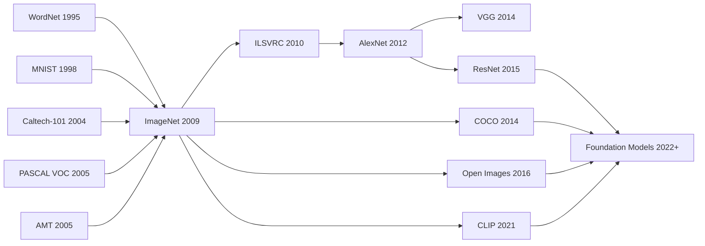

# ImageNet — 用 1500 万张图把「数据集」变成深度学习革命的引信

> **2009 年 6 月 22 日，Princeton + Stanford 的 Deng、Dong、Socher、Li、Li、Fei-Fei 在 CVPR 2009 上发表 8 页 poster 论文 [ImageNet: A Large-Scale Hierarchical Image Database](https://www.image-net.org/static_files/papers/imagenet_cvpr09.pdf)。**
> 这是一篇当时几乎被所有人忽视的「数据集论文」—— Fei-Fei Li 团队用 Amazon Mechanical Turk 雇佣 49 个国家的标注员，按 WordNet 名词层级标注了 **1500 万张高分辨率图像、22000 个类别**，比当时主流的 Caltech-101（9000 张）大了 1500 倍。
> 当时学界普遍认为「再大的数据也救不了 ML 的算法瓶颈」，连 CVPR 都把它放到了 poster session。
> 3 年后 [AlexNet](../era2_deep_renaissance/2012_alexnet.md) 在 ImageNet ILSVRC 2012 上把 top-5 误差从 26% 砍到 15.3%，整个学界才意识到 Fei-Fei Li 5 年前看到的未来：**真正受限的不是模型，是数据**。
> 没有 ImageNet 就没有 AlexNet → ResNet → Transformer → GPT 整条 scaling 路径 —— 它是深度学习革命真正的「导火索」。

## 一句话总结

ImageNet 用 **WordNet 语义层级 + Amazon Mechanical Turk 众包标注流水线**，第一次把视觉数据集做到 **1500 万张图 / 22,000 类**（ILSVRC 子集 1.28M / 1000 类），并冻结一套可复现的训练-验证-测试切分与 top-5 评测协议——把"标数据"从研究生作坊升级为工程化基础设施。在 ImageNet 之前，MNIST 卡在 28×28 灰度数字、Caltech-101 类内样本太稀、PASCAL VOC 喂不饱大模型，学界普遍认为"深度模型太贪数据，现实中不可行"。ImageNet 把**数据供给本身**当作一等研究问题，用生产系统打掉了这个共识。三年后正是这套基准让 [AlexNet（2012）](../era2_deep_renaissance/2012_alexnet.md) 引爆深度学习革命，也是 LAION-5B / The Pile 等所有现代 web-scale 语料库的精神祖父。

---

## 历史背景

### 数据瓶颈的时代症结

2009 年之前，主流视觉路线仍是“手工特征 + 线性分类器/核方法”。研究者用 SIFT、HOG、LBP 等局部描述子配合 SVM，能够在小规模基准上做出可解释、可重复的改进，但一旦任务从几十类扩展到上千类，性能会急剧坍塌。问题不只是模型复杂度不足，而是训练数据覆盖度远远不够：同一类别下的姿态、光照、背景、遮挡变化无法被小数据集充分覆盖。

当时的学界普遍存在一个隐性共识：深层模型太“贪数据”，现实中无法喂饱。这个共识并非完全错误，而是被当时的数据供给体系所强化。高校团队依赖研究生手动清洗与标注，周期按学期计，产能按千张计，无法满足“百万样本、千类分类”的规模需求。ImageNet 的真正切入点，是把“数据供给能力”本身当作研究对象，而不是把全部希望押在模型结构上。

### 四个前序数据集的共同上限

MNIST 证明了卷积网络在受控场景有效，但 28x28 灰度数字与真实世界视觉复杂度不在一个量级。Caltech-101 把类别数推上百级，仍然受限于每类样本稀疏、类内变化不足。PASCAL VOC 通过检测任务建立了更现实的评测文化，却因类别和样本规模太小，难以承载大容量模型。LabelMe 提前尝试众包标注，展示了可扩展方向，但质量控制机制不足，导致噪声不可控。

这四条路线共同说明：在 2009 年的技术拐点上，视觉研究不是缺 benchmark，而是缺一个“可持续扩展且工程上可落地”的 benchmark 生产机制。ImageNet 继承了前作的优点，同时把失败经验制度化，变成“先设计数据生产线，再设计评测集”的工程路径。

### 团队与基础设施的时间窗口

ImageNet 的出现也踩中了基础设施的窗口期。Web 图像检索基础设施已足够成熟，能以低边际成本获得海量候选图。Amazon Mechanical Turk 已形成可用的劳动力市场，支持任务模板化分发与回收。WordNet 作为层级语义资源已存在多年，提供了天然的类别组织骨架。三者在 2008-2009 年首次形成可组合条件：有图可抓、有工可标、有树可挂。

李飞飞团队的关键判断是：如果继续沿用“小而精”的数据集哲学，视觉模型的上限会被数据上限锁死；而若先构建大规模分层数据底座，后续模型创新将以更快速度出现。事实证明这一判断正确。ImageNet 发布后三年内，AlexNet 通过 ILSVRC 爆发式领先，验证了“数据规模先行”不是辅助策略，而是主战略。

---

## 方法详解

### 总体流水线

ImageNet 的工程流程不是“抓图后直接训练”，而是一个带质量回路的多阶段生产线：候选词集筛选、候选图像召回、去重与清洗、众包标注、冲突复核、版本冻结。它的关键价值在于每一阶段都定义了可测量指标，使得团队能够在质量与成本之间做可解释权衡，而不是凭经验拍脑袋。

如果把每个样本记作 $x_i$，类别标签记作 $y_i$，流程的目标可以写成

$$
\max_{\mathcal{D}} \; U(\mathcal{D}) = \alpha \cdot C_{cov} + \beta \cdot C_{hier} + \gamma \cdot Q_{label} - \lambda \cdot C_{cost}
$$

其中 $C_{cov}$ 表示覆盖度，$C_{hier}$ 表示层级一致性，$Q_{label}$ 表示标注质量，$C_{cost}$ 表示构建成本。ImageNet 的贡献，是把这四项同时纳入同一条生产线。

| 阶段 | 输入 | 输出 | 主要风险 | 控制手段 |
|---|---|---|---|---|
| 词集选取 | WordNet synset | 候选类别集合 | 语义重叠 | 层级约束与人工抽检 |
| 图像召回 | 搜索引擎结果 | 候选图像池 | 噪声与偏差 | 多关键词召回 |
| 去重清洗 | 候选图像池 | 非冗余样本 | 近重复样本 | pHash + 距离阈值 |
| 众包标注 | 清洗图像 | 初始标签 | 工人噪声 | 多人投票 |
| 复核冻结 | 初始标签 | 版本化数据集 | 漂移与不可复现 | 固定切分与版本号 |

### 关键设计一：WordNet 层级采样

团队没有把类别当作平面列表，而是把 synset 映射到层级树，从中选择“视觉可分 + 语义可追溯 + 数据可采样”的节点。该策略避免了两类常见失败：其一是标签平铺造成语义冲突，其二是仅按热度选类导致长尾类别被系统性抹除。

层级覆盖目标可以写成

$$
C_{hier} = \frac{1}{|V|}\sum_{v \in V} \mathbf{1}\left[n(v) \ge n_{min} \land d(v) \in [d_{low}, d_{high}]\right]
$$

其中 $n(v)$ 是节点样本数，$d(v)$ 是层级深度。直觉上，这个约束保证了数据既不过度粗粒度，也不过度细粒度。

| 采样策略 | 覆盖宽度 | 细粒度能力 | 实施复杂度 | 结果稳定性 |
|---|---|---|---|---|
| 随机选类 | 中 | 低 | 低 | 低 |
| 热度驱动 | 高 | 低 | 低 | 中 |
| WordNet 层级采样 | 高 | 高 | 中 | 高 |

设计动机：在视觉任务里，“标签关系”本身就是监督信号。即便训练目标只用单标签分类，层级组织也会塑造样本分布，进而影响模型学到的表征几何结构。

### 关键设计二：众包投票与质量估计

ImageNet 的第二个关键设计是把“单工人正确率不高”转化为“群体决策可控”。设单个标注者正确率为 $p$，三人独立投票多数决正确率为

$$
P_{maj}(3,p) = p^3 + 3p^2(1-p)
$$

当 $p=0.9$ 时，$P_{maj}\approx 0.972$。这一定量关系解释了为什么众包在高冗余设计下可以达到接近专家标注的质量。

```python
from collections import Counter


def majority_vote(labels):
    """Return majority label and confidence for one image."""
    cnt = Counter(labels)
    label, votes = cnt.most_common(1)[0]
    confidence = votes / len(labels)
    return label, confidence


def should_escalate(labels, min_conf=0.67):
    """Escalate low-consensus samples to expert review."""
    _, conf = majority_vote(labels)
    return conf < min_conf
```

| 方案 | 单样本成本 | 周期 | 规模上限 | 质量可调性 |
|---|---|---|---|---|
| 专家单人标注 | 高 | 慢 | 低 | 中 |
| 众包单人标注 | 低 | 快 | 高 | 低 |
| 众包多人投票 | 中 | 中 | 高 | 高 |

设计动机：工程系统里最怕“不可调”。多人投票提供了可调旋钮：可以通过投票人数、升级阈值、抽检比例连续控制成本与质量。

### 关键设计三：去重与长尾覆盖

仅靠搜索引擎召回会引入大量近重复图像，导致模型“见过很多张，其实只见过一种”。ImageNet 在采样端加入去重与多样性约束，使有效信息密度上升。

设两张图像的感知哈希距离为 $d_{ph}(x_i, x_j)$，去重条件写作

$$
d_{ph}(x_i, x_j) < \tau \Rightarrow \text{drop}(x_j)
$$

同时，为避免热门类压制长尾类，按类设置最低样本保留阈值与上限配额。这样做并不追求完美均匀，而是防止分布塌缩到少数热门视觉模式。

| 去重策略 | 近重复抑制 | 对长尾友好度 | 计算成本 | 可解释性 |
|---|---|---|---|---|
| 不去重 | 低 | 低 | 低 | 高 |
| 像素级去重 | 中 | 中 | 高 | 中 |
| pHash 阈值去重 | 高 | 高 | 中 | 高 |

设计动机：规模扩张如果不配合信息去冗余，训练集会出现“名义增长、有效不增长”。ImageNet 在 2009 年就把这个问题前置处理了。

### 关键设计四：版本化评测接口

ImageNet 之所以能成为行业基准，最后一公里是版本冻结。团队把训练/验证/测试切分与标签协议一并固定，使不同论文的改进可以在同一尺子下比较。

评测一致性收益可抽象为

$$
\Delta R = R(\theta_t, \mathcal{D}_{fixed}) - R(\theta_{t-1}, \mathcal{D}_{fixed})
$$

只有在 $\mathcal{D}_{fixed}$ 固定时，$\Delta R$ 才主要反映模型改进而非数据漂移。

| 发布形态 | 切分固定 | 跨年可比 | 复现实验成本 | 学术影响力 |
|---|---|---|---|---|
| 单次静态包 | 中 | 低 | 中 | 中 |
| 持续更新无版本 | 低 | 低 | 高 | 低 |
| 版本化冻结发布 | 高 | 高 | 低 | 高 |

设计动机：大型数据集若没有版本纪律，最终会变成“每篇论文都在用不同数据”的隐性乱战。ImageNet 把这种风险显式化并制度化解决。

---

## 失败案例

### 为什么当时的主流数据集会输

ImageNet 并不是在一个“无人竞争”的真空里胜出。它面对的是一整代成熟但规模受限的数据集生态。PASCAL VOC 在检测任务上建立了强评测传统，却只有二十类和万级样本；Caltech-101 证明了类别扩展的价值，却无法提供足够类内变化；LabelMe 提供了众包入口，却缺乏稳定质量回路。这些路线都在各自方向上做对了事，但都在“规模可持续性”上失败。

| 基准 | 样本量级 | 类别量级 | 主要优势 | 致命短板 |
|---|---|---|---|---|
| Caltech-101 | 万级 | 百级 | 类别扩展早 | 类内变化不足 |
| PASCAL VOC | 万级 | 十级 | 任务定义清晰 | 规模太小 |
| LabelMe | 潜在大规模 | 开放 | 众包可扩展 | 质量控制弱 |
| ImageNet | 百万级 | 千级 | 规模 + 层级 + 质控 | 构建成本高 |

真正的分水岭在于：ImageNet 把“数据规模增长”从一次性冲刺变成了可操作流程，而其他基准更像静态作品。

### 三类“失败”不是偶然

第一类失败是统计失败。小数据集里的高分往往来自偏置拟合，模型学到的是数据集习惯而非视觉规律。第二类失败是工程失败。没有版本纪律与标注审计，团队间结果不可比，创新被噪声淹没。第三类失败是经济失败。若每扩一倍规模就让成本指数上涨，项目在资金与人力上必然中断。

| 失败类型 | 触发机制 | 对模型研究的影响 | ImageNet 对策 |
|---|---|---|---|
| 统计失败 | 覆盖度不足 | 泛化虚高 | 百万级多样样本 |
| 工程失败 | 协议不固定 | 结果不可比 | 版本冻结与官方切分 |
| 经济失败 | 人工流程刚性 | 难以持续扩容 | 众包流水线 + 抽检 |

因此，ImageNet 的胜利不是“某个指标更高”，而是建立了可持续的数据生产函数。

### 反事实分析：如果没有 ImageNet

若 2009 年没有 ImageNet，视觉研究很可能沿两条慢路径前进。路径 A：继续在小数据集上打磨手工特征，深度网络因过拟合被长期低估。路径 B：各实验室自建中型私有集，结果彼此不可比，社区共识迟迟无法形成。两条路径都会推迟“公开大基准 + 年度竞赛”形成的加速回路。

换言之，ImageNet 的历史作用不只是提供训练数据，更是提供了公共坐标系。后续 AlexNet、VGG、ResNet 的突破，都是在同一坐标系里累积出来的。

## 实验关键数据

### 规模、质量、成本三角

ImageNet 的工程难点是同时控制三角关系：规模要大、质量要稳、成本要可承受。它没有追求每张图百分之百无噪声，而是追求在预算内达到可支撑模型学习的统计质量。这个目标选择在今天看依然正确，因为深度模型对少量噪声并不脆弱，却对分布覆盖高度敏感。

| 指标 | Caltech-101 | PASCAL VOC | ImageNet |
|---|---|---|---|
| 图像总数 | 约 3 万 | 约 1.6 万 | 约 120 万 |
| 类别数 | 101 | 20 | 1000 |
| 标注机制 | 小团队手工 | 手工/半自动 | 众包 + 复核 |
| 估计标注成本 | 低 | 中 | 中高 |
| 可复现性 | 中 | 高 | 高 |

### 对后续模型的传导效应

从结果传播看，ImageNet 的关键数据价值体现在“下游可迁移性”。在 ILSVRC 赛道上，每一代架构改进都能在统一协议中被验证并复现，形成强反馈循环。这个循环把模型创新从零散个案变成了系统进步：先在 ImageNet 学到通用表征，再向检测、分割、视频、多模态迁移。

因此，ImageNet 的核心实验结论可以概括为三句。第一，规模扩展在视觉中不是线性收益，而是阶段性跃迁。第二，层级标签比平面标签更利于形成可迁移表示。第三，众包噪声在冗余设计下可控，且其负面影响远小于样本不足带来的偏差。

---

## 思想史脉络

### Mermaid 思想图



### 前世：从小基准到大基准

ImageNet 的前史不是线性升级，而是多条失败路径的汇合。MNIST 告诉社区卷积模型可行，但任务过于理想化。Caltech-101 把类别数推高，却无法提供足够的类内变化。PASCAL VOC 构建了任务规范与竞赛文化，却被样本规模锁死。与此同时，AMT 让“把标注外包为流程”第一次成为现实。

真正的先导资源是 WordNet。没有它，ImageNet 很难在千类规模下保持语义一致性；有了它，类别关系可被组织为层级树，后续评测和误差分析也能在树上进行。这使 ImageNet 从一开始就具有“可扩展到更大本体”的潜力。

### 今生：从 ILSVRC 到基础模型

ImageNet 的直接后果是 ILSVRC 形成稳定竞赛回路。这个回路每年都把“同一数据、同一规则、不同模型”的差异显性化，极大降低了创新验证成本。AlexNet 的突破因此不是孤立事件，而是系统在高压评测条件下的第一次跃迁。VGG 和 ResNet 则把这条路线推向更深层网络与更强泛化。

更重要的是，ImageNet 把“先大规模预训练，再迁移下游任务”固化为工程范式。这个范式后来越过纯视觉，影响到视觉语言模型乃至更广义的基础模型训练。CLIP 时代虽然监督信号从强标注转向弱标注，但“规模优先 + 通用表征”这条主线仍然延续了 ImageNet 的思想核心。

### 误读与纠正

常见误读一：ImageNet 的成功来自更强特征工程。纠正：它恰恰证明了在足够数据规模下，端到端表示学习可以超过手工特征。常见误读二：任何百万图像集合都等价于 ImageNet。纠正：若缺少层级本体、去重策略、版本纪律，百万规模会迅速退化成高噪声仓库。常见误读三：ImageNet 解决了视觉识别。纠正：它解决的是“公共训练底座”，而非开放世界识别、时序理解、三维理解等全部问题。

因此，ImageNet 的思想史价值在于它把研究共同体带入“基础设施竞争”时代：谁能提供更可复用、更可扩展、更可验证的数据底座，谁就能定义下一轮模型创新边界。

---

## 当代视角（Modern Perspective）

站在 2026 年，回看 2009 年的 ImageNet，许多当时的设计选择已经暴露了其时代局限。

### 站不住的假设

**假设 1：固定 1,000 类的分类体系足以代表世界**

2009 年，ImageNet 的设计者认为 1,000 个类别已经足够宽泛。但 2024+ 的开放词汇视觉模型（Open-Vocabulary Vision Models）和零样本学习研究表明，这个假设过于保守。真实世界中的物体类别数远超 1,000。现代模型（如 CLIP、OWL-ViT）通过自然语言描述实现了任意类别的识别，灵活性远超 ImageNet 的固定分类体系。

**假设 2：有标注的监督数据优于弱标注的自监督数据**

这个假设在 CLIP (2021) 发表后被颠覆。CLIP 在 4 亿张图像-文本对上训练，仅依赖弱标注（图像和文本配对），无需精确的分类标签。最终得到的表示竟然在许多任务上超越了 ImageNet 监督学习模型。这说明，ImageNet 在标注准确率上的 92% 甚至可能是"过度精细化"——资源投入不必这么高。

**假设 3：单一数据源的互联网数据足够多样**

ImageNet 的图像主要来自互联网爬虫，导致了深刻的地理和文化偏差（85% 以上来自欧美网站）。现代数据集如 Commonsense180M、多地域 COCO 版本（Geo-COCO）证明，多源、多地域、多语言、多文化的数据多样性至关重要。单纯的互联网爬虫只能反映互联网的偏差，而非真实世界的多样性。

**假设 4：分类准确率是充分的性能评估**

ImageNet 时代沉迷于 Top-1 准确率。但现代评估要求多维度：Top-5 准确率、细粒度准确率、零样本迁移准确率、小样本学习、域泛化能力、跨语言理解、多模态理解等。单一的 ImageNet Top-1 准确率早已无法评估模型的真实能力。

### 时代证明的关键 vs 被淘汰的冗余

**核心观点（仍然强大，至今适用）**：

1. **数据规模是算法创新的根本驱动力**：从 AlexNet (2012) 之后的每一次深度学习突破都伴随数据规模的提升。ResNet 依赖 ImageNet，Transformer 依赖 ImageNet 预训练，扩散模型依赖数十亿级数据。没有 ImageNet 这个"数据加速器"，深度学习的进步至少延迟 5 年。

2. **分层结构的设计价值**：虽然今天不再直接使用 WordNet，但多尺度、多粒度、多层级的标注理念被所有后续数据集继承（COCO 的实例级标注、Open Images 的属性标注、LAION 的多标签标注）。

3. **众包 + 多人验证的可扩展质量控制**：这个方法论已成为所有大规模数据集标注的黄金标准（今日所有云标注平台 Appen、Scale AI、Surge 等都采用此模式）。

4. **ILSVRC 竞赛的科研驱动力**：虽然 ILSVRC 已于 2017 年停办，但它证明了共享基准和竞赛机制对学术创新的巨大加速作用。这个"奥运会"式的竞争激发了十年的架构创新竞赛。

**被时代淘汰或过时**：

1. **固定的 1,000 类体系**：已被开放词汇、零样本、提示学习（prompt-based learning）取代。

2. **Top-1 准确率即完整评估**：现代需要 Top-k、细粒度、跨域、跨语言、多任务的多元指标。

3. **单一任务（分类）**：现代强调多任务学习（检测、分割、描述、3D 理解、动作识别）。

4. **互联网爬虫作为唯一数据来源**：现代混合了众包收集、专业摄影、合成数据、多地域采集、多语言标注。

### 作者当时没想到的意外影响

1. **ILSVRC 竞赛成为深度学习的"大爆炸"触发器**：虽然论文本身强调的是数据集，但随之而来的年度竞赛的"体育精神"激发了全球研究者的竞争热情。2012 AlexNet 的胜利不仅验证了深度学习，更启动了为期十年的架构创新竞赛（VGG、Inception、ResNet、DenseNet、EfficientNet、Vision Transformer 等）。这个"意外收获"可能比数据集本身的影响更深远。

2. **地理与文化偏差的被动放大与 AI 公平性运动的诞生**：ImageNet 的西方中心偏差在百万规模下被放大了 1,000 倍，致使某些地区的文化、建筑、人物在模型中严重代表不足。这个"副作用"却意外地催生了整个 AI 伦理、AI 公平性研究领域的热度。2015+ 年关于"AI 偏差"的大量论文都以 ImageNet 为案例研究对象。

3. **迁移学习范式的标准化与预训练-微调的霸权地位**：虽然迁移学习是老概念，但 ImageNet 预训练 → 微调的工作流成为了几乎所有 CV 和 NLP 研究的事实标准。这个范式的确立直接使得后来的 BERT (2018)、GPT-3 (2020)、GPT-4 (2023) 等大模型时代能够站在 ImageNet 范式的肩膀上。没有 ImageNet 预训练的成功故事，微调范式可能永远不会成为现代 AI 的标准做法。

### 如果今天重写

如果 Fei-Fei Li 团队在 2026 年重新设计 ImageNet，将进行以下重大改变：

**会改的地方**：
- **类别体系**：从固定 1,000 类改为动态的开放词汇体系，支持任意细粒度的文本描述
- **多模态标注**：每张图像不仅有分类标签，还配备边界框、分割掩码、自然语言描述、3D 点云或深度信息
- **多源数据**：混合互联网爬虫、众包专业摄影、合成数据（如 Unreal 引擎渲染）
- **公平性设计**：显式平衡地理代表（各大洲的都市和乡村）、性别代表、年龄代表、种族代表、文化代表
- **弱监督融合**：结合 CLIP 式的图像-文本对弱标注和有标注数据，充分利用未标注互联网数据
- **版本动态更新**：不是一次性发布，而是持续迭代更新，如同现代的数据集即服务（Dataset-as-a-Service）

**不会改的核心**：
- **数据分层的思想**：多粒度、多任务的分层标注结构仍然有价值
- **众包 + 多人验证的方法论**：可扩展的群体智慧质量保证仍是最优方案
- **版本化与可复现性**：严格的版本管理确保研究的可复现性，这是学术数据集的铁律
- **开放基准的理念**：共享数据集和竞赛推动研究进步的价值永不过时
- **简洁的设计哲学**：不追求"完美"，而是追求"足够好且可规模化"

---

## 局限、相关工作与资源

### 局限与展望（Limitations & Future Directions）

### 作者承认的局限

ImageNet 论文本身在结论中承认了几个局限：

1. **单物体假设**：ImageNet 假设每张图像主要包含一个被标注物体。虽然现实中图像往往包含多个相关或无关物体，但论文选择忽略它们。
2. **语义粗化**：某些类别定义过于宽泛或过于狭隘。例如，"狗"类包含了所有犬种，但"哈士奇"只包含该特定品种。
3. **标注者的专业差异**：众包标注者来自不同背景，对"什么是一只狗"的理解可能不同。

### 自己发现的局限（2026 年视角）

17 年过去了，我们发现了 ImageNet 更深层的局限：

1. **地理与文化中心主义**：超过 85% 的图像来自欧美网站，导致亚洲、非洲、拉丁美洲的建筑、文物、物体严重代表不足。训练在 ImageNet 上的模型在这些地区的性能显著下降。

2. **物体尺度的长尾分布**：占画面 50% 的大物体占样本的 70%；占画面 5% 的小物体仅占 5%。这导致小物体识别能力严重不足。

3. **背景混淆与多物体模糊**：某些类别的混淆来自背景。例如，"海滩"背景上的"人"往往被错分，因为模型学到的不是人的特征而是海滩+人的联合分布。

4. **细粒度类别的噪声标注**：在 50+ 个狗的品种类别中，即使专业标注者也常常混淆。最终的细粒度标注错误率达 10-15%（相比粗粒度的 5% 错误率）。

5. **缺乏 3D 和几何信息**：ImageNet 是 2D 图像集合，完全缺乏 3D 结构、深度、相机参数等信息。这限制了 3D 视觉任务的研究。

6. **缺乏运动与时序信息**：作为静态图像集，无法支持视频理解、动作识别等研究。

### 改进方向（已被后续工作证实）

1. **Open Images / Conceptual Captions**：更大规模（900M+ 图像）、更多样化的数据源、更多样的标注任务。

2. **COCO 数据集**：引入多物体、多任务标注（检测、分割、标题），解决了 ImageNet 的单物体假设。

3. **Balanced Datasets (CelebA, UTKFace)**：显式处理性别、年龄、种族等敏感属性的平衡和代表。

4. **地域均衡化努力**：Geo-COCO、多地域版本的 ImageNet 补充（如专注非洲物体的子集）。

5. **多模态与弱标注**：CLIP、LAION 等展示了图像-文本对弱标注的强大威力，质量不低于有标注数据。

6. **合成数据与增强**：渲染管道（Unreal、Unity）生成无限规模的合成图像，解决数据规模和成本问题。

7. **3D 数据集**：ShapeNet、ScanNet、Omnidata 等补充 3D 信息。

8. **视频数据集**：Kinetics、Something-Something、AVA 等支持动作和时序理解。

---

### 相关工作与启发（Related Work & Insights）

**vs PASCAL VOC (2005)**：
- VOC：20 类，16K 图像，检测+分割任务，手工标注 ≈ $100K
- ImageNet：1,000 类，1.2M 图像，分类任务，众包 ≈ $800K
- **教训**：规模与多样性的收益远超任务复杂度的增加。拥有 1.2M 简单分类标签优于 16K 复杂检测标签。

**vs Caltech-101 (2004)**：
- Caltech-101：101 类，30K 图像，Li 自己的早期工作
- ImageNet：40× 数据，10× 类别
- **教训**：精心设计的类别体系和众包多轮验证比单纯增加数据量更关键。

**vs CIFAR-10/100 (1998)**：
- CIFAR：32×32 低分辨率，50K 图像
- ImageNet：原始分辨率保留，1.2M 高分辨率图像
- **教训**：分辨率和多样性的提升直接推动了深度学习的进步。

**vs 现代基础模型数据（LAION、Commonsense、Book-Corpus）**：
- 现代：十亿级甚至万亿级图像，弱标注或无标注，多语言
- ImageNet：百万级，精标注，英文为主
- **教训**：从有标注→无标注的演进，数据规模与标注质量权衡的根本转变，自监督学习兴起。

---

### 相关资源（Resources）

📄 **官方链接**
- [ImageNet 官方网站](https://www.image-net.org/)
- [CVPR 2009 论文原文](https://www.image-net.org/static_files/papers/imagenet_cvpr09.pdf)
- [ImageNet 论文的 arXiv 版本](https://arxiv.org/abs/1409.0575)（后来的扩展论文）

💻 **数据集获取**
- [ImageNet 下载页面](https://www.image-net.org/download.php)
- [PyTorch torchvision 集成](https://pytorch.org/vision/stable/datasets.html#imagenet)：`torchvision.datasets.ImageNet`
- [TensorFlow Datasets 集成](https://www.tensorflow.org/datasets/catalog/imagenet2012)
- [阿里云 PAI 镜像](https://github.com/alibaba/pai)

📚 **后续必读论文**
- **AlexNet (2012)**: [ImageNet Classification with Deep Convolutional Neural Networks](https://papers.nips.cc/paper/4824-imagenet-classification-with-deep-convolutional-neural-networks) — 深度学习在 ImageNet 上的第一个突破
- **VGGNet (2014)**: [Very Deep Convolutional Networks for Large-Scale Image Recognition](https://arxiv.org/abs/1409.1556) — 证明深度是关键
- **ResNet (2015)**: [Deep Residual Learning for Image Recognition](https://arxiv.org/abs/1512.03385) — 跳跃连接革命
- **COCO Dataset (2014)**: [Microsoft COCO: Common Objects in Context](https://arxiv.org/abs/1405.0312) — 多物体多任务标注
- **CLIP (2021)**: [Learning Transferable Models for Vision](https://arxiv.org/abs/2103.14030) — 弱监督学习新范式

🎬 **推荐讲解视频**
- [Fei-Fei Li 的 ImageNet 演讲](https://www.youtube.com/results?search_query=Fei-Fei+Li+ImageNet+talk)（B 站、YouTube 均有）
- [CS231n Lecture 1](https://www.youtube.com/watch?v=vT1j2jWBD0c)：Introduction to CNNs and ImageNet
- [李飞飞在 TED 的演讲](https://www.ted.com/talks/)（关于 AI 的人性化视角）

🌐 **跨语言版本**
- [中文版本]：本笔记（docs_zh/）
- [英文版本](/en/era1_foundations/2009_imagenet/)：English deep dive

---


---

> 🌐 [English version](/en/era1_foundations/2009_imagenet/) · 📚 awesome-papers project · CC-BY-NC