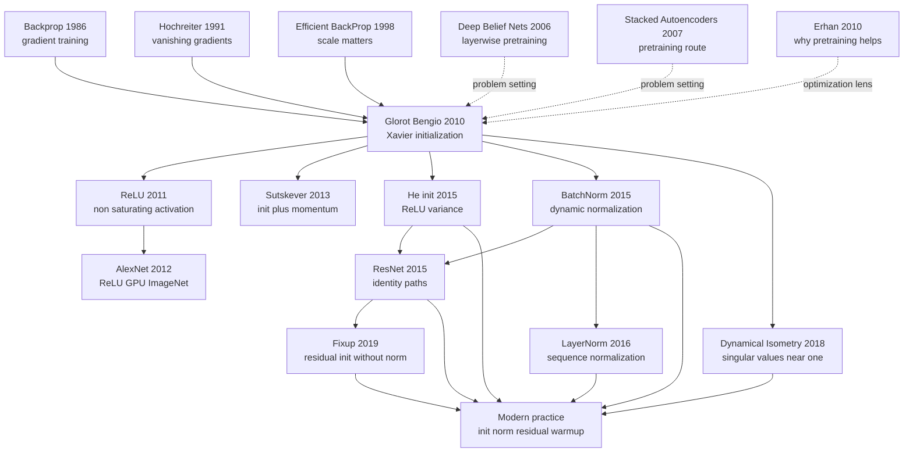

# Glorot Init — 让深度网络先把信号传过去

> **2010 年 5 月，Xavier Glorot 与 Yoshua Bengio 在 AISTATS 发表 [Understanding the difficulty of training deep feedforward neural networks](https://proceedings.mlr.press/v9/glorot10a.html)。** 这篇 8 页论文最容易被误读成「Xavier 初始化公式出处」，但它更像一份病理报告：为什么 2006-2010 年的深网明明有 backprop，却仍要靠 RBM / autoencoder 预训练才能训起来？答案不是一句「梯度消失」就够了，而是 sigmoid 的非零均值把上层推入饱和、随机权重让前向方差和反向梯度逐层漂移、层 Jacobian 的奇异值远离 1。后来的 ReLU、He init、BatchNorm、ResNet 都是在继续修这份诊断书里指出的同一个问题：深度网络首先要让信号穿得过去。

## 一句话总结

Glorot 与 Bengio 2010 年发表在 AISTATS 的这篇论文，把「深度前馈网络为什么难训」从经验抱怨变成可测量的信号传播问题：sigmoid 的输出均值大于 0，会把高层 pre-activation 系统性推向饱和区；饱和区导数接近 0，导致反向梯度慢到像训练停滞；而一个好初始化必须同时让前向激活和反向梯度的方差在层间保持稳定。论文给出的核心规则是今天仍叫 Xavier / Glorot init 的 $W \sim U[-\sqrt{6/(n_{in}+n_{out})}, \sqrt{6/(n_{in}+n_{out})}]$，等价于让 $\mathrm{Var}(W) \approx 2/(n_{in}+n_{out})$。它替代的失败 baseline 不是某个单一模型，而是 2006-2010 年「随机小权重 + sigmoid/tanh + 直接监督训练」这整套会在 4-5 层后掉进 plateau 的默认做法；RBM 和 autoencoder 预训练只是绕开这个病灶的拐杖。

这篇论文的历史位置很特别：它是 [Backprop（1986）](1986_backprop.md) 与 [ReLU（2011）](2011_relu.md) 之间最关键的诊断节点，又直接通向 [AlexNet（2012）](../era2_deep_renaissance/2012_alexnet.md) 的工程胜利、He init（2015）的 ReLU 专用方差修正、BatchNorm（2015）的动态分布控制和 [ResNet（2015）](../era2_deep_renaissance/2015_resnet.md) 的 identity path。反直觉之处在于：Xavier init 本身没有「解决深度学习」，甚至很快被 ReLU/He init 在主流 CNN 中部分替代；但它让学界第一次把初始化看成 Jacobian conditioning 和 signal geometry，而不是随机数种子选择。

---

## 历史背景

### 2006-2010: 深网复兴被预训练占据

1986 年 backprop 让多层网络在原则上可训练，但 1990 年代到 2000 年代初的实际经验很冷：层数稍微加深，sigmoid 网络就进入平台期，训练误差不降，测试误差更谈不上。2006 年 Hinton 的 Deep Belief Net 和 Bengio 实验室的 stacked autoencoder 重新点燃深度学习，靠的是一条绕路：先逐层做 unsupervised pretraining，把每一层初始化到看起来有用的位置，再用监督信号 fine-tune。那几年「深度学习」几乎等于「逐层预训练 + sigmoid/tanh + 小数据集验证」。

这套范式有效，但解释很含混。预训练到底是在给模型好特征，还是在给优化器好起点？如果只是起点问题，为什么随机初始化这么差？如果只是梯度消失，为什么有些单元会在长时间 plateau 后自己慢慢恢复？Glorot 与 Bengio 2010 年的论文正是在这个夹缝里出现的：它不再把预训练当成神秘救命药，而是问标准 backprop 从随机初始化失败的物理原因是什么。

### Sigmoid 为什么成了默认又成了麻烦

Sigmoid 在早期神经网络里非常自然：输出在 $(0,1)$，形式上像概率，导数好写，也符合当时「神经元发放率」的直觉。RBM、autoencoder、早期分类 MLP 都顺手使用它。但 sigmoid 有两个对深度网络很坏的性质。第一，它不是零中心，均值通常为正；一层输出的正偏移进入下一层，会把下一层 pre-activation 往同一方向推。第二，sigmoid 一旦进入两端饱和区，导数接近 0；梯度不仅变小，而且恢复得慢。

Tanh 把输出移到 $(-1,1)$，缓解了均值问题，却没有消除饱和问题。于是 2010 年的真实局面很尴尬：大家知道深度有用，也知道 backprop 是基本工具，却常常要用预训练、特殊学习率、手工调 scale 才能让网络动起来。Glorot 论文的关键贡献，是把这种「调参玄学」转写成层间激活统计、梯度统计和 Jacobian 奇异值的语言。

### Glorot 与 Bengio 当时要回答什么

Xavier Glorot 当时是 Universite de Montreal / LISA 实验室的博士生，Yoshua Bengio 是深度学习复兴的核心人物之一。更有意思的是，Bengio 实验室本身就是逐层预训练路线的重要推动者；这篇论文等于从体系内部反问：我们真的需要预训练，还是因为默认激活函数和初始化把优化问题搞坏了？

AISTATS 2010 不是 ImageNet 时代的舞台，实验规模也远小于今天的基础模型，但这恰好让论文的诊断更清楚。作者没有靠更大数据或更强 GPU 掩盖问题，而是观察普通深层 MLP 在训练过程中每一层的激活均值、方差、梯度和饱和比例。论文最有历史穿透力的部分不是某个单一数字，而是它让读者看到：网络还没开始表达复杂函数，信号已经在层间传输时变形了。

## 研究背景与动机

### 研究问题

论文的问题可以压缩成一句话：随机初始化的深度前馈网络，为什么在标准梯度下降下这么难优化？作者把这个问题拆成三层。第一，激活函数本身是否把单元推入坏工作区间？第二，权重尺度是否让前向信号逐层放大或衰减？第三，反向传播穿过每一层时，梯度是否被该层 Jacobian 的奇异值系统性拉伸或压扁？

这种拆法在今天看很自然，但在 2010 年很锋利。它把「模型深所以难」改写成「每一层是不是近似保持信号几何」。如果层变换的 Jacobian 奇异值都接近 1，误差信号能较稳定地穿过深度；如果奇异值远离 1，梯度就会爆炸或消失。Xavier 初始化的公式不是凭空来的，而是这个几何目标的低成本近似。

### 为什么这不是普通初始化小技巧

论文的初始化规则后来被深度学习框架包装成一行 API，于是容易显得像工程小技巧。但原文真正重要的是诊断方法：先用激活分布解释 sigmoid 的饱和，再用方差传播推导合适的权重尺度，最后用 Jacobian 奇异值说明为什么「接近 1」才是深层优化的理想状态。

这也解释了它为什么能连接后来的多条主线。ReLU 2011 把饱和激活换掉；He init 2015 为 ReLU 重新计算方差；BatchNorm 2015 直接在训练中控制层间分布；ResNet 2015 用 identity path 让深层 Jacobian 更接近可通行的形式。它们的工程外观不同，但都在回应 Glorot 与 Bengio 2010 年提出的同一个问题：深度网络内部的信号传播是否健康。

---

## 方法详解

### 诊断对象：不是模型精度，而是信号传播

Glorot 与 Bengio 没有把论文写成「我们提出一种初始化，然后在若干数据集上更准」。它更像一次网络体检。作者训练普通深层前馈网络，然后逐层记录三类量：前向激活的均值与方差、反向梯度的尺度、以及单元进入饱和区的比例。这样的视角在 2010 年很少见，因为当时深度学习论文更常比较预训练算法，而不是直接打开网络内部看每层发生了什么。

一个 $L$ 层 MLP 可以写成：

$$
z^{(l)} = W^{(l)}h^{(l-1)} + b^{(l)},\quad h^{(l)} = \phi(z^{(l)}),\quad l=1,\ldots,L.
$$

如果每一层都让 $h^{(l)}$ 的尺度漂移一点，漂移经过多层后就会变成灾难。前向传播中方差可能逐层变小，信息被压扁；也可能逐层变大，激活冲入饱和区。反向传播中同样如此，误差信号要乘上一串 Jacobian，任何系统性偏离都会被深度放大。

| 观察对象 | 论文中关心的问题 | 失败时的症状 | 后续对应技术 |
|---------|----------------|-------------|-------------|
| 激活均值 | 输出是否零中心 | sigmoid 正均值把上层推偏 | tanh, normalization |
| 激活方差 | 前向信号是否保尺度 | 逐层缩小或放大 | Xavier, He init |
| 饱和比例 | 单元是否还可学习 | 梯度接近 0, plateau | ReLU, GELU |
| Jacobian 奇异值 | 反向梯度是否通行 | 梯度爆炸或消失 | orthogonal init, residual path |

### Sigmoid 失败机制：非零均值和饱和相互放大

Sigmoid 的导数为：

$$
\sigma'(z) = \sigma(z)(1-\sigma(z)) \leq 0.25.
$$

这意味着就算单元处在最好的工作点，单层也最多传回四分之一的局部梯度；一旦 $z$ 进入正负饱和区，导数会更接近 0。更麻烦的是 sigmoid 输出恒为正，所以上一层的输出均值会把下一层 pre-activation 往某个方向推。层数越深，这个偏移越容易把顶层隐藏单元推入饱和。

论文里最有洞察力的观察之一是：饱和单元并不一定永久死亡，它们可以靠非常慢的梯度自己爬出饱和区。这解释了早期深网训练中常见的长平台期：网络不是完全不能学，而是在坏初始化和坏激活的组合下，用极慢速度修复自己的内部统计。预训练之所以有效，部分原因就是它提前把网络放到一个不那么饱和的位置。

### Xavier 初始化推导：同时照顾 fan-in 与 fan-out

如果假设输入和权重独立、均值接近 0，那么一层线性变换的前向方差大致满足 $\mathrm{Var}(z^{(l)}) \approx n_{in}\mathrm{Var}(W^{(l)})\mathrm{Var}(h^{(l-1)})$。要让前向方差不变，希望 $n_{in}\mathrm{Var}(W) \approx 1$。反向传播时，梯度方差类似受 $n_{out}\mathrm{Var}(W)$ 控制；要让反向方差不变，又希望 $n_{out}\mathrm{Var}(W) \approx 1$。两者不能同时精确满足时，Glorot 规则取折中：

$$
\mathrm{Var}(W) \approx \frac{2}{n_{in}+n_{out}},\quad W \sim U\left[-\sqrt{\frac{6}{n_{in}+n_{out}}},\sqrt{\frac{6}{n_{in}+n_{out}}}\right].
$$

这个公式的工程含义非常朴素：宽层可以用更小权重，窄层可以用稍大权重；既不要让前向激活爆掉，也不要让反向梯度被压没。它适合 tanh / softsign 这类近似零中心、在原点附近斜率接近 1 的激活。对 ReLU 来说，后来 He init 会把方差改成 $2/n_{in}$，因为 ReLU 大约丢掉一半负区间激活。

| 初始化 | 典型公式 | 主要适用对象 | 历史意义 |
|-------|----------|-------------|---------|
| 小均匀随机 | $U[-0.01,0.01]$ | 早期 MLP | 容易让深层信号过小 |
| LeCun fan-in | $\mathrm{Var}(W)=1/n_{in}$ | 线性/tanh 近似 | 强调前向方差 |
| Xavier / Glorot | $\mathrm{Var}(W)=2/(n_{in}+n_{out})$ | tanh, softsign | 同时折中前向和反向 |
| He / Kaiming | $\mathrm{Var}(W)=2/n_{in}$ | ReLU family | 修正 ReLU 的半区激活 |

### 一个最小实现

下面的代码不是论文原代码，而是把论文里的方差逻辑写成现代 NumPy 形式。核心点是：初始化不是「随机取小一点」，而是由相邻两层的 fan-in / fan-out 决定。

```python
import math
import numpy as np


def glorot_uniform(fan_in: int, fan_out: int, rng=None):
    rng = np.random.default_rng(rng)
    limit = math.sqrt(6.0 / (fan_in + fan_out))
    return rng.uniform(-limit, limit, size=(fan_out, fan_in))


def layer_stats(weights, inputs):
    preact = inputs @ weights.T
    tanh_out = np.tanh(preact)
    sigmoid_out = 1.0 / (1.0 + np.exp(-preact))
    return {
        "preact_var": float(preact.var()),
        "tanh_mean": float(tanh_out.mean()),
        "sigmoid_mean": float(sigmoid_out.mean()),
        "sigmoid_saturation": float(np.mean((sigmoid_out < 0.05) | (sigmoid_out > 0.95))),
    }

x = np.random.default_rng(0).normal(size=(2048, 784))
w = glorot_uniform(784, 512, rng=1)
print(layer_stats(w, x))
```

这段代码里最值得注意的是 `sigmoid_mean`：即使 pre-activation 近似零均值，sigmoid 输出均值也在 0.5 附近，而不是 0。这就是论文强调 sigmoid 会制造层间偏移的原因。Tanh 的输出均值更接近 0，所以同样初始化下更容易把深层网络留在可训练区域。

### 规则改变了什么

Xavier 初始化没有让网络自动变聪明，它只是让网络一开始不要自毁。它改变了三个层面的默认假设。第一，初始化必须看层宽，而不是固定尺度。第二，前向和反向信号要同时考虑；只让激活不爆还不够，梯度也要能回去。第三，深层训练困难可以通过统计量诊断，而不是只能靠最终 accuracy 猜测。

这也是为什么它能活到今天。PyTorch 的 `torch.nn.init.xavier_uniform_`、TensorFlow 的 `GlorotUniform`、Keras 的默认 dense 初始化都继承了这个规则。即便现代 ReLU 网络更常用 He init，Transformer 更依赖 LayerNorm 和 residual scaling，Xavier init 仍是「方差保持初始化」这门工程语言的起点之一。

---

## 失败案例

### 失败 baseline 1：固定小尺度随机初始化

早期 MLP 常用一个固定小区间初始化所有层，例如 $U[-0.01,0.01]$ 或类似手工尺度。浅层网络里这通常还能工作，因为梯度路径短，信号只需要穿过少数几层。深层网络里，固定尺度会立刻暴露问题：同样的权重方差对宽层和窄层不是同一种操作，前向激活可能快速衰减，反向梯度也可能在多层相乘后消失。

这个 baseline 的失败教训是：初始化尺度不是全局超参，而是层结构的一部分。Glorot 规则把它绑定到 $n_{in}$ 和 $n_{out}$，等于承认「层宽」会决定信号传播的物理尺度。

### 失败 baseline 2：sigmoid 深网直接监督训练

论文最核心的反面教材是 sigmoid。它的问题不是单纯「导数小」，而是非零中心输出和饱和区导数小会相互放大。上层隐藏单元被推入饱和后，梯度近乎停滞；它们有时能自己爬出来，但速度很慢，形成训练曲线上的长平台。

| Baseline | 当时为什么合理 | 论文观察到的问题 | 后来的处理方式 |
|----------|----------------|----------------|---------------|
| 固定小随机权重 | 避免一开始激活过大 | 深层信号被压得太小 | fan-in/fan-out 初始化 |
| Sigmoid + SGD | 概率解释自然 | 非零中心, 顶层饱和 | tanh, ReLU, normalization |
| Tanh + 旧初始化 | 零中心输出 | 仍会饱和, 尺度不稳 | Xavier init |
| Softsign / less-saturating 非线性 | 饱和更慢 | 有帮助但不是完整解法 | 激活和初始化一起设计 |

### 失败 baseline 3：预训练作为绕路而非根治

RBM 和 autoencoder 预训练在 2006-2010 年的确有效，但这篇论文把它重新解释为一种绕路。预训练能把权重放到一个更容易 fine-tune 的区域，减少上层饱和和坏尺度带来的伤害；但如果真正病因是激活函数和初始化导致的信号传播失败，那么预训练不是唯一道路。

这点对后来的深度学习革命非常关键。2011 年 ReLU 论文证明换激活后不做预训练也能训深 MLP；2012 年 AlexNet 在 ImageNet 上完全走监督学习路线。Glorot 2010 在思想上先完成了转向：从「用无监督方法救监督训练」转到「把监督训练本身的信号通路修好」。

## 实验关键数据

### 关键图像比关键表格更重要

这篇 AISTATS 论文不像后来的 ImageNet 论文那样靠一个巨大的 leaderboard 数字取胜。它的实验证据主要来自训练过程曲线和层内统计图：各层激活如何分布，饱和单元比例如何变化，梯度如何在深层传播，新初始化怎样缩短 plateau。换句话说，它的关键数据是「网络内部发生了什么」，不是「最终多赢几个点」。

| 实验信号 | 论文中的观察 | 解释 | 影响 |
|---------|-------------|------|------|
| Sigmoid 顶层饱和 | 上层单元容易进入 0/1 饱和 | 正均值逐层推偏 | sigmoid 退出默认激活位置 |
| Plateau | 饱和单元可慢慢恢复 | 梯度极小但非零 | 解释早期训练停滞 |
| Tanh 表现更稳 | 零中心缓解偏移 | 但仍受饱和影响 | Xavier init 与 tanh 常搭配 |
| Jacobian 奇异值偏离 1 | 梯度被拉伸或压缩 | 深度放大局部失真 | dynamical isometry 理论前身 |
| 新初始化收敛更快 | 方差更稳定 | 前向和反向同时受控 | 框架默认初始化改变 |

### 小实验为什么产生大影响

从今天的尺度看，论文实验很小：普通前馈网络、有限数据集、没有 GPU 大规模训练、没有现代 benchmark。可是它影响巨大，正因为它回答的是所有深网都会遇到的前置问题。只要模型足够深，初始化、激活函数和梯度传播就会决定训练是否能开始；这个事实不依赖某个数据集。

更重要的是，论文把「深度训练」从玄学调参转化为可观测对象。后来的研究可以替换其中任意组件：把 sigmoid 换成 ReLU，把 Xavier 换成 He，把静态初始化换成 BatchNorm，把层变换换成 residual block。但每次替换都可以沿着同一条问题链追问：前向方差是否稳定？反向梯度是否通行？Jacobian 是否接近良性？这就是它作为经典论文的实验价值。

---

## 思想史脉络

### 前世：Xavier init 继承了哪些旧问题

Glorot 初始化看起来像一个简洁公式，但它背后接住的是三十年神经网络训练史的旧账。Backprop 证明了多层网络可以用梯度训练，Hochreiter 说明梯度会随深度消失，LeCun 的 Efficient BackProp 反复强调输入中心化和尺度选择，Hinton 与 Bengio 的预训练路线则用无监督学习绕过坏初始化。这些线索在 2010 年汇到一起：如果深度网络失败不是因为 backprop 错了，而是因为每层的信号几何一开始就坏了，那么初始化就不再是细节。

| 前序工作 | 年份 | 留给 Glorot 2010 的问题 | 在本文中的继承 |
|---------|-----|------------------------|---------------|
| Backpropagation | 1986 | 多层网络可用梯度训练 | 研究为什么深层仍训不动 |
| Hochreiter gradient analysis | 1991 | 梯度会跨长路径衰减 | 前馈深网也有类似病理 |
| Efficient BackProp | 1998 | 输入和权重尺度很关键 | 把经验建议公式化 |
| Deep Belief Nets | 2006 | 预训练能绕开坏优化 | 解释预训练为何必要 |
| Greedy layer-wise training | 2007 | 深层表示可逐层建立 | 反问能否不逐层预训练 |
| Erhan pretraining study | 2010 | 预训练像优化正则 | 给出另一种初始化视角 |

### Mermaid 图：从预训练时代到现代初始化实践



### 今生：后继工作如何改写这条规则

Xavier 初始化的后继并不是一条直线，而是一组围绕「让信号穿过深度」的工程分支。ReLU 直接攻击饱和激活，He init 为 ReLU 重新推导方差，BatchNorm 把静态初始化变成训练过程中的动态校正，ResNet 给梯度提供 identity path，LayerNorm 把归一化带入序列模型，dynamical isometry 理论则把 Glorot 论文中的 Jacobian 直觉数学化。

| 后继工作 | 年份 | 继承了什么 | 改写了什么 |
|---------|-----|------------|------------|
| Deep Sparse Rectifier Networks | 2011 | 饱和激活是病灶 | 用 ReLU 避免正区间饱和 |
| AlexNet | 2012 | 直接监督深网可行 | 用数据和 GPU 放大效果 |
| Sutskever init plus momentum | 2013 | 初始化决定优化入口 | 加上动量也可训深模型 |
| He initialization | 2015 | 方差传播推导 | 为 ReLU 改成 $2/n_{in}$ |
| Batch Normalization | 2015 | 层分布要稳定 | 训练中持续校正分布 |
| ResNet | 2015 | Jacobian 要可通行 | identity path 让梯度有高速路 |
| Dynamical Isometry | 2018 | 奇异值接近 1 | 建立更严格的谱理论 |

### 后人误读：Xavier init 经常被说窄了

| 误读 | 为什么不准确 | 更好的读法 | 后果 |
|------|--------------|------------|------|
| Xavier init 就是一个公式 | 原文重点是诊断深网为什么病 | 公式是信号传播分析的产物 | 忽略 Jacobian 视角 |
| 它解决了梯度消失 | 它只改善初始化时的尺度 | 激活、归一化、残差仍必要 | 高估单一技巧 |
| 它适合所有激活 | ReLU 需要 He init 更匹配 | 初始化要和非线性共设计 | API 默认可能误用 |
| 预训练因此完全无用 | 监督视觉中退场, 自监督仍重要 | 预训练角色从优化变成表征 | 混淆 2006 与 2020 的 pretraining |

最重要的误读是把论文的贡献压缩成「Xavier uniform」。如果只记住 API，就会错过这篇论文的真正转折：深网训练第一次被系统地看成信号传播问题。这个视角后来进入所有现代模型，只是名字换成了 normalization、residual scaling、warmup、fan-in mode、orthogonal init 或 mean-field theory。

---

## 当代视角

### 哪些判断经受住了 16 年检验

从 2026 年回看，Glorot 与 Bengio 2010 的核心判断非常耐久：深度网络训练困难不是一个单点故障，而是激活函数、权重尺度、梯度路径共同决定的系统问题。现代模型可以大到万亿参数，也可以有 attention、MoE、diffusion、state space 等复杂结构，但初始化时仍然要问同样的问题：信号会不会在深度方向衰减、爆炸或偏移？

最经得住时间检验的是 Jacobian 视角。今天的术语可能叫 dynamical isometry、mean-field signal propagation、residual scaling 或 norm placement，但目标仍是让误差能穿过很多层。Xavier init 是一个早期、简化、针对 tanh-like 网络的答案；现代实践则把这个答案拆成多项配套工程。

### 哪些部分被后来的实践改写

| 2010 年的主张 | 当时证据 | 2026 年状态 | 判定 |
|---------------|----------|-------------|------|
| Sigmoid 不适合深层随机初始化 | 顶层饱和和 plateau | 作为隐藏激活基本退场 | 成立 |
| Tanh 配合合适初始化更稳 | 输出零中心 | RNN/小模型仍见, 大模型较少 | 部分保留 |
| Xavier init 是好默认 | 收敛更快 | 对 tanh/linear 仍好, ReLU 用 He | 需按激活修正 |
| Jacobian 奇异值接近 1 很重要 | 经验诊断 | 被 dynamical isometry 理论强化 | 成立 |
| 预训练主要解决优化 | 2006-2010 背景 | 现代预训练更多是表征和数据利用 | 历史语境限定 |
| 静态初始化足够关键 | 实验聚焦初始化 | BN/LN/残差让训练过程也可校正 | 被扩展 |

### 如果今天重写这篇论文

如果这篇论文在 2026 年重写，它很可能不会只比较 sigmoid、tanh 和 softsign，而会把激活函数、初始化、归一化和残差路径作为一个共同设计空间。作者会对比 Xavier、He、orthogonal、Fixup、muP / scaling-law 初始化，也会区分 CNN、Transformer、RNN、diffusion U-Net 的不同信号传播需求。

今天的重写版还会更小心地区分两种 pretraining。2006 年的 RBM / autoencoder pretraining 主要被用来解决优化入口问题；2020 年后的自监督预训练主要是为了利用无标签数据、学世界知识或对齐表征。说「Xavier init 让预训练不再必要」只在前一种语境成立，对 BERT、MAE、CLIP、LLM 预训练并不成立。

## 局限与展望

### 局限

| 局限 | 为什么存在 | 后续解决方式 | 今天的经验 |
|------|------------|-------------|-----------|
| 主要面向 tanh-like 激活 | 推导假设近零中心和斜率接近 1 | He init, LeCun init | 按激活选初始化 |
| 只控制初始化时刻 | 训练中分布会继续漂移 | BatchNorm, LayerNorm | normalization 成为标配 |
| 独立同分布假设粗糙 | 真实网络有相关输入和残差 | mean-field, orthogonal init | 理论更细但工程仍近似 |
| 不能单独解决很深网络 | 多层 Jacobian 仍会累积误差 | ResNet, skip connection | 残差路径更关键 |
| 不覆盖现代门控 FFN | GELU/SwiGLU 统计更复杂 | 专用 scaling 和 warmup | 初始化和优化器联动 |

### 未来方向

第一，初始化会继续从「层级规则」走向「架构级规则」。Transformer 的 residual branch、MoE 的稀疏专家、diffusion U-Net 的 skip connection 都需要不同的尺度安排。第二，初始化会和优化器共同设计；AdamW、warmup、gradient clipping、weight decay 改变了早期梯度的实际尺度。第三，理论会更关注训练全程，而不是只看 step 0，因为 normalization 和 residual scaling 让网络在训练中持续重塑自己的信号几何。

还有一个值得注意的方向是小模型和边缘部署。大模型可以靠归一化、残差和海量训练预算容错，小模型却更依赖干净的初始化和稳定激活。Xavier init 在移动端 MLP、tabular 模型、小型视觉网络里仍然有现实价值，因为它便宜、可解释、无需额外运行时开销。

## 相关工作与启发

### 相关论文

| 论文 | 年份 | 与 Glorot 2010 的关系 | 启发 |
|------|------|----------------------|------|
| Efficient BackProp | 1998 | 输入中心化和尺度建议 | 工程经验可公式化 |
| Deep Belief Nets | 2006 | 预训练绕过坏初始化 | 诊断为何需要绕路 |
| Why pretraining helps | 2010 | 同期优化解释 | 互补视角 |
| Deep Sparse Rectifier Networks | 2011 | 接续饱和诊断 | 换掉 sigmoid |
| AlexNet | 2012 | 工程化直接监督深网 | 大规模验证 |
| He initialization | 2015 | ReLU 版方差推导 | 初始化要匹配激活 |
| Batch Normalization | 2015 | 控制层间分布 | 从静态到动态校正 |

### 实践启发

第一，不要把初始化当成默认 API 的无脑选择。看激活函数、层宽、残差结构和归一化位置，再决定 Xavier、He、LeCun、orthogonal 或框架默认。第二，遇到训练 plateau 时，先检查内部统计：激活均值是否漂移、方差是否逐层塌缩、梯度范数是否在深层消失。第三，预训练、归一化、残差、warmup 并不是互不相关的技巧，它们常常是在不同位置修同一个信号传播问题。

这篇论文还给研究方法本身一个启发：经典工作不一定靠最大实验赢。它可以通过把一个含混故障拆成可测变量，改变整个领域的调试语言。今天我们说「fan-in」「fan-out」「activation statistics」「gradient flow」「Jacobian conditioning」时，仍在使用这篇论文帮助固定下来的词汇。

## 相关资源

### 论文与代码资源

- Glorot & Bengio 2010 PMLR 页面: https://proceedings.mlr.press/v9/glorot10a.html
- Glorot & Bengio 2010 PDF: http://proceedings.mlr.press/v9/glorot10a/glorot10a.pdf
- PyTorch Xavier initialization: https://pytorch.org/docs/stable/nn.init.html
- TensorFlow GlorotUniform: https://www.tensorflow.org/api_docs/python/tf/keras/initializers/GlorotUniform
- Deep Learning Book, Chapter 8 optimization: https://www.deeplearningbook.org/contents/optimization.html
- He initialization paper: https://arxiv.org/abs/1502.01852
- Batch Normalization paper: https://arxiv.org/abs/1502.03167


---

> 🌐 [English version](/en/era1_foundations/2010_glorot_init/) · 📚 awesome-papers project · CC-BY-NC