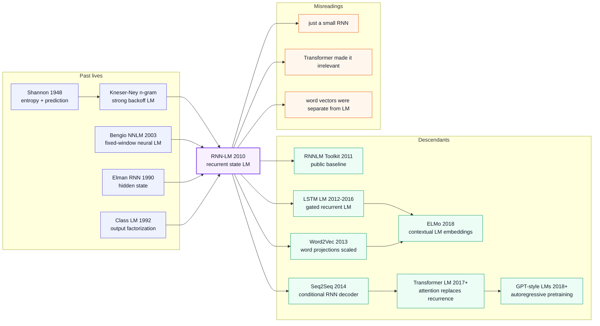

# RNN-LM - 把语言模型从固定窗口带进连续隐状态

> **2010 年 9 月，Tomas Mikolov、Martin Karafiat、Lukas Burget、Jan Cernocky、Sanjeev Khudanpur 五位作者在 [Interspeech 2010](https://www.isca-archive.org/interspeech_2010/mikolov10_interspeech.html) 发表 4 页论文 _Recurrent neural network based language model_。** 它看起来只是把语言模型从 n-gram 换成一个小 RNN，却在官方摘要里给出三个足够刺眼的数字：RNN-LM 混合模型相对强 backoff LM 约 **50% perplexity reduction**，WSJ 任务约 **18% WER reduction**，更难的 NIST RT05 仍有约 **5% WER reduction**。这篇论文的真正历史位置不只是“RNN 能做 LM”，而是把语言建模从固定窗口统计表推向连续隐状态，随后一路长成 RNNLM toolkit、Word2Vec、Seq2Seq、LSTM LM、ELMo，以及最后被 Transformer 接管的自回归大语言模型。

## 一句话总结

Mikolov、Karafiat、Burget、Cernocky、Khudanpur 五位作者 2010 年发表在 Interspeech 的这篇论文，把经典语言模型的条件概率从固定阶数的 $p(w_t \mid w_{t-n+1:t-1})$ 改写为递归隐状态上的 $p(w_t \mid h_t),\ h_t=f(W_{xh}x_t+W_{hh}h_{t-1})$，用 BPTT / 截断 BPTT 训练、用 class-based output 近似大词表 softmax、再和 n-gram backoff 模型插值进 ASR rescoring pipeline。官方摘要给出的信号很直接：RNN-LM 混合模型相对强 backoff LM 约 50% 降低困惑度，同数据 WSJ 约 18% 降低 WER，NIST RT05 仍有约 5% WER 下降。它替代的不是一个弱 baseline，而是 Chen-Goodman / Kneser-Ney 时代已打磨十多年的 n-gram 体系；它的后续链条则非常清楚：内部 word projection 催生 [Word2Vec（2013）](../era2_deep_renaissance/2013_word2vec.md)，目标侧 RNN-LM 变成 [Seq2Seq（2014）](../era2_deep_renaissance/2014_seq2seq.md) decoder，门控版本连接 [LSTM（1997）](1997_lstm.md) 与 ELMo，最后被 [Transformer（2017）](../era3_attention/2017_transformer.md) 用 self-attention 替换掉递归算子。反直觉点在于：这篇论文最持久的遗产不是 vanilla RNN 本身，而是“下一个词预测 + 可学习连续状态 + 可复用词表示”这套范式。

---

## 历史背景

### 2010 年语言模型界卡在什么地方

要理解 RNN-LM 为什么在 2010 年显得刺眼，必须回到语音识别系统里语言模型的日常状态。那时工业级 ASR pipeline 的核心已经很成熟：声学模型给出候选词序列，语言模型负责判断“这句话像不像人说的话”，最后在 lattice 或 n-best list 上重排。语言模型这一块的事实标准不是神经网络，而是经过十多年打磨的 **backoff n-gram**：用 $n-1$ 个历史词查表，命中就用高阶概率，不命中就退回低阶概率，再靠 Kneser-Ney smoothing 处理稀疏性。

这套体系强在可控、可解释、速度快。它也有一个硬边界：**上下文窗口被 $n$ 锁死**。一个 5-gram 最多看 4 个历史词；一个 7-gram 再往上就遇到状态爆炸、内存膨胀和稀疏数据。真实语言里的约束却经常跨过这个窗口：主谓一致、话题延续、句法闭合、说话人风格、领域词汇，都可能隔着几十个词。n-gram 可以用缓存模型、trigger model、class model、topic adaptation 去补，但这些补丁仍然是在离散计数表上做工程。

神经语言模型在 2003 年已经出现。Bengio 等作者的 Neural Probabilistic Language Model 用词向量和前馈网络把“相似词应该共享统计强度”写进模型，解决了 n-gram 完全离散的弱点；Schwenk、Bengio、Morin 等研究者又把 hierarchical output、continuous-space LM 和 SMT/ASR rescoring 接起来。问题是：这些模型大多仍然是**固定窗口**。它们把 4 个或 10 个历史词映射到连续空间，但没有真正摆脱“窗口长度就是记忆长度”的假设。

RNN 的想法当然更早。Elman 1990 年的 Simple Recurrent Network 已经展示过 hidden state 可以承载时间结构，[LSTM（1997）](1997_lstm.md) 也已经解决了长依赖训练的核心问题。但 2000 年代的语音识别主流并不相信一个普通 recurrent net 能在大词表 LM 上打过 n-gram。原因很实际：训练慢、softmax 贵、梯度不稳定、调参麻烦、集成进 decoder 更麻烦。Mikolov 2010 论文的历史意义就在这里：它没有先要求世界重写 ASR 系统，而是用一个可以插入现有 pipeline 的 RNN-LM，证明“连续状态语言模型”在强工程 baseline 面前也能赢。

### 直接逼出 RNN-LM 的 5 条前序

- **Shannon 1948：语言概率与熵**。现代语言模型的评价语言来自 Shannon：一个模型越能给真实序列高概率，它的交叉熵越低，perplexity 越低。RNN-LM 仍然在这个框架里工作，只是把概率估计器从计数表换成了神经网络。
- **Kneser-Ney / Chen-Goodman 1995-1999：n-gram 巅峰 baseline**。RNN-LM 不是打败“朴素 n-gram”，而是打败经过 smoothing、backoff、pruning、interpolation 打磨后的强 backoff LM。没有这个强 baseline，论文的 50% perplexity reduction 就没有历史重量。
- **Brown class-based LM 1992：大词表输出的第一种经济学**。类语言模型把词先分到 class，再预测 class 与词。Mikolov 后来的 class-based output 继承了这条思路，让 RNN 可以避开完整 $V$ 维 softmax 的成本。
- **Bengio NNLM 2003：词向量 + 神经条件概率**。NNLM 证明词 embedding 可以通过语言建模目标学出来，但它的上下文仍是固定窗口。RNN-LM 接过“词向量是模型内部变量”的想法，再把上下文变成递归状态。
- **Werbos BPTT / Elman SRN / LSTM：训练递归网络的工具箱**。BPTT 给出训练路径，Elman 给出简单 recurrent hidden state，[LSTM](1997_lstm.md) 证明门控记忆可以走得更远。2010 RNN-LM 选择了更朴素的 vanilla RNN，是因为 ASR rescoring 首先需要速度、可复现和可集成，而不是理论上最强的 cell。

### Mikolov 团队当时在做什么

论文的一作 Tomas Mikolov 当时在 Brno University of Technology（BUT）做博士，研究主题正是神经网络语言模型和语音识别。BUT 的语音组不是 Google / Microsoft 那种巨型工业团队，但有一个特别适合 RNN-LM 的生态：他们熟悉 LVCSR、lattice rescoring、n-best pipeline，也愿意把神经网络当作可以嵌入真实 ASR 系统的工程模块，而不只是小语料 benchmark 上的漂亮曲线。

作者名单也透露了论文的混合性质。Mikolov、Karafiat、Burget、Cernocky 来自 BUT 语音识别传统，Sanjeev Khudanpur 来自 Johns Hopkins 的统计语音与语言建模传统。换句话说，这不是一篇“神经网络圈自娱自乐”的论文，而是把 neural LM 放进当时最严苛的 ASR 评测文化里检验。官方摘要直接报告 WSJ 与 NIST RT05 的 WER，而不是只报困惑度，正是为了说明：**这个模型不是只会降低 perplexity 的实验室玩具，它能在识别系统里换成更少的错词**。

更重要的是，Mikolov 很快把论文变成了工具。RNNLM Toolkit 在 2010-2012 年持续发布，带有训练、评估、n-best rescoring、speech lattice 实验、生成文本样例、word projection 文件。这个开源工具包让 RNN-LM 从“论文方法”变成“别人可以拿来当 baseline 的组件”。后来的 Word2Vec 也继承了这种风格：简洁 C/C++ 实现、命令行可跑、速度优先、结果能复现。RNN-LM 是 Mikolov 工程审美的第一块公开样板。

### 工业界 / 算力 / 数据的状态

- **算力**：2010 年深度学习还没有稳定的 GPU 训练栈。RNNLM Toolkit 的目标是单机 CPU 可训练、可做 n-best rescoring；ASRU 2011 后续工作甚至强调单核在数亿词上几天内训练。这个约束直接解释了 class-based output、截断 BPTT、缓存中间状态等工程选择。
- **数据**：语言模型训练数据已经从 WSJ 级别走向 Broadcast News、NIST RT、数亿词文本，但远没有 2018 年之后的 web-scale 语料。数据量足以让 n-gram 强到难打，却还不足以让端到端神经网络吞掉整个 ASR pipeline。
- **框架**：没有 PyTorch、TensorFlow、JAX。研究者要自己写 C/C++ 训练循环、softmax、BPTT、文件格式、n-best rescoring 脚本。RNNLM Toolkit 的价值不仅是算法，也是“把这些脏活打包好”。
- **行业氛围**：SVM、CRF、HMM、GMM-HMM 和 n-gram 仍是主流。神经网络在语音声学模型上开始回潮，但语言模型里 n-gram 的速度与鲁棒性压倒一切。2010 RNN-LM 的策略很务实：不宣布 n-gram 死亡，而是先和它插值，证明 neural LM 可以提供互补概率。

## 研究背景与动机

**领域现状**：2010 年的统计语言建模已经非常成熟。强系统通常由 modified Kneser-Ney n-gram、class LM、cache / trigger feature、topic adaptation、lattice rescoring 等模块拼成。每个模块都解决一个具体痛点，但它们共同依赖离散历史和手工回退逻辑。神经 NNLM 已经证明连续词向量有价值，却仍受固定窗口和 softmax 复杂度限制。

**现有痛点**可以归结为三条。第一，n-gram 的上下文长度短，扩到高阶会遇到组合爆炸；第二，固定窗口 NNLM 虽有 embedding，却仍然无法让模型自己决定“哪段历史还重要”；第三，完整神经 softmax 在大词表 ASR 上太慢，训练和解码都难以进入生产 pipeline。

**核心矛盾**是：语言里最有价值的信号往往不在最近 4 个词里，但当时最可靠、最快的模型恰恰只能可靠地使用最近几个词。研究者可以堆更多 n-gram、更多 smoothing、更多插值权重，却没有一个统一机制把“所有过去词”压成可学习状态。RNN-LM 的切入点就是这个矛盾：让 hidden state 作为一个连续、可训练、随时间更新的上下文摘要。

**本文目标**不是造一个漂亮的 toy RNN，而是证明 recurrent neural LM 能在真实语音识别任务里打赢强 backoff LM，并且可以通过 class-based output、BPTT 训练、n-best/lattice rescoring 被工程系统使用。它要回答四个问题：RNN hidden state 能否比固定窗口更好地预测下一个词？BPTT 能否在大词表 LM 上稳定训练？class output 能否把速度压到可用范围？RNN-LM 与 n-gram 插值后能否真的降低 WER？

**核心 idea**因此非常直接：把语言模型写成一个递归动态系统，输入当前词，更新 hidden state，用 hidden state 预测下一个词；训练时用 BPTT，把输出层用 word class 分解加速；部署时不强行替代 n-gram，而是作为强互补模型参与 rescoring。这个朴素配方后来变成现代 NLP 的底层常识：语言模型不只是 ASR 的一个组件，而是可以从原始文本中学习通用表示的自监督系统。

---

## 方法详解

RNN-LM 的方法创新不是一个复杂 cell，而是一组非常工程化的组合：用 recurrent hidden state 替代固定窗口，用 BPTT 训练序列概率，用 class-based output 降低大词表输出成本，再把模型插值进现有 ASR rescoring 系统。它的写法很朴素，历史影响却很长：现代 autoregressive LM 的“输入 token、更新状态、预测下一个 token”在这里已经有了清晰雏形。

### 整体框架

RNN-LM 每一步读取当前词 $w_t$ 的 one-hot 或 embedding 表示，更新 hidden state，再用 hidden state 预测下一个词。与 NNLM 的最大差别是：NNLM 的输入是固定长度历史窗口，RNN-LM 的输入是当前词和上一时刻 hidden state。这个 hidden state 既是压缩上下文，也是可学习的连续记忆。

| 模块 | 1990s/2000s baseline | RNN-LM 的选择 | 为什么重要 |
|------|----------------------|---------------|------------|
| 上下文 | 固定 $n-1$ 个历史词 | 递归 hidden state | 理论上可吸收任意长历史 |
| 参数共享 | 每个 n-gram 组合独立计数 | 同一组权重跨时间复用 | 相似上下文共享统计强度 |
| 输出 | 完整词表查表 / backoff | 神经 softmax + class 分解 | 保留连续泛化，同时控制成本 |
| 部署 | decoder 内 n-gram 实时打分 | n-best/lattice rescoring + interpolation | 不推翻旧系统，先作为强补充接入 |

RNN-LM 的一次前向传播可以读成四步：词输入被投到输入层；hidden state 混合当前词和上一步状态；输出层给出词或词类概率；ASR 系统把这个概率与原 n-gram 分数线性插值。它不是端到端语音识别系统，而是一个**语言模型模块**，这也是它能在 2010 年被认真评估的原因。

### 关键设计 1：隐状态递归 —— 把上下文从固定窗口改成状态

**功能**：把历史词序列压进一个连续向量，让模型预测 $w_{t+1}$ 时不再只看最近 $n-1$ 个词，而是看一个由所有过去输入递归更新得到的 state。

RNN-LM 的核心更新可以写成：

$$
h_t = \sigma(W_{xh} x_t + W_{hh} h_{t-1} + b_h), \qquad
p(w_{t+1}\mid h_t) = \operatorname{softmax}(W_{hy} h_t + b_y)
$$

这里 $x_t$ 是当前词的 one-hot 或 projection，$h_t$ 是 hidden state，$W_{hh}$ 是把历史带到下一步的递归矩阵。n-gram 和 RNN-LM 的区别可以写成一行：

$$
\text{n-gram: } p(w_t\mid w_{t-n+1},\ldots,w_{t-1}) \quad\Longrightarrow\quad
\text{RNN-LM: } p(w_t\mid h_{t-1}),\ h_{t-1}=F(w_1,\ldots,w_{t-1})
$$

这个改写很小，却改变了语言模型的统计几何。n-gram 的每个上下文是离散 key；“the cat sat” 和 “a dog sat” 即使语义相近，也要靠 smoothing 间接共享。RNN-LM 的 hidden state 是连续向量，相似上下文可以落在邻近区域，模型能自然泛化。

**设计动机**：语言中的 long-span 约束并不总是可被一个固定阶数覆盖。一个 speaker 一旦进入某个主题，几十个词后的词汇分布都会变化；一个句法结构打开后，后续闭合也会受影响。RNN hidden state 允许模型把这些信号压成分布式特征，而不是等待一个离散 n-gram 恰好出现过。

### 关键设计 2：BPTT / 截断 BPTT —— 让序列模型真正可训练

**功能**：把 next-word loss 沿时间回传，让 $W_{xh}$、$W_{hh}$、$W_{hy}$ 都能从完整序列预测误差中学习。RNN-LM 的训练不是给每个上下文单独估计概率，而是让同一组权重在所有时间步共享。

训练目标是标准负对数似然，BPTT 把递归图在时间上展开：

$$
\mathcal{L} = -\sum_{t=1}^{T} \log p(w_{t+1}\mid h_t), \qquad
\frac{\partial \mathcal{L}}{\partial W_{hh}} = \sum_{t=1}^{T}\sum_{k\le t}
\frac{\partial \mathcal{L}_t}{\partial h_t}\frac{\partial h_t}{\partial h_k}\frac{\partial h_k}{\partial W_{hh}}
$$

完整 BPTT 很贵，也容易在长序列上遇到梯度消失 / 爆炸。RNNLM 系列的工程选择是截断：只往回看有限步数，让模型捕捉可训练范围内的长于 n-gram 的依赖，同时保持 CPU 训练可用。

下面是一个极简 1990s-style RNN-LM 的训练片段，重点是“跨时间复用同一组参数 + 截断回传”：

```python
import numpy as np

def rnnlm_forward(token_ids, embedding_table, recurrent_weight, output_weight, truncation_steps=5):
    """Tiny educational RNN-LM forward pass with truncated state cache."""
    hidden_size = recurrent_weight.shape[0]
    hidden_state = np.zeros(hidden_size)
    cached_states = []
    logits_by_step = []

    for token_id in token_ids:
        token_vector = embedding_table[token_id]
        hidden_state = np.tanh(token_vector + recurrent_weight @ hidden_state)
        cached_states.append(hidden_state.copy())
        cached_states = cached_states[-truncation_steps:]
        logits_by_step.append(output_weight @ hidden_state)

    return logits_by_step, cached_states
```

这段代码省略了反向传播，但保留了 RNN-LM 的关键工程感：训练时不为每个上下文建表，而是在时间上滚动同一个状态；截断窗口不是语言模型的“记忆上限”，而是梯度计算的近似边界。hidden state 仍然可以携带更早的信息，只是早期信息的 credit assignment 变弱。

### 关键设计 3：类分解输出 —— 从 $V$ 次 softmax 降到两级预测

**功能**：解决大词表 softmax 的速度瓶颈。ASR 语言模型词表可以有数万到数十万词，完整 softmax 每一步都要算所有词得分；RNN 训练慢的最大工程痛点之一就在这里。

RNN-LM 的 class-based output 把词概率分解为“先预测词类，再预测类内词”：

$$
p(w_t\mid h_t) = p(c(w_t)\mid h_t)\,p(w_t\mid c(w_t), h_t)
$$

如果词表大小是 $V$，类别数是 $C$，平均类大小是 $V/C$，每步输出成本大致从 $O(VH)$ 降到 $O(CH + (V/C)H)$。当 $C \approx \sqrt{V}$ 时，两级输出会比完整 softmax 便宜很多。这个设计不如后来的 sampled softmax / NCE / negative sampling 优雅，却符合 2010 年 ASR rescoring 的工程约束：类别可预先根据频率或聚类构造，训练和推理都容易实现。

| 输出方案 | 每步复杂度 | 概率是否归一化 | 适合 2010 ASR 吗 | 主要代价 |
|----------|------------|----------------|------------------|----------|
| 完整 softmax | $O(VH)$ | 是 | 慢 | 大词表训练与 rescoring 成本高 |
| class output | $O(CH + VH/C)$ | 是 | 是 | 类划分质量影响速度和准确率 |
| hierarchical softmax | $O(H\log V)$ | 是 | 部分适合 | 树结构难以调好 |
| negative sampling / NCE | 近似 $O(kH)$ | 训练近似 | 2013 后更流行 | 不直接给完整归一概率 |

**设计动机**：RNN-LM 要进入 ASR，不仅要 perplexity 低，还要能跑。class output 是一种折中：它没有牺牲“这是一个正规概率模型”，也没有要求 decoder 重写。后来的 Word2Vec 选择 negative sampling，是因为它不再需要输出完整概率；RNN-LM 仍然要给句子打分，所以保留归一化概率很重要。

### 关键设计 4：RNN 与 n-gram 插值 —— 把连续状态接进 ASR 管线

**功能**：让 RNN-LM 在不推翻原系统的情况下贡献概率。最稳妥的方式是把 RNN 概率和 backoff n-gram 概率插值：

$$
\log p_{\text{mix}}(w_t\mid \text{history}) =
\lambda \log p_{\text{RNN}}(w_t\mid h_{t-1}) + (1-\lambda)\log p_{\text{ngram}}(w_t\mid w_{t-n+1:t-1})
$$

这个公式解释了为什么 RNN-LM 在 2010 年能被 ASR 社区接受。它不是说“n-gram 一无是处”，而是说：n-gram 擅长高频局部搭配、RNN 擅长连续状态泛化，两者误差不完全重合。插值后，ASR 识别器得到的是一个更稳的概率估计。

**设计动机**：语音识别的错误很贵。一个全新 LM 如果要直接替换 decoder 内部模型，速度、内存、概率校准、OOV 处理都会成为阻力。n-best / lattice rescoring 让 RNN-LM 先在后处理阶段发挥作用：原系统产生候选，RNN-LM 重新排序候选。这个部署路径很保守，也很聪明。

### 训练策略与工程取舍

RNN-LM 最重要的工程取舍是承认自己在 2010 年不可能“全场景实时替代 n-gram”。它先把目标限制在 rescoring，再通过 class output、截断 BPTT、模型 mixture、n-gram interpolation 来换取实际 WER。perplexity 仍然是核心指标：

$$
\operatorname{PPL} = \exp\left(-\frac{1}{T}\sum_{t=1}^{T}\log p(w_t\mid \text{history})\right)
$$

| 工程问题 | 直接做法 | RNN-LM 取舍 | 后来的继承者 |
|----------|----------|-------------|--------------|
| 长上下文 | 提高 n-gram 阶数 | hidden state 递归压缩 | LSTM LM、Transformer cache |
| 大词表 | 完整 softmax | class-based output | hierarchical softmax、NCE、sampled softmax |
| 训练成本 | 完整 BPTT | 截断 BPTT + CPU 优化 | TBPTT、sequence batching |
| 系统接入 | 替换 decoder LM | n-best/lattice rescoring | neural reranking、shallow fusion |

如果只看模型结构，2010 RNN-LM 比 1997 LSTM 更简单；如果看工程位置，它反而更接近今天的 LLM：同一个自监督目标、一个可滚动的状态、一个大词表输出层、一个把语言概率转化为下游系统收益的 pipeline。Transformer 后来替换了递归状态，却保留了这个训练目标和工程直觉。

---

## 失败案例

RNN-LM 的戏剧性不在于它打败了某个稚嫩 baseline，而在于它挑战的是统计 NLP 最成熟的一块工程地基：smoothed backoff n-gram。2010 年的 n-gram 已经不是教科书里的 count table，而是一整套 pruning、discounting、interpolation、classing、rescoring 经验。RNN-LM 能赢，说明离散固定窗口确实碰到了结构性上限。

### 当时输给 RNN-LM 的对手

| Baseline | 代表能力 | 失败点 | RNN-LM 如何绕开 | 历史教训 |
|----------|----------|--------|----------------|----------|
| Kneser-Ney backoff n-gram | 强局部搭配、速度快 | 固定窗口、稀疏历史 | hidden state 连续压缩历史 | 统计表再强也难表达软状态 |
| 固定窗口 NNLM | 词向量泛化 | 上下文长度仍固定 | recurrent state 跨时间滚动 | 连续表示必须配连续记忆 |
| class / cache / trigger LM | 专项补丁有效 | 每个模块只补一类现象 | 一个 state 同时吸收多类信号 | 手工 feature 不是统一记忆机制 |
| 完整 softmax RNN | 概念上干净 | 大词表训练太慢 | class-based output | 神经 LM 要先算得动才会被采用 |
| 只看 perplexity 的实验模型 | 曲线好看 | 不一定改善识别 | n-best/lattice WER 评估 | ASR 只相信少错词 |

### 失败案例 1：Kneser-Ney n-gram 的固定窗口

Kneser-Ney smoothing 很强，尤其擅长处理“某个词作为新上下文出现的可能性”。它把 n-gram 的长尾问题解决到了一个很高的工程水平。但它仍然只能在离散窗口里工作：如果有价值的信息在 20 个词之前，它要么已经被截断，要么只能通过 cache / topic 模型间接进入。

RNN-LM 的胜利不意味着 n-gram 概率错了，而是说明**n-gram 缺了一条可学习的连续状态路径**。官方摘要里“RNN-LM mixture 相对 state-of-the-art backoff LM 约 50% perplexity reduction”的说法，正是这个结构性差异的证据：当多个 RNN-LM 混合后，模型能抓到许多 backoff 表格抓不到的分布信息。

### 失败案例 2：前馈 NNLM 的上下文上限

Bengio NNLM 已经把词从离散 id 推进到连续向量，但它仍然要求研究者预先选定窗口长度。窗口小，模型看不到长依赖；窗口大，参数和训练成本上升，且位置固定。它更像“连续版 n-gram”，不是完整的序列模型。

RNN-LM 把这件事反过来：每一步只输入当前词，历史由 hidden state 承担。这样一来，模型不再需要显式列出所有历史位置。这个设计也解释了为什么 RNN-LM 的 word projection 会成为 Word2Vec 的前奏：当模型被迫用 hidden state 预测下一个词时，词向量会自然学到“哪些词出现在相似上下文中”。

### 失败案例 3：纯 RNN / 简单实现的速度瓶颈

如果只写一个完整 softmax 的 vanilla RNN，再把它丢到 2010 年的大词表 ASR 上，结果大概率不是 SOTA，而是跑不动。RNN-LM 的失败 baseline 也包括这种“概念正确但工程错误”的神经模型。完整 $V$ 维 softmax 每一步都扫全词表；长序列完整 BPTT 又会让内存和时间爆炸。

Mikolov 系列工作最务实的地方在于，它没有把速度问题留给读者。class-based output、截断训练、n-best rescoring、后续工具包示例，都是为了让 RNN-LM 真正进入 speech pipeline。很多经典论文的贡献是一个漂亮公式；这篇的贡献更像一套“让漂亮公式别死在工程门口”的手册。

### 真正的反 baseline 教训

这篇论文给出的反 baseline 教训是：**强工程 baseline 可以被结构更好的模型打败，但前提是新模型也必须足够工程化**。如果 RNN-LM 只报 perplexity，不报 WER，它不会改变 ASR 社区的行为；如果只报小语料，不做强 backoff 对照，它不会让统计 LM 研究者信服；如果没有 class output 和 toolkit，它不会成为后继工作的基础设施。

RNN-LM 的“失败案例”因此有两层。第一层是 n-gram、fixed NNLM、cache model 在长上下文上的失败；第二层是神经网络研究者常见的失败：低估系统接入成本。Mikolov 2010 同时越过了这两层。

## 实验关键数据

### 主实验：困惑度与 WER

论文官方摘要给出的 headline results 足够说明历史意义。这里保留“相对改善”而不是伪造未在摘要中逐项列出的绝对数字；对 ASR 读者来说，WER 相对下降本身就是最硬的系统级证据。

| 实验设置 | 对照模型 | RNN-LM 设置 | 论文报告结果 | 说明 |
|----------|----------|-------------|--------------|------|
| Perplexity | state-of-the-art backoff LM | mixture of several RNN LMs | 约 50% PPL reduction | 连续状态模型抓到 backoff 表格外的信息 |
| WSJ ASR | 同数据量训练的 backoff LM | RNN-LM rescoring / interpolation | 约 18% WER reduction | 在经典受控任务上直接减少错词 |
| NIST RT05 | backoff LM 使用更多数据 | RNN-LM 使用更少数据仍参与 rescoring | 约 5% WER reduction | 更难任务上仍有互补收益 |
| 后续 BPTT + class work | 早期 RNN-LM | Extensions / Strategies 系列 | 更好结果 + 更快训练 | 把短论文变成可扩展路线 |
| RNNLM Toolkit | 论文复现成本高 | public C/C++ toolkit | 可训练、评估、n-best rescoring | 让方法变成社区 baseline |

### 消融：单模型、混合模型与插值

RNN-LM 的实验逻辑有三个层次。第一，单个 RNN-LM 已经能显著降低 perplexity，说明 recurrent state 本身有价值。第二，多个 RNN-LM mixture 进一步降低 perplexity，说明模型之间有可利用的多样性。第三，与 n-gram 插值后 WER 下降，说明 RNN-LM 不是简单复制 n-gram 概率，而是提供互补信号。

最关键的消融不是“hidden size 从 80 到 640 提升多少”，而是“RNN 概率离开论文表格后还能不能换成识别系统收益”。WSJ 与 NIST RT05 给出的答案是肯定的。后续 ASRU / ICASSP 工作继续补齐训练策略、class speedup、lattice approximation，说明 RNN-LM 的瓶颈从“有效吗”转向“怎么更快、更大、更容易部署”。

### 关键发现

第一，perplexity 和 WER 在这篇论文里形成了合理闭环：困惑度大幅下降不是孤立指标，而能转化为识别错误下降。第二，RNN-LM 与 n-gram 是互补关系而非单纯替代关系；这直接影响了后来的 neural reranking 和 shallow fusion。第三，word projection 不是额外目标，却从 LM 训练中自然浮现，成为 Word2Vec 前夜最重要的观察之一。

第四，RNN-LM 暴露了一个后来持续十年的主线：**语言模型质量提升经常受输出层成本限制**。从 class output 到 hierarchical softmax、NCE、negative sampling、adaptive softmax、sampled softmax，再到现代 LLM 的 vocabulary parallelism，这条工程线索一直没有消失。

---

## 思想史脉络



| 线索 | RNN-LM 之前 | RNN-LM 做的变形 | 直接后继 | 长期影响 |
|------|-------------|------------------|----------|----------|
| 语言概率 | n-gram 计数表 | hidden state 条件概率 | RNNLM Toolkit | LM 成为神经自监督目标 |
| 词表示 | NNLM embedding | word projection 从 LM 训练中浮现 | Word2Vec | 词向量成为 NLP 基础设施 |
| 序列生成 | HMM / phrase SMT / n-gram | recurrent next-word generator | Seq2Seq decoder | 条件生成统一文本任务 |
| 长上下文 | cache / trigger feature | 连续状态保留历史 | LSTM LM / ELMo | contextual representation |
| 架构替换 | recurrence 是核心算子 | 目标比算子更耐久 | Transformer LM | 自回归预训练保留目标、替换计算图 |

### 前世

RNN-LM 的前世不是单线继承，而是三条线汇合。第一条是 Shannon 到 n-gram 的统计语言建模线：语言可以被看成序列概率，模型好坏可以用 cross entropy / perplexity 衡量。第二条是 Bengio NNLM 的连续表示线：词不应该只是离散符号，而应该有可学习向量。第三条是 Elman / BPTT / LSTM 的递归网络线：状态可以随时间更新，训练可以沿时间展开。

Mikolov 2010 的动作是把这三条线接到 ASR 工程系统里。它没有像 LSTM 那样发明新的记忆 cell，也没有像 Bengio 2003 那样首次提出词向量；它的关键是“把 recurrent state language model 做成可以和强 n-gram 对打的系统”。这让它成为桥梁论文：左边连着统计 LM，右边连着神经序列建模。

### 今生

RNN-LM 的直接后继首先是 RNNLM Toolkit 和 2011-2012 年的一串扩展：BPTT 更好、class 更快、lattice / n-best rescoring 更实用。这条线把 RNN-LM 做成 ASR 社区可复现的强 baseline。

第二个后继是 Word2Vec。很多人把 Word2Vec 看成“静态词向量论文”，但它的工程前史来自 RNN-LM：Mikolov 在 RNN-LM 的 word projection 中看到了语义和句法规律，随后移除复杂 recurrent LM，只保留预测式训练和高效输出近似。换句话说，Word2Vec 是 RNN-LM 的“表示学习分支”。

第三个后继是 Seq2Seq。目标侧 decoder 本质上是一个 conditional RNN-LM：给定源句向量，每一步预测下一个目标词。Bahdanau attention、Luong attention、GNMT 都继承了这个 decoder 角色。Transformer 2017 把 RNN 算子换成 self-attention，但语言建模目标没有消失；GPT 系列更是把 next-token prediction 放大成通用预训练范式。

### 误读

第一种误读是“RNN-LM 只是一个小 vanilla RNN”。如果只看 cell，这句话没错；如果看历史作用，就漏掉了它把神经 LM 接入强 ASR pipeline 的工程突破。很多方法在 toy perplexity 上有效，少数方法能让语音系统少犯错。

第二种误读是“Transformer 取代 RNN，所以 RNN-LM 不重要了”。Transformer 取代的是 recurrence 这个计算算子，不是 RNN-LM 确立的目标逻辑：从 raw text 中用 next-token prediction 学一个能泛化的状态表示。GPT 和 RNN-LM 在优化目标上比在架构上更接近。

第三种误读是“Word2Vec 与语言模型是两条分开的路”。实际上 Word2Vec 是从 RNN-LM 的 word projection 观察里长出来的。静态词向量不是对语言模型的否定，而是从完整 LM 中抽出最可规模化、最容易复用的一层表示。

---

## 当代视角

站在 2026 年看 RNN-LM，最容易犯的错误是用 Transformer 时代的眼光嫌它“小、慢、记忆短”。这当然都是真的，但不够公平。RNN-LM 的历史问题不是“它是不是今天最强语言模型”，而是“它在统计 n-gram 和现代神经 LM 之间接上了哪根桥”。答案是：next-word prediction 不再只是 count table 的估计问题，而可以训练一个连续状态机器。

### 站不住的假设：RNN 会一直是语言模型骨架

2010 年合理的判断是：如果语言有时间顺序，那 recurrent state 就应该是自然骨架。这个假设在 2017 年后站不住了。Transformer 的 self-attention 证明，序列建模不一定要逐步递归；并行训练、长距离直接连接、硬件友好的矩阵乘法，比 RNN 的一步步状态更新更适合大规模预训练。

另一个站不住的假设是“长上下文可以靠一个 fixed-size hidden state 压完”。Seq2Seq 的 fixed-vector bottleneck、LSTM LM 的遗忘问题、长文档建模的困难都说明，单个状态向量太窄。attention 的成功不是因为它“更像人脑记忆”，而是因为它让模型在每一层都能直接访问 token-level 历史，而不是把全部过去压成一个向量。

| 2010 年假设 | 当时为什么合理 | 2026 年怎么看 | 替代方案 |
|-------------|----------------|---------------|----------|
| 递归是序列建模自然骨架 | 语言按时间生成，RNN 结构贴合 | 训练并行性太差 | Transformer / state space model |
| 单个 hidden state 足够压缩历史 | ASR rescoring 句子较短 | 长上下文信息瓶颈明显 | attention KV cache / memory tokens |
| class output 是大词表主方案 | CPU 训练 + 归一概率需求 | 现代训练有更丰富近似 | sampled/adaptive softmax、并行 vocab head |
| ASR 先 rescoring 再替换 | 旧系统稳定、风险低 | 端到端系统更普遍 | shallow fusion、RNN-T、AED、LLM rescoring |

### 如果今天重写：保留目标，替换算子

如果今天重写 RNN-LM，最可能保留的是 objective 和 evaluation discipline，而不是 vanilla RNN cell。模型会用 Transformer decoder 或现代 state space 模型替代 $W_{hh}$ recurrence；训练会用大规模 subword tokenizer、AdamW、mixed precision、sequence packing；输出层会用并行 vocabulary head、adaptive softmax 或 sampled loss；部署则会从 n-best rescoring 扩展到 shallow fusion、deliberation、LLM-based correction。

但重写版仍然应该保留 2010 论文的几条好习惯。第一，必须和强 baseline 比，而不是只报漂亮曲线。第二，必须把 perplexity 连接到任务收益，如 WER、BLEU、exact match 或 human preference。第三，必须给可运行工具或至少清晰 recipe；语言模型是基础设施，不能只停留在图表里。

### 被时间验证正确的部分

RNN-LM 最正确的部分是把语言模型看成 representation learner。Word projections 后来成为 Word2Vec，contextual hidden states 后来成为 ELMo，decoder LM 后来成为 GPT。虽然架构换了，核心信念没有换：预测下一个词会迫使模型学习词义、句法、主题、风格和世界知识的压缩表示。

第二个被验证的部分是“神经 LM 与传统系统可以互补”。今天的 ASR、MT、搜索、推荐、代码补全仍然大量使用 reranking、fusion、distillation、post-editing。端到端不等于所有旧模块瞬间消失；很多时候，新模型先作为第二阶段纠错器进入系统，这正是 RNN-LM 的部署路径。

## 局限与展望

### 论文承认的局限

论文和 toolkit 页面都承认 RNN-LM 的主要代价是训练复杂度。官方摘要最后一句写得很直接：connectionist language models 优于标准 n-gram，除了高计算复杂度。这个 caveat 很重要，因为 2010 年的 RNN-LM 不是“免费更强”，而是用更多训练和 rescoring 成本换取更好概率。

第二个局限是模型仍然依赖 n-gram pipeline。RNN-LM 在 ASR 中主要作为 rescoring / interpolation 模块存在，而不是 decoder 内实时主模型。它证明了 neural LM 有价值，但还没有让整个语音识别系统端到端神经化。

### 站在 2026 年看到的局限

从今天看，vanilla RNN-LM 有三个明显短板。第一，长期依赖能力有限，梯度和状态瓶颈都比 LSTM / Transformer 更严重。第二，顺序计算限制并行训练，扩到 web-scale 时吞吐远不如 Transformer。第三，word-level vocabulary 与 class output 不适合现代多语言、代码、稀有词和开放域生成；subword tokenization 与大规模 tokenizer 已经成为更稳的选择。

还有一个更深的局限：RNN-LM 仍然把语言模型放在“给 ASR 候选句子打分”的框架里。它还没有 GPT 式的任务统一视角，没有 prompt，没有 instruction following，也没有把 LM 本身看成通用接口。但这不是论文失败，而是时代边界；2010 年最合理的问题就是让 neural LM 先在一个硬任务里赢。

### 已被后续工作证实的改进方向

三条改进方向已经被验证。第一，用门控替代 vanilla recurrence：LSTM / GRU LM 在 2012-2016 年成为主流，解决更长依赖和稳定训练。第二，用更好的输出近似与训练技巧：NCE、negative sampling、adaptive softmax、dropout、layer norm、sequence batching，把 neural LM 从 ASR 组件推向大规模预训练。第三，用 attention 替代 recurrence：Transformer LM 继承 next-token objective，放弃逐步 hidden-state bottleneck，成为 GPT 系列的基础。

## 相关工作与启发

RNN-LM 与 Bengio NNLM 的关系是“固定窗口到递归状态”；与 [LSTM（1997）](1997_lstm.md) 的关系是“记忆结构到语言模型任务”；与 [Word2Vec（2013）](../era2_deep_renaissance/2013_word2vec.md) 的关系是“完整 LM 到可复用词向量”；与 [Seq2Seq（2014）](../era2_deep_renaissance/2014_seq2seq.md) 的关系是“无条件 LM 到条件 decoder”；与 [Transformer（2017）](../era3_attention/2017_transformer.md) 的关系是“保留自回归目标、替换递归算子”。

| 对比对象 | RNN-LM 继承了什么 | RNN-LM 改了什么 | 后续启发 | 今天的对应物 |
|----------|------------------|------------------|----------|--------------|
| Bengio NNLM | 词向量 + 神经概率 | 固定窗口变 hidden state | recurrent LM | decoder LM |
| LSTM | 递归序列建模问题意识 | 用 vanilla RNN 先工程落地 | LSTM LM | gated / SSM sequence models |
| Word2Vec | 语言模型中的 projection | 抽出表示学习目标 | static embedding | embedding pretraining |
| Seq2Seq | next-word generator | 条件化在源序列表示上 | neural translation | encoder-decoder / text-to-text |

一个对今天仍然有用的启发是：不要把“模型是否先进”和“系统是否可用”混为一谈。RNN-LM 的架构今天过时了，但它的评估纪律没有过时：和强 baseline 比，给系统指标，发布可跑工具，把模型接进真实 pipeline。

## 相关资源

| 资源 | 链接 | 内容 | 推荐用途 |
|------|------|------|----------|
| 原论文 ISCA 页面 | https://www.isca-archive.org/interspeech_2010/mikolov10_interspeech.html | 摘要、作者、PDF 链接、headline PPL/WER 结果 | 引用与快速核对 |
| RNNLM Toolkit | https://www.fit.vut.cz/~imikolov/rnnlm/ | 2010-2012 工具包、示例、参考论文、word projections | 理解工程实现 |
| Mikolov PhD thesis | https://www.fit.vutbr.cz/~imikolov/rnnlm/thesis.pdf | 神经语言模型细节、更多实验、训练策略 | 深入技术背景 |
| Extensions / Strategies papers | toolkit references | BPTT、classes、大规模训练、ASR rescoring | 补齐 4 页论文省略的工程细节 |


---

> 🌐 [English version](/en/era1_foundations/2010_rnnlm/) · 📚 awesome-papers project · CC-BY-NC