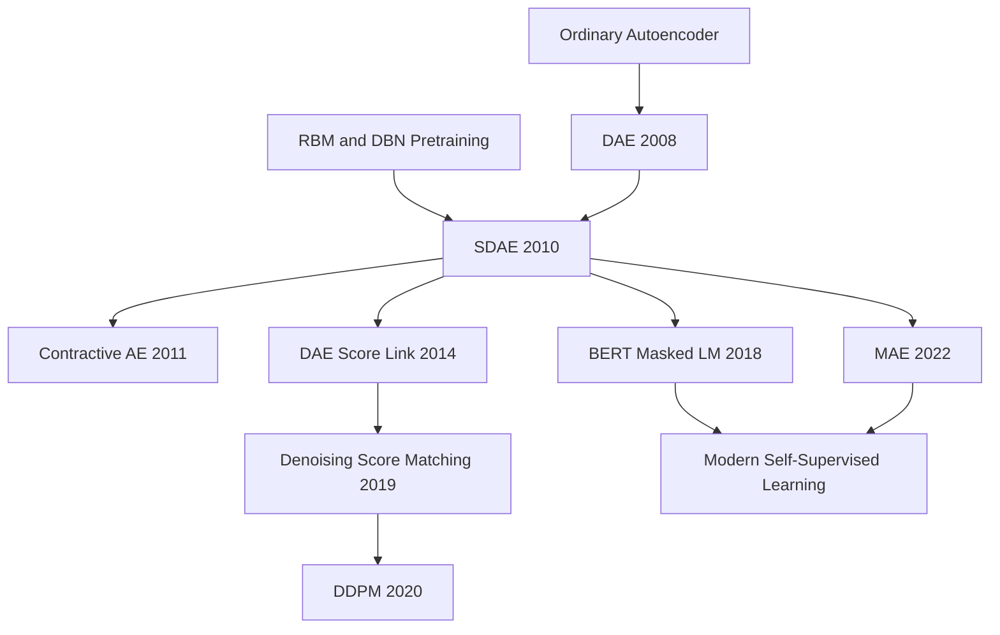

# Stacked Denoising Autoencoders — 用局部去噪准则把自编码器变成深度预训练工具

> **2010 年 12 月，Pascal Vincent、Hugo Larochelle、Isabelle Lajoie、Yoshua Bengio、Pierre-Antoine Manzagol 5 位作者在 *JMLR* 11(110) 发表 [Stacked Denoising Autoencoders](https://www.jmlr.org/papers/v11/vincent10a.html)。** 这篇论文没有发明“预训练”，也没有发明“自编码器”；它真正做成的是把一个朴素到近乎反直觉的训练游戏变成深度表示学习的可执行原则：先把输入弄坏，再要求网络把它修好。2010 年的读者看到的是 SDAE 在 10 个分类 benchmark 上追平或超过 DBN；2026 年的读者再回头，会发现 BERT 的 masked token、MAE 的 masked patch、score-based diffusion 的 denoising score，全都在不同尺度上重复同一句话：**好表示不是会复制输入，而是知道数据从局部扰动中该往哪里回去。**

## 一句话总结

Vincent、Larochelle、Lajoie、Bengio、Manzagol 5 位作者 2010 年发表在 *JMLR* 的这篇 38 页长文，把 2006 年 [DBN](2006_dbn.md) 打开的“逐层无监督预训练”路线从 RBM 的概率图模型包袱里解放出来：每层先采样腐蚀样本 $x_tilde ~ q_D(x_tilde|x)$，再训练自编码器最小化 $L(x, g_theta(f_theta(x_tilde)))$，也就是**重建干净输入，而不是复制被污染的输入**。这个局部去噪准则让普通 autoencoder 最容易走的捷径“恒等复制”失效，迫使隐藏层捕捉输入分布的稳定结构；堆叠之后，SDAE-3 在 JMLR 表 3 的 10 个任务里系统性击败普通 SAE-3，并在 MNIST-basic、rot、bg-img-rot、rect、rect-img 等任务上追平或超过 DBN-3 / SVM-RBF。

这篇论文的真正历史位置不是“又一个 autoencoder 变体”，而是把 self-supervised learning 的一个核心模板提前写清楚：**制造一个局部破坏，再用预测/重建迫使模型学习数据流形**。后来的 masked language model、masked image modeling、[MAE（2022）](../era4_foundation_models/2022_mae.md)、score matching 与 diffusion 都把同一个思想放大到更大模型、更大数据和更强生成目标上。反直觉点在于：SDAE 的“噪声”不是 regularization 的外衣，而是训练信号本身；噪声越会把样本推离流形，去噪目标越能告诉网络“真实数据该往哪里回去”。

---

## 历史背景

### 2010 年前深度学习卡在哪里

2010 年的深度学习还不是“默认答案”，更像一条刚从学术边缘爬回来的路线。2006 年 Hinton、Osindero、Teh 用 Deep Belief Network 证明：如果先逐层训练 RBM，再用 supervised objective 微调，多层神经网络可以在 MNIST 上重新接近甚至超过 SVM。这个结果给“deep learning”续了命，但也留下一个非常别扭的问题：**难道深度网络想学好表示，必须先背上 RBM、contrastive divergence、Gibbs sampling、partition function 这些概率模型包袱吗？**

当时的主流机器学习仍然偏爱浅层、凸优化、手工特征或 kernel。SVM-RBF 在很多小数据 benchmark 上表现稳定；PCA、ICA、sparse coding 是无监督表示学习的常规入口；CNN 只在 LeNet 式 OCR 场景里有明确工业胜利。深 sigmoid MLP 从随机初始化直接训练通常会卡住，优化上容易落进差的 basin，泛化上又被小数据限制。于是 2006-2010 年的核心命题不是“能不能端到端训练一个巨型深网”，而是一个更朴素的问题：**有没有一个局部、可训练、工程简单的无监督目标，能把每层初始化到有用的表示区间？**

Stacked Denoising Autoencoders 正是在这个缝隙里出现的。它继承了 DBN 的贪婪逐层预训练流程，却把每层的局部目标换成“去噪重建”。这样一来，训练不再需要采样 Markov chain，不再需要估计难处理的 partition function，也不需要把隐藏单元解释成二值随机变量。它把深度学习复兴早期最重的一块概率论石头卸下来，用一个普通 backprop 就能优化的目标替代。

### 直接逼出 SDAE 的 5 条线索

第一条线索是 **backprop 与深网训练困境**。1986 年 Rumelhart、Hinton、Williams 让多层网络有了可计算梯度，但 1990 年代到 2000 年代初的深 sigmoid 网络依旧很难直接训练。Bengio 及合作者反复强调：深网从随机初始化出发时，监督误差信号既稀疏又晚到，底层很难学到对最终任务有用的特征。

第二条线索是 **DBN / RBM 预训练**。Hinton 2002 的 contrastive divergence 让 RBM 训练从理论玩具变成可运行算法；2006 年 DBN 用 RBM 堆叠证明“先无监督、后监督”确实能改善优化与泛化。但 RBM 的成功并没有回答“到底是哪一部分在起作用”：是能量模型的概率解释？是逐层初始化？是重建型目标？还是只是某种正则化？

第三条线索是 **普通 autoencoder 的尴尬**。Bengio 等 2007 年已经展示过 stacked autoencoder 接近 DBN，但 ordinary AE 的目标太容易被误解：如果表示维度足够大，最简单的解就是复制输入；即便加 bottleneck，也可能只学到 PCA 式的低维投影或局部 blob。普通 AE 保留信息，但“保留信息”并不等于“提取对分类有用的结构”。

第四条线索是 **自然图像中的局部结构**。Olshausen-Field sparse coding、Bell-Sejnowski ICA 都发现自然图像里会自然冒出 Gabor-like edge filters。Vincent 等作者想知道：一个普通可微的自编码器能不能在不显式加稀疏约束、不做概率采样的情况下，也学到类似 V1 simple cell 的局部边缘探测器？答案来自“把输入弄坏”：如果图像局部被遮蔽或加噪，模型必须借助邻域统计结构来恢复它。

第五条线索是 **半监督 / 自监督的朴素直觉**。人类并不是先拿到标签才开始学习世界。2009 年 Bengio 的 deep architectures survey 已经把“无监督表示先学输入分布，再服务下游任务”讲成一个核心方向。SDAE 论文把这个直觉落到一个明确局部准则上：学习 $P(X)$ 里最稳定的局部结构，随后再用这些结构帮助 $P(Y|X)$。

### 作者团队与 JMLR 2010 的位置

这篇论文的作者团队几乎就是 Montreal 深度学习复兴早期的缩影。Pascal Vincent 是去噪自编码器路线的核心推动者；Hugo Larochelle 同时连接 Montreal 与 Toronto，在深度架构 benchmark 和预训练经验研究上做了大量基础工作；Yoshua Bengio 则在 2006-2010 年持续把“deep architectures”从边缘议题推回机器学习中心。JMLR 这篇 38 页长文不是短会论文，而是对 2008 年 ICML DAE 工作的系统扩展：有信息论动机、几何解释、单层特征可视化、多层 benchmark、生成采样尝试和明确的 DBN / SAE 对比。

它发表的时间点也很关键。2010 年，AlexNet 还没出现，ReLU 和 Xavier init 刚开始被系统分析，GPU 训练还不是默认工具，BERT/GPT/MAE 更是未来的词汇。SDAE 所在的时代仍然相信“预训练是深网能否训练的关键”。站在这个时代看，SDAE 的贡献是把预训练从 RBM 的复杂训练中解放出来；站在 2026 年看，它更像是 masked modeling 和 diffusion 之前的一次清晰预演。

## 研究背景与动机

### 从“保持信息”到“学习可用表示”

论文开头用了一个看似温和、其实很深的问题：什么是好的表示？最原始的答案是 infomax：表示 $Y$ 应该保留输入 $X$ 的信息。但如果只追求互信息，普通 autoencoder 会自然走向复制输入。复制当然保留信息，却不一定让下游分类器更好；它可能只是把像素换个坐标系搬运了一遍。

Vincent 等作者把定义改得更操作化：好表示应该帮助后续任务更快、更好地学习。也就是说，无监督目标不能只问“你记住了多少输入”，还要问“你是否抓住了输入分布中稳定、可迁移、对预测有帮助的结构”。这一步把 autoencoder 从压缩工具转成 representation learning 工具。

### 为什么普通自编码器会学会复制

普通 autoencoder 的目标是输入 $x$、输出 $x_hat$，让 $x_hat$ 尽量接近 $x$。如果隐藏层过完备，网络可以学到近似恒等映射；如果隐藏层欠完备，它可能被迫压缩，但压缩方向未必符合语义结构。线性 AE 会退化到 PCA 子空间，非线性 AE 在约束不够时又容易学到局部无趣的 blob 或完全随机的过滤器。论文中的自然图像实验很直接：普通过完备 AE 在 12x12 patches 上没有学出清晰结构，而加足噪声的 DAE 学到了 Gabor-like oriented edges。

所以 SDAE 的动机不是“让重建更难一点”这么简单，而是**让复制失效**。当输入被随机遮蔽、加盐椒噪声或高斯噪声扰动时，模型不能逐像素照抄；它必须借助数据分布里的相关性来猜测干净输入。这样得到的隐藏表示更可能捕捉笔画、边缘、局部形状，而不是像素身份。

### 为什么局部去噪足以支撑贪婪预训练

DBN 的逐层预训练有一个重要工程优势：每次只训练一层，梯度路径短，优化问题小，训练完成后把该层输出作为下一层输入。SDAE 保留这个流程，只把局部模型换成 DAE。第 1 层学习从 corrupted pixels 回到 clean pixels；第 2 层学习从 corrupted first-layer representation 回到 clean first-layer representation；第 3 层继续如此。每层都在自己的表示空间里做“局部修复”。

这解释了题目里的 “local denoising criterion”。它不是端到端全局生成模型，也不是完整流形学习算法；它只要求每一层在邻域内知道“被扰动的样本该往哪里回”。但层层堆叠后，这个局部方向场会变成高层表示的初始化。SDAE 的历史魅力就在这里：它用一个局部得几乎简陋的目标，支撑了当时深网训练最需要的全局效果。

---

## 方法详解

### 整体框架：先污染，再还原，再堆叠

SDAE 的基本单元是 denoising autoencoder。它和普通 autoencoder 的网络形状几乎一样：一个 encoder 把输入映射到隐藏表示，一个 decoder 把隐藏表示映射回输入空间。关键差异只有一处：encoder 看到的是被污染的输入，loss 对齐的是干净输入。

$$
x_tilde ~ q_D(x_tilde | x)
$$

$$
h = f_theta(x_tilde), x_hat = g_theta_prime(h)
$$

$$
min_{theta, theta_prime} E_{x ~ q_data} E_{x_tilde ~ q_D(.|x)} [ L(x, g_theta_prime(f_theta(x_tilde))) ]
$$

这个目标把训练过程拆成三步：第一步，采样一个 corruption process，把原始样本 $x$ 变成 $x_tilde$；第二步，用 encoder 从 $x_tilde$ 计算隐藏表示 $h$；第三步，用 decoder 输出 $x_hat$，并把 $x_hat$ 与**未污染的** $x$ 比较。注意这里没有要求模型重建 $x_tilde$，因为那会奖励复制噪声；它要恢复的是干净样本。

堆叠时，流程是贪婪的。训练第 1 个 DAE 后，保留 encoder，把训练集全部映射成第 1 层表示；再在这些表示上加噪声、训练第 2 个 DAE；继续往上，最后把所有 encoder 串成深 MLP，再接一个分类器，用监督目标 fine-tune。SDAE 因此不是单纯的“降噪器”，而是一种 layer-wise representation initializer。

### 关键设计 1：局部去噪目标

普通 AE 的重建目标是 $L(x, g(f(x)))$。如果隐藏层容量足够，它可以学到一个接近 identity 的映射；如果加 bottleneck，它会学到压缩，但压缩并不保证对下游任务有用。SDAE 把目标改成 $L(x, g(f(x_tilde)))$，这一步强迫模型回答一个更有结构的问题：**看到局部损坏的样本，哪些特征足以推断原来的样本？**

这个目标看起来只是把输入换成 $x_tilde$，但优化含义完全变了。模型不能依赖每个像素自身；如果某些维度被 mask 成 0，它必须用其他维度预测它们。对 MNIST 来说，这意味着学笔画之间的共现；对自然图像 patches 来说，这意味着学局部边缘、方向和纹理的统计规律。

论文的几何解释更重要：如果真实数据集中在低维流形附近，corruption 往往把样本推离流形；成功的 denoising mapping 必须把离流形较远的点推回到高概率区域。SDAE 学到的不是一个显式流形方程，而是一个局部方向场：从 noisy neighborhood 指向 clean manifold。

### 关键设计 2：腐蚀过程就是归纳偏置

论文考虑了三类 corruption：高斯噪声、masking noise、salt-and-pepper noise。高斯噪声适合连续输入；masking noise 把随机维度置 0，后来在 BERT / MAE 里几乎变成 self-supervised learning 的标志动作；salt-and-pepper noise 则把部分维度随机置为极端值。它们的共同点是：破坏局部可见信息，但保留足够上下文，让“修复”成为可能。

腐蚀强度 $nu$ 不是小装饰。论文表 2 的搜索范围包括 0%、10%、25%、40% 的 masking corruption，以及多种高斯标准差。$nu=0$ 时，SDAE 退化为普通 SAE；$nu$ 太大时，输入损坏过度，恢复目标会变得含糊；中等噪声最有用，因为它刚好让复制失效，同时保留局部上下文。JMLR 表 3 中，SDAE-3 在 MNIST、rot、bg-img-rot、rect-img 等任务的最佳 $nu$ 多为 10%-25%，这说明“轻度到中度破坏”已经足以产生有用表示。

这也是 SDAE 与普通 regularization 的分界。Bishop 1995 证明过线性模型里 training with noise 与 Tikhonov regularization 有联系，但 Vincent 等作者在自然图像实验里指出：对于非线性 autoencoder，足够大的去噪噪声与 L2 weight decay 不等价。L2 regularized AE 没学出 Gabor-like filters；加高斯噪声的 DAE 学出来了。这说明 corruption process 不只是约束权重大小，而是在定义“哪些局部变化应该被视为可修复扰动”。

### 关键设计 3：堆叠与监督微调

SDAE 的堆叠方式与 DBN / SAE 的早期深度学习范式一致：每一层只看上一层的输出，每一层都用局部无监督目标训练。训练完第 $k$ 层后，只保留 encoder $f_k$，把数据送到下一层。最终得到的 representation 是 $h_K = f_K(...f_2(f_1(x)))$。

$$
h_1 = f_1(x), h_2 = f_2(h_1), ..., h_K = f_K(h_{K-1})
$$

随后加一个 supervised head，整体用分类 loss 微调。这个 fine-tuning 步骤很关键：SDAE 预训练并不直接声称自己已经解决分类任务，它只是把参数放到一个比随机初始化更好的 basin 里。论文后续引用 Erhan 等 2010 的解释：无监督预训练同时有 optimization effect 和 regularization effect，既帮助找到更好的局部最优，也让参数偏向捕捉 $P(X)$ 的结构。

### 关键设计 4：为什么它学到流形而不是复制

从小噪声极限看，DAE reconstruction vector 与数据密度的 score 有深刻关系。后来的 Alain & Bengio 2014 把这件事形式化：当高斯噪声很小时，重建函数 $r(x)$ 满足近似关系：

$$
r(x) - x approximately sigma^2 score(x)
$$

这里的 $score(x)$ 是 log density 的梯度方向。直观地说，DAE 学到的“怎么修复”近似告诉你“数据密度往哪里变高”。这就是它与 score matching 和 diffusion 的思想桥：SDAE 没有训练一个显式概率密度，却在局部学习了从低概率扰动点回到高概率数据区域的方向。

这也解释了为什么 denoising 比普通 AE 更像 self-supervised learning。普通 AE 的 pretext task 太容易；SDAE 的 pretext task 刚好卡在“需要理解局部结构才能完成”的难度上。它既没有像 generative model 那样要求完整建模 $p(x)$，也没有像 supervised task 那样依赖标签；它只要求模型掌握足够的局部统计规律。

### 最小 PyTorch 实现

下面的代码是 2010 年 SDAE 单层目标的现代 PyTorch 版本。它没有实现完整论文的网格搜索、early stopping 或逐层 pipeline，只保留最核心的 corruption-to-clean reconstruction。

```python
import torch
from torch import nn
import torch.nn.functional as F

class DenoisingAutoencoder(nn.Module):
    def __init__(self, input_dim: int, hidden_dim: int):
        super().__init__()
        self.encoder = nn.Sequential(nn.Linear(input_dim, hidden_dim), nn.Sigmoid())
        self.decoder = nn.Sequential(nn.Linear(hidden_dim, input_dim), nn.Sigmoid())

    def corrupt(self, x: torch.Tensor, mask_prob: float) -> torch.Tensor:
        keep = torch.rand_like(x).gt(mask_prob).float()
        return x * keep

    def forward(self, x: torch.Tensor, mask_prob: float = 0.25):
        x_tilde = self.corrupt(x, mask_prob)
        h = self.encoder(x_tilde)
        x_hat = self.decoder(h)
        return x_hat, h

model = DenoisingAutoencoder(input_dim=784, hidden_dim=1000)
optimizer = torch.optim.SGD(model.parameters(), lr=0.05)

for x, _ in train_loader:
    x = x.view(x.size(0), -1)
    x_hat, _ = model(x, mask_prob=0.25)
    loss = F.binary_cross_entropy(x_hat, x)
    optimizer.zero_grad()
    loss.backward()
    optimizer.step()
```

完整 SDAE 会在训练完这一层后冻结 encoder，用隐藏表示训练下一层 DAE；堆叠完成后，再把 encoder 串起来接分类器微调。代码里最重要的细节是 loss 的 target：`binary_cross_entropy(x_hat, x)`。如果 target 写成被 mask 的 `x_tilde`，模型就会学习复制损坏输入，去噪准则立即消失。

### 与 RBM、普通 AE、CAE 的方法对照

| 方法 | 局部目标 | 训练成本 | 学到的几何 | 2010 年角色 |
|---|---|---|---|---|
| RBM / DBN | 用 CD 近似最大化能量模型 likelihood | 需要 Gibbs 采样和负相近似 | 概率模型的隐变量结构 | 最强基线，但工程复杂 |
| 普通 AE / SAE | 从干净输入重建干净输入 | 普通 backprop，最简单 | 容易退化为复制或 PCA-like 压缩 | 证明 autoencoder 可堆叠，但效果略弱 |
| SDAE | 从 corrupted input 重建 clean input | 普通 backprop，加一个 corruption step | 学局部去噪方向场 / 数据流形 | 本文主角，接近或超过 DBN |
| Contractive AE | 惩罚 encoder Jacobian | 需要计算或近似 Jacobian penalty | 显式压低非流形方向敏感度 | 2011 后续，把鲁棒性显式化 |
| Masked AE / BERT | 遮蔽 token 或 patch，再预测缺失内容 | 需要大模型与大数据 | 离散或 patch 级去噪表示 | 2018 后 self-supervised 主流形态 |

这张表也说明了 SDAE 的中间位置。它比 RBM 简单，比普通 AE 有更强归纳偏置，比 CAE 更少显式微分计算，比 BERT/MAE 早了一个时代。它没有今天的 scale，但已经把“mask/corrupt then reconstruct/predict”这条主线说得相当清楚。

---

## 失败案例

### 当时输给 SDAE 或被它暴露短板的 baseline

SDAE 的价值不是凭空出现的。它是在 2010 年深度预训练的几个强 baseline 之间证明自己的：SVM-RBF 代表浅层 kernel 学派，DBN-3 代表 RBM 概率预训练，SAE-3 代表普通自编码器预训练，随机初始化 MLP 则代表“直接 backprop 深网”的旧路线。论文表 3 的重点不是 MNIST 单点数字，而是一个更广的判断：**把 ordinary AE 的重建目标改成 denoising 目标，通常就能获得更稳的深层表示。**

| Baseline | 当时为什么有竞争力 | SDAE 暴露的问题 | 论文里的信号 |
|---|---|---|---|
| Random MLP | 结构最简单，直接监督优化 | 深层 sigmoid 网络随机初始化容易卡住 | bg-img-rot 上无预训练的 3 层网络训练失败或明显落后 |
| SVM-RBF | 小数据 benchmark 上稳定、凸优化 | kernel 不会自动学层级表示 | SDAE-3 系统性优于 SVM-RBF，除 bg-rand 外都达成最优或统计并列 |
| DBN-3 | 2006 年最强深度预训练方案 | RBM/CD/Gibbs 采样工程复杂 | SDAE-3 多数任务与 DBN-3 持平或更好 |
| SAE-3 | 普通 AE 可用 backprop，简单 | 容易复制输入，局部结构弱 | SDAE-3 系统性优于 SAE-3，convex 除外且差异不显著 |
| L2 AE | 权重衰减是经典正则化 | 与去噪目标不等价 | 自然图像上 L2 AE 没学出 Gabor-like filters |

这里最重要的失败 baseline 是 SAE-3。它与 SDAE 使用同样的网络形状、同样的堆叠流程、同样的 supervised fine-tuning；差别几乎只剩 $nu=0$ 还是 $nu>0$。因此当 SDAE-3 在大多数任务上超过 SAE-3 时，结论非常干净：**有效的不是“autoencoder”这个名字，而是“从被破坏的输入恢复干净输入”的局部目标。**

### 论文自己承认的失败与边界

第一，SDAE 并没有在每个任务上赢 DBN。表 3 里 bg-rand 是明显例外：DBN-3 为 6.73% error，而 SDAE-3 为 10.30%。这提醒我们，denoising objective 不是普适魔法；当随机背景噪声的统计结构与目标分类关系复杂时，RBM 的概率模型或具体超参可能仍然更适配。

第二，噪声强度需要调。论文虽然强调粗粒度搜索已经足够，但 $nu$ 仍然是关键超参。$nu=0$ 退化为普通 SAE；$nu$ 太大则把输入破坏到难以恢复。SDAE 的好处来自一个中间区间：损坏足以阻止复制，又没有把语义上下文完全抹掉。

第三，论文的生成模型尝试不算成功。第 7 节试图把 stacked autoencoder 变成 generative model，但作者自己也很谨慎：SDAE 的核心价值在 representation learning 和 classification pretraining，而不是像 DBN 那样给出完整概率生成过程。后来 VAE、GAN、diffusion 才把深度生成模型真正推到主流。

第四，实验规模仍是前 AlexNet 时代的规模。10 个 benchmark 很系统，但大多是 28x28 图像变体和一个音乐 genre 数据集；没有 ImageNet、没有 web-scale text、没有大型 CNN/Transformer。SDAE 证明的是“局部去噪预训练在小到中等规模深网里有价值”，不是“去噪目标本身足以赢下一切规模”。

### 最痛的反 baseline：SDAE 后来被自己的后代替代

SDAE 在 2010 年最强的卖点是“逐层预训练让深网可训练”。但这条必要性很快被后来的工程进步削弱。2010 年 Glorot initialization 解释了深 sigmoid / tanh 的训练难点；2011 年 ReLU 让深网梯度更通畅；2012 年 AlexNet 用 ReLU、dropout、GPU 和 ImageNet 直接 supervised training 拿下视觉主流。到了 2015 年 BatchNorm、2015 年 ResNet 之后，“必须逐层无监督预训练”这个假设基本退出主舞台。

这不是 SDAE 的失败，而是它所在时代的问题被更底层的优化与数据条件改变了。SDAE 的具体 pipeline 退场了；它的目标函数精神没有退场。BERT、MAE 和 diffusion 不是逐层贪婪训练，但它们都继承了“遮蔽/腐蚀，再预测/去噪”的 pretext-task 逻辑。最痛的反 baseline 因此不是某个 2010 年模型，而是 2018 之后的自己：**SDAE 的思想活在后代里，SDAE 的训练流程被后代淘汰。**

## 实验关键数据

### 十个数据集上的主表

论文的主实验使用 3 hidden layer networks，对比 SVM-RBF、单层 DBN、普通 stacked autoencoder、3 层 DBN 和 3 层 SDAE。下面摘出表 3 的核心数字；误差率均为 test error，括号为 SDAE 的最佳 corruption level。

| 数据集 | SVM-RBF | SAE-3 | DBN-3 | SDAE-3 | 读法 |
|---|---:|---:|---:|---:|---|
| MNIST | 1.40 | 1.40 | 1.24 | 1.28 (25%) | SDAE 与 DBN 统计并列，优于 SVM/SAE |
| basic | 3.03 | 3.46 | 3.11 | 2.84 (10%) | SDAE 最好 |
| rot | 11.11 | 10.30 | 10.30 | 9.53 (25%) | SDAE 最好 |
| bg-rand | 14.58 | 11.28 | 6.73 | 10.30 (40%) | DBN 明显更好，SDAE 不是万能 |
| bg-img | 22.61 | 23.00 | 16.31 | 16.68 (25%) | SDAE 与 DBN 接近 |
| bg-img-rot | 55.18 | 51.93 | 47.39 | 43.76 (25%) | SDAE 最好，复杂变体优势最大 |
| rect | 2.15 | 2.41 | 2.60 | 1.99 (10%) | SDAE 最好 |
| rect-img | 24.04 | 24.05 | 22.50 | 21.59 (25%) | SDAE 最好 |

主表的结论很清楚：SDAE-3 不是在单个数据集上“碰巧好”，而是在多个不同扰动类型上稳定优于 SAE-3，并且经常追平或超过 DBN-3。尤其是 bg-img-rot，这个任务同时有背景图像和旋转，变因最多；SDAE 从 SVM-RBF 的 55.18% 降到 43.76%，也比 DBN-3 的 47.39% 更好。

### 深度、宽度、噪声的消融

第 6.3 节进一步说明：SDAE 的优势随着网络更深、更宽而变明显。作者在最难的 bg-img-rot 上比较无预训练 MLP、SAE 和 SDAE，从 1 层到 3 层、从 1000 到 3000 hidden units。结果呈现严格排序：**denoising pretraining > ordinary autoencoder pretraining > no pretraining**。没有预训练时，3 hidden layer network 很难成功训练；有普通 AE 预训练会改善；有 denoising 预训练进一步改善。

噪声消融也很重要。论文没有要求 $nu$ 必须调得极精确，粗粒度的 10%、25%、40% 就足够找到好点。这反而支持它作为一般方法的可用性：SDAE 不依赖一个脆弱的噪声常数，而依赖“非零、中等腐蚀”这个机制。换句话说，超参需要调，但思想不脆。

### 定性实验：Gabor 边缘与笔画探测器

单层实验是整篇论文最有说服力的视觉证据之一。在 12x12 natural image patches 上，普通 under-complete AE 学到局部 blob；普通过完备 AE 看起来接近随机；L2 weight decay 只恢复了一些 blob；而高斯噪声足够大的 DAE 学到了 Gabor-like local oriented edge detectors。这和 Olshausen-Field sparse coding、Bell-Sejnowski ICA 结果相呼应，说明去噪目标确实逼出了自然图像中的局部方向结构。

在 MNIST 上，随着 masking noise 增强，DAE 学到的过滤器从局部小笔画变成更大的 stroke detectors。这个现象非常符合 denoising intuition：要补全被遮掉的像素，模型必须知道哪些笔画经常一起出现，哪些局部形状属于同一个数字结构。它学到的不是“像素字典”，而是“可修复结构”。

### 实验的真正教训

SDAE 的实验不是为了证明一个新分类器拿到绝对 SOTA，而是为了回答一个更基础的问题：**去噪能不能作为深度预训练的局部准则？** 表 3、Figure 10、自然图像 filters 三组证据给出了同一个答案：能，而且比普通 AE 更稳。

这也解释了为什么论文影响力超过了具体数字。MNIST 1.28% 早已不是重要结果；重要的是 “corrupt-and-reconstruct” 被证明可以产生可堆叠、可迁移、可微调的表示。这个实验结论后来被换成更大模型、更大数据、更复杂 corruption，但基本形式一直没有死。

---

## 思想史脉络

### 前世：从 RBM 与 autoencoder 到 denoising

SDAE 的前世有两条线。第一条是 DBN：Hinton 2006 用 RBM 逐层预训练证明深网可以被初始化到可优化区域。第二条是 autoencoder：从 Bourlard-Kamp 到 Hinton-Salakhutdinov 2006，再到 Bengio 2007 的 greedy layer-wise training，autoencoder 已经被用作无监督表示学习工具。SDAE 把两条线合并：保留 DBN 的 layer-wise recipe，换掉 RBM 的概率训练，把普通 AE 的重建目标改成 denoising。

这一步的思想转向很微妙。DBN 的说服力来自概率模型：RBM 是一个可解释的 latent-variable model，虽然训练复杂。SDAE 的说服力来自任务设计：如果 pretext task 选得足够好，普通 backprop 就能学到强表示。2010 年这还只是“简化 DBN”的工程思路；后来它变成 self-supervised learning 的基本世界观。

### 核心图：局部去噪如何变成自监督预训练



这张图的关键不是说 BERT 或 diffusion 直接“引用并复制”了 SDAE 的架构，而是说它们继承了同一个训练哲学：人为制造信息缺口，然后让模型从上下文或邻域结构中补回去。SDAE 在像素 / 表示空间里做去噪；BERT 在 token 空间里做缺词预测；MAE 在 patch 空间里做重建；diffusion 在连续噪声时间里学习去噪方向。

### 今生：masked prediction、score matching、diffusion

第一条今生是 masked prediction。BERT 不是 autoencoder 意义上的 decoder reconstruction，但 masked language modeling 本质上仍是 corruption-reconstruction：把一部分 token 隐去，让模型从上下文恢复它。MAE 更直观：遮掉大部分 image patches，只重建缺失 patch。SDAE 的 masking noise 在这里被放大为高比例遮蔽，并由 Transformer 负责长程上下文建模。

第二条今生是 score matching。Alain & Bengio 2014 证明 regularized autoencoder，尤其是 DAE，在小噪声下学到与数据分布 score 有关的 reconstruction vector。这个结果让“去噪”从 representation trick 变成 density geometry 的估计方式。Song & Ermon 2019 的 denoising score matching 与 annealed Langevin dynamics，正是沿着“多噪声尺度学 score”的方向展开。

第三条今生是 diffusion。DDPM 把 denoising 目标推进到生成模型中心：逐步加噪，再训练网络预测反向去噪。扩散模型的数学形式、采样过程和 scale 都远超 SDAE，但直觉仍然相似：模型通过学习“怎样从被噪声破坏的数据回到真实数据”来掌握数据分布。SDAE 是局部修复；diffusion 是多步全分布修复。

### 常见误读

误读一：SDAE 只是“给输入加噪声的数据增强”。不对。数据增强通常要求标签不变，目标仍是 supervised prediction；SDAE 的标签就是原始输入本身，噪声定义了 pretext task。它不是给分类器喂 noisy data，而是先用 noisy-to-clean mapping 学表示。

误读二：SDAE 只是普通 AE 加 regularization。不完整。线性模型里 noise 与某些正则有联系，但论文自然图像实验明确显示 L2 weight decay 和 denoising 在非线性 AE 上不是一回事。去噪目标改变了模型必须捕捉的条件依赖。

误读三：SDAE 已经“解决”自监督学习。不对。它没有解决大规模负采样、semantic invariance、视觉全局语义、语言上下文或生成采样质量。它解决的是一个早期而关键的问题：如何让局部无监督目标产生可堆叠的深度表示。这个问题小，但历史位置很大。

---

## 当代视角

### 站不住的假设

第一条站不住的假设是：**深网必须靠逐层无监督预训练才能训好**。这在 2010 年很合理，但 2012 年以后逐步被推翻。ReLU、Xavier/He initialization、dropout、BatchNorm、ResNet、Adam，以及大规模标注数据让端到端训练成为默认。今天几乎没有主流视觉或语言模型用 SDAE 式 greedy layer-wise pretraining。

第二条站不住的假设是：**重建像素本身就足以得到语义表示**。SDAE 比普通 AE 强，但后来视觉自监督一度更偏向 contrastive learning，因为单纯 pixel reconstruction 容易过度关注低层纹理。MAE 的成功靠的是 ViT、大比例 mask、非对称 encoder-decoder 和大数据；它不是简单把 2010 年 SDAE 放大。

第三条站不住的假设是：**局部流形解释足以解释所有表示学习**。manifold intuition 很有用，但现代 foundation models 的表示还涉及语言组合性、跨模态对齐、工具使用、推理链和人类反馈。SDAE 的局部几何解释能解释 denoising 的一部分，不足以解释大模型的全部行为。

### 时代证明的关键 vs 冗余

被时代证明关键的，是“人为制造信息缺口，再让模型补回来”这个训练范式。BERT 的 mask、MAE 的 mask、diffusion 的 Gaussian noising、speech SSL 的 masked frames 都是同一类思想。SDAE 不是这些方法的唯一祖先，但它是早期把这个范式说得最清楚的论文之一。

被保留下来的还有“局部目标可以服务全局任务”的信念。SDAE 的每层只做局部去噪，却提升最终分类；BERT 只预测 masked token，却提升问答、推理、抽取；MAE 只补 patch，却提升分类、检测、分割。预训练任务与下游任务不必同构，只要它逼出了可迁移结构。

冗余的则是逐层堆叠、sigmoid encoder、手动噪声网格和小数据 benchmark。现代模型不再逐层训练；decoder 也不再只是一个浅 sigmoid 重建器；噪声日程往往变成系统设计的一部分；benchmark 规模从 28x28 images 扩展到 web-scale text/image/video。SDAE 的思想保留，工程形式大多过时。

### 作者当时没想到的副作用

第一个副作用是，它给 masked modeling 提供了一个早期心理模型。BERT 论文没有把自己写成 SDAE 后代，但“遮蔽输入、预测原始内容”的直觉几乎相同。SDAE 让后来读者更容易理解为什么 masked token prediction 不是无聊填空，而是在迫使模型学习上下文结构。

第二个副作用是，它把去噪和 score 的桥铺到了生成模型时代。2010 年论文用 manifold projection 解释 DAE；2014 年 Alain & Bengio 给出 score 关系；2019-2020 年 score-based/diffusion models 把这条线放大成顶级生成范式。SDAE 本身不是 diffusion，但它让“去噪=学习数据分布局部几何”这句话提前进入深度学习词典。

第三个副作用是，它让“噪声是任务，不只是扰动”变得自然。很多训练技巧把噪声当正则化或鲁棒性增强；SDAE 把噪声变成 label-free supervision 的来源。这种看法后来影响了 masking、inpainting、jigsaw、context prediction、speech reconstruction 等一整族 pretext task。

### 如果今天重写

如果 2026 年重写 SDAE，encoder 不会是 3 层 sigmoid MLP，而会是 Transformer 或 ConvNeXt/ViT backbone；corruption 不会只在输入维度随机置零，而会包括 structured masking、blockwise masking、semantic corruption、multi-scale noise；decoder 可能是轻量预测头，也可能是 diffusion denoiser。

目标函数也会更谨慎。对图像，可能不直接重建 RGB，而重建 patch token、VAE latent、HOG-like feature 或 tokenizer embedding，以减少低层纹理捷径。对语言，则会用 masked token、span corruption 或 prefix/denoising sequence-to-sequence objective。对生成，则会把单步 denoising 扩展成多噪声尺度的 score/diffusion objective。

但核心问题不会变：模型应当从未标注数据里学到什么？SDAE 的回答仍然锋利：让模型看到一个被局部破坏的世界，再要求它恢复那个世界的合理状态。只要无标签数据远多于标签数据，这个回答就不会过时。

## 局限与展望

### 作者承认的局限

论文承认 SDAE 仍需模型选择：层数、hidden units、learning rate、预训练 epoch、噪声类型和噪声强度都要调。它也承认，SDAE 的生成采样能力不如 DBN 那样自然，因为 autoencoder 本身不是规范化概率模型。表 3 的 bg-rand 例外则显示，SDAE 不保证所有数据分布都赢。

论文还把重点放在经验评估，而不是完整理论。manifold interpretation 很有洞察力，但不是严格收敛证明；互信息 lower-bound 的讨论解释了 autoencoder 的动机，却没有直接证明“去噪目标必然带来最佳下游表示”。这是 representation learning 长期难题，不是 SDAE 一篇能解决的。

### 2026 年视角的局限

从今天看，最大局限是 scale。SDAE 的实验位于 2007-2010 年 benchmark 宇宙：MNIST variants、rectangles、convex shapes、Tzanetakis music genre。它没有经历 ImageNet、JFT、LAION、Common Crawl 这种规模压力，也没有现代 accelerator 和 framework。很多结论仍然对目标设计有启发，但不能直接外推到 foundation-model training recipe。

第二个局限是重建目标可能偏低层。像素级重建容易把容量花在颜色、纹理和局部细节上，而不是语义抽象。现代 MAE 通过大比例 mask、ViT 的全局上下文和轻量 decoder 缓解这个问题；diffusion 则把重建变成生成建模。SDAE 还停留在较浅网络和局部统计阶段。

第三个局限是它没有处理 alignment。SDAE 学到的是输入分布结构，不是人类偏好、指令遵循、事实可靠性或安全边界。它属于 pretraining 前史，不是完整大模型产品范式。

### 已被后续工作验证的改进方向

一条改进方向是从单步去噪到多步去噪。Diffusion 证明，多噪声尺度和迭代反向过程可以把 denoising 从表示学习工具升级为强生成模型。另一条是从像素重建到 masked semantic prediction。BERT、T5、MAE、BEiT、data2vec 都在不同模态中探索“遮蔽后预测什么”才最有利于高层语义。

第三条是从逐层 greedy 到端到端预训练。现代模型大多一次性训练整个网络，靠 normalization、residual connections、optimizer 和大数据稳定优化。第四条是从人工 corruption 到任务相关 corruption：视觉里用 block mask，语音里 mask time-frequency spans，语言里 mask spans 或 corrupt sentences，多模态里甚至 mask whole modalities。SDAE 的 $q_D$ 在现代系统里变成了一个可以精心设计的接口。

## 相关工作与启发

### 与四条邻近路线的关系

**vs DBN**：DBN 赢在早期历史地位和概率模型完整性，SDAE 赢在简单、可微、无需采样。DBN 告诉世界“深网可预训练”，SDAE 告诉世界“预训练不必绑定 RBM”。

**vs 普通 Autoencoder**：普通 AE 追求重建，SDAE 追求修复。这个区别决定了它是否容易复制输入。真正的启发是：pretext task 不能太容易；太容易的自监督目标学不到可迁移结构。

**vs Contractive Autoencoder**：CAE 用 Jacobian penalty 显式约束 encoder 对局部扰动不敏感；SDAE 用腐蚀数据隐式学习鲁棒方向。两者都在学局部流形几何，只是一个靠显式微分惩罚，一个靠 noisy-to-clean mapping。

**vs BERT / MAE / Diffusion**：这些后代不再沿用 SDAE 架构，但继承了 corruption objective。BERT 把维度 mask 换成 token mask；MAE 换成 patch mask；diffusion 换成多噪声时间。SDAE 是局部、浅层、小数据版本；它们是全局、深层、大数据版本。

## 相关资源

### 论文、后续与补充阅读

- 📄 [JMLR 论文主页](https://www.jmlr.org/papers/v11/vincent10a.html)
- 📄 [PDF](https://www.jmlr.org/papers/volume11/vincent10a/vincent10a.pdf)
- 📚 前序：[Hinton et al. 2006 DBN](https://www.cs.toronto.edu/~hinton/absps/fastnc.pdf)、[Vincent et al. 2008 DAE](https://www.cs.toronto.edu/~larocheh/publications/icml-2008-denoising-autoencoders.pdf)、[Bengio et al. 2007 Greedy Layer-Wise Training](https://proceedings.neurips.cc/paper/2006/hash/5da713a690c067105aeb2fae32403405-Abstract.html)
- 📚 后续：[Erhan et al. 2010 Why Does Unsupervised Pre-training Help](https://www.jmlr.org/papers/v11/erhan10a.html)、[Rifai et al. 2011 Contractive Auto-Encoders](https://icml.cc/2011/papers/455_icmlpaper.pdf)、[Alain & Bengio 2014 Regularized Auto-Encoders](https://www.jmlr.org/papers/v15/alain14a.html)
- 📚 现代脉络：[BERT](https://arxiv.org/abs/1810.04805)、[Denoising Score Matching](https://arxiv.org/abs/1907.05600)、[DDPM](https://arxiv.org/abs/2006.11239)、[MAE](https://arxiv.org/abs/2111.06377)
- 🌐 [English version](/en/era1_foundations/2010_stacked_dae/)


---

> 🌐 [English version](/en/era1_foundations/2010_stacked_dae/) · 📚 awesome-papers project · CC-BY-NC