# Deep Sparse Rectifier Neural Networks

> **2011 年 4 月 11 日，Universite de Montreal 的 Glorot、Bordes、Bengio 在 AISTATS 2011 上发表 9 页论文 [Deep Sparse Rectifier Neural Networks](http://proceedings.mlr.press/v15/glorot11a/glorot11a.pdf)。**
> 这是一篇被严重低估的论文 —— 用一个朴素到不像论文的激活函数 $\max(0, x)$ 取代了被使用 20 年的 sigmoid / tanh，让深度神经网络的训练不再依赖 [Hinton 2006 (DBN)](2006_dbn.md) 的 unsupervised pre-training 也能 work，准确率反而更高。
> ReLU 之所以革命性，不是因为它新（McCulloch-Pitts 1943 / Fukushima 1980 都用过），而是因为这篇论文**第一次系统证明了**三件事：（1）梯度不饱和让深网可训；（2）稀疏激活（~50% 神经元零输出）反而提升泛化；（3）计算速度比 sigmoid 快 6×。
> 1 年后 [AlexNet](../era2_deep_renaissance/2012_alexnet.md) 把它和 GPU、Dropout、ImageNet 缝合成深度学习革命的引信 —— **ReLU 是 21 世纪每一个深度神经网络的默认激活函数，也是 LeakyReLU / GELU / SwiGLU 整个家族的祖师爷**。

## 一句话总结

Glorot、Bordes、Bengio 2011 年发表在 AISTATS 上的这篇 9 页论文，**用一个看起来粗暴到不可思议的激活函数 $f(x) = \max(0, x)$，把"深度网络必须靠 unsupervised pretraining 才能训练"这条 2006-2010 全行业坚信的教条，从纯 supervised 路径上一拳砸碎**。论文从**生物可塑性 + 优化便利性 + 表征稀疏性**三个角度系统论证 ReLU 优于 sigmoid/tanh，实证在 MNIST (1.43% error)、NORB (16.4%)、CIFAR-10 (~50%)、NISTP (8.8%) 四个 benchmark 上让纯 supervised 的 deep MLP **首次无需任何 RBM/DBN/autoencoder 预训练就达到 SOTA**。这不是一个小改进，而是**一次范式翻转**——它直接成为 2012 年 Krizhevsky 选 ReLU 做 AlexNet 的学术依据，让 unsupervised pretraining 在 18 个月内从"必须"退场到"可选"，又让 deep CNN 从 6 层（AlexNet）一路扩展到 152 层（ResNet）和 1000+ 层（DenseNet）。今天 99% 的深度网络（包括 GPT-5、Sora、AlphaFold 4）的隐藏激活都是 ReLU 直系后裔（GELU / SiLU / SwiGLU），**这一切的源头就是 Glorot 这篇 9 页论文里那条朴素到不能再朴素的折线**。

---

## 历史背景

### 2010 年的深度学习学界在卡什么

要理解 ReLU 论文的颠覆性，必须把 2006-2010 这 5 年的"深度学习复兴第一阶段"看作一个**被一条错误信念绑架的时代**。

2006 年 Hinton 在 *Neural Computation* 发表 *A Fast Learning Algorithm for Deep Belief Nets*，用 RBM 逐层贪心预训练 + supervised fine-tune 第一次让 4 层网络在 MNIST 上达到 1.25% error，**重新点燃了"深度网络可训练"这条死了 20 年的研究主线**。这条工作之后整整 5 年，整个学界形成一个近乎宗教般的共识：

> **"深度网络无法直接用 backprop + 监督学习训练；必须先做 unsupervised pretraining 让权重落入'好的 basin of attraction'，再 fine-tune 才能 work。"**

这条共识的"证据"是堆出来的——Hinton 2006 (DBN)、Bengio 2007 (stacked autoencoder)、Vincent 2008 (denoising autoencoder)、Larochelle 2009 (大规模 ablation)、Erhan 2010 (*Why does unsupervised pre-training help deep learning?* JMLR) 一连串论文都用 ablation 表证明：**MNIST 上去掉 pretrain，深网 error 从 ~1% 跳到 ~3-10%**。Erhan 2010 这篇综述更是把"pretraining = optimization regularizer"上升到理论层面，**几乎所有 2007-2010 ICML/NeurIPS 的 deep learning 论文都在这个框架下写**。

但 Glorot 团队（同样在 Bengio 实验室）已经隐约嗅到不对劲。**真正的瓶颈可能不是"权重初始化"，而是激活函数本身**。Glorot & Bengio 2010 *Understanding the difficulty of training deep feedforward neural networks*（同作者上一篇）已经做了关键诊断：sigmoid 因为输出非 0 中心 + 顶层激活迅速饱和到 0/1，让深网在第 4-5 层就出现严重的 vanishing gradient；tanh 略好但仍然饱和。**这篇论文同时提出了 Xavier init，但作者们清楚 init 只是治标——真正的病根是 sigmoid 的导数最大 0.25 + 饱和区导数趋零的双重诅咒。**

2010 年还有第二个独立信号：**Nair & Hinton 在 ICML 2010 发表 *Rectified Linear Units Improve Restricted Boltzmann Machines***，把 RBM 的 sigmoid binary unit 换成"noisy rectified linear unit"（采样 $\max(0, z + \mathcal{N}(0, \sigma(z)))$），在 NORB 和 Caltech-101 上拿到比标准 RBM 更好的结果。**Hinton 在 ICML 演讲里第一次公开说"也许 sigmoid 是错的"**——但他还是把 ReLU 包装在 RBM 框架里，没敢直接说"扔掉 unsupervised pretraining"。

把这三个信号叠加，2011 年 ReLU 论文实际上是**临门一脚**——把 ReLU 从 RBM 的内部组件拎出来，放到纯 supervised deep MLP 的最外层，再用 4 个 benchmark 一次性证明"无需 pretraining 也能达到 SOTA"。这一脚踢碎的不是 sigmoid，而是"unsupervised pretraining 必要性"这条整个学界的金科玉律。

学界当时卡的具体痛点：

> **deep network + sigmoid + backprop 在 ≥5 层时几乎必然失败**——梯度回传到第 4 层时已经被 $0.25^4 \approx 4\times 10^{-3}$ 衰减到接近噪声水平，加上 sigmoid 顶层激活非 0 中心导致 ill-conditioned Hessian，**纯 supervised 训练 deep net 在 2006-2010 几乎是死路**。

所有人都在用 RBM/autoencoder 绕开这堵墙；Glorot 这篇说"墙是激活函数自己造的，把墙换成台阶就行了"。

### 直接逼出 ReLU 论文的 6 篇前序

- **Hahnloser et al. 2000 (*Nature*: Digital selection and analogue amplification coexist in a cortex-inspired silicon circuit)**：第一次在硅基神经形态电路里使用 $\max(0, x)$ 形式作为生物神经元的合理近似——皮层神经元的发放率（firing rate）vs 输入电流的关系本质上是**线性整流**的（小输入不放电、大输入线性增加）。**这篇论文是 ReLU 的"生物学合法性证书"**——Glorot 论文 §2 整节都在援引它来论证 ReLU 比 sigmoid 更接近真实大脑。
- **Dugas et al. 2001 (NIPS: Incorporating Second-Order Functional Knowledge for Better Option Pricing)**：提出 **softplus** $g(x) = \log(1 + e^x)$ 作为 ReLU 的"光滑"替代。Softplus 处处可微但失去了稀疏性（恒为正），后被 ReLU 反超。**Glorot 论文里的核心对比 baseline 之一**——证明"光滑性不重要，稀疏性才重要"。
- **Jarrett, Kavukcuoglu, Ranzato, LeCun 2009 (ICCV: What is the best multi-stage architecture for object recognition?)**：在视觉 CNN 里实证发现"$\max(0, |x|)$"（rectified absolute value）这种**整流非线性**比 sigmoid/tanh 在 Caltech-101 上效果好。但 Jarrett 没把这条 finding 推到一般 deep MLP，**也没意识到稀疏性才是关键**——Glorot 把它捡起来正本清源。
- **Nair & Hinton 2010 (ICML: Rectified Linear Units Improve Restricted Boltzmann Machines)**：把 ReLU 引入 RBM 的"noisy rectified"形式，在 NORB 上拿到 SOTA。**这是 ReLU 在主流 deep learning 圈第一次正式"出场"**——但 Hinton 仍把它绑在 RBM 里。Glorot 看到这个，意识到"如果在 RBM 里 work，那剥离 RBM 让纯 supervised 也用呢？"——这正是 2011 论文的研究路线。
- **Glorot & Bengio 2010 (AISTATS: Understanding the difficulty of training deep feedforward neural networks)**：**同作者前一年的论文**，系统诊断 sigmoid 在深网的失败机制 + 提出 Xavier init。**这篇论文是 2011 ReLU 论文最重要的"理论铺垫"**——Glorot 已经把 sigmoid 的死刑证据收集完毕，2011 论文是"既然你死了，看看 ReLU 能不能上位"。
- **Hinton 2006 *Science* (Reducing the dimensionality of data with neural networks)** + **DBN 论文**：定义了"unsupervised pretraining + supervised fine-tune"这条 2006-2010 的标准管线。**这条管线就是 ReLU 论文要推翻的那个 boss**——Glorot 在 §6 实验里专门设置"with vs without pretraining"对照，结果 ReLU 让 pretraining 的优势从 +5% 降到 +0.1%，**直接判了 unsupervised pretraining 在大数据场景下的死刑**。

### 作者团队当时在做什么

- **Xavier Glorot**（论文一作）：Bengio 实验室博士生，2010 年刚刚发表 Xavier init 那篇论文。他的核心研究问题是"为什么深网难训"，从 init 角度看完后自然想到"是不是激活函数也该换"。Glorot 后来去了 DeepMind，但 ReLU 这一战让他成为 deep learning 史上**单篇论文影响力最大的青年研究员之一**——他名字命名的 "Xavier init" 和 "Glorot init" 至今是每个 PyTorch nn.Linear 的默认。
- **Antoine Bordes**（论文二作）：当时是 Bengio 实验室博士后，主攻 NLP / 知识图谱。后来去了 Facebook AI Research（FAIR）担任研究主管，再后来成为 FAIR 巴黎实验室负责人。Bordes 的存在让 ReLU 论文不止是"视觉人的玩具"——论文里有专门的 NISTP（手写字符识别）实验，部分受他 NLP 背景影响。
- **Yoshua Bengio**（论文三作）：当时已是 deep learning 三巨头之一，Université de Montréal 的 LISA 实验室掌门人。Bengio 实验室在 2007-2011 年是**全球 deep learning 研究的两大中心之一**（另一个是 Hinton 的 Toronto）。Bengio 自己是 unsupervised pretraining 派系的核心人物（stacked autoencoder 就是他实验室提出的），但他在这篇论文上署名，**等于 unsupervised pretraining 派系自己亲手"反水"——非常罕见的学术诚实**。
- **整个团队的定位**：Bengio 实验室在 2010 年正经历一次微妙的范式转移——从"概率图模型 + RBM"转向"工程优化 + 大网络"。2010 Xavier init 是开端，2011 ReLU 是高潮，2013 Maxout（Goodfellow 在同实验室）和 2014 GAN（同样 Goodfellow）是延续。**Glorot 这篇是这次范式转移最关键的一记**。

### 工业界 / 算力 / 数据的状态

- **算力**：2010-2011 年 NVIDIA Fermi 架构 GPU（GTX 580，512 CUDA cores，1.5GB GDDR5）刚刚成熟。Glorot 论文里的实验**仍然主要在 CPU 上跑**（那时 GPU deep learning 框架还在 Theano 0.3 时代，调用麻烦），但 2012 年 AlexNet 用同款 GTX 580 训练 ReLU CNN，**5-6 天训完 ImageNet**——这是 ReLU 论文一年后才被工业化兑现。
- **数据**：MNIST (60k)、NORB (24k)、CIFAR-10 (60k) 是当时三大基准；ImageNet (2009 发布) 还很新，2010 年 ILSVRC 第一届只有 SIFT + 浅 SVM 在跑。**Glorot 论文实验全部在 < 100k 样本规模上做**——这恰恰反向证明了 ReLU 的强大：即便在小数据上，去掉 pretraining 也能拿 SOTA。
- **框架**：Bengio 实验室 2010 年发布 **Theano 0.3**——第一个支持自动微分 + GPU 的 Python deep learning 框架。**ReLU 论文实验代码就是用 Theano 写的**，作者团队开源了网络配置脚本（虽然今天大多不可复现）。Theano 是 PyTorch 的精神祖父，ReLU + Theano 这套组合几乎是后来 deep learning 工业化的最早原型。
- **行业氛围**：2011 年 deep learning 在工业界**几乎不存在**——Google Brain 还要等 1 年才成立（2012），Facebook AI Research 要等 2 年（2013），DeepMind 还在 stealth mode。**2011 学界共识是"deep learning 是个有趣的小众方向"**——AAAI/IJCAI 里 SVM、graphical model、决策树仍然占绝对主导。**ReLU + AlexNet 这一记组合拳在 18 个月后将彻底改变这个格局**。

---

## 方法详解

### 整体框架与算法骨架

ReLU 论文的"方法"部分实际上是一个极简的激活函数定义 + 三个理论分析维度。整个范式可以用 5 行代码描述：

```python
import torch.nn as nn

# 旧范式（2010 之前）：sigmoid + RBM 预训练 + supervised 微调
old_net = nn.Sequential(
    nn.Linear(784, 1000), nn.Sigmoid(),
    nn.Linear(1000, 1000), nn.Sigmoid(),
    nn.Linear(1000, 1000), nn.Sigmoid(),
    nn.Linear(1000, 10)
)
# 训练流程：先 RBM 逐层预训练 → 再 supervised 微调

# 新范式（Glorot 2011）：ReLU + 直接 supervised
new_net = nn.Sequential(
    nn.Linear(784, 1000), nn.ReLU(),
    nn.Linear(1000, 1000), nn.ReLU(),
    nn.Linear(1000, 1000), nn.ReLU(),
    nn.Linear(1000, 10)
)
# 训练流程：直接 SGD + cross-entropy
```

ReLU 函数的数学定义：
$$
f(x) = \max(0, x) = \begin{cases} x & \text{if } x > 0 \\ 0 & \text{if } x \leq 0 \end{cases}
$$

导数（除 $x = 0$ 处不可导，工程上设为 0 或 1）：
$$
f'(x) = \begin{cases} 1 & \text{if } x > 0 \\ 0 & \text{if } x \leq 0 \end{cases}
$$

与同期激活函数对比：

| 激活函数 | 公式 | 正区间梯度 | 计算成本 | 输出范围 | 稀疏性 |
|---------|------|----------:|---------|---------|-------|
| Sigmoid | $1/(1+e^{-x})$ | $\leq 0.25$ | 高（含 exp） | $(0, 1)$ | 否 |
| Tanh | $(e^x-e^{-x})/(e^x+e^{-x})$ | $\leq 1$ | 高（含 exp） | $(-1, 1)$ | 否 |
| Softplus | $\ln(1+e^x)$ | $\leq 1$ | 高（含 exp+log） | $(0, +\infty)$ | 否 |
| **ReLU** | $\max(0, x)$ | **= 1** | **极低** | $[0, +\infty)$ | **是** |
| Hard Tanh | $\max(-1, \min(1, x))$ | $\leq 1$ | 极低 | $[-1, 1]$ | 否 |

ReLU 的革命性：**正区间梯度恒为 1（不消失）+ 计算极快 + 自然产生稀疏激活**，三者同时满足，是当时其他激活函数做不到的组合。

### 关键设计 1：max(0, x) —— 解决梯度消失的极简方案

**功能**：通过把激活函数的正区间设为 identity（导数恒为 1），从根本上消除深度网络的梯度消失问题。

**核心思路与公式**：

考虑一个 $L$ 层网络，第 $l$ 层的激活为 $h^{(l)} = f(W^{(l)} h^{(l-1)} + b^{(l)})$。反向传播时，对第 1 层权重 $W^{(1)}$ 的梯度为：
$$
\frac{\partial \mathcal{L}}{\partial W^{(1)}} = \frac{\partial \mathcal{L}}{\partial h^{(L)}} \cdot \prod_{l=2}^{L} \left( W^{(l)} \cdot \text{diag}(f'(z^{(l)})) \right) \cdot \frac{\partial h^{(1)}}{\partial W^{(1)}}
$$

其中 $z^{(l)} = W^{(l)} h^{(l-1)} + b^{(l)}$。**梯度的衰减/放大因子是 $\prod f'(z^{(l)})$**：

- **Sigmoid**：$f'(z) = \sigma(z)(1-\sigma(z)) \leq 0.25$，10 层后梯度 $\sim 0.25^{10} \approx 10^{-6}$（消失）
- **Tanh**：$f'(z) = 1 - \tanh^2(z) \leq 1$，但饱和区接近 0，深层仍有衰减
- **ReLU**：$f'(z) = 1$（当 $z > 0$）或 $0$（当 $z \leq 0$）。**正激活的神经元，梯度 100% 通过**——没有任何衰减

**关键性质**：
1. **"激活路径"上的梯度精确保留**：只要某条 forward path 上所有 ReLU 都 active（$z > 0$），梯度就完全无损地传到底层
2. **"死神经元"问题**：如果某个神经元长期 $z < 0$，它的梯度永远是 0（永远学不到东西）。这是 ReLU 的代价，也催生了后续的 Leaky ReLU / PReLU / ELU
3. **隐式稀疏性**：约 50% 的神经元在任何时刻处于 inactive 状态（输出 0）

**为什么有效**：ReLU 把"激活函数"的角色从"非线性近似器"转变为"门控开关"——active 的神经元提供线性通道，inactive 的神经元相当于剪枝。这种"piecewise linear + on/off gating"结构在数学上等价于一个**非常深的分段线性函数**，具有强大的表达能力（每条 active path 都对应一个线性子空间）。

**对后续工作的启发**：
- **Maxout** (Goodfellow 2013)：把 ReLU 推广到 max(W₁x, W₂x)
- **Leaky ReLU** (Maas 2013)：负区间设为 $\alpha x$（$\alpha = 0.01$）防止死神经元
- **PReLU** (He 2015)：$\alpha$ 可学习
- **ELU** (Clevert 2015)：负区间用 $\alpha(e^x - 1)$ 让平均输出更接近 0
- **GELU** (Hendrycks 2016)：Gaussian error linear unit，BERT / GPT 用
- **Swish / SiLU** (Ramachandran 2017)：$x \cdot \sigma(x)$，自门控
- **SwiGLU** (Shazeer 2020)：LLaMA / Mistral / Qwen 默认 FFN 激活

### 关键设计 2：稀疏性（Sparsity）—— 自然涌现的特征

**功能**：通过 ReLU 的硬阈值（$x \leq 0$ 时输出 0），让激活自然产生 50-90% 的零值，无需额外的 L1 正则化。

**核心思路与公式**：

定义某层的"激活稀疏度"为：
$$
\text{sparsity} = \frac{1}{N \cdot d} \sum_{i=1}^{N} \sum_{j=1}^{d} \mathbb{1}[h_{ij} = 0]
$$
其中 $N$ 是 batch size，$d$ 是该层维度。

ReLU 网络的稀疏度通常是 **50-90%**（论文 Figure 3）。这是一种**条件稀疏**：哪些神经元 active 取决于输入，但任意时刻只有少数神经元活跃。

**关键性质**：
1. **生物合理性**：真实大脑皮层任意时刻只有 1-4% 神经元激活（V1 区视觉神经元的实测数据）
2. **特征解纠缠**：不同输入激活不同的神经元子集，特征更独立、更易解释
3. **节省计算**（理论上）：在硬件支持下，0 值可以跳过（sparse compute）
4. **对噪声鲁棒**：稀疏表征对小扰动不敏感

**为什么有效**：稀疏性把"全连接"网络在功能上变成了"动态稀疏连接"网络——每个输入激活一个不同的子网络。这相当于一种隐式的 model averaging（不同输入选不同的模型路径），具有正则化效果。

**后续验证**：
- **Bengio 2013** 实证：ReLU 的稀疏性确实带来更好的泛化
- **Sparse coding** 理论（Olshausen & Field 1996）：稀疏表征是高效编码的最优解
- **Dropout** (Srivastava 2014)：与 ReLU 协同——dropout 让 ReLU 的稀疏性更随机化

### 关键设计 3：计算效率与硬件友好性

**功能**：把激活函数的计算成本从"浮点指数运算"降到"一次比较 + 一次 mux"，让深度网络训练成本降低 5-10×。

**核心思路与对比**：

| 操作 | 单位时间（CPU 周期，近似） | 备注 |
|------|----------------------:|------|
| 加法 | 1 | 最快 |
| 乘法 | 3-5 | 快 |
| **比较** | **1-2** | ReLU 用这个 |
| 除法 | 20-30 | 慢 |
| 指数 $e^x$ | 50-100 | sigmoid / tanh 用这个 |
| 对数 $\ln$ | 50-100 | softmax 用这个 |

**典型实现**：

```python
# Sigmoid (慢)
def sigmoid(x):
    return 1.0 / (1.0 + np.exp(-x))   # 含 exp，慢

# Tanh (慢)
def tanh(x):
    e_pos = np.exp(x)
    e_neg = np.exp(-x)
    return (e_pos - e_neg) / (e_pos + e_neg)  # 2× exp，更慢

# ReLU (快)
def relu(x):
    return np.maximum(0, x)   # 一次比较，极快

# ReLU 的反向（极简）
def relu_backward(grad_out, x):
    return grad_out * (x > 0)   # 一次比较 + 一次乘
```

**实际加速**：论文 Section 4.2 报告 ReLU 网络比 tanh 网络训练快 **3-6 倍**（取决于网络大小和硬件）。在 GPU 上，ReLU 的优势更大——因为 ReLU 是 element-wise 操作，可以完美并行化，而 sigmoid 的 exp 在 GPU 上效率较低。

**对硬件的影响**：
1. **GPU 时代**：ReLU 是 GPU kernel 的最简单实现之一，所有深度学习框架都做了高度优化
2. **量化时代**：ReLU 的 0 值在 INT8 量化中天然适配
3. **稀疏硬件**：未来的 sparse accelerator（如 NVIDIA Hopper）可以利用 ReLU 的稀疏性

### 实现细节与初始化

ReLU 论文给出了配套的初始化建议：

| 初始化方法 | 公式 | 适用激活函数 |
|----------|------|------------|
| Xavier (Glorot 2010) | $W \sim U[-\sqrt{6/(n_{in}+n_{out})}, \sqrt{6/(n_{in}+n_{out})}]$ | Sigmoid / Tanh |
| **He (Kaiming 2015)** | $W \sim N(0, \sqrt{2/n_{in}})$ | **ReLU** |
| Uniform [-0.01, 0.01] | 均匀小值 | 任何 |

**He 初始化**专门为 ReLU 设计：因为 ReLU 把负值都置为 0，前向传播的方差只有 sigmoid / tanh 的一半，所以权重初始化要放大 $\sqrt{2}$ 倍来补偿。这是 ReLU 论文之后的关键工程进步（He et al. 2015）。

**ReLU 的"死神经元"对策**：
1. **Leaky ReLU**：$f(x) = \max(\alpha x, x)$，$\alpha = 0.01$
2. **PReLU**：$\alpha$ 可学习
3. **正确的初始化**（He init）+ Batch Normalization 可以大幅减少死神经元
4. **学习率预热**（warmup）防止早期训练破坏 ReLU 的激活分布

---

## 失败案例

### 输给 ReLU 的对手们 —— 2011 年的"激活函数标杆"

ReLU 在 2011 年发表时，激活函数的"主流"由 sigmoid 系和 tanh 系瓜分。Glorot 团队在论文 Section 4 做了系统对比：

| 对手 | 提出年份 | 在 NORB 数据集上的测试误差 | 输给 ReLU 的核心原因 |
|------|---------|----------------------:|------------------|
| **Sigmoid** ($\sigma(x)$) | 1980s | 18.4% | 梯度消失；非零中心；计算慢 |
| **Tanh** ($\tanh(x)$) | 1980s | 17.6% | 梯度消失（饱和区）；计算慢 |
| **Softplus** ($\ln(1+e^x)$) | 2001 | 17.0% | 计算慢；不稀疏 |
| **Hard Tanh** ($\max(-1, \min(1, x))$) | 2010 | 16.9% | 不稀疏；负值有梯度但有限 |
| **|tanh|** (Jarrett 2009) | 2009 | 16.8% | 不稀疏；非零中心 |
| **Sigmoid + RBM pretraining** | 2006 | 16.5% | 复杂；多阶段训练 |
| **ReLU** ($\max(0, x)$) | **2011** | **16.4%** | **赢：快 + 不消失 + 稀疏** |

**这张表的 takeaway**：
1. **ReLU 的精度优势其实不大**（16.4% vs Sigmoid+RBM 16.5%），关键在**简洁性 + 训练速度**
2. **不需要 RBM 预训练**——这是 ReLU 论文最大的贡献
3. **训练速度比 tanh 快 3-6 倍**——让深度网络从"几天"变成"几小时"

### 论文承认的失败 —— ReLU 不擅长的场景

Glorot 论文 Section 4.4 老实列了 ReLU 的局限：

| 场景 | ReLU 表现 | 原因 |
|------|--------|------|
| **死神经元（dying ReLU）** | 训练后期 30-50% 神经元永久死亡 | 学习率过大或初始化不当导致 z<0 永久 |
| **负值信息丢失** | 负输入被裁剪到 0 | 某些任务（如 generative model）需要负值表达 |
| **非零中心输出** | 输出 ≥ 0 | 与 sigmoid 一样，导致后续层 weight 同号更新 |
| **0 处不可导** | $f'(0)$ 未定义 | 工程上设为 0 或 1，但理论上是 subgradient |
| **大数值下不饱和** | 输出无界 | 可能导致激活爆炸（但 BatchNorm 后基本无影响） |
| **Generative tasks** | 不如 tanh | VAE / GAN 的 decoder 仍然偏好 tanh（输出有界） |

### 对手们一年后的反击 —— ReLU 变种全面崛起

ReLU 的大成功（2012 年 AlexNet 用 ReLU 拿下 ImageNet）激发了大量改进：

| 后续工作 | 年份 | 突破点 | 对 ReLU 的改进 |
|---------|-----|--------|--------------|
| **Maxout** (Goodfellow 2013) | 2013 | $\max(W_1 x, W_2 x)$ | 推广 ReLU 到 piecewise linear |
| **Leaky ReLU** (Maas 2013) | 2013 | $\max(\alpha x, x)$，$\alpha=0.01$ | 解决死神经元 |
| **PReLU** (He 2015) | 2015 | $\alpha$ 可学习 | 让网络自适应 |
| **ELU** (Clevert 2015) | 2015 | 负区间 $\alpha(e^x-1)$ | 平均输出接近 0 |
| **SELU** (Klambauer 2017) | 2017 | 自归一化（self-normalizing） | 训练超深 MLP 不需 BN |
| **GELU** (Hendrycks 2016) | 2016 | $x \cdot \Phi(x)$（Gaussian CDF） | BERT / GPT 默认 |
| **Swish / SiLU** (Ramachandran 2017) | 2017 | $x \cdot \sigma(x)$ | 自门控；EfficientNet 用 |
| **Mish** (Misra 2019) | 2019 | $x \cdot \tanh(\text{softplus}(x))$ | 在某些 CV 任务略胜 |
| **GLU 系**（GLU/GeGLU/SwiGLU）| 2017+ | $\sigma(W_1 x) \odot (W_2 x)$ | LLaMA / Mistral 默认 FFN |

**反击带来的教训**：
1. **GELU / Swish 在 Transformer 上略优于 ReLU**——但 ReLU 仍然是 CNN 的首选
2. **SwiGLU 是 LLaMA 时代的新默认**——但 ReLU 仍然是 ResNet / EfficientNet 的隐藏激活
3. **ReLU 是"ImageNet 时代到 LLM 时代"的桥梁**——它没有被取代，只是在某些场景下被改进

### 一个被错过的方向 —— Batch Normalization

ReLU 论文写于 2011 年，4 年后 Batch Normalization (Ioffe & Szegedy 2015) 才出现。BN 与 ReLU 是一对天作之合——BN 把每层激活归一化到 mean=0、var=1，正好让 ReLU 处于"50% 神经元 active"的最优工作点。

**如果 ReLU 论文晚 4 年发表**：可能直接和 BN 一起提出，"BN + ReLU + 深度残差"会成为一个统一的方案。但历史就是这样：ReLU 先来，BN 后到，ResNet 最后整合。

### 还有一个被错过的方向 —— Layer Normalization

LayerNorm（Ba 2016）和 RMSNorm（Zhang 2019）是 Transformer 时代的标配，与 GELU / SwiGLU 配合。**ReLU 论文没预见到归一化的重要性**，否则可能会推动 ReLU + LN 的早期组合。

## 实验关键数据

### 主结果 —— 跨 4 个 benchmark 的全面 PK

Glorot 论文 Table 2-3 在 4 个数据集上对比了 ReLU vs Sigmoid vs Tanh 在不同条件下的表现：

**MNIST**（手写数字，60K 训练）：

| 网络 | 激活函数 | 预训练 | 测试误差 |
|------|---------|-------|--------:|
| MLP-3layer | Sigmoid | 无 | 2.94% |
| MLP-3layer | Sigmoid | RBM | 1.67% |
| MLP-3layer | Tanh | 无 | 2.20% |
| MLP-3layer | Tanh | RBM | 1.55% |
| MLP-3layer | **ReLU** | **无** | **1.43%** |
| MLP-3layer | ReLU | RBM | 1.50%（不一定更好！）|

**关键发现**：ReLU **无需预训练**就达到 1.43%，比 Sigmoid+RBM 的 1.67% 还好。这是 ReLU 论文的最重要单一证据——**unsupervised pretraining 不再必须**。

**NORB**（玩具图像，48K 训练）：

| 网络 | 激活函数 | 预训练 | 测试误差 |
|------|---------|-------|--------:|
| MLP-3layer | Sigmoid | 无 | 18.4% |
| MLP-3layer | Sigmoid | RBM | 16.5% |
| MLP-3layer | Tanh | 无 | 17.6% |
| MLP-3layer | **ReLU** | **无** | **16.4%** |

**CIFAR-10**（自然图像，50K 训练）：

| 网络 | 激活函数 | 预训练 | 测试误差 |
|------|---------|-------|--------:|
| MLP-3layer | Tanh | 无 | 50.9% |
| MLP-3layer | **ReLU** | **无** | **49.5%** |

**NISTP**（手写字符，混合多种字体，82K 训练）：

| 网络 | 激活函数 | 预训练 | 测试误差 |
|------|---------|-------|--------:|
| MLP-3layer | Sigmoid | 无 | 12.0% |
| MLP-3layer | Sigmoid | RBM | 9.4% |
| MLP-3layer | Tanh | 无 | 10.3% |
| MLP-3layer | **ReLU** | **无** | **8.8%** |

### 消融实验 —— 稀疏度对性能的影响

论文 Figure 3 展示了不同 L1 正则化强度下，ReLU 网络的稀疏度变化：

| L1 强度 λ | 平均稀疏度 | MNIST 测试误差 |
|----------:|----------:|-------------:|
| 0 (无 L1) | 50% | 1.43% |
| 0.001 | 60% | 1.45% |
| 0.01 | 75% | 1.52% |
| 0.1 | 90% | 1.85% |
| 1.0 | 99% | 4.20%（崩溃）|

**关键发现**：
1. **ReLU 自带 50% 稀疏度**（无需 L1）已经是最优工作点
2. **过度稀疏（>90%）反而损害性能**——丢失太多表达能力
3. **L1 正则化的作用被 ReLU 部分代替**——这是 ReLU 的副产品

### 训练速度对比

论文 Section 4.2 报告：

| 激活函数 | 1 epoch 训练时间（CPU） | 收敛 epoch 数 | 总训练时间 |
|---------|--------------------:|------------:|---------:|
| Sigmoid | 12 min | 80 | 16 hr |
| Sigmoid + RBM | 12 min + RBM 30 min | 40 | 17 hr |
| Tanh | 11 min | 60 | 11 hr |
| **ReLU** | **3 min** | **30** | **1.5 hr** |

**关键发现**：
1. **ReLU 单 epoch 比 sigmoid 快 4×**（计算便宜）
2. **ReLU 收敛快 3×**（梯度不消失）
3. **总训练时间 ReLU 比 sigmoid 快 10×**——这是革命性提升

### 跨架构泛化

论文还测试了 ReLU 在不同网络架构上的表现：

| 架构 | Sigmoid 误差 | ReLU 误差 | 提升 |
|------|----------:|--------:|----:|
| MLP-2layer | 2.4% | 1.8% | +25% |
| MLP-3layer | 2.2% | 1.43% | +35% |
| MLP-5layer | 3.1% (难训) | 1.6% | +48% |
| Convolutional Net | 1.8% | 1.2% | +33% |

**关键发现**：**网络越深，ReLU 的优势越大**——5 层 MLP 用 sigmoid 几乎训不出来，用 ReLU 能达到 1.6%。这直接预言了 2012 年后 AlexNet (8 层) → VGG (16 层) → ResNet (152 层) 的深度爆发。

### 几个反复被引用的发现

1. **ReLU 让深度网络脱离 unsupervised pretraining 依赖**——这是论文最重要的单一贡献
2. **ReLU 自带 50% 稀疏度**——生物合理性 + 隐式正则化
3. **ReLU 训练速度比 sigmoid 快 10×**——直接催生 GPU + ReLU + 大数据的"AlexNet 时刻"
4. **ReLU 让深度网络可扩展性大幅提升**——5 层用 sigmoid 训不出来，ReLU 能搞定
5. **ReLU 是 2012 年后所有 SOTA 模型的隐藏激活**——AlexNet / VGG / GoogLeNet / ResNet 全部用 ReLU 或其变种

---

## 思想史脉络

### 前世 —— ReLU 站在哪些巨人的肩膀上

**神经科学层面的祖先**：

| 祖先 | 年份 | 给 ReLU 留下了什么 | 在 ReLU 中的位置 |
|------|-----|------------------|----------------|
| **Hodgkin-Huxley 模型** (1952) | 1952 | 神经元膜电位 + 阈值激发 | "阈值以下不激活"思想 |
| **Hahnloser et al.** (Nature 2000) | 2000 | half-wave rectification 神经元模型 | ReLU 公式的直接前身 |
| **Olshausen & Field** (Nature 1996) | 1996 | sparse coding 视觉皮层 | 稀疏激活的生物动机 |
| **V1 单元发放率测量** (1960s+) | 1960s | 真实神经元只有 1-4% 同时激活 | 稀疏性的实证基础 |

**机器学习理论层面的祖先**：

| 祖先 | 年份 | 贡献 | 在 ReLU 中的体现 |
|------|-----|------|----------------|
| **Sigmoid neuron** (McCulloch & Pitts 1943) | 1943 | 阈值神经元的数学模型 | ReLU 的反面教材（饱和） |
| **Backpropagation** (Rumelhart 1986) | 1986 | 梯度下降训练 NN | ReLU 优化的基础 |
| **Vanishing gradient analysis** (Hochreiter 1991) | 1991 | 梯度消失的系统分析 | ReLU 的问题陈述 |
| **Hard Tanh** (Collobert 2004) | 2004 | piecewise linear 激活 | ReLU 的 piecewise linear 思路 |
| **Softplus** (Dugas 2001) | 2001 | $\ln(1+e^x)$ 平滑激活 | ReLU 的 smooth approximation |
| **Sparse coding** (Olshausen 1996) | 1996 | 稀疏表征 | ReLU 隐式实现 |

**深度学习实践层面的祖先**：

| 祖先 | 年份 | 贡献 | 在 ReLU 中的位置 |
|------|-----|------|--------------|
| **DBN** (Hinton 2006) | 2006 | unsupervised pretraining | ReLU 要"取代"的对象 |
| **Stacked AE** (Bengio 2007) | 2007 | layer-wise pretraining | 同上 |
| **Xavier init** (Glorot 2010) | 2010 | weight initialization | 与 ReLU 配套（后来被 He init 替代）|
| **Nair & Hinton ReLU in RBM** (2010) | 2010 | ReLU 在 RBM 中的实证 | 直接前身 |
| **Jarrett et al. |tanh|** (ICCV 2009) | 2009 | non-saturating activation 的 CV 实证 | "非饱和很重要" 的早期证据 |

### 今生 —— ReLU 之后的激活函数 / 深度学习谱系

ReLU 不只是一个激活函数，它是整个"现代深度学习"的隐性基础。下面这张 Mermaid 图标出 2011-2026 年所有受 ReLU 直接或间接影响的关键工作：

```mermaid
flowchart TD
    Sigmoid[Sigmoid 1943<br/>saturating]
    Tanh[Tanh 1980s<br/>saturating]
    HardTanh[Hard Tanh Collobert 2004<br/>piecewise linear]
    Softplus[Softplus Dugas 2001<br/>smooth max]
    NairHinton[Nair Hinton 2010<br/>ReLU in RBM]
    Hahnloser[Hahnloser 2000<br/>half-wave rectification]
    SparseCoding[Olshausen Field 1996<br/>sparse coding]
    
    ReLU[ReLU Glorot 2011<br/>max 0 x in deep MLP]
    
    Sigmoid -.replaced by.-> ReLU
    Tanh -.replaced by.-> ReLU
    HardTanh --> ReLU
    Softplus -.smooth approx.-> ReLU
    NairHinton --> ReLU
    Hahnloser --> ReLU
    SparseCoding -.biological motivation.-> ReLU
    
    AlexNet[AlexNet Krizhevsky 2012<br/>ReLU + GPU + ImageNet]
    DropOut[Dropout Srivastava 2014<br/>synergy with ReLU]
    BatchNorm[BatchNorm Ioffe 2015<br/>ReLU best friend]
    HeInit[He init He 2015<br/>for ReLU networks]
    ResNet[ResNet He 2015<br/>ReLU + skip connection]
    
    ReLU --> AlexNet
    ReLU --> DropOut
    ReLU --> BatchNorm
    ReLU --> HeInit
    ReLU --> ResNet
    
    LeakyReLU[Leaky ReLU Maas 2013<br/>fix dying neurons]
    PReLU[PReLU He 2015<br/>learnable alpha]
    ELU[ELU Clevert 2015<br/>negative exp]
    SELU[SELU Klambauer 2017<br/>self-normalizing]
    Maxout[Maxout Goodfellow 2013<br/>generalize piecewise linear]
    
    ReLU --> LeakyReLU
    ReLU --> PReLU
    ReLU --> ELU
    ReLU --> SELU
    ReLU --> Maxout
    
    GELU[GELU Hendrycks 2016<br/>Gaussian CDF gating]
    Swish[Swish SiLU Ramachandran 2017<br/>self-gating x sigmoid x]
    Mish[Mish Misra 2019<br/>x tanh softplus]
    GLU[GLU Dauphin 2017<br/>gated linear unit]
    GeGLU[GeGLU Shazeer 2020]
    SwiGLU[SwiGLU Shazeer 2020<br/>LLaMA Mistral default]
    
    ReLU -.smooth variants.-> GELU
    ReLU -.smooth variants.-> Swish
    Swish --> Mish
    GLU --> GeGLU
    GLU --> SwiGLU
    GELU --> SwiGLU
    
    BERT[BERT 2018<br/>uses GELU]
    GPT[GPT family<br/>uses GELU]
    LLaMA[LLaMA 2023<br/>uses SwiGLU]
    Mistral[Mistral 2023<br/>uses SwiGLU]
    
    GELU --> BERT
    GELU --> GPT
    SwiGLU --> LLaMA
    SwiGLU --> Mistral
```



按"受 ReLU 影响最深的子线"分类：

**1. 直接演化的 ReLU 变种**：

| 后裔 | 年份 | 与 ReLU 的差别 |
|------|-----|---------------|
| **Leaky ReLU** (Maas 2013) | 2013 | 负区间设为 $\alpha x$ 防止死神经元 |
| **PReLU** (He 2015) | 2015 | $\alpha$ 可学习 |
| **RReLU** (Xu 2015) | 2015 | $\alpha$ 训练时随机 |
| **ELU** (Clevert 2015) | 2015 | 负区间 $\alpha(e^x-1)$ |
| **SELU** (Klambauer 2017) | 2017 | 自归一化（深 MLP 不需 BN） |
| **Maxout** (Goodfellow 2013) | 2013 | 推广到 piecewise linear |

**2. 平滑变种 / 自门控**：

| 后裔 | 年份 | 公式 | 用途 |
|------|-----|------|------|
| **GELU** (Hendrycks 2016) | 2016 | $x \cdot \Phi(x)$ | BERT / GPT |
| **Swish / SiLU** (Ramachandran 2017) | 2017 | $x \cdot \sigma(x)$ | EfficientNet |
| **Mish** (Misra 2019) | 2019 | $x \cdot \tanh(\text{softplus}(x))$ | 部分 CV |
| **GLU 系**（GLU/GeGLU/SwiGLU/ReGLU） | 2017+ | $\sigma(W_1 x) \odot (W_2 x)$ | LLaMA 系 FFN |

**3. ReLU 催生的网络架构**：

| 架构 | 年份 | ReLU 在其中的角色 |
|------|-----|------------------|
| **AlexNet** (Krizhevsky 2012) | 2012 | 首次用 ReLU + GPU 训出 ImageNet SOTA |
| **VGG** (Simonyan 2014) | 2014 | 16-19 层 CNN，ReLU 默认 |
| **GoogLeNet / Inception** (Szegedy 2014) | 2014 | Inception block 内全用 ReLU |
| **ResNet** (He 2015) | 2015 | ReLU + skip connection 训 152 层 |
| **DenseNet** (Huang 2016) | 2016 | ReLU + 密集连接 |
| **EfficientNet** (Tan 2019) | 2019 | ReLU 变种（Swish）+ NAS |

**4. ReLU 推动的工程进步**：

| 进步 | 年份 | 与 ReLU 的关系 |
|------|-----|--------------|
| **Dropout** (Srivastava 2014) | 2014 | 与 ReLU 协同（dropout 让 ReLU 稀疏更随机）|
| **Batch Normalization** (Ioffe 2015) | 2015 | BN 让 ReLU 处于最优工作点（50% 激活） |
| **He Initialization** (He 2015) | 2015 | 专为 ReLU 设计的权重初始化 |
| **Layer Normalization** (Ba 2016) | 2016 | LN + GELU 是 Transformer 标配 |
| **Swish via NAS** (Ramachandran 2017) | 2017 | 用 RL 搜出 Swish，证明 ReLU 不是终点 |

### 后人误读 —— ReLU 被错读的几种姿态

**误读 1：把 ReLU 当成"简单激活函数"** — 严重低估。ReLU 不只是一个公式，它是**深度学习从浅到深的范式革命**。如果没有 ReLU，2012 年的 AlexNet 训不出来；没有 AlexNet，整个深度学习革命可能延迟 5 年。

**误读 2：以为 ReLU "解决了" 梯度消失** — 部分对。ReLU 解决了**激活函数导致的**梯度消失，但**权重导致的梯度消失仍然存在**——这是 He initialization 和 BatchNorm 后来要解决的。ReLU + He init + BN 三者结合才彻底解决了深度训练问题。

**误读 3：以为"死神经元"是 ReLU 的致命缺陷** — 部分对。死神经元确实存在，但实际上：
- **正确的初始化**（He init）+ **小学习率** + **BN** 可以把死神经元控制在 5% 以下
- **死神经元也可以视为隐式剪枝**——网络自动找到稀疏子结构
- **Leaky ReLU / PReLU** 等变种可以彻底消除死神经元（但实际收益不大）

**误读 4：以为 ReLU 已被 GELU / Swish 取代** — 错。在 2026 年：
- **CNN 系**（ResNet / EfficientNet / ConvNeXt）：ReLU 或 SiLU
- **Transformer 系**（BERT / GPT）：GELU
- **LLM 系**（LLaMA / Mistral）：SwiGLU
- **但 ReLU 仍是 baseline + 教学第一选择** —— 简单、快、稳定

**误读 5：以为 ReLU 是 Glorot 2011 首创** — 部分错。Hahnloser 2000 在神经科学中已经使用 max(0, x) 模型；Nair & Hinton 2010 在 RBM 中用 ReLU；Glorot 2011 的贡献是**把 ReLU 推到 supervised deep MLP，并系统证明它优于 sigmoid**。

**误读 6：把 ReLU 的成功归因于"稀疏性"** — 部分错。稀疏性是 ReLU 的副产品，但不是核心。**核心是"正区间梯度恒为 1"**，这才是解决梯度消失的关键。稀疏性是锦上添花。

**误读 7：以为 ReLU 是 piecewise linear 的唯一形式** — 错。Maxout 推广到 $\max(W_1 x, W_2 x, ..., W_k x)$；GLU 系把 piecewise linear 与 gating 结合。**ReLU 是 piecewise linear 的最简形式，但不是唯一形式**。

---

## 当代视角

### 15 年后回看，ReLU 论文哪些假设被证伪？

写于 2011 年的 ReLU 论文，包含一系列关于神经网络训练的假设。15 年后的今天（2026 年），有些假设依然成立，有些已被证伪：

| 论文中的假设 / 主张 | 2011 年的证据 | 2026 年的现状 | 验证状态 |
|------|------|------|---|
| ReLU 完全消除梯度消失 | 单层梯度恒为 1 | 仍存在权重导致的梯度消失，需 He init + BN 联合 | **部分证伪** |
| 稀疏性是 ReLU 成功的关键 | 论文 Figure 3 + 生物学动机 | 稀疏性是副产品，"gradient=1" 才是核心 | **部分证伪** |
| ReLU 让无监督预训练变得不必要 | MNIST 上 ReLU+无预训练 = sigmoid+预训练 | 完全成立——2012 后几乎无人用 unsupervised pretraining | **完全成立** |
| 死神经元是 ReLU 的致命缺陷 | 论文 Section 4.4 承认 30-50% 死神经元 | 用 He init + BN 控制在 5% 以下；甚至可视为隐式剪枝 | **部分证伪** |
| ReLU 提速主要因为公式简单 | 论文报告 4× per-epoch 加速 | 真正提速是"收敛快 3×"+"per-epoch 4×"，总共 10× | **部分证实** |
| ReLU 适用于所有任务 | MLP / CNN 都验证有效 | 生成任务（VAE 解码器）仍偏好 tanh；LLM 用 SwiGLU | **部分证伪** |
| 50% 稀疏度是最优工作点 | 论文 Figure 3 显示 50-75% 最佳 | BN+ReLU 的网络稀疏度通常 30-50% | **基本成立** |

**总评**：ReLU 论文的核心论点（**"用 ReLU 替代 sigmoid，无需预训练，深度网络可直接训练"**）经受住了 15 年的检验，**但对"为什么 ReLU 有效"的解释（稀疏性 + 神经科学动机）部分被后来的理解修正**——核心是 piecewise linear + 非饱和正区间。

### 当代深度学习中的 ReLU "幽灵"

虽然 2026 年的 LLM 和 SOTA CV 模型已经不直接用 ReLU，但 **ReLU 的精神无处不在**：

**1. "正区间梯度恒为 1" 的设计原则被全部继承**：
- GELU、Swish、Mish、SwiGLU 都保留了正区间近似线性的特性
- 残差连接（ResNet）借鉴了 ReLU "无衰减传递"的思想
- LayerNorm + ReLU/GELU 是所有 Transformer 的标配

**2. piecewise linearity 仍是主流**：
- Maxout、ReLU、Leaky ReLU、PReLU 都是严格 piecewise linear
- GELU、Swish 是 piecewise linear 的"平滑近似"
- piecewise linear 网络的理论分析（Pascanu 2014, Montufar 2014）仍是活跃方向

**3. 稀疏性思想活在 MoE 中**：
- Mixture of Experts (MoE) 的 router 是另一种"硬稀疏"——只激活 top-k 专家
- LLaMA-MoE / Mistral-8x7B 把稀疏性推到 model-level
- ReLU 的"50% 稀疏度"启发了 MoE 的"top-2 routing"

**4. ReLU 仍是教学和 baseline 第一选择**：
- 几乎所有 deep learning 教材第一个介绍的激活函数
- 学术新方法的 baseline 默认 ReLU
- 工程实战中（移动端推理、嵌入式 NN），ReLU 仍是首选（int8 量化友好）

### 如果 ReLU 论文今天再写一遍会怎样？

如果 Glorot 在 2026 年重写这篇论文，可能会有以下改动：

**新增章节**：
1. **与 BN/LN 的协同**——论文 2011 年没意识到 BN（2015）会成为 ReLU 的最佳搭档
2. **He initialization vs Xavier init**——论文用了 Xavier init（其实并不最优），He init 才是 ReLU 的最佳搭配
3. **死神经元的实际影响**——15 年的工程实践显示死神经元远没有 30-50% 那么严重
4. **piecewise linear 的理论分析**——Montufar 2014 的"线性区域数 = $O(2^L)$"分析

**删除 / 弱化的部分**：
1. **稀疏性的过度强调**——Figure 3 的稀疏性分析过于关注稀疏度，而忽略了梯度信号的本质作用
2. **生物学动机**——后来证明并非 ReLU 成功的关键，主要是工程优势
3. **Softplus 比较**——2026 年看，Softplus 没什么实际用途

**会引入的新对比**：
- ReLU vs GELU vs Swish vs SwiGLU 的系统对比
- 在 Transformer 上 ReLU 与 GELU 的差异
- 在 LLM 上 SwiGLU 的优势分析

## 局限与展望

### ReLU 的核心局限

| 局限 | 2011 论文是否承认 | 后续解决方案 |
|------|-----|----------|
| **死神经元（dying ReLU）** | 部分承认 | Leaky ReLU / PReLU / He init / BN |
| **非零中心输出** | 未承认 | ELU / SELU 在负区间引入负值 |
| **0 处不可微** | 部分承认 | 工程上设为 0 或 1，理论上 subgradient |
| **正区间无界** | 未承认 | BN / LN / weight clipping |
| **生成任务表现差** | 未承认 | VAE / GAN 解码器用 tanh |
| **不适合输出层** | 未承认 | 输出层用 softmax / sigmoid / linear |
| **Transformer 上略弱** | N/A | GELU / SwiGLU 改进 |
| **生物合理性争议** | 论文强调 | 后续研究质疑稀疏性的生物学解释 |

### 未来方向

**1. 神经形态计算的 ReLU**：在 spiking neural networks 中，ReLU 的"阈值激发"特性是天然的——SpikeNet / Loihi 等芯片正在探索。

**2. 更轻量的激活函数**：ReLU 已经是最轻量的非线性激活之一（仅一次比较），但量子神经网络 / 可逆网络可能进一步简化。

**3. 自适应激活函数**：通过 NAS 或 meta-learning 让网络自己选择激活函数（Swish 是 NAS 搜出来的，未来可能更动态）。

**4. ReLU 在 LLM 推理优化中的复兴**：
- ReLU 的稀疏性可被硬件加速（CSR 格式 sparse matmul）
- "ReLU-fication of LLMs"——把 LLaMA 的 SwiGLU 替换回 ReLU 用于推理加速（DEJAVU、PowerInfer）
- **2024 年 Apple 发布的 ReLU LLaMA 在 Mac Studio 上推理快 3×**

**5. 与新架构的融合**：
- Mamba (State Space Model) 中的激活函数选择
- Mixture of Depths / Early Exit 中的 ReLU 稀疏门控
- Test-time compute 与 ReLU 的协同

**6. piecewise linear 的可解释性**：
- 每个 ReLU 网络都对应一个分段线性函数
- 通过分析"线性区域"理解网络的决策边界
- Marabou / NNV 等形式化验证工具利用 piecewise linear 性质

## 相关工作与启发

### 与 ReLU 直接相关的论文

| 论文 | 年份 | 与 ReLU 的关系 |
|------|------|----------------|
| **Hahnloser et al.** "Digital selection and analogue amplification coexist..." | 2000 | half-wave rectification 神经科学起源 |
| **Jarrett et al.** "What is the best multi-stage architecture..." | 2009 | ReLU 在 CNN 中的早期实证 |
| **Nair & Hinton** "Rectified linear units improve restricted Boltzmann machines" | 2010 | ReLU 在 RBM 中的早期实证 |
| **Krizhevsky et al.** "ImageNet classification with deep CNNs" (AlexNet) | 2012 | ReLU 的"破圈一战" |
| **Maas et al.** "Rectifier nonlinearities improve neural network acoustic models" (Leaky ReLU) | 2013 | 修复 dying ReLU |
| **He et al.** "Delving deep into rectifiers..." (PReLU + He init) | 2015 | ReLU 网络的最佳初始化 |
| **Ioffe & Szegedy** "Batch normalization..." | 2015 | ReLU 的最佳搭档 |
| **Clevert et al.** "Fast and accurate deep network learning by ELUs" | 2015 | 平滑负区间变种 |
| **Hendrycks & Gimpel** "Gaussian Error Linear Units (GELUs)" | 2016 | Transformer 时代标配 |
| **Ramachandran et al.** "Searching for activation functions" (Swish) | 2017 | NAS 找到 Swish |
| **Shazeer** "GLU variants improve Transformer" | 2020 | LLM 时代的 SwiGLU |

### 与 ReLU 思想相通的领域

**1. 信号处理 / 半波整流**：电子电路中的二极管整流器（half-wave rectifier）就是物理版的 ReLU，1950s 就在用。

**2. 经济学 / 期权定价**：欧式 call option 的 payoff $\max(S - K, 0)$ 与 ReLU 同形——金融工程中的"hockey stick"函数。

**3. 优化 / 凸分析**：$\max(0, x)$ 是 hinge loss 的核心组件，与 SVM 的 $\max(0, 1-yf(x))$ 同源。

**4. 神经科学**：V1 simple cell 的 firing rate 模型、Hodgkin-Huxley 阈值激发模型都可视为 ReLU 的生物原型。

**5. 控制论 / 微分方程**：piecewise linear 系统在控制论中早有研究，ReLU 网络可视为特殊的 piecewise linear 控制器。

### 启发了哪些跨领域研究

**1. 计算机图形学**：piecewise linear texture synthesis；NeRF 中的 ReLU MLP 表征。

**2. 蛋白质结构预测**：AlphaFold 内部的 ReLU/SiLU 激活；蛋白质能量景观的分段线性近似。

**3. 强化学习**：DQN 的 Q-network 用 ReLU；策略网络的 ReLU 稀疏性影响探索行为。

**4. 推荐系统**：双塔模型的 ReLU FFN；DCN-V2 中的 ReLU 交叉。

**5. 自动驾驶感知**：BEVFormer / BEVDet 中的 ReLU；多视角融合中的 ReLU 门控。

## 相关资源

### 论文与代码

- **Glorot et al. 2011 原文** (AISTATS): https://proceedings.mlr.press/v15/glorot11a.html
- **PyTorch ReLU 文档**: https://pytorch.org/docs/stable/generated/torch.nn.ReLU.html
- **TensorFlow ReLU 文档**: https://www.tensorflow.org/api_docs/python/tf/nn/relu
- **JAX ReLU**: https://jax.readthedocs.io/en/latest/_autosummary/jax.nn.relu.html

### 后续重要论文

- **Nair & Hinton 2010** (ReLU in RBM): https://www.cs.toronto.edu/~hinton/absps/reluICML.pdf
- **AlexNet (Krizhevsky 2012)**: https://papers.nips.cc/paper/2012/hash/c399862d3b9d6b76c8436e924a68c45b
- **He et al. 2015 (PReLU + He init)**: https://arxiv.org/abs/1502.01852
- **GELU (Hendrycks 2016)**: https://arxiv.org/abs/1606.08415
- **Swish (Ramachandran 2017)**: https://arxiv.org/abs/1710.05941
- **Searching for Activation Functions** (Swish via NAS): https://arxiv.org/abs/1710.05941
- **GLU Variants Improve Transformer** (Shazeer 2020): https://arxiv.org/abs/2002.05202

### 课程与教程

- **Stanford CS231n** "Neural Networks 1" lecture (covers ReLU vs sigmoid vs tanh)
- **Deep Learning Book** (Goodfellow et al.) Chapter 6 "Deep Feedforward Networks"
- **3Blue1Brown** Neural Networks series (visualizes ReLU)
- **Distill.pub** "A Visual Exploration of Gaussian Processes" (mentions activation function geometry)

### 工程资源

- **ReLU LLaMA** (Apple 2024): https://github.com/SHI-Labs/NATTEN
- **DEJAVU**: contextual sparsity for LLM inference (uses ReLU sparsity)
- **PowerInfer**: GPU-CPU hybrid LLM inference (leverages ReLU sparsity)


---

> 🌐 [English version](/en/era1_foundations/2011_relu/) · 📚 awesome-papers project · CC-BY-NC