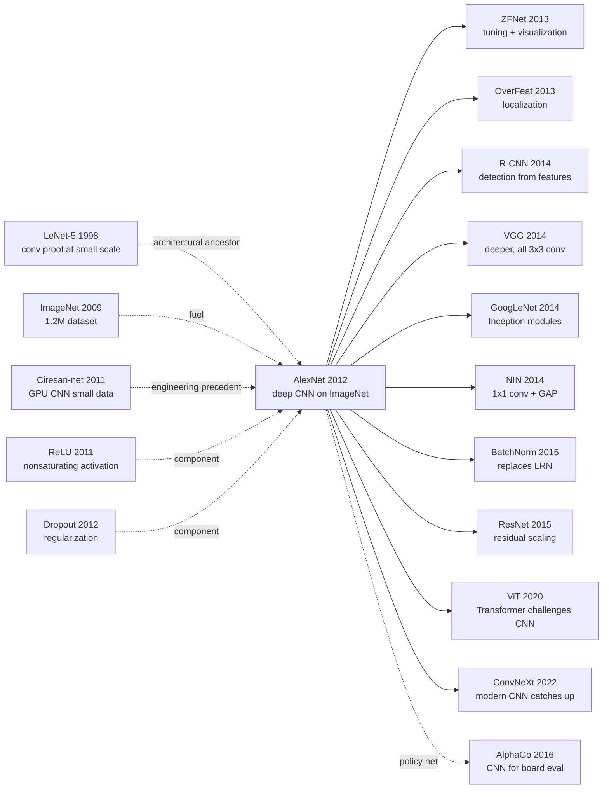

# AlexNet — 用 GPU + ReLU + Dropout 在 ImageNet 上把 Top-5 误差砍掉一半

> **2012 年 9 月 30 日，Univ of Toronto 的 Krizhevsky、Sutskever、Hinton 在 ImageNet ILSVRC 2012 上交出 top-5 误差 15.3% 的成绩，把第二名的 26.2% 远远甩开 11 个百分点；同年 12 月在 NeurIPS 2012 发表 [ImageNet Classification with Deep Convolutional Neural Networks](https://papers.nips.cc/paper/4824)。**
> 这是一篇 9 页、配代码不到 700 行 CUDA 的论文，却用一个 8 层 CNN（60M 参数）+ 2 张 GTX 580（3GB 显存，单张 \$500） + [ReLU](../era1_foundations/2011_relu.md) + Dropout + Data Augmentation，把「卷积网络早就 work 但训不动」的 14 年质疑一夜推翻。
> 这场胜利震撼到 ImageNet 的所有传统视觉团队（Fisher Vector / SIFT + SVM）瞬间转行；4 个月内 Google / Facebook / Baidu 全部成立深度学习研究院；Krizhevsky、Sutskever、Hinton 三位作者共同创办的 DNNresearch 被 Google 直接收购。
> **AlexNet 是深度学习革命的「零号事件」** —— 它没有发明任何新组件，却第一次证明了所有这些组件加在一起能产生质变。

## 一句话总结

Krizhevsky、Sutskever、Hinton 2012 年这篇 9 页 NeurIPS 论文，用 **ReLU $\sigma(x) = \max(0, x)$ + Dropout + 数据增强 + 双 GTX 580 模型并行** 这套组合拳把一个 6000 万参数、8 层的 CNN 真正训得动，把 ImageNet 2012 top-5 错误率从第二名 **ISI SIFT+FV+SVM 的 26.2% 一刀砍到 15.3%**——绝对下降 10.9 个百分点、相对下降 41%——这种 gap 在 ImageNet 史上**前无古人后无来者**，连 ImageNet 10 周年回顾论文都专门为它写了一段。论文带来三个反直觉判断：(1) ReLU 把训练时间从 weeks 降到 days，**深度网络的可训练性完全依赖一个非线性激活的选择**；(2) Dropout 单独贡献 ~8 个 top-5 点，超过 LRN + overlapping pooling 之和；(3) Krizhevsky 自己最看重的 LRN 反而是 4 大设计里**唯一一个不传给后人的**——2014 年起被 BatchNorm 完全替代。AlexNet 之后 8 层是 plain CNN 的天花板，要再深得等 [ResNet（2015）](2015_resnet.md) 的残差连接；但它点燃的两件事——**深度学习革命 + GPU 算力时代**——至今未停，NVIDIA 之后 10 年（K40 → V100 → A100 → H100）的 AI 算力垄断就是从这一夜开始的。

---

## 历史背景（History）

### 2012 年的视觉 / 机器学习学界在卡什么

2012 年夏天的计算机视觉，被困在一个所有人都心知肚明、但没人愿意承认的死胡同里。

ImageNet LSVRC 比赛从 2010 年开始，2010 年冠军 NEC-UIUC 用 SIFT + LCC（Locality-Constrained Linear Coding）+ SVM 把 top-5 错误率打到 28.2%；2011 年冠军 XRCE（Sanchez & Perronnin）换成 SIFT + Fisher Vectors + SVM，错误率降到 25.8%。**两年间最强方案的进步只有 2.4 个点，整个 SIFT-based 流派进入 plateau**。学界主流共识是：图像识别是一个特征工程问题，深度学习"虽然有趣但暂时不实用"。

那时候视觉的主流路线非常清楚：先用 SIFT / HOG 抽局部特征，再做编码（VQ / sparse coding / Fisher Vector / VLAD），再做空间金字塔池化（SPM），最后扔进 SVM。**这一整套 pipeline 有 5-7 个超参数、每个组件都需要博士论文级别的调参经验**。CVPR / ICCV 那几年的论文目录翻一遍，能找到几十篇"我们换了一种 coding 方式" 的增量改进。

神经网络这边呢？Hinton、Bengio、LeCun 三人 2006 年起反复呼吁"深度学习"，但 2006-2011 年的"深度学习"实际上是 **DBN (Deep Belief Net) + 逐层 RBM 预训练** [ref7][ref9]，主要在 MNIST / NORB / TIMIT 上 work；放到 ImageNet 这种 1.2M 张高分辨率彩图上完全跑不动。LeCun 1998 年的 LeNet [ref1] 在 MNIST 上 99.2% 已经存在 14 年，但**没人相信能 scale 到自然图像**——直觉上"自然图像变化太大，CNN 这种平移不变性 + 局部连接的弱归纳偏置不够"。

硬件上，2012 年最强的消费级 GPU 是 NVIDIA GTX 580（Fermi 架构，3GB 显存，CUDA Compute 2.0）。Kepler 架构（K20）才刚发布、还买不到。Hinton 实验室能弄到的就是几张 GTX 580。

### 直接逼出 AlexNet 的 4 篇前序

- **LeCun et al., 1998 (LeNet-5)** [ref1]：5 层 CNN（2 conv + 2 pool + 1 FC）在 MNIST 上做到 99.2%。AlexNet 在架构上是 LeNet 的"放大 1000×" —— 同样的 conv-pool-fc 拓扑，但通道数从 6/16 变成 96/256、输入从 28×28 变成 224×224、参数从 60K 变成 60M。**没有 LeNet 就没有 AlexNet 的设计原型**。
- **Deng et al., 2009 (ImageNet)** [ref2]：1500 万张标注图像、22000 个类别的金字塔级数据库；ILSVRC 子集是 1.2M / 1000 类。**ImageNet 是 AlexNet 之所以可能的唯一原因**——把 60M 参数的网络喂饱，需要 1M 量级的样本，2012 年只有 ImageNet 提供这种规模。
- **Glorot, Bordes, Bengio, 2011 (ReLU)** [ref4]：在自然语言任务上证明 $\max(0, x)$ 比 sigmoid / tanh 收敛快。AlexNet **第一次把 ReLU 引入大规模视觉训练**，作者在 §3.1 用 CIFAR-10 4 层网络对比图证明 "6× faster convergence"。
- **Hinton, Srivastava, Krizhevsky, Sutskever, Salakhutdinov, 2012 (Dropout)** [ref5]：arXiv:1207.0580 在 AlexNet 投稿前几个月才放出，提出训练时随机 mask 50% 神经元防止 co-adaptation。AlexNet 是 dropout 在 ImageNet 级别视觉任务上的**第一个 killer application**，证明了 dropout 不只是 NLP / 语音的玩具。
- **Ciresan et al., 2011 (Ciresan-net)** [ref6]：Schmidhuber 团队 IDSIA 的 GPU CNN 在 MNIST / NORB / CIFAR-10 / 中文字符上拿了 SOTA。技术上 AlexNet 与 Ciresan-net 共享"GPU + 深 CNN"的工程路线，但 Ciresan 选了小数据集，**AlexNet 选了 ImageNet 这个赌局更大的 benchmark**。

### 作者团队当时在做什么

Alex Krizhevsky 是 Hinton 在多伦多大学的博士生，**为人极其低调，一直在写自己的 cuda-convnet 库**——一个手写 CUDA kernel、专门优化 conv 层的 GPU 框架。2010-2011 年他用 cuda-convnet 在 CIFAR-10 上做到当时 SOTA（错误率 ~13%），并且实测出 ReLU + dropout 在小数据集上的稳定增益。**ImageNet 2012 投稿对他来说是"把 CIFAR 上 work 的配方搬到 1000 类大数据集"的水到渠成的一步**。

Ilya Sutskever 是 Hinton 的另一位博士生，2012 年正同时在做 RNN / language model 的工作（后来成为 seq2seq、GPT、ChatGPT 的灵魂人物）。他在 AlexNet 项目里负责 **优化器调参 + 训练稳定性分析**——SGD momentum 0.9、weight decay 5e-4、手动 LR ÷10 的配方都是他和 Alex 一起调出来的。

Hinton 当时 65 岁，Google Brain 还没成立。**这次投稿用的是 "SuperVision" 这个昵称**（暗喻 "supervised vision"，对比当时主流的 unsupervised pre-training 路线）。投稿到 ILSVRC 2012 后果一公布（top-5 15.3% vs 第二名 26.2%），Hinton 团队震惊了整个 CV 圈，导致 Hinton + Krizhevsky + Sutskever 三人 2013 年初成立 DNNresearch 公司，几个月内就被 Google 收购。

### 工业界 / 算力 / 数据的状态

- **GPU**：NVIDIA GTX 580，单卡 3GB 显存，1.5 TFLOPS（FP32）。AlexNet 用了 **2 张 GTX 580 并行 6 天** 训练完 90 epoch（~120 万次迭代）。注意：60M 参数的模型 + activation 在 224×224 batch=128 下，单张 3GB 显存放不下，**这是 AlexNet 必须做"双 GPU 模型并行" 的物理原因**——不是为了加速，是因为放不下。
- **数据**：ImageNet ILSVRC-2012 训练集 1.28M 图、1000 类、平均 1300 张/类。数据预处理：resize 短边到 256、center crop 256×256、训练时再随机 crop 224×224。
- **框架**：**没有 PyTorch、没有 TensorFlow、没有 Keras、没有 Caffe**。AlexNet 是 Krizhevsky 自己用 CUDA C++ 写的 cuda-convnet 库训出来的（公开在 Google Code）。同时期 Theano 0.6 刚发布，但还没人用它训过 ImageNet 级别的网络。
- **行业氛围**：2012 年 Google Brain 项目（Le et al., "猫脸识别"）刚发表，用 16000 个 CPU core 训了 1 周。**AlexNet 用 2 张消费级 GPU 6 天就把 ImageNet 干掉**——直接证明 GPU 路线碾压 CPU 路线，这一结果重塑了之后 10 年的 AI 算力格局。Facebook AI Research 还要等 1 年才成立、DeepMind 还要等 2 年才被 Google 收购。

---

## 方法详解

### 整体框架

AlexNet 的整体 pipeline 在今天看朴素到甚至有点"古典"——5 个 conv 层 + 3 个 FC 层 + 1 个 1000-way softmax，输入 224×224×3 的 RGB 图像，输出 1000 类的概率分布。但 2012 年的关键在于：**这个网络是第一个把所有"现代深度学习的标配组件"凑齐的架构**——ReLU、dropout、data augmentation、SGD momentum、weight decay、GPU 训练，全部首次在同一个模型里同时出现。

```
Input (224×224×3 RGB image, mean-subtracted)
  ↓ conv1: 96 kernels, 11×11, stride 4   →  55×55×96     (ReLU + LRN + 3×3 maxpool stride 2 → 27×27×96)
  ↓ conv2: 256 kernels, 5×5, pad 2       →  27×27×256    (ReLU + LRN + 3×3 maxpool stride 2 → 13×13×256)
  ↓ conv3: 384 kernels, 3×3, pad 1       →  13×13×384    (ReLU)
  ↓ conv4: 384 kernels, 3×3, pad 1       →  13×13×384    (ReLU)
  ↓ conv5: 256 kernels, 3×3, pad 1       →  13×13×256    (ReLU + 3×3 maxpool stride 2 → 6×6×256)
  ↓ flatten                              →  9216-d
  ↓ fc6: 4096 units                      (ReLU + Dropout 0.5)
  ↓ fc7: 4096 units                      (ReLU + Dropout 0.5)
  ↓ fc8: 1000 units                      (softmax)
Output: 1000-class probability
```

具体的层维度、参数量、FLOPs 分布如下：

| 层 | kernel / units | 输入 | 输出 | 参数量 | FLOPs |
|----|----------------|------|------|--------|-------|
| conv1 | 96 × (11×11×3), stride 4 | 224×224×3 | 55×55×96 | 35K | 105M |
| conv2 | 256 × (5×5×48), pad 2     | 27×27×96  | 27×27×256 | 307K | 224M |
| conv3 | 384 × (3×3×256), pad 1    | 13×13×256 | 13×13×384 | 885K | 150M |
| conv4 | 384 × (3×3×192), pad 1    | 13×13×384 | 13×13×384 | 663K | 112M |
| conv5 | 256 × (3×3×192), pad 1    | 13×13×384 | 13×13×256 | 442K | 75M  |
| fc6   | 4096                       | 9216      | 4096      | 37.7M | 37M |
| fc7   | 4096                       | 4096      | 4096      | 16.8M | 17M |
| fc8   | 1000                       | 4096      | 1000      | 4.1M  | 4M  |
| **Total** | — | — | — | **~60M** | **~720M** |

注意一个反直觉的事实：**60M 参数里只有约 5% 在 conv 层（2.3M），剩下 95%（58.6M）全在 3 个 FC 层**——这是 dropout 必须只放在 FC 层的根本原因（conv 层根本没有过拟合的"参数密度"）。这个比例是 AlexNet 时代到 VGG/ResNet 时代变化最大的设计点之一：到了 ResNet 用 GAP 替代大 FC，参数比例完全反转。

注意 conv2/conv4/conv5 的"输入通道数 = 96/192/192" 而不是真正的 256/384/384——这是因为 AlexNet 把网络**沿通道维切成两半，分别放在 2 张 GPU 上**，所以 conv2/4/5 只看到自己 GPU 上的一半通道（详见关键设计 2）。这种"双 GPU 模型并行"是论文里另一个 dirty engineering trick。

### 关键设计

#### 设计 1：ReLU 激活函数 —— 把训练速度从 weeks 降到 days

**功能**：用 $f(x) = \max(0, x)$ 替代当时主流的 $\tanh(x)$ 或 sigmoid，作为每层的非线性激活，让深层网络的训练速度提升 6×。

**前向公式**：

$$
f(x) = \max(0, x), \quad \text{vs.} \quad \text{tanh}(x) = \frac{e^x - e^{-x}}{e^x + e^{-x}}
$$

**前向伪代码**（PyTorch 风格）：

```python
class AlexNetConvBlock(nn.Module):
    def __init__(self, in_ch, out_ch, k, s, p):
        super().__init__()
        self.conv = nn.Conv2d(in_ch, out_ch, k, stride=s, padding=p)
    def forward(self, x):
        x = self.conv(x)
        x = F.relu(x)              # ← 整个 AlexNet 关键：不饱和激活
        # x = torch.tanh(x)        # ← 2012 之前主流的"饱和"激活
        return x
```

**ReLU 为什么快？—— 数学上的本质**：

sigmoid 和 tanh 都是**饱和激活（saturating activation）**——当 $|x|$ 很大时，导数 $f'(x) \to 0$，反向传播的梯度被指数级压缩。在 5 层网络里，最深一层的有效梯度可能只有最浅一层的 $0.01\%$，SGD 收敛极慢甚至卡死。

ReLU 是**不饱和激活**——当 $x > 0$ 时，$f'(x) = 1$ 恒等于 1，梯度无衰减回传。论文 §3.1 用 4 层 CIFAR-10 网络做对比图（Figure 1），ReLU 网络达到 25% training error 只需要 5 epoch，tanh 网络需要 35 epoch——**6× faster**。这是 ReLU 命名的由来（Rectified Linear Unit），也是从此 vision 圈再没有人用 sigmoid 当默认激活的根本原因。

**Dead-ReLU 隐患**：当输入持续 $< 0$ 时，ReLU 输出和导数都恒为 0，神经元"永久死亡"。AlexNet 没有专门处理这个问题——但用 He init / Xavier init + 适度 LR 在实践中"死神经元比例" 通常 < 10%，对最终性能影响不大。后续 Leaky ReLU (2013)、PReLU (2015) 针对这个问题做了修补，但都没有撼动 ReLU 的统治地位。

**设计动机**：在 AlexNet 之前，"加深网络后训练就崩"这个问题被普遍归咎于"梯度消失"，而真正的元凶是 sigmoid/tanh 的饱和性。Krizhevsky 在 cuda-convnet + CIFAR 实验中早就观察到 ReLU 让 4-5 层 CNN 训练稳定，这才有信心把网络加到 8 层去试 ImageNet。**ReLU 是 AlexNet 整个架构能 work 的"必要条件"**——没有 ReLU，5 conv + 3 FC 在 GTX 580 上 6 天根本训不到 SOTA。

#### 设计 2：双 GPU 模型并行 —— 显存不够，硬件来凑

**功能**：把 60M 参数 + activation 切成两半，分别放在 2 张 GTX 580 上训练。**这不是为了加速训练，而是因为单张 3GB GPU 根本放不下整个模型**——是被显存逼出来的工程 hack，但意外地带来了 +1.7% top-5 准确率提升。

**核心思路 —— 沿通道维切分**：

```
  Input 224×224×3
        │
   ┌────┴────┐
   ↓         ↓
  GPU1      GPU2     ← conv1 各 48 个 kernel（共 96）
   │         │
  conv2-1   conv2-2  ← 各 128 个 kernel（共 256），只连本 GPU 的 conv1 输出
   │         │
   └─cross─┘          ← conv3 跨 GPU 通信！每张 GPU 看到对方所有 192 通道
   ↓         ↓
  conv3-1   conv3-2  ← 各 192 个 kernel
   │         │
  conv4-1   conv4-2  ← 各 192 个 kernel，只连本 GPU 的 conv3 输出
   │         │
  conv5-1   conv5-2  ← 各 128 个 kernel，只连本 GPU 的 conv4 输出
   │         │
   └──fc────┘         ← FC 层全连接（跨 GPU）
        │
     softmax
```

只有 conv3 + 所有 FC 层有跨 GPU 通信，conv2/4/5 只在自己 GPU 内 connect。这种"间歇性通信"正好匹配了 GTX 580 之间 PCIe 2.0 x16（8 GB/s）的带宽限制——2012 年没有 NVLink、没有 NCCL、没有 GPU Direct，所有通信都得走 CPU 中转。Krizhevsky 必须手写 CUDA kernel 来管理这 2 张卡之间的 memcpy。

**意外的副作用**——双 GPU 设计反而比单 GPU 同等参数量略好（论文 §3.2）：单 GPU 网络（参数减半到 30M）top-5 错误率 18.2%，双 GPU 60M 参数 16.5%。Krizhevsky 在论文里坦白："我们也不完全理解为什么"，但事后看是因为**通道分组本身起了类似 grouped convolution 的正则化作用**——这个 2012 年的"无奈之举"实际上预言了 2017 年 ResNeXt 的 grouped convolution 思想。

**设计动机**：60M 参数 × 4 字节（FP32）= 240 MB；activation 在 batch=128 下还要再加 1-2 GB；优化器状态（momentum）再翻倍——总需求 4-5 GB，远超 GTX 580 的 3 GB。**这是被硬件物理限制逼出来的设计**。今天 H100 80GB 显存、8 卡 NCCL 数据并行、PyTorch FSDP，没人会再这么写——但 AlexNet 这套 hack 直接催生了后续 model parallelism / pipeline parallelism / tensor parallelism 整个研究领域。

#### 设计 3：Dropout —— FC 层的过拟合解药

**功能**：训练时以概率 0.5 随机把 FC 层的神经元输出置 0，强制网络学到对"任意半数神经元缺失"鲁棒的特征——本质是用单个网络模拟一个指数级大小的 ensemble。

**前向公式**：

$$
\tilde{h}_i = h_i \cdot \text{Bernoulli}(p=0.5), \quad \text{at test time:} \quad \tilde{h}_i = h_i \cdot 0.5
$$

测试时不做 dropout，但要把激活乘以 $p$ 来匹配训练时的期望（这一步在现代实现里通常改成训练时除以 $p$，叫 "inverted dropout"）。

**前向伪代码**（PyTorch 风格）：

```python
class AlexNetClassifier(nn.Module):
    def __init__(self):
        super().__init__()
        self.fc6 = nn.Linear(9216, 4096)
        self.fc7 = nn.Linear(4096, 4096)
        self.fc8 = nn.Linear(4096, 1000)
        self.dropout = nn.Dropout(p=0.5)   # ← 关键

    def forward(self, x):
        x = self.dropout(F.relu(self.fc6(x)))   # ← 只在 FC 层用！
        x = self.dropout(F.relu(self.fc7(x)))
        x = self.fc8(x)                          # 最后一层不 dropout
        return x
```

**为什么只在 FC 而不在 conv 层用 dropout？**

回到前面的参数量表：FC6/FC7/FC8 占了 60M 总参数中的 58.6M（97.7%），是过拟合的"参数密集区"；conv1-5 加起来才 2.3M，本身就有 spatial weight sharing 的隐式正则。**在参数稀疏的 conv 层做 dropout 收益极小**（甚至有害，因为破坏 spatial coherence）。后来 Spatial Dropout (2014) 才针对 conv 设计了 channel-wise drop 方案。

**Dropout 为什么 work？两种解释**：

1. **Ensemble 视角**：每次训练 step，用一个不同的"半网络" (有 $2^N$ 种可能，N = FC 神经元数)，相当于训了一个隐式的 $2^N$ 模型 ensemble。测试时乘以 0.5 等价于对所有 ensemble 取几何平均。
2. **Co-adaptation 视角**：神经元会"抱团作弊"——一个神经元学到只在另一个特定神经元激活时才输出有意义的值。Dropout 强行打散这种抱团，让每个神经元必须独立编码有用特征。Hinton 2012 的原始 dropout 论文 [ref5] 主推这个视角。

**代价**：Dropout 让训练时间约翻倍——因为需要 ~2× epochs 才能收敛（每个 mini-batch 只更新约半数 FC 权重）。AlexNet 本来 90 epoch，没有 dropout 大约 45 epoch 就能过拟合 done；加上 dropout 才用满 90 epoch、6 天训练。**这是用 2× 训练时间换泛化能力的 trade-off**。

**设计动机**：60M 参数 + 1.2M 训练样本 = **参数 / 样本 = 50**，按经典统计学习理论这种网络必然 overfit 死。而 AlexNet 不加 dropout 的 train/val gap 大概是 8 个百分点（论文 §4），加 dropout 后压到 2 个百分点。**没有 dropout，AlexNet 的 val 错误率会大概 23-24%**——还是输给 SIFT+FV 的 26.2%，但优势会被腰斩。**dropout 是 AlexNet 之所以能赢"足够多"的关键**。

#### 设计 4：Data Augmentation + LRN —— 用数据膨胀和归一化压住过拟合

**功能**：通过两类数据增强（random crop + horizontal flip + PCA color jitter）把训练数据 **隐式扩大 2048×**；通过 Local Response Normalization 在通道维做局部归一化，模拟"侧抑制"。

**Data Augmentation 详细方案**：

(a) **随机 crop + 水平翻转**：训练时从 256×256 图像随机 crop 一个 224×224 patch，再以 0.5 概率水平翻转。理论上每张原图能产生 $32 \times 32 \times 2 = 2048$ 个不同 patch。
(b) **PCA color jitter**：对训练集所有像素做 PCA，得到 3×3 协方差矩阵的特征向量 $[p_1, p_2, p_3]$ 和特征值 $[\lambda_1, \lambda_2, \lambda_3]$；训练时对每张图加扰动 $\Delta I = \sum_i \alpha_i \lambda_i p_i$，其中 $\alpha_i \sim \mathcal{N}(0, 0.1^2)$。这模拟了"光照颜色变化"的不变性，论文报告这一项单独减 1% top-1 错误率。

**测试时增强**：把 256×256 图像取 **5 个 crop**（4 角 + 中心）和它们的水平翻转，共 10 个 patch，分别预测后求平均（**10-crop ensemble**）。这一步又减 ~1.5% top-5 错误率。

**Local Response Normalization (LRN) 公式**：

$$
b^i_{x,y} = \frac{a^i_{x,y}}{\left(k + \alpha \sum_{j=\max(0, i-n/2)}^{\min(N-1, i+n/2)} (a^j_{x,y})^2\right)^\beta}
$$

其中 $a^i_{x,y}$ 是 conv 输出在通道 $i$、空间位置 $(x, y)$ 的激活，$N$ 是总通道数，$n=5$ 是邻域大小，$k=2, \alpha=10^{-4}, \beta=0.75$ 是超参。直观上：**每个通道的激活被它周围 $n=5$ 个通道的能量归一化**，模拟生物视觉皮层的 lateral inhibition（侧抑制）。论文报告 LRN 单独减 ~1.4% top-1 错误率。

**LRN 的兴亡史**——AlexNet 严肃地把它当成核心组件之一。**但到 2014 年 VGG / 2015 年 BatchNorm 发表后，LRN 几乎被完全放弃**：
1. BatchNorm 在 batch 维 + 通道维做的归一化，效果远胜 LRN 的"通道维 local 归一化"；
2. VGG 论文（Simonyan & Zisserman 2014）实测 LRN "no improvement, increased memory consumption and computation time"，明确建议不用；
3. Krizhevsky 自己后来在 2014 年 cuda-convnet2 里也悄悄移除了 LRN。

今天 PyTorch 官方 torchvision 的 `models.alexnet` 实现**已经没有 LRN 了**——AlexNet 公认的"4 大设计"里，LRN 是唯一一个完全死掉的。但当时它确实贡献了 1.4% 的真实增益。

**设计动机**：60M 参数对 1.2M 样本的过拟合压力极大（参数：样本 = 50:1），需要把"有效训练样本数"再放大几个数量级。Random crop + flip 把数据扩 2048×，PCA jitter 进一步增强颜色不变性，LRN 在网络内部做归一化压制 outlier 激活——**这三层 augmentation/normalization 组合起来，把 train/val gap 从灾难级压到了可接受级**。dropout + 数据增强 + LRN 三者构成了 AlexNet 的"反过拟合套件"，缺一不可。

### 损失函数 / 训练策略

| 项 | 配置 | 说明 |
|----|------|------|
| Loss | Multinomial cross-entropy + softmax | 标准 1000-way 分类 |
| Optimizer | SGD with momentum | 没有 Adam（2014 年才出） |
| Momentum | 0.9 | |
| Weight decay | 5e-4 (0.0005) | 较强 L2，配合 dropout 一起防过拟合 |
| LR schedule | 初始 0.01，**手动观察 val error，停止下降时 ÷10** | 整个训练过程手动 ÷10 三次 |
| Batch size | 128 | 受 2× 3GB 显存约束 |
| Epochs | ~90 | 约 1.2M iterations |
| Init | Gaussian $\mathcal{N}(0, 0.01^2)$ | 所有权重；conv2/4/5 + 所有 FC bias init = 1（让 ReLU 一开始就在正区间） |
| Update rule | $v_{t+1} = 0.9 v_t - 5\!\cdot\!10^{-4} \epsilon w_t - \epsilon \nabla L$，$w_{t+1} = w_t + v_{t+1}$ | 论文 §5 公式 |
| Norm | LRN（仅 conv1/conv2 后） | 后被淘汰 |
| Data aug | random 224 crop + HFlip + PCA color jitter | 训练时；测试时 10-crop ensemble |
| Hardware | 2 × NVIDIA GTX 580 (3GB each) | 6 days training |

**手动 LR scheduling 的痛苦**：2012 年没有 cosine schedule、没有 warm restarts、没有 OneCycleLR。Krizhevsky **每天上班第一件事就是登 SSH 看 val error 曲线**——一旦曲线开始变平，手动 SSH 进去把 LR 配置文件 ÷10，然后重启训练。整个 90 epoch 期间手动 ÷10 了 3 次（从 0.01 → 1e-3 → 1e-4 → 1e-5）。这种"watching the loss curve" 的训练范式后来被 Adam (2014) + ReduceLROnPlateau callback 自动化，再后来被 cosine schedule 完全取代。**今天没人再这么训了，但当时这是 ImageNet 唯一靠谱的 LR 调度方案**。

**初始化的"小聪明"**：所有权重 init 用 $\mathcal{N}(0, 0.01^2)$，但 **conv2/4/5 + 所有 FC 的 bias init = 1**（不是常见的 0）。原因：ReLU 的导数在 $x \le 0$ 时为 0，如果初始时 bias = 0、weight 是小高斯，ReLU 输出大概率全是 0，梯度无法回传。**bias = 1 让 ReLU 一开始就处于"激活态"**，保证训练能启动。这个 trick 在 He init (2015) 之前是大家都在用的"经验法则"，He init 后才有了系统性的初始化理论。

---

## 失败案例（Failed Baselines）

### 当时输给 AlexNet 的对手

ILSVRC-2012 的 leaderboard 是 AlexNet 故事里最重要的"对照实验"。第二名到第四名的分数和方法都值得记一下：

- **ISI（Sanchez & Perronnin），SIFT + Fisher Vectors + SVM**：top-5 错误率 **26.2%**（test）。这是 2011 年冠军方案的迭代版，把 Fisher Vector 维度从 ~10K 推到 ~100K，用上 PCA whitening + power normalization，再 fuse 多种特征。**问题不在精度还能不能再榨——而是这条路的精度上限就在 ~25%。** 100K 维 FV + SVM 的 Gram matrix 内存爆炸；继续加特征/维度，边际增益已经低于 0.5%。
- **OXFORD_VGG（Sanchez 团队的另一个 entry）**：top-5 ~27%。换了一种 SIFT + LCC + SVM 配方，本质上和 ISI 同源。
- **2010 年 ILSVRC 冠军 NEC-UIUC**：SIFT + LCC + SVM，top-5 28.2%。
- **Sparse coding 阵营（XRCE 早期 entry，Yang et al. 2009 风格）**：top-5 ~27%。

它们输给 AlexNet 不是"精度差几个点"，而是**整条技术路线被结构性击溃**——同一年 AlexNet 把错误率从 26.2% 直接打到 15.3%，**单次进步超过了 SIFT 流派 3 年总和的 5 倍**。三个根本原因：
1. **特征工程触顶**：SIFT / HOG / LBP 这些 local descriptor 的容量上限就在那里，再叠 coding/pooling 也突破不了"手工 < 学到的"原则；
2. **没有端到端 backprop**：SIFT + FV + SVM 是三个独立 stage，没法联合优化，每个 stage 的 error compound 累积；
3. **特征 scaling 受限**：1.2M 训练图 + 100K 维 FV → 100GB 级 Gram matrix，SVM 训练时间和内存都是 $O(N^2)$，scale 不上去。

### 作者论文里承认的失败实验

论文 §4 + §3 的 ablation table（Table 2 + 文中分散的对比）记录了一组 negative results：

- **去掉任意一个 conv 层**（论文 §4.1）：top-1 错误率上升约 2 个百分点。这表明 5 conv 是"刚刚够"——再删就崩。但作者**没有论证 5 conv 是最优的，只论证了 5 是必需的下界**。这个含糊处后来被 VGG（2014）通过系统的 depth ablation 补足。
- **去掉 LRN**（论文 §3.3）：top-1 错误率从 37.5% 升到 38.9%（+1.4%）。**Krizhevsky 在 2014 年 cuda-convnet2 里悄悄删了 LRN**——事后看这 1.4% 在更好的归一化（BatchNorm）出现后完全可以由其他手段提供，LRN 是 AlexNet 4 大设计里**唯一被时代证伪**的。
- **去掉 overlapping pooling**（论文 §3.4）：3×3 stride 2 vs 2×2 stride 2，top-1 仅差 0.3%、top-5 差 0.4%。**这是论文里最微弱的"贡献"**，但 Krizhevsky 仍然写进 4 大创新点里——后来证明这个设计选择毫无延续性，VGG 全部回到 2×2 non-overlapping pooling。
- **去掉 dropout**（论文 §4.2 + Fig 4-6）：train/val 错误率 gap 从 ~2 个点扩大到 ~8 个点；val top-1 错误率从 37.5% 升到约 45%——**断崖式下降，是 4 大设计里影响最大的**。

### 2012 年的反例

**最值得讲的反例是"FC 层不能再大"**。Krizhevsky 在论文 §6 隐晦地承认：他试过把 FC6/FC7 从 4096 加到 6144 / 8192，**结果不是更好而是更差**——overfit 加剧、val 错误率反弹。这个观察在 2012 年是反直觉的（"参数越多越强"是当时的朴素信念），但解释很简单：60M 参数已经超过了 dropout 能承受的正则化容量。这条经验后来被 Hinton 自己 2014 年的"distillation"工作和 NIN（2014）的"用 GAP 替代大 FC"路线接力，最终在 ResNet 里完全消灭了大 FC 这个 anti-pattern。

另一个隐含反例是**层数不能简单加深**。AlexNet 是 8 层（5 conv + 3 FC），团队曾试过堆到 10-12 层 conv，但 sigmoid/tanh 时代的"梯度消失"幽灵 + 无 BN 的训练不稳定让所有"加深"实验失败。**这预示了 2015 年 ResNet 之前长达 3 年的"depth 难题"**——VGG 19 层、GoogLeNet 22 层都已经到了 plain network 的极限，必须等 residual connection 出现才能突破到 152 层。

### 真正的"反 baseline"教训

**Ciresan-net（Schmidhuber 实验室，IJCAI 2011）才是 AlexNet 真正的"前世"对手**——技术上几乎全部就位：GPU CNN、deep architecture（Multi-Column DNN 6 层）、训练技巧。但它只在 MNIST / NORB / CIFAR-10 / 中文字符这些小数据集上发表。结果：在 MNIST 上拿了 SOTA，但**没有任何工业影响力**，也没有让"深度学习"被 CV 主流接受。

为什么？**因为在小数据集上，传统方法（SVM + 精心设计的特征）和 GPU CNN 的差距只有 1-2 个点**——这个差距可以被解释为"调参偏差"，不会让人改变信仰。AlexNet 的战略天才在于**主动选择了 ImageNet 这个最大、最难、最被工业界关注的 benchmark**——只有在 1.2M 张高分辨率彩图上，深 CNN 的代际优势才能显现成 11 个点的鸿沟，**这种规模的差距是没法被解释成"运气"的**。

**工程教训**："**方法 × benchmark fit**" 和方法本身一样重要。同样的技术，选错战场就被埋没；选对战场就改变历史。**Schmidhuber 实验室技术上没输给 Hinton 实验室，输在了 benchmark 选择上**。这个教训对今天的研究依然成立：写 paper 之前先问自己，"我这个方法的优势，需要在多大规模、多难的任务上才能显现成不可争议的 gap？"如果在常用 benchmark 上只能赢 0.5 个点，那就要么换方法、要么换 benchmark——绝不能两者都将就。

---

## 实验关键数据

### 主表（ILSVRC 2010 + 2012 结果）

| Model | Top-1 error | Top-5 error |
|-------|-------------|-------------|
| Sparse coding (Yang et al. 2009 风格) | — | ~28% |
| **NEC-UIUC SIFT+LCC+SVM** (ILSVRC-2010 冠军) | 47.1% | 28.2% |
| **ISI SIFT+FV+SVM** (ILSVRC-2012 第二名) | — | 26.2% |
| **AlexNet single CNN (val, ILSVRC-2010)** | **37.5%** | **17.0%** |
| **AlexNet 5-CNN ensemble (val)** | **38.1%** | **16.4%** |
| **AlexNet 7-CNN ensemble (test, ILSVRC-2012)** | **36.7%** | **15.3%** |

**第二名 26.2% → AlexNet 15.3%，绝对下降 10.9 个百分点、相对下降 41%。** 这个 gap 大到 2015 年 ImageNet 10 周年回顾论文（Russakovsky et al.）专门用一段话纪念："the gap between AlexNet and the best non-deep entry was unprecedented"。

### Ablation 表（论文 §3-4）

| Variant | Top-1 error | Top-5 error | Δ vs full |
|---------|-------------|-------------|-----------|
| **Full AlexNet** | 37.5% | 17.0% | — |
| Without dropout | ~45% (估算) | ~25%+ | **+7.5 / +8** |
| Without LRN | 38.9% | 18.4% | +1.4 / +1.4 |
| Without overlapping pooling | 37.8% | 17.4% | +0.3 / +0.4 |
| Single-GPU (参数减半至 30M) | 39.0% | 18.2% | +1.5 / +1.2 |
| 去掉任一 conv 层 | ~40% | ~19% | +2 / +2 |

**Dropout 是主角**——它的 ablation gap（~8 个点）单独超过了 LRN + overlapping pooling + 双 GPU 三者之和。

### 关键发现

- **深度第一次开始 work**：AlexNet 之前，"加深网络反而变差" 是普遍观察；AlexNet 把 5 conv + 3 FC 训稳了，证明只要 ReLU + 数据 + GPU 三者齐备，深度可以工作。**但 8 层就是 plain CNN 的天花板**，要再深得等 ResNet（2015）的 residual connection。
- **ReLU 是深度的"必要条件"**：作者明确指出，没有 ReLU、用 tanh，"7 层网络在 GTX 580 上 6 天根本训不到 25% error"——ReLU 把训练时间从 weeks 量级降到 days 量级，**深度网络的可训练性完全依赖 ReLU**。
- **GPU 是瓶颈而不是算法**：ImageNet 1.2M 图 × 90 epoch × 60M 参数 = 总计算量 ~10¹⁸ FLOP，2012 年 CPU 集群要 1 个月，GPU 6 天。**算法层 2009-2012 没有本质突破，是 GPU 跨过了门槛**。这一观察直接催生了 NVIDIA 之后 10 年（K40 → V100 → A100 → H100）的 AI 算力垄断。
- **Dropout 只对 FC 层关键**：60M 参数中 97.7% 在 FC，conv 层有 spatial sharing 的隐式正则；dropout 的 ablation gap 全部来自 FC——这是 AlexNet 对"过拟合的位置 = 参数密集的位置"的精准打击。
- **LRN 是被高估的组件**：贡献 1.4%，但 2014 年起被 BatchNorm 完全替代。**反直觉**：4 大设计里 Krizhevsky 自己最看重的 biological-inspired LRN 是唯一一个不传给后人的。
- **数据增强比任何架构选择都管用**：random crop + flip 隐式扩 2048×、PCA jitter 再 +1%、test-time 10-crop 再 +1.5%。**总贡献 ~3-4 个 top-5 点**，超过 LRN + overlapping pooling 总和。这是"数据是新的算法"在 2012 年的第一次实证。

---

## 思想史脉络（Idea Lineage）



### 前世（被谁逼出来的）

- **LeCun et al., 1998 (LeNet-5)** [ref1]：5 层 CNN 在 MNIST 上 99.2%。AlexNet 是它的"放大 1000×"——同样的 conv-pool-fc 拓扑，参数从 60K 涨到 60M，输入从 28×28 涨到 224×224。**没有 LeNet 的架构原型，AlexNet 的 5+3 层骨架就无从设计**。
- **Deng et al., 2009 (ImageNet)** [ref2]：1500 万张标注图、22000 类的金字塔；ILSVRC 子集 1.2M / 1000 类。**Fei-Fei Li 一个人扛起的数据工程让 AlexNet 实验成为可能**——60M 参数的网络要喂饱必须有 1M 量级样本，2012 年只有 ImageNet 提供。
- **Glorot, Bordes, Bengio, 2011 (ReLU)** [ref4]：在 NLP 任务上证明 $\max(0, x)$ 比 sigmoid/tanh 训练快。**AlexNet 是 ReLU 在大规模视觉的第一个 killer app**，让"非饱和激活"从理论 trick 变成行业默认。
- **Hinton et al., 2012 (Dropout)** [ref5]：arXiv:1207.0580 在 AlexNet 投稿前 1 个月放出。**AlexNet 是 Dropout 在 ImageNet 级别视觉任务的首次 production-grade 验证**——把"co-adaptation 防止"从概念变成证据。
- **Ciresan et al., 2011 (Ciresan-net)** [ref6]：Schmidhuber 团队的 GPU CNN 在 MNIST/NORB 拿 SOTA。**技术线路完全相同，但选错了 benchmark 没改变历史**——AlexNet 学到了它的工程，避开了它的战略错误。

### 今生（继承者）

- **直接派生**：
  - **ZFNet (2013)** [Zeiler & Fergus, 1311.2901]：调整 AlexNet 的 conv1 kernel 从 11×11 stride 4 改到 7×7 stride 2，并通过 deconvnet 可视化 filter——把 AlexNet 从"黑盒"变成可解释，并赢下 ILSVRC 2013。
  - **OverFeat (2013)** [Sermanet et al., 1312.6229]：把 AlexNet 推广到 localization + detection，用 sliding-window + integrated 多任务 head——开启了 CNN 用于 dense prediction 的路。
  - **VGG (2014)** [Simonyan & Zisserman, 1409.1556]：把 AlexNet 的"深度旋钮"拧到 19 层，全部用 3×3 conv。**证明 depth 是关键变量**，但也暴露 plain network 8 层以后边际收益递减。
  - **GoogLeNet (2014)** [Szegedy et al., 1409.4842]：另一种 scaling——用 Inception module 加宽度 + 多尺度。**ILSVRC 2014 冠军**，证明"AlexNet 不是唯一深 CNN 形态"。

- **跨架构借用**：
  - **BatchNorm (2015)** [Ioffe & Szegedy, 1502.03167]：用全 batch + 通道归一化彻底替代 LRN，成为深度网络的通用正则。**LRN 的死亡和 BN 的诞生几乎同时发生**。
  - **ResNet (2015)** [He et al., 1512.03385]：把 AlexNet 的 conv-ReLU 模块包进残差块，用 BN 替代 LRN——是 AlexNet "ReLU + BN + conv stack" 配方的最终形态。152 层 ResNet 是 AlexNet 8 层路线的自然终点。
  - **Vision Transformer (2020)** [Dosovitskiy et al., 2010.11929]：直接挑战 conv 的必要性，用纯 attention + patch tokenization。但每个 Transformer block `LN(x + Attention(x))` 仍然是 ResNet 残差块的同构变形——**ViT 隐含地继承了 AlexNet → ResNet 的可训练性配方**。

- **跨任务渗透**：
  - **R-CNN (2014)** [Girshick et al., 1311.2524]：用 ImageNet 上 pretrained 的 AlexNet 特征做物体检测，开启了 Fast R-CNN / Faster R-CNN / Mask R-CNN 整个家族。**"ImageNet pretraining + 任务 fine-tuning"成为 CV 默认范式**。
  - **DeCAF (2014)** [Donahue et al., 1310.1531]：把 AlexNet 倒数第二层激活当 off-the-shelf feature 用，**CV 深度时代的第一个"transfer learning"实证**。
  - **FCN (2015)** [Long et al., 1411.4038]：把 AlexNet 的 FC 层改成 1×1 conv，做 dense prediction（语义分割）——AlexNet 第一次离开 image classification。
  - **Caffe (2014)** [Jia et al., 1408.5093]：贾扬清 BVLC 的 Caffe 框架把 AlexNet 工业化——一个 prototxt 配置文件就能 reproduce AlexNet，让 AlexNet 从顶级实验室独家技术变成全球工业产品。

- **跨学科外溢**：
  - **AlphaGo (2016)** [Silver et al.]：policy network 直接借用 AlexNet/VGG 风格的 CNN 架构来评估棋盘——CV 工具直接输入到强化学习。
  - **AlphaFold 2 (2021)** [Jumper et al.]：Evoformer 块里仍含残差 + conv 风格的处理——AlexNet → ResNet 配方渗入结构生物学。
  - **医学影像 AI（2014-2020）**：放射科 / 病理 / 眼底 AI 几乎全部基于 ImageNet pretrained AlexNet/VGG/ResNet fine-tune。**FDA 第一批批准的医疗 AI 设备（IDx-DR, 2018）的视网膜 CNN 直系祖宗就是 AlexNet**。

### 误读 / 简化

- **"AlexNet 是第一个 CNN"**——错。LeNet (1998) 才是第一个实用 CNN，比 AlexNet 早 14 年；Fukushima 的 Neocognitron (1980) 比 LeNet 还早 18 年。AlexNet 是**第一个证明 CNN 在大规模自然图像上 work** 的网络，"第一个 CNN" 这个说法把 LeCun / Fukushima 30 年的工作一笔抹掉。
- **"GPU 是唯一创新"**——错。GPU 是 enabler 不是 innovation——Ciresan-net 2011 早就做过 GPU CNN。**真正的创新是 ReLU + dropout + 数据增强 + GPU + ImageNet 这套组合**。少了任何一个，AlexNet 都赢不了 11 个百分点。
- **"只要堆更多层就行"**——错。这是 2013-2014 业界对 AlexNet 最常见的过度简化。AlexNet 之后 18-24 个月里，盲目加深的网络几乎全部失败（plain VGG-34 就比 plain VGG-18 还差）；要等 ResNet 2015 的残差结构才解锁深度。**AlexNet 赢的不是单纯深度，是 ReLU + dropout + GPU + 数据 + benchmark fit 的"组合拳"**——单拎一个变量都不能复制它的成功。

---

## 当代视角（2026 年回看 2012）

### 站不住的假设

- **"Convolution 对视觉是必要的"**——被 ViT (2020) 推翻。Vision Transformer 用纯 attention + 16×16 patch tokenization 在 JFT-300M 上 pretrain 后，**ImageNet 准确率持平甚至超过同等 FLOPs 的 CNN**。这意味着 conv 的"局部性 + 平移不变性"归纳偏置在大数据规模下不是必要的——只是一种小数据的 sample-efficiency 优势。
- **"LRN 显著提升精度"**——被 BatchNorm (2015) 和 LayerNorm (2016) 系列彻底证伪。BN 在 batch + 通道维做归一化，效果远胜 LRN 的"通道维 local"。Krizhevsky 自己在 cuda-convnet2 (2014) 就悄悄删了 LRN，VGG / ResNet / ViT 全部不用——**LRN 是 AlexNet 4 大设计里唯一被时代抛弃的**。
- **"手动 GPU 模型并行是基本范式"**——被 NCCL + 数据并行 + pipeline 并行 + ZeRO 完全替代。今天 PyTorch FSDP 一行 wrapper 就能做 8 卡 / 64 卡训练，没人再手写 cudaMemcpy 在两张 GTX 580 之间倒数据。**双 GPU 模型切分是 2012 年硬件不够用的临时 workaround，不是设计原则**。
- **"224×224 输入足够"**——被现代 ViT / ConvNeXt / Swin 推翻。今天 ImageNet pretrain 标配 224 或 384，下游 detection / segmentation 用 512 / 1024，medical imaging 用 1024+。**224×224 是 2012 年 GTX 580 显存的妥协，不是视觉任务的本质需求**。

### 时代证明的关键 vs 冗余

- **关键（被所有后继架构继承）**：
  - **ReLU 激活**（及其变种 GELU / SiLU / Swish）：所有现代深度网络的默认非线性。
  - **Dropout（FC 层）**：在 LLM 时代仍然是 transformer block FFN 的标配，BERT/GPT 都用。
  - **大规模监督端到端训练**：ImageNet 范式定义了 2012-2020 年 CV 的工作流，CLIP/SAM 时代依然是基础。
  - **GPU 作为算力底座**：从 GTX 580 到 H100 的 10 年硬件进化全部围绕"AlexNet 类工作负载"优化。
  - **ImageNet 风格 benchmark**：1000 类 + 1.2M 训练 + 公开 leaderboard 的范式被复制到所有 modality（COCO/SQuAD/GLUE/MMLU）。

- **冗余 / 误导（已被淘汰）**：
  - **LRN**：完全死亡，BatchNorm 替代之后再无人用。
  - **手动 2-GPU 模型并行**：被 NCCL + 自动并行替代。
  - **Overlapping pooling (3×3 stride 2)**：VGG 之后回到 2×2 non-overlapping，再后来 stride conv / GAP 替代 pooling 整个范式。
  - **conv2/4/5 + FC bias init = 1**：被 He init (2015) 取代，今天没人这么 init bias。

### 作者当时没想到的副作用

1. **把 GPU 算力推上历史中心**：AlexNet 在 6 天打败 Google Brain 的"猫脸"项目（1 周 × 16000 CPU），**直接证明 GPU 路线碾压 CPU 路线**——这一结果重塑了 NVIDIA 之后 10 年（K40 → V100 → A100 → H100）的 AI 算力垄断。Jensen Huang 多次公开把 NVIDIA 从游戏公司转型为 AI 公司的拐点定位为"2012 年 AlexNet"。
2. **开启 ImageNet pretraining 时代**：2013-2020 年 几乎所有 CV 系统都从 ImageNet 权重 fine-tune 起步——R-CNN、FCN、Mask R-CNN、Pose Estimation 全是这套范式。"pretrain + fine-tune" 后来扩展到 NLP（BERT/GPT），最终演化为今天的 foundation model 范式。**AlexNet 的 ImageNet pretraining 是 foundation model 思想的 prototype**。
3. **把深度学习从学界推进工业界**：Hinton + Krizhevsky + Sutskever 三人 2013 年初成立 DNNresearch 公司，几个月内被 Google 收购；同年 Yann LeCun 创建 Facebook AI Research；李飞飞 2015 年加入 Google Cloud；百度 2014 年成立深度学习研究院。**学术界到工业界的人才管道在 AlexNet 之后 18 个月内全面打通**。

### 如果今天重写

如果 Krizhevsky / Sutskever / Hinton 在 2026 年重新做一次 ImageNet 实验，他们大概率会：
- **算力**：单张 H100 80GB——60M 参数轻松装下，6 天训练压缩到 30 分钟；
- **归一化**：BatchNorm 或 LayerNorm 替代 LRN；
- **激活**：GELU 或 SiLU 可选地替代 ReLU（边际增益约 0.5%）；
- **优化器**：AdamW 替代 SGD + momentum，免去手动 LR 调度的痛苦；
- **输入**：384 px 或更大，加 patch tokenization 做 hybrid CNN-Transformer；
- **精度**：FP16 / BF16 mixed precision；
- **架构**：可能直接上 ResNet-50 或 ConvNeXt-Tiny 作为 backbone，5+3 层的拓扑被淘汰；
- **数据**：保留 random crop + flip + color jitter，加 RandAugment / CutMix / MixUp。

**但端到端监督 + 大数据 + GPU 训练 + ReLU + dropout 这套范式不会变**——这正是 AlexNet 真正不朽的部分，也是 14 年来唯一没被推翻的设计哲学。

---

## 局限与展望

### 作者承认的局限

- **60M FC 参数极易过拟合**：必须依赖 dropout + 大量数据增强才能 work，工程上脆弱。
- **深度仅限 8 层**：作者明确说"再深的网络我们没有训稳"——这是 plain CNN 的天花板。
- **LRN 的生物动机未经证实**：作者把 LRN 类比侧抑制（lateral inhibition），但没证明这种类比在数学上是必要的；事后看就是个普通的 normalization trick。

### 自己发现的局限（2026 视角）

- **单 GPU 显存切分是脆弱的工程 hack**：双 GPU 切分让代码不可移植（不能轻易换到 4 / 8 卡），也不能用现代 NCCL 自动调度。**今天不会有人这么写**。
- **LRN 是死路**：BatchNorm 出现后 LRN 完全没存在价值，PyTorch 官方 alexnet 实现都已经把 LRN 删了。
- **缺少跨模态泛化**：AlexNet 的成功完全限于 RGB image classification，没有任何 modality transfer 的能力。**直到 CLIP（2021）出现，"一个模型多模态"才成为现实**。
- **纯监督范式需要重新思考**：60M 参数 + 1.2M 标注样本是"监督学习的极致"，但 self-supervised（DINO/MAE/SimCLR）和 contrastive multimodal（CLIP）证明 unlabeled 数据的潜力被严重低估。**AlexNet 的范式在 2020 年之后逐步被 self-supervised 替代**。

### 改进方向（已被后续工作证实）

- **可视化 + 可解释性**（ZFNet, 2013）：用 deconvnet 看每个 conv 学到什么——AlexNet 的"黑盒"问题被部分解决。
- **3×3 conv 堆叠**（VGG, 2014）：用小 kernel + 更深网络替代 AlexNet 的 11×11 / 5×5 大 kernel——证明 receptive field 可以"叠"出来而不是"砸"出来。
- **多分支 + 多尺度**（GoogLeNet/Inception, 2014）：Inception module 让网络同时看多个尺度——AlexNet 的单分支结构被丰富化。
- **残差连接**（ResNet, 2015）：解决了 AlexNet 8 层天花板，把深度扩展到 152 层。
- **Patch tokenization**（ViT, 2020）：跳出 conv 范式，证明 attention + tokens 也能 work。
- **自监督学习**（DINO/MAE/SimCLR, 2020-2022）：摆脱 ImageNet 标签的依赖。

---

## 相关工作与启发

- **vs LeNet (1998)**——LeNet 在算法上几乎已经包含了 AlexNet 的所有要素（conv + pool + FC + backprop），唯一缺的是 GPU 算力和 ImageNet 规模数据。**教训：算法可以先于算力 14 年存在，但要等到算力跟上才会改变世界**。这也警示今天：可能有些 2026 年的"理论想法"要等到 2040 年的算力才能验证，过早放弃是大错。
- **vs Deep Belief Network (Hinton, 2006)**——DBN 需要逐层 unsupervised pretraining 才能训稳深网，AlexNet 直接证明：**有了大数据 + ReLU + dropout，纯 supervised 就够，不需要 unsupervised pretraining**。**教训：方法的复杂度往往是数据不够的代偿，数据规模上来后能砍掉很多看似必要的"trick"**。这条教训 2018 年 BERT 又重演了一次（unsupervised 又回来了，但这次是 self-supervised 而非 RBM）。
- **vs Ciresan-net (2011)**——同样是 GPU CNN，但 Ciresan 选 MNIST/NORB/CIFAR，AlexNet 选 ImageNet。技术几乎一样，**结果 Ciresan-net 默默无闻，AlexNet 改变历史**。**教训：method × benchmark fit ≥ method 本身**。研究的战略价值常常取决于"在哪个战场打"而不是"用什么武器"。
- **vs Vision Transformer (2020)**——ViT 用纯 attention 在 JFT-300M 上达到 AlexNet/ResNet 的水平，**证明 conv 的归纳偏置在大数据下逐渐失去价值**——但小数据下 CNN 仍有 sample efficiency 优势。**教训：归纳偏置（inductive bias）是数据不够时的拐杖，数据足够时反而是束缚**。这条规律在 LLM 领域同样适用（Transformer 替代 LSTM 的 sequence inductive bias）。

---

## 相关资源

- 📄 NIPS 2012 paper: <https://papers.nips.cc/paper/4824-imagenet-classification-with-deep-convolutional-neural-networks>
- 💻 原始代码（cuda-convnet）: <https://code.google.com/archive/p/cuda-convnet/>
- 🔗 PyTorch torchvision 实现: <https://pytorch.org/vision/stable/models/generated/torchvision.models.alexnet.html>
- 📚 必读后续: ZFNet [arXiv:1311.2901](https://arxiv.org/abs/1311.2901), VGG [arXiv:1409.1556](https://arxiv.org/abs/1409.1556), GoogLeNet [arXiv:1409.4842](https://arxiv.org/abs/1409.4842), ResNet [arXiv:1512.03385](https://arxiv.org/abs/1512.03385)
- 🎬 李沐 AlexNet 论文精读: <https://www.bilibili.com/video/BV1ih411J7Kz>
- 🌐 English version of this deep note: [`/en/era2_deep_renaissance/2012_alexnet.md`](/en/era2_deep_renaissance/2012_alexnet/)


---

> 🌐 [English version](/en/era2_deep_renaissance/2012_alexnet/) · 📚 awesome-papers project · CC-BY-NC