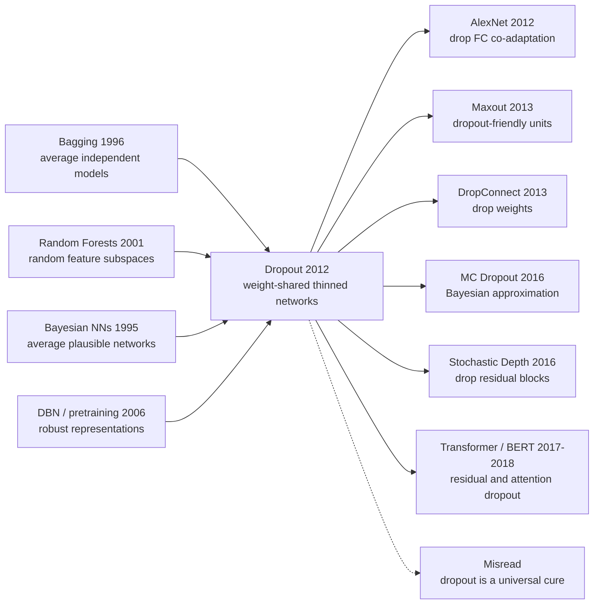

# Dropout — 随机关闭神经元，阻止特征探测器合谋

> **2012 年 7 月，University of Toronto 的 Geoffrey Hinton、Nitish Srivastava、Alex Krizhevsky、Ilya Sutskever、Ruslan Salakhutdinov 等 5 位作者把 [arXiv:1207.0580](https://arxiv.org/abs/1207.0580) 挂到网上。** 这篇题目很朴素的技术报告没有提出新层、没有新优化器，也没有更深的网络；它只是在训练时随机把一半神经元关掉。反直觉之处在于：2012 年大家刚刚学会把网络做大，Dropout 却说「每一步都故意让网络残缺」才更能泛化。这个小动作后来进入 AlexNet 的全连接层、JMLR 2014 的完整论文、Transformer 和 BERT 的默认配置，成为深度学习复兴期最便宜也最耐用的正则化发明之一。

## 一句话总结

Hinton、Srivastava、Krizhevsky、Sutskever、Salakhutdinov 等 5 位作者在 2012 年 arXiv 技术报告、2014 年 JMLR 完整版中提出的 Dropout，把过拟合问题从「给权重加一个 $\lambda\lVert W\rVert_2^2$ 惩罚」改写成「每个 minibatch 都抽一个随机子网络」：$\tilde{h}=m\odot h,\;m_i\sim\mathrm{Bernoulli}(p)$，测试时用 $W_{\text{test}}=pW_{\text{train}}$ 近似平均指数级数量的共享权重模型。它替代的不是某一个坏 baseline，而是 2012 年大网络训练的三件旧工具：只靠 weight decay 的大 MLP、小网络 + early stopping、以及昂贵的独立 ensemble；在 MNIST、TIMIT、CIFAR-10 和 ImageNet 风格网络上，Dropout 稳定降低测试误差，并直接支撑了同年 [AlexNet](2012_alexnet.md) 全连接层不被过拟合吞掉。反直觉 lesson 是：Dropout 的威力不在「噪声越多越好」，而在它逼每个特征探测器脱离固定同伴独立工作；后续 [ResNet](2015_resnet.md) 用 BatchNorm 和残差结构削弱了 CNN 里的 Dropout 需求，但 Transformer / BERT / LLM 又把 0.1 左右的 dropout 带回默认训练食谱。

---

## 历史背景

### 2012 年之前：深网不是太小，而是太会记

2012 年的深度学习正在跨过一道很尴尬的门槛：网络终于能靠 GPU、ReLU、Xavier 初始化和更大的数据集训练起来，但一旦参数量超过训练样本能支撑的范围，测试集表现就会像被突然抽空。那时的主流解释不是今天熟悉的「过参数化也能泛化」，而是更朴素的经验判断：大网络记忆能力太强，尤其是全连接层，一旦没有强约束，很容易把训练集的偶然相关当成规律。

传统正则化工具当然已经存在。Weight decay 会把权重往小推，early stopping 在验证集变坏前停下，数据增强把输入空间抖一抖，bagging 训练多个模型再投票。但这些方法各有硬伤：weight decay 是连续的、温和的、很难打断特征之间的依赖；early stopping 只是在时间轴上截断，并不改变网络内部表征；bagging 虽然有效，却要求训练许多独立网络，在 2012 年 GPU 资源下代价很高。Dropout 的切入点正好卡在这里：**能不能只训练一个网络，却让它像一个巨大 ensemble 一样泛化？**

Hinton 团队对这个问题格外敏感，因为 Toronto 路线从 2006 年 DBN 开始就一直相信「模型平均」和「表征鲁棒性」。DBN / RBM 时代的办法是先做无监督预训练，让网络从数据分布里学到比较稳定的隐变量；但 AlexNet 前后的监督深网正在证明，预训练不再是唯一道路。于是问题从「怎样预训练」变成「怎样让一个巨大的监督网络不把训练集背下来」。Dropout 正是在这个缝隙里出现的：它不像 DBN 那样重建输入，也不像 weight decay 那样只惩罚参数大小，而是直接在每次训练时破坏网络的协作结构。

### Hinton 团队为什么把「随机失活」当成集成学习

Dropout 论文里最有辨识度的词是 **co-adaptation of feature detectors**。这不是一个华丽的新数学概念，而是一个非常工程化的观察：在大网络里，一个隐藏单元可能只在另外几个特定隐藏单元也出现时才有用。这样的「合谋」在训练集上很好看，因为多个特征可以一起记住某些细碎模式；到了测试集，任何一个同伴失效，整套组合就崩掉。

随机把一半隐藏单元关掉，听起来像粗暴破坏网络容量；但从 ensemble 角度看，它是在训练指数级数量的子网络。若一层有 $n$ 个可 dropout 的单元，理论上有 $2^n$ 个 possible thinned networks。关键是它们共享同一套权重，所以训练成本没有变成指数级。每个 minibatch 只看到其中一个子网络，所有子网络又在参数层面互相约束。这个观点解释了为什么 Dropout 不只是「加噪声」：输入噪声或权重噪声通常只是在局部扰动函数，Dropout 则是在每一步改变网络拓扑。

这个想法也和 Hinton 早年对模型组合的兴趣相连。2002 年 Hinton 就写过 model combination and neural networks，Breiman 的 bagging 和 random forests 也早已说明随机子模型平均能降低方差。Dropout 把这些传统 ensemble 直觉翻译成深度网络语言：不用训练 100 个模型，只要在一个模型内部不断抽取子结构，最后用一个缩放后的完整网络近似平均。这个近似当然粗糙，但它在当年的工程环境里刚刚好：简单、可微、几乎不改训练框架，却能立刻减轻过拟合。

### 和 AlexNet 同年出现的工业/学术窗口

Dropout 和 AlexNet 的时间关系很重要。Dropout arXiv 版本上传于 2012 年 7 月，AlexNet 在 NeurIPS 2012 发表；作者名单也有重叠，Krizhevsky、Sutskever 和 Hinton 同时站在 ImageNet 革命中心。AlexNet 最著名的亮点常被概括成 GPU + ReLU + 大数据 + CNN，但论文里的全连接层用了 dropout，这不是边角料。一个 6000 万参数的网络，在 120 万张 ImageNet 训练图上仍然会过拟合，尤其最后几层参数极其密集；Dropout 让这些层能够吃下大容量而不完全记忆训练集。

学术环境也在转向「大监督模型」。2006-2011 年深度学习还常需要用无监督预训练证明自己能优化；2012 年后，ReLU、GPU、数据规模和 SGD 工程经验让直接训练大网络变得可信。随之而来的第一反应就是过拟合。Dropout 几乎完美匹配了这个新阶段：它不是为小模型提一点正则，而是专门服务于「模型比数据大得多」的时代。

也正因为如此，Dropout 后来的影响范围比论文实验更广。它先进入大 MLP 和 CNN 的全连接层，再进入 RNN 语言模型的 locked dropout / variational dropout，最后变成 Transformer 里的 residual dropout、attention dropout、embedding dropout。不同架构对它的依赖程度不同：ResNet + BatchNorm 时代的卷积主干并不总需要高 dropout，但 NLP 和 Transformer 仍长期保留小比例 dropout。Dropout 的历史位置就在这里：它不是深度学习复兴的唯一原因，却是 2012 年那批大模型能够放心做大的心理安全带。

---

## 方法详解

### 整体框架

Dropout 的核心框架可以压缩成一句话：**训练时随机删掉一部分单元，测试时用一个缩放后的完整网络近似所有随机子网络的平均预测**。给定某层隐藏激活 $h=f(Wx+b)$，Dropout 先抽一个与 $h$ 同形状的 Bernoulli mask，再把激活改成 $\tilde{h}=m\odot h$。这个 $\tilde{h}$ 进入下一层，反向传播时被关掉的位置也没有梯度。下一次 minibatch 会重新抽 mask，因此同一个样本在不同 epoch 里见到的是不同网络。

$$
m_i \sim \mathrm{Bernoulli}(p), \qquad \tilde{h}_i=m_i h_i, \qquad y=f_{\theta,m}(x)
$$

这里的 $p$ 是 retention probability：隐藏层常用 $p=0.5$，输入层常用 $p=0.8$ 或更高。论文的重点不是这个数值本身，而是它把一个确定性网络变成了一个随机网络族。若网络里有 $n$ 个可 dropout 的单元，mask 空间大小是 $2^n$；每次训练只访问其中一个 thinned network，但所有 thinned networks 共享权重。这就是 Dropout 能在不训练独立 ensemble 的情况下获得模型平均效果的根本原因。

| 视角 | Dropout 的选择 | 为什么重要 |
|---|---|---|
| 正则化对象 | 隐藏激活 / 输入特征 | 直接破坏特征之间的固定依赖 |
| 训练单位 | 每个样本或 minibatch 重新采样 mask | 让同一权重在许多上下文里工作 |
| 推理方式 | 完整网络 + 权重缩放 | 用一次前向近似 ensemble 平均 |
| 代价结构 | 训练成本约等于普通网络 | 不需要训练多个独立模型 |

从实现角度看，Dropout 只是在 layer forward 中插入一个乘法；从思想角度看，它改变了网络学习表征的压力。没有 Dropout 时，一个隐藏单元可以默认「我旁边的几个单元会补上我没学的东西」；有 Dropout 时，这些同伴随时可能消失，于是每个单元都被迫学习更独立、更可复用的证据。这也是标题里 preventing co-adaptation 的真实含义。

### 关键设计

#### 设计 1：Bernoulli mask 训练 —— 把一个网络变成随机子网络族

**功能**：在每次前向传播里随机保留或删除激活，让网络不能依赖固定特征组合。

Dropout 最小实现就是对激活乘一个 Bernoulli mask。对第 $l$ 层来说，普通网络是 $h^{(l)}=f(W^{(l)}h^{(l-1)}+b^{(l)})$；Dropout 网络在训练时变成：

$$
r^{(l)}_j \sim \mathrm{Bernoulli}(p), \qquad \tilde{h}^{(l)}=r^{(l)}\odot h^{(l)}, \qquad h^{(l+1)}=f(W^{(l+1)}\tilde{h}^{(l)}+b^{(l+1)})
$$

这条公式看起来简单，却有两个关键点。第一，mask 作用在激活而不是权重上，所以它天然适配任意可微 layer。第二，mask 是训练时随机采样的，不是一次性 pruning；同一个 unit 不是永久删除，而是在不同上下文中反复出现和消失。

```python
def dropout_forward(hidden, keep_prob, training, rng):
    if not training:
        return hidden
    mask = rng.bernoulli(p=keep_prob, size=hidden.shape)
    return hidden * mask

# original dropout convention: scale weights or activations at inference time
hidden = activation(linear(x))
hidden = dropout_forward(hidden, keep_prob=0.5, training=True, rng=rng)
logits = classifier(hidden)
```

| 方案 | 随机性放在哪里 | 能否阻断 co-adaptation | 训练成本 | 典型问题 |
|---|---|---|---|---|
| 无正则大网络 | 无 | 不能 | 低 | 训练误差低、测试误差高 |
| 输入噪声 | 输入像素 / 特征 | 只能影响第一层 | 低 | 对高层特征依赖无能为力 |
| 权重噪声 | 参数 | 部分能 | 中 | 需要控制噪声尺度 |
| Dropout | 隐藏激活 | 直接能 | 低 | 训练变慢、需调 keep_prob |

**设计动机**：论文真正反对的是「特征探测器抱团」。如果某个隐藏单元只在另几个特定单元存在时才有用，它在训练集上可能看似聪明，但在新样本上非常脆。Bernoulli mask 给每个单元制造了一个恶劣训练环境：你不知道哪些同事会来上班，所以必须自己携带足够信息。这种压力让表示从 brittle combination 走向 distributed evidence。

#### 设计 2：共享权重的指数级模型平均 —— 让 ensemble 变得便宜

**功能**：用一个参数集合训练大量随机子网络，近似 bagging / model averaging 的泛化收益。

如果一个可 dropout 网络有 $n$ 个单元，那么每个 binary mask 都定义一个子网络 $f_{\theta,m}$。理想 ensemble 会平均所有子网络的预测：

$$
p(y\mid x) \approx \frac{1}{2^n}\sum_{m\in\{0,1\}^n} p(y\mid x,\theta,m)
$$

直接计算这个平均不可能，训练 $2^n$ 个独立模型也不可能。Dropout 的近似是：训练时用 SGD 在 mask 空间做 Monte Carlo 抽样，每一步只更新一个子网络涉及的共享权重；测试时不显式枚举子网络，而用缩放后的完整网络作为平均预测的 cheap surrogate。它不像传统 bagging 那样把模型彼此隔离，而是让所有子网络在参数上互相借力。

```python
for x, y in loader:
    mask = sample_network_mask(model, keep_prob=0.5)
    logits = model(x, mask=mask)          # one sampled thinned network
    loss = cross_entropy(logits, y)
    loss.backward()                       # updates only active paths
    optimizer.step()

# Over training, SGD has visited many masks and tied them through shared weights.
```

| Ensemble 方案 | 子模型数量 | 参数是否共享 | 推理成本 | Dropout 的关系 |
|---|---:|---|---|---|
| 独立 bagging | $K$ | 否 | $K$ 次前向 | 最干净但昂贵 |
| Random forest | 许多树 | 部分不共享 | 多棵树投票 | 随机子结构思想前身 |
| Snapshot ensemble | 多个 checkpoint | 部分共享训练轨迹 | 多次前向 | 后来的折中路线 |
| Dropout | 理论上 $2^n$ | 是 | 1 次前向近似 | 最便宜的神经 ensemble |

**设计动机**：Dropout 不是为了模拟一个完美 Bayesian posterior，也不是为了给每个子模型充分训练；它追求的是一个工程上可承受的 ensemble bias。共享权重让子网络不能各自走向完全不同的函数，这会降低 ensemble 多样性，但也把训练成本压到普通 SGD 的量级。2012 年这个 trade-off 极有价值，因为算力远不允许频繁训练大网络 ensemble。

#### 设计 3：测试时权重缩放 —— 用一个确定性网络近似随机平均

**功能**：在 inference 阶段取消随机 mask，用完整网络加权重缩放保持激活期望一致。

原始论文采用的是 test-time weight scaling：训练时若某单元以概率 $p$ 保留，那么测试时使用所有单元，但把 outgoing weights 乘以 $p$。等价地，现代实现常用 inverted dropout：训练时把保留的激活除以 $p$，测试时什么都不做。两者只是在缩放发生的时间不同，目标都是让下一层收到的期望输入保持一致。

$$
\mathbb{E}[\tilde{h}_i]=\mathbb{E}[m_i h_i]=p h_i, \qquad W_{\text{test}}=pW_{\text{train}}
$$

如果不做这个缩放，测试时所有单元同时打开，下一层输入会系统性变大，导致训练/测试分布不匹配。权重缩放是 Dropout 能从随机训练切回确定性推理的桥。

```python
def inverted_dropout(hidden, keep_prob, training, rng):
    if not training:
        return hidden
    mask = rng.bernoulli(p=keep_prob, size=hidden.shape)
    return hidden * mask / keep_prob

# Modern convention: inference is just the ordinary full network.
train_hidden = inverted_dropout(hidden, keep_prob=0.5, training=True, rng=rng)
test_hidden = inverted_dropout(hidden, keep_prob=0.5, training=False, rng=rng)
```

| 缩放方式 | 训练时 | 测试时 | 优点 | 风险 |
|---|---|---|---|---|
| 原始 Dropout | 不缩放激活 | 权重乘 $p$ | 与论文表述一致 | 推理代码需特殊处理 |
| Inverted Dropout | 激活除以 $p$ | 不改网络 | 现代框架默认 | 训练激活方差更大 |
| 不缩放 | 不缩放 | 不缩放 | 实现最简单 | train/test 分布错位 |
| Monte Carlo Dropout | 保留随机 mask | 多次采样平均 | 可估计不确定性 | 推理成本上升 |

**设计动机**：论文要解决的是「训练时随机、测试时稳定」的矛盾。完全 Monte Carlo averaging 更接近理论 ensemble，但需要多次前向；完全不缩放又会让网络在测试时看到从未训练过的激活尺度。权重缩放是一个非常 2012 年的工程选择：牺牲一点理论精确性，换取几乎零额外成本的推理。

#### 设计 4：与大网络、max-norm、高学习率配套 —— Dropout 不是孤立开关

**功能**：把随机失活放进一整套训练食谱里，让被削弱的网络仍然有足够容量和优化动力。

Dropout 会让每一步参与计算的网络变小，因此它通常需要更大的原始网络、更长训练时间和更强优化设置。JMLR 版论文明确建议配合 large nets、较高 learning rate、momentum、max-norm constraint 使用。直觉是：Dropout 降低有效容量，如果原网络本来就小，再随机砍掉一半单元，模型会欠拟合；如果原网络足够大，Dropout 则把多余容量转化成 ensemble 多样性。

$$
w \leftarrow \min\left(1, \frac{c}{\lVert w\rVert_2}\right) w \quad \text{after an update when } \lVert w\rVert_2>c
$$

max-norm 的作用是防止某些权重为了抵消随机删除而变得过大。Dropout 本身会制造噪声，高学习率和 momentum 让优化能穿过噪声，max-norm 则给参数大小加一道硬栏杆。这个组合后来没有全部保留下来，但在 2012-2014 年的全连接网络和 maxout 网络里非常关键。

```python
loss.backward()
optimizer.step()

with torch.no_grad():
    for weight in model.dropout_sensitive_weights():
        norm = weight.norm(dim=0, keepdim=True).clamp_min(1e-8)
        scale = torch.clamp(max_norm / norm, max=1.0)
        weight.mul_(scale)
```

| 配套组件 | Dropout 前的作用 | 与 Dropout 的协同 | 后来命运 |
|---|---|---|---|
| 大隐藏层 | 提供容量 | 被随机抽薄后仍够表达 | 继续保留 |
| Momentum | 加速 SGD | 平滑 mask 噪声下的更新 | 继续保留 |
| Max-norm | 限制权重爆大 | 防止对少数路径过度依赖 | 被 Adam/Norm 层部分替代 |
| Maxout | 灵活 piecewise linear 单元 | 特别适合和 dropout 组合 | 历史影响大于当代使用 |

**设计动机**：Dropout 常被误解成一个可以独立打开的 regularization knob，但原论文的经验更细：它改变了容量、噪声和优化三者的平衡。一个很小的网络加 dropout 会更弱；一个很大的网络加 dropout 才会把「冗余参数」转化成「鲁棒子网络」。这也是它在 AlexNet 全连接层、MLP、RNN、Transformer 中有效，而在某些现代 CNN 主干里反而不总是必要的原因。

---

## 失败案例

### Baseline 1：只靠 weight decay 的大网络

Dropout 最直接打败的 baseline 是「大网络 + L2 weight decay」。在 2012 年，这几乎是监督神经网络默认正则化：如果模型过拟合，就把权重压小一点。问题是，weight decay 惩罚的是参数幅度，而 co-adaptation 是功能关系。一个特征可以用很小的权重依赖另一个特征；只要这种依赖在训练集上稳定，L2 并不会真的拆开它们。

Dropout 的优势在于它不问权重大小，而是随机破坏上下文。某个单元即使权重很小，只要它只在固定同伴存在时才有用，就会在 mask 变化中暴露脆弱性。换句话说，L2 是「别把任何一根线拉太粗」，Dropout 是「别假设某根线一定存在」。这就是为什么论文里很多改进不是来自更强的训练集拟合，而是来自 train/test gap 的收缩。

### Baseline 2：小网络 + early stopping

第二个旧 baseline 是把模型做小，再靠 early stopping 避免记忆训练集。这种策略在小数据时代合理：容量少一点，训练短一点，过拟合就少一点。但它牺牲的是表示能力。深度学习复兴的核心趋势恰好相反：AlexNet、maxout、后来的 ResNet 都证明，很多任务需要更大的模型才能装下有用的层级特征。

Dropout 的反直觉处在于，它不是把大网络永久变小，而是让大网络在训练时临时变小、在测试时完整回来。这样模型仍保留大容量，但每个参数都必须在许多被抽薄的上下文中经受训练。相较于 small net + early stopping，Dropout 给出的答案不是「少学一点」，而是「在更差的条件下学得更鲁棒」。

### Baseline 3：独立 ensemble / bagging

从泛化角度看，传统 ensemble 是 Dropout 的强 baseline。训练多个独立网络再平均，通常能显著降低方差，而且理论直觉很清楚。但 2012 年的问题是成本：如果 AlexNet 级别模型已经需要多天 GPU 训练，训练 10 个独立模型并不现实；即使训练得起，推理时也要多次前向。

Dropout 对 ensemble 的改写非常务实。它承认独立模型平均更干净，但用共享权重换取成本优势。这个 trade-off 有代价：Dropout 子网络之间相关性更强，不可能像完全独立 ensemble 那样多样。但它胜在便宜到可以默认开启。正因为便宜，Dropout 才能从论文技巧变成工程习惯。

### Baseline 4：无监督预训练路线

2006-2011 年，深度网络常靠 RBM / autoencoder 预训练获得好初始化，再做 supervised fine-tuning。这个路线解决的是优化和表示学习问题，但不专门解决大监督网络的 co-adaptation。到了 2012 年，ReLU、GPU 和更好的初始化让直接监督训练变得可行，预训练的中心地位开始下降。

Dropout 是这个转折的标志之一。它不需要先学一个生成模型，不需要 Gibbs sampling，也不要求每层贪心训练；它直接插入监督训练过程，在 classifier 本身上施加随机子网络压力。它失败的 baseline 不是预训练「完全没用」，而是预训练作为深网泛化主路线的必要性被削弱了。

| Baseline | 当年的合理性 | Dropout 暴露的问题 | 结果形态 |
|---|---|---|---|
| Weight decay | 简单、便宜、默认可用 | 惩罚权重大小但不拆 co-adaptation | train/test gap 仍大 |
| Small net + early stopping | 控制容量直接 | 容量不足，错过大模型收益 | 欠拟合风险高 |
| Independent ensemble | 泛化强、直觉清楚 | 训练与推理太贵 | 难成为默认配置 |
| Unsupervised pretraining | 解决早期优化难题 | 不再是监督大网的必要入口 | 被直接训练路线挤压 |

---

## 实验关键数据

### MNIST / TIMIT / CIFAR-10：不是一次榜单横扫，而是规律性改进

Dropout 的实验说服力不在某一个惊天榜单，而在跨任务的一致性。论文覆盖手写数字、语音帧分类、文本分类、CIFAR-10、小规模人脸和 ImageNet 风格大网络。每个数据集的设置都不完全相同，但共同模式很清楚：模型容量越大、训练样本相对越少、全连接层越密，Dropout 越容易把测试误差往下拉。

在 MNIST 上，普通神经网络已经很强，Dropout 的绝对改进不会像 AlexNet 那样戏剧化，但它能把错误率从约 1.6% 降到约 1.3% 左右；配合更大的网络和 max-norm 后，数字还能继续下降。这个结果的意义不是「MNIST 被解决」，而是说明 Dropout 不只适用于图像大模型，也能在经典小数据上稳定减少过拟合。

### 论文里真正有说服力的数字

更重要的是 TIMIT、CIFAR-10 和 ImageNet 这类更接近真实任务的场景。TIMIT 语音识别里，Dropout 对全连接声学模型带来约 1 个百分点量级的帧错误率下降；CIFAR-10 上，Dropout 与更大网络、maxout 后续工作形成组合，推动小图像分类从「容易过拟合的 MLP/CNN」走向更可靠的监督训练；ImageNet 中，AlexNet 的 fully connected layers 使用 dropout，帮助一个 6000 万参数模型在 120 万训练图上保持泛化。

| 数据 / 场景 | 无 Dropout baseline | Dropout 后的典型结果 | 读数方式 |
|---|---:|---:|---|
| MNIST MLP | 约 1.6% test error | 约 1.25-1.35% | 小数据上稳定缩小泛化差距 |
| TIMIT acoustic model | 约 22-23% frame error | 约低 1 个百分点 | 语音全连接层受益明显 |
| CIFAR-10 | 中十位数错误率 | 小幅但稳定下降 | 需与更大网络/数据增强配合 |
| ImageNet / AlexNet FC layers | 严重过拟合风险 | 训练更久但泛化更好 | 支撑 60M 参数模型落地 |
| 文本分类 / RCV1 | 稀疏高维特征易过拟合 | 测试误差下降 | Dropout 不局限于视觉 |
| 训练时间 | 普通网络更快收敛 | 常需更多 epoch | 用时间换泛化 |

这些数字今天看起来不夸张，因为现代基准动辄以十几个百分点改进讲故事。但 Dropout 的价值在于它几乎不改变模型结构，几行代码就能跨数据集降低测试误差。2012 年之后，研究者逐渐形成一种新直觉：当一个大网络在训练集上很快变好、验证集却不动时，第一反应不再只是减小网络，而是先尝试 dropout、数据增强、norm 约束和更长训练。这种训练习惯的改变，比任何单个表格数字都更长寿。

---

## 思想史脉络

### 前世：随机删除特征从 bagging 走向神经网络

Dropout 的祖先不是某一篇神经网络论文，而是一整条「随机子模型平均」传统。Bagging 证明了对不稳定学习器做 bootstrap 平均可以降低方差，Random Forest 把随机样本和随机特征子集做成强分类器，Bayesian neural networks 则从概率角度强调对许多模型假设做平均。Dropout 把这些想法压进一个可微网络内部：不再显式训练许多模型，而是在一个模型里不断抽取随机子网络。



图里的关键不是箭头数量，而是 Dropout 的双重身份：它既是传统 ensemble 思想的神经网络版本，也是后来随机深度、DropConnect、MC Dropout、attention dropout 的共同祖先。它把「随机性」从数据采样和模型集合推进到网络内部结构。

### 今生：从 AlexNet 到 Transformer 的默认正则器

Dropout 的第一波现实影响来自 AlexNet 和 maxout。AlexNet 让大家看到，Dropout 能在一个真正大的视觉模型里控制全连接层过拟合；Maxout 则展示，某些激活函数甚至可以围绕 Dropout 重新设计。随后 DropConnect 把随机删除对象从 activation 换成 weight，Fast Dropout 把 Bernoulli 噪声做成高斯近似，SpatialDropout / DropBlock 又针对卷积特征图做结构化删除。

第二波影响来自序列模型。RNN 里直接每个时间步重采样 dropout 容易破坏记忆，于是出现 locked dropout、variational dropout、zoneout 等变体。Transformer 则把 dropout 拆成多个位置：embedding dropout、attention probability dropout、residual dropout、feed-forward dropout。BERT 里的 0.1 dropout 看起来不起眼，但它把 Dropout 从「大 FC 层防过拟合」带进了预训练语言模型的默认配置。

| 后续路线 | 随机删除对象 | 继承 Dropout 的部分 | 改掉 Dropout 的部分 |
|---|---|---|---|
| DropConnect | 权重 | 随机子网络思想 | 从删 unit 改成删 edge |
| MC Dropout | 推理期 mask | ensemble / Bayesian 解释 | 用多次采样估计不确定性 |
| Stochastic Depth | 残差 block | 训练许多子网络 | 从宽度随机变成深度随机 |
| DropBlock | 卷积空间块 | 破坏 co-adaptation | 删除连续区域而非独立 unit |
| Transformer dropout | attention / residual / FFN | 小噪声提升泛化 | 低比例、多位置、和 norm 共存 |

### 误读：Dropout 不是「万能防过拟合按钮」

Dropout 最常见的误读是：只要模型过拟合，就把 dropout rate 调高。这个理解忽略了 Dropout 的前提。它需要模型有足够冗余容量，需要被删除的单元之间存在可替代性，也需要优化器能承受随机噪声。若网络很小、数据很大、或者架构本身已经有 BatchNorm、残差、强数据增强和 weight decay，Dropout 可能收益很小，甚至导致欠拟合。

另一个误读是把 Dropout 当成纯粹的「噪声注入」。噪声当然存在，但它的思想史位置更接近模型平均。真正重要的是随机 mask 改变了哪些 computation paths 被训练，迫使同一套权重在许多子网络里可用。今天很多先进训练技巧不再显式叫 dropout，却仍保留这个思想：随机深度、token dropping、attention dropout、path dropout 都是在问同一个问题——如果一条路径不能保证存在，模型还能不能给出好预测？

---

## 当代视角（2026 年回看 2012）

### 站不住的假设

1. **「Dropout 是所有深网的默认强正则」** —— 已经不成立。2012-2014 年，全连接层和早期 CNN 很依赖 Dropout；但 ResNet、BatchNorm、大规模数据增强、label smoothing、AdamW 和更稳定初始化出现后，现代卷积主干常常只需要很低 dropout，甚至完全不用。Dropout 不是被淘汰，而是从「无脑高比例开启」变成「按架构位置谨慎使用」。
2. **「随机删 unit 总比权重衰减更高级」** —— 已经不成立。AdamW 把 weight decay 从 optimizer 里正确解耦后，L2 类正则重新变得强大；大模型训练中，weight decay、数据规模、早停、dropout 往往是组合关系，不是单向替代关系。Dropout 解决 co-adaptation，但不替代所有 smoothness / norm 控制。
3. **「测试时缩放完整网络就足够代表 ensemble」** —— 只能算工程近似。后来 MC Dropout 说明，若想保留不确定性信息，推理期也应采样多个 mask；普通 test-time scaling 更像均值近似，不是严格 Bayesian model average。
4. **「Dropout rate 越高泛化越强」** —— 已经被大量实践修正。高 dropout 在小数据 MLP 上可能有效，在 Transformer 预训练或大规模视觉模型中可能直接造成欠拟合。现代 LLM 甚至常在充分大数据下把 dropout 设得很低或关闭。
5. **「Dropout 的主要价值是加噪声」** —— 说得太窄。更持久的价值是随机子网络和模型平均视角；如果只理解成噪声，就解释不了 stochastic depth、DropBlock、attention dropout 这些结构化变体为什么重要。

### 时代证明的关键 vs 冗余

- **关键保留下来的部分**：随机子网络训练、共享权重 ensemble、打断 co-adaptation、训练/测试期望匹配。这些思想仍然活在 Transformer dropout、stochastic depth、drop path、MC Dropout 和各种 token dropping 方法里。
- **被弱化的部分**：隐藏层 $p=0.5$ 的经验默认值。今天不同架构位置有不同 dropout rate：attention / residual 常见 0.1 左右，卷积主干可能更低，输入特征 dropout 又是另一套逻辑。
- **被替换的配套食谱**：max-norm 和 maxout 的历史地位很高，但现代训练更多依赖 AdamW、LayerNorm、BatchNorm、residual scaling、learning-rate schedule 和数据增强。
- **被重新解释的部分**：2012 年论文主要用 ensemble 解释 Dropout；2016 年以后，Bayesian approximation、variational inference、uncertainty estimation 又给它补了一层概率解释。这层解释没有推翻原论文，而是说明同一个训练技巧可以被多个理论镜头看到。

### 如果今天重写 Dropout

如果 Hinton 团队在 2026 年重写这篇论文，正文很可能会把三个语境区分得更清楚。第一是 **regularization dropout**：训练期随机删激活，测试期确定性缩放，目标是泛化。第二是 **Bayesian / MC dropout**：推理期也采样 mask，目标是不确定性估计。第三是 **structured dropout**：按 channel、block、path、token 删除，目标是适应卷积、残差和 Transformer 架构。

实验也会完全不同。今天不会只在 MNIST/TIMIT/CIFAR-10 上证明有效，而会报告 Transformer encoder、ViT、ResNet、LLM fine-tuning、小数据迁移学习和大数据预训练的分区结果。作者也会更明确地说：Dropout 对 dense overparameterized heads 很强，对 BatchNorm-heavy CNN backbone 未必强，对大规模预训练中的高比例 dropout 需要谨慎。这样写会少一点「万能正则器」光环，但更接近现代真实经验。

---

## 局限与展望

### 作者承认的局限

原论文已经意识到 Dropout 不是免费午餐。训练会变慢，因为每一步只训练一个被抽薄的网络；超参数需要调，尤其是 retention probability、学习率、momentum、max-norm；模型通常要做得更大，否则随机删除会造成欠拟合；测试期的权重缩放只是近似，不能严格等同于平均所有子网络。

论文还承认，Dropout 的收益和任务、架构、数据规模有关。它在全连接层、稀疏高维输入和相对小数据上尤其明显，但在某些结构化模型中需要改造。这个谨慎态度很重要，因为后来的经验正好证明：Dropout 是强工具，但不是普适定律。

### 2026 视角下的局限

从今天看，Dropout 至少有五个额外局限。第一，它引入的噪声会改变优化动力学，可能让收敛变慢或让学习率更难调。第二，独立 unit dropout 不适合强局部相关的卷积特征图，随机删单个像素/位置往往太弱，因此需要 SpatialDropout 或 DropBlock。第三，在 RNN 中每个时间步独立采样 mask 会破坏时间记忆，因此必须用 locked / variational dropout。第四，在非常大数据上，过拟合本身不再是主要瓶颈，高 dropout 可能降低模型可用容量。第五，Dropout 和 normalization 层的交互并不总是干净，尤其在 BatchNorm 统计量和随机 mask 混在一起时。

还有一个更哲学的局限：Dropout 把「鲁棒」定义成对随机缺失单元鲁棒，但这不等于对分布偏移、对抗扰动、长尾类别或标注噪声鲁棒。它提升的是某种内部冗余，而不是所有泛化问题的答案。

### 已被后续工作验证的方向

后续工作基本沿三条线推进。第一条是 **删除对象结构化**：DropConnect 删权重，DropBlock 删空间块，stochastic depth 删 residual block，DropPath 删路径，token dropout 删 token。第二条是 **理论解释概率化**：variational dropout、local reparameterization、MC Dropout 把随机 mask 和 approximate Bayesian inference 联系起来。第三条是 **架构位置精细化**：Transformer 把 dropout 拆到 attention、residual、embedding、MLP 多处，小比例、多位置比单处大比例更常见。

未来的 Dropout 不太可能以「随机删一半 hidden units」的原始形式成为主角，但它的思想会继续活在随机路由、稀疏 MoE、token pruning 和 test-time uncertainty 里。只要模型比数据和任务需求更大，「让子结构不能互相过度依赖」这个问题就不会消失。

---

## 相关工作与启发

### 与 weight decay / norm 层

Weight decay 和 Dropout 的差别是连续约束 vs 离散扰动。Weight decay 让函数更平滑、参数更小；Dropout 让函数必须在随机缺失的计算图上仍然工作。现代训练里二者经常共存，尤其是 AdamW + dropout 的组合。真正的启发是：正则化不止一种语言，可以约束参数、约束激活、约束路径，也可以约束模型对上下文缺失的敏感性。

### 与 BatchNorm / LayerNorm

BatchNorm 和 LayerNorm 不是 Dropout 的替代品，但它们改变了 Dropout 的生态位。BatchNorm 给 CNN 带来稳定优化和轻微正则效果，使高比例 Dropout 在许多卷积主干中不再必要；LayerNorm 则成为 Transformer 的稳定性核心，Dropout 退到 residual / attention / MLP 的小比例辅助位置。一个实用 lesson 是：当 normalization 已经提供稳定梯度和一定噪声时，Dropout rate 应该重新调，而不是沿用 2012 年的 0.5。

### 与 Bayesian deep learning

MC Dropout 让这篇 2012 年工程论文获得了第二生命。Gal 和 Ghahramani 2016 把 dropout 解释成 deep Gaussian process 的 variational approximation，使推理期多次采样 mask 可以给出 epistemic uncertainty 的近似。这并不意味着原始 Dropout 本来就是严格 Bayesian 方法；更准确地说，它的随机子网络结构恰好可以被 Bayesian lens 重新解释。这个故事说明，好工程技巧常常先于完整理论出现。

---

## 相关资源

### 必读链接

- 论文原文：[arXiv:1207.0580](https://arxiv.org/abs/1207.0580)
- JMLR 完整版：[Dropout: A Simple Way to Prevent Neural Networks from Overfitting](https://jmlr.org/papers/v15/srivastava14a.html)
- 同时代应用：[AlexNet / ImageNet Classification with Deep Convolutional Neural Networks](https://papers.nips.cc/paper/4824-imagenet-classification-with-deep-convolutional-neural-networks)
- 直接后继：[DropConnect](https://proceedings.mlr.press/v28/wan13.html), [Fast Dropout](https://proceedings.mlr.press/v28/wang13a.html), [MC Dropout](https://proceedings.mlr.press/v48/gal16.html), [Stochastic Depth](https://arxiv.org/abs/1603.09382), [DropBlock](https://arxiv.org/abs/1810.12890)
- 实现参考：PyTorch [`torch.nn.Dropout`](https://pytorch.org/docs/stable/generated/torch.nn.Dropout.html), TensorFlow [`tf.keras.layers.Dropout`](https://www.tensorflow.org/api_docs/python/tf/keras/layers/Dropout)
- 阅读顺序建议：先读 2012 arXiv note 抓核心直觉，再读 2014 JMLR 看实验和训练建议，最后读 MC Dropout 理解为什么同一个技巧后来能进入不确定性估计。


---

> 🌐 [English version](/en/era2_deep_renaissance/2012_dropout/) · 📚 awesome-papers project · CC-BY-NC