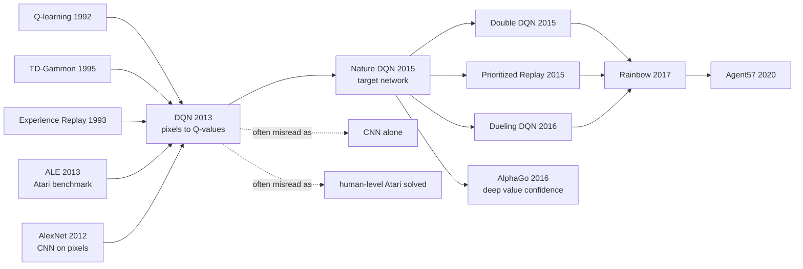

# DQN — 从像素到动作的深度强化学习第一击

> **2013 年 12 月 19 日，DeepMind 的 Volodymyr Mnih、Koray Kavukcuoglu、David Silver、Alex Graves、Ioannis Antonoglou、Daan Wierstra、Martin Riedmiller 等 7 位作者把 [arXiv:1312.5602](https://arxiv.org/abs/1312.5602) 挂上 arXiv，并带到 NeurIPS 2013 Deep Learning Workshop。**
> 这篇论文的野心不是「让 Atari 分数高一点」，而是把两个当时互相不信任的世界硬接起来：深度学习负责从 210×160 像素里抽特征，Q-learning 负责把延迟奖励折成动作价值。它只在 7 个游戏上测试，却让整个领域第一次相信：不用手工特征、不看模拟器内部状态，一个卷积网络也能直接从视频和分数中学控制策略。后来的 Nature DQN、AlphaGo、Rainbow、MuZero 和 Agent57，都是从这条「像素 → 价值函数 → 动作」的窄桥上走出去的。

## 一句话总结

Mnih、Kavukcuoglu、Silver、Graves、Antonoglou、Wierstra、Riedmiller 等 7 位作者 2013 年在 NeurIPS Deep Learning Workshop / arXiv 发表的这篇论文，把强化学习从「手工 Atari 特征 + 线性函数近似」推进到「原始像素 + 卷积 Q 网络」：用 4 帧 $84 \times 84$ 灰度图堆叠表示状态，用 CNN 一次前向输出所有合法动作的 $Q(s,a;\theta)$，再用 Bellman 目标 $L_i(\theta_i)=\mathbb{E}[(r+\gamma\max_{a'}Q(s',a';\theta_{i-1})-Q(s,a;\theta_i))^2]$ 做随机梯度更新，并靠 uniform experience replay 把强相关、非平稳的在线交互数据打散。实验只覆盖 7 个 Atari 游戏，却给出一个足够震撼的信号：同一套架构和超参数在 6 个游戏上超过 Sarsa / Contingency 等手工特征 RL baseline，在 Breakout、Enduro、Pong 上超过专家人类。它的隐藏 lesson 是：DQN 的「深」不只是 CNN，而是把视觉表征、off-policy value learning、replay buffer 和 epsilon-greedy 探索连成一个可扩展训练系统；真正稳定性还要等 2015 Nature DQN 的 target network、Double DQN 和 Rainbow 补完。没有 DQN，DeepMind 后来的 [AlphaGo（2016）](2016_alphago.md) 很难这么快相信深度价值函数能承担游戏决策核心。

---

## 历史背景

### 2013 年的强化学习和深度学习各自卡在哪

要理解 DQN 为什么像一声闷雷，得把时间放回 2013 年底。AlexNet 刚刚用 CNN 和 GPU 把 ImageNet 打穿一年，语音识别里深层网络也开始替代 GMM-HMM；但强化学习社区并没有因此立刻拥抱深度学习。原因很简单：监督学习面对的是固定数据集和清晰标签，而 RL 面对的是一个会被策略反过来改变的数据分布。智能体今天学会向左走，明天训练集里就全是左侧画面；价值函数今天高估一个动作，明天的行为策略就会把自己推到更偏的状态分布里。对深度网络来说，这不是一个小噪声，而是训练目标、训练数据和采样分布同时漂移。

当时的 Atari 研究也不缺 baseline。Bellemare、Naddaf、Veness、Bowling 2013 年提出 Arcade Learning Environment，把 Atari 2600 变成一个标准 RL testbed；此前的 Sarsa / Contingency 方法会做背景减除、按 128 色拆通道、用手工视觉特征和线性函数近似学习策略。这些方法有工程经验，也有一定解释性，但它们并没有真正回答一个更野的问题：**如果不给智能体任何对象检测器，不告诉它球、挡板、潜艇、敌人在哪里，只给它像素和分数，它能不能自己学出有用状态表示？**

深度学习社区这边同样没有现成答案。CNN 能分类 ImageNet，是因为每张图都有标签；Atari 的奖励稀疏、延迟、带噪声，而且某个动作的价值可能要几千帧之后才显现。Q-learning 本身虽然离策略、可复用经验，但一旦接上非线性函数近似，Tsitsiklis 与 Van Roy 1997 年已经提醒过：TD 学习会发散。2013 年主流看法不是「只要把 CNN 接上 Q-learning 就好」，而是「这大概率会炸」。DQN 的历史位置，就在于它把一个被理论警告、工程上不稳定的组合，第一次训出了能跨游戏工作的结果。

### 直接逼出 DQN 的前序

**Watkins 与 Dayan 1992 年的 Q-learning** 给了 DQN 最核心的 Bellman 控制方程：学习 $Q^*(s,a)$，每步选择未来回报最大的动作。它的美感是 off-policy：行为策略可以探索，学习目标仍然指向贪心策略。但它原本更适合表格状态或低维特征，不是 210×160 RGB 视频。

**Tesauro 1995 年的 TD-Gammon** 是神经网络 RL 的前一次神迹：一个一隐层 MLP 通过自对弈和 TD($\lambda$) 学到超人类西洋双陆水平。问题是，西洋双陆有骰子带来的天然探索和相对平滑的价值函数，之后二十年里，棋类、围棋、视觉控制都没复制这个奇迹。DQN 论文专门把 TD-Gammon 当成精神前辈：如果 1995 年的小网络能学 backgammon，那么 2013 年的 CNN + GPU 也许能学 Atari。

**Lin 1993 年的 experience replay** 提供了另一个被低估的零件：把过去交互过的 transition 存起来，之后随机抽样复用。这个想法在机器人 RL 里出现得很早，但在 DQN 之前并没有变成深度 RL 的核心基础设施。DQN 把 replay buffer 从一个记忆技巧升级为稳定训练的必要条件：它既提高样本复用，又把强相关序列打散，还把当前策略造成的数据分布震荡做了时间平均。

**Riedmiller 2005 年的 Neural Fitted Q Iteration** 证明过 neural Q-learning 可以用批量拟合方式工作，但代价是每轮要扫整个数据集，难以扩展到大量视觉帧。**Lange 与 Riedmiller 2010 年的 autoencoder + fitted Q** 则说明「视觉输入可以先进低维表示，再接 RL」，但表示和控制被分成两段。DQN 的一步跨越在于：不再先学一个通用 autoencoder，而是让卷积特征直接为动作价值服务。

### DeepMind 当时在做什么

2013 年的 DeepMind 还不是后来那个被 Google 收购后的巨型研究机器。它成立不久，核心野心是「general intelligence through reinforcement learning」。Demis Hassabis、Shane Legg、Mustafa Suleyman 搭了公司，内部聚集了 David Silver、Daan Wierstra、Koray Kavukcuoglu、Alex Graves 等一批既懂深度学习又懂序列决策的人。DQN 的作者名单很能说明这个交叉点：Mnih 有 Toronto / Hinton 系深度视觉背景，Kavukcuoglu 来自 LeCun 系 CNN 经验，Silver 是 RL 与博弈专家，Graves 是序列建模专家，Riedmiller 是 NFQ 代表人物之一。

这篇 workshop paper 还带着早期 DeepMind 的创业气质：实验规模很小，只有 7 个 Atari 游戏；系统也并不完美，2015 年 Nature 版才扩大到 49 个游戏并加入 target network；但论文要证明的命题非常大胆。它不说「我们为 Breakout 设计了一个策略」，而是说「同一套算法、同一套网络、同一套超参数，可以面对不同视觉游戏」。这种跨任务措辞后来成为 DeepMind 论文的固定叙事：DQN 到 AlphaGo，到 AlphaZero，再到 MuZero，都是在把某个看似 domain-specific 的系统往 general agent 方向推。

还有一个容易忽略的历史细节：DQN 的 2013 版不是一次豪华资源碾压。它的训练是 10 million frames、单个 replay memory、两层卷积的小 CNN，而不是今天动辄数千 GPU 的训练。它的说服力不来自参数量，而来自系统设计：在当时的硬件上，用一个博士生级别可理解的 pipeline，把「从像素学控制」这件事从愿景变成了可复现实验。

### 工业界 / 算力 / 数据的状态

2013 年底的硬件窗口刚刚打开。NVIDIA GPU 已经足够让 CNN 在图像上工作，Theano、cuda-convnet 这类工具能把卷积训练跑起来，但 PyTorch 还不存在，TensorFlow 也要两年后才开源。DQN 论文里的网络很克制：输入是 $84 \times 84 \times 4$，第一层 16 个 $8 \times 8$ stride 4 卷积，第二层 32 个 $4 \times 4$ stride 2 卷积，后面接 256 个 ReLU 和动作数个线性输出。这套规模小到今天像教学模型，但在当时已经足以把手工 Atari 特征推下场。

数据环境也刚刚成熟。ALE 的关键价值不是「提供游戏」，而是提供可重复评估：同样的 emulator、同样的动作接口、同样的 score，让 RL 算法终于有了类似 ImageNet 的横向比较舞台。DQN 选择的 7 个游戏覆盖不同动态：Pong 和 Breakout 相对短期、规则清晰；Seaquest、Q*bert、Space Invaders 需要更长时序规划。这个选择后来被 49-game Atari benchmark 扩大，进而成为深度 RL 近十年的共同语言。

工业界此时也正在从「深度学习能不能用」转到「深度学习能不能控制」。Google 2014 年 1 月以约 6 亿美元收购 DeepMind，距离 DQN arXiv 提交只有几周。某种意义上，DQN 是 DeepMind 给世界和 Google 的第一张技术名片：它没有解决通用智能，但它证明了一件很关键的事 —— 如果把感知和决策放进同一个可微系统里，强化学习不再只能玩低维玩具问题。

---

## 方法详解

### 整体框架

DQN 的整体 pipeline 可以概括成一句话：**把 Atari 屏幕历史压成一个固定大小的状态表示，用卷积网络一次性预测所有动作的 Q 值，再用 replay buffer 里的离策略样本做 Bellman 回归**。它不是 policy gradient，也不是 model-based planning；它完全不学习环境模型 $\mathcal{E}$，也不显式预测下一帧。智能体只问一个问题：在当前状态下，每个动作的未来折扣回报大概是多少？

核心输入是最近 4 帧经过灰度化、降采样、裁剪后的图像，形状为 $84 \times 84 \times 4$。这 4 帧非常关键，因为单帧 Atari 屏幕常常是部分可观测的：Pong 球往哪飞、Space Invaders 子弹是否可见、Seaquest 敌人从哪边来，都需要速度或短期动态。输出不是一个动作，而是一个长度等于合法动作数的向量，每个分量是 $Q(s,a;\theta)$。因此选择动作只需要一次 forward pass，而不是为每个动作单独跑一次网络。

$$
L_i(\theta_i)=\mathbb{E}_{s,a\sim \rho(\cdot)}\left[\left(y_i-Q(s,a;\theta_i)\right)^2\right],\quad y_i=r+\gamma\max_{a'}Q(s',a';\theta_{i-1})
$$

这条公式是论文的中轴。直观地说，网络当前预测 $Q(s,a;\theta_i)$，目标值来自「即时奖励 + 下一状态最优动作的折扣价值」。2013 workshop 版在理论推导里写了上一轮参数 $\theta_{i-1}$，但 Algorithm 1 的实现还没有后来 Nature DQN 那种显式 target network $\theta^-$；这是它能 work 但仍然脆弱的原因之一。

| 模块 | 输入 | 输出 | 解决的问题 |
|------|------|------|-----------|
| 预处理 $\phi$ | 原始 Atari RGB 帧 | $84\times84\times4$ 状态 | 降维、补充短期运动 |
| Q-network | 状态堆叠 | 每个动作的 Q 值 | 用 CNN 学视觉控制特征 |
| Replay memory | transition $(s,a,r,s')$ | 随机 minibatch | 打散相关性、复用数据 |
| $\epsilon$-greedy | Q 值向量 | 交互动作 | 在 exploitation 和 exploration 间折中 |

### 关键设计

#### 设计 1：Bellman 目标 + 深度 Q 网络 —— 把「看图」变成「估动作价值」

**功能**：把 Atari 控制问题写成 action-value regression。网络不是输出类别标签，也不是输出下一帧，而是输出所有动作的未来回报估计。

**核心公式**：

$$
Q^*(s,a)=\mathbb{E}_{s'\sim \mathcal{E}}\left[r+\gamma\max_{a'}Q^*(s',a')\mid s,a\right]
$$

如果把这个 Bellman 最优性方程当成监督信号，训练目标就变成让 $Q(s,a;\theta)$ 逼近 $r+\gamma\max_{a'}Q(s',a';\theta)$。这一步的反直觉点在于：label 不是数据集给的，而是网络自己和环境交互后 bootstrapping 出来的。它像监督学习，但标签会跟着网络一起动。

```python
def dqn_td_loss(q_net, states, actions, rewards, next_states, dones, gamma):
    q_values = q_net(states)                         # [batch, num_actions]
    q_sa = q_values.gather(1, actions[:, None]).squeeze(1)

    with torch.no_grad():
        next_q = q_net(next_states).max(dim=1).values # 2013 version: no separate target net
        targets = rewards + gamma * next_q * (~dones)

    return ((targets - q_sa) ** 2).mean()
```

| 做法 | 需要环境模型 | 需要手工状态 | 每步计算 | 2013 年的意义 |
|------|-------------|-------------|---------|--------------|
| 表格 Q-learning | 否 | 状态必须离散 | 查表 | 无法处理像素状态 |
| 线性 Atari RL | 否 | 需要视觉特征 | 快 | 依赖背景减除和颜色通道设计 |
| NFQ | 否 | 常用低维状态 | 批量重训 | 难扩展到大量视频帧 |
| DQN | 否 | 否，直接用像素 | 一次 CNN 前向 | 首次把深度视觉接入离策略控制 |

**设计动机**：RL 的难点不是让 CNN 看懂图片，而是让 CNN 学到「对动作选择有用」的图片表示。ImageNet 特征能识别物体，不代表能判断 Pong 球下一帧会撞到哪里。DQN 用 Bellman error 直接训练卷积特征，让每个滤波器最终服务于未来奖励，而不是服务于 reconstruction 或分类标签。这也是它区别于 autoencoder + RL 两阶段方案的根本点。

#### 设计 2：Experience replay —— 把在线交互改造成近似 i.i.d. 的训练流

**功能**：把 agent 的历史 transition 存进 replay memory，每次更新时随机抽 minibatch，而不是用最新连续帧直接做 SGD。

**核心公式**：

$$
\mathcal{D}=\{e_1,\dots,e_N\},\quad e_t=(s_t,a_t,r_t,s_{t+1}),\quad (s,a,r,s')\sim \text{Uniform}(\mathcal{D})
$$

连续 Atari 帧高度相关：前后两帧几乎一样，奖励又很稀疏。如果直接按时间顺序训练，minibatch 里会塞满同一种局面，梯度方差大，还会把网络推向当前策略刚刚制造出来的偏分布。Replay 的作用是把「最近一段行为策略的混合分布」拿来训练，既复用旧样本，也削弱新策略导致的反馈环。

```python
class ReplayMemory:
    def __init__(self, capacity):
        self.capacity = capacity
        self.buffer = []
        self.index = 0

    def add(self, transition):
        if len(self.buffer) < self.capacity:
            self.buffer.append(transition)
        else:
            self.buffer[self.index] = transition
        self.index = (self.index + 1) % self.capacity

    def sample(self, batch_size):
        indices = torch.randint(0, len(self.buffer), (batch_size,))
        return [self.buffer[i] for i in indices]
```

| 不用 replay 的在线 Q-learning | 用 replay 的 DQN | 直接收益 | 代价 |
|-----------------------------|-----------------|---------|------|
| 新样本只用一次 | transition 可被多次抽中 | 样本效率更高 | 需要大内存 |
| 连续帧强相关 | 随机 minibatch 打散相关 | SGD 更接近监督学习 | 仍非真正 i.i.d. |
| 当前策略支配训练集 | 多个历史策略混合 | 分布变化更平滑 | off-policy 偏差更明显 |
| 容易形成反馈环 | 行为分布被时间平均 | 降低振荡和发散风险 | 旧经验可能过时 |

**设计动机**：DQN 真正的稳定性并不是「深度网络够强」带来的，而是 replay memory 把 RL 数据流改造成深度学习更能消化的形状。论文自己说得很直白：当前参数决定下一批训练样本，这会让系统陷入坏的局部反馈；experience replay 把这个反馈环打松。后来的 prioritized replay、distributed replay、offline RL dataset，本质上都在扩展这一个基础设施。

#### 设计 3：像素预处理 + 全动作输出 CNN —— 让一套网络跨游戏工作

**功能**：把 Atari 原始画面压到统一输入尺度，并让网络对同一状态一次性输出所有动作价值。

**核心公式**：

$$
f_\theta:\mathbb{R}^{84\times84\times4}\rightarrow \mathbb{R}^{|\mathcal{A}|},\quad f_\theta(\phi(s))_a=Q(\phi(s),a;\theta)
$$

2013 年 DQN 的视觉处理很朴素：RGB 转灰度，缩放到 $110\times84$，裁剪成 $84\times84$，堆叠最近 4 帧。网络架构也很小：16 个 $8\times8$ stride 4 卷积、32 个 $4\times4$ stride 2 卷积、256 个全连接 ReLU、最后每个合法动作一个线性输出。它没有 residual connection，没有 batch norm，没有 attention；但它把「状态输入、动作输出」这个接口设计对了。

```python
class AtariQNetwork(nn.Module):
    def __init__(self, num_actions):
        super().__init__()
        self.encoder = nn.Sequential(
            nn.Conv2d(4, 16, kernel_size=8, stride=4), nn.ReLU(),
            nn.Conv2d(16, 32, kernel_size=4, stride=2), nn.ReLU(),
            nn.Flatten(),
            nn.Linear(32 * 9 * 9, 256), nn.ReLU(),
        )
        self.head = nn.Linear(256, num_actions)

    def forward(self, stacked_frames):
        return self.head(self.encoder(stacked_frames))
```

| 设计选择 | DQN 的做法 | 替代方案 | 为什么关键 |
|----------|------------|----------|------------|
| 输入 | 4 帧堆叠 | 单帧输入 | 单帧无法表达速度和短时动态 |
| 特征 | CNN 自学 | 背景减除 + 颜色手工特征 | 避免 game-specific prior |
| 动作估值 | 一次输出全部动作 | 每个动作跑一次网络 | 计算从 $O(|A|)$ 降到一次 forward |
| 跨游戏 | 同架构同超参数 | 每个游戏调一套 | 支撑 general agent 叙事 |

**设计动机**：Atari 游戏的动作空间很小，通常 4 到 18 个合法动作。既然动作数不大，把动作当作输出维度比把动作拼进输入更高效。这个接口后来几乎变成离散动作 value-based deep RL 的标准模板：状态进网络，动作价值整排出来，argmax 直接给策略。它也解释了为什么 DQN 对连续控制不自然；连续动作无法枚举，后续 DDPG / SAC 才用 actor-critic 解决。

#### 设计 4：奖励裁剪、探索退火与帧跳过 —— 用工程约束换跨游戏鲁棒性

**功能**：把不同 Atari 游戏的奖励尺度、动作频率和探索过程压到同一个训练 recipe 里，让一套超参数尽可能不崩。

**核心公式**：

$$
\tilde r=\text{clip}(r,-1,1),\quad \epsilon_t:1.0\rightarrow0.1\;\text{over first }10^6\text{ frames}
$$

奖励裁剪是 DQN 论文里很容易被轻描淡写的一步。不同游戏的原始分数尺度差异巨大，如果直接回归原始 reward，TD error 的尺度会随游戏变化，学习率也要跟着重调。把正奖励裁成 +1、负奖励裁成 -1、零奖励不变，牺牲了奖励大小信息，却换来一个跨游戏可复用的优化尺度。

```python
def select_action(q_net, state, epsilon, action_space):
    if torch.rand(()) < epsilon:
        return action_space.sample()
    with torch.no_grad():
        return int(q_net(state[None]).argmax(dim=1).item())

raw_reward = env.step(action).reward
reward = max(-1.0, min(1.0, raw_reward))
```

| 工程旋钮 | 论文设置 | 解决的问题 | 隐含代价 |
|----------|----------|------------|----------|
| Reward clipping | 正数→1，负数→-1，0 不变 | 统一 TD error 尺度 | 丢失不同得分的偏好强度 |
| $\epsilon$ annealing | 1.0 到 0.1，前 100 万帧 | 早期充分探索 | 后期仍有随机扰动 |
| Replay capacity | 最近 100 万帧 | 保留多策略经验 | 覆盖慢、占内存 |
| Minibatch | 32 | 稳定 SGD | 小 batch 噪声仍大 |
| Frame skipping | 通常 $k=4$，Space Invaders 用 3 | 降低决策频率、提速 | 可能错过闪烁目标 |

**设计动机**：DQN 的目标不是为每个 Atari 游戏榨干最优分数，而是证明一个通用 recipe 可以横跨多个游戏。为了这个目标，作者宁愿用 reward clipping 这种今天看起来粗暴的归一化，也不愿为每个游戏手调 reward scale。它把「优化稳定性」放在「保留完整任务语义」之前，这个取舍后来长期影响 Atari benchmark。

### 损失函数 / 训练策略

DQN 的训练循环很短，但每一步都在压制一个 RL 特有的不稳定源：相关样本、非平稳目标、稀疏奖励、探索不足、跨游戏尺度不一致。论文最重要的工程 lesson 是：深度 RL 不是把一个 loss 写对就完事，而是让数据生成、样本缓存、目标计算、探索策略和网络结构一起工作。

| 训练部件 | 2013 DQN 的选择 | 主要作用 | 后续改进 |
|----------|----------------|----------|----------|
| Optimizer | RMSProp | 处理非平稳 TD error | Adam / tuned RMSProp |
| Target | 当前/上一轮 Q 目标，无独立 target network | 提供 Bellman bootstrap | Nature DQN 的 $\theta^-$ |
| Replay sampling | Uniform | 简单、稳定、可扩展 | Prioritized replay |
| Overestimation control | 无 | $\max$ 容易高估 Q 值 | Double DQN |
| Value representation | 标量 Q 值 | 直接贪心控制 | Dueling / distributional RL |

一个简化后的完整训练循环如下：

```python
for frame in range(num_frames):
    epsilon = schedule(frame)
    action = select_action(q_net, state, epsilon, env.action_space)
    next_state, reward, done = env.step(action)
    memory.add((state, action, clip_reward(reward), next_state, done))
    state = reset_if_done(next_state, done)

    if len(memory.buffer) >= warmup_size:
        batch = collate(memory.sample(batch_size=32))
        loss = dqn_td_loss(q_net, *batch, gamma=0.99)
        optimizer.zero_grad()
        loss.backward()
        optimizer.step()
```

这段伪代码看似普通，但在 2013 年它连接了三个此前分散的信念：CNN 可以从像素学表征，Q-learning 可以离策略 bootstrap，replay 可以让在线 RL 更像批量深度学习。DQN 的论文贡献不在单个新公式，而在把这些零件放到一个最小可用系统里，并且用同一套系统跨游戏跑通。

---

## 失败案例

### 当时输给 DQN 的对手

DQN 的失败案例不是「作者试了三个模型都不行」那种 ablation，而是更有历史意味：它把 2013 年前 Atari RL 的几条主流路线都逼成了 baseline。那些方法并不幼稚，它们代表了当时合理的工程常识：用手工视觉特征降低像素难度，用线性函数近似换稳定性，用批量 fitted Q 避免在线 TD 的发散，用演化算法避开梯度。DQN 的胜利在于，它证明这些保护层有时反而是天花板。

| Baseline | 核心做法 | 输在哪里 | DQN 的替代 |
|----------|----------|----------|------------|
| Sarsa + hand features | 背景减除、颜色通道、线性价值函数 | 特征靠人设计，跨游戏迁移弱 | CNN 直接从像素学特征 |
| Contingency awareness | 学哪些屏幕区域受 agent 控制 | 仍依赖预处理和对象先验 | end-to-end Q 值学习 |
| Neural Fitted Q | 批量重训 Q 网络 | 每轮成本随数据集增长 | replay + minibatch SGD |
| Autoencoder + RL | 先学视觉压缩再做控制 | 表征不一定服务动作价值 | Bellman error 直接训练视觉层 |
| HNeat / evolution | 演化策略或 exploit 固定轨迹 | 可利用确定性，不保证鲁棒 | $\epsilon$-greedy 平均表现评估 |

最关键的对比是 Sarsa 和 Contingency。这两类方法在 ALE 早期很强，因为它们把视觉问题变得更像传统控制：先找背景，按颜色区分对象，再把这些设计好的 feature 喂给线性 learner。DQN 反过来说：如果 CNN 已经能从 ImageNet 学视觉层次，那 Atari 的对象、速度、碰撞关系也应该能从 reward signal 里被逼出来。这个判断在 2013 年很冒险，因为 reward signal 比 ImageNet label 稀疏得多。

### 作者论文里承认的失败和风险

DQN 论文并不把自己包装成完美系统。相反，它很清楚哪些地方是硬伤：uniform replay 可能浪费更新，reward clipping 会改变任务偏好，Q-learning + 非线性函数近似没有收敛保证，长时序游戏仍然离人类很远。这些承认后来几乎都变成了后续论文的研究议程。

| 论文中的弱点 | 当时的处理 | 后来怎样修补 | 为什么重要 |
|--------------|------------|--------------|------------|
| 非线性 Q-learning 可能发散 | 用 replay 降低相关性 | target network、Double DQN | 稳定性是 deep RL 第一难题 |
| Uniform replay 不分重要性 | 随机抽样 | prioritized replay | 稀有高 TD-error 经验更有学习价值 |
| Reward clipping 丢失尺度 | 为跨游戏共享学习率 | distributional / value rescaling | 原始回报语义被压扁 |
| 长时序策略弱 | 只用 4 帧和 Q 值 bootstrap | recurrent agents、exploration bonuses | Seaquest / Q*bert 暴露规划短板 |

这也是 DQN 最值得尊敬的地方：它不是一篇把所有问题都解决的论文，而是一篇把问题重排优先级的论文。在它之前，大家担心「深度网络能不能进 RL」；在它之后，问题变成「怎么让 replay 更聪明、target 更稳定、exploration 更长程、value 更不高估」。研究议程被整体改写了。

### 2013 年的反例：HNeat 和 game exploits

论文里 HNeat 的比较很有意思，因为它提醒读者：Atari 分数不等于通用控制能力。HNeat 可以在某些游戏里通过演化找到非常高的单局 deterministic exploit，尤其是在固定初始条件和可重复序列下。但 DQN 的评估是 $\epsilon=0.05$ 的平均表现，意味着它必须在随机扰动和多种轨迹下保持策略有效。

| 对比点 | HNeat 类方法 | DQN | 解释 |
|--------|-------------|-----|------|
| 训练方式 | 演化策略 / 神经结构 | 梯度更新 Q 网络 | 一个搜索策略，一个学价值函数 |
| 输入先验 | 可用对象检测或特殊颜色图 | 原始屏幕预处理 | DQN 的 prior 更少 |
| 评估 | 常看 best episode | 平均 episode score | 平均分更接近鲁棒控制 |
| Space Invaders | exploit baseline 可更高 | DQN 平均 581 | DQN 不是所有单项都赢 |

这个反例让 DQN 的贡献更清楚：它不是证明「CNN 在每个 Atari 游戏上都已经最强」，而是证明「一个通用、可训练、从像素到动作的 pipeline 可以稳定超过大多数手工 RL baseline」。在科学叙事上，这比单个游戏最高分更重要。

### 真正的反 baseline 教训：深度 Q-learning 为什么本该发散

从理论角度看，DQN 最强的失败案例其实是它自己：Q-learning + function approximation + off-policy learning，被 Sutton 社区后来称为 deadly triad。三者同时存在时，bootstrapping 目标来自自身估计，数据来自非当前目标策略，函数近似又会把一个状态上的误差扩散到其他状态。2013 年把 CNN 放进这个三角里，本来就是在引爆炸药包。

DQN 之所以没有炸，是因为它给 deadly triad 加了几层缓冲：replay 打散样本，RMSProp 控制梯度尺度，reward clipping 限制 TD error，$\epsilon$-greedy 保持探索，CNN 输出所有动作让策略选择计算稳定。但这些都不是严格收敛证明。后续 Double DQN、target network、dueling、distributional RL 和 Rainbow 的价值，就是把这个「能跑但脆」的系统一点点加固。

## 实验关键数据

### 主表：7 个 Atari 游戏的平均分

DQN 2013 版的实验规模今天看起来很小：只测 7 个游戏，训练 10 million frames，评估时用 $\epsilon=0.05$ 的策略跑固定步数。但在当时，这组结果足以改变信念。重点不是每个数字都达到人类水平，而是同一套架构和超参数在多个视觉动态完全不同的游戏上工作。

| 游戏 | DQN 平均分 | DQN best | 专家人类 | 结论 |
|------|-----------|----------|----------|------|
| Beam Rider | 4092 | 5184 | 7456 | 接近人类，明显超过早期 RL baseline |
| Breakout | 168 | 225 | 31 | 超过人类，最具传播力的成功案例 |
| Enduro | 470 | 661 | 368 | 超过人类，显示持续控制能力 |
| Pong | 20 | 21 | 9.3 | 超过人类，接近满分策略 |
| Q*bert | 1952 | 4500 | 18900 | 离人类很远，长程策略不足 |
| Seaquest | 1705 | 1740 | 28010 | 离人类很远，氧气/救人等长期目标难学 |
| Space Invaders | 581 | 未稳定报告 | 3690 | 平均优于多种 RL baseline，但不敌某些 exploit 设置 |

论文摘要里那句「6 个游戏超过此前方法、3 个超过专家人类」就是从这张表来的。最有戏剧性的不是 Pong，而是 Breakout：它让外界第一次看到一个从像素输入开始的 RL agent 学会「打砖块」这种肉眼可理解的策略。

### 训练稳定性和价值函数可视化

论文还给了两类稳定性证据。第一类是训练曲线：episode reward 很噪，因为策略的小变化会改变访问状态分布；但固定 held-out states 上的平均最大预测 Q 值更平滑，显示网络确实在逐步提高对未来回报的估计。第二类是 Seaquest 的价值函数可视化：敌人出现、发射鱼雷、击中敌人时，预测 value 会随事件起伏，而不是只记住静态画面。

| 证据 | 论文观察 | 说明 | 局限 |
|------|----------|------|------|
| Breakout reward curve | 噪声大但总体上升 | RL 评估本身高方差 | episode score 难做早停信号 |
| Seaquest reward curve | 同样噪声明显 | 策略改变会改变状态分布 | 无法单独证明收敛 |
| Held-out max Q | 曲线更平滑 | value estimate 在持续改善 | 可能高估，不等于真实回报 |
| Seaquest value frames | 敌人出现和击中时 value 起伏 | 网络学到部分事件语义 | 只是局部可视化，不是机制解释 |
| 无发散报告 | 7 个游戏都能训练 | replay + clipping 有效 | 不代表理论保证 |

这组稳定性证据在今天看会显得朴素，但它解决了当时最关键的怀疑：深度网络接 TD target 会不会直接崩掉？DQN 的回答是：没有理论保证，但在 Atari 上，通过 replay 和若干工程约束，它可以稳定到足以产生策略。

### 关键发现

DQN 实验的核心发现可以分成四层。第一，它证明 CNN 可以从 reward 监督里学到控制相关视觉特征；第二，它证明 uniform replay 足以把 online RL 数据变成可训练流；第三，它证明同一套超参数跨游戏不是幻想；第四，它也诚实暴露了长时序、稀疏奖励和 value overestimation 的问题。

| 发现 | 支撑数据 | 重要性 | 后续走向 |
|------|----------|--------|----------|
| 从像素到动作可行 | 7 游戏同架构训练 | 打破手工特征依赖 | Nature DQN 扩到 49 游戏 |
| Replay 是稳定关键 | 无发散、Q 曲线平滑 | deep RL 基础设施化 | prioritized / distributed replay |
| 人类水平不是全面达成 | 3 个超过人类，3 个远落后 | 避免过度宣传 | Agent57 才全 57 游戏超过人类 benchmark |
| 2013 DQN 仍很脆 | 无 target network、无 Double Q | 留下改进空间 | Rainbow 组合式修补 |

从科学史角度看，DQN 的实验不是「最终答案」，而是「足够强的反例」：它反驳了深度网络无法稳定接入 RL、原始像素必须先手工抽特征、Atari 只能靠 game-specific engineering 的三个默认判断。深度 RL 的十年热潮，就是从这个反例展开的。

---

## 思想史脉络



### 前世（被谁逼出来的）

DQN 的前世不是单线谱系，而是五股线同时交汇。**Q-learning** 给了它 off-policy Bellman control；**TD-Gammon** 给了它「神经网络也能学价值函数」的历史信念；**experience replay** 给了它稳定在线 RL 数据流的记忆机制；**ALE** 给了它可比较、可复现、跨游戏的评测舞台；**AlexNet 后的 CNN** 给了它从原始像素学习层级表示的技术自信。少掉任何一股，DQN 都很可能只是一个失败的 workshop 实验。

最容易被忽略的是 ALE。没有 ALE，DQN 可能只是一篇「我们在 Pong 上做了个 CNN agent」的演示；有了 ALE，它才能说「同一套算法跨多个游戏」。这正是 benchmark 的思想史作用：它把一个方法从单点技巧变成可横向比较的范式候选。ImageNet 对 CNN 做过这件事，ALE 对 deep RL 做了缩小版但同样关键的一次。

另一个前世是失败本身。Tsitsiklis 与 Van Roy 关于 TD + function approximation 的发散结果，并不是 DQN 的反面教材，而是它的压力来源。DQN 没有否认这个理论风险，而是用 replay、clipping、RMSProp、frame stacking 和小心的评估 protocol 给出一个工程反例：在某些高维控制任务上，deadly triad 可以被压住，哪怕还没有被证明消灭。

### 今生（继承者）

DQN 的继承者可以分成几条支系。第一条是**稳定性修补**：Nature DQN 加 target network，Double DQN 降低 max over actions 带来的过估计，prioritized replay 让 replay buffer 更会挑样本，dueling network 把 value 和 advantage 拆开，Rainbow 把这些改进合在一起。第二条是**从离散动作扩展到连续控制**：DDPG、TD3、SAC 借走 replay 和 target network，但把策略改成 actor-critic。第三条是**从 model-free 走向 planning / world model**：MuZero、EfficientZero、DreamerV3 不再只学 Q 值，而是学习可用于规划或想象 rollout 的内部模型。

| 继承路线 | 代表工作 | 继承 DQN 的哪一部分 | 解决的新问题 |
|----------|----------|--------------------|--------------|
| 稳定 value learning | Nature DQN / Double DQN / Rainbow | replay、Q-learning、Atari protocol | target 漂移、Q 过估计、样本优先级 |
| 连续控制 | DDPG / TD3 / SAC | replay + target network | 动作不可枚举 |
| 分布式 RL | Ape-X / R2D2 / Agent57 | 大 replay + Q-learning | 探索和吞吐量 |
| 搜索与规划 | AlphaGo / MuZero | 深度价值函数信心 | 复杂游戏中的 lookahead |
| 样本效率 | Atari 100k / EfficientZero | Atari benchmark | 10M frames 太贵 |

DQN 对 AlphaGo 的影响尤其微妙。AlphaGo 的技术主角是 policy network、value network 和 MCTS，不是 Q-learning；但 DQN 给了 DeepMind 一个内部信念：深度网络可以从高维游戏状态学出可用于决策的价值估计。2016 年 AlphaGo 论文里价值网络 $v_\theta(s)$ 的心理前提，某种程度上来自 DQN 在 Atari 上的成功。

### 误读 / 简化

第一个常见误读是：**DQN = CNN + Q-learning**。这句话不算错，但太短。真正让它 work 的是系统组合：frame stacking 解决部分可观测，CNN 解决视觉表示，Q-learning 解决动作价值，replay 解决样本相关，reward clipping 解决跨游戏尺度，$\epsilon$-greedy 解决早期探索。如果只拿 CNN 接在线 TD，十有八九会得到一个发散或高度不稳定的 agent。

第二个误读是：**DQN 已经「解决 Atari」**。2013 版只测 7 个游戏，且在 Q*bert、Seaquest、Space Invaders 上离人类很远；2015 Nature 版扩到 49 个游戏后，也不是所有游戏都超人类。真正做到 Atari 57 游戏整体超过人类 benchmark，要等 Agent57 这类复杂系统。DQN 解决的是信念问题，不是终局 benchmark。

第三个误读是：**reward clipping 只是无害的归一化**。它确实让训练稳定，但也改变了任务本身。一个 +100 reward 和 +1 reward 都被压成 +1，智能体可能学到「只要拿到正反馈就行」，而不是最大化原始游戏分数的细粒度策略。这在 Atari benchmark 里可接受，但放到真实任务里就可能把价值函数教偏。

最后，DQN 的长期价值不在于具体架构。两层 CNN、256 hidden units、uniform replay 都很快被替换；留下来的是一个范式：**把感知和控制合进一个可训练回路，用可复用经验和 bootstrapped value target 让智能体从交互中学策略**。这句话才是 DQN 在思想史上的位置。

---

## 当代视角（2026 年回看 2013）

### 站不住的假设

2026 年回看，DQN 最先过时的不是「用深度网络做 RL」这个大判断，而是它为了把系统跑通而默认接受的若干小假设。它们在 2013 年合理，在后续十年里逐渐被证明只是过渡工程。

| 2013 年假设 | 今天怎么看 | 为什么站不住 | 替代方向 |
|-------------|-----------|--------------|----------|
| Uniform replay 足够 | 只够启动领域 | 稀有高价值 transition 被浪费 | prioritized / distributed replay |
| Reward clipping 基本无害 | 只适合 benchmark 归一化 | 改变原始回报偏好 | value rescaling / distributional RL |
| 单一 Q 值足够 | 对不确定性表达太弱 | 回报分布多峰、风险敏感 | distributional value learning |
| Atari 代表通用智能 | 只是视觉控制切片 | 无语言、无组合泛化、动作简单 | multi-task agents / world models |

最重要的过时点是样本效率。DQN 用 10 million frames 训练 7 个游戏，Nature DQN 扩到 200 million frames 级别。对游戏 benchmark 这可以接受；对机器人、医疗、真实用户交互就不可接受。2020 年后的 EfficientZero、Dreamer 系列、offline RL，本质上都在回答同一个问题：能不能别靠海量 trial-and-error 才学会一个策略？

### 时代证明的关键 vs 冗余

DQN 有些设计已经被替换，但它提出的几个结构性判断仍然活得很好。判断一篇经典论文的方式，不是看每个组件是否原样保留，而是看后来的系统还不得不围绕哪些问题组织自己。

| DQN 组件 | 时代证明 | 今天的状态 | 结论 |
|----------|----------|------------|------|
| 从原始观测学表示 | 被视觉 RL、机器人、world model 继承 | 仍是核心问题 | 关键 |
| Replay buffer | 被 DQN 家族、DDPG、SAC、offline RL 继承 | 形式不断扩大 | 关键 |
| 纯 Q-learning 离散动作接口 | 在 Atari 仍好用 | 连续控制和语言动作不适配 | 局部关键 |
| 两层小 CNN | 很快被更强 encoder 替换 | 已是历史架构 | 冗余 |

特别值得注意的是 replay buffer。很多后来的算法看起来已经远离 DQN，例如 SAC 在连续控制里学 stochastic policy，offline RL 从固定数据集学习，R2D2 用 recurrent Q 网络做分布式训练；但它们依然围绕「如何存、抽、复用经验」这个问题展开。DQN 把 experience 从副产品变成了系统核心。

### 作者当时没想到的副作用

DQN 也带来了一些作者未必预料到的副作用。最明显的是 Atari benchmark 过度中心化：整个深度 RL 社区在几年里围绕 49/57 个 Atari 游戏调参，产生了大量只在该评估协议下成立的技巧。No-op starts、sticky actions、frame skip、reward clipping、human-normalized score，都逐渐变成论文细节战争。

| 副作用 | 表现 | 后果 | 后来怎么处理 |
|--------|------|------|--------------|
| Benchmark overfitting | 算法围绕 Atari protocol 调参 | 泛化到机器人/真实任务弱 | Procgen、DM Control、Meta-World |
| Score fetish | 只看 human-normalized score | 忽视鲁棒性和样本成本 | data-efficiency / robustness benchmarks |
| Replay infrastructure 复杂化 | 分布式 replay 成为系统工程 | 研究复现门槛升高 | standard libraries / baselines |
| Value overestimation 被低估 | Q 值偏高导致策略偏 | 训练不稳、评估误导 | Double Q / clipped double Q |

另一个副作用是「人类水平」叙事被过度简化。DQN 在 3 个游戏超过专家人类，这是事实；但这不等于 Atari solved，更不等于人类级智能。经典论文常会被口号压扁，DQN 的口号就是「human-level control from pixels」。严谨读法应该是：在部分短时序 Atari 任务上，一个 end-to-end value-based agent 首次达到或超过人类分数。

### 如果今天重写 DQN

如果今天重写 2013 DQN，我会保留它的最小主义精神，但换掉许多默认组件。网络会用更现代的 encoder；target network 会从一开始就进主算法；loss 会用 Double / distributional / multi-step target；replay 会带 priority；评估会报告 sample efficiency、seed 方差、sticky actions 和人类归一化之外的原始分数。

| 2013 写法 | 2026 重写 | 变化原因 | 会不会改变核心贡献 |
|-----------|-----------|----------|--------------------|
| 单一 TD target | Double + target network + multi-step | 降低过估计和目标漂移 | 不改变 |
| Uniform replay | prioritized or replay ratio tuned | 更高样本效率 | 不改变 |
| Reward clipping | value transform + raw-score reporting | 避免语义扭曲 | 不改变 |
| 7 games | Atari 57 + Procgen + ablation | 防止样本太小 | 强化贡献 |

但我不会把它重写成一个庞大系统。DQN 之所以经典，是因为它足够简单，读者能看见每个零件如何承担一个问题。它不是 Rainbow，也不是 MuZero；它是把「深度学习可以做强化学习控制」第一次讲到足够可信的最小证明。

## 局限与展望

### 作者承认的局限

作者在论文里已经承认若干限制，尤其是 uniform replay、reward clipping、长时序表现和理论收敛。今天看，这些不是小瑕疵，而是 deep RL 后续十年的主战场。

| 局限 | 论文中的表述/表现 | 影响 | 后续方向 |
|------|------------------|------|----------|
| Replay 不区分重要性 | uniform sampling | 学习信号浪费 | prioritized sweeping / prioritized replay |
| Reward clipping 改变任务 | 训练时统一到 -1/0/+1 | 分数尺度信息丢失 | value rescaling |
| 长期规划弱 | Q*bert / Seaquest 远低于人类 | delayed reward 难处理 | recurrent memory / intrinsic motivation |
| 无理论保证 | 非线性 off-policy TD | 可能发散 | target networks and conservative objectives |

这些局限也说明 DQN 的成功不是「理论成熟后的自然结果」，而是一次工程上小心压制风险的冒险。它打开门，但门后不是平地，而是一整片不稳定的研究区。

### 自己发现的局限（2026 视角）

从今天的眼光看，DQN 还有几个论文没有充分展开的问题。第一，它不处理泛化：一个游戏一个网络，跨游戏共享只体现在架构和超参数，不体现在参数。第二，它不处理 exploration 的语义：$\epsilon$-greedy 只会随机按键，不会主动寻找信息。第三，它不处理 partial observability 的长程记忆：4 帧堆叠只能表示短期速度，不能记住一分钟前发生的任务状态。

| 2026 视角局限 | DQN 的处理 | 为什么不够 | 可能方向 |
|---------------|------------|------------|----------|
| 跨任务泛化 | 每个游戏单独训练 | 没有共享策略知识 | multi-game agents / meta-RL |
| 深度探索 | $\epsilon$-greedy | 随机探索效率低 | count bonus / curiosity / epistemic uncertainty |
| 长记忆 | 4-frame stack | 无法记长期任务变量 | recurrent / transformer memory |
| 真实世界安全 | 只在 emulator 试错 | 现实试错昂贵且危险 | offline RL / model-based planning |

这几项局限没有削弱 DQN 的历史地位，反而说明它为什么会引出如此多后续工作。一篇真正开山的论文，常常不是把问题清空，而是把之前看不见的问题照出来。

### 改进方向（已被后续工作证实）

后续十年给 DQN 开出的药方已经很清楚：稳定 target，降低过估计，提高 replay 质量，增强探索，加入模型或世界表示，提高样本效率。许多改进看似互不相关，其实都在修补 2013 版系统的某个薄弱环节。

| 改进方向 | 代表方法 | 修补 DQN 哪个问题 | 仍未完全解决什么 |
|----------|----------|------------------|------------------|
| 稳定 target | Nature DQN | bootstrap 目标漂移 | 非平稳性仍在 |
| 降低过估计 | Double DQN / TD3 | $\max$ 高估 Q | 不确定性表达仍弱 |
| 更好 replay | Prioritized replay / Ape-X | 样本选择低效 | 分布偏差和系统复杂性 |
| 更强探索 | RND / Agent57 | sparse reward | 通用探索仍困难 |

未来的 deep RL 很可能不会回到原始 DQN 的纯 model-free 路线，而会把 world model、offline data、language priors 和 search 混进来。但只要系统里仍然有「从交互经验更新价值估计」这件事，DQN 的影子就还在。

## 相关工作与启发

DQN 适合和几类论文一起读。向前读，看 Q-learning、TD-Gammon、experience replay、ALE 和 AlexNet；横向读，看 A3C、DDPG、TRPO/PPO 如何选择不同 RL 分支；向后读，看 Double DQN、Prioritized Replay、Dueling、Rainbow、Agent57 如何把 DQN 家族一点点补强；再往外读，看 AlphaGo、MuZero、Dreamer 如何把 value learning 接到 planning 和 world model 上。

| 阅读方向 | 论文/系统 | 和 DQN 的关系 | 启发 |
|----------|-----------|---------------|------|
| 前序 RL | Watkins & Dayan 1992 / TD-Gammon 1995 | Bellman control 与神经价值函数 | DQN 是旧思想的深度化 |
| 前序 benchmark | ALE 2013 | 提供 Atari 评估舞台 | benchmark 能制造领域共识 |
| 同时代深度学习 | AlexNet 2012 | CNN 处理像素的信心来源 | 表征学习进入控制 |
| DQN 家族 | Double DQN / Rainbow / Agent57 | 稳定性和性能补丁 | 原始系统的弱点会变成路线图 |
| 规划路线 | AlphaGo / MuZero / Dreamer | 深度价值与模型/搜索结合 | model-free 不是终点 |

对今天做研究的人，DQN 的启发不是「再做一个 Atari agent」，而是：当一个领域被旧的表示工程卡住时，真正有杀伤力的工作常常不是单点 SOTA，而是把新表示学习能力接到旧算法的核心闭环里，并用一个足够清楚的 benchmark 证明它跨任务成立。

## 相关资源

| 资源 | 链接 | 用途 |
|------|------|------|
| 原论文 arXiv | [Playing Atari with Deep Reinforcement Learning](https://arxiv.org/abs/1312.5602) | 2013 workshop 版，理解最小 DQN |
| Nature DQN | [Human-level control through deep reinforcement learning](https://www.nature.com/articles/nature14236) | 2015 扩展版，target network 与 49 游戏 |
| ALE | [Arcade Learning Environment](https://jair.org/index.php/jair/article/view/10819) | Atari benchmark 来源 |
| Rainbow | [Rainbow: Combining Improvements in Deep Reinforcement Learning](https://arxiv.org/abs/1710.02298) | DQN 家族改进合体 |
| Agent57 | [Agent57: Outperforming the Atari Human Benchmark](https://arxiv.org/abs/2003.13350) | Atari 57 游戏人类 benchmark 后续里程碑 |


---

> 🌐 [English version](/en/era2_deep_renaissance/2013_dqn/) · 📚 awesome-papers project · CC-BY-NC