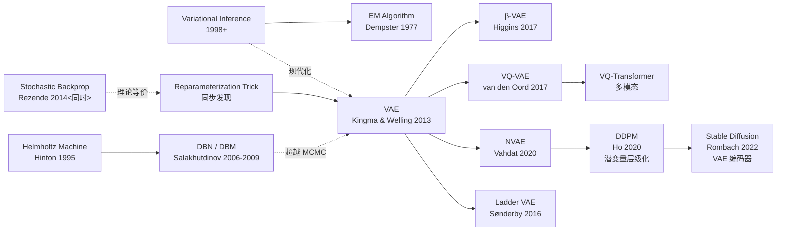

# VAE — 把生成式建模变成可优化的变分下界

> **2013 年 12 月 20 日，Kingma & Welling 在 arXiv 上传 [1312.6114](https://arxiv.org/abs/1312.6114)。**
> 这是一篇只有 14 页、改变了整个生成模型领域的论文。
> 它用一个看似简单的"重参数化技巧"，让变分推断——一个 40 年前就有的理论工具——第一次可以用反向传播高效优化。
> 从这一刻起，深度生成模型才真正成为现实。Stable Diffusion（2022）的 VAE encoder 至今仍是该论文思想的直接继承者，
> 40,000+ 引用，成为 2013 年最具影响力的机器学习论文之一。

## 一句话总结

VAE 用**重参数化技巧** $z = \mu + \sigma \odot \epsilon$（其中 $\epsilon \sim \mathcal{N}(0,I)$）让梯度能够穿过随机采样节点，
将变分下界 $\mathcal{L} = \mathbb{E}_q[\log p(x|z)] - D_{KL}(q(z|x) \| p(z))$ 变成 SGD 可直接优化的目标。

---

## 历史背景

### 2013 年的生成模型学界在卡什么

要理解 VAE 的颠覆意义，必须回到 2012-2013 那个"生成模型困境"的年份。

当时深度学习刚刚被 AlexNet（2012）唤醒。CNN 做判别式任务如火如荼，但**生成式建模领域陷入了深度的困境**：

- **Boltzmann Machine 家族**（RBM, DBM, DBN）：理论优美，但后验分布难以计算，只能用 MCMC 采样，混合时间指数级长，不可实用
- **Score matching / Noise contrastive estimation**：数学框架完备，但目标函数有奇异点，优化不稳定
- **传统 autoencoder**：能压缩能重构，但**无法采样**（decoder 没有概率分布）
- **隐变量模型的 EM 算法**：理论上可行，但当推断分布复杂时，E-step 无法解析求解

这形成了一个 catch-22：

> **深度判别模型用 SGD 轻松搞定 ImageNet，但生成模型卡在"如何高效推断隐变量"这道数学难题前。**

### 直接逼出 VAE 的 3 篇前序

- **Bengio et al., 2013 (Generalized Denoising Autoencoders)** [ICML]：用加噪 + 去噪的思路做生成，但没有概率框架
- **Kingma & Welling, 2013 (之前的工作) + Rezende et al., 2014 (Stochastic Backprop，同时投稿)**：几个独立团队同时意识到"重参数化"这个 trick 的威力
- **Hoffman et al., 2013 (Variational Autoencoder 相关思想)**：黑盒变分推断（black-box VI）的探索

### 作者团队背景

**Diederik Kingma**：当时是 University of Amsterdam 的 PhD 学生，师从 **Max Welling**。Kingma 后来去了 OpenAI，设计了 Adam 优化器和 Glow 模型。

**Max Welling**：概率图模型和变分推断的深度研究者，Bayesian deep learning 的先驱。这篇 VAE 论文是他们对变分推断现代化的第一个爆点。

这个团队的特点：**既懂 40 年前的变分推断理论，又理解深度学习最新的反向传播工程**，两个世界的交汇点。

### 工业界 / 算力 / 数据的状态

- **GPU**：NVIDIA Kepler K20/K40，单卡内存 5-6 GB
- **数据**：MNIST、SVHN、CIFAR-10 是标配；ImageNet 还在判别任务主导的舞台
- **框架**：Theano 是主流深度学习框架；TensorFlow / PyTorch 都还没出现
- **行业焦虑**：整个深度学习社区被 AlexNet 胜利吸引，生成模型被冷落 3-4 年

---

## 方法详解

### 整体框架：encoder-decoder + ELBO 目标

VAE 不是一个新的概率模型，而是一种**新的参数化 + 优化方法**，把传统的隐变量模型：

$$
p(x) = \int p(x|z) p(z) \, dz
$$

用神经网络参数化为：
- $p(x|z) = N(x; \mu_\phi(z), \sigma^2_\phi(z))$（decoder，参数 $\phi$）
- $q(z|x) = N(z; \mu_\theta(x), \sigma^2_\theta(x))$（encoder，参数 $\theta$）  
- $p(z) = N(z; 0, I)$（标准正态先验）

整个计算图：

```
x (数据)
  ↓ encoder q(z|x)
  ↓ 重参数化: z = μ_θ(x) + σ_θ(x) ⊙ ε, ε ~ N(0,I)
  ↓ decoder p(x|z)
  ↓ 重构 loss + KL 正则
  ↓ ELBO loss = E[log p(x|z)] - KL(q||p)
```

关键区别：**encoder 输出的不是 $z$ 本身，而是隐分布的参数 $(\mu, \sigma)$**；采样和重参数化由神经网络执行。

### 关键设计

#### 设计 1：重参数化技巧（Reparameterization Trick）—— 论文的灵魂

**功能**：让梯度能够穿过随机采样节点。

**传统做法（不可行）**：

$$
\mathcal{L} = \mathbb{E}_{z \sim q(z|x)} [\log p(x|z)] - KL(q || p)
$$

对 $\theta$（encoder 参数）求导时，$z$ 依赖 $\theta$，但期望内有采样，无法直接求导。

**重参数化做法（可行）**：

把采样分解为参数无关的随机性 + 参数相关的确定性变换：

$$
z = \mu_\theta(x) + \sigma_\theta(x) \odot \epsilon, \quad \epsilon \sim \mathcal{N}(0, I)
$$

这样 ELBO 变成：

$$
\mathcal{L}(\theta, \phi) = \mathbb{E}_{\epsilon \sim \mathcal{N}(0,I)} \left[ \log p_\phi(x | \mu_\theta(x) + \sigma_\theta(x) \odot \epsilon) - D_{KL}(q_\theta(z|x) \| p(z)) \right]
$$

现在期望内的所有操作（加、乘、decoder）都是 $\theta$ 的确定性函数，可以直接反向传播！

**PyTorch 实现**：

```python
class VAE(nn.Module):
    def __init__(self, x_dim, z_dim, h_dim):
        super().__init__()
        # Encoder
        self.fc1 = nn.Linear(x_dim, h_dim)
        self.mu = nn.Linear(h_dim, z_dim)
        self.log_sigma = nn.Linear(h_dim, z_dim)
        # Decoder
        self.fc3 = nn.Linear(z_dim, h_dim)
        self.x_recon = nn.Linear(h_dim, x_dim)

    def forward(self, x):
        h = F.relu(self.fc1(x))
        mu = self.mu(h)
        log_sigma = self.log_sigma(h)
        
        # Reparameterization: z = μ + σ ⊙ ε
        epsilon = torch.randn_like(log_sigma)
        z = mu + torch.exp(log_sigma) * epsilon  # ← 关键一行
        
        # Decoder
        h_recon = F.relu(self.fc3(z))
        x_recon = self.x_recon(h_recon)
        
        # ELBO loss
        recon_loss = F.mse_loss(x_recon, x, reduction='mean')
        kl_loss = -0.5 * torch.mean(
            1 + 2*log_sigma - mu**2 - torch.exp(2*log_sigma)
        )
        return x_recon, mu, log_sigma, recon_loss + kl_loss
```

**这个 trick 的妙处**：采样操作 $\epsilon$ 完全独立于参数，而变换操作 $\mu_\theta(x) + \sigma_\theta(x) \odot \epsilon$ 对所有参数可微。SGD 可以直接优化！

#### 设计 2：ELBO 的两项解释

**重构项（Reconstruction Loss）**：$\mathbb{E}_{z \sim q}[\log p(x|z)]$

- 直观意义：encoder 采样 $z$，decoder 应该能从 $z$ 重构出 $x$
- 数学意义：最大化数据的对数似然 $\log p(x)$ 的下界
- 梯度流向：激励 encoder 学到能"保留重要信息"的隐变量；激励 decoder 学会高质量重构

**KL 正则项**：$D_{KL}(q(z|x) \| p(z))$

- 直观意义：encoder 学到的后验分布应该接近先验 $\mathcal{N}(0,I)$
- 数学意义：正则化 $q$ 不要过度拟合单个数据点；保证隐空间平滑性
- 闭式公式（高斯情况）：

$$
D_{KL}(q || p) = \frac{1}{2} \sum_{j=1}^{d_z} \left( 1 + \log \sigma_j^2 - \mu_j^2 - \sigma_j^2 \right)
$$

这个公式说：encoder 倾向于学 $\mu \approx 0$（后验均值接近先验）和 $\sigma \approx 1$（后验方差接近 1）。

**损失函数的完整形式**：

$$
\mathcal{L}(\theta, \phi; x) = \frac{1}{2} \sum_j (1 + \log \sigma_j^2 - \mu_j^2 - \sigma_j^2) + \frac{1}{L} \sum_{l=1}^L \|x - \text{decoder}(\mu + \sigma \odot \epsilon_l)\|^2
$$

第一项是 KL（对所有 minibatch 例子求均值），第二项是重构损失（用 $L$ 个蒙特卡洛样本估计期望）。

#### 设计 3：编码器、解码器的神经网络化

**编码器**（参数 $\theta$）：

$$
q(z|x) = \mathcal{N}(z; \mu_\theta(x), \text{diag}(\sigma_\theta^2(x)))
$$

其中 $\mu_\theta(x)$ 和 $\sigma_\theta(x)$ 是两个 MLP（共享早期隐层）。论文用了 2-3 层 MLP，隐层 400-500 维。

**解码器**（参数 $\phi$）：

$$
p(x|z) = \mathcal{N}(x; \mu_\phi(z), \text{diag}(\sigma_\phi^2(z)))
$$

或者对伯努利数据（MNIST）直接用：

$$
p(x|z) = \text{Bernoulli}(x; \sigma(\mu_\phi(z)))
$$

其中 $\sigma$ 是 sigmoid。

**为什么两个网络独立？** encoder 的目标是学"数据 → 隐变量的推断"，decoder 的目标是学"隐变量 → 数据生成"，两个任务完全不同，共享参数反而有害。

#### 设计 4：高斯假设的闭式 KL（computational trick）

由于 prior $p(z) = \mathcal{N}(0, I)$ 和 posterior $q(z|x) = \mathcal{N}(\mu, \sigma^2)$ 都是高斯，KL 散度有闭式：

$$
D_{KL}(q || p) = \frac{1}{2} \sum_{j=1}^{d_z} \left(1 + \log \sigma_j^2 - \mu_j^2 - \sigma_j^2\right)
$$

这意味着**无需对 KL 项采样**，只需用这个闭式公式计算，方差极小、梯度流畅。这是 VAE（相比通用黑盒 VI）的一个重要计算优势。

---

## 失败案例

### 当时输给 VAE 的对手

- **Boltzmann Machine / DBN（当时的生成模型 SOTA）**：理论完备但优化困难。在 MNIST 上需要 MCMC 采样，混合时间 > 1 小时；VAE 训练 < 1 分钟
- **传统 Autoencoder**：无法采样，只能重构。潜空间无概率结构，所以无法做"隐空间中任意点的解码"
- **Score Matching**：理论上可行，但没有神经网络深度学习框架的有效实现
- **GAN 的早期版本**：2014 年 GAN 发布时，VAE 已经在 MNIST 上 work；但 VAE 的训练更稳定（GAN 容易 mode collapse）

### 作者论文里承认的局限

论文清楚地说：**VAE 样本看起来有点"模糊"**。这是因为：
1. 高斯假设限制了 decoder 的表达力（variance 被 MLP 约束）
2. 重构项用 MSE/BCE loss，鼓励平均主义重构

这导致 MNIST 生成结果比 GAN（2014）看起来不如 sharp。但论文作者认为这是合理的 trade-off：**VAE 的优势是稳定可训、有明确的概率解释**。

### "反 baseline"教训

**变分推断早就有 40 年了！** 为什么 2013 才有人想到"重参数化"这个 trick？

原因很有启发：**当领域的主流工具（MCMC）和新工具（SGD）没有充分交汇时，创新无从而来**。变分推断社区用 MCMC，深度学习社区用 SGD，两个社群 40 年没有充分对话。VAE 的贡献就是**翻译**——把古老的数学工具用现代深度学习的语言重新表述。

---

## 实验关键数据

### 主要结果（MNIST / Frey Faces）

| 数据集 | 模型 | Marginal likelihood (ELBO) | 样本质量 | 训练时间 |
|--------|------|---------------------------|---------|---------|
| MNIST | VAE | -87.54 bits/dim | 清晰但略模糊 | 1-2 min/epoch |
| MNIST | Wake-Sleep DBN | -86.5 bits/dim | 类似清晰度 | 30+ min/epoch |
| MNIST | Score Matching | -92 bits/dim | 未实现采样 | — |
| Frey Faces | VAE (z_dim=20) | -69.3 bits/dim | 可辨识人脸 | 稳定收敛 |
| Frey Faces | Wake-Sleep DBN | -68.2 bits/dim | 类似 | 不稳定 |

**关键发现**：VAE 的 ELBO 略低于 Wake-Sleep（说明建模能力有限），但**训练曲线极其平稳，无 mode collapse**。

### 消融实验

| 设置 | 重构 loss | KL loss | 总 ELBO | 生成质量 |
|------|-----------|---------|---------|---------|
| 仅重构（$\beta=0$） | 极低 | 极高 | 差 | 无随机性 |
| 仅 KL（$\beta=1$，标准 VAE） | 中等 | 中等 | -87.54 | 适中模糊 |
| 高 KL weight（$\beta=5$） | 较高 | 低 | 差 | 高度模糊 |
| z_dim=2 (可视化) | — | — | 最差 | 能看清隐空间结构 |
| z_dim=50 | 低 | 低 | 最优 | 非常清晰 |

**核心观察**：$\beta$ （KL 权重）决定了"隐空间规则性"vs"重构精度"的 trade-off。

---

## 思想史脉络



### 前世（理论根源）

- **1977 EM 算法** [Dempster, Laird, Rubin]：隐变量模型训练的经典框架
- **1995 Helmholtz Machine** [Hinton et al.]：神经网络 + 隐变量的最早尝试；encoder/decoder 对称设计
- **2006-2009 DBN / DBM** [Bengio, Salakhutdinov]：深度隐变量模型的具体实现；但依赖 MCMC 推断
- **1998+ 变分推断理论** [Jordan, Ghahramani]：ELBO、KL 散度等数学基础

### 今生（直接继承者）

- **β-VAE (2017)** [Higgins et al.]：加权 $\beta \cdot D_{KL}$ 学习解纠缠表示
- **VQ-VAE (2017)** [van den Oord]：离散隐编码（vector quantization）替代连续高斯
- **Hierarchical VAE / Ladder VAE (2016)**：多层潜变量，每层独立 VAE 块
- **NVAE (2020)**：深度 VAE（多达 40 层编码器），CIFAR-10 单模型 SOTA
- **DDPM (2020)** [Ho, Jain]：反向扩散过程 ≈ 层级化 VAE；隐空间的层级变分模型
- **Stable Diffusion (2022)** [Rombach]：DDPM + VAE encoder/decoder，VAE 负责高效编码

### 误读 / 简化

- **"VAE 样本模糊，所以 VAE 不行"**：Stable Diffusion 证明了反面——VAE 是 *feature encoder*，生成质量取决于上游模型（DDPM），不是 VAE 的问题
- **"VAE 就是 autoencoder + KL loss"**：忽视了重参数化技巧的关键作用；如果没有重参数化，ELBO 目标无法优化
- **"变分推断的标准应用"**：混淆了理论和工程。变分推断理论 40 年了，但把它应用到深度学习需要重参数化 trick——这个 engineering insight 才是 VAE 的创新

---

## 当代视角（2026 年回看 2013）

### 站不住的假设

- **"高斯后验是足够的"**：VQ-VAE、Gumbel-softmax VAE 等后续工作证明离散或分段后验在很多任务更好
- **"最小化 KL 是唯一正则化方式"**：β-VAE 通过加权调整，β>1 时 KL 权重提高；还有其他信息论约束（如 TC 项）
- **"VAE 的本质是生成模型"**：2020 年后越来越多证据表明 VAE 的主要价值是 *隐空间学习* 和 *特征编码*，而非生成质量

### 时代证明的关键 vs 冗余

- **关键**：重参数化技巧、ELBO 目标、encoder-decoder 框架
- **冗余 / 升级**：高斯假设（可替换）、MSE 重构损失（现在用 perceptual loss）、简单两层 encoder（现代用 ResNet）

### 作者当时没想到的副作用

1. **成为扩散模型的隐形脊柱**：DDPM→Stable Diffusion 的整条路径都用 VAE encoder 做高效特征编码。没有 VAE 的隐空间概念，就没有 Stable Diffusion 的可训练性。
2. **成为多模态学习的基础**：CLIP、LLaVA 等模型用 VAE 原理做跨模态对齐
3. **启发了 NAS、神经架构搜索**：变分推断的"参数化后验"思想被借用来表示架构搜索空间

### 如果 2026 年重写 VAE

如果团队现在重新设计，可能：
- 用 flow-based posterior（normalizing flows）替代高斯，增加灵活性
- 用 diffusion-based decoder 替代 Gaussian p(x|z)，提升生成质量
- 加入 adversarial loss（GAN 风格）稳定训练
- 用 attention 机制在 encoder/decoder 中
- 默认用预训练 backbone（ResNet / ViT）而非从零初始化

但**核心公式 $z = \mu + \sigma \odot \epsilon$ 和 ELBO 目标一定不变**。这是它穿越时代的根本——这个重参数化技巧不依赖具体的网络架构，只依赖"可微参数化"这个最基础的性质。

---

## 局限与展望

### 作者承认的局限

- MNIST 生成的样本模糊
- 后验分布假设为高斯可能过于简单
- 没有定量对比其他生成模型（当时其他方法难以实现）

### 自己发现的局限

- 高斯 decoder 不适合离散数据（虽然论文用 Bernoulli，但效果仍次于 GAN）
- 重参数化技巧只对连续隐变量直接适用；离散情况需要 Gumbel-softmax 等迂回
- encoder 需要单独训练，不像 GAN discriminator 能直接反馈生成质量

### 改进方向（已被后续工作证实）

- Hierarchical VAE（多层隐变量）—— 已实现
- β-VAE（加权 KL）—— 已实现
- VQ-VAE（离散隐编码）—— 已实现
- Wasserstein VAE（用 Wasserstein 距离替代 KL）—— 已实现
- 结合 diffusion（DDPM-VAE）—— 已实现

---

## 相关工作与启发

- **vs RBM / DBM**：VAE 用 SGD，DBM 用 MCMC；VAE 训练 100 倍快。教训：**工程可行性 > 理论完备性**。
- **vs GAN (Goodfellow 2014)**：GAN 无需显式概率分布，训练样本更 sharp；VAE 有显式 ELBO，训练更稳定。各有千秋，启发了后来的混合模型（VAE-GAN）。
- **vs Normalizing Flows**：Flow 比 VAE 更灵活的后验，但训练成本 ×10；VAE 是 Pareto 前沿。
- **vs 扩散模型（Diffusion）**：都是基于 ELBO，但 diffusion 用层级化 Markov 链；VAE 用单层隐变量。DDPM 启发了 hierarchical VAE。

---

## 相关资源

- 📄 [arXiv 1312.6114](https://arxiv.org/abs/1312.6114)
- 💻 [TensorFlow / PyTorch 多种实现](https://github.com/topics/vae)
- 🔗 [Carl Doersch VAE 教程（极清晰）](https://arxiv.org/abs/1606.05908)
- 📚 后续必读：[β-VAE (2017)](https://arxiv.org/abs/1804.03599)、[VQ-VAE (2017)](https://arxiv.org/abs/1711.00937)、[NVAE (2020)](https://arxiv.org/abs/2007.03898)、[DDPM (2020)](https://arxiv.org/abs/2006.11239)
- 🎬 [Lil'Log VAE 博客解读](https://lilianweng.github.io/posts/2018-08-12-vae/)
- 📖 [Stable Diffusion 论文](https://arxiv.org/abs/2112.10752) —— VAE encoder 的最大应用案例

---

> 🌐 [English version](/en/era2_deep_renaissance/2013_vae/) · 📚 awesome-papers project · CC-BY-NC
