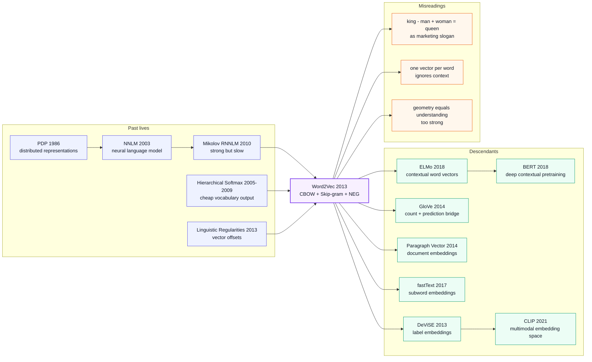

# Word2Vec - 把词义压进向量空间的工业级捷径

> **2013 年 1 月 16 日，Google 的 Tomas Mikolov、Kai Chen、Greg Corrado、Jeffrey Dean 四位作者把 [arXiv:1301.3781](https://arxiv.org/abs/1301.3781) 挂上网；同年 10 月 16 日，Mikolov 团队又用 [arXiv:1310.4546](https://arxiv.org/abs/1310.4546) 把 negative sampling、subsampling 和 phrase vectors 补齐。** Word2Vec 的反直觉点不是「词向量」本身，而是把神经语言模型里最昂贵的非线性层拿掉，只保留一个近乎朴素的预测任务：用当前词猜上下文，或用上下文猜当前词。结果是，原本要训练数周的词表示突然变成一天内能跑完、能开源、能被所有 NLP 系统复制的基础设施；那句 `king - man + woman ≈ queen` 也从论文表格变成了整个深度学习时代最会传播的技术口号。

## 一句话总结

Mikolov、Chen、Corrado、Dean 2013 年在 ICLR Workshop 发表的 [Efficient Estimation](https://arxiv.org/abs/1301.3781)，加上同年 NeurIPS 的 [Distributed Representations of Words and Phrases](https://arxiv.org/abs/1310.4546)，把词表示训练从「训一个完整神经语言模型」改写成两个浅层预测目标：CBOW 用上下文预测中心词，Skip-gram 最大化 $\frac{1}{T}\sum_t\sum_{-c\le j\le c,j\ne0}\log p(w_{t+j}\mid w_t)$。它真正击败的 baseline 不是一个单一模型，而是一整套 2010 年前后的慢系统：640 维 Mikolov RNNLM 在类比测试总准确率 24.6%，Skip-gram 300 维 / 783M 词已到 53.3%，DistBelief 1000 维 / 6B 词到 65.6%；后续 negative sampling 又把全词表 softmax 近似成 $\log \sigma(v'_{w_O}{}^\top v_{w_I}) + \sum_i \log \sigma(-v'_{w_i}{}^\top v_{w_I})$，让单机 C++ 代码能一天扫过 100B 级 token。Word2Vec 的隐藏 lesson 是：2013 年 NLP 的瓶颈不是「模型不够深」，而是「表示还没有便宜到人人能用」；它把 distributional semantics 工业化，给 GloVe、fastText、[BERT（2018）](../era3_attention/2018_bert.md) 和 [CLIP（2021）](../era4_foundation_models/2021_clip.md) 留下了一个共同前提：先把符号变成可计算的几何对象，深层模型才有东西可堆。

---

## 历史背景

### 2013 年的 NLP 卡在什么地方

要理解 Word2Vec 的冲击力，必须回到 2012-2013 年的 NLP 日常。那时深度学习已经用 AlexNet 证明「端到端特征学习」可以改变视觉，但 NLP 的大部分系统仍然把词当作离散 ID：一个词就是词表里的一个整数，最多再接一个稀疏 one-hot。`dog` 和 `cat` 在模型眼里没有天然相似性，`Paris` 和 `France` 的关系也不会自动落进某个可计算的几何结构里。

工业系统的主力仍是 **N-gram LM + 特征工程 + 线性模型 / CRF / MaxEnt**。这种路线强在可控、快、稳定，也能吃下巨量文本；弱点同样明显：它记住的是表面共现和人工特征，不擅长把「相似词」「类比关系」「低频实体」压缩成可迁移的表示。LSA、LDA、topic model 能做降维，但训练慢、解释松散，对词序和细粒度句法关系也不敏感。神经网络语言模型已经存在，Bengio 2003、Collobert & Weston 2008、Mikolov RNNLM 2010 都证明 dense vectors 有用，可它们的代价太高：一个完整 NNLM 要把输入投影、隐藏层、全词表输出层一起训，词表一到几十万，$H \times V$ 或 $D \times V$ 就把训练时间吃掉。

所以 2013 年真正的矛盾不是「有没有词向量」；学界早就有。真正的矛盾是：**词向量能不能便宜到像 TF-IDF 一样人人可用，同时又比 LSA / 早期 NNLM 更有语义结构**。Word2Vec 的答案很狠：别再把词向量训练绑在完整语言模型上，只训练那个最有用的中间层。

### 直接逼出 Word2Vec 的几条前序

- **Rumelhart、Hinton、Williams 1986 的 distributed representations**：把符号压成向量不是 Word2Vec 首创。PDP 时代已经提出「概念可以由多个连续维度共同表示」，Word2Vec 继承的是这条老线索，只是第一次把它训到十亿词规模。
- **Bengio、Ducharme、Vincent、Janvin 2003 的 Neural Probabilistic Language Model**：这是现代神经语言模型的关键前身，词向量在模型里作为可学习参数出现。但它服务于 next-word likelihood，隐藏层和输出 softmax 都很贵；Word2Vec 砍掉隐藏层后，几乎是把它的「词向量副产品」变成主产品。
- **Morin & Bengio 2005 / Mnih & Hinton 2009 的 hierarchical softmax**：层次 softmax 让词表归一化从 $O(V)$ 变成 $O(\log V)$，Word2Vec 初版直接沿用 Huffman tree，使高频词路径更短。这不是概念噱头，是工程可训性的前提。
- **Mikolov 2010-2012 的 RNNLM 系列**：Mikolov 在语音识别和语言建模里已经证明 RNNLM 强，但也亲手体验到它慢。Word2Vec 像是这条线的自我拆解：如果 RNNLM 的词向量有用，是否可以不训 RNN，只训词向量？
- **Mikolov、Yih、Zweig 2013 的 linguistic regularities**：`king - man + woman = queen` 不是后人包装出来的营销梗，而是同一团队在 NAACL 2013 已经系统化的评估思想。Word2Vec 把这个评估从有趣现象变成核心 benchmark。
- **Mnih & Teh 2012 的 NCE**：NeurIPS 2013 版 negative sampling 的近亲。NCE 原本追求近似 softmax likelihood，Word2Vec 则更务实：我们只关心向量质量，不一定要恢复归一化概率。

### Google 团队当时在做什么

Tomas Mikolov 加入 Google 后，正站在两个世界的交界处。一边是他在 Brno / Microsoft Research 已经打磨多年的 RNNLM、语音识别、语言建模经验；另一边是 Google 的真实生产场景：搜索、广告、翻译、知识库、新闻、实体识别，每个系统都有大词表、低频实体、多语言语料和延迟预算。

Kai Chen、Greg Corrado、Jeffrey Dean 的出现同样关键。Corrado 和 Dean 代表的不是「论文挂名的工业大佬」，而是 Google 当时最稀缺的能力：把一个神经网络想法塞进大规模分布式训练框架和生产级 C++ 工具链。1301.3781 里有 DistBelief 并行训练结果，1310.4546 里则有单机多线程 C++ 代码和预训练 Google News 向量。这个组合让 Word2Vec 从一篇 NLP 论文变成一个可下载、可复现、可嵌入任何 pipeline 的工具。

还有一个容易被低估的历史点：Word2Vec 诞生时，Transformer、seq2seq attention、BERT 都还没出现。NLP 的「预训练-微调」范式尚未成型，GPU 训练大语言模型也不是日常。Word2Vec 的传播路径不是「更大的神经网络吞掉旧系统」，而是「一个便宜的中间表示先寄生到所有旧系统里」。它能进入 CRF、SVM、RNN、检索系统、推荐系统、图像零样本分类，正是因为它不像完整模型那样要求系统重写。

### 算力、数据、代码与社区状态

- **算力**：论文同时展示了两条路线：DistBelief 上 50-100 个 replica 的大规模训练，以及单机多线程 C++ 的轻量训练。后者更决定传播速度，因为普通研究组不需要 Google 内部集群也能跑。
- **数据**：1301.3781 用 Google News 6B token、1M 词表做大规模实验；1310.4546 又提到 optimized single-machine implementation 可以一天处理 100B 词。这个量级把早期公开词向量「几十 M 到几百 M 词」甩开两到三个数量级。
- **框架**：TensorFlow 还没发布，PyTorch 更不存在；论文代码不是一个漂亮的深度学习框架 demo，而是一个命令行 C++ 程序。这反而帮助了扩散：编译、喂文本、拿向量，几乎没有框架依赖。
- **社区氛围**：2013 年的 NLP 对「神经网络全面接管」仍然谨慎，但对「把 dense vectors 当特征」非常愿意试。Word2Vec 正好踩在这个接受边界上：它足够神经、足够新；又足够小、足够像一个可插拔 feature。
- **开源时机**：代码和预训练向量公开得很早，博客和教程迅速传播，`king - man + woman ≈ queen` 让非 NLP 读者也能一眼懂。这种「工程便利 + 认知钩子」的组合，解释了为什么 Word2Vec 的社会影响远大于许多理论上同样重要的 embedding 论文。

---

## 方法详解

### 整体框架

Word2Vec 最容易被误解成「发明了词向量」。更准确的说法是：它把神经语言模型里的词向量训练目标，压缩成两个极便宜的局部预测任务，并用一组工程近似把全词表分类问题削到可以在普通机器上跑。论文的技术美感不在深，而在浅：**浅到只剩一个 lookup table、一个上下文窗口、一个输出近似，却足以把词义、句法和实体关系压进欧氏空间**。

两种模型互为镜像。CBOW 把上下文词的向量平均后预测中心词，训练速度快，尤其擅长高频词和句法规则；Skip-gram 用中心词预测窗口里的上下文词，训练样本更多，低频词和语义关系更好。第一篇论文用 hierarchical softmax 做输出近似；第二篇论文把 negative sampling、frequent-word subsampling、phrase detection 加上，才形成后来大家熟悉的 `word2vec` 工具。

| 模型 | 输入 | 输出 | 最擅长 | 代价瓶颈 |
|------|------|------|--------|----------|
| CBOW | 上下文词平均向量 | 中心词 | 快速训练、句法规则 | 输出层近似 |
| Skip-gram | 中心词向量 | 周围词 | 低频词、语义类比 | 窗口内多次预测 |
| NNLM / RNNLM baseline | 历史词 + 隐藏状态 | 下一个词 | 语言建模 perplexity | 隐藏层 + 全词表 softmax |
| LSA / topic model baseline | 文档-词矩阵 | 低维主题 / 奇异向量 | 文档级相似性 | 语义关系粗、增量差 |

**反直觉点**：Word2Vec 不是把模型做大，而是把模型做小；不是追求更好 language model likelihood，而是承认「如果目标只是可复用词向量，完整 LM 训练里很多计算都是旁路」。这种目标重写，是它能工业化的根本。

### 关键设计

#### 设计 1：CBOW 与 Skip-gram 双架构 - 把语言建模改成局部预测游戏

**功能**：CBOW 和 Skip-gram 都把一个长序列切成大量局部窗口，用「上下文 <-> 中心词」的预测任务让词向量吸收共现结构。CBOW 适合快速扫大语料，Skip-gram 更像给每个中心词制造多组训练样本。

**核心公式**：Skip-gram 的目标是最大化中心词预测周围词的平均 log probability；CBOW 则把上下文向量平均后预测中心词。

$$
\mathcal{L}_{\text{SG}} = \frac{1}{T}\sum_{t=1}^{T}\sum_{-c \le j \le c, j\ne0}\log p(w_{t+j}\mid w_t),\qquad
\mathcal{L}_{\text{CBOW}} = \frac{1}{T}\sum_{t=1}^{T}\log p\left(w_t\mid \frac{1}{2c}\sum_{-c\le j\le c,j\ne0} v_{w_{t+j}}\right)
$$

**最小训练循环**：

```python
def skipgram_pairs(tokens, window):
    for center, word in enumerate(tokens):
        radius = random.randint(1, window)
        left = max(0, center - radius)
        right = min(len(tokens), center + radius + 1)
        for pos in range(left, right):
            if pos != center:
                yield word, tokens[pos]

for input_word, output_word in skipgram_pairs(tokens, window=5):
    input_vec = W_in[input_word]
    loss = predict_context_word(input_vec, output_word)
    loss.backward()
```

| 选择 | 训练样本数 | 语义表现 | 句法表现 | 论文里的结论 |
|------|------------|----------|----------|--------------|
| CBOW | 每个中心词一次 | 中等 | 强 | 更快，适合大规模粗训练 |
| Skip-gram | 每个中心词最多 $2c$ 次 | 强 | 强 | 低频词和语义类比明显更好 |
| RNNLM | 每个位置一次但状态递归 | 中等 | 强 | 质量可以高，但训练慢很多 |

**设计动机**：传统 LM 问的是「下一个词概率是多少」，Word2Vec 问的是「什么表示最能解释局部上下文」。两个问题看似接近，工程代价完全不同。把任务从完整序列概率改成局部窗口预测后，模型不再需要维护复杂隐藏状态，也不需要为每个下游任务重新训练特征。

#### 设计 2：删除非线性隐藏层 - 用复杂度削减换数据规模

**功能**：Word2Vec 最大胆的工程决定，是把 NNLM 中最贵的非线性隐藏层拿掉。它牺牲了单个样本上的建模能力，换来能吃下几十亿 token 的吞吐量；在分布式语义里，更多干净共现常常比更复杂非线性更值钱。

**复杂度对比**：论文把训练复杂度写成 epoch 数 $E$、训练词数 $T$、每样本代价 $Q$ 的乘积。关键差异都在 $Q$。

$$
O = E\times T\times Q,\qquad
Q_{\text{NNLM}} = N D + N D H + H V,
\quad Q_{\text{CBOW}} = N D + D\log_2 V,
\quad Q_{\text{SG}} = C(D + D\log_2 V)
$$

**复杂度直觉代码**：

```python
def estimate_cost(model, vocab=1_000_000, dim=300, hidden=640, context=10):
    if model == "nnlm":
        return context * dim + context * dim * hidden + hidden * vocab
    if model == "cbow_hs":
        return context * dim + dim * math.log2(vocab)
    if model == "skipgram_hs":
        return context * (dim + dim * math.log2(vocab))
    raise ValueError(model)

for name in ["nnlm", "cbow_hs", "skipgram_hs"]:
    print(name, round(estimate_cost(name) / 1e6, 2), "million ops-ish")
```

| 架构 | 是否有隐藏层 | 输出近似 | 每样本主导项 | 工程含义 |
|------|--------------|----------|--------------|----------|
| Feedforward NNLM | 有 | full / hierarchical softmax | $N D H$ 与 $H V$ | 准但慢 |
| RNNLM | 有递归状态 | hierarchical softmax | $H H$ 与 $H\log V$ | 强但串行 |
| CBOW | 无 | hierarchical softmax / NEG | $N D + D\log V$ | 极快 |
| Skip-gram | 无 | hierarchical softmax / NEG | $C(D + D\log V)$ | 稍慢但质量高 |

**设计动机**：这是一种「用数据规模补模型容量」的早期胜利。Word2Vec 不是说非线性没用，而是说在 2013 年的硬件和语料条件下，**更便宜的目标 + 更多 token + 更大词表**，比一个漂亮但训练数周的 NNLM 更能改变下游生态。

#### 设计 3：Hierarchical softmax 与 Negative Sampling - 只更新少数输出参数

**功能**：全词表 softmax 需要对 $V$ 个词归一化，百万词表下不可承受。Hierarchical softmax 把预测词变成走 Huffman tree；negative sampling 更进一步，把多分类改成「正样本 vs 噪声词」的二分类集合。

**核心公式**：NeurIPS 2013 版把每个正例 $(w_I, w_O)$ 的 softmax 项替换成 negative sampling 目标。

$$
\log \sigma\left(v'_{w_O}{}^\top v_{w_I}\right)
+ \sum_{i=1}^{k}\mathbb{E}_{w_i\sim P_n(w)}\left[\log \sigma\left(-v'_{w_i}{}^\top v_{w_I}\right)\right],
\qquad P_n(w) \propto U(w)^{3/4}
$$

**NEG 更新伪代码**：

```python
def neg_sampling_loss(center_id, context_id, num_negatives):
    center = W_in[center_id]
    positive = W_out[context_id]
    negatives = W_out[sample_unigram_pow_3_4(num_negatives)]

    pos_loss = -torch.logsigmoid(torch.dot(positive, center))
    neg_score = torch.matmul(negatives, center)
    neg_loss = -torch.logsigmoid(-neg_score).sum()
    return pos_loss + neg_loss
```

| 输出训练法 | 每个正例更新 | 概率是否归一化 | 适合场景 | Word2Vec 结论 |
|------------|--------------|----------------|----------|---------------|
| Full softmax | $V$ 个词 | 是 | 小词表、严格 LM | 太慢 |
| Hierarchical softmax | $\log V$ 个树节点 | 是 | 低频词、短路径高频词 | 初版主力 |
| NCE | 正例 + 噪声样本 + 噪声概率 | 近似是 | 需要概率解释 | 可用但复杂 |
| Negative sampling | 正例 + $k$ 个噪声词 | 否 | 只关心向量质量 | 最终最流行 |

**设计动机**：Word2Vec 的目标不是拿一个 calibrated language model，而是拿有用向量。只要向量空间质量更好，牺牲概率归一化是可接受的。NEG 的成功说明了一个后来反复出现的规律：表示学习常常不需要完整生成分布，只需要足够强的对比信号。

#### 设计 4：高频词 subsampling、phrase tokens 与线性组合 - 让空间更干净

**功能**：第二篇论文解决两个初版痛点：高频功能词污染训练信号，短语无法由单词简单组合。Subsampling 随机丢弃 `the`、`of`、`in` 这类信息量低的高频词；phrase detection 把 `New_York_Times`、`Air_Canada` 视作单独 token；additive composition 则解释为什么向量加法能形成有意义的短语近邻。

**核心公式**：

$$
P_{\text{discard}}(w_i)=1-\sqrt{\frac{t}{f(w_i)}},\qquad
\operatorname{score}(w_i,w_j)=\frac{\operatorname{count}(w_iw_j)-\delta}{\operatorname{count}(w_i)\operatorname{count}(w_j)}
$$

**清洗语料的最小形态**：

```python
def keep_token(word, freq, threshold=1e-5):
    discard = max(0.0, 1.0 - math.sqrt(threshold / freq[word]))
    return random.random() > discard

def phrase_score(left, right, counts, delta=5.0):
    bigram = counts[(left, right)]
    return (bigram - delta) / (counts[left] * counts[right])
```

| 技巧 | 解决的问题 | 论文里的效果 | 后来的命运 |
|------|------------|--------------|------------|
| 高频词 subsampling | `the/of/in` 占据过多窗口 | 2x-10x 加速，并改善低频词 | 成为默认预处理 |
| Negative sampling | softmax 太贵 | NEG-15 达到 61% 总类比准确率 | 成为默认训练目标 |
| Phrase detection | `Air Canada` 不是 `Air` + `Canada` | phrase analogy 最好到 72% | 被 subword / tokenizer 继承 |
| 向量加法 | 单词组合缺少解释 | `Russia + river` 接近 `Volga River` | 成为 embedding 空间直觉 |

**设计动机**：Word2Vec 最像「语言数据的压缩工程」。它不试图显式建模语法树，也不声称理解短语结构；它做的是让训练流里的噪声更少、实体更完整、对比信号更集中。这个务实选择解释了为什么它在论文指标之外也好用。

### 损失函数 / 训练策略

Word2Vec 的训练配方后来被复刻无数次，因为它几乎没有深度学习框架依赖：扫描文本，构造窗口，查 embedding，更新少数参数，线性衰减学习率。与其说它是一个模型，不如说它是一套把大语料转成向量表的工业流程。

| 项 | 配置 | 说明 |
|----|------|------|
| Vector dim | 100-1000 | 300 维成为最常用公开配置 |
| Window size | 5-10 | Skip-gram 常用随机窗口，远词采样少 |
| Min count | 5 左右 | 过滤极低频噪声词 |
| Optimizer | SGD / asynchronous SGD / Adagrad | 论文在 DistBelief 中用 Adagrad |
| Learning rate | 0.025 起，线性衰减到 0 | C++ 工具默认风格 |
| Negative samples | 大语料 2-5，小语料 5-20 | NEG-5 / NEG-15 是论文主设置 |
| Subsampling threshold | $t \approx 10^{-5}$ | 高频词丢弃概率随频率上升 |
| Training scale | 1B-100B+ tokens | 速度优势来自少量参数更新 |

今天看，Word2Vec 的方法论像是现代 self-supervised learning 的极简祖先：定义一个不用人工标签的预测任务，用海量原始数据学习可迁移表示，再把这个表示作为下游模型的输入。差别在于，2013 年的表示是一张静态词表；2018 年以后，这张词表被深层上下文编码器替换。

---

## 失败案例

### 当时输给 Word2Vec 的 baseline

Word2Vec 的胜利不是「在一个小 benchmark 上高一点」，而是把 2008-2012 年一批常用词表示 baseline 同时打穿：公开向量质量不够，RNNLM 太慢，NNLM 即使吃到 6B 词也难以匹配 Skip-gram 的性价比。更重要的是，Word2Vec 让评估从「最近邻看起来像不像」变成了可复现的 syntactic / semantic analogy accuracy。

| Baseline | 当年优势 | 输在哪里 | 关键数字 |
|----------|----------|----------|----------|
| Collobert-Weston NNLM 50d | 早期公开 neural embeddings | 维度低、语料小、类比弱 | 总准确率 11.0% |
| Turian NNLM 200d | ACL 2010 常用半监督特征 | 语义几乎不可用 | 总准确率 1.8% |
| Mnih NNLM 100d | 更接近神经 LM 训练 | 句法有进步但语义弱 | 总准确率 8.8% |
| Mikolov RNNLM 640d | RNN 能建模历史状态 | 训练慢，语义类比仍弱 | 总准确率 24.6% |
| Google NNLM 100d / 6B | 数据量大、模型完整 | 成本高，仍低于 Skip-gram | 总准确率 50.8% |

这里最刺眼的是 RNNLM：它并非弱模型，甚至是 Mikolov 自己早年路线的代表。但 Word2Vec 证明，如果目标只是词表示，完整 recurrent state 并不划算。**这是一篇作者亲手拆掉自己上一代方法的论文**。

### 作者论文里承认或暴露的失败点

Word2Vec 也不是无敌。两篇论文里有几个失败信号很清楚：CBOW 的语义类比弱于 Skip-gram；Skip-gram 单独做 sentence completion 不如最强 RNNLM；词向量天然忽略词序；phrase vector 必须靠 tokenization 把短语硬合并。它解决的是「词/短语表示」而不是「句子理解」。

| 问题 | 论文证据 | 为什么重要 |
|------|----------|------------|
| CBOW 语义弱 | CBOW 300d/783M 语义 15.5%，Skip-gram 50.0% | 平均上下文牺牲了低频实体信号 |
| Skip-gram 不是句子模型 | MSR Sentence Completion 中 Skip-gram 48.0%，Average LSA 49% | 局部窗口不足以做全句 coherence |
| 词序不可见 | 论文明确说 word representations 对 word order 不敏感 | 后来必须靠 RNN/CNN/Transformer 补结构 |
| phrase 不能自然组合 | `Canada` + `Air` 不等于 `Air Canada` | 需要 phrase detection 或 tokenizer |

这些失败点后来都变成后续路线：fastText 处理形态和低频词，doc2vec 处理文档，ELMo/BERT 处理上下文，subword tokenizer 处理开放词表，Transformer 处理长距离结构。

### 真正的反 baseline 教训

Word2Vec 对旧方法的教训不是「浅层一定优于深层」，也不是「语义只需要共现」。它更像一条工程定律：**当一个表示要被全社区复用时，可训练性和可分发性本身就是模型质量的一部分**。一个 55% 准确率但训练数周、难以复现、没有公开向量的模型，生态影响可能低于一个 53% 准确率但一天能训完、C++ 可编译、向量可下载的模型。

这也是为什么 GloVe 虽然理论包装更像矩阵分解，fastText 虽然修复了 OOV，BERT 虽然后来全面替代静态词向量，仍然都在回答 Word2Vec 留下的问题：如何用自监督目标把离散符号变成可迁移表示。Word2Vec 输掉了「最终 NLP 表示形式」之争，但赢下了「表示学习必须成为基础设施」之争。

## 实验关键数据

### Word analogy 数据

1301.3781 的核心实验是 Semantic-Syntactic Word Relationship test set：8869 个 semantic 问题、10675 个 syntactic 问题，用 `a:b :: c:?` 的向量偏移来做精确匹配。这个 benchmark 的迷人之处是残酷：同义词也算错，必须最近邻正好是答案。

| 模型 | 维度 | 训练词数 | Semantic [%] | Syntactic [%] | Total [%] |
|------|------|----------|--------------|---------------|-----------|
| Collobert-Weston NNLM | 50 | 660M | 9.3 | 12.3 | 11.0 |
| Mikolov RNNLM | 640 | 320M | 8.6 | 36.5 | 24.6 |
| Google NNLM | 100 | 6B | 34.2 | 64.5 | 50.8 |
| CBOW | 300 | 783M | 15.5 | 53.1 | 36.1 |
| Skip-gram | 300 | 783M | 50.0 | 55.9 | 53.3 |
| Skip-gram | 600 | 783M | 56.7 | 54.5 | 55.5 |

最重要的读法：Skip-gram 不是在所有维度都赢，它的句法不总是最高；但它在 semantic 上的跃迁太大，把「词义关系可以线性化」这件事变成了可见事实。

### 速度与规模数据

Word2Vec 的第二个实验主轴是 speed-quality frontier：同样预算下，更多数据和更大维度如何权衡。论文反复强调「少跑几个 epoch，扫更多数据」通常更划算，这一点和后来 scaling law 的直觉很接近。

| 设置 | 维度 | 训练词数 | 时间 | Total [%] |
|------|------|----------|------|-----------|
| 1 epoch CBOW | 300 | 1.6B | 0.6 天 | 36.1 |
| 1 epoch Skip-gram | 300 | 1.6B | 2 天 | 53.8 |
| 1 epoch Skip-gram | 600 | 783M | 2.5 天 | 55.5 |
| DistBelief CBOW | 1000 | 6B | 2 天 x 140 CPU cores | 63.7 |
| DistBelief Skip-gram | 1000 | 6B | 2.5 天 x 125 CPU cores | 65.6 |

1310.4546 进一步把工程边界推开：优化后的单机实现一天可训练超过 100B 词，subsampling 可带来约 2x-10x 加速。这对社区传播比 DistBelief 数字还重要，因为它把 Google 内部能力变成了普通研究者能复制的命令行工具。

### Phrase 与 compositionality 数据

第二篇论文的实验重点从单词扩展到短语。它先用 bigram score 把短语并成 token，再训练 phrase vectors，最后用短语类比测试检验效果。这个设置今天看像 tokenizer 的早期影子：先把语言切成更合适的单位，再学表示。

| 实验 | 设置 | 结果 | 含义 |
|------|------|------|------|
| NEG-5 word analogy | 300d / 1B news | 59% total，38 分钟 | NEG 已能匹配 NCE 速度 |
| NEG-15 word analogy | 300d / 1B news | 61% total，97 分钟 | 更多负样本提升 semantic |
| Subsampling + NEG-15 | 300d / 1B news | 61% total，36 分钟 | 同等质量下显著加速 |
| Phrase analogy best | 1000d / 33B words / HS | 72% accuracy | 短语表示需要更大语料 |

最被传播的表格当然是 `Paris - France + Italy = Rome`、`Russia + river ≈ Volga River`。但这些例子的价值不只是好玩，而是说明 Skip-gram 学到的不是任意近邻图；它的很多方向具有可复用的线性结构。这正是后来 embedding space 被用于检索、推荐、对齐、跨模态学习的原因。

---

## 思想史脉络



### 前世（被谁逼出来的）

Word2Vec 的前世不是单线，而是三条线交叉。第一条是 **distributed representation**：PDP、Bengio NNLM、Collobert & Weston 都相信符号应该落在连续空间里。第二条是 **language modeling 的工程压力**：RNNLM 证明上下文预测能学好词表示，但也证明完整神经 LM 太慢。第三条是 **输出层近似**：hierarchical softmax、NCE 这些看似旁支的技术，实际上决定了百万词表是否可训。

最关键的推手是 Mikolov 自己的 RNNLM。很多经典论文是「击败别人」，Word2Vec 更像「拆解自己」。它继承 RNNLM 的预测目标，但拒绝它的递归状态；继承 NNLM 的 embedding layer，但拒绝它的非线性隐藏层；继承 NCE 的噪声对比思想，但拒绝把归一化概率当成唯一目标。

### 今生（继承者）

1. **GloVe (2014)**：把 Word2Vec 的预测式训练和传统 co-occurrence matrix factorization 重新接上。它的思想史位置不是「Word2Vec 替代品」这么简单，而是解释了为什么预测模型会学到全局共现结构。
2. **Doc2Vec / Paragraph Vector (2014)**：把「词有向量」扩展到「文档也有向量」，是 embedding API 扩张到更大文本单位的第一批尝试。
3. **DeViSE (2013) 到 CLIP (2021)**：DeViSE 直接用 word2vec 类别向量做 ImageNet label embedding，CLIP 八年后用文本编码器和图像编码器共训一个更大的对齐空间。中间模型变了，核心问题没变：如何让不同模态共享一个可检索的几何空间。
4. **fastText (2017)**：承认 Word2Vec 对 OOV 和形态变化处理不好，于是把词拆成 character n-grams。它不是推翻 Word2Vec，而是给静态词向量补上形态学底座。
5. **ELMo / BERT (2018)**：真正终结「一个词一个向量」的路线。同一个 `bank` 在不同句子里有不同表示，Word2Vec 的静态表被深层上下文函数替代。但 BERT 仍继承了 Word2Vec 的元范式：自监督预测 + 大语料 + 可迁移表示。

### 误读 / 简化

第一个误读是把 Word2Vec 等同于 `king - man + woman = queen`。这个例子很会传播，但它只是表面现象；真正重要的是训练目标和工程配方让大量关系方向变得稳定，而不是某一个类比好玩。

第二个误读是「Word2Vec 理解了词义」。它学到的是上下文分布的压缩，不是 grounded semantics。它知道 `Paris` 和 `France` 的共现结构，却不知道巴黎的街道、地图、政治机构和现实世界指称。这就是为什么 CLIP、LLM、multimodal grounding 后来必须补上感知和交互数据。

第三个误读是「浅层模型赢了，所以深层模型不重要」。Word2Vec 赢在表示预训练的第一公里；当任务从单词走向句子、段落、推理、指令跟随，静态表很快不够用。它的真正遗产不是浅层本身，而是把 **self-supervised representation as reusable infrastructure** 这个观念钉进了 NLP。

---

## 当代视角（2026 年回看 2013）

### 站不住的假设

1. **「一个词一个向量」站不住了**。Word2Vec 默认每个 token 对应一个静态向量，`bank` 在「river bank」和「bank account」里完全相同。2018 年 ELMo/BERT 之后，这个假设被彻底推翻：词义不是词表项的属性，而是 token 在上下文里的函数值。今天的 embedding 更像深层模型某一层的激活，而不是一张固定表。
2. **「局部窗口足够表达语言结构」站不住了**。Skip-gram 的窗口共现能抓到大量语义关系，但对否定、指代、长距离依赖、论元结构、篇章关系都无能为力。Transformer 后来的胜利说明，局部上下文统计是好起点，不是完整语言理解。
3. **「词级 tokenization 足够」站不住了**。Word2Vec 面对 OOV、拼写变体、形态丰富语言时很脆。fastText 用 character n-grams 修了一部分，BPE / SentencePiece / unigram tokenizer 又把问题推到 subword 层。现代 LLM 甚至把 tokenization 当成系统能力的一部分，而不只是预处理。
4. **「线性类比等于语义理解」站不住了**。`king - man + woman = queen` 是漂亮的几何现象，但不能证明模型有 grounded world model。它捕捉的是语料中的关系方向和偏见，既能学国家首都，也能复制性别职业刻板印象。
5. **「便宜 embedding 会永远是下游入口」站不住了**。2013-2017 年，下载静态词向量再喂给下游模型是默认做法；2026 年，大多数 NLP 系统直接从预训练 Transformer 中抽 contextual embeddings，或者用 instruction-tuned embedding model 做检索。

### 时代证明的关键 vs 冗余

- **保留下来的关键**：自监督预测任务、海量无标注文本、可迁移表示、向量空间检索、negative sampling / contrastive signal、把符号变成几何对象。这些不是 Word2Vec 专属技巧，而是整个 foundation model 时代的底层语法。
- **被替代的部分**：静态词表、词级 token、只看局部窗口、忽略词序、固定维度 lookup table、把 analogy accuracy 当成核心语义指标。这些设计在 2013 年极其有效，但在深层上下文模型出现后自然退场。
- **半保留半变形的部分**：negative sampling 变成 contrastive learning 的亲戚；phrase detection 变成 tokenizer / entity linking / span representation；embedding lookup 仍然存在，但被放进 Transformer 第一层，而不再单独作为最终表示。

这就是 Word2Vec 的历史位置：它不是现代 NLP 的终点，而是把「表示可以先从无标注文本中学出来」这件事做到了足够便宜，便宜到每个系统都愿意尝试。

### 作者当时没想到的副作用

1. **类比 demo 变成技术传播模板**。很多研究都想复刻 `king - man + woman` 这种一眼懂的效果图。它提高了 embedding 的传播效率，也让一些读者过度相信向量空间具有干净、无偏、可解释的语义轴。
2. **偏见评估被迫进入主流**。Word2Vec 会把语料里的性别、种族、职业偏见编码进向量方向。Bolukbasi 2016 的 debiasing 工作之所以有影响，正是因为 Word2Vec 太普及，偏见不再是抽象伦理问题，而是每个下游系统都会继承的参数。
3. **embedding 成为跨领域默认接口**。推荐系统、图学习、生物信息、知识图谱、图像标签、检索系统都借走了「离散对象 -> dense vector」这套 API。很多领域的 node embedding / item embedding 其实都在复用 Word2Vec 的接口想象。
4. **预训练向量让复现实验变得微妙**。下游论文常常把 Google News vectors 当固定组件，却没有完全控制语料、过滤、训练细节和版本。一个「公开向量」既降低门槛，也把隐藏的数据选择带进实验。

### 如果今天重写 Word2Vec

如果 2026 年重写这两篇论文，核心公式不一定会变，但论文会更明确地处理几个问题：第一，把 negative sampling 直接放到主文核心位置，而不是让 hierarchical softmax 和 NEG 像两个并列选择；第二，用 subword tokenizer 替代纯词表，并系统报告 OOV 和形态丰富语言；第三，加入 bias / fairness / privacy 分析，说明向量空间会继承语料分布；第四，用 retrieval、classification、zero-shot transfer 等下游任务补充 analogy benchmark；第五，把 embedding 各向异性、频率效应、向量归一化等几何诊断纳入实验。

但它不会变成 BERT。Word2Vec 的价值恰恰在于极小：一个可以用几十行核心代码解释、用 C++ 快速训练、能让旧系统立刻获益的表示学习工具。今天重写它，应该让它更诚实、更可诊断、更 multilingual，而不是把它改造成另一个大模型。

## 局限与展望

### 作者承认的局限

- **忽略词序**：第二篇论文明确指出词表示对 word order 不敏感，无法自然表示 idiomatic phrases。
- **短语需要额外处理**：`Boston Globe`、`Air Canada` 这类短语必须先被识别成 token，不能指望单词向量自然组合。
- **类比准确率远未饱和**：即使表格里的例子很漂亮，论文也承认 exact-match 任务离 100% 很远，尤其是语义和短语类比。
- **模型选择依赖任务**：NEG、HS、subsampling、window size、vector dim 没有统一最优解，不同任务需要不同配置。

### 2026 视角的局限

- **静态语义无法处理 polysemy**：一词多义是 Word2Vec 的结构性盲点。
- **低频词仍然脆弱**：subsampling 改善了高频词污染，但对极低频词和新词仍无能为力。
- **缺少可解释约束**：维度没有语义标签，向量方向容易被频率、语料来源和社会偏见混在一起。
- **评估过窄**：analogy benchmark 方便传播，却覆盖不了阅读理解、推理、生成、事实性、对话等现代任务。
- **语料治理缺位**：预训练语料的版权、隐私、偏见、地域覆盖在 2013 年几乎不是论文重点，今天必须被正面处理。

### 改进方向（已被后续工作证实）

- **fastText / subword embeddings**：用 character n-grams 处理 OOV、拼写和形态。
- **GloVe / matrix factorization view**：把局部预测和全局共现统计统一起来。
- **ELMo / BERT / GPT 系列**：把静态表升级为上下文函数。
- **Sentence-BERT / modern embedding models**：把表示目标从词级扩展到句子、段落和检索。
- **Contrastive multimodal learning**：CLIP 把「共享向量空间」推进到图文对齐。
- **Bias measurement and debiasing**：把 embedding 空间里的社会偏见作为必须量化的对象。

## 相关工作与启发

- **vs NNLM / RNNLM**：NNLM 和 RNNLM 目标更完整，能做语言建模；Word2Vec 目标更窄，只学表示。教训是：目标变窄有时反而让表示更可复用。
- **vs LSA / LDA**：LSA/LDA 也是无监督降维，但主要基于文档级统计。Word2Vec 的局部窗口预测更贴近词义关系，训练也更容易增量化。
- **vs GloVe**：GloVe 把全局共现矩阵显式写进目标，Word2Vec 用预测任务隐式吸收共现。两者差异后来被 Levy & Goldberg 解释成同一枚硬币的两面。
- **vs fastText**：fastText 修补 OOV 和 morphology，是 Word2Vec 最自然的工程继承者。
- **vs BERT**：BERT 不是简单「更大 Word2Vec」，而是把表示从词表项变成上下文函数。共同点是自监督预训练，分水岭是静态 vs 动态。
- **vs CLIP**：CLIP 的图文向量空间在哲学上很像 Word2Vec 的跨对象几何，只是训练信号从文本窗口变成图文对比，模型从 lookup table 变成双编码器。

## 相关资源

- 📄 [Efficient Estimation of Word Representations in Vector Space (arXiv:1301.3781)](https://arxiv.org/abs/1301.3781)
- 📄 [Distributed Representations of Words and Phrases and their Compositionality (arXiv:1310.4546)](https://arxiv.org/abs/1310.4546)
- 💻 [Google Code archive: word2vec](https://code.google.com/archive/p/word2vec/)
- 🔗 [Original Word2Vec project mirror and C tool references](https://github.com/tmikolov/word2vec)
- 📚 后续必读：[GloVe (2014)](https://nlp.stanford.edu/projects/glove/), [fastText subword embeddings (2017)](https://aclanthology.org/Q17-1010/), [ELMo (2018)](https://aclanthology.org/N18-1202/), [BERT (2018)](../era3_attention/2018_bert.md), [CLIP (2021)](../era4_foundation_models/2021_clip.md)
- 🎬 [Chris McCormick Word2Vec tutorial](http://mccormickml.com/2016/04/19/word2vec-tutorial-the-skip-gram-model/)
- 🌐 跨语言：英文版 -> [`/en/era2_deep_renaissance/2013_word2vec/`](/en/era2_deep_renaissance/2013_word2vec/)


---

> 🌐 [English version](/en/era2_deep_renaissance/2013_word2vec/) · 📚 awesome-papers project · CC-BY-NC