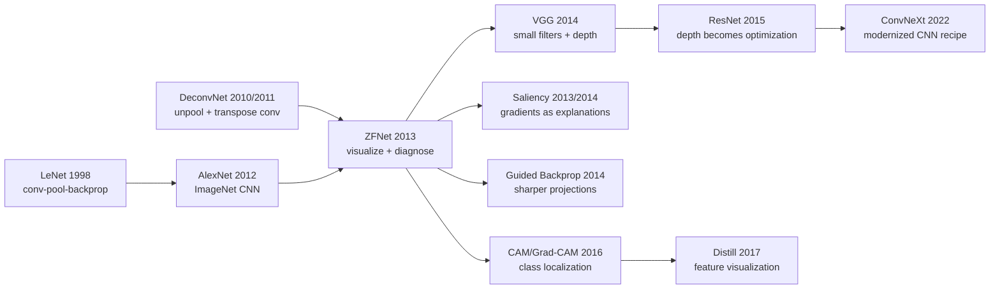

# ZFNet — 用反卷积把 CNN 黑箱拆开

> **2013 年 11 月 12 日，纽约大学的 Matthew D. Zeiler 和 Rob Fergus 两位作者把 [arXiv:1311.2901](https://arxiv.org/abs/1311.2901) 挂上 arXiv，次年发表于 ECCV 2014。** AlexNet 刚刚让 CNN 赢下 ImageNet，但它像一台封死外壳的机器：能赢，却没人看得见内部发生了什么。ZFNet 的历史意义不只是 2013 年 ILSVRC 分类冠军，而是第一次把“可视化”变成调 CNN 的工程仪表盘：用 deconvnet 把高层激活投回像素空间，发现 AlexNet 第一层 11×11 stride 4 采样太粗、特征混叠严重，于是改成 7×7 stride 2。深度视觉从此不再只是堆层和刷榜，也开始学会打开盖子看网络到底在看什么。

## 一句话总结

Zeiler 和 Fergus 2013 年在 arXiv 发布、2014 年发表于 ECCV 的 ZFNet，核心贡献不是发明一个全新的 CNN 家族，而是把 [AlexNet（2012）](2012_alexnet.md) 的黑箱拆成可以诊断的部件：对第 $l$ 层激活 $h_l$，用带 max-pooling switches 的反投影 $	ilde{x}=D_l(h_l)$ 把“哪个 neuron 被什么图案激活”可视化，再用这些图像证据修正架构超参数。它把 AlexNet 的第一层大核粗采样从 11×11 stride 4 调到更细的 7×7 stride 2，并配合中层特征分析、遮挡敏感性实验 $\\Delta_c(i,j)=s_c(x)-s_c(x_{\\text{occlude}(i,j)})$，证明网络确实在看目标本体而不只是背景上下文；结果在 ImageNet 上把 AlexNet 系列的 top-5 错误率继续往下压，2013 年 ILSVRC 分类赛冠军常被报告在约 11.7% top-5 区间。它后来直接启发了 [VGG（2014）](2014_vgg.md) 的小卷积核路线、Simonyan 的 saliency map、guided backprop、CAM/Grad-CAM 和 Distill 风格的 feature visualization。反直觉之处在于：ZFNet 的“新模型”没有 ResNet 那种结构爆炸感，真正传下来的反而是一种研究姿势——先看网络学到了什么，再决定该怎么改网络。

---

## 历史背景

### 2013 年的计算机视觉卡在什么地方

2013 年的 ImageNet 社区有一种很奇怪的兴奋：大家已经相信 CNN 会赢，但还不知道它为什么会赢。

AlexNet 在 2012 年把 ILSVRC top-5 错误率从第二名的 26.2% 打到 15.3%，这件事太震撼，以至于“深度学习是否可行”的争论几乎一夜之间结束。但新的麻烦马上出现：AlexNet 是一个 5 个卷积层、3 个全连接层、6000 万参数的工程物体，里面到底学到了什么，论文只能给出两类证据：最终分类错误率，以及第一层 96 个 filter 的可视化。第一层能看出边缘、颜色、Gabor-like pattern；第二层以上就变成 256/384/4096 维的 feature map，读者只能相信它们“抽象”了。

这对 2013 年的视觉研究很尴尬。传统 pipeline 虽然输给了 CNN，但 SIFT、HOG、Fisher Vector、spatial pyramid 每一步都能解释：哪种 descriptor、哪种 pooling、哪种 classifier，工程师能把误差定位到具体环节。CNN 反过来像一台黑箱压缩机：输入图像，输出 1000 类概率，中间层只是一堆 tensor。它很强，却很难调。第一层 filter 大小要多大？stride 要多粗？哪些层学的是边缘，哪些层学的是物体局部？如果网络把“雪地”当成“哈士奇”的证据，我们怎么发现？

ZFNet 出现的意义就在这里：它不是在“CNN 能不能赢”这个问题上下注，而是在“赢了之后怎么理解、怎么调、怎么排错”这个问题上给工具。2013 年是深度视觉从信仰阶段进入工程阶段的第一年，ZFNet 的 deconvnet 可视化就是这次转向的仪表盘。

### 直接逼出 ZFNet 的前序工作

- **LeNet-5（1998）**：LeCun、Bottou、Bengio、Haffner 四位作者把卷积、池化、反向传播组合成手写数字识别系统。ZFNet 继承的是这条“局部连接 + 权重共享 + 层级表征”的长线，只是把任务从 MNIST 放大到 ImageNet。
- **ImageNet（2009）**：Deng、Dong、Socher、Li-Jia Li、Kai Li、Fei-Fei 等 6 位作者提供了 1000 类 / 120 万训练图的公开战场。没有 ImageNet，卷积网络的中层 feature 是否泛化没有足够大的舞台；也就没有“可视化一个大型 CNN”的需求。
- **Deconvolutional Networks（2010/2011）**：Zeiler、Taylor、Fergus 三位作者在 CVPR/ICCV 线上做过无监督 deconvnet，已经有 unpooling、transpose convolution 这套从 feature map 回到像素空间的机械结构。ZFNet 的关键转身是：不再把 deconvnet 当生成模型训练，而是把它当“显微镜”接到一个已训练好的分类 CNN 上。
- **AlexNet（2012）**：Krizhevsky、Sutskever、Hinton 三位作者把 CNN 推上 ImageNet 王座，同时也把“黑箱问题”推到桌面中央。ZFNet 的几乎所有设计都在回答 AlexNet 留下的问题：第一层为何有 noisy filters？中层到底学了什么？FC 层特征能否迁移？
- **OverFeat / R-CNN / DeCAF（2013-2014）**：这些工作几乎同时证明 CNN feature 可以从分类迁移到定位、检测和通用表征。它们让“理解中间层”变成迫切问题，因为中间层不再只是分类器内部变量，而开始成为整个视觉生态的通用货币。

### Zeiler 和 Fergus 当时在做什么

Matthew D. Zeiler 不是突然闯进可视化问题的。他在 2010-2012 年连续做了 AdaDelta、deconvnet、adaptive deconvolutional networks，研究气质一直偏向“把训练现象拆开看”。Rob Fergus 则是纽约大学 LeCun 视觉传统里的核心人物之一，长期做无监督 feature learning、deformable parts、识别与检测。两位作者的组合很自然：Zeiler 带来优化与反卷积显微镜，Fergus 带来视觉任务和 CNN 工程判断。

ZFNet 还有一个容易被论文标题遮住的工业背景：Zeiler 后来创办 Clarifai，2013 年 ILSVRC 的参赛系统也常被称为 Clarifai/ZFNet。也就是说，这篇 ECCV 论文不是一个单纯的可视化 demo，而是一次比赛系统的事后解剖：先用改进版 CNN 赢下 ImageNet，再解释为什么这些改动有道理。它的写法很像实验室笔记：看到第一层 aliasing，改 stride；看到中层语义逐层形成，保留深层；用遮挡实验验证分类证据；再用 transfer 实验证明 feature 不是只会背 ImageNet。

这种“视觉证据驱动架构调参”的风格在 2013 年很少见。大多数深度学习论文还在报 leaderboard，ZFNet 已经开始问：这个 leaderboard 背后的表征能被检查吗？检查之后能改模型吗？

### 工业界、数据和工具链状态

硬件上，AlexNet 时代的 GTX 580 / K20 仍是主力，显存和训练时间都很紧。网络每改一次 stride 或 filter size，都意味着多天训练、重新跑 ImageNet、再看验证集错误率。今天调一个 backbone 可以靠 wandb sweep 和 pretrained checkpoint；2013 年调 CNN 更像手工调发动机，一次改动成本很高，所以“可视化告诉你该改哪里”本身就是生产力。

数据上，ImageNet 已经让 1000 类分类成为标准压力测试，但检测、定位、分割还没有统一到后来的 COCO 生态。CNN feature 的迁移价值刚被 DeCAF 和 R-CNN 证明，大家急需知道：低层 feature 是否通用？高层 feature 是否太 task-specific？ZFNet 用层级可视化和 feature transfer 给出早期答案：前几层像通用边缘/纹理，中层像 object parts，高层更贴近类别语义。

框架上，没有 PyTorch hook、没有 TensorBoard activation browser、没有 Captum/Grad-CAM 一键解释包。要可视化一个 feature map，需要自己记录 pooling switches、写反卷积、处理 ReLU gating、把投影结果归一化成图片。ZFNet 的工具难度在今天看不高，但在 2013 年，它等于把 CNN 的内部调试接口从零做出来。

社会氛围上，2013 年的深度学习还没有变成“默认答案”。很多 CV 研究者接受 AlexNet 的结果，却仍怀疑 CNN 只是一个巨大参数机器。ZFNet 用一组可视化把反驳变得直观：低层是边缘，中层是纹理和部件，高层是物体组合；遮挡目标本体时概率掉得最厉害。这些图像证据帮助 CNN 从“会刷榜的黑箱”变成“确实学到了层级视觉表征”的系统。

---

## 方法详解

### 整体框架

ZFNet 的方法可以概括成一句话：**在一个已经训练好的 AlexNet-style CNN 上，插一个反向投影仪，把每层 feature map 重新投到像素空间，再用投影结果反过来修改网络结构。**

这和后来的“解释性方法”有一点不同。ZFNet 不是只想生成漂亮的解释图，而是把可视化嵌进模型开发流程：先训练网络，观察各层激活，定位异常，改 architecture，再重新训练验证。它的目标不是给单张图写解释，而是回答工程问题：“第一层 stride 是否太大？”“中层是否真的学到 parts？”“最后一层是不是只记住了类别模板？”

| 组件 | 输入 | 输出 | 解决的问题 |
|------|------|------|------------|
| Deconvnet projection | 某层 feature activation | 像素空间可视化 | 这个 unit / channel 看什么 |
| Pooling switches | forward max-pool 的 argmax 位置 | unpooling 路径 | 高层特征如何保持空间位置 |
| Occlusion sensitivity | 图像 + 滑动遮挡块 | class score drop heatmap | 模型依赖目标还是背景 |
| Architecture diagnosis | 可视化 + validation error | filter / stride / depth 调整 | 网络哪里应该改 |

ZFNet 论文里真正精妙的地方，是它把“可视化”从展示材料变成了因果线索。第一层可视化一旦显示出高频噪声和 aliasing，就说明卷积核太大、stride 太粗；遮挡实验一旦显示概率在目标区域下降最多，就说明分类证据主要来自物体；transfer 实验一旦显示较低层更通用、较高层更特定，就说明 feature hierarchy 不是一句空话。

### 关键设计

#### 设计 1：Deconvnet 反投影可视化 —— 把 feature activation 拉回像素空间

**功能**：给定第 $l$ 层某个 channel 或某个 neuron 的激活，只保留这部分响应，把它沿着网络“反走”回输入空间，得到一张图：哪些像素模式最能激活它。

ZFNet 的反投影不是训练一个新的 decoder，而是复用 CNN 的 forward 结构：卷积层用转置卷积近似反向，ReLU 层保留正响应，max-pool 层用 forward 时记录的 argmax switches 做 unpooling。核心操作可以写成：

$$
\tilde{h}_{l-1}=W_l^{\top} * U(s_l, \operatorname{ReLU}(h_l))
$$

其中 $h_l$ 是第 $l$ 层激活，$W_l^{\top}$ 表示把卷积核转置后做反卷积，$U(s_l,\cdot)$ 表示按照 pooling switches $s_l$ 把激活放回原来的空间位置。注意，这不是严格求逆；它只是回答“在当前网络权重下，这个激活能投影出什么输入证据”。

```python
def deconv_projection(activation, conv_layers, pool_switches, target_layer):
    """Project one selected activation pattern back to input pixels."""
    feature = keep_selected_channels(activation[target_layer])
    for layer_id in reversed(range(target_layer + 1)):
        feature = relu(feature)
        if layer_id in pool_switches:
            feature = unpool(feature, switches=pool_switches[layer_id])
        feature = conv_transpose(feature, weight=conv_layers[layer_id].weight)
    return normalize_to_image(feature)
```

| Forward CNN 操作 | Deconvnet 反向操作 | 保留的信息 | 丢失的信息 |
|------------------|-------------------|------------|------------|
| Convolution | Transposed convolution | filter 学到的 pattern | 非线性前的精确输入 |
| ReLU | ReLU gating | 正激活证据 | 负响应和抑制关系 |
| Max-pooling | Unpooling with switches | 最大响应位置 | 非最大位置的响应 |
| Fully connected | 权重反投影 / feature masking | class-related feature | 完整空间结构 |

**设计动机**：AlexNet 之前的 CNN 可解释性几乎停在第一层 filter。第一层 filter 能直接画，因为它们本来就是 RGB patch；第二层以上是 feature map，不再对应人眼可见图案。ZFNet 的 deconvnet 把“高层 feature 不可见”这个障碍拆掉，让研究者第一次能系统查看 layer 2 到 layer 5 的视觉语义：从边缘组合，到纹理，到物体局部，再到类别相关结构。

#### 设计 2：可视化驱动的架构诊断 —— 从 11×11 stride 4 改到 7×7 stride 2

**功能**：用第一层和第二层可视化诊断 AlexNet 的早期采样问题，并把诊断转化为具体架构改动。

AlexNet 的第一层是 11×11 filter、stride 4。这个设计在 2012 年有明确工程原因：3GB 显存紧，stride 大可以快速降分辨率。但 ZFNet 的可视化显示，一些第一层 filter 学到的是混叠的高频结构而不是干净边缘，说明输入被过早、过粗地采样。ZFNet 因此把第一层改成更小的 7×7 filter 和更细的 stride 2，让低层特征保留更多空间细节。

一个简单的空间尺寸公式能看出 stride 的影响：

$$
H_{out}=\left\lfloor \frac{H_{in}+2P-K}{S}\right\rfloor+1
$$

如果 $H_{in}=224$，$K=11$，$S=4$，输出大约是 55；如果 $K=7$，$S=2$，输出大约是 109。也就是说，第一层 feature map 的采样网格几乎翻倍，后续层能看到更细的局部位置信息。

```python
def conv_out_size(height, kernel, stride, padding=0):
    return (height + 2 * padding - kernel) // stride + 1

alexnet_grid = conv_out_size(224, kernel=11, stride=4)
zfnet_grid = conv_out_size(224, kernel=7, stride=2)
print(alexnet_grid, zfnet_grid)  # 54/55 vs about 109 depending on preprocessing
```

| 设计选择 | AlexNet 2012 | ZFNet 2013 | 可视化诊断 |
|----------|--------------|------------|------------|
| Conv1 kernel | 11×11 | 7×7 | 大核导致早期 pattern 粗糙 |
| Conv1 stride | 4 | 2 | 大 stride 导致 aliasing-like artifact |
| 低层空间网格 | 较稀疏 | 更密集 | 中层部件更清楚 |
| 调参依据 | validation + 经验 | visualization + validation | 从“试错”变成“看证据” |

**设计动机**：ZFNet 的重要性不在于 7×7 stride 2 是最终答案。VGG 很快会进一步走向 3×3，小卷积核成为 2014 年之后的主流。真正重要的是方法论：可视化先发现第一层采样过粗，再把这个发现落实成架构修改。CNN 设计从此不再只是“调几个超参数看 validation”，而是可以通过内部表征证据决定调哪里。

#### 设计 3：遮挡敏感性分析 —— 检查网络到底看目标还是看背景

**功能**：系统遮挡输入图像的不同区域，观察目标类别分数下降多少，从而得到一张 class-specific evidence map。

ZFNet 的遮挡实验非常直接：拿一个灰色方块滑过图像，每遮住一个位置，就重新跑 forward，看目标类别 score 或 probability 的变化。如果遮住狗脸时 score 掉得最多，说明网络主要看狗脸；如果遮住雪地时 score 掉得最多，那模型可能在偷看背景。

$$
\Delta_c(i,j)=s_c(x)-s_c\big(x\odot (1-M_{i,j})+\mu M_{i,j}\big)
$$

这里 $s_c(x)$ 是类别 $c$ 的 score，$M_{i,j}$ 是放在位置 $(i,j)$ 的遮挡 mask，$\mu$ 是灰色或均值填充值。$\Delta_c(i,j)$ 越大，说明该区域对类别 $c$ 越关键。

```python
def occlusion_sensitivity(model, image, target_class, patch=40, stride=10, fill=0.5):
    base_score = model(image)[target_class]
    heatmap = zeros_like_grid(image, patch, stride)
    for row, col in sliding_windows(image, patch, stride):
        masked = image.clone()
        masked[:, row:row + patch, col:col + patch] = fill
        heatmap[row, col] = base_score - model(masked)[target_class]
    return heatmap
```

| 诊断问题 | 遮挡结果 | 解释 | 工程动作 |
|----------|----------|------|----------|
| 依赖目标本体 | object 区域遮挡后 score 大降 | 模型学到语义部件 | 保留当前表征 |
| 依赖背景 | background 区域遮挡后 score 大降 | dataset bias 明显 | 加强数据增强 / 重采样 |
| 依赖局部纹理 | 小 patch 遮挡就崩 | texture bias 高 | 加多尺度 / shape cue |
| 对遮挡稳健 | score 平滑下降 | evidence 分布较广 | 可用于定位/检测迁移 |

**设计动机**：deconvnet 可视化告诉你“一个 unit 喜欢什么”，但不直接说明“分类决策依赖哪里”。遮挡敏感性把解释从 neuron 级别推到 decision 级别，是后来 CAM、Grad-CAM、RISE、occlusion attribution 等方法的朴素祖先。它也把 CNN 解释从漂亮图变成了可检验的反事实：遮住这里，预测是否改变？

#### 设计 4：层级表征与迁移审计 —— 判断哪些层通用、哪些层特定

**功能**：通过层级可视化、nearest patches、feature transfer 和 ablation，判断 CNN 的不同层在语义层级和任务泛化上扮演什么角色。

ZFNet 观察到一个后来成为常识的模式：低层学习边缘和颜色，中层学习纹理和部件，高层学习类别相关组合。这个结论今天听起来普通，但 2013 年它是 CNN “层级表征”叙事的关键证据。更重要的是，论文把这种层级性和迁移联系起来：较低层 feature 更通用，较高层 feature 更接近 ImageNet 类别；不同层拿去做别的数据集，性能变化能反映其泛化程度。

$$
\phi_l(x)=h_l(x;\theta),\qquad \hat{y}=\operatorname{clf}_l(\phi_l(x))
$$

这里 $\phi_l(x)$ 表示第 $l$ 层抽出的 frozen CNN feature，$\operatorname{clf}_l$ 可以是线性 SVM 或 shallow classifier。比较不同 $l$ 的迁移性能，就能判断 feature hierarchy 的通用性。

```python
def transfer_probe(backbone, dataset, layer_name):
    features, labels = [], []
    for image, label in dataset:
        activation = backbone.forward_until(image, layer_name)
        features.append(global_pool_or_flatten(activation))
        labels.append(label)
    probe = LinearSVM().fit(features, labels)
    return probe.validation_accuracy(features, labels)
```

| 层级 | 可视化典型形态 | 迁移倾向 | 设计启发 |
|------|----------------|----------|----------|
| Conv1 | 边缘 / 颜色 blob | 最通用 | 不要过早粗采样 |
| Conv2-3 | 纹理 / 局部形状 | 通用但开始抽象 | 需要足够空间分辨率 |
| Conv4-5 | object parts | 任务相关增强 | 可服务检测/定位 |
| FC layers | 类别模板组合 | 最特定 | 迁移时常需重训或替换 |

**设计动机**：AlexNet 证明了 end-to-end CNN 能赢，但没有解释中间层为何可迁移。ZFNet 给出了可视化层面的证据：深层不是一堆随机 feature，而是逐渐组合出更复杂的视觉概念。这一判断直接支撑了 2014 年之后的 transfer learning 范式：保留 conv backbone，替换 task head，在检测、分割、检索等任务上复用视觉表征。

---

## 失败案例

### 当时输给 ZFNet 的 baseline

ZFNet 的“失败案例”不能只理解成 leaderboard 上谁输给它。更重要的是，2013 年有几种研究方式被它同时打穿：只报最终错误率的黑箱 CNN、仍然依赖手工特征的传统视觉 pipeline、以及只看第一层 filter 的浅层解释方式。

| Baseline | 当时的做法 | 暴露的问题 | ZFNet 的回答 |
|----------|------------|------------|--------------|
| AlexNet 原配方 | 11×11 stride 4 conv1 + 大模型 | 低层可视化有 noisy / aliasing pattern | 改成更细的早期采样 |
| SIFT/FV/SVM pipeline | 手工 descriptor + 编码 + SVM | 表征不可端到端学习，ImageNet 上触顶 | CNN feature hierarchy 继续拉开差距 |
| 只看第一层 filter | 把 conv1 画出来就结束 | 无法理解 conv2-conv5 | deconvnet 逐层投影 |
| 只看分类分数 | validation error 下降即可 | 不知道模型依赖目标还是背景 | occlusion sensitivity 给反事实证据 |

这些 baseline 的共同失败，不是“精度少了几个点”，而是缺少内部诊断能力。AlexNet 已经证明 CNN 很强，但如果每次改 architecture 都只能靠 validation error，研究者就不知道增益来自哪里。ZFNet 把网络内部变成可观察对象，等于给深度视觉补上了调试工具。

### Baseline 1：AlexNet 原始第一层为什么不够好

AlexNet 的 11×11 stride 4 第一层是 2012 年硬件约束下的合理选择：快速降采样、节省显存、让后续层能装进两张 GTX 580。但 ZFNet 的可视化指出了这个选择的代价：第一层有部分 filter 呈现高频噪声和混叠，第二层可视化也不够清晰。这不是单纯审美问题，而是模型在最早阶段丢失了过多空间细节。

ZFNet 的改法很直接：减小 filter、减小 stride，让第一层 feature map 更密。这个改动后来被 VGG 推到极致：几乎全网 3×3 卷积。回头看，AlexNet 原始大核不是“错”，而是 2012 年显存和算力的折中；ZFNet 证明它不是视觉 CNN 的本质设计。

### Baseline 2：传统特征在 ImageNet 上的上限

2013 年传统视觉方法仍然没有完全退场。很多系统继续使用 SIFT、HOG、Fisher Vector、spatial pyramid、SVM，把局部 descriptor 编码成高维向量，再堆分类器。它们的优点是可解释、模块化、训练相对稳；缺点也同样清楚：descriptor 不随任务端到端更新，局部 patch 到类别决策之间有太多人为接口。

ZFNet 没有花大量篇幅和这些系统逐一对打，因为 AlexNet 已经完成了第一轮路线之争。但 ZFNet 的结果强化了一个更细的判断：CNN 不是只靠更大模型赢一次，而是还能通过内部表征诊断继续改进。传统 pipeline 的每个模块可以被解释，却难以共同学习；CNN 原本不易解释，但一旦可视化工具出现，它同时拥有可学习表征和可诊断表征。

### Baseline 3：没有反事实的解释不够用

只画 feature visualization 仍然可能误导。一个 channel 看起来像“狗脸”，并不等于最终分类真的依赖狗脸；它可能只是某个中间 feature，最终 decision 仍然靠雪地、草地、摄影风格等背景 shortcut。

ZFNet 的遮挡实验补上了这一步。它不是问“这个 feature 像什么”，而是问“遮住这里，类别分数掉不掉”。这使得解释从相关性更接近反事实。很多后来的 attribution 方法都在延续这个思想：解释要和预测变化绑定，而不能只停留在视觉上像不像。

### 失败带来的教训

ZFNet 教给后人的最重要经验是：**可解释性只有进入模型开发闭环，才真正改变研究。** 如果可视化只是论文里的彩图，它的寿命很短；如果可视化能告诉你第一层 stride 该改、哪一层 feature 可迁移、模型是否依赖背景，它就变成架构搜索和错误分析的一部分。

这也是为什么 ZFNet 虽然不像 ResNet 那样留下一个人人复用的 module，却仍然是经典论文。它改变的是研究流程：从“先设计模型，再报分数”，变成“训练模型、看内部、再重设计”。

---

## 实验关键数据

### ImageNet 分类主结果

ZFNet 的实验数据要放在 AlexNet 之后看才有意义。它不是把错误率从 26% 砍到 15% 的革命，而是在 CNN 已经成为主流候选之后，证明“观察内部表征 + 小幅架构调整”还能继续带来可靠增益。

| 模型 / 系统 | 年份 | Top-5 error | 备注 |
|-------------|------|-------------|------|
| ISI SIFT+FV+SVM | 2012 | 26.2% | AlexNet 当年的第二名 |
| AlexNet 7-CNN ensemble | 2012 | 15.3% | ILSVRC 2012 winner |
| AlexNet-style single CNN | 2012/2013 | ~16% | ZFNet 的直接参照 |
| ZFNet single model | 2013 | ~14.8% | 论文常见报告的验证集区间 |
| ZFNet / Clarifai ILSVRC entry | 2013 | ~11.7% | ILSVRC 2013 classification winner 常见报告 |
| VGG / GoogLeNet | 2014 | ~7-8% | 小卷积核 / Inception 接力 |

这张表说明 ZFNet 的定位：它不是 AlexNet 级别的断代跃迁，而是第一篇系统证明 CNN 可以通过“看懂内部”继续被改进的论文。它把 2012 年的巨大胜利变成 2013 年可迭代的工程方法。

### 可视化与 ablation 结果

论文里最有价值的实验不是单个 leaderboard 数字，而是若干诊断实验共同构成的证据链。

| 实验 | 观察 | 结论 | 后续影响 |
|------|------|------|----------|
| Layer visualization | conv1 到 conv5 语义逐层复杂 | CNN 学到层级表征 | 支撑 transfer learning 叙事 |
| Conv1 diagnosis | 11×11 stride 4 出现 noisy / aliasing pattern | 早期采样过粗 | 小 filter / 小 stride 路线 |
| Occlusion sensitivity | 遮挡目标区域时 class score 大降 | 模型主要依赖目标证据 | 后来 attribution 方法的雏形 |
| Layer transfer | 低层更通用，高层更特定 | feature 泛化随层变化 | backbone + task head 范式 |
| Ablation / retrain | 改 architecture 后 error 下降 | 可视化能指导设计 | representation-driven engineering |

### 关键发现

- **第一层不是越大越好**：AlexNet 的 11×11 大核很快被 ZFNet 的 7×7 和 VGG 的 3×3 接力改写。CNN 的 receptive field 可以通过深度逐步叠出来，而不必在第一层一口气吃掉大 patch。
- **中层 feature 不是不可解释的 tensor**：deconvnet 图显示 conv2-conv5 从纹理、图案、局部部件到类别结构逐层变化。这给“hierarchical representation”提供了直观证据。
- **遮挡实验让解释进入 decision 层面**：只画 unit preference 不够，必须看预测是否随遮挡变化。这个思路后来成为 attribution 方法的标准问题设置。
- **迁移性随层级变化**：低层 feature 更通用，高层 feature 更类别特定；这为后来的 fine-tuning、linear probe、frozen backbone 研究提供早期经验。
- **ZFNet 的胜利是流程胜利**：它没有靠一个巨大新模块赢，而是靠“可视化诊断 -> 改架构 -> 重训验证”的闭环赢。

---

## 思想史脉络

### Mermaid 引用图



### 前世：从“能训练 CNN”到“能看见 CNN”

ZFNet 的前世有两条线，一条来自 CNN 架构，一条来自 deconvnet 可视化。

第一条线从 LeNet 到 AlexNet。LeNet 证明了卷积、池化、反向传播可以组成视觉识别系统，但它停留在小图像和少类别；AlexNet 把这套结构放大到 ImageNet，把 CNN 从“老想法”变成主流武器。问题是 AlexNet 的胜利太突然：它给了一个分数，却没有给足够的内部解释。ZFNet 继承 AlexNet 的 architecture skeleton，同时把它当成需要诊断的对象。

第二条线来自 Zeiler 自己早期的 deconvnet。2010/2011 年的 deconvnet 仍带有无监督生成模型的气质：从 latent feature 往上重构图像，理解 feature hierarchy。ZFNet 的关键重组是把这套 machinery 从“训练一个生成模型”改成“解释一个 discriminative CNN”。这一步很重要，因为它让 deconvnet 不再和分类 CNN 竞争，而是为分类 CNN 服务。

| 思想来源 | 原始问题 | ZFNet 的改写 | 留下的遗产 |
|----------|----------|--------------|------------|
| LeNet / AlexNet | CNN 如何识别图像 | CNN 内部如何形成表征 | architecture diagnosis |
| DeconvNet 2010/2011 | 如何学习可重构 feature | 如何反投影已训练 feature | feature visualization |
| ImageNet | 如何比较识别系统 | 如何分析大规模识别系统 | benchmark + microscope |
| Transfer learning | feature 能否复用 | 哪一层 feature 更通用 | backbone thinking |

### 今生：ZFNet 被哪些工作继承

ZFNet 最直接的继承者不是一个单独模型，而是一组研究习惯。

第一组继承是 architecture design。VGG 几乎把 ZFNet 的第一层教训推到极端：不用大核粗采样，而用 3×3 小卷积堆深度。GoogLeNet 则从另一个方向继续“看尺度”：Inception module 同时处理多个 receptive field。ResNet 解决的是下一层瓶颈，即深度本身的优化问题，但它所在的路线仍然继承了 ZFNet 之后的工程态度：结构选择必须能被实验和表征证据支持。

第二组继承是 attribution。Simonyan、Vedaldi、Zisserman 的 saliency map 几乎和 ZFNet 同期出现，把“反投影”换成对输入求梯度；Springenberg 的 guided backprop 修改 ReLU 反传规则，让投影更清晰；CAM/Grad-CAM 把 class-discriminative localization 变成更实用的热力图。它们都在回答 ZFNet 打开的同一个问题：这个预测由输入的哪部分支撑？

第三组继承是 feature visualization 的美学和工具链。Distill 2017 年的 Feature Visualization 系列把 ZFNet 的 neuron/channel 可视化推进到优化输入、频率惩罚、diversity objective 和交互式展示。现代可解释性库里的一键 hook、activation maximization、layer attribution，本质上都在把 ZFNet 的“显微镜”变成标准工具。

### 误读：ZFNet 不只是“把反卷积画漂亮”

ZFNet 常被误读成一篇“可视化论文”，好像它的主要贡献就是画出漂亮的 feature 图。这种理解太窄。论文真正重要的不是图本身，而是图参与了架构决策：看到 aliasing，改 stride；看到中层部件，确认层级结构；做遮挡实验，检查分类证据。这是 visualization-as-debugging，而不是 visualization-as-decoration。

另一个误读是把 deconvnet 投影当成“网络真实理解内容”的忠实复原。ZFNet 的投影依赖 ReLU gating、pooling switches 和转置卷积，它是一个解释性近似，不是数学逆。后来的研究也反复指出，不同反传规则会得到不同可视化，因此不能把单张解释图当作绝对真相。ZFNet 的正确用法，是把可视化当诊断信号，再用 ablation、occlusion、retraining 去验证。

第三个误读是把 ZFNet 的 ILSVRC 2013 胜利看成“模型结构本身特别先进”。实际上，它的 architecture 仍然非常接近 AlexNet。更持久的遗产是：CNN 可以被检查，可以被修理，可以通过内部证据逐步改。它把深度视觉从英雄式单点突破带向工程化迭代。

---

## 当代视角（2026 年回看 2013）

### 站不住的假设

- **“反卷积图就是网络真实理解内容”**：今天看，deconvnet visualization 是有用诊断，不是忠实读心。Guided backprop、integrated gradients、Grad-CAM、activation maximization 都会给出不同形态的解释图。解释必须配合 occlusion、counterfactual、causal intervention 才能更可靠。
- **“ImageNet 分类足以代表视觉理解”**：ZFNet 的证据主要来自 1000 类分类。后来 COCO、ADE20K、LVIS、视频理解、VQA、多模态模型证明，分类只是视觉理解的一个窄切面。一个 feature 在 ImageNet 上漂亮，不代表它具备对象关系、计数、几何、因果理解。
- **“CNN 的层级一定从边缘到物体单调上升”**：这个叙事总体有用，但过于整洁。现代网络里 shortcut、normalization、attention、residual path 会让表征跨层混合；ViT 的 token 表征也不严格遵循 conv1-edge / conv5-part 的线性故事。
- **“可解释性可以靠单张图说服”**：2013 年一张 deconvnet 图就足够震撼；2026 年读者会追问稳定性、随机种子、解释 fidelity、human study、faithfulness metric。解释性从视觉故事变成了更严格的评估问题。

### 时代证明的关键 vs 冗余

| 设计 / 思想 | 2026 年状态 | 为什么留下或被替代 | 代表后继 |
|-------------|-------------|--------------------|----------|
| 可视化驱动诊断 | 留下 | 开发模型仍需要内部观测 | TensorBoard, Captum, NetDissect |
| 大核第一层修正 | 留下为经验 | 小核/小 stride 更利于早期细节 | VGG, ResNet, ConvNeXt |
| Deconvnet 具体反传规则 | 部分替代 | guided backprop / Grad-CAM 更易用 | Saliency, Grad-CAM |
| ImageNet CNN 作为通用 backbone | 被扩展 | 仍有价值，但被自监督/多模态扩大 | CLIP, DINO, MAE |

ZFNet 最耐久的不是某个 layer 配方，而是“representation inspection matters”。今天训练 LLM、diffusion、ViT、multimodal agent 时，研究者依然在做同一件事：看 attention head、看 neuron activation、看 feature attribution、做 activation patching。工具不同，姿势相同。

### 作者当时没想到的副作用

第一，ZFNet 间接改变了 CNN 架构论文的写作标准。2012 年以前，只要 leaderboard 赢得足够多，内部分析可以很少；ZFNet 之后，强论文越来越常见 ablation、feature map、error case、visual diagnosis。VGG 和 GoogLeNet 虽然不以解释性为主题，但它们都继承了“结构选择需要系统证据”的写法。

第二，ZFNet 把可解释性和产品信任绑到一起。Clarifai 这类早期视觉 API 公司需要说服客户：模型不是随机猜，它在看图像里的目标。可视化图、遮挡 heatmap、错误案例分析，后来都变成工业视觉系统上线前的常规材料。

第三，ZFNet 为“神经网络显微镜”这条文化线开了头。Distill、OpenAI Microscope、Anthropic transformer circuits、activation patching，都可以看成这条线在不同模型家族里的延伸：不是只问模型输出什么，而是问内部 computation 怎样形成。

### 如果今天重写

如果 Zeiler 和 Fergus 在 2026 年重写 ZFNet，他们大概率不会只做 deconvnet visualization。更合理的版本会是一个完整解释工具箱：Grad-CAM / integrated gradients / activation maximization / concept activation vectors / causal ablation 同时跑，并用 faithfulness metric 比较解释是否真的影响预测。

架构对象也会改变。2013 年的对象是 AlexNet-style CNN；今天可能是 ConvNeXt、ViT、CLIP image encoder 或 SAM encoder。问题也会从“这一层看什么纹理”扩展到“这个 token 是否绑定了对象实例”“这个 patch 是否承担空间关系”“视觉 encoder 是否把文字 shortcut 当作类别证据”。

但论文精神不会变：先把模型内部变成可观察对象，再让观察结果反过来改变模型设计。

## 局限与展望

### 作者承认和论文内可见的局限

- **解释不是严格逆映射**：deconvnet 投影依赖 switches 和 gating，不保证还原真实输入因果。
- **实验主要集中在 ImageNet 分类**：它能说明分类 CNN 的层级表征，但不能自动推广到检测、分割、视频、3D 或多模态任务。
- **架构搜索空间有限**：ZFNet 仍是 AlexNet 近邻，没有系统探索深度、小卷积核堆叠、残差、多分支等后来路线。

### 2026 年视角下的额外局限

| 局限 | 今天的问题 | 可能的补救 | 相关方向 |
|------|------------|------------|----------|
| 解释稳定性不足 | 不同反传规则给出不同图 | 多解释方法交叉验证 | attribution benchmarking |
| 缺少 causal metric | 图像好看不等于 faithful | occlusion / insertion / deletion metric | causal interpretability |
| 只看单模型 | 不能区分模型特异与普遍规律 | 多架构、多种子复现实验 | model comparison |
| 人类主观读图 | 容易过度解释 pattern | 定量 concept probe | TCAV, NetDissect |

### 改进方向

ZFNet 的自然延伸有三条。第一是**更强的解释 fidelity**：解释图必须通过遮挡、反事实生成、activation patching 验证。第二是**从 channel 到 concept**：不要只说某个 channel 像纹理，而要把它和可命名概念、数据子群、错误类型对应起来。第三是**从 CNN 到 foundation vision model**：在 CLIP、SAM、DINOv2、Sora-style video model 中检查视觉 token、跨模态 alignment 和时空表征。

## 相关工作与启发

### 相关工作对照

| 工作 | 与 ZFNet 的关系 | 核心区别 | 启发 |
|------|----------------|----------|------|
| AlexNet (2012) | 直接对象和 baseline | 证明 CNN 能赢 | 胜利之后需要理解 |
| VGG (2014) | 继承小核趋势 | 系统堆 3×3 深度 | 可视化教训变成架构原则 |
| Grad-CAM (2016) | 继承 class evidence 问题 | 更便宜、更 class-discriminative | 解释要靠近决策 |
| Distill Feature Visualization (2017) | 继承 feature microscope | 优化输入 + 交互展示 | 可视化也需要工具美学 |

对今天做研究的人，ZFNet 的启发很朴素：不要只等指标告诉你模型好坏。指标告诉你“发生了什么”，内部观测告诉你“可能为什么发生”。真正的工程进步通常来自二者闭环。

## 相关资源

- 📄 Paper: [Visualizing and Understanding Convolutional Networks](https://arxiv.org/abs/1311.2901)
- 🧾 ECCV 2014 version: <https://link.springer.com/chapter/10.1007/978-3-319-10590-1_53>
- 🔍 Related paper: [ImageNet Classification with Deep Convolutional Neural Networks](https://papers.nips.cc/paper/4824-imagenet-classification-with-deep-convolutional-neural-networks)
- 🔍 Saliency follow-up: [Deep Inside Convolutional Networks](https://arxiv.org/abs/1312.6034)
- 🔍 Grad-CAM: [Grad-CAM: Visual Explanations from Deep Networks](https://arxiv.org/abs/1610.02391)
- 🧠 Distill: [Feature Visualization](https://distill.pub/2017/feature-visualization/)
- 🌐 English version of this deep note: [`/en/era2_deep_renaissance/2013_zfnet/`](/en/era2_deep_renaissance/2013_zfnet/)


---

> 🌐 [English version](/en/era2_deep_renaissance/2013_zfnet/) · 📚 awesome-papers project · CC-BY-NC