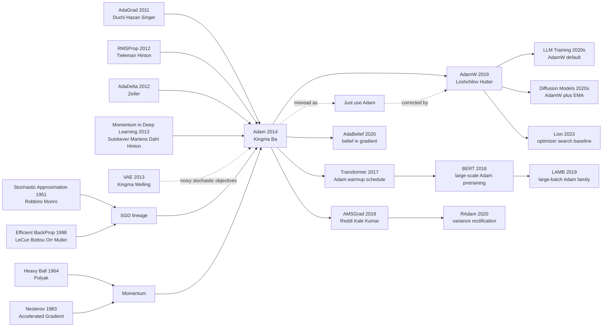

# Adam — 随机优化的自适应矩估计

> **2014 年 12 月 22 日，Diederik P. Kingma 与 Jimmy Lei Ba 把 [arXiv:1412.6980](https://arxiv.org/abs/1412.6980) 挂到网上；几个月后，它以 ICLR 2015 论文的身份进入深度学习工具箱。** Adam 的戏剧性不在于它发明了一个庞大模型，而在于它把训练神经网络时最烦人的日常选择压缩成三个默认数：$\beta_1=0.9, \beta_2=0.999, \epsilon=10^{-8}$。这组看似平凡的超参数后来陪着 Transformer、BERT、扩散模型和大语言模型跑过十年，把“先试 Adam/AdamW”变成深度学习实验的肌肉记忆；也让优化器从论文里的附录细节，变成现代 AI 基础设施的一颗小齿轮。

## 一句话总结

Kingma 与 Ba 2014 年上传、ICLR 2015 发表的 Adam，把“带动量的 SGD”和“按坐标自适应学习率”合成一个几乎无需调参的一阶优化器：先维护一阶矩 $m_t=\beta_1m_{t-1}+(1-\beta_1)g_t$ 与二阶矩 $v_t=\beta_2v_{t-1}+(1-\beta_2)g_t^2$，再用偏差校正后的 $\hat m_t/(\sqrt{\hat v_t}+\epsilon)$ 更新参数。它替代的不是一个单点 baseline，而是 2012-2014 年深度学习训练里的日常混乱：SGD+Momentum/Nesterov 需要精心学习率 schedule，AdaGrad 在长训练中学习率单调衰减到动不了，RMSProp 没有完整论文和偏差校正，AdaDelta 又常常慢。Adam 在 MNIST logistic regression、MLP、卷积网络和 autoencoder 等实验里给出稳定、快、少调参的折中，随后经 [Transformer（2017）](../era3_attention/2017_transformer.md) 的 warmup 配方、BERT/LLM 的 AdamW 训练、扩散模型的去噪目标一路扩散。它的反直觉 lesson 是：深度学习史上最有影响力的算法之一不是更深的网络，而是一个让研究者少花一天调学习率的默认按钮；同时，2018 年 AMSGrad 暴露出的收敛漏洞和 AdamW 对 weight decay 的修正，也提醒我们“默认好用”不等于“理论完美”。

---

## 历史背景

### 2014 年，深度学习最常见的失败不是模型不够深，而是训练跑不稳

Adam 出现时，深度学习已经从“能否训练深层网络”的怀疑期，进入“怎样把训练流程变成可重复工程”的烦躁期。AlexNet 让 GPU+ReLU+Dropout 的路线站稳脚跟，[VAE](https://arxiv.org/abs/1312.6114) 和 GAN 正在把生成模型也推向反向传播训练，[ResNet](2015_resnet.md) 前夜的视觉模型越堆越深。但在很多实验室里，一个新模型能否复现，常常不取决于论文里的结构图，而取决于训练脚本里几行学习率、动量、衰减和初始化。

当时的训练日常有一个非常现实的痛点：**SGD 是正统，但 SGD 的好表现需要人盯着它跑**。你要选初始学习率，要决定什么时候降十倍，要决定 momentum 从 0.5 还是 0.9 起，要在 loss 爆掉时判断是 batch 太小、初始化太坏，还是学习率过大。Sutskever、Martens、Dahl 与 Hinton 2013 年已经证明，精心调好的 momentum SGD 可以训练很深的网络；问题也正藏在“精心调好”四个字里。它给高手很大空间，也给普通研究者很多不确定性。

这就是 Adam 的历史位置：它不是第一个一阶优化器，也不是第一个自适应学习率方法；它的野心更朴素但更有杀伤力：**把足够好的 optimizer 默认值交给每个人**。在 2014 年，能少调一天学习率，就是能多跑十几个模型、能让论文里的 idea 更快过生死线。

### 直接逼出 Adam 的几条线索

- **SGD 与 momentum**：Robbins-Monro 的随机近似给了“用带噪梯度逼近最优”的数学根，Polyak 的 heavy-ball 方法给了“把过去梯度当速度”的直觉，Nesterov 加速则把 lookahead 思想变成深度学习常用 baseline。到 2013 年，SGD+Momentum/Nesterov 已经是强基线，但它依赖全局学习率 schedule。
- **AdaGrad**：Duchi、Hazan 与 Singer 2011 年提出按坐标累计历史平方梯度，让稀疏特征拿到更大的有效步长。它在 NLP 与稀疏学习里很漂亮，但累计量单调变大，长训练里学习率会越缩越小，神经网络后期容易“还没收敛就没力气了”。
- **RMSProp**：Tieleman 与 Hinton 2012 年课程中给出的 RMSProp，用平方梯度的指数滑动平均替代 AdaGrad 的无限累计，解决了单调衰减问题。它很快进入工程实践，却没有一篇完整论文来统一符号、默认值和理论说明。
- **AdaDelta**：Zeiler 2012 年试图去掉手工 learning rate，用梯度与更新量的滑动均方根配平单位。它减少调参，但在很多深度网络上不如 RMSProp/Adam 那样快。
- **在线凸优化的 regret 语言**：AdaGrad 一类方法带来的理论框架让 optimizer 论文可以谈 regret bound，而不只是画 loss 曲线。Adam 继承了这套写法，虽然它后来的收敛证明会被 AMSGrad 修正。

Adam 的巧妙之处不是“从零发明”，而是把这些线索拼成一个工程上能记住、能默认、能搬到所有框架里的算法：momentum 管方向，RMSProp/AdaGrad 管坐标尺度，bias correction 修补早期估计偏差，默认超参数让用户先跑起来。

### Kingma 与 Ba 当时站在什么位置

Diederik P. Kingma 当时在阿姆斯特丹大学，刚刚和 Max Welling 做出 Auto-Encoding Variational Bayes。VAE 这类随机生成模型天然依赖 noisy minibatch gradients：每次采样、每个 batch、每个 latent variable 都会给优化带来方差。对 Kingma 来说，一个“适合 noisy stochastic objectives”的 optimizer 不是旁枝，而是他正在做的生成模型路线的基础设施。

Jimmy Lei Ba 当时在多伦多大学，与 Hinton 学派的训练经验距离很近。多伦多这条线长期重视 optimization tricks：momentum、初始化、Dropout、RMSProp 课程笔记都在那个生态里流动。Adam 因而不是一个孤立数学公式，而是 2010 年代初深度学习实践经验的一次整理：把 Bengio/Hinton 圈子里已经有效的若干训练直觉，压缩成一段足够短的 Algorithm 1。

这篇论文的作者只有两位，这反而强化了它的气质：不像大型系统论文那样靠数据、算力或团队规模取胜，Adam 靠的是“把大家都在做但没人写成标准件的东西写清楚”。它的影响力也因此非常特殊：许多论文会被引用是因为贡献了新模型，Adam 被引用则是因为几乎所有新模型都要先被训练。

### 框架、数据与工业环境给了 Adam 扩散的窗口

2014-2015 年是深度学习框架从研究脚本走向公共基础设施的过渡期。Theano、Torch7、Caffe 已经让 GPU 训练变得可复用，TensorFlow 会在 2015 年出现，PyTorch 还要再等两年。一个 optimizer 如果能用十几行代码实现、只多存两份同形张量、默认值稳定，就会非常容易被框架收进去。Adam 正好满足这个传播条件。

数据与模型也在逼 optimizer 进化。MNIST/CIFAR-10 仍是论文实验常用数据集，但神经网络正在走向更深、更宽、更噪的训练目标：Dropout 带来噪声，batch normalization 还没普及，RNN 和生成模型训练更难，GPU batch size 又受显存限制。全局学习率对所有参数一刀切，越来越不合适；按坐标调步长、同时保留 momentum，正好击中了这个时代的痛点。

工业界的反应几乎是无声的：Adam 没有像 GAN 那样制造图像样本，也没有像 ResNet 那样刷新 ImageNet 榜单；它只是慢慢出现在教程、框架 API、论文附录和默认配置里。几年后，当 Transformer、BERT、扩散模型和 LLM 训练都写下 Adam 或 AdamW 时，人们才回头意识到：2014 年这篇 ICLR 论文实际改写的是“每一次神经网络训练从哪里开始”。

---

## 方法详解

### 整体框架

Adam 的核心可以用一句话说完：**为每个参数坐标各自维护“梯度的指数平均”和“梯度平方的指数平均”，校正早期偏差后，用前者决定方向、后者决定步长尺度**。它仍然是标准一阶优化器，不需要 Hessian，不需要 line search，不需要 batch 之外的额外样本；每个参数只多存两个同形状态张量 $m_t$ 与 $v_t$。

完整训练循环很短：给定随机目标 $f_t(\theta)$，取梯度 $g_t=\nabla_\theta f_t(\theta_{t-1})$，更新一阶矩 $m_t$、二阶矩 $v_t$，做 bias correction，然后按坐标更新 $\theta_t$。默认值 $\alpha=10^{-3}, \beta_1=0.9, \beta_2=0.999, \epsilon=10^{-8}$ 后来被写进 TensorFlow、PyTorch、JAX 和无数论文附录。

| 组件 | Adam 里的角色 | 来自哪条传统 | 解决的训练痛点 |
|------|---------------|--------------|----------------|
| 一阶矩 $m_t$ | 平滑梯度方向 | Momentum / heavy ball | minibatch 梯度抖动大 |
| 二阶矩 $v_t$ | 按坐标估计尺度 | AdaGrad / RMSProp | 不同参数坐标梯度量级差异大 |
| 偏差校正 | 修正初期 $m_t,v_t$ 偏小 | 指数平均统计 | 前几步学习率异常 |
| $\epsilon$ 与默认值 | 数值稳定与可迁移性 | 工程配方 | 用户不用先搜索十组学习率 |

### 关键设计

#### 设计 1：一阶矩与二阶矩的指数滑动平均 —— 把 momentum 和 RMSProp 合在一个状态机里

**功能**：用 $m_t$ 记录“最近梯度的方向”，用 $v_t$ 记录“最近梯度平方的尺度”，让每个坐标既有动量，又有自适应步长。

$$
\begin{aligned}
g_t &= \nabla_\theta f_t(\theta_{t-1}) \\
m_t &= \beta_1 m_{t-1} + (1-\beta_1)g_t \\
v_t &= \beta_2 v_{t-1} + (1-\beta_2)g_t^2
\end{aligned}
$$

这里的平方是逐坐标平方。$m_t$ 像 momentum：如果多个 minibatch 的梯度方向一致，信号会累积；如果方向来回抖动，会被平均掉。$v_t$ 像 RMSProp：如果某个坐标的梯度长期很大，它的分母会变大，有效步长变小；如果某个坐标梯度稀疏而小，它不会被全局学习率压死。

```python
def update_moments(grad, state, beta1=0.9, beta2=0.999):
    state["m"] = beta1 * state["m"] + (1.0 - beta1) * grad
    state["v"] = beta2 * state["v"] + (1.0 - beta2) * (grad * grad)
    return state
```

| 方法 | 记住梯度方向 | 记住梯度尺度 | 长训练中的典型问题 |
|------|--------------|--------------|--------------------|
| SGD | 否 | 否 | 对全局学习率极敏感 |
| Momentum | 是 | 否 | 坐标尺度差异仍靠人工学习率解决 |
| AdaGrad | 否 | 是，且单调累计 | 学习率可能衰减到太小 |
| Adam | 是 | 是，指数滑动平均 | 需要处理早期偏差与后期泛化 |

**设计动机**：Momentum 和 RMSProp 本来解决的是两个不同问题：一个让方向不被噪声带偏，一个让坐标尺度别互相拖累。Adam 的第一步就是承认这两个问题同时存在，而且可以用同一套指数平均写法统一。这个统一非常重要：它让 optimizer 的状态变成“每个参数两个 buffer”，足够简单，框架才能默认支持。

#### 设计 2：Bias correction —— 修复指数平均在训练前几步天然偏小的问题

**功能**：由于 $m_0=0, v_0=0$，指数滑动平均在早期会被零初始化拖低。Adam 显式除以 $1-\beta_1^t$ 与 $1-\beta_2^t$，把估计拉回无偏尺度。

$$
\hat m_t = \frac{m_t}{1-\beta_1^t}, \qquad
\hat v_t = \frac{v_t}{1-\beta_2^t}
$$

这个细节在 $\beta_2=0.999$ 时尤其关键。第一步 $v_1=(1-0.999)g_1^2=0.001g_1^2$，如果不校正，分母会被严重低估，更新步长可能异常大；校正后 $\hat v_1=g_1^2$，行为更接近“从第一步就用合理尺度”。

```python
def bias_correct(state, step, beta1=0.9, beta2=0.999):
    m_hat = state["m"] / (1.0 - beta1 ** step)
    v_hat = state["v"] / (1.0 - beta2 ** step)
    return m_hat, v_hat
```

| 版本 | 初始状态 | 第一步二阶矩尺度 | 训练早期风险 |
|------|----------|------------------|--------------|
| RMSProp 风格 | $v_0=0$，通常不校正 | $(1-\beta_2)g_1^2$ | 分母偏小，步子可能过猛 |
| Adam 不校正版 | $m_0=v_0=0$ | 同样偏小 | 默认超参不够稳 |
| Adam 校正版 | 除以 $1-\beta_i^t$ | 近似 $g_1^2$ | 前几步尺度更可信 |

**设计动机**：这不是漂亮但可有可无的统计修饰，而是 Adam 能“开箱即用”的关键。默认 $\beta_2=0.999$ 意味着二阶矩记忆很长，如果没有 bias correction，前几百步都带着明显的冷启动偏差。Adam 把这个坑在算法层面填掉，用户才不必用额外 warm start 规则处理早期不稳定。

#### 设计 3：按坐标归一化更新 —— 用 $\sqrt{\hat v_t}+\epsilon$ 把学习率从标量变成向量

**功能**：把一阶矩方向除以二阶矩尺度，让每个参数坐标拥有自己的有效学习率，同时用 $\epsilon$ 保证数值稳定。

$$
\theta_t = \theta_{t-1} - \alpha \frac{\hat m_t}{\sqrt{\hat v_t}+\epsilon}
$$

如果某个坐标梯度方差大，$\sqrt{\hat v_t}$ 大，它的步长自然变小；如果某个坐标梯度小或稀疏，分母小，它会得到相对更大的有效步长。这就是 Adam “invariant to diagonal rescaling of the gradients”的来源：把某个坐标梯度整体放大，分子和分母会一起放大，更新量近似不变。

```python
def adam_step(param, grad, state, step, lr=1e-3, beta1=0.9, beta2=0.999, eps=1e-8):
    state = update_moments(grad, state, beta1, beta2)
    m_hat, v_hat = bias_correct(state, step, beta1, beta2)
    param = param - lr * m_hat / (v_hat.sqrt() + eps)
    return param, state
```

| 场景 | 全局学习率 SGD | AdaGrad | Adam |
|------|----------------|---------|------|
| 稀疏梯度 | 稀有特征更新慢 | 有效步长大，适合 | 保留稀疏优势且不会无限衰减 |
| 非平稳目标 | 需要手调 schedule | 历史累计拖累新阶段 | 指数平均能忘掉旧尺度 |
| 梯度尺度差异 | 大坐标支配训练 | 自动缩放 | 自动缩放并带方向动量 |
| 默认可用性 | 依赖经验 | 任务相关 | 默认值通常先跑得动 |

**设计动机**：深度网络不是一个尺度均匀的优化问题。embedding、卷积核、bias、LayerNorm/BatchNorm 参数的梯度统计可能差很多。Adam 用 $\hat v_t$ 把“学习率”从一个全局数变成每个坐标的局部数，同时保留 $\alpha$ 作为全局速度旋钮。这种折中是它比纯 AdaGrad 或纯 momentum 更容易迁移的原因。

#### 设计 4：默认超参数与 AdaMax —— 把算法从论文公式变成可复制配方

**功能**：Adam 不只给一个更新式，还给了默认超参数和一个 $L_\infty$ 范数变体 AdaMax，说明这是一族“moment + norm”优化器，而不是一次性 trick。

$$
u_t = \max(\beta_2 u_{t-1}, |g_t|), \qquad
\theta_t = \theta_{t-1} - \frac{\alpha}{1-\beta_1^t}\frac{m_t}{u_t}
$$

AdaMax 把二阶矩的 $L_2$ 风格尺度换成指数加权的无穷范数 $u_t$。它在后续影响力不如 Adam 主公式，但论文把它放进去很有意义：作者想表达 Adam 的本质不是“某个平方根公式”，而是“用梯度矩估计构造稳定的按坐标步长”。

```python
def adamax_step(param, grad, state, step, lr=2e-3, beta1=0.9, beta2=0.999, eps=1e-8):
    state["m"] = beta1 * state["m"] + (1.0 - beta1) * grad
    state["u"] = torch.maximum(beta2 * state["u"], grad.abs())
    m_hat = state["m"] / (1.0 - beta1 ** step)
    param = param - lr * m_hat / (state["u"] + eps)
    return param, state
```

| 配方元素 | Adam 论文给出的选择 | 为什么利于传播 | 后来的命运 |
|----------|---------------------|----------------|------------|
| $\beta_1$ | 0.9 | 近似通用 momentum 默认值 | 仍常用，LLM 中偶有调整 |
| $\beta_2$ | 0.999 | 长窗口估计梯度尺度 | 仍常用，稀疏/小 batch 会调整 |
| $\epsilon$ | $10^{-8}$ | 防止除零且通常不主导更新 | 框架默认保留 |
| AdaMax | $L_\infty$ 变体 | 展示 Adam 家族化可能 | 影响小于 AdamW/AMSGrad |

**设计动机**：Adam 的胜利很大一部分来自“可复制”。一篇优化器论文如果只说“调这些超参会好”，传播会很慢；Adam 直接给默认值，让读者先运行再细调。AdaMax 则告诉读者：如果二阶矩尺度不合适，还可以换 norm。这种把理论、默认值、变体和实现成本一起打包的写法，让 Adam 很快从论文变成基础设施。

---

## 失败案例

### Baseline 1：SGD / Momentum / Nesterov 不是弱，而是太依赖 schedule

Adam 论文真正想打败的第一个对象，是“调得好的 SGD 系列”。这类方法在 2014 年已经很强：Sutskever、Martens、Dahl 与 Hinton 证明 momentum 和初始化足以让深层网络训练起来，Nesterov momentum 也常常是神经网络实验的可靠 baseline。但它们的弱点不在单步公式，而在**训练过程需要人工调度**。同一个初始学习率，早期可能太小、后期可能太大；一次降学习率的时机错了，loss 曲线就会拖很久。

Adam 的实验曲线经常体现这个差异：SGD 系列并非一定最终最差，但它需要更认真地找学习率和衰减策略。Adam 则用默认 $\alpha=10^{-3}$ 就能在多个任务上给出可竞争曲线。换句话说，SGD 失败的不是“数学能力”，而是“默认工程体验”。这也是为什么后来许多大模型仍会研究 SGD 的泛化优势，却很少把它作为第一个预训练默认值。

### Baseline 2：AdaGrad 适合稀疏梯度，却容易在长训练里刹车过度

AdaGrad 的优点很明确：每个坐标累计历史平方梯度，稀疏特征因为累计量小，会获得更大的有效学习率。在 NLP、推荐和稀疏线性模型里，这个性质很有价值。问题是累计量只增不减，训练越久，分母越大，有效学习率越小。深度网络不是一次短跑，而是长时间非平稳优化；如果前期的大梯度把某些坐标的学习率压得太低，后期新阶段就很难恢复。

Adam 用指数滑动平均替代 AdaGrad 的无限累计，相当于给二阶矩一个“遗忘机制”。这让它在非平稳目标上更合适：模型进入新的 loss 地形时，旧梯度尺度不会永远绑住当前步长。AdaGrad 因此不是被 Adam 全面否定，而是被保留了“按坐标自适应”的精神，同时砍掉了“历史永不遗忘”的负担。

### Baseline 3：RMSProp / AdaDelta 已经接近答案，但缺少 Adam 的校正与标准化

RMSProp 是 Adam 最近的亲戚。它也用梯度平方的指数平均来缩放更新，所以很多实践者在 Adam 前已经靠 RMSProp 训练 RNN、CNN 和生成模型。RMSProp 的问题是“工程上有效，论文上松散”：它来自 Hinton 课程讲义，不是一个完整标准化算法；不同实现对 momentum、epsilon、中心化与学习率的处理并不一致。

AdaDelta 则走另一个方向：试图去掉学习率，用更新量与梯度量的 RMS 比值配平单位。它减少手调，但在 Adam 论文的多组实验里往往收敛较慢或曲线不如 Adam 稳。Adam 的改进点不是神秘魔法，而是把 RMSProp 的二阶矩、momentum 的一阶矩、bias correction 和默认超参合成一个可以复制的配方。

### Baseline 4：Adam 自己的早期理论假设也在后来暴露问题

Adam 论文给出了在线凸优化 regret bound，这在 2015 年让算法看起来比普通工程 trick 更稳固。但 2018 年 Reddi、Kale 与 Kumar 指出，原始 Adam 的收敛论证存在漏洞：在某些凸优化反例里，自适应学习率的变化可能让算法不收敛。AMSGrad 随后提出让二阶矩上界单调不减，修补有效学习率反复变大的问题。

这个“失败案例”很重要，因为它不是外部 baseline 输给 Adam，而是 Adam 自己的理论版本输给了后来的审查。它没有推翻 Adam 的工程价值，却改变了我们理解 Adam 的方式：Adam 是一个极其成功的默认 optimizer，但不是一个已经被 2015 年证明完全闭合的数学对象。

| Baseline / 问题 | 当时强在哪里 | 主要失败模式 | Adam 的对应处理 |
|-----------------|--------------|--------------|----------------|
| SGD+Momentum/Nesterov | 泛化好，理论清楚，强基线 | 依赖学习率 schedule 与人工调参 | 默认自适应步长，减少调度负担 |
| AdaGrad | 稀疏特征友好，regret 理论漂亮 | 累计平方梯度单调增长，长训练变慢 | 指数二阶矩可遗忘旧尺度 |
| RMSProp/AdaDelta | 工程有效，少调参 | 标准化不足或收敛偏慢 | 一阶矩+二阶矩+偏差校正统一 |
| 原始 Adam 理论 | 给出 regret 论证 | 后来被 AMSGrad 发现反例 | 发展出 AMSGrad、AdamW、RAdam 等修正 |

## 实验关键数据

### 原论文的实验规模：小任务，但覆盖了当时常见训练形态

Adam 论文的实验不是后来那种 ImageNet 或大语言模型级别的系统实验，而是 2014 年 optimizer 论文常见的“小而多”验证：逻辑回归、多层神经网络、卷积网络、autoencoder。数据集主要围绕 MNIST、CIFAR-10 与小规模图像/表征任务展开。作者更关心的是 loss 曲线和优化速度，而不是单一榜单分数。

这种设计有局限，但也合理。优化器论文如果只在一个巨大模型上胜出，很难判断胜利来自 optimizer 还是架构/调参；Adam 用多个中小任务展示同一种现象：默认超参下曲线通常更快、更稳、对梯度噪声更耐受。它证明的是“作为默认起点值得信任”，不是“在每个任务上最终泛化一定最好”。

### 关键读法：Adam 赢在默认速度与鲁棒性，不是赢在终局神谕

从论文图表读 Adam，最重要的不是背某个最终误差数字，而是看曲线形状：训练早期 Adam 通常下降更快；面对稀疏或 noisy gradients 时，它比 SGD/AdaGrad 更少卡住；在 autoencoder 与卷积网络中，它常常以较少调参达到可竞争 loss。这解释了为什么 Adam 后来迅速扩散：研究者需要的往往不是理论上最优的 optimizer，而是“我今晚能先让模型跑起来”的 optimizer。

但也要读出负面信息。原论文没有证明 Adam 在大规模视觉、语言预训练或极长训练中泛化最好；也没有处理 weight decay 与 adaptive moments 的耦合问题；更没有预见到 Transformer warmup 会成为 Adam 的重要搭档。Adam 的实验展示了一个强默认值，而不是给所有未来模型开了空白支票。

### 实验现象表

| 实验类型 | 任务/模型 | 主要对比对象 | 论文中最重要的现象 |
|----------|-----------|--------------|--------------------|
| Logistic regression | MNIST 风格分类 | SGD、AdaGrad、RMSProp 等 | Adam 默认设置收敛快，早期 loss 曲线更稳 |
| 多层神经网络 | 全连接分类网络 | SGD+Momentum、AdaGrad、AdaDelta | Adam 在较少调参下达到可竞争训练速度 |
| 卷积神经网络 | CIFAR-10 / 图像分类 | Momentum 与自适应方法 | Adam 对 noisy minibatch 梯度更耐受 |
| Autoencoder | 无监督重构任务 | AdaGrad、RMSProp、AdaDelta | Adam 在非平稳重构目标上保持较快下降 |

### 论文没有解决的实验问题

第一，实验没有给出后来最关键的大规模泛化比较。2017 年以后，很多研究发现 Adam/AdamW 训练速度很好，但在某些视觉分类或小数据任务上，SGD 可能给出更好的最终泛化。这个问题不在 Adam 原论文的实验范围内。

第二，原论文的 weight decay 语义还没有被拆开。L2 regularization 直接加进 Adam 梯度，会被自适应分母重新缩放；这和 SGD 里的 weight decay 不是同一件事。AdamW 直到 2019 年才把这个问题标准化解决。

第三，Adam 的默认值不是永远默认。Transformer 使用 warmup 与特殊 decay，LLM 常调 $\beta_2$、epsilon、weight decay 和 gradient clipping，扩散模型也会配合 EMA 和学习率策略。Adam 的实验给了一个强起点，后来的大模型训练把它改造成一整套配方。

---

## 思想史脉络



### 前世（被谁逼出来的）

- **随机近似与 SGD**：Robbins-Monro 给出随机梯度方法的数学祖先，后来 SGD 成为神经网络训练的默认骨架。Adam 没有离开这条主线，它仍然只是“用当前 minibatch 梯度走一步”；它改变的是这一步的尺度和方向记忆。
- **Momentum / Nesterov**：Polyak heavy ball 与 Nesterov 加速把“别只看当前梯度，要记住速度”变成优化常识。Adam 的 $m_t$ 是这条传统在 noisy minibatch 环境下的工程化版本。
- **AdaGrad**：Duchi、Hazan 与 Singer 把按坐标自适应步长写成严肃理论。Adam 继承了“每个坐标不同学习率”的思想，但把无限历史累计改成可遗忘的指数平均。
- **RMSProp / AdaDelta**：RMSProp 已经非常接近 Adam 的二阶矩逻辑，AdaDelta 则强调少调参。Adam 的贡献是把它们与 momentum、bias correction、默认超参数合并成一个清晰可引用的算法。
- **VAE 与随机生成模型**：Kingma 的 VAE 背景让 Adam 更自然地面向 stochastic objectives。生成模型、RNN、Dropout 都让梯度更噪；Adam 不是抽象凸优化玩具，而是为这类训练现实服务。

### 今生（继承者）

- **AMSGrad**：2018 年指出 Adam 原始收敛证明的问题，并用二阶矩最大值上界修补理论缺口。它让 Adam 家族从“默认好用”进入“必须讨论有效学习率单调性”的阶段。
- **AdamW**：Loshchilov 与 Hutter 把 weight decay 从 Adam 的梯度更新里解耦，修正了 L2 正则被自适应分母重缩放的问题。今天大模型训练说“Adam”时，很多时候实际指 AdamW。
- **Transformer / BERT / LLM 训练**：Transformer 把 Adam 与 warmup、inverse-square-root decay 绑定；BERT 把 AdamW 带进大规模预训练；LLM 时代则把 $\beta_2$、weight decay、gradient clipping、scheduler 与 AdamW 组成完整训练配方。
- **LAMB / RAdam / AdaBelief / Lion**：这些工作都没有绕开 Adam，而是在它周围改一个关键部件：层级 trust ratio、早期方差修正、二阶矩语义、符号化更新。Adam 成了新 optimizer 必须解释自己“相对谁更好”的坐标原点。
- **Diffusion 与生成模型**：扩散模型的 denoising objective 噪声大、训练长、参数多，天然适合 AdamW 加 EMA 的配方。Adam 由此从判别模型默认值延伸到现代生成模型默认值。

### 误读 / 简化

- **“Adam 总比 SGD 好”**：错误。Adam 通常训练快、调参少，但在某些视觉分类、小数据或需要强泛化的场景里，SGD+Momentum 仍可能给出更好的最终测试表现。Adam 的默认优势不等于泛化优势。
- **“Adam 不需要学习率 schedule”**：错误。Adam 减少了 schedule 的敏感性，但 Transformer warmup、cosine decay、linear decay、LLM pretraining schedules 都证明 schedule 仍然关键。Adam 解决的是“第一步怎么跑起来”，不是“全程不用管理”。
- **“Adam 的理论已经在原论文完成”**：错误。AMSGrad 的反例说明原始证明不足。Adam 的历史地位来自工程事实与后续修正共同支撑，而不是 2015 年版本的一次性闭合。
- **“AdamW 只是 Adam 加一点 weight decay”**：过度简化。AdamW 的关键是 decoupling：不要把 weight decay 当作普通梯度再交给自适应分母处理。这个小改动解释了为什么大模型默认从 Adam 转向 AdamW。
- **“优化器只是附录细节”**：Adam 的引用量恰恰说明相反。模型结构决定能表达什么，优化器决定这个表达能力能否稳定到达。深度学习历史里，很多大模型成功都站在 Adam 这类“看不见的基础设施”上。

---

## 当代视角

### 站不住的假设

1. **“Adam 的收敛理论已经足够”** —— 已被 AMSGrad 修正。原论文的 regret bound 给了一个重要起点，但 Reddi、Kale 与 Kumar 2018 年的反例说明，自适应有效学习率可能反复变大，导致某些凸问题不收敛。今天读 Adam，必须把“原始理论”和“Adam 家族后续理论”分开。
2. **“默认 $\beta_1=0.9, \beta_2=0.999$ 适合所有训练”** —— 只对一部分任务成立。LLM、小 batch、稀疏梯度、强化学习和扩散模型常会调 $\beta_2$、epsilon、gradient clipping 或 scheduler。Adam 给了强默认值，但没有取消 optimizer tuning。
3. **“自适应优化器天然泛化更好”** —— 证据不支持。Adam 训练 loss 通常降得快，但在某些视觉分类和小数据任务上，SGD+Momentum 的最终泛化仍可能更好。AdamW 修正了 weight decay 问题，却没有把“训练快”和“泛化最好”自动合并。
4. **“Adam 不需要学习率 warmup”** —— Transformer 之后很难再这么说。大模型训练里，warmup 经常不是装饰，而是防止早期不稳定和自适应矩估计未成熟的保护层。
5. **“优化器不是主要贡献，只是实现细节”** —— Adam 的十年影响证明相反。没有 Adam/AdamW 这种稳定默认值，很多架构的探索速度会慢得多，尤其是需要长时间 noisy training 的模型。

### 时代留下的关键

- **默认可用性是一种研究生产力**：Adam 让研究者不用把每个新模型都先变成 optimizer 调参项目。这个生产力收益不会出现在单个 benchmark 表里，却会改变整个领域的迭代速度。
- **moment estimates 成了 optimizer 语言的基本单位**：后续 AMSGrad、AdamW、RAdam、AdaBelief、LAMB、Lion 都在改 moment、norm、regularization 或 trust ratio。Adam 定义了这套讨论坐标系。
- **工程标准化和理论优雅同样重要**：RMSProp 已经很有效，但 Adam 把它写成可引用、可默认、可实现、可理论讨论的算法。这说明论文影响力不只来自“第一个想到”，也来自“把它标准化”。
- **大模型训练把 Adam 变成 AdamW 配方**：2026 年回看，Adam 最重要的后代不是 AdaMax，而是 AdamW 加 scheduler、warmup、clip、EMA 的训练栈。

### 如果今天重写 Adam

如果 Kingma 与 Ba 在 2026 年重写 Adam，正文很可能会直接把 AdamW 纳入主算法，而不是把 weight decay 交给普通 L2 正则；会把 warmup 与 scheduler 作为推荐配方，而不是只给固定学习率默认值；会在理论章节纳入 AMSGrad 反例和有效学习率单调性；会在实验里加入 Transformer、扩散模型和大 batch 训练；也会更明确地区分“训练速度”“最终泛化”“超参鲁棒性”三种目标。

但核心不会变：用一阶矩记方向，用二阶矩记尺度，用偏差校正处理冷启动，用默认超参数降低实验摩擦。Adam 的伟大不是它终结了优化器研究，而是它把一个足够强、足够短、足够稳定的 update rule 变成了深度学习的公共语言。

## 局限与展望

### 作者承认的局限

- Adam 是一阶方法，不能像二阶方法那样显式使用曲率矩阵；它只用对角尺度近似局部几何。
- 原论文的理论主要在在线凸优化框架下展开，和深度网络的非凸训练之间存在距离。
- 实验规模有限，更多证明“默认可用”，而不是证明所有大规模任务上的终局最优。
- AdaMax 是一个有趣变体，但原论文没有展示它在后来主流深度学习任务中的压倒性必要性。

### 2026 视角的局限

- **泛化争议**：Adam/AdamW 往往训练快，但不一定在所有任务上给出最好的测试误差。优化速度和泛化行为之间仍没有简单定理。
- **weight decay 语义混淆**：原始 Adam 里的 L2 正则会被 adaptive denominator 影响，AdamW 的出现说明原论文默认写法并不够干净。
- **大模型配方依赖性**：现代 AdamW 很少单独存在，通常与 warmup、cosine/linear decay、gradient clipping、EMA、loss scaling 和分布式训练技巧绑定。Adam 本身不解释这些配方的全部相互作用。
- **内存成本仍然真实**：每个参数两个额外状态在小模型里无所谓，但在千亿参数模型里意味着优化器状态是显存/内存大头。8-bit Adam、ZeRO、Adafactor 等工作都在补这个成本。
- **理论与实践仍有缝隙**：AMSGrad 修正了一个问题，但深度网络中 AdamW 为什么“通常好用”的完整理论仍未闭合。

### 展望

未来 Adam 家族的演化大概率沿三条线继续：第一，**更省内存**，例如 factored moments、8-bit optimizer、分页 optimizer state；第二，**更适配大 batch / 长序列 / 稀疏激活**，例如 layer-wise trust ratio 或按模块调 $\beta_2$；第三，**更少人工配方**，让 warmup、decay、clip、weight decay 与 moment 参数自动协同。Adam 不会是最后一个默认 optimizer，但它定义了后来者必须超过的默认体验。

## 相关工作与启发

### vs SGD / Momentum

SGD+Momentum 的优势在于简洁、泛化和理论传统；Adam 的优势在于默认速度、少调参和噪声鲁棒性。两者不是简单胜负关系，而是不同工程目标：如果你要训练一个新架构先判断能不能跑，Adam/AdamW 往往更合适；如果你在经典视觉分类任务上追最后 0.2 个百分点，SGD 仍值得认真调。

### vs AdaGrad / RMSProp / AdaDelta

Adam 可以看成这三条线的标准化合成：保留 AdaGrad 的坐标自适应，吸收 RMSProp 的指数二阶矩，继承 AdaDelta 的少调参目标，再补上一阶矩和 bias correction。它的启发是：研究贡献不一定要完全新；把若干半成熟实践合成一个清晰接口，也能成为里程碑。

### vs AdamW / AMSGrad / LAMB

AdamW 修正 regularization 语义，AMSGrad修正收敛反例，LAMB把 Adam 带进极大 batch 训练。这些后继工作共同说明 Adam 是一个平台，而不是终点。后来的 optimizer 论文如果仍沿用 $m_t,v_t$，本质上就是在 Adam 给出的抽象层上继续开发。

### vs 二阶优化与 Shampoo / K-FAC

二阶或准二阶方法试图更好地估计曲率，理论上能给出更聪明的方向；代价是计算、通信和实现复杂度。Adam 选择了对角二阶矩这个极简近似，牺牲几何精度换取可扩展性。大模型时代仍在探索 Shampoo、K-FAC 等方法，但 AdamW 的地位说明：在真实系统里，简单、稳定、易并行经常比更精确的局部几何更重要。

## 相关资源

- 📄 [Adam: A Method for Stochastic Optimization](https://arxiv.org/abs/1412.6980)
- 🧾 [ICLR / OpenReview 页面](https://openreview.net/forum?id=8gmWwjFyLj)
- 📄 [AMSGrad: On the Convergence of Adam and Beyond](https://openreview.net/forum?id=ryQu7f-RZ)
- 📄 [AdamW: Decoupled Weight Decay Regularization](https://arxiv.org/abs/1711.05101)
- 📄 [RAdam: On the Variance of the Adaptive Learning Rate and Beyond](https://arxiv.org/abs/1908.03265)
- 📄 [LAMB: Large Batch Optimization for Deep Learning](https://arxiv.org/abs/1904.00962)
- 🔗 [PyTorch Adam 文档](https://pytorch.org/docs/stable/generated/torch.optim.Adam.html)
- 🔗 [PyTorch AdamW 文档](https://pytorch.org/docs/stable/generated/torch.optim.AdamW.html)
- 🌐 跨语言：英文版 → [`/en/era2_deep_renaissance/2014_adam/`](/en/era2_deep_renaissance/2014_adam/)


---

> 🌐 [English version](/en/era2_deep_renaissance/2014_adam/) · 📚 awesome-papers project · CC-BY-NC