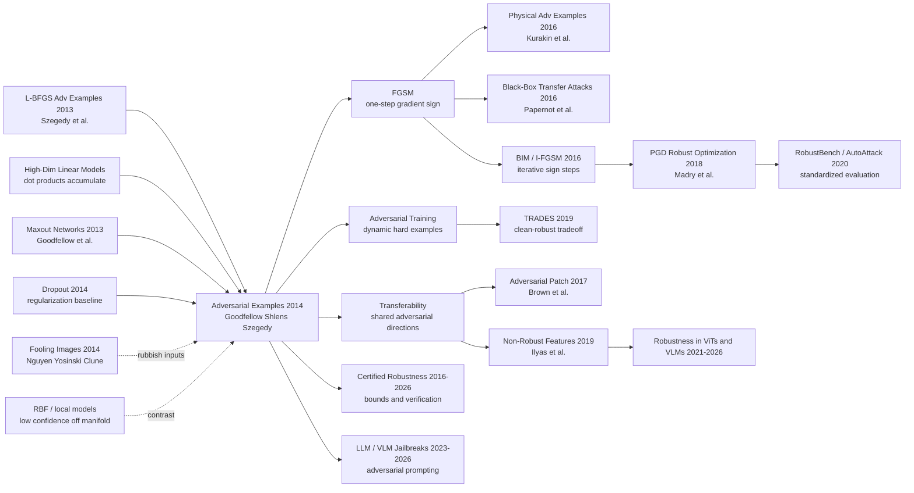

# Adversarial Examples — 线性解释、FGSM 与现代鲁棒性的起点

> **2014 年 12 月 20 日，Google 的 Ian J. Goodfellow、Jonathon Shlens、Christian Szegedy 三位作者把 [arXiv:1412.6572](https://arxiv.org/abs/1412.6572) 放到网上，次年发表于 ICLR 2015。** 这篇论文最抓人的地方不是“发现神经网络会犯错”，而是把一个像魔术的现象拆成一行高维线性代数：$\eta = \epsilon\,\mathrm{sign}(\nabla_x J(\theta,x,y))$。在 ImageNet 的经典 panda 图里，只加上 $\epsilon=0.007$ 的扰动，GoogLeNet 就从 57.7% 的“panda”变成 99.3% 的“gibbon”。从那一刻起，深度学习的安全问题不再是边角料 bug，而是训练目标、表示几何和部署可靠性的正面战场。

## 一句话总结

Goodfellow、Shlens、Szegedy 2014 年发表于 ICLR 2015 的这篇论文，把 Szegedy 等 7 位作者 2013 年用昂贵 L-BFGS 发现的“对抗样本谜题”改写成一个可训练、可复现、可防御的公式：$\eta = \epsilon\,\mathrm{sign}(\nabla_x J(\theta,x,y))$。它反驳了“深网太非线性 / 过拟合所以脆弱”的早期解释，提出真正危险的是高维空间里的近似线性：每个像素只动 1/255，看起来几乎无感，但 $n$ 个维度上的同向小扰动会在 logit 里累积成 $\epsilon m n$ 级别的变化。FGSM 让 shallow softmax 在 MNIST 上达到 99.9% 对抗错误率，让 maxout network 达到 89.4%，还把 GoogLeNet 的 panda 变成 99.3% 置信度的 gibbon。更重要的是，论文第一次把 adversarial training 变成便宜的内循环：MNIST maxout 的 clean error 从 0.94% 降到 0.84%，大模型五次平均 0.782%，FGSM 对抗错误率从 89.4% 降到 17.9%。后续 [PGD adversarial training（2018）](../era3_attention/2018_pgd.md) 把它升级成鲁棒优化标准范式，[ResNet（2015）](2015_resnet.md) 之后的所有视觉骨干也都必须回答同一个问题：高准确率到底是不是可靠理解。

---

## 历史背景

### 2013 年底的安全盲点

2012 年 AlexNet 之后，深度学习社区的主线叙事很清楚：更深的卷积网络、更大的数据集、更好的 GPU，会把视觉识别一路推向工业可用。ImageNet top-5 error 被连续刷新，GoogleNet / VGG 正在成形，Facebook 和 Google 都在把 CNN 送进真实产品。这个时代的默认信念是：只要 test accuracy 足够高，模型就大体学到了目标概念。

Szegedy、Zaremba、Sutskever、Bruna、Erhan、Goodfellow、Fergus 等 7 位作者在 2013 年底扔出的 [Intriguing Properties of Neural Networks](https://arxiv.org/abs/1312.6199) 打碎了这层安全感。他们用 box-constrained L-BFGS 找到一批肉眼几乎看不出差异的图片，却能让高精度网络高置信度错判；更反直觉的是，这些样本会在不同架构、不同训练集切分之间迁移。也就是说，对抗样本不是某个模型的偶然裂缝，而像是多种深网共同学到的决策边界漏洞。

问题在于，Szegedy 论文给出了现象，却没有给出足够可操作的解释。L-BFGS 攻击慢、贵、像一个离线优化黑箱；“深网太非线性”和“高维空间里有许多孤立口袋”听起来合理，却解释不了为什么线性 softmax 也会中招，也解释不了为什么同一张对抗图会骗过另一个模型。2014 年的鲁棒性研究卡在这里：大家知道有洞，却不知道洞的形状。

### 从 L-BFGS 谜题到线性解释

Goodfellow、Shlens、Szegedy 三位作者的关键转向，是把“神经网络太复杂所以出错”倒过来讲：模型不是因为太非线性而脆弱，而是因为在训练和优化意义上太线性。ReLU、maxout、LSTM 甚至精心初始化的 sigmoid 网络，都被设计成在大部分有效区域里不要饱和，这样反向传播才顺畅。优化友好的代价，是输入方向上的小扰动会沿着大量维度累积。

论文第 3 节给出最简洁的推理。对线性模型 $w^\top x$，如果每个输入维度都允许 $\|\eta\|_\infty < \epsilon$ 的微小变化，那么让扰动取权重符号方向 $\eta = \epsilon\,\mathrm{sign}(w)$，logit 会增加 $w^\top \eta$。若权重平均绝对值为 $m$、维度为 $n$，这个增加量近似是 $\epsilon m n$。单个像素变化微小，几千个像素同向累加就不微小了。

这解释了三个此前说不清的事实。第一，对抗样本不需要精细搜索孤立点，只需要沿着正确方向跨出一小步。第二，线性模型和深度模型都会脆弱，因为深度模型局部也常近似线性。第三，对抗样本会迁移，因为不同模型在同一任务上会学到相似的梯度方向和分类权重。论文把这个现象形容成模型在数据流形附近搭起的“Potemkin village”：自然样本上像真的，离开流形一步就露馅。

### Google 内部的作者组合

这篇论文的作者表很短，但位置很特殊。Ian J. Goodfellow 刚从 Bengio 实验室进入 Google，前一年已经以 GAN 和 maxout networks 站到生成模型与表示学习的中心；Jonathon Shlens 长期做神经科学、视觉编码和表示分析；Christian Szegedy 则是最早系统发现 adversarial examples 的作者之一，也是 GoogLeNet 背后的关键人物。三位作者的组合，让这篇论文同时具备三个气质：数学解释要简洁，攻击算法要能跑，防御实验要能影响真实视觉模型。

工业背景也重要。2014 年的 Google 已经在训练大规模 CNN，DistBelief / early TensorFlow 生态正在内部形成，ImageNet 模型离产品部署越来越近。对这种系统来说，“99% clean accuracy 但一张几乎相同的图片会被 99% 置信度错判”不是哲学问题，而是部署风险。论文中的 panda 示例之所以流传十多年，正因为它把抽象安全问题压缩成一个产品经理也能看懂的画面：一只熊猫加上一层几乎不可见的噪声，就被模型叫成了长臂猿。

### 鲁棒性问题为何在当时突然变成主线

2014 年之前，模型可靠性更多被写成泛化、正则化或 calibration 问题；鲁棒性还不是一个独立战场。对抗样本改变了这一点，因为它把“测试集高分”与“局部稳定”明确拆开。一个模型可以在自然 test set 上几乎满分，同时在 $\ell_\infty$ 半径很小的邻域里大面积错判。换句话说，accuracy 只测了数据流形上的点，没有测流形周围的斜率。

这篇论文的历史位置正是在这里：它让 adversarial examples 从昂贵的异常现象，变成一个一行公式就能生成、一个训练目标就能利用、一个跨模型实验就能验证的研究对象。此后 adversarial robustness、certified robustness、physical attacks、red-team evaluation、LLM jailbreak、视觉语言模型攻击，几乎都继承了这个基本动作：不是问模型在普通输入上答对多少，而是问它在最坏方向上还能保持多少。

## 研究背景与动机

### 这篇论文真正想替换什么

论文要替换的不是某一个攻击算法，而是一套错误直觉。第一，它替换了“深网因为非线性太强而脆弱”的解释，改成“深网为了好优化而保持局部线性，所以脆弱”。第二，它替换了“对抗样本是稀有离散口袋”的几何想象，改成“对抗方向形成宽阔连续区域”的几何想象。第三，它替换了“防御必须靠昂贵内层优化”的训练流程，改成“一个反向传播步骤就能动态产生 hard example”。

这三个替换合在一起，使论文的动机非常清楚：如果漏洞来自训练目标没有约束局部最坏方向，那么防御也应该进入训练目标本身。FGSM 既是攻击，也是显微镜；adversarial training 既是防御，也是新的正则化。论文不是单纯告诉大家“模型不安全”，而是在说：我们可以把不安全点系统性地拿出来训练，模型会学到更局部稳定的函数。

这个动机后来被 Madry 等作者在 2018 年推到极致：把训练写成 $\min_\theta \mathbb{E}_{(x,y)}[\max_{\|\delta\|\leq \epsilon} J(\theta,x+\delta,y)]$。但 2014 年这篇论文先完成了更关键的第一步：证明内层最大化不必总是昂贵的 L-BFGS，至少可以用梯度符号给出一个足够强、足够便宜、足够可复现的近似。

---

## 方法详解

### 整体框架

这篇论文的技术骨架很紧：先用高维线性模型解释为什么微小扰动会积累成大 logit 改变，再把这个解释推广到局部近似线性的深度网络，最后把攻击变成训练时的 hard-example mining。它不是“又提出一个复杂防御模块”，而是把攻击、防御和解释都压到同一个梯度符号方向里。

| 层次 | 问题 | 本文动作 | 直接产物 |
|------|------|----------|----------|
| 现象 | L-BFGS 找到不可见扰动，但太慢 | 解释为高维线性累积 | 漏洞不再神秘 |
| 攻击 | 如何快速找最坏方向 | 用输入梯度符号一步生成 | FGSM |
| 防御 | 如何把漏洞放回训练 | clean loss 与 adversarial loss 混合 | adversarial training |
| 诊断 | 为什么会跨模型迁移 | 梯度方向形成连续子空间 | transferability hypothesis |

整篇论文的优雅之处在于，它没有把“攻击”和“防御”拆成两个系统。FGSM 是攻击者的一步，也是训练者的一步；线性解释既说明模型为什么输，也说明为什么随机噪声不够强。这个统一性，是它比早期 L-BFGS 发现更有生命力的原因。

### 关键设计

#### 设计 1：Fast Gradient Sign Method，用一阶梯度替代 L-BFGS

**功能**：在 $\ell_\infty$ 约束下，用一次反向传播生成足够强的最坏方向扰动，把对抗样本从“昂贵离线求解”变成“训练循环里的常规 batch 变换”。

$$
\eta = \epsilon\,\mathrm{sign}\left(\nabla_x J(\theta, x, y)\right), \qquad x_{adv}=x+\eta
$$

这个公式来自对 loss 在当前输入点的一阶线性化：如果 $J(\theta,x,y)$ 在小邻域内近似线性，那么最大化 $J$ 的 $\ell_\infty$ 受限扰动，就是把每个维度推向梯度符号方向。它牺牲了 L-BFGS 的精细最优性，换来三个关键属性：快、可复现、能塞进训练。

```python
def fgsm_attack(model, x, y, epsilon):
    x = x.detach().clone().requires_grad_(True)
    loss = cross_entropy(model(x), y)
    loss.backward()
    perturbation = epsilon * x.grad.sign()
    x_adv = (x + perturbation).clamp(0.0, 1.0)
    return x_adv.detach()
```

| 方法 | 内层求解 | 成本 | 2014 年意义 |
|------|----------|------|-------------|
| L-BFGS attack | 多步约束优化 | 高 | 证明漏洞存在 |
| 随机噪声 | 无目标采样 | 低 | 作为弱 control |
| **FGSM** | 一步梯度符号 | 低 | 让攻击和训练都可规模化 |
| 后续 PGD | 多步 FGSM + 投影 | 中高 | 成为鲁棒优化标准内层 |

**设计动机**：L-BFGS 的问题不是攻击不强，而是研究闭环太慢。每次都要解一个优化问题，adversarial training 就无法大规模实验。FGSM 把内层攻击变成一次 backward，等于把鲁棒性研究从“演示一个现象”推进到“训练一个模型”。

#### 设计 2：高维线性累积解释，反驳“太非线性”叙事

**功能**：解释为什么每个像素极小的变化能让模型高置信度错判，也解释为什么浅层线性模型、maxout network、GoogLeNet 都会被同类方向击中。

$$
w^\top (x + \eta) = w^\top x + w^\top \eta \approx w^\top x + \epsilon m n
$$

如果 $n$ 很大，$\epsilon$ 很小并不安全。8-bit 图像里 $1/255$ 的变化对人眼近乎不可见，但在数千维输入上，所有维度朝同一符号方向推，就会在 logit 上合成一个大步长。这个解释把 adversarial examples 从“神经网络黑箱怪事”降维成“高维点积的正常后果”。

```python
def linearized_logit_gain(weight, epsilon):
    signed_step = epsilon * weight.sign()
    gain = torch.dot(weight.flatten(), signed_step.flatten())
    return gain.item()
```

| 解释候选 | 能解释线性 softmax 吗 | 能解释迁移吗 | 本文判断 |
|----------|----------------------|--------------|----------|
| 极端非线性 | 否 | 弱 | 不必要 |
| 过拟合 | 否 | 弱 | 不充分 |
| 孤立口袋 | 弱 | 否 | 与连续子空间实验冲突 |
| **高维线性** | 是 | 是 | 核心解释 |

**设计动机**：一个好解释必须同时覆盖 shallow softmax、maxout network 和 ImageNet CNN。线性解释的力量在于，它不需要给深网添加神秘属性；只要模型在局部有足够大的线性片段，FGSM 就能工作。这个观点后来直接影响了“non-robust features”与“robust optimization”的讨论。

#### 设计 3：FGSM adversarial training，把攻击转成正则化

**功能**：在训练时动态生成当前模型的对抗样本，用 clean loss 和 adversarial loss 的混合目标训练模型，让模型在局部最坏方向上也被纠正。

$$
\tilde{J}(\theta,x,y)=\alpha J(\theta,x,y)+(1-\alpha)J\left(\theta,x+\epsilon\,\mathrm{sign}(\nabla_x J(\theta,x,y)),y\right)
$$

论文所有实验使用 $\alpha=0.5$。这个设计有两个细节常被忽略：第一，对抗样本不是预先生成的静态数据集，而是随着模型参数变化不断刷新；第二，它不是普通 data augmentation，因为扰动方向被主动选择为最坏方向，而不是从自然变换分布里随机采样。

```python
def adversarial_training_step(model, optimizer, x, y, epsilon, alpha=0.5):
    x_adv = fgsm_attack(model, x, y, epsilon)
    clean_loss = cross_entropy(model(x), y)
    adv_loss = cross_entropy(model(x_adv), y)
    loss = alpha * clean_loss + (1.0 - alpha) * adv_loss
    optimizer.zero_grad()
    loss.backward()
    optimizer.step()
    return loss.item()
```

| 训练方式 | 额外样本如何来 | 对最坏方向敏感吗 | 论文结果 |
|----------|----------------|------------------|----------|
| Dropout only | 无 | 否 | clean error 0.94% |
| 随机 $\pm\epsilon$ 噪声 | 随机方向 | 弱 | 对 FGSM 仍约 86.2% 错误 |
| Uniform noise | 随机盒内采样 | 弱 | 对 FGSM 仍约 90.4% 错误 |
| **FGSM adversarial training** | 梯度最坏方向 | 是 | clean error 0.84%，对抗错误降到 17.9% |

**设计动机**：随机噪声的期望点积通常接近 0，常常没有真正增加训练难度。FGSM 则像 hard example mining：每个 batch 都问模型“当前最容易在哪里被骗”，然后把这个点拿来训练。它不是完整鲁棒性的终点，但第一次让这个闭环便宜到可以反复跑。

#### 设计 4：迁移性与连续子空间诊断，把单点攻击变成几何问题

**功能**：用 $\epsilon$ 方向扫描和跨模型分类实验说明，对抗样本不是离散孤岛，而是沿梯度方向存在宽阔区域；不同模型会在这些区域里犯相似错误。

$$
\left\{x + t\,\mathrm{sign}(\nabla_x J): t \in [-\epsilon, \epsilon]\right\}
$$

论文第 8 节的关键思想是“方向比具体点更重要”。如果沿同一条 FGSM 方向改变 $t$，模型的未归一化 log-probability 会呈现明显的分段线性，并且错误分类会在一段连续区间内稳定存在。这解释了为什么对抗样本能够迁移：另一个模型不需要在同一个精确点有同样裂缝，只要它的梯度方向和决策边界有相似线性成分即可。

```python
def epsilon_sweep(model, x, y, eps_values):
    x0 = x.detach().clone().requires_grad_(True)
    loss = cross_entropy(model(x0), y)
    loss.backward()
    direction = x0.grad.sign().detach()
    logits = []
    for eps in eps_values:
        logits.append(model((x + eps * direction).clamp(0.0, 1.0)).detach())
    return torch.stack(logits)
```

| 诊断对象 | 论文观察 | 支持的结论 | 后续影响 |
|----------|----------|------------|----------|
| $\epsilon$ 扫描 | 错误区间连续 | 不是孤立口袋 | 支撑线性解释 |
| softmax vs maxout | 错误标签高度一致 | 线性成分共享 | 黑盒迁移攻击 |
| RBF network | 错误置信度低 | 非线性局部响应更稳 | 鲁棒架构讨论 |
| ensemble | 仍约 91.1% 对抗错误 | 模型平均不够 | ensemble 不是免费防御 |

**设计动机**：如果对抗样本只是一个模型的微小怪癖，那么防御可以靠 ensemble 或 regularization 淡化；如果它们来自宽阔的共享方向，问题就上升为表示几何。论文选择后者，这使 adversarial examples 从“攻击技巧”变成了“理解模型决策面的工具”。

### 损失函数 / 训练策略

| 项 | 本文设置 | 为什么重要 |
|----|----------|------------|
| Attack norm | $\ell_\infty$ | 对应每个像素最多改一点点 |
| MNIST $\epsilon$ | 0.25 | 在归一化输入上足够强 |
| CIFAR-10 $\epsilon$ | 0.1 | 对预处理彩色图像生成高错误率 |
| ImageNet $\epsilon$ | 0.007 | 约等于 8-bit 编码最小有效步长 |
| Adversarial mix | $\alpha=0.5$ | clean/adversarial loss 等权 |
| Base model | maxout network + dropout | 当时 MNIST 强 baseline |
| Larger model | 每层 1600 units | 配合 adversarial validation early stopping |
| Inner attack | one-step FGSM | 便宜到能进训练循环 |

要注意，本文的 adversarial training 还不是后来的“强鲁棒性训练”。FGSM 是单步攻击，会被后续 PGD 证明低估最坏情况；但它的历史功劳在于把鲁棒性问题第一次接进 SGD 内循环。2014 年真正重要的不是“已经防住所有攻击”，而是“终于能用同一套训练代码反复研究攻击和防御”。

---

## 失败案例

### 当时被本文击穿的 baseline

这篇论文的“失败案例”不是单纯列一堆弱模型，而是逐个击穿当时社区会自然想到的解释和防御。它的写法很像诊断报告：如果你以为是过拟合，dropout / ensemble 应该有用；如果你以为是生成建模缺约束，MP-DBM 应该更稳；如果你以为随机噪声 augmentation 足够，uniform noise 应该接近 adversarial training。实验结果基本都是否定的。

| baseline | 当时的直觉 | 论文实验 | 为什么输给本文 |
|----------|------------|----------|----------------|
| Box-constrained L-BFGS | 强攻击但可用于训练 | 能找对抗样本，但太慢 | 不能支撑大规模 adversarial training |
| Dropout regularization | 降低过拟合会降低脆弱性 | clean error 0.94%，仍被 FGSM 大面积击穿 | 问题不是普通过拟合 |
| Random noise augmentation | 小噪声训练应带来局部稳定 | 对 FGSM 仍有 86.2% / 90.4% 错误 | 随机方向不是最坏方向 |
| MP-DBM generative model | 学输入分布会更懂“真实图像” | MNIST FGSM error 97.5% | 生成建模本身不等于鲁棒理解 |
| 12-model ensemble | 模型平均会洗掉单模型怪癖 | ensemble attack error 91.1% | 对抗方向跨模型共享 |

这里最重要的 baseline 是 random noise。它和 FGSM 表面上都在 $\ell_\infty$ 盒子里动输入，但随机噪声没有目标，和模型梯度的期望点积接近 0；FGSM 则把每个维度都推向增大 loss 的方向。二者的差距说明：鲁棒性不是“附近多看几个点”就够，而是要看最坏方向。

### 论文自己承认的失败/反例

论文并没有把 FGSM 包装成终极答案。相反，它很坦诚地写出多个没有解决的边界条件，这些边界条件后来几乎都变成了独立研究方向。

| 失败/反例 | 论文观察 | 后续发展 | 关键教训 |
|-----------|----------|----------|----------|
| FGSM 不是最强攻击 | 单步线性化只近似局部最坏方向 | PGD / CW attack 变成强评估标准 | 防御必须用更强 inner maximizer 检验 |
| Adversarial training 没有降到 0% 对抗错误 | 89.4% 降到 17.9%，但仍高 | robust accuracy 成为独立指标 | clean accuracy 与 robust accuracy 分离 |
| RBF network 置信度更低但准确率差 | FGSM error 55.4%，误判置信度仅 1.2% | robust architecture 很难兼顾表达能力 | 易优化和局部稳定存在张力 |
| 生成模型仍脆弱 | MP-DBM clean error 0.88%，对抗错误 97.5% | likelihood 与 robustness 不自动一致 | 学 $p(x)$ 不等于学安全决策边界 |

尤其是 RBF 结果很值得看。RBF 网络在被攻击时不那么自信，说明“非线性局部响应”确实能缓解高置信度错判；但它泛化能力差，很难成为主流视觉模型。这正是论文最后的张力：容易优化的模型常常太线性，足够局部稳定的模型又难以训练。

### 真正重要的负结果

第一，**ensemble 不是免费防御**。如果对抗样本只是单模型噪声，12 个 maxout network 平均应该显著缓解问题；但攻击整个 ensemble 仍有 91.1% 错误率，攻击单个成员产生的样本也能让 ensemble 有 87.9% 错误率。这为后来的 black-box transfer attack 铺了路。

第二，**generative training 不是免费防御**。MP-DBM 会建模输入分布，也能在 MNIST 上取得 0.88% clean error，但在 $\epsilon=0.25$ FGSM 上有 97.5% 错误。它击穿了一个很诱人的想法：只要模型学会“什么是真图像”，就自然不会被假图骗。论文表明，分类决策边界的局部斜率仍然可以错。

第三，**adversarial training 的成功仍然不完整**。从 89.4% 降到 17.9% 是巨大进步，但 17.9% 依旧不是可部署安全水平，而且论文承认误判时平均置信度仍有 81.4%。这意味着 adversarial training 是研究起点，不是安全终点。

## 实验关键数据

### 攻击强度与置信度

| 实验对象 | 攻击设置 | 错误率 | 错误置信度 | 说明 |
|----------|----------|--------|------------|------|
| MNIST shallow softmax | FGSM, $\epsilon=0.25$ | 99.9% | 79.3% | 线性模型也脆弱 |
| MNIST maxout | FGSM, $\epsilon=0.25$ | 89.4% | 97.6% | 强非线性网络仍高置信度错 |
| CIFAR-10 conv maxout | FGSM, $\epsilon=0.1$ | 87.15% | 96.6% | 彩色图像也成立 |
| ImageNet GoogLeNet | $\epsilon=0.007$ panda 示例 | panda→gibbon | 99.3% | 视觉上几乎不可见 |
| Logistic regression 3 vs 7 | FGSM, $\epsilon=0.25$ | 99% | 未报告 | FGSM 对线性模型是精确最坏方向 |
| RBF network | FGSM, $\epsilon=0.25$ | 55.4% | 1.2% | 错但不自信 |

这组数据的冲击力来自“错误率”和“置信度”同时高。若模型只是偶尔错、且低置信度，人们会把它当 calibration 问题；但 maxout 在 MNIST 上对错样本平均 97.6% 置信，GoogLeNet 对 gibbon 给 99.3%，说明模型不是犹豫，而是很确信地错。

### 防御与泛化实验

| 实验 | clean error | adversarial error | 额外数字 | 结论 |
|------|-------------|-------------------|----------|------|
| Maxout + dropout | 0.94% | 89.4% | 对抗置信度 97.6% | 强 clean baseline 不鲁棒 |
| Maxout + FGSM training | 0.84% | 17.9% | $\alpha=0.5$ | 对抗训练兼具正则化和鲁棒收益 |
| Larger maxout, no adv training | 1.14% | 未报告 | 每层 1600 units | 容量变大本身会过拟合 |
| Larger maxout + adv training | 平均 0.782% | 未报告 | 4 次 0.77%，1 次 0.83% | 当时 permutation-invariant MNIST 最优级别 |
| Original attack → adv-trained model | 未报告 | 19.6% | transfer test | 鲁棒模型更能承受迁移攻击 |
| Adv-trained attack → original model | 未报告 | 40.9% | reverse transfer | 对抗训练改变了决策边界 |

这里最容易被忽略的数字是 clean error 也下降了。Adversarial training 不只是“牺牲干净准确率换鲁棒性”，在这篇论文的 MNIST maxout 设置里，它还比 dropout alone 更强。后来的强鲁棒训练常常出现 clean-robust tradeoff，但 2014 年这组结果说明：当 baseline 还没有把局部斜率约束好时，对抗样本也能作为有效正则化。

### 从数据读出的三个结论

第一，**方向比幅度更重要**。随机 $\pm\epsilon$ 噪声和 uniform noise 的幅度不小，但对 FGSM 防御帮助很差；FGSM 的厉害之处是每个维度都朝 loss 上升方向排队。

第二，**模型家族影响置信度形态**。线性和 maxout 模型会在离开数据流形后继续给高置信度预测，RBF 更倾向于低置信度。这个观察后来在 open-set recognition、OOD detection 和 calibrated robustness 里反复出现。

第三，**鲁棒性需要显式训练信号**。dropout、ensemble、生成建模都不能自动解决局部最坏方向；只有把对抗点作为训练目标的一部分，模型才开始改变滤波器形态和决策边界。

---

## 思想史脉络



### 前世（被谁逼出来的）

- **Szegedy 等 7 位作者的 L-BFGS 发现**：这是直接前序。没有 [Intriguing Properties](https://arxiv.org/abs/1312.6199)，Goodfellow 三位作者就没有需要解释的谜题。它证明了对抗样本存在，并发现迁移性，但攻击太慢、解释不够闭合。
- **高维线性模型直觉**：论文的数学核心并不来自某个复杂深网 trick，而来自点积在高维空间里的累积效应。这个直觉把 adversarial examples 和普通线性分类器绑在一起，避免了“深网黑魔法”的解释。
- **Maxout Networks 与 ReLU 时代的优化偏好**：Goodfellow 自己的 maxout 工作说明，2013-2014 年深网为了好训练，主动选择了分段线性、非饱和的激活族。FGSM 正是利用了这个优化友好性。
- **Dropout 作为 regularization baseline**：Dropout 代表当时最强的通用正则化思路。本文证明 adversarial training 能在 MNIST maxout 上进一步降低 clean error，等于告诉社区：鲁棒性不是 dropout 自动附带的赠品。
- **Fooling images / rubbish inputs**：Nguyen、Yosinski、Clune 的 fooling images 与本文 appendix 的 rubbish class examples 共同指出，深网会在数据流形之外给出高置信度预测。差别是本文把“怎样离开流形最危险”讲成了梯度方向。

### 今生（继承者）

- **FGSM → BIM / I-FGSM → PGD**：FGSM 是一阶单步，BIM 把它迭代化，Madry 等作者再把 PGD 内层最大化放进 min-max robust optimization。今天说 adversarial training，默认绕不开这条链。
- **Transferability → black-box attacks**：本文把迁移性解释为共享线性方向，Papernot 等作者随后把它变成黑盒攻击策略：训练 surrogate，生成对抗样本，迁移到目标模型。
- **Adversarial training → robust benchmark**：从 2014 的 MNIST maxout，到 TRADES、MART、AutoAttack、RobustBench，整个领域逐渐学会把 clean accuracy 和 robust accuracy 分开报告。
- **对抗样本 → physical attacks**：Kurakin、Brown 等工作证明扰动可以在打印、拍照、patch 场景下部分保留，说明问题不只存在于数字输入空间。
- **对抗样本 → LLM/VLM jailbreak**：2023 年以后，视觉语言模型和大语言模型的 jailbreak、prompt injection、image-based prompt attack，本质上继续沿用“在模型最坏方向上构造输入”的思想，只是输入空间从像素扩展到文本、图像和多模态上下文。

### 误读 / 简化

- **“FGSM 就是鲁棒性评估”**：错误。FGSM 是历史起点，不是强评估终点。单步攻击会低估脆弱性，甚至会被 gradient masking 欺骗。今天严肃评估至少要看 PGD、CW、AutoAttack 或 certified bounds。
- **“对抗样本说明深网完全不理解图像”**：过度简化。论文更精确的结论是：高 clean accuracy 不保证局部稳定，也不保证模型用的是人类语义特征。模型可能理解了一部分语义，同时依赖大量 non-robust but predictive features。
- **“随机噪声增强约等于 adversarial training”**：错误。随机噪声与梯度方向的期望对齐很弱，本文 control experiment 已经说明它不能替代最坏方向训练。
- **“生成模型天然更鲁棒”**：错误。MP-DBM 实验显示，建模输入分布不自动修正分类边界。后来的 diffusion classifier 和 generative classifier 确实有新可能，但不能从“生成”二字推出鲁棒。

---

## 当代视角

### 站不住的假设

1. **“FGSM adversarial training 足够接近鲁棒训练”**：已经站不住。FGSM 是线性化的一步近似，速度极快，但会漏掉曲率、局部非凸和多步可达的更坏点。2018 年 PGD adversarial training 把内层攻击写成多步投影梯度上升，才成为强鲁棒性的基本标准。今天如果一篇防御只报告 FGSM，读者会默认它可能存在 gradient masking。

2. **“高维线性解释可以解释全部对抗现象”**：只能解释核心第一阶现象，不能解释全部。它解释了为什么 FGSM 有效、为什么迁移存在、为什么浅层线性模型也脆弱；但后来的 adversarial patch、spatial attack、semantic attack、prompt jailbreak、物理世界攻击，包含更多关于 invariance、数据偏差、目标函数错配和系统接口的因素。

3. **“只要把模型变得更大更准，鲁棒性会自然出现”**：经验上不成立。ResNet、ViT、CLIP、VLM 都提高了 clean accuracy 和泛化能力，但仍然能被像素、patch、文本或跨模态扰动攻击。规模带来更强表示，也带来更复杂的攻击面。

4. **“生成式模型会天然修复分类漏洞”**：MP-DBM 在本文中已经给出反例，后来的生成模型也没有自动解决问题。Diffusion 模型在某些鲁棒性设置下更稳，但它们同样有 adversarial prompt、adversarial guidance 和 safety bypass 问题。

5. **“对抗样本只是视觉分类问题”**：2026 年看，这个假设完全过时。语音识别、自动驾驶、医学影像、蛋白模型、代码模型、LLM agent、VLM 都有各自版本的 adversarial input。FGSM 公式属于像素时代，但“沿模型最坏方向构造输入”的思想已经跨域扩散。

### 时代证明仍然关键的东西

最关键的是 **worst-case thinking**。这篇论文让机器学习社区接受了一个现在看起来很基础的观念：平均风险最小化不等于部署安全，模型必须在邻域内最坏输入上接受检验。这个观念后来进入鲁棒优化、certified robustness、red teaming、alignment evaluation 和安全基准。

第二个保留下来的东西是 **input gradient as an interface**。在此之前，输入梯度主要用于 saliency 或优化诊断；FGSM 把它变成攻击接口、防御接口和解释接口。今天的 jailbreak 搜索、prompt optimization、VLM image attack、本质上仍在寻找能最大化目标损失或越狱目标的输入方向。

第三个是 **clean / robust 指标拆分**。本文展示 clean error 可以很低，对抗错误却很高；也展示 adversarial training 可能同时改变 clean 与 robust performance。这直接催生了后来的 robust accuracy 报告习惯。没有这次拆分，很多“高准确率模型”会在部署前隐藏真实风险。

### 如果今天重写

如果 2026 年重写这篇论文，FGSM 会被放在“fast baseline”位置，PGD、AutoAttack、black-box transfer、physical attack 会作为主实验评估；ImageNet 示例不会只放一张 panda，而会系统报告不同 $\epsilon$、不同架构、不同预处理和不同 threat model。论文还会把 gradient masking 作为专门 warning，因为过去十年太多防御只是在隐藏梯度。

训练部分也会更像鲁棒优化论文：明确写出 $\min_\theta \mathbb{E}[\max_{\|\delta\|\leq\epsilon} J(\theta,x+\delta,y)]$，区分 FGSM、PGD、free adversarial training、fast adversarial training 和 certified training。对 VLM/LLM 的扩展也会占一节：像素扰动只是最早形态，现代模型还会被 prompt、tool call、OCR patch、retrieval poison、multi-modal context 攻击。

但核心标题不会变。今天重写，仍然会说：高维模型的线性成分足以产生对抗样本；如果训练目标没有显式约束局部最坏方向，高准确率就不能当作可靠理解的证明。

## 局限与展望

### 作者承认的局限

- **FGSM 是近似攻击**：单步线性化不保证找到真正最坏点。
- **Adversarial training 仍留有大量对抗错误**：17.9% 远非安全水平。
- **RBF 等更稳模型难以训练到强准确率**：局部稳定与表达能力存在张力。
- **输入扰动与 hidden-layer 扰动的结果不一致**：论文没有给出统一答案。
- **误判时置信度仍高**：adversarial training 降低错误率，但不完全解决 calibration。

### 2026 年补上的局限

- **Threat model 过窄**：主要是 $\ell_\infty$ 像素扰动；现实攻击还包括 patch、几何变换、语义编辑、物理打印和跨模态 prompt。
- **评估容易被 gradient masking 污染**：单步 FGSM 很容易被非平滑或饱和防御误导。
- **鲁棒性与分布外泛化没有自动统一**：对 $\ell_p$ 攻击鲁棒，不代表对 corruptions、style shift、OOD 或 jailbreak 鲁棒。
- **计算成本会迅速上升**：从 FGSM 到 PGD，训练成本倍增；大模型时代这个成本更尖锐。
- **人类感知距离未被真正建模**：$\ell_\infty$ 是方便的数学盒子，不等于视觉语义距离。

### 已被后续工作验证的方向

- **PGD / multi-step adversarial training**：更强内层最大化，成为鲁棒训练基线。
- **Certified robustness**：用 convex relaxation、interval bound、randomized smoothing 等方法给出可证明半径。
- **Robust features / non-robust features**：把对抗脆弱性解释成模型利用人类不敏感但统计有效的特征。
- **Physical and semantic attacks**：把威胁模型从像素盒子扩展到现实世界和语义空间。
- **VLM/LLM red teaming**：把 adversarial input 的思想迁移到多模态和语言系统。

## 相关工作与启发

### 与三条相邻路线的关系

| 路线 | 代表工作 | 与本文关系 | 给后人的启发 |
|------|----------|------------|--------------|
| Robust optimization | Madry PGD 2018 | 把 FGSM 训练升级成 min-max 标准式 | threat model 必须先写清楚 |
| Certified robustness | Wong-Kolter, randomized smoothing | 从经验防御走向证明半径 | 没有证书就要接受强攻击评估 |
| Non-robust features | Ilyas 2019 | 解释为什么对抗方向可预测且有用 | 模型可能学到人类不用的真实特征 |
| Red-team evaluation | LLM/VLM jailbreak 2023-2026 | 把最坏输入思想推广到交互系统 | 安全评估必须主动找坏输入 |

### 给研究者的启发

第一，**一个好解释应该产生算法**。本文的线性解释不是停在“故事”，而是直接导出 FGSM；FGSM 又直接导出 adversarial training。解释、攻击、防御三者闭环，是这篇论文长寿的关键。

第二，**便宜 baseline 可以开辟领域**。FGSM 后来不是最强攻击，但它便宜到每个人都能跑。研究史上很多重要范式不是从最优算法开始，而是从足够强、足够简单、足够可复现的 baseline 开始。

第三，**不要把平均性能当作理解证据**。模型在自然测试集上表现好，只说明它在那些点上答对了；是否在邻域、分布外、交互边界和恶意输入下仍稳定，需要单独证明。

第四，**安全问题会跨模态复现**。像素 FGSM、音频扰动、prompt injection、VLM jailbreak 看起来形式不同，但都在问同一个问题：模型的输入空间里，有没有一条人类不敏感、模型极敏感的方向。

## 相关资源

### 论文与复现

- [arXiv:1412.6572 — Explaining and Harnessing Adversarial Examples](https://arxiv.org/abs/1412.6572)
- [ar5iv HTML version](https://ar5iv.labs.arxiv.org/html/1412.6572)
- [Szegedy et al. 2013 — Intriguing properties of neural networks](https://arxiv.org/abs/1312.6199)
- [Ian Goodfellow's adversarial examples tutorial page](https://github.com/goodfeli/adversarial)
- [CleverHans adversarial robustness library](https://github.com/cleverhans-lab/cleverhans)

### 后续必读

- [Kurakin et al. 2016 — Adversarial Examples in the Physical World](https://arxiv.org/abs/1607.02533)
- [Papernot et al. 2016 — Practical Black-Box Attacks against Machine Learning](https://arxiv.org/abs/1602.02697)
- [Carlini & Wagner 2017 — Towards Evaluating the Robustness of Neural Networks](https://arxiv.org/abs/1608.04644)
- [Madry et al. 2018 — Towards Deep Learning Models Resistant to Adversarial Attacks](https://arxiv.org/abs/1706.06083)
- [Ilyas et al. 2019 — Adversarial Examples Are Not Bugs, They Are Features](https://arxiv.org/abs/1905.02175)


---

> 🌐 [English version](/en/era2_deep_renaissance/2014_adversarial_examples/) · 📚 awesome-papers project · CC-BY-NC