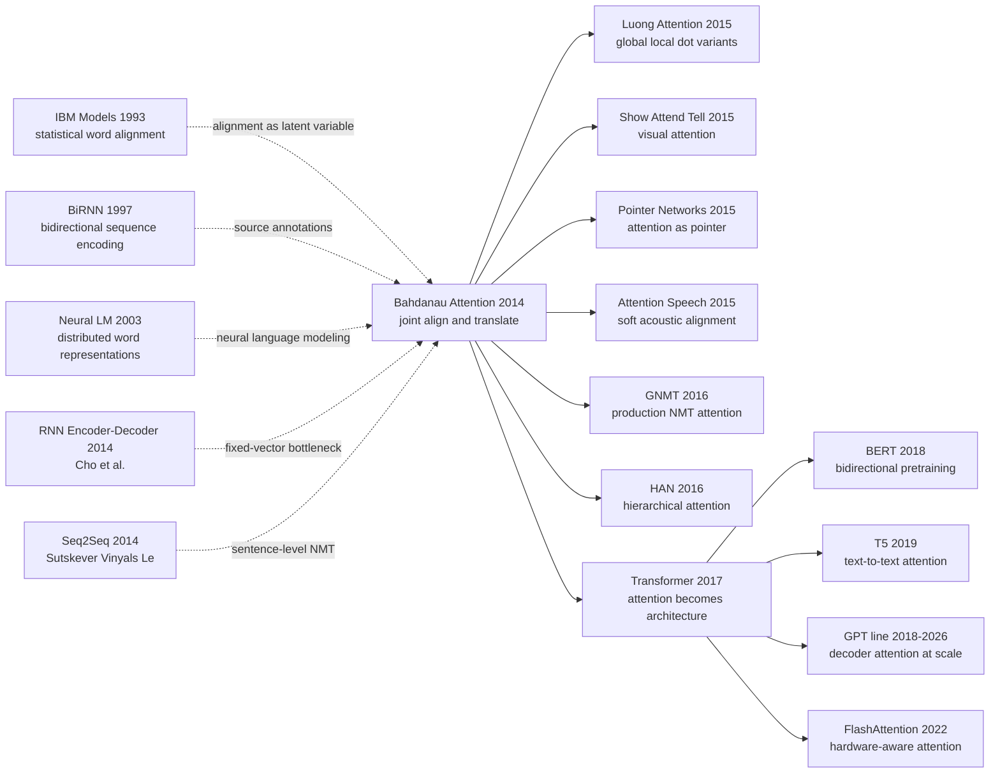

# Bahdanau Attention — 让神经翻译第一次学会看源句

> **2014 年 9 月 1 日，Universite de Montreal 的 Dzmitry Bahdanau、Kyunghyun Cho、Yoshua Bengio 三位作者把 [arXiv 1409.0473](https://arxiv.org/abs/1409.0473) 挂上网，后来发表于 ICLR 2015。** 这篇论文的惊人之处不在“又做了一个 RNN 翻译器”，而在它把机器翻译里沿用了二十年的 alignment 从外部词对齐工具、短语表和启发式特征，改写成神经网络内部可微的一行权重：$\alpha_{ij}=\mathrm{softmax}(v_a^\top \tanh(W_a s_{i-1}+U_a h_j))$。从那一刻起，decoder 不必把整句法语/英语压进一个固定向量，而是每生成一个词都重新“看”一遍源句；三年后 [Transformer](../era3_attention/2017_transformer.md) 做的事，本质上就是把这次“看源句”的动作从 RNN 附件升级成整个架构的主角。

## 一句话总结

Bahdanau、Cho、Bengio 三位作者 2014 年发表于 ICLR 2015 的这篇论文，把神经机器翻译从“把整句 source 压进一个固定向量 $c$，再让 decoder 盲写 target”改成了“每个 target 词 $y_i$ 都用 $e_{ij}=a(s_{i-1}, h_j)$ 重新给 source 位置打分，再用 $c_i=\sum_j \alpha_{ij}h_j$ 读出相关上下文”。它直接打掉的 baseline 是固定向量 encoder-decoder：论文在 WMT14 English→French 设置中报告 RNNencdec-30 只有 13.93 BLEU，而 RNNsearch-30 达到 34.16 BLEU，甚至略高于 Moses phrase-based SMT 的 33.30。反直觉点在于，attention 最初不是为了“大模型”或“并行计算”发明的，而是为了一个非常朴素的翻译痛点：长句里第 40 个词不应该被第 1 个词生成时的记忆瓶颈拖死。后续 [Transformer（2017）](../era3_attention/2017_transformer.md) 把 recurrence 全部拿掉，只保留并放大 attention；BERT、T5、GPT 系列则证明这条“动态读上下文”的路最终会从机器翻译走向整个语言建模。

---

## 历史背景

### 2014 年机器翻译的三段式天花板

2014 年之前，机器翻译的主流不是“一个神经网络读源句再写目标句”，而是一个由许多部件拼起来的统计系统：先做词对齐，再抽短语表，再用语言模型、重排序模型、长度惩罚、若干人工特征一起打分，最后由 beam search 在巨大的候选空间里找一条译文。Moses 这样的 phrase-based SMT 工具链已经非常成熟，WMT 赛场上的强系统往往不是一个模型，而是一整套工程管线。

这条路线的问题也很清楚：alignment 是外部步骤，translation model 和 language model 分开训练，特征权重靠 MERT / MIRA 之类的调参算法拼起来。它能工作，但不像今天的端到端系统那样可以让一个损失函数直接把“哪里该对齐”和“该生成哪个词”一起优化。翻译错误经常来自阶段之间的缝隙：词对齐错了，短语表就错；短语表没见过，decoder 再聪明也只能绕路；长距离重排需要额外特征，特征调不好就会在局部短语上贪心。

| 2014 前后的 MT 部件 | 典型做法 | attention 论文改变了什么 |
|---|---|---|
| Word alignment | IBM Model / HMM / GIZA++ | 把 alignment 变成 decoder 内部的 soft weights |
| Phrase table | 离散短语对 + 计数特征 | 用连续隐状态 $h_j$ 表示 source token |
| Decoder | 大量人工特征加权 | 用一个 NLL loss 联合训练 |
| 长句处理 | 依赖短语重排和启发式惩罚 | 每个 target step 动态读 source |

所以 Bahdanau attention 的历史位置很特别：它不是第一个用神经网络做翻译的工作，也不是第一个 seq2seq；它真正击中的，是统计机器翻译最核心、最古老的对象 —— alignment。过去 alignment 是训练前或训练中的外部潜变量，到了这篇论文里，它变成了模型每一步生成时公开算出来、可微分、可视化的一组权重。

### Seq2Seq 刚刚证明可行，但还不会“看”

2014 年是神经机器翻译从“看起来很有趣”变成“可能真的替代 SMT”的拐点。Cho、van Merrienboer、Bahdanau、Bengio 等同实验室作者在 2014 年先做出 RNN Encoder-Decoder，把源短语压成向量，再生成目标短语；Sutskever、Vinyals、Le 同年用多层 LSTM 做完整句子的 sequence-to-sequence translation，并通过反转源句顺序缓解长距离依赖问题。

但这两条路线有同一个根病：**fixed-length vector bottleneck**。无论源句有 8 个词还是 80 个词，encoder 最终都要把它压成一个向量 $c$；decoder 后面所有词都从这一个 $c$ 里取信息。短句还可以靠 LSTM/GRU 的门控记忆撑住，长句就会出现很自然的遗忘：越靠前的 source token，越容易在最后一个 encoder state 里被冲淡。

Bahdanau、Cho、Bengio 三位作者的关键直觉是：翻译本来就不是一次性读完整句再闭眼输出。人类译者会在生成某个词时回看 source 的某一段；统计 MT 的 alignment 模型也早就承认“每个 target token 对应 source 里的若干位置”。既然如此，神经机器翻译不应该把所有 source 信息塞进一个 bottle-neck，而应该让 decoder 在每一步主动查询 source memory。

### 蒙特利尔小组为什么会做 alignment

这篇论文不是凭空冒出来的。Universite de Montreal 的 Bengio 小组在 2013-2014 年同时围绕两条线推进：一条是“用神经网络替代稀疏 NLP 特征”，另一条是“把生成过程写成可微图”。Cho 的 GRU encoder-decoder 已经证明短语级翻译可以端到端训练，但它仍然需要 SMT 系统在外围提供候选短语；Bahdanau attention 则把问题推进到句子级别，并且把 SMT 里最有历史包袱的 alignment 显式纳入网络。

这个转向也和 Bengio 小组长期的研究气质有关：他们并不满足于把神经网络当作 SMT 的 reranker，而是想把整条翻译链条改写成连续空间里的优化问题。attention 的妙处在于，它没有直接推翻 alignment，而是把 alignment “软化”了：不再要求目标词硬对应某一个 source token，而是允许它对所有 source positions 分配概率质量。这样既保留了翻译学里 alignment 的直觉，又避免了离散潜变量带来的不可微训练。

### 算力、数据与评测环境

论文的实验环境也带着 2014 年的印记。数据是 WMT14 English-French，训练集来自大量平行语料；词表使用 shortlist，只保留最常见的 source / target words，低频词用 UNK 处理；评测核心是 BLEU，而不是今天常见的 COMET、BLEURT 或人工偏好评估。训练框架仍是 Theano，GPU 显存和训练吞吐都不允许做今天这样的大模型尝试。

这些限制反而凸显了方法的杠杆。RNNsearch 不是靠参数量碾压，也不是靠更大的预训练语料；它靠的是把信息流路径改短。固定向量 seq2seq 中，source 第一个词到 target 第十个词之间要经过整个 encoder recurrent chain 再经过 decoder recurrent chain；attention 把这条路径变成 target step 到 source annotation 的一次 soft lookup。这个路径长度的改变，是后面 Transformer 能彻底摆脱 RNN 的技术前奏。

## 研究背景与动机

### 真问题不是翻译，而是记忆压缩

论文标题里写的是“Align and Translate”，但真正的科学问题是：一个神经网络在生成序列时，是否必须把输入序列压缩成一个固定长度的 summary？如果答案是“必须”，那么 NMT 会永远被长句卡住；如果答案是“不必”，那么 source sentence 就可以被看作一块可寻址 memory，decoder 每一步只读取当前需要的片段。

Bahdanau attention 的动机因此非常精确：保留 seq2seq 的端到端训练优势，同时把固定向量 $c$ 改成每步变化的 $c_i$。这不是简单地“加一个模块”，而是在改变 encoder-decoder 的信息论假设：encoder 不再负责把整句压缩成一句话，encoder 只负责把每个位置变成高质量 annotation；真正的内容选择推迟到 decoder 生成时完成。

### 为什么是 soft alignment 而不是 hard alignment

如果照搬 SMT，最自然的做法是让每个 target word 选择一个 source position，再基于这个 hard choice 生成词。但 hard alignment 会带来离散采样、不可微优化、高方差梯度和复杂的边缘化。论文选择 soft alignment，是一次很聪明的工程折中：它把“选择位置”改成“对所有位置加权平均”，让整个模型可以用普通反向传播训练。

这个选择也解释了 attention 为什么能快速传播。soft alignment 不需要额外标注，不需要 GIZA++ 产生监督信号，不需要 REINFORCE，不需要复杂 dynamic programming；只要给 source-target sentence pairs，NLL loss 就会自动推动 alignment weights 找到对翻译有用的位置。换句话说，attention 真正的魅力不是“权重图好看”，而是它让一个原本离散、结构化、带历史包袱的 NLP 对象，变成了深度学习最擅长处理的连续可微模块。

---

## 方法详解

### 整体框架

Bahdanau attention 的模型名叫 **RNNsearch**。名字很朴素：decoder 在生成每个 target word 时，都在 source annotations 上做一次 soft search。这个模型仍然是 encoder-decoder：encoder 读 source sentence，decoder 自回归生成 target sentence；不同之处在于，encoder 不再只吐出最后一个 hidden state，而是为每个 source position $j$ 留下一个 annotation $h_j$，decoder 在第 $i$ 步根据上一状态 $s_{i-1}$ 和所有 $h_j$ 算出 attention weights $\alpha_{ij}$，再形成当前 context $c_i$。

| 模块 | 输入 | 输出 | 关键变化 |
|---|---|---|---|
| Encoder | source tokens $x_1,\dots,x_T$ | annotations $h_1,\dots,h_T$ | 不再只保留最后状态 |
| Alignment model | previous decoder state $s_{i-1}$ + each $h_j$ | score $e_{ij}$ | 每步重新评价 source 位置 |
| Context reader | weights $\alpha_{ij}$ + annotations $h_j$ | context $c_i$ | 用 soft weighted sum 读取 source |
| Decoder | $y_{i-1}$, $s_{i-1}$, $c_i$ | next-word distribution | 生成条件随 target step 改变 |

这个框架看似只是在 seq2seq 旁边加了一条边，但信息流完全变了。固定向量模型里，source 的所有细节必须通过一个瓶颈 $c$；RNNsearch 里，source 被拆成一排可寻址的 memory slots，decoder 的每一步都能重新发起查询。今天我们把这种东西叫 attention layer；在 2014 年，它更像是把 SMT 的 alignment table 放进了神经网络内部。

### 关键设计 1：双向 encoder annotations —— 把 source 句子变成可寻址 memory

**功能**：对每个 source position $j$ 生成一个 annotation $h_j$，让它同时包含左上下文和右上下文，而不是只保存单向 RNN 的过去信息。

$$
\overrightarrow{h_j}=f_{\text{enc}}(x_j,\overrightarrow{h}_{j-1}),\quad
\overleftarrow{h_j}=f_{\text{enc}}(x_j,\overleftarrow{h}_{j+1}),\quad
h_j=[\overrightarrow{h_j};\overleftarrow{h_j}]
$$

直观地说，source 第 $j$ 个词的表示不只知道“左边发生了什么”，也知道“右边会发生什么”。这对翻译很重要：英语形容词、法语名词性数、德语动词位置都可能依赖两侧上下文。单向 encoder 的 annotation 容易把当前位置变成“到目前为止的前缀状态”；双向 encoder 则把它变成“这个词在整句里的语义/句法槽位”。

```python
def bidirectional_annotations(source_embeddings, fwd_rnn, bwd_rnn):
    forward_states = fwd_rnn(source_embeddings)
    backward_states = reverse(bwd_rnn(reverse(source_embeddings)))
    annotations = concat([forward_states, backward_states], dim=-1)
    return annotations  # shape: [source_len, 2 * hidden_dim]
```

| 设计选项 | 位置表示 | 适合什么 | 主要缺陷 |
|---|---|---|---|
| 最后一个 encoder state | 整句一个向量 | 短句、短语 | 长句信息被压扁 |
| 单向 annotations | 每个位置一个前缀状态 | 左到右语言建模 | 缺少右上下文 |
| **双向 annotations（本文）** | 每个位置一个整句上下文化状态 | 翻译 alignment | 仍然串行、不可并行 |

**设计动机**：attention 如果只在弱 annotation 上做 soft search，就像在模糊地图上找路。Bahdanau attention 先用 bidirectional RNN 把 source 句子的每个位置做成高质量 memory slot，再让 decoder 查询这些 slot。这个选择奠定了后面所有 encoder-attention-decoder 模型的基本接口：encoder 产出一组 token-level states，decoder 读取它们，而不是只读一个 sentence vector。

### 关键设计 2：加性 alignment model —— 用一个小网络决定“该看哪里”

**功能**：在生成 target 第 $i$ 个词之前，用上一 decoder state $s_{i-1}$ 和每个 source annotation $h_j$ 计算匹配分数 $e_{ij}$，再 softmax 成 alignment weights $\alpha_{ij}$。

$$
e_{ij}=a(s_{i-1},h_j)=v_a^\top\tanh(W_a s_{i-1}+U_a h_j),\quad
\alpha_{ij}=\frac{\exp(e_{ij})}{\sum_{k=1}^{T_x}\exp(e_{ik})}
$$

这就是后来被称为 **additive attention** 或 **Bahdanau attention** 的公式。它不是简单点积，而是把 query（上一 decoder state）和 key（source annotation）先投影到同一个 hidden space，加起来过 $\tanh$，再用向量 $v_a$ 打分。2014 年这样做很自然：decoder state 和 encoder annotation 的维度、语义空间未必一致，用可学习的 $W_a,U_a,v_a$ 做适配，比直接点积稳。

```python
def additive_attention(prev_state, annotations, Wa, Ua, va):
    query = Wa @ prev_state                      # [attn_dim]
    keys = annotations @ Ua.T                    # [source_len, attn_dim]
    scores = tanh(keys + query).matmul(va)       # [source_len]
    weights = softmax(scores, dim=0)
    return weights
```

| 打分函数 | 公式 | 参数量 | 后续命运 |
|---|---|---|---|
| Hard alignment | $z_i \in \{1,\dots,T_x\}$ | 需要离散变量 | 难以端到端反传 |
| **Additive（本文）** | $v_a^\top\tanh(W_a s+U_a h)$ | 较高 | 2014-2016 NMT 主流 |
| Dot-product | $q^\top k$ | 低 | Transformer 放大并行优势 |

**设计动机**：这一步的本质不是“让模型可解释”，而是把原来藏在 SMT 训练管线里的 latent alignment 变成一个普通 neural module。softmax 保证每一步对 source positions 的权重和为 1，因此它既像概率分布，又能端到端求导。decoder 的状态告诉 alignment model “我现在要生成什么类型的词”，source annotations 告诉它 “每个位置能提供什么信息”。两者相遇的位置，就是当前 target token 应该看的地方。

### 关键设计 3：动态 context vector —— 每个 target 词都读一份不同的源句摘要

**功能**：用 attention weights 对所有 annotations 做加权平均，得到第 $i$ 步专用的 context vector $c_i$，然后让 decoder 基于 $c_i$、上一词 $y_{i-1}$ 和上一状态 $s_{i-1}$ 生成下一个词。

$$
c_i=\sum_{j=1}^{T_x}\alpha_{ij}h_j,\quad
s_i=f_{\text{dec}}(s_{i-1},y_{i-1},c_i),\quad
p(y_i\mid y_{<i},x)=g(y_{i-1},s_i,c_i)
$$

这里最重要的是 $c_i$ 的下标 $i$。固定向量 seq2seq 只有一个 $c$，从第一个 target word 用到最后一个；RNNsearch 每一步都有自己的 $c_i$。如果当前要生成法语冠词，模型可能看英语名词和性数线索；如果要生成动词，模型可能看 source 的主语、时态和动词短语。context 不再是整句摘要，而是“为当前生成动作定制的读数”。

```python
def decoder_step(prev_word, prev_state, annotations, params):
    weights = additive_attention(prev_state, annotations,
                                 params.Wa, params.Ua, params.va)
    context = (weights[:, None] * annotations).sum(axis=0)
    state = gru_cell(input=embed(prev_word), state=prev_state, context=context)
    logits = output_layer(concat([embed(prev_word), state, context]))
    return state, softmax(logits), weights
```

| Context 方案 | 是否随 target step 变化 | 长句表现 | 可视化 alignment |
|---|---|---|---|
| Fixed vector $c$ | 否 | 长句 BLEU 明显掉 | 无 |
| Last-state + reversed source | 否，但缓解前缀距离 | 中等 | 无 |
| **Dynamic $c_i$（本文）** | 是 | 对长句更稳 | 有 heatmap |

**设计动机**：固定向量瓶颈的失败，不是因为 RNN 不会记忆，而是因为“整句摘要”这个任务本身过于苛刻。翻译的每一步只需要 source 的一小部分信息，把所有信息都压成一个全局向量既浪费容量，又增加遗忘风险。动态 context 把“压缩”推迟到使用时刻：需要什么，就从 source annotations 里按权重读什么。

### 关键设计 4：联合训练与 alignment 可视化 —— 让解释性从副产品变成调试工具

**功能**：alignment weights 没有外部监督，模型只通过 target sentence 的 negative log-likelihood 训练；训练完以后，$\alpha_{ij}$ 自然形成 source-target heatmap，可以直接检查模型是否在看合理位置。

$$
\mathcal{L}(\theta)=-\sum_{(x,y)}\sum_{i=1}^{T_y}\log p_\theta(y_i\mid y_{<i},x),\quad
\theta=\{\theta_{enc},\theta_{dec},W_a,U_a,v_a\}
$$

这一点经常被低估。Bahdanau attention 没有用人工 word alignment 训练 $\alpha$，也没有让 GIZA++ 当 teacher；alignment 完全是翻译目标的副产品。更妙的是，这个副产品足够可读：论文里的 heatmap 能看到 “European Economic Area” 与 “zone economique europeenne” 这种跨语言短语对应，也能看到形容词/名词次序变化时的非对角线对齐。

```python
def nmt_loss(source, target, model):
    annotations = model.encoder(source)
    state = model.init_decoder_state(annotations)
    loss = 0.0
    for i, gold_word in enumerate(target):
        state, probs, attn = model.decoder_step(target[i - 1], state, annotations)
        loss += -log(probs[gold_word])
    return loss  # gradients also update the alignment parameters
```

| 训练信号 | 是否需要额外标注 | 学到什么 | 风险 |
|---|---|---|---|
| 人工 word alignment | 是 | 显式对齐 | 贵且语义僵硬 |
| GIZA++ pseudo-label | 需要外部工具 | 统计对齐模仿 | 把 SMT 偏差带进 NMT |
| **Translation NLL（本文）** | 否 | 对生成有用的 soft alignment | attention 不一定等于人类对齐 |

**设计动机**：如果 attention 需要人工 alignment，它就很难成为通用模块；正因为它只依赖 end-to-end loss，才可以从 MT 快速迁移到 image captioning、speech recognition、summarization、document classification。可视化 heatmap 的意义也不只是“论文图好看”，而是给研究者第一次提供了一个窗口：神经翻译模型不是黑箱地吐词，它每一步确实在读取源句的某些部分。

### 训练策略与实现细节

论文使用的是 2014 年 NMT 标配工程：Theano、mini-batch SGD / Adadelta 风格更新、beam search 解码、词表 shortlist、UNK 处理和 BLEU 评估。模型没有 Transformer 的 layer norm、multi-head、residual stack，也没有大规模预训练。RNNsearch 的优势来自结构改变，不是来自现代训练配方。

| 项 | 论文设置 | 影响 |
|---|---|---|
| Dataset | WMT14 English-French | 大规模平行语料，但远小于今天预训练语料 |
| Vocabulary | Source/target shortlist + UNK | 低频词翻译仍是短板 |
| Encoder | Bidirectional RNN | 每个 source position 有双向 annotation |
| Decoder | Conditional recurrent decoder | 每步读取 $c_i$ |
| Search | Beam search | 解码仍依赖局部候选维护 |
| Metric | BLEU | 捕捉 n-gram overlap，难评语义等价 |
| Visualization | Alignment heatmap | 成为 attention 传播的重要证据 |

从现代眼光看，RNNsearch 慢、串行、词表小，很多工程细节已经过时；但它定义的接口仍然活着：**query 来自当前生成状态，keys/values 来自输入序列，weights 决定读哪里，context 决定生成什么**。Transformer 只是把这个接口重写成矩阵乘法并复制到每一层。

---

## 失败案例

### Baseline 1：Phrase-based SMT 的工程天花板

Bahdanau attention 首先要面对的不是另一个神经网络，而是当时最强的 phrase-based SMT。Moses 这类系统拥有成熟的 word alignment、phrase table、language model、reordering feature 和 beam decoder，在 WMT 赛场上积累了十多年工程细节。论文里报告的 Moses baseline 在 English→French 上是 **33.30 BLEU**，这在当时已经是很强的传统系统。

RNNsearch-30 报告 **34.16 BLEU**，只比 Moses 高 0.86；从绝对数字看，这不是碾压。但它的重要性在于“端到端神经系统终于追上了手工特征机器”。过去 NMT 经常被看作 reranker 或 phrase scorer；这篇论文证明，神经系统不只可以给 SMT 打补丁，也可以在完整句子翻译上与 SMT 正面交手。

| Baseline | 代表系统 | 论文中关键数字 | 输在哪里 |
|---|---|---|---|
| Phrase-based SMT | Moses | 33.30 BLEU | 特征工程复杂，alignment 外置 |
| Fixed-vector RNNencdec-30 | Encoder-decoder | 13.93 BLEU | 长句和词序信息被压缩掉 |
| Fixed-vector RNNencdec-50 | Encoder-decoder | 17.82 BLEU | 加长训练句仍无法解决瓶颈 |
| **RNNsearch-30（本文）** | Attention NMT | **34.16 BLEU** | 仍有 UNK 和串行解码问题 |

### Baseline 2：固定向量 encoder-decoder 的长句崩塌

真正被 attention 打掉的是 fixed-vector encoder-decoder。RNNencdec 的思路很优雅：encoder 把 source sentence 编成一个 vector，decoder 根据这个 vector 生成 target sentence。但翻译任务残酷地暴露了这个设计的容量问题。source 句子越长，最后一个 hidden state 就越像过度压缩的摘要；decoder 需要某个细节时，只能在这个摘要里“猜”。

论文的数字非常刺眼：RNNencdec-30 是 **13.93 BLEU**，RNNencdec-50 是 **17.82 BLEU**，都远低于 Moses 和 RNNsearch。更关键的是，论文按 sentence length 画出的 BLEU 曲线显示，固定向量模型在长句上掉得更快；attention 模型的曲线明显更平。这不是调参差距，而是信息路径差距。

固定向量 seq2seq 的失败后来成了 attention 教科书里最经典的反例：当输入长度可变、输出每一步需要输入不同部分时，一个全局瓶颈向量既不必要，也不可靠。模型不应该把 memory 压成一块石头，而应该保留成一排可读的槽位。

### Baseline 3：源句反转和更大 RNN 的补丁不够根治

Sutskever seq2seq 用源句反转取得了很强效果：把 source order 反过来以后，target 开头几个词和 source 结尾几个词的路径变短，训练更容易。这是一个非常有效的技巧，但它也是固定向量瓶颈的症状疗法。它改善了某些局部依赖，却没有改变“所有 source 信息仍要挤进最后状态”的事实。

更大 RNN、更多 hidden units、更长训练句也有类似局限。它们能增加容量，却不能让 decoder 在第 $i$ 步直接访问 source 第 $j$ 个位置。Bahdanau attention 的反例价值在这里：它证明长句问题不能只靠“把 RNN 做大”解决，必须改变 decoder 读取 source 的方式。

这也是为什么 RNNsearch 的历史地位比一个 BLEU gain 更大。它把“source representation”从一个向量改成一个序列，把“translation state”从单向生成改成“生成 + 查询”。Transformer 后来能砍掉 RNN，正是因为这个查询接口已经被验证过。

## 实验关键数据

### WMT14 English→French BLEU

论文的主实验是 WMT14 English→French。这里的数字需要放在 2014 的评测语境里读：BLEU 是主指标，UNK 处理和 shortlist 会明显影响结果，RNNsearch-30 / RNNsearch-50 的训练设置也不完全相同。因此最稳妥的结论不是“attention 全面碾压所有系统”，而是“attention 让端到端 NMT 第一次达到 phrase-based SMT 的量级，并大幅击败固定向量 NMT”。

| Model | Sentence length setting | BLEU | 主要结论 |
|---|---|---|---|
| RNNencdec-30 | up to 30 words | 13.93 | fixed vector bottleneck 明显 |
| RNNencdec-50 | up to 50 words | 17.82 | 加长训练不够 |
| RNNsearch-50 | up to 50 words | 26.75 | attention 明显改善 |
| Moses | phrase-based SMT | 33.30 | 传统强 baseline |
| **RNNsearch-30** | up to 30 words | **34.16** | 神经模型追上并略超 SMT |

### 长句行为

论文里最有说服力的不是单点 BLEU，而是 sentence length 曲线。固定向量 encoder-decoder 在短句上还可以靠压缩记忆撑住，但句子一长，BLEU 快速下降；RNNsearch 的下降更慢，说明 attention 的好处正好出现在它该出现的地方：长句、长距离依赖、局部短语重排。

| 现象 | Fixed-vector seq2seq | RNNsearch | 解释 |
|---|---|---|---|
| 短句 | 可以工作 | 更好 | 瓶颈尚未完全暴露 |
| 中长句 | 质量快速下降 | 降幅较小 | 每步可回看 source |
| 远距离依赖 | 容易遗忘 | 能重新查询 | source annotations 保留细节 |
| 重排序 | 依赖 RNN 记忆 | heatmap 可跨对角线 | alignment weights 捕捉词序变化 |

这组结果解释了 attention 为什么会迅速成为 NMT 标配。它不是只在平均 BLEU 上加一点分，而是修复了 neural seq2seq 最让人不放心的失效模式：长句一来，模型突然忘掉 source 前半段。对机器翻译来说，这种 failure 比短句上少 1 个 BLEU 更致命。

### Alignment 可视化和定性发现

论文的 alignment heatmap 是影响力的一部分。它向社区展示，soft attention 学到的不是随机权重，而是相当符合语言直觉的 source-target 对齐：名词短语能对上名词短语，形容词/名词顺序变化会产生非对角线模式，介词和功能词的权重会分散到多个位置。

这些图在 2014 年非常关键，因为神经机器翻译当时还被许多人视为黑箱。attention heatmap 给了一个视觉证据：模型不是凭空生成译文，它确实在某些时刻看向 source 的某些词。这个证据让 attention 比许多同时代的 neural trick 更容易被 NLP 社区接受。

不过也要诚实：attention heatmap 不是严格的人类 alignment，也不能保证因果解释。一个高权重位置可能只是模型内部计算的相关信号，而不一定是语言学意义上的“这个 target word 来源于这个 source word”。这点后来在 attention interpretability 争论中反复出现。Bahdanau attention 的可视化价值很高，但它更像调试窗口，不是完整解释理论。

---

## 思想史脉络



### 前世（它继承了什么）

- **IBM Models 1993**：把 word alignment 变成统计机器翻译的核心潜变量。Bahdanau attention 不是发明“对齐”这个问题，而是把它从离散统计模型迁移到可微神经网络里。
- **Bidirectional RNN 1997**：提供了双向读序列的基础工具。RNNsearch 的 encoder annotations 正是“每个位置同时看左右上下文”的思想落地。
- **Neural probabilistic language model 2003**：让词向量和神经语言模型成为 NLP 的基础设施。没有连续表示，alignment model 不可能在 $s_{i-1}$ 与 $h_j$ 之间做平滑匹配。
- **RNN Encoder-Decoder 2014**：同一研究圈的直接前序，证明 phrase-level neural translation 可以训练；但固定向量瓶颈也正是 Bahdanau attention 要修补的对象。
- **Seq2Seq 2014**：把 encoder-decoder 推到完整句子翻译，并让 LSTM NMT 成为严肃 baseline。Bahdanau attention 和它几乎同期出现，是对它最关键短板的直接回应。

### 今生（它打开了哪些路）

- **Luong attention 2015**：把 attention score 系统化成 global / local、dot / general / concat 等变体，成为早期 NMT 实践手册。
- **Show, Attend and Tell 2015**：把 source words 换成 image regions，让 captioning 模型在生成词时看图像局部区域。attention 从 NLP 迁移到视觉的第一批经典案例就在这里。
- **Pointer Networks 2015**：把 attention weights 本身当输出分布，直接指向输入位置。这个想法后来进入复制机制、抽取式摘要、代码生成和工具调用。
- **GNMT 2016**：Google 把 attention NMT 推进生产系统。它证明 Bahdanau attention 不是论文 demo，而是能支撑大规模翻译服务的工程范式。
- **Transformer 2017**：最重要的后继。Vaswani 等 8 位作者的问题不是“要不要 attention”，而是“如果只要 attention，不要 RNN，会怎样”。答案就是现代 NLP 的主干。
- **BERT / T5 / GPT / FlashAttention**：attention 从 alignment trick 变成预训练 backbone，再变成硬件优化对象。2022 年之后，attention 的瓶颈甚至不再主要是建模，而是显存带宽和 IO 复杂度。

### 误读 / 简化

- **“Attention 就是解释性”**：不完全对。Bahdanau heatmap 很有调试价值，但 attention weight 不等价于因果解释。它告诉你模型在哪里分配了读取权重，不保证删除该位置一定按同样方式改变输出。
- **“Transformer 发明了 attention”**：错。Transformer 发明的是“只保留 attention 并用 multi-head dot-product 堆成完整架构”。attention 作为 neural alignment 机制，起点是 Bahdanau 2014。
- **“Additive attention 已经过时，所以这篇论文只剩历史价值”**：也不对。具体打分函数被 dot-product 替代很多年了，但“query 当前状态，soft-select 输入 memory”的接口仍然是现代模型的骨架。
- **“Attention 解决了长上下文”**：它解决的是 fixed-vector bottleneck，不是无限上下文。Transformer 后来反而暴露了 $O(n^2)$ attention 成本，催生 sparse attention、linear attention、FlashAttention、state-space models 等新一轮路线。

---

## 当代视角

### 站不住的假设

1. **“RNN 是序列建模的天然中心”**：2014 年这很合理，因为 LSTM/GRU 是处理可变长序列的主工具；但 2017 年 Transformer 证明，attention 可以不再依附 RNN。Bahdanau attention 仍把 attention 当 decoder 的辅助读头，Transformer 则把它变成每一层的主算子。
2. **“Soft alignment 大致等于可解释性”**：这在论文传播时非常有用，但后来被反复修正。attention heatmap 能帮助调试模型行为，却不是严格 causal explanation。现代 interpretability 更关心 patching、ablation、activation tracing，而不是只看权重图。
3. **“BLEU 足够评估翻译质量”**：2014 年别无选择，BLEU 是标准；2026 年看，BLEU 对语义等价、事实一致性、风格和术语很迟钝。COMET、BLEURT、人类偏好评估和 LLM-as-judge 都是对这一假设的补课。
4. **“词表 shortlist + UNK 可以接受”**：这在 2014 年是算力妥协，但 BPE、SentencePiece、byte-level tokenization 后来证明，低频词和开放词表不能靠 UNK 糊过去。attention 解决了对齐瓶颈，却没有解决词表瓶颈。

| 2014 假设 | 后来发生了什么 | 对这篇论文的重新理解 |
|---|---|---|
| RNN 是主干 | Transformer 移除 recurrence | attention 原来才是更可迁移的接口 |
| Heatmap 就是解释 | causal interpretability 兴起 | heatmap 是调试工具，不是证明 |
| BLEU 是主评测 | COMET / human preference 出现 | 原始增益要结合人工质量看 |
| UNK 可忍受 | subword tokenization 普及 | attention 与 open vocabulary 是两条问题线 |

### 时代证明的关键

真正留下来的不是 additive score 的具体形式，而是三个接口。

第一，**input as memory**：输入序列不必被压成一个全局向量，可以保留成一组 token-level states。今天无论是 Transformer encoder、retrieval memory、KV cache，还是多模态模型里的 image patches，都在复用这个想法。

第二，**query-dependent reading**：模型不是静态读取上下文，而是根据当前状态决定读哪里。Bahdanau 用 $s_{i-1}$ 查询 source annotations；Transformer 用每个 token 的 query 查询所有 keys；LLM decoding 用当前 token 的 hidden state 查询 KV cache。形式变了，接口没变。

第三，**end-to-end latent structure**：alignment 不需要显式监督也能从任务损失里长出来。这一思想扩散到 visual attention、copy mechanism、routing、soft retrieval、tool selection。深度学习很擅长把传统 NLP 里的离散中间结构软化成连续权重，Bahdanau attention 是最早、最成功的示范之一。

### 如果今天重写这篇论文

如果 2026 年重写这篇论文，方法核心可能仍然不变，但呈现方式会完全不同：

- 直接使用 subword tokenizer，而不是 source / target shortlist + UNK。
- 用 Transformer 或至少 parallelizable encoder 做主干，并把 additive attention 作为历史 baseline。
- 不只报告 BLEU，还报告 COMET、chrF、人工充分性/流畅性，以及长句分桶结果。
- 做更系统的 ablation：去掉 bidirectional encoder、换 dot-product score、固定/动态 context 对比、不同 source length 分桶。
- 明确说明 attention heatmap 的解释边界，避免把权重图等同于因果解释。
- 开源训练代码、预处理脚本和 checkpoint；原论文没有官方公开代码，这是复现层面的短板。

但最核心的一句话不会变：**decoder 不应该被迫从一个固定向量里翻译整句，它应该在生成每个词时重新读取 source memory**。这句话在 2014 年解决 NMT，在 2017 年生成 Transformer，在 2026 年仍然支撑 LLM 的 KV-cache 读取。

### 作者没有完全预见的副作用

Bahdanau、Cho、Bengio 三位作者当然知道 alignment heatmap 会让模型更可读，但他们未必能预见 attention 会在三年内从“翻译辅助模块”变成“通用神经计算原语”。这篇论文打开的不是一个 MT trick，而是一种新的计算习惯：把输入写成 memory，把当前状态写成 query，把相似性写成权重，把读取写成加权和。

这个习惯后来改变了模型设计的审美。2015-2016 年，attention 被移植到图像 captioning、语音识别、摘要、阅读理解；2017 年，它在 Transformer 里吞掉 RNN；2018 年之后，它成为预训练语言模型的默认层；2022 年之后，FlashAttention、PagedAttention、KV cache 管理说明 attention 已经进入系统工程层。一个翻译论文里的 alignment module，最后变成了 AI 基础设施的热点路径。

## 局限与展望

### 作者承认的局限

- **计算成本高**：RNNsearch 每个 target step 都要扫一遍 source annotations，且 encoder/decoder 都是 recurrent，训练和解码很难并行。
- **词表受限**：shortlist + UNK 让低频词、专名、数字和形态变化仍然难处理。
- **评测单一**：BLEU 和 alignment 可视化能说明一部分问题，但不能完整评估翻译充分性、术语一致性和语义保真。
- **模型仍依赖 beam search**：attention 改变了 scoring，但解码仍是局部搜索，长度偏置和重复/遗漏问题没有根治。

### 2026 视角的新增局限

- **Additive attention 不够硬件友好**：每个 query-key pair 都要过小 MLP，组合成本高；dot-product attention 更容易写成矩阵乘法并利用 GPU/TPU。
- **Softmax attention 是 dense 的**：对长 source 序列，所有位置都被扫一遍。Transformer 把这个问题放大到 $O(n^2)$，后来需要 FlashAttention、sparse attention、linear attention 来补救。
- **Attention weight 不等于忠实解释**：权重图对读者友好，但不能单独证明因果贡献。
- **端到端训练仍吃数据**：它摆脱了人工 alignment，却仍需要大规模平行语料。低资源翻译要等 multilingual transfer、back-translation、pretraining 才真正改善。

### 已被后续工作证实的改进方向

| 改进方向 | 代表工作 | 修复的问题 |
|---|---|---|
| Global/local attention variants | Luong et al. 2015 | 降低计算、系统化 score 函数 |
| Subword tokenization | BPE / SentencePiece | 减少 UNK 和低频词失败 |
| Production NMT | GNMT 2016 | 堆叠 LSTM + attention 工业化 |
| Self-attention architecture | Transformer 2017 | 去掉 RNN 串行瓶颈 |
| Efficient attention kernels | FlashAttention 2022 | 降低显存 IO 和长上下文成本 |

未来值得继续追的问题不是“attention 是否有用”，而是“何时需要 dense attention，何时需要 retrieval / sparse / state-space 替代”。Bahdanau attention 解决了 fixed-vector bottleneck；现代长上下文模型面对的是另一个瓶颈：上下文已经可读，但读得太贵。

## 相关工作与启发

### 与几条相邻路线的比较

| 路线 | 相同点 | 不同点 | 给今天的启发 |
|---|---|---|---|
| IBM alignment / SMT | 都关心 source-target 对齐 | SMT 离散外置，attention 连续内生 | 老问题可以用新可微接口重写 |
| Sutskever Seq2Seq | 都是 encoder-decoder NMT | Seq2Seq 固定向量，RNNsearch 动态读取 | 架构接口比 RNN 层数更关键 |
| Luong attention | 都在 decoder step 读 source | Luong 系统化 score 和 local window | 好 idea 需要工程化变体扩散 |
| Transformer | 都用 query-key-value 式读取 | Transformer 去掉 recurrence 并行化 | 辅助模块可以升级成主架构 |
| Retrieval-augmented LLM | 都把外部信息当 memory | RAG 的 memory 来自文档库而非 source sentence | attention 是软检索思想的原型 |

这篇论文给研究者的最大启发是：**不要急着把旧系统推翻，有时更好的做法是找到旧系统里真正有生命力的中间对象，把它改写成可微模块**。SMT 的 alignment 没死，它变成了 attention；parser 的 latent tree 没死，它变成了 soft structure induction；retrieval 的倒排表没死，它变成了 dense retrieval + cross attention。范式革命常常不是“忘掉过去”，而是把过去最有用的结构换一种数学形态带进来。

## 相关资源

- 📄 [arXiv 1409.0473](https://arxiv.org/abs/1409.0473)
- 📚 [ICLR 2015 OpenReview 页面](https://openreview.net/forum?id=3Jv2JqfGBu)
- 📄 [Cho et al. 2014 RNN Encoder-Decoder](https://arxiv.org/abs/1406.1078)
- 📄 [Sutskever et al. 2014 Seq2Seq](https://arxiv.org/abs/1409.3215)
- 📄 [Luong et al. 2015 attention variants](https://arxiv.org/abs/1508.04025)
- 📄 [Vaswani et al. 2017 Transformer](https://arxiv.org/abs/1706.03762)
- 🔧 官方代码：论文未提供稳定公开代码；复现通常参考现代 NMT 教程或 OpenNMT / Fairseq 的 attention seq2seq 示例
- 🌐 跨语言：英文版 → [`/en/era2_deep_renaissance/2014_attention/`](/en/era2_deep_renaissance/2014_attention/)


---

> 🌐 [English version](/en/era2_deep_renaissance/2014_attention/) · 📚 awesome-papers project · CC-BY-NC