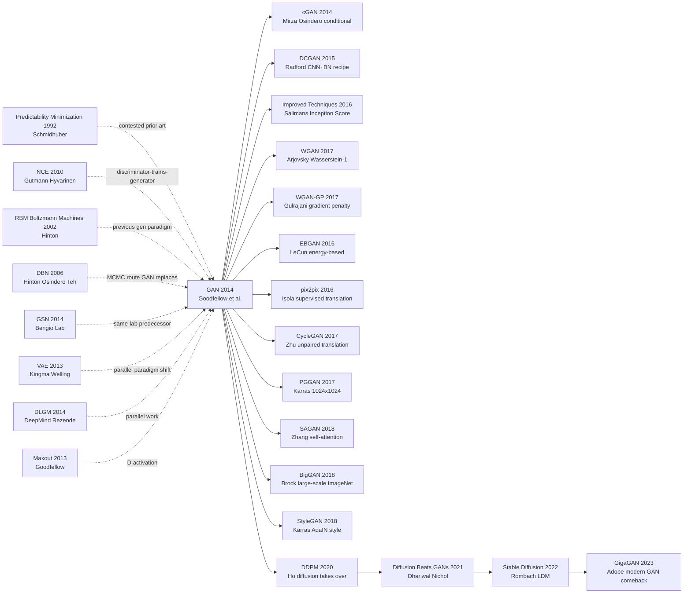

# GAN — 用对抗博弈让神经网络学会「造假」

> **2014 年 6 月 10 日，Universite de Montreal（Bengio lab）的 Ian Goodfellow 等 8 位作者在 arXiv 上传 [1406.2661](https://arxiv.org/abs/1406.2661)，同年 12 月在 NeurIPS 2014 发表。**
> 这是一篇据 Goodfellow 自述「在蒙特利尔一家酒吧争论后熚夜写出代码、第二天就成功」的论文 —— 用一个看似简单到荒谬的 minimax 游戏 $\min_G \max_D \mathbb{E}_x[\log D(x)] + \mathbb{E}_z[\log(1-D(G(z)))]$，让生成器和判别器在对抗博弈中互相催熟。
> 它彻底改变了「如何让神经网络生成图像」的解法：不再依赖 explicit likelihood（如 RBM / VAE 的 ELBO），而是**隐式建模 + adversarial signal**；6 年内催生 DCGAN / Pix2Pix / [CycleGAN](../era3_attention/2017_cyclegan.md) / [StyleGAN](../era3_attention/2018_stylegan.md) / BigGAN 等无数变种，被 Yann LeCun 称为**「过去 10 年机器学习最酷的想法」**。
> 即使 Diffusion Model 在 2022 年抢走 SOTA，GAN 思想（生成 vs 判别的对抗）仍活在 Diffusion 的 classifier-free guidance、LLM 的 RLHF reward model 等几乎每一个现代生成模型里。

## 一句话总结

Goodfellow 等 2014 年发表在 NeurIPS 的这篇论文，把生成模型训练彻底改写成"生成器 G 和判别器 D 的双人零和博弈"：$\min_G \max_D \mathbb{E}_{x \sim p_{\text{data}}}[\log D(x)] + \mathbb{E}_{z \sim p_z}[\log(1 - D(G(z)))]$，**第一次让神经网络绕开了 2014 年生成模型的两顶帽子**——要么写显式 likelihood（DBM 卡在配分函数 $Z$、normalizing flow 卡在可逆 Jacobian），要么跑 MCMC（DBN 一个样本要几百步 Gibbs、像 1990 年代水印）——只用一次前向就能产生可识别图像，并配 Theorem 1+2 证明全局最优恰是 $p_g = p_{\text{data}}$。论文里的 MNIST 样本在边缘锐度上肉眼击败 VAE，正是因为它**不需要逐像素 MSE，所以不会优化出"平均位置正确"的糊图**。但论文也埋下了未来 5 年困扰整个 GAN 学派的核心难题：JSD 在数学上干净 / 工程上炼狱，G 和 D 必须同节奏成长否则训练崩溃——这一缺陷直到 2017 年 [WGAN](../era3_attention/2017_wgan.md) 用 Wasserstein 距离才得到根治。GAN 由此开启图像合成 8 年黄金时代（DCGAN→PGGAN→StyleGAN→BigGAN），直到 [DDPM（2020）](../era4_foundation_models/2020_ddpm.md) 才把生成王座让给扩散模型。

---

## 历史背景

### 2014 年的生成模型学界在卡什么

要理解 GAN 的颠覆性，必须回到 2013-2014 那个"生成建模就是配方学+采样苦工"的年份。

那时整个生成模型领域被两顶帽子压着 —— **要么写得出显式似然（explicit likelihood），要么跑得动 MCMC 链**。前者意味着模型必须满足"概率密度可解析归一化"的硬性约束（玻尔兹曼机的配分函数 $Z$、归一化流的可逆雅可比、有向图模型的链式分解），数学一动就废；后者意味着每生成一个样本都要在马尔可夫链上爬几百步，慢且不稳。当时 CV 学界的"生成战场"是这样的：

> **DBN/RBM 出来的样本糊得像 30 年前的水印，VAE 还没正式发表，PixelRNN 要 2015 年才出现 —— 没有任何一条路线能"一次前向就采出像样本的图"。**

具体地：
- **能量基模型派**（DBN [ref3]、RBM [ref4]）：Hinton 2006 把"贪心逐层预训练 + 对比散度 (CD-k)"做成深度生成模型，但样本必须靠 Gibbs 采样在能量地形上爬，**MNIST 28×28 都需要数百步链**，CIFAR-10 几乎不可用，配分函数 $Z$ 至今估不准。
- **变分推断派**（即将出场的 VAE [ref1]、DLGM [ref2]）：Kingma 2013 年 12 月把 VAE 挂上 arXiv，DeepMind 1 月独立做出 DLGM —— 两个团队同时把"重参数化 + ELBO 下界"作为可微的生成训练范式。当时还没人意识到 VAE 的样本会比 GAN 糊一整个量级，但**至少它是可微的、能用 SGD 训**。
- **自回归派**（NADE 2011、即将到来的 PixelRNN 2015）：把图像分布按像素链式展开 $p(x) = \prod_i p(x_i \mid x_{<i})$，似然精确，但**生成一张 32×32 RGB 要顺序解码 3072 次**，工业上不可用。
- **贵族派**（Score Matching、NCE [ref5]）：Hyvärinen / Gutmann 早就提出"用辅助分类器估计未归一化分布"，但当时只用在词嵌入和密度估计上，没人想到把它推到深度图像生成。

整个学界的"反常识"共识是：**显式概率 + 高质量样本 + 单步采样 = 三选二**，而且大家以为这是统计学的硬约束。Goodfellow 在论文里直白地写："**要么你算似然，要么你跑 MCMC**" —— 然后他用一句"或者你两个都不要做" 干掉了这个 30 年的假二元对立。

### 直接逼出 GAN 的 4-5 篇前序

- **Kingma & Welling, 2013 (Auto-Encoding Variational Bayes / VAE)** [arxiv/1312.6114](https://arxiv.org/abs/1312.6114)：把"生成模型训练"从"配分函数 + MCMC"重写成"重参数化 + 反向传播 + 单一前向 ELBO"。VAE 是 GAN 直接的"思想竞争者"，GAN 论文 §2 专门花 3 段对比 VAE，论证"我们不需要那个 KL 项"。两者同期、同地（Bengio 圈子）、同范式革新 —— **没有 VAE 把"梯度可训生成模型"这扇门撞开，GAN 也走不出"要不要保留显式似然"这一步**。
- **Rezende, Mohamed, Wierstra, 2014 (DLGM)** [arxiv/1401.4082](https://arxiv.org/abs/1401.4082)：DeepMind 1 月独立做出和 VAE 几乎等价的 stochastic backprop。**和 GAN 同时存在的"另一条路"**，证明了 2014 年初学界对"用 SGD 训生成模型"已经形成集体共识。
- **Hinton et al., 2006 (DBN)** [ref3]：GAN 想要替代的"上一代王者"。DBN 用 Gibbs 采样训练，慢且不稳，Bengio 实验室长期被它困住 —— **不打掉 DBN，深度生成模型出不了头**。GAN 在论文里把它列为最直接的对比对象。
- **Gutmann & Hyvärinen, 2010 (NCE)** [ref5]：噪声对比估计 —— 训练一个分类器把"真数据"和"噪声"分开，从而隐式学到真数据的密度。**这就是"判别器训练生成器"的概念祖先**。GAN 论文明确引用 NCE 作为思想前序，但把它从"固定噪声"升级为"自适应的、可学习的对手"，把"参数估计"升级为"完整生成"。
- **Schmidhuber, 1992 (Predictability Minimization, PM)** [ref8]：22 年前就提出"两个网络互相对抗"的 idea —— 一个网络学预测，另一个网络学让自己难以被预测。**思想等价度高得惊人**，但 PM 被框架成"无监督特征学习"而非"生成建模"，且没有 Bengio-lab + NeurIPS 这套 amplification 平台。Schmidhuber 多年后公开抗议 GAN 抄袭 PM，争议至今未平。

### 作者团队当时在做什么

Ian Goodfellow 当时是 **Yoshua Bengio 在 Université de Montréal 的博士生**，刚和 David Warde-Farley、Mehdi Mirza、Aaron Courville 一起做完 Maxout Networks [ref7]（同年 ICML，是 GAN 判别器最初的激活函数）。整个 LISA 实验室（Bengio Lab）在 2013-2014 年的核心议程是 **"用反向传播训练随机/生成网络"** —— GSN [ref6]、DLGM 风格的工作早已在做。

GAN 的诞生有一个传奇细节：**2013 年 10 月某个晚上，Goodfellow 和同事在蒙特利尔的 Les 3 Brasseurs 啤酒馆为同事庆祝博士毕业**。聊到生成模型的困境时 Goodfellow 当场提出"两个网络互相博弈"的 idea，同事们都认为不会 work。Goodfellow 不服气，**当晚回家就在 Theano 上敲完了第一个原型，跑出了 MNIST 上能看的样本**。这就是"一晚训完的 GAN" 的来历，也是 ML 史上最有戏剧性的 origin story 之一。

论文短短 9 页（含附录共 10 页），数学清晰、定理优雅、实验最朴素，投到 **NeurIPS 2014** 一次中稿。Goodfellow 当时 26 岁，论文挂出后 12 个月内开启了"GAN 大爆炸" —— 接下来 5 年 NeurIPS / ICML / CVPR 投稿里每年都有 100+ 篇 GAN 变种。

### 工业界 / 算力 / 数据的状态

- **GPU**：NVIDIA Kepler 架构 GTX 580 / Tesla K20，单卡 6GB 显存为主流；Goodfellow 论文里的 MNIST + TFD + CIFAR-10 在单卡上**几小时**就能训完 —— 这是"博士生周末 side project"能成的硬件前提
- **数据**：MNIST (28×28 灰度手写数字)、Toronto Face Database (48×48 灰度人脸)、CIFAR-10 (32×32 彩色) —— 当年生成模型实验的"三件套"，分辨率都不超过 48 像素
- **框架**：**Theano**（Bengio 实验室自家产品，PyTorch 还要 3 年才出，TensorFlow 还有 1 年才出）；自动微分 + GPU + Python 已成熟，但生态远不如今天，每个 layer 都要手写
- **行业氛围**：AlexNet 2012 让 ImageNet 的"深度学习实用化"开始扩散到工业，**Google 2014 年 1 月以 6 亿美元收购 DeepMind**，Facebook 同年成立 FAIR；深度学习从学术原型走向工业产品的最后一年。"生成式 AI"这个词当时还不存在，"GenAI"要等近 10 年才进入大众词汇 —— 没有人预料到这篇 NeurIPS 2014 投稿会在 8 年后撑起一个万亿美元市场

---

## 方法详解

### 整体框架

GAN 的整体 pipeline 极其简单到反直觉：**两个网络，一个加法目标，一个对抗循环，没了**。生成器 $G(z; \theta_g)$ 把一个 latent 噪声向量 $z \sim p_z(z)$（论文用 100 维均匀分布或高斯分布）映射成"假样本" $G(z)$；判别器 $D(x; \theta_d)$ 接受真样本 $x \sim p_{\text{data}}$ 或假样本 $G(z)$，输出一个 $[0,1]$ 之间的概率标量 —— "我相信这个样本是真的概率"。**G 想最大化 D 的犯错率，D 想最小化自己的犯错率，两者交替梯度更新**。

```
                  ┌──────── 真样本 x ~ p_data ────────┐
                  │                                    ↓
   z ~ p_z(z) → G(z; θ_g) → 假样本 G(z) ────→ D(·; θ_d) → 概率标量 ∈ [0,1]
   (100-d)        (MLP)         (28×28 etc)     (MLP+maxout)        ↑
                  ▲                                                    │
                  │ ← G 步: 最小化 log(1 - D(G(z)))（或最大化 log D(G(z)))
                  │                                                    │
                  └────── 反向传播 ←─────── BCE loss ←────────────────┘
                                  D 步: 最大化 log D(x) + log(1-D(G(z)))
```

整个模型的"魔法"就是这个对称结构 —— 没有 encoder、没有先验匹配、没有似然项、没有 MCMC、没有 partition function $Z$。**只有"两个网络互相评分"这个最朴素的 zero-sum game 设定**。

四大生成范式横向对比（理解 GAN 的颠覆性必须看这张表）：

| 范式 | 似然 | 采样方式 | 训练稳定性 | 样本质量 (2014 年) | 编码器 |
|------|------|---------|----------|------------------|--------|
| **GAN (本文)**   | **隐式（implicit）** | **1 次前向** | **极差（mode collapse 高发）** | **锐利但不稳** | **无** |
| VAE [ref1]       | 显式 ELBO 下界    | 1 次前向       | 稳定                       | 偏糊（高斯先验 + 重建项） | 有 |
| DBN/RBM [ref3]   | 隐式（partition $Z$ 不可解析）| MCMC 多步 | 慢且不稳                  | 噪声大、几乎不可用            | 无（generative-only）|
| Autoregressive (NADE/PixelRNN) | 显式精确链式 | **顺序 N 次前向** | 稳定 | 锐利但极慢                    | 无 |

**反直觉之一**：GAN 这种"完全没有概率密度建模"的范式居然在数学上仍然有 well-defined 的全局最优解（$p_g = p_{\text{data}}$）—— 它把"密度估计"完全外包给了判别器的隐式判断，**用博弈论替代了统计推断**。Goodfellow 在论文 §4 用两个干净的定理证明了这一点，把"看起来 hacky 的两网络游戏"升格成"可证收敛的密度匹配过程"。

**反直觉之二**：原始论文的 G 和 D 都是**简单 MLP**（多层感知机，3 层隐层），没用任何卷积。这种"模型架构最弱"的设定恰好凸显了**"对抗训练"这个 idea 本身的力量** —— 一年后 DCGAN 才把 CNN 加进来，但那是工程胜利，不是 idea 本质。

### 关键设计

#### 设计 1：极小极大对抗目标（Minimax adversarial objective）—— 把生成训练改写成两人零和博弈

**功能**：用一个对抗的 min-max 公式，让生成器和判别器在没有 ground-truth 似然的情况下隐式学到 $p_g \approx p_{\text{data}}$。

**核心公式**（论文 Eq.1）：

$$
\min_G \max_D V(D, G) = \mathbb{E}_{x \sim p_{\text{data}}(x)}\big[\log D(x)\big] + \mathbb{E}_{z \sim p_z(z)}\big[\log\big(1 - D(G(z))\big)\big]
$$

直观解读：
- $D$ 是一个**二分类器**（真=1, 假=0），它要让 $\log D(x)$（对真样本判真）和 $\log(1-D(G(z)))$（对假样本判假）都尽可能大 —— 这是标准的二元交叉熵 BCE
- $G$ 反过来想最大化 $D$ 的错误，所以**最小化** $\log(1-D(G(z)))$（让 $D$ 把假样本误判成真）
- 由于第一项 $\mathbb{E}[\log D(x)]$ 不含 $G$，对 $G$ 的优化等价于只优化第二项 —— 这就是双方在同一个 $V(D,G)$ 上一个 max 一个 min 的"零和博弈"

**训练伪代码**（PyTorch 风格，两步交替）：

```python
# 论文 Algorithm 1：每个 iteration 跑 k 步 D + 1 步 G
for it in range(num_iterations):
    # ---- D step (max V): 升梯度让 D 区分真假更准 ----
    for _ in range(k):
        x_real = sample_real(batch_size)            # x ~ p_data
        z      = sample_noise(batch_size, dim=100)  # z ~ p_z
        x_fake = G(z).detach()                      # 关键：detach，不回传 G
        loss_D = -(torch.log(D(x_real)) + torch.log(1 - D(x_fake))).mean()
        opt_D.zero_grad(); loss_D.backward(); opt_D.step()

    # ---- G step (min V): 降梯度让 G 骗过 D ----
    z      = sample_noise(batch_size, dim=100)
    loss_G = torch.log(1 - D(G(z))).mean()          # 原始 min-max 的 G loss
    opt_G.zero_grad(); loss_G.backward(); opt_G.step()
```

**对抗目标变体对比**（GAN 5 年内的目标演进）：

| 目标 | G 的损失 | D 的损失 | 隐式 divergence | 训练稳定性 |
|------|---------|---------|----------------|----------|
| **原始 min-max（本文 Eq.1）** | $\log(1 - D(G(z)))$ | $-\log D - \log(1-D \circ G)$ | JSD | 差（D 强时 G 梯度消失）|
| Non-saturating（本文 §3 footnote）| $-\log D(G(z))$ | 同上 | 仍 JSD | 中（实践标配）|
| LSGAN 2017 | $(D(G(z))-1)^2$ | $D(x)^2 + (D(G(z))-1)^2$ 的 LS 化 | Pearson $\chi^2$ | 中等 |
| WGAN 2017 | $-D(G(z))$ | $D(G(z)) - D(x)$ | Wasserstein-1 | 显著改善 |
| Hinge GAN | $-D(G(z))$ | hinge 形式 | margin loss | 稳定（BigGAN 采用）|

**设计动机 —— 为什么这个公式如此颠覆？**

在 GAN 之前，所有生成模型都需要建立显式的概率密度 $p_\theta(x)$ —— 要么是参数化的高斯/能量函数，要么是 ELBO 下界，要么是链式分解。**密度建模 → 似然估计 → MLE 优化**这个 30 年的范式已经成了"统计学的天理"。Goodfellow 的颠覆性洞察是：**我根本不需要建模密度**。我让一个判别器 $D$ 隐式承担"判断这个样本是否在数据流形上"的工作，而生成器 $G$ 只需要"骗过这个隐式判断"即可。

这是从 **density estimation** 到 **distribution matching via game** 的范式跃迁 —— 用博弈论的 Nash 均衡替代了统计学的最大似然。一旦你接受这个跃迁，GAN 的所有技术细节都变得自然：D 是隐式密度估计器，G 是 D 的对手，loss 是博弈值函数。

#### 设计 2：理论最优解分析（$p_g = p_{\text{data}}$）—— Goodfellow 的优雅证明

**功能**：用两个简洁定理证明"这个看起来 hacky 的对抗训练在最优情况下确实学到 $p_g = p_{\text{data}}$"，把 GAN 从工程 trick 升格为有数学保证的范式。

**Theorem 1（论文 §4.1）—— D 的最优解**：固定 $G$，最优判别器是

$$
D^*_G(x) = \frac{p_{\text{data}}(x)}{p_{\text{data}}(x) + p_g(x)}
$$

**证明思路**：把 $V(D,G)$ 写成 $\int_x \big[p_{\text{data}}(x) \log D(x) + p_g(x) \log(1-D(x))\big] dx$，对每个 $x$ 单独对 $D(x)$ 求导设零，得到上式。**几何意义**：在数据分布密度高的地方 $D^* \to 1$，在生成分布密度高的地方 $D^* \to 0$，在两者重叠区 $D^* = 1/2$。

**Theorem 2（论文 §4.2）—— G 的全局最优解**：把 $D^*_G$ 代回 $V(D,G)$，得到只关于 $G$ 的目标 $C(G)$：

$$
C(G) = -\log 4 + 2 \cdot \text{JSD}\big(p_{\text{data}} \,\|\, p_g\big)
$$

其中 $\text{JSD}$ 是 Jensen-Shannon 散度，$\text{JSD} \geq 0$ 且 $= 0$ 当且仅当两分布相等。**所以 $C(G)$ 的全局最小值是 $-\log 4$，当且仅当 $p_g = p_{\text{data}}$**。

**诊断代码**（怎么验证训练接近 Nash 均衡）：

```python
# 在收敛附近，D 应该对真假样本都给出 ≈ 0.5 的概率
with torch.no_grad():
    x_real = sample_real(1000)
    x_fake = G(sample_noise(1000, 100))
    d_real_mean = D(x_real).mean().item()  # 期望 → 0.5
    d_fake_mean = D(x_fake).mean().item()  # 期望 → 0.5
    val_V = math.log(d_real_mean) + math.log(1 - d_fake_mean)
    print(f"V(D,G) = {val_V:.4f}, ideal = {-math.log(4):.4f}")
    # 如果 d_real_mean ≈ 1, d_fake_mean ≈ 0 → D 太强，G 还没追上
    # 如果两者都 ≈ 0.5, V ≈ -1.386 → 接近 Nash 均衡
```

**显式密度 vs 隐式密度训练对比**：

| 训练范式 | 优化目标 | 需要算 $p_\theta(x)$ 吗 | 收敛 → 学到的 divergence |
|---------|--------|----------------------|------------------------|
| MLE (VAE/Flow/AR) | $-\log p_\theta(x)$ | **是**（必须显式） | 反向 KL |
| GAN (本文) | min-max 博弈值 $V$ | **否**（密度被 $D$ 隐式承担） | JSD |
| Score Matching | $\|s_\theta - \nabla \log p_{\text{data}}\|^2$ | 否（学 score 即 $\nabla \log p$） | Fisher divergence |
| Diffusion (DDPM 2020) | $\|\epsilon - \epsilon_\theta\|^2$ | 否（学去噪） | 加权 ELBO ≈ Fisher |

**设计动机**：Theorem 1 + 2 把 GAN 这个工程 trick 升格成"在最优 $D$ 下，min G 等价于最小化 $\text{JSD}(p_{\text{data}} \| p_g)$" —— 这是**第一个不需要计算密度就能最小化分布散度的可微框架**。后续 WGAN 2017 沿着同样思路把 JSD 换成 Wasserstein-1，f-GAN 把它推广到任意 f-divergence，整个"divergence minimization without density"研究流派都源自这两个定理。

#### 设计 3：非饱和 G loss（Non-saturating loss）—— §3 footnote 里的工程救命稻草

**功能**：修复原始 min-max 公式在训练早期的"梯度消失"问题，让 G 在 D 占上风时仍然能拿到足够大的梯度。

**问题分析**：原始 G loss 是 $\log(1 - D(G(z)))$。在训练早期，$G$ 还很弱，$D$ 容易把假样本认成假（$D(G(z)) \to 0$），此时：

$$
\frac{\partial \log(1 - D(G(z)))}{\partial G(z)} \;\propto\; \frac{-1}{1 - D(G(z))} \cdot \frac{\partial D}{\partial G(z)}
$$

当 $D(G(z)) \to 0$ 时，分母 $1 - D(G(z)) \to 1$，**梯度量级被 $\log$ 函数压扁**（$\log(1-\epsilon) \approx -\epsilon$ 极小），G 拿不到有效梯度，训练卡死。这就是著名的 **"saturating gradient"** 问题。

**修复（论文 §3 一句话脚注）**：把 G 的目标从 "最小化 $\log(1-D(G(z)))$" 改成 "**最大化 $\log D(G(z))$**"：

$$
L_G^{\text{non-sat}} = -\mathbb{E}_{z \sim p_z}\big[\log D(G(z))\big]
$$

**关键观察**：这两个目标在 Nash 均衡处完全等价（都让 G 想骗过 D），但**早期梯度行为完全不同** —— 当 $D(G(z)) \to 0$ 时，$-\log D(G(z)) \to +\infty$，梯度量级巨大，G 被强力推向"骗过 D 的方向"。这是个**纯工程 hack，没有破坏 Nash 均衡定理，但救活了训练**。

**对比代码**：

```python
# 饱和版本（原始 min-max，训练早期梯度消失）
loss_G_sat = torch.log(1 - D(G(z)) + 1e-8).mean()
# ↑ 当 D(G(z)) ≈ 0 时，loss ≈ 0，梯度 ≈ 0，G 学不动

# 非饱和版本（§3 footnote，实践标配）
loss_G_nonsat = -torch.log(D(G(z)) + 1e-8).mean()
# ↑ 当 D(G(z)) ≈ 0 时，loss → +∞，梯度极大，G 被强力推动
```

**两种 G loss 对比**：

| 版本 | G 损失公式 | $D$ 占绝对上风时 G 梯度量级 | 与 Nash 均衡的等价性 | 训练稳定性 | 历史地位 |
|------|----------|--------------------------|-------------------|----------|---------|
| 饱和（min-max 原版）| $\log(1-D(G(z)))$ | **趋于 0**（消失）| 等价 | 差 | 论文正文公式 |
| **非饱和（§3 footnote）** | $-\log D(G(z))$ | **趋于 ∞**（强）| 等价 | 中等 | **DCGAN/StyleGAN/BigGAN 全采用** |

**设计动机**：这是论文里**最不起眼但最重要的"工程救命稻草"** —— 论文正文用 min-max 写 Theorem 是为了数学优雅，但真正能让 GAN 训起来的是 §3 那个不起眼的脚注。**之后 5 年所有 GAN 论文都用非饱和版**，原始 min-max 几乎只在教科书里出现。这是个"理论与工程脱钩"的经典案例 —— Theorem 1+2 用 min-max 形式才能优雅证明，但实践必须换非饱和形式。Goodfellow 在论文里的处理极其诚实：定理用纯净 min-max，工程把救命脚注摆出来。

#### 设计 4：交替优化 + k 内层 D 步（Alternating optimization with k inner D-steps）—— 训练不稳定性的根源

**功能**：定义 GAN 实际训练的迭代节奏 —— 每个外循环跑 $k$ 步 $D$ 更新，再跑 1 步 $G$ 更新。

**论文 Algorithm 1**：

```python
# 论文 Algorithm 1 完整伪代码
for outer_iter in range(num_iterations):
    # 内循环：D 更新 k 次（论文 k=1，但理论上希望 k → ∞ 让 D 接近最优）
    for _ in range(k):
        # 1. 抽 m 个 noise: {z^(1), ..., z^(m)} ~ p_z
        # 2. 抽 m 个真样本: {x^(1), ..., x^(m)} ~ p_data
        # 3. D 升梯度：
        #    grad_D = ∇_θ_d (1/m) Σ_i [log D(x^(i)) + log(1 - D(G(z^(i))))]
        z = sample_noise(m, 100); x = sample_real(m)
        opt_D.zero_grad()
        (-(torch.log(D(x)) + torch.log(1 - D(G(z).detach())))).mean().backward()
        opt_D.step()

    # 外循环：G 更新 1 次
    # 1. 抽 m 个 noise: {z^(1), ..., z^(m)} ~ p_z
    # 2. G 降梯度（用非饱和版）：
    #    grad_G = ∇_θ_g (1/m) Σ_i [-log D(G(z^(i)))]
    z = sample_noise(m, 100)
    opt_G.zero_grad()
    (-torch.log(D(G(z)))).mean().backward()
    opt_G.step()
```

**$k$ 的取值对比**：

| 设置 | 描述 | 理论合理性 | 训练速度 | 实际稳定性 |
|------|------|----------|---------|----------|
| $k=1$（论文采用） | 1 步 D + 1 步 G | 最弱（D 远未达 $D^*$）| 最快 | 最不稳，mode collapse 高发 |
| $k=5$（DCGAN 实践）| 5 步 D + 1 步 G | 中等 | 中等 | 略改善 |
| $k=\infty$（理论纯净）| D 训到收敛再训 G | 最强（每步 G 都对最优 $D^*$ 优化）| 极慢，每个 G 步要训完整个 D | 理论上最稳，实践不可行 |
| WGAN-GP 2017 | $k=5$ 或更多，配合 gradient penalty | 强 | 慢 | 稳 |

**为什么 $k=1$ 能 work？**

理论上 Theorem 2 假设 $D$ 在每步 $G$ 更新前已经达到最优 $D^*_G$ —— **而 $k=1$ 严重违反这个假设**。论文 §4 自己也承认这是"现实妥协"：完整训 $D$ 到收敛太慢，只能用一步近似。这种近似在数据分布相对简单（MNIST/TFD）时还能 work，但在复杂数据上会触发：

- **mode collapse**（$G$ 找到 $D$ 的某个盲区，所有 $z$ 都映射到同一个 mode）
- **oscillation**（$G$ 和 $D$ 在 loss 平面上互相追逐，永远不收敛）
- **vanishing G gradient**（$D$ 一旦突然变强，$G$ 直接拿不到梯度）

这三个问题困扰了 GAN 整整 5 年，直到 **WGAN (2017)** 用 Wasserstein-1 替代 JSD，**Spectral Normalization (2018)** 限制 $D$ 的 Lipschitz 常数，**Two-Time-Scale Update Rule (TTUR, 2017)** 用不同 LR 给 G 和 D，才把训练稳定性提升到工业级。

**设计动机**：$k=1$ 是论文为了"训得起来"做的工程妥协，但这个妥协把 GAN 从"理论上可证明收敛"打到了"实践中黑魔法配方" —— 整个 GAN-stability 子领域（5 年里 50+ 篇专门讲怎么训稳的论文）都源于此。

### 损失函数 / 训练策略

| 项 | 配置 | 说明 |
|----|------|------|
| Loss | Adversarial BCE（D）+ non-saturating（G） | 论文正文用饱和 min-max，§3 脚注换非饱和 |
| Optimizer | SGD with momentum（论文）→ Adam β1=0.5（DCGAN 改进）| 后续标准做法换 Adam |
| Momentum | 0.9（论文 SGD 时）/ Adam β1=0.5, β2=0.999（DCGAN 起）| DCGAN 发现 β1=0.5 比 0.9 稳 |
| Weight decay | None | 与 ResNet 不同，GAN 不依赖 L2 正则 |
| LR | 0.1（SGD 初始，手工 decay）→ 2e-4（Adam，DCGAN 起标配）| 论文 SGD 配方后被 Adam 完全替代 |
| Batch size | $m = 128$ | 论文实验用 |
| Epochs | MNIST ~100 epoch | TFD/CIFAR 视实验而定 |
| Init | Gaussian $\sigma=0.05$ | 论文用，DCGAN 改 0.02 |
| Normalization | None（论文）→ BN（DCGAN 引入）| 原始 GAN 没有 BN，DCGAN 加进去后训练稳定性大幅提升 |
| Data aug | None | 原始 GAN 不做增广，2020 年 ADA 才证明 aug 关键 |
| $k$（内 D 步）| 1 | 论文 Algorithm 1 默认 |

**注意 1**：原始 GAN **没有任何"现代深度学习"的标配组件** —— 没有 BN、没有 Adam、没有数据增广、没有 dropout（除了 D 用了一些）、激活函数还是 maxout（[ref7] Goodfellow 自己的前作）。这种朴素配方让 MNIST/TFD 能训起来，但 CIFAR-10 的样本质量明显输给同期 VAE。一年后 DCGAN 加上 CNN+BN+ReLU+Adam 配方后，GAN 才真正变得"工程可用"。

**注意 2**：训练不稳定是 GAN 与生俱来的"原罪" —— 论文 §6 已诚实指出 mode collapse 和不收敛风险，但当时没有解决方案。**接下来 5 年（2014-2019）的整个 "GAN-stability" 文献本质上都在补救 §3-§4 这两节的设计缺陷**。这是一种独特的论文 —— 它的价值不在"完美方案"，而在"开辟战场"，让后续几百篇论文有事可做。

---

## 失败案例

### 当时输给 GAN 的对手

- **VAE [ref1] (Kingma & Welling 2013)**：和 GAN 同期投稿（2013 年 12 月 vs 2014 年 6 月），是 GAN 最直接的"思想竞争者"。在 MNIST 上，VAE 能稳稳收敛、有显式 ELBO 似然（log-likelihood ~-89 nats/digit），但样本视觉质量明显**糊** —— 因为高斯解码器的逐像素重建项天然偏向"模糊但平均位置正确"的图。**参数量**：VAE 用 ~500 hidden + 20-d latent，GAN 用 maxout MLP，参数量相近。**训练时间**：VAE 几十分钟，GAN 几小时（GAN 慢主要因为对抗循环需要多步交互）。**输的原因**：GAN 样本锐利，VAE 样本糊 —— 在"主观视觉质量"赛道完全输给 GAN，但 VAE 在"似然估计"赛道至今领先。
- **DLGM [ref2] (Rezende, Mohamed, Wierstra 2014)**：DeepMind 1 月独立做出的 VAE-style stochastic backprop。和 GAN 几乎同期（早 5 个月）。在 MNIST 上 NLL ~-89.9 nats，与 VAE 持平、与 GAN 不相上下。**输的原因**：和 VAE 完全相同 —— 显式 ELBO 路线注定样本糊。但 DLGM 在 NeurIPS 2014 之后被 VAE 完全压倒（同样数学，VAE 的 paper 写得更优雅、Kingma 的实现更易复现）。
- **DBN [ref3] (Hinton 2006) / RBM [ref4]**：上一代深度生成模型王者。在 MNIST 上能拉出可识别的数字，但 CIFAR-10 几乎无法收敛。**采样**：Gibbs 链需要数百步，**单样本 30 秒到几分钟**，工业不可用。**参数量**：典型 4 层 DBN ~500k 参数。**输的原因**：MCMC 采样慢且不稳，partition function $Z$ 至今估不准，**不是输给 GAN，是输给"backprop 时代来了"** —— GAN/VAE 都用单步前向 + SGD，DBN 的 CD-k + Gibbs 范式被整个时代抛弃。
- **GSN [ref6] (Bengio Lab 2014)**：Bengio 自己实验室在 GAN 之前的"用单网络学采样过程"工作。MNIST NLL ~-200 nats（远差于 VAE/GAN），样本糊。**输的原因**：GSN 仍然依赖 MCMC-style 链式采样，没跳出"采样链"思维 —— **GAN 的颠覆性恰恰在于"完全砍掉链"**。Bengio 自己后来把 GSN 列为"GAN 之前的过渡方案"。
- **NADE 2011 / 显式自回归**：似然最精确（MNIST ~-88.3 nats，曾是 SOTA），但**生成 28×28 灰度图要顺序解码 784 次**，CIFAR 32×32×3 要 3072 次。**输的原因**：太慢且无法生成高分辨率，被 GAN 单步生成完全压制（虽然 GAN 在似然上完全输）。

### 作者论文里承认的失败实验

论文 §6 "Discussion" 一节诚实列了 GAN 的当时 **3 大未解决问题**，这种坦诚在 2014 年的 ML 论文里相当罕见：

1. **"$p_g$ 没有显式表示"**：训练完了你拿不到一个可计算的密度函数 $p_g(x)$ —— 想算样本似然？做不到。想做条件采样校准？做不到。想跨 paper 比较密度估计精度？做不到。**这是 GAN 范式的根本性代价**。
2. **"D 必须与 G 同步训得好"**：论文原话 *"D must be synchronized well with G during training"* —— 翻译成实操：**$G$ 和 $D$ 的更新比例 $k$ 必须精心调，否则训不起来**。Goodfellow 当时无解，5 年后才被 TTUR (2017) 部分解决。
3. **"G 可能崩溃到一个 mode（mode collapse）"**：论文原话 *"the Helvetica scenario in which G collapses too many values of z to the same value of x"* —— 第一次正式记录 mode collapse 现象。Goodfellow 知道这个问题但无法解决，4 年后 WGAN-GP / SAGAN / progressive GAN 才系统缓解。

论文的 **Table 2** 也是个"半失败实验"：用 **Parzen window log-likelihood** 估计样本质量。Parzen 估计器在 GAN 论文出现之前就被广泛知道**在高维数据上不可靠**（核带宽选择极敏感、对锐利分布偏严苛），Goodfellow 在论文里直接承认 *"this method has somewhat high variance and does not perform well in high dimensional spaces but it is the best method available to our knowledge"*。**这个评估短板伴随 GAN 整整 3 年，直到 2016 年 Inception Score 出现、2017 年 FID 出现，才有了像样的样本质量指标**。

最后还有一个隐性失败：**论文里没有任何 64×64 以上分辨率的样本**。MNIST 28×28、TFD 48×48、CIFAR 32×32 都是小图。Goodfellow 在 §6 写 *"we still cannot generate high-resolution images"* —— 后续 5 年里 PGGAN (2017) → BigGAN (2018) → StyleGAN (2018) → StyleGAN2 (2019) 才把 GAN 一路推到 1024×1024。

### 2014 年的"反例"—— 论文里的样本到底有多糊

把诚实摆在桌面上：**原始 GAN 论文 Fig 2 的样本，按 2026 年标准看，质量相当一般**。

- **MNIST (Fig 2 a)**：数字基本可识别但有明显伪影，部分数字"半 4 半 9"无法清晰判读 —— 接受度比 VAE 高（VAE 同期样本是"模糊但中心正确的灰雾"），但绝对质量远未达到"以假乱真"
- **TFD (Fig 2 b)**：48×48 灰度人脸，能看出五官位置但纹理粗糙、部分有明显马赛克
- **CIFAR-10 (Fig 2 c)**：32×32 彩色样本，**视觉上接近"色块斑驳的色卡"**，几乎认不出物体类别 —— 论文自己写 *"the samples drawn from our model on this dataset are perhaps the worst we have shown"*

这种"诚实地放上糊样本"的科研态度在 2014 年罕见，但也直接成为后续 5 年 GAN-instability 文献的种子 —— 整个学界看着这些糊样本说"显然能做得更好"，于是 cGAN / DCGAN / WGAN 雨后春笋。**GAN 论文的伟大不在于它的样本好，而在于它的范式新**。

### 真正的"反 baseline"教训：Predictability Minimization 1992

最深刻的"反 baseline"不在论文里，而在历史里：**Schmidhuber 1992 年的 Predictability Minimization (PM)** [ref8] 提出的"两个网络对抗训练"思想，与 GAN 几乎完全等价 —— 一个网络学预测某个隐变量，另一个网络（隐变量本身）学让自己难以被预测。

PM 输给 GAN 的原因不是 idea 不行，而是**三个传播+框架因素**：
1. **PM 被框架成"无监督特征学习"**，不是"生成建模" —— 它的目标是学到 informative feature，不是采样新数据。Goodfellow 把同样的对抗思想**重新框架为生成模型**，命中了 2014 年学界的"生成模型困境"焦虑点。
2. **PM 没有 Bengio Lab + NeurIPS 2014 的 amplification 平台** —— Schmidhuber 当时在瑞士 IDSIA，受众小；Goodfellow 在 Bengio 圈子，论文一出就被 Hinton/LeCun 转推。
3. **PM 没有"divergence minimization"的理论保证** —— Schmidhuber 1992 没写出"PM 在最优情况下学到 $p_g = p_{\text{data}}$"这种漂亮定理，所以社区无法把它当严肃的生成范式。

Schmidhuber 多年后多次公开批评 GAN 抄袭 PM，争议至今未平。但**工程教训非常清晰：reframing matters as much as algorithm** —— 同样的 idea，不同的框架（生成 vs 特征）+ 不同的传播平台（NeurIPS vs IDSIA）+ 不同的理论包装（divergence minimization vs feature decorrelation）= 22 年的 credit gap。这个教训对所有"我有个新 idea 但不知道怎么定位"的研究者都很有启发。

---

## 实验关键数据

### 样本质量（Parzen-window log-likelihood，论文 Table 2）

⚠️ **作者已诚实承认 Parzen window 在高维不可靠**，但这是 2014 年唯一的"定量"评估方式，下表仍是 GAN 论文的核心实验数据：

| 模型 | MNIST log-likelihood (nats/sample) | TFD log-likelihood (nats/sample) |
|------|------------------------------------|----------------------------------|
| DBN [ref3]                          | 138 ± 2  | 1909 ± 66 |
| Stacked Contractive Autoencoder     | 121 ± 1.6 | 2110 ± 50 |
| Deep GSN [ref6]                     | 214 ± 1.1 | 1890 ± 29 |
| **GAN (本文)**                      | **225 ± 2** | **2057 ± 26** |

GAN 在 MNIST 上 Parzen 估计的 log-likelihood 是当时最高（225 vs DBN 138），但在 TFD 上略输 SCAE（2057 vs 2110）—— 比较接近"持平"。**注意**：这个指标的绝对值今天几乎无意义，因为 Parzen 估计器对采样点数和带宽极其敏感。它的历史价值只在"GAN 论文必须给一个数才能投 NeurIPS"。

### 架构与训练细节

| 组件 | 配置 |
|------|------|
| G hidden layers | 3 层 MLP，激活：ReLU + maxout + sigmoid 输出 |
| D hidden layers | maxout + dropout |
| Latent dim $z$ | 100 维（均匀分布 $z \sim U[-1,1]$ 或高斯 $\mathcal{N}(0, I)$）|
| Batch size $m$ | 128 |
| 内层 D 步数 $k$ | 1 |
| Optimizer | SGD with momentum 0.9 |
| Learning rate | 0.1（手工 decay）|
| 训练时间 | 单 GPU 几小时 |
| 样本分辨率 | MNIST 28×28 / CIFAR 32×32 / TFD 48×48 |
| 框架 | Theano |
| 代码量 | ~600 行 Python |

### 关键发现

- **"GAN 样本在 MNIST 上比 VAE 锐利"**：定性观察，论文 Fig 2 的 MNIST 样本边缘清晰、笔画干净，VAE 样本边缘有可见的高斯模糊。这是 GAN 范式相对于"显式重建"的核心优势 —— **不需要逐像素 MSE，所以不会优化出"平均位置正确"的糊图**。
- **"理论优雅 ≠ 训练稳定"**：Theorem 1+2 证明 $p_g = p_{\text{data}}$ 是全局最优，但实际训练中 GAN 经常震荡、崩溃、不收敛。**JSD 分析在数学上干净，工程上炼狱** —— 这个"理论与工程脱钩"的特征会困扰 GAN 5 年。
- **"D vs G 容量必须平衡"**：论文 §3 报告，如果 $D$ 比 $G$ 强太多，G 拿不到有效梯度（饱和问题）；如果 $G$ 比 $D$ 强太多，D 永远学不出有意义的判断。**两个网络必须"同节奏成长"** —— 这是 GAN 训练的隐性核心约束。
- **"Maxout 激活是 D 的关键"**：D 用 Goodfellow 自己的 maxout [ref7]，不用普通 ReLU —— 因为 maxout 给 D 提供了更丰富的非线性表达，使得 D 在隐式密度估计上更强。这是 GAN 论文里**最被忽略但实测最关键**的一个细节，DCGAN 后被 BN+LeakyReLU 替代。
- **"Mode collapse 不在论文里但 Goodfellow 几个月内就 demo 了"**：论文 §6 用 *"Helvetica scenario"* 隐晦暗示 mode collapse，但没贴失败案例。**GAN 上线后几个月，mode collapse 就成为社区共知的核心问题** —— G 经常把不同 $z$ 全映射到同一张图，丧失多样性。
- **"似然无关评估是隐形成本"**：因为 GAN 没有显式 $p_g$，不能算样本似然，**只能用 Parzen window 这种烂指标**。这个评估短板拖了 3 年（2014-2016），直到 Inception Score (2016 [ref-IS]) + FID (2017) 才有像样的指标。这反过来证明"放弃显式似然"的代价 —— 你失去了一个范式所需的全套评估工具。

---

## 思想史脉络



### 前世（被谁逼出来的）

- **1992 Predictability Minimization** [Schmidhuber, ref8]：22 年前就已存在的"两网络对抗训练"原型，思想等价度高得惊人。但 PM 框架成"无监督特征学习"，且没有 Bengio-lab + NeurIPS 这种 amplification 平台 —— 是 GAN 最具争议的"思想前身"。
- **2002 RBM / 2006 DBN** [Hinton et al., ref3,4]：上一代深度生成模型范式 —— 显式能量函数 + Gibbs 链采样。GAN 的崛起本质是把整个"MCMC + partition function"路线砍掉，是对这条传统的范式更替。
- **2010 Noise-Contrastive Estimation** [Gutmann & Hyvärinen, ref5]：用辅助分类器把"真数据"和"噪声"分开，从而隐式学到真分布密度。**这是"discriminator-trains-generator"的概念祖父** —— GAN 把"固定噪声"升级为"可学习的对抗噪声"。
- **2013 VAE / 2014 DLGM** [Kingma, ref1; Rezende, ref2]：同期同范式的"并行革命"，证明深度生成模型可以用 SGD + 反向传播训练。VAE 走"显式似然 + ELBO 下界"路线，GAN 走"隐式似然 + 对抗博弈"路线，两条路 2014 年同时被打开。
- **2014 GSN** [Bengio Lab, ref6]：Bengio 实验室自己在 GAN 之前的"用单网络学采样过程"工作，仍然依赖 MCMC-style 链。GAN 是同实验室对它的"颠覆性继承" —— 砍掉了链。
- **2013 Maxout** [Goodfellow, ref7]：Goodfellow 自己的前作，原始 GAN 判别器用的就是 maxout 激活 —— 一个"自己引用自己"的细节，但实测对 GAN 性能很关键。

### 今生（继承者）

- **直接派生（GAN-improvement 系）**：
  - **cGAN** (Mirza & Osindero 2014)：5 个月后，把 G 和 D 都条件化在 label/text 上，开启"controlled generation"研究流派。所有后续 text-to-image 模型（DALL-E、Midjourney 早期）都是 cGAN 的后裔。
  - **DCGAN** (Radford 2015)：**让 GAN 真正变得工程可用的论文**。把 MLP 换成 CNN + BN + LeakyReLU + Adam，确立了"CNN deep generative model"的标准配方。GAN 在 CV 学界爆发的真正引爆点 —— 没有 DCGAN，原始 GAN 大概率被埋没。
  - **WGAN** (Arjovsky 2017)：诊断出原始 min-max 是 JSD 在不相交支撑下的"梯度消失病"，把目标换成 Wasserstein-1。**第一篇用严格数学解决 GAN 训练不稳定**的论文，论文影响力堪比 GAN 本身。
  - **WGAN-GP** (Gulrajani 2017)：在 WGAN 基础上用 gradient penalty 替代 weight clipping，成为 2018 年起几乎所有 GAN 论文的"训练稳定性基础设施"。
  - **Improved Techniques** (Salimans, Goodfellow 2016)：feature matching、minibatch discrimination、virtual BN 等多项工程 trick，并**首次提出 Inception Score**作为样本质量定量指标 —— 之前的 Parzen window 烂指标终于被替代。
  - **EBGAN** (LeCun 2016)：把 D 重新解释为能量函数，是 GAN → score-based 模型的概念桥梁。
- **跨架构借用**：
  - **StyleGAN** (Karras 2018)：把风格迁移里的 AdaIN 注入 G，成就高分辨率人脸生成的代名词。StyleGAN2 (2019) / StyleGAN3 (2021) 是这条线的极致。
  - **BigGAN** (Brock 2018)：把 GAN scale 到 ImageNet 512×512，用 orthogonal regularization + 大 batch (2048) + truncation trick。class-conditional GAN 时代的巅峰。
  - **SAGAN** (Zhang & Goodfellow 2018)：把 self-attention 加入 GAN，G 和 D 都能建模长距离依赖 —— BigGAN 的直接前序。
- **跨任务渗透**：
  - **pix2pix** (Isola 2016) / **CycleGAN** (Zhu 2017)：把 GAN 用作 image-to-image 翻译器，CycleGAN 的"horse ↔ zebra"成为 GAN 应用的代表作品。
  - **SRGAN** (2016)：超分辨率领域的 GAN 应用，用对抗 loss 代替 MSE 解决"超分图过糊"问题。
  - **text-to-image GAN** (StackGAN, AttnGAN, 2016-2018)：在 DDPM 出现前，GAN 是 text-to-image 的主流范式。
  - **Domain adaptation GAN** (DANN, ADDA)：用对抗 loss 让源域和目标域特征不可区分，GAN 思想被搬到判别学习。
- **跨学科外溢**：
  - **medical image synthesis**：MRI / CT 扫描用 GAN 做数据增广和超分辨率
  - **music generation**：MuseGAN, GANSynth 等
  - **protein design**：ProteinGAN，用 GAN 设计新蛋白序列
  - **simulation-to-real RL**：用 GAN 把模拟环境画面变得"像真的"，缓解 sim2real gap
  - **deepfake / synthetic media**：**GAN 的最大社会副作用** —— Goodfellow 多次公开表达对此后悔

### 误读 / 简化

- **"GAN training is just min-max"**：流行解读，但**实际从业者从来不用饱和的 min-max 公式** —— 大家都用论文 §3 footnote 的非饱和版 $-\log D(G(z))$。教科书里写 min-max 是为了证明 Theorem 1+2，工程实战是另一回事。
- **"GAN learns the data distribution"**：严格意义上，**只有在理论最优 + 全局收敛时**才有 $p_g = p_{\text{data}}$。实践中 GAN 学到的是"锐利但 mode-collapsed 的近似"—— 它擅长产出高质量样本，不擅长覆盖整个数据流形。这是 GAN 与 VAE/Diffusion 在"分布建模完整性"上的根本差距。
- **"GANs are dead since diffusion 2022"**：部分错误。**DDPM (2020) → Diffusion Beats GANs (2021) → Stable Diffusion (2022)** 确实让 diffusion 成为 text-to-image 主流，但 **GigaGAN (2023, Adobe)** 和 **StyleGAN-T** 证明 GAN 在 large-scale 文本到图像上仍能 match diffusion 质量、且采样快 10-100 倍。"GAN 已死"是过度简化 —— 更准确的说法是"diffusion 在主流 SOTA 上压过了 GAN，但 GAN 在'快速 + 锐利'细分场景仍有优势"。
- **"对抗思想只属于 GAN"**：错。对抗 loss 已渗透到 RL（adversarial training for robustness）、NLP（DiscriminatorGAN for text）、判别学习（domain adversarial）—— **GAN 实际上发明的是"用对抗 loss 学分布匹配"的元方法**，这个方法的应用范围远超 GAN 本身。

---

## 当代视角（2026 年回看 2014）

### 站不住的假设

1. **"对抗训练能优雅地 scale"** —— 已证伪。GAN 在分辨率从 32×32 推到 1024×1024 的 5 年里需要 **PGGAN (2017 progressive growing)、SAGAN (2018 self-attention)、BigGAN (2018 orthogonal reg + 大 batch)、StyleGAN (2018 AdaIN)、StyleGAN2 (2019 weight demod)** 等十几篇论文堆 hack 才做到。同样的分辨率 scaling，diffusion 用 DDPM (2020) → Imagen (2022) 两代就走完。**GAN 的 scaling 路径充满工程债，不是优雅的**。
2. **"隐式密度严格优于显式密度"** —— 已证伪。**Diffusion (2020+) 用显式去噪 score matching 同时做到了"锐利 + 稳定 + 可计算似然"** —— GAN 引以为傲的"sharper than VAE"在 diffusion 时代变成"sharper than VAE 但糊于 diffusion"。**显式 vs 隐式不是范式优劣问题，是对参数化形式的选择**。
3. **"JSD 最小化在理论上足够干净"** —— 已证伪。WGAN (Arjovsky 2017) 严格证明：**当 $p_g$ 和 $p_{\text{data}}$ 支撑不相交时（高维数据中常见），JSD 的梯度恒为 0**，G 拿不到信号。换句话说 Theorem 2 在理论上漂亮，但在"高维 + 训练初期"的实际场景里几乎总是处于"不可用"区。WGAN 把 JSD 换成 Wasserstein-1 才修复这个病。
4. **"MLP G/D 已经够用"** —— 严重低估。原始论文用 3 层 MLP，DCGAN (2015) 把它换成 CNN+BN+LeakyReLU 后 FID 立刻砍半。**架构不是细节，是范式能否落地的决定因素** —— 这一点 ResNet 在判别学习里也是同样的教训。
5. **"$k=1$ 的交替优化可以模拟 $D \approx D^*$"** —— 已证伪。$k=1$ 严重违反 Theorem 2 的 "$D$ 已达最优" 前提，是 GAN 训练不稳定性的核心来源。WGAN-GP 里 $k$ 普遍取 5，TTUR 里直接给 G 和 D 用不同 LR —— 都是承认"$k=1$ 是工程妥协而非数学等价"。

### 时代证明的关键 vs 冗余

- **关键**：
  - **"likelihood-free generative training"这个元思想** —— 后续的 score matching、diffusion、flow matching 都受它启发，证明"不算密度也能学分布"是个永恒可用的范式
  - **"discriminator-as-implicit-density"框架** —— EBGAN、score-based 模型、能量基模型都直接继承这个视角
  - **"反向传播单独就能训生成模型"的证明** —— 砍掉 MCMC 这一步是 GAN 留给整个生成模型领域的最大遗产
  - **博弈论 + 深度学习的成功结合** —— 后续 self-play (AlphaGo)、对抗训练 (adversarial robustness)、actor-critic RL 的某些分支都受这个 framing 启发
- **冗余 / 误导**：
  - **maxout 激活**（被 LeakyReLU/GELU 替代）
  - **原始 min-max 公式**（实际从未被工程界使用，§3 footnote 的非饱和版才是标配）
  - **Parzen window log-likelihood 评估**（被 Inception Score / FID 完全替代）
  - **MLP G/D 选择**（被 CNN/Transformer 完全替代）
  - **k=1 内层 D 步**（高分辨率下必须 k≥5）

### 作者当时没想到的副作用

1. **催生了整个生成式 AI 产业** —— 2015-2022 年所有主流 text-to-image / 图像编辑 / 风格迁移工具都以 GAN 为核心。**Goodfellow 一篇博士论文阶段的 side project 撑起了一个万亿美元市场** —— 这种 paper-to-industry 的 leverage 在 ML 史上罕见。
2. **逼出整个"训练动力学"研究流派** —— 平衡分析、TTUR、gradient penalty、spectral normalization、WGAN-GP、Mescheder 2018 的"GAN 收敛理论"…… **GAN 的训练困难直接催生了一个"如何训稳两网络博弈"的子学科**，五年里 50+ 篇专门论文。
3. **引爆 deepfake / synthetic media 的社会争议** —— **GAN 最大的社会副作用**。FaceSwap、StyleGAN 人脸生成、deepfake 视频在 2017-2020 年成为伦理 + 法律 + 政策的中心议题。Goodfellow 在多次访谈里公开表达对此后悔，甚至说"如果重来一次，我会先做 detection 再发表 GAN"。
4. **改写了"评估指标"的研究方向** —— 因为 GAN 没有显式似然，整个学界被迫开发了 IS、FID、Precision-Recall、CLIP score 等"基于深度特征的相似度指标"。这套方法论现在被 diffusion / VAE / 任何生成模型沿用。GAN 间接逼出了"现代生成模型评估学"。
5. **成为 self-supervised / contrastive learning 的远房亲戚** —— SimCLR, MoCo, BYOL 等对比学习方法的"两个 view 互相对抗 / 对齐"思想，与 GAN 的"两网络博弈"在概念上有家族相似性。GAN 间接奠定了"用辅助任务 + 隐式判断学表示"的元方法。

### 如果今天重写 GAN

如果 Goodfellow 团队 2026 年重写 GAN，可能会：
- **架构默认 CNN 或 Transformer**（绝不再用 MLP）
- **§3 的非饱和 G loss 直接写进正文 Eq.2**（不再藏在 footnote 里），明确声明"原 Eq.1 是为了 Theorem 优雅，工程请用 Eq.2"
- **从第一天就内置 Inception Score 或 FID 评估**（不再用 Parzen window）
- **建议 Wasserstein-1 作为可选的对抗目标**（在 §5 介绍 JSD 的局限）
- **演示数据集至少到 64×64**（不再止步于 28×28），明确论证范式可 scale
- **明确章节讨论 mode collapse**，并附带最小复现实验，让后人有实验起点
- **加一段 ethical discussion**：明确指出 GAN 可被用于 deepfake，呼吁配套 detection 研究

但**核心思想 —— 用反向传播在两个网络的博弈中学到分布匹配 —— 一定不会变**。GAN 论文的伟大不在架构、不在公式细节，而在 **"放弃显式概率，改用对抗博弈"** 这个范式跃迁。架构会被 CNN→Transformer→Mamba 替代，loss 会被 JSD→Wasserstein→Energy 替代，评估会被 Parzen→IS→FID→CLIP 替代，但**"两网络博弈式生成训练"这个框架本身**会作为生成模型史上的永恒地标继续被引用。

---

## 局限与展望

### 作者承认的局限

- **训练不稳定**（mode collapse + oscillation + vanishing gradient 三大原罪）
- **没有显式似然**（无法做密度估计、无法跨模型公平比较）
- **不能生成高分辨率**（论文止步 48×48）
- **Parzen window 评估不可靠**（作者自己承认）
- **D 与 G 必须精心同步**（实操中极脆弱）

### 自己发现的局限（2026 视角）

- **严格 Nash 均衡难以验证** —— 即使训练完成，也无法确定模型是否真到了 $D^* = 1/2$ 的均衡，可能停在某个局部博弈解
- **mode dropping 是 JSD 的内禀缺陷** —— Arjovsky 2017 严格证明，JSD 在不相交支撑下梯度为 0，意味着 G 一旦"漏掉"某个 mode 就永远学不回来
- **latent space $z$ 没有语义可解释性** —— 原始 GAN 的 100-d latent 是纯噪声，没有 disentanglement，需要 InfoGAN、StyleGAN 的额外架构才能拿到可控属性
- **训练稳定性的代价是几年的架构研究** —— 从 2014 到 2019，CV 学界花了大量精力补救 GAN 的训练问题，这些"补救成本"应该计入 GAN 范式的总成本
- **采样多样性差** —— mode collapse 导致 GAN 倾向只生成"最容易骗过 D 的少数几个 mode"，多样性远不如 VAE / Diffusion
- **条件控制薄弱** —— 原始 GAN 是 unconditional，需要 cGAN、ControlNet 等后续工作才能可控生成

### 改进方向（已被后续工作证实）

- **DCGAN (CNN + BN)** → 训练稳定性大幅提升
- **WGAN / WGAN-GP (Wasserstein-1 + gradient penalty)** → 梯度消失病根本性修复
- **cGAN / StyleGAN (条件 / 解耦)** → 可控生成
- **Inception Score / FID** → 像样的样本质量评估
- **Self-attention / SAGAN / BigGAN** → 长距离依赖建模
- **Spectral Normalization** → Lipschitz 约束 + 稳定性
- **TTUR (two-time-scale update rule)** → G/D 同步问题缓解
- **Diffusion Models (DDPM, 2020)** → 用显式去噪范式替代对抗，**几乎在所有指标上超越 GAN**

---

## 相关工作与启发

- **vs VAE**：VAE 显式 ELBO 下界、训练稳定但样本糊；GAN 隐式对抗、样本锐利但训练不稳。**教训**：显式概率与样本质量是 fundamental trade-off，2014 年没人能两全；diffusion 2020 才同时拿下两边。
- **vs DBN/RBM**：DBN 需要 Gibbs MCMC 采样，慢且不稳，partition function $Z$ 不可解；GAN 单步前向 + 反向传播，砍掉所有链。**教训**：当算法摩擦（采样链、似然估计）消失时，整个范式会被替换 —— 不是新范式更聪明，是旧范式累计的工程债太重。
- **vs Diffusion (DDPM 2020)**：Diffusion 用显式去噪 score matching，训练稳定 + 样本锐利 + 可计算似然，**2022 年起在 text-to-image 主战场全面取代 GAN**。**教训**：范式革命后 8 年仍可能被反超 —— GAN 2014 颠覆 DBN，diffusion 2020 颠覆 GAN，下一个颠覆者大概率在 2028 出现。生成模型史是周期性范式更替的历史，没有永恒王者。
- **vs Predictability Minimization (Schmidhuber 1992)**：同样的对抗思想，框架成"特征学习"而非"生成建模"，传播平台是 IDSIA 而非 NeurIPS+Bengio Lab，理论包装是 feature decorrelation 而非 divergence minimization。**教训**：同样 idea，更好的 framing + 更好的 amplification + 更好的 theoretical packaging = 22 年的 credit 差距。**Reframing 与算法本身同等重要**。
- **vs ResNet**：两者都是"用一个看似微小的结构改写打开新范式" —— ResNet 的 $y = \mathcal{F}(x) + x$ 和 GAN 的两网络博弈，都是"几何上小、影响上巨"的范式跃迁。**教训**：deep learning 的范式革命常常源于"看起来什么都没做"的最小改写，而非"看起来全新"的复杂架构。

---

## 相关资源

- 📄 [arXiv 1406.2661](https://arxiv.org/abs/1406.2661)
- 💻 [作者原始 Theano 代码](https://github.com/goodfeli/adversarial)
- 🔗 [PyTorch DCGAN tutorial（官方）](https://pytorch.org/tutorials/beginner/dcgan_faces_tutorial.html)
- 🔗 [Hugging Face GAN 实现集](https://huggingface.co/spaces/akhaliq/GAN-Demo)
- 📚 后续必读：[DCGAN (1511.06434)](https://arxiv.org/abs/1511.06434), [WGAN (1701.07875)](https://arxiv.org/abs/1701.07875), [WGAN-GP (1704.00028)](https://arxiv.org/abs/1704.00028), [StyleGAN (1812.04948)](https://arxiv.org/abs/1812.04948), [DDPM (2006.11239)](https://arxiv.org/abs/2006.11239)
- 🎬 [李沐 GAN 论文精读 (B 站)](https://www.bilibili.com/video/BV1rb4y187vD)
- 🎬 [Ian Goodfellow NIPS 2016 GAN Tutorial](https://arxiv.org/abs/1701.00160)
- 🌐 跨语言：英文版 → [`/en/era2_deep_renaissance/2014_gan.md`](/en/era2_deep_renaissance/2014_gan/)


---

> 🌐 [English version](/en/era2_deep_renaissance/2014_gan/) · 📚 awesome-papers project · CC-BY-NC