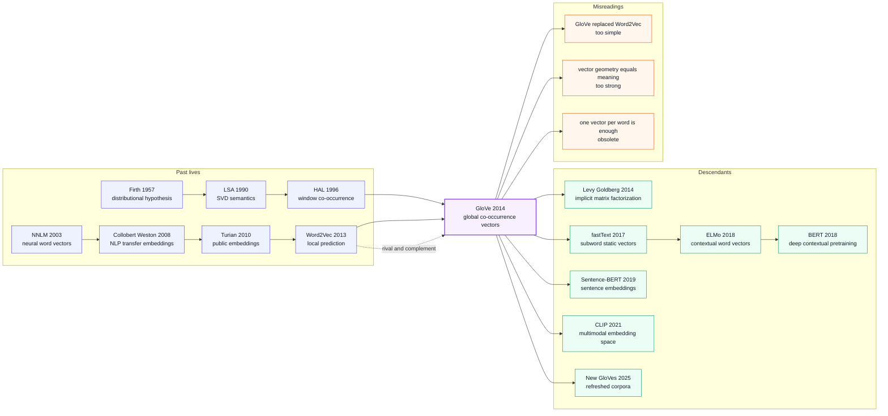

# GloVe - 把全局共现统计压成词向量的最后一块拼图

> **2014 年 10 月，多哈 EMNLP 2014 上，Stanford 的 Jeffrey Pennington、Richard Socher 和 Christopher D. Manning 发表 [GloVe: Global Vectors for Word Representation](https://aclanthology.org/D14-1162/)。** 在 Word2Vec 已经用局部窗口预测点燃词向量热潮之后，GloVe 做了一件更像“补上数学底座”的事：把整座语料库的 word-word 共现矩阵先数出来，再用 $w_i^\top \tilde{w}_j + b_i + \tilde{b}_j \approx \log X_{ij}$ 训练向量。它的钩子不是更深的网络，而是一个很 Stanford NLP 的判断：`ice/steam` 的意义差别不藏在单个共现概率里，而藏在与 `solid/gas/water/fashion` 这些探针词的概率比值里。于是一个 12 页 EMNLP paper 变成了之后十年 NLP 工程里最常被下载、最常被塞进 baseline 的静态词向量之一。

## 一句话总结

Pennington、Socher 和 Manning 2014 年发表在 EMNLP 的 GloVe，把静态词向量的两条路线合到一个公式里：既不像 [Word2Vec（2013）](2013_word2vec.md) 那样只把局部窗口预测写成训练任务，也不像 LSA/SVD 那样直接分解一张原始 count matrix，而是先统计全局共现 $X_{ij}$，再最小化 $J=\sum_{i,j} f(X_{ij})(w_i^\top \tilde{w}_j+b_i+\tilde{b}_j-\log X_{ij})^2$。这让向量差能够对应到共现概率比值：`ice` 相对 `steam` 更靠近 `solid`、远离 `gas`，这种关系被写进几何空间，而不是只靠下游任务碰运气学出来。

它击败的不是单一模型，而是两个不完整答案：传统 count-based 方法有全局统计但向量质量和 analogy 表现弱，Word2Vec 有强工程速度但理论上看不清它到底在分解什么。GloVe 在 6B-token Wikipedia+Gigaword、42B/840B-token Common Crawl 上发布了可直接下载的 50/100/200/300d 向量，在 analogy、word similarity、NER 等任务上给出强 baseline；更重要的是，它把“全局统计 vs 局部预测”的争论改写成“同一共现信号的两种近似”。反直觉之处在于：GloVe 没有发明更复杂的神经网络，却靠一个加权最小二乘目标成为深度学习时代最耐用的 NLP 基础设施之一。

---

## 历史背景

### 2014 年的 NLP 入口正在从特征工程换成向量文件

GloVe 诞生在一个非常短的窗口里：2013 年 Word2Vec 刚把 `king - man + woman = queen` 变成 NLP 传播史上最会旅行的 demo，2014 年下半年深度学习还没有统治所有文本任务，BERT 还要等四年，Transformer 还要等三年。那时许多系统的默认入口不是端到端预训练模型，而是一份下载好的词向量文件：把 token 查表变成 300 维向量，再喂给 CRF、CNN、RNN、parser、NER 系统。

这个时代的尴尬在于，大家都知道词向量有用，但对“为什么有用”的解释分裂成两派。**count-based 派**从 LSA、HAL、PMI、SVD 走来，相信全局共现矩阵包含语义结构；**predictive 派**从 NNLM、RNNLM、Word2Vec 走来，相信用局部上下文预测训练出来的 embedding 才有足够的质量和速度。GloVe 的历史位置正好卡在两派之间：它不是简单地说“Word2Vec 错了”，而是说“你们其实在用同一批共现统计，只是写法不同”。

这就是标题里 Global Vectors 的真正含义。Global 不是营销词，而是对当时 Word2Vec 热潮的一次校正：局部窗口预测很快，但语料级别的共现比例、频率结构和长尾统计不能只靠随机梯度隐式吸收。GloVe 把统计表先摊开，再把它压进向量空间，像是在 2014 年 NLP 的神经热潮旁边插了一根老派 distributional semantics 的地桩。

### 直接逼出 GloVe 的前序工作

- **LSA / SVD (1990s)**：把词-文档矩阵或词-上下文矩阵降维，证明“语义可以从全局统计里出来”。但传统 SVD 对高频词、稀疏矩阵、非线性比例关系处理粗糙，向量质量很难和 2013 年后的神经 embedding 竞争。
- **HAL / PMI / distributional semantics**：Firth 的“you shall know a word by the company it keeps”在计算上落成了上下文计数。GloVe 继承的不是某个具体算法，而是这个信念：词义不是词典条目，而是上下文分布。
- **Bengio NNLM (2003) 与 Collobert-Weston (2008)**：神经网络开始把词向量作为可训练参数，但完整语言模型太慢，输出层太贵，下游迁移还没有变成人人可用的工程资产。
- **Turian/Ratinov/Bengio (2010)**：公开词向量开始作为半监督 NLP 特征使用，说明“下载 embedding 再迁移到下游任务”这条路是可行的。
- **Word2Vec (2013)**：真正把词向量做成工业级工具。CBOW、Skip-gram、negative sampling、subsampling 让训练速度和 analogy 表现都上了台阶，也给 GloVe 留下一个未回答的问题：这种局部预测为什么会学出类似矩阵分解的全局结构？
- **Levy & Goldberg (2014)**：同年解释 Skip-gram with negative sampling 近似分解 shifted PMI matrix。它和 GloVe 互为注脚：一个从 Word2Vec 往矩阵分解解释，一个从矩阵分解往神经 embedding 目标推进。

### Stanford 团队当时在做什么

三位作者都在 Stanford NLP 圈子里。Christopher D. Manning 长期推动统计 NLP、依存句法、语义表示和 CoreNLP 工具链；Richard Socher 正在把 recursive neural networks、句法结构和深度学习推向 NLP；Jeffrey Pennington 则把物理和数学背景带入词向量建模。GloVe 的气质很像这个团队组合：既有传统 NLP 对语料统计的尊重，也有深度学习时代对可训练向量表示的追求。

值得注意的是，GloVe 不是一个“更深网络”的论文。它的训练程序在工程上相当朴素：先扫描语料，构造 word-word co-occurrence matrix，再对非零条目做加权最小二乘。它更像是 Stanford NLP 对 2013 年 Word2Vec 热潮的一次理论整理：如果词向量真的要成为基础设施，就不能只靠一个类比 demo 和一份 C 代码传播；它需要解释为什么全局共现比例会变成向量差。

### 工业、数据和开源状态

2014 年的词向量传播靠三件事：大语料、单机可训练代码、预训练文件下载。GloVe 官方页很快发布了 Wikipedia 2014 + Gigaword 5 的 6B-token 向量包，包含 50d、100d、200d、300d；随后还有 42B-token Common Crawl、840B-token Common Crawl 和 Twitter 27B-token 向量。这些 zip 文件比论文里的任何单个实验都更有历史影响力，因为它们让大量不想重训 embedding 的下游系统立刻拿到一份强 baseline。

当时 NLP 还没有“每个任务都先加载一个几百亿参数模型”的习惯。一个 822MB 的 `glove.6B.zip` 已经足够改变许多实验的起点：NER、情感分类、文本匹配、检索、推荐、知识图谱都能用同一套向量初始化。GloVe 因此有两条生命线：一条在 EMNLP 论文里，另一条在无数 GitHub repo、Kaggle notebook 和 course assignment 里。

## 研究背景与动机

### 只靠局部预测为什么不够解释

Word2Vec 的成功让 2013-2014 年的 NLP 社区接受了一个事实：不用标注数据，只靠上下文预测就能学到可迁移词义。但这也留下了一个理论缺口。Skip-gram 的目标是预测局部窗口词，训练时看到的是一批一批 `(center, context)` 样本；然而 analogy 任务里的线性结构看起来更像全局共现矩阵的低秩几何。GloVe 想回答的问题是：**这些线性方向到底从哪里来？**

论文用 `ice` 和 `steam` 的例子切入。单看 `ice` 与 `solid` 的共现概率，或者 `steam` 与 `gas` 的共现概率，数字本身没有那么可解释；但看比值 $P_{ik}/P_{jk}$，非区分性词如 `water` 会抵消，强区分词如 `solid`、`gas` 会突出。GloVe 的目标就是让向量差承载这种比值信息，而不是让每个点积孤立地拟合一个黑箱预测概率。

### 为什么不能直接回到传统 SVD

如果全局共现矩阵这么重要，为什么不直接 SVD？GloVe 的答案是：传统 SVD 不是错，而是不够贴合词向量的统计形状。原始 count matrix 太受高频词支配；PMI 会把低频共现放大到离谱；截断或平滑选择往往缺乏任务动机；而且 SVD 的二次损失通常平等对待所有矩阵项，不能表达“罕见但可靠的共现”和“高频但无信息的共现”之间的差异。

GloVe 的设计动机因此很具体：保留 count-based 方法的全局统计，加入 neural embedding 的可训练性和局部窗口直觉，再用 weighting function 把频率效应压住。它不是“预测派 vs 统计派”的折中主义，而是把争论变成一个可优化目标：哪些共现条目该被信任，哪些该被降权，怎样让概率比值落成向量差。

---

## 方法详解

### 整体框架

GloVe 的 pipeline 可以拆成两步：**先数，再压缩**。第一步扫描语料，构造词与上下文词的共现矩阵 $X$，其中 $X_{ij}$ 表示词 $i$ 和上下文词 $j$ 在窗口内共同出现的加权次数；第二步只在非零共现条目上训练两个词向量表 $W$ 与 $\tilde{W}$，让点积加 bias 去拟合 $\log X_{ij}$。训练完成后，通常把 $w_i$ 和 $\tilde{w}_i$ 相加或平均，作为词 $i$ 的最终向量。

这套设计最有意思的地方是：它看上去像矩阵分解，但训练方式像神经 embedding；它没有 softmax 输出层，也不做中心词预测，却仍然能解释 Word2Vec 里最会传播的线性 analogy。GloVe 的中心问题不是“如何预测下一个词”，而是“如何让全局共现比例变成向量差”。

| 范式 | 训练信号 | 是否显式用全局矩阵 | 速度瓶颈 | 2014 年代表 |
|------|----------|--------------------|----------|-------------|
| LSA / SVD | 词-文档或词-上下文矩阵重构 | 是 | 大矩阵分解 | LSA, PMI-SVD |
| Word2Vec | 局部窗口预测 | 否，隐式吸收 | 负采样 / 输出近似 | CBOW, Skip-gram |
| **GloVe** | $\log X_{ij}$ 加权重构 | **是** | 共现构造 + 非零条目 SGD | 本文 |
| Contextual LM | 上下文 token 预测 | 否，放进深层函数 | 大模型预训练 | ELMo/BERT 之后 |

### 关键设计

#### 设计 1：从共现概率比值出发，而不是从单个概率出发

**功能**：把“词义差异”定义为目标词对一组 probe words 的相对共现模式，而不是某个目标词和某个上下文词之间的孤立概率。

GloVe 的论文开篇用 `ice` 与 `steam` 的例子说明：`ice` 与 `solid` 的共现概率高，`steam` 与 `gas` 的共现概率高；`water` 对两者都相关，`fashion` 对两者都无关。单个概率 $P_{ik}$ 会混进很多背景频率，但比值 $P_{ik}/P_{jk}$ 会让非区分性词接近 1，让区分性词远离 1。

$$
\text{meaning}(i,j;k) \propto \frac{P_{ik}}{P_{jk}},\qquad P_{ik}=\frac{X_{ik}}{X_i}
$$

```python
def ratio_signal(cooc, word_i, word_j, probe_k):
    p_i = cooc[word_i, probe_k] / cooc[word_i].sum()
    p_j = cooc[word_j, probe_k] / cooc[word_j].sum()
    return p_i / max(p_j, 1e-12)
```

| probe word | $P(k\mid ice)$ vs $P(k\mid steam)$ | 比值含义 | 对向量差的作用 |
|------------|-------------------------------------|----------|----------------|
| `solid` | `ice` 更高 | 远大于 1 | 推动 `ice - steam` 指向固态属性 |
| `gas` | `steam` 更高 | 远小于 1 | 推动 `steam - ice` 指向气态属性 |
| `water` | 两者都高 | 接近 1 | 被抵消，不该主导差异 |
| `fashion` | 两者都低 | 接近 1 | 噪声项被抵消 |

**设计动机**：传统共现向量常把“共同相关”和“区分关系”混在一起。GloVe 的洞察是：词向量最有用的不是点本身，而是方向；方向应该解释两个词相对一批 probe words 的概率比值。这样 analogy 里的 `king - man + woman` 就不再只是漂亮巧合，而是共现比值在向量空间里的线性化结果。

#### 设计 2：用 log-bilinear 加 bias 拟合 $\log X_{ij}$

**功能**：把共现矩阵的非零条目转成可微的加权最小二乘问题，让词向量点积承担“对数共现强度”的角色。

GloVe 最终目标写得非常短：两个向量表、两个 bias、一个权重函数、一个平方误差。这里 $w_i$ 是中心词向量，$\tilde{w}_j$ 是上下文词向量，$b_i$ 与 $\tilde{b}_j$ 吸收词频偏置。

$$
J = \sum_{i,j=1}^{V} f(X_{ij})\left(w_i^\top \tilde{w}_j + b_i + \tilde{b}_j - \log X_{ij}\right)^2
$$

```python
def glove_loss(center, context, bias_c, bias_o, entries, weight_fn):
    loss = 0.0
    for i, j, x_ij in entries:
        prediction = center[i] @ context[j] + bias_c[i] + bias_o[j]
        residual = prediction - math.log(x_ij)
        loss += weight_fn(x_ij) * residual * residual
    return loss / len(entries)
```

| 目标 | 拟合对象 | 优点 | 代价 |
|------|----------|------|------|
| 原始 count 重构 | $X_{ij}$ | 保留次数 | 高频词支配过强 |
| PMI/SVD | $\log P_{ij}-\log P_iP_j$ | 有统计解释 | 低频项易爆炸 |
| Skip-gram NEG | 局部预测样本 | 训练快 | 全局矩阵关系隐式 |
| **GloVe** | $\log X_{ij}$ 加 bias | 频率偏置可分离，目标简单 | 需要先构造共现表 |

**设计动机**：为什么是 $\log X_{ij}$ 而不是 $X_{ij}$？因为概率比值的对数会变成差值，而向量空间最擅长表达差值。为什么要加 bias？因为大量共现强度只是词频效应，不该全部塞进语义维度。GloVe 用 bias 把“这个词本来就常见”与“这个词和那个词有语义关系”分开，这是它比裸 SVD 更贴近 embedding 任务的关键。

#### 设计 3：加权函数 $f(x)$ 让高频词不过度支配、低频噪声不过度放大

**功能**：控制不同共现条目对目标函数的贡献，让罕见共现不至于被 PMI 式放大，高频功能词也不至于吞掉训练。

论文选择了一个分段函数：小于 $x_{\max}$ 时按幂次增长，大于阈值后截断为 1。默认 $x_{\max}=100$，$\alpha=3/4$。这不是装饰项，而是 GloVe 能在大语料上稳定训练的核心工程设计。

$$
f(x)=\begin{cases}
(x/x_{\max})^\alpha, & x < x_{\max} \\
1, & \text{otherwise}
\end{cases}\quad \text{with } x_{\max}=100,\ \alpha=3/4
$$

```python
def glove_weight(x, x_max=100.0, alpha=0.75):
    if x < x_max:
        return (x / x_max) ** alpha
    return 1.0
```

| 共现类型 | 没有权重会怎样 | GloVe 权重处理 | 结果 |
|----------|----------------|----------------|------|
| 极低频误共现 | 被 log/PMI 放大 | 小权重压低 | 降低噪声 |
| 中频可靠共现 | 有语义信号 | 权重逐步上升 | 保留关系 |
| 高频功能词 | 主导平方误差 | 到 1 后不再继续变大 | 防止吞掉训练 |
| 长尾词 | 数据稀薄 | 不完全丢弃 | 保留可学习机会 |

**设计动机**：词频分布服从长尾，原始计数差几个数量级。没有 weighting，模型会把容量浪费在 `the/of/and` 这类高频词上；直接用 PMI，又会让偶然共现的低频词获得夸张权重。GloVe 的 $f(x)$ 是一个折中：相信频率带来的可靠性，但只相信到某个上限。

#### 设计 4：双向词表与最终向量合并

**功能**：区分“词作为中心词”和“词作为上下文词”的角色，同时在输出阶段把两套表示合并成一套通用 embedding。

由于共现矩阵在实际窗口和权重下并不完全对称，GloVe 为每个词学习 $w_i$ 与 $\tilde{w}_i$ 两个向量。训练目标对二者近似对称，但它们在优化中承担不同角色。最终发布的向量通常用两者相加，这一步把中心角色和上下文角色的信息合并。

$$
v_i = w_i + \tilde{w}_i \quad \text{or}\quad v_i=\frac{1}{2}(w_i+\tilde{w}_i)
$$

```python
def export_vectors(center_vectors, context_vectors, mode="sum"):
    if mode == "average":
        return 0.5 * (center_vectors + context_vectors)
    return center_vectors + context_vectors
```

| 选择 | 信息来源 | 优点 | 风险 |
|------|----------|------|------|
| 只用 $w_i$ | 中心词角色 | 简单 | 丢掉上下文角色信息 |
| 只用 $\tilde{w}_i$ | 上下文词角色 | 可解释为 context embedding | 下游习惯不一致 |
| **相加/平均** | 两套角色合并 | 实践效果稳，官方向量采用 | 失去角色区分 |
| 拼接 | 保留两套角色 | 信息最多 | 维度翻倍，下游成本高 |

**设计动机**：这一步看似平凡，但它解释了为什么 GloVe 最后能以“一个词一个向量文件”的形态传播。训练时保留中心/上下文不对称，输出时合并成简单 API。对 2014 年的下游系统来说，这种 API 友好性非常重要：读入一个 `.txt`，每行一个词加 300 个浮点数，就能接进旧系统。

### 损失函数 / 训练策略

| 项 | GloVe 配置 | 说明 |
|----|------------|------|
| 语料扫描 | 单次或少量 pass 构造共现 | 先付出统计成本，后续训练只看非零条目 |
| 窗口 | 局部上下文窗口，加距离衰减 | 近邻词贡献更大 |
| 训练样本 | 非零 $X_{ij}$ entries | 不在完整 $V^2$ 矩阵上训练 |
| 目标 | weighted least squares | 可用 AdaGrad/SGD 高效优化 |
| 权重 | $x_{\max}=100, \alpha=3/4$ | 控制高低频影响 |
| 维度 | 50/100/200/300d | 官方发布多种维度 |
| 语料 | 6B Wiki+Gigaword, 42B/840B Common Crawl, Twitter | 预训练包推动广泛使用 |
| 输出 | $w_i+\tilde{w}_i$ | 下游使用单一词向量表 |

注意 1：GloVe 的“global”不意味着忽略局部窗口。共现矩阵本身就是从局部窗口累计出来的，只是训练目标看到的是聚合后的全局统计，而不是随机抽到的一条预测样本。

注意 2：GloVe 的影响力来自论文目标和发布资产的叠加。单看算法，它是一个漂亮的加权矩阵分解；放到 2014 年工程生态里，它是一份可下载、可复现、跨任务有效的默认初始化。

---

## 失败案例

### 当时被 GloVe 重新压住的对手

GloVe 的“失败案例”不是图像生成论文里那种视觉翻车，而是一组表示学习路线在 2014 年被重新排序。它没有宣称 count-based 方法死亡，也没有宣称 Word2Vec 失败；它真正击败的是“二选一”的说法：要么有全局矩阵解释但效果弱，要么有预测式训练和好效果但解释不清。

| baseline | 当时优势 | 输给 GloVe 的地方 | 经验教训 |
|----------|----------|-------------------|----------|
| LSA / truncated SVD | 全局矩阵清楚，可解释 | 对高低频极端敏感，analogy 线性结构弱 | 全局统计需要更好的缩放和权重 |
| PMI / PPMI 矩阵 | 语义相关性强，理论直观 | 低频共现容易被无限放大 | 对数比值需要平滑和截断 |
| Collobert-Weston / Turian embeddings | 下游特征有效 | 训练语料和目标较小，线性 analogy 不突出 | 词向量要变成基础设施必须更大规模 |
| Word2Vec CBOW | 速度快，工程友好 | 在部分 analogy 和 similarity 设置下不如 GloVe | 局部预测不是唯一答案 |
| Word2Vec Skip-gram NEG | 强 baseline，传播极广 | 全局共现关系是隐式的，解释要靠后续分析 | 预测式训练和矩阵分解并非对立 |

最值得注意的是 Word2Vec。GloVe 不是“打倒”它，而是把它纳入同一套解释：Skip-gram with negative sampling 后来被 Levy & Goldberg 证明近似分解 shifted PMI matrix，GloVe 则从一开始就把矩阵目标写出来。两篇论文之间更像是竞争中的互补，而不是一方废掉另一方。

### 作者承认的失败和边界

论文没有把 GloVe 包装成语言理解的终点。它承认自己的目标仍然是 **static word vectors**：每个词类型只有一个向量，所以 `bank` 在 “river bank” 和 “bank account” 中不变；词序、句法结构、否定、指代、篇章关系都不在目标函数里。

另一个边界是共现矩阵的成本。GloVe 训练本身可以在非零条目上高效进行，但矩阵构造需要扫描语料、维护词表、统计窗口和写出稀疏条目。对 2014 年的单机 NLP 来说这很实用；对今天的 web-scale streaming pretraining 来说，这种先聚合再训练的流程不如端到端 token 预测自然。

第三个边界是评估。Analogy 任务传播力很强，但它只覆盖一小部分词义关系，而且 exact-match 答案会惩罚合理近邻。Word similarity 和 NER 能补充一些外部证据，却也不能证明模型“理解语言”。GloVe 的实验足以证明它是强词向量，不足以证明静态词向量是语言表示的终点。

### 真正的反 baseline 教训

GloVe 最深的反 baseline 是：**传统方法不一定因为思想错而输，常常是因为统计对象没有被写成合适的优化问题**。LSA 抓到了全局统计，Word2Vec 抓到了可训练预测，GloVe 把两边重新组合，才让旧思想在新工程条件下复活。

这给后来的 embedding 研究一个长期教训：不要急着把“上一代范式”当成废品。很多时候，上一代范式里有对数据结构的正确直觉，只是缺少合适的目标函数、scale、软件和传播形态。GloVe 对 LSA/PMI 的态度正是如此：不是回到 SVD，而是把矩阵统计翻译成深度学习时代能训练、能发布、能下载的向量文件。

## 实验关键数据

### Word analogy 与 similarity

GloVe 的核心实验围绕三个问题展开：向量差是否能做 analogy，余弦相似度是否符合人类 word similarity 标注，下游 NER 是否能从这些向量受益。论文中最会传播的是 analogy，因为它直接对应方法动机里的“概率比值 -> 向量差”。

| 设置 | 数据规模 / 维度 | 论文中的结论 | 读法 |
|------|----------------|--------------|------|
| LSA/SVD 类方法 | count matrix + low-rank factorization | 明显弱于 GloVe | 原始全局统计不够，需要权重和 bias |
| CBOW | Word2Vec predictive baseline | 速度强，accuracy 通常低于 Skip-gram/GloVe | 工程效率高但表达略弱 |
| Skip-gram NEG | Word2Vec 强 baseline | 与 GloVe 接近，但在多组 analogy/similarity 上被超过 | 预测式训练是强对手 |
| **GloVe 6B 300d** | Wikipedia 2014 + Gigaword 5 | 论文报告整体 analogy 约 75% 量级 | 小到中等语料上已成强 baseline |
| **GloVe larger corpora** | Common Crawl 42B / 840B | 更大语料继续提升覆盖和稳定性 | 发布资产比单一表格更重要 |

这里的关键不是某个数字本身，而是“GloVe 在相同维度、相似语料量级下能稳定压住传统 count-based baseline，并与 Word2Vec 强 baseline 正面竞争”。这证明它不是漂亮解释而已，而是能在当年的标准任务上站住。

### 下游迁移与任务表现

除了 analogy，GloVe 还报告了 word similarity 与 named entity recognition。NER 尤其重要，因为它把词向量从“几何玩具”拉回实际 NLP pipeline：如果 embedding 只会做 analogy，却不能提升序列标注，那它很难成为基础设施。

| 任务 | 输入方式 | 观察 | 意义 |
|------|----------|------|------|
| Word similarity | 余弦相似度 vs 人类评分 | GloVe 在多数据集上强于传统矩阵方法 | 向量空间不只服务 analogy |
| Analogy | $a-b+c$ 最近邻 | 线性子结构稳定出现 | 方法动机被直接验证 |
| NER | 作为下游序列标注特征 | 带来可测迁移收益 | 词向量进入实际 NLP 系统 |
| Nearest neighbors | cosine / Euclidean | 能找出 `frog` 的生物学近邻 | 低频语义也能被捕捉 |

GloVe 的实验写法有一个时代特征：它不会像 2026 年的 embedding paper 那样跑 MTEB、BEIR、多语种检索、RAG、instruction-tuned retrieval。它只需要证明一件事：**静态词向量作为下游特征是稳定增益**。在 2014 年，这已经足够改变大量系统的默认初始化。

### 发布向量本身就是关键数据

很多经典论文的影响来自 benchmark 表格，GloVe 的影响很大一部分来自它发布的文件。官方项目页列出的预训练包让它不再只是论文方法，而是一套可直接装进工程的资源。

| 预训练包 | 语料规模 | 词表 / 维度 | 下载规模 |
|----------|----------|-------------|----------|
| Wikipedia 2014 + Gigaword 5 | 6B tokens | 400K vocab, 50/100/200/300d | 822 MB |
| Common Crawl | 42B tokens | 1.9M vocab, 300d | 1.75 GB |
| Common Crawl | 840B tokens | 2.2M vocab, 300d | 2.03 GB |
| Twitter | 27B tokens from 2B tweets | 1.2M vocab, 25/50/100/200d | 1.42 GB |

这些数字解释了为什么 GloVe 会长期出现在课程、baseline 和旧系统里。它不是“你可以自己训练”的方法，而是“你现在就可以下载”的默认资源。对 2014-2018 年的 NLP 工程来说，这个差别非常大。

---

## 思想史脉络



### 前世（被谁逼出来的）

GloVe 的前世是两条线汇合。第一条是 **distributional semantics**：Firth 的分布假设、LSA 的矩阵降维、HAL 的窗口共现都在说同一件事：词义不是独立符号，而是上下文分布。第二条是 **neural embeddings**：NNLM、Collobert-Weston、Turian 公开向量、Word2Vec 都在把词表示变成可训练参数和可迁移资产。

GloVe 最直接的压力来自 Word2Vec。Word2Vec 已经证明局部预测训练能得到高质量词向量，但它的成功太像“工程魔法”：负采样、subsampling、窗口大小、维度选择都有效，却没有直接把全局共现矩阵写出来。GloVe 把这个魔法翻译成更传统的统计语言：你的局部预测，归根到底仍然在处理共现结构。

### 今生（继承者）

1. **Levy & Goldberg (2014)**：从另一个方向完成桥接，解释 Skip-gram NEG 近似分解 shifted PMI matrix。它让 GloVe 的思想史地位更清楚：count-based 与 predictive 不是敌人，而是同一统计对象的两种写法。
2. **fastText (2017)**：保留静态词向量 API，但把词拆成 character n-grams，修复 GloVe/Word2Vec 对 OOV 和形态变化的脆弱性。
3. **ELMo / BERT (2018)**：真正终结“一个词一个向量”。GloVe 的 lookup table 被上下文函数替代，但“无标注文本 -> 可迁移表示”的信念被完整继承。
4. **Sentence-BERT / modern embedding models**：把 embedding 对象从 word 扩展到 sentence、paragraph、query、document。GloVe 的文件形态消失了，向量作为检索接口的想象仍在。
5. **CLIP (2021)**：把共享向量空间推进到图文对齐。它不再是词共现矩阵，但仍然继承“语义可以落成几何邻近关系”的核心想象。
6. **A New Pair of GloVes (2025)**：GloVe 团队多年后刷新语料和训练报告，说明静态向量作为轻量基础设施仍有需求。

### 误读 / 简化

第一个误读是“GloVe 替代了 Word2Vec”。实际历史更细：它们长期并存，许多下游系统会同时试 Google News Word2Vec 和 GloVe 6B/840B。GloVe 的思想价值不是把 Word2Vec 踢出场，而是解释预测式 embedding 与矩阵统计之间的关系。

第二个误读是“向量几何等于语义理解”。GloVe 的 analogy 和 nearest neighbors 很漂亮，但它学到的是语料共现结构，不是 grounded world model。它知道 `frog` 和 `toad` 接近，却没有视觉、动作、物理和交互经验。

第三个误读是“静态词向量已经足够”。2014 年这很有诱惑力，因为一个 300d 表格可以迁移到很多任务。2018 年之后，多义词、上下文、长距离依赖和句子级语义证明 lookup table 只是第一代预训练表示，而不是最终答案。

---

## 当代视角

### 站不住的假设

1. **“一个词一个向量”站不住了**。GloVe 默认词类型拥有固定向量，无法区分 `apple` 是水果还是公司，`bank` 是河岸还是银行。ELMo/BERT 之后，词义被重新定义为 token 在上下文中的函数值。
2. **“窗口共现足够表达语言”站不住了**。局部窗口能捕捉主题、语义近邻和部分类比关系，但对否定、指代、组合语义、长距离依赖无能为力。Transformer 的胜利说明共现统计是好起点，不是语言理解的完整模型。
3. **“analogy accuracy 足够代表语义质量”站不住了**。`a-b+c` 很漂亮，却覆盖面窄、对频率敏感、容易被数据集偏差放大。现代 embedding 评估更关心检索、聚类、reranking、RAG、跨域迁移和多语种稳健性。
4. **“静态向量会长期作为 NLP 默认入口”站不住了**。2014-2018 年下载 GloVe 是常规动作；2026 年多数系统直接用 Transformer embedding、sentence embedding 或 instruction-tuned retrieval model。
5. **“语料偏见只是下游问题”站不住了**。GloVe 继承语料里的性别、种族、职业和地域分布，偏见会被编码成向量方向。Bolukbasi 等 debiasing 工作之所以重要，正是因为静态向量太普及。

### 时代证明的关键与被替代的部分

- **保留下来的关键**：分布假设、无标注文本预训练、向量空间检索、共现/对比信号、可下载表示、把离散符号变成连续几何对象。这些成为 foundation model 时代的底层语法。
- **被替代的部分**：词级静态表、忽略上下文、analogy 作为核心指标、只靠局部窗口、把英文大语料当默认世界、预训练文件不记录足够数据治理细节。
- **半保留半变形的部分**：weighted matrix factorization 让位给 contrastive learning 和 masked language modeling；词向量文件让位给 embedding API；co-occurrence matrix 的直觉被扩展到 query-document、image-text、user-item 等更大对象。

GloVe 的历史位置因此很清楚：它不是现代 NLP 表示学习的终点，而是静态词向量时代最优雅的收束之一。它把“全局统计为什么能变成线性语义方向”这件事讲明白，然后被上下文模型接走。

### 作者当时没想到的副作用

1. **GloVe 变成课程和 baseline 的默认件**。很多学生第一次接触 NLP embedding，不是训练 Word2Vec，而是下载 `glove.6B.300d.txt`。这让词向量教学变得容易，也让一些实验过度依赖固定英文语料。
2. **静态 embedding 让偏见变得可测**。性别职业方向、国家地区刻板印象、名字与族裔关联都可以在向量空间里被测量。GloVe 本身不是偏见研究论文，却成了偏见研究的重要对象。
3. **“embedding 文件”塑造了工程接口**。很多系统把表示学习想象成一个可缓存、可下载、可版本化的矩阵。今天的 vector database、ANN retrieval、RAG embedding API 在工程形态上仍有这层影子。
4. **复现变得简单也变得模糊**。下载同一份向量可以降低门槛，但语料清洗、词表、大小写、tokenization 和版本差异常常被藏在文件名背后。

### 如果今天重写 GloVe

如果 2026 年重写 GloVe，核心目标未必会变，但论文会更诚实地补上几块。第一，系统报告多语种和形态丰富语言，而不是主要围绕英文；第二，加入 bias/fairness/privacy/copyright 的语料治理分析；第三，用 MTEB、BEIR、检索、聚类和下游鲁棒性替代单一 analogy 核心地位；第四，加入 subword 或 phrase-aware 机制，减少 OOV；第五，把各向异性、频率效应、向量归一化和后处理作为几何诊断。

但它不应该被改造成 BERT。GloVe 的价值就在于小、透明、可训练、可下载。今天重写它，应该让它更可诊断、更跨语言、更负责任，而不是把一个漂亮的 weighted least-squares 模型塞进大模型外壳里。

## 局限与展望

### 作者承认的局限

- **静态词义**：一个词一个向量，天然无法表达上下文义。
- **依赖窗口共现**：窗口大小、距离权重和词表截断会影响结果。
- **语料规模敏感**：更大语料通常更好，但也引入更多清洗、噪声和偏见问题。
- **任务覆盖有限**：analogy、similarity、NER 只能代表一部分词向量能力。
- **构造矩阵有前置成本**：先聚合共现再训练，不如端到端 token 预测灵活。

### 2026 视角的局限

- **polysemy 无法解决**：多义词是结构性盲点。
- **OOV 与形态变化脆弱**：fastText 后来专门补这个洞。
- **语义不 grounded**：没有视觉、动作、知识库和交互信号。
- **偏见方向会被下游继承**：向量空间的线性结构既能服务 analogy，也能放大社会刻板印象。
- **评价指标太窄**：现代应用需要检索、问答、生成辅助和跨域泛化。
- **英文中心化明显**：经典 GloVe 包主要服务英文生态。

### 改进方向（已被后续工作证实）

- **fastText / subword embeddings**：用 character n-grams 解决 OOV 和形态问题。
- **ELMo / BERT / GPT 系列**：把静态表替换为上下文函数。
- **Sentence-BERT / E5 / modern retrieval embeddings**：把词级表示扩展到句子、段落、query-document 匹配。
- **CLIP / multimodal contrastive learning**：把共享向量空间推广到图文和多模态。
- **bias measurement and debiasing**：把 embedding 偏见作为必须量化和治理的问题。
- **2025 New GloVes**：说明轻量静态向量仍可在新语料和低成本场景中更新。

## 相关工作与启发

- **vs Word2Vec**：Word2Vec 用局部预测隐式吸收共现，GloVe 显式写出全局矩阵目标。教训是：工程强方法也需要理论翻译，理论清楚的方法也要能发布成资产。
- **vs LSA/SVD**：LSA 抓住了全局统计，但目标和权重太粗。GloVe 不是回到 LSA，而是把 LSA 的统计直觉改写成可训练 embedding objective。
- **vs PMI/PPMI**：PMI 把概率比值讲清楚，却容易被低频噪声污染。GloVe 用 weighting function 把这个老问题工程化处理。
- **vs fastText**：fastText 沿用静态向量接口，但承认“词”不是最好的基本单位，subword 是对 GloVe 的自然修补。
- **vs BERT**：BERT 不是更大的 GloVe，而是把表示从词表项升级成上下文函数。共同点是自监督预训练，分水岭是静态与动态。
- **vs CLIP**：CLIP 的图文向量空间在哲学上继承了 GloVe 的几何想象，只是共现对象从 word-window 换成 image-text pair。

## 相关资源

- [ACL Anthology: GloVe: Global Vectors for Word Representation](https://aclanthology.org/D14-1162/)
- [Official GloVe project page and pretrained vectors](https://nlp.stanford.edu/projects/glove/)
- [Official StanfordNLP GloVe code](https://github.com/stanfordnlp/GloVe)
- [Wikipedia 2014 + Gigaword 5 6B vectors](https://nlp.stanford.edu/data/glove.6B.zip)
- [Common Crawl 840B vectors](https://nlp.stanford.edu/data/glove.840B.300d.zip)
- [Levy & Goldberg 2014: Neural Word Embedding as Implicit Matrix Factorization](https://proceedings.neurips.cc/paper/2014/hash/feab05aa91085b7a8012516bc3533958-Abstract.html)
- [fastText subword embeddings](https://aclanthology.org/Q17-1010/)
- [BERT deep contextual pretraining](../era3_attention/2018_bert.md)


---

> 🌐 [English version](/en/era2_deep_renaissance/2014_glove/) · 📚 awesome-papers project · CC-BY-NC