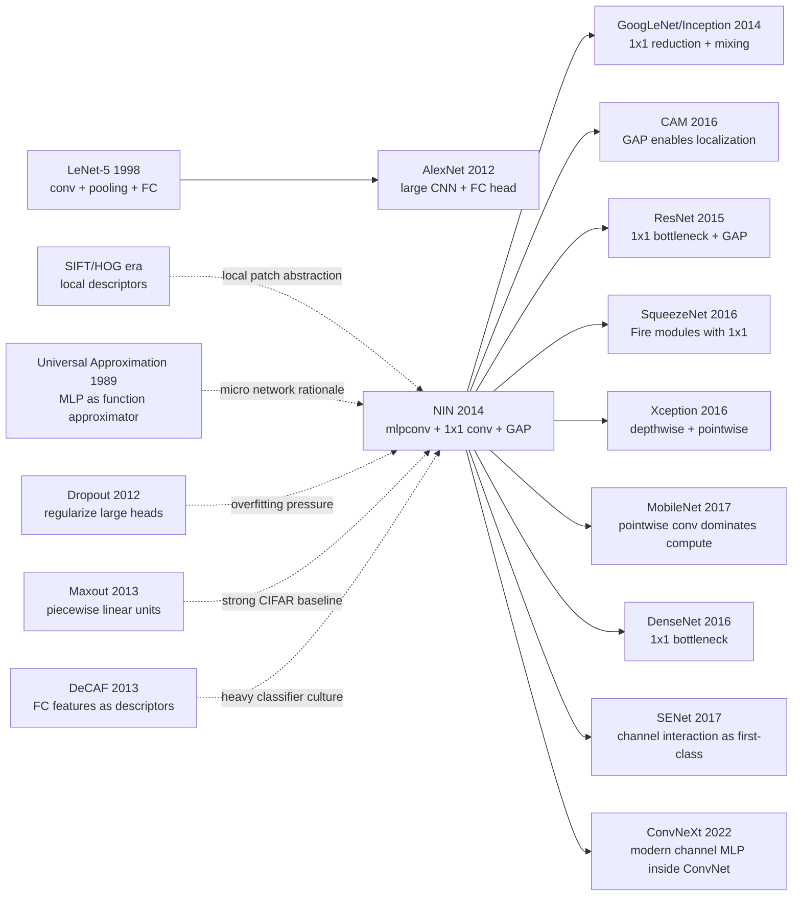

# Network In Network — 把小 MLP 塞进每个卷积窗口

> **2013 年 12 月 16 日，National University of Singapore 的 Min Lin、Qiang Chen、Shuicheng Yan 三位作者把 [arXiv:1312.4400](https://arxiv.org/abs/1312.4400) 挂上去，随后在 ICLR 2014 发表。** 这篇 10 页论文没有提出更深的网络、也没有靠更大的数据集取胜，而是问了一个听起来很小的问题：为什么卷积核只能是一个线性模板？NIN 的回答是把一个小 MLP 塞进每个局部感受野，用 $1\times1$ 卷积做通道混合，再用 global average pooling 砍掉参数沉重的全连接头。它后来几乎隐身了：GoogLeNet、ResNet bottleneck、SqueezeNet、MobileNet、CAM 和现代 CNN 分类头都在用它的部件，却很少再把这些部件叫作 Network In Network。

## 一句话总结

Lin、Chen、Yan 2014 年发表在 ICLR 的 **Network In Network**，把 AlexNet 之后默认的“线性卷积核 + ReLU + 大全连接头”拆成两处最小但影响极深的改写：在每个局部感受野里用一个共享的小 MLP 做 $f_{i,j}^{(l)}=\sigma(W_{1\times1}^{(l)} f_{i,j}^{(l-1)}+b^{(l)})$，让 $1\times1$ 卷积成为跨通道非线性混合器；在最后用 $s_c=\frac{1}{HW}\sum_{i,j}F_{i,j,c}$ 的 global average pooling 直接把类特征图变成 logits。它击败的 baseline 不是某一个“大模型”，而是 2013 年 CNN 的默认范式：Maxout+dropout 在 CIFAR-10 上约 11.68% / 9.38% 错误率，NIN 报告约 10.41% / 8.81%，并在 CIFAR-100 报告约 35.68%。更重要的是，NIN 把“通道混合”和“无全连接分类头”变成可复用积木：一年后的 GoogLeNet/Inception、[ResNet bottleneck](2015_resnet.md)、SqueezeNet、MobileNet 的 pointwise convolution，以及 CAM 的可解释分类图，都在沿着它铺出的路走。隐藏 lesson 是：架构史里有些论文不以一个大系统被记住，而是以两个小算子被整个生态吸收。

---

## 历史背景

### AlexNet 之后，CNN 已经赢了，但卷积层本身还很朴素

2012 年 AlexNet 打穿 ImageNet 之后，计算机视觉的主线从“要不要用深度学习”迅速变成“怎样把 CNN 做得更深、更准、更不容易过拟合”。可是 2013 年的主流 CNN 结构其实仍然很像 LeNet 的放大版：一个局部窗口里放一组线性滤波器，后面接 ReLU 或 maxout，再靠 pooling 降采样，最后用两三层全连接层做分类。

这个模板强在工程成熟，弱在表达方式有点粗糙。卷积核本质上是一个广义线性模型：对局部 patch 做一次内积，再经过一个点态非线性。只要局部模式可以被线性模板捕捉，普通卷积就很有效；但如果一个局部结构需要多个边缘、纹理、颜色通道之间的非线性组合，单个卷积核就只能靠“堆更多通道、更多层”间接表示。NIN 的出发点正是这个缝隙：**为什么每个局部感受野里的函数必须这么浅？**

另一处缝隙在分类头。AlexNet 的大部分参数在全连接层里，ImageNet 上数据够大还能承受；CIFAR-10、CIFAR-100、SVHN 这些小图任务上，全连接头很容易变成记忆器，必须依赖 dropout、max-norm、数据增强一起补救。NIN 看见的问题不是“CNN 不够深”，而是“卷积特征图到分类器之间的接口太笨重”。

### 2013 年的局部特征竞争：maxout、dropout 和更强的局部函数

NIN 的近邻不是 ResNet，而是 **Maxout Networks** 和 **dropout** 这条线。Goodfellow 等 2013 年用 maxout 激活把一组线性响应取最大值，获得更强的 piecewise-linear 表达；dropout 则让大网络在小数据上不至于过拟合。这两者在 CIFAR/SVHN 上很强，几乎代表了当时“小图像 CNN”的最优工程组合。

但 maxout 的增强主要发生在激活函数层面：它让单元的非线性形状更丰富，却没有改变“局部 patch 先被线性滤波器扫描”这个基本事实。NIN 的选择更激进：把每个 patch 的映射函数本身换成一个小 MLP。这样看，mlpconv 不是“在卷积后面多接几个 $1\times1$ 层”这么简单，而是在问局部视觉概念是否应该由一个共享的小分类器来抽象。

这和 1990 年代以来的局部特征思想也有暗线关系。SIFT、HOG、bag-of-visual-words 时代，视觉系统一直在设计“局部 patch 到描述子”的映射；CNN 把这个映射交给可学习卷积。NIN 再往前推一步：局部描述子不必是一个线性滤波响应，它可以是一个非线性函数族。

### 论文团队和 ICLR 2014 的位置

Min Lin、Qiang Chen、Shuicheng Yan 三位作者来自 National University of Singapore。论文 2013 年 12 月 16 日挂上 arXiv，2014 年 3 月更新 v3，随后在 ICLR 2014 发表。那个时间点很微妙：AlexNet 已经证明 CNN 可行，VGG 和 GoogLeNet 正要把“更深”和“模块化”推到 ImageNet，BatchNorm、ResNet、DenseNet 都还没出现。

NIN 因此站在一个过渡点上。它没有像 VGG 那样把 $3\times3$ 卷积堆到极致，也没有像 GoogLeNet 那样提出复杂多分支模块；它抓住的是两个后来被所有人当作常识的小部件：**$1\times1$ 卷积负责通道混合，global average pooling 负责轻量分类**。这也是它容易被低估的原因。完整的 NIN 网络没有成为今日标准块，但它的两个零件被拆下来，装进了几乎每一种后来的 CNN。

### 算力、数据和框架条件

NIN 的实验集中在 CIFAR-10、CIFAR-100、SVHN、MNIST 这类小分辨率数据集上。2013-2014 年的单卡 GPU 足以在这些任务上快速迭代，研究者可以一天内试完很多架构变体；ImageNet 级实验则仍然昂贵，通常需要大公司或大实验室资源。

框架层面，Caffe 刚刚兴起，Theano 仍然流行，PyTorch 不存在，TensorFlow 还没发布。$1\times1$ 卷积在实现上并不神秘，真正的价值在于“把它解释为跨通道的局部 MLP”。在那个多数学者还把 $1\times1$ 看成特例卷积的阶段，NIN 给了它一个新的语义：**不是空间滤波，而是每个像素位置上的通道函数逼近器**。

## 研究背景与动机

### 普通卷积层的问题：局部线性太窄，分类头太重

NIN 的动机可以压缩成两句话。第一，普通卷积层对局部 patch 的建模能力有限：$y_{i,j,k}=\sigma(w_k^\top x_{i,j}+b_k)$ 只是一个线性投影加非线性，复杂局部概念需要很多滤波器共同凑出来。第二，传统 CNN 的全连接头参数量大、空间信息被展平、可解释性弱，在小数据上尤其容易过拟合。

这两点合在一起，形成了 NIN 的核心判断：与其把模型容量主要堆在最后的全连接层，不如把容量前移到每个局部感受野里，让中间特征已经更有判别性；与其让分类器在展平特征上重新学习类别组合，不如让最后一层卷积直接产生类别特征图，再用平均池化读出每一类的空间证据。

### 为什么这不是一个“小 trick”

今天看 $1\times1$ 卷积太普通了，容易忘记它在 2014 年意味着什么。它把通道维度从“卷积滤波器的输出编号”变成了可学习的表示空间：每个空间位置都有一个向量，$1\times1$ 层在这个向量上做非线性变换。换句话说，CNN 不再只是“空间模板探测器”的堆叠，而变成“空间局部函数 + 通道 MLP”的交替组合。

global average pooling 同样不是简单地少几层参数。它改变了分类头和特征图的关系：最后的第 $c$ 张 feature map 对应第 $c$ 个类别，分类 logit 是整张图的平均响应。这种设计直接预示了 2016 年 CAM 的可解释定位，也解释了为什么后来 ResNet、DenseNet、MobileNet 都愿意砍掉大 FC 头。NIN 的动机不是追求更大的模型，而是让网络的归纳偏置更像视觉任务本身：局部抽象、空间证据、参数共享。

---

## 方法详解

### 整体框架

Network In Network 的整体结构可以理解为把普通卷积网络的每个“线性卷积层”替换成一个 **mlpconv layer**。对一个空间位置 $(i,j)$，普通卷积只看该位置的局部 patch $x_{i,j}$，计算 $w_k^\top x_{i,j}+b_k$；NIN 则把 $x_{i,j}$ 送进一个小 MLP，多层非线性之后输出一组 feature maps。这个小 MLP 的权重在所有空间位置共享，所以它仍然像卷积一样平移等变，只是每个位置的局部函数更强。

一层典型的 mlpconv 可以写成：先做一个普通空间卷积得到局部响应，再串接若干个 $1\times1$ 卷积：$f^{(1)}_{i,j}=\sigma(W^{(1)}x_{i,j}+b^{(1)})$，$f^{(2)}_{i,j}=\sigma(W^{(2)}_{1\times1}f^{(1)}_{i,j}+b^{(2)})$，$f^{(3)}_{i,j}=\sigma(W^{(3)}_{1\times1}f^{(2)}_{i,j}+b^{(3)})$。其中后两步没有空间窗口，只在同一个 $(i,j)$ 的通道向量上做变换。

最后，NIN 不再把特征图展平成全连接层，而是让最后一层产生 $C$ 张类别特征图，每张图对应一个类别。分类分数由 global average pooling 给出：$s_c=\frac{1}{HW}\sum_{i=1}^{H}\sum_{j=1}^{W}F_{i,j,c}$，然后接 softmax。这样分类器从“参数很多的黑箱 MLP”变成“每类特征图的平均证据”。

| 组件 | 传统 CNN (2013) | NIN 的替换 | 直接后果 |
|------|-----------------|------------|----------|
| 局部映射 | 线性卷积核 + ReLU | 共享 micro MLP / mlpconv | 局部 patch 表达更强 |
| 通道混合 | 主要靠下一层空间卷积间接完成 | $1\times1$ convolution | 每个位置单独做通道函数逼近 |
| 分类头 | flatten + fully connected | global average pooling | 参数少、可解释、抗过拟合 |
| 归纳偏置 | 大容量集中在末端 | 容量前移到局部抽象 | 中间特征更判别 |

### 关键设计

#### 设计 1：mlpconv layer —— 把每个感受野里的线性滤波器换成小 MLP

**功能**：增强局部 patch 的抽象能力，让每个空间位置不再只通过一个线性模板响应，而是经过一个共享的非线性函数族。

普通卷积的局部函数是 $g_k(x)=\sigma(w_k^\top x+b_k)$。NIN 把它推广成 $g(x)=\sigma(W_2\sigma(W_1x+b_1)+b_2)$，如果继续堆 $1\times1$ 层，就得到更深的 micro network。关键点是这个 MLP 沿空间滑动，参数共享，所以计算方式仍然是卷积式的。

```python
import torch
import torch.nn as nn

mlpconv = nn.Sequential(
    nn.Conv2d(3, 192, kernel_size=5, padding=2),
    nn.ReLU(inplace=True),
    nn.Conv2d(192, 160, kernel_size=1),
    nn.ReLU(inplace=True),
    nn.Conv2d(160, 96, kernel_size=1),
    nn.ReLU(inplace=True),
)
```

| 设计 | 局部函数形式 | 参数共享 | 表达能力 | 代价 |
|------|--------------|----------|----------|------|
| 普通卷积 | $\sigma(w^\top x+b)$ | 空间共享 | 单个线性边界 | 便宜 |
| maxout | $\max_r(w_r^\top x+b_r)$ | 空间共享 | piecewise linear | 中等 |
| **mlpconv (NIN)** | $\sigma(W_2\sigma(W_1x))$ | 空间共享 | 多层非线性 | 更贵但可控 |
| 全连接局部 MLP | 每个位置不同参数 | 不共享 | 很强 | 参数爆炸 |

设计动机在于：视觉局部模式很少是单一模板。一个“车轮”可能需要圆形边界、阴影、局部纹理同时出现；一个“眼睛”可能由上下边缘、瞳孔、肤色关系共同决定。mlpconv 让这种局部组合先在 patch 内完成，而不是把所有组合压力都推给后面的深层网络。

#### 设计 2：$1\times1$ convolution —— 把通道维度变成可学习的局部表示空间

**功能**：在不扩大空间感受野的情况下，对每个像素位置的通道向量做非线性重组。

$1\times1$ 卷积的公式很简单：$y_{i,j}=W x_{i,j}+b$。它看起来像退化卷积，实际是一个对每个空间位置共享的线性层；加上 ReLU 之后，就成为通道方向上的 MLP。NIN 的历史意义在于把这个操作从“小尺寸卷积”解释成“cross-channel parametric pooling”。

```python
class PointwiseMLP(nn.Module):
    def __init__(self, channels_in, hidden, channels_out):
        super().__init__()
        self.net = nn.Sequential(
            nn.Conv2d(channels_in, hidden, kernel_size=1),
            nn.ReLU(inplace=True),
            nn.Conv2d(hidden, channels_out, kernel_size=1),
        )

    def forward(self, features):
        return self.net(features)
```

| 用法 | 空间感受野 | 混合维度 | 后来代表 | 为什么重要 |
|------|------------|----------|----------|------------|
| $3\times3$ convolution | 扩大 | 空间 + 通道 | VGG | 提取局部空间模式 |
| **$1\times1$ convolution (NIN)** | 不扩大 | 通道 | Inception / ResNet | 便宜地重组语义通道 |
| depthwise convolution | 扩大 | 每通道独立 | MobileNet | 降低空间卷积成本 |
| pointwise after depthwise | 不扩大 | 通道 | MobileNet / Xception | 补回跨通道交互 |

设计动机是把“空间建模”和“通道建模”拆开。普通卷积一次性做两件事：看邻域、混通道。NIN 让后者可以独立发生，于是后来 Inception 用它降维，ResNet 用它做 bottleneck，MobileNet 用它作为 pointwise mixing 的主体。今天很多 Transformer-Conv 混合模型里的 channel MLP，本质上也延续了这个想法。

#### 设计 3：global average pooling —— 让最后的 feature map 直接投票

**功能**：用每个类别特征图的空间平均替代全连接分类器，降低参数量和过拟合，同时保留空间证据。

NIN 的最后一层生成 $C$ 张 feature maps，$C$ 等于类别数。第 $c$ 张图 $F_{:,:,c}$ 被解释为类别 $c$ 的证据图，logit 是 $s_c=\text{mean}(F_{:,:,c})$。相比 flatten + FC，这个头几乎没有额外参数，而且天然逼迫每张 feature map 学到类别相关的局部响应。

```python
class NINHead(nn.Module):
    def __init__(self, channels_in, num_classes):
        super().__init__()
        self.class_maps = nn.Conv2d(channels_in, num_classes, kernel_size=1)

    def forward(self, features):
        maps = self.class_maps(features)
        logits = maps.mean(dim=(2, 3))
        return logits, maps
```

| 分类头 | 参数规模 | 空间信息 | 可解释性 | 过拟合风险 |
|--------|----------|----------|----------|------------|
| flatten + FC | 高 | 展平后弱化 | 弱 | 高 |
| FC + dropout | 高 | 展平后弱化 | 弱 | 中 |
| spatial pyramid + classifier | 中 | 部分保留 | 中 | 中 |
| **global average pooling (NIN)** | 极低 | 直接保留为类图 | 强 | 低 |

设计动机很务实：小数据集上全连接头经常是参数黑洞。global average pooling 把“分类器”变成一个统计读出层，逼迫卷积主体自己产出可分类的空间证据。这也是它后来能成为 ResNet/DenseNet 标配的原因：当 backbone 足够强，分类头不需要再学一个大 MLP。

#### 设计 4：把网络容量前移 —— 用局部抽象替代末端记忆

**功能**：改变 CNN 的容量分布：少依赖尾部全连接层，多依赖中间层的局部非线性抽象。

如果把 CNN 看成“特征提取器 + 分类器”，AlexNet 风格的网络在分类器上保留了大量参数；NIN 则把更多计算放在卷积主体里，尤其是每个 mlpconv block 内部。这个选择让类别判别能力更早进入空间特征图，而不是等到 flatten 之后才发生。

```python
class TinyNIN(nn.Module):
    def __init__(self, num_classes=10):
        super().__init__()
        self.features = nn.Sequential(
            mlpconv,
            nn.MaxPool2d(3, stride=2, padding=1),
            nn.Conv2d(96, 192, kernel_size=5, padding=2),
            nn.ReLU(inplace=True),
            nn.Conv2d(192, 192, kernel_size=1),
            nn.ReLU(inplace=True),
        )
        self.head = NINHead(192, num_classes)

    def forward(self, images):
        return self.head(self.features(images))[0]
```

| 容量放在哪里 | 代表结构 | 优点 | 缺点 | NIN 的取舍 |
|--------------|----------|------|------|------------|
| 末端 FC | AlexNet | 分类器强 | 参数多、过拟合 | 尽量避免 |
| 激活函数 | Maxout | 单元表达强 | 仍需大头 | 部分吸收 |
| **局部 micro network** | **NIN** | 特征更早判别 | 每层更复杂 | 核心选择 |
| 多分支模块 | Inception | 多尺度强 | 设计复杂 | 后继发展 |

设计动机可以理解为一种归纳偏置重分配。NIN 相信视觉分类的关键证据应该分散在空间位置和通道组合里，而不是集中在最后几层全连接权重里。这个判断后来被整个 CNN 设计史证实：越现代的 CNN，越倾向于轻分类头、重 backbone、重通道混合。

---

## 失败案例

### Baseline 1：普通 CNN 的线性卷积滤波器

NIN 首先打掉的是最隐形的 baseline：普通卷积层。AlexNet 之后，大家默认“卷积核就是局部线性滤波器”，复杂模式靠更多通道和更深层来组合。这个 baseline 的问题不是不能工作，而是局部函数太窄。每个滤波器只能给出一个线性边界，局部 patch 内的非线性组合要等到后续层才能慢慢拼出来。

NIN 的 mlpconv 直接在局部窗口里做多层非线性抽象。它不是证明普通卷积失败，而是证明普通卷积在小图像分类上“表达预算花得不够聪明”：同样是共享参数，为什么不让每个局部位置运行一个更强的函数？这就是 NIN 对传统卷积的核心反驳。

### Baseline 2：AlexNet 式全连接分类头

第二个失败 baseline 是大而重的 fully connected classifier。AlexNet 的 FC6/FC7 在 ImageNet 上贡献巨大，但也带来海量参数；在 CIFAR-10/100 这样的小图数据上，全连接头很容易记住训练集，而不是迫使卷积特征本身变得类别可分。

global average pooling 的反击很干净：最后一层直接产生类别 feature maps，平均后就是 logits。这样分类头几乎没有参数，过拟合压力小得多，也让空间响应保留到最后。NIN 因此把“分类器应该强”改写成“特征图本身应该已经可分类”。

### Baseline 3：Maxout + dropout 的强正则路线

Maxout Networks 是 2013 年小图像分类的强 baseline。它通过 piecewise-linear 激活增强单元表达能力，再用 dropout 控制过拟合。在 CIFAR-10、SVHN 上，这条路线非常有竞争力。

NIN 对它的胜利不是“正则化更强”，而是“结构归纳偏置更准”。Maxout 仍然主要是在一个局部线性响应集合上取最大值；NIN 则把局部响应函数换成小 MLP，并用 GAP 移除大分类头。换句话说，Maxout 让单元形状更灵活，NIN 让局部映射和分类接口都更合理。

### Baseline 4：手工局部描述子和浅层分类器

2013 年的视觉系统还没有完全抛开 SIFT/HOG/Fisher Vector 这类手工局部描述子。它们的优点是局部特征明确、可解释，缺点是特征映射和分类器分离，无法端到端调整。

NIN 继承了“局部描述子很重要”的直觉，但把描述子学习放进 CNN：每个 receptive field 由 mlpconv 自动抽象，所有局部函数通过反向传播端到端更新。它输掉的不是某个具体手工特征，而是“局部特征必须人工设计”的范式。

| Baseline | 当时优势 | 失败点 | NIN 的替代 |
|----------|----------|--------|------------|
| 普通卷积 | 便宜、成熟 | 局部函数只是线性模板 | mlpconv 做局部非线性抽象 |
| AlexNet 式 FC 头 | 分类器容量强 | 参数多、易过拟合 | global average pooling |
| Maxout + dropout | 激活强、泛化好 | 没改局部映射结构 | micro MLP + 轻分类头 |
| 手工局部描述子 | 可解释、稳定 | 不能端到端学习 | 可学习局部描述子 |

## 实验关键数据

### CIFAR-10 / CIFAR-100：NIN 最有说服力的舞台

CIFAR 是 NIN 最关键的证据，因为图像小、类别多、全连接头容易过拟合。论文报告 NIN 在 CIFAR-10 无数据增强时约 10.41% test error，使用平移/翻转增强后约 8.81%；在 CIFAR-100 上约 35.68%。这些数字今天看不惊人，但在 2014 年意味着：不靠更大数据、不靠大 FC 头，单靠局部 micro network 和 GAP 就能压过当时强 baseline。

| 数据集 | 典型强 baseline | baseline 数字 | NIN 数字 | 读法 |
|--------|-----------------|---------------|----------|------|
| CIFAR-10 no augmentation | Maxout Network | 约 11.68% | **约 10.41%** | 局部非线性带来直接收益 |
| CIFAR-10 augmentation | Maxout / DropConnect 系 | 约 9.3%-9.4% | **约 8.81%** | NIN 进入当时 SOTA 区间 |
| CIFAR-100 | 强正则 CNN | 约 38%-40% | **约 35.68%** | 类别更多时 GAP 抗过拟合更明显 |
| SVHN | Maxout 系 | 约 2.4%-2.5% | **约 2.35%** | 接近最强数字，但优势较小 |
| MNIST | dropout / maxout 系 | 约 0.45%-0.50% | **约 0.47%** | 已接近饱和，主要证明不退化 |

### 架构和训练细节

NIN 的网络通常由 3 个 mlpconv block 组成，每个 block 先用较大的空间卷积看局部邻域，再接 $1\times1$ 层做通道混合。训练仍然使用 SGD、dropout、数据增强等当时标准配方。也就是说，论文没有把胜利归因于全新的优化器或巨量算力，而是把变量集中在结构本身。

| 项目 | 配置 |
|------|------|
| 核心层 | mlpconv：空间卷积 + 多个 $1\times1$ conv/ReLU |
| 分类头 | class feature maps + global average pooling |
| 正则 | dropout / data augmentation / weight decay |
| 主要数据集 | CIFAR-10, CIFAR-100, SVHN, MNIST |
| 模型尺度 | 小图像单 GPU 可训练 |
| 评价指标 | classification test error |

### 关键发现

第一，**局部函数增强比单纯堆参数更有效**。NIN 的性能提升来自把非线性放进 receptive field，而不是在尾部塞更大的分类器。第二，**global average pooling 是结构性正则化**：它不是 dropout 的替代品，而是直接删除最容易过拟合的参数区域。第三，**$1\times1$ 卷积从此获得了明确语义**：它不只是小卷积，而是通道方向的可学习函数。

还有一个负面发现也很重要：NIN 没有解决“怎样系统性加深网络”这个问题。它让每个 block 内部更强，却没有提供像残差连接那样的深层优化机制。因此 NIN 的完整网络形态很快被 Inception、VGG、ResNet 超过；但它的局部算子和分类头保留下来，成为后续网络的基础部件。

---

## 思想史脉络



### 前世（被谁逼出来的）

NIN 的前世有三条线。第一条是 LeNet 到 AlexNet 的卷积传统：局部连接、权重共享、pooling、最后接全连接层。NIN 沿用这条主干，但挑战其中两个默认值：局部滤波器必须线性、分类头必须全连接。

第二条是局部描述子传统。SIFT/HOG 时代已经证明，视觉识别需要对局部 patch 做强抽象；CNN 只是把这些抽象学出来。NIN 的 mlpconv 可以看作“把局部描述子生成器变成一个端到端训练的小 MLP”。这也是为什么它和普通卷积的区别不是 kernel size，而是局部函数族。

第三条是 2012-2013 年的正则化和激活函数竞争。dropout 让大网络在小数据上不崩，maxout 让单元非线性更强。NIN 接过这个问题，但把答案从“更强激活 + 更强正则”改成“更合理的局部结构 + 更轻的分类头”。

### 今生（继承者）

最直接的继承者是 GoogLeNet/Inception。Inception 模块大规模使用 $1\times1$ 卷积做降维和跨通道混合，让 NIN 的小部件在 ImageNet 上真正流行起来。随后 ResNet bottleneck 把 $1\times1$-$3\times3$-$1\times1$ 变成深层网络标准块；DenseNet、ResNeXt、SqueezeNet 都把 $1\times1$ 当作控制通道和参数量的核心工具。

另一条继承线是 global average pooling。ResNet、DenseNet、MobileNet 几乎都采用 GAP 作为默认分类头；CAM 进一步证明 GAP 不只是省参数，它让类别特征图可以直接转化为定位热图。NIN 在论文中提到的“更容易解释”后来变成了一整条弱监督定位和可解释性路线。

第三条线是移动端和高效网络。MobileNet/Xception 把空间卷积和通道混合拆开，depthwise 负责空间，pointwise $1\times1$ 负责通道；这几乎就是 NIN 的“通道 MLP”思想在效率约束下的重新包装。

### 误读 / 简化

第一个误读是“Network In Network 等于 $1\times1$ 卷积”。不完整。$1\times1$ 是实现手段，真正的想法是把局部 receptive field 里的函数从线性滤波器升级成 micro neural network。只记住 $1\times1$，会漏掉 mlpconv 的表达动机。

第二个误读是“GAP 只是减少参数”。也不完整。GAP 的更深含义是改变类别证据的形态：类别不再由展平后的全连接权重决定，而由整张空间类图的平均响应决定。这就是 CAM 能成立的前提。

第三个误读是“NIN 被后来的 Inception/ResNet 淘汰了”。作为完整网络，确实如此；作为思想部件，恰好相反。NIN 的胜利方式是被拆解、吸收、隐身。许多论文的最高命运不是保留名字，而是让后人不再觉得它提出的操作需要解释。

---

## 当代视角

### 站不住的假设

1. **“更强的局部函数足以继续推动深度 CNN”** —— 只对了一半。mlpconv 增强了 block 内表达，但没有解决深层网络优化。真正让网络从十几层走到上百层的是 BatchNorm 和 ResNet 的残差连接。NIN 解决的是“一个局部层该怎么表示”，不是“很多层该怎么训练”。
2. **“全连接头应该彻底消失”** —— 在分类 CNN 中基本成立，但在现代视觉模型里不绝对。ViT/MLP-Mixer/ConvNeXt 重新引入各种 token/channel MLP，只是它们不再是 AlexNet 式巨大尾部分类器，而是分布在网络内部的混合层。NIN 反对的是笨重末端记忆，不是反对所有 MLP。
3. **“GAP 会自然带来可解释性”** —— 过于乐观。CAM 证明 GAP 方便做弱定位，但平均响应不等于因果解释。模型仍可能依赖背景、纹理、数据偏差；GAP 只是让一类证据可视化更容易，不保证证据就正确。
4. **“NIN 是完整架构路线”** —— 已被后续历史改写。完整 NIN 网络很快被 Inception、VGG、ResNet 超过，但 mlpconv/$1\times1$/GAP 三个部件活得更久。它的历史地位更像“算子论文”而不是“最终架构论文”。

### 时代证明的关键 vs 冗余

- **关键**：$1\times1$ convolution 作为 channel mixing，已经成为 Inception、ResNet、DenseNet、MobileNet、ConvNeXt 的基本语法。
- **关键**：global average pooling 作为轻分类头，几乎成为后 AlexNet 时代 CNN 的默认结尾。
- **关键**：把局部 receptive field 视为一个可学习函数，而不只是线性模板，这个思想延伸到 channel MLP、pointwise conv、ConvNeXt block。
- **冗余**：完整 NIN block 的具体通道数、dropout 放置方式、CIFAR 小网配置并没有成为标准。
- **冗余**：把 mlpconv 解释成“每个窗口里的 MLP”在教学上有用，但工程上大家更习惯直接说 conv + $1\times1$ conv。

### 作者当时没想到的副作用

NIN 最大的副作用是把 $1\times1$ 卷积变成“免费积木”。一旦研究者意识到它可以便宜地改通道数、混合通道语义、插入非线性，CNN 设计空间就突然变大了。Inception 的降维、ResNet 的 bottleneck、SqueezeNet 的压缩、MobileNet 的高效 pointwise compute，都依赖这个操作。

另一个副作用是可解释性路线。NIN 只是说 GAP 更容易解释，CAM 则把这句话变成方法：如果最后一层是类别 feature maps，那么直接上采样这些图就能得到弱监督定位。这让分类模型第一次有了相对简单的“看哪里”工具，尽管它远不是完整解释。

第三个副作用是“轻分类头”成为审美。今天如果一个 CNN 在分类任务上还保留巨大全连接尾巴，读者会本能怀疑它参数浪费。这个审美变化有很大一部分来自 NIN/GoogLeNet/ResNet 共同形成的惯例。

### 如果今天重写 NIN

如果 2026 年重写 NIN，作者大概率会把它放在“spatial mixing vs channel mixing”的语言里，而不是只说 micro neural network。论文会把 $1\times1$ convolution、depthwise separable convolution、MLP-Mixer 的 channel MLP、ConvNeXt 的 inverted bottleneck 放在同一个坐标系里，说明 NIN 是 channel mixing 的早期形式。

实验也会更系统：不仅跑 CIFAR/SVHN，还会跑 ImageNet、参数量/延迟/FLOPs 对比、消融 $1\times1$ 深度、GAP vs FC、不同数据规模下的过拟合曲线。可解释性部分会接 CAM/Grad-CAM，证明 GAP 的类图到底何时可靠、何时只是背景相关性。

但核心不会变：**在每个空间位置上学习一个更强的通道函数，并用空间平均读出类别证据**。这是 NIN 能活到今天的部分。

## 局限与展望

### 作者承认的局限

论文的局限主要藏在实验规模里。NIN 在 CIFAR/SVHN/MNIST 上很有说服力，但没有展示 ImageNet 级结果；它证明了结构想法，却没有证明完整架构能在大规模视觉上竞争。论文也没有系统分析训练稳定性、参数效率和运行速度，只给出分类错误率。

GAP 的可解释性论证也比较初步。作者直觉上认为每张类别图对应一个类别，因此更容易解释；但没有提供定位评估或用户研究。这个缺口后来由 CAM 补上。

### 自己发现的局限（2026 视角）

NIN 的最大局限是缺少“深度可扩展机制”。mlpconv 让每个 block 更强，但 block 多起来之后仍会遇到梯度传播、归一化、优化路径问题。ResNet 之所以比 NIN 更改写时代，是因为它不仅改变层内函数，还改变了跨层信息流。

另一个局限是计算分配不一定总划算。$1\times1$ conv 在现代高通道网络里可能占据大部分 FLOPs；MobileNet 之后大家才真正意识到，pointwise conv 虽然比空间卷积小，但在高分辨率高通道场景下并不免费。NIN 打开了通道混合的大门，也把计算瓶颈从空间卷积部分转移到了通道矩阵乘法。

### 改进方向（已被后续工作证实）

- **Inception**：把 $1\times1$ 用作降维和多分支模块 glue，让 NIN 部件进入 ImageNet 主战场。
- **ResNet bottleneck**：用 $1\times1$ 压缩/恢复通道，配合残差连接解决深层优化。
- **MobileNet / Xception**：把空间和通道计算彻底拆开，证明 pointwise mixing 是高效网络的主体成本。
- **CAM / Grad-CAM**：把 GAP 的可解释性直觉发展成定位工具。
- **ConvNeXt / modern CNNs**：用 inverted bottleneck 和 channel MLP 语言重新吸收 NIN 的 channel-function 思想。

## 相关工作与启发

### 对比阅读

- **vs AlexNet**：AlexNet 证明 CNN 可以赢 ImageNet；NIN 追问 CNN 的局部函数和分类头是否需要重写。前者是规模与训练的胜利，后者是算子语义的胜利。
- **vs Maxout**：Maxout 增强单个激活函数，NIN 增强整个局部映射。两者都在做 piecewise/nonlinear 表达，但作用层级不同。
- **vs GoogLeNet/Inception**：Inception 把 NIN 的 $1\times1$ 卷积推向大规模工程，并加入多分支多尺度设计。没有 NIN，Inception 的降维语法会少一个清晰先例。
- **vs ResNet**：ResNet 继承 $1\times1$ bottleneck 和 GAP，但真正新增的是残差路径。NIN 解决“层内如何表示”，ResNet 解决“层间如何传递”。
- **vs MobileNet**：MobileNet 把 NIN 的 pointwise channel mixing 放到效率中心。它证明 $1\times1$ 不是装饰，而是移动端 CNN 的主要计算来源。

## 相关资源

### Links

- 📄 [arXiv 1312.4400](https://arxiv.org/abs/1312.4400)
- 📄 [PDF](https://arxiv.org/pdf/1312.4400)
- 🔗 [DBLP entry](https://dblp.uni-trier.de/rec/conf/iclr/LinCY13)
- 📚 后续必读：[GoogLeNet / Inception](https://arxiv.org/abs/1409.4842), [CAM](https://arxiv.org/abs/1512.04150), [ResNet](https://arxiv.org/abs/1512.03385), [SqueezeNet](https://arxiv.org/abs/1602.07360), [MobileNet](https://arxiv.org/abs/1704.04861)
- 🌐 跨语言：英文版 → [`/en/era2_deep_renaissance/2014_network_in_network/`](/en/era2_deep_renaissance/2014_network_in_network/)


---

> 🌐 [English version](/en/era2_deep_renaissance/2014_network_in_network/) · 📚 awesome-papers project · CC-BY-NC