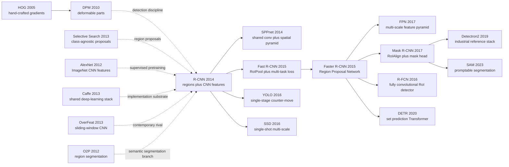

# R-CNN — 把 ImageNet 特征带进目标检测的转折点

> **2013 年 11 月 11 日，UC Berkeley 的 Ross Girshick、Jeff Donahue、Trevor Darrell、Jitendra Malik 四位作者把 [arXiv:1311.2524](https://arxiv.org/abs/1311.2524) 挂上来，随后在 CVPR 2014 发表。** 这篇论文没有发明新的 CNN，也没有让检测端到端；它做的是一个更朴素、也更致命的动作：把 selective search 找出的约 2000 个候选框逐个塞进 ImageNet 预训练的 AlexNet，再用线性 SVM 判类、bbox regression 修框。结果 PASCAL VOC 2012 mAP 直接到 53.3%，VOC 2010 从 UVA 的 35.1% 拉到 53.7%。R-CNN 的戏剧性在于：它慢到 13 秒一张图，却快到让整个检测社区在一年内放弃 HOG/DPM 的旧大陆。

## 一句话总结

Girshick、Donahue、Darrell、Malik 2014 年发表在 CVPR 的 R-CNN，把目标检测从「HOG/DPM 手工部件 + 上下文重打分」切换成「region proposal + ImageNet CNN feature + linear SVM + bbox regression」：对每张图先用 selective search 生成约 $R \approx 2000$ 个候选框，把每个候选框 warp 到 $227 \times 227$，经 AlexNet 得到 $\phi(r) \in \mathbb{R}^{4096}$，再用 $s_c(r)=w_c^\top\phi(r)+b_c$ 做类别打分。这套看似笨重的分阶段系统在 VOC 2010 上把 UVA 的 35.1 mAP 推到 53.7，在 VOC 2012 达到 53.3 mAP，在 ILSVRC2013 detection 上以 31.4 明确压过 OverFeat 的 24.3。它真正替代的 baseline 不是某一个模型，而是 DPM/Regionlets/O2P 所代表的整套「低层特征拼装」检测范式；后续 Fast R-CNN（2015） 砍掉重复 CNN 前向，[Faster R-CNN（2015）](2015_faster_rcnn.md) 砍掉 selective search，[Mask R-CNN（2017）](../era3_attention/2017_mask_rcnn.md) 把 RoI 框架扩展到实例掩码。反直觉点在于：R-CNN 的历史价值恰恰不在端到端，而在它证明了「预训练表示 + 小数据微调 + 模块化检测头」足以先打穿检测平台期，工程债可以留给下一代系统偿还。

---

## 历史背景

### 2013 年的目标检测卡在什么地方

R-CNN 的冲击力，必须放回 2013 年的 PASCAL VOC 语境里看。那时图像分类已经被 AlexNet 改写，ImageNet 上的 top-5 错误率从传统视觉特征时代被打到一个新量级；但目标检测还停在另一套世界观里：**先用手工特征描述局部，再用可变形部件或复杂上下文模型把框拼出来**。DPM 仍是强基线，Regionlets、UVA、SegDPM 这类系统在 leaderboard 上堆了大量工程组件，却没有出现 AlexNet 式的断层提升。

检测的困难不只是「给整张图分类」那么简单。模型必须同时回答三个问题：图里有没有物体、物体在哪里、这个框属于哪个类。CNN 当时最擅长的是固定大小图像分类；如果直接把它滑窗扫整张图，计算量爆炸，尺度和长宽比也难处理。OverFeat 选择了滑窗路线，说明社区已经意识到 CNN 可以做 detection，但它仍然被 dense scanning 的代价和定位粗糙度牵住。

R-CNN 的关键不是「CNN 能识别物体」这个常识，而是它把检测问题拆成两个成熟模块：**category-independent proposals 负责找可能有物体的位置，ImageNet CNN feature 负责判断这个位置像不像某个类别**。这让 CNN 不必在整张图上穷举所有位置，也让检测数据不足的问题可以由 ImageNet 预训练缓冲。

### 直接推到 R-CNN 门口的前序工作

| 前序 | 当时解决了什么 | 留下的缺口 | R-CNN 的继承方式 |
|------|----------------|------------|------------------|
| DPM / HOG | 可解释的部件检测、PASCAL 时代强基线 | 表示能力被手工特征封顶 | 保留 per-class classifier 和 NMS 纪律，替换特征 |
| Selective Search | 约 2000 个类别无关候选框，召回高 | 只给框，不给语义 | 作为 CNN 前的 proposal generator |
| AlexNet | ImageNet 监督预训练证明 CNN 表示强 | 只解决整图分类 | 把 fc6/fc7 变成 region feature |
| OverFeat | 证明 CNN 可以滑窗检测 | 仍受 dense scan 和定位误差限制 | 用 proposals 替代滑窗 |
| O2P / CPMC | region-based segmentation 框架成熟 | 依赖 SIFT/LBP 二阶池化 | 用 CNN region features 替换手工池化 |

这些前序把问题推到一个非常清晰的位置：检测社区已经有 proposal，有分类 CNN，有 PASCAL/ILSVRC 评测，也有 Caffe 这样的软件工具；缺的是一个把它们焊在一起、并用数字证明「深度特征迁移到 detection」真的值得的系统。R-CNN 正好站在这个交叉点上。

### 作者团队当时在做什么

四位作者都在 UC Berkeley。Ross Girshick 此前就是 DPM 体系的核心作者之一，熟悉 PASCAL VOC 的评测、错误分析和 detection pipeline 的每个脆弱环节；Jeff Donahue 和 Trevor Darrell 在深度表示、Caffe 生态和迁移学习上有直接经验；Jitendra Malik 的 Berkeley 视觉组长期推动 region proposal、segmentation、recognition using regions 这条路线。

这组作者的组合很重要：R-CNN 不是「深度学习团队强行进入检测」，也不是「传统视觉团队补一个 CNN 特征」。它是两条线的汇合：Berkeley region/segmentation 传统 + ImageNet 监督预训练 + Caffe 工程能力。论文写法也能看出来这种气质：方法并不神秘，实验却极其扎实；它不急着声称端到端，而是把每个模块拆开做 ablation，问 fc6/fc7 哪层更好、fine-tuning 到底涨多少、bbox regression 修了多少定位错误、VOC/ILSVRC/segmentation 是否都站得住。

### 工业界 / 算力 / 数据的状态

2013-2014 年是一个微妙窗口。GPU 已经足够让 AlexNet 级别 CNN 训练和前向可用，但还远没有到可以对每张图数千个候选框做实时推理的程度。R-CNN 论文里每张图约 2000 个 proposal，GPU 上 proposal+CNN feature 约 13 秒，CPU 上约 53 秒；它显然不是工业实时系统，却足够让科研社区相信这条路线能继续被压缩。

数据也正好卡在转折点：PASCAL VOC 的 detection 标注小而精，ILSVRC classification 的标注大但只有图像级标签。R-CNN 的 supervised pre-training + domain-specific fine-tuning 正是为这种数据错配而生：先在大规模分类数据上学通用视觉层级，再在少量 detection boxes 上适配。这个配方后来变成整个计算机视觉的默认训练范式。

## 研究背景与动机

### 检测平台期的真实矛盾

R-CNN 面对的不是一个单点 bug，而是一组互相牵制的矛盾：

- **表示太弱**：HOG、SIFT、LBP、sketch token 可以表达边缘和纹理，却很难表达「狗脸」「自行车轮」这种高层组合。
- **数据太少**：PASCAL VOC 只有几千张训练图，直接从零训练 CNN 容易过拟合。
- **位置太多**：检测要在位置、尺度、长宽比上搜索，直接滑窗会让 CNN 前向次数失控。
- **评估太严格**：PASCAL AP 以 IoU 0.5 为门槛，分类对了但框偏一点也会被判错。
- **系统太复杂**：SegDPM、Regionlets 这类系统靠多特征、多上下文、多阶段 rescoring 累积增益，可复现性和扩展性都差。

核心矛盾可以压缩成一句话：**分类 CNN 的表示能力已经成熟，但 detection 缺少一种把它低成本搬到「很多候选框」上的办法**。

### R-CNN 的攻击角度

R-CNN 的解法是故意模块化的：先用 selective search 大幅缩小位置搜索空间，再把每个 proposal 当作一个小分类问题；先用 ImageNet 预训练避免小数据从零训练，再用 detection fine-tuning 适配 warped proposal 的域偏移；先用线性 SVM 保持分类器简单，再用 bbox regression 专门修定位误差。

这套设计的目标不是优雅，而是把「深度表示是否能解决检测」这个问题从工程噪声里剥出来。它的隐藏哲学是：**先把最强表示接到现有 pipeline 上，等数字证明方向对了，再让下一代论文逐步把慢模块替掉**。Fast R-CNN、Faster R-CNN、Mask R-CNN 后来几乎就是按这个清单逐项还债。

---

## 方法详解

### 整体框架

R-CNN 的 pipeline 今天看起来很重，但在 2014 年它的每一步都很有针对性：用 selective search 先把无限多的位置缩成约 2000 个 proposal；把 proposal warp 成 CNN 可吃的 $227 \times 227$；用 ImageNet 预训练 CNN 抽取 fc 特征；每个类别训练一个线性 SVM；最后用 class-specific bounding-box regression 修定位。

| 模块 | 输入 | 输出 | 主要作用 |
|------|------|------|----------|
| Selective Search | 原图 | 约 2000 个候选框 | 把位置搜索从 dense sliding window 降到 proposal set |
| Warp / Crop | 候选框区域 | $227 \times 227$ 图像块 | 让任意长宽比 proposal 适配 AlexNet 输入 |
| CNN feature | 图像块 | $4096$ 维 fc6/fc7 表示 | 用 ImageNet 层级特征替代 HOG/SIFT/LBP |
| Linear SVM | region feature | 每类得分 | 在小 detection 数据上训练稳定、可 hard-negative mine |
| BBox regression + NMS | 高分框 | 修正后的最终框 | 专门修定位误差并去重 |

反直觉点有两个。第一，R-CNN 并没有端到端训练 detection pipeline：proposal、CNN、SVM、bbox regressor 都分开训练。第二，它仍然比 DPM 时代的系统「更简单」：复杂性不再来自手工特征拼装，而来自一个可复用的深度表示。换句话说，R-CNN 把 detection 的难点从「设计特征」迁移成「如何高效共享特征」。

### 关键设计

#### 设计 1：Region proposal as search-space compression —— 让 CNN 不再滑窗扫全图

**功能**：用类别无关 proposal 把检测的空间搜索压缩成一个有限集合 $\mathcal{R}(I)$，再对每个 region 做 CNN 分类。

$$
\mathcal{R}(I)=\{r_1,\ldots,r_R\},\quad R\approx 2000,\quad x_i=\operatorname{warp}(I[r_i],227,227),\quad \phi_i=f_{\text{CNN}}(x_i)
$$

这个公式看起来只是工程流水线，但它解决了当时 CNN detection 的最大瓶颈：如果用 sliding window，不同尺度、不同长宽比、不同位置都要前向；如果先用 selective search，CNN 只需要处理约 2000 个「可能是物体」的框。proposal 的召回由 classical vision 承担，语义判断由 CNN 承担。

```python
def extract_rcnn_regions(image, proposal_fn, cnn):
    regions = proposal_fn(image)[:2000]
    features = []
    for box in regions:
        crop = warp_to_fixed_size(image, box, size=(227, 227))
        feat = cnn.forward(crop, layer="fc7")
        features.append((box, feat))
    return features
```

| 搜索策略 | 前向次数 | 长宽比处理 | 2014 年可行性 | R-CNN 的取舍 |
|----------|----------|------------|----------------|--------------|
| Dense sliding window | 极高 | 多尺度/多比例枚举 | 慢，OverFeat 仍受限 | 放弃 |
| DPM root + parts | 中等 | 部件模板隐式处理 | 表示弱但成熟 | 被替代 |
| Selective Search proposals | 约 2000 | proposal 自带任意框 | 慢但可跑 | 采用 |
| 后来的 RPN | 共享 conv 特征上生成 | 学习式 anchor | 2015 后成熟 | Faster R-CNN 偿还 |

**设计动机**：R-CNN 不是想让 proposal 永远存在，而是先用 proposal 作为脚手架，证明 CNN feature 在 detection 上有决定性价值。后续 Faster R-CNN 把 proposal 也学进网络，正说明这个脚手架只是第一代系统的必要妥协。

#### 设计 2：Supervised pre-training + domain-specific fine-tuning —— 小 detection 数据的解法

**功能**：先在 ILSVRC2012 分类数据上训练 CNN，再把 1000-way 分类层替换成 $(N+1)$-way detection 层，用 warped proposals 在 VOC/ILSVRC detection 上微调。

$$
\theta_0=\arg\min_\theta \mathcal{L}_{\text{cls}}(\theta;\mathcal{D}_{\text{ImageNet}}),\qquad
\theta^*=\arg\min_\theta \mathcal{L}_{\text{det}}(\theta;\{(\operatorname{warp}(r),y_r)\})
$$

微调样本定义很关键：proposal 与 ground-truth box 的 IoU $\ge 0.5$ 作为正样本，其余作为背景；每个 mini-batch 采 32 个 positive window + 96 个 background window，总 batch size 128。学习率从 0.001 开始，是预训练初始学习率的十分之一，避免把 ImageNet 初始化「洗掉」。

```python
def fine_tune_detector(cnn, proposals, gt_boxes, num_classes):
    cnn.replace_classifier(out_dim=num_classes + 1)  # foreground classes + background
    for step in range(num_steps):
        positives = sample_iou_at_least(proposals, gt_boxes, threshold=0.5, n=32)
        negatives = sample_background(proposals, gt_boxes, n=96)
        batch = positives + negatives
        loss = cross_entropy(cnn(warp(batch.boxes)), batch.labels)
        loss.backward()
        sgd_step(cnn, lr=1e-3)
```

| 训练方案 | VOC 2007 mAP | 说明 |
|----------|--------------|------|
| ImageNet CNN fc7，不微调 | 44.7 | 已明显高于许多手工特征 baseline |
| ImageNet CNN fc6，不微调 | 46.2 | fc6 比 fc7 更泛化 |
| Fine-tuned fc7 | 54.2 | 微调带来 +8.0 points |
| Fine-tuned + bbox regression | 58.5 | 定位修正再带来 +4.3 points |

**设计动机**：这是 R-CNN 对视觉迁移学习的核心贡献。它证明了 ImageNet 的 image-level label 不只是分类任务的资产，也能变成 detection 的 region-level 表示。后来的 detection、segmentation、pose estimation 几乎都沿用了「大数据预训练 + 小任务微调」这套范式。

#### 设计 3：Linear SVM + hard negative mining —— 保守但有效的检测头

**功能**：CNN 微调后不直接用 softmax 输出作为最终 detector，而是固定 CNN feature，为每个类别训练一个 one-vs-rest 线性 SVM，并用 hard negative mining 处理海量 background proposals。

$$
s_c(r)=w_c^\top \phi(r)+b_c,\qquad
\min_{w_c,b_c}\;\frac{1}{2}\lVert w_c\rVert_2^2+C\sum_i\max(0,1-y_i s_c(r_i))
$$

SVM 训练的正负样本定义和 fine-tuning 不一样：正样本只取 ground-truth boxes；IoU 小于 0.3 的 proposals 作为负样本；0.3 到 ground truth 之间的灰区忽略。论文明确说这个阈值很敏感：把负样本阈值设成 0.5 会掉 5 个 mAP 点，设成 0 会掉 4 个点。

```python
def train_class_svm(features, gt_boxes, class_id):
    positives = [feat for box, feat in features if is_ground_truth(box, class_id)]
    negatives = [feat for box, feat in features if max_iou(box, gt_boxes[class_id]) < 0.3]
    svm = LinearSVM()
    for hard_batch in mine_hard_negatives(svm, negatives):
        svm.fit(positives, hard_batch)
    return svm
```

| 选择 | 好处 | 代价 | 后续命运 |
|------|------|------|----------|
| CNN softmax 直接输出 | 端到端更干净 | 当时 mAP 不如 SVM 稳 | Fast R-CNN 后回归主线 |
| Linear SVM | 小数据稳定、hard negative 成熟 | 训练/存储分阶段 | 被 multi-task softmax 替代 |
| 0.3 negative threshold | 避免把半重叠框当负例 | 需要手调 | 被 RoI sampling 策略吸收 |
| Per-class classifier | 易扩展到多类别 | 类别间不共享检测头 | 后来改成共享 head |

**设计动机**：R-CNN 是一篇过渡时期论文，因此它没有强行把所有旧工具清空。SVM 和 hard negative mining 是 DPM 时代留下的可靠机制；在 CNN 表示刚进入 detection 时，保守的分类头反而让结果更可信。

#### 设计 4：Bounding-box regression and staged debt —— 先赢，再还工程债

**功能**：对每个高分 proposal 学一个 class-specific regressor，把原始 proposal $P=(P_x,P_y,P_w,P_h)$ 修成更贴近 ground truth 的框 $G=(G_x,G_y,G_w,G_h)$。

$$
t_x=(G_x-P_x)/P_w,\quad t_y=(G_y-P_y)/P_h,\quad t_w=\log(G_w/P_w),\quad t_h=\log(G_h/P_h)
$$

R-CNN 的 bbox regression 本质上承认：selective search 的框召回高，但定位不够准。CNN/SVM 可以告诉你「这个 proposal 像狗」，却不一定让框刚好贴住狗的边界。回归器专门学习这个几何修正，VOC 2007 上从 54.2/58.5 这一级继续涨。

```python
def apply_bbox_regression(box, deltas):
    px, py, pw, ph = center_width_height(box)
    tx, ty, tw, th = deltas
    gx = tx * pw + px
    gy = ty * ph + py
    gw = math.exp(tw) * pw
    gh = math.exp(th) * ph
    return corners_from_center(gx, gy, gw, gh)
```

| 工程债 | R-CNN 原始做法 | 造成的问题 | 后续偿还者 |
|--------|----------------|------------|------------|
| 重复 CNN 前向 | 每个 proposal 独立跑 CNN | 13s/image，存特征占空间 | SPPnet / Fast R-CNN |
| 外部 proposal | selective search | 不是学习式，慢 | Faster R-CNN RPN |
| 外部 SVM | CNN feature 后单独训练 | pipeline 分裂 | Fast R-CNN multi-task loss |
| 固定 warp | 任意框强行拉伸到 227 | 几何形变 | RoIPool / RoIAlign |
| 手工 NMS | per-class greedy NMS | 端到端断点 | DETR set prediction |

**设计动机**：R-CNN 的方法部分最值得学习的是工程优先级。它没有试图一次解决所有问题，而是先锁定最能改变结果的变量：feature representation。只要 mAP 断层领先，慢、分阶段、不端到端这些问题就会自然吸引后续论文来修。R-CNN 因此不是终极系统，而是一个把研究方向「拨正」的强原型。

---

## 失败案例

### 当时输给 R-CNN 的对手

R-CNN 不是只赢了一个 baseline，而是把 2010-2013 年检测系统的几条主线同时压下去：HOG/DPM 的部件模型、Bag-of-Visual-Words 的 region classifier、Regionlets 的手工区域表达、SegDPM 的上下文融合、OverFeat 的滑窗 CNN。它们各自代表一种合理路线，但共同问题是：**没有把 ImageNet 监督预训练形成的高层表示有效搬进 detection**。

| Baseline | 代表路线 | 关键数字 | 为什么输 |
|----------|----------|----------|----------|
| DPM v5 | HOG + deformable parts | VOC 2010 mAP 33.4 | 表示能力被 HOG 上限卡住 |
| UVA Selective Search | proposals + spatial pyramid BOW | VOC 2010 mAP 35.1 | proposal 好，但 360k 维手工特征不够强 |
| Regionlets | 手工 region feature 组合 | VOC 2010 mAP 39.7 | 局部特征丰富但语义层级弱 |
| SegDPM | DPM + segmentation/context rescoring | VOC 2010 mAP 40.4 | 系统复杂，收益来自补丁式融合 |
| OverFeat | sliding-window CNN detector | ILSVRC2013 mAP 24.3 | CNN 用上了，但搜索和定位方式不如 proposal+SVM |

最值得注意的是 UVA：它和 R-CNN 一样使用 selective search，说明差距主要不是 proposal，而是 feature。UVA 的 spatial-pyramid BOW feature 高达 360k 维，R-CNN 的 fc feature 只有 4096 维，却更准、更容易扩展类别。这就是「表示学习」真正接管 detection 的证据。

### 论文自己暴露的失败实验

R-CNN 的胜利不是干净胜利。论文自己给出了几个明显问题，后续 R-CNN 家族几乎都围绕这些问题演化。

| 问题 | 论文中的症状 | 后果 | 后续修复 |
|------|--------------|------|----------|
| 速度慢 | proposal+CNN feature 约 13s/image GPU | 无法实时 | SPPnet / Fast R-CNN 共享 conv |
| 分阶段训练 | CNN fine-tune、SVM、bbox regressor 分开 | 复现繁琐，误差不可联合优化 | Fast R-CNN multi-task loss |
| selective search 外置 | 每张图先跑约 2000 proposals | 慢且非学习式 | Faster R-CNN RPN |
| warp 形变 | proposal 强行拉伸到 227×227 | 长宽比和几何边界失真 | RoIPool / RoIAlign |

还有一个更微妙的失败：R-CNN 在语义分割上达到 47.9 mean accuracy，但它并没有真正做 dense prediction；它只是把 CPMC regions 当成候选区域，再用 CNN feature 帮 O2P 风格框架分类。这个结果很重要，却也说明 R-CNN 的 region representation 还没有走到 FCN/Mask R-CNN 那种端到端密集输出阶段。

### 真正的反 baseline 教训

R-CNN 的「反 baseline」不是 OverFeat，而是 DPM。Ross Girshick 本人来自 DPM 系统，这让 R-CNN 的出现有点像一次内部改朝换代：旧系统最懂检测的评测和错误类型，新系统直接承认旧表示不够了。

这件事的教训是：**范式替换往往不是因为旧系统每个模块都错，而是因为其中一个核心瓶颈突然有了压倒性替代品**。DPM 的 NMS、hard negative mining、per-class scoring、error analysis 很多都被 R-CNN 继承；被替换的是 HOG/part feature 这颗心脏。R-CNN 因此不是对传统视觉的否定，而是传统检测纪律和深度表示的一次成功嫁接。

## 实验关键数据

### VOC / ILSVRC 主结果

| Benchmark | Method | mAP / mean accuracy | 对比对象 | 结论 |
|-----------|--------|---------------------|----------|------|
| VOC 2010 test | R-CNN + BB | 53.7 | UVA 35.1 / SegDPM 40.4 | PASCAL 检测平台期被打穿 |
| VOC 2011/12 test | R-CNN | 53.3 | previous best ≈ 40.x | 相对提升 30%+ |
| VOC 2007 test | R-CNN FT fc7 | 54.2 | DPM v5 33.7 | 深度特征相对 HOG +61% |
| VOC 2007 test | R-CNN FT fc7 + BB | 58.5 | 无 BB 的 54.2 | bbox regression 贡献清晰 |
| ILSVRC2013 detection | R-CNN | 31.4 | OverFeat 24.3 | 200 类检测上也成立 |

这些数字最有力的地方在于跨数据集一致：VOC 不是偶然，ILSVRC 也不是偶然；检测和语义分割都能受益于 region-level CNN feature。R-CNN 的实验不是单点 SOTA，而是一种表示迁移范式的压力测试。

### Ablation：预训练、微调、bbox regression

| 配置 | VOC 2007 mAP | 变化 | 解释 |
|------|--------------|------|------|
| R-CNN fc7，不微调 | 44.7 | baseline | ImageNet feature 已经足够强 |
| R-CNN fc6，不微调 | 46.2 | +1.5 | fc6 比 fc7 更适合迁移 |
| R-CNN FT fc7 | 54.2 | +8.0 vs no FT | detection fine-tuning 是核心增益 |
| R-CNN FT fc7 + BB | 58.5 | +4.3 | 定位误差可被单独修正 |
| R-CNN VGG/O-Net + BB | 66.0 | +7.5 vs T-Net BB | 更深 backbone 继续放大范式收益 |

这张 ablation 解释了为什么 R-CNN 能成为后续检测论文的起点：每个模块都有明确可替换空间。backbone 更强会涨，fine-tuning 会涨，bbox regression 会涨，速度瓶颈也明显。一个好范式最理想的状态不是没有缺点，而是每个缺点都指向可发表的下一步。

### 运行时与可扩展性

| 项目 | 数字 | 含义 |
|------|------|------|
| Proposal 数 | 约 2000 / image | selective search fast mode |
| Feature 维度 | 4096 | 比 UVA 的 360k 维小两个数量级 |
| GPU runtime | 约 13s / image | 研究可用，工业不可用 |
| CPU runtime | 约 53s / image | 显示重复 CNN 前向的代价 |

论文对可扩展性的论证很有意思：虽然每张图很慢，但 per-class scoring 只是一个 $2000 \times 4096$ feature matrix 乘 $4096 \times N$ SVM weight matrix。类别数增加时，主要代价不是 CNN，而是矩阵乘法；这让 R-CNN 在「很多类别」上比高维手工特征系统更有前途。

### 语义分割副线

| 方法 | Feature / 设置 | VOC 2011 val mean | VOC 2011 test mean |
|------|----------------|-------------------|--------------------|
| O2P | second-order SIFT/LBP pooling | 46.4 | 47.6 |
| R-CNN full fc6 | warped region box | 43.0 | — |
| R-CNN fg fc6 | foreground-masked region | 43.7 | — |
| R-CNN full+fg fc6 | context + masked foreground | 47.9 | 47.9 |

语义分割结果常被忽略，但它说明 R-CNN 的贡献不只是 object detection mAP。只要任务可以被表达成 region classification，CNN region feature 就能替换手工池化。这条线后来会连接到 FCN、DeepLab、Mask R-CNN 和 SAM，只是 R-CNN 自己还停在 region classifier 阶段。

### 关键发现

- **Fine-tuning 比想象中重要**：ImageNet feature 本身已强，但 detection domain adaptation 带来最大单项增益。
- **fc6 比 fc7 更泛化**：论文观察到 fc7 更贴近 ImageNet 分类头，迁移到 PASCAL detection 反而不如 fc6。
- **bbox regression 是定位任务的独立瓶颈**：分类得分高不等于框准，几何修正必须单独建模。
- **更深 backbone 立刻有效**：VGG/O-Net 把 mAP 推到 66.0，证明 R-CNN 是一个 backbone scaling 平台。
- **速度失败反而指明方向**：13s/image 不是终点，而是 Fast/Faster R-CNN 的论文动机。

---

## 思想史脉络



### 前世：谁把 R-CNN 推出来

R-CNN 的前世不是单线因果，而是几条路线在 2013 年同时成熟：DPM 提供了 detection 的训练和评测纪律，Selective Search 提供了类别无关候选框，AlexNet 提供了高层视觉表示，Caffe 提供了可复现的深度学习软件栈，O2P/CPMC 提供了 region-based segmentation 的旁支。R-CNN 的贡献，是把这些本来分散在不同社区的模块组合成一个可以在 PASCAL leaderboard 上赢的系统。

最重要的继承来自 DPM。R-CNN 没有抛弃 detection 的基本程序：per-class scoring、hard negative mining、NMS、bbox localization、error analysis 都还在。它只是把「怎么描述一个候选框」这个环节从 HOG/SIFT/LBP 换成 CNN feature。正因为它保留了旧系统的评测纪律，社区才很难把结果归因成「评测巧合」。

Selective Search 则提供了另一个关键支点：类别无关 proposals 让 CNN 可以在 region level 上工作，而不是陷入 dense sliding window。这个决定直接塑造了后面十年的「two-stage detector」语言：proposal、RoI、classification head、bbox head、NMS。

### 后代：R-CNN 家族怎样逐步还债

R-CNN 的后代几乎是一串工程债偿还清单。SPPnet 和 Fast R-CNN 解决重复 CNN 前向，把整张图先算成 shared conv feature，再对每个 RoI 做 pooling；Fast R-CNN 进一步把 SVM 和 bbox regression 合进 multi-task loss。Faster R-CNN 解决 selective search 外置问题，用 RPN 在 shared feature map 上学 proposals。FPN 解决小物体和多尺度问题。Mask R-CNN 解决从 box 到 mask 的 dense per-RoI prediction，并用 RoIAlign 修掉 RoIPool 量化误差。

这条线的影响不只在论文。Detectron/Detectron2 把 R-CNN 家族变成工业级工具箱，自动驾驶、医学影像、遥感、零售检测、农业视觉都可以直接从这个框架改。很多模型即使名字里没有 R-CNN，也继承了它的接口：shared backbone + proposal/query + per-instance head + post-processing。

同时，R-CNN 也激发了反方向路线。YOLO 和 SSD 明确反对「先 proposal 再分类」的慢 pipeline，主张单次前向直接预测 boxes；DETR 则在 2020 年用 set prediction + Transformer 把 proposal/NMS 的手工结构进一步拿掉。也就是说，R-CNN 既是 two-stage detector 的祖先，也是 single-stage 和 end-to-end detector 想要超越的靶子。

### 误读：R-CNN 常被简化成什么

第一个误读是「R-CNN 就是把 CNN 用到 detection」。太粗。真正的关键是 **where to apply CNN**：不是整图分类，也不是 dense sliding window，而是对高召回 proposals 做 region classification。这一点决定了计算结构和后续 RoI 系列的全部语言。

第二个误读是「R-CNN 的成功来自端到端深度学习」。恰好相反，R-CNN 是高度分阶段的。它的历史意义是证明表示迁移先于端到端整洁性；端到端只是后续论文把有效范式工程化之后的结果。

第三个误读是「R-CNN 已经被 DETR/SAM 淘汰，所以只是旧系统」。具体 pipeline 当然旧了，但两条思想还活着：一是预训练表示迁移到定位任务，二是对实例级对象单独建模。DETR 用 query 取代 proposal，SAM 用 prompt 取代 class-specific detector，但它们仍然在解决 R-CNN 定义过的问题：如何把视觉表示绑定到一个具体对象区域上。

---

## 当代视角

### 站不住的假设

1. **「Proposal + per-region CNN 可以直接 scale」**：已证伪。R-CNN 的精度路线对，但计算方式不可持续。每张图 2000 次 CNN 前向在 2014 年能发论文，却不可能成为工业检测系统。Fast R-CNN、Faster R-CNN 的存在本身就说明 R-CNN 原始 pipeline 只是第一代验证器。
2. **「Selective search 是足够好的 objectness 模块」**：已证伪。它召回不错，但慢、不可学习、无法利用任务反馈。RPN、anchor-free detector、DETR query 都证明 proposal 生成必须和特征学习更紧密耦合。
3. **「线性 SVM 是 detection head 的合理终点」**：已证伪。SVM 在小数据阶段保守有效，但 multi-task softmax/box head 很快用端到端训练取代它。今天再把 CNN feature 存盘、单独 hard-negative mine，基本只会作为历史复现实验。
4. **「框检测是视觉定位的核心形态」**：部分证伪。2014 年 box AP 是主战场；2026 年更重要的接口已经扩展到 mask、keypoint、panoptic、open-vocabulary grounding、promptable segmentation。R-CNN 的 box 思想还在，但不再是终点。
5. **「ImageNet 预训练足够通用」**：被扩展而非完全证伪。ImageNet 监督预训练曾经是 default；今天 MAE、DINOv2、CLIP、SAM-style mask pretraining 等自监督/多模态/大规模掩码数据进一步证明：预训练仍是核心，但监督分类标签不再是唯一来源。

### 时代验证的关键 vs 被抛弃的部件

| 类型 | 内容 | 2026 年状态 | 说明 |
|------|------|-------------|------|
| 保留下来 | 预训练表示迁移 | 仍是主干 | 从 ImageNet 扩展到 CLIP/DINO/SAM/MAE |
| 保留下来 | per-instance 表示与 head | 仍在 | RoI 变成 query/prompt，但实例级建模还在 |
| 保留下来 | bbox regression 思想 | 仍在 | DETR 也需要 box loss，只是不再叫 regressor |
| 被替换 | selective search | 过时 | RPN、anchor-free、query-based detection 取代 |
| 被替换 | 外部 SVM + hard-negative mining | 过时 | 端到端 multi-task loss 取代 |

R-CNN 最大的遗产不是某个模块，而是一个研究程序：先用预训练视觉表示定义实例候选，再对每个候选做任务特定预测。这个程序今天可以写成 RoI head、Transformer query、prompt decoder 或 mask token；名字变了，问题结构还在。

### 作者没预料到的副作用

1. **R-CNN 让 detection 进入「家族式迭代」时代**：Fast R-CNN、Faster R-CNN、Mask R-CNN、Cascade R-CNN、Sparse R-CNN、Detectron2，几乎每一代都在修上一代明确暴露的一个工程瓶颈。
2. **它把 Caffe/开源代码变成 detection 影响力的一部分**：R-CNN 不是只有论文，代码也让大量实验室能复现和改造。后续 Detectron2 继承了这种「论文 + 工具箱」的影响模式。
3. **它间接塑造了 COCO 时代的评测语言**：proposal recall、RoI feature、bbox AP、mask AP、small/medium/large breakdown，这些分析维度都和 R-CNN 家族密切相关。
4. **它也催生了反 R-CNN 叙事**：YOLO 的标题「You Only Look Once」之所以有冲击力，正是因为 R-CNN 代表了「look 2000 times」的慢而准路线。

### 如果今天重写 R-CNN

如果 2026 年重写这篇论文，可能不会再手写 selective search + SVM pipeline，而会这样改：用 DINOv2/CLIP/MAE 级别的 backbone 做预训练表示；用 lightweight learned proposal 或 query decoder 产生 candidate instances；用共享 feature map 和 RoIAlign/deformable attention 抽取实例特征；用 unified head 同时输出 box、mask、open-vocabulary class；用 COCO/LVIS/Objects365/SA-1B 级别数据做系统评测。

但核心问题不会变：**怎样把一个通用视觉表示绑定到「图中这个具体对象」上？** R-CNN 的答案是 proposal + warp + fc feature；DETR 的答案是 object query；SAM 的答案是 prompt + mask decoder。三者的接口不同，历史问题相同。

## 局限与展望

### 作者承认的局限

| 局限 | 论文中的表现 | 影响 |
|------|--------------|------|
| 速度慢 | 13s/image GPU，53s/image CPU | 无法实时部署 |
| 训练分阶段 | CNN、SVM、bbox regressor 分开 | 难联合优化 |
| 数据依赖 | 需要 ImageNet 预训练 | 无大规模预训练时难复制 |
| proposal 依赖 | selective search 外部模块 | pipeline 不可端到端 |
| segmentation 粗糙 | region classification 而非 dense prediction | 只能算过渡方案 |

### 2026 视角的局限

- **没有统一 loss**：分类、SVM、bbox regression 分开优化，无法让特征为最终 AP 直接服务。
- **没有 feature sharing**：每个 proposal 独立 CNN 前向，是最明显的计算浪费。
- **没有小物体专门处理**：proposal 和 warped CNN 对小物体都不友好，后续 FPN 才系统处理。
- **没有开放词表能力**：类别固定在 VOC/ILSVRC，无法处理 text-conditioned detection。
- **没有数据规模视角**：它证明了 ImageNet 迁移，但还没触及自监督、多模态、mask pretraining。

### 已被后续验证的改进方向

| 改进方向 | 代表工作 | 修复了什么 |
|----------|----------|------------|
| 共享 conv feature | SPPnet / Fast R-CNN | 重复 CNN 前向 |
| 学习式 proposal | Faster R-CNN | selective search 外置 |
| 多尺度特征 | FPN | 小物体和尺度变化 |
| per-RoI dense prediction | Mask R-CNN | 从 box 扩展到 mask/keypoint |
| query/set prediction | DETR / Deformable DETR | proposal/NMS 手工结构 |

展望上，R-CNN 留下的最好问题仍然有效：检测系统需要同时保持实例级精度、计算效率、类别扩展性和开放世界泛化。2026 年的 frontier 不再是「能不能用 CNN 做 detection」，而是「如何用 foundation model 表示做开放词表、可交互、低标注成本的 detection/segmentation」。

## 相关工作与启发

- **vs AlexNet**：AlexNet 证明 CNN 表示能做分类，R-CNN 证明同一类表示可以迁移到定位任务。启发是：一个强表征的真正价值，往往要到跨任务迁移时才完全显现。
- **vs OverFeat**：OverFeat 是 CNN sliding window，R-CNN 是 proposal-based region classification。启发是：同样使用 CNN，搜索空间设计会决定系统成败。
- **vs DPM**：DPM 的 detection 纪律被保留，HOG 表示被替换。启发是：替换旧范式时，保留它擅长的评测与训练机制会降低迁移阻力。
- **vs Fast/Faster R-CNN**：后两者不是推翻 R-CNN，而是清理它的工程债。启发是：一篇经典论文可以通过「暴露可修缺陷」产生同样大的后续价值。
- **vs YOLO/SSD**：单阶段 detector 直接挑战 R-CNN 的慢 pipeline。启发是：慢而准的系统常常会催生快而简洁的反方向范式。
- **vs DETR**：DETR 删除 proposal 和 NMS，用 set prediction 学对象集合。启发是：当一个范式成熟到工程细节过多时，新的数学接口会重新简化问题。
- **vs SAM**：SAM 把固定类别 detection/segmentation 改成 promptable mask prediction。启发是：实例级视觉最终可能不是「检测 80 类」，而是「根据任意交互信号指出这个对象」。

## 相关资源

- Paper: [arXiv 1311.2524](https://arxiv.org/abs/1311.2524)
- CVF page: [CVPR 2014 open access](https://openaccess.thecvf.com/content_cvpr_2014/html/Girshick_Rich_Feature_Hierarchies_2014_CVPR_paper.html)
- Code: [rbgirshick/rcnn](https://github.com/rbgirshick/rcnn)
- Follow-up: [Fast R-CNN](https://arxiv.org/abs/1504.08083)
- Follow-up: [Faster R-CNN](https://arxiv.org/abs/1506.01497)
- Follow-up: [Mask R-CNN](https://arxiv.org/abs/1703.06870)
- Follow-up: [DETR](https://arxiv.org/abs/2005.12872)
- Follow-up: [Segment Anything](https://arxiv.org/abs/2304.02643)
- Implementation lineage: [Detectron2](https://github.com/facebookresearch/detectron2)
- Original project page mirror: [UC Berkeley R-CNN](https://www2.eecs.berkeley.edu/Research/Projects/CS/vision/rcnn/)


---

> 🌐 [English version](/en/era2_deep_renaissance/2014_rcnn/) · 📚 awesome-papers project · CC-BY-NC