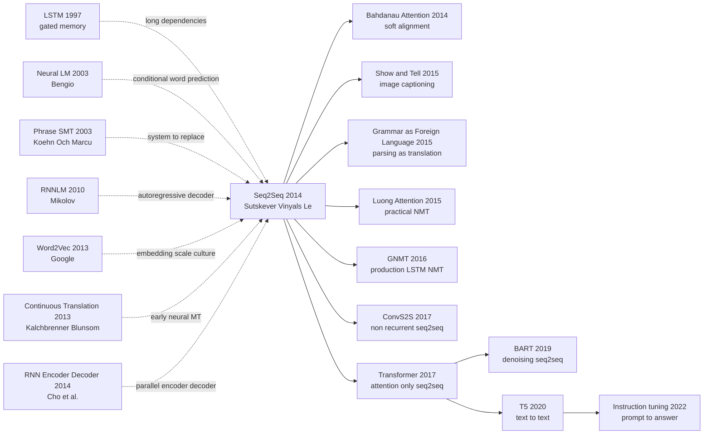

# Seq2Seq - 把任意长度序列压成向量，再把向量翻译回序列

> **2014 年 9 月 10 日，Google 的 Ilya Sutskever、Oriol Vinyals、Quoc V. Le 三位作者把 [arXiv:1409.3215](https://arxiv.org/abs/1409.3215) 挂到网上，同年在 NeurIPS 2014 发表。** 这篇 9 页论文的赌法很狠：机器翻译不再需要短语表、对齐表、重排序规则和几十个手工特征，只要一个 LSTM 把整句英语压进向量，另一个 LSTM 从这个向量逐词吐出法语。它在 WMT'14 英法翻译上拿到 34.8 BLEU，超过短语 SMT 的 33.3；再去重排 SMT 的 1000-best 候选时到 36.5。最反直觉的小技巧不是更深的网络，而是把源句倒过来读，让远距离翻译突然变成近距离优化。

## 一句话总结

Sutskever、Vinyals、Le 三位作者 2014 年发表在 NeurIPS 的这篇论文，把机器翻译从「短语表 + 对齐模型 + 手工重排序」改写成一个端到端条件语言模型：先用多层 LSTM 把源句 $x_{1:T}$ 压成固定向量 $v$，再用另一个 LSTM 按 $p(y\mid x)=\prod_t p(y_t\mid v,y_{<t})$ 逐词生成目标句。它直接在 WMT'14 英法翻译上拿到 34.8 BLEU，超过短语 SMT 的 33.3；把 LSTM 当作 1000-best reranker 时到 36.5，接近当时最佳系统。它替代的失败 baseline 不是某个小模型，而是整个 phrase-based SMT 工程栈；后续 Bahdanau Attention（2014） 修补固定向量瓶颈，Transformer（2017） 删掉 RNN 但保留 encoder-decoder + autoregressive decoding。隐藏 lesson 是：真正把 NMT 推过门槛的，不只是 LSTM，而是「把任意结构任务重新表述为序列到序列」这个接口。

---

## 历史背景

### 2014 年 NLP 卡在哪里

2014 年的 NLP 还不是「一个大模型吃所有文本任务」的世界。机器翻译、语音识别、句法分析、摘要、问答各有一套特征工程和解码器；同一篇论文里经常同时出现 n-gram 语言模型、短语表、词对齐、最大熵重排序、词形规则、OOV 处理和一大串 beam-search 超参。深度学习已经在视觉里靠 [AlexNet](2012_alexnet.md) 打开局面，在词表示里靠 Word2Vec 证明「向量空间可以承载语义」，但对变长输入、变长输出的结构化预测还没有统一接口。

机器翻译尤其像一台运行了十几年的大型工厂。phrase-based SMT 的核心是把句子切成短语片段，查表找目标短语，再用语言模型和重排序模型把候选拼回去。它很强，WMT 竞赛上长期压着神经模型；它也很重，系统质量来自几十个局部部件的调参。研究者已经习惯了这种复杂度，以至于「完全端到端地从源句生成目标句」在 2014 年听起来像故意丢掉所有专家知识。

Seq2Seq 的反直觉之处就在这里。它没有先做一个小模块替换，也没有给 phrase-based SMT 加一个 neural feature，而是把整个系统重写成一个条件语言模型：读完源句，保留一个向量，再逐词生成目标句。这个想法看上去粗暴，因为它把所有对齐、重排序、词义消歧都塞进隐藏状态；但也正因为粗暴，它第一次让「任务接口」比「任务特征」更重要。

### 直接逼出 Seq2Seq 的前序

- **1997 LSTM**：Hochreiter 和 Schmidhuber 给 RNN 加上 cell state 和 gate，缓解 vanishing gradient。没有 LSTM，2014 年的神经翻译很难把一个 20-40 词的句子读完后还保留可用信息。Seq2Seq 是 LSTM 从「会记长依赖」到「能承载完整结构任务」的关键转场。
- **2003 Neural Probabilistic Language Model**：Bengio 等 4 位作者把词表示和 next-word prediction 绑在一起，建立了「用神经网络建条件词分布」的基本范式。Seq2Seq 的 decoder 本质上就是一个被源句向量条件化的神经语言模型。
- **2010 Mikolov RNNLM**：RNN 语言模型证明递归状态可以在大词表上做强预测，但它只处理单语序列。Seq2Seq 把 RNNLM 从 $p(y_t\mid y_{<t})$ 推到 $p(y_t\mid x, y_{<t})$。
- **2013 Word2Vec / Google 大规模训练文化**：Google 已经证明简单目标 + 大数据 + 工程吞吐可以改变 NLP 基础设施。Sutskever 同时是 Word2Vec NeurIPS 2013 论文作者之一，这个背景解释了为什么 Seq2Seq 更像「把一个简洁目标规模化」而不是「堆复杂规则」。
- **2013 Kalchbrenner & Blunsom / 2014 Cho et al.**：两个方向都在尝试 neural encoder-decoder。Kalchbrenner 和 Blunsom 给出了早期 continuous translation model；Cho 等 7 位作者用 RNN Encoder-Decoder 和 GRU 给 SMT phrase scoring 加 neural 表示。Seq2Seq 的不同在于：它把句子级翻译直接交给深 LSTM，而不是只给旧系统加特征。

### Google 团队当时在做什么

Ilya Sutskever 此时刚从 Toronto / Hinton 系进入 Google Brain，已经参与 AlexNet 和 Word2Vec 两个关键节点；Oriol Vinyals 正在把深度学习推向结构化输出任务，后来会做 image captioning 和 parsing-as-translation；Quoc V. Le 则是 Google 早期 unsupervised / representation learning 的核心人物之一。三位作者的交集很清楚：他们都相信「足够简单的神经目标 + 足够大的训练系统」可以替代手写 pipeline。

这篇论文的 Google 气质也很明显。它没有用漂亮的小数据集证明概念，而是直接上 WMT'14 English-to-French，大约千万级平行句对、十万级词表、数亿参数量级的 LSTM。论文的真正问题不是「神经网络能不能在 toy task 上翻译」，而是「端到端神经系统能不能正面打传统 SMT 的主战场」。34.8 BLEU 的意义正在于此：它不是实验室 demo，而是第一次让旧系统的护城河出现裂缝。

### 算力 / 数据 / 工业状态

2014 年训练 Seq2Seq 仍然很笨重。Transformer 还没出现，所有时间步必须顺序展开；大词表 softmax 昂贵；多层 LSTM 的反向传播需要长时间保存状态；GPU 并行度远不如卷积网络。论文里的模型属于当时的「大模型」：深 LSTM、1000 维级别隐藏状态 / 词向量、数亿参数，并用多 GPU 训练。

数据侧，WMT'14 英法平行语料让端到端 NMT 第一次有足够监督信号。phrase-based SMT 在低资源场景里仍然更稳，因为它能显式利用词典、词形和人工规则；但在高资源英法翻译上，神经模型可以靠数据学习出隐式对齐和重排序。这正是时代窗口：数据量已经够大，GPU 已经能跑，LSTM 已经成熟，而旧系统的复杂度已经高到让研究者愿意押一次「从头学」。

## 研究背景与动机

### 从固定输入到变长输入

AlexNet 解决的是固定尺寸图像到固定标签；Word2Vec 解决的是局部上下文到词向量；RNNLM 解决的是单语序列的下一词预测。Seq2Seq 面对的是更麻烦的一类问题：输入长度不定，输出长度也不定，二者还不必一一对齐。传统神经网络最擅长 $x \mapsto y$，但机器翻译需要的是 $(x_1,\ldots,x_T) \mapsto (y_1,\ldots,y_{T'})$。

论文的动机可以压成一句话：**如果 LSTM 能把历史压进状态，那它能不能把整句话压进状态？** 这就是 fixed-vector bottleneck 的赌注。今天看它明显不完美，长句和细粒度对齐都会吃亏；但在 2014 年，这个瓶颈也是最干净的实验设计。只要它能 work，就说明神经网络不需要显式 phrase table 也能学到翻译函数。

### 机器翻译为什么是试金石

机器翻译是最适合检验 Seq2Seq 的任务，因为它同时要求三件事：词义选择、长距离重排序、流畅目标语言。一个模型只会语言建模，会生成流畅但不忠实的句子；只会词典映射，会忠实但不自然；只会局部短语，会在长句上漏掉结构。WMT'14 的英法任务又足够成熟，phrase-based SMT baseline 很强，BLEU 也能给出可比数字。

这也是为什么 34.8 BLEU 比「看起来能翻译」重要。它说明神经模型不是只在一些短句上惊艳，而是在完整测试集、带 OOV 惩罚、面对传统系统主场时仍然能赢。更关键的是，论文发现 LSTM 对长句并没有预期中那么差；这直接挑战了当时很多人对 RNN 的刻板印象：递归网络会忘，但不一定在工程规模上无药可救。

### 这篇论文真正赌的事

Seq2Seq 赌了三件事。第一，**表示学习可以吞掉结构工程**：对齐、重排序、短语选择不必显式写成模块，可以隐式存在于 LSTM state 和 decoder hidden state 里。第二，**一个通用接口可以横跨任务**：翻译是序列到序列，摘要、caption、语音识别、解析树线性化也可以是序列到序列。第三，**优化技巧可能比理论优雅更关键**：source reversal 没有深奥数学，却把训练路径缩短，让模型真正跑起来。

它最终改变的不只是机器翻译，而是 NLP 研究者对任务表述的想象力。从 2015 年开始，大量论文不再问「这个任务该设计什么特征」，而是问「能不能把输入和输出都线性化成序列」。这条线一直通到 T5 的 text-to-text framing，再到指令微调里的 prompt-to-answer 接口。Seq2Seq 的固定向量后来被 attention 取代，但「把任务统一成条件生成」这件事留下来了。

---

## 方法详解

### 整体框架

Seq2Seq 的整体框架可以一句话说完：**一个 LSTM 读完整个源序列，把最后状态当作句子向量；另一个 LSTM 以这个向量为初始条件，逐步预测目标序列。** 论文没有显式 alignment variable，没有 phrase table，没有 hand-crafted reorderer。它把翻译写成条件语言建模：

$$
p(y_1,\ldots,y_{T'} \mid x_1,\ldots,x_T)
= \prod_{t=1}^{T'} p(y_t \mid v, y_1,\ldots,y_{t-1})
$$

其中 $v$ 是 encoder LSTM 读完源句后的固定维向量。Decoder 每一步读入前一个目标词，输出下一个词的 softmax 分布；训练时用 teacher forcing，测试时用 beam search。这个框架最重要的地方不是 LSTM 本身，而是把结构化预测统一成「读一个序列、写一个序列」。

| 范式 | 输入输出形态 | 结构知识 | 解码方式 | 2014 年优缺点 |
|------|--------------|----------|----------|---------------|
| phrase-based SMT | source phrase -> target phrase | 显式对齐 / 短语表 / 重排序 | log-linear beam search | 强但复杂，模块多 |
| RNN language model | previous target words -> next word | 无源句条件 | sequential sampling | 流畅但不能翻译 |
| **Seq2Seq (本文)** | source sequence -> target sequence | 隐式存在于 hidden state | neural beam search | 简洁、端到端，但固定向量瓶颈重 |
| Attention NMT | source states -> target sequence | 软对齐 | attention beam search | 修复长句，成为后续标准 |

### 关键设计

#### 设计 1：Encoder-decoder factorization —— 把翻译变成条件语言模型

**功能**：把任意长度源句 $x_{1:T}$ 映射为一个固定向量 $v$，再让 decoder 生成任意长度目标句 $y_{1:T'}$。这让模型不必假设输入输出长度相同，也不必预先给出词级对齐。

**核心公式**：

$$
v = \mathrm{LSTM}_{\mathrm{enc}}(x_1,\ldots,x_T),\qquad
p(y_t \mid x, y_{<t}) = \mathrm{softmax}(W_o h_t + b_o)
$$

**训练伪代码**：

```python
def seq2seq_training_loss(encoder, decoder, source_tokens, target_tokens):
    context_vector = encoder.final_state(source_tokens)
    decoder_state = decoder.initial_state(context_vector)
    total_loss = 0.0
    previous_token = BOS_ID
    for gold_token in target_tokens + [EOS_ID]:
        decoder_state, logits = decoder.step(previous_token, decoder_state)
        total_loss += cross_entropy(logits, gold_token)
        previous_token = gold_token
    return total_loss / (len(target_tokens) + 1)
```

| 选择 | 条件变量 | 监督信号 | 对齐是否显式 | 设计后果 |
|------|----------|----------|--------------|----------|
| phrase-based SMT | phrase table + LM features | phrase pairs / alignments | 是 | 可解释但工程重 |
| neural phrase scorer | phrase vector | phrase-level score | 半显式 | 只能增强旧系统 |
| **Seq2Seq encoder-decoder** | fixed vector $v$ | target tokens | 否 | 全链路端到端 |
| attention encoder-decoder | all source states | target tokens + soft alignment | 软显式 | 长句更稳 |

**设计动机**：把翻译拆成 encoder 和 decoder，有两个效果。第一，encoder 只负责「理解源句」，decoder 只负责「写目标句」，中间接口是一个向量；这使得模型结构极其通用。第二，训练目标直接就是最大化目标句条件概率，不再需要对齐表或短语提取这种中间监督。代价也很清楚：所有源句信息都挤进 $v$，固定向量会成为长句瓶颈。

#### 设计 2：Deep LSTM as sequence compressor —— 用门控记忆承载整句信息

**功能**：用多层 LSTM 作为 encoder 和 decoder，而不是 vanilla RNN。论文押注 LSTM 的 cell state 能在几十个词的距离上保留必要信息，使固定向量方案在真实翻译任务上可训练。

**核心公式**：

$$
\begin{aligned}
i_t &= \sigma(W_i e_t + U_i h_{t-1}),\quad
f_t = \sigma(W_f e_t + U_f h_{t-1}) \\
\tilde{c}_t &= \tanh(W_c e_t + U_c h_{t-1}),\quad
c_t = f_t \odot c_{t-1} + i_t \odot \tilde{c}_t \\
h_t &= o_t \odot \tanh(c_t)
\end{aligned}
$$

**训练伪代码**：

```python
def lstm_cell_step(token_embedding, previous_state, parameters):
    previous_hidden, previous_cell = previous_state
    gates = parameters.input_weight @ token_embedding + parameters.hidden_weight @ previous_hidden
    input_gate, forget_gate, output_gate, candidate_cell = split_gates(gates)
    input_gate = sigmoid(input_gate)
    forget_gate = sigmoid(forget_gate)
    output_gate = sigmoid(output_gate)
    candidate_cell = tanh(candidate_cell)
    current_cell = forget_gate * previous_cell + input_gate * candidate_cell
    current_hidden = output_gate * tanh(current_cell)
    return current_hidden, current_cell
```

| 模型 | 长依赖处理 | 并行训练 | 2014 可用性 | 关键问题 |
|------|------------|----------|-------------|----------|
| vanilla RNN | 依赖隐状态反复相乘 | 差 | 可训但忘得快 | 梯度消失 |
| **LSTM** | cell state + gates | 差 | 可训长句 | 慢、状态大 |
| GRU | update/reset gates | 差 | 同期出现 | 表达略少 |
| Transformer | self-attention + residual | 强 | 尚未出现 | 需要大数据和显存 |

**设计动机**：Seq2Seq 本质上是对 LSTM 的压力测试。Vanilla RNN 在短句上也许能跑，但翻译需要把句首主语、动词时态、否定词、从句边界一直带到目标句生成后半段。LSTM 的 gate 给了模型一个工程上可控的「记住 / 覆写」机制。今天看，LSTM 不是最终答案；但在 2014 年，它是唯一足够成熟、足够可训练、能正面挑战 SMT 的递归单元。

#### 设计 3：Source reversal —— 把源句倒读来缩短优化路径

**功能**：训练时把源句词序反过来，目标句保持原顺序。例如英语源句 `I love machine translation` 变成 `translation machine love I` 后输入 encoder。这个技巧不改变翻译函数，却显著降低优化难度。

**核心公式**：

$$
\mathrm{reverse}(x_1,\ldots,x_T)=(x_T,\ldots,x_1),\qquad
\Delta_{\mathrm{path}} \approx |(T-i+1)-j| \text{ instead of } |i-j|
$$

**训练伪代码**：

```python
def prepare_parallel_example(source_tokens, target_tokens, reverse_source=True):
    if reverse_source:
        model_source = list(reversed(source_tokens))
    else:
        model_source = list(source_tokens)
    model_target_input = [BOS_ID] + target_tokens
    model_target_output = target_tokens + [EOS_ID]
    return model_source, model_target_input, model_target_output
```

| 输入策略 | 源词到早期目标词的路径 | 对长句影响 | 是否改变模型 | 历史地位 |
|----------|------------------------|------------|--------------|----------|
| 原顺序 source | 句首源词离句首目标词很远 | 优化困难 | 否 | baseline |
| **倒序 source** | 多数单调对齐变近 | 明显改善 | 否 | 论文最著名 trick |
| 双向 encoder | 两个方向都保留 | 更稳 | 是 | attention 时代常用 |
| attention | decoder 每步查源状态 | 根本修复 | 是 | 后续标准 |

**设计动机**：英法翻译大体是单调的，源句前几个词往往对应目标句前几个词。若 encoder 按原顺序读，decoder 生成第一个目标词时，最相关的源词已经在 LSTM 记忆里走过很多步；倒序后，源句开头的信息更靠近 decoder 起点。这个 trick 的深层意义是：2014 年的端到端学习还没有能力自动解决所有优化几何，**一个不改变任务的输入变换就能决定模型能否到达好解**。

#### 设计 4：Beam search + ensemble/reranking —— 让神经模型接上评测主战场

**功能**：训练得到条件概率模型后，测试时不能只贪心选词，而要用 beam search 找近似最高概率译文；论文还用多个 LSTM ensemble，并把 LSTM 概率用于重排 phrase-based SMT 的 1000-best 候选。

**核心公式**：

$$
\hat{y}=\arg\max_y \left[\sum_{t=1}^{|y|}\log p(y_t\mid v,y_{<t}) + \lambda \cdot \mathrm{score}_{\mathrm{SMT}}(y)\right]
$$

**解码伪代码**：

```python
def beam_search_decode(decoder, context_vector, beam_size, maximum_steps):
    beams = [(0.0, [BOS_ID], decoder.initial_state(context_vector))]
    for _ in range(maximum_steps):
        candidates = []
        for score, prefix_tokens, decoder_state in beams:
            if prefix_tokens[-1] == EOS_ID:
                candidates.append((score, prefix_tokens, decoder_state))
                continue
            next_state, logits = decoder.step(prefix_tokens[-1], decoder_state)
            for token_id, log_probability in top_log_probs(logits, beam_size):
                candidates.append((score + log_probability, prefix_tokens + [token_id], next_state))
        beams = sorted(candidates, key=lambda item: item[0], reverse=True)[:beam_size]
    return beams[0][1]
```

| 解码 / 组合方式 | 作用 | BLEU 关系 | 工程含义 |
|-----------------|------|-----------|----------|
| greedy decoding | 每步取最高概率词 | 通常低于 beam | 快但短视 |
| **beam search** | 保留多个候选前缀 | 直接提升 | 神经 MT 标配 |
| LSTM ensemble | 平均多个模型概率 | 论文主结果依赖 | 用算力换稳健 |
| SMT 1000-best rerank | 用 LSTM 给旧系统候选重排 | 到 36.5 BLEU | 神经模型先作为强特征落地 |

**设计动机**：Seq2Seq 的目标是概率模型，但机器翻译评测看的是完整句子质量。Beam search 是把 token-level 概率接到 sentence-level 译文的桥；ensemble 是用多个模型平均降低方差；reranking 则是一条现实主义路线：即使端到端 NMT 还没有完全取代 SMT，它也能立刻变成旧系统里的强打分器。这让论文既有范式野心，也能在 2014 年的评测文化里拿到硬数字。

### 损失函数 / 训练策略

| 项 | 配置 | 说明 |
|----|------|------|
| 训练目标 | 最大化目标句条件似然 | teacher forcing 下做 token-level cross-entropy |
| Encoder | 多层 LSTM | 读入倒序源句，最后状态给 decoder |
| Decoder | 多层 LSTM | 用前一个目标词预测下一个目标词 |
| 词表 | 大词表 + OOV 处理 | BLEU 对 OOV 有惩罚，论文明确提到 |
| 优化 | SGD / 大规模 BPTT | 当时 Adam 还刚出现，不是默认配方 |
| 解码 | beam search | 近似搜索高概率目标句 |
| 组合 | ensemble + reranking | 直接翻译和 SMT 重排都报告 |
| 关键 trick | source reversal | 缩短依赖路径，显著改善优化 |

这套训练策略有一个很清楚的历史位置：它是 **pre-attention 的最高形态**。所有信息必须从 encoder 末状态流入 decoder，因此模型越大、LSTM 越深、source reversal 越关键。后续 attention 并不是推翻 Seq2Seq，而是承认固定向量太窄，于是把「一个 $v$」扩展成「每个源位置一个 $h_i$，decoder 每步动态读取」。Transformer 再进一步把 LSTM 状态换成 self-attention，但仍保留 encoder-decoder 和 autoregressive likelihood 这两个骨架。

---

## 失败案例

### 当时输给 Seq2Seq 的对手

Seq2Seq 的胜利不是「一个神经网络 beat 另一个神经网络」，而是一个端到端接口第一次正面击穿机器翻译的传统工程栈。它面对的 baseline 横跨三类：强大的 phrase-based SMT、早期 neural translation、以及只能做单语建模的 RNNLM。

| Baseline | 代表方法 | 当时优势 | 输在哪里 | Seq2Seq 对应解法 |
|----------|----------|----------|----------|------------------|
| phrase-based SMT | Moses / WMT phrase systems | 强对齐、强重排序、成熟特征 | 模块极多，端到端表示弱 | 用一个条件模型直接学 $p(y\mid x)$ |
| neural phrase scorer | Cho et al. RNN Encoder-Decoder | 给短语对打分，易接入 SMT | 仍然服务旧 pipeline | 直接生成整句 |
| vanilla RNN translation | 早期 recurrent translation | 结构简单 | 长依赖和梯度困难 | LSTM gates + deep stack |
| RNN language model | Mikolov RNNLM | 目标语言流畅 | 没有源句条件 | decoder 被 encoder vector 条件化 |
| hand-built reordering | SMT lexicalized reordering | 对常见语言对有效 | 规则和特征难迁移 | hidden state 隐式学习重排序 |

**phrase-based SMT** 是最硬的对手。它不是弱 baseline，而是 WMT 主流系统；论文里 33.3 BLEU 的 SMT baseline 已经非常强。Seq2Seq 能到 34.8，说明神经模型不是只会补充一个 reranking feature，而是能独立完成翻译。更耐人寻味的是，LSTM 去重排 SMT 的 1000-best 又能到 36.5，说明旧系统和新系统在 2014 年并不是立刻二选一：神经模型先以强特征接管，再逐步替换 pipeline。

**RNN Encoder-Decoder / GRU phrase scorer** 是最接近的神经前序。Cho 等 7 位作者在同一年把 encoder-decoder 用于短语表示，但它的输出对象仍是短语对分数，目标是增强 SMT。Sutskever、Vinyals、Le 三位作者的关键跳跃，是把「短语级 neural feature」变成「句子级 neural system」。这个 framing 的差别决定了影响力差别。

**vanilla RNN 和单语 RNNLM** 则是反面证明。RNNLM 会写流畅目标语言，但没有源句约束；vanilla RNN 有源句也容易忘。Seq2Seq 用 LSTM 同时解决两个问题：decoder 保留语言模型能力，encoder 向 decoder 注入源句条件，cell state 让长句不至于完全崩掉。

### 作者承认或暴露的失败点

论文很诚实地暴露了 pre-attention Seq2Seq 的三类问题。

第一是 **fixed-vector bottleneck**。所有源句信息都被压进一个向量 $v$；句子越长，词义、对齐和从句边界越难无损保留。论文报告模型对长句没有预期中那么差，但这不等于瓶颈不存在。Bahdanau attention 几个月后立刻出现，正是因为社区很快意识到「每步 decoder 都应该能看源句」。

第二是 **大词表和 OOV**。WMT'14 英法是高资源任务，但词表仍然巨大。论文摘要明确说 BLEU 对 LSTM 的 OOV 有惩罚；这意味着模型在 rare words、专名、数字、形态变化上仍然吃亏。后续 large vocabulary NMT、copy mechanism、subword/BPE 都是在补这一课。

第三是 **解码和长度偏置**。Seq2Seq 最大化 token probability，短句天然容易拿高平均概率；beam search 的长度归一化、coverage penalty、copy/attention 都还没成熟。2014 年论文没有把这些问题系统化，因为当时先证明端到端能赢就足够了；但它们很快成为 NMT 工程的日常痛点。

### 2014 年的反例：没有 attention 时到底有多脆

如果今天重跑原始 Seq2Seq，最容易看到的失败不是「完全不会翻」，而是几类更微妙的错误：漏译从句、专名变成 UNK、长句后半段语义漂移、对否定词或数量词处理不稳。它们都指向同一个病根：decoder 只能通过一个固定向量读源句，而不是在每个输出位置重新定位信息。

Source reversal 缓解了这个问题，但也暴露了问题。一个输入顺序 trick 能显著影响结果，说明模型不是自然学会了长程对齐，而是需要人为改造优化路径。这个事实后来被 attention 正面解决：不再把所有信息塞进一个瓶颈，而是保留源端状态序列，让 decoder 每一步自己查表。

### 真正的反 baseline 教训：旧系统不是无用，而是接口太窄

Seq2Seq 常被讲成「神经网络淘汰 SMT」的故事，但更准确的教训是：**SMT 的局部知识很强，弱在接口不统一**。phrase table 很会记局部翻译，language model 很会保流畅，reordering model 很会处理常见模式；问题是这些模块彼此靠手写特征和 log-linear 权重粘起来，无法共享一个可学习表示。

Seq2Seq 的优势不是从第一天就懂更多语言学，而是让所有组件在一个 loss 下共同更新。对齐、词义、语序、流畅度不再是四个模块，而是一个条件概率模型里的不同压力。这个 lesson 后来反复出现：深度学习常常不是用更复杂的专家规则赢，而是用更宽的端到端接口让表示自己长出来。

## 实验关键数据

### WMT'14 English-to-French BLEU

论文的核心数字来自 WMT'14 英法翻译。注意这些数字的历史意义大于今天的绝对值；2014 年的 tokenizer、BLEU 计算、OOV 处理和系统组合方式都与现代 NMT 不完全相同。

| 系统 | 使用方式 | BLEU | 对比意义 |
|------|----------|------|----------|
| phrase-based SMT baseline | 独立翻译系统 | 33.3 | 传统主流强 baseline |
| **LSTM Seq2Seq** | 独立翻译系统 | **34.8** | 端到端神经系统首次正面超过 SMT baseline |
| SMT + LSTM reranking | LSTM 重排 1000-best | **36.5** | 神经模型作为旧系统强特征，接近当时最佳 |
| previous best system | WMT 当时强系统 | 约 37.0 | 说明 rerank 已接近 SOTA |
| no source reversal | ablation 描述为显著更差 | 未在摘要给精确数 | 证明 reversal 是关键优化 trick |

### 架构与训练细节

| 组件 | 配置 |
|------|------|
| Encoder | 多层 LSTM，读入源句倒序序列 |
| Decoder | 多层 LSTM，按 teacher forcing 预测目标词 |
| 隐状态 / 词向量 | 1000 维量级 |
| 参数规模 | 数亿参数量级，大约 380M |
| 数据集 | WMT'14 English-French 平行语料 |
| 解码 | beam search |
| 组合 | 多模型 ensemble；另做 SMT 1000-best reranking |
| 关键 ablation | source reversal 明显提升性能 |

### 关键发现

- **端到端 NMT 可以直接赢强 SMT baseline**：34.8 vs 33.3 是历史门槛。它让社区相信 neural MT 不只是 reranker，而是完整系统。
- **重排旧系统仍然很有价值**：36.5 BLEU 说明 2014 年最稳路线不是立刻扔掉 SMT，而是把 LSTM 概率接入旧候选集合。很多工业迁移都是先 hybrid，再 full neural。
- **长句没有预期中那么差**：论文强调 LSTM 没有在长句上明显困难，这击中了当时对 RNN 的核心怀疑。不过 attention 后来证明：能处理长句和最优处理长句是两回事。
- **source reversal 是最小但最关键的工程动作**：它没有新增参数，没有新增数据，也没有新理论，只是改变输入顺序，却显著改善训练。这是 deep learning 早期「优化几何优先于架构华丽」的典型案例。
- **句向量有语义结构**：论文展示 learned phrase / sentence representations 对词序敏感，并对主动/被动语态有相对不变性。这一点后来被 sentence embedding、universal encoder、text-to-text pretraining 继续放大。

---

## 思想史脉络



### 前世（被谁逼出来的）

- **LSTM 1997**：Seq2Seq 的直接技术底座。LSTM 原本解决长依赖训练问题，Seq2Seq 把它推到「整句压缩」这个极端用法。没有 LSTM 的 gate 和 cell state，固定向量翻译几乎没有工程可行性。
- **Neural LM 2003 / RNNLM 2010**：给 decoder 提供语言模型传统。Seq2Seq 不是从零发明目标句生成，而是把神经语言模型条件化在源句向量上。
- **Phrase-based SMT 2003-2014**：这是 Seq2Seq 想替代的系统传统。它强大、成熟、可调参，但模块接口窄。Seq2Seq 的统一 loss 直接针对这套 pipeline 的复杂性。
- **Word2Vec 2013**：给 Google NLP 团队提供了一个经验：简单目标只要规模足够大，就能变成基础设施。Seq2Seq 继承的是这种工程哲学。
- **Kalchbrenner & Blunsom 2013 / Cho et al. 2014**：两个近亲前序已经提出 neural encoder-decoder，但还没有以深 LSTM 直接正面超过 WMT 主流 SMT。Seq2Seq 把方向推到更大胆的句子级端到端系统。

### 今生（继承者）

- **Attention NMT**：Bahdanau attention 直接修复固定向量瓶颈，把「一个句向量」变成「源端状态序列 + 每步软对齐」。Luong attention 又把它工程化，成为 2015-2016 年 NMT 标配。
- **生产级神经翻译**：GNMT 2016 是 Seq2Seq 工业化的标志：LSTM encoder-decoder、attention、大规模训练、多语言部署。Google Translate 从 SMT 迁移到 NMT，说明这篇论文不是只改变 benchmark。
- **跨任务 seq2seq**：Show and Tell 把 CNN 图像编码成向量，再让 LSTM 写 caption；Grammar as a Foreign Language 把 parsing 当翻译；语音识别里的 listen-attend-spell 把声学序列映射到文本序列。Seq2Seq 变成结构化输出任务的默认接口。
- **Transformer**：2017 年 Transformer 删除 RNN，但保留 Seq2Seq 的核心外壳：encoder 表示输入，decoder 自回归生成输出。换句话说，Transformer 是「用 attention 重写内部算子」的 Seq2Seq，而不是对 Seq2Seq 接口的否定。
- **Text-to-text pretraining**：BART、T5 把 seq2seq 从监督翻译扩展到预训练和任务统一。T5 的口号「every NLP task is text-to-text」是 Seq2Seq 思想的极端版本。

### 误读 / 简化

- **「Seq2Seq = 两个 LSTM」**：不准确。两个 LSTM 是 2014 年的实现，真正留下来的是 encoder-decoder + autoregressive conditional generation。Transformer、BART、T5 都可以没有 LSTM，但仍然是 Seq2Seq 后裔。
- **「固定向量失败，所以论文被 attention 推翻」**：也不准确。Attention 推翻的是 fixed-vector bottleneck，不是 Seq2Seq 接口。后续模型仍然遵循源端编码、目标端条件生成的思路。
- **「source reversal 只是小 trick」**：表面上是 trick，历史上是关键证据。它说明端到端模型的效果高度依赖优化几何；深度学习不是把数据扔进网络就自动成功，输入表述仍然会决定梯度路径。
- **「神经翻译自然比 SMT 懂语言」**：2014 年并非如此。Seq2Seq 的强项是统一表示和端到端训练，不是内置语言学知识更多。它在 OOV、术语、低资源上仍然需要后续机制补课。

---

## 当代视角

### 站不住的假设

1. **「一个固定向量可以承载整句信息」**：已被 attention 系列部分证伪。固定向量在短句上能 work，在长句、稀有词、细粒度对齐上很快变成瓶颈。Bahdanau attention、Luong attention、Transformer 都是在拆这个瓶颈：不要只给 decoder 一个 $v$，而是让它看到整条源端状态序列。
2. **「RNN 是序列建模的自然终局」**：已被 Transformer 证伪。2014 年用 LSTM 是正确选择，因为它是当时最成熟的长依赖工具；但 2017 年以后，self-attention 的并行训练和全局可见性在大规模 NLP 上全面胜出。Seq2Seq 的接口活下来了，LSTM 内核没有。
3. **「词级大词表 softmax 足够」**：已被 subword/BPE 和 tokenizer 工程修正。原始 Seq2Seq 对 OOV 很敏感；现代 NMT 几乎都使用子词单元，把 rare word、形态变化和专名问题从「未知词」改写成可组合片段。
4. **「BLEU 足以代表翻译质量」**：已被后续评估研究削弱。BLEU 仍有历史价值，但现代翻译更关心 adequacy、faithfulness、terminology、robustness、human preference 和 COMET/BLEURT 类 learned metrics。Seq2Seq 时代的胜利必须放回当年的评测文化里理解。
5. **「端到端会自动学会对齐」**：只对了一半。Seq2Seq 确实隐式学到一些对齐，但 attention 的成功说明显式可读的软对齐仍然重要。完全把结构交给固定向量会浪费太多容量和梯度。

### 时代证明的关键 vs 冗余

**关键留下来的东西**：

- **encoder-decoder 接口**：输入先编码，输出再条件生成。这是从 LSTM NMT 到 Transformer、BART、T5、语音识别、图像 captioning 的共同骨架。
- **autoregressive conditional likelihood**：$p(y\mid x)=\prod_t p(y_t\mid x,y_{<t})$ 仍是生成式文本模型最核心的训练/解码形态之一。
- **任务重述能力**：把 parsing、captioning、summarization、speech recognition 都写成 seq2seq，是这篇论文最强的迁移思想。
- **工程 trick 的严肃性**：source reversal 证明「小输入变换」可以成为重大优化突破，这种态度后来也出现在 normalization、tokenization、position encoding 等细节里。

**被替换或弱化的东西**：

- **固定向量 bottleneck**：被 attention 和 memory-style source access 替代。
- **LSTM recurrence**：在大规模 NLP 训练中被 self-attention 主导；只在流式、边缘和低延迟场景保留优势。
- **词级建模**：被 subword 和 byte-level tokenizer 替代。
- **纯 BLEU 叙事**：被 human evaluation、COMET、robustness test 和 factuality evaluation 补充。
- **纯监督翻译训练**：被 pretraining + fine-tuning / instruction tuning 扩展。

### 作者当时没想到的副作用

1. **把 NLP 任务接口统一成生成**：Seq2Seq 让研究者开始把任何结构化输出任务都问成「输入序列是什么，输出序列是什么」。这条线最终通到 T5 的 text-to-text、LLM 的 prompt-to-answer、甚至多模态模型的 image-to-text / audio-to-text。
2. **加速 Google Translate 从 SMT 到 NMT 的迁移**：2016 GNMT 不是凭空出现，而是 Seq2Seq + attention + 工程规模化的直接结果。工业系统的质量提升让 NMT 从学术方向变成用户每天可感知的基础设施。
3. **让 attention 成为必要发明**：如果 Seq2Seq 没有先证明固定向量可行但不完美，attention 的动机会弱得多。很多伟大后续工作不是凭空替代前作，而是精准修复前作最清楚的失败点。
4. **让「解码」成为神经 NLP 的核心工程问题**：beam search、长度惩罚、coverage、copy、sampling、reranking，后来在翻译、摘要和 LLM 生成里都成为绕不开的话题。
5. **改变研究者对 representation 的想象**：句向量不再只是分类特征，而可以成为生成条件。这是 sentence embedding、retrieval-augmented generation 和 multimodal encoder-decoder 的远亲。

### 如果今天重写 Seq2Seq

如果 2026 年重写这篇论文，核心接口不会变，但实现会完全不同：

- **默认使用 Transformer encoder-decoder**，并把 LSTM 放进历史对照，而不是主模型。
- **使用 subword tokenizer**，不再让 OOV 直接伤 BLEU。
- **把 attention 写进主公式**：$p(y_t\mid y_{<t}, H_x)$，其中 $H_x$ 是源端所有状态，而不是单个 $v$。
- **报告 COMET / BLEURT / human evaluation**，不只靠 BLEU。
- **系统化分析长度、稀有词、专名、否定和数字**，而不是只报告总体 BLEU。
- **开源训练和解码代码**，让后续模型可复现。
- **讨论低资源和领域迁移**，因为现代 NMT 的难点已经从「英法高资源能否翻译」转向「小语种、术语、鲁棒性和可控性」。

但论文最重要的一句话仍然不会变：**把任意结构化输出任务看成条件序列生成**。这个接口比 LSTM 更长寿，也比 source reversal 更深。

## 局限与展望

### 作者承认的局限

- **OOV 和大词表问题**：摘要明确说 BLEU 对 out-of-vocabulary words 有惩罚。词级 NMT 在 rare words 和专名上天然脆弱。
- **依赖 source reversal**：一个输入顺序 trick 对结果影响巨大，说明模型对优化路径敏感。
- **仍需 ensemble 和 reranking 才接近最佳系统**：34.8 是端到端突破，但 36.5 依赖对 SMT 候选重排，说明 2014 年单独 NMT 尚未完全压倒旧系统。
- **固定向量可能是瓶颈**：论文没有把它当成核心失败，但后续 attention 很快证明这是主要限制。

### 2026 视角下的局限

- **不可解释的隐式对齐**：模型可能学到 alignment，但读者看不见，也难诊断错误。
- **长句和多从句鲁棒性不足**：fixed vector 在复杂句法结构上容易丢信息。
- **低资源泛化不足**：端到端模型需要大量平行语料；在小语种上，SMT 的词典和规则优势没有立刻消失。
- **解码偏置明显**：beam search 与模型概率之间存在 length bias 和 exposure bias。
- **训练吞吐差**：RNN 顺序展开限制并行，这是 Transformer 取代 LSTM 的工程根因。
- **没有预训练**：模型从平行语料直接监督训练，无法利用海量单语文本；现代 NMT 会用 denoising、back-translation 和 multilingual pretraining。

### 改进方向（已被后续工作证实）

- **Bahdanau / Luong attention**：让 decoder 每步读取源端状态，修复固定向量瓶颈。
- **BPE / WordPiece / SentencePiece**：把 OOV 问题转化为子词组合。
- **GNMT**：把 LSTM NMT 工业化，用 attention、残差、量化和大规模部署把翻译质量推到用户产品。
- **ConvS2S / Transformer**：用卷积或 self-attention 去掉 RNN 顺序瓶颈，提高并行训练效率。
- **BART / T5**：把 seq2seq 从翻译扩展为预训练和统一任务接口。
- **RAG / tool-augmented generation**：把 encoder-decoder 生成接到外部知识和工具，缓解幻觉和知识更新问题。

## 相关工作与启发

- **vs phrase-based SMT**：SMT 强在局部可解释知识，弱在模块胶水。Seq2Seq 强在统一 loss 和共享表示，弱在 rare word、可解释性和低资源。启发是：旧系统常常不是「错」，而是接口太窄，无法吸收数据规模带来的表示学习红利。
- **vs Bahdanau Attention**：Attention 是 Seq2Seq 的直接补丁。它保留 encoder-decoder，但把固定向量扩展成可查询记忆。启发是：好后续工作往往不是推翻前作，而是精确修复前作最暴露的瓶颈。
- **vs Transformer**：Transformer 删除 recurrence，却继承 Seq2Seq 任务表述。启发是：架构内核可以被替换，任务接口会更长寿。
- **vs T5 / text-to-text**：T5 把 Seq2Seq 的任务重述推到极端：翻译、分类、摘要、问答都变成文本到文本。启发是：统一接口本身就是一种 scaling 机制。
- **vs modern LLM prompting**：指令到答案、上下文到回复、检索材料到摘要，本质上仍是条件序列生成。Seq2Seq 是这个大接口的早期清晰表达。

## 相关资源

- 论文：[arXiv 1409.3215](https://arxiv.org/abs/1409.3215)
- PDF：[Sequence to Sequence Learning with Neural Networks](https://arxiv.org/pdf/1409.3215)
- 关键前序：[LSTM 1997](https://www.bioinf.jku.at/publications/older/2604.pdf)
- 关键后续：[Bahdanau Attention 1409.0473](https://arxiv.org/abs/1409.0473)
- 关键后续：[GNMT 1609.08144](https://arxiv.org/abs/1609.08144)
- 关键后续：[Attention Is All You Need 1706.03762](https://arxiv.org/abs/1706.03762)
- 教程：[Graham Neubig NMT tutorial](https://arxiv.org/abs/1703.01619)
- 跨语言：英文版 → `/en/era2_deep_renaissance/2014_seq2seq/`


---

> 🌐 [English version](/en/era2_deep_renaissance/2014_seq2seq/) · 📚 awesome-papers project · CC-BY-NC