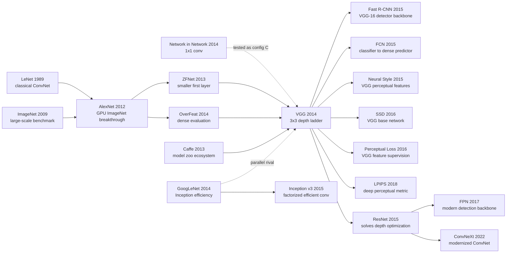

# VGG — 用 3×3 小卷积把 CNN 推到 19 层

> **2014 年 9 月 4 日，Oxford Visual Geometry Group 的 Karen Simonyan 和 Andrew Zisserman 在 arXiv 上传 [1409.1556](https://arxiv.org/abs/1409.1556)，后来以 ICLR 2015 论文发表。** 这篇论文几乎没有“新模块”：没有 Inception 分支，没有残差捷径，没有注意力，只是把卷积核统一缩到 3×3、stride 固定为 1、padding 保持分辨率，然后一层一层往深处堆到 16-19 个权重层。反直觉之处在于，VGG 的影响并不来自冠军头衔：ILSVRC 2014 分类冠军是 GoogLeNet，VGG 是第二；但 VGG-16/19 的 Caffe 权重公开后，它成了 detection、segmentation、style transfer、perceptual loss 时代最顺手的“视觉特征尺子”。

## 一句话总结

Karen Simonyan 和 Andrew Zisserman 2014 年提交、ICLR 2015 发表的 VGG，把 [AlexNet（2012）](2012_alexnet.md) 里“第一层 11×11、大 stride、后面几层卷积”的粗粒度设计，改写成一个极端克制的深度实验：所有卷积尽量用 3×3，三个 3×3 的有效感受野是 $R_{\text{eff}}(3)=7$，参数却只有 $3\cdot3^2C^2=27C^2$，比单个 $7\times7$ 的 $49C^2$ 少 45%，还多出两次 ReLU。这个简单规则把 ImageNet top-5 test error 从 AlexNet ensemble 的 16.4%、ZFNet 的 14.8%、OverFeat 的 13.6%、Clarifai 的 11.7% 推到 VGG ILSVRC submission 的 7.3%，post-submission 两模型融合到 6.8%，同时以 25.3% top-5 localisation error 拿下 ILSVRC 2014 定位冠军。

VGG 真正的历史地位不是“最强网络”，而是“最后一个足够朴素、足够强、足够好复用的 CNN backbone”：它证明深度本身有收益，也暴露了 plain CNN 在 19 层附近的优化与计算天花板，直接给 [ResNet（2015）](2015_resnet.md) 留下问题。反直觉的 lesson 是：一篇没有复杂模块、没有理论证明、甚至没赢分类冠军的论文，靠统一设计和公开权重，反而成了后来 R-CNN/FCN/Neural Style/perceptual loss 共同依赖的视觉坐标系。

---

## 历史背景

### 2014 年视觉学界卡在什么地方

2014 年的 ImageNet 场景有一点像“深度学习已经赢了，但大家还不知道该怎么继续赢”。2012 年 [AlexNet](2012_alexnet.md) 把 top-5 test error 从传统视觉系统的 25% 量级砍到 16.4%，证明大数据、GPU、ReLU、dropout 和卷积网络可以击败手工特征。2013 年 ZFNet / OverFeat / Clarifai 又把数字压到 14%-12% 左右，主要改的是第一层卷积窗口、stride、dense evaluation 和多模型融合。换句话说，AlexNet 已经推翻了“手工特征 + SVM”的旧王朝，但新王朝的架构语言还很粗糙：第一层常常是 11×11 或 7×7 大卷积，早早把图像降采样，后面只有少数几层卷积。

当时最自然的问题是：如果卷积网络已经有用，为什么不继续加深？答案并不显然。AlexNet 只有 8 个权重层，ZFNet 也没有真正把深度推远；GPU 显存、初始化、训练时间、梯度传播都会卡住更深的模型。更微妙的是，2014 年的社区还没有 [BatchNorm](2015_batchnorm.md) 和 [ResNet](2015_resnet.md) 这类稳定深网的基础设施，Caffe 刚开始流行，PyTorch 还不存在。VGG 选择的路线非常保守：不发明复杂模块，只把变量控制住，问一个朴素问题：**如果其他设计基本不变，只把网络做得更深，ImageNet 会不会继续变好？**

这就是 VGG 的历史位置。它不是第一篇 CNN 论文，也不是第一篇 ImageNet 论文，而是把“深度”从经验口号变成可量化实验变量的论文。它在 A、B、C、D、E 五组网络中逐步增加卷积层数，从 11 个权重层推到 19 个权重层，让读者第一次清楚看到：在同一套训练配方、同一套测试协议下，深度确实带来稳定收益，直到 16-19 层附近开始饱和。

### 直接逼出 VGG 的前序工作

- **LeCun 等 1989 年的 LeNet / 反向传播卷积网络**：VGG 明确说自己没有偏离经典 ConvNet 架构，只是把它推深。卷积、池化、全连接、softmax 这条链路来自最早的手写数字识别时代。
- **Deng 等 2009 年的 ImageNet**：没有 1000 类、百万级图像和公开挑战，VGG 的“深度是否有用”就无法在足够大的尺度上被检验。ImageNet 是论文真正的实验地基。
- **Krizhevsky、Sutskever、Hinton 三位作者的 AlexNet（2012）**：VGG 的直接 baseline。AlexNet 证明大 CNN 可以赢，但它的早期 11×11 stride-4 设计很粗；VGG 用 3×3 stride-1 把空间信息保留得更久。
- **Zeiler & Fergus 的 ZFNet（2013/2014）**：可视化和反卷积分析指出 AlexNet 第一层 stride 太大、滤波器太粗。VGG 把“更小的早期卷积窗口”推广成全网络原则。
- **Sermanet 等 6 位作者的 OverFeat（2014）**：把分类网络 dense 地应用在整图上，并同时做识别、定位、检测。VGG 的 dense evaluation 和定位实验明显继承了这条路线。
- **Lin、Chen、Yan 的 Network in Network（2014）**：1×1 卷积的先例。VGG 的 configuration C 特意加入 1×1 层，结果发现只增加非线性不如保留 3×3 空间上下文。
- **Szegedy 等 9 位作者的 GoogLeNet / Inception（2014）**：VGG 同期最强对手。GoogLeNet 走“分支结构 + 参数效率”的复杂路线，VGG 走“单一路径 + 小卷积 + 深度”的朴素路线；两者共同定义了 2014-2015 年 CNN 架构搜索的两极。

### 作者团队当时在做什么

Karen Simonyan 和 Andrew Zisserman 来自 Oxford Visual Geometry Group。VGG 这个名字不是模型类型的缩写，而是实验室名 Visual Geometry Group 的缩写，这一点很关键：这篇论文背后不是一个大工业团队，而是一个长期做几何、识别、检索、视频理解的学术组。Simonyan 同期还在做 two-stream action recognition，Zisserman 则是英国计算机视觉的核心人物之一。VGG 论文的风格也很 Oxford：少讲噱头，多做严谨对照；少发明模块，多报告可复用实验。

这种背景解释了论文为什么如此“克制”。GoogLeNet 同期把网络设计成 Inception 模块的组合，MSRA 的 SPPnet 把 pooling 结构推向检测，Bengio / Goodfellow 那边在生成模型上探索更激进的训练目标；VGG 则选择保留经典 ConvNet 的最小形状。它像一次极端干净的 ablation：输入 224×224，卷积 stride 1，3×3 padding 1，五次 2×2 maxpool，三层 FC，逐步加深。正因为变量少，结论才显得强：性能提升很难归功于花哨结构，只能归功于更深、更小、更均匀的卷积堆叠。

### 工业界、算力和数据的状态

VGG 是一个很“2014 年”的系统。训练使用从 Caffe 分支出来的 C++ 代码，跑在四块 NVIDIA Titan Black GPU 上；单个网络训练需要 2-3 周，4 GPU 同步数据并行只有 3.75 倍加速。今天看 VGG-16 的 138M 参数、VGG-19 的 144M 参数、前两层 FC 各 4096 维都很奢侈，但在当时这就是用有限框架和显存换取可复现精度的路线。

数据侧同样有时代感。ImageNet-1k 的 1.3M 训练图像、50K validation、100K test 是主战场；PASCAL VOC、Caltech-101/256 和 VOC action 是迁移测试。VGG 的公开权重让许多实验室第一次可以不用从头训练一个 ImageNet 网络，直接拿 4096 维 fc7 或 dense conv feature 去做下游任务。这个“模型发布”动作后来显得和架构本身一样重要：VGG 不是只赢了一次比赛，而是把一个可下载、可迁移、可解释的视觉 backbone 交给了社区。

---

## 方法详解

### 整体框架

VGG 的整体框架可以用一句话概括：**把 AlexNet 风格的 CNN 改造成一条极其规整的 3×3 卷积流水线，然后只改变深度**。输入是固定 224×224 RGB crop，只做训练集 RGB mean subtraction；卷积层全部 stride 1，3×3 卷积 padding 1 保持空间分辨率；每经过若干卷积后用 2×2 maxpool stride 2 降采样；最后接三个全连接层：4096、4096、1000，再接 softmax。

这种框架的重点不是某一层，而是“所有层都像同一种积木”。每个 stage 的通道数从 64 开始，经过 pooling 后翻倍到 128、256、512、512。网络 A 到 E 的差异只是每个 stage 里放多少个卷积层，以及 configuration C 是否用 1×1 卷积替换部分 3×3 卷积。

| 配置 | 权重层数 | 卷积层数 | 关键差异 | 参数量 |
|------|----------|----------|----------|--------|
| A | 11 | 8 | 最浅基线，无 LRN | 133M |
| A-LRN | 11 | 8 | 只在 A 上加入 LRN | 133M |
| B | 13 | 10 | 前两个 stage 也堆两层 3×3 | 133M |
| C | 16 | 13 | 在高层插入 1×1 卷积 | 134M |
| D / VGG-16 | 16 | 13 | 全部使用 3×3 卷积 | 138M |
| E / VGG-19 | 19 | 16 | 每个高层 stage 堆四层 3×3 | 144M |

真正反直觉的地方是：VGG 很深，却不比某些浅层大卷积网络参数更多。论文特别指出，Sermanet 等 6 位作者的 OverFeat 风格浅层大卷积网络约 144M 参数，而 VGG-19 也是 144M 左右。VGG 把参数预算从“单层大窗口”挪到“多层小窗口 + 多次非线性”里，这是它能把深度做实的核心。

### 关键设计

#### 设计 1：全网络 3×3 小卷积 —— 用小窗口换深度和非线性

**功能**：把传统 CNN 中 7×7 / 11×11 的大卷积，系统性替换为连续的 3×3 卷积栈，在保持有效感受野的同时减少参数、增加 ReLU 层数。

**核心公式**：连续 $n$ 个 3×3 stride-1 卷积的有效感受野是

$$
R_{\text{eff}}(n)=1+2n
$$

所以两个 3×3 等价于 5×5 感受野，三个 3×3 等价于 7×7 感受野。若输入输出通道同为 $C$，三个 3×3 的参数是 $27C^2$，单个 7×7 是 $49C^2$，后者多 81%。

**实现代码**：

```python
def vgg_conv_stack(in_ch, out_ch, depth):
    layers = []
    for layer_idx in range(depth):
        layers.append(nn.Conv2d(in_ch if layer_idx == 0 else out_ch,
                                out_ch, kernel_size=3, stride=1, padding=1))
        layers.append(nn.ReLU(inplace=True))
    return nn.Sequential(*layers)
```

**大卷积 vs 小卷积栈对比**：

| 替代方案 | 有效感受野 | ReLU 次数 | 参数量 | 设计后果 |
|----------|------------|-----------|--------|----------|
| 1 个 7×7 | 7×7 | 1 | $49C^2$ | 参数多，非线性少 |
| 3 个 3×3 | 7×7 | 3 | $27C^2$ | 参数少 45%，非线性更多 |
| 1 个 5×5 | 5×5 | 1 | $25C^2$ | 比 3×3 栈更浅 |
| 2 个 3×3 | 5×5 | 2 | $18C^2$ | 参数少 28%，表达更强 |

**设计动机**：VGG 的洞察不是“小卷积更省参数”这么简单，而是“小卷积让深度本身变得便宜”。如果直接堆 7×7，网络会很快变成参数和显存灾难；如果全用 3×3，深度带来的额外非线性就像免费赠品。这个选择后来传给了 ResNet、U-Net、FCN 和几乎所有 2015-2018 年的 CNN backbone。

#### 设计 2：A 到 E 的受控深度阶梯 —— 把“更深更好”变成实验结论

**功能**：通过 A/B/C/D/E 五组网络，在尽量固定宽度、pooling、FC 层、训练配方的前提下，单独测量深度增加带来的收益。

**深度变量**可以写成一个简单的搜索问题：

$$
\text{Acc}(d) = f(\text{width fixed}, \text{kernel}=3, \text{training recipe fixed}, d)
$$

VGG 的贡献在于让 $d$ 成为主变量，而不是把深度、宽度、filter size、stride、normalization、测试策略全部混在一起。

**实验骨架代码**：

```python
cfgs = {
    "A": [1, 1, 2, 2, 2],
    "B": [2, 2, 2, 2, 2],
    "C": [2, 2, "2+1x1", "2+1x1", "2+1x1"],
    "D": [2, 2, 3, 3, 3],
    "E": [2, 2, 4, 4, 4],
}
for name, stage_depths in cfgs.items():
    model = build_vgg(stage_depths)
    train_and_eval(model, same_optimizer=True, same_dataset=True)
```

**单尺度 validation 结果**：

| 配置 | 训练尺度 | 测试尺度 | top-1 error | top-5 error |
|------|----------|----------|-------------|-------------|
| A | 256 | 256 | 29.6 | 10.4 |
| A-LRN | 256 | 256 | 29.7 | 10.5 |
| B | 256 | 256 | 28.7 | 9.9 |
| C | [256,512] | 384 | 27.3 | 8.8 |
| D | [256,512] | 384 | 25.6 | 8.1 |
| E | [256,512] | 384 | 25.5 | 8.0 |

**设计动机**：这张深度阶梯表是 VGG 最像科学实验的部分。LRN 没有帮助，1×1 只增加非线性不如 3×3 空间上下文，16 层明显好于 13 层，19 层开始饱和。它让社区第一次很清楚地看到：深度不是口号，而是可控变量；但 plain CNN 的收益也不是无限的。

#### 设计 3：尺度抖动与 dense evaluation —— 把训练/测试尺度也控制起来

**功能**：通过训练时随机采样图像最短边 $S\in[256,512]$、测试时在多个最短边 $Q\in\{256,384,512\}$ 上 dense evaluation，提升模型对物体尺度变化的鲁棒性。

**尺度策略**可以写成：

$$
S \sim \mathcal{U}(256,512), \qquad p(y\mid x)=\frac{1}{|\mathcal{Q}|}\sum_{Q\in\mathcal{Q}} p_Q(y\mid x)
$$

其中 $p_Q$ 表示把图像最短边缩放到 $Q$ 后得到的预测。

**测试代码**：

```python
def multi_scale_predict(model, image, scales=(256, 384, 512)):
    probs = []
    for scale in scales:
        resized = resize_short_side(image, scale)
        logits_map = model.as_fully_convolutional()(resized)
        probs.append(logits_map.softmax(dim=1).mean(dim=(-2, -1)))
    return torch.stack(probs).mean(dim=0)
```

**尺度策略结果**：

| 模型 | 训练尺度 | 测试尺度 | top-1 val | top-5 val |
|------|----------|----------|-----------|-----------|
| D | 256 | 224,256,288 | 26.6 | 8.6 |
| D | 384 | 352,384,416 | 26.5 | 8.6 |
| D | [256,512] | 256,384,512 | 24.8 | 7.5 |
| E | [256,512] | 256,384,512 | 24.8 | 7.5 |

**设计动机**：ImageNet 物体大小差异很大，如果训练只看固定尺度，模型容易把尺度当作隐含类别线索。VGG 的尺度抖动本质上是早期 multi-scale augmentation；dense evaluation 则把 FC 层转成卷积层，在整图上滑动计算，比固定 10-crop 更接近“全图证据整合”。这套测试工程后来在 detection / segmentation 中自然演化成 fully convolutional inference。

#### 设计 4：公开 VGG-16/19 权重 —— 把模型变成可复用视觉特征

**功能**：发布 configuration D/E 的 Caffe 权重，让社区直接复用 16/19 层网络作为 ImageNet 预训练特征抽取器。

**特征抽取公式**：给定去掉最后分类层的 VGG，常用的图像描述子是

$$
\phi(x)=\operatorname{L2Norm}(\operatorname{fc7}(\operatorname{VGG}(x)))
$$

对于 dense 任务，也可以把 FC 层转成卷积层，取空间特征图 $\Phi(x)\in\mathbb{R}^{H\times W\times4096}$。

**复用代码**：

```python
class VGGFeatureExtractor(nn.Module):
    def __init__(self, vgg16):
        super().__init__()
        self.features = vgg16.features
        self.fc6 = vgg16.classifier[:4]

    def forward(self, image):
        conv = self.features(image)
        pooled = F.adaptive_avg_pool2d(conv, (7, 7)).flatten(1)
        return F.normalize(self.fc6(pooled), dim=1)
```

**VGG 权重的下游路径**：

| 下游任务 | 典型用法 | 代表工作 | 历史作用 |
|----------|----------|----------|----------|
| Detection | VGG-16 backbone + RoI pooling | Fast R-CNN | R-CNN 时代默认 backbone |
| Segmentation | FC 层转卷积，dense prediction | FCN | 分类网转密集预测模板 |
| Style transfer | conv feature Gram matrix | Neural Style | VGG 成为感知空间 |
| Super-resolution | VGG perceptual loss | Johnson et al. | 从像素 loss 转向特征 loss |
| Perceptual metric | 深特征距离 | LPIPS | 用网络特征近似人类感知 |

**设计动机**：公开权重让 VGG 的影响超出 ILSVRC 排名。很多论文引用 VGG 不是为了“3×3 卷积”本身，而是因为它的中间层特征足够通用、足够稳定、足够容易拿到。VGG 因此成了 2015-2017 年视觉研究的公共坐标系：你可以在它上面接 detection head、segmentation decoder、style loss 或 perceptual metric。

### 损失函数 / 训练策略

VGG 没有新损失函数，使用标准 1000 类 softmax cross-entropy。它的训练难点来自模型大、训练慢、尺度变化多，而不是目标函数新。

| 项 | 配置 | 说明 |
|----|------|------|
| Input | 224×224 RGB crop | 从 rescaled image 随机裁剪 |
| Preprocess | subtract mean RGB | 没有复杂颜色标准化 |
| Loss | multinomial logistic regression | 1000-way ImageNet softmax |
| Optimizer | mini-batch SGD + momentum | batch 256, momentum 0.9 |
| Weight decay | $5\times10^{-4}$ | 控制 138M 参数过拟合 |
| Dropout | 0.5 | 用在前两个 FC 层 |
| LR schedule | 0.01 起，停滞时除以 10 | 共下降 3 次 |
| Iterations | 370K | 约 74 epochs |
| Augmentation | random crop, flip, RGB shift | 外加 scale jitter |
| Hardware | 4× Titan Black | 单模型 2-3 周 |

一个容易被忽略的细节是初始化。VGG 深层网络最初不是完全从随机初始化开始，而是先训练较浅的 A，再用 A 的前四个卷积层和后三个 FC 层初始化更深网络；中间新增层随机初始化。论文 camera-ready 后补充说 Glorot initialization 也可以从头训练成功，但这句话恰恰说明 2014 年训练 19 层 plain CNN 还不是理所当然的事。VGG 处在“深度可行”与“深度好训”之间，后一件事要等 BatchNorm 和 ResNet 才真正解决。

---

## 失败案例

### 当时被 VGG 压过的 baseline

VGG 的“失败案例”不像 GAN 那样是训练崩溃，也不像 ResNet 那样是更深 plain net 的退化；它更像一次架构实验里的淘汰赛。论文最重要的对手不是某个单独模型，而是 2012-2014 年 ImageNet 上逐步形成的一组设计习惯：大卷积核、早期大 stride、较浅卷积层、依赖多模型融合、用复杂测试策略弥补表示能力。

| Baseline | 代表做法 | 关键数字 | 输给 VGG 的原因 |
|----------|----------|----------|------------------|
| AlexNet | 11×11 stride-4 第一层，8 个权重层 | 5-model top-5 test 16.4% | 空间信息早早丢失，深度不够 |
| ZFNet | 更小第一层、更好可视化，仍较浅 | 6-model top-5 test 14.8% | 修正 AlexNet 早期层，但没有系统加深 |
| OverFeat | dense evaluation + 识别/定位/检测统一 | 7-model top-5 test 13.6% | 测试工程强，表示深度仍不够 |
| Clarifai | 多模型、外部数据、工程调参 | top-5 test 11.7%（无外部数据） | 依赖复杂系统，单模型表示不如 VGG 深 |
| MSRA/SPPnet | spatial pyramid pooling + 11 nets | top-5 test 8.1% | 池化机制强，但 VGG 的深特征更通用 |

VGG 对这些 baseline 的胜利不只是“数字更低”，而是胜在解释力更清楚。AlexNet 到 Clarifai 的进步混合了许多因素：数据、训练、测试 crop、ensemble、早期卷积参数。VGG 把故事压缩成一句话：**用小卷积把 plain CNN 做深，表示会变强。** 这让后续研究者知道该沿哪条轴继续推。

### 作者论文里承认的负结果

VGG 论文很有价值的一点，是它公开了几个“不该继续走”的小岔路。这些负结果没有占很多篇幅，但后来都成了社区默认规则。

| 负结果 | 实验设置 | 观察 | 后来的影响 |
|--------|----------|------|------------|
| LRN 无用 | A vs A-LRN | top-5 10.4% vs 10.5% | AlexNet 的 LRN 被逐步淘汰 |
| 1×1 不如 3×3 | C vs D | C top-5 8.8%，D top-5 8.1% | 只加非线性不够，空间上下文更关键 |
| 固定尺度不如尺度抖动 | D fixed vs D jitter | top-5 8.7/8.8% vs 8.1% | multi-scale training 成为常规增广 |
| 单 dense eval 不如 dense+crop | E dense vs combined | top-5 7.5% vs 7.1% | 边界条件差异让测试策略互补 |
| FC 头过重 | 4096/4096 FC | 参数集中在分类头 | 后续 backbone 转向 GAP / bottleneck |

最有思想含量的负结果是 configuration C。1×1 卷积能增加非线性，Network in Network 已经证明它有价值；但在 VGG 的对照中，把高层 3×3 换成 1×1 后不如全 3×3 的 D。这个结果提醒社区：深度不只是“多几个 ReLU”，还要让每一层有足够的空间感受野去整合局部结构。

### 真正没有赢下来的对手：GoogLeNet

VGG 在 ILSVRC 2014 分类赛并没有夺冠，冠军是 GoogLeNet。这个事实常被后来“VGG 很经典”的叙事盖过去，但它恰好说明 VGG 的历史意义不等于排行榜第一。GoogLeNet 用 Inception 模块把 1×1、3×3、5×5 和 pooling 分支组合起来，参数量只有约 6.8M，却拿到 6.7% top-5 test error；VGG-16/19 动辄 138M/144M 参数，submission 是 7.3%，post-submission 才做到 6.8%。

VGG 输给 GoogLeNet 的不是表示质量，而是参数效率和结构经济性。VGG 的强项是规则、可迁移、好实现；GoogLeNet 的强项是更省参数、更适合竞赛 ensemble。后来历史很有意思：工程上，GoogLeNet 的 Inception 系列继续演进；科研基础设施上，VGG 反而因为“笨但透明”被更多论文拿去当 backbone 和 perceptual feature。换句话说，VGG 的失败不是失败，而是定位不同：它没有成为最省的分类器，却成为最易复用的视觉表征。

---

## 实验关键数据

### ImageNet 分类主结果

VGG 的核心实验是 ILSVRC-2012/2014 分类。最重要的读法是：单模型 D/E 已经接近或超过复杂系统，post-submission 两模型融合几乎追平 GoogLeNet 七模型系统。

| 方法 | top-1 val error | top-5 val error | top-5 test error |
|------|-----------------|-----------------|------------------|
| VGG 2 nets, dense+crop | 23.7 | 6.8 | 6.8 |
| VGG 1 net, dense+crop | 24.4 | 7.1 | 7.0 |
| VGG ILSVRC submission, 7 nets | 24.7 | 7.5 | 7.3 |
| GoogLeNet 7 nets | - | - | 6.7 |
| GoogLeNet 1 net | - | - | 7.9 |
| MSRA 11 nets | - | - | 8.1 |
| Clarifai multiple nets | - | - | 11.7 |
| ZFNet 6 nets | 36.0 | 14.7 | 14.8 |
| AlexNet 5 nets | 38.1 | 16.4 | 16.4 |

这张表里最值得记住的不是 6.8 和 6.7 的微小差距，而是单模型 VGG 的 7.0% 已经优于单模型 GoogLeNet 的 7.9%。这说明 VGG 的单一路径表示很强，只是参数和计算太重。

### 定位任务结果

VGG 在 localisation track 上拿到 ILSVRC 2014 第一名。定位分支把最后一层分类器改成 bounding-box 回归器，使用 per-class regression，并从分类网络初始化。

| 方法 | val localisation error | test localisation error |
|------|------------------------|-------------------------|
| VGG fusion | 26.9 | 25.3 |
| GoogLeNet | - | 26.7 |
| OverFeat | 30.0 | 29.9 |
| AlexNet-era baseline | - | 34.2 |

这个结果说明 VGG 的深层表示不只对 1000-way 分类有用，也能迁移到需要空间定位的任务。更重要的是，VGG 没有使用 OverFeat 的 multiple pooling offsets，却仍然赢了，证明主要收益来自更强的 representation。

### 迁移和泛化结果

VGG 的附录 B 是后来引用爆炸的重要原因：作者展示了 ImageNet 预训练特征在 VOC、Caltech 和 action recognition 上的泛化。

| 方法 | VOC-2007 mAP | VOC-2012 mAP | Caltech-101 recall | Caltech-256 recall |
|------|--------------|--------------|--------------------|--------------------|
| Chatfield et al. | 82.4 | 83.2 | 88.4 | 77.6 |
| VGG Net-D | 89.3 | 89.0 | 91.8 | 85.0 |
| VGG Net-E | 89.3 | 89.0 | 92.3 | 85.1 |
| VGG Net-D & Net-E | 89.7 | 89.3 | 92.7 | 86.2 |

这组结果把 VGG 从“ImageNet 竞赛模型”变成“通用视觉特征”。特别是 VOC-2007 从 82.4 到 89.7、Caltech-256 从 77.6 到 86.2 的提升，解释了为什么 Fast R-CNN、FCN、style transfer 和 perceptual loss 会一窝蜂地使用 VGG 特征。

### 关键发现

- **深度有明确收益，但 plain CNN 很快饱和**：从 A 到 D 的提升清楚，D 到 E 只有很小收益。这为 ResNet 的“如何继续加深”埋下问题。
- **LRN 从此基本退场**：AlexNet 时代被认为有用的 Local Response Normalisation 在 VGG 中既不提高精度，还增加显存和计算。
- **3×3 的空间上下文比 1×1 的单纯非线性更重要**：C 不如 D 是一个非常有价值的反例。
- **公开权重放大影响力**：很多后续论文引用 VGG，不是因为复现实验，而是因为直接下载了 VGG-16/19 权重作为 backbone。
- **参数效率是 VGG 的硬伤**：138M/144M 参数让 VGG 很强也很笨重，后来 ResNet、Inception、MobileNet 都在不同方向上修补这个问题。

---

## 思想史脉络



### 前世（被谁逼出来的）

- **LeNet / classical ConvNet（1989）**：VGG 没有改变 ConvNet 的基本骨架，而是把经典骨架推深。卷积、池化、全连接、softmax 这条路线在 VGG 里几乎原样存在。
- **ImageNet（2009）**：VGG 的深度实验需要大数据，否则 16-19 层模型很容易只是在小数据上过拟合。ImageNet 把“深度是否真的泛化”变成可测问题。
- **AlexNet（2012）**：VGG 继承了 ReLU、dropout、GPU 训练和 ImageNet pipeline，但反对 AlexNet 的大窗口和早期粗采样。
- **ZFNet / OverFeat（2013-2014）**：ZFNet 把第一层做小，OverFeat 把网络 dense 地应用于整图；VGG 把这两点合成一套规整系统。
- **Network in Network（2014）**：1×1 卷积给 VGG 提供了一个对照组。configuration C 的负结果反过来说明：VGG 的强项不是“更多非线性”四个字，而是“更多带空间上下文的非线性”。

### 今生（继承者）

- **检测与分割 backbone**：Fast R-CNN、SSD、FCN 都直接或间接把 VGG-16 当作默认 backbone。2015-2016 年的视觉论文里，“VGG-16 pretrained on ImageNet”几乎是一句基础设施咒语。
- **感知损失与风格迁移**：Gatys 的 Neural Style 把 VGG conv feature 的 Gram matrix 当作风格；Johnson 等 3 位作者把 VGG feature loss 用在实时风格迁移和超分辨率；LPIPS 又把深特征距离正规化成感知指标。
- **ResNet 的直接问题来源**：VGG 证明深度有效，也暴露 plain CNN 在 19 层附近开始饱和。ResNet 的 $y=\mathcal{F}(x)+x$ 可以看作对 VGG 问题的回答：如果深度继续有用，优化器需要一条捷径。
- **现代 ConvNet 的反向继承**：ConvNeXt 这类 2020 年代论文回头重写 CNN 时，仍然继承了 VGG 的“规则 stage + 小卷积/局部算子 + 简洁 backbone”审美，只是用 LayerNorm、depthwise conv、GELU 和更现代训练 recipe 替换旧部件。

### 误读 / 简化

- **“VGG 只是堆层数”**：只说对了一半。VGG 的关键不是盲目堆，而是在固定 stride、padding、pooling、width schedule 后做受控深度实验。没有“受控”这两个字，VGG 就只是又一个大模型。
- **“3×3 卷积天然最好”**：VGG 证明 3×3 在 2014 年的计算和数据条件下是很好的折中，不是永恒定律。后来的 Inception factorization、depthwise separable conv、ViT patch embedding 都说明最佳局部算子取决于硬件和训练范式。
- **“VGG 输给 GoogLeNet，所以影响较小”**：榜单排名和基础设施影响不是一回事。GoogLeNet 更省参数、更适合竞赛；VGG 更透明、更容易复用、更适合作为特征空间。
- **“VGG 已经被 ResNet 淘汰，所以不重要”**：ResNet 淘汰的是 VGG 作为高效分类 backbone 的地位，不是 VGG 作为视觉特征参照系的地位。style transfer、perceptual loss、LPIPS 仍然长期使用 VGG 特征。

---

## 当代视角

### 站不住的假设

1. **“继续堆 plain CNN 就能一直变好”**：VGG 自己已经显示 D 到 E 的收益很小，后来 ResNet 进一步证明 plain 深网会遇到优化退化。深度有用，但没有 skip connection、normalization 和更好的初始化，深度很快变成负担。
2. **“大 FC 分类头是强表示的必要部分”**：VGG 的 4096/4096 FC 层贡献了大量参数。后来的 ResNet、Inception、EfficientNet、ConvNeXt 基本都用 global average pooling 和更轻的头，说明强表示主要来自 convolutional trunk，而不是巨型 FC。
3. **“ImageNet 预训练特征主要服务分类”**：VGG 之后的历史证明，预训练特征最大的价值在迁移：检测、分割、风格迁移、图像生成、感知指标都吃到了 VGG 中间层表示。
4. **“3×3 是 CNN 的终极答案”**：3×3 是 VGG 时代的漂亮答案，但不是最后答案。Inception 用 factorized conv，MobileNet 用 depthwise separable conv，ConvNeXt 用大 kernel depthwise conv，ViT 甚至用 patch tokenization。VGG 的真正遗产是“局部算子要系统设计”，不是“永远用 3×3”。

### 时代证明的关键 vs 冗余

| 部分 | 2026 年评价 | 说明 |
|------|-------------|------|
| 3×3 小卷积堆叠 | 关键 | 让深度、参数、非线性三者取得好折中 |
| 受控深度 ablation | 关键 | 把“深度有用”变成可信实验结论 |
| 公开 Caffe 权重 | 关键 | 让 VGG 成为社区基础设施 |
| dense fully convolutional evaluation | 关键 | 连接分类网络和 dense prediction |
| LRN 对照 | 冗余但有用 | 证明 AlexNet 旧组件可删除 |
| 4096/4096 FC 头 | 时代产物 | 后续被 GAP 和轻量 head 取代 |
| 138M/144M 参数规模 | 明显低效 | 促进了 Inception/ResNet/MobileNet 的效率路线 |

### 作者当时没想到的副作用

VGG 最意外的后果，是它把“预训练 CNN 中间层”变成了一个可交易的公共对象。2014 年论文关注的是分类和定位，但 2015 年之后，VGG 特征很快被拿去做检测、分割、风格迁移、超分辨率、图像质量度量。尤其是 Neural Style 和 perceptual loss：它们并不关心 VGG 的分类头，而是把中间层激活当作“人眼相似度”的近似。这件事几乎重新定义了图像生成的 loss 设计。

另一个副作用是，VGG 让“backbone”这个概念变得具体。AlexNet 也能迁移，但 VGG-16 的层次更深、特征更强、实现更统一，于是论文可以直接写“we use VGG-16 pretrained on ImageNet”。这句话后来在视觉论文里出现无数次。它让研究者把精力从“重新训练视觉表示”转向“在强 backbone 上设计任务头”。

### 如果今天重写 VGG

如果 2026 年重新写 VGG，论文大概率会保留“受控深度实验”的精神，但会彻底改写工程配方：去掉 4096 维 FC 头，用 global average pooling；加入 BatchNorm 或 LayerNorm；使用更强初始化和 cosine LR；报告 FLOPs、latency、activation memory，而不只报 top-5 error；用 ImageNet-1k 之外的数据测试迁移；并把 released weights、model card、preprocessing 规范写成正式 artifact。

但核心不会变：**把复杂度控制住，只让一个架构变量说话。** VGG 的现代价值正在这里。它提醒我们，深度学习论文不一定要靠新模块赢；有时候，真正改变社区共识的是一组足够干净的对照实验，加上一份任何人都能下载复用的模型权重。

---

## 局限与展望

### 作者承认的局限

- **训练成本高**：单模型 2-3 周、4 GPU，模型发布后社区复用很方便，但从头训练门槛很高。
- **参数量大**：VGG-16/19 的 138M/144M 参数主要集中在 FC 层，存储和推理都重。
- **分类赛不是冠军**：ILSVRC 2014 分类冠军是 GoogLeNet，VGG 第二；论文用 post-submission 实验补强了结果。
- **更深网络收益饱和**：D 到 E 的提升很小，说明 plain CNN 的深度收益到 19 层附近已经不线性。
- **高分辨率 dense evaluation 慢**：多尺度、dense、multi-crop 的组合提升精度，但计算代价很高。

### 自己发现的局限（2026 视角）

| 局限 | 为什么重要 | 后续修复 |
|------|------------|----------|
| 没有 residual path | 深度继续增加会退化 | ResNet / Highway Networks |
| 没有 normalization | 训练深层 plain net 脆弱 | BatchNorm / LayerNorm |
| FC 参数过重 | 存储和推理效率差 | Global average pooling |
| 缺少硬件效率指标 | 参数多不等于慢，activation 也重要 | FLOPs/latency/throughput 报告 |
| 特征尺度单一 | dense prediction 需要多尺度语义 | FPN / U-Net skip connections |

### 改进方向（已被后续工作证实）

- **ResNet**：用 identity shortcut 解决 VGG 暴露出的深度优化问题。
- **Inception / Xception / MobileNet**：把 VGG 的小卷积思想进一步拆成 factorization 或 depthwise separable conv，提升参数效率。
- **FCN / U-Net / FPN**：把 VGG 的 dense feature 思路扩展成多尺度 dense prediction。
- **ConvNeXt**：从现代训练 recipe 回看 CNN，保留 VGG/ResNet 的 stage 结构但替换算子和 normalization。
- **ViT / Swin**：从局部卷积走向 token mixing，但仍继承“backbone + task head + pretraining”的框架。

---

## 相关工作与启发

| 对照对象 | 相同点 | 差异 | 启发 |
|----------|--------|------|------|
| AlexNet | ImageNet CNN、ReLU、dropout | VGG 更小卷积、更深、更规整 | 旧范式可通过控制变量继续推进 |
| GoogLeNet | 同期深网络、ImageNet 2014 | GoogLeNet 更省参数，VGG 更透明 | 榜单冠军和社区基础设施可以分离 |
| ResNet | 都把深度当核心变量 | ResNet 加 identity shortcut | VGG 提问题，ResNet 解优化 |
| FCN | 使用分类 CNN 做 dense prediction | FCN 改写输出结构 | 好 backbone 会跨任务扩散 |
| Neural Style | 使用 VGG 中间层 | 目标从识别变成感知相似度 | 表示学习会反过来改写 loss 设计 |

VGG 给研究者的最大启发是：**简单不是浅，统一不是偷懒。** 一个架构如果足够规整，别人就能复现、修改、迁移、解释；一个模型如果权重公开，影响力会从论文实验扩散到社区基础设施。今天做 foundation model 也有同样教训：模型设计本身重要，artifact 的可用性同样重要。

---

## 相关资源

- 📄 [arXiv 1409.1556](https://arxiv.org/abs/1409.1556)
- 🌐 [Oxford VGG 官方项目页](https://www.robots.ox.ac.uk/~vgg/research/very_deep/)
- 💾 [VGG-16 Caffe model information](https://gist.github.com/ksimonyan/211839e770f7b538e2d8)
- 💾 [VGG-19 Caffe model information](https://gist.github.com/ksimonyan/3785162f95cd2d5fee77)
- 📚 后续必读：[Fast R-CNN](https://arxiv.org/abs/1504.08083), [FCN](https://arxiv.org/abs/1411.4038), [Neural Style](https://arxiv.org/abs/1508.06576), [ResNet](https://arxiv.org/abs/1512.03385), [LPIPS](https://arxiv.org/abs/1801.03924)
- 🌐 跨语言：英文版 → [`/en/era2_deep_renaissance/2014_vgg.md`](/en/era2_deep_renaissance/2014_vgg/)


---

> 🌐 [English version](/en/era2_deep_renaissance/2014_vgg/) · 📚 awesome-papers project · CC-BY-NC