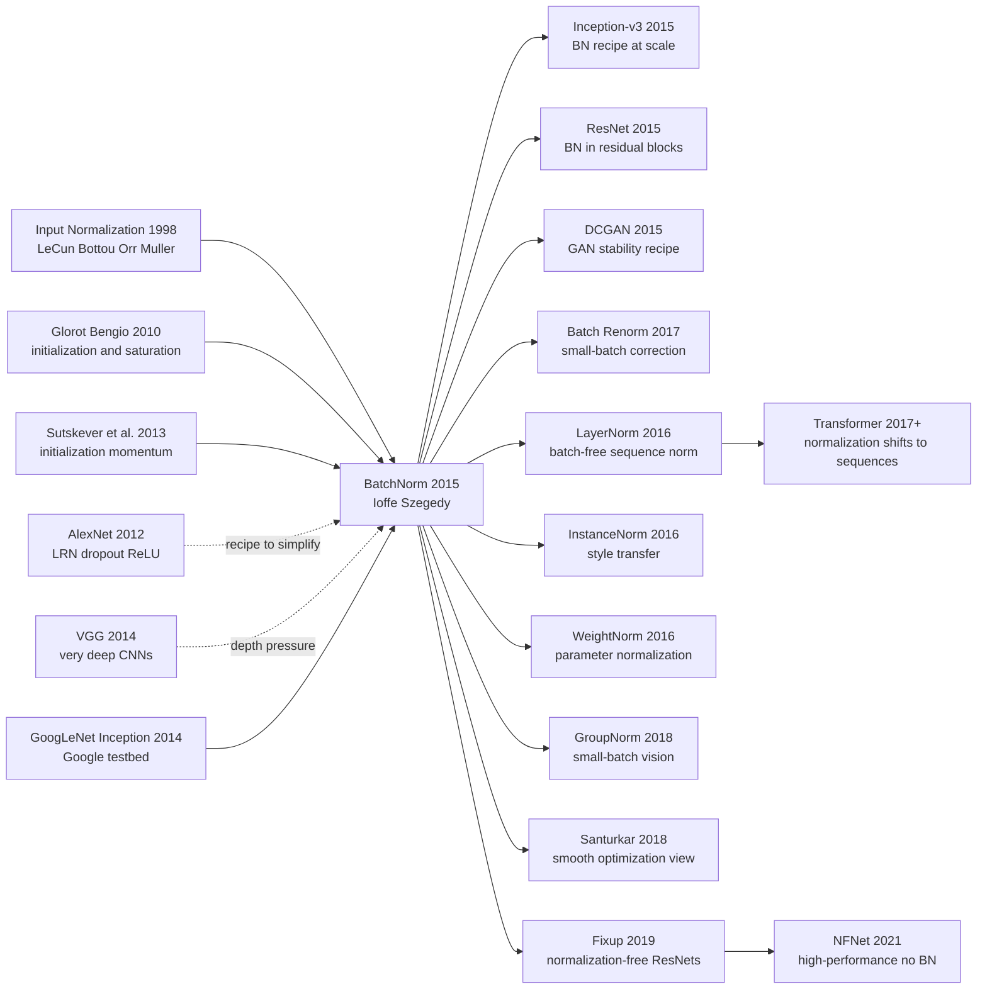

# BatchNorm — 把训练稳定性变成一层网络

> **2015 年 2 月 11 日，Google 的 Sergey Ioffe 与 Christian Szegedy 两位作者把 [arXiv 1502.03167](https://arxiv.org/abs/1502.03167) 挂到网上，几个月后在 ICML 2015 发表。** 这篇论文没有提出新卷积核、没有堆更深网络、也没有换损失函数，而是把一个老到几乎无聊的工程动作——把输入减均值、除方差——塞进每一层网络内部，并让它参与反向传播。结果很戏剧：Inception 风格模型达到同等 ImageNet 精度所需训练步数少了 14 倍，BN ensemble 把 top-5 test error 压到 4.82%。后来大家发现“internal covariate shift”这个解释并不完全站得住，但 BatchNorm 留下的真正遗产更硬：深度学习从此不再把训练稳定性当成调参玄学，而是把它做成了可组合、可微、可默认开启的一层。

## 一句话总结

Ioffe 与 Szegedy 2015 年发表在 ICML 的 BatchNorm，把每层输入从“前面层一更新、分布就漂”的动目标，改写成一个可微的归一化层：$\hat{x}_i=(x_i-\mu_B)/\sqrt{\sigma_B^2+\epsilon}$，再用 $y_i=\gamma\hat{x}_i+\beta$ 把表达能力还给网络。它替代的不是某个单一 baseline，而是 2012-2014 年训练深网的一整套脆弱仪式：小心初始化、很小学习率、AlexNet 式 LRN、重 dropout、怕 sigmoid 饱和。论文在 Inception 上报告“同等精度少 14 倍训练步数”，BN ensemble 达到 4.82% ImageNet top-5 test error；一年后 [ResNet（2015）](2015_resnet.md) 几乎把 BN 放进每个残差块，DCGAN 也把 BN 当成稳定生成对抗训练的标配。反直觉处在于：这篇论文最流行的解释“减少 internal covariate shift”后来被 Santurkar 等工作削弱，但方法本身没有倒下。BN 真正改变的是优化地形、梯度尺度和默认训练配方：从此“能不能训起来”不再完全靠手感，而可以被封装成一层网络。

---

## 历史背景

### 2014 年深网训练最怕的不是表达力，而是分布漂移

2014 年的神经网络已经不缺“更强表达力”的证据。AlexNet 证明大卷积网可以赢 ImageNet，VGG 证明把 3x3 卷积堆深也能涨分，GoogLeNet / Inception 则证明多分支模块可以在计算量可控的前提下继续扩展模型容量。真正让工程师头痛的不是“网络够不够大”，而是“它能不能稳稳训完”。

当时训练深层 CNN 仍像照顾一台脾气很大的机器：初始化要小心，学习率要慢慢调，激活函数一饱和就梯度消失，上一层参数稍微更新，下一层看到的输入分布就跟着移动。论文把这个现象命名为 **internal covariate shift**：每一层都在追一个不断漂移的目标分布，因此优化器不得不使用更保守的步长。

这个说法后来并没有完全经受住检验，但在 2015 年，它击中了所有训练深网的人都熟悉的痛感：**网络越深，层与层之间的统计耦合越难手动管理**。BatchNorm 的历史意义，不在于第一次发现归一化重要，而在于第一次把“内部统计稳定”做成一个默认可插入、可反向传播、可部署的层。

### 输入归一化早已是常识，隐藏层归一化还不是

早在 Efficient BackProp 时代，LeCun、Bottou、Orr、Muller 就已经提醒研究者：输入最好零均值、同尺度，条件数越好，梯度下降越舒服。图像任务里减均值、除标准差、做 PCA whitening 都是常规预处理。问题是，这些动作大多只发生在**输入层之前**。

隐藏层要复杂得多。某一层的激活分布不是固定数据集统计，而是前面所有参数共同决定的函数；每次 SGD 更新都会改变它。如果想像输入 whitening 一样“离线算好再喂给模型”，下一步参数更新就会让统计量过期。全协方差白化还要算矩阵分解，既慢，又难以嵌进大规模 CNN 的训练循环。

BatchNorm 的关键换位是：不要把归一化当成数据预处理，而要把它当成模型本身的一部分。统计量在 mini-batch 上即时估计，归一化算子留在计算图里，梯度穿过均值和方差回传。这个工程选择让一个老概念突然可规模化。

### Google / Inception 的工程压力

BatchNorm 不是在玩具问题里长出来的。它的直接战场是 Google 的 Inception / GoogLeNet 系列：多分支卷积、1x1 bottleneck、深而稀疏的模块化结构，既想省计算，又想加深网络。Szegedy、Liu、Jia 等 9 位作者在 2014 年的 Inception 论文里已经把“更深但更便宜”的路线推到 ImageNet 冠军级别；下一步瓶颈自然变成训练速度和稳定性。

论文的实验也带着很强的工业味：目标不是在一个小数据集上证明“归一化有效”，而是在 ImageNet 上让一个 state-of-the-art 系统训得更快、分数更高、对初始化和学习率更不敏感。BN-x5、BN-x30、BN-x5-Sigmoid 这些名字听起来像消融实验，其实是在问一个工程问题：如果训练稳定性不再是最大限制，我们能不能把学习率开大、把非线性换回 sigmoid、把 dropout 减掉，甚至把整个训练周期压短一个数量级？

这也是 BatchNorm 能迅速扩散的原因。它不是一个需要换整套框架的新模型，而是一层。你可以把它插进已有 CNN、已有 Inception、后来的 ResNet、GAN、检测模型里，立刻得到更宽的学习率窗口。

### 两位作者在做什么

Sergey Ioffe 在 Google 的研究背景横跨统计学习、计算机视觉和大规模系统；Christian Szegedy 则是 Inception / GoogLeNet 的核心作者之一。两位作者的组合很典型：一个从优化和统计稳定性切入，一个拿着 Google 当时最强的视觉生产模型做压力测试。

这篇论文的写作风格也很“Google 2015”：理论解释非常直接，算法形式简洁，实验重点放在训练速度和 ImageNet 误差上。它没有把故事包装成全新架构，而是反复强调一个朴素观察：如果每层输入的统计量更稳定，优化器就能走得更大、更快、更不怕初始化。

后来我们知道，BN 的成功不能完全归因于 internal covariate shift；但这不削弱它在 2015 年的历史位置。它给深度学习社区提供了一个足够简单、足够可复用的稳定器，使 2015-2016 年的深层 CNN 爆发从“需要少数团队掌握秘方”变成“普通实验室也能复现”。

## 研究背景与动机

### Internal Covariate Shift 是论文给出的切口

论文把 internal covariate shift 定义为：由于前面层参数变化，某一层输入分布在训练过程中持续改变。这个名字借用了 covariate shift 的外部数据分布漂移概念，但把它搬到网络内部。直觉上，如果每一层都要不断适应前一层的新分布，训练就会变慢；如果能把每层输入重新拉回标准化尺度，优化就会更平滑。

这个切口有两个好处。第一，它把“深网难训”从一个模糊经验问题变成了统计量漂移问题，便于设计可插拔模块。第二，它解释了为什么仅靠好初始化不够：初始化只管第 0 步，BN 则在每一步都重新校准激活尺度。

今天回看，ICS 更像一个有启发性的工程叙事，而不是完整因果解释。可是在 2015 年，它足够具体，足够可操作，也足够贴近工程痛点。

### 真正想解决的三个训练痛点

BatchNorm 的目标可以压成三个训练痛点。

第一，**学习率太保守**。没有 BN 时，学习率稍大就可能让某些层激活爆掉或饱和；有 BN 后，层输入被重新居中缩放，网络能承受更激进的步长。

第二，**初始化太敏感**。Glorot initialization、He initialization 这类方法都在努力让信号方差跨层保持合理；BN 不替代初始化，但大幅扩大了“能训起来”的初始化范围。

第三，**正则化和训练稳定性纠缠在一起**。Dropout 在 AlexNet/VGG 时代几乎是默认项，但它会增加噪声、拉长训练。BN 的 mini-batch 统计本身带来噪声，论文报告某些设置下可以减少甚至移除 dropout，这让训练速度和泛化不再完全互相拉扯。

### 为什么“把归一化做成层”比离线白化更关键

最容易低估 BatchNorm 的地方，是把它理解成“每层做个标准化”。真正的设计点在于：归一化是计算图的一部分，有参数，有训练/推理两套统计逻辑，还能和卷积层共享通道尺度。

如果只做离线白化，统计量不会跟着模型更新；如果做全协方差白化，计算和实现都太重；如果不加可学习仿射参数，归一化会限制网络能表达的分布。BatchNorm 把这三个问题一起处理：mini-batch 统计负责即时性，$\gamma,\beta$ 负责表达能力，running mean / variance 负责推理部署。

这就是它与许多“好想法但没成为默认层”的方法的分水岭。BN 不只是解释了深网为什么难训，它给了工程师一个一行代码能用、论文里能证明、生产里能部署的答案。

---

## 方法详解

### 整体框架

BatchNorm 的整体框架可以一句话说完：在一层的线性变换和非线性之间插入一个可微的标准化算子，让 mini-batch 内的激活先减均值、除标准差，再乘上可学习尺度 $\gamma$、加上可学习偏置 $\beta$。如果原层是 $u = Wx + b$，论文推荐对 $u$ 做 BN，再送进非线性 $g(\cdot)$：$z = g(\text{BN}(u))$。

这听起来像普通 preprocessing，但它有三个本质差别。第一，统计量不是数据集预先算好的，而是每个 mini-batch 即时估计。第二，均值和方差在计算图内，梯度会穿过它们回传到每个样本。第三，训练和推理使用不同统计逻辑：训练时用 batch 统计，推理时用训练期间累计的 population mean / variance。

BatchNorm 的漂亮之处在于，它把“优化器需要更好条件数”这件事从 optimizer 侧搬到 architecture 侧。Adam、momentum、learning-rate schedule 仍然重要，但 BN 先把每层看到的尺度拉回可控范围，使更大的学习率、更深的网络和更少的手工调参成为可能。

### 关键设计 1：mini-batch 标准化 —— 用当前 batch 估计每个激活的尺度

#### 功能

每个 scalar activation 维度在一个 mini-batch 内单独计算均值和方差，把该维度的 batch 分布拉到近似零均值、单位方差。它解决的是“前面层参数一动，后面层输入尺度就漂”的问题。

#### 公式

给定一个 mini-batch $B=\{x_1,\dots,x_m\}$ 中同一维度的激活，BatchNorm 先计算 batch 统计量，再归一化：

$$
\mu_B = \frac{1}{m}\sum_{i=1}^{m} x_i, \qquad
\sigma_B^2 = \frac{1}{m}\sum_{i=1}^{m}(x_i-\mu_B)^2, \qquad
\hat{x}_i = \frac{x_i-\mu_B}{\sqrt{\sigma_B^2+\epsilon}}
$$

这里的 $\epsilon$ 是数值稳定项，防止方差接近 0 时除法爆掉。

#### 代码

```python
def batch_standardize(x, eps=1e-5):
    # x: [batch, features]
    mean = x.mean(dim=0, keepdim=True)
    var = x.var(dim=0, unbiased=False, keepdim=True)
    x_hat = (x - mean) / torch.sqrt(var + eps)
    return x_hat, mean, var
```

#### 对比表

| 做法 | 统计来源 | 计算成本 | 训练含义 |
|------|----------|----------|----------|
| 输入标准化 | 全训练集输入 | 低 | 只稳定第 1 层 |
| 全协方差白化 | batch 或数据集协方差矩阵 | 高 | 理论强但难规模化 |
| BatchNorm | mini-batch 每维均值/方差 | 低 | 稳定每一层输入 |

#### 设计动机

论文没有追求完整 whitening，而是只做 per-dimension 标准化。这是一个很有工程判断的取舍：全白化会处理维度相关性，但需要矩阵分解；BN 只控制一阶和二阶尺度，却便宜到可以插进每层。它牺牲了一部分统计完整性，换来大规模 CNN 训练里真正可用的速度。

### 关键设计 2：可学习仿射恢复 —— 用 $\gamma,\beta$ 把表达能力还给网络

#### 功能

如果只把激活强行标准化，网络可能失去需要非零均值或特定方差的表达能力。BatchNorm 在标准化后增加可学习参数 $\gamma$ 和 $\beta$，让模型自己决定要不要保留归一化后的尺度，甚至恢复原始分布。

#### 公式

标准化后的输出不是直接送到下一层，而是再做一层逐维仿射变换：

$$
y_i = \gamma \hat{x}_i + \beta, \qquad
\text{BN}_{\gamma,\beta}(x_i) = \gamma \frac{x_i-\mu_B}{\sqrt{\sigma_B^2+\epsilon}} + \beta
$$

如果设 $\gamma=\sqrt{\sigma_B^2+\epsilon}$、$\beta=\mu_B$，这层在局部可以恢复 identity；实际训练中 $\gamma,\beta$ 会学到任务需要的尺度和中心。

#### 代码

```python
class BatchNorm1D(nn.Module):
    def __init__(self, features):
        super().__init__()
        self.gamma = nn.Parameter(torch.ones(features))
        self.beta = nn.Parameter(torch.zeros(features))

    def forward(self, x):
        x_hat, mean, var = batch_standardize(x)
        return self.gamma * x_hat + self.beta
```

#### 对比表

| 版本 | 是否稳定尺度 | 是否保留表达能力 | 失败模式 |
|------|--------------|------------------|----------|
| 只标准化 | 是 | 否 | 可能压掉有用均值/方差 |
| 只加偏置 | 部分 | 部分 | 方差仍被固定 |
| BN + $\gamma,\beta$ | 是 | 是 | 依赖 batch 统计 |

#### 设计动机

$\gamma,\beta$ 是 BN 容易被忽略的关键。没有它，归一化会变成一种硬约束；有了它，归一化只是给优化器一个好坐标系，模型仍能学回自己想要的分布。这也是 BN 能安全插入各种网络的原因：它默认稳定，但不强迫每层永远零均值、单位方差。

### 关键设计 3：可反向传播的统计量与推理统计 —— 训练时用 batch，部署时用总体估计

#### 功能

BN 层不是 `stop_gradient` 的 preprocessing。均值、方差、标准化和仿射变换全部在计算图里，训练时梯度会考虑 batch 内样本之间的耦合；推理时则不能依赖当前 batch，因此需要使用训练期间累计的 running mean 和 running variance。

#### 公式

训练时的反向传播可写成一个紧凑形式，其中 $g_i=\partial \ell / \partial y_i$：

$$
\frac{\partial \ell}{\partial x_i}
= \frac{\gamma}{m\sqrt{\sigma_B^2+\epsilon}}
\left(m g_i - \sum_{j=1}^{m} g_j - \hat{x}_i\sum_{j=1}^{m} g_j\hat{x}_j\right), \qquad
y_i^{\text{test}} = \gamma \frac{x_i-\mathbb{E}[x]}{\sqrt{\text{Var}[x]+\epsilon}} + \beta
$$

前半说明梯度并不只看单个样本，而会被同 batch 的均值/方差项影响；后半说明推理阶段用总体统计替代 batch 统计。

#### 代码

```python
class RunningBatchNorm1D(nn.Module):
    def __init__(self, features, momentum=0.1, eps=1e-5):
        super().__init__()
        self.gamma = nn.Parameter(torch.ones(features))
        self.beta = nn.Parameter(torch.zeros(features))
        self.register_buffer("running_mean", torch.zeros(features))
        self.register_buffer("running_var", torch.ones(features))
        self.momentum = momentum
        self.eps = eps

    def forward(self, x):
        if self.training:
            mean = x.mean(dim=0)
            var = x.var(dim=0, unbiased=False)
            self.running_mean.lerp_(mean.detach(), self.momentum)
            self.running_var.lerp_(var.detach(), self.momentum)
        else:
            mean, var = self.running_mean, self.running_var
        x_hat = (x - mean) / torch.sqrt(var + self.eps)
        return self.gamma * x_hat + self.beta
```

#### 对比表

| 阶段 | 使用统计量 | 优点 | 风险 |
|------|------------|------|------|
| 训练 | 当前 mini-batch | 自适应、带噪声正则 | 小 batch 不稳定 |
| 推理 | running mean / variance | 单样本可部署 | 训练/测试分布错配 |
| Batch Renorm | batch + 修正项 | 缓解小 batch 问题 | 多一组超参数 |

#### 设计动机

BN 最微妙的地方正是训练/推理分裂。训练时使用 batch 统计带来优化稳定性和正则化噪声；推理时如果仍依赖 batch，就会出现单样本预测不确定、线上 batch 组成影响结果等问题。running statistics 是让 BN 从论文实验走向生产系统的必要桥梁。

### 关键设计 4：卷积通道共享与训练配方 —— 让 BN 适配真实 CNN

#### 功能

在卷积层里，每个通道的同一 feature map 在不同空间位置共享语义和参数。BN 因此不是对每个像素位置单独学一套 $\gamma,\beta$，而是对每个通道在 batch 和空间维度上共同估计统计量。这让 BN 的参数量很小，同时适配 CNN 的平移共享结构。

#### 公式

对形状为 $N\times C\times H\times W$ 的卷积激活，通道 $c$ 的统计量为：

$$
\mu_c = \frac{1}{NHW}\sum_{n,h,w} x_{n,c,h,w}, \qquad
\sigma_c^2 = \frac{1}{NHW}\sum_{n,h,w}(x_{n,c,h,w}-\mu_c)^2, \qquad
y_{n,c,h,w} = \gamma_c \frac{x_{n,c,h,w}-\mu_c}{\sqrt{\sigma_c^2+\epsilon}} + \beta_c
$$

这也是现代 `BatchNorm2d` 的基本形式。

#### 代码

```python
def conv_batch_norm(x, gamma, beta, eps=1e-5):
    # x: [N, C, H, W], gamma/beta: [C]
    mean = x.mean(dim=(0, 2, 3), keepdim=True)
    var = x.var(dim=(0, 2, 3), unbiased=False, keepdim=True)
    x_hat = (x - mean) / torch.sqrt(var + eps)
    return gamma.view(1, -1, 1, 1) * x_hat + beta.view(1, -1, 1, 1)
```

#### 对比表

| CNN 归一化方式 | 参数共享粒度 | 适合场景 | 代价 |
|----------------|--------------|----------|------|
| 每位置 BN | 通道+位置 | 理论最细 | 参数多且破坏平移共享 |
| 通道 BN（本文） | 每通道共享 | 分类 CNN 默认 | 依赖 batch/spatial 统计 |
| GroupNorm | 通道组 | 小 batch 检测/分割 | 少了 batch 正则噪声 |

#### 设计动机

如果 BN 只适合 MLP，它不会改变深度学习史。论文真正的落点是 Inception 这样的卷积网络，因此通道共享是关键工程化步骤。它把统计估计的样本数从 $N$ 放大到 $NHW$，让每个通道的均值和方差更稳定；同时 $\gamma_c,\beta_c$ 只按通道学习，不破坏卷积的空间共享假设。后来的 ResNet、DenseNet、DCGAN、检测模型几乎都沿用了这套形式。

---

## 失败案例

### Baseline 1：未归一化 Inception —— 精度能到，但训练太慢

BatchNorm 的第一个对手不是一个弱模型，而是 Google 自己的 Inception / GoogLeNet 风格网络。这个 baseline 已经是 ImageNet 上的强系统，但训练过程依然保守：学习率不能太大，初始化和 schedule 要谨慎，达到目标精度需要大量 step。

BN 对这个 baseline 的打击点很明确：不是“原模型不能收敛”，而是“原模型收敛得太慢、太依赖训练秘方”。论文报告，在同一类 Inception 架构上，BatchNorm 版本达到相同 accuracy 所需训练步数少了 14 倍。这是一个训练经济学意义上的胜利：同样硬件预算下，研究者可以更快迭代模型。

### Baseline 2：大幅提高学习率的普通网络 —— 速度想快，稳定性先崩

一个自然问题是：如果 BN-x5 能用更大学习率，那普通网络直接把 learning rate 调高不就行了吗？论文的答案是否定的。未归一化网络在高学习率下更容易出现激活尺度爆炸、梯度震荡和损失不稳定。

BN 的优势不是“学习率大”这一个超参数，而是让大步长变得可承受。它把层输入尺度拉回稳定区间，减少某一层因为前面更新过猛而把后面层推入饱和或数值不稳定的概率。换句话说，BN 不是油门，而是悬挂和刹车系统；没有它，油门踩大只会失控。

### Baseline 3：sigmoid 深网 —— 饱和非线性的老问题重新暴露

ReLU 在 AlexNet 后迅速成为默认项，一个重要原因就是 sigmoid/tanh 容易饱和：输入绝对值一大，导数接近 0，深层梯度很快变弱。BatchNorm 论文专门做了 BN-x5-Sigmoid，展示当每层输入被重新中心化和缩放后，sigmoid 网络也能重新训练起来。

这不是说 sigmoid 重新成为最好选择，而是说明 BN 解决的是更底层的尺度问题。没有 BN 时，sigmoid 的失败常被归因于“非线性不行”；有 BN 后，同一个非线性突然可训，说明真正的问题有相当一部分来自输入分布漂移和尺度失控。

### Baseline 4：Dropout / LRN / 手工稳定器 —— 有用但不是根治

AlexNet 时代的训练配方里，Dropout 负责正则化，LRN 负责局部响应归一化，谨慎初始化和学习率 schedule 负责不让训练炸掉。这套组合有效，但代价是复杂、慢、需要经验。

BatchNorm 并没有宣称正则化不重要；它指出 BN 的 batch 统计噪声本身带有正则化效果，某些设置下可以减少甚至移除 dropout。LRN 后来几乎被历史淘汰，Dropout 在 CNN 主干里也不再像 2012 年那样默认。BN 把“稳定训练”从一组外挂技巧变成网络内部的一层。

| Baseline | 失败点 | BN 的改变 |
|----------|--------|-----------|
| 普通 Inception | 能收敛但训练步数多 | 同等精度少 14 倍 step |
| 高学习率普通网络 | 容易震荡或发散 | 允许更激进学习率 |
| sigmoid 深网 | 激活饱和、梯度弱 | 居中缩放后重新可训 |
| Dropout / LRN 配方 | 稳定性依赖手工组合 | 稳定器内生化为一层 |

## 实验关键数据

### ImageNet 训练速度：14 倍 step 差距是论文的核心数字

论文最有传播力的数字不是最后 top-5 error，而是训练速度：BatchNorm 版本达到原 Inception 同等 accuracy，只需要约 1/14 的训练步数。这个数字解释了为什么 BN 迅速成为默认层。它不是只在最终分数上多挤一点，而是直接改变研究迭代周期。

训练速度提升来自几处叠加：学习率可以提高，初始化敏感度下降，梯度尺度更稳定，部分 dropout 可以拿掉。单看每一项都像普通工程优化，合起来却变成“训练深网的默认路径改变”。

### ImageNet 最终精度：4.82% top-5 test error 把 BN 推到台前

论文报告，用多个 batch-normalized 网络做 ensemble，可以把 ImageNet top-5 test error 推到 4.82%，超过当时最好公开结果。这里的重要性不只是“分数更高”，而是 BN 在 state-of-the-art 规模上验证了可用性。

这点很关键。许多训练 trick 在 MNIST/CIFAR 上有效，但到 ImageNet 规模就变得脆弱；BatchNorm 反过来是在 Google 的大模型压力测试里证明自己，然后再向小模型和开源框架扩散。

### 消融实验：BN 同时改变速度、学习率窗口和正则化需求

BN-x5、BN-x30、BN-x5-Sigmoid 这些变体说明论文不是只比较“有 BN / 无 BN”。它在测试 BN 能否允许更大的学习率、能否支撑饱和非线性、能否减少 dropout、能否在 Inception 结构中保持泛化。

这组实验后来影响很大，因为它把 BN 的效果从“某个 accuracy 数字”拆成了训练动力学的几个维度。研究者开始把归一化层视为优化基础设施，而不只是 regularizer。

| 结果项 | 论文报告 | 为什么重要 |
|--------|----------|------------|
| 同等精度训练步数 | 约少 14 倍 | 直接缩短实验迭代周期 |
| ImageNet ensemble | 4.82% top-5 test error | 证明 BN 能服务 SOTA 规模 |
| 更大学习率 | BN-x5 / BN-x30 可训 | 扩大学习率可用窗口 |
| sigmoid 变体 | BN-x5-Sigmoid 可工作 | 说明尺度控制能缓解饱和 |
| dropout 需求 | 某些设置可减少/移除 | BN 噪声带来正则化效果 |

| 实验教训 | 2015 年的含义 | 后续影响 |
|----------|--------------|----------|
| 速度比最终分数更关键 | 训练成本决定研究节奏 | BN 成为默认层 |
| 归一化改变优化地形 | 不只是防过拟合 | Santurkar 2018 重新解释 |
| batch 噪声有双面性 | 正则化同时带来不确定性 | 小 batch 方法兴起 |
| ImageNet 证明可规模化 | 不是 toy trick | ResNet / Inception-v3 快速采用 |

---

## 思想史脉络



### 前世（被谁逼出来的）

- **Input Normalization / Efficient BackProp**：LeCun 一脉早就知道输入居中和缩放能改善条件数。BatchNorm 的前世不是“发明归一化”，而是把输入预处理的直觉内化到每个隐藏层。
- **Glorot & Bengio 2010**：这篇工作说明深层网络训练困难和激活饱和、方差传播有关。BN 继承了这个问题意识，但不只在初始化时修一次，而是在训练每一步都重新校准。
- **Sutskever, Martens, Dahl, Hinton 2013**：强调初始化和 momentum 对深网训练的决定性影响。BN 的出现等于承认：优化器技巧重要，但网络内部尺度本身也应被建模。
- **AlexNet / VGG / Inception**：这些 CNN 让“更深更大”成为主线，也把训练不稳定性推到中心。AlexNet 依赖 LRN 和 dropout，VGG 依赖谨慎训练，Inception 需要在复杂模块里保持统计稳定。BN 正是在这条深度路线的压力下诞生。

### 今生（继承者）

- **Inception-v3**：Szegedy 系列很快把 BN 写入下一代 Inception 训练配方。BN 不再是论文 trick，而是 Google 视觉模型的默认基础设施。
- **ResNet**：ResNet 几乎在每个残差块里使用 BN。残差连接负责让梯度有高速路，BN 负责让每个分支的尺度别乱跑；两者合在一起打开了 100+ 层 CNN。
- **DCGAN**：GAN 原始训练极不稳定，DCGAN 把 BN、卷积、Adam、LeakyReLU 组合成可复现配方。BN 从判别模型扩散到生成模型。
- **LayerNorm / InstanceNorm / GroupNorm**：这些后继方法都在回答 BN 的同一个副作用：batch 统计有用，但也带来 batch-size 依赖。序列模型走向 LayerNorm，风格迁移走向 InstanceNorm，小 batch 检测/分割走向 GroupNorm。
- **Batch Renorm / SyncBatchNorm**：这是对 BN 原设定的修补：当单卡 batch 太小或多卡统计不一致时，需要校正 batch 与 population 统计之间的差距。
- **Fixup / NFNet**：这些工作证明 BN 不是逻辑必需品，但也反过来说明它替代起来很贵。没有 BN，需要更精细的初始化、激活缩放、梯度裁剪和正则化。

### 误读 / 简化

- **“BN 的核心作用就是减少 internal covariate shift”**：这是最流行也最需要修正的说法。Santurkar 等工作显示，BN 不一定稳定激活分布；它更可靠的作用是让 loss landscape 更平滑、梯度对参数变化更可预测。
- **“BN 是无副作用的默认层”**：在大 batch 图像分类里近似成立，在小 batch 检测、RNN、强化学习、在线学习和分布漂移场景里并不成立。BN 会让样本之间通过 batch 统计相互影响，也会制造训练/推理统计错配。
- **“有 BN 就不需要好初始化”**：BN 扩大了可训练范围，但不是免疫盾。极差初始化、过大 LR、错误 running-stat momentum 仍会毁掉训练。
- **“所有归一化方法都只是 BN 变体”**：LayerNorm、GroupNorm、RMSNorm 等方法继承了“控制尺度”的精神，但它们的统计轴、噪声性质和适用场景不同。Transformer 时代的归一化史，已经从 batch 统计转向 token/feature 统计。

---

## 当代视角

### 站不住的假设

1. **“BN 的主要机制是减少 internal covariate shift”** —— 这个解释已经被削弱。Santurkar、Tsipras、Ilyas、Madry 2018 年的分析显示，BN 并不总是让层输入分布更稳定；有时激活分布仍在变化，但训练变得更好。更可靠的解释是：BN 让 loss landscape 更平滑，让梯度对参数扰动更稳定，优化器因此可以走更大的步。
2. **“batch 统计总是足够可靠”** —— 在 ImageNet 分类的大 batch 设置里成立得不错，在检测、分割、视频、医学影像、强化学习、在线学习里经常不成立。batch 太小、类别分布太偏、设备间统计不同步，都会让 BN 的估计噪声变成错误信号。
3. **“BN 可以完全替代正则化”** —— BN 的确有噪声正则效果，但它不是 Dropout、weight decay、data augmentation 的通用替代品。现代 CNN 往往同时使用 BN、weight decay、label smoothing、mixup/cutmix、stochastic depth。
4. **“归一化层放哪里只是实现细节”** —— ResNet v1/v2、pre-activation block、Transformer pre-norm/post-norm 的历史说明，归一化位置直接影响梯度流、深度可扩展性和训练稳定性。

### 时代证明的关键 vs 冗余

- **关键：把统计稳定性封装成层**。这是 BN 最大遗产。它让“每层尺度是否健康”从外部调参变成模型内部的默认机制。
- **关键：$\gamma,\beta$ 的可逆性思路**。归一化不应剥夺表达能力，应该只是改善坐标系。这一点被 LayerNorm、GroupNorm、RMSNorm 等方法继承。
- **关键：训练/推理统计分离**。running mean / variance 让 BN 可部署，也迫使后续研究严肃处理 train-test statistic mismatch。
- **冗余：internal covariate shift 的单因果叙事**。它有历史启发性，但不能解释 BN 的全部收益。
- **冗余：把 BN 视为所有架构的默认答案**。Transformer 主线选择 LayerNorm/RMSNorm，小 batch 视觉选择 GroupNorm，normalization-free 网络证明 BN 并非唯一道路。

### 作者当时没想到的副作用

1. **BN 成为 ResNet 时代的隐形基础设施**。很多人记住了残差连接，却容易忘记 100+ 层 CNN 的可训练性同时依赖 BN。没有 BN，ResNet 的工程门槛会高得多。
2. **BN 改变了框架 API**。TensorFlow、Caffe、PyTorch 都必须认真处理 training/eval mode、running stats、momentum、SyncBatchNorm。这让“模型有训练态和推理态”变成深度学习框架的核心概念。
3. **BN 引入了样本间耦合**。一个样本的输出会受同 batch 其他样本影响。这在普通分类训练里是正则化，在隐私、鲁棒性、online inference、对抗攻击和分布漂移里可能是风险。
4. **BN 促成了“归一化方法家族”**。LayerNorm、InstanceNorm、GroupNorm、RMSNorm、ScaleNorm、Batch Renorm、EvoNorm 都可以看作对 BN 优缺点的不同回应。
5. **BN 让优化解释变得更重要**。它的成功迫使研究者追问：深网到底为什么能训？是分布稳定、条件数、Lipschitz、梯度平滑，还是噪声正则？这条问题线延续到今天。

## 局限与展望

### 作者承认的局限

- **依赖 mini-batch**：batch 太小时均值和方差估计噪声大，训练效果会下降。
- **训练/推理统计不同**：训练时用 batch，推理时用 population estimate，二者不匹配会造成精度损失。
- **RNN / 序列模型不直接适配**：时间维、变长序列和状态递归让 batch 统计不如 CNN 里自然。
- **需要额外内存和计算**：虽然很便宜，但 BN 仍要保存激活、统计量和 running buffers。

### 2026 视角的新增局限

- **小 batch 任务不友好**：检测、分割、医学影像常因显存限制只能用 1-4 张图，BN 统计不可靠，必须冻结 BN、同步 BN 或换 GroupNorm。
- **分布漂移时 running stats 变脆**：训练集统计和线上数据统计不一致时，BN 可能比没有归一化更容易出错。
- **生成模型中可能泄露 batch 信息**：GAN / diffusion 某些设置里，batch 统计会引入不希望的样本相关性。
- **大规模分布式训练需要同步成本**：SyncBatchNorm 改善统计稳定性，但带来跨设备通信开销。
- **解释和实现容易混淆**：很多失败来自 mode 没切到 `eval()`、running momentum 设置错误、冻结 BN 策略不一致，而不是理论本身。

### 已被后续工作验证的改进方向

- **LayerNorm / RMSNorm**：在 Transformer 和 LLM 中避免 batch 依赖，按 token/feature 归一化。
- **GroupNorm**：在小 batch 视觉任务里替代 BN，尤其适合检测和分割。
- **Batch Renorm**：用校正项缓解 batch statistics 与 population statistics 的错配。
- **SyncBatchNorm**：在多卡训练中聚合统计量，让每个设备的小 batch 变成全局大 batch。
- **Normalization-free networks**：Fixup、NFNet 等路线证明可以不用 BN，但需要更复杂的初始化、激活缩放和正则化。
- **Pre-activation / Pre-norm 设计**：把归一化位置从“默认后处理”变成架构稳定性的核心设计变量。

## 相关工作与启发

### 与几条相邻路线的关系

- **vs Dropout**：Dropout 通过随机屏蔽神经元正则化，BN 通过 batch 统计噪声和尺度稳定间接正则化。两者都引入噪声，但 BN 首先是优化工具，Dropout 首先是正则化工具。
- **vs LayerNorm**：LayerNorm 不依赖 batch，适合序列模型和 LLM；BN 利用 batch/spatial 统计，适合大 batch CNN。它们的差别不是谁更先进，而是谁的统计轴更符合任务。
- **vs GroupNorm**：GroupNorm 是对 BN 小 batch 痛点的直接回答。它牺牲 batch 噪声，换来 batch-size 独立性。
- **vs WeightNorm**：WeightNorm 规范化参数而不是激活，避免 batch 依赖，但没有 BN 那种强烈的激活尺度校准和 batch regularization。
- **vs Fixup / NFNet**：这些工作说明“没有 BN 也能训深网”，但它们的复杂度反衬了 BN 的工程价值：简单、便宜、默认有效。
- **对现代研究的启发**：不要只问一个 trick 是否提高 accuracy，还要问它改变了训练动力学的哪一部分：梯度尺度、loss 平滑度、正则噪声、分布统计、还是部署一致性。

## 相关资源

- 论文：[arXiv 1502.03167](https://arxiv.org/abs/1502.03167)
- 官方论文页：[Batch Normalization: Accelerating Deep Network Training by Reducing Internal Covariate Shift](https://arxiv.org/abs/1502.03167)
- 后续必读：[Layer Normalization](https://arxiv.org/abs/1607.06450), [Batch Renormalization](https://arxiv.org/abs/1702.03275), [Group Normalization](https://arxiv.org/abs/1803.08494), [How Does Batch Normalization Help Optimization?](https://arxiv.org/abs/1805.11604), [NFNet](https://arxiv.org/abs/2102.06171)
- 关联 deep notes：[ResNet](2015_resnet.md), [GAN](2014_gan.md), [AlexNet](2012_alexnet.md), [Dropout](2012_dropout.md)
- 实践入口：PyTorch `torch.nn.BatchNorm1d/2d/3d`, TensorFlow `tf.keras.layers.BatchNormalization`
- 跨语言：英文版 → [`/en/era2_deep_renaissance/2015_batchnorm/`](/en/era2_deep_renaissance/2015_batchnorm/)


---

> 🌐 [English version](/en/era2_deep_renaissance/2015_batchnorm/) · 📚 awesome-papers project · CC-BY-NC