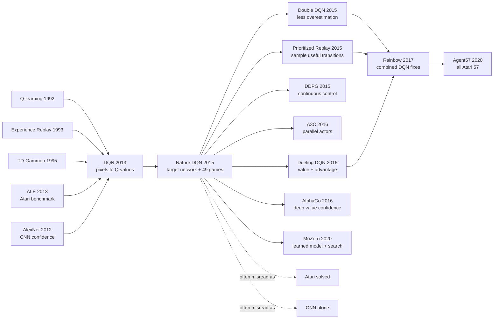

# Nature DQN - 让 Atari 成为深度强化学习的公开试金石

> **2015 年 2 月 26 日，DeepMind 的 Volodymyr Mnih、Koray Kavukcuoglu、David Silver 等 19 位作者在 *Nature* 发表 [Human-level control through deep reinforcement learning](https://doi.org/10.1038/nature14236)。** 这不是 2013 年 workshop 版 DQN 的简单扩写，而是一次把“像素到动作”推上公共舞台的系统证明：同一套卷积 Q 网络、replay memory 和 target network，在 49 个 Atari 游戏上击败此前 RL 方法中的 43 个，并在 29 个游戏上达到 75% 以上人类归一化分数。它让“human-level Atari”成为深度强化学习的招牌，也把 Montezuma's Revenge 这种 0 分尴尬留给了后来十年的探索研究。

## 一句话总结

Mnih、Kavukcuoglu、Silver、Rusu、Veness 等 19 位作者 2015 年发表于 *Nature* 的 Nature DQN，把 [2013 workshop DQN](2013_dqn.md) 从“7 个游戏上的可行性演示”扩展成深度强化学习的公开基准系统：输入是经最大池化去闪烁、灰度化并堆叠的 $84\times84\times4$ Atari 帧，网络一次前向输出所有动作的 $Q(s,a;\theta)$，训练目标是 $y=r+\gamma\max_{a'}\hat Q(s',a';\theta^-)$，再靠一百万帧 replay memory 和每 $C$ 步同步一次的 target network 把 deadly triad 压到可训练。它替代的 baseline 不是单个小模型，而是 ALE 早期的 Best Linear Learner、Contingency SARSA、Neural Fitted Q 等“手工特征或批量重训”路线：49 个游戏中 DQN 在 43 个上超过此前 RL 方法，在 29 个上达到超过 75% 的 human-normalized score，Breakout 从人类 31.8 打到 401.2，Boxing 达到 1707.9% human-normalized。真正的隐藏 lesson 也在反例里：同一系统在 Montezuma's Revenge 仍是 0 分、Private Eye 只有 2.5%，说明 Nature DQN 证明的是深度价值学习可以规模化，而不是探索、长期规划或通用智能已经解决；这条线后来一边长成 Double DQN、Prioritized Replay、Rainbow，一边通向 [AlphaGo](2016_alphago.md) 和 MuZero。

---

## 历史背景

### 2015 年的 RL 为什么需要一次公开胜利

2015 年 2 月的强化学习，处在一个很微妙的位置。理论上，RL 已经有 Sutton、Barto、Watkins、Dayan、Tesauro 等人打下的完整语言：价值函数、TD error、off-policy control、exploration、function approximation。生物学上，dopamine prediction error 和 temporal-difference learning 的类比也足够诱人。可是工程现实很冷：只要状态稍微高维一点、奖励稍微稀疏一点、函数近似稍微非线性一点，算法就容易发散、震荡或卡在愚蠢策略里。

深度学习这边正好相反。2012 年 [AlexNet](2012_alexnet.md) 已经证明 CNN 可以从原始像素里学出强表征，语音识别和视觉分类的“深度复兴”正在扩散；但监督学习的成功不能自动搬到 RL。监督学习的数据集是固定的，标签是外部给的；RL 的数据由策略自己制造，标签又来自价值函数自己 bootstrapping。一个小小的 Q 值高估，会改变下一批训练样本；下一批样本又会放大这个高估。RL 社区后来把 function approximation、bootstrapping、off-policy learning 的组合叫 deadly triad，DQN 正是把 CNN 塞进这个三角里的论文。

所以 Nature DQN 的历史作用不是“Atari 分数高一点”。它给出了一个公开、可传播、足够规模化的反例：在 49 个视觉游戏上，一个深度网络可以不靠手工对象、不读 RAM、不知道游戏规则，只看像素和分数学动作价值，并且没有立刻炸掉。

### 从 workshop DQN 到 Nature DQN

这篇 Nature 论文必须和 2013 年 arXiv / NeurIPS Deep Learning Workshop 的 [Playing Atari with Deep Reinforcement Learning](2013_dqn.md) 分开读。2013 版是第一击：7 个游戏，两层卷积，一个 replay buffer，证明“CNN + Q-learning + Atari pixels”不是完全不可行。Nature 版则是公开审判：49 个游戏、三层卷积、更强网络、显式 target network、统一超参数、专业人类测试员、30 次评估 episode、human-normalized score。

两者的差异不是“多跑了几个游戏”这么简单。2013 版的实现已经有 experience replay，但 target 仍然非常贴近当前网络，稳定性更多依赖 replay、RMSProp、reward clipping 和小心的工程设置。Nature 版把 target network 写进算法核心：每隔 $C$ 步把在线 Q 网络复制成 $\hat Q$，之后一段时间里都用旧网络算 Bellman target。这个延迟让“刚刚调高 $Q(s,a)$，下一秒 target 也被调高”的反馈环变慢，训练才有机会在 50M frames 和 49 个游戏上稳定下来。

Nature 版还改变了 DQN 的社会位置。Workshop 论文可以被看作 DeepMind 内部路线的早期信号；Nature 论文则被媒体、投资人、其他 AI 实验室和更广的科学界读到。“human-level control”这个标题很锋利，也很容易被误读，但它确实把 deep RL 从小圈子推到了深度学习复兴的主舞台。

### 直接逼出 Nature DQN 的前序工作

| 前序 | 已经给了什么 | Nature DQN 如何接上 | 留下的压力 |
|------|--------------|---------------------|------------|
| Watkins & Dayan 1992 Q-learning | off-policy Bellman control | 用 CNN 近似 $Q(s,a)$ | 非线性近似可能发散 |
| Lin 1993 experience replay | 存储并复用过去 transition | 一百万帧 replay memory | uniform sampling 不分重要性 |
| TD-Gammon 1995 | 神经价值函数可以赢复杂游戏 | 给深度价值函数心理背书 | backgammon 远比 Atari 结构化 |
| ALE 2013 | 统一 Atari benchmark 和 baseline | 49-game 公开评测舞台 | score 容易被协议细节影响 |
| 2013 workshop DQN | 从像素学 Q 值的可行性 | 扩展规模并加入 target network | 长程探索仍然薄弱 |
| Neural Fitted Q | 批量 Q-learning 的稳定路线 | 反衬 online replay SGD 的效率 | de novo 重训太贵 |

这张谱系里最容易被低估的是 ALE。没有 Arcade Learning Environment，DQN 可能只是一个“我们在 Breakout 上有 demo”的系统；有了 ALE，它才可以说同一套 algorithm、architecture、hyperparameters 面对一批不同游戏。benchmark 在这里不是附属品，而是把一个技巧升级成范式候选的装置。

另一个重要前序是失败本身。Tsitsiklis 与 Van Roy 早就说明过 TD learning 加 function approximation 会有发散风险；Bellemare、Veness、Bowling 的 Contingency / SARSA 系统也说明手工特征不是因为研究者保守，而是因为原始像素真的难。Nature DQN 的勇气在于，它没有先把 RL 改造成干净的监督学习，而是用 replay、target network、reward clipping、error clipping、frame stacking 把一个脆弱系统压到能跑。

### DeepMind 当时在做什么

2015 年的 DeepMind 刚被 Google 收购一年左右，仍然带着创业公司和认知科学实验室的混合气质。作者名单很长，且不是礼貌性堆名：Volodymyr Mnih 带来 Toronto / Hinton 系深度学习背景，Koray Kavukcuoglu 熟悉卷积网络和视觉表征，David Silver 是 RL 与博弈核心人物，Marc Bellemare 直接来自 ALE 生态，Martin Riedmiller 是 Neural Fitted Q 的代表，Alex Graves、Daan Wierstra、Shane Legg、Demis Hassabis 则体现 DeepMind 当时“从神经网络到通用智能”的野心。

Nature DQN 也是 DeepMind 叙事风格的雏形。它不只是报告一个算法，而是把算法放进一个更大的命题里：一个 agent 能否在最少先验下，从感知输入中学习多种控制技能？后来的 AlphaGo、AlphaZero、MuZero 都沿着同一种叙事推进：先选一个有清晰规则和强评测的游戏世界，把感知、价值、策略、搜索或模型学习压进一个系统，再用“同一套系统跨任务”的方式讲 generality。

这里也要看清边界。Nature DQN 不是多任务学习；论文为每个 Atari 游戏训练一个独立网络，只共享架构和超参数。它也不学习游戏规则，不做显式 planning，不迁移到新游戏。它证明的“general”是 recipe 层面的泛化，不是一个 agent 权重跨游戏泛化。

### 算力、数据与评测协议

论文输入来自 Atari 2600 的 $210\times160$、128 色、60Hz 原始画面，但网络实际吃的是预处理后的 $84\times84\times4$。预处理有一个很 Atari 的细节：为了消除 sprite 闪烁，作者对当前帧和上一帧取逐像素最大值，再取亮度通道并缩放到 84×84。四帧堆叠补足短期速度信息；frame skip $k=4$ 让 agent 每 4 帧选一次动作，跳过帧重复上一动作。

训练成本在当时已经不小：每个游戏训练 50M frames，约 38 天游戏经验；replay memory 保留最近 1M frames；minibatch 32；RMSProp；$\epsilon$ 从 1.0 在前 1M frames 线性退火到 0.1，之后保持 0.1；评估时 $\epsilon=0.05$，每个游戏 30 局，每局最多 5 分钟，并用 no-op starts 制造不同初始条件。今天看这些协议很具体，甚至有些繁琐，但正是这些细节让“human-level”不是随手挑一局录像。

human-normalized score 的公式也很关键：$100\times(\text{DQN}-\text{random})/(\text{human}-\text{random})$。这让不同游戏的原始分数可比较，但也引入了几个副作用：如果人类分数接近随机分数，归一化会被放大；如果游戏分数尺度奇怪，百分比会很戏剧化。Boxing 的 1707.9% 和 Video Pinball 的 2539.4% 很抓眼球，但真正的科学结论应该和 Montezuma's Revenge 的 0.0%、Private Eye 的 2.5%、Seaquest 的 25.9% 一起读。

## 研究背景与动机

### 要解决的不是“会玩 Breakout”，而是一个通用接口

Nature DQN 的动机可以压成一个接口问题：给定最近几帧图像 $\phi(s)$，能不能让一个神经网络直接输出所有离散动作的长期价值 $Q(\phi(s),a)$，然后用这个值函数驱动行为？这个接口绕开了两类旧路线。第一类旧路线先做视觉工程：背景减除、颜色通道、对象位置、contingency awareness，再把这些特征喂给线性 learner。第二类旧路线为了稳定，会做 fitted Q iteration，每轮在累积数据上重新训练网络，计算量很难扩到大规模视频。

DQN 选择的接口更野：不学显式模型，不预测下一帧，不读 RAM，不写对象检测器，也不为每个游戏调一套视觉特征。状态进 CNN，动作价值整排出来，策略就是 $\epsilon$-greedy。这个接口后来成为离散动作 value-based deep RL 的标准语法，也解释了它的局限：连续动作不能枚举，长程探索不能只靠 $\epsilon$-greedy，隐藏状态不能只靠 4 帧堆叠。

### 为什么必须引入 target network

如果只看公式，Q-learning 似乎很简单：把 $Q(s,a)$ 往 $r+\gamma\max_{a'}Q(s',a')$ 推。但神经网络版本里，预测值和 target 都来自同一个函数族，甚至常常来自同一个参数副本。一次梯度更新抬高了 $Q(s,a)$，也可能抬高下一状态所有动作的 $Q(s',a')$，于是 target 自己跟着上移。这个 moving target 在监督学习里很少见，在 deep RL 里却是日常。

Target network 的直觉是把老师和学生短暂分开：在线网络 $Q(\cdot;\theta)$ 每步更新，目标网络 $\hat Q(\cdot;\theta^-)$ 每隔 $C$ 步才从在线网络复制一次。在这 $C$ 步里，学生可以追一个相对固定的 target，而不是追自己的影子。这个设计不提供收敛证明，却大幅减少了震荡和正反馈，是 Nature DQN 相比 2013 版最关键的工程加固。

### “human-level” 这四个字的分量

“Human-level control”是这篇论文的传播核。严格说，论文里的 human-level 不是“所有游戏超过人类”，而是一个 operational definition：达到 75% 或以上的 professional human games tester score，被视为 broadly comparable。按这个定义，DQN 在 49 个游戏中的 29 个达到门槛；同时它在 Montezuma's Revenge、Private Eye、Frostbite、Asteroids、Bowling 等游戏上明显失败。

这个标题今天读起来需要降温，但不能因为它被营销化就低估它当年的科学分量。2015 年之前，RL 常常被视为低维控制、网格世界、小规模棋盘或手工特征系统；Nature DQN 把一个统一 recipe 放到 49 个视觉动态差异巨大的游戏上，给出了足够多的成功和足够清楚的失败。成功证明深度价值学习值得追，失败定义了接下来十年的问题单：exploration、memory、planning、sample efficiency、robust evaluation。

---

## 方法详解

### 整体框架

Nature DQN 的整体 pipeline 可以写成一句话：**把 Atari 最近 4 帧压成状态 $\phi(s)$，用三层卷积网络一次性输出所有合法动作的 Q 值，再从 replay memory 里随机抽 transition，用一个冻结一段时间的 target network 计算 Bellman 目标。** 它是 model-free、off-policy、value-based；不学习环境模型，不做显式 rollout，也不预测下一帧。

网络输入是 $84\times84\times4$，输出维度是当前游戏的合法动作数，介于 4 到 18。每个游戏训练一个独立网络，但架构和超参数保持一致。这个“同配方跨游戏”的约束，是论文科学叙事的核心：如果每个游戏都单独调结构，那么 Nature DQN 就只是 49 个工程系统；共享 recipe 才让它像一个通用算法。

| 部件 | Nature DQN 的设置 | 解决的问题 | 隐含代价 |
|------|-------------------|------------|----------|
| 预处理 $\phi$ | max over two frames、Y 通道、$84\times84$、4 帧堆叠 | 去闪烁、降维、补速度 | 丢色彩和细节 |
| Q-network | 3 conv + 512 FC + action outputs | 从像素到动作价值 | 只适合小离散动作 |
| Replay memory | 最近 1M frames，uniform minibatch 32 | 打散相关性、复用经验 | 不区分稀有关键样本 |
| Target network | 每 $C$ 步复制在线网络 | 降低 target 漂移 | target 仍然有延迟和偏差 |
| Reward / error clipping | reward 压到 $[-1,1]$，TD error 截断 | 统一尺度、稳住梯度 | 改变原始任务偏好 |

论文的核心损失是：

$$
L_i(\theta_i)=\mathbb{E}_{(s,a,r,s')\sim U(D)}\left[\left(y_i-Q(s,a;\theta_i)\right)^2\right]
$$

其中 target 是：

$$
y_i=\begin{cases}
r, & \text{if terminal} \\
r+\gamma\max_{a'}\hat Q(s',a';\theta_i^-), & \text{otherwise}
\end{cases}
$$

这两行公式把 DQN 的危险和美感都放在一起：label 不是数据集给的，而是旧网络和环境奖励临时生成的；优化像监督学习，数据和目标却都由 agent 自己牵动。

### 设计 1：全动作输出 Q-network —— 一次前向给出整排动作价值

**功能**：把 history-action value function 写成“状态输入、动作作为输出维度”的网络，而不是把状态和动作一起输入网络、每个动作单独跑一次。

Nature DQN 的架构比 2013 workshop 版更强。2013 版是 16 个 $8\times8$ stride 4 卷积、32 个 $4\times4$ stride 2 卷积、256 hidden units；Nature 版变成 32 / 64 / 64 三层卷积，再接 512 hidden units。这个变化很朴素，但对 49-game setting 很重要：网络容量和感受野都更足，能面对更复杂的画面和策略。

| 层 | kernel / stride | 输出通道或单元 | 角色 |
|----|-----------------|----------------|------|
| input | $84\times84\times4$ | 4 stacked frames | 短时历史状态 |
| conv1 | $8\times8$, stride 4 | 32 | 粗空间特征和运动线索 |
| conv2 | $4\times4$, stride 2 | 64 | 中层对象和局部动态 |
| conv3 | $3\times3$, stride 1 | 64 | 更细的局部组合 |
| fc | fully connected | 512 | 融合全局游戏状态 |
| output | linear | 4-18 actions | 每个动作一个 $Q$ 值 |

```python
class NatureDQN(nn.Module):
    def __init__(self, num_actions):
        super().__init__()
        self.encoder = nn.Sequential(
            nn.Conv2d(4, 32, kernel_size=8, stride=4), nn.ReLU(),
            nn.Conv2d(32, 64, kernel_size=4, stride=2), nn.ReLU(),
            nn.Conv2d(64, 64, kernel_size=3, stride=1), nn.ReLU(),
            nn.Flatten(),
            nn.Linear(64 * 7 * 7, 512), nn.ReLU(),
        )
        self.head = nn.Linear(512, num_actions)

    def forward(self, stacked_frames):
        return self.head(self.encoder(stacked_frames))
```

这个输出接口的计算优势很直接。假设一个游戏有 18 个动作，如果把动作也当输入，选择贪心动作需要 18 次前向；DQN 一次前向就得到全部 $Q(s,a)$。Atari 动作空间小，所以这个设计非常自然；也正因为动作空间小，它后来不能直接搬到连续控制，DDPG / TD3 / SAC 才会用 actor-critic 来处理不可枚举动作。

### 设计 2：Experience replay —— 把在线交互摊平成可训练数据流

**功能**：把 agent 最近经历过的 transition 存入 replay memory，更新时随机抽 minibatch，而不是按时间顺序用连续帧训练。

连续 Atari 帧高度相关，且当前策略决定下一个训练分布。如果 agent 最近学会一直向左，训练集就会被左侧局面支配；如果下一轮又因为价值误差转向右，训练分布会突然换边。直接在线 SGD 很容易把网络推入反馈环。Replay memory 的作用是把最近许多行为策略混合起来，让训练分布变成一个时间平均过的缓冲池。

$$
D_t=\{e_1,\ldots,e_t\},\quad e_t=(s_t,a_t,r_t,s_{t+1}),\quad (s,a,r,s')\sim U(D_t)
$$

| 不用 replay | 用 replay | 直接收益 | 副作用 |
|-------------|-----------|----------|--------|
| 连续样本强相关 | minibatch 随机抽样 | 降低梯度方差 | 仍不是严格 i.i.d. |
| 样本用一次就丢 | transition 可被复用 | 提高样本效率 | 需要大内存 |
| 当前策略支配训练集 | 多个旧策略混合 | 平滑分布漂移 | 旧经验可能过时 |
| online TD 容易振荡 | off-policy Q-learning 更新 | 减少灾难反馈 | 加重 off-policy 偏差 |

Nature 论文自己也承认 uniform replay 的局限：它不区分重要 transition，固定容量会覆盖旧经验，所有样本被等概率抽取。这个局限后来直接变成 Prioritized Experience Replay：让高 TD error 或更有学习价值的 transition 更常被采样。换句话说，Nature DQN 发明的不只是一个模块，也发明了一个值得继续优化的数据结构。

### 设计 3：Target network —— 给 Bellman 目标加一个时间缓冲

**功能**：用一个周期性复制的旧网络 $\hat Q$ 生成目标，避免预测值和 target 同时被同一次更新牵动。

在线 Q-learning 的深层版会遇到一种“追自己影子”的问题。更新 $Q(s,a;\theta)$ 时，target 里有 $\max_{a'}Q(s',a';\theta)$；如果同一个参数同时控制左右两边，那么提高当前估计也可能提高下一状态 target。Nature DQN 用 $\theta^-$ 把两者暂时分开：在线网络每步梯度下降，target network 每隔一段时间才同步。

```python
def dqn_loss(q_net, target_net, batch, gamma):
    states, actions, rewards, next_states, dones = batch
    q_values = q_net(states)
    q_sa = q_values.gather(1, actions[:, None]).squeeze(1)

    with torch.no_grad():
        next_q = target_net(next_states).max(dim=1).values
        targets = rewards + gamma * next_q * (~dones)

    td_error = targets - q_sa
    clipped_error = td_error.clamp(-1.0, 1.0)
    return -(clipped_error.detach() * q_sa).mean()
```

上面伪代码用截断 TD error 表达 Nature DQN 的稳定化精神；实际实现可以写成 Huber-style loss 或 clipped error update。关键不是某一行代码，而是 target 的来源：$\hat Q$ 不是当前网络，而是旧网络。

| 目标计算方式 | target 是否随当前更新立刻变化 | 稳定性 | DQN 里的位置 |
|--------------|-------------------------------|--------|---------------|
| Online Q-learning | 是 | 最容易振荡 | 被 Nature DQN 替代 |
| 2013 DQN prototype | 弱延迟或近似旧参数 | 可跑但脆 | workshop 第一击 |
| Nature target network | 每 $C$ 步才复制 | 明显更稳 | 49-game 主系统 |
| Double DQN | 选择动作和评估动作拆开 | 进一步降过估计 | 后续修补 |

Target network 的反直觉点在于，它引入“陈旧信息”反而让学习更好。监督学习通常希望 label 尽量新、尽量准；DQN 里 label 太新会跟着学生一起跑。旧 target 像一个临时脚手架，不完美，但足够固定。

### 设计 4：奖励裁剪、误差裁剪与 Atari 预处理 —— 用粗糙归一化换跨游戏鲁棒性

**功能**：把不同 Atari 游戏的分数尺度、像素 artefact、动作频率和梯度尺度压到同一个 recipe 下。

奖励裁剪是 Nature DQN 最有争议也最有效的工程选择之一。Atari 游戏分数尺度差异巨大：有的每次得分加 1，有的动辄上千。如果直接回归原始 reward，TD error 尺度会随游戏变化，学习率和梯度裁剪也要跟着调。DQN 在训练时把所有正奖励裁成 +1，负奖励裁成 -1，0 保持 0。

$$
\tilde r=\operatorname{clip}(r,-1,1),\quad \epsilon_t:1.0\rightarrow0.1\ \text{over first }10^6\text{ frames}
$$

| 工程旋钮 | 论文设置 | 解决的问题 | 代价 |
|----------|----------|------------|------|
| Reward clipping | 正数到 +1，负数到 -1 | 统一 TD target 尺度 | 丢失奖励大小信息 |
| Error clipping | TD error 截到 $[-1,1]$ | 防止梯度爆炸 | 大误差被线性处理 |
| Frame max | 当前帧与上一帧逐像素最大 | 消除 Atari sprite 闪烁 | 引入手工视觉假设 |
| Frame skip | $k=4$ | 加速训练并降低决策频率 | 可能错过短时事件 |
| No-op starts | 评估起始随机等待 | 减少固定开局 exploit | 仍非完全随机环境 |

这些设计有一种很强的 2015 年工程味道：它们不优雅，却让同一套系统跨 49 个游戏不崩。Nature DQN 的目标不是为每个游戏榨干 leaderboard，而是证明一个可复用 recipe 足够强。因此它宁可牺牲 reward 语义的细粒度，也要统一优化尺度。

### 训练循环与实现要点

Nature DQN 的训练循环短到可以写在一页里，但每一步都在处理 deep RL 的不稳定源：相关样本、移动 target、探索不足、奖励尺度混乱、像素 artefact、梯度尖峰。简化后的流程如下：

```python
for frame in range(total_frames):
    epsilon = exploration_schedule(frame)
    action = select_epsilon_greedy(q_net, state, epsilon)
    next_state, raw_reward, done = env.step(action, repeat=4)
    reward = clip(raw_reward, -1.0, 1.0)
    replay.add(state, action, reward, next_state, done)
    state = reset_if_done(next_state, done)

    if replay.ready() and frame % update_frequency == 0:
        batch = replay.sample(batch_size=32)
        loss = dqn_loss(q_net, target_net, batch, gamma=0.99)
        optimizer.zero_grad()
        loss.backward()
        optimizer.step()

    if frame % target_update_period == 0:
        target_net.load_state_dict(q_net.state_dict())
```

这段循环体现了 Nature DQN 的真正贡献：它不是一个单一公式，而是一组互相咬合的稳定化选择。CNN 负责从像素提取控制相关特征；Bellman target 把 reward 变成动作价值；replay 让数据流近似可训练；target network 让标签慢一点变化；reward 和 error clipping 让梯度尺度可控；统一评估协议让结果可比较。单独拿出任何一个模块都不神秘，组合起来才是 2015 年的突破。

---

## 失败案例

### 当时输给 Nature DQN 的对手

Nature DQN 的 baseline 不是某个随手搭的弱模型，而是 Atari RL 早期几条合理路线的集中代表。Best Linear Learner 用手工视觉特征加线性函数近似，Contingency SARSA 试图识别哪些屏幕区域受 agent 控制，Neural Fitted Q 系方法追求批量稳定性，2013 workshop DQN 则证明了 CNN + replay 的可行性但规模和稳定性都还不够。Nature DQN 把这些路线一起推到同一张 49-game 表里比较。

| Baseline | 核心做法 | 为什么当时合理 | 输给 DQN 的位置 |
|----------|----------|----------------|----------------|
| Best Linear Learner | 手工视觉特征 + 线性 value learner | 稳定、可解释、计算便宜 | 无法从 raw pixels 学复杂表征 |
| Contingency SARSA | 找受动作影响的区域再学习 | 利用 Atari 视觉先验 | game-specific prior 太重 |
| Neural Fitted Q | 累积数据后批量重训 Q 网络 | 避免在线 TD 震荡 | de novo 重训太贵 |
| 2013 DQN | CNN + replay 的七游戏 prototype | 第一次跨过像素门槛 | target 仍脆、评测太小 |
| Human tester | 专业玩家受控评测 | 给 human-normalized score 锚点 | 在部分反应型游戏被 DQN 超过 |

DQN 真正替代的是“先把感知问题手工做简单，再让 RL 处理低维状态”的工程常识。它不是说手工特征毫无价值，而是证明了一件更强的事：只要训练系统足够稳，reward signal 本身可以把卷积表征推向控制相关特征。

### 论文自己暴露的硬失败

最有价值的失败在 Extended Data Table 2 里。DQN 在 Breakout、Boxing、Video Pinball 这类游戏上很耀眼，但在需要长程探索、记忆、稀疏奖励或复杂任务结构的游戏上明显吃瘪。论文正文也点名 Montezuma's Revenge：需要 temporally extended planning 的游戏仍然是所有 agent 的 major challenge。

| 游戏 | DQN 分数 | 人类分数 | human-normalized | 暴露的问题 |
|------|----------|----------|------------------|------------|
| Montezuma's Revenge | 0.0 | 4367 | 0.0% | 稀疏奖励、钥匙门房间、长程探索 |
| Private Eye | 1788 | 69571 | 2.5% | 长期任务结构和记忆不足 |
| Frostbite | 328.3 | 4335 | 6.2% | 多阶段目标和稀疏反馈 |
| Asteroids | 1629 | 13157 | 7.3% | 复杂动态和长期生存 |
| Seaquest | 5286 | 20182 | 25.9% | 氧气、救人、敌人等多目标协调 |

这些失败让 Nature DQN 免于变成神话。它证明了 replay + target network 可以稳定 deep value learning，但也清楚展示：用 4 帧状态、$\epsilon$-greedy 探索、标量 Q 值和 clipped rewards，很难学会需要长程计划或稀有事件发现的游戏。

### Ablation 里的失败：少一个零件就会塌

论文的补充实验做了很重要的一件事：把 replay memory、separate target Q-network、deep convolutional architecture 逐个关掉，看系统怎么退化。这比单纯报 49-game 分数更有说服力，因为它说明 DQN 不是“CNN 自然会赢”，而是一组稳定化零件共同 work。

| 被关掉的部件 | 预期后果 | 为什么会坏 | 后续如何修补 |
|--------------|----------|------------|--------------|
| Replay memory | 分数下降或训练不稳 | 连续样本相关、分布反馈强 | prioritized / distributed replay |
| Target network | 震荡和发散风险上升 | target 跟当前网络一起移动 | Double DQN、soft target update |
| Convolutional encoder | 视觉表征变弱 | 线性层难从像素中抽控制特征 | 更深 CNN、ResNet、attention encoder |
| Reward / error clipping | 梯度尺度难统一 | 不同游戏分数尺度差异大 | value rescaling、distributional RL |

这里的 lesson 很朴素：deep RL 的成功经常不是来自一个“漂亮公式”，而是来自五六个不漂亮但必要的工程制动器。Nature DQN 把这些制动器放进同一个可复用系统里。

### 最反讽的反 baseline：human-level 不是 solved Atari

“Human-level”让论文出圈，也制造了后来的误读。按论文的定义，达到 75% professional human score 可以叫 broadly comparable；但这不是“所有 49 个游戏都超过人类”。DQN 在 29 个游戏上超过 75% 人类归一化分数，在 20 个游戏上低于这个门槛；在若干探索型游戏上甚至接近随机。

这个反差恰好是论文最重要的科学信息之一。DQN 擅长的是把视觉状态映射到短中期动作价值，尤其在奖励频繁、反应速度重要、策略可由局部 value gradient 慢慢塑形的游戏里很强。它不擅长的是“为了十分钟后的回报先做一串现在看起来没分的动作”。Montezuma's Revenge 的 0 分比 Breakout 的 1327.2% 一样重要，因为它告诉后来的研究者：深度价值学习可以进入 Atari，但 exploration 还没有被发明出来。

## 实验关键数据

### 49 游戏主表给出的核心结论

Nature DQN 的主结果可以用三句话概括：49 个游戏，同一算法和超参数；DQN 在 43 个游戏上超过此前最佳 RL 方法；在 29 个游戏上达到超过 75% 的 human-normalized score。Extended Data Table 2 的价值在于，它同时列出 random play、Best Linear Learner、Contingency SARSA、human、DQN 和 normalized DQN，读者能看到成功和失败的形状。

| 游戏 | Random | Best Linear | Contingency SARSA | Human | DQN | DQN % Human |
|------|--------|-------------|-------------------|-------|-----|-------------|
| Breakout | 1.7 | 5.2 | 6.1 | 31.8 | 401.2 | 1327.2% |
| Boxing | 0.1 | 44.0 | 9.8 | 4.3 | 71.8 | 1707.9% |
| Video Pinball | 16257 | 16871 | 19761 | 17298 | 42684 | 2539.4% |
| Beam Rider | 363.9 | 929.4 | 1743 | 5775 | 6846 | 119.8% |
| Space Invaders | 148 | 250.1 | 267.9 | 1652 | 1976 | 121.5% |
| Q*bert | 163.9 | 613.5 | 960.3 | 13455 | 10596 | 78.5% |
| Seaquest | 68.4 | 664.8 | 675.5 | 20182 | 5286 | 25.9% |
| Frostbite | 65.2 | 216.9 | 180.9 | 4335 | 328.3 | 6.2% |
| Private Eye | 24.9 | 684.3 | 86.0 | 69571 | 1788 | 2.5% |
| Montezuma's Revenge | 0.0 | 10.7 | 259 | 4367 | 0.0 | 0.0% |

这张缩表已经足够说明 DQN 的双重性：它在一些游戏上不是“接近人类”，而是远超人类归一化分数；但它也没有形成跨任务抽象规划能力。强反应策略和长程探索之间的裂缝，在这里第一次被大规模照亮。

### 为什么 43/49 和 29/49 都重要

43/49 回答的是算法史问题：DQN 是否超过了此前 Atari RL 方法？答案基本是是。它击败的大多是手工特征、线性 learner、contingency-aware SARSA 或其他较浅方法，因此这个数字支持“深度端到端 value learning 值得成为新基线”。

29/49 回答的是智能体叙事问题：DQN 是否达到人类可比水平？答案是部分达到。75% threshold 本身有任意性，但它给了一个清楚门槛，让论文能避免只挑几个漂亮游戏讲故事。最值得注意的是，这两个数字不是同一件事：超过旧 RL baseline 容易一些，接近人类难很多；接近人类也不意味着策略有人的抽象、记忆或探索能力。

### 表征可视化和价值函数证据

论文不只给分数，还展示了 learned representation。Space Invaders 的 t-SNE 可视化显示，DQN 最后一层 hidden representation 会把感知上相似的状态放近，也会把预期 reward 接近但视觉上不同的状态放近。这个结果不是严格机制解释，但它支持一个关键论断：CNN 的中间表征不是只在做图像压缩，而是在朝 value-relevant organization 变化。

Breakout 和 Seaquest 的 value visualization 也很有时代感。作者展示平均 predicted Q-value 如何随训练上升，以及某些关键事件附近 value 如何变化：Breakout 里球接近打砖得分时 value 上升，丢球时下降；Seaquest 里敌人、鱼雷、氧气和得分事件影响价值估计。今天看这些图会觉得朴素，但在 2015 年它们回答了一个真实疑问：这个网络是不是只在背像素模式，还是学到了和未来 reward 有关的状态组织？

### 能从实验推出什么，不能推出什么

能推出的结论很强：同一套深度 Q-learning recipe 可以在几十个高维视觉控制任务上稳定训练；卷积表征可以由 reward 端到端塑形；replay 和 target network 是 deep RL 的基础设施；Atari 可以成为算法比较的公共语言。

不能推出的结论也同样重要。第一，Nature DQN 没有解决 sample efficiency：50M frames 是巨量交互。第二，它没有解决 exploration：Montezuma's Revenge 0 分。第三，它没有解决泛化：每个游戏单独训练一个网络。第四，它没有解决 planning：它只是从 bootstrapped value 里隐式折未来。第五，human-normalized score 不是认知等价：DQN 可以在反应型游戏上超人类，也可以在需要记忆和目标结构的游戏里像随机策略一样无助。

Nature DQN 的实验因此最好被读成一个“足够强的开场证明”，不是终局答案。它把问题从“深度网络能不能进 RL”推进到“怎样让 replay 更聪明、target 更少偏、exploration 更有效、评测更公平、模型更省样本”。这就是后续十年 deep RL 论文的共同起点。

---

## 思想史脉络



### 前世（被谁逼出来的）

Nature DQN 的前世有五条线。第一条是 **Q-learning**：Watkins 和 Dayan 给了 off-policy Bellman optimality 方程，让行为策略可以探索，学习目标仍指向贪心策略。第二条是 **experience replay**：Lin 在机器人 RL 里提出存储和复用过去经验，DQN 把它变成稳定深度网络的基础设施。第三条是 **TD-Gammon**：Tesauro 证明神经 value function 可以在复杂游戏里产生惊人策略，给后来的深度价值函数一个历史先例。

第四条是 **ALE**。这条线尤其关键，因为它给 DQN 提供了可复现、可横向比较、足够多样但又足够便宜的世界。ImageNet 让 CNN 有了共同战场，ALE 则让 deep RL 有了类似的 Atari 战场。第五条是 **AlexNet 之后的 CNN 信心**：如果卷积网络已经能从 ImageNet 原始像素学视觉层次，那么也许它能从 reward signal 里学到 paddle、ball、enemy、oxygen、bullet 这些对控制有用的隐式对象。

2013 workshop DQN 是这些线第一次合流；2015 Nature DQN 是合流后的制度化版本。它把 target network、49-game protocol、human-normalized score 和 extended ablations 放进去，让“像素到 Q 值”从一个可行 demo 变成领域基线。

### 今生（继承者）

Nature DQN 的后代可以分成四类。第一类是**稳定性修补**：Double DQN 修 Q 值过估计，Prioritized Replay 修 uniform sampling，Dueling Network 拆 value 和 advantage，Distributional RL 不再只预测期望，Rainbow 把这些改进组合成一个更强 Atari agent。

第二类是**动作空间扩展**：DDPG、TD3、SAC 借走 replay 和 target network，但把离散动作 argmax 改成 actor-critic。第三类是**并行和分布式扩展**：A3C 证明不用 replay 也能靠并行 actor 稳定训练，Ape-X / R2D2 / Agent57 把 replay、recurrent state、exploration 和大规模 actor 混合起来。第四类是**搜索和模型学习**：AlphaGo 借深度 value function 的信心进入围棋，MuZero 把 DQN 的 Atari 线和 AlphaZero 的 search 线重新接上。

| 继承路线 | 代表工作 | 从 Nature DQN 继承什么 | 修的新问题 |
|----------|----------|------------------------|------------|
| 稳定 value learning | Double DQN / Rainbow | replay、target network、Atari protocol | 过估计、采样效率、价值分布 |
| 连续控制 | DDPG / TD3 / SAC | target network + replay | 动作不可枚举 |
| 分布式 RL | Ape-X / R2D2 / Agent57 | 大 replay + Q-learning | 吞吐量、记忆、探索 |
| 异步 actor | A3C / IMPALA | deep RL 从像素学控制的目标 | 摆脱单机 replay bottleneck |
| 搜索与模型 | AlphaGo / MuZero | 深度价值函数可承担决策核心 | 显式 planning 和 latent dynamics |

Nature DQN 对 AlphaGo 的影响不是“Q-learning 被搬到了围棋”。AlphaGo 的主角是 policy network、value network 和 MCTS。但 DQN 给了 DeepMind 一个组织信念：深度网络可以从高维状态学出可用于决策的 value estimate。这个信念在 2016 年的 AlphaGo 里变成了 $v_\theta(s)$，在 2020 年的 MuZero 里又变成了 latent value / policy / reward prediction。

### 误读 / 简化

第一个误读是：**Nature DQN = CNN + Q-learning**。这句话太短。真正让系统 work 的是 CNN、frame stacking、experience replay、target network、reward clipping、error clipping、epsilon schedule、no-op starts 和统一评测协议的组合。只把 CNN 接到 online Q-learning 上，得到的很可能是震荡或崩溃。

第二个误读是：**DQN 解决了 Atari**。Nature DQN 的确让 Atari 成为 deep RL 的公共 benchmark，但它没有解决所有 Atari 任务。Montezuma's Revenge、Private Eye、Frostbite 这类游戏说明，稀疏奖励和长程探索仍然是硬问题。真正意义上“全 57 游戏超过人类 benchmark”的叙事，要等到 Agent57 这样的复杂系统。

第三个误读是：**human-normalized score 就是智能水平**。归一化分数有用，但它混合了随机 baseline、人类测试协议、游戏分数尺度和 agent 行为鲁棒性。Boxing 的 1707.9% 很醒目，却不能说明 DQN 在抽象策略上比人类强；Montezuma 的 0 分也不能抹掉 DQN 在反应型 value learning 上的突破。

第四个误读是：**reward clipping 是无害归一化**。它确实让 49-game recipe 可行，但它把 +1 和 +100 都压成 +1，改变了优化目标。这个取舍在 Atari benchmark 里有效，在金融、医疗、机器人或安全任务里就可能把价值函数教偏。DQN 的长期价值不是这套具体超参数，而是一个系统范式：用可复用经验、慢变化 target 和深度表征，把感知和控制放进同一个训练回路。

---

## 当代视角

### 2026 年回看：DQN 从算法变成了深度 RL 的基础设施模板

从 2026 年回看，Nature DQN 的具体分数已经不再惊人。Rainbow、Ape-X、R2D2、Agent57、MuZero、Dreamer 系列、EfficientZero，以及大量 model-based / offline / representation-learning 方法，都能在 Atari 上给出更强结果。DQN 的三层 CNN 也像教学模型：没有 residual connection，没有 recurrence，没有 distributional value，没有 intrinsic motivation，没有 transformer，也没有大规模分布式训练。

但这不削弱它的地位，因为它留下的是一个基础设施模板：**感知 encoder + replay buffer + bootstrapped target + target network + 统一 benchmark protocol**。这个模板后来被 continuous control、offline RL、robotics、recommendation、game AI、sim-to-real、world model 反复改写。许多现代方法已经不用“DQN”这个名字，但仍然在处理它系统化提出的问题：经验怎么存、target 怎么稳、off-policy data 怎么用、价值估计怎么不过度自信、探索数据怎么覆盖稀有状态。

Nature DQN 也是 deep RL 的公共语言源头之一。今天说“replay buffer”“target network”“Atari 100k”“human-normalized score”“sticky actions”“no-op starts”，其实都是在沿着 DQN 打开的评测和系统词汇继续对话。

### 哪些假设站不住了

| 2015 年隐含假设 | 当时为什么合理 | 2026 年的问题 | 现代修正 |
|---|---|---|---|
| 4 帧堆叠足够代表状态 | Atari 多数动态短期可见 | 记忆、任务阶段和隐藏变量常常超过 4 帧 | recurrent agents、transformer memory、belief state |
| $\epsilon$-greedy 可承担探索 | 简单、通用、无需额外模型 | 稀疏奖励游戏几乎走不出起点 | intrinsic reward、count-based、episodic memory、Go-Explore |
| clipped reward 是通用归一化 | 让 49-game 共享学习率 | 改变任务偏好，损失奖励强度 | value rescaling、distributional targets、task-aware normalization |
| 同一 recipe 跨游戏就是 generality | 当时手工特征 baseline 很强 | 每个游戏仍单独训练，不会迁移 | multi-task RL、meta-RL、foundation agents |
| Atari 可以代表通用控制 | 便宜、可复现、视觉丰富 | 离真实物理、语言目标和安全约束很远 | robotics、embodied AI、web agents、world models |

这些假设不是“错得离谱”。它们是 2015 年把 deep RL 推过门槛的必要简化。问题在于，门槛一过，简化就会变成天花板：4 帧状态挡住记忆，$\epsilon$-greedy 挡住探索，clipped reward 挡住精细偏好，单游戏训练挡住泛化。

### 时代证明的关键 vs 冗余

留下来的关键设计有三件。第一，**replay 是数据基础设施**。不管是 prioritized replay、distributed replay、offline RL dataset，还是 diffusion policy 里的 demonstration buffer，核心都是把交互经验变成可抽样、可复用、可审计的数据资产。第二，**target 需要慢一点**。无论是 DQN 的 hard target copy，DDPG/TD3/SAC 的 soft target update，还是 bootstrapped world model 里的 slow-moving teacher，大家都在处理同一个 moving-target 问题。第三，**评测协议会塑造研究议程**。DQN 把 Atari 变成 deep RL 的 ImageNet，也让 Atari 的偏差长期影响算法审美。

冗余或被替换的部分也很多。三层 CNN 不是核心；uniform replay 很快被 prioritized / distributed replay 改造；scalar expected Q 被 distributional RL 改写；$\epsilon$-greedy 不足以处理 hard exploration；单任务训练不符合今天对泛化的期待；50M frames 的样本消耗也很难在真实机器人或昂贵环境里接受。

最值得保留的是系统观。Nature DQN 的贡献不是某个数学 theorem，而是把一批彼此制衡的工程选择排成稳定回路。后来的 deep RL 论文只要认真做系统，仍然在继承这种手艺。

### 作者当时没想到的副作用

第一个副作用是 Atari benchmark 的统治。DQN 之后，许多 deep RL 论文都把 Atari 分数当作默认入场券。这让算法可比较，也让领域一度过度围绕像素游戏、human-normalized score 和单机 simulator 打转。sticky actions、随机 no-op、human starts、Atari 100k 等后续协议修订，本质上是在修 DQN 时代 benchmark 带来的评测捷径。

第二个副作用是 replay buffer 变成了“数据集化 RL”的前身。DQN 还在 online interaction 里采样，但它已经把经验从时间流里抽出来，放进一个可重复采样的数据结构。offline RL、batch RL、RLHF 里的 preference buffer、robotics demonstration dataset，都可以从这个角度和 DQN 连起来读。

第三个副作用是 deep RL 的宣传语言变得非常大胆。“Human-level control”帮助领域出圈，也让外界容易把 benchmark performance 和 general intelligence 混为一谈。这个副作用不是论文作者单独造成的，但 Nature DQN 的传播确实把 RL 带进了更大的期待周期。

第四个副作用是探索研究被重新定义。DQN 的成功告诉大家，简单反应型 value learning 很强；DQN 的 0 分告诉大家，稀疏奖励探索是另一个问题。Count-based exploration、curiosity、RND、episodic control、Go-Explore、Agent57，很大程度上都在回答 Montezuma's Revenge 留下的空白。

### 如果今天重写 Nature DQN

如果 2026 年重写 Nature DQN，我不会只把 CNN 换成更大网络。更重要的是重写协议和问题定义。第一，要明确区分 sample efficiency、final performance、generalization、exploration 和 wall-clock cost；一个 50M-frame 分数表不够。第二，要加入 Atari 100k 或少样本设置，避免只奖励巨量交互。第三，要报告 sticky actions、随机化起始状态、不同 seed 和人类评测协议，减少 exploit 和归一化偶然性。

方法上，我会保留 replay + slow target 的骨架，但把价值表示换成 distributional 或 ensemble，探索加入 intrinsic reward 或 episodic novelty，encoder 使用更现代的 residual / attention / self-supervised pretraining，部分游戏用 recurrent state。对于长程任务，单纯 Q-learning 可能要和 planning、world model 或 hierarchical policy 接起来。

最重要的是，我会把“human-level”标题写得更谨慎。更好的命题也许是：“Scalable visual value learning from pixels across Atari.” 这不如 Nature 标题抓人，却更准确。但也正因为原标题抓人，DQN 才在科学史上留下了这么深的痕迹。

## 局限与展望

### 作者承认 / 正文暴露的局限

论文自己承认了几类限制。Reward clipping 会让 agent 无法区分不同幅度的奖励；uniform replay 不区分重要 transition；有限 replay memory 会覆盖旧经验；需要 temporally extended planning 的游戏仍然是 major challenge；超参数只是用 Pong、Breakout、Seaquest、Space Invaders、Beam Rider 做 informal search，并没有系统 grid search。

还有一些限制藏在协议里。每个游戏训练一个单独网络，因此没有跨游戏迁移；训练需要 50M frames，因此样本效率很低；evaluation 用 5 分钟上限和 $\epsilon=0.05$，不等同于完整游戏掌握；life counter 被用于训练 episode 终止，说明 agent 并非完全只看像素和分数。

这些限制并不削弱论文贡献，反而让它更真实。Nature DQN 的价值不是完美，而是把一组此前分散的问题集中暴露在同一个系统里。

### 2026 视角下的新局限

今天看，Nature DQN 最大的新局限是泛化。一个真正的通用 agent 不应只共享 algorithm recipe，而应该能跨游戏、跨视觉风格、跨任务指令迁移。DQN 的每游戏独立训练很难承担这个期待。

第二个新局限是数据效率和现实成本。38 天游戏经验在 emulator 里便宜，在机器人、药物设计、工业控制或人机交互里不可接受。现代 RL 越来越关心离线数据、模拟到现实、模型学习和保守更新，正是因为 online trial-and-error 太贵。

第三个新局限是目标表达。Atari 的 reward 是单一分数，动作空间离散，安全代价低；真实任务常常有多目标、人类偏好、约束、不可逆错误和语言指令。DQN 的标量 clipped reward 很难表达这些结构。

### 改进方向（已被后续工作证实）

- **降低 Q 值偏差**：Double DQN、clipped double Q、ensemble Q 都证明，max over noisy values 会系统性高估。
- **让 replay 更聪明**：Prioritized Replay、Ape-X、R2D2、offline RL dataset 都把 replay 从 uniform buffer 扩展成数据系统。
- **改进价值表示**：C51、QR-DQN、IQN、Rainbow 说明预测 return distribution 比只预测期望更有信息。
- **补足探索**：count-based exploration、RND、Go-Explore、Agent57 直接回应 Montezuma's Revenge 的 0 分。
- **引入记忆和模型**：DRQN、world models、Dreamer、MuZero、EfficientZero 说明 4 帧反应式 value function 不是终点。
- **重写评测协议**：sticky actions、Atari 100k、多 seed、human starts、Procgen 等都在修复单一 Atari 分数的盲点。

## 相关工作与启发

### 和 AlphaGo / Rainbow / MuZero / Agent57 的关系

Nature DQN 和 [AlphaGo](2016_alphago.md) 的关系不是算法继承，而是信念继承。DQN 证明深度 value function 可以从高维状态支撑决策；AlphaGo 把 value network 放进 MCTS，让价值估计成为搜索的评估器。一个是 model-free Atari，另一个是 model-based search in Go，但组织信念相通。

Rainbow 是 DQN 的“修补集合”：Double DQN、Prioritized Replay、Dueling Network、Multi-step Return、Distributional RL、Noisy Nets 合在一起，把 Nature DQN 的每个脆弱点补一块。它说明 DQN 的框架很强，也说明原始 DQN 离最终 Atari recipe 还很远。

MuZero 则是 DQN 和 AlphaZero 的后代重组。它像 DQN 一样不需要外部提供规则模型，又像 AlphaZero 一样用 search 做 policy improvement；不同的是，它学习 latent dynamics，而不是只学 $Q(s,a)$。如果说 Nature DQN 证明“从像素可以学价值”，MuZero 证明“从像素可以学一个足够用于规划的 latent interface”。

Agent57 是对 Nature DQN 失败表的迟到回答。它把 distributed replay、recurrent state、intrinsic motivation、meta-controller 等复杂机制组合起来，最终在 Atari 57 上整体超过 human benchmark。它的存在说明 DQN 的 2015 标题既有预见性，也有提前量：human-level Atari 要比三层 CNN + replay + target network 复杂得多。

### 资源

- 论文：Volodymyr Mnih、Koray Kavukcuoglu、David Silver、Andrei A. Rusu、Joel Veness、Marc G. Bellemare、Alex Graves、Martin Riedmiller、Andreas K. Fidjeland、Georg Ostrovski、Stig Petersen、Charles Beattie、Amir Sadik、Ioannis Antonoglou、Helen King、Dharshan Kumaran、Daan Wierstra、Shane Legg、Demis Hassabis 等 19 位作者，[*Human-level control through deep reinforcement learning*](https://doi.org/10.1038/nature14236), *Nature* 518, 529-533, 2015。
- DeepMind DQN 页面与代码：[sites.google.com/a/deepmind.com/dqn](https://sites.google.com/a/deepmind.com/dqn/)。
- 建议连读：[DQN 2013](2013_dqn.md) 看 workshop 原型，[AlexNet](2012_alexnet.md) 看 CNN-on-pixels 信心来源，[AlphaGo](2016_alphago.md) 看深度价值函数如何进入搜索，Rainbow 看 DQN 系修补，MuZero 看无规则模型的规划路线。

最值得带走的一句话是：Nature DQN 没有让智能体真正理解 Atari，但它让 RL 第一次拥有了一个能被整个深度学习时代共同调试的系统接口。Replay buffer 是记忆，target network 是刹车，CNN 是感知，Bellman target 是自举监督；这四件东西接在一起，deep RL 才从愿景变成工程现实。


---

> 🌐 [English version](/en/era2_deep_renaissance/2015_dqn_nature/) · 📚 awesome-papers project · CC-BY-NC