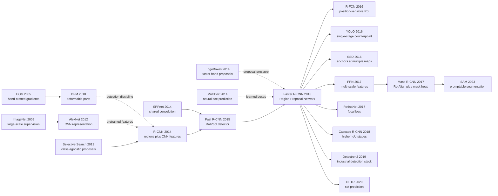

# Faster R-CNN — 用 RPN 把候选框也学进网络

> **2015 年 6 月 4 日，Shaoqing Ren、Kaiming He、Ross Girshick、Jian Sun 四位作者把 [arXiv:1506.01497](https://arxiv.org/abs/1506.01497) 挂上来。** 这篇 NeurIPS 2015 论文的狠处不是又做了一个更准的 detector，而是把目标检测里最慢、最像传统视觉遗产的环节——selective search 候选框——也变成了网络内部的一层。R-CNN 时代每张图约 2000 个外部 proposals，Fast R-CNN 仍要等 CPU 跑完；Faster R-CNN 用 RPN 在共享特征图上同时问「这里有没有物体」和「框该怎么挪」，只保留约 300 个 proposals，VGG-16 仍能做到约 5 fps。从这一刻开始，two-stage detection 不再是慢而准的学术 pipeline，而成了工业视觉系统可复用的骨架。

## 一句话总结

Ren、He、Girshick、Sun 2015 年发表在 NeurIPS 的 Faster R-CNN，用 **Region Proposal Network** 把 [R-CNN（2014）](2014_rcnn.md) 和 Fast R-CNN 里外置的 selective search 改写成一个可训练模块：在共享卷积特征图每个位置放 $k=9$ 个 anchors，同时预测 objectness $p_i$ 和边框偏移 $t_i$，优化 $L = L_cls(p_i,p_i*) + lambda p_i* L_reg(t_i,t_i*)$。它替代的失败 baseline 很明确：R-CNN 每张图约 2000 个 proposal 且需逐框 CNN 前向，Fast R-CNN 虽共享 CNN，却仍被 selective search 的约 2 秒 CPU 延迟卡住；Faster R-CNN 用约 300 个学习式 proposals 把 VGG-16 检测系统推到约 5 fps，并在 VOC 2007 达到约 73.2 mAP。后续 [ResNet（2015）](2015_resnet.md) 给它更强 backbone，[Mask R-CNN（2017）](../era3_attention/2017_mask_rcnn.md) 直接在其上加 mask head，[FPN（2017）] 把多尺度问题补齐。反直觉点在于：Faster R-CNN 的革命不是「删掉 proposal」，而是证明 proposal 也可以是网络内部的、几乎零边际成本的中间表示。

---

## 历史背景

### 2015 年的目标检测卡在什么地方

Faster R-CNN 出现前，目标检测刚刚经历了一次由 [R-CNN](2014_rcnn.md) 发起的范式切换：从 HOG/DPM 手工部件，转向 region proposal + CNN feature。这个切换非常有效，却留下一个尴尬的系统裂缝：检测器已经是深度网络，proposal 仍然是传统视觉算法。R-CNN 每张图先用 selective search 生成约 2000 个候选框，再把每个框 warp 成固定大小逐个跑 CNN；Fast R-CNN 把整张图的卷积特征共享起来，检测头也合进一个 multi-task network，但它仍然要等待 selective search 在 CPU 上生成候选框。

这意味着 2015 年的检测 pipeline 有一种很不协调的形态：最贵的表示计算已经被 GPU 和 CNN 接管，最前面的搜索空间压缩却还靠颜色、纹理、边缘合并规则。Fast R-CNN 的网络前向已经很快，真正拖慢系统的反而是一个不参与学习、不能反向传播、不能随数据变好的外部模块。论文标题里写 real-time，不是因为作者只关心速度；它指的是检测系统终于要摆脱这个外置瓶颈。

更微妙的是，proposal 不是随便能删的东西。R-CNN 系列的成功恰恰依赖 proposal 把 dense detection 的巨大搜索空间缩成几百到几千个候选区域。如果直接回到 sliding window，计算量和类别不平衡会再次爆炸；如果继续保留 selective search，检测器永远不是一个完整学习系统。Faster R-CNN 要解决的就是这个夹缝：**保留 proposal 的稀疏搜索优势，同时让 proposal 本身变成网络的一部分。**

### 直接逼出 Faster R-CNN 的前序工作

| 前序工作 | 已解决的问题 | 留下的缺口 | Faster R-CNN 的继承方式 |
|----------|--------------|------------|--------------------------|
| DPM / HOG | 检测评测纪律、hard negative mining、NMS | 表示能力被手工特征封顶 | 保留检测的正负样本与 NMS 语言，替换为 CNN backbone |
| Selective Search | 高召回类别无关候选框 | CPU 慢、不可学习、不可端到端 | 把 proposal 角色交给 RPN |
| R-CNN 2014 | 证明 ImageNet CNN feature 能打穿 PASCAL 平台期 | 每个 proposal 独立 CNN 前向，13s/image | 继承 region-based detection 语言 |
| SPPnet 2014 | 共享卷积特征、区域池化 | 训练仍分阶段，proposal 仍外置 | 提供 shared conv feature 的技术基础 |
| Fast R-CNN 2015 | RoIPool + softmax + bbox regression 合成一个 detector | selective search 仍是 2s 级瓶颈 | Faster R-CNN 直接把它作为第二阶段检测头 |
| Edge Boxes / MultiBox | 更快或更学习式的 box 生成尝试 | 仍没有和 detector 形成统一共享网络 | 证明 proposal 可以被重新设计 |

这几条线把问题推到非常清楚的位置：检测社区已经知道 CNN 表示有效，知道 RoI pooling 能共享计算，也知道 proposal 的质量决定下游检测上限。缺的是一个模块，能在同一张 feature map 上又快又准地产生候选框。

### 作者团队当时在做什么

四位作者的组合本身就解释了论文为什么长成这样。Shaoqing Ren、Kaiming He、Jian Sun 来自 MSRA，刚刚做完 SPPnet，并且很快会用同一条视觉系统线打 ILSVRC 2015；Ross Girshick 则是 R-CNN 和 Fast R-CNN 的核心作者，对检测 pipeline 的每个慢点都很清楚。Faster R-CNN 不是一个外部团队对 R-CNN 的修补，而是 R-CNN、SPPnet、Fast R-CNN 三条线在同一篇论文里的会合。

这也解释了论文里少见的工程克制。作者没有把检测问题改造成一个完全新范式，而是只动了最卡的组件：proposal generation。Fast R-CNN 的 RoIPool、classification head、bbox regression、NMS 基本保留；新东西集中在 RPN。换句话说，论文的设计哲学是：**不重写已经证明有效的 detector，只把外置 proposal 这个系统断点搬进网络。**

这条连续工作线很快又和 ResNet 接上。2015 年 MSRA 同时在做 Faster R-CNN 和 ResNet，后来 ILSVRC 2015 detection/localization 里，RPN 提供检测框架，ResNet 提供强 backbone。Faster R-CNN 因此不只是单篇 detection 论文，也是一套 ImageNet 时代视觉系统工程的核心组件。

### 工业界、算力与数据的状态

2015 年的硬件条件刚好让这个问题变得迫切。单张 NVIDIA K40/Titan X 已经能跑 VGG-16 级 CNN，但要对每张图等待 CPU selective search 两秒，GPU 反而经常在等前处理。对自动驾驶、视频监控、机器人、移动端视觉来说，检测器不能只在 leaderboard 上好看；它必须接近视频帧率，至少要让 GPU 主干保持连续工作。

数据也进入了多基准竞争期。PASCAL VOC 仍是可解释、可复现的主战场；ILSVRC detection 把类别数扩到 200；MS COCO 则开始用更密集、更小物体、更复杂场景逼检测器升级。proposal 质量不再只是召回率问题，而是速度、尺度、类别不平衡和下游 box regression 的共同瓶颈。

框架层面，Caffe 仍是主流，PyTorch 尚未发布。Faster R-CNN 的开源实现后来以 MATLAB/Caffe 和 py-faster-rcnn 形态传播，直接影响了 Detectron、MMDetection 等后续工具箱。它能迅速成为默认 baseline，一个重要原因是工程接口清晰：backbone、RPN、RoI head 三块可以独立替换。

## 研究背景与动机

### Proposal bottleneck 的真实矛盾

Fast R-CNN 已经把 R-CNN 里最显眼的计算浪费修掉：整张图只跑一次 CNN，RoIPool 从共享 feature map 中抽每个 proposal 的特征，softmax 分类和 bbox regression 也能 joint training。可是系统端到端耗时并没有按比例下降，因为 selective search 仍然在网络外面。论文里最关键的工程观察是：**当 detector 变快以后，proposal generator 从辅助模块变成了主瓶颈。**

这个瓶颈不是单纯优化 C++ 就能解决的。Selective search 的规则来自颜色相似度、纹理相似度、区域合并层级；它不知道当前 backbone 学到了什么，也不知道某个数据集上哪些形状、尺度、长宽比更有用。R-CNN 家族越强，外置 proposal 越像一块不能学习的天花板。

### RPN 的切入角度

RPN 的攻击角度非常直接：既然卷积特征图已经编码了整张图的空间语义，就让一个小网络在这张 feature map 上滑动，直接预测每个位置附近是否有物体，以及对应框该如何调整。这样 proposal 不再是图像前处理，而是 detector 的一个全卷积分支。

这一步有两个关键选择。第一，RPN 和 Fast R-CNN 共享 backbone 卷积特征，proposal 的边际成本接近一个小 head。第二，RPN 不直接预测任意框，而是在每个位置放一组 anchors，用分类和回归去选择、修正这些 anchors。anchors 把连续空间的 box 搜索离散成可训练的局部分类/回归问题，让 SGD 可以稳定处理。

### 核心矛盾：稀疏搜索与端到端学习

目标检测需要稀疏搜索，因为绝大多数位置都是背景；目标检测也需要端到端学习，因为手工搜索规则会变成系统上限。Faster R-CNN 的核心动机就是把这两件看似矛盾的东西合在一起：RPN 仍然输出少量 proposals，保持 two-stage detector 的高精度；但 proposals 来自共享 feature map，能随 backbone 和数据一起优化。

这也是论文最反直觉的地方。它没有像后来 YOLO 那样说 proposal 是多余的，而是说 proposal 太重要了，不能再交给手工算法。Faster R-CNN 的历史定位正是在这里：它是 two-stage detection 最成熟的形态，而不是 single-stage detection 的前夜。

### 论文想证明的事

作者实际要证明四件事。第一，RPN 产生的 proposals 能在召回率上接近或超过 selective search。第二，RPN 的计算成本足够低，不会抵消共享 CNN 的收益。第三，RPN 与 Fast R-CNN 的 shared features 不会互相伤害，反而能互相强化。第四，只用约 300 个 learned proposals，检测 mAP 仍能超过使用约 2000 个 hand-crafted proposals 的系统。

这四件事合起来才是 Faster R-CNN 的贡献。单独看，RPN 是一个 proposal 网络；放在系统里，它把检测 pipeline 从「CNN detector + 传统 proposal」变成「shared backbone + learned proposal + RoI detector」。这个接口后来几乎定义了现代两阶段检测器。

---

## 方法详解

### 整体框架

Faster R-CNN 的系统可以看成两阶段 detector 的最简洁稳定形态：一张图先过 shared convolutional backbone，得到 feature map；RPN 在这张 feature map 上产生 proposals；Fast R-CNN head 对每个 proposal 做 RoIPool、分类和 bbox regression。和 R-CNN/Fast R-CNN 相比，关键变化只有一个：proposal generator 从网络外的 selective search 变成网络内的 RPN。

```text
Input image
  ↓
Shared conv backbone, such as ZF or VGG-16
  ↓
Feature map
  ├─ RPN head: anchors → objectness + bbox deltas → proposals
  ↓
RoIPool on shared feature map
  ↓
Fast R-CNN head: class scores + class-specific bbox deltas
  ↓
NMS and final detections
```

| 模块 | 输入 | 输出 | 作用 |
|------|------|------|------|
| Shared backbone | 原图 | 卷积特征图 | 让 RPN 与 detector 共用最贵的计算 |
| RPN | 特征图每个位置 | anchors 的 objectness 与 box deltas | 学习式 proposal generator |
| Proposal layer | RPN scores/deltas | 约 300 个 RoIs | NMS、排序、裁剪无效框 |
| RoIPool + head | RoIs + shared feature | 类别分数与精修框 | Fast R-CNN 检测头 |

这套架构的妙处在于边界非常清楚。RPN 不负责最终分类，它只回答 class-agnostic 的问题：这里像不像一个物体？框该怎么挪？Fast R-CNN head 不负责大范围搜索，它只在 RPN 给出的少量 RoIs 上做细分类和精修。两者共享 feature map，因此 RPN 的成本被压到一个小分支，而不是另一个完整模型。

### 关键设计 1：Region Proposal Network 作为全卷积 proposal 头

**功能**：把 proposal generation 写成一个在 feature map 上滑动的小网络。对每个空间位置，RPN 看一个局部感受野，输出该位置若干 anchors 的 objectness 和 box regression。

$$
A(I) = {(x, y, s, r)}, score_i = P(object | anchor_i), delta_i = f_reg(anchor_i)
$$

其中 `(x, y)` 是 feature map 位置，`s` 是 anchor scale，`r` 是 aspect ratio。RPN 的中间层通常是一个 3x3 conv，后面接两个 1x1 sibling heads：分类 head 输出 `2k` 个分数，回归 head 输出 `4k` 个偏移；`k=9` 时每个位置输出 18 个 object/background logits 和 36 个回归数。

这个设计把 proposal 生成变成了 dense prediction，但它不是 dense detector。RPN 在每个位置只做类别无关的 objectness，随后通过排序、NMS 和 top-N 截断保留少量 proposals。也就是说，它用 dense computation 产生 sparse candidates，正好兼顾速度和召回。

**设计动机**：传统 proposal 算法的问题不只是慢，而是和 detector 表示脱节。RPN 直接在 detector 的 shared feature map 上工作，proposal 的判断天然使用同一套语义特征。一个位置是否像物体，不再由颜色/纹理合并规则决定，而由 backbone 学出的视觉表示决定。

### 关键设计 2：Anchors 把连续框搜索离散成可训练任务

**功能**：在每个 feature map 位置预设多组尺度和长宽比的 anchors，让网络只需判断和微调这些候选框，而不是从零回归任意 box。

| Anchor 配置 | 典型取值 | 覆盖对象 | 为什么需要 |
|-------------|----------|----------|------------|
| scale | 128, 256, 512 | 小/中/大物体 | 让同一位置能覆盖不同尺寸 |
| aspect ratio | 1:1, 1:2, 2:1 | 方形、竖长、横长物体 | 覆盖人、车、瓶子等形状差异 |
| anchors per location | 9 | 3 scales x 3 ratios | 在召回和计算之间折中 |
| output per location | 2k + 4k | objectness + deltas | 分类和回归并行 |

RPN 训练时不会把所有 anchors 都当作同等样本。正样本包括两类：与某个 ground-truth box IoU 最高的 anchor，以及 IoU >= 0.7 的 anchors；负样本通常是与所有 ground-truth boxes IoU <= 0.3 的 anchors；中间灰区忽略。每个 mini-batch 从一张图中采 256 个 anchors，正负大致 1:1。

$$
t_x = (x - x_a) / w_a, t_y = (y - y_a) / h_a, t_w = log(w / w_a), t_h = log(h / h_a)
$$

这个参数化非常重要：网络预测的不是绝对坐标，而是相对 anchor 的平移和尺度变化。这样不同尺寸的物体都落到相对稳定的回归范围，Smooth L1 loss 更容易优化。

**设计动机**：anchors 是 Faster R-CNN 被后续系统大量继承的接口。它让检测从「在连续图像平面上找任意矩形」变成「在固定网格和有限模板上做分类/回归」。这个离散化看似土，但极其可复用：SSD、RetinaNet、FPN、Cascade R-CNN 都沿用了 anchor/default-box 语言。

### 关键设计 3：Objectness 与 bbox regression 的多任务损失

**功能**：RPN 同时学习两个任务：判断 anchor 是否包含物体，以及把正 anchor 调整到更贴近 ground truth 的位置。

$$
L({p_i}, {t_i}) = (1 / N_cls) sum_i L_cls(p_i, p_i*) + lambda (1 / N_reg) sum_i p_i* L_reg(t_i, t_i*)
$$

这里 `p_i*` 是 anchor label，正样本为 1、负样本为 0；`L_cls` 是二分类 log loss；`L_reg` 是 Smooth L1；`p_i*` 乘在回归项前面，表示只有正 anchors 才参与 box regression。

| 样本类型 | 条件 | 分类 loss | 回归 loss |
|----------|------|-----------|-----------|
| Positive anchor | highest IoU 或 IoU >= 0.7 | object | 参与 |
| Negative anchor | IoU <= 0.3 | background | 不参与 |
| Ignored anchor | 0.3 < IoU < 0.7 | 不参与 | 不参与 |

这套 loss 的隐含价值是把 proposal 质量分解成两个可控问题：objectness 保证召回，bbox regression 保证候选框接近物体边界。Selective search 只能给出候选区域，无法在同一个目标函数里学习「哪些区域值得保留」和「框该怎么修」。

**设计动机**：RPN 的 label 定义故意类别无关。它不问 anchor 是狗、车还是椅子，只问是否有一个对象。这让 RPN 能在所有类别之间共享 proposal 知识，也让它对新类别更稳。最终类别判别交给第二阶段 detector。

### 关键设计 4：共享卷积与交替训练

**功能**：让 RPN 和 Fast R-CNN detector 共用 backbone 特征，同时保持训练稳定。论文主要使用四步 alternating training：先训练 RPN，再用 RPN proposals 训练 Fast R-CNN，再用 detector 初始化重新训练 RPN，最后固定 shared conv 微调 Fast R-CNN head。

| 训练策略 | 做法 | 好处 | 代价 |
|----------|------|------|------|
| 4-step alternating | RPN 与 detector 轮流训练并共享初始化 | 稳定、论文主结果可信 | 流程复杂 |
| Approximate joint training | 一次反向传播训练 RPN + detector | 快、后来成为常用实现 | proposal 坐标对 detector loss 的梯度近似忽略 |
| Non-approximate joint training | 完整考虑 proposal 坐标梯度 | 理论更干净 | 早期实现复杂 |

```python
class FasterRCNN(nn.Module):
    def forward(self, image):
        features = self.backbone(image)
        rpn_logits, rpn_deltas = self.rpn_head(features)
        proposals = proposal_layer(rpn_logits, rpn_deltas, pre_nms_topk=6000, post_nms_topk=300)
        roi_features = roi_pool(features, proposals)
        class_logits, box_deltas = self.roi_head(roi_features)
        return class_logits, box_deltas, rpn_logits, rpn_deltas
```

注意这段伪代码的核心不是某个复杂层，而是 `features` 同时喂给 RPN 和 RoI head。共享卷积让 proposal generation 几乎免费：传统 proposal 是 detector 之前的额外流程，RPN 则是 shared feature 上的一个轻量头。

**设计动机**：如果 RPN 另跑一个 backbone，速度优势会消失；如果 RPN 和 detector 完全分开训练，feature 表示会不一致。共享 conv 是 Faster R-CNN 的系统级关键，它让 proposal 学习和 detection 学习围绕同一个视觉表征收敛。

### 训练与推理细节

RPN 推理时会先生成大量候选 anchors 的 scores 和 deltas，经过边界裁剪、去掉过小 boxes、按 objectness 排序、NMS，再保留 top 300 proposals 给 Fast R-CNN head。训练时通常保留更多 proposals 以保证召回，测试时 300 个已经足够。

| 配置 | R-CNN / Fast R-CNN 时代 | Faster R-CNN 选择 | 结果 |
|------|-------------------------|-------------------|------|
| proposals 数量 | 约 2000 Selective Search | 约 300 RPN proposals | 速度更快，mAP 不降反升 |
| proposal 时间 | CPU 约 2s/image | GPU 小 head，边际成本很低 | VGG-16 约 5 fps |
| backbone | AlexNet / VGG / ZF | ZF 或 VGG-16 | 强 backbone 提升 mAP |
| inference 结构 | proposal 与 detector 分裂 | shared backbone + RPN + RoI head | 可端到端部署 |

一个容易被忽略的细节是 RPN 输出的是 class-agnostic proposals。它不为 20 个 VOC 类或 80 个 COCO 类分别生成框，而是生成「可能有物体」的位置。这种抽象让 RPN 的学习目标比最终分类简单，也让它在类别扩展时更稳定。

最终，Faster R-CNN 的方法贡献不在于单个公式，而在于接口设计：`backbone → RPN → RoI head`。这个接口足够简单，后续论文可以替换任意一块；也足够强，能直接成为工业 detection stack 的默认骨架。

---

## 失败案例

### 失败案例 1：Selective Search 不是精度坏，而是系统位置错了

Selective Search 在 R-CNN 里不是一个糟糕 baseline。相反，它的召回很高，足以支撑 R-CNN 和 Fast R-CNN 的精度跃迁。问题在于它的系统位置错了：它在 detector 之前独立运行，不能共享 CNN 特征，不能被检测 loss 优化，也不能利用 GPU 加速。Fast R-CNN 把每张图的 CNN 前向压到几百毫秒后，selective search 的约 2 秒 CPU 时间变成整条 pipeline 里最扎眼的慢点。

| Proposal 方法 | 优点 | 失败点 | Faster R-CNN 的处理 |
|---------------|------|--------|----------------------|
| Selective Search | 高召回、无需训练 | 约 2s/image，CPU，外置 | 用 RPN 替代 |
| EdgeBoxes | 比 selective search 更快 | 仍是手工边缘规则 | 作为外部 proposal baseline |
| R-CNN proposals | 对 region-based detector 有效 | 约 2000 个 proposal，后续计算重 | 压到约 300 个 learned proposals |
| Fast R-CNN + SS | detector 已端到端 | proposal 仍不可学习 | 把 proposal 学进 shared feature map |
| Dense sliding window | 概念直接 | 位置/尺度/长宽比组合爆炸 | 由 anchors + RPN 稀疏化 |

这里的失败不是「手工算法完全不行」，而是「手工算法无法跟上深度 detector 的系统节奏」。Faster R-CNN 真正替代的是 selective search 在 pipeline 里的权力，而不只是它的候选框质量。

### 失败案例 2：Fast R-CNN 已经修了检测头，却没修入口

Fast R-CNN 是 Faster R-CNN 的直接父辈。它的 RoIPool 和 multi-task loss 非常成功：CNN 只跑一次，per-RoI head 能 joint training，SVM 和 bbox regressor 被统一到网络里。但它留下的入口问题更突出了：如果 proposals 仍来自 selective search，检测器本身再快也只能等待。

这个失败案例很有教学意义。很多系统优化会先修最显眼的慢模块；Fast R-CNN 修掉了 per-proposal CNN forward。修完以后，新的瓶颈被暴露出来。Faster R-CNN 正是沿着这个剥洋葱式的工程过程继续往前走：不是推翻 Fast R-CNN，而是把 Fast R-CNN 证明有效的 detector head 连接到一个可学习 proposal head 上。

### 失败案例 3：早期神经 box 预测还没形成通用 proposal 接口

在 Faster R-CNN 之前，并不是没人尝试让网络预测框。OverFeat 用 CNN 滑窗做 localization/detection；MultiBox 也训练网络产生 object boxes；一些方法尝试用 dense regression 或 coarse-to-fine search 代替 selective search。但这些尝试没有形成后来两阶段检测器的通用接口，原因大致有三点：和主 detector 共享不足、训练目标与下游 RoI 分类关系不紧、输出框的召回/排序/NMS 纪律不如 R-CNN 系列清晰。

RPN 的成功不是因为它是第一个 neural proposal 模块，而是因为它被放进了正确的接口里：shared convolutional features、anchors、objectness、bbox regression、top-N proposals、RoIPool detector。这些部件一起构成了可替换、可复现、可扩展的系统语言。

### 失败案例 4：Faster R-CNN 自己也留下了折中

Faster R-CNN 并不完美。论文主流程使用 4-step alternating training，而不是今天习以为常的一次联合训练；proposal layer 里的 NMS、top-N 截断、采样规则仍然是非微分/手工组件；anchors 的尺度和长宽比需要人为设定；小物体和极端尺度变化在没有 FPN 前仍然难处理。

这些折中没有削弱论文价值，反而说明它处在一个关键过渡点。Faster R-CNN 把最大的系统断点搬进网络，但没有假装检测已经完全端到端。后续 FPN、Mask R-CNN、Cascade R-CNN、RetinaNet、DETR 都是在继续修这些遗留部件。

## 实验关键数据

### 速度与精度的拐点

Faster R-CNN 的实验最有说服力的地方，是它没有用速度换精度。RPN 把 proposal 数量从约 2000 降到约 300，同时 mAP 不降反升；VGG-16 这种当时很重的 backbone 仍能达到约 5 fps；轻量 ZF backbone 可以接近 17 fps。这让 two-stage detector 第一次看起来像可部署系统，而不只是离线 benchmark 机器。

| 系统 | Proposal 来源 | proposals/image | 典型速度 | VOC 2007 mAP 量级 |
|------|---------------|-----------------|----------|-------------------|
| R-CNN | Selective Search | 约 2000 | 13s/image 量级 | 58-66，取决于 backbone |
| Fast R-CNN | Selective Search | 约 2000 | detector 快，但 SS 约 2s | 约 70.0 with VGG-16 |
| Faster R-CNN ZF | RPN | 约 300 | 约 17 fps | 约 62-63 |
| Faster R-CNN VGG-16 | RPN | 约 300 | 约 5 fps | 约 73.2 |
| Faster R-CNN + stronger data/system | RPN | 约 300 | 仍接近实时 | ILSVRC/COCO SOTA 线 |

数字的核心不是每个小数点，而是方向：proposal 从外部 CPU 阶段变成内部 GPU head 后，速度上去了，精度也上去了。这说明外置 proposals 不只是慢，也不是最适合当前 detector 的 proposals。

### PASCAL VOC 2007/2012：RPN 不是近似替代，而是更好的 proposal

在 PASCAL VOC 2007 上，Faster R-CNN with VGG-16 报告约 73.2 mAP，明显高于 Fast R-CNN with selective search 的约 70.0。VOC 2012 上，Faster R-CNN 也达到约 70 mAP 量级，成为当时两阶段 detector 的强基线。这组结果反驳了一个自然担心：RPN 为了速度减少 proposals，会不会牺牲召回并拉低最终检测？答案是否定的。

| 评测 | Fast R-CNN + SS | Faster R-CNN + RPN | 关键解读 |
|------|-----------------|--------------------|----------|
| VOC 2007 test | 约 70.0 mAP | 约 73.2 mAP | learned proposals 提升而非只加速 |
| VOC 2012 test | 约 68-69 mAP | 约 70+ mAP | 在更难数据上仍成立 |
| proposals 数量 | 约 2000 | 约 300 | 更少 proposals 足以保留高召回 |
| backbone | VGG-16 | VGG-16 | 对比相对干净 |

更重要的是 RPN proposals 和 detector feature 表示一致。Selective search 的 recall 可以高，但它不知道 detector 后面会怎么分类和回归；RPN 的 proposals 是在同一视觉表征上训练出来的，更容易服务最终 mAP。

### Proposal 质量与消融

论文的消融说明 RPN 不是靠 brute force proposal 数量赢。即使用较少 proposals，RPN 的 high-IoU recall 与最终 mAP 都很强；bbox regression 明显提升 proposal 对齐；anchors 的多尺度/多比例设置对不同物体形状有帮助；shared conv 并没有损害 detector。

| 消融点 | 观察 | 含义 |
|--------|------|------|
| 300 proposals vs 2000 proposals | mAP 保持甚至提升 | proposal 质量比数量更重要 |
| bbox regression in RPN | proposal 更贴近物体边界 | RPN 不只是 objectness 排序器 |
| 多尺度多比例 anchors | 覆盖尺寸与长宽比差异 | 离散模板降低回归难度 |
| shared conv features | 速度大幅提升且精度稳定 | RPN 与 detector 表示可以共用 |

这些消融的思想影响很深。后来检测论文只要提出新 proposal、anchor、head 或 backbone，基本都沿用这种分析方式：看 recall、看 mAP、看 proposal 数量、看速度、看共享特征是否损害下游。

### ILSVRC、COCO 与工程验证

PASCAL VOC 证明了方法干净，ILSVRC 和 COCO 证明了它能扩展。Faster R-CNN 作为 MSRA 系统的一部分拿下 ILSVRC 2015 detection/localization 相关任务，并在 COCO 上成为强力 baseline。COCO 的小物体、遮挡、密集实例让 proposal 质量和多尺度问题更尖锐，也直接推动了后续 FPN + Faster R-CNN 的组合。

| 后续验证 | Faster R-CNN 提供的基础 | 后来补上的能力 |
|----------|-------------------------|----------------|
| ILSVRC detection | RPN + strong backbone | 更深网络和多尺度测试 |
| MS COCO | two-stage high-accuracy baseline | FPN 解决尺度，小物体 AP 提升 |
| Mask R-CNN | RPN + RoI head 骨架 | RoIAlign + mask branch |
| Detectron/MMDetection | 模块化接口 | 工程化训练、配置、复现 |

实验层面的最终结论很朴素：RPN 让 proposals 变快、变少、变准、可学习，并且能和检测头共享最贵的特征。这个组合足以把 Faster R-CNN 推成之后几年所有检测论文必须比较的默认基线。

---

## 思想史脉络



### 前世：RPN 从哪里来

Faster R-CNN 的前世不是单个灵感，而是两个历史压力同时到达临界点。第一条压力来自 R-CNN 家族内部：R-CNN 证明 region proposals + CNN features 有效，SPPnet 和 Fast R-CNN 证明 shared convolution 与 RoIPool 可以把 per-region computation 合起来。到这里，检测器主体已经神经化，外置 proposal 变成最后一块旧组件。第二条压力来自 proposal 社区：Selective Search、EdgeBoxes、MultiBox 都在不同方向上证明候选框生成值得单独研究，但还没有一个方案能成为 detector 内部的标准层。

RPN 的历史贡献，是把这两条压力合成一个接口。它不像 Selective Search 那样从原图颜色纹理出发，也不像 MultiBox 那样独立预测一组 boxes；它在 shared feature map 上用 anchors 产生 class-agnostic proposals，恰好贴合 Fast R-CNN 的 RoI head。这个接口一旦成立，proposal generation 就从传统视觉前处理变成了深度检测器的可替换模块。

### 今生：Faster R-CNN 的后代怎样变形

Faster R-CNN 的直接后代分成三支。第一支是 two-stage 主线：R-FCN 把 RoI 后的计算进一步 fully convolutional 化；FPN 解决多尺度，尤其是 COCO 小物体；Mask R-CNN 在同一 skeleton 上加 mask branch；Cascade R-CNN 用更高 IoU 阈值的多阶段 head 提升定位质量。这一支没有否定 RPN + RoI head，而是不断替换 backbone、feature pyramid、RoI operator 和 head。

第二支是 single-stage 反向路线。YOLO 和 SSD 认为 proposal + RoI 两阶段太慢，直接在网格或多尺度 feature map 上预测类别和框。表面上它们反对 Faster R-CNN，实际上也继承了 anchors、bbox deltas、NMS、foreground/background sampling 等语言。RetinaNet 用 focal loss 解决 dense detector 的类别不平衡后，才真正把 single-stage 精度拉到 two-stage 量级。

第三支是端到端/基础模型路线。DETR 用 object queries 和 bipartite matching 去掉 anchors、proposal 和 NMS；SAM 把 instance-level region reasoning 放到 promptable segmentation 和大规模数据里。它们的接口不再叫 RPN，但它们仍在回答 Faster R-CNN 定义过的问题：如何把共享视觉表示绑定到少量具体对象实例上。

### 误读：Faster R-CNN 常被简化成什么

第一个误读是「Faster R-CNN 只是 R-CNN 更快版」。速度当然重要，但核心是 proposal 的地位变化。RPN 让候选框第一次成为 detector 内部学习出来的中间表示，而不是外部输入。这个变化比 5 fps 这个数字更持久。

第二个误读是「Faster R-CNN 已经端到端」。严格说，它只是把最大的不可学习模块搬进了网络。NMS、top-N、anchor 规则、采样策略仍然是手工部分；四步 alternating training 也不是现代意义上完全联合优化。它是端到端检测的重要阶段，而不是终点。

第三个误读是「single-stage/DETR 出来后 Faster R-CNN 就过时」。具体工程 baseline 会被替换，但它定义的模块边界仍然活着：shared backbone、候选实例、per-instance head、box refinement、post-processing。今天很多 segmentation、tracking、open-vocabulary detection 系统仍然沿用这些边界，只是把 proposal 换成 query、prompt 或 region token。

### 稳定下来的接口

| 思想节点 | 在 Faster R-CNN 中的形态 | 后续继承 |
|----------|--------------------------|----------|
| Shared visual backbone | RPN 与 detector 共用 conv feature | FPN、Detectron、MMDetection、foundation backbones |
| Candidate instances | RPN proposals | anchors、queries、prompts、region tokens |
| Objectness | class-agnostic foreground score | RPN、one-stage foreground prior、SAM mask scoring |
| Box refinement | anchor-relative deltas | Cascade R-CNN、RetinaNet、modern detectors |
| RoI-level head | RoIPool + classifier/regressor | RoIAlign、mask/keypoint heads、per-instance decoders |
| Modular detector stack | backbone → proposal → head | 工业检测框架的默认工程分层 |

Faster R-CNN 的思想史意义就在这张表里。它没有把检测一劳永逸地解决，但它把问题拆成了后续十年都能复用的工程接口。每当研究者替换其中一块，比如 backbone 换成 ResNet/FPN/ViT，proposal 换成 anchor-free center 或 query，head 换成 mask/keypoint/open-vocabulary classifier，仍然是在和 Faster R-CNN 定义的系统边界对话。

---

## 当代视角

### 哪些假设今天站不住了

十多年后回看，Faster R-CNN 论文里有几条隐含假设已经不再成立。第一，two-stage detector 必然是高精度主线。2015-2017 年这基本是真的，尤其在 PASCAL/VOC 和早期 COCO 上；但 RetinaNet、YOLOv3-v10、FCOS、CenterNet、DETR 系列之后，single-stage、anchor-free 和 query-based 方法已经能在很多场景中达到同等甚至更优的速度/精度折中。

第二，人工设定 anchors 是检测系统的自然入口。今天看，anchors 更像一个时代的工程折中：它让 2015 年的 CNN detector 稳定训练，却也带来尺度、长宽比、正负样本匹配、超参迁移等长期负担。Anchor-free detectors 和 DETR 系列都在不同方式上证明，可以不再把固定模板作为检测的第一语言。

第三，proposal + NMS 是实例选择的默认机制。这个假设在工业系统里仍然实用，但在端到端学习角度已经被挑战。DETR 用 set prediction 去掉 NMS，SAM 用 prompt/mask scoring 重写实例选择，open-vocabulary detection 又把 region 与语言 embedding 绑定。Faster R-CNN 的接口仍然重要，但它不再是唯一接口。

| 2015 年隐含假设 | 今天的状态 | 原因 |
|----------------|------------|------|
| two-stage 才能高精度 | 不再绝对 | RetinaNet/YOLO/DETR 已补齐许多差距 |
| anchors 是自然选择 | 部分过时 | anchor-free/query-based 方法减少超参 |
| NMS 是必要后处理 | 仍常用但被挑战 | set prediction 与 dense mask scoring 提供替代 |
| class-agnostic proposals 足够 | 在开放词表中不够 | 语言条件和 prompt 条件改变 region 语义 |
| COCO/VOC 足以代表检测 | 不够 | 长尾、开放世界、视频、3D 场景更复杂 |

### 哪些细节被时代证明关键

也有一些细节被时间证明极其关键。最重要的是 shared backbone。今天无论是 Faster R-CNN、Mask R-CNN、DETR 还是 SAM，几乎都默认先提取一套共享视觉表示，再从上面产生实例级输出。Faster R-CNN 把 proposal generation 与 detection head 绑定到同一张 feature map 上，这个系统级共享思想比 anchors 本身更长寿。

第二个关键细节是 class-agnostic objectness。RPN 不急着判断具体类别，而先学习哪里像物体。这个抽象后来不断变形：one-stage detector 的 foreground prior，DETR queries 的 object slot，SAM 的 mask quality score，开放词表 detector 的 regionness 都在延续「先把实例从背景中拿出来」这件事。

第三个关键细节是模块化边界。Backbone、proposal/query、RoI/instance head、post-processing 这些边界让研究者可以局部替换组件。FPN 可以插到 Faster R-CNN 上，Mask R-CNN 可以加一个分支，Cascade R-CNN 可以换 head，Detectron2/MMDetection 可以把它变成配置化框架。这种接口价值，是许多更激进方法没有立刻取代它的原因。

### 作者当时没想到的副作用

Faster R-CNN 的一个副作用是把 detection 研究变成了「可组件化竞赛」。2016-2020 年大量论文都在问：能不能换 backbone？能不能换 proposal？能不能换 RoI operator？能不能换 head？这让检测进步很快，也让 benchmark 工程越来越复杂。很多 COCO 提升来自多尺度训练、FPN、long schedule、test-time augmentation、stronger backbone，而不只是核心算法。

另一个副作用是 anchors 成了长达数年的默认思维。它帮助系统稳定，但也让研究者花了大量精力调 scale、ratio、assignment、sampling。直到 FCOS/CenterNet/DETR 等路线成熟，社区才重新意识到：anchors 是一种成功的工程坐标系，不是物体检测的自然法则。

第三个副作用是 two-stage detector 变成高精度工业系统的模板。自动驾驶、医学影像、遥感、工业质检都大量复用了 Faster/Mask R-CNN 的结构。这种稳定性很好，但也让一些实时、低功耗、开放世界场景必须专门寻找更轻或更开放的替代路线。

### 如果今天重写这篇论文

如果 2026 年重写 Faster R-CNN，核心问题大概不会再是「如何把 selective search 学进网络」，而会变成「如何把候选实例表示、语言条件、长尾开放类别和视频时序统一到一个高效框架里」。RPN 可能被写成 query generator、region token proposal 或 prompt-conditioned proposal，而不是固定 anchors。Backbone 也很可能是 ViT/Swin/ConvNeXt/自监督视觉基础模型，而不只是 ZF/VGG。

训练上，作者大概率会直接做 approximate joint training 或完全联合训练，不再采用四步 alternating training；proposal selection 会尽量减少 NMS/top-N 的不可微规则；多尺度会由 FPN/feature hierarchy/多分辨率 token 原生处理；评测会覆盖 COCO、LVIS、Objects365、OpenImages、ODinW、视频检测和开放词表检测。

但有一件事不会变：论文仍会强调系统接口。Faster R-CNN 的持久价值不是某个超参，而是把目标检测拆成共享表示、候选实例、实例级判别和几何精修四个可替换环节。今天的 detector 即使不用 RPN，也很难完全绕开这个问题分解。

## 局限与展望

### 仍然不是完全端到端

Faster R-CNN 消除了最大的外置 proposal 模块，但 pipeline 仍有大量手工和不可微成分：anchors、IoU 阈值、NMS、top-N、positive/negative sampling、四步训练流程。它把 detection 推向端到端，但并没有完成端到端。这一点后来由 joint training、soft-NMS、learned NMS、DETR set prediction 等工作继续推进。

### Anchors and proposals 的尺度负担

Anchors 帮助 2015 年的模型稳定训练，却把尺度设计变成长期工程负担。不同数据集的小物体比例、长宽比分布、图像尺度差异都会影响 anchor 设置。FPN 部分缓解了多尺度问题，anchor-free 方法进一步减少这类超参，DETR 则用 query/matching 从另一个方向绕开。

| 局限 | 当时原因 | 后续修复方向 |
|------|----------|--------------|
| anchor 超参 | 需要稳定离散化 box 搜索 | anchor-free、query-based matching |
| NMS 后处理 | 简单可靠的去重机制 | soft-NMS、set prediction |
| 小物体弱 | 单尺度 feature map 分辨率不足 | FPN、多尺度训练、高分辨率 backbone |
| 训练流程复杂 | 早期框架不易联合训练 | approximate joint training、端到端实现 |

### 未来方向

Faster R-CNN 留下的未来方向可以概括成三条。第一，如何在不牺牲模块化的情况下减少手工规则。第二，如何让实例候选不仅是 box，也可以是 mask、point、language-conditioned region 或 video tube。第三，如何把检测从封闭类别扩展到开放世界：模型不只是检测 VOC/COCO 类别，而是能把任意文本概念绑定到具体区域。

这些方向都已经有后续论文推进，但 Faster R-CNN 的基本问题仍在：共享视觉表示里有大量可能对象，系统必须决定哪些实例值得拿出来、如何表达它们、如何给它们分类和定位。

## 相关工作与启发

### 与邻近论文的关系

| 论文 | 与 Faster R-CNN 的关系 | 关键区别 |
|------|------------------------|----------|
| R-CNN | 父辈范式 | proposal + CNN feature，但逐框前向且分阶段 |
| Fast R-CNN | 直接父辈 | 共享 CNN 与 RoIPool，但 proposals 外置 |
| ResNet | 强 backbone | 让 Faster R-CNN 在 ILSVRC/COCO 上更强 |
| FPN | 直接增强件 | 在 Faster R-CNN 上补齐多尺度特征 |
| Mask R-CNN | 结构扩展 | 同一 skeleton 加 mask branch 和 RoIAlign |
| DETR | 范式挑战者 | 用 query + matching 替代 proposal/NMS |

Faster R-CNN 在这张关系网里像一个枢纽。往前，它清理 R-CNN/Fast R-CNN 的工程债；往后，它给 FPN、Mask R-CNN、Cascade R-CNN、Detectron2 提供默认骨架；再往后，它又成为 DETR 和 end-to-end detector 想要摆脱的对象。

### 给今天研究的启发

第一条启发是：有些突破来自把系统中最不学习的部分学进去。Faster R-CNN 不是发明新 backbone，也不是发明新分类器，而是盯住 pipeline 中最硬的外置环节，问它能不能变成 shared network 的一个 head。

第二条启发是：好的接口比一次性最优更重要。RPN、RoIPool/RoIAlign、RoI head、bbox regression 这些接口让后续研究能局部创新，形成持续十年的累积路线。许多论文被引用，是因为它给了别人一个好模块，而不只是一个好数字。

第三条启发是：不要把工程折中误认为自然法则。Anchors 在 2015 年是好设计，后来却被不断替换；NMS 很可靠，但也可被 set prediction 挑战；two-stage 精度强，但 single-stage 和 query-based 也能追上。经典论文的价值在于定义问题和接口，而不是把所有实现细节永久化。

## 相关资源

### 论文与代码

- Paper: [Faster R-CNN: Towards Real-Time Object Detection with Region Proposal Networks](https://arxiv.org/abs/1506.01497)
- Original code: [ShaoqingRen/faster_rcnn](https://github.com/ShaoqingRen/faster_rcnn)
- Python reference implementation: [rbgirshick/py-faster-rcnn](https://github.com/rbgirshick/py-faster-rcnn)
- Parent note: [R-CNN](2014_rcnn.md)
- Follow-up note: [Mask R-CNN](../era3_attention/2017_mask_rcnn.md)
- Useful descendants to read next: FPN, RetinaNet, Cascade R-CNN, DETR, SAM


---

> 🌐 [English version](/en/era2_deep_renaissance/2015_faster_rcnn/) · 📚 awesome-papers project · CC-BY-NC