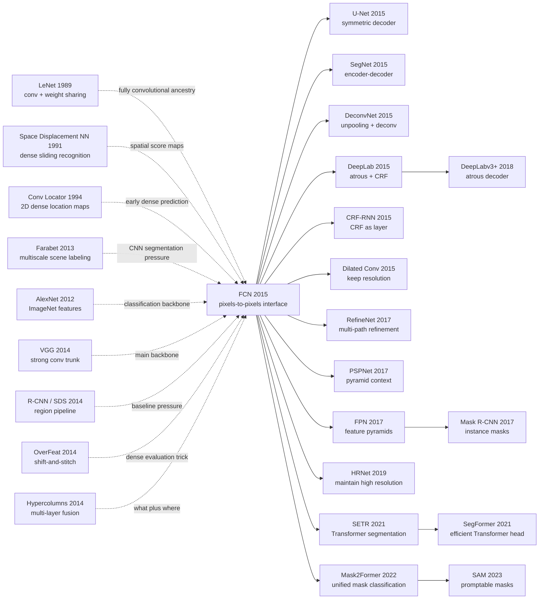

# FCN - 把分类网络改造成像素级分割机

> **2014 年 11 月 14 日，UC Berkeley 的 Jonathan Long、Evan Shelhamer、Trevor Darrell 把 [arXiv:1411.4038](https://arxiv.org/abs/1411.4038) 挂到网上，随后发表于 CVPR 2015。** 这篇论文的反直觉之处在于：它没有为语义分割另造一个复杂系统，而是把 AlexNet/VGG/GoogLeNet 这类“整图分类器”拆掉全连接头，改成可以输出空间热图的全卷积网络，再用反卷积和 skip fusion 把粗语义还原到像素网格。PASCAL VOC 2012 mean IU 从 SDS 的 51.6 提到 62.2，推理从约 50 秒降到 175ms。FCN 的历史地位不是“多了一个 upsampling 层”，而是把分割从 proposal、superpixel 和 patch 分类时代推进到 pixels-to-pixels 的端到端时代。

## 一句话总结

Long、Shelhamer、Darrell 2015 年发表在 CVPR 的 FCN，把语义分割从“先生成 region / superpixel / proposal，再对局部分类”的 pipeline，改写成一个端到端像素预测问题：把分类网络里的全连接层改成卷积层，令整图前向直接输出 $s_{i,j,c}=f_\theta(x)_{i,j,c}$，用像素级交叉熵 $\ell=\sum_{i,j}\ell'(s_{i,j}, y_{i,j})$ 训练，再用反卷积上采样和 pool3/pool4 skip fusion 得到 FCN-8s。它替代的最强 baseline 是 Hariharan 等作者的 SDS：PASCAL VOC 2012 mean IU 从 51.6 提到 62.2，2011 test 从 52.6 提到 62.7，推理从约 50 秒降到 175ms；在 NYUDv2 和 SIFT Flow 上也同步刷新结果。FCN 的 hidden lesson 是：分割真正缺的不是更多后处理，而是把 [VGG](2014_vgg.md) 这类分类表征改造成 dense predictor 的接口；这条线直接通向 [U-Net](2015_unet.md)、DeepLab、Mask R-CNN，再到 [SAM](../era5_genai_explosion/2023_sam.md) 之后的 promptable mask 生态。

---

## 历史背景

### 2014 年语义分割卡在“看得懂图，但拼不回像素”

FCN 出现时，视觉识别已经被 CNN 改写。2012 年 [AlexNet](2012_alexnet.md) 证明 ImageNet 分类可以由深度卷积网络主导，2014 年 [VGG](2014_vgg.md) 和 GoogLeNet 继续把分类精度推高；目标检测里，R-CNN 已经把 ImageNet 预训练特征搬到 region proposals 上。可是语义分割还没有完成同样的范式转移：它需要给每个像素一个类别，不只是给整张图或一个框一个标签。

当时的强系统往往是“深特征 + 传统结构”的混合体。SDS 用 region proposals、R-CNN features 和额外的 segmentation machinery 做 PASCAL VOC；Farabet 的多尺度 convnet、Pinheiro 的 recurrent CNN、Ciresan 的滑窗网络都证明 CNN 能处理局部密集任务，但常常需要 patch sampling、superpixel projection、CRF / MRF 后处理、输入 shift-and-stitch、multi-scale pyramid 或 ensemble。换句话说，CNN 已经能“看懂图”，但分割系统还在用很多外部工具把局部预测拼回像素。

FCN 的历史价值，是它把问题换成了一个很硬的接口问题：**能不能让分类网络本身一次前向输出一张同尺寸语义图？** 如果答案是可以，那么 patch、proposal、superpixel 和 post-hoc refinement 都不再是分割的必要入口。分割会从“识别后再组装”变成“整图输入、整图输出”的 pixels-to-pixels 学习。

### 直接逼出 FCN 的前序工作

| 前序 | 已经解决了什么 | 留下的缺口 | FCN 的继承方式 |
|------|----------------|------------|----------------|
| LeNet / space displacement networks | 卷积网络可在空间上共享计算 | 目标不是现代语义分割 | 给 FCN 提供 fully convolutional 传统 |
| AlexNet / VGG / GoogLeNet | ImageNet 分类特征足够强 | 输出是图像级标签 | 把全连接层改成卷积层并迁移权重 |
| OverFeat | shift-and-stitch 与 dense evaluation | dense trick 成本高、结构不够直接 | 分析 shift-and-stitch，转向可学习 upsampling |
| R-CNN / SDS | CNN features 可帮助检测和 region segmentation | pipeline 依赖 proposals / regions | 直接做像素级 dense prediction |
| Farabet / Pinheiro / Ciresan | CNN 可做 dense local labeling | patchwise、multi-scale、后处理较重 | 用 whole-image training 替代 patch machinery |

这些前序共同形成了一个临界点：分类 backbone 足够强，Caffe 工程栈足够稳定，PASCAL VOC / NYUDv2 / SIFT Flow 有公开评测，分割社区又被复杂 pipeline 压得很重。FCN 的突破不是孤立 trick，而是把这些积木重新连接成一个端到端训练问题。

### Berkeley 团队当时在做什么

三位作者都来自 UC Berkeley。Trevor Darrell 团队当时处在深度视觉、Caffe、R-CNN、视觉迁移学习的核心位置；Evan Shelhamer 是 Caffe 共同作者之一，Jonathan Long 也在 Berkeley 视觉系统和 dense prediction 方向上工作。这个背景很关键：FCN 不是“把论文里的 CNN 概念搬到分割”这么简单，它来自一个同时熟悉工程框架、分类预训练、region-based segmentation 和公开 benchmark 的团队。

论文也有很明显的 Berkeley/Caffe 气质：它不只是提出架构，还把问题空间拆开分析。全连接层为什么可以转成卷积？shift-and-stitch 本质上是什么？反卷积 upsampling 为什么可学习？patchwise training 和 whole-image training 的关系是什么？skip fusion 到底提升了 mean IU 还是只是让边界好看？这些问题都被写进正文和实验，而不是留成实现细节。

### 算力、数据与 Caffe 时代

FCN 使用 Caffe，在单张 NVIDIA Tesla K40c 上训练和测试。对今天来说，175ms 一张图不是惊人速度；但对 2015 年来说，它和 SDS 约 50 秒的 pipeline 形成了极鲜明对比。FCN-32s 的 VGG 微调约 3 天，升级到 FCN-16s / FCN-8s 各约 1 天，这是一种普通实验室能复现的成本，而不是只能靠大工业集群才能跑出的分数。

数据上，论文在 PASCAL VOC、NYUDv2、SIFT Flow 上都做了验证。PASCAL 的目标是自然图像 object category segmentation；NYUDv2 引入 RGB-D 和室内语义；SIFT Flow 则包含 scene parsing 与几何标签。FCN 能在这些任务上使用同一套 fully convolutional 框架，说明它不是只对 VOC leaderboard 调参，而是定义了一类 dense prediction 模型。

## 研究背景与动机

### 分割的核心矛盾：语义在深层，位置在浅层

语义分割天然有一组张力：深层特征更懂“是什么”，但 spatial stride 大、输出粗；浅层特征保留边缘和纹理，但语义弱。分类网络为了识别整图，会不断 pooling/downsampling，把局部位置信息换成更大的感受野和语义稳定性。分割却需要把语义重新放回像素。

FCN 的动机可以压成一句话：**既要借用分类网络的深层语义，又不能让最终输出永远停在 stride 32 的粗网格上。** 这正是 FCN-32s 到 FCN-16s 再到 FCN-8s 的演化逻辑：先证明分类网络可以 dense 化，再逐步把 pool4、pool3 的空间细节加回来。

### 为什么不是继续做 patch 或 proposal

Patchwise training 看起来很自然：对每个像素取一个 patch，预测中心像素类别。但相邻 patch 高度重叠，计算被反复浪费；同时 patch size 会制造上下文和定位之间的硬权衡。Proposal / superpixel 路线也合理，因为它能利用 objectness 和 region consistency，但 pipeline 会变长，错误会在 proposal、feature、classifier、post-processing 之间传递。

FCN 的攻击角度更直接：把整张图看成一个大 batch 的重叠 receptive fields，通过卷积共享所有重叠计算；把 upsampling 放进网络里，通过 pixelwise loss 端到端训练；把浅层和深层融合也做成网络的一部分。这样，分割不再是“CNN feature + 外部结构”，而是 CNN 本身要学会的空间函数。

---

## 方法详解

### 整体框架

FCN 的整体框架可以压缩成一句话：**把一个 ImageNet 分类网络卷积化，让它对任意大小输入输出一张低分辨率 class score map，再用网络内上采样和浅层 skip fusion 还原到像素级预测。** 论文先把 AlexNet、VGG-16、GoogLeNet 都改造成 dense predictor，随后发现 VGG-16 最强，于是以它为主干构建 FCN-32s、FCN-16s、FCN-8s。

| 阶段 | 操作 | 输出 stride | 角色 |
|------|------|-------------|------|
| 分类主干 | conv / pool / ReLU 堆叠 | 32 | 提取深层语义 |
| 全连接转卷积 | fc6/fc7 变成大卷积和 1×1 卷积 | 32 | 保留 ImageNet 预训练表示 |
| score layer | 1×1 conv 输出类别分数 | 32 | 每个粗网格位置预测类别 |
| deconvolution | 反卷积上采样到输入大小 | 32→1 | 连接粗语义与像素 loss |
| skip fusion | pool4 / pool3 加入浅层预测 | 16 / 8 | 恢复空间细节 |

核心不是“网络里有反卷积”这一个部件，而是三件事同时成立：分类预训练可以迁移到 dense prediction；训练可以用整图像素级 loss 完成；浅层和深层融合可以放在网络结构里端到端学习。

### 设计 1：全连接层卷积化 —— 把分类器变成空间滤波器

**功能**：把固定输入尺寸的分类网络，改造成能接受任意大小输入并输出空间 score map 的 fully convolutional network。

**核心公式**：如果原分类网络最后的全连接层作用在 $h\times w\times C$ 的 feature tensor 上，它等价于一个 kernel size 为 $h\times w$ 的卷积；后续 FC 层等价于 $1\times1$ 卷积。

$$
\operatorname{FC}(\operatorname{vec}(X)) = W\operatorname{vec}(X)+b
\quad\Longleftrightarrow\quad
\operatorname{Conv}_{h\times w}(X; W,b)
$$

```python
class ConvolutionalizedVGG(nn.Module):
    def __init__(self, vgg16, num_classes):
        super().__init__()
        self.features = vgg16.features
        self.fc6_as_conv = nn.Conv2d(512, 4096, kernel_size=7)
        self.fc7_as_conv = nn.Conv2d(4096, 4096, kernel_size=1)
        self.score = nn.Conv2d(4096, num_classes, kernel_size=1)

    def forward(self, image):
        h = self.features(image)
        h = F.relu(self.fc6_as_conv(h))
        h = F.relu(self.fc7_as_conv(h))
        return self.score(h)
```

| 做法 | 输入尺寸 | 输出形式 | 计算共享 | 适合 dense prediction 吗 |
|------|----------|----------|----------|---------------------------|
| 原始分类网络 | 固定 crop | 单个 logits | 无空间输出 | 否 |
| patchwise 分类 | 固定 patch | 中心像素类别 | 大量重复 | 勉强可用但慢 |
| **FCN 卷积化** | 任意尺寸 | score map | 全图共享 | 是 |
| proposal classifier | 任意 proposal | region 类别 | proposal 内共享有限 | 更适合检测 |

**设计动机**：分类网络已经学到强语义表征，直接丢掉太浪费；但全连接层把空间坐标压平，无法自然输出每个位置。卷积化等于把 ImageNet 权重重新解释成“可以在整张图上滑动的深滤波器”，既保留预训练，又避免 patchwise 重复前向。

### 设计 2：整图像素级 loss —— patchwise training 其实是 loss sampling

**功能**：对整张图一次前向得到所有空间位置的预测，用像素级 multinomial logistic loss 训练，而不是随机裁 patch 后分别训练。

**核心公式**：如果最终 score map 的每个位置 $(i,j)$ 对应一个 receptive field，那么整图 loss 是所有有效像素项之和：

$$
\mathcal{L}(x,y;\theta)=\sum_{(i,j)\in\Omega}\ell\left(f_\theta(x)_{i,j}, y_{i,j}\right)
$$

Patchwise training 可以看作从 $\Omega$ 中抽样一部分 loss 项；whole-image training 则保留所有项，并通过卷积共享重叠 receptive fields 的计算。

```python
def pixelwise_segmentation_loss(scores, labels, ignore_index=255):
    # scores: [N, C, H, W], labels: [N, H, W]
    return F.cross_entropy(scores, labels, ignore_index=ignore_index)
```

| 训练方式 | 梯度样本 | 计算效率 | 类别均衡 | 论文结论 |
|----------|----------|----------|----------|----------|
| patchwise uniform | 随机 patch | 重叠计算浪费 | 可手工采样 | 传统路线 |
| loss sampling | 部分空间位置 | 比 patch 更高效 | 可模拟 patch sampling | 论文分析工具 |
| **whole-image FCN** | 所有有效位置 | 最好利用卷积共享 | 可用 loss weighting | 实验中更快且有效 |
| proposal training | region candidates | 依赖 proposal 质量 | region 分布决定 | 非像素级端到端 |

**设计动机**：论文最漂亮的理论化之一，是把 patchwise training 还原成 loss sampling。这样，patch 方法不再是另一类模型，而是 FCN loss 的一种低效采样近似。这个观点让整图训练看起来不是大胆冒险，而是更自然、更高效的 dense SGD。

### 设计 3：反卷积上采样 —— 把粗 score map 接回像素 loss

**功能**：把 stride 32/16/8 的粗 class score map 上采样回输入分辨率，使网络可以端到端接受像素级监督。论文称它为 backwards strided convolution，也就是后来常说的 transposed convolution / deconvolution。

**核心公式**：上采样可以看作带输出 stride $f$ 的反向卷积。若 $z$ 是粗 score map，输出像素 $u$ 由可学习 kernel $K$ 组合邻近粗格点得到：

$$
u_{p,q,c}=\sum_{i,j} K_{p-fi,q-fj,c}\,z_{i,j,c}
$$

最终反卷积常固定为 bilinear interpolation；中间 2× upsampling 层初始化为 bilinear，但允许学习。

```python
def bilinear_upsample_layer(num_classes, stride):
    layer = nn.ConvTranspose2d(
        num_classes, num_classes,
        kernel_size=2 * stride,
        stride=stride,
        padding=stride // 2,
        groups=num_classes,
        bias=False,
    )
    layer.weight.data.copy_(make_bilinear_kernel(num_classes, 2 * stride))
    return layer
```

| 上采样方式 | 是否可学习 | 是否在网络内 | 优点 | 局限 |
|------------|------------|--------------|------|------|
| 最近邻 / 双线性后处理 | 否 | 否 | 简单 | loss 不直接监督上采样参数 |
| shift-and-stitch | 否 | 间接 | 可以变密 | 成本高，结构绕 |
| **deconvolution layer** | 可选 | 是 | 可端到端、易实现 | 粗 stride 仍限制细节 |
| decoder path | 是 | 是 | 后续 U-Net / SegNet 更强 | 更重 |

**设计动机**：FCN 选择反卷积，不只是为了图像变大，而是为了把“恢复分辨率”纳入可训练图。像素级 loss 可以穿过 upsampling 层回到分类 backbone，这让分割输出不再依赖外部插值和后处理。

### 设计 4：Skip fusion —— 把 what 和 where 合在一个 DAG 里

**功能**：将深层 coarse semantic scores 与浅层 finer appearance scores 相加融合，先得到 FCN-16s，再加入 pool3 得到 FCN-8s。

**核心公式**：

$$
s^{16}=\operatorname{up}_2(s^{32}_{\text{conv7}})+s_{\text{pool4}},
\qquad
s^{8}=\operatorname{up}_2(s^{16})+s_{\text{pool3}}
$$

融合前，pool4/pool3 上各接一个 $1\times1$ score layer；新增 score layer 零初始化，让网络从原 FCN-32s 行为平滑开始。

| 模型 | 融合层 | validation mean IU | 输出特征 | 读法 |
|------|--------|--------------------|----------|------|
| FCN-32s-fixed | 无，只训最后层 | 45.4 | 很粗 | 只用分类特征不够 |
| FCN-32s | 无，全网微调 | 59.4 | 语义强但边界粗 | dense fine-tuning 关键 |
| FCN-16s | conv7 + pool4 | 62.4 | 边界更清楚 | stride 16 加入定位 |
| FCN-8s | conv7 + pool4 + pool3 | 62.7 | 最细 | 指标提升小但视觉更顺 |

**设计动机**：语义分割要同时回答 what 和 where。conv7 懂类别但位置粗，pool3/pool4 保留位置但语义弱。FCN 的 skip fusion 用一个非常轻的 DAG 把二者加起来，后续 U-Net、FPN、RefineNet、DeepLab decoder 都在沿着这条 coarse-to-fine 融合路线深化。

### 训练配方

| 项 | 配置 | 说明 |
|----|------|------|
| Framework | Caffe | Berkeley 工程生态 |
| Backbone | AlexNet / VGG-16 / GoogLeNet | VGG-16 最强，FCN-32s 以它为主 |
| Optimizer | SGD + momentum 0.9 | 固定 learning rate 线搜索 |
| Batch size | 20 images | whole-image dense training |
| Learning rate | AlexNet 1e-3, VGG 1e-4, GoogLeNet 5e-5 | 对 VGG 更小 |
| Weight decay | 5e-4 或 2e-4 | 沿用分类网络训练经验 |
| Score init | class score conv 零初始化 | 随机初始化没有更快也没有更好 |
| Upsampling init | bilinear interpolation | 中间 upsampling 可学习 |
| Class balancing | 不使用 | 背景约 3/4，但影响不大 |
| Augmentation | mirror / jitter 尝试后无明显收益 | 不是主要贡献 |

从今天看，这套配方很朴素：没有 BatchNorm、没有 Adam、没有 Dice loss、没有 attention、没有 transformer decoder。它的厉害之处恰恰在这里：只靠卷积化、整图 loss、上采样和 skip fusion，就把分割从复杂 pipeline 拉回一个可复用的神经网络接口。

---

## 失败案例

### Baseline 1：patchwise / sliding-window CNN 能分割，但把同一张图算了太多遍

FCN 最直接要打掉的路线，是把语义分割当成“对每个像素裁一个 patch，然后预测中心像素类别”。这条路在 2011-2014 年并不荒唐：卷积网络已经能做局部识别，patch 采样还能人工控制类别均衡，显存不够时也比整图训练更容易塞进 GPU。Ciresan、Farabet、Pinheiro 等作者的 dense labeling 系统都从不同角度证明，CNN 可以为每个位置产生局部语义判断。

问题是，patchwise 路线把卷积最值钱的共享计算扔掉了一半。相邻像素的 patch 大量重叠，却要重复跑前向；如果 patch 取得小，模型看不到足够上下文；如果 patch 取得大，pooling 后定位变粗。论文第 3.4 节的概念性贡献，就是把 patchwise training 重新解释为 **loss sampling**：它不是另一种更本质的训练范式，而是在整图 pixelwise loss 上抽样若干空间位置。

FCN 的修正非常干净：整张图前向一次，所有 receptive fields 共享卷积计算，loss 直接对有效像素求和。这样做并没有损失 patch 方法的监督信息，反而去掉了重叠计算和固定窗口带来的上下文-定位冲突。论文用 AlexNet 的例子给了直观数字：500×500 输入上，全卷积版本一次输出 10×10 网格只需约 22ms；如果逐 patch 重复分类，代价会随着位置数线性膨胀。

### Baseline 2：proposal / region pipeline 很强，但分割被候选区域绑架

FCN 真正在 PASCAL VOC 上击败的强 baseline 是 SDS（Simultaneous Detection and Segmentation）。SDS 站在 R-CNN 之后，用 region proposals、CNN features、region classification 和 segmentation machinery 组合出当时很强的系统。它的合理性很明显：目标实例往往是连通区域，proposal 给了 objectness，region CNN 又能借 ImageNet 预训练。

但 SDS 的代价是 pipeline 太长。分割质量受候选区域召回、region 边界、CNN 分类器、mask projection 和后处理共同限制；一旦 proposal 没有覆盖正确物体，后面的深特征也救不回来。更重要的是，它不是直接优化“每个像素属于哪个语义类”这个目标，而是绕过 proposals 再回到像素。

FCN 把入口换成 dense prediction。它不需要先问“有哪些候选区域”，而是让 VGG 这类分类 backbone 在整图上输出每个空间位置的 class score。结果很直接：PASCAL VOC 2012 test mean IU 从 SDS 的 51.6 提到 FCN-8s 的 62.2，同时推理从约 50 秒降到 175ms。这里输掉的不是 SDS 的工程能力，而是 proposal-first 接口本身。

### Baseline 3：shift-and-stitch 可以变密，但不是可训练的分辨率恢复

OverFeat 等工作已经展示过 shift-and-stitch：对输入做不同像素偏移，分别跑网络，再把输出拼成更密的预测图。这是一个聪明的 dense evaluation trick，尤其适合把分类网络临时用于定位或检测。但它也暴露了一个尴尬事实：模型本身并没有学会如何恢复分辨率，系统靠多次输入平移来补网格空洞。

FCN 的替代方案是把 upsampling 放进网络。反卷积层可以固定为双线性插值，也可以从双线性初始化后继续学习；更关键的是，pixelwise loss 能穿过它回传到 backbone。这样，分辨率恢复从“运行时技巧”变成“训练图里的一个层”。

这个变化后来很重要。U-Net、SegNet、DeconvNet、DeepLab decoder、FPN 和现代 segmentation head 都不再把分辨率恢复看成外部拼接，而是把它当作网络结构的一部分。FCN 没有发明所有 decoder，但它把“上采样应当在网络内、可反传”这件事变成了默认接口。

### Baseline 4：FCN-32s 证明方向对了，却暴露出 stride 32 的粗糙边界

FCN 自己也有一个失败 baseline：只用最深层 score map 的 FCN-32s。它已经比许多旧 pipeline 更简洁，也能在 PASCAL 上达到 59.4 validation mean IU，但输出很粗。原因并不神秘：VGG 分类网络的最后特征 stride 是 32，一个粗网格点对应输入图里很大区域；直接上采样会把类别热图放大，却不能凭空恢复边界。

FCN-16s 和 FCN-8s 的 skip fusion 正是对这个失败的修补。pool4 提供 stride-16 的空间信息，pool3 提供 stride-8 的更细定位；深层 conv7 提供语义，浅层 score layer 提供 where。指标上，FCN-32s 到 FCN-16s 从 59.4 提到 62.4，FCN-8s 到 62.7；视觉上，物体边界、细长结构和局部形状明显更顺。

这个 baseline 的教训也很持久：dense prediction 不是简单把分类网络最后一层铺开。语义越强，位置越粗；位置越细，语义越弱。后来的 U-Net、RefineNet、DeepLabv3+、HRNet、SegFormer 和 Mask2Former 都在继续回答这个 what/where 融合问题。

| 失败路线 | 当时为什么合理 | 暴露的问题 | FCN 的修正 |
|---|---|---|---|
| Patchwise / sliding-window CNN | 显存友好，可采样平衡类别 | 重叠计算浪费，窗口大小制造上下文-定位冲突 | 整图 forward + pixelwise loss |
| SDS / proposal pipeline | region objectness 强，借 R-CNN 特征 | 受 proposal 召回和复杂后处理限制 | 直接像素级 dense prediction |
| Shift-and-stitch | 不改网络也能得到密集输出 | 多次前向昂贵，恢复分辨率不可学习 | 网络内反卷积上采样 |
| FCN-32s | 最简单的 fully convolutional 改造 | stride 32 输出太粗，边界糊 | pool4 / pool3 skip fusion |

## 实验关键数据

### PASCAL VOC：把 SDS 的强 pipeline 拉回一个端到端网络

PASCAL VOC 是 FCN 历史地位最核心的实验场。论文在 VOC 2011 和 VOC 2012 上都报告 test 结果，指标是 mean IU。FCN-8s 在 2012 test 上达到 62.2，比 SDS 的 51.6 高 10.6 个点；在 2011 test 上，FCN-8s 是 62.7，SDS 是 52.6。

| 方法 | VOC 2011 test mean IU | VOC 2012 test mean IU | 运行时间 | 读法 |
|---|---:|---:|---:|---|
| SDS | 52.6 | 51.6 | 约 50s | 强 proposal/region pipeline |
| FCN-32s | - | - | 约 175ms | 方向成立但输出粗 |
| FCN-16s | - | - | 约 175ms | 加 pool4 后边界更清楚 |
| **FCN-8s** | **62.7** | **62.2** | **约 175ms** | 端到端 dense predictor |

这组数字最有历史味道的地方，不只是 10 个 mean IU 点，而是速度和系统形态同时变了。SDS 是一个多阶段 pipeline；FCN-8s 是一次网络前向加上网络内 upsampling。它把语义分割从“复杂系统工程”推向“训练一个全卷积模型”。

### Ablation：真正的收益来自 fine-tuning 和 skip fusion

论文的 validation ablation 很关键，因为它说明 FCN 不是只靠 ImageNet 特征固定提取。只训练最后 score layer 的 FCN-32s-fixed 只有 45.4 mean IU；全网微调的 FCN-32s 到 59.4；加入 pool4 的 FCN-16s 到 62.4；再加入 pool3 的 FCN-8s 到 62.7。

| 模型 | 结构变化 | PASCAL val mean IU | 说明 |
|---|---|---:|---|
| FCN-32s-fixed | 固定 backbone，只训 score | 45.4 | 预训练特征不能直接冻结使用 |
| FCN-32s | 全网 dense fine-tuning | 59.4 | 分类表征可迁移到像素任务 |
| FCN-16s | 加 pool4 skip | 62.4 | stride-16 定位信息很值钱 |
| FCN-8s | 再加 pool3 skip | 62.7 | 指标小涨，视觉细节更好 |

这里有一个容易被忽略的事实：FCN-8s 相比 FCN-16s 的 mean IU 只涨 0.3，但论文仍把 FCN-8s 作为主模型，因为 qualitative boundary 明显更合理。语义分割的度量和人眼之间并不完全一致；边界改善有时不会在 mean IU 上成比例体现。

### NYUDv2 与 SIFT Flow：FCN 不是只为 VOC leaderboard 调参

论文还在 NYUDv2 和 SIFT Flow 上验证同一套框架。NYUDv2 需要室内 RGB-D 语义，论文用 HHA 编码深度并与 RGB 结合；SIFT Flow 则是 scene parsing 和几何标签任务。这两个数据集说明 FCN 是 dense prediction 接口，而不是只适配 VOC 的技巧集合。

| NYUDv2 FCN-16s RGB-HHA 指标 | 数值 | 含义 |
|---|---:|---|
| Pixel accuracy | 65.4 | 像素总体准确率 |
| Mean accuracy | 46.1 | 类别平均准确率 |
| Mean IU | 34.0 | 类别 IoU 平均 |
| Frequency weighted IU | 49.5 | 按类别频率加权的 IU |

| SIFT Flow FCN-16s 指标 | 数值 | 含义 |
|---|---:|---|
| Pixel accuracy | 85.2 | 语义像素准确率 |
| Mean accuracy | 51.7 | 类别平均准确率 |
| Mean IU | 39.5 | 语义 mean IU |
| Frequency weighted IU | 76.1 | 频率加权 IU |
| Geometry pixel accuracy | 94.3 | 几何标签准确率 |

这些结果后来没有像 VOC 62.2 那样被反复引用，但它们在 2015 年很重要。它们告诉读者：全卷积、pixelwise loss、in-network upsampling、skip fusion 不是某个 leaderboard 的短期配方，而是一套可以迁移到不同 dense labeling 数据集的训练接口。

### 训练和推理成本：一张 K40c 上可复现

FCN 的传播速度部分来自它的工程可复现性。论文使用 Caffe 和单张 NVIDIA Tesla K40c；FCN-32s VGG 微调约 3 天，FCN-16s 和 FCN-8s 各约 1 天。对 2015 年实验室来说，这不是小成本，但也不是不可触及的大工业训练。

| 项 | 数值 / 设置 | 含义 |
|---|---|---|
| Framework | Caffe | Berkeley 深度视觉生态 |
| GPU | 单张 NVIDIA Tesla K40c | 普通实验室级复现成本 |
| FCN-32s training | 约 3 天 | VGG dense fine-tuning 主成本 |
| FCN-16s / FCN-8s upgrade | 各约 1 天 | 从粗到细逐级微调 |

速度上，FCN-8s 约 175ms 一张典型图，和 SDS 的约 50 秒形成了方法论差异。这个差异让分割不再只是离线提交 leaderboard 的系统，也开始接近可以嵌入交互式标注、机器人感知、医学预处理和视频管线的模块。

### 关键发现

第一，**分类预训练可以被重新解释为 dense prediction 预训练**。FCN 不需要从零训练语义分割网络，而是把 AlexNet、VGG、GoogLeNet 的权重通过卷积化迁移过来。这直接影响了后来的检测、分割、姿态估计和深度估计：先在大规模分类上学表示，再改头做 dense task。

第二，**端到端并不等于丢掉结构分析**。FCN 去掉了 proposals 和 patch machinery，但并没有把一切交给黑盒。论文仔细分析了全连接转卷积、loss sampling、deconvolution、skip fusion、shift-and-stitch，这让它成为一篇“接口论文”：读者能把自己的 backbone 接到同样的 dense output 形式上。

第三，**速度是架构贡献的一部分**。如果一个 segmentation 系统准确但需要 50 秒，它在研究表格和真实系统之间会有很宽的鸿沟。FCN 把准确率和延迟同时推进，才使 fully convolutional segmentation 成为后续十年视觉系统的默认组件。

---

## 思想史脉络



### 前世（被谁逼出来的）

- **LeNet / Space Displacement Network / 早期 dense convnet**：FCN 并不是凭空发明“卷积可以输出空间图”。LeCun 系列工作已经把权重共享、局部感受野和空间滑动识别做成神经网络传统。FCN 的不同之处在于，它把这个传统接到 AlexNet/VGG 之后的大规模预训练时代，并把目标从字符/定位扩展到现代语义分割。
- **AlexNet / VGG / GoogLeNet**：没有 [AlexNet](2012_alexnet.md) 之后的分类 backbone 胜利，FCN 的核心迁移就没有底气。它没有从零设计一个 segmentation-only 网络，而是说：分类网络已经学到语义，我们只需要把它的输出接口从 image logits 改成 spatial logits。
- **R-CNN / SDS / region pipeline**：R-CNN 证明 ImageNet 特征能迁移到检测，SDS 证明 region pipeline 能做强分割。FCN 正是在这个基础上反问：既然 CNN 特征已经这么强，为什么还要先生成 region，再把像素任务绕一圈？
- **OverFeat / shift-and-stitch / Hypercolumns**：OverFeat 让分类网络密集滑动，Hypercolumns 强调多层特征同时服务语义和定位。FCN 吸收了这两条线，但把 dense evaluation 和 feature fusion 做成一个可训练 DAG，而不是运行时拼接技巧。

### 今生（继承者）

- **Encoder-decoder 分割主线**：U-Net、SegNet、DeconvNet 都继承 FCN 的 pixels-to-pixels 接口，然后把“如何恢复空间细节”做得更重。U-Net 用对称 decoder 和 concat skip，SegNet 用 pooling indices，DeconvNet 用 unpooling + deconvolution。它们的共同前提都是 FCN 设定的：分割网络应当输入图像、输出同空间坐标系里的 mask。
- **DeepLab / dilated convolution / CRF 主线**：DeepLab 继承 FCN 的 dense unary prediction，但认为 stride-32 太粗，于是用 atrous convolution 扩大感受野而不继续降采样，再用 dense CRF 修边界。CRF-RNN 又把 CRF 推理写成可反传模块。这里的争论不是要不要 FCN，而是 FCN 后面怎样补边界和上下文。
- **Feature pyramid 与 instance mask 主线**：FPN 在检测里把 coarse-to-fine skip 做成金字塔，Mask R-CNN 在 RoI 内预测小 mask。它们不是语义分割 FCN 的直接复制，但都继承了一个事实：深层语义与浅层定位必须被结构化融合。
- **Transformer 与 mask classification 主线**：SETR、SegFormer、Mask2Former 之后，backbone 从 CNN 变成 Transformer，输出从 per-pixel softmax 扩展到 mask classification / query-based masks。但它们仍在 FCN 的问题框架里：如何把图像表示变成空间对齐的 dense mask。
- **Foundation segmentation 主线**：SAM 把分割推进 promptable foundation model 阶段，训练数据和交互接口都远超 FCN 时代。但 SAM 的 mask decoder、dense image embedding 和像素级输出，仍然站在 FCN 打开的“网络直接产出 mask”传统上。

### 误读 / 简化

- **误读 1：FCN 的贡献只是“把 fc 改成 conv”**。这一步很关键，但不是全篇。真正组合是全连接卷积化、整图 pixelwise loss、网络内 upsampling、skip fusion、预训练迁移和速度评估。只讲 fc-to-conv，会低估论文把 segmentation 接口整体重写的价值。
- **误读 2：FCN 已经解决了分割边界**。FCN-8s 让边界明显好于 FCN-32s，但它仍然粗。DeepLab 的 CRF、dilated conv，U-Net 的 decoder，RefineNet 的 refinement，HRNet 的高分辨率分支，都是在补 FCN 边界不够精细的问题。
- **误读 3：FCN 被后来的 U-Net / DeepLab 淘汰了**。具体架构当然被更强方法超过，但 FCN 变成了接口和语言。今天说 segmentation head、dense predictor、fully convolutional backbone，仍然是在使用 FCN 固定下来的语法。
- **误读 4：FCN 只属于语义分割**。FCN 的思想很快进入深度估计、边缘检测、人体解析、医学分割、遥感、显著性检测和视频 dense labeling。凡是输入和输出共享空间坐标、需要密集监督的任务，都能借这套接口。

---

## 当代视角

### 2026 年回看：FCN 从模型变成接口

从 2026 年看，FCN 的具体架构已经很朴素：VGG backbone、stride-32 coarse map、反卷积上采样、pool3/pool4 相加。任何现代 segmentation benchmark 上，它都会被 DeepLabv3+、HRNet、SegFormer、Mask2Former、DINO/ViT 系模型或 SAM 家族轻松超过。但这不削弱 FCN 的地位，因为它留下的不是一个永远最强的模型，而是一个接口：**图像进来，网络直接输出空间对齐的 dense prediction，训练目标直接写在像素上。**

这个接口现在几乎无处不在。语义分割、实例分割里的 mask head、医学图像分割、单目深度估计、法线估计、显著性检测、边缘检测、遥感地物分类、视频分割、dense correspondence，都把“整图卷积/注意力表示 + 空间输出头 + dense loss”当成自然形态。FCN 的胜利，是让这件事不再需要解释。

更有意思的是，FCN 后来的很多继承者并不叫 fully convolutional。Transformer segmentation 可能没有传统卷积，Mask2Former 用 query 和 mask classification，SAM 用 prompt encoder 和 mask decoder。但只要模型把图像表征变成空间 mask，并通过 dense supervision 或 mask-level supervision 学习，它仍然在 FCN 打开的设计空间里。

### 哪些假设站不住了

| 2015 年隐含假设 | 当时为什么合理 | 2026 年的问题 | 现代修正 |
|---|---|---|---|
| 分类 backbone 是 dense task 的默认起点 | ImageNet 预训练刚证明强迁移 | 大规模自监督、检测/分割预训练和 foundation features 更合适 | MAE/DINO/SAM/CLIP 风格预训练 + task head |
| stride 32 后再上采样可以接受 | PASCAL mean IU 对粗边界不太敏感 | 小物体、薄结构、医学边界、自动驾驶需要高分辨率 | dilated conv、HRNet、多尺度 decoder、feature pyramid |
| pixelwise softmax 是分割的自然输出 | 语义分割类别固定，评测简单 | instance/panoptic/open-vocabulary/promptable segmentation 需要 mask-level 表达 | mask classification、query decoder、promptable masks |
| 端到端 CNN 可以替代大部分结构化推理 | 旧 pipeline 过重，CRF/region 复杂 | 长程关系、全局上下文、拓扑和实例交互仍重要 | attention、CRF-as-layer、graph/context modules、foundation models |
| VOC / NYUD / SIFT Flow 足以代表 dense labeling | 当时公开 benchmark 有限 | 真实部署有 domain shift、长尾类别、视频一致性和交互需求 | 多域评测、开放词表、视频/3D/交互式分割 |

这些假设站不住，并不是说 FCN 错了。恰恰相反，后续工作都是在它规定的问题接口上继续细化：怎样保留分辨率，怎样表达实例，怎样引入上下文，怎样跨域泛化，怎样让 mask 可交互。

### 时代证明的关键 vs 冗余

真正留下来的关键设计有三件。第一，**全连接层卷积化和任意尺寸输入**：今天不一定还把 fc6/fc7 手工转卷积，但“backbone 不该被固定 crop 和图像级 logits 绑死”已经变成常识。第二，**整图 dense loss**：无论是 per-pixel CE、Dice、mask BCE、Hungarian mask loss 还是 prompt mask loss，训练目标都直接作用在空间输出上。第三，**多层 skip / coarse-to-fine fusion**：FCN-16s/8s 的轻量相加后来长成 U-Net decoder、FPN、DeepLabv3+ decoder、HRNet 多分支和 SegFormer head。

相对冗余的是一些 2015 年的具体工程选择。VGG fc6-as-7×7 conv 不是必须；反卷积也不总是优于 bilinear + conv；简单相加 skip 不如 concat、attention fusion 或 learned decoder 灵活；PASCAL mean IU 也不足以衡量边界、实例和临床代价。Caffe prototxt、固定 learning rate、K40c 训练成本则完全属于时代背景。

FCN 的论文价值因此更像 API 文档，而不是终局架构。API 的名字是 dense prediction：输入可以任意大小，网络保留空间维，输出与输入坐标对齐，监督直接来自像素或 mask。后续十年，大家一直在优化这个 API 的实现。

### 作者当时没想到的副作用

第一个副作用是，FCN 让“分割作为预训练/下游任务接口”变得顺手。只要有一个分类 backbone，研究者就能迅速接上 1×1 score layer、upsampling 和 pixel loss，把它变成 dense predictor。这直接加速了许多 backbone 在检测、分割、姿态、深度上的迁移评测。

第二个副作用是，FCN 让医学图像和自然图像分割在语言上接近了。U-Net 常被视为医学分割的代表，但它能被快速理解和传播，是因为 FCN 已经把 fully convolutional output、skip fusion 和 pixelwise training 变成公共词汇。没有 FCN，U-Net 的 U 形 decoder 仍然可能出现，但它不会那么自然地被纳入深度视觉主线。

第三个副作用是，FCN 把边界问题暴露得更清楚。旧 pipeline 的错误可能来自 proposal、superpixel、classifier 或 CRF，责任很分散；FCN 把系统收敛成一个网络后，大家能直接看到 stride、upsampling、feature fusion 和 loss 对边界的影响。这推动了 DeepLab、dilated convolution、CRF-RNN、RefineNet、boundary loss 等一系列后续修补。

第四个副作用是，FCN 改变了视觉框架的抽象。Caffe、后来的 PyTorch/TensorFlow 模型库，都越来越自然地把 backbone 和 task head 分开：分类 head、detection head、segmentation head、depth head。FCN 是让“segmentation head”这个概念变得普通的关键论文之一。

### 如果今天重写 FCN

如果 2026 年重写 FCN，我会保留“任意尺寸输入 + dense output + 端到端空间监督”的核心，但把 VGG backbone 换成多种可插拔 encoder：小数据时用 ConvNeXt/ResNet，大数据时用 ViT/Swin/DINOv2，开放词表时接 CLIP/SigLIP，交互式分割时接 SAM-style image encoder。FCN 的精神不是 VGG，而是 backbone-agnostic dense interface。

上采样部分会从简单反卷积变成多尺度 decoder。浅层和深层不只相加，而是用 feature pyramid、attention fusion 或 query-to-pixel decoder 学习融合；对小物体和薄结构，保留高分辨率分支或使用 dilated convolution；对实例和 panoptic，输出不只是每像素类别，而是 mask queries、class labels 和 overlap reasoning。

训练目标也会更丰富。语义分割可以用 pixel CE + Dice / Lovasz loss；实例 mask 用 BCE/Dice + Hungarian matching；医学或遥感用 boundary/surface/topology loss；开放词表用 text-image alignment；视频分割还要加入 temporal consistency。换句话说，现代 FCN 不会只是一条 softmax 分支，而是一组 dense prediction heads。

最重要的是评估会改变。今天重写 FCN 不能只给 VOC/NYUD/SIFT Flow 表格，还要报告跨域泛化、边界 F-score、小物体、延迟/显存、视频稳定性、开放词表迁移和交互式标注成本。FCN 2015 的问题是“CNN 能不能端到端做分割”；2026 年的问题是“dense predictor 能不能可靠地进入真实系统”。

## 局限与展望

### 作者承认 / 正文暴露的局限

论文虽然乐观，但其实已经暴露了 FCN 的几条限制。第一，输出仍然比较粗。附录里作者用模拟 stride 标签说明 mean IU 对粗预测不一定敏感：stride-32 标签仍可有相当高的 upper bound，而 stride-8 才明显更接近细边界。这解释了为什么 FCN-8s 视觉上比指标涨幅更重要。

第二，FCN 对 ImageNet 预训练依赖很强。从零训练在当时基本不可行，AlexNet/VGG/GoogLeNet 的分类权重是关键起点。这让 FCN 成为迁移学习胜利，也意味着它继承了分类数据的偏差和 backbone 的空间分辨率限制。

第三，FCN 没有显式建模实例、物体关系或全局结构。它输出每个像素的语义类，不能区分同类实例，也不保证形状拓扑、边界一致性或场景级约束。对 PASCAL 语义分割这足够有冲击力，但对 instance/panoptic/interactive segmentation 明显不够。

### 2026 视角下的新局限

第一个新局限是开放词表。FCN 假设类别集合固定，score layer 的通道数就是类别数。今天的视觉系统常常需要“训练时没见过的类别”、文本提示或用户交互，这要求模型把 mask 与语言、prompt 和区域 proposal 连接起来。

第二个新局限是跨域鲁棒性。FCN 在 VOC、NYUDv2、SIFT Flow 上展示迁移，但这些仍是相对小而干净的 benchmark。自动驾驶、遥感、医学和机器人分割会遇到天气、传感器、医院、地理区域和时间变化。普通 pixel CE 很难保证这种 domain shift 下的可靠性。

第三个新局限是密集输出的标注成本。FCN 依赖像素级监督，而高质量 mask 很贵。后来的弱监督、半监督、自监督、合成数据、foundation mask pretraining 和交互式标注工具，都是在降低这个成本。FCN 解决了模型接口，但没有解决 dense labels 从哪里来。

### 改进方向（已被后续工作证实）

- **保持分辨率而不是事后补救**：Dilated convolution、HRNet、high-resolution transformer 和多尺度 feature pyramid 都证明，高分辨率表示本身比最后粗暴上采样更稳。
- **把上下文做成显式模块**：ParseNet、PSPNet、ASPP、non-local / attention、Transformer encoder 都说明，像素分类需要全局上下文，不只是局部 receptive field。
- **把边界和实例纳入目标**：DeepLab+CRF、CRF-RNN、boundary loss、Mask R-CNN、Mask2Former 等工作说明，语义 pixel softmax 只是起点，mask 质量还需要边界、实例和集合预测。
- **减少像素标注依赖**：弱监督 segmentation、self-training、SAM-style mask generation、synthetic labels 和 active annotation 都在补 FCN 没解决的数据成本。
- **从 closed-set 到 promptable / open-vocabulary**：CLIP-based segmentation、open-vocabulary segmentation、SAM/MedSAM 把 fixed class score layer 改造成语言或 prompt 条件 mask predictor。

## 相关工作与启发

### 和 U-Net / DeepLab / Mask R-CNN / SAM 的关系

FCN 与 [U-Net](2015_unet.md) 的关系最直接：FCN 给出全卷积 dense prediction 和 skip fusion，U-Net 把上采样路径加厚成对称 decoder，并把浅层特征 concat 回来。自然图像语义分割里，FCN 是范式转移；医学分割里，U-Net 是这个范式在少标注、边界敏感场景下的工程化变体。

FCN 与 DeepLab 的关系像“接口与修边工具”。DeepLab 接受 FCN 的 dense unary prediction，但用 atrous convolution 减少下采样、用 CRF 修边界，后来又用 ASPP 和 decoder 做上下文与细节恢复。很多现代语义分割模型都可以看作 FCN + 更强 context + 更强 decoder。

FCN 与 Mask R-CNN / Mask2Former 的关系则是从语义像素到实例 mask 的扩展。Mask R-CNN 在每个 RoI 内预测小 FCN mask head，Mask2Former 进一步把语义、实例、全景统一成 mask classification。它们不再满足于每像素独立分类，但仍然离不开“网络直接产出 mask”这个基本接口。

FCN 与 SAM 的关系最像远祖和基础设施。SAM 的数据规模、prompt 机制和模型规模都远超 FCN，但它仍然需要 dense image embedding、mask decoder 和空间输出。FCN 把分割交给端到端网络；SAM 把端到端网络扩展成可提示、可泛化的 mask engine。

### 资源

- 论文：Jonathan Long, Evan Shelhamer, Trevor Darrell, [Fully Convolutional Networks for Semantic Segmentation](https://arxiv.org/abs/1411.4038), CVPR 2015。
- 官方页面：[fcn.berkeleyvision.org](https://fcn.berkeleyvision.org/)；代码：[shelhamer/fcn.berkeleyvision.org](https://github.com/shelhamer/fcn.berkeleyvision.org)。
- 建议连读：[AlexNet](2012_alexnet.md) 看分类 backbone 如何开启迁移，[VGG](2014_vgg.md) 看 FCN 主干来源，[R-CNN](2014_rcnn.md) 看 region pipeline 背景，[U-Net](2015_unet.md) 看 FCN 接口如何进入医学分割，[Faster R-CNN](2015_faster_rcnn.md) 和 [SAM](../era5_genai_explosion/2023_sam.md) 看 mask 预测如何继续演化。

最值得带走的不是某个 FCN-8s 数字，而是一个设计习惯：当任务有空间结构时，不要急着把图像压成一个向量再想办法复原；让网络一直保留空间坐标，让 loss 直接站在输出坐标上。FCN 把这个习惯写进了深度视觉的基本语法。


---

> 🌐 [English version](/en/era2_deep_renaissance/2015_fcn/) · 📚 awesome-papers project · CC-BY-NC