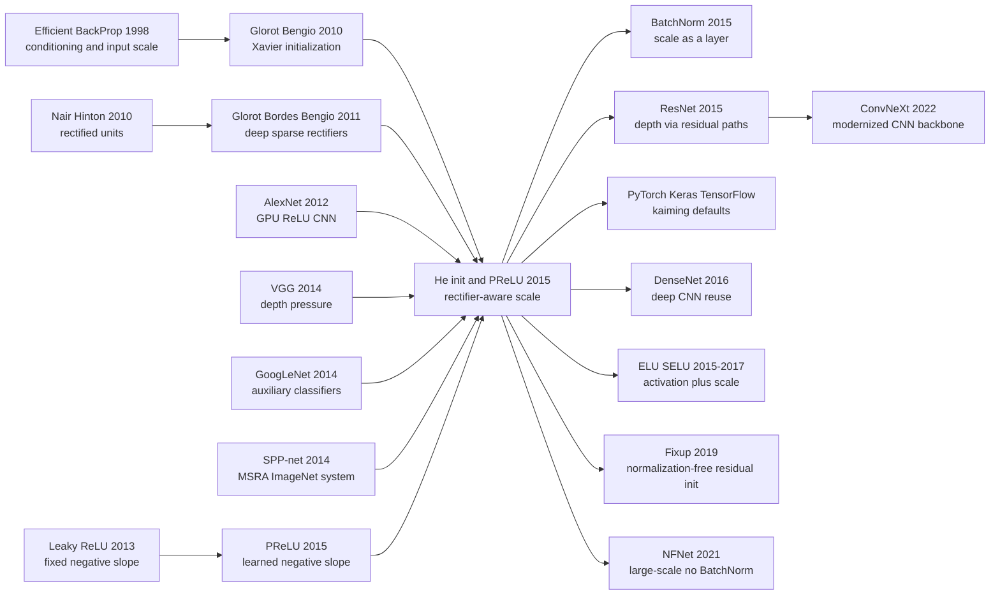

# He Init - 给 ReLU 深网一个不会熄火的起点

> **2015 年 2 月 6 日，Kaiming He、Xiangyu Zhang、Shaoqing Ren、Jian Sun 四位作者把 [arXiv 1502.01852](https://arxiv.org/abs/1502.01852) 挂到网上。** 标题里最响的是“ImageNet 上超过人类”，但真正传下来的不是这句新闻标题，而是一个后来被写进 PyTorch、Keras、TensorFlow 默认工具箱的起点：ReLU 会砍掉大约一半信号，所以权重方差就该多给一倍，$\sigma=\sqrt{2/n}$。PReLU-nets 的 4.94% top-5 test error 只属于 2015 年的 ImageNet 战场；He initialization 则变成了之后每个深层 CNN、ResNet 乃至许多现代视觉骨干的安静地基。

## 一句话总结

Kaiming He、Xiangyu Zhang、Shaoqing Ren、Jian Sun 四位作者 2015 年发表于 ICCV 的这篇论文，把 ReLU 网络的训练问题拆成两件事：激活函数本身可以学，初始化必须承认 rectifier 的半边截断。方法层面，PReLU 用 $f(y_i)=\max(0,y_i)+a_i\min(0,y_i)$ 替代固定 ReLU/Leaky ReLU，He initialization 则从 $\frac{1}{2}n_l\mathrm{Var}[w_l]=1$ 推出高斯标准差 $\sqrt{2/n_l}$，修正了 Xavier 在线性激活假设下的尺度。它击败的失败 baseline 很具体：14 层模型里 ReLU 是 33.82/13.34 top-1/top-5，channel-wise PReLU 降到 32.64/12.75；30 层 plain rectifier 用 Xavier 会直接停滞，而 He init 可以收敛。最终 MSRA PReLU-nets 以 4.94% top-5 test error 超过 GoogLeNet 的 6.66%、Baidu 的 5.98% 和 ImageNet 论文报告的人类 5.1%。反直觉处在于：标题里的“超过人类”很快被 [ResNet（2015）](2015_resnet.md) 的 3.57% 盖过，PReLU 也没有成为默认激活；真正活下来的，是这个看似朴素的 $\sqrt{2/n}$，它把 [AlexNet（2012）](2012_alexnet.md) 点燃的 ReLU 路线变成了可反复堆深的工程默认值。

---

## 历史背景

### 2014 年的视觉网络已经会赢，但还不会优雅地变深

2012 年 [AlexNet](2012_alexnet.md) 把 ImageNet top-5 错误率从传统视觉系统的 26% 量级砍到 15.3%，视觉社区立刻相信了三件事：大数据有用，GPU 有用，ReLU 有用。随后 ZFNet、OverFeat、SPP-net、VGG、GoogLeNet 各自把分数继续往下压。到 2014 年底，问题已经不是“卷积网络能不能赢手工特征”，而是“如果继续加深、加宽、加多尺度，训练还能不能稳住”。

VGG 给了一个很清楚的信号：小卷积核堆叠能带来更强表示，但深层 plain CNN 的训练很脆。VGG 论文仍然需要从浅模型初始化深模型，常量 0.01 标准差和手工学习率日程是经验配方，不是可解释的原则。GoogLeNet 则走另一条路，用 Inception 模块和 auxiliary classifiers 让梯度更容易抵达中间层。两条路线都在绕同一个问题：深网需要更好的信号尺度管理。

He init 这篇论文正好卡在这个历史缝隙里。它没有直接发明下一个 ResNet block，也没有像 BatchNorm 那样把统计量做成层；它先问一个更底层的问题：如果 ReLU 把负半轴截断，为什么还沿用为近似线性激活推出来的 Xavier 初始化？这个问题听起来窄，却碰到了当时几乎所有深层 CNN 的共同地基。

### ReLU 已经赢了 sigmoid，但理论工具还停在线性假设

ReLU 在 2015 年前已经是事实标准。它不饱和，梯度路径比 sigmoid/tanh 直接，稀疏激活也更符合视觉特征探测器的直觉。Nair 和 Hinton 在 2010 年把 rectifier 带进 RBM，Glorot、Bordes、Bengio 2011 年系统展示 sparse rectifier network 的训练优势，AlexNet 则把 ReLU 放到 ImageNet 级别的 CNN 里。工程师知道 ReLU 好用，但许多初始化公式还在把激活当成近似线性函数处理。

Xavier 初始化的目标是让每层输入输出方差大致稳定。这个思想非常重要，但它默认正负响应都通过非线性。ReLU 不这样工作：如果输入近似零均值对称，负半边会被截断，二阶矩大约少一半，均值也不再是零。把线性公式原封不动搬过来，层数一深，前向信号和反向梯度就会多乘很多个错误尺度。

这也是这篇论文的“地基感”所在。它不是宣布 ReLU 好，而是解释 ReLU 为什么需要自己的初始化；不是说深网需要调参，而是给出一条可写进框架默认值的方差规则。

### MSRA 的直接压力：从 SPP-net 到 ImageNet 后竞赛

作者团队当时是 Microsoft Research Asia 的视觉核心组。Kaiming He、Xiangyu Zhang、Shaoqing Ren、Jian Sun 四位作者刚做完 SPP-net，正在 2014 到 2015 年的 ImageNet 后竞赛阶段追赶 VGG 和 GoogLeNet。论文里的大模型不是纯粹为了理论演示，而是为了在真实 ImageNet 系统里拿分。

这解释了论文的双重气质。前半部分像优化论文：推导方差传播，比较 Xavier，讨论 22 层和 30 层模型。后半部分像竞赛报告：多尺度 dense testing、multi-model ensemble、test set leaderboard、人类水平对比。今天读起来，这两部分似乎有点不对称；但在 2015 年，它们是同一件事。只有把训练稳定性做成原则，才能把更宽、更深、更强的数据增强模型推到榜首。

更有意思的是，论文自己已经发现了深度路线的下一道墙。He init 能让 30 层 plain rectifier 收敛，但这个 30 层模型在 ImageNet 上反而比 14 层差：38.56/16.59 对 33.82/13.34 top-1/top-5。也就是说，初始化解决了“能不能训动”，没有解决“越深是否越好”。几个月后的 ResNet 正是从这里往前走。

### 标题的戏剧性和贡献的安静性

“Surpassing Human-Level Performance on ImageNet Classification” 是一个很会抓眼球的标题。论文最终的 4.94% top-5 test error 确实低于 Russakovsky 等作者报告的 5.1% human-level number，也低于 GoogLeNet 的 6.66% 和 Baidu 的 5.98%。但论文自己非常谨慎：这个人类数字来自 1500 张 test 子集、训练过的标注者、带 13 张示例图的特殊界面；超过这个 benchmark 不等于机器视觉整体超过人类视觉。

后来历史也证明，标题不是它最持久的贡献。ImageNet 分数很快继续下降，“human-level”这个说法也越来越需要限定上下文。PReLU 在部分任务中有用，但没有取代 ReLU 成为默认激活。真正留下来的是初始化规则。今天很多工程师第一次见到这篇论文，不是因为 ImageNet 4.94%，而是在 `torch.nn.init.kaiming_normal_` 或 Keras 的 `HeNormal` 里看到 Kaiming/He 这个名字。

## 研究背景与动机

### 两个问题被放在同一张桌上

论文表面上有两个贡献：PReLU 和 He initialization。一个改激活函数，一个改权重初始分布。它们其实都围绕同一个核心问题：rectifier 改变了信号分布，网络不能假装这件事不存在。

PReLU 的动机是表达力。ReLU 把负半轴全部设为 0，相当于强迫每个通道都用同一个硬门控。Leaky ReLU 给负半轴一个固定斜率，但斜率由人指定。PReLU 的想法很朴素：让每个通道自己学这个斜率。如果早期边缘滤波器需要保留负响应，就学大一点；如果深层分类特征需要更强非线性，就学小一点。

He initialization 的动机是可训练性。即便激活函数不学，只用 ReLU，初始化也应该知道有一半响应会被截断。论文把这个直觉写成方差传播条件，并从前向与反向两个方向说明为什么 $
\sqrt{2/n}$ 是合理尺度。

### 论文真正想替换的是“经验配方”

这篇论文不是单纯把 Xavier 换成另一个名字。它替换的是 2014 年深网训练里的几种经验动作：固定 0.01 标准差、从浅模型 warm-start 深模型、用 auxiliary classifiers 帮中间层、把 Leaky ReLU 的负斜率手工设成 0.01。每个动作都有用，但都像局部补丁。

He 等作者给出的答案更统一：如果网络的主非线性是 rectifier，就从 rectifier 的统计性质出发设计初始化；如果负半轴是否应该完全丢弃不确定，就让数据学习这个斜率。这个取向后来成为深度学习工程的默认思维：不要只问某个 trick 有没有用，要问它改变了信号、梯度、尺度、噪声中的哪一项。

### 为什么这篇论文是 ResNet 前夜

把 He init 放在 ResNet 之前读，会看到一条清晰的递进。AlexNet 证明 ReLU CNN 能赢；VGG 证明更深的 plain CNN 有潜力但难训；He init 证明 rectifier 深网需要正确初始化，且 30 层可以收敛；ResNet 再证明，仅仅能收敛还不够，plain 网络会退化，必须改写层与层之间的函数形式。

因此，He init 的历史位置不是“ResNet 之前的一个小技巧”。它更像是 MSRA 深度路线的第一块基石：先让信号不熄火，再让梯度有捷径。没有前者，后者的 152 层网络会更像魔法；有了前者，ResNet 的 residual learning 就建立在一个已经稳定的 rectifier 训练底座上。

---

## 方法详解

### 整体框架

这篇论文的方法可以拆成一条很清楚的训练链路：先承认 rectifier 改变了激活分布，再分别处理“激活形状”和“权重尺度”。PReLU 负责前者，让负半轴斜率从人工常数变成可学习参数；He initialization 负责后者，让每层权重在初始化时就补偿 ReLU/PReLU 对信号二阶矩的削弱。

论文的工程系统并不是一个今天意义上的新 backbone。它仍然是 VGG 风格的深层 CNN：多层卷积、SPP pooling、三层全连接、多尺度训练、多尺度 dense testing、multi-model ensemble。真正的新意在于，作者把“能不能直接从 scratch 训练更深 rectifier 网络”变成一个可推导的问题。初始化不再是随手写一个 0.01，激活也不再是把负半轴粗暴归零。

整套方法可以按四个设计点读：PReLU 学负斜率，He init 守住前向方差，反向方差给同一个尺度背书，最后用真实 ImageNet 系统验证这些小改动是否能在大模型中稳定兑现。

### 关键设计 1：PReLU - 把负半轴斜率交给数据学习

#### 功能

PReLU 的功能是把 ReLU 的“硬截断”变成一个可学习的软选择。ReLU 对负输入永远输出 0，Leaky ReLU 对负输入给一个固定小斜率，PReLU 则让每个通道拥有自己的 $a_i$。这样早期边缘/纹理通道可以保留更多负响应，深层语义通道可以学得更接近硬门控。

#### 公式

PReLU 的定义非常短：

$$
f(y_i)=
\begin{cases}
y_i, & y_i>0, \\
a_i y_i, & y_i\le 0,
\end{cases}
\qquad
f(y_i)=\max(0,y_i)+a_i\min(0,y_i).
$$

当 $a_i=0$ 时就是 ReLU；当 $a_i$ 固定为 0.01 一类小常数时就是 Leaky ReLU；当 $a_i$ 参与训练时就是 PReLU。论文默认用 $a_i=0.25$ 初始化，并且不对 $a_i$ 使用 weight decay，因为 $L_2$ 正则会把它推回 0，等于把 PReLU 人为拉回 ReLU。

PReLU 参数的梯度也只是链式法则：

$$
\frac{\partial \mathcal{E}}{\partial a_i}
=\sum_{y_i}\frac{\partial \mathcal{E}}{\partial f(y_i)}
\frac{\partial f(y_i)}{\partial a_i},
\qquad
\frac{\partial f(y_i)}{\partial a_i}=
\begin{cases}
0, & y_i>0, \\
y_i, & y_i\le 0.
\end{cases}
$$

#### 代码

```python
class PReLUChannelWise(nn.Module):
    def __init__(self, channels, initial_slope=0.25):
        super().__init__()
        self.negative_slope = nn.Parameter(torch.full((channels,), initial_slope))

    def forward(self, activation):
        slope = self.negative_slope.view(1, -1, 1, 1)
        positive = torch.clamp_min(activation, 0.0)
        negative = torch.clamp_max(activation, 0.0)
        return positive + slope * negative
```

#### 对比表

| 激活 | 负半轴 | 额外参数 | 论文中的角色 |
|------|--------|----------|--------------|
| ReLU | 0 | 0 | 主 baseline，14 层模型 33.82/13.34 |
| Leaky ReLU | 固定小斜率 | 0 | 固定斜率参考，不让数据决定形状 |
| PReLU channel-shared | 每层 1 个 $a$ | 13 个 | 14 层模型 32.71/12.87 |
| PReLU channel-wise | 每通道 1 个 $a_i$ | 通道数级别 | 14 层模型 32.64/12.75 |

#### 设计动机

PReLU 的意义不只是“负半轴也给一点梯度”。论文观察到，第一层卷积学到的负斜率显著大于 0，比如 conv1 的系数约 0.681 和 0.596；这很符合视觉直觉，因为 Gabor-like 边缘滤波器的正负响应都携带信息。更深层的 channel-wise PReLU 通常学到更小斜率，说明网络逐渐变得更非线性、更判别。

这给了一个比固定 Leaky ReLU 更细的解释：不同深度、不同通道对负响应的需求并不一样。PReLU 不保证每个任务都更好，但它让“激活形状”从一个全局超参变成了模型可以自己分配的容量。

### 关键设计 2：He initialization - 为 ReLU 补上被砍掉的一半方差

#### 功能

He initialization 的功能是让深层 rectifier 网络在第 0 步就拥有合理的信号尺度。它不改变网络结构，只改变权重初始分布；但这个改变足以让 30 层 plain rectifier 模型从 Xavier 停滞变成可以收敛。

#### 公式

设第 $l$ 层卷积有 $n_l=k_l^2c_l$ 个 fan-in 权重，权重零均值且与输入独立。对 ReLU 来说，若 $y_{l-1}$ 近似零均值对称，则 $x_l=\max(0,y_{l-1})$ 的二阶矩约为前一层方差的一半：

$$
\mathrm{Var}[y_l]
=n_l\mathrm{Var}[w_l]\mathbb{E}[x_l^2]
=\frac{1}{2}n_l\mathrm{Var}[w_l]\mathrm{Var}[y_{l-1}].
$$

为了避免跨 $L$ 层后信号指数级缩小或放大，论文让每层乘子等于 1：

$$
\frac{1}{2}n_l\mathrm{Var}[w_l]=1
\quad\Rightarrow\quad
\mathrm{Var}[w_l]=\frac{2}{n_l},\qquad
\sigma_l=\sqrt{\frac{2}{n_l}}.
$$

对 PReLU，负半轴不是 0，而是 $a$ 倍，因此条件变成：

$$
\frac{1}{2}(1+a^2)n_l\mathrm{Var}[w_l]=1.
$$

#### 代码

```python
def kaiming_std_for_rectifier(fan_in, negative_slope=0.0):
    gain = math.sqrt(2.0 / (1.0 + negative_slope ** 2))
    return gain / math.sqrt(fan_in)

def kaiming_normal_(weight, negative_slope=0.0):
    fan_in = weight.shape[1] * weight.shape[2] * weight.shape[3]
    std = kaiming_std_for_rectifier(fan_in, negative_slope)
    with torch.no_grad():
        return weight.normal_(0.0, std)
```

#### 对比表

| 初始化 | 假设的非线性 | 标准差尺度 | 深层 ReLU 风险 |
|--------|--------------|------------|----------------|
| 固定 0.01 | 无明确假设 | 与 fan-in 无关 | 通道数变化时梯度尺度失真 |
| Xavier | 近似线性 | $\sqrt{1/n}$ 或 fan-in/fan-out 平衡 | 每层少了 ReLU 的 2 倍补偿 |
| He init | ReLU/PReLU | $\sqrt{2/n}$ 或 $\sqrt{2/((1+a^2)n)}$ | 专门守住 rectifier 方差 |
| BatchNorm 之后 | 统计重标定 | 初始化仍重要但容忍度更高 | 不能替代所有尺度设计 |

#### 设计动机

最漂亮的地方是“2”不是拍脑袋得来的。ReLU 的门控让二阶矩大约减半，所以权重方差补一倍。Xavier 的精神是对的，但它没有把 rectifier 的非线性写进条件。He init 的贡献是把这个缺失变成一个足够简单的框架默认值。

### 关键设计 3：前向和反向方差都要守住

#### 功能

只看前向激活还不够。深网训练真正怕的是反向梯度在多层矩阵乘法和非线性门控中消失或爆炸。论文因此也推了一遍反向传播中的方差，说明同一个尺度规则也能让梯度保持合理量级。

#### 公式

设 $\hat{n}_l=k_l^2d_l$ 是反向传播中对应的 fan-out 尺度，ReLU 的导数有一半概率为 0、一半概率为 1。于是梯度方差近似满足：

$$
\mathrm{Var}[\Delta x_l]
=\frac{1}{2}\hat{n}_l\mathrm{Var}[w_l]\mathrm{Var}[\Delta x_{l+1}],
\qquad
\frac{1}{2}\hat{n}_l\mathrm{Var}[w_l]=1.
$$

论文指出，实际网络中用 fan-in 版本或 fan-out 版本通常都能让前向和反向不过分失衡，因为常见 CNN 的通道变化不会让乘积变成指数级小数。

#### 代码

这部分没有额外算子，落到工程实现就是选择 `fan_in` 或 `fan_out` 模式。现代框架把它封装成 `mode="fan_in"` 或 `mode="fan_out"`，前者更关注前向激活尺度，后者更关注反向梯度尺度。

#### 对比表

| 视角 | 想守住的量 | fan 尺度 | 对应风险 |
|------|------------|----------|----------|
| 前向传播 | 激活二阶矩 | $n_l=k_l^2c_l$ | 深层输出逐层变小或变大 |
| 反向传播 | 梯度二阶矩 | $\hat{n}_l=k_l^2d_l$ | 早期层梯度消失或爆炸 |
| 现代实现 | 二者取舍 | fan-in / fan-out 可选 | 初始化模式要匹配网络用途 |

#### 设计动机

这部分解释了为什么 He init 不是只会改善 loss 曲线开头的“小调参”。如果每层都少一个 $\sqrt{2}$，30 层后就不是小误差，而是数量级差异。论文在 VGG-like 模型上算过：某些层按 0.01 初始化时，从 conv10 传回 conv2 的梯度尺度可比推导值小约 $1.7\times10^4$ 倍。这正是 Xavier 或常量初始化在极深 rectifier 网络里停滞的直观原因。

### 关键设计 4：把初始化和激活放回真实 ImageNet 系统

#### 功能

论文没有停在方差推导，而是把 PReLU 和 He init 放回大规模 ImageNet 训练。作者使用多尺度训练、SPP pooling、dense testing 和 multi-model ensemble，检验这些底层设计是否能在真实竞赛级系统里转化为误差下降。

#### 公式

最终系统没有新的损失函数，仍然是标准 softmax 分类。这里的方法贡献不在目标函数，而在训练开始时的尺度和每个激活通道的形状。换句话说，它改的是优化地形的入口，不是评估指标。

#### 代码

这部分也没有独立代码模块。若在现代训练脚本里复现论文精神，最小改动通常是：卷积层使用 Kaiming 初始化；若选择 PReLU，初始化斜率设为 0.25，并且不要对 PReLU 的负斜率参数做 weight decay。

#### 对比表

| 系统层面选择 | 论文做法 | 作用 |
|--------------|----------|------|
| 深层 CNN | model A/B/C，最高 22 层大模型 | 提供真实 ImageNet 压力测试 |
| 激活 | ReLU 与 channel-wise PReLU 对比 | 验证可学习负斜率是否带来收益 |
| 初始化 | rectifier-aware Gaussian | 允许深模型直接从 scratch 训练 |
| 测试 | multi-scale dense testing + ensemble | 把底层改动兑现到 leaderboard |

#### 设计动机

这也是论文容易被误读的地方。4.94% 不是单靠 PReLU 或单靠初始化砸出来的，它是强训练配方、大模型、多尺度测试、多模型融合的系统结果。但这并不削弱 He init 的意义。相反，它说明底层尺度规则必须能经受最复杂系统的压力，而不是只在小数据集上画一条更好看的收敛曲线。

---

## 失败案例

### 失败基线 1：固定 ReLU 把所有负响应一刀切掉

ReLU 是这篇论文的起点，也是第一个 baseline。它已经比 sigmoid/tanh 好训练得多，但它把所有负响应都设为 0。对高层语义特征来说，这种硬门控经常是好事；对第一层 Gabor-like 边缘滤波器来说，正负响应可能只是边缘方向相反，直接丢掉负响应并不总是经济。

论文的 14 层小模型实验把这个差异量化出来：ReLU 的 ImageNet 10-view 结果是 33.82/13.34 top-1/top-5；channel-shared PReLU 只增加 13 个自由参数，就变成 32.71/12.87；channel-wise PReLU 进一步到 32.64/12.75。这个收益不巨大，但足够说明“负半轴斜率完全由人定死”不是最优默认值。

更重要的是，PReLU 学到的斜率不是随机噪声。conv1 的斜率明显大于 0，深层斜率整体更小。这说明网络在用激活形状表达层级差异：浅层保留更多低级信号，深层更愿意做强非线性筛选。

### 失败基线 2：Xavier 初始化把 ReLU 当成线性函数

Xavier 初始化不是坏方法，它是 2010 年后深网训练的重要进步。问题在于，它的经典推导把激活函数近似成线性映射。对 ReLU/PReLU 来说，这个假设少算了 rectifier 的门控效果。层数浅时，这个少算可能只是收敛稍慢；层数深时，它会积成数量级差异。

论文给了两个层次的证据。22 层大模型中，Xavier 和 He init 都能收敛，但 He init 更早开始降低误差。30 层 plain rectifier 模型中，Xavier 完全停滞，作者还监测到梯度在消失；He init 则能让模型收敛。这个对比后来成为“为什么框架默认要给 ReLU 用 Kaiming 初始化”的核心证据。

### 失败基线 3：只把 plain CNN 堆深并不自动变好

这篇论文最值得细读的失败案例，是作者自己承认的：He init 能让 30 层模型训动，但这不代表 30 层模型更准。论文报告，30 层模型在 ImageNet 上是 38.56/16.59 top-1/top-5，明显差于 14 层模型的 33.82/13.34。

这条失败线直接通向 ResNet。初始化解决了“梯度能不能流到那里”，没有解决“更深的 plain function 是否更容易优化到好解”。如果每一层都被迫学习完整映射，那么深度增加仍可能让优化目标变差。ResNet 的 residual parameterization 正是对这个失败的下一步回答。

### 失败基线 4：“超过人类”如果脱离评估协议会被误读

论文标题里的 human-level comparison 很容易被讲成“机器视觉超过人类”。作者其实给了明确边界：ImageNet 论文报告的 5.1% human-level top-5 error 来自 1500 张 test 子集、训练过的标注者和一个会显示每类 13 张示例图的特殊界面。MSRA 的 4.94% 超过的是这个受限 benchmark，不是人类视觉能力整体。

论文还指出，算法在细粒度分类上可能比普通人更熟 ImageNet 的 1000 个标签，比如狗种、鸟种、花种；但在需要上下文和高级知识的类别上仍会犯人类觉得容易的错误。这个 caveat 很重要。它让这篇论文没有被“超过人类”的标题完全绑架，也让我们今天能更准确地评价它：这是 ImageNet 评估协议上的里程碑，不是视觉理解终点。

| 失败基线 | 论文中的症状 | He/PReLU 的回答 | 后续结论 |
|----------|--------------|-----------------|----------|
| 固定 ReLU | 14 层模型 33.82/13.34 | 学负斜率到 32.64/12.75 | PReLU 有用但未成默认 |
| Xavier | 30 层 rectifier 停滞 | $\sqrt{2/n}$ 让其收敛 | Kaiming init 成默认 |
| 只堆深 plain CNN | 30 层比 14 层差 | 初始化只能解决可训练性 | ResNet 解决退化 |
| 泛化的 human-level 叙事 | 4.94% 只对应 ImageNet top-5 协议 | 论文主动限定结论 | 后来更强调 benchmark 边界 |

## 实验关键数据

### PReLU 消融：小模型和大模型都涨，但涨幅有限

14 层小模型是最干净的 PReLU 消融。所有 ReLU 被替换为 PReLU，训练轮数、图像尺度和 10-view 测试设置保持一致。channel-wise PReLU 相比 ReLU top-1 绝对下降 1.18 个点，top-5 绝对下降 0.59 个点；channel-shared 版本只多 13 个参数，也有 1.11 个 top-1 点收益。

大模型 A 的 dense testing 结果更接近最终系统。多尺度组合下，ReLU 是 24.02/6.51，PReLU 是 22.97/6.28。这里 top-1 降了 1.05 个点，top-5 降了 0.23 个点。换句话说，PReLU 是真实收益，但不是“单独改写时代”的收益；它更像一个小而稳的容量增量。

### 初始化实验：真正的分水岭在 30 层

22 层模型里，Xavier 仍然能训，只是 He init 更早降低误差。这说明论文没有把 baseline 打成 strawman：Xavier 在不少深度范围内仍有效。真正分水岭是 30 层 plain rectifier。此时 Xavier 学不动，He init 能收敛，但 30 层的最终 ImageNet 误差仍不理想。

这个结果有两层意义。第一，初始化确实是深网可训练性的必要条件之一。第二，初始化不是充分条件。深度带来的优化退化、结构设计和信息路径问题仍然存在。这种“解决一半问题”的状态，恰恰让它成为 ResNet 的直接前奏。

### ImageNet leaderboard：4.94% 是系统工程的胜利

最终榜单数字非常漂亮：MSRA PReLU-nets 的 multi-model test top-5 error 是 4.94%，比 GoogLeNet 的 6.66% 低 1.72 个绝对点，约 26% 相对下降；也低于 Baidu post-competition 的 5.98%。单模型 C 的验证集 top-5 是 5.71%，已经好过此前所有多模型结果。

| 设置 | top-1 | top-5 | 备注 |
|------|-------|-------|------|
| 14 层 ReLU，小模型 10-view | 33.82 | 13.34 | PReLU 消融 baseline |
| 14 层 PReLU channel-wise，小模型 10-view | 32.64 | 12.75 | top-1 降 1.18 个点 |
| model A ReLU，多尺度 dense | 24.02 | 6.51 | 大模型 ReLU |
| model A PReLU，多尺度 dense | 22.97 | 6.28 | top-5 降 0.23 个点 |
| model C PReLU，单模型验证集 | 21.59 | 5.71 | 好过此前多模型结果 |
| MSRA PReLU-nets，多模型 test | - | 4.94 | 低于 human-level 5.1% |

### 失败类别分析：模型强在细粒度，弱在语境

论文没有只报最终平均误差。它还分析了每类 top-5 错误：1000 个类别中有 113 类达到 0 top-5 error；错误最高的三类是 letter opener 49%、spotlight 38%、restaurant 36%。这三个类别都提醒我们，ImageNet top-5 的高分并不等于开放世界视觉理解。

算法擅长把 coucal、komondor、yellow lady's slipper 这类细粒度标签从 ImageNet 标签集中挑出来，因为它看过足够多同分布训练样本；但在多物体、上下文、高级语义判断上仍会出错。这个分析使论文比标题更稳重：它既展示了机器学习在封闭标签集上的强度，也诚实保留了视觉理解的边界。

---

## 思想史脉络



### 前世（被谁逼出来的）

- **Efficient BackProp / 输入归一化传统**：LeCun 一脉很早就知道尺度和条件数会决定梯度下降是否舒服。He init 继承的是这个优化直觉，但它把“输入要缩放”推进到“每一层的 rectifier 输出都要有合适尺度”。
- **Xavier initialization**：Glorot 和 Bengio 提供了现代初始化语言：用方差传播推导权重尺度。He init 不是否定 Xavier，而是指出 Xavier 的线性假设在 ReLU/PReLU 下少了一个关键因子。
- **ReLU 线索**：Nair-Hinton、Glorot-Bordes-Bengio、AlexNet 一步步把 rectifier 从一个激活选择推成深度学习默认值。但直到这篇论文，社区才有了专门为 rectifier 写的初始化公式。
- **VGG / GoogLeNet 的深度压力**：VGG 用浅模型初始化深模型，GoogLeNet 用辅助分类器护送梯度。两者都在说明：深度有效，但训练过程仍需要拐杖。
- **MSRA 自己的 SPP-net 经验**：同一组作者在 ImageNet 系统上已经很强，下一步要从工程配方里挤出更多性能。PReLU 和 He init 都是在真实竞赛压力下长出来的。

### 今生（继承者）

- **BatchNorm**：BatchNorm 和 He init 几乎同时出现。一个从动态统计量稳定训练，一个从初始方差稳定训练。后来深层 CNN 通常两者都用，说明尺度问题不是单点补丁，而是贯穿训练全过程。
- **ResNet**：ResNet 是最直接的继承者。He init 让 deep rectifier 网络能站起来，ResNet 让它继续走到 152 层。ResNet 论文里残差块使用的初始化与激活基础，正来自这条路线。
- **框架默认值**：PyTorch 的 `kaiming_normal_`、Keras 的 `HeNormal`、TensorFlow/Keras 的 variance scaling 都把这篇论文变成了默认工程知识。很多使用者不会读论文，却每天在调用它。
- **DenseNet / EfficientNet / ConvNeXt 等视觉骨干**：这些后继 backbone 不一定使用 PReLU，但基本都继承了 ReLU-family 激活、方差缩放初始化、训练尺度控制的共识。
- **Fixup / NFNet**：这些 normalization-free 工作反过来证明初始化仍然是核心问题。如果去掉 BatchNorm，就必须重新精细设计残差分支尺度、激活增益和梯度裁剪。

### 误读 / 简化

- **“这篇论文主要是 PReLU 论文”**：PReLU 是标题之外最显眼的模块，但历史上更长寿的是初始化。PReLU 没有成为 CNN 默认激活，He init 成了默认初始化。
- **“超过人类才是核心贡献”**：4.94% 是重要里程碑，但它属于 ImageNet top-5 test protocol 和 ensemble 系统。真正跨任务迁移的是 $\sqrt{2/n}$ 的 rectifier-aware scale。
- **“有 BatchNorm 之后初始化不重要”**：BatchNorm 提高了容错率，但没有让初始化消失。极深网络、无归一化网络、残差分支缩放和小 batch 场景仍然需要认真设计初始尺度。
- **“He init 解决了深度问题”**：它解决的是深层 rectifier 的信号尺度问题，不解决 plain network 的退化问题。论文里 30 层模型比 14 层差，已经把这个边界写得很清楚。
- **“PReLU 的负斜率只是防止 dying ReLU”**：这个解释太浅。论文更有意思的观察是，不同层学到不同负斜率，浅层保留低级信号，深层更非线性。它是在学习层级表达形状，而不只是救活零梯度。

---

## 当代视角

### 哪些假设今天站不住了

第一，PReLU 没有成为默认激活。2015 年看，它很像 ReLU 的自然升级：几乎不加计算量，还能在 ImageNet 上稳定涨分。但后来的主流 CNN 更多使用 ReLU、Leaky ReLU、GELU、SiLU/Swish 或任务特定激活。原因并不神秘：PReLU 的收益通常小，额外参数会和 normalization、weight decay、量化部署、模型移植产生细小摩擦；当 BatchNorm 和残差连接成为默认，固定 ReLU 已经足够好。

第二，“超过人类”这个叙事今天会被写得更谨慎。ImageNet top-5、1000 类封闭标签集、训练过的标注者、1500 张 test 子集，这些条件都需要在标题旁边说清楚。现代评估更强调分布外鲁棒性、组合泛化、上下文理解、开放词表和数据污染。4.94% 仍是历史性数字，但不是机器视觉理解能力的总判决。

第三，初始化不再独自承担稳定深网的责任。BatchNorm、LayerNorm、residual scaling、warmup、AdamW、label smoothing、data augmentation、mixed precision loss scaling 共同构成现代训练栈。He init 仍然重要，但它现在是众多稳定器中的第一步，而不是唯一钥匙。

### 如果今天重写这篇论文

如果今天重写，论文可能不会把“human-level”放在主标题里，而会把问题写成“rectifier networks 的 activation shape 与 variance scaling”。实验也会更系统：除了 ImageNet，还会覆盖 detection、segmentation、small-batch fine-tuning、self-supervised pretraining 和 normalization-free training。PReLU 会被放到 GELU、SiLU、Mish、Leaky ReLU、ELU、SELU 旁边比较，而不是只和 ReLU/Leaky ReLU 对比。

初始化部分也会更贴近现代框架。作者可能会直接讨论 fan-in/fan-out mode、truncated normal、residual branch zero-init、normalization 层存在时的 gain、depth-dependent scaling，以及 mixed precision 对初始尺度的影响。换句话说，今天的版本会少一点 leaderboard 戏剧，多一点“训练默认值如何被设计”的工程系统学。

但核心公式大概率不会变。只要主非线性像 ReLU 一样门控掉一部分响应，初始化就必须补偿这种门控。这个思想简单到像常识，恰恰是它能活十年的原因。

### 留下来的东西

真正留下来的不是一个单独模块，而是一种工程审美：深度学习的默认值应该从信号传播推导出来，而不是只靠经验继承。He initialization 把“初始化”从配方变成了可解释的基础设施。PReLU 则提醒我们，激活函数不是不可动的神经元符号，而是可学习、可诊断、可和初始化耦合设计的部件。

它还留下了一个很诚实的负结果：30 层 plain network 可以收敛，但不一定更好。这个负结果比许多正结果更有价值，因为它把“可训练性”和“可优化到好解”分开。后来的 ResNet、Highway Network、DenseNet、Transformer skip connection 都在处理后一个问题。

| 当代问题 | 2015 年答案 | 今天的补充 |
|----------|-------------|------------|
| ReLU 网络怎么初始化 | $\sqrt{2/n}$ | 结合 fan mode、residual scaling、normalization |
| 负半轴该不该保留 | PReLU 学 $a_i$ | GELU/SiLU/Leaky ReLU 等多种激活并存 |
| 深度能否继续增加 | 30 层能收敛但会退化 | ResNet/skip connection 改写函数路径 |
| ImageNet 分数意味着什么 | 4.94% 低于 5.1% human-level | 必须说明协议、数据分布和开放世界边界 |

### 局限 / 相关工作 / 资源

这篇论文的主要局限有三点。第一，PReLU 的收益依赖训练配方和网络类型，后来没有形成像 ReLU/BatchNorm/ResNet 那样的通用默认。第二，初始化实验说明了 Xavier 在 30 层 plain rectifier 上会失败，但对更广泛架构、归一化层、残差结构的系统分析要等后续工作补齐。第三，ImageNet human-level comparison 是重要历史事件，但样本数和评估协议让它不能被泛化成“机器视觉超过人类”。

相关 deep notes 可以串成一条线：[AlexNet](2012_alexnet.md) 把 ReLU CNN 推上 ImageNet，[BatchNorm](2015_batchnorm.md) 把训练稳定性做成一层，[ResNet](2015_resnet.md) 解决 plain depth degradation。外部资源上，最值得直接读的是论文原文 [arXiv:1502.01852](https://arxiv.org/abs/1502.01852)，以及现代框架里的 `kaiming_normal_` / `HeNormal` 文档。读完这篇再看 ResNet，会更容易理解为什么 152 层不是突然出现的奇迹，而是 2015 年一连串尺度、激活、信息路径问题被逐个拆开的结果。


---

> 🌐 [English version](/en/era2_deep_renaissance/2015_he_init/) · 📚 awesome-papers project · CC-BY-NC