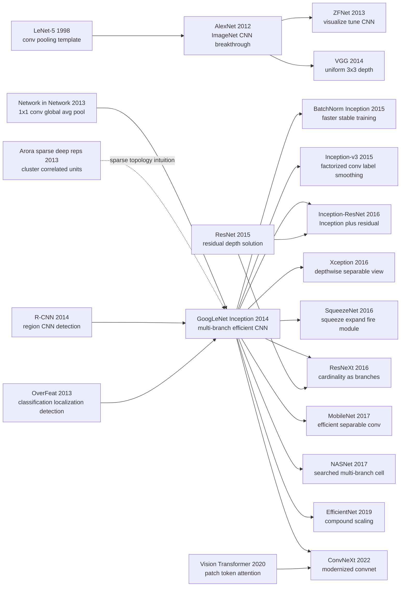

# Inception / GoogLeNet — 用多尺度模块把 CNN 往深处推进

> **2014 年 9 月 17 日，Google 与 University of North Carolina 的 Christian Szegedy、Wei Liu、Yangqing Jia、Pierre Sermanet 等 9 位作者把 [arXiv 1409.4842](https://arxiv.org/abs/1409.4842) 挂上网，次年发表于 CVPR 2015。** 这篇论文的标题借了 *Inception* 电影里的梗，但它真正严肃的地方是：在 VGG 把 CNN 推向“更深、更宽、更重”的同一周，GoogLeNet 反过来证明 22 层网络也可以只有约 500 万参数、约 1.5B multiply-adds，并用 6.67% top-5 error 赢下 ILSVRC 2014。Inception module 不是简单堆层，而是把 1x1 / 3x3 / 5x5 / pooling 多条视觉路径并排放在同一层，再用 1x1 reduction 把昂贵分支压住。深度学习从此多了一条路：不是只问“能不能更大”，而是问“每一份算力到底花在了哪里”。

## 一句话总结

Szegedy、Liu、Jia、Sermanet 等 9 位作者 2015 年发表于 CVPR 的这篇论文，把 ImageNet 时代的 CNN scaling 从“照着 AlexNet/VGG 继续堆 $3\times3$ 或 $5\times5$ 卷积”改成了“在同一层并行比较多个感受野，再用 $1\times1$ bottleneck 控制计算”：一个典型 Inception block 可写成 $y=\mathrm{concat}(f_{1\times1}(x), f_{3\times3}(r_3(x)), f_{5\times5}(r_5(x)), p(x))$。它直接打掉的 baseline 不是小模型，而是上一代暴力加宽路线：AlexNet 约 60M 参数、ILSVRC 2012 top-5 error 15.3%；GoogLeNet 约 5M 参数、22 层、约 1.5B multiply-adds，在 ILSVRC 2014 以 6.67% top-5 error 第一名结束比赛，甚至比同年 VGG 的 7.32% 更省参数。隐藏 lesson 是：Inception 真正继承给后人的不只是多分支模块，而是“算力预算内的结构搜索”这个问题意识；[ResNet（2015）](2015_resnet.md) 随后解决深层优化，[EfficientNet（2019）](https://arxiv.org/abs/1905.11946) 与 NASNet 则把这种手工 balancing 推向自动化。

---

## 历史背景

### AlexNet 之后，ImageNet 赛场进入架构军备竞赛

2012 年 AlexNet 赢下 ImageNet 后，计算机视觉的核心问题迅速从“深度 CNN 到底能不能工作”变成“怎样把 CNN 做得更大”。AlexNet 的答案很直接：更多卷积层、更大的全连接层、更多 GPU 训练技巧。2013 年 ZFNet 继续沿着这条路微调卷积核尺寸和 stride，用可视化解释第一层和中层 feature；2014 年 VGG 则把答案压成一个极简信条：反复堆小的 $3\times3$ 卷积，深度拉到 16/19 层。

这条路线非常有效，但也暴露出一个现实限制：参数和计算在迅速膨胀。AlexNet 约 60M 参数，大量参数集中在全连接层；VGG 更优雅，却更重，VGG-16 参数量达到约 138M。对 2014 年的 Google 来说，这不是纯学术问题。搜索、照片、广告、移动端和服务器推理都要求模型不能只在比赛机房里好看，它还要能在大规模产品里跑得动。

| 年份 | 代表模型 | 架构直觉 | 代价 | Inception 的回应 |
|---|---|---|---|---|
| 2012 | AlexNet | 大卷积 + GPU + dropout | 参数集中在 FC，约 60M 参数 | 保留 CNN 胜利，但砍掉重 FC |
| 2013 | ZFNet | 调整卷积核和 stride | 仍是单一路径 CNN | 继续用 ImageNet 反馈调结构 |
| 2014 | VGG | 小卷积反复堆叠 | 参数和 FLOPs 都很重 | 不只堆深度，而是重排每层计算 |
| 2014 | GoogLeNet | 多分支 + bottleneck | 手工设计复杂 | 用约 5M 参数赢得 ILSVRC |

Inception 的历史位置就在这里：它不是否定 AlexNet/VGG，而是在同一个 ImageNet 赛场上给出另一条 scaling 路线。VGG 说“用统一的小卷积把网络做深”；GoogLeNet 说“每层内部本来就应该有多种感受野，关键是怎样让这些感受野不把计算炸掉”。

### “Going Deeper” 的双关：更深，也更嵌套

论文标题 “Going Deeper with Convolutions” 有两层意思。第一层是字面意义：GoogLeNet 是 22 层有参数网络，比 AlexNet 的 8 层和 VGG 的 16/19 层更深。第二层来自 *Inception* 电影梗和 “we need to go deeper” meme：网络不是简单线性栈，而是在一个 layer 里再塞进一个小型网络结构，也就是 Inception module。

这点很重要，因为 Inception module 把 CNN 的“层”从单一算子改成了一个可组合单元。传统写法里，一层通常就是一个卷积或一个 pooling；Inception 把 $1\times1$、$3\times3$、$5\times5$ 和 pooling 并排放在同一层，再把输出 concat 成下一层的输入。于是“层数”不再只是纵向深度，单层内部也有横向结构。

这一改变预示了后来的 CNN 设计方式：ResNeXt 的 cardinality、DenseNet 的 dense connectivity、NASNet 的 cell、EfficientNet 的 compound scaling，都在不同程度上把“一个 block 的内部拓扑”当成设计对象。Inception 是这条路上的早期标志：CNN 不再只是顺序表，而是可设计的计算图。

### Google 团队当时在解决什么工程约束

作者团队横跨 Google 和 University of North Carolina，核心作者 Christian Szegedy、Yangqing Jia、Pierre Sermanet、Dragomir Anguelov、Dumitru Erhan、Vincent Vanhoucke、Andrew Rabinovich 都深处 Google 的视觉与大规模学习环境。论文明确提到 DistBelief 训练系统，也明确说设计目标包含移动与嵌入式计算里的功耗、内存和推理成本。

这解释了为什么论文从一开始就不是“追求最高 accuracy，不管成本”。它反复强调 computational budget，甚至给出约 1.5B multiply-adds 的推理预算。2014 年 ImageNet 竞赛里的很多模型可以通过 ensemble、multi-crop、外部数据和更大的网络继续挤分，但 Google 团队更关心一件事：如果每个用户请求都要经过视觉模型，模型必须把每一份计算花在最有用的位置。

所以 Inception 看起来像架构论文，骨子里却是一篇系统论文。它的核心美学不是“复杂”，而是“把稀疏的理想结构压缩成硬件友好的密集子块”。这正是 Google 工程文化与 2014 年深度学习研究交叉的产物。

### 直接前序：NIN、稀疏理论与 R-CNN 管线

Inception 不是凭空出现。最直接的前序是 Network in Network (NIN)：Lin、Chen、Yan 在 2013 年提出用 $1\times1$ 的 micro-network 提升卷积层表达力，并用 global average pooling 替代沉重的全连接分类头。GoogLeNet 大量使用 $1\times1$ convolution，但把它的角色进一步改写成“降维阀门”：先用 $1\times1$ 把通道压下来，再做昂贵的 $3\times3$ 或 $5\times5$ 卷积。

另一条前序来自 Arora、Bhaskara、Ge、Ma 关于深度表示的稀疏结构理论。论文借用 Hebbian principle “neurons that fire together, wire together” 的直觉：如果最优网络在通道维度上是稀疏连接的，那么可以先找相关性簇，再把这些簇连接成下一层。问题是 2014 年的 GPU/CPU 数值库不擅长不规则稀疏矩阵，真正跑得快的是规整 dense computation。Inception 的折中是：用多个相对密集的分支去近似一个理想稀疏拓扑。

检测任务上的前序则是 R-CNN、OverFeat 和 MultiBox。GoogLeNet 不是只做分类，它还作为 region classifier 嵌入 R-CNN 式检测流程；region proposal 来自 Selective Search 与 MultiBox 的组合。换句话说，Inception 的影响不是“单个 classifier 更准”这么窄，它也参与了 2014 年检测系统从 hand-engineered feature 转向 deep feature 的过渡。

### 2014 年的算力、数据与评测环境

训练环境带着明显的前 TensorFlow / 前 PyTorch 时代痕迹。论文使用 Google 的 DistBelief，训练是异步 SGD + momentum，学习率每 8 个 epoch 衰减 4%，最终模型用 Polyak averaging。作者还说虽然使用 CPU-based implementation，粗略估计几个高端 GPU 可以在一周内训练收敛；这句话放到 2026 年看很有年代感，但在 2014 年是很实际的工程描述。

数据和评测也清楚限定了论文目标。分类是 ILSVRC 2014：约 1.2M 训练图、50K 验证图、100K 测试图、1000 类，以 top-5 error 排名。检测是 200 类，指标是 mAP。最终比赛提交强烈依赖 ensemble 与 multi-crop：7 个模型、每图 144 crops，合计 1008 次预测再平均。这说明 Inception 的单模型效率很重要，但比赛成绩仍是 2014 年竞赛工程的产物。

### 为什么这篇论文在 2015 年显得“不像未来”，却真的影响了未来

如果只看论文的外观，Inception 并不像后来的 ResNet 那样给出一个干净到一行公式的结构，也不像 Transformer 那样提出一个可统一多个领域的大模块。它有很多手工数字：每个分支多少 channel、哪个 stage 放 auxiliary classifier、裁剪多少尺度、ensemble 几个模型。它甚至承认很多选择是局部调出来的，并不保证是理论最优。

但正是这种“手工复杂性”揭示了 2015 年 CNN 架构研究真正的问题：模型已经大到不能靠直觉线性堆叠，架构设计开始变成一门资源配置学。Inception 影响后世的地方，不是让所有人永久使用 5x5 分支，而是逼大家认真问：通道数、感受野、深度、宽度、分辨率、分支数、训练辅助信号之间到底怎样交易？这个问题后来被 ResNeXt、MobileNet、NASNet、EfficientNet 和 ConvNeXt 一路继承。

## 研究背景与动机

### 真问题不是“更深”，而是“在固定预算下更有用”

论文第 3 节把动机讲得很直接：提升深度网络性能最简单的方法是增加规模，包括更深和更宽。但规模增加有两个代价：更多参数会带来过拟合，更多计算会迅速超出有限预算。尤其在两个卷积层连续连接时，通道数的统一增加会带来近似二次增长的计算量；如果新增 capacity 里很多权重最终接近零，那就是把显存和乘加浪费在无效连接上。

Inception 的目标不是盲目压缩模型，而是在固定预算里重新分配计算。它假设视觉特征在不同尺度上同时有用：局部纹理需要小感受野，物体部件需要中等感受野，更大上下文需要更大感受野或 pooling。与其提前决定“这一层只做一种卷积”，不如让几种尺度并行竞争，再把结果拼起来。

### 为什么是“密集近似稀疏”而不是直接稀疏网络

理论上，如果最优网络拓扑很稀疏，最自然的做法是直接训练不规则稀疏连接。但论文非常务实地指出：2014 年的硬件和数值库对非均匀稀疏结构并不友好。即使算术操作少了 100 倍，索引、cache miss 和工程复杂度也可能把收益吃掉。相反，dense matrix multiplication 已经被 CPU/GPU 库优化到极致。

Inception 的设计动机因此是一种中间路线：不直接训练任意稀疏图，而是把可能的稀疏相关性簇，折叠成几个规整的 dense branch。$1\times1$、$3\times3$、$5\times5$ 和 pooling 都是硬件容易跑的组件；1x1 reduction 再把昂贵分支前的通道数降下来。它不是最“纯”的稀疏模型，却是当时能跑、能训、能赢比赛的稀疏近似。

---

## 方法详解

### 整体框架

GoogLeNet 的主干可以分成三段：前两层仍是传统卷积和 pooling，用来快速把 224x224 RGB 输入降到较小的空间网格；中间主体由 9 个 Inception modules 组成，从 3a/3b 到 5a/5b 逐步增加通道和抽象层级；最后用 global average pooling、dropout 和一个线性分类器输出 1000 类 softmax。论文按“有参数层”计数为 22 层，如果把 pooling 也算入约 27 层；从 block 角度看，整个计算图包含约 100 个独立 building blocks。

理解这篇论文，不能只记住“多分支”。Inception 的关键是四件事同时成立：多尺度分支给模型宽度，1x1 reduction 防止成本爆炸，模块堆叠让局部多尺度变成全局深度，辅助分类器和 global average pooling 让训练与参数效率可控。少任何一块，它都可能变成一个漂亮但跑不动的结构图。

| 组件 | 位置 | 解决的问题 | 后世继承 |
|---|---|---|---|
| 多尺度分支 | 每个 Inception module 内部 | 同层处理不同感受野 | ResNeXt / NAS cell / mixed ops |
| 1x1 reduction | 3x3、5x5 前 | 控制通道和 FLOPs | bottleneck / squeeze layer |
| 模块堆叠 | 3a 到 5b | 把局部结构变成深层网络 | Inception-v3/v4 / Xception |
| 辅助分类器 | 4a、4d 输出处 | 缓解深层梯度和正则化 | deep supervision / aux loss |

### 关键设计 1：多尺度 Inception module —— 在同一层并行看不同大小

**功能**：把一个“只能选择一种卷积核大小”的 CNN layer，改成同时运行 $1\times1$、$3\times3$、$5\times5$ 和 pooling 四条路径，再沿 channel 维度拼接。

$$
y = \operatorname{concat}\big(f_{1\times1}(x),\ f_{3\times3}(x),\ f_{5\times5}(x),\ \operatorname{proj}(\operatorname{pool}(x))\big)
$$

直觉上，$1\times1$ 路径擅长通道重组，$3\times3$ 路径擅长局部纹理和部件，$5\times5$ 路径捕获更大上下文，pooling 路径保留一定平移鲁棒性。传统 CNN 会在设计时提前押注“这一层该用 3x3 还是 5x5”；Inception 的做法是让这些选择并排存在，把选择权交给后续层的 channel mixing。

```python
def naive_inception(x, conv1, conv3, conv5, pool_proj, max_pool):
    branch_1 = conv1(x)
    branch_3 = conv3(x)
    branch_5 = conv5(x)
    branch_p = pool_proj(max_pool(x))
    return torch.cat([branch_1, branch_3, branch_5, branch_p], dim=1)
```

| 设计选择 | 解决什么 | 代价 | 为什么保留 |
|---|---|---|---|
| 1x1 branch | 通道线性组合 + 非线性 | 低 | 便宜且能重排特征 |
| 3x3 branch | 局部纹理和中等部件 | 中 | ImageNet 主力感受野 |
| 5x5 branch | 更大上下文 | 高 | 让模块具备多尺度能力 |

**设计动机**：ImageNet 物体尺度变化很大，同一层里的特征也不一定共享同一种最优感受野。多分支模块让模型在一个 stage 内同时保留几种空间尺度，避免用单一路径把所有特征都压进同一个 kernel size。这个设计后来被很多论文简化、替换或自动搜索，但“一个 block 内部可有多种算子”这件事被保留下来了。

### 关键设计 2：1x1 reduction —— 用便宜投影保护昂贵分支

**功能**：在 $3\times3$ 和 $5\times5$ 之前先用 $1\times1$ convolution 降低输入通道数，把原本会爆炸的 FLOPs 压回预算内。

$$
\operatorname{cost}(k\times k) = H W C_{in} C_{out} k^2,\qquad
\operatorname{cost}_{reduced} = H W C_{in} C_r + H W C_r C_{out} k^2
$$

如果输入是 192 channels、输出 32 个 $5\times5$ filters，直接卷积需要 $192\times32\times25$ 个权重；先降到 16 channels 再做 $5\times5$，卷积部分只有 $16\times32\times25$，再加一个 $192\times16$ 的 1x1 投影。论文表 1 里的 “#3x3 reduce / #5x5 reduce / pool proj” 就是在公开展示每个模块的预算分配。

```python
class InceptionReduction(torch.nn.Module):
    def __init__(self, in_ch, reduce_5, out_5):
        super().__init__()
        self.reduce = torch.nn.Conv2d(in_ch, reduce_5, kernel_size=1)
        self.conv5 = torch.nn.Conv2d(reduce_5, out_5, kernel_size=5, padding=2)

    def forward(self, x):
        hidden = torch.relu(self.reduce(x))
        return torch.relu(self.conv5(hidden))
```

| 路线 | 参数量趋势 | 表达能力 | 硬件友好度 |
|---|---|---|---|
| 直接 5x5 | 随 $C_{in}C_{out}25$ 增长 | 强 | 中，但太贵 |
| 1x1 → 5x5 | 多一个投影但显著降 FLOPs | 强，略受 bottleneck 限制 | 高 |
| 只用 1x1 | 最便宜 | 空间建模弱 | 高 |

**设计动机**：这就是 Inception 最核心的效率 trick。没有 reduction，多尺度分支会迅速造成 channel 级联膨胀；有了 reduction，5x5 这种昂贵分支才能保留下来。后来的 bottleneck ResNet、SqueezeNet fire module、MobileNet pointwise convolution 都继承了同一思想：昂贵空间算子前后要用便宜的通道投影管理维度。

### 关键设计 3：从模块到网络 —— 用 stage schedule 管住深度和宽度

**功能**：不是把同一个 Inception module 无脑复制 9 次，而是随空间分辨率降低逐步调大通道，形成 3a/3b、4a-4e、5a/5b 的 stage schedule。

$$
C_{out}^{(l)} = C_{1\times1}^{(l)} + C_{3\times3}^{(l)} + C_{5\times5}^{(l)} + C_{pool}^{(l)},\qquad
H_{l+1}, W_{l+1} \downarrow \Rightarrow C_{out}^{(l+1)} \uparrow
$$

论文表 1 是这篇论文最“工程”的部分：每个 module 都列出 1x1、3x3 reduce、3x3、5x5 reduce、5x5、pool projection 的通道数，以及参数量和乘加量。越往上，空间尺寸下降，通道数增加，3x3 和 5x5 的比例也随语义抽象变高而增大。这不是神秘理论，而是一套手工资源调度表。

```python
stage_spec = [
    {"name": "3a", "out": (64, 128, 32, 32)},
    {"name": "3b", "out": (128, 192, 96, 64)},
    {"name": "4a", "out": (192, 208, 48, 64)},
    {"name": "5b", "out": (384, 384, 128, 128)},
]

for spec in stage_spec:
    channels = sum(spec["out"])
    print(spec["name"], channels)
```

| stage | 空间趋势 | 通道趋势 | 设计含义 |
|---|---|---|---|
| 3a/3b | 分辨率仍较高 | 谨慎增加 | 避免早期 FLOPs 爆炸 |
| 4a-4e | 中等分辨率 | 主体容量集中 | 网络主要表征区 |
| 5a/5b | 分辨率较低 | 高通道 | 高语义、低空间成本 |

**设计动机**：Inception 把“深”和“宽”都变成可调旋钮，但旋钮太多会带来组合爆炸。stage schedule 是人工 NAS：作者不是搜索全空间，而是用经验把每一层的分支宽度写成表格。它的后继路线很清楚：Inception-v3 factorization、NASNet cell search、EfficientNet compound scaling 都在自动化或规则化这张手工表。

### 关键设计 4：辅助分类器与 global average pooling —— 让深网络训得动、参数降下来

**功能**：在 Inception 4a 和 4d 后接两个小分类头，把它们的 loss 以 0.3 权重加到总目标中；最后用 average pooling 替代沉重的全连接层，只保留轻量线性分类器。

$$
\mathcal{L} = \mathcal{L}_{main} + 0.3\mathcal{L}_{aux,4a} + 0.3\mathcal{L}_{aux,4d}
$$

辅助分类器的作用有两层。第一，它给中间层直接监督信号，缓解 22 层网络里的梯度传播问题；第二，它像正则化一样迫使中层 feature 本身具备判别性。推理时这些 side heads 被丢弃，不增加部署成本。global average pooling 则来自 NIN 思路：把空间维度平均掉，减少 FC 参数，让模型更像“卷积特征 + 轻分类器”。

```python
def googlenet_loss(logits_main, logits_aux1, logits_aux2, target):
    ce = torch.nn.functional.cross_entropy
    main = ce(logits_main, target)
    aux1 = ce(logits_aux1, target)
    aux2 = ce(logits_aux2, target)
    return main + 0.3 * aux1 + 0.3 * aux2
```

| 组件 | 训练时 | 推理时 | 作用 |
|---|---|---|---|
| auxiliary head 4a | 参与 loss | 删除 | 中层监督 + 正则 |
| auxiliary head 4d | 参与 loss | 删除 | 深层梯度辅助 |
| global average pooling | 参与主干 | 保留 | 减少 FC 参数 |

**设计动机**：GoogLeNet 还没有 ResNet 的 skip connection，也没有 BatchNorm。要训练 22 层网络，作者需要额外梯度路径和正则信号。辅助分类器后来没有成为标准主流，因为 ResNet/BN 更直接地解决了优化问题；但 deep supervision 的思想在 segmentation、detection、多尺度输出和 early-exit networks 中继续存在。global average pooling 则几乎成为现代 CNN 分类头的默认选择。

---

## 失败案例

### 当时输给 Inception 的对手

| baseline | 当时的做法 | 表面结果 | 输在哪里 |
|---|---|---|---|
| AlexNet / SuperVision | 大卷积 + 重 FC + 约 60M 参数 | ILSVRC 2012 top-5 error 15.3% | 准确率和参数效率都被 GoogLeNet 改写 |
| VGG | 统一 $3\times3$ 深堆叠 | ILSVRC 2014 第二名，top-5 error 7.32% | 很干净，但参数量约 138M，部署成本高 |
| 朴素 Inception | 直接并联 1x1/3x3/5x5/pooling | 结构直觉对，但计算爆炸 | 没有 1x1 reduction 就无法堆很多层 |

第一类 baseline 是 **暴力加大模型**。AlexNet 证明 CNN 能赢 ImageNet，但它的参数结构非常不均衡，两个大 FC 层占据模型主体。VGG 把结构简化到几乎教科书级别，性能也很强，但用参数和 FLOPs 换来了简洁。GoogLeNet 的反击不是“我比你更深所以赢”，而是“我用 12 倍更少参数还赢”。这让 2014 年的 CNN 竞赛第一次认真面对参数效率，而不是只把 leaderboard 当唯一目标。

第二类 baseline 是 **朴素多尺度模块**。如果只看 Figure 2(a)，Inception 很容易被误读成“把几个卷积核并起来”。但论文紧接着指出，这个 naive version 会在 5x5 分支和 pooling projection 处迅速导致输出通道膨胀，堆几层后计算失控。真正能工作的版本是 Figure 2(b)：先用 $1\times1$ reduction 压通道，再做昂贵卷积。换句话说，多尺度是 idea，bottleneck 才是让 idea 活下来的工程条件。

第三类 baseline 是 **直接稀疏连接**。论文的理论动机来自稀疏拓扑，但作者没有真的去训练任意稀疏网络，因为当时硬件不支持这种不规则性。直接稀疏模型在纸面上可能减少算术操作，实操中却会被 memory access、cache miss、kernel launch 和工程维护成本吃掉收益。Inception 用 dense branches 近似 sparse clusters，本质上是承认“理论最优”和“机器真正跑得快”之间有距离。

第四类 baseline 是 **只换分类器、不改检测系统**。GoogLeNet 的检测提交仍然是 R-CNN 式 pipeline：proposal 先来，CNN 再分类。论文没有直接发明 end-to-end detector，也没有用 bounding-box regression，作者明确说这是时间所限。它赢下检测靠的是更强 region classifier、MultiBox proposal 补充和 ensemble。这说明 Inception 在 detection 上的胜利还不是范式胜利，真正的范式更替要等 Fast R-CNN、Faster R-CNN 和 YOLO。

### 作者论文里承认的失败实验

论文在第 3 节和第 6 节非常坦诚：Inception 的设计原则来自稀疏结构理论和 Hebbian 直觉，但作者并没有证明这些原则必然导致最优 CNN。相反，他们写道要真正验证这一点，需要自动化 topology construction 工具在其他领域也找到类似但更好的拓扑。也就是说，GoogLeNet 赢了比赛，但“这是不是理论指导的必然结果”仍然未定。

另一个承认的局限是训练 recipe 不稳定、难复述。论文说比赛前几个月图像采样方法变了很多，已经收敛的模型还会在其他选项上继续训练，dropout 和 learning rate 也随之变化；作者甚至说很难给出单一最有效训练处方。这是典型竞赛系统的痕迹：最后成绩是真实的，但不是一个干净 ablation 能完全解释的科学结论。

第三个失败点是辅助分类器的必要性。它们被设计来帮助梯度传播和正则化，但后来 BatchNorm 与 ResNet 出现后，辅助分类头在普通分类主干里很快退场。回头看，它更像 2014 年“没有更好优化工具时”的临时支架，而不是深层 CNN 的永久答案。

### 真正的反 baseline：VGG 的简洁性长期赢了心智份额

有趣的是，GoogLeNet 在 ILSVRC 2014 排名上赢了 VGG，但在教学和迁移学习心智上，VGG 一度更容易传播。原因很简单：VGG 的规则是“全用 3x3，重复堆”，任何人看一眼都能复现；GoogLeNet 的表 1 是一张密密麻麻的 branch-width schedule，讲课时远不如 VGG 顺口。

这不是 Inception 的失败，却是一个重要教训：**更高效的结构不一定更容易成为默认模板**。VGG 虽重，但简单；GoogLeNet 虽省，但复杂。后来的 ResNet 之所以影响更大，部分原因正是它同时拥有性能、可扩展性和一句话结构：$y=F(x)+x$。Inception 的历史地位因此更像“把问题提出并赢了一次”，而不是“给出最终通用答案”。

## 实验关键数据

### ILSVRC 2014 分类结果

论文最核心的数字是 ILSVRC 2014 classification top-5 error：GoogLeNet 最终提交在 validation 和 test 上都是 6.67%，第一名。这比 2012 年 AlexNet / SuperVision 的 15.3% 下降了 56.5% 相对错误率，也比 2013 年 Clarifai 明显更低。同年 VGG 是第二名，top-5 error 约 7.32%。

| 模型 / 团队 | 年份 | 名次 | top-5 error | 备注 |
|---|---|---|---|---|
| SuperVision / AlexNet | 2012 | 1st | 15.3% | 深度 CNN 首次破局 |
| Clarifai / ZFNet 系 | 2013 | 1st | 11.7% | 调整 AlexNet 路线 |
| MSRA | 2014 | 3rd | 8.06% | 同年强 CNN 系统 |
| VGG | 2014 | 2nd | 7.32% | 简洁深堆叠路线 |
| GoogLeNet | 2014 | 1st | 6.67% | Inception ensemble |

这个表要和参数量一起读才有意义。VGG 的 7.32% 很强，但它比 GoogLeNet 大得多；GoogLeNet 的胜利说明 2014 年的架构创新不再只是“更大模型更准”，而是“更聪明的结构能同时提高准确率和参数效率”。

### 架构与训练细节

| 项目 | 配置 |
|---|---|
| 输入 | 224x224 RGB，mean subtraction |
| 主体深度 | 22 层有参数层，约 27 层含 pooling |
| Inception modules | 9 个：3a/3b、4a-4e、5a/5b |
| 参数量 | 约 5M，是 AlexNet 量级的约 1/12 |
| 推理预算 | 约 1.5B multiply-adds |
| 训练 | DistBelief，异步 SGD，momentum 0.9 |
| 辅助 loss | 4a、4d 两个 head，各自权重 0.3 |

这些细节说明 GoogLeNet 是一个强工程约束下的模型。它没有后来的 BatchNorm，没有残差连接，没有标准化的 PyTorch recipe；它靠 branch schedule、1x1 reduction、auxiliary loss、data augmentation 和 ensemble 把系统推到极限。

### Multi-crop 与 ensemble 到底贡献多少

论文 Table 3 把验证集上的测试策略拆开看：单模型单 crop 是 base；单模型 10 crops 改善 0.92 个百分点，单模型 144 crops 改善 2.18 个百分点；7 模型 144 crops 最终改善 3.45 个百分点。也就是说，官方 6.67% 不是单模型裸跑数字，而是模型架构 + 竞赛测试工程的组合。

| 模型数 | crops / 模型 | 总预测数 | 相对 base 改善 |
|---|---|---|---|
| 1 | 1 | 1 | base |
| 1 | 10 | 10 | -0.92% |
| 1 | 144 | 144 | -2.18% |
| 7 | 1 | 7 | -1.98% |
| 7 | 10 | 70 | -2.45% |
| 7 | 144 | 1008 | -3.45% |

这张表也解释了为什么今天复现 GoogLeNet 时不应该拿官方比赛成绩当单模型基准。现代训练通常报告 single-crop 或有限 multi-crop；2014 年 ILSVRC 决赛则是极端 multi-crop + ensemble。Inception module 的贡献是真实的，但最终 leaderboard 数字带有强烈竞赛时代特征。

### ILSVRC 2014 检测结果

检测任务上，GoogLeNet 使用类似 R-CNN 的流程：Selective Search proposal 加 MultiBox proposal，提高 proposal 覆盖；然后用 Inception 作为 region classifier；最后用 6 个 ConvNet ensemble，把结果从约 40% mAP 提到 43.9% mAP。论文明确说明没有使用 bounding-box regression。

| 系统 | 年份 | 检测排名 | mAP | 关键组件 |
|---|---|---|---|---|
| UvA-Euvision | 2013 | 1st | 22.6% 左右 | Fisher vectors |
| Deep Insight | 2014 | 3rd | 40% 左右 | CNN + ensemble |
| GoogLeNet | 2014 | 1st | 43.9% | Inception region classifier + proposals |

这里的历史意义是：Inception 不是 detection paradigm 的终点，但它证明强 CNN backbone 能显著提高 region-based detector 的上限。很快，Fast R-CNN / Faster R-CNN 会把 feature extraction 和 proposal/classification 更紧密地整合，GoogLeNet 的角色则变成“更强 backbone”的早期示范。

### 关键发现

- **参数效率是论文真正的胜利点**：6.67% top-5 error 很耀眼，但约 5M 参数对约 60M AlexNet、约 138M VGG 的对比更能说明 Inception 的价值。
- **1x1 reduction 是成败分界**：naive multi-branch 不难想到，能把它堆成 22 层并保持预算才是论文贡献。
- **辅助分类器是时代产物**：它帮助训练深层网络，但后来的 BN/ResNet 更干净地解决了梯度和优化问题。
- **竞赛数字需要拆解**：7 模型、144 crops、1008 predictions 是 2014 年 ILSVRC 工程的一部分；今天看模型本体时要区分 architecture gain 和 test-time augmentation gain。
- **检测胜利仍在 R-CNN 框架内**：GoogLeNet 是强 backbone，不是端到端 detector；真正的 detection pipeline 革命紧接着发生。

---

## 思想史脉络



### 前世（被谁逼出来的）

- **LeNet-5 → AlexNet**：给出了卷积、非线性、pooling、分类头这条基本路径。Inception 的名字向 LeNet 致敬，技术上则站在 AlexNet 证明 ImageNet CNN 可行之后。
- **ZFNet / OverFeat**：说明 2013-2014 年的主流还在单路径 CNN 里调 filter、stride、feature visualization 和 localization/detection 扩展。Inception 从这个语境中跳出，把单路径 layer 改成多路径 block。
- **VGG**：同年最强的对照组。VGG 的哲学是“统一、深、简单”；Inception 的哲学是“多分支、预算受控、手工调度”。两者共同定义了 2014 年 CNN 架构的两种审美。
- **Network in Network**：给 Inception 提供了 $1\times1$ convolution 和 global average pooling 两个关键工具。Inception 的创新不是“首次使用 1x1”，而是把 1x1 变成昂贵分支前的 bottleneck。
- **Arora 稀疏表示理论**：给论文提供“最优拓扑也许是稀疏且分簇”的理论语言。虽然这个动机后来很少被复述，但它解释了为什么 Inception 会把 dense branches 视为 sparse topology 的硬件近似。
- **R-CNN / MultiBox**：让 GoogLeNet 不只是分类模型，也成为检测 pipeline 的 region classifier。Inception 在 detection 中的角色是 backbone 强化，而不是 pipeline 发明。

### 今生（继承者）

- **BatchNorm Inception / Inception-v2/v3**：Szegedy 团队自己迅速补上训练稳定性和结构 factorization，把 $5\times5$ 拆成两个 $3\times3$，再把 $n\times n$ 拆成 $1\times n$ 与 $n\times1$，继续沿着“省计算但保表达”的路线走。
- **Inception-ResNet**：承认 ResNet 对深层优化的解决更干净，把 residual connection 和 Inception block 合并。它标志着 Inception 学派吸收了 ResNet，而不是被 ResNet 简单取代。
- **Xception / MobileNet**：Chollet 把 Inception 解释为 regular convolution 到 depthwise separable convolution 的中间点；MobileNet 则把 depthwise + pointwise 分解做成移动端标准。这是 Inception 效率思想最清晰的工程后代。
- **SqueezeNet / ResNeXt**：SqueezeNet 的 fire module 是 1x1 squeeze + 多分支 expand 的轻量化变体；ResNeXt 把 branch 数量称为 cardinality，用更规则的方式重写了 Inception 的“多路径容量”。
- **NASNet / EfficientNet**：NASNet 自动搜索 cell，EfficientNet 自动平衡 depth/width/resolution。它们都在接手 Inception 没有完成的任务：让手工 branch schedule 变成可搜索或可缩放规则。
- **ConvNeXt**：在 Transformer 冲击后重新整理 CNN 设计，证明卷积网络仍可通过现代训练和 block 改造保持竞争力。ConvNeXt 不直接长得像 Inception，但它继承了“架构细节决定算力效率”的问题意识。

### 误读 / 简化

- **“Inception 就是多尺度并联”**：只说对了一半。真正的贡献是多尺度与 1x1 reduction 的组合；没有 reduction，Figure 2(a) 会迅速计算爆炸。
- **“GoogLeNet 比 VGG 更深，所以赢”**：误导。22 层确实更深，但关键是用约 5M 参数和受控 FLOPs 达到更低错误率。深度只是结果，资源配置才是主题。
- **“辅助分类器是核心遗产”**：不准确。辅助分类器在当时有用，但很快被 BatchNorm 和 residual connections 取代。它的长尾影响更多体现在 deep supervision，而不是标准 ImageNet classifier。
- **“Inception 是 NAS 前的过时手工设计”**：过度简化。NAS 确实自动化了 cell search，但搜索空间里很多 mixed operations、多分支、bottleneck 思路都可追到 Inception。手工设计不是错误，而是自动搜索之前的经验压缩。
- **“CNN 时代被 ViT 结束，所以 Inception 只剩历史价值”**：不对。移动端、实时推理和小数据视觉场景仍然大量使用 convolutional inductive bias；Inception 留下的问题——在固定预算里分配计算——在 ViT、Mamba 甚至多模态模型里同样存在。

---

## 当代视角

### 站不住的假设：手工多分支会一路统治 CNN 架构

2026 年回看，GoogLeNet 最容易被误读成“多分支越多越好”。这个假设没有站住。Inception module 的核心确实是多分支，但它真正解决的是 2014 年的资源配置问题：在没有 BatchNorm、没有 residual connection、没有成熟 NAS、没有标准移动端 benchmark 的时代，怎样让 22 层 CNN 在 ImageNet 上既准又不爆预算。后来的十年说明，**多分支只是答案的一种外形，不是问题本身**。

第一个被削弱的假设是“大 kernel 分支必须显式存在”。Inception-v2/v3 很快把 $5\times5$ 拆成两个 $3\times3$，再把 $n\times n$ 拆成 $1\times n$ 与 $n\times1$；MobileNet/Xception 进一步把空间卷积和通道混合拆开。到 ConvNeXt 和现代高效 CNN 时代，大感受野常常由 depthwise convolution、dilated convolution、attention-like mixing 或更深的 stage 累积出来，不一定需要在每个 block 里并排放一个 5x5 分支。

第二个被削弱的假设是“辅助分类器是深网训练的必要支架”。GoogLeNet 没有 BN，也没有 skip connection，所以 4a/4d 的 auxiliary losses 很合理；但 2015 年 BatchNorm、2015/2016 年 ResNet 出现后，普通分类主干很少再依赖这种 side head。今天它更多活在 deep supervision、early exit、多尺度分割和检测头里，而不是标准 backbone 的核心组件。

第三个被削弱的假设是“理论稀疏拓扑可以靠手工相关性簇稳定推出”。论文借用了 Hebbian principle 和稀疏表示理论，但真实有效的 GoogLeNet 是一张手写 branch-width schedule。这个 schedule 赢了比赛，却没有形成一个可迁移的推导方法。后来的 NAS、compound scaling 和 latency-aware design 说明，手工直觉仍然有价值，但需要搜索、缩放定律或硬件反馈来把它变成可复用规则。

| 2014 年的隐含假设 | 当时为什么合理 | 2026 年怎么看 | 后来的替代路线 |
|---|---|---|---|
| 显式 1x1/3x3/5x5/pool 分支会长期保留 | 多尺度 ImageNet 特征确实有用 | 分支形态被大幅简化，问题意识保留 | factorized conv / depthwise separable conv / NAS cells |
| 辅助分类器是深层训练关键 | 没有 BN/ResNet，梯度路径弱 | 普通 backbone 中基本退场 | BatchNorm / residual connection / better initialization |
| 手工 branch schedule 足够通用 | ILSVRC 竞赛允许大量调参 | 可解释但难迁移 | EfficientNet compound scaling / hardware-aware NAS |
| 144 crops + ensemble 是合理评测方式 | ILSVRC 决赛追求最后 0.1% | 不能代表单模型部署质量 | single-crop / latency / throughput / energy reporting |
| 稀疏理论能直接指导 CNN 拓扑 | 给多分支结构一个理论语言 | 解释力有限，工程选择更多 | empirical scaling / ablation / learned architecture search |

### 如果今天重写：它会像一个带约束的 compute cell

如果 2026 年重新写 “Going Deeper with Convolutions”，论文大概率不会把 Table 1 的通道数当作主要贡献，而会把 Inception module 写成一个带硬件约束的 cell。输入不只是 ImageNet accuracy，还包括 latency、activation memory、吞吐、能耗、batch size 下的实际 kernel 效率，以及训练 recipe 的可复现性。换句话说，今天的论文会把“预算”从文本动机推进到优化目标。

一个现代化 Inception block 可能保留三件旧东西：$1\times1$ channel projection、多尺度空间 mixing、concat 或加法融合；但它会加入四件新东西：BatchNorm/LayerNorm，residual path，depthwise 或 group convolution，SE/attention 类通道重标定。它不一定再写成 $1\times1/3\times3/5\times5/pool$ 四条固定分支，而更可能写成 $y=x+\phi(\mathrm{mix}_{k\in\mathcal{K}}(\psi_k(x)))$，其中 $\mathcal{K}$ 由搜索或硬件约束决定。

训练和评测也会变。2014 年的论文可以诚实地说训练 recipe 在比赛前几个月反复变化；今天的标准会要求公开 augmentation、optimizer、warmup、weight decay、EMA、label smoothing、stochastic depth、resolution schedule，并区分 single-model / ensemble / test-time augmentation。GoogLeNet 的 6.67% 仍是历史数字，但现代读者会更想知道：一个没有 ensemble、没有 144 crops 的单模型，在相同训练 recipe 下相对 VGG、ResNet、ConvNeXt、ViT 到底省了多少 latency 和能耗。

| 现代重写项 | 2015 论文写法 | 2026 可能写法 | 目的 |
|---|---|---|---|
| 模块定义 | 手写 3a 到 5b 通道表 | 参数化 cell + 搜索/缩放规则 | 让结构可迁移 |
| 空间算子 | 3x3 与 5x5 并联 | factorized / depthwise / large-kernel conv | 保留感受野，降低成本 |
| 优化工具 | auxiliary loss + dropout | BN/Norm + residual + stochastic depth | 更稳定训练深网 |
| 评测指标 | top-5 error + ensemble 结果 | accuracy-latency-memory-energy Pareto | 对齐真实部署 |
| 复现方式 | DistBelief 与竞赛 recipe 描述 | 开源代码、训练日志、single-crop checkpoints | 降低历史数字的不确定性 |

### 仍然有效的部分：1x1 bottleneck 和预算意识没有过时

Inception 过时的是具体模块表，不是它的核心直觉。$1\times1$ convolution 作为通道投影和 bottleneck 的地位几乎没有消失：ResNet bottleneck 用它压缩和恢复通道，SqueezeNet 用它 squeeze，MobileNet 用 pointwise convolution 做跨通道 mixing，ConvNeXt 和许多现代 CNN 也把通道 MLP 放在 block 中间。甚至在 Transformer 里，MLP 的两层线性投影也承担类似的“先扩展/压缩通道，再做非线性混合”的角色。

更重要的是，Inception 把“每一层内部怎样花 FLOPs”变成了显性问题。AlexNet 和 VGG 更像是在问“网络整体要多深、多宽”；GoogLeNet 则问“同一层里，多少计算给 1x1，多少给 3x3，多少给 5x5，多少给 pooling”。这个问题后来换了很多名字：cardinality、cell search、compound scaling、operator mix、latency-aware backbone、token mixing。名字变了，资源配置的本体没变。

这也是为什么 Inception 的影响比它的表面结构更长寿。今天很少有人从零实现原始 GoogLeNet 作为最强 backbone；但只要一个模型在昂贵算子前加 bottleneck，只要一个 block 在多个操作之间分配通道，只要一篇高效视觉论文画出 accuracy-latency Pareto curve，它就在延续 Inception 留下的问题意识。

### 今天不该照搬的地方：复杂性、评测和理论叙事

原始 GoogLeNet 最不适合照搬的是复杂性。Table 1 里的每个数字都有历史意义，但它不是 2026 年架构设计的最佳起点。手工 branch-width schedule 可读性差、迁移成本高，也很难解释每个通道数到底来自理论、ablation 还是竞赛调参。现代工程里，如果一个 block 需要长表才能定义清楚，通常要么把它规则化，要么交给搜索，要么换成更简单的可扩展模块。

第二个不该照搬的是评测方式。7 个模型、每图 144 crops、1008 次预测在 ILSVRC 2014 是合理竞赛策略，但它会模糊模型本体和测试时工程的边界。今天复述 Inception 的贡献时，应该把“官方第一名成绩”与“单模型架构效率”分开讲。否则读者会把 6.67% 当成一个干净 backbone 数字，而忽略 ensemble 和 heavy test-time augmentation 的贡献。

第三个不该照搬的是理论叙事的力度。Hebbian principle 与稀疏表示理论让论文有了优雅动机，但真正支撑结果的是硬件友好的 dense branch、$1\times1$ reduction、训练技巧和比赛工程。今天如果继续用“稀疏最优拓扑”来解释所有设计，就会遮住更朴素也更重要的事实：架构创新常常是理论直觉、硬件约束、数据规模和调参经验共同折中的产物。

### 十年后回看：它输给了更简单的抽象，但赢了问题定义

ResNet 后来比 Inception 更像“最终答案”，因为残差连接给出了一个一句话可复用的优化抽象；MobileNet/Xception 比原始 Inception 更像效率路线的标准化版本，因为 depthwise separable convolution 更规则、更容易部署；EfficientNet 又把手工平衡改写成 compound scaling。若只看模型家族的流行度，原始 GoogLeNet 确实被后继者覆盖了。

但这不削弱它的经典性。Inception 在 2014 年证明了一件对后来视觉模型极关键的事：**更聪明的计算图可以同时提高准确率和效率**。它让架构设计从“堆层数”进入“设计 block 内部拓扑”的阶段，也让参数量、FLOPs 和部署约束提前进入深度视觉论文的中心。十年后，很多人不再使用原始 Inception module；但几乎所有高效视觉模型都还在回答它当年提出的问题：在固定预算下，哪些连接值得保留，哪些计算应该被压缩，哪些尺度应该被并行或分解地表达。


---

> 🌐 [English version](/en/era2_deep_renaissance/2015_inception/) · 📚 awesome-papers project · CC-BY-NC