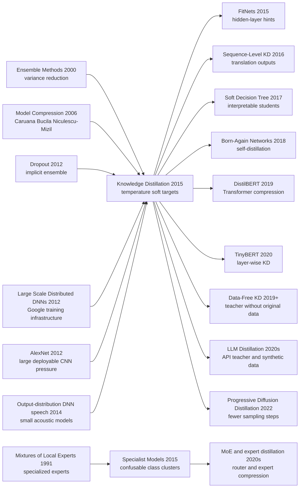

# Knowledge Distillation — 把大模型的暗知识倒进小模型

> **2015 年 3 月 9 日，Geoffrey Hinton、Oriol Vinyals、Jeff Dean 三位作者把 [arXiv:1503.02531](https://arxiv.org/abs/1503.02531) 挂上来，题目朴素到像一句工程备忘录：Distilling the Knowledge in a Neural Network。** 它没有发明新架构，却改写了“模型知识”这四个字的含义：知识不一定锁在参数里，也可以藏在老师模型对错误类别的相对概率中。一个 2×800 的 MNIST 小网络靠温度为 20 的 soft targets，把错误数从 146 压到 74，几乎追上 2×1200 dropout 大网络的 67；Android voice-search 风格的声学模型也把 10 个模型 ensemble 的收益蒸进单模型。后来从 BERT 压缩、LLM synthetic data 到 diffusion 少步采样，“teacher-student”几乎成了部署大模型时的默认动词。

## 一句话总结

Hinton、Vinyals、Dean 2015 年发布在 NIPS Deep Learning Workshop / arXiv 的 Knowledge Distillation，把“部署小模型”从手工剪枝或重新调参，改成了让学生模型匹配老师模型的温度软分布：$q_i=\exp(z_i/T)/\sum_j\exp(z_j/T)$。高温 softmax 把原本接近 0 的错误类别概率拉开，让“这张 2 更像 3 而不是 7”这类暗知识进入梯度；在高温且 logit 零均值近似下，它又退化成 logit matching。它替代的失败 baseline 是“只用 hard labels 训练同样的小网络”：MNIST 上 2×800 学生从 146 个错误降到 74，接近 2×1200 dropout 老师的 67；Android voice-search 声学模型中，10 模型 ensemble 的 frame accuracy 61.1% 被蒸成单模型 60.8%，WER 同为 10.7%。这条线承接 [Dropout（2012）](2012_dropout.md) 的隐式 ensemble、[AlexNet（2012）](2012_alexnet.md) 后的大模型部署压力，并在 [BERT（2018）](../era3_attention/2018_bert.md) 之后变成 Transformer/LLM 压缩和合成监督的基础语法。反直觉点在于：学生不是只学老师“答对什么”，而是学老师“如何犯错”。

---

## 历史背景

### 2015 年真正紧张的不是训练，而是部署

Knowledge Distillation 的出现，要放在 2012-2015 年深度学习从实验室走向线上产品的夹缝里看。AlexNet 之后，大家已经相信大网络能赢；Google、Microsoft、Baidu、Facebook 都在把深度网络塞进语音、图像、广告、搜索和移动端服务。但线上系统面对的不是论文里的“再训一个更大的模型”，而是毫秒级延迟、批量请求、内存预算和能耗预算。训练阶段可以慢，可以用大集群，可以把很多模型平均起来；部署阶段却要在每个用户请求上立刻给答案。

这篇论文的第一段用了一个很 Hinton 的比喻：昆虫的幼虫和成虫形态不同，因为进食与迁徙/繁殖的需求不同。机器学习也不该默认训练模型和部署模型长得一样。训练时可以用 cumbersome model：一个 ensemble，或一个用 dropout 等强正则训很久的大模型；部署时可以把它蒸馏成一个小模型。这不是“压缩权重文件”这么简单，而是把大模型学到的函数行为转移过去。

### 直接推到 KD 门口的前序工作

第一条前序是 ensemble。Dietterich 2000 年系统总结过 ensemble 为什么有效：多个模型平均可以降低方差、改善泛化。但 ensemble 的坏处同样直接：推理成本按模型数线性增长，线上系统很难承受。KD 继承 ensemble 的泛化收益，却把推理成本从“跑十个模型”还原成“跑一个模型”。

第二条前序是 Buciluă、Caruana、Niculescu-Mizil 2006 年的 Model Compression。那篇 KDD 论文已经证明，可以用一个大 ensemble 的输出去训练一个小模型。Hinton、Vinyals、Dean 三位作者真正做的是把这条路线变成深度学习时代的标准形式：不用只匹配最终类别，也不用直接回归 logits，而是通过温度 softmax 暴露类别之间的相似结构。

第三条前序是 dropout。Dropout 不是 ensemble 的旁枝，而是这篇论文的内在动机之一：一个 dropout 大网络可以看作指数级多个共享权重子网络的平均。论文的 MNIST 老师模型正是一个强 dropout 网络。换句话说，KD 同时压缩显式 ensemble 和隐式 ensemble。

第四条前序是 Google 的分布式深度学习基础设施。Jeff Dean 等作者 2012 年的 Large Scale Distributed Deep Networks 让“训练很大的模型”变成工业可行，但这也制造了新问题：训练端越有钱，部署端越难跟上。KD 站在这个矛盾正中间。

### 作者团队为什么正好会写出这篇论文

这三位作者的组合很有解释力。Geoffrey Hinton 带来神经网络、dropout、soft targets 和“模型知识不是参数本身”的直觉；Oriol Vinyals 当时在 Google，后来会在序列建模、神经机器翻译和 AlphaStar 等方向工作；Jeff Dean 则代表 Google 训练基础设施和大规模线上服务的工程现实。

因此这篇论文不像单纯的压缩技巧，也不像纯理论论文。它同时关心三个尺度：MNIST 这种可控小实验、Android voice-search 风格的商用声学模型、以及 JFT 这种一亿图像/一万五千类别的大规模视觉系统。很多论文只在其中一个尺度成立，KD 论文的说服力来自它把“暗知识”这个概念从玩具任务一路推到工业部署。

### 数据、算力与产品压力

论文里的声学实验很能说明当时的压力：8 个隐藏层，每层 2560 个 ReLU，softmax 有 14,000 个 HMM 状态，总参数约 85M；训练数据约 2000 小时英语语音，折成 700M 帧级训练样本。这个模型本身已经不是小模型，十个这样的模型 ensemble 对在线语音识别更是沉重。

JFT 实验更夸张：100M 标注图像、15,000 个标签，baseline CNN 训练约六个月。直接训练完整 ensemble 要等几年，于是论文提出 specialist models：每个专家只管一簇容易混淆的类别，如桥、车型、节庆图片。专家训练几天即可并行完成，再和 generalist 合并预测。

这就是 KD 的历史坐标：深度学习的“训练侧”第一次明显富裕起来，能训练大模型、大 ensemble、大数据系统；“部署侧”却仍然贫穷，要低延迟、低成本、高吞吐。Knowledge Distillation 给这两个世界之间装了一根管道。

---

## 方法详解

### 整体框架

Knowledge Distillation 的核心流程很短：先训练一个 expensive teacher，再用 teacher 对 transfer set 产生 soft targets，最后让 deployable student 同时学习 soft targets 与少量 hard labels。这里的 teacher 可以是显式 ensemble，也可以是一个用 dropout 强正则训练的大模型；transfer set 可以是原始训练集，也可以是不带标签的额外数据；student 则是最终要上线的网络。

论文真正改变的是“目标”的形状。普通训练把每个样本压成 one-hot 标签，告诉模型“正确答案是哪一类”。蒸馏训练把 teacher 的完整分布交给 student，告诉它“其他类错得有多像”。这就是 Hinton 所说的 dark knowledge：概率很小但相对比例有意义的错误类别。

| 组件 | 作用 | 2015 年的取舍 | 后续影响 |
|---|---|---|---|
| Cumbersome teacher | 提供高质量泛化行为 | ensemble 或强正则大模型 | foundation model / API teacher |
| Temperature softmax | 放大错误类别之间的相对概率 | 手调 T，MNIST 用 T=20 | logit KD 的标准入口 |
| Transfer set | 承载 teacher 的函数行为 | 可有标签也可无标签 | synthetic data / unlabeled data KD |
| Student objective | 同时匹配软目标与硬标签 | soft loss 权重大，hard loss 权重小 | KL + CE 混合损失 |
| Specialist models | 只学易混类别簇 | JFT 上 61 个专家并行训练 | expert routing / class-specialized teachers |

### 关键设计

#### 设计 1：Temperature softmax —— 把暗知识从零附近拉出来

**功能**：普通 softmax 会把强 teacher 的输出推到接近 one-hot，错误类别概率常常只有 $10^{-6}$ 或 $10^{-9}$，交叉熵几乎看不见它们。温度 $T$ 把分布变软，让 student 看见“哪些错误更合理”。

$$
q_i = \frac{\exp(z_i/T)}{\sum_j \exp(z_j/T)}
$$

当 $T=1$ 时，这是普通预测；当 $T$ 增大时，logit 差异被缩小，低概率类别被抬起来。对 MNIST 这样的任务，teacher 对正确答案高度自信，但“某个 2 更像 3 还是更像 7”的信息就藏在这些低概率项里。hard label 把这部分全删掉，soft target 则把它变成训练信号。

设计动机不是让 student 模仿 teacher 的错误，而是让 student 学会 teacher 的局部相似度结构。真正有价值的是概率比值：BMW 比垃圾车更像另一辆车，比胡萝卜更不像。这种结构比 one-hot 标签多出很多位信息，因此每个样本能给 student 更低方差、更密集的梯度。

#### 设计 2：软目标与硬标签的双损失 —— 既学老师，也别忘了答案

**功能**：student 不能总是完全匹配 teacher，尤其当 student 容量更小时。如果只学 soft target，student 可能在正确类别上稍微偏离；如果只学 hard label，它又丢掉 dark knowledge。论文采用两个交叉熵的加权平均。

$$
\mathcal{L}_{KD}=\alpha T^2\,CE\left(p_T^{teacher},p_T^{student}\right)+(1-\alpha)\,CE\left(y,p_1^{student}\right)
$$

这里 $p_T$ 表示用温度 $T$ 得到的分布，$p_1$ 表示推理温度为 1 的普通分布。$T^2$ 不是装饰项：论文指出 soft-target 梯度幅度约随 $1/T^2$ 缩小，如果调温度时不乘回去，hard loss 和 soft loss 的相对权重会悄悄改变。

```python
def distillation_loss(student_logits, teacher_logits, labels, temperature=4.0, soft_weight=0.9):
    teacher_probs = softmax(teacher_logits / temperature)
    student_log_probs = log_softmax(student_logits / temperature)
    soft_loss = kl_divergence(student_log_probs, teacher_probs) * (temperature ** 2)
    hard_loss = cross_entropy(student_logits, labels)
    return soft_weight * soft_loss + (1.0 - soft_weight) * hard_loss
```

设计动机很工程化：teacher 的分布给出泛化方式，hard labels 负责把 student 往真实答案轻轻拉回去。论文还观察到，hard loss 通常只需要较低权重；这和今天很多 LLM distillation 场景相似，teacher 的长答案/概率分布负责主要监督，少量人工标签负责校准方向。

#### 设计 3：高温极限下的 logit matching —— 解释为什么这不是魔法

**功能**：把 temperature KD 和 Caruana 式 logit regression 统一起来。论文推导说明，当温度远高于 logit 幅度、并且每个样本的 teacher/student logits 都先零均值化时，soft-target 交叉熵对 student logit 的梯度近似等价于平方匹配 teacher logits。

$$
\frac{\partial C}{\partial z_i}=\frac{1}{T}(q_i-p_i)\approx \frac{1}{NT^2}(z_i-v_i)
$$

这里 $z_i$ 是 student logit，$v_i$ 是 teacher logit，$N$ 是类别数。这个公式给了 KD 一个很干净的解释：它不是神秘地“传知识”，而是在合适温度下让 student 对齐 teacher 的函数边界；温度越低，极小负 logits 越容易被忽略，反而可能过滤掉 teacher 中不可靠的长尾噪声。

这也解释了论文里的温度现象：当 student 还有足够容量时，较高温度都差不多；当 student 被压到每层 30 个单元时，中间温度 2.5 到 4 更好。过高温度要求 student 匹配太多细枝末节，过低温度又退回接近 one-hot。

#### 设计 4：Specialist models —— 在一万五千类里只把易混处做细

**功能**：当类别数巨大时，完整 ensemble 的训练成本太高。论文提出 generalist + specialists：generalist 看全类别，specialists 只看易混类别簇，其余类合并成 dustbin class。专家从 generalist 初始化，每个专家训练时一半样本来自自己的类别簇，一半从其他类别随机抽样。

$$
\arg\min_q\; KL(p^g,q)+\sum_{m\in A_k} KL(p^m,q)
$$

推理时先用 generalist 找 top class，再激活覆盖该类别的 specialists。最终全类别分布 $q$ 通过最小化 generalist 分布和 active specialists 分布到 $q$ 的 KL divergence 得到。这个设计不像后来的 mixture-of-experts 那样为每个样本训练一个门控网络；它更像“给容易混淆的局部区域补显微镜”。

JFT 实验里，61 个 specialist 每个覆盖 300 个类，训练几天即可并行完成。baseline top-1 accuracy 是 25.0%，加 specialists 后到 26.1%，总体相对提升 4.4%；覆盖某类的专家越多，提升通常越大。论文最后坦率承认：他们还没有把 specialist ensemble 再蒸回单一大模型。这是未完成的下一步，也预告了后来的 expert distillation 和 routing distillation。

### 实验关键数据

| 场景 | 系统 | 关键数字 | 说明 |
|---|---|---|---|
| MNIST | 2×1200 dropout teacher | 67 test errors | 强正则大模型，接近 ensemble 行为 |
| MNIST | 2×800 hard-label student | 146 test errors | 同样小模型，只按普通标签训练 |
| MNIST | 2×800 distilled student | 74 test errors at T=20 | 几乎追上 teacher，证明 soft targets 是有效正则 |
| Missing digit 3 | 无 3 transfer set + bias correction | 109 total errors, 14 on digit 3 | 从未看过 3 仍能靠 teacher 分布识别 98.6% 的测试 3 |
| Speech | baseline / 10-model ensemble / distilled | 58.9 / 61.1 / 60.8 frame accuracy; WER 10.9 / 10.7 / 10.7 | 单模型拿到 ensemble 几乎全部 WER 收益 |
| JFT specialists | baseline + 61 specialists | top-1 25.0% -> 26.1% | 在 100M 图像、15,000 类上证明局部专家能快速增益 |

这些实验的说服力不在某个数字特别漂亮，而在覆盖范围：小数据分类、大规模声学模型、超大类数视觉系统。它们共同证明一个观点：teacher 的输出分布不是辅助信息，而是另一种训练数据。KD 论文把模型压缩从“做小一点”推进到“重新定义监督信号”。

---

## 失败案例

### Baseline 1：只用 hard labels 的小模型学不到老师的相似度结构

KD 论文最直接打掉的 baseline，是“把同一个小模型按普通方式训练好”。这听起来公平，因为 student 架构不变、训练数据也不变；但结果说明，真正缺的不是优化轮数，而是监督信号本身。MNIST 上，2×800 小网络不加正则、只学 hard labels 时有 146 个测试错误；同一个小网络用 T=20 的 soft targets 蒸馏后，错误数降到 74。

为什么差距这么大？hard label 把一个样本的全部监督压缩成一位信息：它是 2，不是别的。soft target 则给出 teacher 的局部几何：这个 2 有点像 3，另一个 2 有点像 7。对 student 来说，这相当于每个样本都携带一个类别相似度向量。小模型容量有限，更需要这种密集梯度来决定如何分配有限参数。

最戏剧化的是“没有数字 3”的实验。transfer set 里删掉所有 3，student 从未见过 3 的图像，却仍能在 bias correction 后把 1010 个测试 3 中的 996 个分对。它不是凭空认识 3，而是从 teacher 对其他数字的 soft distribution 里学到了“3 在类别空间里应该在哪里”。hard-label 训练根本没有通道传递这种信息。

### Baseline 2：直接上线 ensemble 准确但太重

ensemble 是 KD 的父辈，也是 KD 要替代的部署 baseline。多个模型平均通常更稳，论文的 speech experiment 也证明确实如此：10 个声学模型 ensemble 把 frame accuracy 从 baseline 58.9% 提到 61.1%，WER 从 10.9% 降到 10.7%。问题在于，这个 ensemble 要在每个语音帧上跑十次约 85M 参数的模型。

这在研究评测里可以接受，在 Android voice search 风格的线上系统里就很难。语音识别不是离线 batch job；它要持续处理用户音频流，并且延迟直接影响体验。KD 的关键胜利是把 ensemble 的收益蒸进一个同尺寸单模型：distilled model 的 frame accuracy 是 60.8%，WER 也是 10.7%。换句话说，它几乎保留了 ensemble 对最终识别错误率的收益，却把推理成本拉回单模型。

这也是 KD 后来在移动端、浏览器端、边缘设备上流行的根本原因。它不是追求 leaderboard 的最后 0.1%，而是把一个“评测可用但产品不可用”的系统变成“产品可用”。

### Baseline 3：直接匹配 logits 太硬，temperature 给了可调的过滤器

Caruana 的 Model Compression 已经证明 logit matching 有用，这不是 KD 论文要否认的 baseline。问题是，直接平方匹配所有 logits 会把 teacher 的每个输出维度都当成同等可靠，尤其包括那些极负、几乎不受训练目标约束的 logits。Hinton、Vinyals、Dean 的温度形式给了一个更可调的版本。

高温时，KD 接近 logit matching；中低温时，极小概率类别的影响被压下去。这个差异在 student 容量不足时很重要。论文观察到，当每层只有 30 个单元时，T=2.5 到 4 比更高或更低的温度更好。这说明 student 不一定应该复制 teacher 的所有尾部细节；它应该复制那些对泛化有用、同时又符合自身容量的部分。

所以 KD 对 logit matching 的改进不是“换了个名字”，而是把匹配强度做成可调带宽。temperature 像一个信息滤波器：太低，只剩 hard-label 近邻；太高，噪声也进来；中间温度才是小模型最能消化的暗知识。

### Baseline 4：完整 specialist ensemble 带来收益，但还没被真正蒸完

论文后半部分的 specialist models 很容易被读者忽略，因为它没有完成“再蒸回单模型”的闭环。但它暴露了另一个失败 baseline：在超大类别空间里，训练很多完整模型做 ensemble 太贵，而只训练一个 generalist 又不能细分所有易混类别。

JFT 的 15,000 类里，很多错误来自局部簇：桥和桥，车型和车型，节庆场景和相似活动。61 个 specialist 确实把 baseline top-1 从 25.0% 推到 26.1%，但推理时仍要按输入激活若干专家，并通过优化 KL 目标合并分布。它比完整 ensemble 便宜，却仍比单模型复杂。

论文最后承认他们尚未证明能把 specialists 的知识蒸进一个 single large net。这不是小问题，而是一个未还的工程债。后来的 MoE distillation、router distillation、multi-teacher KD，都在继续补这个缺口：局部专家能给出更细监督，但真正部署时仍希望回到一个简单、稳定、低延迟的学生。

| 失败路线 | 当时为什么合理 | 暴露的问题 | KD 的修正 |
|---|---|---|---|
| Hard-label student | 训练简单，和普通监督一致 | 丢掉错误类别相似度 | 用 teacher soft distribution 做密集监督 |
| Direct ensemble deployment | 准确率强，泛化稳定 | 推理成本和延迟乘以模型数 | 把 ensemble 行为蒸进单模型 |
| Raw logit matching | 直接继承 Model Compression | 极负 logits 可能噪声大、容量不匹配 | 用 temperature 控制可见信息带宽 |
| Single generalist only | 训练/部署最简单 | 大类数下细粒度混淆难解 | 用 specialists 补局部易混区域 |
| Specialist ensemble only | 局部精度提升明显 | 仍是复杂推理系统 | 后续需要 multi-teacher / expert distillation |

---

## 思想史脉络



### 前世（被谁逼出来的）

KD 的前世有两条看似相反的线。第一条是 ensemble：多个模型平均更准，但上线太贵。第二条是 model compression：Caruana 已经证明可以把 ensemble 的函数行为转给小模型，但深度学习时代需要更适合神经网络输出层的形式。Temperature softmax 正是这两条线的接合点。

还有一条更隐蔽的线是 Hinton 自己的 dropout。Dropout 让一个网络在训练时像许多共享权重模型的 ensemble，蒸馏则问：既然训练时的隐式 ensemble 很有用，能不能把这种泛化行为转成一个不带 dropout 噪声、推理更直接的学生？这让 KD 和 Dropout 不是并列技巧，而像一枚硬币的两面：一个制造泛化，一个转移泛化。

Google 的大规模系统背景也不可少。没有 Jeff Dean 一脉的分布式训练，大 teacher 很难成为常态；没有 Android voice search 这类线上系统，大 teacher 的部署痛苦也不会那么尖锐。KD 是训练基础设施成熟之后自然冒出的部署基础设施。

### 今生（继承者）

最直接的继承者是 FitNets：既然输出分布可以蒸馏，中间层表示也可以蒸馏。后来 feature-based KD、attention transfer、relation KD 都沿着这条线扩展，把“知识”从 logits 推广到 hidden states、feature maps、样本间关系。

NLP 里，sequence-level KD 把 teacher 的完整译文作为训练目标，绕开逐 token 分布过宽的问题；BERT 之后，DistilBERT、TinyBERT、Patient KD 把 Transformer 的层数、宽度和中间表示一起压缩。到 LLM 时代，KD 的边界又变宽：很多小模型不是直接拿 teacher logits，而是拿 teacher 生成的答案、链式推理、偏好数据或合成 instruction 数据训练。

生成模型里，KD 也从分类分布变成过程压缩。Progressive Distillation for Diffusion Models 不再是“把类别概率教给学生”，而是把很多步 denoising teacher 压成更少步的 student。它继承的是同一个部署哲学：训练时可以慢，生成或推理时要快。

### 误读 / 简化

最常见的误读是把 KD 简化成“拿大模型伪标签训练小模型”。伪标签只保留 top answer，而 KD 的原始锋利之处恰恰在非 top 类别的相对概率。若只留下 hard pseudo labels，就把 dark knowledge 删除了。

第二个误读是认为 KD 总能让小模型接近大模型。论文自己的温度实验已经提醒过：student 容量太小时，高温全量匹配反而不合适。KD 不是违反容量限制的魔法，而是一种更有效地使用 student 容量的监督方式。

第三个误读是把 teacher 当成绝对真理。teacher 的 calibration、偏见、长尾错误都会传给 student。现代 LLM distillation 里，学生不仅会学 teacher 的能力，也会学 teacher 的幻觉、拒答风格和安全边界。KD 传的是函数行为，不保证行为本身正确。

最后，KD 不等于模型压缩的全部。剪枝、量化、低秩分解、稀疏化解决的是参数和算子形态；KD 解决的是监督信号。真正好用的部署系统往往把它们叠在一起：先用 KD 保住行为，再用量化/剪枝压推理成本。

---

## 当代视角

### 2026 年回看：KD 比模型压缩更大

从 2026 年看，Knowledge Distillation 的影响已经远远超过“把大模型变小”。它变成了机器学习里一种通用的知识搬运方式：从 ensemble 到单模型，从云端 teacher 到端侧 student，从 closed-source API 到 open-weight 模型，从慢 diffusion sampler 到快 sampler，从人工标注数据到 teacher 生成的 synthetic data。

这篇论文最耐久的观点是：模型的输出分布本身可以成为数据。传统监督学习把标注者当作数据源，KD 把 teacher function 也当作数据源。只要 teacher 在某些区域比原始标签更有信息，student 就能从这种“函数标注”里获得额外监督。这个思想在 LLM 时代尤其明显：很多小模型真正学到的不是人类原始标签，而是 GPT-4、Claude、Gemini、DeepSeek 等 teacher 生成的答案、解释、偏好和拒答边界。

但 KD 的风险也被放大了。2015 年的 teacher 多半是同一任务上更大的判别模型；2026 年的 teacher 可能是一个有安全策略、商业偏好、幻觉模式和未知训练数据的通用模型。蒸馏不只转移能力，也转移偏见、过度自信和错误习惯。

### 哪些假设站不住了

| 2015 年隐含假设 | 当时为什么合理 | 2026 年的问题 | 现代修正 |
|---|---|---|---|
| Teacher 总是更可信 | ensemble 通常比单模型泛化好 | foundation teacher 会幻觉、偏置、拒答不稳定 | 用过滤、验证器、多 teacher 和人工偏好校准 |
| Soft labels 足够表达知识 | 分类任务的输出空间有限 | LLM/生成模型的知识常在长文本、推理轨迹和工具调用里 | 蒸馏 logits、rationales、trajectories 和 preference |
| Transfer set 可以近似原始分布 | MNIST/speech 任务分布清晰 | 真实部署有长尾、OOD、prompt shift | 主动采样、合成数据覆盖、failure mining |
| Student 主要更小 | 部署目标是压缩模型 | 现代 KD 也用于同尺寸自蒸馏、数据生成、能力对齐 | 把 KD 看成监督重写而非纯压缩 |
| 温度是主要旋钮 | 输出层分布是中心 | Transformer/LLM 还涉及中间层、注意力、KV cache、解码策略 | 多层、多目标、多阶段蒸馏 |

这些变化没有削弱 KD，反而说明原论文的抽象足够大。只要把“soft target”从分类概率推广到“teacher 暴露出的行为轨迹”，KD 就仍然是现代模型生态的核心机制。

### 如果今天重写这篇论文

如果今天重写 KD，第一件事会是把 teacher uncertainty 写得更清楚。2015 年论文默认 teacher 的软分布大多有益；今天会区分 epistemic uncertainty、aleatoric uncertainty、calibration error 和偏见。一个好的 student 不应盲目复制 teacher 的每个概率，而应学习哪些概率可信，哪些只是 teacher 在 OOD 区域的自信错觉。

第二件事会是把 transfer set 设计放到中心。论文已经用“没有 3”的 MNIST 实验提示 transfer distribution 很重要，但没有系统讨论如何选择 transfer data。现代版本会做 active distillation：专门找 teacher/student 分歧大、teacher 不确定、真实部署高频或高风险的样本，而不是只随机拿训练集。

第三件事会是把评估从 accuracy 扩展到 calibration、robustness、fairness、latency 和 privacy。KD 可能改善准确率，也可能复制 teacher 的偏见；可能压低延迟，也可能泄露 teacher 训练数据或专有能力。尤其在 LLM 场景里，蒸馏已经接近模型提取和数据合成的边界，需要更清晰的授权、审计和安全协议。

第四件事会是把“student 是否更小”从定义中拿掉。Born-Again Networks 已经说明，同容量 student 也能通过 teacher targets 变强；LLM instruction tuning 也说明，teacher 生成的数据可以训练结构完全不同的 student。现代 KD 的本质不是“小模型复制大模型”，而是“一个学习系统用另一个学习系统的行为作为训练信号”。

### 局限、相关工作与资源

原论文的局限非常诚实。第一，它没有完成 specialists 到单模型的蒸馏闭环；JFT 部分证明了 experts 有用，但没有证明复杂 expert ensemble 能完全压回一个 deployable student。第二，实验没有系统研究 teacher 错误如何被 student 放大。第三，它主要围绕分类/声学模型，没有触及生成式模型中 sequence-level 或 trajectory-level supervision 的复杂性。

今天读这篇论文，建议把它和几类后续工作连在一起看。FitNets 代表 feature distillation，Sequence-Level KD 代表结构化输出蒸馏，DistilBERT/TinyBERT 代表 Transformer 压缩，Born-Again Networks 代表 self-distillation，Progressive Distillation 代表生成过程压缩，LLM instruction distillation 则代表“teacher 生成数据”这一更宽泛版本。

最值得带走的不是某个温度值，也不是 MNIST 的 74 个错误，而是一种工程哲学：训练和部署可以使用不同形态的模型，昂贵 teacher 的价值不必永久绑在昂贵推理上。只要能把 teacher 的行为转化成 student 可吸收的监督，模型能力就可以在架构、规模、延迟和所有权边界之间迁移。


---

> 🌐 [English version](/en/era2_deep_renaissance/2015_knowledge_distillation/) · 📚 awesome-papers project · CC-BY-NC