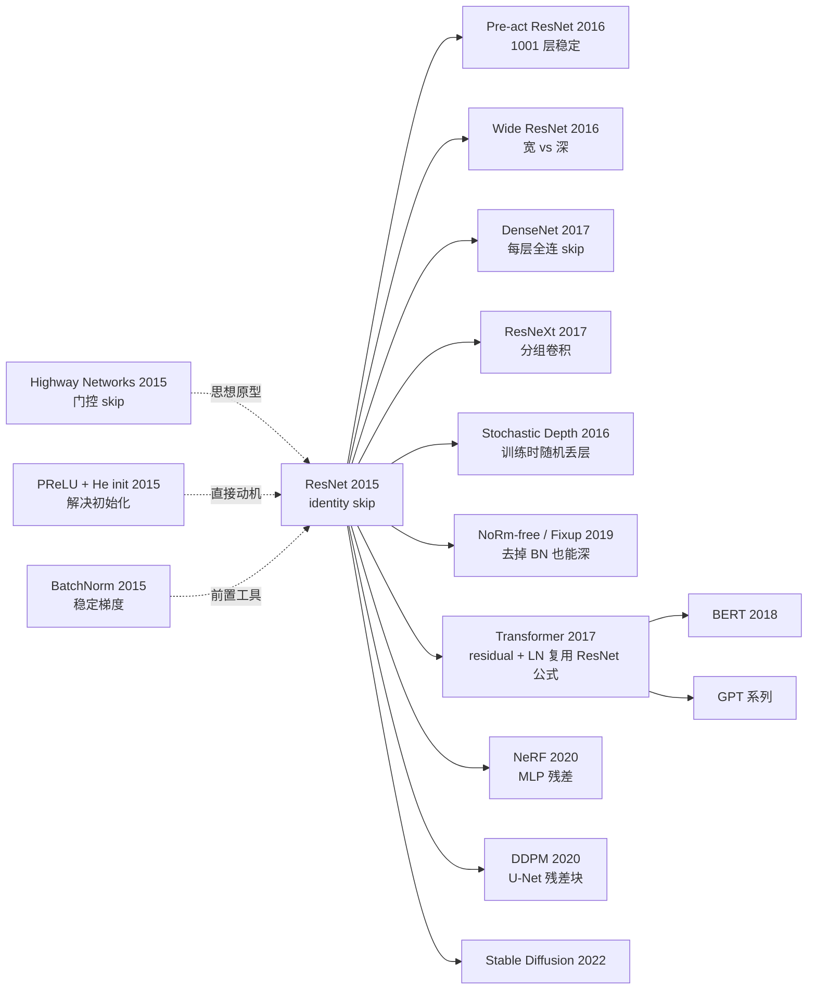

# ResNet — 深度残差学习如何打开 152 层之门

> **2015 年 12 月 10 日，Kaiming He 在 arXiv 上传 [1512.03385](https://arxiv.org/abs/1512.03385)。**
> 这是一篇只有 12 页、零数学证明的工程论文，却用一个看起来"什么都没做"的 skip connection，
> 让网络从 19 层跳到 152 层、ImageNet top-5 误差从 7.3% 降到 3.57%、并最终成为 Transformer / Diffusion / NeRF 时代仍在使用的基础组件。
> 它是 CVPR 2016 Best Paper，至今被引 25 万次，是 21 世纪被引最多的 CS 论文之一。

## 一句话总结

ResNet 用 $y = \mathcal{F}(x) + x$ 这个"恒等捷径"取代直接学习 $y = \mathcal{F}(x)$，让 152 层网络的优化变成"学残差"，从根本上解决了深度网络的退化问题（degradation problem）。

---

## 历史背景（History）

### 2015 年的视觉学界在卡什么

要理解 ResNet 的颠覆性，必须回到 2014-2015 那个"层数焦虑"的年份。

2012 年 AlexNet 8 层赢 ImageNet，2014 年 VGG 19 层、GoogLeNet 22 层各自把 top-5 误差压到 7% 左右。整个学界形成了一个朴素的共识：**更深 = 更好**。但这个共识在 2014 年下半年开始撞墙 —— 当时几个独立团队（包括 He 本人在 PReLU 论文里、Schmidhuber 团队的 Highway Networks）都发现：

> **把 VGG 从 20 层加到 30 层，训练 loss 不降反升；加到 50 层，根本训不起来。**

这不是过拟合（训练 loss 都在涨），也不是梯度消失（用了 BatchNorm 和 He init 之后梯度量级是健康的）。学界把这个现象叫 **degradation problem（退化问题）**，但没人能说清原因。

### 直接逼出 ResNet 的 3 篇前序

- **He et al., 2015 (PReLU + He init)** [arxiv/1502.01852](https://arxiv.org/abs/1502.01852)：He 自己上一篇文章已经把 30 层网络的初始化问题解决了，但他发现继续加深仍然变差 —— 这成了 ResNet 的直接动机。
- **Ioffe & Szegedy, 2015 (BatchNorm)** [arxiv/1502.03167](https://arxiv.org/abs/1502.03167)：BN 让深网梯度稳定，但**不能解决退化** —— 这反过来证明退化不是数值问题。
- **Srivastava, Greff, Schmidhuber, 2015 (Highway Networks)** [arxiv/1505.00387](https://arxiv.org/abs/1505.00387)：早 ResNet 7 个月提出"门控 skip" $y = T(x) \cdot \mathcal{F}(x) + (1-T(x)) \cdot x$，是 ResNet 的"思想原型"。但 Highway 用了门控权重 $T(x)$，参数多、训练不稳定。

### 作者团队当时在做什么

Kaiming He 当时是 MSRA 的青年研究员，团队（He / Zhang / Ren / Sun）是 Faster R-CNN 的作者，正在为 ILSVRC 2015 备战。**ResNet 不是孤立的炫技 paper，而是 MSRA 在 2015 年 ImageNet 全战场的弹药库**：他们用 ResNet 同时拿下了 ImageNet 分类、检测、定位、COCO 检测、COCO 分割 5 项第一。

### 工业界 / 算力 / 数据的状态

- **GPU**：NVIDIA Maxwell K40 / Titan X，单卡 12GB 显存，跑 152 层 ResNet 需要 8 卡 mini-batch 256
- **数据**：ImageNet-1k (1.28M 图)、CIFAR-10/100 是 sanity check 标配
- **框架**：Caffe 还是主流，PyTorch 一年后才出。原始 ResNet 用 Caffe 实现
- **行业焦虑**：Google 刚收购 DeepMind 一年，Facebook 成立 FAIR，深度学习从学术走向产品化的最后窗口期

---

## 方法详解

### 整体框架

ResNet 的整体 pipeline 极其简单：把 VGG 风格的 plain CNN 切成若干个 **residual block**，每个 block 用 skip connection 把输入直接加到输出上。整个网络分成 5 个 stage（conv1 + 4 个 residual stage + classifier），每进入新 stage 就把空间分辨率减半、通道数翻倍。

```
Input (224×224×3)
  ↓ 7×7 conv, 64,  stride 2  →  112×112
  ↓ 3×3 maxpool,    stride 2  →  56×56
  ↓ Stage 1: [Residual Block × N1]   64-d   →  56×56
  ↓ Stage 2: [Residual Block × N2]   128-d  →  28×28  (first block stride=2)
  ↓ Stage 3: [Residual Block × N3]   256-d  →  14×14  (first block stride=2)
  ↓ Stage 4: [Residual Block × N4]   512-d  →  7×7    (first block stride=2)
  ↓ Global Average Pool              →  1×1×512
  ↓ FC 1000 + softmax
```

不同深度只是改 $(N_1, N_2, N_3, N_4)$ 和使用 BasicBlock vs Bottleneck：

| 模型 | Block 类型 | $(N_1, N_2, N_3, N_4)$ | 总层数 | 参数量 | FLOPs |
|------|-----------|------------------------|--------|--------|-------|
| ResNet-18 | BasicBlock (2 conv) | (2, 2, 2, 2) | 18 | 11.7M | 1.8B |
| ResNet-34 | BasicBlock | (3, 4, 6, 3) | 34 | 21.8M | 3.6B |
| ResNet-50 | Bottleneck (3 conv) | (3, 4, 6, 3) | 50 | 25.6M | 3.8B |
| ResNet-101 | Bottleneck | (3, 4, 23, 3) | 101 | 44.5M | 7.6B |
| ResNet-152 | Bottleneck | (3, 8, 36, 3) | 152 | 60.2M | 11.3B |

注意一个反直觉点：**ResNet-50 的参数量只比 ResNet-34 多 17%，但层数多 47%、ImageNet top-5 error 直接砍掉 30%**。这是 bottleneck 的功劳（详见关键设计 2）。

### 关键设计

#### 设计 1：Identity Shortcut（恒等捷径）—— 真正的"魔法"

**功能**：把 block 的输入 $x$ 通过一个无任何变换的"加法旁路"直接送到 block 输出 $y$，让网络只需要学习"输入到输出的差异 $\mathcal{F}(x) = y - x$"，而不是直接学习"输入到输出的完整映射"。

**前向公式**：

$$
y = \mathcal{F}(x, \{W_i\}) + x, \quad \text{where } \mathcal{F}(x) = W_2 \, \sigma(W_1 x)
$$

这里 $\sigma$ 是 ReLU，$W_1, W_2$ 是两个 3×3 conv 的权重（已含 BN）。整个 block 只有 $\mathcal{F}$ 部分有可训练参数，**shortcut 路径上完全没有任何参数**。

**前向伪代码**（PyTorch 风格）：

```python
class BasicBlock(nn.Module):
    def __init__(self, ch):
        super().__init__()
        self.conv1 = nn.Conv2d(ch, ch, 3, padding=1, bias=False)
        self.bn1   = nn.BatchNorm2d(ch)
        self.conv2 = nn.Conv2d(ch, ch, 3, padding=1, bias=False)
        self.bn2   = nn.BatchNorm2d(ch)

    def forward(self, x):
        identity = x                        # ← 无参数 shortcut
        out = F.relu(self.bn1(self.conv1(x)))
        out = self.bn2(self.conv2(out))
        out = out + identity                # ← 核心一行：+ x
        return F.relu(out)
```

整个 ResNet 的"魔法"就是高亮的那一行 `out = out + identity` —— 无参数、无 FLOPs（加法可以与上一步 conv 融合）、无新超参。

**反向传播分析（这是论文最深刻的洞察）**：

设第 $l$ 层的输入为 $x_l$，pre-activation ResNet 中可以严格写出 $x_L$（任意更深层）和 $x_l$ 的关系：

$$
x_L = x_l + \sum_{i=l}^{L-1} \mathcal{F}(x_i, W_i)
$$

对 loss $\mathcal{E}$ 求梯度（链式法则）：

$$
\frac{\partial \mathcal{E}}{\partial x_l} = \frac{\partial \mathcal{E}}{\partial x_L} \cdot \left(1 + \frac{\partial}{\partial x_l} \sum_{i=l}^{L-1} \mathcal{F}(x_i, W_i)\right)
$$

注意括号里那个 **+1** —— 它意味着：**无论中间所有 $\mathcal{F}$ 项的梯度多小，shortcut 都保证了至少有一份完整梯度 $\partial \mathcal{E}/\partial x_L$ 直接回传到 $x_l$**。这就是 ResNet 解决梯度消失的数学本质。在 plain CNN 中，这个梯度需要连乘 $L-l$ 个雅可比矩阵，量级会指数级衰减；而在 ResNet 里，它是"加法 + 微小修正"。

**4 种 shortcut 策略对比（论文 Table 3）**：

| 策略 | 同维 block | 跨维 block (stride=2) | 参数开销 | top-1 error |
|------|-----------|----------------------|---------|-------------|
| (A) zero-padding | identity | zero-pad 通道 | 0 | 25.03% |
| (B) projection only on dim mismatch | identity | 1×1 conv | 极小 | **24.52%** ← 论文采用 |
| (C) projection everywhere | 1×1 conv | 1×1 conv | 大 | 24.19% |
| (D) (post-2016) identity even cross-dim | identity + 切片 | 切片+pad | 0 | 接近 B |

C 性能最好但参数最多。**作者反直觉地选了 B**，对外宣告："1×1 conv projection 不是 ResNet 的核心，identity shortcut 才是。能不引参数就不引。" 这个选择让 ResNet 保留了"零成本"美学，也成为后来 Pre-act / 1001 层论文能成立的前提。

**设计动机 —— 为什么这个 trick 这么管用？**

退化问题的本质是：让一个 conv 块学习恒等映射 $y = x$，对 SGD 来说**非常困难**，因为这要求 $W_2 \sigma(W_1 x) = x$，对 $W_1, W_2$ 来说没有显式的 0 解（ReLU 的非线性挡在中间）。

而 residual 公式 $y = \mathcal{F}(x) + x$ 把"学恒等映射"重新参数化成了"让 $\mathcal{F} \to 0$" —— 这只需要 **L2 正则把 $W_1, W_2$ 一起拉向 0**，而 L2 正则本来就是默认开启的！

换句话说：**ResNet 用一个免费的代数变换，把"难解的优化目标"映射到了"L2 正则的默认收缩方向"**。这是工程师对优化器的一次极其精妙的"贿赂"。

#### 设计 2：Bottleneck Block（瓶颈结构）—— 让深度变得"廉价"

**功能**：让 ResNet-50/101/152 这种超深网络的参数和 FLOPs 不会爆炸。

**核心思路**：把 BasicBlock 的 2 层 3×3 conv 换成一个"1×1 → 3×3 → 1×1" 的三明治：

```
input  256-d
  ↓ 1×1 conv, 64    ← 通道数压缩 4×（squeeze）
  ↓ 3×3 conv, 64    ← 在低维做昂贵的 spatial conv
  ↓ 1×1 conv, 256   ← 通道数恢复（expand）
  ↓ + identity (256-d shortcut)
output 256-d
```

**详细维度追踪**（以 stage 4 第一个 block 为例，输入 14×14×512）：

| 层 | kernel | 输入维度 | 输出维度 | 参数量 |
|----|--------|---------|---------|--------|
| conv1 (squeeze) | 1×1, 128 | 14×14×512 | 14×14×128 | 65,536 |
| conv2 (spatial) | 3×3, 128, s=2 | 14×14×128 | 7×7×128 | 147,456 |
| conv3 (expand)  | 1×1, 512 | 7×7×128 | 7×7×512 | 65,536 |
| identity shortcut (1×1, s=2 projection) | 1×1, 512, s=2 | 14×14×512 | 7×7×512 | 262,144 |
| **总计** | — | — | — | **~540k** |

如果用 BasicBlock 实现同等通道数，参数会是 $2 \cdot (3 \times 3 \times 512 \times 512) \approx 4.7M$，**bottleneck 把参数压了 8.7×**。

**为什么不在浅网络也用 bottleneck？**

ResNet-18/34 用 BasicBlock 因为参数本来就不大（11.7M / 21.8M），bottleneck 反而引入了额外的 1×1 conv overhead，得不偿失。**只有当层数 ≥50、通道数 ≥256 时，bottleneck 才显示出"砍参数砍 FLOPs"的威力**。这是一个非常工程化的设计选择 —— 不存在"普适最优 block"，只有"针对 scale 的最优 block"。

**设计动机**：ResNet-152 的总 FLOPs (11.3B) 仍然 **低于** VGG-19 的 19.6B —— 这是 bottleneck 把"超深网络"从"显存爆炸 + 推理超慢"的不可工程化区域拉回工程化区域的关键。如果没有 bottleneck，152 层 ResNet 大概率会跟 1202 层 ResNet 一样成为"实验室玩具"，而非工业级 backbone。

#### 设计 3：Pre-activation 顺序（2016 年 [Identity Mappings](https://arxiv.org/abs/1603.05027) 论文）—— 把 shortcut 路径"洗干净"

**功能**：原始 ResNet block 在 1000+ 层时仍然出现轻微退化；pre-activation 修复了这个问题，让 1001 层网络在 CIFAR 上稳定收敛。

**核心思路 —— 调换 BN/ReLU/conv 三件套的顺序**：

```
原始 (Post-activation):                Pre-activation (2016):
                                       
  x ─┐                                   x ─┐
     │                                      │
   conv                                    BN
     │                                      │
    BN                                    ReLU
     │                                      │
   ReLU                                   conv
     │                                      │
   conv                                    BN
     │                                      │
    BN                                    ReLU
     │                                      │
     +───── shortcut x                     conv
     │                                      │
   ReLU  ← 这一步污染了 shortcut 路径        +───── shortcut x  ← 完全干净！
                                           │
                                          (下一个 block 自带 BN-ReLU)
```

**为什么"干净的 shortcut"重要？数学分析**：

如果 shortcut 路径中间夹了 ReLU 或 BN，那么从第 $l$ 层到第 $L$ 层就不再是简单的 $x_L = x_l + \sum \mathcal{F}_i$，而是：

$$
x_L = f_L\left(f_{L-1}\left(\cdots f_{l+1}\left(x_l + \mathcal{F}_l\right) \cdots \right)\right)
$$

每个 $f_i$ 是 ReLU + BN 的复合非线性，梯度无法直接"加法回传"，又要变成连乘，部分退化问题回归。

而 pre-act 把所有非线性塞到 conv 之前，shortcut 路径变成：

$$
x_L = x_l + \sum_{i=l}^{L-1} \mathcal{F}(x_i, W_i)
$$

**严格的加法形式**，梯度回传时 +1 项无衰减地保留，1001 层都能训。这个改进**不是工程 trick，而是数学结构上的关键修正**，它反过来证明了"identity shortcut 才是 ResNet 真正的魂"。

**设计动机**：原始 ResNet 在 110 层时已经接近性能拐点；要走到 1000+ 层就必须修复这个 shortcut "污染" 问题。pre-act 把 ResNet 从"100 层级架构"升级到"1000 层级架构"，也奠定了后续 Transformer Pre-LN 设计的思想基础（GPT-2/3 用的就是 Pre-LN，Post-LN 在深 Transformer 里不稳定）。

#### 设计 4（隐性但关键）：4-stage downsampling 节奏

**功能**：决定 ResNet "深而不宽"还是"宽而不深"的几何骨架。

**核心思路**：把 224×224 输入按 2× 节奏下采样 5 次（含初始 maxpool），最终到 7×7 接 GAP；通道数从 64 翻倍到 512。每个 stage 内部分辨率不变，stage 之间通过"第一个 block stride=2 + projection shortcut" 完成下采样和通道翻倍。

**为什么 4 个 stage、为什么 2× 下采样、为什么 64→512？**

- **4 stage**：覆盖低/中/高/语义四级特征。少于 4 个 stage 感受野不够；多于 4 个 stage 7×7 之后再下采样会丢空间信息。
- **2× 下采样**：与通道翻倍配合，每 stage FLOPs 大致守恒（空间面积 ÷4，通道数 ×2，每个像素 conv FLOPs ×2，总 FLOPs ÷1）—— 这让 deep stages（语义层）的计算量不至于爆炸。
- **64→512**：经验值。后续 ResNeXt、EfficientNet、ConvNeXt 都微调过这条节奏，但"金字塔形 backbone + 4 stage" 已成事实标准，被几乎所有 CNN/Transformer hybrid 模型继承（Swin Transformer 也是 4 stage）。

**设计动机**：这套 stage 设计不是 ResNet 原创（VGG/GoogLeNet 已有类似结构），但 ResNet **第一次把它和"residual block 是 stage 内基本单元"绑死**，让"4-stage + residual block" 成为后续 10 年 backbone 设计的事实模板。

### 损失函数 / 训练策略

| 项 | 配置 | 说明 |
|----|------|------|
| Loss | Cross-entropy + softmax | 无任何特殊设计 |
| Optimizer | SGD | 没用 Adam |
| Momentum | 0.9 | |
| Weight decay | 0.0001 | **关键** —— 让 $\mathcal{F} \to 0$ 的天然驱动力 |
| LR schedule | 初始 0.1，loss plateau 后 ÷10 | 手工调度，2 次 decay |
| Batch size | 256 | 8 GPU × 32 |
| Epochs | ~120 | 600k iterations on ImageNet |
| Init | He init (kaiming normal) | 对 ReLU 激活的最优初始化 |
| Normalization | BatchNorm 在每个 conv 后 | He et al. 2015 |
| Data aug | Resize 256 + RandomCrop 224 + HFlip + ColorJitter | AlexNet-PCA 风格 color jitter |
| Test aug | 10-crop + multi-scale (224/256/384/480/640) | ensemble 时使用 |

**注意 1**：方法本身只引入一个 `+x` 加法，**不需要任何额外超参数、不增加可学习参数、不增加 FLOPs**（identity shortcut 是 0 FLOPs，也可以与上一步 conv 融合）。这种"零成本即神器"的特性是 ResNet 能成为"基础组件"而非"竞争者"的根本原因。

**注意 2**：训练 recipe 看起来朴素到不可思议（10 年前的 SGD 配方），但 ResNet 之所以能在 2026 年仍然作为基础组件，正是因为它**对 recipe 不敏感** —— 换 Adam、换 LayerNorm、换更大数据集，公式 $y = \mathcal{F}(x) + x$ 都仍然 work。这种"配方鲁棒性"才是真正的护城河。

---

## 失败案例（Failed Baselines）

### 当时输给 ResNet 的对手

- **Plain VGG-style 34 层网络**：训练 error 7.5%，验证 error 28.5%；同等容量的 ResNet-34 训练 6.5%，验证 24.2%。**注意：plain 34 比 plain 18 更差**，这是 degradation 的直接证据。
- **Highway Networks 19/32 层**：在 CIFAR-10 上 8.8% / 8.6% 错误率，ResNet-110 是 6.43%。Highway 多了门控参数，训练不稳定，深度也上不去（论文里只到 32 层）。
- **GoogLeNet Inception-v3**：top-5 单模型 5.6%，ResNet-152 单模型 4.49%。Inception 靠精妙的 multi-branch 拓扑设计，调参代价高、不易迁移到其他任务。

### 作者论文里承认的失败实验

论文 **Table 3** 比较了三种 shortcut 策略：
- **(A) zero-padding shortcut**（维度不同时填零）：top-1 error 25.03%
- **(B) projection shortcut for dim mismatch only**：24.52%
- **(C) projection shortcut for ALL connections**：24.19%

C 最好但参数最多。作者**故意选了 B**，论证："identity shortcut 才是核心，projection 不是关键，能不用就不用"。这个反直觉的选择保留了 ResNet 的"零成本"美学。

### 1202 层的反例

论文 §4.2 报告了一个有趣的"失败"：在 CIFAR-10 上训练 1202 层 ResNet，**收敛了**（说明优化没问题），但**测试 error 7.93% 比 110 层的 6.43% 高** —— 第一次证明 ResNet 也会过拟合。这成为 2016-2017 年 stochastic depth、wide ResNet、DenseNet 的研究起点。

### 真正的"反 baseline"教训

**Highway Networks 比 ResNet 早 7 个月**，思想几乎一致，但 Highway 至今几乎没人用。原因不是 idea 不行，而是 Highway 太"复杂"了（带门控）。**ResNet 的胜利是"工程极简主义"的胜利**：能不引入参数就不引入。这是 paper 没有写在论文里、但回过头看最重要的"失败案例" —— 复杂的 idea 即使早出现也会输给极简的 idea。

---

## 实验关键数据

### 主实验（ImageNet）

| 模型 | Top-5 error (val) | FLOPs |
|------|-------------------|-------|
| VGG-16 | 8.43% | 15.3B |
| GoogLeNet | 7.89% | 1.5B |
| PReLU-net | 7.38% | — |
| ResNet-34 (B) | 7.40% | 3.6B |
| ResNet-50 | 5.25% | 3.8B |
| ResNet-101 | 4.60% | 7.6B |
| **ResNet-152 (single)** | **4.49%** | 11.3B |
| **ResNet-152 (ensemble of 6)** | **3.57%** | — |

ILSVRC 2015 第一名，把人类水平 (~5%) 第一次清晰超过。

### 消融（CIFAR-10）

| 配置 | Test error | 说明 |
|------|-----------|------|
| Plain-20 | 8.75% | baseline |
| Plain-32 | 9.09% | 加深反而变差（degradation） |
| Plain-44 | 10.40% | 继续恶化 |
| Plain-110 | 18.06% | 完全训不起来 |
| ResNet-20 | 8.75% | 与 plain 持平（浅网络无 gain） |
| ResNet-32 | 7.51% | **加深开始 work** |
| ResNet-110 | **6.43%** | 110 层稳定收敛 |
| ResNet-1202 | 7.93% | 过拟合（参数 19.4M） |

### 关键发现

- **degradation 不是过拟合**：plain-110 训练 error 也很差，不只是验证差
- **identity shortcut 是核心，projection 不是关键**：Table 3 三策略差距 < 1%
- **bottleneck 让 152 层 FLOPs < VGG-19**：高深度的工程可行性
- **同等 FLOPs 下，更深更好**：ResNet-50 < ResNet-101 < ResNet-152，没有边际递减
- **泛化能力惊人**：原班人马拿 ResNet 同时打下 ImageNet 分类/检测/定位 + COCO 检测/分割 5 个 SOTA

---

## 思想史脉络（Idea Lineage）



### 前世（被谁逼出来的）

- **1991 LSTM** [Hochreiter, Schmidhuber]：cell state 的"加法路径"是 skip connection 的最早思想原型
- **2014 GoogLeNet auxiliary classifier**：尝试用浅层监督缓解深网梯度，是另一种"绕过深度"的思路
- **2015 Highway Networks** [Srivastava, Greff, Schmidhuber]：门控 skip，思想完全等价但工程复杂
- **2015 PReLU + He init**：解决数值问题但仍有 degradation，反向证明问题在优化 landscape

### 今生（继承者）

- **直接派生**：Pre-act ResNet (2016)、Wide ResNet (2016)、DenseNet (2017)、ResNeXt (2017)、SE-Net (2017)、Stochastic Depth (2016)、Fixup Init (2019)
- **跨架构借用**：Transformer 的每个 block `y = LayerNorm(x + Attention(x))` 完全复用了 ResNet 公式 —— **没有 ResNet 就没有 Transformer 的可训练性**
- **跨任务渗透**：NeRF 的 MLP、DDPM 的 U-Net、Stable Diffusion 的去噪网络、AlphaFold 2 的 Evoformer，全部内嵌 residual 结构
- **跨学科外溢**：神经常微分方程 [Chen et al., NeurIPS 2018 Best Paper] 把 ResNet 解释为欧拉离散化的 ODE，开启了"网络即动力系统"的研究流派

### 误读 / 简化

- **"skip 就是好的"**：很多 follow-up 把 skip 加在任意位置，但 ResNet 的精髓是**配对的 conv-conv-add**（保持维度匹配 + identity 是默认 path）。乱加 skip 在很多任务上反而变差
- **"层越深越好"**：1202 层实验早就证明这个简单结论是错的，但工业界 2016-2018 年盲目堆层风气依然盛行
- **"residual 是为了梯度回传"**：流行解释，但论文 §1 明确说**优化难度**才是核心，梯度数值在 BN 加持下其实是健康的

---

## 当代视角（2026 年回看 2015）

### 站不住的假设

- **"网络越深越好"**：今天我们知道，**宽度 / 数据 / 算力的边际收益在很多场景比深度更高**。Wide ResNet、ConvNeXt、Vision Transformer 都证明了这点。152 层不是"越深越好"的终点，而是"深度遇到了递减回报"的起点。
- **"identity shortcut 解决一切"**：在 1000+ 层 + 长序列场景下，identity 仍然不够。LayerNorm 在 shortcut 内/外的位置（Pre-LN vs Post-LN）成为 Transformer 训练稳定性的关键问题；Mamba/SSM 完全用了不同的结构。
- **"卷积是视觉的归纳偏置"**：ViT (2020) 证明纯 attention + ResNet 风格残差就能在大数据上 match CNN。卷积不是必需的，**残差才是**。

### 时代证明的关键 vs 冗余

- **关键**：identity shortcut 本身、"零额外参数"的工程美学、bottleneck 的参数效率
- **冗余 / 误导**：原始 ResNet 的 BN-ReLU 顺序（pre-act 更好）、projection shortcut（identity 足够）、最大 152 层的设定（典型 backbone 用 50/101 即可）

### 作者当时没想到的副作用

1. **成为 Transformer 的隐形支柱**：Vaswani 2017 的 "Attention is All You Need" 里，每个 sub-layer 都是 `LayerNorm(x + Sublayer(x))`，这是 ResNet 公式的完美移植。**没有 ResNet 提供的"可优化性 prior"，6 层 Transformer 都训不起来**。
2. **成为可解释性研究的金矿**：Lottery Ticket Hypothesis、Loss Landscape 可视化、Neural Tangent Kernel 等理论工具都把 ResNet 作为标准研究对象
3. **成为 NAS 的搜索空间基石**：EfficientNet、RegNet、NAS-Bench 全部把 residual block 作为搜索单元

### 如果今天重写 ResNet

如果 He 团队 2026 年重写 ResNet，可能会：
- 默认用 pre-activation 顺序
- 把 BN 换成 LayerNorm（对小 batch 更友好）
- 把 ReLU 换成 GELU 或 SiLU
- 用 RMSNorm 替代 BN 的复杂统计
- 加 token mixing branch（融合 attention 与 conv）
- 默认深度 50，宽度变成主要 scaling 维度
- 把 152 层这个"炫技数字"砍掉，因为时代已经过了"层数军备竞赛"的阶段

但**核心公式 $y = \mathcal{F}(x) + x$ 一定不会变**。这是它穿越时代的根本原因 —— 这个公式不依赖卷积、不依赖 BN、不依赖 ReLU，只依赖**加法可逆性**这个最朴素的性质。

---

## 局限与展望

### 作者承认的局限
- 1202 层过拟合，需要更强正则
- 在小数据集（CIFAR）上，过深的网络收益递减

### 自己发现的局限
- Identity shortcut 强制输入输出同维，在跨模态融合时需要 projection，破坏了"零成本"美学
- BatchNorm 依赖让小 batch / online learning 场景受限
- 152 层在推理时延对边缘设备不友好（虽然 FLOPs 低，但层数多 = launch 次数多 = GPU 调度开销大）

### 改进方向（已被后续工作证实）
- Pre-activation（已实现）
- Stochastic Depth / DropPath（已实现）
- Wide vs Deep 权衡（Wide ResNet / EfficientNet 已实现）
- Norm-free（Fixup / NF-ResNet 已实现）
- 跨模态 residual（Transformer / U-Net 已隐式实现）

---

## 相关工作与启发

- **vs Highway Networks**：思想等价，但 Highway 用门控 $T(x)$ 引入额外参数和优化难度。**教训：能 hard-code 的就不要 learn**。
- **vs GoogLeNet / Inception**：Inception 用复杂 multi-branch 拓扑+ NAS-like 调参，迁移到检测/分割成本高。ResNet 的"简单堆叠"反而泛化更好。**教训：简单 + 通用 > 复杂 + 专用**。
- **vs DenseNet**：DenseNet 把每层都连到所有后续层，极致的"信息复用"，但显存爆炸、不友好工业部署。ResNet 是 Pareto 前沿点。
- **vs Transformer (跨架构)**：Transformer 的 `LN(x + Sublayer(x))` 直接复用了 ResNet 公式。可以说 ResNet 是 Transformer 的"隐藏前置"。

---

## 相关资源

- 📄 [arXiv 1512.03385](https://arxiv.org/abs/1512.03385)
- 💻 [作者原始 Caffe 代码](https://github.com/KaimingHe/deep-residual-networks)
- 🔗 [PyTorch torchvision 实现](https://github.com/pytorch/vision/blob/main/torchvision/models/resnet.py)
- 📚 后续必读：[Pre-activation ResNet (2016)](https://arxiv.org/abs/1603.05027), [Wide ResNet (2016)](https://arxiv.org/abs/1605.07146), [DenseNet (2017)](https://arxiv.org/abs/1608.06993)
- 🎬 [李沐 ResNet 论文精读 (B 站)](https://www.bilibili.com/video/BV1P3411y7nn)
