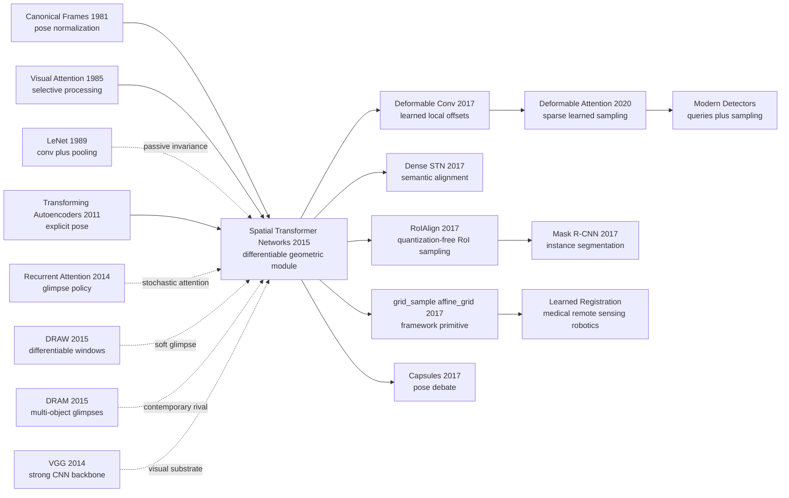

# Spatial Transformer Networks — 让 CNN 学会主动裁剪、对齐和变形

> **2015 年 6 月 5 日，DeepMind 与 Oxford VGG 的 Max Jaderberg、Karen Simonyan、Andrew Zisserman、Koray Kavukcuoglu 四位作者把 [arXiv:1506.02025](https://arxiv.org/abs/1506.02025) 挂到网上，随后在 NeurIPS 2015 发表。** 这篇论文没有再堆一个更深的分类器，而是往 CNN 中间塞进一个会“动”的模块：先预测几何参数，再生成采样网格，最后用可微采样把 feature map 裁剪、旋转、缩放或拉直。它的戏剧性不在于一个新 benchmark 被刷高，而在于一个旧视觉动作突然可学习了：对齐不再只是数据预处理或人工 part detector，而可以变成网络自己为了任务 loss 学出来的内部操作。

## 一句话总结

Jaderberg、Simonyan、Zisserman、Kavukcuoglu 2015 年的 **Spatial Transformer Networks** 把“几何对齐”从 CNN 外部的预处理步骤变成一个可插入、可反向传播的层：localization network 预测 $\theta=f_{loc}(U)$，grid generator 生成 $\mathcal{T}_\theta(G)$，sampler 用双线性插值产生 $V_i^c=\sum_{n,m}U^c_{nm}\max(0,1-|x_i^s-m|)\max(0,1-|y_i^s-n|)$。它打败的 baseline 不是某个单独模型，而是 CNN 当时对空间变化的默认处理方式：靠 pooling、augmentation 和固定结构被动获得局部不变性；STN 则让网络主动学习“看哪里、怎么裁、怎样归一化”。在 translated+cluttered MNIST 上，CNN 错误率 3.5%，ST-CNN 到 1.7%；SVHN 128px 下 CNN 从 4.0% 恶化到 5.6%，ST-CNN 仍保持 3.9%；CUB-200-2011 中 4xST-CNN 在无 part 标注下到 84.1%，还学出类似鸟头和身体的 attention。它后来最深的影响，是把 differentiable warping 变成视觉系统的基础算子：从 [R-CNN 系列](2014_rcnn.md) 的 RoIAlign、deformable convolution，到今天框架里的 `grid_sample`，都在沿用“预测坐标，再可微采样”的接口。

---

## 历史背景

### 2015 年的 CNN 已经会识别，但还不太会“摆正”对象

到 2015 年，视觉领域已经不再怀疑 CNN 的表示能力。[AlexNet](2012_alexnet.md) 打开 ImageNet 局面，[VGG](2014_vgg.md) 用更深的小卷积栈证明 depth 有效，Inception / GoogLeNet 用多分支结构把计算效率和精度一起往前推。问题换了一个形态：网络越来越强，但它对几何变化的处理仍然很被动。

传统 CNN 主要靠三件事获得不变性：数据增强告诉模型“旋转、平移、尺度变化都见过”；卷积共享让同一个滤波器在不同位置复用；pooling 让局部位移不那么敏感。这些机制有用，但它们不是主动的几何推理。一个数字被旋转、一个门牌被放大、一个鸟头只占图像一角时，CNN 通常不会显式说“我先把它裁出来并对齐”，而是希望后续层在固定网格上自己扛住变化。

STN 的历史位置就在这里：它不是再提出一种更大的 backbone，而是把“对齐”这件事塞进网络内部，让模型能根据输入动态生成一个采样网格。对 2015 年的社区来说，这是一种很有冲击力的改写：几何不再只是前处理、数据增强或人工 part detector，而成为一个可以被分类 loss 直接训练的神经网络层。

### 注意力刚进入视觉，但大多还不是几何层

2014-2015 年也是 attention 思想快速进入视觉的时期。Mnih 等作者的 recurrent visual attention 用 glimpse 和强化学习选择图像局部；DRAW 用可微读写窗口做生成；DRAM 用 recurrent glimpse 做多物体识别；图像描述和 VQA 方向也开始用 alignment 把词与图像区域联系起来。视觉系统不再只是“一次看完整张图”，而是在问“该看哪里”。

不过这些 attention 方法常常有两类代价：要么是 recurrent / stochastic policy，训练上需要 REINFORCE 或复杂 credit assignment；要么是面向特定任务的 attention weight，而不是一个可以替换图像坐标系的通用几何算子。STN 的漂亮之处是它把 attention 变成一个确定性、前馈、可微的 spatial transform。模型不是只给像素加权，而是真的在 feature map 上重采样。

| 2015 年路线 | 主要动作 | 训练信号 | STN 的差别 |
|-------------|----------|----------|------------|
| Data augmentation | 离线制造变换样本 | 分类 loss | 变换固定，不能按输入自适应 |
| Pooling / stride | 局部合并特征 | 分类 loss | 只给局部平移不变性 |
| Recurrent glimpse | 逐步选择区域 | 强化学习或复杂反传 | STN 是前馈可微模块 |
| Part detector | 显式找部件 | 常需框或 part 标注 | STN 可以只用任务标签学对齐 |
| Spatial Transformer | 预测采样网格并重采样 | 标准反向传播 | 主动几何归一化 |

### 作者团队的交汇点很特别

Max Jaderberg 和 Koray Kavukcuoglu 来自 DeepMind，Karen Simonyan 与 Andrew Zisserman 来自 Oxford Visual Geometry Group。这个组合本身就解释了论文的气质：DeepMind 一侧熟悉可微模块、attention 和端到端训练，Oxford VGG 一侧熟悉强视觉 backbone、几何直觉和细粒度识别。STN 不是纯几何论文，也不是纯神经网络 trick；它正好坐在这两个传统的交界处。

这种交界让论文做了一个很克制的选择。它没有提出一个完整新系统，而是提出一个模块，并反复展示这个模块可以插在 FCN、CNN、多层 CNN、并联 attention、细粒度分类和三维投影任务里。换句话说，STN 不是“一个模型”，而是“一个动作”：网络可以自己学习坐标变换。

### 当时的算力和框架环境

2015 年的深度学习框架还没有把 `grid_sample`、`affine_grid` 这类操作当成普通积木。要让一个网络输出坐标、再根据坐标对 feature map 做双线性采样，并保证梯度能回到坐标和输入特征，本身就需要明确的算子设计。今天看这是框架 API；当时这是论文贡献的一部分。

这也解释了为什么论文强调 sampler 的梯度和计算开销。STN 的可行性取决于它是否足够轻：如果每一次 spatial attention 都像跑一个检测器或优化一个对齐问题，它就不会成为 CNN 中间层。论文反复展示它带来的额外开销很小，甚至在高分辨率 attentive 模型里可能因为提前裁剪而降低后续计算。

## 研究背景与动机

### CNN 的不变性和等变性之间有矛盾

CNN 的成功常被解释为平移等变性和局部不变性：卷积让特征随输入平移而平移，pooling 让小范围位移不改变输出。但真实视觉变化远不止平移。旋转、尺度、透视、弹性形变、部件位置变化都会让固定网格上的卷积变得笨拙。模型可以通过更多数据和更大容量硬扛，但这不是高效解法。

STN 面对的矛盾是：识别最终希望某种不变性，但中间表示又需要保留足够几何信息来做正确对齐。太早丢掉几何，模型不知道该对齐什么；完全不处理几何，后续分类器要在巨大变换空间里学习。STN 的回答是让网络先预测一个变换，把输入或 feature map 主动 canonicalize，再交给后续识别层。

### 为什么监督信号可以这么弱

STN 最反直觉的一点是：它不需要告诉 localization network “正确的 crop 在哪里”。在 MNIST、SVHN、CUB 里，训练信号只是最终任务标签。只要裁剪、旋转或缩放能降低分类 loss，梯度就会穿过 sampler 回到变换参数，再回到 localization network。也就是说，alignment 变成了 latent action。

这个设定非常重要，因为视觉里的几何标注昂贵。细粒度鸟类识别可以标 head、body、wing，但人工 part label 难获得；多数字识别可以标框，但流水线就变复杂。STN 的动机不是完全消灭监督，而是证明：某些几何选择可以从端到端任务压力中自己长出来。

### 论文真正押注的事

STN 押注三件事。第一，几何变换可以被封装成一个通用可微模块，而不是每个任务单独写一套 preprocessing。第二，网络可以通过任务 loss 学到有意义的空间操作，不需要额外对齐标注。第三，主动空间变换可以与普通 CNN 互补：CNN 擅长局部纹理和层级语义，STN 负责把输入坐标系调到更容易识别的状态。

它最终改变的不是某一个数字，而是研究者对“层”的想象。层不一定只是卷积、池化、归一化或非线性；层也可以是一个可学习的几何程序。这个想法后来扩散到 RoIAlign、deformable convolution、可微渲染、图像配准和现代检测里的 learned sampling。

---

## 方法详解

### 整体框架

Spatial Transformer 的整体接口很小：输入一个 feature map $U\in\mathbb{R}^{H\times W\times C}$，输出一个被几何变换后的 feature map $V\in\mathbb{R}^{H'\times W'\times C}$。中间只有三步：localization network 从 $U$ 预测变换参数 $\theta$；grid generator 根据 $\theta$ 生成输出网格里每个位置对应的输入坐标；sampler 在这些坐标上重采样 $U$。

$$
\theta=f_{loc}(U),\qquad (x_i^s,y_i^s)=\mathcal{T}_\theta(x_i^t,y_i^t),\qquad V=\operatorname{Sample}(U,\mathcal{T}_\theta(G))
$$

这三个部件共同完成一个非常直接的动作：网络先“看一眼”输入，决定要怎样变换坐标系，再把原 feature map 拉到目标坐标系上。它可以放在输入图像后，也可以放在中间 feature map 后；可以用一次，也可以串联多次；可以让一个 transformer 处理整体对象，也可以并联多个 transformer 处理多个部件。

| 组件 | 输入 | 输出 | 作用 |
|------|------|------|------|
| Localization network | feature map $U$ | 参数 $\theta$ | 预测要执行的几何变换 |
| Grid generator | 目标网格 $G$ 与 $\theta$ | 采样坐标 $(x_i^s,y_i^s)$ | 把输出像素映射回输入坐标 |
| Sampler | $U$ 与采样坐标 | 变换后 feature map $V$ | 用可微插值读取输入特征 |

STN 的关键不是某个具体变换，而是这个接口本身。Affine、projective、piecewise affine、thin plate spline 都可以接进来；只要 grid generator 和 sampler 可微，最终分类 loss 就能训练出一个 spatial policy。

### 关键设计

#### 设计 1：Localization network —— 让变换参数由输入决定

**功能**：用一个小网络 $f_{loc}$ 读取当前输入或 feature map，并输出几何参数 $\theta$。这个网络可以是 FCN、CNN 或任何可微子网络；论文中常把最后一层初始化成 identity transform，让训练从“不变换”开始。

$$
\begin{pmatrix}x_i^s\\y_i^s\end{pmatrix}
=
\mathcal{T}_\theta(G_i)
=
\begin{bmatrix}
\theta_{11}&\theta_{12}&\theta_{13}\\
\theta_{21}&\theta_{22}&\theta_{23}
\end{bmatrix}
\begin{pmatrix}x_i^t\\y_i^t\\1\end{pmatrix}
$$

这是一种 input-conditioned layer。普通卷积层的权重固定，给不同图像执行同一个局部算子；STN 的几何参数随输入变化。模型看到一个旋转数字时可以预测旋转校正，看到一个偏到角落的门牌时可以预测平移和缩放。

```python
def initialize_affine_head(linear):
    linear.weight.data.zero_()
    linear.bias.data.copy_(torch.tensor([1.0, 0.0, 0.0, 0.0, 1.0, 0.0]))

class LocalizationNet(nn.Module):
    def forward(self, feature_map):
        hidden = self.backbone(feature_map).flatten(1)
        theta = self.fc(hidden).view(-1, 2, 3)
        return theta
```

| 选择 | 好处 | 风险 | STN 的取舍 |
|------|------|------|------------|
| 固定预处理 | 简单、稳定 | 无法按样本自适应 | 不采用 |
| 外部 detector | 可解释、可监督 | 需要框或 part label | 只作为对比背景 |
| Localization network | 端到端、输入自适应 | 可能学到坏 crop | 采用，通常从 identity 初始化 |
| Recurrent policy | 可多步推理 | 训练复杂 | STN 用前馈近似 |

**设计动机**：localization network 把“选择几何变换”变成普通神经网络预测问题。它不直接被标注监督，而是通过后续任务 loss 间接学习。这正是 STN 相比传统 alignment pipeline 的核心变化。

#### 设计 2：Grid generator —— 把输出网格反查到输入坐标

**功能**：给定输出 feature map 中的目标坐标 $(x_i^t,y_i^t)$，grid generator 用 $\theta$ 计算它应该从输入 $U$ 的哪个连续坐标 $(x_i^s,y_i^s)$ 取值。这个“反向映射”很重要，因为它保证输出网格每个位置都有定义，不会出现 forward warp 常见的空洞。

$$
V_i^c = \sum_{n=1}^{H}\sum_{m=1}^{W} U_{nm}^c\,k(x_i^s-m;\Phi_x)\,k(y_i^s-n;\Phi_y)
$$

论文强调 grid generator 不限于 affine。若 $\theta$ 是 TPS 控制点位移，$\mathcal{T}_\theta$ 就可以表达更柔性的形变；若 $\theta$ 是 projective 参数，就可以处理透视变换。STN 的模块边界使这些变换共享同一个 sampler。

```python
def affine_grid(theta, out_h, out_w):
    ys, xs = torch.meshgrid(torch.linspace(-1, 1, out_h),
                            torch.linspace(-1, 1, out_w), indexing="ij")
    ones = torch.ones_like(xs)
    target = torch.stack([xs, ys, ones], dim=-1).view(-1, 3).T
    source = theta @ target
    return source.transpose(1, 2).view(theta.size(0), out_h, out_w, 2)
```

| 变换族 | 参数规模 | 能表达什么 | 论文中的用途 |
|--------|----------|------------|--------------|
| Attention affine | $s,t_x,t_y$ | 缩放和平移 | 数字/部件 attention |
| Full affine | 6 | 平移、旋转、缩放、剪切 | 主要实验默认选择 |
| Projective | 8 | 透视变换 | distorted MNIST 对照 |
| Thin plate spline | 控制点相关 | 非刚性形变 | elastic / flexible warp |

**设计动机**：grid generator 把“几何模型”从 sampler 中剥离出来。这样一来，STN 不是 affine transformer 的同义词，而是一个 coordinate-transformer 框架。

#### 设计 3：Bilinear sampler —— 让采样坐标也能收到梯度

**功能**：在连续坐标 $(x_i^s,y_i^s)$ 上读取离散 feature map $U$。最近邻采样不适合端到端训练，因为坐标小变化不会平滑改变输出；双线性采样则让输出对坐标和输入像素都是分段可微的。

$$
V_i^c = \sum_{n=1}^{H}\sum_{m=1}^{W} U_{nm}^c\max(0,1-|x_i^s-m|)\max(0,1-|y_i^s-n|)
$$

梯度因此有两条路：一条回到输入 feature value $U_{nm}^c$，另一条回到采样坐标 $(x_i^s,y_i^s)$，再经过 grid generator 回到 $\theta$ 和 localization network。

$$
\frac{\partial V_i^c}{\partial U_{nm}^c}=w_{imn},\qquad
\frac{\partial V_i^c}{\partial x_i^s}=\sum_{n,m}U_{nm}^c\frac{\partial w_{imn}}{\partial x_i^s}
$$

```python
def bilinear_sample(feature, grid):
    # feature: [N, C, H, W], grid: [N, H_out, W_out, 2] in normalized coords
    return torch.nn.functional.grid_sample(
        feature, grid, mode="bilinear", padding_mode="zeros", align_corners=True
    )
```

| Sampler | 坐标可微性 | 视觉效果 | 适合 STN 吗 |
|---------|------------|----------|-------------|
| Nearest neighbor | 几乎处处不可微 | 边缘硬、跳变大 | 不适合训练 $\theta$ |
| Bilinear | 分段可微 | 平滑、便宜 | 论文默认选择 |
| Bicubic | 更平滑 | 计算更重 | 可行但非论文主线 |
| Learned kernel | 表达更强 | 参数和稳定性更复杂 | 后续工作方向 |

**设计动机**：sampler 是 STN 从“几何想法”变成“深度学习层”的关键。如果采样不可微，localization network 就只能靠外部监督或强化学习；双线性采样让标准反向传播直接训练 spatial policy。

#### 设计 4：串联与并联 STN —— 从一个对象到多个部件

**功能**：STN 可以放在网络不同深度，也可以并联多个 transformer。串联时，浅层 transformer 先做粗对齐，深层 transformer 再做更语义化的局部对齐；并联时，每个 transformer 可以学习关注不同对象或部件。

$$
V^{(k)}=\operatorname{STN}_k(U),\qquad Z=\operatorname{concat}(V^{(1)},\ldots,V^{(K)})
$$

这解释了论文里的两个关键实验。MNIST addition 需要分别读取两个数字，因此 2xST-FCN 明显优于单个 STN；CUB 鸟类识别中，两个或四个 STN 会自然分化出头部、身体等部件式 attention。论文也坦白一个限制：并联 transformer 的数量上限会限制模型同时处理的对象数。

```python
class MultiSTN(nn.Module):
    def __init__(self, transformers):
        super().__init__()
        self.transformers = nn.ModuleList(transformers)

    def forward(self, feature_map):
        crops = [stn(feature_map) for stn in self.transformers]
        return torch.cat(crops, dim=1)
```

| 组合方式 | 解决的问题 | 论文证据 | 局限 |
|----------|------------|----------|------|
| 单个 STN | 单对象粗对齐 | distorted / cluttered MNIST | 难同时覆盖多个目标 |
| 深层串联 STN | 逐级 canonicalization | 多层 CNN 插入实验 | 训练和解释更复杂 |
| 并联 STN | 多部件或多对象 attention | MNIST addition / CUB | 数量 $K$ 成为容量上限 |

**设计动机**：STN 不是只能执行一次的大裁剪。它更像一种 learnable view operator，可以在网络里重复调用。这个设计把它连接到后来的 attention head、RoI 操作和 deformable sampling。

### 损失函数与训练策略

STN 没有新的监督损失。所有实验都用任务本身的 loss：分类交叉熵、多数字识别 loss、co-localization 的 triplet/hinge loss 等。STN 层只改变前向计算图，使 task loss 能通过几何坐标回传。

$$
\mathcal{L}_{task}(y,\hat{y})\rightarrow \frac{\partial \mathcal{L}}{\partial V}\rightarrow \frac{\partial \mathcal{L}}{\partial (x^s,y^s)}\rightarrow \frac{\partial \mathcal{L}}{\partial \theta}\rightarrow \frac{\partial \mathcal{L}}{\partial \phi_{loc}}
$$

| 项 | 配置 | 说明 |
|----|------|------|
| 训练目标 | 原任务 loss | 不需要额外 alignment label |
| 初始化 | 常用 identity transform | 防止训练开始时裁掉目标 |
| 变换选择 | affine / projective / TPS | 由任务几何复杂度决定 |
| 插入位置 | 输入层或中间 feature | 越深越语义化，越浅越像图像对齐 |
| 采样核 | bilinear 默认 | 可微、便宜，但下采样会 alias |
| 多对象处理 | 并联多个 STN | 数量固定，容量受 $K$ 限制 |

这套训练策略的历史意义在于：它把“网络内部动作”纳入监督学习。模型不只学习 filter 权重，也学习该怎样移动自己的观察窗口。

---

## 失败案例

### 当时被 STN 打穿的 baseline

STN 打败的不是一个单独模型，而是一组关于空间变化的默认假设：CNN 只要足够深、augmentation 足够多、pooling 足够强，就能自己学到几何不变性。论文的实验刻意选择了几类会暴露这个假设弱点的场景：旋转/缩放/透视 MNIST、带噪声和 clutter 的平移数字、更大分辨率的 SVHN 多数字、以及需要找到细小部件的鸟类分类。

| Baseline | 代表路线 | 在论文中的症状 | 为什么输给 STN |
|----------|----------|----------------|----------------|
| FCN | 全连接分类器直接读像素 | noisy cluttered MNIST 13.2% error | 没有局部共享，也没有对齐机制 |
| CNN | 卷积 + pooling 的默认路线 | cluttered MNIST 3.5%，128px SVHN 5.6% | 局部不变性不足以处理大位移和尺度变化 |
| ST-FCN | 先对齐再用弱分类器 | cluttered MNIST 2.0% | 证明对齐本身已经带来巨大收益 |
| DRAM | recurrent glimpse attention | SVHN 128px 为 4.5% | 需要 recurrent / sampling 机制，且效果不如 ST-CNN |
| Part-based CUB systems | 显式 part / bbox / pose 线索 | 多数强方法依赖额外结构 | STN 不用 part 标注也学到部件式 crop |

最干净的对比是 cluttered MNIST。CNN 本来就擅长数字识别，但当数字被平移到大画布、周围有噪声块时，固定网格上的局部特征不够用了。ST-CNN 的提升说明问题不是分类器完全不行，而是分类器需要一个会主动寻找数字的前置几何模块。

### 论文自己暴露的失败点

STN 的胜利并不干净，论文也明确留下了几个后来很重要的问题。第一，双线性采样在 downsampling 时有 aliasing 风险。固定小支撑采样核便宜、可微，但如果输出分辨率远低于输入，采样前没有合适低通滤波，细节会折叠成错误信号。

第二，并联 transformer 的数量直接限制可处理对象数。一个 STN 可以把一个目标裁出来，两个 STN 可以处理两个数字或两个鸟类部件；但如果图像里有未知数量的对象，固定 $K$ 个 transformer 就变成结构瓶颈。这也是后来的 detection / set prediction / query-based 方法继续发展的原因。

| 失败点 | 论文中的表述或现象 | 影响 | 后续修复方向 |
|--------|--------------------|------|--------------|
| Aliasing | 小支撑 kernel 下采样会 alias | 高倍率缩放时信息损失 | anti-aliasing / 更好采样核 |
| 固定 transformer 数量 | 并联 STN 数量限制对象数 | 多对象场景扩展差 | proposal / query / set prediction |
| Crop 可能学偏 | localization 只受任务 loss 间接约束 | 可能裁掉背景或错误部件 | identity 初始化、约束、监督辅助 |
| 全局变换过粗 | 单个 affine 难表达局部形变 | dense geometric variation 不够 | deformable conv / dense STN |

第三，STN 的“可解释性”是后验观察，不是严格约束。CUB 上看到 head/body crop 很漂亮，但模型不保证每个 transformer 永远语义稳定。它学的是降低 loss 的几何动作，而不是人类命名的部件。

### 真正的反 baseline 教训

STN 的反 baseline 不是 pooling，而是“用固定结构被动等待不变性出现”这件事。Pooling 没错，augmentation 也没错；它们只是把空间变化当成统计覆盖问题。STN 的 lesson 是：有些变化最好通过主动重写坐标系来处理。

这和传统视觉并不矛盾。传统视觉长期有对齐、配准、canonical pose、part localization 的概念。STN 的贡献是把这些操作从 pipeline 外部搬进网络，并让它们在没有额外几何标注时也能由 task loss 学出来。换句话说，它不是深度学习否定几何，而是深度学习重新吸收几何。

## 实验关键数据

### Distorted MNIST 与 cluttered MNIST

Distorted MNIST 是论文的第一组压力测试：数字被旋转、平移、缩放、投影或弹性形变。结果说明，只要在普通 CNN 前加一个 transformer，就能在所有几何扰动上稳定压低错误率。

| Method | R | RTS | P | E |
|--------|---|-----|---|---|
| FCN | 2.1 | 5.2 | 3.1 | 3.2 |
| CNN | 1.2 | 0.8 | 1.5 | 1.4 |
| ST-FCN Aff | 1.2 | 0.8 | 1.5 | 2.7 |
| ST-FCN Proj | 1.3 | 0.9 | 1.4 | 2.6 |
| ST-FCN TPS | 1.1 | 0.8 | 1.4 | 2.4 |
| ST-CNN Aff | 0.7 | 0.5 | 0.8 | 1.2 |
| ST-CNN Proj | 0.8 | 0.6 | 0.8 | 1.3 |
| ST-CNN TPS | 0.7 | 0.5 | 0.8 | 1.1 |

Noisy translated + cluttered MNIST 更能显示 attention 的价值，因为目标只占大画布的一部分。

| Method | Error | 解释 |
|--------|-------|------|
| FCN | 13.2 | 没有局部共享和对齐，噪声干扰大 |
| CNN | 3.5 | pooling 有帮助，但仍要在全画布找数字 |
| ST-FCN | 2.0 | 即使用弱分类器，对齐也显著降低难度 |
| ST-CNN | 1.7 | 对齐 + 卷积层级表示组合最好 |

### SVHN 多数字识别

SVHN 实验检验更真实的多数字门牌场景。关键对比在 128px：普通 CNN 因输入更大、位置尺度变化更强而退化，ST-CNN 通过 learned crop 保持稳定。

| Method | 64px error | 128px error | 备注 |
|--------|------------|-------------|------|
| Maxout CNN | 4.0 | - | 先前强 CNN baseline |
| CNN (ours) | 4.0 | 5.6 | 分辨率变大后退化 |
| DRAM* | 3.9 | 4.5 | 用 model averaging 与 Monte Carlo averaging |
| ST-CNN Single | 3.7 | 3.9 | 单个 spatial transformer |
| ST-CNN Multi | 3.6 | 3.9 | 多个 transformer，仅约 6% 额外训练/前向开销 |

这里 STN 的优势不是“看更多像素”，而是“在更大图上学会先找相关区域”。论文还强调 ST-CNN Multi 只比 CNN 慢约 6%，说明 learned attention 不一定意味着昂贵推理。

### CUB、MNIST addition 与 co-localization

CUB-200-2011 是论文最有说服力的 qualitative case。没有 part 标注时，多个 STN 会学出类似鸟头、身体的 crop；448px 输入在 transformer 后被下采样，使高分辨率细节能进入模型而不显著增加后续计算。

| Method | Accuracy | 备注 |
|--------|----------|------|
| Cimpoi et al. | 66.7 | 传统纹理 / 视觉描述子路线 |
| Zhang et al. | 74.9 | part-aware 细粒度路线 |
| Branson et al. | 75.7 | 强 part / pose 系统 |
| Lin et al. | 80.9 | 双线性/局部特征强 baseline |
| Simon et al. | 81.0 | part / descriptor 系统 |
| CNN (ours) | 82.3 | Inception + BN 预训练 baseline |
| 2xST-CNN 224px | 83.1 | 两个 transformer 学部件 crop |
| 2xST-CNN 448px | 83.9 | 高分辨率输入收益明显 |
| 4xST-CNN 448px | 84.1 | 多 transformer 略有提升 |

附录里的 MNIST addition 更直接证明“多个 transformer 可以读多个对象”。

| Method | Error | 解释 |
|--------|-------|------|
| FCN | 47.7 | 基本无法稳定找到两个数字 |
| CNN | 14.7 | 卷积帮助大，但仍缺显式多对象读取 |
| ST-FCN Aff | 22.6 | 单个 affine transformer 容量不足 |
| 2xST-FCN Aff | 9.0 | 两个 transformer 明显更适合两个数字 |
| 2xST-FCN Proj | 5.9 | projective 版本继续提升 |
| 2xST-FCN TPS | 5.8 | flexible warp 最好 |

co-localization 附录也说明 STN 可以被非分类目标训练。用 triplet / hinge loss 时，translated digits 上 IoU>0.5 的正确定位达到 100%，translated+cluttered digits 仍可在多数类别上达到 75-94%。这说明 STN 的接口不绑定分类任务，只要 loss 能奖励对齐后的特征一致性，就能学习定位。

### 关键发现

- **主动对齐可以弥补 CNN 的空间盲区**：从 cluttered MNIST 到 SVHN，最大的收益都发生在目标位置和尺度不稳定时。
- **弱监督足以学到有意义 crop**：CUB 没有 part label，却出现 head/body-like attention。
- **多个 transformer 是能力也是限制**：并联 STN 能处理多个对象，但对象数量由结构预先固定。
- **双线性采样成为真正遗产**：许多后续系统未必直接使用完整 STN，却复用了可微 grid sampling。
- **STN 是几何和深度学习的桥**：它把传统 alignment intuition 写成端到端训练的 layer。

---

## 思想史脉络



### 前世：谁把 STN 推出来

STN 的前世可以分成两条线。第一条是传统视觉和早期连接主义一直关心的 canonicalization：如果对象姿态不同，识别系统要么学会对所有姿态不变，要么先把对象对齐到某个规范坐标系。Hinton 早期关于 canonical frames 和后来的 Transforming Auto-encoders 都在问同一个问题：网络能否显式处理 pose，而不是把 pose 当成分类器必须忍受的噪声。

第二条线是 attention。Koch 和 Ullman 之后，视觉注意力一直围绕“选择哪里处理”展开；2014 年的 recurrent attention model、2015 年的 DRAW 和 DRAM 把 glimpse 机制带进神经网络。STN 从这些工作继承了“主动选择视野”的目标，但把训练方式改成普通反向传播：不用采样 policy，不用显式 part label，也不需要把 attention 限定成 soft weight map。

CNN 自身也提供了反衬。LeNet、AlexNet、VGG 这条线证明 convolution + pooling 能给视觉系统强大的局部不变性，但这种不变性是被动的。STN 像是给 CNN 加了一个主动几何前庭：卷积负责识别局部模式，STN 负责把模式放到更合适的坐标系。

### 今生：STN 的后代在哪里活着

STN 最直接的后代不是某一个完整模型，而是一组算子。PyTorch 的 `affine_grid` / `grid_sample`、TensorFlow 的 image transformer、各种 differentiable warping API，都把论文里的 grid generator 和 bilinear sampler 变成了普通工具。许多研究者后来可能没有引用 STN，但只要写“预测 flow/grid，然后 sample feature”，就已经站在这条线上。

检测和分割中最明显的继承是 RoIAlign。R-CNN 系列早期的 RoIPool 有量化误差，Mask R-CNN 用双线性插值在连续坐标上取 RoI feature，这和 STN sampler 的精神高度一致：不要把几何坐标粗暴离散化，让梯度和特征在连续坐标上对齐。Deformable convolution 则把 STN 的全局 warp 改成局部采样 offset，让每个卷积位置自己学习该看哪里。

还有一条后代进入了更广义的几何学习：图像配准、医学影像、遥感对齐、光流、homography estimation、可微渲染和机器人视觉都需要“预测变换 + 可微采样”。STN 不是这些领域的唯一来源，但它把这套模式写成了深度学习社区容易复用的模块语言。

### 误读：STN 常被简化成什么

第一个误读是“STN 只是 attention”。太粗。STN 是 spatial attention，但它不是给区域一个权重，而是改变采样坐标。它输出的是一个新视图，而不是一张 attention heatmap。

第二个误读是“STN 解决了 CNN 的所有几何不变性”。不对。它擅长可被少数参数描述的对齐，例如平移、缩放、旋转、仿射和柔性但低维的 TPS；对于复杂遮挡、多目标、局部非刚性变化，单个 STN 很快不够，需要并联、dense offsets 或 detection-style instance modeling。

第三个误读是“STN 被 Transformer attention 淘汰了”。二者解决的问题并不一样。Self-attention 主要做 token 间信息路由；STN 做连续坐标采样。现代 Deformable DETR 反而把两者合在一起：query attention 选择少量采样点，而采样点本身仍然是可学习几何坐标。STN 的语言没有消失，只是沉进了更底层的 sampling primitive。

---

## 当代视角

### 站不住的假设

1. **“少数几何参数足以处理大多数视觉变化”**：只在部分任务上成立。STN 对平移、缩放、旋转、仿射和低维 TPS 很有效，但真实场景里的遮挡、多实例、非刚体形变和局部部件移动常常需要 dense offsets、instance proposals 或 attention queries。
2. **“一个 differentiable crop 会自然学到人类可解释部件”**：CUB 图像里的 head/body crop 很漂亮，但这不是硬保证。STN 只优化最终 loss，可能学到背景 shortcut、裁剪到纹理区域，或在不同样本间切换语义。
3. **“双线性采样足够安全”**：双线性采样便宜、可微，但下采样时会 alias。今天做图像缩放、渲染、registration 或 high-resolution attention 时，anti-aliasing、坐标约定和 `align_corners` 都是必须认真处理的工程细节。
4. **“固定数量的 transformer 可以处理多对象场景”**：MNIST addition 里 2 个 STN 很自然，但开放世界图像里的对象数不固定。后来的 detector、DETR query 和 set prediction 都在处理这个固定容量问题。
5. **“STN 会成为每个 CNN 的默认层”**：没有。STN 是很有影响的算子思想，但完整 STN 模块没有像 BatchNorm 或 residual block 那样无处不在。它更多是沉淀为 `grid_sample`、RoIAlign、deformable sampling 等底层组件。

### 时代证明的关键 vs 被替换的部件

| 部分 | 2026 年评价 | 说明 |
|------|-------------|------|
| 预测坐标再采样 | 保留下来 | RoIAlign、deformable conv、registration 都复用这个接口 |
| 双线性可微采样 | 保留下来 | 成为框架基础算子，但需要处理 aliasing 和坐标约定 |
| 弱监督几何 attention | 部分保留 | 仍有价值，但通常加约束、multi-head 或 proposal 机制 |
| 单个全局 affine STN | 场景受限 | 对单对象对齐好，对复杂局部形变不够 |
| 固定并联数量 | 被扩展 | query-based / set-based 方法更灵活 |
| “STN as default CNN block” | 没有发生 | 作为操作符活得比作为标准 block 更久 |

STN 最大遗产不是某个具体 architecture，而是把 differentiable spatial sampling 变成了深度视觉的基础语言。今天很多模型不再叫 spatial transformer，但它们仍在预测坐标、偏移或采样点，然后从 feature map 中读取信息。

### 作者当时没想到的副作用

第一，STN 给深度学习框架留下了一个非常长寿的 API 形状。`affine_grid`、`grid_sample`、normalized coordinate、padding mode、corner alignment，这些看似琐碎的实现细节，后来影响了无数视觉任务。很多论文的复现差异并不来自网络结构，而来自坐标归一化和插值边界处理。

第二，STN 把“注意力”和“几何”重新连起来。Transformer 时代的 attention 常被理解成 token mixing，但视觉里的很多 attention 仍然是 sampling：query 选择少量点、offset 调整 receptive field、RoI 在连续坐标上读 feature。STN 让这条线在深度学习里有了清晰范式。

第三，它让可解释性讨论变得更复杂。可视化 crop 很容易让人觉得模型“理解了部件”，但 STN 只保证一个可微路径，不保证语义因果。现代弱监督 localization、saliency、attention rollout 都继承了这个风险：能画出好看的区域，不等于模型按人类方式做决定。

### 如果今天重写 STN

如果 2026 年重写这篇论文，核心接口仍会保留，但实现和评测会更严格。论文会直接使用现代 `grid_sample`，明确说明 normalized coordinates、`align_corners`、padding 和 anti-aliasing；会把 affine / TPS 和 dense flow / deformable offsets 放在同一框架里比较；会在 COCO、LVIS、医学配准、遥感对齐或机器人 manipulation 上测试，而不只看 MNIST、SVHN 和 CUB。

方法上，今天的 STN 可能会更像“query-conditioned sampler”：每个 query 预测若干采样点，而不是固定输出一个整齐 crop。它也会和 segmentation mask、objectness、uncertainty 或 cycle-consistency loss 结合，避免纯分类 loss 把 crop 学偏。但最重要的问题不会变：**怎样让神经网络不仅识别特征，还能主动选择自己的坐标系？**

## 局限与展望

### 作者承认的局限

| 局限 | 论文中的表述 | 影响 |
|------|--------------|------|
| Aliasing | 小支撑 kernel 下采样会出现 aliasing | 高倍率缩放时损失细节或产生伪影 |
| 并联数量限制对象数 | parallel transformer 数量限制可建模对象数 | 多对象扩展需要结构变化 |
| 采样核固定 | 主要使用 bilinear | 平滑但表达能力有限 |
| 额外模块依赖初始化 | localization net 需要稳定起点 | identity 初始化很重要 |
| 语义稳定性无保证 | attention crop 是 emergent behavior | 需要可视化和约束辅助解释 |

### 2026 视角的新增局限

- **坐标约定会影响结果**：normalized coordinate、pixel center、corner alignment 在不同框架里细节不同，可能造成复现偏差。
- **弱监督 crop 容易走捷径**：分类 loss 可能奖励背景纹理、数据偏差或局部 shortcut，而非真正对象部件。
- **全局 warp 对 dense task 不够细**：segmentation、flow、registration 往往需要 per-pixel 或 per-location offset。
- **多对象世界需要可变集合建模**：固定 K 个 transformer 不如 proposal / query / set prediction 灵活。
- **几何可微不等于几何正确**：可微采样让学习成为可能，但不会自动加入物理约束或拓扑约束。

### 已被后续验证的改进方向

| 改进方向 | 代表工作或系统 | 修复了什么 |
|----------|----------------|------------|
| Dense learned offsets | Deformable Conv / Dense STN | 从全局 warp 走向局部几何适应 |
| Continuous RoI sampling | RoIAlign / Mask R-CNN | 去掉 RoIPool 量化误差 |
| Query-based sampling | Deformable DETR | 让对象数和采样位置更灵活 |
| Anti-aliased resampling | modern resizing / rendering practice | 减少下采样伪影 |
| Geometry-aware losses | registration / flow / cycle consistency | 给弱监督 crop 加结构约束 |

展望上，STN 留下的问题仍然活着：视觉 foundation model 越强，越需要把“表示”与“具体空间位置”绑定起来。开放词表检测、交互式分割、机器人抓取、医学配准、遥感变化检测，都在继续问同一个问题：模型怎样在连续空间里决定看哪里、采什么、对齐到什么坐标系。

## 相关工作与启发

### 与相邻路线的关系

- **vs CNN pooling**：pooling 提供被动局部不变性，STN 提供主动可学习对齐。启发是，不变性有时应该由坐标变换产生，而不是全靠特征聚合。
- **vs recurrent attention**：recurrent attention 可以多步看图，但训练更复杂；STN 用一次可微 warp 换取简单反向传播。启发是，attention 的形式可以由任务几何决定。
- **vs Transforming Auto-encoders / Capsules**：这些工作试图显式建模 pose，STN 则选择先把 pose 归一化。启发是，pose 可以被保存，也可以被消去，两条路线各有用处。
- **vs RoIAlign**：RoIAlign 更像工程化继承者，把连续坐标双线性采样用于实例特征对齐。启发是，一个经典模块的影响有时体现在下游算子里。
- **vs Deformable Conv / Deformable Attention**：这些方法把 STN 的单个全局变换拆成局部采样点。启发是，几何自由度从全局参数走向 sparse / dense offsets。
- **vs Vision Transformer attention**：ViT 的 self-attention 做 token mixing，STN 做 coordinate sampling。现代视觉常需要两者结合：既决定信息如何流动，也决定从哪里读空间证据。

## 相关资源

- 论文：[arXiv 1506.02025](https://arxiv.org/abs/1506.02025)
- NeurIPS 页面：[Spatial Transformer Networks](https://papers.nips.cc/paper/5854-spatial-transformer-networks)
- 关键前序：[Recurrent Models of Visual Attention](https://arxiv.org/abs/1406.6247)
- 关键前序：[DRAW](https://arxiv.org/abs/1502.04623)
- 关键后续：[Deformable Convolutional Networks](https://arxiv.org/abs/1703.06211)
- 关键后续：[Mask R-CNN / RoIAlign](https://arxiv.org/abs/1703.06870)
- 关键后续：[Deformable DETR](https://arxiv.org/abs/2010.04159)
- 实践入口：PyTorch `torch.nn.functional.affine_grid` 与 `torch.nn.functional.grid_sample`
- 关联 deep notes：[R-CNN](2014_rcnn.md), [VGG](2014_vgg.md), [BatchNorm](2015_batchnorm.md)


---

> 🌐 [English version](/en/era2_deep_renaissance/2015_spatial_transformer/) · 📚 awesome-papers project · CC-BY-NC