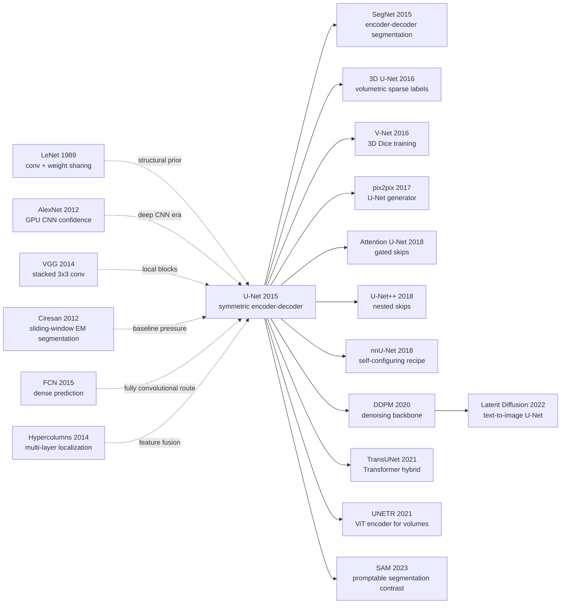

# U-Net — 把编码器-解码器和跳连变成医学分割的默认语法

> **2015 年 5 月 18 日，University of Freiburg 的 Olaf Ronneberger、Philipp Fischer、Thomas Brox 在 arXiv 上传 [1505.04597](https://arxiv.org/abs/1505.04597)，随后发表于 MICCAI 2015。**
> U-Net 的反直觉之处在于：它没有用更大的分类 CNN 去堆医学分割，而是把 FCN 的上采样路径做成几乎对称的 U 形，再把浅层细节通过 skip concatenation 原样抄回 decoder。只用 30 张 EM 图像、35 张相差显微图、20 张 DIC-HeLa 图像，它就把滑窗 CNN 的 0.000420 warping error 压到 0.000353，并在 Cell Tracking Challenge 上把 DIC-HeLa IOU 从第二名 0.46 拉到 0.7756。后来 DDPM、Stable Diffusion 和无数医学工具都继承了这条“全局语义向下、局部细节向上”的路。

## 一句话总结

Ronneberger、Fischer、Brox 2015 年发表于 MICCAI 的 U-Net，用一个看似朴素的公式级组合——像素级加权交叉熵 $E=\sum_{x\in\Omega} w(x)\log p_{\ell(x)}(x)$ + contracting path 捕获语义 + expanding path 恢复分辨率 + encoder feature crop-and-concat skip——把医学图像分割从“对每个像素跑一次滑窗分类器”改成了“一次全卷积前向输出整张 mask”。它替代的最强 baseline 是 Ciresan 等作者 2012 年的滑窗 CNN：在 ISBI EM segmentation 上，warping error 从 0.000420 降到 0.000353，Rand error 从 0.0504 降到 0.0382；在 Cell Tracking Challenge，PhC-U373 IOU 0.9203 vs 第二名 0.83，DIC-HeLa IOU 0.7756 vs 第二名 0.46。真正的 hidden lesson 是：少样本医学视觉不一定靠更强分类器，而是靠结构先验、形变增广和边界损失把标注效率榨干；这条线从 [LeNet](../era1_foundations/1998_lenet.md) 的卷积先验一路延伸到 [DDPM](../era4_foundation_models/2020_ddpm.md) 的去噪 U-Net 与 [SAM](../era5_genai_explosion/2023_sam.md) 之后的医学分割生态。

---

## 历史背景

### 2015 年医学图像分割真正缺的不是 CNN，而是标注

U-Net 诞生时，计算机视觉已经经历了 AlexNet 之后的三年狂飙。ImageNet 分类里，深度卷积网络从 AlexNet、ZFNet、VGG 到 GoogLeNet 迅速替代手工特征；目标检测里，R-CNN 把 CNN feature 带进候选框 pipeline；语义分割里，FCN 正在把分类网络改造成 dense prediction 网络。换句话说，到 2015 年，学界并不缺“CNN 能不能看图”的信心。

医学图像分割卡在另一个更硬的现实里：**标注极贵、样本极少、边界比类别更重要**。ImageNet 有百万级标注图片，而 U-Net 论文里最关键的 EM segmentation 训练集只有 30 张 512×512 图像；Cell Tracking 的 PhC-U373 只有 35 张部分标注图像，DIC-HeLa 只有 20 张部分标注图像。对自然图像分类来说，这像是没数据；对神经元膜和细胞边界来说，这却已经是一个实验室能拿出的高质量标注。

那时主流医学分割路线是滑窗 CNN：围绕每个像素裁一个 patch，预测中心像素类别。Ciresan 等作者 2012 年用这条路线赢了 ISBI EM segmentation challenge，因为它把一张图拆成数十万个 patch，表面上把样本量放大了。但这条路线有两个根本问题。第一，推理慢到近似重复劳动：相邻 patch 高度重叠，却要分别跑网络。第二，patch 大小制造了“上下文 vs 定位”的硬冲突：patch 越大，网络能看见更大结构，但 pooling 越多，输出越粗；patch 越小，定位准，但看不到细胞、膜和组织结构的长程关系。

U-Net 不是第一个全卷积分割网络，也不是第一个 encoder-decoder。它的历史价值在于：**它把“少标注医学图像”这个具体约束压进了架构、训练和推理三件事里**。对称 expanding path 解决上下文和定位；skip concatenation 保留浅层边界；elastic deformation 把 30 张图的形变空间补出来；weighted loss 把贴在一起的细胞边界从“少数像素”变成训练重点。它不是一个单点 trick，而是一份围绕少样本 dense prediction 重写的系统设计。

### 直接逼出 U-Net 的 4 条前序

**LeNet / CNN 传统**：LeCun 1989-1998 年的卷积网络把局部感受野、权重共享和空间下采样做成视觉神经网络的基本语法。U-Net 继承的不是 LeNet-5 的具体层数，而是“结构先验比自由参数更值钱”的信念：当数据少时，卷积不是保守选择，而是把不必要自由度砍掉的统计正则。

**AlexNet / VGG 的深层 CNN 信心**：AlexNet 2012 证明大 CNN 可以在 GPU 上端到端训练，VGG 2014 把连续 3×3 卷积变成稳定的视觉模块。U-Net 的每个 resolution stage 都是“两次 3×3 conv + ReLU”，这不是偶然；它把 VGG 的局部可组合性搬进 dense prediction，只是把最后的分类头换成了逐像素输出。

**Ciresan 滑窗 CNN baseline**：U-Net 论文真正要打掉的对手不是传统形态学，而是 IDSIA 的滑窗深网。Ciresan 路线已经证明 CNN 可以分割神经元膜，但它把“定位”交给 patch center，把“上下文”限制在 patch size 内。U-Net 的一次全图前向就是对这条路线的直接反驳：不要把整张图切碎再拼回去，让网络本身在多尺度上看完整图。

**FCN / Hypercolumns / 多层特征融合**：Long、Shelhamer、Darrell 的 FCN 把分类网络改成全卷积输出，并用 skip 融合浅层和深层；Hariharan 的 hypercolumns 明确强调不同层特征对定位和语义的互补。U-Net 在思想上承接这条线，但做了医学图像版本的关键改造：upsampling path 不只是薄薄的恢复层，而是和 contracting path 近似对称、拥有大量 feature channels 的 decoder。

### Freiburg 团队当时在做什么

Olaf Ronneberger、Philipp Fischer、Thomas Brox 三位作者来自 Freiburg 的 Pattern Recognition and Image Processing / Computer Vision 传统。Brox 团队在光流、图像匹配、无监督特征学习和生物医学图像分析上长期交叉，2014 年 Dosovitskiy、Springenberg、Riedmiller、Brox 的 discriminative unsupervised feature learning 已经把强增广、形变和视觉表征放到同一个研究语境里。

这很重要，因为 U-Net 不是“医学专家偶然拿 CNN 试了一下”。它来自一个同时理解计算机视觉架构、显微图像形变和挑战赛评估机制的团队。论文里的 elastic deformation、overlap-tile、mirroring、cell boundary weight map 都不是通用 CV 论文会自然写出的细节；它们来自显微图像工程里的真实痛点：图像很大、显存有限、细胞贴边、边界少而关键、同一类目标可能挤在一起。

U-Net 的官方页面也体现出当时的工程姿态：作者不只放论文，还放了基于 Caffe 的完整实现、训练好的网络、Matlab interface、overlap-tile segmentation 和用于 ISBI cell tracking 提交的 greedy tracking algorithm。185MB 的 release 包在 2015 年不算轻量，但它让读者可以直接复现实验和挑战赛流程。这种“论文 + 预训练模型 + 可跑脚本”的发布方式，比许多后来的深度学习医学论文更接近产品化交付。

### 算力、数据与 Caffe 时代

2015 年的硬件条件恰好处在一个窗口期：GPU 已经足够训练 23 层全卷积网络，但 3D 医学图像、超大显微图像和高分辨率 dense prediction 仍然被显存死死限制。U-Net 用 valid convolution 让输出只覆盖完整上下文区域，再用 overlap-tile 把大图切成可放进 6GB GPU 的 tile。今天看这像工程细节；在当时，它决定了这个模型能不能在真实显微图像上跑。

框架上，论文使用 Caffe 的 SGD 实现，batch size 只有 1。因为 valid conv 输出比输入小，为了减少边界开销并最大化显存利用，作者选择大 tile、小 batch，再用 momentum 0.99 让参数更新“记住”更多历史样本。这是 U-Net 风格里常被忽略的一点：它不是现代大 batch 数据中心训练，而是显存受限、标注受限、每张图都很贵的实验室训练。

数据层面，U-Net 几乎把“数据增广”提升到了和架构同等的地位。随机位移、旋转、灰度变化都重要，但论文特别强调 random elastic deformation 才是少样本显微分割的关键，因为组织和细胞的自然变化本来就以非刚性形变为主。这个判断后来影响深远：医学图像分割的强 baseline 往往不是最新模块，而是合适 patch size、强增广、合适 loss 和 U-Net family 的组合。

所以 U-Net 的历史定位不是“FCN 的医学版”这么简单。它是 2012-2015 深度学习复兴期里，第一次把自然图像 CNN 的成功、医学图像少标注现实、显微图像形变先验、Caffe/GPU 工程限制压缩成一张可以被全球实验室复制的架构图。那张 U 形图后来变成了一种视觉语言：只要任务需要同尺寸输出、既要语义又要定位，人们就会先画一个 U。

---

## 方法详解

### 整体框架

U-Net 的整体结构可以压缩成一句话：**左边是普通 CNN 的 contracting path，右边是几乎对称的 expanding path，中间用 crop-and-concat skip connections 把浅层空间细节送回 decoder**。它没有全连接层，所有输出都是 dense pixel logits；由于使用 valid convolution，输出区域小于输入区域，但每个输出像素都拥有完整上下文。

经典论文图里的输入 tile 是 572×572，输出 segmentation map 是 388×388。这个尺寸差不是随意的，而是 valid 3×3 convolution 多次收缩边界后的结果。网络总共 23 个 convolutional layers：每个下采样阶段两次 3×3 conv + ReLU，再接 2×2 max pooling；每个上采样阶段先 2×2 up-conv，再把 encoder 同尺度 feature crop 后拼接，然后再做两次 3×3 conv + ReLU；最后用 1×1 conv 把 64 维 feature vector 映射到每个像素的类别 logits。

| 部分 | 操作 | 输出/角色 |
|---|---|---|
| Contracting path | two 3×3 valid conv + ReLU, then 2×2 max pool | 语义上下文增加，空间分辨率减半 |
| Channel schedule | 每次 downsampling 后 channel 翻倍 | 用更多通道承载更抽象语义 |
| Bottleneck | 最低分辨率上的两次 3×3 conv | 连接局部纹理和全局结构 |
| Expanding path | 2×2 up-conv, channel 减半 | 恢复空间分辨率 |
| Skip concatenation | crop encoder feature, concat with decoder feature | 把浅层定位细节送回上采样路径 |
| Output head | 1×1 conv + pixel softmax | 每个像素输出类别概率 |

U-Net 的关键不是“形状像 U”这个视觉比喻，而是它把 dense prediction 拆成两个互补问题：下行路径回答“这个区域是什么”，上行路径回答“这个东西的边界在哪里”。滑窗 CNN 把这两个问题都塞进一个 patch classifier；U-Net 则让网络在多尺度特征图里同时处理它们。

### 关键设计

#### 设计 1：对称 contracting-expanding path —— 把分类 CNN 改成同尺寸 dense predictor

**功能**：contracting path 用 pooling 聚合上下文，expanding path 用 up-convolution 恢复分辨率；二者近似对称，使输出既有深层语义又保留空间结构。

**核心公式**：下采样阶段可以写成 `h_{s+1}=Pool(Conv3x3(Conv3x3(h_s)))`，上采样阶段写成 `g_s=Conv3x3(Conv3x3(Concat(Crop(h_s), Up(g_{s+1}))))`。这里的 `h_s` 是 encoder 第 s 个尺度，`g_s` 是 decoder 第 s 个尺度。

```python
import torch
import torch.nn as nn

class DoubleConv(nn.Module):
    def __init__(self, in_ch, out_ch):
        super().__init__()
        self.net = nn.Sequential(
            nn.Conv2d(in_ch, out_ch, 3, padding=0),
            nn.ReLU(inplace=True),
            nn.Conv2d(out_ch, out_ch, 3, padding=0),
            nn.ReLU(inplace=True),
        )

    def forward(self, x):
        return self.net(x)

class DownStep(nn.Module):
    def __init__(self, in_ch, out_ch):
        super().__init__()
        self.conv = DoubleConv(in_ch, out_ch)
        self.pool = nn.MaxPool2d(2)

    def forward(self, x):
        skip = self.conv(x)
        return self.pool(skip), skip
```

| 方案 | 上下文 | 定位 | 计算冗余 | 少样本适配 |
|---|---|---|---|---|
| Sliding-window CNN | patch 内有限 | 中心像素精确 | 高，patch 重叠重复 | patch 增多但上下文受限 |
| FCN thin decoder | 好 | 依赖粗 skip | 低 | 需要较多自然图像预训练经验 |
| **U-Net symmetric decoder** | **好** | **好，decoder 有足够通道** | **低** | **强，端到端 + 增广可训** |
| Pure classifier CNN | 好 | 弱，只输出图像级标签 | 低 | 不适合 dense mask |

**设计动机**：医学分割不是分类后处理，而是同尺寸结构预测。神经元膜、细胞轮廓、器官边界都需要“全局上下文判断对象”和“局部像素定位边界”同时成立。U-Net 的对称结构把这两个目标分摊到两条路径：encoder 牺牲分辨率换语义，decoder 用逐级上采样把语义送回像素网格。

#### 设计 2：Crop-and-concat skip connection —— 让 decoder 拿回浅层边界信息

**功能**：在每个尺度，把 contracting path 的高分辨率 feature map 裁剪到和上采样 feature map 同尺寸，然后沿 channel 维拼接。它不是 ResNet 式相加，而是 feature concatenation，让 decoder 自己学习如何组合纹理和语义。

**核心公式**：`z_s = Concat(CenterCrop(h_s), Up(g_{s+1}))`，随后 `g_s = F_s(z_s)`。这里 `Concat` 让 channel 数增加，`F_s` 的两次 3×3 conv 再学习混合方式。

```python
def center_crop_like(encoder_feat, decoder_feat):
    _, _, h, w = decoder_feat.shape
    _, _, H, W = encoder_feat.shape
    top = (H - h) // 2
    left = (W - w) // 2
    return encoder_feat[:, :, top:top + h, left:left + w]

def crop_and_concat(encoder_feat, decoder_feat):
    cropped = center_crop_like(encoder_feat, decoder_feat)
    return torch.cat([cropped, decoder_feat], dim=1)
```

| Skip 类型 | 融合方式 | 优点 | 代价 | 适合任务 |
|---|---|---|---|---|
| No skip | 只用 decoder 深层特征 | 简单 | 边界糊、细节丢 | 粗分割 |
| Additive skip | 同维 feature 相加 | 省通道 | 强迫浅深语义对齐 | ResNet / FPN |
| **Concat skip (U-Net)** | **channel 拼接后再卷积** | **保留全部浅层细节** | **通道数和显存上升** | **医学边界、细胞实例** |
| Attention-gated skip | 先筛选再拼接 | 抑制噪声 | 更复杂 | 后续 Attention U-Net |

**设计动机**：valid convolution 和 pooling 会让深层 feature 更抽象、更稳，但也更粗。医学图像里的错误往往发生在 2-5 个像素宽的边界上，如果 decoder 只看低分辨率语义，输出会像热力图而不是 mask。Concat skip 的意义是把“边缘、纹理、薄膜、细胞接触处”这些浅层证据直接送回去，让 decoder 在深层语义约束下重新画边界。

#### 设计 3：Valid convolution + overlap-tile inference —— 让大图分割不被显存卡死

**功能**：U-Net 只预测拥有完整上下文的 valid output 区域；大图推理时，把图像切成带重叠输入 tile，每个 tile 只取中间可靠输出，再把输出拼回整图。边界缺失上下文用 mirroring 补齐。

**核心公式**：如果网络映射 `f: R^{H_in×W_in} -> R^{H_out×W_out}` 且 `H_out < H_in`，tile stride 取 `H_out`，每次输入带 halo 的 `H_in` 区域，只拷贝中心 `H_out` 预测。这样任意大图都能分块推理，且拼接处没有 seam。

```python
def overlap_tile_predict(image, model, in_size=572, out_size=388):
    stride = out_size
    outputs = []
    for top in range(0, image.shape[-2], stride):
        row = []
        for left in range(0, image.shape[-1], stride):
            tile = mirror_pad_and_crop(image, top, left, in_size)
            pred = model(tile)              # reliable center output only
            row.append(pred[..., :out_size, :out_size])
        outputs.append(torch.cat(row, dim=-1))
    return torch.cat(outputs, dim=-2)
```

| 推理策略 | 显存需求 | 边界质量 | 速度 | 适用图像 |
|---|---|---|---|---|
| Whole-image inference | 最高 | 好 | 快但可能放不下 | 小图 |
| Sliding window patch | 低 | 中等 | 慢，重复计算多 | 老式 patch classifier |
| **Overlap-tile (U-Net)** | **可控** | **好，中心输出可靠** | **快，一次 tile 前向** | **大显微图、组织切片** |
| Naive non-overlap tile | 低 | 差，tile 边缘断裂 | 快 | 不推荐 |

**设计动机**：U-Net 的论文图常被当成“架构图”，但 Figure 2 的 overlap-tile 同样重要。显微图常常远大于 GPU 显存，且边界附近不能随意 zero-pad，否则模型会在 tile 边缘看见不存在的黑框。Mirroring 是一个很实用的归纳偏置：组织纹理在边界外大致延续，比填零更接近真实上下文。

#### 设计 4：Weighted pixel loss + elastic deformation —— 把少样本和贴连边界写进训练目标

**功能**：像素级 softmax cross entropy 负责分类，class-balance weight 处理前景/背景比例，boundary weight 强迫网络学习贴连细胞之间的薄背景边界；elastic deformation 扩展少数标注图像的形变空间。

**核心公式**：论文的权重图是 `w(x)=w_c(x)+w_0 exp(-(d_1(x)+d_2(x))^2/(2 sigma^2))`，其中 `d_1` 和 `d_2` 是到最近和第二近细胞边界的距离，实验中 `w_0=10`、`sigma≈5`。损失是像素加权交叉熵 `E=sum_x w(x) log p_{l(x)}(x)`。

```python
def weighted_pixel_cross_entropy(logits, target, weight_map):
    # logits: (B, C, H, W), target: (B, H, W), weight_map: (B, H, W)
    log_prob = torch.log_softmax(logits, dim=1)
    picked = log_prob.gather(1, target[:, None]).squeeze(1)
    return -(weight_map * picked).mean()

def elastic_grid(control_points, std=10.0):
    disp = torch.randn_like(control_points) * std
    return bicubic_interpolate(disp)
```

| 训练组件 | 解决的问题 | 论文设置 | 后续影响 |
|---|---|---|---|
| Class-balance weight | 前景/背景像素比例不均 | `w_c(x)` | 医学分割 class weighting 标配 |
| Boundary weight | 贴连细胞难分 | `w0=10`, `sigma≈5` | instance-aware loss 的早期形式 |
| Elastic deformation | 标注图少、组织形变多 | 3×3 grid, std 10 px | 医学图像强增广传统 |
| Batch size 1 + momentum | 大 tile 占满显存 | momentum 0.99 | 小 batch dense prediction 经验 |

**设计动机**：如果只看平均像素准确率，模型会偏向大片背景和细胞内部；真正决定挑战赛排名的是边界和分离。U-Net 的 weighted loss 等于告诉优化器：“这些薄边界虽然像素少，但错了就会把两个细胞粘成一个。”Elastic deformation 则把生物组织最常见的非刚性变化显式纳入训练，避免模型把 20-30 张图的具体形状记死。

### 训练配方

| 项 | 设置 | 说明 |
|---|---|---|
| Framework | Caffe | 当时主流 CNN 工程框架 |
| Optimizer | SGD | 端到端训练整张 U-Net |
| Batch size | 1 | 大 tile 优先于大 batch |
| Momentum | 0.99 | 用历史样本平滑小 batch 更新 |
| Convolution | unpadded valid 3×3 | 输出只保留完整上下文区域 |
| Initialization | ReLU 方差初始化 | 近似 He initialization，按 incoming nodes 调整 |
| Augmentation | shift / rotation / gray / elastic deformation | elastic deformation 是少样本关键 |
| Runtime | 约 10 小时训练，512×512 推理 < 1 秒 | NVIDIA Titan 6GB 时代的可复现实用性 |

从今天的眼光看，U-Net 的训练配方并不“现代”：没有 Adam、没有 batch norm、没有 Dice loss、没有 residual block、没有 transformer attention。但这反而说明它抓住了更底层的东西：**dense prediction 的核心瓶颈不是能不能堆复杂模块，而是能不能在少量标注下稳定恢复边界**。这个问题直到 2026 年仍然没有过时。

---

## 失败案例

### Baseline 1：滑窗 CNN 赢过 2012，却输给了全卷积一次前向

Ciresan 等作者的 IDSIA 滑窗 CNN 是 U-Net 论文中最重要的失败 baseline。它不是弱方法：2012 年它在 ISBI EM segmentation challenge 上大幅领先传统方法，证明深度 CNN 可以分割神经元膜。但到 U-Net 面前，它的结构性弱点被放大了。

滑窗方法把每个像素视为一个 patch classification 问题。这样做有一个短期收益：30 张训练图可以切成大量 patch，训练集看起来变大。但收益背后是两笔债。第一笔是计算债：相邻像素 patch 几乎相同，却要重复跑网络。第二笔是上下文债：patch size 是一个固定窗口，窗口太小看不见大结构，窗口太大又需要更多 pooling，定位变粗。

U-Net 的反击很直接：把 patch classifier 变成 fully convolutional predictor。所有重叠计算共享，整张 tile 一次前向；上下文通过 contracting path 逐级扩展，定位通过 skip 和 decoder 恢复。结果是 EM challenge 的 warping error 从 IDSIA 的 0.000420 降到 0.000353，Rand error 从 0.0504 降到 0.0382。

### Baseline 2：只做粗上采样的 FCN 路线定位不够锋利

FCN 是 U-Net 的直接前序，但“把分类 CNN 变成 dense output”本身还不够。自然图像语义分割可以接受相对粗的边界，因为 PASCAL VOC 的对象轮廓通常占图像大块区域；医学图像分割不行，神经元膜和细胞接触边界可能只有几个像素宽，错一条线就会把实例拓扑改掉。

U-Net 对 FCN 的关键改造是：decoder 不只是少量 upsampling 层，而是有大量 feature channels 的对称 expanding path。浅层 feature 不是简单相加，而是 crop 后 concat，让 decoder 在每个尺度重新学习“边界证据 + 深层语义”的组合。这解释了为什么 U-Net 后来在医学图像里比许多“FCN + 后处理”方案更稳定：它把定位能力做进了主网络，而不是留给 CRF 或形态学修补。

### Baseline 3：传统形态学 / tracking pipeline 不能替代端到端边界学习

细胞分割在 U-Net 前大量依赖阈值、形态学操作、watershed、连通域、手工 tracking 规则。它们在图像条件稳定、目标形状规则时很有用，但遇到 DIC、相差显微或贴连细胞就很脆弱。边界如果没有被像素分类器学出来，后处理只能在错误概率图上猜测。

U-Net 并没有完全消灭后处理，官方 release 里仍带着 greedy tracking algorithm。但核心变化是：网络输出的 mask 已经足够好，tracking 只需要连接时间维度，而不是救一个坏的 segmentation。Cell Tracking Challenge 的 DIC-HeLa 结果最能说明问题：U-Net 的 IOU 是 0.7756，第二名 2015 方法只有 0.46。这里的差距不是一个小后处理能补上的，而是表示学习和边界损失带来的主干差距。

### Baseline 4：没有边界加权的像素损失会学会“平均正确”，却学不会分开贴连细胞

普通 pixel cross entropy 会自然偏向大区域：背景、细胞内部、组织内部贡献了绝大多数像素，薄边界只占很小比例。如果训练目标不强调边界，模型可以在平均像素准确率上不错，却把两个贴连细胞预测成一个 blob。对 cell tracking 和 instance segmentation 来说，这是致命错误。

U-Net 的 weight map 把贴连细胞之间的背景边界放大，尤其是 `d_1(x)+d_2(x)` 很小的区域。它不是今天意义上的 instance segmentation loss，却已经有了 instance-aware 的味道：模型被迫把“两个物体之间的窄缝”当作关键监督信号。这个设计后来被 Dice loss、boundary loss、topology-aware loss、distance transform loss 等医学分割损失不断继承和改写。

| Baseline | 当时为什么合理 | 输给 U-Net 的根因 | 对后来的教训 |
|---|---|---|---|
| Sliding-window CNN | patch 数量大，中心像素定位直接 | 重复计算多，上下文-定位冲突 | dense prediction 应该共享全图计算 |
| Thin FCN decoder | 自然图像语义分割已经可用 | decoder 容量不足，医学边界不够细 | 上采样路径必须能重建细节 |
| Morphology / watershed | 可解释、少数据、工程成熟 | 图像条件变动大，贴连细胞脆弱 | 后处理不能替代可学习边界 |
| Plain pixel CE | 简单稳定 | 少数边界像素被平均掉 | loss 要反映任务代价 |

## 实验关键数据

### ISBI EM segmentation：30 张图打掉滑窗 CNN

U-Net 在神经元膜 EM segmentation 上的训练集只有 30 张 512×512 图像，测试标签由挑战赛组织者保留。论文报告的是 2015 年 3 月 6 日 leaderboard，指标包括 warping error、Rand error 和 pixel error。U-Net 使用七个旋转版本输入的平均预测，没有额外预处理或后处理。

| 方法 | Warping error | Rand error | Pixel error |
|---|---:|---:|---:|
| Human values | 0.000005 | 0.0021 | 0.0010 |
| **U-Net** | **0.000353** | **0.0382** | **0.0611** |
| DIVE-SCI | 0.000355 | 0.0305 | 0.0584 |
| IDSIA sliding-window CNN | 0.000420 | 0.0504 | 0.0613 |
| IDSIA-SCI | 0.000653 | 0.0189 | 0.1027 |

最有意思的是，U-Net 不是所有指标都绝对第一。DIVE-SCI 的 Rand error 和 pixel error 更低，但它使用了更强的数据集特定后处理；U-Net 的关键胜利是 warping error，尤其是在不靠复杂后处理的情况下超过滑窗 CNN。这也说明论文真正卖点不是“单表全胜”，而是“更简单、更快、更可迁移的主干网络”。

### Cell Tracking Challenge：同一网络跨显微模式迁移

论文把同一类 U-Net 训练策略用于 transmitted light microscopy，包括 phase contrast 的 PhC-U373 和 DIC 的 DIC-HeLa。两个数据集分别只有 35 张和 20 张部分标注训练图。结果显示，U-Net 不是只在 EM membrane segmentation 上过拟合，而是能跨成像模式复用。

| 方法 | PhC-U373 IOU | DIC-HeLa IOU |
|---|---:|---:|
| IMCB-SG (2014) | 0.2669 | 0.2935 |
| KTH-SE (2014) | 0.7953 | 0.4607 |
| HOUS-US (2014) | 0.5323 | - |
| Second-best 2015 | 0.83 | 0.46 |
| **U-Net (2015)** | **0.9203** | **0.7756** |

DIC-HeLa 是最能体现差距的数据集。第二名 2015 方法只有 0.46，U-Net 到 0.7756，说明 weighted loss + elastic deformation 对低对比度、边界模糊、细胞贴连的显微图像尤其有效。这不是 ImageNet-style 大数据胜利，而是少样本系统设计的胜利。

### 训练和推理成本：可复现是 U-Net 传播速度的一部分

| 项 | 数值 / 设置 | 含义 |
|---|---|---|
| EM training set | 30 张 512×512 图像 | 极少标注下仍可训练 |
| PhC-U373 training set | 35 张部分标注图像 | phase contrast 显微镜迁移 |
| DIC-HeLa training set | 20 张部分标注图像 | 更困难的 DIC 成像 |
| Training time | 约 10 小时 | NVIDIA Titan 6GB 可完成 |
| Inference | 512×512 图像 < 1 秒 | challenge 和实验室工作流可用 |

这组成本数字对 U-Net 的历史传播很关键。2015 年很多实验室没有大规模 GPU 集群，但一张 Titan 级别显卡、几十张标注图和官方 Caffe release 就足以复现实验。U-Net 之所以成为医学图像“默认起点”，不只是因为论文指标漂亮，也因为它在学术实验室的预算范围内。

### 关键发现

第一，**少样本不等于小模型**。U-Net 有 23 个卷积层，并不浅；它能在 20-30 张图上训练，是因为结构先验、valid tile、skip、增广和 loss 合在一起降低了有效样本需求。

第二，**边界比像素平均更重要**。论文选择 warping error、Rand error、IOU 等指标，而不是只看 pixel accuracy，这与 weighted boundary loss 的设计完全一致。评价指标和训练目标在“不要粘连细胞”这件事上对齐。

第三，**速度本身是方法贡献**。滑窗 CNN 能做分割，但推理慢且重复。U-Net 对 512×512 图像不到 1 秒的速度，让 dense segmentation 从“离线挑战赛结果”更接近显微图像工作流里的可用工具。

---

## 思想史脉络



### 前世（被谁逼出来的）

- **LeNet / 卷积网络传统**：U-Net 的局部卷积、权重共享、多尺度下采样都来自 LeNet 以来的视觉网络传统。U-Net 的不同之处在于，它把“分类网络逐渐丢失空间信息”的缺点反过来利用：先丢空间换语义，再用对称路径把空间找回来。
- **AlexNet / VGG 的深层 CNN 信心**：如果没有 2012-2014 年 ImageNet 上的深层 CNN 胜利，医学图像领域不会那么快相信 23 层全卷积网络能在几十张图上训练。VGG 的连续 3×3 conv 也给了 U-Net 一个稳定、可复现、易解释的局部模块。
- **Ciresan 2012 滑窗 CNN**：这是最直接的 baseline pressure。滑窗 CNN 证明“CNN 能分割”，也暴露了“逐 patch 推理太慢、上下文和定位冲突”的问题。U-Net 的全卷积 tile inference 正是对这两个问题的系统回应。
- **FCN / Hypercolumns**：FCN 证明分类网络可以变成 dense predictor，Hypercolumns 强调多层特征融合。U-Net 把这条线推进到医学少样本场景，并用对称 decoder 和 concat skip 把它固定成一种可复制架构。

### 今生（继承者）

- **医学分割主线**：3D U-Net、V-Net、U-Net++、Attention U-Net、nnU-Net、TransUNet、UNETR、Swin-UNETR 都是在同一个问题上改写 U-Net：怎样在多尺度特征里同时保留语义和定位。尤其 nnU-Net 证明，很多新架构不如一个调参、预处理、增广、后处理都自配置的 U-Net pipeline。
- **生成模型主线**：pix2pix 把 U-Net 当作 image-to-image generator；DDPM 把 U-Net 当作 denoising backbone；Latent Diffusion / Stable Diffusion 把它放进 latent space，并加上 time embedding、attention、cross-attention。U-Net 从医学分割迁移到图像生成，是因为去噪和分割一样都是 dense prediction：输入和输出同尺寸，既要全局语义，又要高频细节。
- **基础模型对照线**：SAM 之后，分割进入 promptable foundation model 阶段，但医学图像里 U-Net 没有退场。原因很现实：SAM 需要大规模 mask 数据和强 prompt 机制，而许多医学任务仍然是小数据、强 domain shift、特定器官或病灶。U-Net 成为“任务专用强 baseline”，SAM 成为“交互式 / zero-shot 上限参照”。

### 误读 / 简化

- **误读 1：U-Net 的贡献只是 skip connection**。Skip 很重要，但单独拿出来不等于 U-Net。真正组合是 valid conv、对称 decoder、crop-and-concat、overlap-tile、elastic augmentation、boundary-weighted loss。少一个，论文中的少样本医学分割故事就不完整。
- **误读 2：U-Net 是医学图像专用架构**。它起源于医学，但后来进入 image-to-image translation、diffusion denoising、remote sensing、satellite segmentation、工业检测。它解决的是同尺寸 dense prediction 的一般问题，不只是一类数据。
- **误读 3：Transformer 出现后 U-Net 已经过时**。ViT、Swin、UNETR、DiT 确实替换了部分卷积模块，但很多系统仍然保留 U 形多尺度路径和长 skip。被替换的是具体卷积块，不是“先压缩上下文、再逐级恢复细节”的问题分解。
- **误读 4：U-Net 指的是一张固定图**。实践里的 U-Net family 早已变成 recipe：2D/3D、patch size、depth、channel schedule、normalization、loss、augmentation、postprocessing 都可变。U-Net 的生命力恰恰来自它不是一个封闭模型，而是一种可调工程语法。

---

## 当代视角（2026 年回看 2015）

### 站不住的假设

- **“医学分割只需要任务专用小模型”**：2015 年这是合理判断，因为数据少、任务窄、医院场景强约束。但 2026 年的现实更复杂。SAM、MedSAM、foundation segmentation、self-supervised pretraining、multi-organ large-scale datasets 都证明，预训练和 promptability 可以显著改善跨域泛化。U-Net 仍是强 baseline，但“从零训练一个任务专用 U-Net”不再是唯一默认答案。
- **“卷积先验永远是 dense prediction 的最佳骨架”**：U-Net 的卷积 locality 在少样本医学图像里极强，但 Transformer、Mamba、hybrid CNN-Transformer 已经证明，长程依赖和跨器官上下文也很重要。今天的强模型往往保留 U 形 decoder 和 skip，但 encoder 可能是 Swin、ViT、UNETR 或 state-space block。
- **“加权 cross entropy 足够表达分割代价”**：论文的 boundary weight 很聪明，但现在我们知道 Dice、Tversky、focal、surface loss、clDice、topology-aware loss 在类别不均、细管状结构、器官表面误差上更贴近临床需求。U-Net 的 loss 是一个起点，不是终点。
- **“2D tile 足以代表医学图像”**：U-Net 原论文主要是 2D 显微图像。现代 CT/MRI/3D EM 需要 3D context、anisotropic voxel、器官拓扑和跨切片一致性。3D U-Net、V-Net、Swin-UNETR 都是对这个假设的修正。

### 时代证明的关键 vs 冗余

真正留下来的关键设计有三件。第一，**encoder-decoder 多尺度路径**：无论 CNN、Transformer 还是 DiT，dense prediction 仍然需要把全局语义压缩到低分辨率，再把空间细节逐级恢复。第二，**长 skip connection**：同尺寸输出任务需要浅层几何证据，尤其在医学边界、去噪和图像翻译里。第三，**任务先验进入训练策略**：U-Net 的 elastic deformation 和 boundary weight 说明，少样本任务不能只靠架构，必须把数据生成机制和错误代价写进训练。

相对冗余的是一些 2015 年工程选择。Valid convolution 在当时帮助 overlap-tile 可靠拼接，但现代框架里 same padding、reflection padding、sliding-window inference、test-time augmentation 和 MONAI / nnU-Net 工具链已经把这件事封装得更自然。Caffe、Matlab interface、batch size 1 + high momentum 也不是思想核心。今天保留的是大 tile / patch-based training 的原则，而不是当年的具体工具。

### 作者当时没想到的副作用

最意外的副作用是，U-Net 走出了医学图像，进入生成模型。pix2pix 用 U-Net generator 做图像翻译，DDPM 用 U-Net 预测噪声，Stable Diffusion 用 time-conditioned U-Net 在 latent space 做文生图。原本为“少样本医学分割”设计的 skip decoder，变成“高频细节保真”的通用 backbone。

另一个副作用是，U-Net 成了医学 AI 论文里最难打败也最容易被低估的 baseline。很多新模块在单数据集上看起来漂亮，但 nnU-Net 证明，一旦把 preprocessing、patch size、augmentation、loss 和 postprocessing 调好，朴素 U-Net family 往往能追回大部分差距。这让医学分割领域形成一个健康但残酷的基准文化：新方法必须先过 nnU-Net 这关。

还有一个社会层面的副作用：U-Net 降低了医学图像深度学习门槛。一个实验室可以用几十张标注图、开源代码和单卡训练出可用模型，这直接推动了 2016-2020 年医学影像论文爆发。但门槛降低也带来大量小样本、单中心、评估不充分的论文，临床可迁移性常被高估。

### 如果今天重写 U-Net

如果 2026 年重写 U-Net，我会保留 U 形多尺度路径和长 skip，但把“固定架构”改成“自配置系统”。输入数据先经过自动 spacing / intensity / patch-size 分析；encoder 在小数据时用 ConvNeXt / ResNet，在大数据或预训练可用时用 Swin / ViT / state-space hybrid；decoder 保留多尺度 skip，但加入轻量 attention gate 或 uncertainty-aware fusion。

训练目标会从单一 weighted CE 改成组合式：Dice/Tversky 处理类别不均，boundary/surface loss 处理临床边界，topology loss 处理血管、神经、腺体等细结构。增广也会更强：elastic deformation、bias field、gamma、cutmix/mixup、domain randomization、scanner-specific noise，并用 test-time augmentation 或 model ensemble 给不确定性估计。

最重要的变化是预训练。今天的 U-Net 不该从零开始看几十张图，而应该接上自监督医学图像 encoder、SAM/MedSAM-style mask prior，或用合成标注 / weak labels / foundation features 做 warm start。U-Net 的 2015 精神不是“从零训练一个 U 形 CNN”，而是“在少标注下把结构先验和任务代价用到极致”。这个精神仍然正确。

## 局限与展望

### 作者承认的局限

论文其实很诚实地暴露了几个限制。第一，它依赖强数据增广，尤其 elastic deformation；如果目标形变不能被这种增广覆盖，泛化会受影响。第二，valid convolution 导致输出小于输入，必须配合 overlap-tile 和 mirroring，工程复杂度比 same-padding 网络高。第三，论文展示的是 2D 图像分割，对 3D 体数据和跨切片一致性没有直接解决。

此外，U-Net 的实例分离依赖 boundary weight，而不是显式实例建模。对贴连细胞有效，但当对象数量、形状、拓扑更复杂时，仅靠边界权重不一定足够。后来的 Mask R-CNN、StarDist、Cellpose、watershed-on-distance-map 等方法都在不同方向上补了这个短板。

### 2026 视角下的新局限

U-Net family 最大的新局限是跨域泛化。一个在单中心、单 scanner、单染色协议上训练的 U-Net，换医院、换设备、换 staining protocol 后可能明显退化。原论文的成功来自挑战赛内数据分布相对明确；临床部署则需要 domain adaptation、calibration、uncertainty 和外部验证。

第二个局限是语义层级。U-Net 很擅长像素级边界，但不天然理解“这个病灶为什么重要”“这个器官与临床报告如何对应”。多模态医学 AI 需要把图像分割接到报告、病理、基因、纵向随访上，单纯 mask predictor 只是其中一环。

第三个局限是评估。IOU、Dice、warping error 对挑战赛有用，但临床上更关心测量误差、病灶体积、治疗决策、漏诊风险和医生交互成本。U-Net 之后的医学分割要从 leaderboard metric 走向 clinical utility metric。

### 改进方向（已被后续工作证实）

- **自配置 pipeline**：nnU-Net 证明，架构创新之外，预处理、patch size、resampling、augmentation、postprocessing 的自动配置可以带来巨大收益。
- **3D / 2.5D 建模**：3D U-Net、V-Net、Swin-UNETR 证明体数据不能只当独立切片处理。
- **Transformer / hybrid encoder**：TransUNet、UNETR、Swin-UNETR 证明长程依赖对器官级分割有价值，但常常仍需要 U-shaped decoder。
- **Foundation model adaptation**：MedSAM、SAM-Med2D、domain-specific prompt tuning 证明 promptable segmentation 可以补充 U-Net，但还没有完全替代强任务专用模型。
- **边界和拓扑损失**：surface Dice、clDice、Hausdorff-aware loss 证明“错误代价”需要比普通像素 CE 更贴近医学结构。

## 相关工作与启发

### 和 LeNet / FCN / ResNet 的关系

U-Net 继承 LeNet 的卷积结构先验，继承 FCN 的 dense output 思想，又和 ResNet 同年进入深度学习基础设施。ResNet 解决“深网络怎么训练”，U-Net 解决“同尺寸输出怎么同时保留语义和定位”。两者后来在 DDPM、Stable Diffusion、医学分割里合流：现代 U-Net 常用 residual block，现代 diffusion U-Net 几乎是 ResNet block + U-shaped skip + time embedding 的组合。

### 和 nnU-Net 的关系

nnU-Net 是对 U-Net 最深刻的后设总结：与其发明一个新网络，不如把 U-Net 变成自动调参系统。它把 dataset fingerprint 转成 patch size、network depth、spacing、normalization、augmentation、postprocessing 等配置，说明 U-Net 的核心已经从“模型结构”扩展成“医学分割工程协议”。这是 U-Net 生命力最强的证据。

### 和 SAM / foundation segmentation 的关系

SAM 代表另一种范式：海量 mask 数据 + promptable model + zero-shot generalization。它在自然图像和交互式分割上打开了新空间，但医学图像里仍面临 domain shift、细粒度边界、3D context、标注协议差异等问题。最合理的未来不是 SAM 替代 U-Net，而是两者融合：foundation encoder / prompt prior + U-Net-style task decoder + 医学域强增广与校准。

## 相关资源

### 论文 / 代码

- 论文 arXiv：[U-Net: Convolutional Networks for Biomedical Image Segmentation](https://arxiv.org/abs/1505.04597)
- 官方页面与 Caffe release：[University of Freiburg U-Net page](https://lmb.informatik.uni-freiburg.de/people/ronneber/u-net/)
- MICCAI 版本 DOI：[10.1007/978-3-319-24574-4_28](https://doi.org/10.1007/978-3-319-24574-4_28)
- 后续实践入口：MONAI、nnU-Net、Medical Segmentation Decathlon、Cell Tracking Challenge

### 推荐阅读

- FCN：Long, Shelhamer, Darrell, 2015，理解 U-Net 的 dense prediction 前序。
- 3D U-Net / V-Net：理解 U-Net 如何进入体数据和 Dice-style training。
- nnU-Net：理解为什么 U-Net family 的工程配置比单点模块更重要。
- DDPM / Stable Diffusion：理解 U-Net 如何从医学分割迁移到生成模型。
- SAM / MedSAM：理解 promptable foundation segmentation 对 U-Net 时代的补充与挑战。


---

> 🌐 [English version](/en/era2_deep_renaissance/2015_unet/) · 📚 awesome-papers project · CC-BY-NC