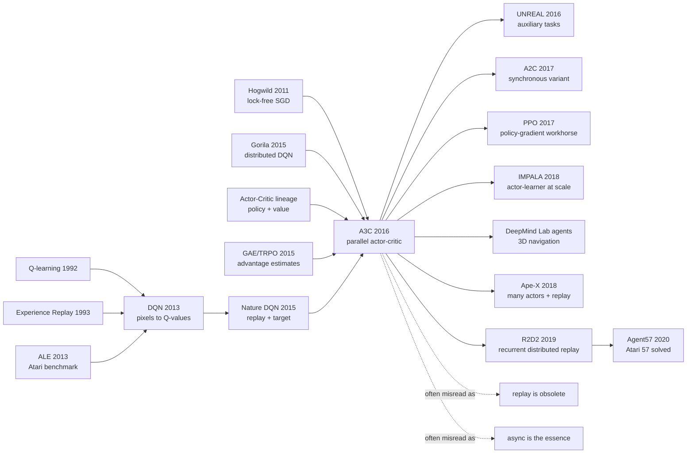

# A3C - 用异步 actor 把深度强化学习从 replay 里解放出来

> **2016 年 2 月 4 日，Volodymyr Mnih、Adrià Puigdomènech Badia、Mehdi Mirza 等 8 位作者把 [Asynchronous Methods for Deep Reinforcement Learning](https://arxiv.org/abs/1602.01783) 放上 arXiv，随后发表于 ICML 2016。** 这篇论文最反直觉的地方不是又把 Atari 分数刷高，而是把 Nature DQN 里最像“救命稻草”的 replay memory 暂时拿掉：16 个 CPU actor 在各自的环境里异步探索、共享参数、互相打散相关性，A3C LSTM 四天 CPU 训练达到 623.0% mean human-normalized score。它让 deep RL 从“GPU + replay + target network”的单线程叙事，转向“许多 actor 共同制造学习分布”的系统叙事。

## 一句话总结

Mnih、Badia、Mirza、Graves、Lillicrap 等 8 位作者 2016 年发表于 ICML 的 A3C，把 [Nature DQN](2015_dqn_nature.md) 的稳定性问题换了一种解法：不再把所有交互塞进 replay memory 后随机抽样，而是让多个 actor-learner 在不同环境副本中并行运行，用 Hogwild-style 异步更新共享网络；核心 actor-critic 更新可写成 $\nabla_\theta \log \pi(a_t|s_t;\theta)A_t + \beta\nabla_\theta H(\pi(s_t;\theta))$，其中 $A_t=\sum_{i=0}^{k-1}\gamma^i r_{t+i}+\gamma^kV(s_{t+k})-V(s_t)$。它击败或逼近的 baseline 包括 8 天 K40 GPU 上的 DQN / Double DQN / Dueling DQN / Prioritized DQN，以及 100 台机器的 Gorila：A3C LSTM 用 16 个 CPU cores 训练 4 天，在 Atari 57 human starts 上达到 623.0% mean human-normalized score，而 Prioritized DQN 是 463.6%。它的隐藏 lesson 是：deep RL 的稳定性不一定只能靠“把旧经验存起来”，也可以靠“同时制造足够不同的新经验”；这条线后来一边通向 PPO / A2C 这样的同步 actor-critic 工具链，另一边通向 IMPALA、Ape-X、R2D2、Agent57 这些大规模 actor 系统，并和 [AlphaGo](2016_alphago.md) 同年一起塑造了 DeepMind 2016 年的强化学习气质。

---

## 历史背景

### 2016 年：DQN 之后的强化学习拥堵

2016 年初的深度强化学习刚经历一次爆炸式出圈。2015 年 Nature DQN 证明，卷积网络可以从 Atari 像素和分数里学到动作价值；DeepMind 的故事也从“神经网络能做视觉分类”推进到“神经网络能自己玩游戏”。但 DQN 的成功有一个明显代价：它太依赖 replay memory 和 GPU 式单 learner 训练。经验要被存下来、随机抽样、反复复用；策略已经更新，buffer 里还有旧策略产生的数据；想提升吞吐量，就要维护更复杂的 replay 和 learner 系统。

这对 2016 年的 RL 社区很尴尬。理论上，policy gradient、Sarsa、actor-critic、eligibility traces 都是教科书里的基本方法；工程上，真正能稳定训练深网络的公开样板却几乎都在绕 replay 和 off-policy Q-learning 打转。DQN 让 deep RL 站上舞台，也把舞台挤窄了：如果 deep RL 必须依赖 replay，那么 on-policy actor-critic、连续动作控制、recurrent agent 和轻量 CPU 训练都很难成为同一套通用接口。

| 2015 年的路线 | 稳定性来源 | 资源形态 | A3C 要改写的部分 |
|---------------|------------|----------|------------------|
| Nature DQN | replay memory + target network | 单 GPU，单 learner | 经验相关性必须靠 buffer 打散 |
| Double / Dueling / Prioritized DQN | 对 DQN 的 value-learning 修补 | GPU + replay | 分数更强，但系统仍围绕 replay |
| Gorila | 100 actor + 30 parameter servers | 约 130 台机器 | 并行有效，但太重 |
| TRPO / GAE | trust region 与 advantage estimation | batch policy optimization | 稳但实现复杂，墙钟速度不够轻 |
| 传统 actor-critic | policy + value baseline | 理论简洁 | 深网络上不够稳定 |

A3C 的历史位置就在这里：它不是反对 DQN，而是把 DQN 暴露出的系统瓶颈往另一个方向推。DQN 问“怎样把旧经验存成一个可训练数据集”；A3C 问“能不能让许多 agent 同时产生足够不同的新经验，从源头上降低时间相关性”。这个问题听起来像工程优化，实际改变了 deep RL 的算法可用范围。

### Experience replay 的成功与代价

Replay memory 在 DQN 里是救命模块。在线 RL 的样本高度相关，策略又会改变未来数据分布；直接按时间顺序更新神经网络，很容易让价值函数追着自己的错误跑。Replay 把 transition 暂存起来，随机抽 minibatch，让训练分布更像一个混合过的经验池。这个选择让 DQN 能跑，也让 deep RL 继承了一个数据系统思维：经验不是一次性时间流，而是可存储、可复用、可抽样的资产。

但 replay 不是免费的。第一，它需要内存；第二，它天然偏 off-policy，所以 Sarsa、actor-critic 这类 on-policy 方法不容易直接使用；第三，它把“现在的 policy”与“过去 policy 产生的数据”混在一起，需要额外机制修正分布漂移；第四，在环境交互很贵、模拟速度有限或需要 recurrent state 的任务里，怎样存、怎样切、怎样重放会迅速变成系统工程。

A3C 的关键不是“replay 没用”。论文结论里反而明确说，replay 可能提高数据效率，未来可以和异步框架结合。真正的主张更窄也更强：**稳定 deep RL 不一定必须先把经验写进 buffer；多个 actor 的并行探索本身就可以起到 decorrelation 的作用。** 这个主张让 on-policy actor-critic 可以重新进入 deep RL 主线，也让 CPU 多线程突然变成一个有效训练资源。

### DeepMind 从 Atari 到通用控制的焦虑

A3C 和 [AlphaGo](2016_alphago.md) 同年出现，这不是偶然的历史巧合。2016 年的 DeepMind 正在把“一个网络学一个游戏”的 Atari 叙事，扩展成更大的 agent 计划：视觉输入、连续动作、随机 3D 迷宫、策略和值函数、搜索和规划、并行系统。A3C 是这条计划里最轻量、最算法基础设施化的一块。

作者名单也反映了这种混合目标。Volodymyr Mnih 和 Koray Kavukcuoglu 延续 DQN 的像素控制线；David Silver 带来 RL 和游戏决策的核心视角；Alex Graves 让 recurrent agent 与序列学习自然进入讨论；Timothy Lillicrap 刚参与 DDPG，把连续控制压力带进来；Adrià Puigdomènech Badia 后来又出现在 Agent57 等 Atari 探索系统里。A3C 因此不是单纯的 Atari 刷分论文，而是 DeepMind 在问：能否有一套足够简单的 actor-learning 框架，同时覆盖离散 Atari、连续 MuJoCo、TORCS 驾驶和 3D Labyrinth？

这也是为什么论文会强调“single multi-core CPU instead of a GPU”。这句话在今天看有一点时代痕迹，但在 2016 年很重要：如果 deep RL 的入口门票是 GPU 或 100 台机器，那么它很难成为广泛可复现的算法基线；如果 16 个 CPU cores 就能训练出强 Atari agent，研究者可以更快调试算法思想，而不是先搭建分布式系统。

## 研究背景与动机

### 目标：把稳定性从 replay memory 挪到并行交互

A3C 的动机可以写成一个分布问题。单个 agent 顺序行动时，连续样本来自同一个局部轨迹，状态、动作、奖励强相关；如果当前策略开始偏向某个行为，后续数据会更偏，网络更新就可能进入自我强化。DQN 的做法是事后处理：把相关样本放进 replay，再随机抽样。A3C 的做法是事前处理：同时运行多个 actor，每个 actor 在自己的环境副本里探索，甚至使用不同探索策略，让全局梯度天然混合来自不同时间、不同状态、不同局部策略的数据。

这个设计带来两个直接好处。第一，时间相关性下降，神经网络不再只看同一条轨迹的连续帧。第二，墙钟速度上升，16 个 actor 可以在同一时间消耗更多环境步。更微妙的是第三个好处：因为不依赖 replay，A3C 可以把 on-policy actor-critic 变成一等公民。策略梯度不再被迫吃旧 policy 的数据，连续动作也不需要通过离散 $\arg\max_a Q(s,a)$ 来绕路。

### 为什么 A3C 必须同时是算法和系统

A3C 的名字里有算法：Asynchronous Advantage Actor-Critic。但论文真正推广的是一个系统模板：多个 actor-learner thread、每个 thread 有环境副本和本地梯度累积、共享全局参数、异步更新、共享 RMSProp 统计、不同探索策略、统一网络 trunk + policy/value heads。少看任意一块，都会把 A3C 误读成“普通 actor-critic 加多线程”。

这个系统模板的反直觉点在于，它接受了参数陈旧、更新冲突和非确定性。监督学习工程通常努力避免这些东西；A3C 却认为，只要每个 actor 的梯度足够小、足够频繁、来自不同轨迹，锁和严格同步未必必要。Hogwild-style 更新不优雅，但它把通信成本压到很低，让算法获得了真正的轻量性。

从后来的视角看，A3C 的系统主张比具体实现更长寿。今天 PPO/A2C 往往会改成同步 batch 更新；IMPALA 会把 actor 和 learner 分离到更大规模，并用 V-trace 修正 policy lag；Ape-X/R2D2 又把 replay 带回来。但它们都继承了 A3C 的一个判断：**deep RL 的数据分布不是自然给定的，必须由 actor 系统主动制造。**

---

## 方法详解

### 整体框架

A3C 的整体框架可以压成一句话：**把许多个 actor-learner 放在同一台机器的不同线程里，每个线程独立和环境交互、累积一小段轨迹梯度，再把梯度异步写回共享网络；对于主方法 A3C，网络同时输出 policy 和 value，用 n-step return 估计 advantage，并加 entropy bonus 保持探索。**

论文其实提出了四个异步算法：one-step Q-learning、one-step Sarsa、n-step Q-learning、advantage actor-critic。历史上留下名字的是第四个 A3C，因为它最自然地支持 on-policy 更新、recurrent agent 和连续动作分布，也在 Atari、TORCS、MuJoCo、Labyrinth 上最像一个通用 recipe。

| 组件 | A3C 设置 | 解决的问题 | 代价 |
|------|----------|------------|------|
| Actor-learner threads | 典型 16 个 CPU threads | 打散时间相关性，提高墙钟吞吐 | 参数会陈旧，结果有非确定性 |
| Shared model | CNN trunk + policy head + value head | 感知表征、策略和值函数共用特征 | policy/value 梯度互相干扰 |
| n-step return | 最多 $t_{max}$ 步 forward view | 比 one-step TD 更快传播奖励 | return 方差上升 |
| Entropy bonus | Atari/TORCS 用 $\beta=0.01$ | 防止过早收敛到确定性动作 | 过大时会拖慢 exploitation |
| Shared RMSProp | 共享二阶统计 $g$ | 多线程学习率更稳 | 仍是启发式优化 |

A3C 和 DQN 的最大差别不是 policy gradient vs Q-learning，而是**数据流方向**不同。DQN 先把一条时间流写入 replay，再随机化；A3C 先制造许多时间流，再把梯度异步合并。一个把相关性问题交给 buffer，一个把相关性问题交给 actor population。

### 设计 1：异步 actor-learner —— 用多条轨迹替代 replay 的去相关功能

**功能**：多个 actor 同时运行在不同环境副本中，各自采样状态、动作、奖励，周期性把累积梯度写回共享参数。每个 actor 看到的是自己的局部 policy 副本，但目标是更新同一个全局模型。

如果单个 actor 的轨迹是 $\tau=(s_0,a_0,r_0,s_1,\ldots)$，A3C 看到的不是一条轨迹，而是许多轨迹的交错流：

$$
\mathcal{D}_{async}=\tau^{(1)}\cup\tau^{(2)}\cup\cdots\cup\tau^{(N)},\quad N\approx16
$$

这个设计有两个层面的稳定性。统计层面上，不同 actor 位于不同状态，梯度不再由同一段连续帧支配。系统层面上，多线程提高环境交互速度，让算法能在更少墙钟时间内看到更多局面。论文还建议不同 actor 使用不同 exploration policy，例如不同 $\epsilon$，进一步增加经验多样性。

| 对比项 | 单 actor online RL | DQN replay | A3C parallel actors |
|--------|--------------------|------------|---------------------|
| 样本相关性 | 很强 | 通过随机抽样降低 | 通过多轨迹混合降低 |
| 是否可 on-policy | 是 | 通常变成 off-policy | 是 |
| 内存需求 | 低 | 高，需要大 buffer | 低 |
| 墙钟吞吐 | 低 | learner 快但交互串行 | 随 actor 数提高 |

**设计动机**：DQN 用 replay memory 把单线程经验“事后洗牌”。A3C 则用 actor population 在采样时就创造多样性。它不声称这种多样性比 replay 更省样本；论文结论也承认 replay 可能提高 data efficiency。但在 2016 年，它证明了一个重要点：deep network controllers 可以在没有 replay 的情况下稳定训练。

### 设计 2：Advantage actor-critic —— policy 和 value 共用一个视觉 trunk

**功能**：网络输出两类量：策略 $\pi(a_t|s_t;\theta)$ 负责选动作，值函数 $V(s_t;\theta_v)$ 负责估计 baseline。实际实现中，卷积层通常共享，只有最后的 policy head 和 value head 分开。

A3C 的 advantage 估计来自 forward-view n-step return：

$$
A_t=\sum_{i=0}^{k-1}\gamma^i r_{t+i}+\gamma^kV(s_{t+k};\theta_v)-V(s_t;\theta_v),\quad k\le t_{max}
$$

这比单步 TD 更快传播奖励，也比完整 Monte Carlo return 方差更低。它把 actor-critic 的核心 trade-off 压进一个可调参数 $t_{max}$：步数越短，bias 更重但方差更低；步数越长，奖励传播更快但估计更 noisy。

```python
def a3c_heads(shared_features, num_actions):
    policy_logits = linear(shared_features, num_actions)
    state_value = linear(shared_features, 1)
    policy = softmax(policy_logits, dim=-1)
    return policy, state_value
```

| 量 | 来源 | 在更新里的作用 | 直觉 |
|----|------|----------------|------|
| $\pi(a_t|s_t)$ | policy head | 给选中动作的 log-prob 求梯度 | actor 决定怎么动 |
| $V(s_t)$ | value head | 作为 return baseline | critic 判断状态好坏 |
| $A_t$ | n-step return - value | 缩放 policy gradient | 只奖励“比预期更好”的动作 |
| shared trunk | CNN/LSTM encoder | 同时服务 policy 和 value | 感知表征由控制信号塑形 |

**设计动机**：A3C 要摆脱离散动作 Q-learning 的接口限制。只要策略 head 输出的是动作分布，离散 Atari 可以用 softmax，连续 MuJoCo 可以输出高斯分布参数。这个接口比 $\max_a Q(s,a)$ 更自然地覆盖连续动作，也更容易接 recurrent state。

### 设计 3：Entropy regularization —— 让策略不要太早变硬

**功能**：在 policy objective 里加入 entropy bonus，鼓励策略在训练早期保持足够随机，避免多个 actor 很快坍缩到同一个次优确定性动作。

论文给出的 policy 梯度形式是：

$$
\nabla_{\theta'}\log\pi(a_t|s_t;\theta')\left(R_t-V(s_t;\theta_v)\right)+\beta\nabla_{\theta'}H(\pi(s_t;\theta'))
$$

其中 $H$ 是策略熵，$\beta$ 控制强度。这个项看起来小，却和异步并行非常匹配：如果 16 个 actor 都迅速变成同一个确定性策略，多线程只是在更快地重复同一种错误；entropy bonus 则让每个 actor 保留探索余地。

| 没有 entropy bonus | 加 entropy bonus | 直接收益 | 隐含风险 |
|--------------------|------------------|----------|----------|
| 策略容易过早确定 | action distribution 更平 | 探索更多状态 | exploitation 变慢 |
| 多 actor 可能同质化 | actor 行为更分散 | 提升数据多样性 | $\beta$ 需要合适尺度 |
| sparse reward 下更容易卡住 | 随机性保留更久 | 给发现奖励更多机会 | 不是长程探索的根本解 |
| 连续动作方差可能塌 | 高斯分布保留熵 | 控制任务更稳 | 方差过大动作会抖 |

**设计动机**：A3C 不是专门的 exploration 论文，它没有解决 Montezuma's Revenge 式稀疏奖励。但 entropy regularization 给 actor-critic 提供了一种低成本探索压力，也成为后来 PPO 等 policy-gradient 系统的默认部件之一。

### 设计 4：Shared RMSProp 与 Hogwild 更新 —— 接受不完美同步

**功能**：所有 actor 共享模型参数，并用无锁或弱锁的方式异步更新。优化器采用非中心化 RMSProp 的变体，其中梯度平方移动平均 $g$ 在多个线程之间共享。

论文使用的 RMSProp 更新可以写成：

$$
g\leftarrow\alpha g+(1-\alpha)\Delta\theta^2,\quad \theta\leftarrow\theta-\eta\frac{\Delta\theta}{\sqrt{g+\epsilon}}
$$

补充实验比较了 Momentum SGD、每线程 RMSProp、Shared RMSProp。结论很工程：共享统计的 RMSProp 对学习率和随机初始化更鲁棒。它不是新的优化理论，却是 A3C 能作为 recipe 传播的关键。

| 优化选择 | 参数更新 | 统计量 | 论文观察 |
|----------|----------|--------|----------|
| Momentum SGD | 异步 | 动量局部或共享 | 对学习率更敏感 |
| RMSProp per-thread | 异步 | 每线程独立 $g$ | actor 之间尺度不一致 |
| Shared RMSProp | 异步 | 所有线程共享 $g$ | 最稳，成为主配置 |
| 严格同步 SGD | 同步 barrier | 全局 batch 统计 | 更干净但损失轻量性 |

**设计动机**：异步训练的风险是更新互相覆盖、参数版本陈旧、优化状态混乱。A3C 没有把这些风险全部消除，而是通过小批量轨迹、频繁更新、共享二阶统计和低通信成本把风险控制在可用范围。它是一种“足够好”的系统工程，不是数学上最干净的优化算法。

### 设计 5：Recurrent A3C 与连续动作扩展

**功能**：A3C 可以在卷积 trunk 后接 LSTM，也可以把离散 softmax policy 换成连续动作高斯 policy。论文中的 Atari recurrent agent 在最终隐藏层后加 256 个 LSTM cells；MuJoCo 任务中，actor 输出高斯分布的参数并对 differential entropy 加正则。

这种扩展性是 A3C 相比 DQN 的大优势。DQN 的输出是一组离散动作 Q 值，动作空间大或连续时会很不自然；A3C 的 policy head 可以直接表示动作分布，value head 仍然提供 baseline。对部分可观测任务，LSTM 又能把最近历史压入隐状态，而不是只依赖固定 4 帧堆叠。

| 任务类型 | DQN 接口 | A3C 接口 | 结果含义 |
|----------|----------|----------|----------|
| Atari 离散动作 | 每动作一个 Q 值 | softmax policy + value | 两者都可用，A3C 更轻量 |
| TORCS 视觉驾驶 | 离散化动作较别扭 | actor-critic 可直接控制 | 12 小时达约 75-90% 人类分数 |
| MuJoCo 连续控制 | 需要 DDPG 式改造 | 高斯 policy 自然输出动作 | 多数任务 24 小时内找到解 |
| Labyrinth 3D 迷宫 | 4 帧状态不够 | A3C LSTM 从 RGB 学探索 | 平均分约 50，学到合理策略 |

**设计动机**：论文题目叫 Asynchronous Methods，而不是 Asynchronous Atari。作者想证明异步 actor-learning 是一个框架，而不是某个 benchmark trick。连续动作和 3D maze 的实验有不少粗糙处，但它们让 A3C 从一开始就站在更宽的 agent 语境里。

### 训练循环与实现要点

简化后的 A3C worker 可以写成下面的流程。每个线程从全局参数拷贝本地参数，跑最多 $t_{max}$ 步或直到 episode 结束，倒序计算 n-step return，再对 policy、value 和 entropy 项累积梯度，最后异步写回全局模型。

```python
def a3c_worker(global_model, env, optimizer, t_max=5, gamma=0.99, beta=0.01):
    local_model.load_state_dict(global_model.state_dict())
    state = env.reset()
    while not training_done():
        log_probs, values, rewards, entropies = [], [], [], []
        for _ in range(t_max):
            policy, value = local_model(state)
            action = sample(policy)
            next_state, reward, done = env.step(action)
            log_probs.append(log(policy[action]))
            values.append(value)
            rewards.append(reward)
            entropies.append(-(policy * log(policy)).sum())
            state = env.reset() if done else next_state
            if done:
                break

        R = 0.0 if done else local_model(state).value.detach()
        policy_loss, value_loss = 0.0, 0.0
        for log_prob, value, reward, entropy in reversed(list(zip(log_probs, values, rewards, entropies))):
            R = reward + gamma * R
            advantage = R - value
            policy_loss -= log_prob * advantage.detach() + beta * entropy
            value_loss += advantage.pow(2)
        optimizer.async_step(policy_loss + 0.5 * value_loss, global_model)
```

这段伪代码省略了很多实现细节：gradient clipping、shared RMSProp、LSTM hidden state、episode boundaries、不同 actor 的 exploration schedule。但它保留了 A3C 的核心精神：每个 actor 都是一个小训练循环，许多小循环同时推动一个共享 agent。A3C 的贡献不在于某个单独公式，而在于把这些公式和系统调度接成了一个能在普通机器上跑的 deep RL 工作流。

---

## 失败案例

### 当时被 A3C 逼到墙角的 baseline

A3C 的 baseline 很强。它比较的不是玩具 actor-critic，而是 Nature DQN 之后一整批 Atari 强基线：DQN、Gorila、Double DQN、Dueling Double DQN、Prioritized DQN。它们分别代表几种合理路线：更稳的 value target、更聪明的 replay、更大的分布式系统、更好的 Q 网络结构。A3C 的论证价值在于，它没有用更重的硬件去压过这些方法，而是用 16 个 CPU cores 和更简单的数据流，在 mean human-normalized score 上超过当时最强的 replay 系方法。

| Baseline | 核心做法 | 当时为什么合理 | 被 A3C 暴露的问题 |
|----------|----------|----------------|------------------|
| DQN | CNN + replay + target network | 已经在 Nature 证明像素控制可行 | 8 天 GPU，mean 只有 121.9% |
| Gorila | actor + replay + parameter servers | 大规模并行，约 130 台机器 | 系统重，mean 215.2% 仍低于 A3C |
| Double DQN | 修正 max over noisy Q 的过估计 | 价值估计更准 | 仍依赖 replay，mean 332.9% |
| Dueling DQN | 拆 value 和 advantage streams | 更好估计状态价值 | 8 天 GPU，mean 343.8% |
| Prioritized DQN | 高 TD error transition 更常被抽 | replay 更聪明 | mean 463.6%，仍低于 A3C LSTM |
| 单线程 actor-critic | policy + value baseline | 理论简洁，可 on-policy | 深网络上训练不够稳、太慢 |

这里最有意思的反 baseline 是 Gorila。Gorila 已经有 actor 并行、异步参数更新和 Atari 分布式训练，但它仍然围绕 replay memory 和 parameter server 构建。A3C 像是把 Gorila 的“大系统灵感”缩小到一台机器：保留多 actor，删掉重型 replay 和 parameter-server 复杂度。这让它更像一个可复现算法，而不是一个只有少数实验室能搭起来的系统。

### 论文内部的失败：四个异步算法并不一样强

论文标题是 Asynchronous Methods，正文也展示了四个算法都能训练深网络控制器。但实验很清楚：真正成为历史主线的是 advantage actor-critic，而不是 one-step Q、one-step Sarsa 或 n-step Q。原因不是后三者完全失败，而是它们没有同样自然地覆盖策略学习、连续动作和 recurrent state。

| 异步算法 | 更新目标 | 论文中的表现 | 为什么没成为主角 |
|----------|----------|--------------|------------------|
| one-step Q | $r+\gamma\max_{a'}Q(s',a')$ | 能训练 Atari，线程数增加有超线性 speedup | 仍像 replay-free DQN，连续动作别扭 |
| one-step Sarsa | $r+\gamma Q(s',a')$ | 也能训练，探索 policy 更直接进入 target | one-step reward propagation 慢 |
| n-step Q | forward-view n-step returns | 比 one-step 更快学到部分任务 | 仍是 value-based 离散动作接口 |
| A3C | policy gradient + value baseline | Atari、TORCS、MuJoCo、Labyrinth 都可用 | 成为论文的中心贡献 |

这个内部对照很重要，因为它说明“异步”不是万能魔法。并行 actor 可以稳定训练多种方法，但最终能跨 domain 的，是同时拥有 policy、value、n-step advantage 和 entropy regularization 的 actor-critic 形式。

### A3C 自己暴露的硬限制

A3C 很强，但不是深度强化学习的终点。首先，它提高的是 wall-clock efficiency，不等于 sample efficiency。16 个 actor 更快地产生经验，但总环境步仍然不少；论文也承认，加入 replay 可能显著提高数据效率。第二，它没有解决 hard exploration。Entropy bonus 能防止策略过早变硬，却不能让 agent 系统地发现稀有奖励或长程任务结构。第三，异步更新的非确定性让复现和调参更微妙，尤其在不同硬件和线程调度下。

| 限制 | 论文中如何体现 | 后来怎么处理 |
|------|----------------|--------------|
| 样本效率仍低 | 多 actor 主要改善墙钟时间 | ACER、IMPALA、Ape-X、offline RL 重新利用数据 |
| hard exploration 未解决 | Atari 表中仍有弱项，Labyrinth 只是简单 3D maze | curiosity、RND、Go-Explore、Agent57 |
| 异步非确定性 | Hogwild update 接受参数陈旧 | A2C/PPO 改为同步 batch 更新 |
| 策略滞后 | actor 用的参数可能不是最新 | IMPALA 用 V-trace 修正 actor-learner lag |
| 任务泛化有限 | 每个任务仍单独训练 agent | 多任务 RL、Procgen、foundation agents |

从这个角度看，A3C 的失败案例不在于分数难看，而在于它把新瓶颈暴露出来：一旦 replay 不再是唯一稳定器，研究者就必须重新面对数据复用、同步策略滞后、探索和泛化这些问题。

## 实验关键数据

### Atari 57：四天 CPU 训练对八天 GPU replay 系

论文最核心的数据是 57 个 Atari 游戏、human starts evaluation、mean / median human-normalized score。A3C LSTM 在 4 天 CPU 训练后达到 623.0% mean，超过 Prioritized DQN 的 463.6%；A3C feedforward 4 天达到 496.8%，也超过 Prioritized DQN 的 mean。需要注意的是，median 上 Prioritized DQN 的 127.6% 仍高于 A3C LSTM 的 112.6%，这说明 A3C 的优势更多体现在若干高分游戏拉高 mean，而不是每个游戏都更稳。

| Method | Training time | Mean | Median |
|--------|---------------|------|--------|
| DQN | 8 days on GPU | 121.9% | 47.5% |
| Gorila | 4 days, 100 machines | 215.2% | 71.3% |
| Double DQN | 8 days on GPU | 332.9% | 110.9% |
| Dueling Double DQN | 8 days on GPU | 343.8% | 117.1% |
| Prioritized DQN | 8 days on GPU | 463.6% | 127.6% |
| A3C FF | 1 day on CPU | 344.1% | 68.2% |
| A3C FF | 4 days on CPU | 496.8% | 116.6% |
| A3C LSTM | 4 days on CPU | 623.0% | 112.6% |

这张表最值得读的不是单一最高分，而是资源对比。DQN 系方法大多是 8 天 K40 GPU；Gorila 是 4 天、100 actor 进程和 30 个 parameter server；A3C 是 16 CPU cores、没有 GPU。论文的“lightweight”主张不是修辞，而是由这张表支撑。

### Atari 之外：TORCS、MuJoCo、Labyrinth

A3C 之所以成为经典，不只是因为 Atari 表。论文有意把实验扩展到四类环境：Atari 负责和 DQN 系 state of the art 比较，TORCS 测视觉驾驶，MuJoCo 测连续控制，Labyrinth 测从 RGB 输入在随机 3D maze 中探索。今天看这些实验还不够系统，但在 2016 年，它们给了 A3C 一个很强的“通用 actor-critic 框架”形象。

| Domain | Input / action | 关键结果 | 说明 |
|--------|----------------|----------|------|
| Atari 2600 | 像素，离散动作 | A3C LSTM mean 623.0% | 与 DQN 系直接比较 |
| TORCS | RGB 图像，驾驶控制 | 约 12 小时达到人类分数 75-90% | 证明视觉控制不只在 Atari |
| MuJoCo | 物理状态或像素，连续动作 | 多数任务 24 小时内找到好策略 | actor-critic 比 Q-learning 更自然 |
| Labyrinth | $84\times84$ RGB，3D maze | 平均分约 50 | LSTM agent 学到探索随机迷宫的策略 |

这些结果的共同点是：A3C 不要求一个固定离散动作表。策略 head 可以是 softmax，也可以是高斯分布；encoder 可以是 CNN，也可以接 LSTM。这种接口弹性，是它比 DQN 更适合“agent framework”叙事的原因。

### Scalability：16 个线程至少一个数量级 speedup

论文专门测了 actor 数量对训练速度的影响。表中 speedup 不是简单吞吐量，而是达到固定参考分数所需时间的相对缩短，平均于 Beamrider、Breakout、Enduro、Pong、Q*bert、Seaquest、Space Invaders 七个游戏。16 个线程时，四个方法都达到至少一个数量级 speedup；one-step Q 和 one-step Sarsa 甚至出现超线性 speedup，作者认为可能来自并行 actor 降低 one-step 方法的 bias 和改进探索。

| Method | 1 thread | 2 threads | 4 threads | 8 threads | 16 threads |
|--------|----------|-----------|-----------|-----------|------------|
| 1-step Q | 1.0 | 3.0 | 6.3 | 13.3 | 24.1 |
| 1-step Sarsa | 1.0 | 2.8 | 5.9 | 13.1 | 22.1 |
| n-step Q | 1.0 | 2.7 | 5.9 | 10.7 | 17.2 |
| A3C | 1.0 | 2.1 | 3.7 | 6.9 | 12.5 |

这个表也提醒我们：A3C 的名声来自 actor-critic，但异步框架本身对多种算法都有加速作用。A3C 的 16-thread speedup 不是最高，却综合表现最好，因为它在最终分数、domain coverage 和算法接口上更均衡。

### Robustness：50 个学习率和初始化的压力测试

论文还做了一个容易被忽略的稳定性实验：对 Breakout、Beamrider、Pong、Q*bert、Space Invaders 等游戏，用 50 组学习率和随机初始化训练，观察最终分数散点。作者的结论是，在合适学习率范围内，A3C 的不同随机初始化都能获得好分数，且几乎没有“学着学着分数变成 0”的崩溃点。

| 证据类型 | 设置 | 论文想证明什么 | 需要保留的怀疑 |
|----------|------|----------------|----------------|
| learning speed curves | 5 个 Atari 游戏 | CPU 异步方法比 DQN GPU 更快 | 只展示一组代表游戏 |
| 57-game table | human starts | A3C 与当时 SOTA 可比或更强 | mean / median 解释不同 |
| scalability table | 1/2/4/8/16 threads | 多 actor 有实质 speedup | speedup 不等于样本效率 |
| robustness scatter | 50 learning rates / seeds | 不容易发散或崩掉 | 仍需要调学习率范围 |

这些实验共同支撑了 A3C 的科学结论：多 actor 异步训练不仅快，而且稳定到足以作为算法基线。它不能证明 A3C 最终会比所有 replay 方法更省样本，也不能证明它解决了探索；但它证明了 replay 不是 deep RL 稳定训练的唯一入口。

### 能从实验推出什么，不能推出什么

能推出的结论很强。第一，多个 actor 并行探索可以替代 replay 的一部分稳定化功能。第二，actor-critic 可以用深网络从像素训练，不再只是小状态空间或线性函数近似里的概念。第三，轻量 CPU 训练在 2016 年已经可以挑战强 GPU replay baseline。第四，同一框架能自然跨离散动作、连续动作、recurrent policy 和视觉输入。

不能推出的结论也要清楚。A3C 没有证明 replay 不重要；论文自己说 replay 可能提高数据效率。A3C 没有证明 actor-critic 一定比 value learning 更好；后来的 Rainbow、Ape-X、R2D2、Agent57 都说明 replay value learning 仍然非常强。A3C 也没有证明通用智能出现了：每个任务单独训练，Labyrinth 规模有限，Atari 分数仍受 benchmark 协议强烈影响。

| 可以相信 | 不该过度解读 | 后续十年的答案 |
|----------|--------------|----------------|
| 异步 actor 能稳定 deep RL | replay 已经过时 | replay 在 Ape-X/R2D2/Agent57 中回归 |
| A3C 是强 actor-critic baseline | A3C 是最终 policy-gradient recipe | PPO/A2C 取代许多 A3C 用途 |
| CPU 多线程能有高墙钟效率 | 它天然样本效率高 | ACER/IMPALA 等继续修数据复用 |
| 多 domain 实验证明接口灵活 | 已经解决泛化 | 每任务训练仍是明显限制 |

---

## 思想史脉络



### 前世（被谁逼出来的）

A3C 的前世有五条线。第一条是 **DQN / ALE 线**：Atari 已经成为 deep RL 的公开战场，Nature DQN 证明从像素到动作价值可行，也把 replay memory 和 target network 变成稳定化标准件。A3C 明确站在这条线之后，因为它的实验、网络预处理和分数表都在和 DQN 系方法对话。

第二条是 **actor-critic 线**。Sutton、Konda、Tsitsiklis、Degris 等人的工作早就说明，用 value function 做 baseline 可以降低 policy gradient 方差；advantage 是 policy update 的自然尺度。A3C 不是发明 actor-critic，而是把它搬进了深卷积网络、Atari 像素、多线程训练和连续控制。

第三条是 **Hogwild / 异步优化线**。Recht 等作者的 Hogwild! 让“无锁并行 SGD”成为一个可被认真考虑的工程选择。A3C 借走的不是严格理论保证，而是一个系统直觉：稀疏或小梯度更新不一定需要昂贵同步，冲突有时可以被吞掉。

第四条是 **Gorila / 分布式 DQN 线**。Gorila 证明多 actor 能极大加速 DQN，也证明完整分布式 RL 系统可以打出高分。但 Gorila 的代价是 100 个 actor-learners、30 个 parameter servers 和 replay memory。A3C 的反应是把这个想法压缩：仍然并行，仍然异步，但尽量在单机 CPU 上完成。

第五条是 **TRPO / GAE / DDPG 的 2015 policy/control 线**。TRPO 和 GAE 代表 policy-gradient 稳定化，DDPG 代表 continuous control 中 replay + actor-critic 的路线。A3C 从这些工作旁边绕过去：它没有 trust region，也没有 deterministic actor + replay，而是用多 actor、n-step return 和 entropy bonus 得到一个更轻的 actor-critic recipe。

### 今生（继承者）

A3C 的后代可以分成四类。第一类是**同步化和简化**：A2C 把异步 worker 改成同步 batch 更新，少了 nondeterminism，更适合 GPU batch；PPO 进一步用 clipped surrogate objective 解决 policy update 过猛的问题，成为许多 RL 应用的默认 baseline。它们继承了 A3C 的 policy/value + n-step/advantage + entropy 组合，但弱化了“异步”本身。

第二类是**辅助任务和表征学习**：UNREAL 在 A3C 上加 pixel control、reward prediction、value function replay 等辅助损失，说明 actor-critic 的弱点之一是表示学习太依赖稀疏 reward。后来的 self-supervised RL、world models、representation learning for control 都在继续回答这个问题。

第三类是**大规模 actor-learner 系统**：IMPALA 保留大量 actor，但把 learner 分离出来，并用 V-trace 修正 actor policy 与 learner policy 的滞后；Ape-X、R2D2、Agent57 则把 replay 带回系统中，使用大量 actor 生成经验，再用 prioritized / recurrent replay 训练强 value agent。这些工作证明 A3C 的“多 actor 制造数据分布”很长寿，但“不要 replay”不是最终答案。

第四类是**3D embodied agent 线**：A3C 的 Labyrinth 实验后来和 DeepMind Lab、UNREAL、IMPALA、Quake III Capture the Flag 等工作连起来。它们共享一个目标：agent 不只是对 Atari 屏幕做反应，而要从第一人称视觉输入里导航、记忆、探索和协作。

| 继承路线 | 代表工作 | 从 A3C 继承什么 | 修的新问题 |
|----------|----------|----------------|------------|
| 同步 actor-critic | A2C / PPO | policy + value + advantage + entropy | 异步不确定性和 policy update 过猛 |
| 辅助任务 | UNREAL | A3C worker + recurrent policy | 表示学习和样本效率 |
| 大规模 actor-learner | IMPALA | many actors as data engine | actor/learner policy lag |
| 分布式 replay | Ape-X / R2D2 / Agent57 | actor population + throughput | 数据复用、记忆、hard exploration |
| 3D embodied RL | DeepMind Lab / Quake agents | RGB visual control + recurrent actor | 导航、记忆、多智能体协作 |

### 误读 / 简化

第一个误读是：**A3C 证明 replay 过时了**。论文没有这么说。它证明没有 replay 也能稳定训练 deep network controllers，并且在当时的 Atari mean score 上很强；但结论明确指出，replay 可能显著改善 data efficiency。后来的 ACER、IMPALA 变体、Ape-X、R2D2、Agent57 都说明，最佳系统往往是多 actor 和 replay 的组合，而不是二选一。

第二个误读是：**A3C 的 essence 是 async**。异步是论文名字的一部分，但后来的 A2C/PPO 说明，A3C 留下来的算法核心更多是 actor-critic、advantage estimation、entropy、n-step rollout 和多环境采样。严格异步更新反而在很多现代实现里被同步 batch 替代，因为同步更容易复现、GPU 利用率更高、调参更稳定。

第三个误读是：**A3C 是 cheap 所以简单**。A3C 不需要 GPU 和 replay buffer，但它不等于简单脚本。正确实现 shared optimizer、thread-local model、LSTM state、gradient clipping、episode boundary、不同 actor 的随机种子与探索策略，都很容易出错。它把复杂度从 replay 数据结构转移到了 actor 系统和并发训练里。

第四个误读是：**A3C 解决了通用控制**。论文确实跨了 Atari、TORCS、MuJoCo、Labyrinth，但每个任务仍单独训练，没有语言目标，没有真实机器人噪声，也没有跨任务泛化。A3C 是通用接口的早期证明，不是 foundation agent。

---

## 当代视角

### 2026 年回看：A3C 从算法明星变成 actor-system 原型

从 2026 年回看，A3C 的具体实现已经不再是多数 RL 工程的默认选择。很多代码库会用 A2C 或 PPO 代替 A3C，因为同步 rollout 更容易复现、更适合 GPU batch，也更容易和现代分布式框架结合。Atari 上的最终分数早已被 Rainbow、Ape-X、R2D2、Agent57、MuZero 等系统刷新；连续控制也被 PPO、SAC、TD3、Dreamer 系列、离线 RL 和模型式 RL 重新划分地盘。

但 A3C 的历史地位没有因此下降。它留下的不是“异步更新永远最好”，而是一个 actor-system 原型：训练 deep RL agent 时，数据分布可以由多个并行 actor 主动制造；policy 和 value 可以共享表征；n-step rollout、advantage、entropy、multi-environment sampling 可以组合成轻量 baseline；wall-clock efficiency 本身是算法设计的一部分。今天许多方法已经不叫 A3C，却仍在继承这个系统观。

它也改变了研究者对硬件的想象。Nature DQN 的图像是 GPU 上的单 learner；Gorila 的图像是 100 台机器；A3C 的图像是一台普通多核 CPU。这种可达性让大量开源实现、博客复现、教学代码和基准实验快速出现。A3C 因此不仅是 DeepMind 论文，也是早期 deep RL 社区共同调试的“入门系统”。

### 哪些假设站不住了

| 2016 年隐含假设 | 当时为什么合理 | 2026 年的问题 | 现代修正 |
|-----------------|----------------|---------------|----------|
| 异步更新本身是核心优势 | 无锁多线程让 CPU 训练很快 | 难复现，GPU batch 利用率差 | A2C/PPO 同步 rollout |
| 不用 replay 也许更干净 | on-policy，内存低，系统轻 | 样本效率不够，旧数据被浪费 | ACER、IMPALA、Ape-X、R2D2 |
| Entropy 足够支撑探索 | 简单通用，不依赖任务知识 | 稀疏奖励和长程探索仍失败 | curiosity、RND、Go-Explore、Agent57 |
| Atari + TORCS + MuJoCo + Labyrinth 代表通用性 | 当时跨 domain 很少见 | 每任务单独训练，不会迁移 | 多任务 RL、Procgen、embodied foundation models |
| CPU 轻量性是主要卖点 | 2016 年 GPU/集群门槛高 | 现代训练常用 GPU/TPU 和大规模 actors | 更重视吞吐、稳定性、可复现协议 |

这些假设不是幼稚，而是 2016 年让 A3C work 的必要简化。问题在于，简化一旦成功，就会变成后续研究的约束：异步带来复现痛苦，不用 replay 带来样本浪费，entropy 不足以探索稀有奖励，单任务训练不能满足今天的泛化期待。

### 时代证明的关键 vs 被替换的部分

留下来的关键有四个。第一，**多 actor 是数据引擎**。无论是 A3C 的 CPU threads、IMPALA 的 actor fleet，还是 Ape-X/R2D2/Agent57 的 distributed actors，核心都是用 actor population 主动塑造经验分布。第二，**policy/value 双头是深度 RL 的通用接口**。这个接口后来进入 PPO、IMPALA、RLHF 里的 value baseline、robotics actor-critic，甚至一些 agent fine-tuning 系统。第三，**n-step advantage 是 practical sweet spot**。它在 bias、variance 和实现复杂度之间折中，成为许多 rollout-based 方法的默认选择。第四，**entropy 是廉价探索压力**，虽然不够解决 hard exploration，但足够成为 baseline 标配。

被替换的部分也很清楚。严格 Hogwild 异步更新常被同步 batch 替代；无 replay 的纯 on-policy 设定在样本昂贵任务里不够；简单 CNN + LSTM 被更强 encoder、attention、world model 或自监督表征替代；单任务 Atari-style evaluation 被 Procgen、DMControl、Meta-World、DeepMind Lab、真实机器人和 web/embodied agent 评测补充。

| A3C 部件 | 是否留下 | 后来形态 | 原因 |
|----------|----------|----------|------|
| 多 actor 采样 | 留下 | IMPALA/Ape-X/R2D2/large-scale RL | 吞吐和数据多样性始终重要 |
| policy + value heads | 留下 | PPO/SAC/IMPALA/RLHF baseline | actor-critic 接口通用 |
| n-step advantage | 留下 | GAE、V-trace、rollout returns | 奖励传播与方差折中 |
| strict async updates | 部分替换 | A2C/PPO synchronous update | 复现和 GPU 利用率更好 |
| no replay stance | 被修正 | replay + actors 混合系统 | 样本效率仍关键 |

### 如果今天重写 A3C

如果 2026 年重写 A3C，我会保留“多 actor 制造数据分布”的核心，但重写评测和系统接口。首先，必须把 wall-clock、environment steps、energy cost、硬件配置分开报告，避免把 CPU vs GPU 的时代差异当成永久结论。其次，要在 Atari 100k、Procgen、DMControl、DeepMind Lab、连续控制和部分真实机器人或离线数据集上分开报告 sample efficiency、generalization、robustness，而不是只靠 Atari mean score。

方法上，我会把 A3C 改写成一个 actor-system family：同步版 A2C、异步版 A3C、off-policy replay 版 ACER/IMPALA-style、distributed actor 版。每个版本显式说明 actor policy lag、数据复用、recurrent state、optimizer state、seed 控制和评测协议。对于探索，我不会只靠 entropy；至少要加入 curiosity/RND 或 episodic novelty 的对照。对于表征，我会报告没有辅助任务、有辅助任务、有自监督预训练和有 world model 的差异。

更重要的是，我会把论文标题从“asynchronous methods”稍微放宽成“parallel actor systems for deep reinforcement learning”。因为后来证明，asynchronous 只是其中一个实现点；真正长寿的是 parallel actor system 这个抽象。

## 局限与展望

### 作者承认 / 正文暴露的局限

论文自己对 replay 的态度很诚实。结论明确说：不使用 replay 并不意味着 replay 无用，把 replay 融入异步框架可能显著提升 data efficiency。这个句子几乎预告了 ACER、IMPALA、Ape-X、R2D2、Agent57 这些后来路线。A3C 证明 replay 不是唯一稳定器，但没有证明 replay 应该被永久删除。

正文还暴露了几个限制。Atari hyperparameters 用六个游戏搜索后固定到 57 个游戏，仍有选择偏差；57-game 表中 mean 和 median 给出不同故事；Labyrinth 任务展示了 3D 探索能力，但规模有限；MuJoCo 结果更多是“能在 24 小时内找到解”，还不是今天意义上的系统 benchmark；TORCS 人类分数 75-90% 很鼓舞，但任务配置仍较窄。

### 2026 视角下的新局限

今天看，A3C 最大的新局限是泛化和数据效率。每个任务单独训练、从头交互大量环境步，这在模拟器里可接受，在真实机器人、医疗决策、金融控制或人类交互环境中代价太高。现代 RL 越来越重视离线数据、模型学习、预训练表征和跨任务泛化，正是因为 A3C/DQN 这代在线 trial-and-error 太贵。

第二个新局限是评测协议。Atari human-normalized score 很方便，但容易被极端游戏拉高 mean，也无法表达泛化、鲁棒性和安全性。A3C 的 Labyrinth 实验有远见地走向 3D navigation，但还没有后来 Procgen 式 train/test 分布分离，也没有 embodied agent 的语言目标和可组合任务。

第三个新局限是并发复杂度。A3C 曾经被宣传为 lightweight，但真实实现里，线程调度、共享 optimizer、random seed、LSTM hidden state、environment reset、梯度裁剪和日志统计都会影响结果。同步 PPO 能流行，很大程度上是因为工程上更可控。

### 改进方向已被后续工作证实

- **同步化**：A2C 和 PPO 说明，把多 actor rollout 同步成 batch，往往比 Hogwild-style 更新更容易调试和扩展。
- **修正 policy lag**：IMPALA 的 V-trace 明确处理 actor 和 learner policy 不一致的问题，这是 A3C 单机规模下相对不突出的隐患。
- **重新引入 replay**：ACER、Ape-X、R2D2、Agent57 证明，多 actor 与 replay 不是对立面，组合后更强。
- **补足探索**：curiosity、RND、episodic memory、Go-Explore、Agent57 回答了 A3C entropy bonus 无法解决的稀疏奖励问题。
- **改进表征**：UNREAL、world models、自监督 RL、contrastive representation learning 都在修 actor-critic 表征效率不足的问题。

这些改进共同说明：A3C 是一个开场框架，而不是终局配方。它让研究者相信多 actor 可以稳定训练 deep RL；后续十年则不断追问，怎样让这些 actor 更省样本、更能探索、更能泛化、更容易复现。

## 相关工作与启发

### 和 PPO / IMPALA / Agent57 / AlphaGo 的关系

A3C 和 PPO 的关系最直接。PPO 继承了 actor-critic、advantage、entropy 和多环境 rollout，但把 policy update 的稳定性从异步并发转移到 clipped objective 和 batch optimization 上。很多今天使用 PPO 的项目，其实仍在用 A3C 普及的“policy/value + rollout + advantage”工作流。

A3C 和 IMPALA 的关系是从单机异步到大规模 actor-learner。IMPALA 保留“很多 actor 产生经验”这个核心，但承认大规模下 actor policy 会落后于 learner policy，于是用 V-trace 做 off-policy correction。它像是把 A3C 的系统观工业化。

A3C 和 Agent57 的关系更像问题链。A3C 证明多 actor 有效，但探索和数据复用还不够；R2D2/Agent57 把 recurrent state、distributed replay、intrinsic reward、meta-controller 等机制叠上去，最终在 Atari 57 上整体超过 human benchmark。Agent57 不是 A3C 的简单后代，却继承了“actor population 是 RL 系统核心部件”的判断。

A3C 和 [AlphaGo](2016_alphago.md) 同年，代表 DeepMind 2016 年的两种 RL 脸孔。AlphaGo 是 search + value/policy network 的高投入系统，展示深度网络可以进入围棋；A3C 是轻量 actor-learning 框架，展示深度 RL 可以跨 Atari、驾驶、连续控制和 3D 迷宫。一个向外界展示 AI 能赢世界冠军，一个向研究社区展示 agent 训练系统可以更轻。

### 资源

- 论文：Volodymyr Mnih、Adrià Puigdomènech Badia、Mehdi Mirza、Alex Graves、Timothy P. Lillicrap、Tim Harley、David Silver、Koray Kavukcuoglu 等 8 位作者，[*Asynchronous Methods for Deep Reinforcement Learning*](https://arxiv.org/abs/1602.01783)，ICML 2016。
- 相关论文：[*Human-level control through deep reinforcement learning*](https://doi.org/10.1038/nature14236) 看 A3C 要替代的 replay-centered DQN；[*Massively Parallel Methods for Deep Reinforcement Learning*](https://arxiv.org/abs/1507.04296) 看 Gorila 的重型分布式版本；[*IMPALA*](https://arxiv.org/abs/1802.01561) 看 actor-learner scale-up；[*Agent57*](https://arxiv.org/abs/2003.13350) 看 Atari 57 的后来答案。
- 建议连读：[Nature DQN](2015_dqn_nature.md) 看 replay + target network 的前史，[AlphaGo](2016_alphago.md) 看同年 DeepMind 的 search/value 线，PPO 看 A3C 工作流如何同步化，UNREAL 看辅助任务如何补 A3C 的表征短板。

最值得带走的一句话是：A3C 的真正遗产不是“异步一定最好”，而是“agent 训练系统里的 actor population 本身就是算法的一部分”。它把数据分布、硬件并行、探索、多任务接口和 policy/value 学习放到同一张图上，这就是它在 deep RL 思想史里站得住的原因。


---

> 🌐 [English version](/en/era2_deep_renaissance/2016_a3c/) · 📚 awesome-papers project · CC-BY-NC