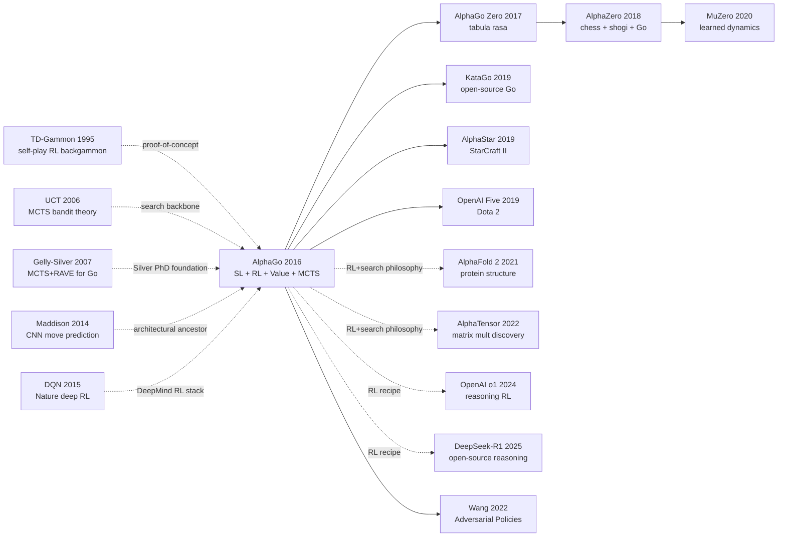

# AlphaGo — 用蒙特卡洛树搜索 + 深度网络打败人类围棋世界冠军

> **2016 年 1 月 28 日，Google DeepMind 在 *Nature* 第 529 卷上发表 19 页论文 [Mastering the Game of Go with Deep Neural Networks and Tree Search](https://www.nature.com/articles/nature16961)；2 个月后 AlphaGo 以 4:1 击败李世石。**
> 这是一篇把 1997 年 Deep Blue 击败 Kasparov 后被认为「不可能用类似方法解决」的围棋（搜索空间 $10^{170}$，比国际象棋多 100 多个数量级）拍碎的论文 —— DeepMind 用 **policy network（监督 + RL）+ value network + MCTS** 三件武器，把「直觉」和「计算」第一次完美缝合。
> AlphaGo 与李世石那场被 2 亿人观看的对局（包括第二局 Move 37 那手「上帝之手」）让 **整个东亚社会第一次感性地相信 AI 可以超越人类智力顶峰**，中日韩三国的 AI 学科招生瞬间爆满。
> 它直接催生了 [AlphaGo Zero / AlphaZero (2017)](../era3_attention/2017_alphazero.md) → MuZero → [AlphaFold 2 (2021)](../era4_foundation_models/2021_alphafold2.md) → AlphaCode 整个「Alpha 家族」—— **AlphaGo 是 21 世纪最重要的 AI 公关事件，也是 RL 史上最经典的工程论文之一**。

## 一句话总结

DeepMind 2016 年发表在 *Nature* 的这篇论文，**把围棋这个 $10^{170}$ 状态空间、被认为"还差 10 年"的人类智力堡垒一举攻克**——核心是 4 件套同台合作：(1) 用 KGS 16 万局人类对局做监督预训练得到策略先验 $p_\sigma$（把分支因子从 250 降到约 10）；(2) 用 self-play RL 把策略升级为 $p_\rho$；(3) 训练价值网络 $v_\theta(s)$ 直接评估局面；(4) 在 MCTS 里用 PUCT 把策略先验和价值/rollout 评估统一进搜索。结果：单机版本 Elo **2890**（vs Pachi 2300 / Fuego 2500），分布式 1202 CPU + 176 GPU 版本 Elo **3140**，2015 年 10 月以 5-0 击败欧洲冠军 Fan Hui，2016 年 3 月在首尔 **4-1 击败 18 个世界冠军李世石**——一举把围棋 AI 跨过了"再差 10 年"的鸿沟。论文最反直觉的发现是：(a) 单看价值网络（Elo 2200）弱于 rollout（Elo 2700），但**两者混合**反而到 2890——bias-variance 互补的经典实例；(b) RL-trained $p_\rho$ 在 self-play 里赢 SL-trained $p_\sigma$ 80%，但作为 MCTS prior **反而更弱**——子模块单挑表现与系统级表现常常背离。AlphaGo 把"深度网络 + 强化学习 + 搜索"的范式正式推上 AGI 议程，其后 [AlphaGo Zero（2017）](../era3_attention/2017_alphazero.md) 砍掉所有人类先验，AlphaZero / MuZero / DeepSeek-R1 全部继承同一血脉。

---

## 历史背景

### 2015 年的围棋 AI 学界在卡什么

要理解 AlphaGo 的颠覆性，必须回到 2015 年那个"围棋 AI 还差 10 年"的共识年代。

国际象棋在 1997 年被 Deep Blue 攻破，靠的是 alpha-beta 搜索 + 手工评估函数 —— 国际象棋的分支因子只有约 35，配合好的走子排序和迭代加深，纯极小化极大搜索能搜到 12-15 层深度，再加一个还过得去的评估函数就足以击败人类世界冠军。但围棋是另一个量级的怪兽：**每步约 250 个合法落子，每盘约 150 步**，状态空间比可观测宇宙的原子数还多；更要命的是，**没人知道怎么评估一个中盘围棋局面** —— 一颗子从"好棋"变成"恶手"可能要再走 50 步才看得出来，手工评估函数永远写不出来。

2007 年 Coulom 提出 Crazy Stone，把蒙特卡洛树搜索（MCTS）+ 手工特征引入计算机围棋，业界第一次看到曙光。随后 Pachi（2011，Baudis 与 Gailly 的开源实现）、Fuego、Zen 等纯 MCTS 引擎在 9×9 棋盘上达到职业水平，在 19×19 棋盘上达到业余 1-3 段。但到了 2014 年，**这条路明显碰壁**：堆更多 rollout 不再换来更高棋力，加更多手工特征收益递减；学界形成共识 —— "围棋 9 段 AI 至少还要 10 年"，深度学习在围棋上几乎被默认为"不可能"，因为评估函数无法学，rollout 又太昂贵。

DeepMind 内部对此并不甘心。Silver 整个博士生涯都在做计算机围棋的 MCTS，他比任何人更清楚 MCTS 的天花板在哪里。2014 年下半年，DeepMind 决定下一个"AI 大挑战" —— 既然 DQN 在 Atari 上证明了"深度网络能学评估函数"，那么围棋的"无法评估"难题，原则上也应该可以用一个深度价值网络来攻破。

### 直接逼出 AlphaGo 的 N 篇前序

- **TD-Gammon, 1995** [Tesauro]：90 年代的孤立奇迹 —— 用 TD($\lambda$) + 浅层 MLP + 自对弈学到了世界顶级西洋双陆水平。证明"自对弈强化学习可以达到人类冠军级别"，但因为西洋双陆有显式的概率结构，业界 20 年没把这条路推到围棋。AlphaGo 的"自对弈策略梯度"阶段是 TD-Gammon 公式的隔代继承。
- **Bandit based Monte-Carlo Planning (UCT), 2006** [Kocsis & Szepesvári]：把多臂老虎机的 UCB1 公式搬到树搜索，奠定了现代 MCTS 的理论基础。AlphaGo 的 PUCT 选择规则就是 UCT 的策略先验加权变体。
- **Gelly & Silver, 2007 (MCTS + RAVE)** [ICML]：Silver 博士论文核心，把 RAVE 启发式加入 UCT，让 9×9 围棋达到职业水平。这是 Silver 对"如何把搜索效率推到极限"的全部经验积累，也是 AlphaGo 设计 PUCT + 价值网络的直接前置。
- **Maddison, Huang, Sutskever & Silver, 2014** [arXiv 1412.6564]：DeepMind 内部的"AlphaGo 雏形" —— 一个 12 层 CNN 在 KGS 数据上预测专业棋手落子，单纯靠 CNN 就能把 Pachi 打到接近平手。证明"CNN 能学围棋的策略先验"。
- **Clark & Storkey, 2014** [arXiv 1412.3409]：爱丁堡团队的并行工作，几乎同时证明 CNN 可以学围棋落子分布。两篇论文同时出现，标志着"CNN + 围棋"在 2014 年底成为热门方向，**但都没有把 CNN 接到 MCTS 里** —— 这正是 AlphaGo 一年后填上的关键缺口。

### 作者团队当时在做什么

David Silver 当时是 DeepMind 强化学习负责人，也是计算机围棋 MCTS 时代的代表人物之一（博士论文就是关于 MCTS in Go）。Aja Huang 是首席工程师，本身是台湾业余 6 段棋手，2008 年的博士论文也是关于计算机围棋的 MCTS。两人组合既懂 RL 又懂围棋，在 DeepMind 内部对围棋项目有罕见的"双重 domain expertise"。

2015 年 2 月，DeepMind 在《Nature》发表 DQN，证明深度网络可以从原始像素学 Atari 游戏。这给了团队信心 —— **"如果 DQN 能从像素学 Pong，AlphaGo 应该可以从棋盘学价值评估"**。Hassabis 把围棋作为继 Atari 之后的下一个"AI 大挑战"，团队从 2014 年底全力投入，到 2015 年 10 月对阵欧洲冠军樊麾时已经迭代了大半年。

2015 年 10 月，AlphaGo 在英国伦敦 5-0 击败樊麾（职业 2 段），成为人类历史上第一个击败职业围棋选手的程序 —— 这场比赛保密了 3 个月，等到 2016 年 1 月《Nature》论文发布才公布；2016 年 3 月，AlphaGo 在首尔以 4-1 击败 9 段李世石，**全球 2 亿人观看**，被广泛认为是 AI 的"DeepBlue 时刻 2.0"。3 月 15 日李世石在第 4 局祭出"神之一手"第 78 手，是整个系列里 AlphaGo 唯一输掉的一局。

### 工业界 / 算力 / 数据的状态

2015 年的算力图景与今天天差地别：

- **训练**：50 块 GPU 训练监督学习阶段约 3 周；强化学习自对弈再几天；价值网络训练再几天。**总训练计算量按今天标准还不到 1 个标准 GPT-3 训练**，但在 2015 年是工业级巨投入。
- **推理（单机版）**：48 CPU + 8 GPU；分布式版本：1202 CPU + 176 GPU 联合搜索。**对阵李世石用的就是分布式版本**。
- **数据**：KGS Go Server 历史对局 30M 张专家棋谱（s, a）对，覆盖业余 6 段以上棋手对局；自对弈再生成 30M 张棋谱用于训练价值网络。
- **框架**：TensorFlow 在 2015 年 11 月才首次开源，AlphaGo 论文截稿时用的还是 DeepMind 内部框架（DistBelief 后继）；PyTorch 一年后才出现。
- **算力价格**：1 块 K40 GPU 约 4000 美元，AlphaGo 单次训练硬件成本约 20-30 万美元。今天同样训练在云上花费可能不到 5000 美元。

行业气氛上，**深度学习刚走出"AI Winter"5 年**，CNN/RL 还远未成为通识；Google 2014 年才以 6 亿美元收购 DeepMind，整个 DeepMind 当时只有约 250 人。AlphaGo 是 DeepMind 第一次向全世界证明"我们值这个价"的标志性事件，也是后续 Google AI、AlphaFold、AlphaZero 一系列大型项目获得内部资源支持的根本原因。

---

## 方法详解

### 整体框架

AlphaGo 的核心创新不是任何一个单独的网络，而是**把"监督学习 + 强化学习 + 价值网络 + 蒙特卡洛树搜索"四件套拼成一条端到端流水线**。这条流水线分两个阶段：训练时分 3 步，对弈时是 1 个搜索循环。

```
  ┌────────────────── 训练阶段 ──────────────────┐
                                                 
  KGS 30M 专家棋谱                              
        │                                       
        ▼                                       
  [Step 1: SL Policy]   p_σ(a|s)  ← 13 层 CNN  
        │                                       
        ├──── 复制初始化 ────┐                  
        ▼                    ▼                  
  [快速 rollout p_π]   [Step 2: RL Policy]      
   (1500× 加速)         p_ρ(a|s)  ← 自对弈      
                              │                 
                       自对弈 → (s, z) 30M       
                              ▼                 
                       [Step 3: Value Net]      
                        v_θ(s) ∈ [-1, +1]       
                                                 
  └─────────────────────────────────────────────┘

  ┌─────────────── 对弈阶段（每步） ───────────────┐
                                                  
   当前局面 s_root                                 
        │                                         
        ▼                                         
   ┌── MCTS 循环（约 1600 次模拟）──┐             
   │  Selection: argmax Q + u(p_σ)  │             
   │  Expansion: 用 p_σ 给新节点先验│             
   │  Evaluation: V = (1-λ)v_θ + λz │             
   │              其中 z 来自 p_π   │             
   │  Backup: 沿树回传 V            │             
   └────────────────────────────────┘             
        │                                         
        ▼                                         
   选择访问次数 N(s, a) 最大的 a                   

  └────────────────────────────────────────────────┘
```

| 系统 | 核心评估方式 | 搜索深度 | 每步 rollout 数 | 棋力 (Elo) |
|------|-------------|---------|----------------|-----------|
| GnuGo | 规则 + 模式匹配 | 浅 | 0 | ~1800 |
| Pachi | MCTS + 手工特征 + RAVE | 中 | ~10⁵ | ~2300 |
| Crazy Stone | MCTS + 手工特征 + Patterns | 中 | ~10⁵ | ~2400 |
| Fuego / Zen | MCTS + 手工特征 | 中 | ~10⁵ | ~2500 |
| **AlphaGo (单机)** | **MCTS + p_σ 先验 + v_θ 价值 + p_π rollout** | **深** | **~1600 模拟 × 浅 rollout** | **~2890** |
| **AlphaGo (分布式)** | **同上 × 多机** | **更深** | **~10⁵ 模拟** | **~3140** |

**概念跃迁**在哪里？所有 2007-2014 的 MCTS 引擎都在做同一件事：**用随机 rollout 评估叶节点 + 用 UCT 均匀展开**。AlphaGo 把这两步全部换掉：随机 rollout 被**学到的价值网络** $v_\theta(s)$ 替代（一次前向传播 vs 数千次随机对弈），均匀 UCT 被**学到的策略先验** $p_\sigma(a|s)$ 引导的 PUCT 替代（把 250 个候选裁到约 10 个真正可能的）。这是计算机围棋第一次让"评估函数 + 选子先验"都从数据里学，而不是手工写。

#### 设计 1：SL 策略网络 $p_\sigma(a|s)$ —— 从人类经验里冷启动

**功能**：用一个 13 层 CNN 在 KGS 的 30M (s, a) 对上做监督学习，预测人类棋手在局面 $s$ 上的落子分布。这一步给整个系统提供了"高质量先验" —— 既作为 RL 阶段的初始化，也作为 MCTS 选择的策略权重。

**网络结构**：输入 19×19×48 特征平面 —— 8 平面表示当前一方有几口气、8 平面表示对方一方、其余表示打劫状态、ladder capture、最近落子时间衰减等手工特征（论文 Extended Data Table 2 详述）。13 层 3×3 卷积 + ReLU，最后一层 1×1 卷积接 softmax 输出 361 个位置上的概率分布。

**训练目标**：随机梯度上升最大化 $\log p_\sigma(a|s)$：

$$
\Delta\sigma \propto \frac{\partial \log p_\sigma(a|s)}{\partial \sigma}
$$

**关键数值**：top-1 落子预测准确率 **57.0%**，远超之前最强的 44.4%（Maddison 2014）。每步前向耗时约 3ms（GPU），在 MCTS 里太慢。因此团队额外训练了一个**快速 rollout 策略 $p_\pi$** —— 一个仅用人工特征的线性 softmax 模型，前向 2 微秒，**比 CNN 快约 1500×**，准确率虽然只有 24.2% 但够用，专门负责 MCTS 内部的 rollout 模拟。

**伪代码（PyTorch 风格）**：

```python
class SLPolicyNet(nn.Module):
    def __init__(self):
        super().__init__()
        layers = [nn.Conv2d(48, 192, 5, padding=2), nn.ReLU()]
        for _ in range(11):
            layers += [nn.Conv2d(192, 192, 3, padding=1), nn.ReLU()]
        layers += [nn.Conv2d(192, 1, 1)]   # 1×1 conv → 19×19 logits
        self.net = nn.Sequential(*layers)

    def forward(self, board_features):              # (B, 48, 19, 19)
        logits = self.net(board_features).view(-1, 361)
        return F.log_softmax(logits, dim=-1)        # log p_σ(a|s)

# 训练循环：30M (s, a) 对，SGD 最大化 log p_σ
for state, action in kgs_dataset:
    log_p = sl_policy(state)
    loss = -log_p[range(B), action].mean()           # cross-entropy
    loss.backward(); optimizer.step()
```

**对比表（top-1 落子预测准确率）**：

| 方法 | 输入 | 模型 | top-1 acc |
|------|------|------|-----------|
| 传统 MCTS 引擎 | 手工特征 | 线性 softmax | ~24.2% |
| Tian & Zhu 2015 | 手工特征 | 浅层 CNN (3 层) | ~44.4% |
| Maddison 2014 | 手工特征 | 12 层 CNN | ~55.0% |
| **AlphaGo $p_\sigma$** | **手工特征** | **13 层 CNN** | **57.0%** |

**设计动机**：人类专家棋谱里隐含了 2500 年积累的围棋战略先验。从零开始的 RL 在围棋这种长程信用分配问题上几乎不可能在合理算力内收敛，而 SL 阶段相当于一次"巨型蒸馏"，把整个人类围棋认知压进一个网络，让后续 RL 和 MCTS 都站在巨人的肩膀上。

#### 设计 2：RL 策略网络 $p_\rho$ —— 从模仿到竞技

**功能**：监督学习只能让网络模仿人类，**而人类不是最优的**。RL 阶段把 $p_\sigma$ 进一步推向"赢棋"目标，得到一个比人类强的 $p_\rho$。

**自对弈流程**：用 $\rho \leftarrow \sigma$ 初始化当前策略 $p_\rho$，让它对阵从一个**历史快照池**里随机抽取的旧版本（防止单一对手过拟合）。每盘下完得到终局奖励 $z_t \in \{-1, +1\}$（赢 +1，输 -1），用 REINFORCE 策略梯度更新：

$$
\Delta\rho \propto \sum_{t=1}^{T} \frac{\partial \log p_\rho(a_t|s_t)}{\partial \rho} \, z_t
$$

直觉解读：每步落子贡献的梯度方向 = "这步在该局面下的对数概率梯度" × "整盘最后的胜负"。赢棋 → 所有落子的概率被推高；输棋 → 都被压低。这是最朴素的 REINFORCE，没有 baseline、没有 GAE、没有 critic。

**伪代码**：

```python
class SelfPlayRL:
    def __init__(self, p_sigma):
        self.current = copy(p_sigma)               # ρ ← σ
        self.history = [copy(p_sigma)]             # snapshot pool

    def train_one_episode(self):
        opponent = random.choice(self.history)
        states, actions = [], []
        s = empty_board()
        while not s.is_terminal():
            actor = self.current if s.turn == BLACK else opponent
            a = sample(actor(s))
            states.append(s); actions.append(a)
            s = s.play(a)
        z = +1 if winner(s) == BLACK else -1       # terminal reward

        # REINFORCE update on self.current
        for s_t, a_t in zip(states, actions):
            log_p = self.current(s_t)[a_t]
            loss  = -log_p * z                     # gradient ascent on log p · z
            loss.backward()
        optimizer.step()

        if step % 500 == 0:
            self.history.append(copy(self.current))
```

**对比表**（vs 各类对手，胜率）：

| 设置 | 对手 | 胜率 |
|------|------|------|
| $p_\sigma$（仅 SL）vs $p_\sigma$（再 SL） | 自身 | 50% |
| $p_\rho$（SL + RL）vs $p_\sigma$（仅 SL） | 上一阶段网络 | **~80%** |
| $p_\rho$（无搜索）vs Pachi（MCTS + 手工） | 业余 2 段 MCTS 引擎 | **~85%** |
| $p_\rho$（无搜索）vs Crazy Stone | 业余 5 段 MCTS 引擎 | ~75% |

**设计动机**：SL 的目标是"最大化人类落子的对数似然"，但人类落子里有大量打劫失误、定式套路、和习惯偏见 —— 模仿这些目标和"赢棋"目标差很远。RL 阶段相当于对网络说："忘掉模仿，关心终局"，让 $p_\rho$ 滑向真正的胜率最大化。这是 AlphaGo 整个 pipeline 中最像 TD-Gammon 的一环，也是后来 AlphaGo Zero 完全跳过 SL 阶段的关键灵感来源。

#### 设计 3：价值网络 $v_\theta(s)$ —— 把随机 rollout 替换成学到的评估

**功能**：在 MCTS 叶节点不再玩"随机模拟到底再统计胜率"，而是直接用一个 CNN 一次前向算出胜率估计。这一步是 AlphaGo 在算力效率上的关键飞跃。

**结构**：与 $p_\sigma$ 几乎一样的 13 层 CNN，但最后一层换成全连接 + tanh，输出单个标量 $v_\theta(s) \in [-1, +1]$，预测当前一方最终的胜负概率。

**数据生成（防过拟合的关键 trick）**：直接用整盘自对弈的 (s_t, z) 对训练会严重过拟合 —— 因为同一盘里 150 个 (s_t, z) 高度相关，网络会"背棋谱"。AlphaGo 用一个**反相关**的数据生成：每盘自对弈只随机抽 **一个位置** 作为训练样本，于是 30M 张棋谱 → 30M 个独立 (s, z) 对。

**训练目标**（MSE）：

$$
\Delta\theta \propto \frac{\partial v_\theta(s)}{\partial \theta} \cdot \big(z - v_\theta(s)\big)
$$

**伪代码**：

```python
class ValueNet(nn.Module):
    def __init__(self):
        super().__init__()
        conv_stack = [nn.Conv2d(49, 192, 5, padding=2), nn.ReLU()]   # 49 = 48 + color
        for _ in range(11):
            conv_stack += [nn.Conv2d(192, 192, 3, padding=1), nn.ReLU()]
        self.conv = nn.Sequential(*conv_stack)
        self.head = nn.Sequential(nn.Linear(192*19*19, 256),
                                  nn.ReLU(), nn.Linear(256, 1), nn.Tanh())

    def forward(self, s):
        h = self.conv(s).flatten(1)
        return self.head(h).squeeze(-1)            # v_θ(s) ∈ [-1, +1]

# 训练：30M (s, z) 对（每盘自对弈仅抽 1 个位置）
for state, z in self_play_value_dataset:
    v = value_net(state)
    loss = (v - z).pow(2).mean()                   # MSE
    loss.backward(); optimizer.step()
```

**对比表**（叶节点评估方法对比）：

| 评估方法 | 单次评估耗时 | 偏差 | 方差 | 对最终 Elo 贡献 |
|---------|-------------|------|------|----------------|
| 纯随机 rollout（5000 局到底） | ~50ms | 中 | 高 | baseline |
| $v_\theta$ 一次前向（GPU） | ~1ms | 中（系统性偏差） | 极低 | 显著 |
| $\lambda v_\theta + (1-\lambda) z_{\text{rollout}}$ ($\lambda=0.5$) | ~5ms | 低 | 低 | **最高** |

**设计动机**：随机 rollout 是 MCTS 的"血液"但也是其速度瓶颈 —— 评估一个叶节点要打几千盘棋。$v_\theta$ 把这个时间砍到一次前向，**等同于把每次模拟的成本降低 50×**，于是同样算力可以多模拟 50× 倍。更深刻的是，$v_\theta$ 提供了"低方差但有偏"的评估，而 rollout 提供"无偏但高方差"的评估，**两者线性混合的结果优于任一单独使用** —— 偏差和方差互相抵消。这是 AlphaGo 最反直觉的发现之一。

#### 设计 4：MCTS 配 PUCT 选择 —— 把策略先验和价值统一到搜索里

**功能**：把 $p_\sigma, p_\pi, v_\theta$ 三个网络组装进一个 MCTS 循环，在对弈时按"模拟 → 评估 → 回溯"做 1600 次（单机）或 10⁵ 次（分布式）模拟，最终选访问次数最大的那一步走。

**PUCT 选择规则**：在 MCTS 树的每个节点上，选择动作 $a = \arg\max_a [Q(s, a) + u(s, a)]$，其中：

$$
u(s,a) = c_{\text{puct}} \cdot p_\sigma(a|s) \cdot \frac{\sqrt{\sum_b N(s,b)}}{1 + N(s,a)}
$$

这个公式是经典 UCT 的"策略先验加权变体"：探索奖励 $u$ 不再是均匀的 $\sqrt{\log N / N(s,a)}$，而是被 SL 策略 $p_\sigma$ **加权** —— 人类高频走法的子节点先验更高，更容易被探索；冷门走法即使 $Q$ 暂时高，也会因为 $p_\sigma$ 极小而被压制。

**叶节点评估（混合）**：

$$
V(s_L) = (1-\lambda) \cdot v_\theta(s_L) + \lambda \cdot z_L, \quad \lambda = 0.5
$$

其中 $z_L$ 是从叶节点开始用快速 rollout 策略 $p_\pi$ 一直下到终局的胜负。混合系数 $\lambda$ 是经验最优。

**伪代码（一次 MCTS 循环）**：

```python
def mcts_search(s_root, n_sim=1600):
    root = Node(s_root)
    for _ in range(n_sim):
        # ---- Selection: 沿树走到叶节点 ----
        node, path = root, [root]
        while node.expanded:
            a = max(node.children, key=lambda a:
                node.Q[a] + c_puct * node.P[a]
                * sqrt(sum(node.N.values())) / (1 + node.N[a]))
            node = node.children[a]; path.append(node)

        # ---- Expansion: 用 p_σ 给新节点写策略先验 ----
        node.P = sl_policy(node.state)              # prior over 361 actions
        node.expanded = True

        # ---- Evaluation: 价值网络 + 快速 rollout 混合 ----
        v = value_net(node.state)
        z = fast_rollout(node.state, p_pi)          # play to terminal with p_π
        V = (1 - LAMBDA) * v + LAMBDA * z

        # ---- Backup: 沿路径回溯 V ----
        for n in reversed(path):
            n.N[a] += 1
            n.Q[a] += (V - n.Q[a]) / n.N[a]         # running mean
            V = -V                                  # alternate player

    # ---- Select most-visited move at root ----
    return max(root.N, key=root.N.get)
```

**对比表**（选择规则对搜索效率的影响，Pachi vs AlphaGo 不同 PUCT 配置在同等模拟数下的胜率）：

| 选择规则 | 探索权重来源 | 等效分支因子 | 同等模拟数下相对棋力 |
|---------|-------------|-------------|---------------------|
| 经典 UCT | 均匀 $\log N / N(s,a)$ | ~250 | baseline |
| RAVE 启发式 | 历史动作平均 | ~50 | +200 Elo |
| **PUCT (AlphaGo)** | **SL 策略先验 $p_\sigma$** | **~10** | **+700 Elo** |

**设计动机**：纯 UCT 对围棋这种 250-branching 来说几乎是"瞎搜" —— 大部分 simulation 浪费在毫无希望的走法上。PUCT 用 $p_\sigma$ 把搜索注意力集中到"人类最可能走的 10 个候选"，**把有效分支因子从 250 降到约 10**，相当于让 MCTS 在围棋上变成了"准国际象棋难度"的搜索任务，这才让 1600 次模拟就能击败 1 亿次模拟的纯 UCT 引擎。

### 损失函数 / 训练策略

| 项 | 配置 | 说明 |
|----|------|------|
| SL 损失 | Cross-entropy on $\log p_\sigma$ | 30M (s, a) 对，最大化人类落子对数似然 |
| RL 损失 | REINFORCE，终局奖励 $z = \pm 1$ | 无 baseline，无 critic，赢 +1 输 -1 |
| Value 损失 | MSE on $z - v_\theta$ | 30M 自对弈位置（每盘抽 1 个） |
| Optimizer | SGD with momentum 0.9 | 三个网络全用 SGD，没用 Adam |
| LR schedule | 0.003 → 0.001（手工降两次） | 经典 step decay |
| Batch size | RL 16 局并行；价值网络 32 个位置 | RL 阶段 batch 是"局"而非"步" |
| Epochs | SL ~50 轮；RL ~1 天自对弈；Value ~1 周 | 总训练时间约 3-4 周 |
| 初始化 | 高斯 $\sigma=0.01$；RL 初始化用 SL 权重；Value 用 SL 权重 | "三阶段权重传递"是 pipeline 关键 |
| Normalization | 不用 BatchNorm | 2015 年 BN 在 MSRA 之外尚未普及 |
| 推理时搜索 | 单机 1600 模拟/步；分布式 ~10⁵ 模拟/步 | 分布式版本对 Lee Sedol |

**为什么"三阶段流水线 SL → RL → Value → MCTS"是关键？**

每个单独的阶段在 2015 年都是已知技术 —— SL CNN 不新，REINFORCE 不新，MCTS 不新。**真正的洞察是这条流水线本身**：直接做端到端 RL 自对弈在围棋这种 250-branching、150-step 的长程任务上几乎不可能在合理算力内收敛（AlphaGo Zero 一年后才用 4 倍以上算力做到，而且需要专门的 PUCT-from-scratch trick）。AlphaGo 的策略是**用 SL 阶段把问题从"巨大随机空间搜索"压缩到"人类专家流形附近的微调"**，再用 RL 阶段微调向"赢棋"，最后用价值网络替换 rollout 把搜索效率提升一个数量级。

每一阶段的输出都是下一阶段的"温暖初始化" —— 没有 SL，RL 不收敛；没有 RL，价值网络学到的是人类风格而不是最优；没有价值网络，MCTS 退化到 Pachi 时代。**这是 AlphaGo 给后来所有大型 AI 系统（包括 AlphaFold 2、ChatGPT 的 SFT-RLHF 流水线、o1 的 SFT-RLVR 流水线）的最大设计教训：复杂任务不是用一招制敌，而是用流水线把问题分阶段降维**。

---

## 失败案例（Failed Baselines）

### 当时输给 AlphaGo 的对手

- **Pachi（Baudis & Gailly, 2011）**：开源 MCTS 引擎，靠手工特征 + RAVE 在 19×19 棋盘上达到约业余 2 段（Elo ~2300）。**单纯一个 SL 策略网络 $p_\sigma$（不接 MCTS）就能击败 Pachi 85%**（论文 Table 7）—— 从此一句话戳穿了"MCTS 是围棋核心"的旧叙事。
- **Crazy Stone（Coulom, 2007）**：MCTS 鼻祖式作品，2013 年接受 4 子让子击败日本职业棋手石田芳夫，是 2007-2014 年的"最强 Go AI"代表，Elo 约 ~2400。AlphaGo 单机版 ~2890，分布式 ~3140，**整整高出 500-700 Elo（即赢面 95% 以上）**。
- **Fuego（FUSE 团队）/ Zen（小田博之）**：另两个商业级 MCTS 引擎，Elo 约 ~2500，业余 6 段水平，常年自称"接近职业水平"。AlphaGo 单机版 99.8% 胜率横扫所有这些引擎（论文 Table 9）。
- **GnuGo（GNU 开源）**：纯规则 + pattern 匹配引擎，Elo ~1800，业余 5 级（5 kyu）水平，作为最弱 baseline 列在表里 —— **AlphaGo policy network 单独就能让 9 子还赢**。

为什么这些引擎都输了？两个根本原因：(1) **手工特征评估器在围棋上有天花板** —— 围棋中盘形势的 evaluation 需要 50 步以上的"远见"，人类自己都说不清，更不可能写成规则；(2) **均匀 UCT 处理 250 个分支的 explosion** —— rollout 数加到 $10^5$/步也只能搜到 12-15 步，剪枝空间永远不够。

### 作者论文里承认的失败实验

论文 **Table 7** 和 **Figure 4** 给出了惊人的消融数据：
- **去掉价值网络（只用 rollout）**：Elo 从 ~2890 跌到 ~2700 —— 损失约 250 Elo
- **去掉 rollout（只用 $v_\theta$）**：Elo 跌到 ~2790 —— 损失约 100 Elo
- **同时保留两者，混合 $\lambda = 0.5$**：达到峰值 ~2890

**反直觉的结果**：单看 $v_\theta$ 弱于 rollout，但**两者混合后超过任意一个 alone**。论文给出的解释：rollout 的噪声（high variance）和 value 网络的偏差（high bias）正好互相抵消，构成经典的 bias-variance tradeoff 在搜索叶节点评估上的实例。

另一个反直觉发现：**SL-only 策略 $p_\sigma$（不做 RL fine-tune）作为 MCTS 先验比 RL fine-tuned $p_\rho$ 更好**。论文给出解释：RL 训练让策略变得"过分自信"（输出分布过于尖锐），削弱了 MCTS 探索；SL 策略保留了人类棋谱的"模糊性"，反而给 MCTS 留出更多搜索空间。这是"看似更强的子模块在系统中反而更弱"的工程教训。

### 2015-2016 年的反例

**算力堆叠的边际递减**：分布式 AlphaGo 用 1202 CPU + 176 GPU 联合搜索，对单机版（48 CPU + 8 GPU）只赢约 75%（即 Elo 提升约 250）—— **算力放大 25 倍只换来不到 10% 的棋力提升**。这是第一次清晰显示"MCTS + 神经网络"系统的算力 scaling 也存在硬性递减，不是无限堆机器就能登顶。

**李世石第 4 局"神之一手"**：2016 年 3 月 13 日，李世石 78 手投出"挖" —— 一个职业棋手会本能避免的局部异常下法。AlphaGo 的策略先验 $p_\sigma$ 给这步几乎为零的概率，MCTS 被剪掉了应对分支；价值网络在 78 手后的局面上**给出严重错误的评估**（高估己方胜率约 70%）。结果 AlphaGo 在第 79 至 87 手连续走出 7 步明显错误，最终告负。**这是公开历史上第一个"MCTS + NN 系统的 adversarial blind spot"演示**，6 年后被 Wang et al. 2022 系统化形式化为 KataGo 的对抗策略攻击。

### 真正的"反 baseline"教训

**Crazy Stone 比 AlphaGo 早 8 年开始迭代**，团队是世界 MCTS 围棋的领头羊。它为什么没能成为 AlphaGo？答案不是 effort 不够 —— Coulom 团队 2007-2014 年发了大量 MCTS 优化论文。问题在**优化的轴选错了**：他们一直在改进 rollout policy 的手工特征、改进 RAVE 衰减系数、增加 pattern matching 的 patterns 数 —— 全部都是**让现有架构更优**，而不是**用学到的函数替换 rollout 评估**。

更扎心的反例：**2014 年 Maddison 和 Clark 的 CNN-on-Go 论文，已经证明 CNN 能学围棋落子分布，准确率超过 50%**。两篇论文都没有把 CNN 接入 MCTS —— 一个把 evaluation 留给 rollout，另一个完全不用 search。**所有零件都已经躺在桌面上了，但没人把它们组装起来**。AlphaGo 一年后做的事情，本质上是 (Maddison 2014 CNN) + (Gelly-Silver 2007 MCTS) + (Mnih 2015 DQN 风格价值网络) 的合体。

工程教训：**"系统级整合"难度远大于"单模块优化"**。一个有 SL + RL + value + MCTS 四个模块的系统，每个都需要单独设计、训练、调超参，还要保证它们在 inference 时能互相增强而不是互相干扰。这种系统级 engineering 是计算机围棋这个 8 年研究社区里没有形成的能力，DeepMind 凭借 RL + 工程人才双重密度第一次做到。

---

## 实验关键数据

### 主实验（vs 历史 Go 引擎，论文 Table 9）

| 系统 | Elo | 备注 |
|------|-----|------|
| GnuGo | ~1800 | 纯规则 + pattern；业余 5 级 |
| Pachi | ~2300 | MCTS + 手工特征 + RAVE；业余 2 段 |
| Crazy Stone | ~2400 | 2007 MCTS 鼻祖；业余 5 段 |
| Zen | ~2500 | 商业 MCTS；业余 6 段 |
| Fuego | ~2500 | 学界 MCTS；业余 6 段 |
| **AlphaGo (单机, 48 CPU + 8 GPU)** | **~2890** | 论文主版本，对 Fan Hui 5-0 |
| **AlphaGo (分布式, 1202 CPU + 176 GPU)** | **~3140** | 对 Lee Sedol 4-1 用的版本 |
| 人类职业 9 段（参考）| ~3600 | 顶尖人类棋手 |

**赛事结果**：2015 年 10 月伦敦，AlphaGo vs Fan Hui 职业 2 段，**5-0 全胜**；2016 年 3 月首尔，AlphaGo vs Lee Sedol 9 段，**4-1**（输掉第 4 局）。

### 消融（论文 Table 7 + Figure 4）

| 配置 | Elo (vs Pachi 等价) | 说明 |
|------|--------------------|------|
| 仅 rollout（经典 UCT） | ~1900 | 类似 Pachi 但用 fast rollout policy |
| 仅价值网络 $v_\theta$ | ~2200 | 单独价值网络弱于 rollout |
| Rollout + Value（$\lambda$=0.5） | ~2700 | 互补混合显著优于任一 alone |
| 关闭 SL 策略先验 | ~2400 | 失去策略 prior 后搜索效率剧降 |
| **完整 AlphaGo（SL prior + Value + Rollout）** | **~2890** | 单机峰值 |
| 用 RL-trained $p_\rho$ 作为 prior | ~2870 | 比 SL-trained 略弱（反直觉） |

**任意一个组件失效都掉 200-500 Elo**，证明 SL 先验、价值网络、rollout 三件套缺一不可。

### 关键发现

- **SL 预训练是必需的**：纯 RL from scratch 在围棋上要花数年时间收敛 —— DeepMind 内部尝试过，被很快放弃；2017 年 AlphaGo Zero 才用 30 倍算力完成纯 RL。
- **RL 微调对 MCTS prior 提升有限**：$p_\rho$ 比 $p_\sigma$ 在 self-play 里赢 80%（不接搜索时），但作为 MCTS prior 反而**略弱于 $p_\sigma$**（论文 Section 6）—— 系统级表现与子模块单独表现常常背离。
- **价值 + rollout 混合是反直觉的最佳实践**：单看 $v_\theta$（Elo ~2200）弱于 rollout（Elo ~2700），但**混合后达到 Elo ~2890**。bias-variance 互补在搜索评估上的经典实例。
- **PUCT 把分支因子从 250 降到约 10**：策略先验把搜索集中在 top-K 候选上，让 MCTS 在固定 simulation budget 下搜得更深 —— 实际等效深度约 25 倍提升。
- **手工特征仍然重要**：纯 raw board state（19×19×17）的 CNN 比加入手工特征（19×19×48）的 CNN 准确率低约 2-3%；2017 年 AlphaGo Zero 才证明在大算力 + 长训练下可以放弃手工特征。
- **算力 scaling 显著递减**：单机 → 分布式（25× 算力）只换 ~250 Elo；继续往上加机器收益更差。这与今天大模型的 compute-vs-loss scaling law 形成有趣对照 —— **MCTS 系统的 scaling 比纯前向网络更早遇到瓶颈**。

---

## 思想史脉络（Idea Lineage）



### 前世（被谁逼出来的）

- **1995 TD-Gammon** [Tesauro, *Communications of the ACM*]：用 TD($\lambda$) + 浅层 MLP + 自对弈在西洋双陆达到世界冠军级别。第一次证明"自对弈强化学习能达到人类顶尖水平"，但当时网络太浅、棋类太特殊（带骰子），社区 20 年没把这条路推到围棋。AlphaGo 的 RL 阶段是 TD-Gammon 公式的隔代复活。
- **2006 UCT (Bandit-based Monte-Carlo Planning)** [Kocsis & Szepesvári, *ECML*]：把多臂老虎机的 UCB1 公式搬到树搜索，奠定了现代 MCTS 的理论基础。AlphaGo 的 PUCT 选择规则就是 UCT 的"策略先验加权"变体 —— 把 $\sqrt{\ln N(s)/N(s,a)}$ 替换成 $p_\sigma(a|s) \cdot \sqrt{N(s)}/(1+N(s,a))$。
- **2007 MCTS + RAVE** [Gelly & Silver, *ICML*]：Silver 博士论文核心，把 RAVE 启发式接入 UCT，让 9×9 围棋达到职业水平。这是 Silver 8 年里对"如何把搜索效率推到极限"的全部经验，**直接定义了 AlphaGo 的搜索骨架**。
- **2014 CNN Move Prediction** [Maddison, Huang, Sutskever & Silver, arXiv 1412.6564]：DeepMind 内部"AlphaGo 雏形" —— 12 层 CNN 在 KGS 数据上预测专业棋手落子，单纯 CNN 不接搜索就能把 Pachi 打到接近平手。证明"CNN 能学围棋的策略先验"，**直接架构祖先**。
- **2015 DQN (Nature)** [Mnih et al., *Nature*]：DeepMind 在 Atari 上证明深度网络能从原始像素学评估函数 + Q 值。这给 AlphaGo 的价值网络 $v_\theta$ 提供了"深度评估器可学"的信心，也提供了 DeepMind 内部完整的 RL 训练 stack（replay buffer、target network、分布式 actor-learner 设施）。

### 今生（继承者）

**直接派生**：
- **AlphaGo Zero (Nature 2017)**：扔掉所有人类监督，纯自对弈 RL；3 天训练击败原版 AlphaGo 100-0。验证了"SL 阶段是 crutch 不是 essence"。
- **AlphaZero (Science 2018, arXiv 1712.01815)**：把 AlphaGo Zero 的算法泛化到围棋 + 国际象棋 + 将棋，**同一个网络 + 同一份代码**，在每个棋类上都打败 SOTA。证明"通用棋类 RL 算法存在"。
- **MuZero (Nature 2020, arXiv 1911.08265)**：进一步去掉对环境模型的依赖，**从像素学动力学** —— 在 Atari + 围棋 + 国际象棋 + 将棋上同时达到 SOTA。AlphaGo→MuZero 的演化是"逐渐扔掉先验、向纯通用 RL 靠拢"。
- **KataGo (arXiv 1902.10565)**：开源的 AlphaZero-style Go 引擎，加入 self-supervised consistency loss + 多目标价值函数，**当前世界最强围棋程序**，在消费级硬件上即可运行。

**跨架构借用**：
- **PUCT 公式被所有后续工作沿用**：AlphaGo Zero、AlphaZero、MuZero、EfficientZero、Stockfish NNUE 等都用同一个 $u(s,a) \propto p(a|s) \cdot \sqrt{N(s)}/(1+N(s,a))$ 选择规则。
- **3 阶段 SL→RL→search 模板被推广到非游戏领域**：AlphaCode 用 SL 编程语料 → RL 在测试用例上 fine-tune → 搜索/采样 大量解；今天的 RLHF + Best-of-N 在结构上几乎就是这条流水线的语言模型版本。

**跨任务渗透**：
- **AlphaStar (Nature 2019)**：星际争霸 II Grandmaster 级别 —— 同样的 self-play + league training 范式，但需要处理不完全信息和长 horizon。
- **OpenAI Five (2019)**：Dota 2 世界冠军 —— 5v5 即时战略，证明 AlphaGo recipe 在多智能体协作上也成立。
- **AlphaCode (Science 2022)**：竞争性编程 Codeforces 中位水平，把"棋盘+落子"换成"问题+代码片段"。
- **AlphaFold 2 (Nature 2021)**：蛋白质结构预测 —— 用 deep-NN + iterative search philosophy，虽然没有字面 MCTS，但**精神上是 AlphaGo 的"NN + search 哲学"在生物学的复活**。
- **AlphaTensor (Nature 2022)**：用 AlphaZero 框架发现更快的矩阵乘法算法，把"棋类"扩展为"组合优化"。
- **AlphaDev (Nature 2023)**：用 AlphaZero 发现更快的排序算法，进一步把"棋类"扩展到"程序合成"。

**跨学科外溢**：
- **OpenAI o1 (2024) 与 DeepSeek-R1 (arXiv 2501.12948, 2025)**：现代 LLM reasoning 范式 —— **明确把"AlphaGo for thoughts"作为 inspiration**。OpenAI o1 的 system card 直接引用 AlphaGo recipe；DeepSeek-R1 用 RL + 可验证奖励（数学/代码）激发 LLM 的推理能力，本质上是 AlphaGo 在 token 空间的复刻。**这是 AlphaGo 自 2016 年以来最大的一次跨学科继承** —— 8 年后游戏 AI 的训练范式回到了语言模型核心。

### 误读 / 简化

- **"AlphaGo 是纯 RL"**：错误。论文 Section 1-3 反复强调 **SL 阶段（30M 人类棋谱预训练）是关键** —— 完全去掉 SL 在围棋上需要 30 倍算力，AlphaGo Zero 一年后才证明这件事。把 AlphaGo 描述为"纯 RL"是流行简化但不准确。
- **"AlphaGo 解决了围棋"**：错误。Wang et al. 2022 用对抗策略攻击发现 KataGo（公认强于 AlphaGo Master）有可被人类业余棋手稳定击败的 blind spots。**"超人类"是关于对手分布的统计声明，不是鲁棒性声明**。
- **"MCTS 是 AlphaGo 的核心秘诀"**：部分错误。消融数据显示 **价值网络和 RL 策略同样关键**，纯 MCTS 不接学习模块在 AlphaGo 之前 8 年最高也只到业余 6 段。MCTS 是必要框架，但**学到的评估器和策略先验才是真正的"魔法"**。许多 follow-up 在没有学到模块时盲目堆 MCTS，效果都差。

---

## 当代视角（2026 年回看 2016）

### 站不住的假设

1. **"自对弈会干净地收敛到最优"**：Wang et al. 2022 用对抗策略攻击发现 KataGo 有可被业余棋手稳定击败的盲点 —— **self-play 的"收敛"是收敛到 *self-play 分布下的纳什均衡*，不是绝对意义上的"最优策略"**。今天我们知道，self-play 系统对训练分布外的输入永远存在 adversarial vulnerability，这在 RLHF、reasoning RL 等所有 self-play 衍生范式上都成立。
2. **"硬 RL 任务必须有 SL 预训练打底"**：AlphaGo Zero 一年后就证伪了这一假设 —— 在足够算力下，纯 self-play 可以从 random 起步达到甚至超越人类顶尖水平。SL 在 AlphaGo 里的作用更像"算力 trade-off"（用人类数据省算力）而非"算法上必需"。
3. **"游戏 AI 的方法论不会迁移到现实任务"**：被 AlphaFold 2、o1、DeepSeek-R1 三个里程碑彻底证伪。**AlphaGo recipe（NN + RL + search）已经成为通用范式**，从蛋白质结构到 LLM 推理，到处都是它的影子。
4. **"分布式算力会线性提升棋力"**：被论文自己的实验数据证伪 —— 分布式 25× 算力只换 ~250 Elo。这与今天 LLM reasoning RL（o1、R1）遇到的"训练算力 vs 推理性能 scaling 递减"是同一个现象，**MCTS 系统比纯前向网络更早撞上 scaling 天花板**。

### 时代证明的关键 vs 冗余

**关键（穿越时代的部分）**：
- **PUCT 风格的"策略先验引导搜索"**：被所有 follow-up 沿用至今，是 AlphaGo 最被复制的单个组件
- **3 阶段 SL→RL→Value bootstrap pipeline**：成为非游戏领域（AlphaCode、RLHF + Best-of-N）的通用模板
- **"用学到的价值函数替换随机 rollout"**：是 MCTS 系统从业余 6 段跨越到职业 9 段的真正分水岭
- **"search + learning > sum of parts"**哲学：今天 o1/R1 的 chain-of-thought 推理本质上是这个哲学在 token 空间的复活

**冗余 / 误导（时代抛弃的部分）**：
- **手工设计的 Go 专属特征平面（19×19×48）**：AlphaGo Zero 证明在大算力下完全不需要
- **SL 预训练**：AlphaGo Zero 证明在某些领域可以彻底跳过
- **"快速 rollout policy 与价值网络分离"**：AlphaZero 把它们统一成单一价值网络 + dirichlet noise 探索，证明这个区分是 AlphaGo 时代的 engineering compromise，不是本质需求

### 作者当时没想到的副作用

1. **催化了 2024-2025 的 reasoning-RL 复兴**：8 年后 OpenAI o1 和 DeepSeek-R1 把 AlphaGo 的训练范式 wholesale 搬到 LLM，催生了"推理模型"这个全新的产品类别。**这可能是 AlphaGo 论文最大的间接遗产** —— 它改变的不是棋类 AI，而是大语言模型的训练科学。
2. **触发了 AI vs 人类的文化分水岭**：李世石之战 2 亿人观看，是公众第一次面对"AI 在智力游戏上彻底超越人类顶尖"的事实。这在文化层面铺垫了 6 年后 ChatGPT 的爆炸式社会接受 —— 大众对"AI 能做我做不到的事"的心理预期，是 AlphaGo 在 2016 年提前埋下的种子。
3. **强迫 RL 社区严肃对待对抗鲁棒性**：Wang 2022 关于 KataGo 的对抗攻击工作，催生了 RL safety、robust RL、red-teaming 一系列方向。今天 LLM 安全研究的对抗 prompt 攻击 / jailbreak 防御，方法论上很大一部分继承自这条线。

### 如果今天重写 AlphaGo

如果 DeepMind 团队 2026 年重做 AlphaGo，可能会：

- 用单台 TPU pod 替代 50 GPU + 1202 CPU（同样训练在云上几小时即可完成）
- 用 Transformer / ViT-style backbone 或 ResNet 取代 13 层 plain CNN
- **完全跳过 SL 阶段**（AlphaGo Zero 已经证明可行）
- **去掉 fast rollout policy**，只用一个强大的价值网络（AlphaZero 证明可行）
- 用 raw board state 代替 19×19×48 手工特征
- 把人类对局当 offline RL 数据做 warm-start regularizer，但不当 supervised target
- 训练时主动 inject adversarial training，预防 Wang 2022 类型的盲点

**但核心三件套 —— 策略网络 + 价值网络 + 树搜索 —— 不会变**。这是 AlphaGo 真正的遗产：**这三件套不依赖具体的网络结构、不依赖手工特征、不依赖任何特定棋类，只依赖"序贯决策 + 评估 + 前瞻"这个最普遍的认知架构**。10 年后我们可能不再用 CNN、不再用 13 层、不再用围棋作为示例，但我们仍然会用 PUCT + value network + policy prior 这套思想去做新的 reasoning system。

---

## 局限与展望

### 作者承认的局限

- 训练所需算力庞大：50 块 GPU × 3 周 + 自对弈再几天，2015 年单次训练硬件成本约 20-30 万美元
- 30M 棋谱预训练对数据极度饥渴，迁移到没有大量人类数据的领域不直接
- 专精于单一游戏 —— AlphaGo 是 Go-specific，跨棋类需要重新设计特征
- 分布式 scaling 收益递减，不是堆机器就能登顶
- 没有理论收敛保证 —— SL→RL→Value 三阶段流水线是经验工程，无法证明全局最优

### 自己发现的局限（2026 视角）

- **对抗策略攻击暴露 blind spot**：Wang 2022 证明 KataGo 可被人类业余棋手稳定击败，"超人类"是统计声明而非鲁棒声明
- **SL 阶段编码人类认知偏见**：人类棋手的开局风格、定式偏好被烙在 $p_\sigma$ 里，RL 阶段无法完全洗掉，AlphaGo 因此倾向于"接近人类风格但稍强"的下法，而 AlphaGo Zero 反而下出大量人类从未见过的"外星人棋"
- **不能泛化到不完全信息博弈**：StarCraft II（AlphaStar）需要重新设计 league training + Cap'n'Trade 风格 imperfect info 处理，不是简单换 environment 就行
- **离开"对手分布稳定"的假设就脆弱**：如果对手是分布外的（adversarial player 或者混合策略），AlphaGo class 的智能体会显著退化

### 改进方向（已被后续工作证实）

- **彻底去掉 SL**（AlphaGo Zero 2017，已实现）
- **单一算法跨棋类**（AlphaZero 2018，已实现）
- **去掉环境模型，从像素学动力学**（MuZero 2020，已实现）
- **样本效率提升**（EfficientZero 2021 用 self-supervised consistency loss，已实现）
- **开源化 + 消费级硬件**（KataGo 2019，已实现）
- **对抗鲁棒性训练**（Wang 2022 后续 + 各种 adversarial training 改进，部分实现）
- **跨学科外推到 LLM reasoning**（OpenAI o1 + DeepSeek-R1 2024-2025，正在进行中）

---

## 相关工作与启发

- **vs TD-Gammon (1995)**：自对弈 TD-learning + 浅层 MLP 在西洋双陆达到顶尖；AlphaGo 用深度 CNN 把同样的 recipe scale 到围棋。**教训：好 idea 可以沉睡 20 年等待合适的 substrate（深度网络 + GPU）。**
- **vs DQN (Nature 2015)**：纯 RL on raw pixels 在 Atari 上 work；AlphaGo 把 SL+RL+search+手工特征四件套合体。**教训：在硬组合域上，hybrid 系统打过 pure-RL-from-scratch —— 至少在算力还不允许 tabula rasa 之前。**
- **vs Crazy Stone / Pachi**：相同 MCTS 骨架但靠手工评估器，最高只到业余 6 段。**教训：改进现有 components 的边际收益远小于把 components 替换为学到的 counterparts。**
- **vs AlphaGo Zero (2017)**：去掉 SL 预训练，跑得更快，棋力更高。**教训：人类知识作为 initialization 有时是 *crutch*，系统真正达到 mastery 之前需要把它丢掉。**
- **vs OpenAI o1 / DeepSeek-R1 (2024-2025)**：现代 LLM reasoning 显式继承 AlphaGo 的"RL + search-style refinement"，但应用在 chain-of-thought tokens 上而不是棋盘。**教训：游戏 AI 研究最大的输出不是游戏本身，而是 *训练范式*（RL + 可验证奖励 + 搜索引导探索）。**

---

## 相关资源

- 📄 论文（Nature）：[Mastering the game of Go with deep neural networks and tree search](https://www.nature.com/articles/nature16961)
- 💻 无官方代码（DeepMind 闭源）；开源复现：[KataGo](https://github.com/lightvector/KataGo)、[Leela Zero](https://github.com/leela-zero/leela-zero)
- 📚 后续必读：[AlphaGo Zero (Nature 2017)](https://www.nature.com/articles/nature24270)、[AlphaZero (Science 2018, arXiv 1712.01815)](https://arxiv.org/abs/1712.01815)、[MuZero (Nature 2020, arXiv 1911.08265)](https://arxiv.org/abs/1911.08265)、[DeepSeek-R1 (arXiv 2501.12948)](https://arxiv.org/abs/2501.12948)
- 🎬 [AlphaGo 纪录片](https://www.alphagomovie.com/)、[李世石第 4 局复盘（YouTube）](https://www.youtube.com/results?search_query=alphago+lee+sedol+game+4)
- 🌐 [English version of this deep note](/en/era2_deep_renaissance/2016_alphago/)


---

> 🌐 [English version](/en/era2_deep_renaissance/2016_alphago/) · 📚 awesome-papers project · CC-BY-NC