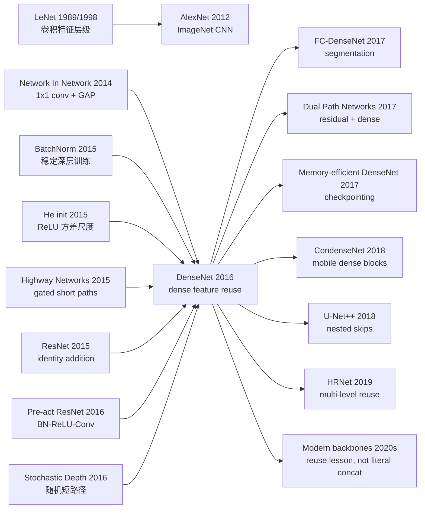

# DenseNet - 把每一层的特征都留给后来者

> **2016 年 8 月 25 日，Gao Huang、Zhuang Liu、Laurens van der Maaten、Kilian Q. Weinberger 四位作者把 [arXiv:1608.06993](https://arxiv.org/abs/1608.06993) 挂到网上，次年发表于 CVPR 2017。** ResNet 刚刚让“更深”变成可能，DenseNet 做了一个更贪心也更节俭的决定：别只把上一层传下去，把一个 block 里所有旧特征都原封不动留给后来层。于是第 $\ell$ 层不再吃一个张量，而是吃 $[x_0,x_1,\ldots,x_{\ell-1}]$；每层只新增很少的 $k$ 张 feature maps，却让整张网络共享一份不断增长的“公共记忆”。这篇论文最反直觉的地方，是连接数从 $L$ 暴涨到 $L(L+1)/2$ 后，参数量反而可以更少：DenseNet-BC 用 0.8M 参数逼近 10.2M 参数的 1001 层 pre-act ResNet，DenseNet-201 又用约一半参数追平 ResNet-101。它不是后来最常用的 backbone，却把“feature reuse”这四个字钉进了视觉网络设计史。

## 一句话总结

Gao Huang、Zhuang Liu、Laurens van der Maaten、Kilian Q. Weinberger 四位作者 2016 年上传 arXiv、2017 年发表于 CVPR 的 DenseNet，把 [ResNet（2015）](2015_resnet.md) 的“短路径让深网可训”推进到极限：ResNet 用 $x_\ell=H_\ell(x_{\ell-1})+x_{\ell-1}$ 做加法保留状态，DenseNet 改成 $x_\ell=H_\ell([x_0,x_1,\ldots,x_{\ell-1}])$，让每层直接读取同一 dense block 里所有旧 feature maps，并只用 growth rate $k$ 新增少量通道。它击败的 baseline 不是单个弱模型，而是 2016 年视觉 backbone 的两种主流答案：1001 层 pre-act ResNet 用 10.2M 参数在 C10+ 上到 4.62% error，DenseNet-BC-100-$k12$ 用 0.8M 参数到 4.51%；Wide ResNet-28 用 36.5M 参数在 C100+ 上到 20.50%，DenseNet-BC-190-$k40$ 用 25.6M 参数到 17.18%。后续影响链从 Fully Convolutional DenseNets、CondenseNet、DPN 到 U-Net++ / HRNet 式多层特征复用。反直觉 lesson 是：更多连接不等于更多参数；只要连接用于复用旧特征，而不是复制旧特征，网络可以同时更深、更窄、更省。

---

## 历史背景

### 2016 年的视觉架构问题：深度已经打开，冗余开始显眼

2012 年 [AlexNet](2012_alexnet.md) 证明 CNN 可以在 ImageNet 上压倒手工特征，2014 年 VGG 把“小卷积核 + 深堆叠”变成主流，2015 年 [BatchNorm](2015_batchnorm.md) 和 [He initialization](2015_he_init.md) 让 ReLU 深网的尺度更稳定，2015 年末 [ResNet](2015_resnet.md) 又把 152 层网络推到 ImageNet 第一。到 DenseNet 出现时，“深网能不能训练”已经不再是唯一问题。更尖锐的问题变成：**深层 CNN 里到底有多少层只是在重复保存前面已经学过的特征？**

ResNet 给出的答案是 additive identity shortcut。它把 block 输出写成 $x+F(x)$，让信息和梯度有一条干净路径。这个设计非常成功，但它仍然把旧特征和新特征相加，形成一个新的“状态”。相加之后，后续层看到的是混合状态，而不是早期特征本身。如果某个浅层边缘、纹理、颜色响应在第 80 层仍然有用，ResNet 需要它在一串 residual additions 里被保存下来；DenseNet 则直接说：不要指望状态传递，**把旧特征本身留在公共缓存里**。

### 直接逼出 DenseNet 的几条线索

- **Network In Network (2014)**：把 $1\times1$ convolution 解释成每个位置的 channel MLP，也让 global average pooling 成为轻分类头。DenseNet-BC 的 bottleneck 和末端 head 都继承了这套部件。
- **Highway Networks (2015)**：用门控 bypass 训练百层网络，证明短路径能缓解深度优化问题，但 gating 参数和工程复杂度很高。
- **ResNet (2015)**：用 identity addition 解决 degradation problem，是 DenseNet 最直接的对照组。DenseNet 接受“短路径重要”，但把 summation 改成 concatenation。
- **Stochastic Depth (2016)**：训练时随机丢 ResNet 层，提示很多 residual layer 并非每次都必要，也暴露了深层残差网络的冗余。
- **Pre-activation ResNet (2016)**：把 BN-ReLU 放在卷积之前，强化干净的梯度路径。DenseNet 的基本层也采用 BN-ReLU-Conv 形式。
- **FractalNet / Wide ResNet (2016)**：一个用多路径宽结构，一个用宽度替代部分深度，说明“更深”并不是唯一增加容量的方法。

这些线索共同指向同一件事：深层网络不只需要更多层，还需要更合理的信息流。DenseNet 的独特之处，是把“信息流”从抽象口号改写成一个很具体的张量接口：concatenate all previous feature maps。

### 作者团队的位置

Gao Huang 当时在 Cornell / Tsinghua 之间推进深层网络研究，Kilian Q. Weinberger 是 Cornell 机器学习方向的重要研究者，Laurens van der Maaten 同时在 Facebook AI Research，有很强的表示学习与可视化背景，Zhuang Liu 后来也成为高效视觉架构方向的代表性研究者之一。这个团队并不是 ImageNet 大公司竞赛队的典型配置，DenseNet 的气质也不像“更大模型刷榜”，更像一次架构观察：如果后层确实会复用前层特征，那为什么不把这种复用写进网络拓扑？

论文的代码和预训练模型放在 `liuzhuang13/DenseNet`，这也帮助 DenseNet 很快进入 PyTorch / Torch / Caffe 生态。2017 年到 2019 年，很多分割、医学影像、小数据视觉任务喜欢 DenseNet，不只是因为分数高，也因为它在参数量受限时很能打。

### 当时的算力、数据和框架条件

DenseNet 的实验横跨 CIFAR-10、CIFAR-100、SVHN 和 ImageNet。CIFAR/SVHN 是 32×32 小图，适合快速比较架构的参数效率；ImageNet 是必须通过的成人礼。训练配方并不花哨：SGD、Nesterov momentum 0.9、weight decay $10^{-4}$、ImageNet 90 epochs、batch size 256、学习率 0.1 并在 30/60 epoch 衰减。换句话说，论文没有靠新 optimizer 或特别技巧遮盖结构贡献。

也正是在这个时代，GPU memory 开始成为 dense connectivity 的现实约束。DenseNet 参数少，但 dense block 需要保存和拼接许多 feature maps；论文自己提醒 naive implementation 会有 memory inefficiency，并引用后续 memory-efficient DenseNet 技术报告。这个矛盾贯穿了 DenseNet 后来的命运：它很省参数，却不总是省显存和工程复杂度。

---

## 研究背景与动机

### 从“状态传递”到“特征复用”

DenseNet 的核心动机可以用一个状态机类比理解。传统 CNN 每层只接收上一层输出：$x_\ell=H_\ell(x_{\ell-1})$。这意味着网络只有一个不断被重写的状态，后层要用到早期信息，必须希望中间层没有把它洗掉。ResNet 把这个问题显式化，用 $x_\ell=H_\ell(x_{\ell-1})+x_{\ell-1}$ 让状态至少能通过 identity addition 被保存。

DenseNet 进一步问：既然保存旧信息这么重要，为什么还要把旧信息和新信息相加？相加会把两个来源混成一个张量，后续层无法分辨哪些通道是早期边缘，哪些是近期语义。DenseNet 用 concatenation 保留来源身份：每层不是更新全局状态，而是向公共特征池里追加 $k$ 个新通道。旧通道不被改写，新通道只负责补充。

| 架构 | 层转移形式 | 信息保存方式 | 主要代价 |
|------|------------|--------------|----------|
| Plain CNN | $x_\ell=H_\ell(x_{\ell-1})$ | 靠下一层重写状态 | 深层容易洗掉早期信息 |
| ResNet | $x_\ell=H_\ell(x_{\ell-1})+x_{\ell-1}$ | additive identity 保存状态 | 旧特征和新特征被混合 |
| **DenseNet** | $x_\ell=H_\ell([x_0,\ldots,x_{\ell-1}])$ | concatenation 保留所有旧特征 | 通道数和 activation memory 增长 |

这个动机比“连接更多层”更精确。DenseNet 真正要解决的是 **feature reuse**：让后层直接访问旧特征，减少重复学习同类 feature maps，同时让梯度和监督信号通过短路径到达早期层。

### 为什么“更多连接”反而可能更省参数

直觉上，$L(L+1)/2$ 条连接似乎一定更大、更贵。DenseNet 的反直觉点在于：连接不是参数，卷积核才是参数。dense connection 让每层看到很丰富的输入，因此每层只需要产生很少的新 feature maps。论文把这个每层新增通道数叫 **growth rate** $k$，典型 CIFAR 模型甚至只用 $k=12$。

如果第 $\ell$ 层之前已经有 $k_0+k(\ell-1)$ 个输入通道，第 $\ell$ 层只输出 $k$ 个新通道。网络容量不是靠每层重建一个大状态，而是靠一个逐步增长、可复用的 feature bank。DenseNet 因而把“深度”从“重复变换整个状态”改成“不断给公共记忆添几页新笔记”。

## 方法详解

### 整体框架

DenseNet 由若干个 **dense block** 和 block 之间的 **transition layer** 组成。在同一个 dense block 内，所有 feature maps 的空间尺寸相同，所以可以沿 channel 维直接拼接。第 $\ell$ 层的输入是前面所有层输出的拼接：

$$
x_{\ell}=H_{\ell}([x_0,x_1,\ldots,x_{\ell-1}]).
$$

其中 $[\cdot]$ 表示 channel concatenation，$H_\ell$ 是一个复合函数。最基本版本使用 BN-ReLU-Conv($3\times3$)；DenseNet-B 使用 $1\times1$ bottleneck 再接 $3\times3$ conv；DenseNet-C 在 transition layer 压缩通道；DenseNet-BC 同时使用 bottleneck 和 compression。

```python
class DenseLayer(nn.Module):
    def __init__(self, in_channels, growth_rate):
        super().__init__()
        hidden = 4 * growth_rate
        self.layer = nn.Sequential(
            nn.BatchNorm2d(in_channels),
            nn.ReLU(inplace=True),
            nn.Conv2d(in_channels, hidden, kernel_size=1, bias=False),
            nn.BatchNorm2d(hidden),
            nn.ReLU(inplace=True),
            nn.Conv2d(hidden, growth_rate, kernel_size=3, padding=1, bias=False),
        )

    def forward(self, previous_features):
        stacked = torch.cat(previous_features, dim=1)
        new_features = self.layer(stacked)
        return new_features
```

关键是 `torch.cat`，不是 `+`。ResNet 在通道数相同的张量之间做加法；DenseNet 把旧特征和新特征并排保存，后续层自己学该从哪些旧通道取信息。

### 关键设计 1：Dense connectivity - 每层读取全部历史特征

#### 功能

Dense connectivity 的功能是让信息和梯度都拥有极短路径。第 $\ell$ 层直接读 $x_0$ 到 $x_{\ell-1}$，第 $0$ 层也能通过许多后续 concat 路径直接影响分类器。这样早期层不需要等待许多非线性变换后才被监督信号触达。

#### 公式

传统 $L$ 层网络只有 $L$ 条主连接；DenseNet 在一个 dense block 内有：

$$
1+2+\cdots+L=\frac{L(L+1)}{2}
$$

条直接 feed-forward 连接。注意这些连接是张量拼接路径，不是额外卷积参数。

#### 对比表

| 设计 | 后层能否直接访问早期 feature map | 梯度路径 | 典型风险 |
|------|----------------------------------|----------|----------|
| Plain CNN | 否 | 长链式反传 | vanishing / wash out |
| Highway | 部分，通过门控 | 短，但有 gate | gating 复杂 |
| ResNet | 通过累积状态间接访问 | identity addition | 特征来源被相加混合 |
| **DenseNet** | **是，直接 concat** | **大量短路径** | activation memory 增长 |

#### 设计动机

DenseNet 把“深层特征应该更抽象”这个默认叙事变得更细。后层当然可以学高层语义，但它不应该被迫遗忘低层边缘、颜色和纹理。论文后面的 weight heatmap 分析也支持这一点：训练好的 DenseNet 层确实会使用同一 dense block 内许多早期 layer 的输出。

### 关键设计 2：Growth rate $k$ - 每层只新增少量通道

#### 功能

Growth rate 控制每层向公共特征池新增多少 feature maps。如果每层输出 $k$ 个通道，第 $\ell$ 层输入通道数就是 $k_0+k(\ell-1)$。DenseNet 的层可以非常窄，例如 $k=12$，因为它们不需要重建完整状态。

#### 公式

$$
\text{channels into layer }\ell = k_0+k(\ell-1).
$$

如果一个 100 层网络每层只新增 12 个通道，它仍然能在后期拥有丰富的输入集合；区别是这些输入来自许多层，而不是一个宽层一次性生产出来。

#### 对比表

| 模型设定 | 参数量 | C10+ error | C100+ error | 读法 |
|----------|--------|------------|-------------|------|
| DenseNet-40 $k=12$ | 1.0M | 5.24% | 24.42% | 小 growth rate 已经有竞争力 |
| DenseNet-100 $k=12$ | 7.0M | 4.10% | 20.20% | 更深且复用更多特征 |
| DenseNet-100 $k=24$ | 27.2M | 3.74% | 19.25% | 更宽带来容量，但参数增多 |

#### 设计动机

DenseNet 的参数效率来自“少量新增 + 大量复用”。这和 ResNet 的宽 residual block 不同：ResNet 每个 block 往往处理一整组宽通道，DenseNet 每层只给全局状态增添一小组新证据。它更像增量写作，而不是反复重写同一段文本。

### 关键设计 3：Bottleneck 与 compression - 控制通道增长

#### 功能

Dense concatenation 会让输入通道逐层增长。为了避免 $3\times3$ convolution 在高输入维度上变得太贵，DenseNet-B 在每个 $3\times3$ conv 前加 $1\times1$ bottleneck；DenseNet-C 在 transition layer 压缩通道；DenseNet-BC 两者都用。

#### 公式

DenseNet-B 的单层变换是：

$$
H_\ell = \mathrm{BN}\!\to\!\mathrm{ReLU}\!\to\!\mathrm{Conv}_{1\times1}(4k)\!\to\!\mathrm{BN}\!\to\!\mathrm{ReLU}\!\to\!\mathrm{Conv}_{3\times3}(k).
$$

如果一个 dense block 输出 $m$ 个通道，DenseNet-C 的 transition layer 输出：

$$
\lfloor \theta m\rfloor,\qquad 0<\theta\le 1,
$$

论文默认 $\theta=0.5$。

#### 对比表

| 变体 | 结构改变 | 目的 | 论文中的效果 |
|------|----------|------|--------------|
| DenseNet | BN-ReLU-Conv($3\times3$) | 最直接的 dense block | 简单但通道成本高 |
| DenseNet-B | 先 $1\times1$ 到 $4k$ | 降低 $3\times3$ 输入维度 | 计算更省 |
| DenseNet-C | transition 压缩 $\theta m$ | 减少 block 间通道 | 参数更少 |
| **DenseNet-BC** | bottleneck + compression | 同时省计算和参数 | 0.8M 参数即可逼近 1001 层 ResNet |

#### 设计动机

DenseNet 的连接方式强，但如果不控制通道，feature bank 会膨胀得太快。$1\times1$ bottleneck 来自 Inception / NIN / ResNet 的成熟经验；compression 则更像 DenseNet 自己的“遗忘机制”：block 结束时保留最有用的一半左右特征，让下一个尺度继续工作。

### 关键设计 4：Transition layer 与多尺度 dense block

#### 功能

Concatenation 要求 feature map 空间尺寸一致。图像网络又必须下采样。因此 DenseNet 把网络切成多个 dense block，同一 block 内密集连接，block 之间用 transition layer 改变分辨率。

#### 结构

在 CIFAR/SVHN 上，论文使用 3 个 dense block，空间尺寸依次是 32×32、16×16、8×8。每两个 block 之间是 BN + $1\times1$ conv + $2\times2$ average pooling。最后接 global average pooling 和 softmax。

ImageNet 版本使用 4 个 dense block，初始 $7\times7$ conv stride 2 和 max pooling 后，分辨率按 56、28、14、7 变化。论文给出的典型配置如下：

| 模型 | Dense block 配置 | growth rate | ImageNet single-crop top-1/top-5 |
|------|------------------|-------------|----------------------------------|
| DenseNet-121 | 6, 12, 24, 16 | 32 | 25.02 / 7.71 |
| DenseNet-169 | 6, 12, 32, 32 | 32 | 23.80 / 6.85 |
| DenseNet-201 | 6, 12, 48, 32 | 32 | 22.58 / 6.34 |
| DenseNet-264 | 6, 12, 64, 48 | 32 | 22.15 / 6.12 |

#### 设计动机

DenseNet 没有抛弃 CNN 的金字塔骨架。它真正改变的是每个尺度内部的连接方式：同尺度内尽可能复用，跨尺度时用 transition layer 汇总和压缩。这让它能接入当时 ResNet / ImageNet 的训练配方，而不是从零发明整套视觉系统。

### 训练配方

| 项 | CIFAR/SVHN | ImageNet |
|----|------------|----------|
| Optimizer | SGD + Nesterov 0.9 | SGD + Nesterov 0.9 |
| Weight decay | $10^{-4}$ | $10^{-4}$ |
| Batch size | 64 | 256 |
| Epochs | CIFAR 300, SVHN 40 | 90 |
| Learning rate | 0.1，50% / 75% 处除以 10 | 0.1，epoch 30 / 60 除以 10 |
| Initialization | He initialization | He initialization |
| Dropout | 无增强数据集上 0.2 | 不作为核心 |

这套配方重要之处在于朴素。DenseNet 的胜利不是 optimizer 进步，而是连接拓扑改变了同一训练配方能表达和优化的函数族。

---

## 失败案例

### Baseline 1：Plain CNN 的长链状态传递

Plain CNN 是 DenseNet 最基础的反面教材。每层只看上一层输出，所有早期信息都必须通过一串卷积、ReLU、pooling 被“传话”到后面。网络越深，输入信号和梯度越容易被洗掉。2015 年前后，VGG 这类 plain 深网已经很强，但继续堆深会遇到优化和冗余问题。

DenseNet 的反驳不是简单说 plain CNN 不行，而是指出其状态接口太窄：后一层只有一个输入状态。Dense connectivity 把这个接口扩成一组历史特征，避免每一层都从上一层的压缩状态里重新猜早期信息。

### Baseline 2：ResNet 的 summation shortcut

ResNet 是 DenseNet 最尊重也最想修正的 baseline。ResNet 的 identity addition 极大缓解了 degradation problem，但它把 $H(x)$ 和 $x$ 相加。相加保留了梯度路径，却也把不同来源的 feature maps 混在同一个通道空间里。后层若想使用某个早期 feature，必须依赖它在多次加法后仍然可分辨。

DenseNet 改用 concatenation，让旧特征不被覆盖。这个差异很小，却改变了模型行为：ResNet 学的是“如何更新状态”，DenseNet 学的是“如何在旧特征库上新增信息”。论文讨论部分强调，DenseNet-BC 在 C10+ 上达到与 1001 层 pre-act ResNet 相当的测试误差，却只用 0.8M 参数，而后者是 10.2M。

### Baseline 3：Highway / Stochastic Depth / FractalNet 的复杂短路径

Highway Networks 用 gate 控制信息通过，FractalNet 用多路径自相似结构制造短路，Stochastic Depth 训练时随机丢 residual layers。它们都承认一个事实：深层网络需要短路径。但这些方案要么引入门控，要么依赖训练时随机结构，要么拓扑更难解释。

DenseNet 选择确定性、无门控、易实现的路径：同一 block 内全部 concat。它没有随机丢层，也不学习 gate，而是把所有旧特征都开放给后层，让网络自己用卷积权重选择。

| Baseline | 当时解决了什么 | DenseNet 认为还缺什么 | DenseNet 的替代 |
|----------|----------------|------------------------|-----------------|
| Plain CNN | 简单、成熟 | 深层信息流太长 | 所有旧特征直接可见 |
| ResNet | identity gradient path | summation 混合特征来源 | concatenation 保留来源 |
| Highway | gating bypass | 额外参数和 gate 复杂性 | 无门控 dense path |
| Stochastic Depth | 缓解深 ResNet 冗余 | 训练随机、测试全网 | deterministic feature reuse |
| FractalNet | 多路径深网 | 结构复杂，参数不少 | 简单 dense block |

### DenseNet 自己承认的边界

DenseNet 不是没有失败点。论文里至少有三处诚实信号。

第一，SVHN 是较容易的数据集，DenseNet-BC-250 没有比更短模型继续提升，论文解释为极深模型可能在该任务上 overfit。第二，在无数据增强的 C10 上，把 $k=12$ 增到 $k=24$ 带来约 4 倍参数增长，错误率从 5.77% 微升到 5.83%，说明盲目加宽并不总是好。第三，naive DenseNet implementation 有显存低效问题，因为拼接需要保留大量中间 feature maps；后续 memory-efficient DenseNet 正是为了解决这个问题。

这些边界也解释了 DenseNet 为什么没有像 ResNet 一样成为所有视觉模型的默认骨架。参数效率很好，不等于部署效率总是最好；concat 友好于复用，不一定友好于 memory bandwidth 和 kernel fusion。

## 实验关键数据

### CIFAR / SVHN 主结果

DenseNet 在小图 benchmark 上最有说服力，因为这些任务能清楚展示参数效率与泛化。论文表格中的关键数字如下：

| 模型 | Depth | Params | C10 | C10+ | C100 | C100+ | SVHN |
|------|------:|-------:|----:|-----:|-----:|------:|-----:|
| FractalNet + Dropout/Drop-path | 21 | 38.6M | 7.33 | 4.60 | 28.20 | 23.73 | 1.87 |
| Wide ResNet-28 | 28 | 36.5M | - | 4.17 | - | 20.50 | - |
| Pre-act ResNet-1001 | 1001 | 10.2M | 10.56 | 4.62 | 33.47 | 22.71 | - |
| DenseNet-100 $k=24$ | 100 | 27.2M | 5.83 | 3.74 | 23.42 | 19.25 | **1.59** |
| DenseNet-BC-100 $k=12$ | 100 | 0.8M | 5.92 | 4.51 | 24.15 | 22.27 | 1.76 |
| DenseNet-BC-250 $k=24$ | 250 | 15.3M | **5.19** | 3.62 | **19.64** | 17.60 | 1.74 |
| DenseNet-BC-190 $k=40$ | 190 | 25.6M | - | **3.46** | - | **17.18** | - |

这张表的重点不是“DenseNet 每格都赢”。更重要的是比例：DenseNet-BC-100-$k12$ 用 0.8M 参数和 pre-act ResNet-1001 的 10.2M 参数打到同一量级；DenseNet-BC-190-$k40$ 用少于 Wide ResNet-28 的参数，在 C100+ 上把 error 从 20.50% 压到 17.18%。

### ImageNet 结果

ImageNet 上，DenseNet 没有用一套专门为自己调优的训练 recipe，而是采用公开 ResNet Torch 实现的同样设置。结果仍然显示很强的参数与计算效率。

| 模型 | Single-crop top-1 | Single-crop top-5 | 10-crop top-1 | 10-crop top-5 |
|------|------------------:|------------------:|--------------:|--------------:|
| DenseNet-121 | 25.02 | 7.71 | 23.61 | 6.66 |
| DenseNet-169 | 23.80 | 6.85 | 22.08 | 5.92 |
| DenseNet-201 | 22.58 | 6.34 | 21.46 | 5.54 |
| DenseNet-264 | 22.15 | 6.12 | 20.80 | 5.29 |

论文特别强调两点：DenseNet-201 约 20M 参数即可达到 101 层 ResNet（超过 40M 参数）相近的验证误差；在 FLOPs 维度上，和 ResNet-50 计算量相近的 DenseNet 可以达到 ResNet-101 的水平。这说明 DenseNet 的收益不只是在 CIFAR 小图上成立，也能迁移到 ImageNet 尺度。

### Feature reuse 分析

论文讨论部分做了一个很有价值的分析：训练 DenseNet-40-$k12$ 后，统计每个卷积层对前面各层 feature maps 的平均绝对权重。结果有四个观察：

1. 同一 dense block 内，各层权重分布在许多前序输入上，说明深层确实直接使用早期特征。
2. Transition layer 也会使用前一 block 内多个层的输出，信息能通过少量中间层跨 block 流动。
3. 第二、第三个 dense block 对 transition layer 直接输出的平均权重最低，说明 transition 可能产生冗余特征，也解释了 compression 为什么有效。
4. 最终分类层仍更偏向后期 feature maps，说明 DenseNet 并没有消灭层级语义，只是允许多级特征共存。

### 实验读法

DenseNet 的关键实验结论可以压缩成三条。

- **参数效率**：DenseNet-BC 往往用约 1/3 或更少参数达到 ResNet 同级误差。
- **优化稳定**：数百层 DenseNet 没有表现出 plain 深网那种 degradation，随着参数增长通常持续变好。
- **正则化副作用**：feature reuse 让模型不太容易在小数据上过拟合，但过宽或过深时仍有边界。

---

## 思想史脉络



### 前世：它从哪几条路汇合而来

DenseNet 的远祖是卷积网络的层级特征思想：LeNet 到 AlexNet 都相信早层学边缘纹理，后层学更抽象语义。但这些网络的层级是单向传递的，早层特征一旦被后层变换，就不再以原始形式出现。

第二条线是 **local / multi-level feature reuse**。FCN、Hypercolumns、skip connections 在分割和检测里已经证明，把浅层空间细节和深层语义一起用很有效。DenseNet 把这种多层使用方式从任务头部推进到 backbone 内部：不是最后才融合多层特征，而是每个 dense block 内每一层都融合。

第三条线是 **short path optimization**。Highway Networks、ResNet、Pre-activation ResNet、Stochastic Depth 都围绕同一件事：让深层网络有短梯度路径。DenseNet 的不同是把短路径从“训练辅助”变成“特征接口”。它不仅让梯度回去，也让 forward feature 真正被后层读取。

### 今生：DenseNet 改变了哪些后继路线

最直接的继承者是 **Fully Convolutional DenseNets / Tiramisu**，它把 dense block 放进分割网络，展示了 DenseNet 在 dense prediction 中的价值。医学影像领域也大量采用 DenseNet，因为小数据、参数效率、强特征复用都很契合。

**Dual Path Networks** 则给出一个很有意思的折中：residual addition 用于复用公共特征，dense concatenation 用于探索新特征。这个设计几乎就是把 ResNet 和 DenseNet 的分歧写成双路径架构。

**CondenseNet** 和 memory-efficient DenseNet 代表工程化路线。前者通过 learned group convolution 降低移动端成本，后者用重计算 / checkpointing 缓解 activation memory。它们承认 DenseNet idea 有价值，也承认原始 dense concat 的成本需要被管理。

更宽泛的影响在 U-Net++、HRNet、FPN、特征金字塔和多尺度融合里延续。它们未必使用 DenseNet block，但都接受了 DenseNet 强化的观念：中间特征不是一次性消耗品，保留和复用多层信息本身就是架构能力。

### 误读 / 简化

- **“DenseNet 就是把所有层都连起来”**：真正关键不是连接数量，而是 concatenation 保留特征来源，并用小 growth rate 控制新增信息。
- **“DenseNet 比 ResNet 全面更好”**：DenseNet 在参数效率上很强，但 activation memory、kernel fusion、部署延迟不一定优于 ResNet。
- **“更多旧特征永远有益”**：transition compression 和 feature reuse heatmap 都说明，旧特征里也有冗余，必须压缩与筛选。
- **“DenseNet 消灭了层级特征”**：最终分类层仍更偏向后期特征。DenseNet 不是否认层级语义，而是让不同层级可以共存。

---

## 当代视角

### 站不住的假设

第一，**“参数量是效率的主指标”** 这个假设在 2026 年已经不够。DenseNet 的参数效率非常漂亮，但现代部署更关心 activation memory、memory bandwidth、operator fusion、batch-size scaling 和 accelerator 友好性。Dense concat 需要频繁拼接和保存中间 feature maps，这在 GPU/TPU 上不一定比 residual addition 便宜。很多工业 backbone 后来偏向 ResNet、MobileNet、EfficientNet、ConvNeXt、ViT，并不是因为它们忘了 DenseNet，而是因为端到端吞吐和工程栈更友好。

第二，**“越密集复用越好”** 也站不稳。DenseNet 证明复用有价值，但 transition compression、feature weight heatmap 和后续 DPN / CondenseNet 都说明，复用必须配合选择机制。把所有东西都保留下来，会带来冗余、显存和带宽成本。

第三，**“CNN backbone 会一直主导视觉”** 已经被 ViT 时代改写。DenseNet 的具体 dense block 没有进入 Transformer 主流，但它的问题意识仍然存在：如何让早期 token / 多尺度特征 / 中间表示不被后续层完全覆盖？现代答案更多是 residual stream、attention、FPN、多尺度 token fusion，而不是 literal concatenation。

### 哪些东西真正活下来了

**活下来的第一件事是 feature reuse 的语言。** 2017 年之后，视觉论文谈 backbone 时很难再只说“堆深”。大家会问多尺度特征如何保留、浅层细节如何进入头部、block 内是否存在冗余。DenseNet 把这些问题从工程直觉变成了可命名的架构目标。

**第二件事是 growth-rate 思维。** 不是每层都要输出完整宽状态；每层只新增少量信息也可以构成强模型。这个思想和后来的 bottleneck、mobile block、low-rank adapter、adapter tuning 有某种共同精神：新增容量可以是小切片，而不是整层重写。

**第三件事是 concat 与 add 的分工。** ResNet 的 addition 更适合保持形状、低成本、硬件友好；DenseNet 的 concatenation 更适合保留来源、多级复用、特征库式增长。后来的 DPN、FPN、U-Net++、HRNet 都在不同位置重新选择 add/concat/fuse 的边界。

| 设计元素 | 2026 年状态 | 原因 |
|----------|-------------|------|
| Dense block 原样用于分类 backbone | 不再是默认 | 显存和吞吐不如 residual / ConvNeXt / ViT 路线友好 |
| Dense block 用于小数据 / 医学 / 分割 | 仍有生命力 | 参数效率和特征复用适合低数据任务 |
| Growth rate | 概念保留 | 每层小增量容量很符合高效模型思想 |
| Transition compression | 概念保留 | 现代模型也需要选择、压缩、路由中间表示 |
| Feature reuse | 完全保留 | 多尺度融合、skip、FPN、HRNet 都沿用这一判断 |

### 作者当时没完全展开的副作用

DenseNet 最大的副作用是 activation memory。参数少不代表训练省显存；dense block 中每层都要访问前面所有 feature maps，autograd 又要保存反向所需中间量。后续 memory-efficient DenseNet 通过 checkpointing / recomputation 缓解这一点，但也增加训练计算。

第二个副作用是实现复杂度。ResNet 的 `out += identity` 很容易被框架和硬件优化；DenseNet 的反复 concat 会制造更多小张量操作和内存拷贝。如果没有精心实现，理论 FLOPs 与真实 wall-clock 会脱节。

第三个副作用是迁移到大规模预训练时代后不够自然。现代视觉基础模型更常用 residual stream 承载长期信息，因为它在宽度、深度、并行化、归一化位置上更容易扩展。DenseNet 的“保留全部历史特征”在 token 数和通道数都很大时成本太高，因此更多作为思想影响而非原样结构延续。

### 2026 年重读 DenseNet 的最好方式

今天读 DenseNet，不应只把它当成“ResNet 的一个变体”。它更像一次关于表示生命周期的论文：一个 feature 被算出来后，是立刻被下一层消费掉，还是应该作为公共资源被后续层长期复用？

这个问题在 2026 年仍然新鲜。多模态模型里的 cross-layer KV cache、扩散模型里的 U-Net skip、检测分割里的特征金字塔、LLM 里的 residual stream，都在处理类似主题：中间表示是否应该被覆盖，还是应该被保留、压缩、复用。DenseNet 的具体答案不总是最佳，但它把这个问题问得足够清楚。

### 最后的历史定位

DenseNet 没有取代 ResNet。它的历史地位更微妙：它证明了 ResNet 的核心不只是“加法残差”，而是“让信息有短路径”；同时又证明，短路径可以被用于参数效率，而不只是用于优化。它让 CNN 架构设计从“更深 / 更宽 / 更复杂模块”多了一条坐标轴：**旧特征如何被保存和复用**。

这就是它能留在 Top 100 的原因。不是因为每个现代模型都长得像 DenseNet，而是因为现代视觉网络几乎都还在回答它提出的问题。


---

> 🌐 [English version](/en/era2_deep_renaissance/2016_densenet/) · 📚 awesome-papers project · CC-BY-NC