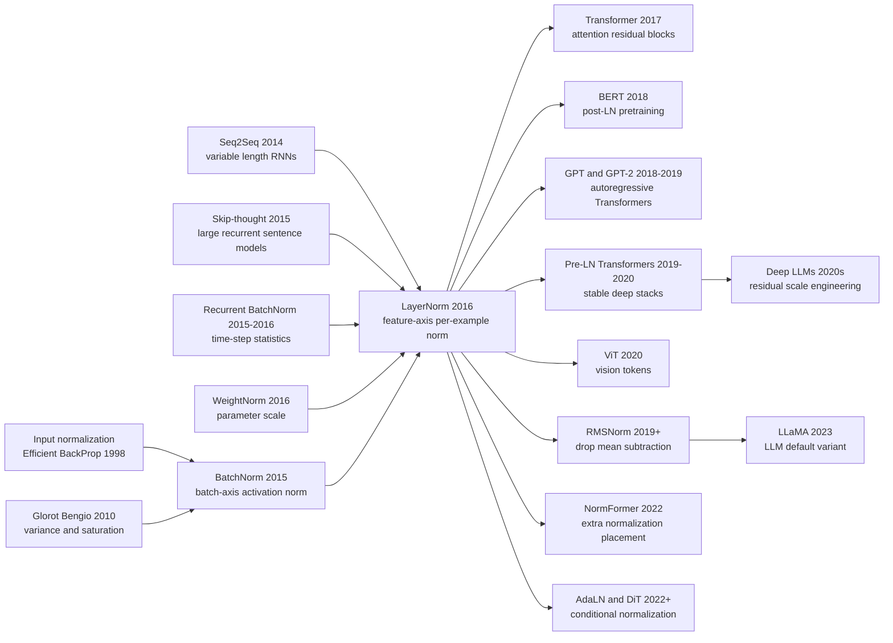

# LayerNorm: 把归一化从 batch 搬到样本内部

> **2016 年 7 月 21 日，Jimmy Lei Ba、Jamie Ryan Kiros、Geoffrey Hinton 三位作者把 [arXiv:1607.06450](https://arxiv.org/abs/1607.06450) 挂到网上。** 这篇论文看起来像 BatchNorm 的一个小改动：把均值和方差的统计轴从 mini-batch 转到单个样本的一层 hidden units。可这个轴一换，归一化就摆脱了 batch size、running average、训练/测试统计错配和变长序列时间步这些麻烦。它当年没有像 BatchNorm 那样靠 ImageNet 冲榜出圈，却在一年后的 Transformer 里找到了真正的舞台。今天几乎每个大语言模型残差块里都有它的后代：LayerNorm、pre-norm、RMSNorm、AdaLN。最反直觉的是，深度学习史上最重要的序列归一化方法，起点不是更大 batch，而是承认有些模型根本不该依赖 batch。

## 一句话总结

Ba、Kiros、Hinton 三位作者 2016 年发表的 Layer Normalization，把 [BatchNorm](2015_batchnorm.md) 的核心公式转了一个轴：不再对同一个神经元跨 mini-batch 估计 $\mu_B,\sigma_B$，而是在单个样本的一层 hidden units 内计算 $\mu^l=\frac{1}{H}\sum_i a_i^l$、$\sigma^l=\sqrt{\frac{1}{H}\sum_i(a_i^l-\mu^l)^2}$，再用 $h_i=f((g_i/\sigma^l)(a_i-\mu^l)+b_i)$ 输出。它替代的失败 baseline 是把 BatchNorm 直接塞进 RNN：必须按时间步维护统计量，变长序列和 batch size 1 都尴尬，recurrent BN 还需要小心把 gain 初始化到 0.1。LayerNorm 在 MSCOCO order-embedding 上用约 60% 的 baseline 时间达到最佳验证模型，在 Skip-thought、DRAW、手写生成和 permutation-invariant MNIST 上展示了更稳的 RNN 训练。

真正的历史影响要到后面才显出来：[Transformer（2017）](../era3_attention/2017_transformer.md) 把 LayerNorm 放进 attention / FFN 残差块，BERT、GPT、ViT、T5、LLaMA 又把它改成 post-norm、pre-norm、RMSNorm、AdaLN 等变体。反直觉处在于：LayerNorm 当年在卷积网络里不如 BatchNorm，论文自己也承认边界像素和中心像素统计差异太大；但正因为它不依赖 batch、不区分训练测试、天然适合 token 和时间步，它最后没有成为 CNN 的默认层，而是成为大模型时代的稳定器。

---

## 历史背景

### 2015 年之后，BatchNorm 解决了 CNN，却卡住了序列

2015 年的 BatchNorm 给深度学习社区一个非常有力的暗示：很多“深网难训”的问题，不一定要靠更复杂的 optimizer 解决，也可以把激活尺度本身做成网络层。它在 Inception、ResNet、GAN 里迅速扩散，原因很朴素：训练更快，学习率窗口更宽，初始化和 dropout 没那么敏感。

但这个成功有一个隐藏前提：batch 是可信的统计单位。在 ImageNet 分类里，一张 GPU 上可以放很多图像，同一层同一通道的激活在一个 mini-batch 内有足够样本，训练时用 batch statistics、测试时用 running averages 也能接受。这个前提一旦来到序列模型，就开始变得别扭。

RNN 处理的是时间展开后的状态。句子长短不同，测试序列可能比训练序列更长，在线学习可能一次只来一个样本。若把 BatchNorm 原样放进 RNN，最直接的做法是为每个时间步保存一套统计量；可时间步不是固定网络深度，而是输入动态决定的。LayerNorm 的历史切入点就在这里：如果 batch 不是稳定的统计轴，就换一个轴。

### RNN 的麻烦不是只有梯度，还有时间统计

LSTM、GRU 和普通 RNN 在 2014-2016 年承担了大部分序列建模任务：机器翻译、问答、语言建模、句子表征、手写生成、DRAW 图像生成。社区已经知道它们会有 vanishing / exploding gradients，也知道门控结构可以缓解长期依赖。但 LayerNorm 论文盯住的是另一个更工程化的问题：hidden-to-hidden dynamics 的平均尺度会随时间增长或缩小。

这种尺度漂移很难用 BatchNorm 优雅处理。第一，batch 里不同样本的时间对齐未必有意义；第二，时间步越往后，统计量越稀疏；第三，测试时出现更长序列，running statistics 没有自然定义。Recurrent BatchNorm 尝试过这条路，但要维护时间步统计，还需要小心设置 gain。LayerNorm 的方案是：每个时间步、每个样本自己算自己的层内均值和方差。

这让归一化从“跨样本估计总体分布”变成“给当前状态选一个合适坐标系”。对序列模型来说，这个转向非常重要。它不再要求 batch 中样本相互依赖，不再要求训练和测试走两套统计逻辑，也不再要求时间长度提前固定。

### 多伦多语境：Hinton 组、Kiros 和 Ba 的问题意识

这篇论文的作者组合也很有时代感。Jimmy Lei Ba 是 Adam 的共同作者之一，早期研究就和优化、注意力、归一化这些训练动力学问题纠缠在一起；Jamie Ryan Kiros 做过 Skip-thought、order-embeddings、视觉语言表征，手里有大量 RNN 系统；Geoffrey Hinton 则同时是深度学习复兴、语音模型、AlexNet、Dropout 和 BatchNorm 时代的重要人物。

所以 LayerNorm 不是在抽象数学空间里凭空出现的。它来自一组具体痛点：Skip-thought 训练几天才能看到效果，order-embedding 的 GRU 收敛慢，DRAW 和手写生成这种长序列模型 hidden state 容易不稳。论文实验也因此不像 BatchNorm 那样押一个 ImageNet 大表，而是横跨六个更“序列味”的任务。

这也解释了它最初的传播节奏。LayerNorm 没有一个像“ImageNet top-5 error”那样一眼压倒人的数字。它的说服力来自一组比较朴素的工程陈述：RNN 训练更稳，batch size 小也能用，训练测试一致，变长序列自然。

### 这篇论文为什么一开始没像 BatchNorm 那样出圈

BatchNorm 的故事很容易讲：同等 ImageNet 精度少 14 倍训练步数，ensemble 4.82% top-5 error。LayerNorm 的故事在 2016 年没有这么戏剧化。它在 MSCOCO order-embedding、CNN question answering、Skip-thought、DRAW、handwriting generation、permutation invariant MNIST 上有加速和泛化收益，但这些 benchmark 分散，且很多结果以曲线和验证性能呈现。

更关键的是，2016 年的主流深度学习想象仍由 CNN 和 ImageNet 牵引。卷积网络里 BatchNorm 正在成为事实标准，而 LayerNorm 论文自己也承认：在初步 ConvNet 实验里，BatchNorm 表现更好。原因很具体：卷积 feature map 的边界位置和中心位置统计差异很大，整层统一做 LayerNorm 会把不该放在一起的空间单元混在一起。

因此 LayerNorm 在 2016 年看起来像一个重要但有边界的序列模型技巧。它真正的爆发要等到 Transformer。Transformer 没有 recurrence，却有 token-wise representation、残差分支、attention 和 feed-forward 子层，恰好需要一个不依赖 batch 的尺度控制器。LayerNorm 于是从 RNN 稳定器变成了 attention 时代的基础设施。

## 研究背景与动机

### 把归一化轴从 batch 转到 feature

BatchNorm 和 LayerNorm 的差别不在“有没有减均值除方差”，而在统计轴。BatchNorm 对同一神经元跨样本估计均值和方差，默认 batch 能代表训练分布；LayerNorm 对同一样本的一层 hidden units 估计均值和方差，默认一层内部的共同尺度才是当前计算最需要稳定的对象。

这个轴转置改变了很多行为。BatchNorm 会让一个样本的输出受同 batch 其他样本影响，LayerNorm 不会。BatchNorm 训练和测试要切换统计量，LayerNorm 不用。BatchNorm 的噪声有正则化作用，LayerNorm 更像确定性的重参数化和尺度控制。BatchNorm 在大 batch CNN 中统计更稳，LayerNorm 在序列、在线、小 batch 和 token 模型中更自然。

论文的标题很克制，只叫 Layer Normalization，没有把自己包装成“BatchNorm 的替代品”。这点很准确：它不是替代所有 BatchNorm，而是替代那些 batch 统计不合适的场景。

### 设计目标：batch size 1、变长序列、训练测试一致

LayerNorm 的三个设计目标非常清晰。第一，batch size 可以是 1。只要当前样本的一层有足够 hidden units，就能计算统计量；这对在线学习、强化学习、小显存任务和长序列很重要。第二，变长序列不需要额外 bookkeeping。每个时间步的统计来自当前 hidden vector，不必为第 1 步、第 2 步、第 1000 步保存不同 running averages。第三，训练和测试完全同构。模型部署时不用担心 `train()` / `eval()` 切换、running mean 是否校准、线上 batch 组成是否影响预测。

这些目标在 2016 年看起来偏工程，在 2026 年看则非常像大模型训练的基本需求。LLM 训练时每个 token 都有自己的表示，推理时往往 batch size 和训练完全不同，KV cache 使序列长度动态变化。一个依赖 batch statistics 的归一化层很难成为这条路线的默认组件。

LayerNorm 的动机因此可以概括为：把归一化从“估计数据分布”改成“规范当前表示的坐标系”。这句话也解释了为什么它后来能和 residual connection、attention、pre-norm 架构深度绑定。

### 反直觉处：少了 batch 噪声，反而进入了大模型主干

BatchNorm 的一个成功来源是 batch statistics 的随机性。它不只是稳定尺度，还像一种噪声正则化。LayerNorm 去掉了这种样本间噪声，理论上少了一个正则化好处。可在序列模型里，batch 噪声经常不是礼物，而是麻烦：同一句话被放进不同 batch，预测不应因为邻居样本不同而改变；自回归推理时甚至可能只有一个样本。

这就是 LayerNorm 的反直觉价值。它看似放弃了 BatchNorm 的一个优点，却换来更强的可组合性。Transformer、BERT、GPT、ViT、T5 和 LLaMA 都在不同程度上继承了这个取舍：归一化层应该服务 residual dynamics 和 token 表示，而不是依赖 batch 作为统计代理。

历史上很多“看起来更弱”的方法，最后胜在接口更干净。LayerNorm 就是这样。它没有 BatchNorm 的大 batch 正则噪声，也没有 ImageNet 分类里的压倒性表现；但它消除了 batch 依赖这个系统接口上的负担，因此成为更大架构里的默认零件。

---

## 方法详解

### 整体框架

LayerNorm 的整体框架可以一句话概括：对一个样本在某一层里的所有 summed inputs 求均值和标准差，把这一层当前表示重新中心化和缩放，然后再给每个 hidden unit 一个可学习的 gain 与 bias。若第 $l$ 层的 pre-activation 是 $a^l_i$，这一层有 $H$ 个 hidden units，LayerNorm 不看 batch 里其他样本，只看当前样本自己的向量 $a^l$。

这和 BatchNorm 的差别非常锋利。BatchNorm 的统计轴是“同一个神经元，跨不同样本”；LayerNorm 的统计轴是“同一个样本，跨同一层神经元”。前者把 batch 当作总体分布的近似，后者把一层 representation 当作需要规范的坐标系。这个改变使 LayerNorm 不需要 running mean / variance，也不需要在训练和测试之间切换行为。

论文的实现习惯是把 LayerNorm 放在非线性之前。它不是简单把输出裁成同样尺度，而是在当前层内部建立一个规范坐标系，再让可学习参数把任务需要的尺度和中心学回来。这个“先规范，再还给网络自由度”的模式，后来被 Transformer、pre-norm、RMSNorm 和 AdaLN 反复继承。

### 关键设计 1：按样本跨 hidden units 统计

#### 功能

LayerNorm 的第一个设计，是对单个样本的一层 hidden units 计算均值和标准差。这样做直接避开 batch size、batch composition 和在线推理问题。一个 batch 里有 128 个样本或只有 1 个样本，LayerNorm 的计算形式完全相同。

#### 公式

给定第 $l$ 层当前样本的 summed inputs $a^l_1,\dots,a^l_H$，LayerNorm 计算：

$$
\mu^l = \frac{1}{H}\sum_{i=1}^{H}a^l_i, \qquad
\sigma^l = \sqrt{\frac{1}{H}\sum_{i=1}^{H}(a^l_i-\mu^l)^2 + \epsilon}, \qquad
\bar{a}^l_i = \frac{a^l_i-\mu^l}{\sigma^l}
$$

这里的 $H$ 是 hidden units 数量，$\epsilon$ 是数值稳定项。关键是 $\mu^l,\sigma^l$ 对每个样本都不同，但同一层里的所有 units 共享这两个统计量。

#### 代码

```python
def layer_standardize(activations, eps=1e-5):
    mean = activations.mean(dim=-1, keepdim=True)
    variance = activations.var(dim=-1, unbiased=False, keepdim=True)
    normalized = (activations - mean) / torch.sqrt(variance + eps)
    return normalized
```

#### 对比表

| 方法 | 统计轴 | 依赖 batch size | 训练测试关系 |
|------|--------|-----------------|--------------|
| BatchNorm | 同一 feature 跨样本 | 是 | 训练用 batch，测试用 running stats |
| LayerNorm | 同一样本跨 features | 否 | 训练测试同一计算 |
| InstanceNorm | 单样本单通道跨空间 | 否 | 更适合风格和图像生成 |

#### 设计动机

这个设计不是为了让每个神经元的边际分布稳定，而是为了让当前层的整体尺度稳定。对于 RNN hidden state 或 Transformer token representation，这比跨样本统计更自然：一个 token 的尺度应该由这个 token 自己的 feature vector 决定，而不是由同 batch 里其他句子、图片或轨迹决定。

### 关键设计 2：每个 neuron 的 gain 与 bias 恢复表达能力

#### 功能

如果归一化后直接送入非线性，网络会失去控制每个 hidden unit 均值和尺度的能力。LayerNorm 和 BatchNorm 一样，在归一化之后加入可学习的 gain $g_i$ 与 bias $b_i$，让每个 unit 决定自己要不要保留标准化尺度、扩大响应或移动阈值。

#### 公式

论文写法可以表示为：

$$
h^l_i = f\left(\frac{g^l_i}{\sigma^l}(a^l_i-\mu^l)+b^l_i\right)
= f\left(g^l_i\bar{a}^l_i+b^l_i\right)
$$

$g_i$ 和 $b_i$ 是每个 neuron 独立的可学习参数。它们让 LayerNorm 不只是一个硬约束，而是一个可学习的重参数化。

#### 代码

```python
class LayerNormCore(nn.Module):
    def __init__(self, features, eps=1e-5):
        super().__init__()
        self.gain = nn.Parameter(torch.ones(features))
        self.bias = nn.Parameter(torch.zeros(features))
        self.eps = eps

    def forward(self, activations):
        normalized = layer_standardize(activations, self.eps)
        return self.gain * normalized + self.bias
```

#### 对比表

| 版本 | 尺度是否稳定 | 表达能力 | 典型风险 |
|------|--------------|----------|----------|
| 只做标准化 | 是 | 被限制 | 有用的均值和方差被压掉 |
| 标准化加共享 gain | 部分 | 仍受限制 | 每个 unit 不能独立调尺度 |
| LayerNorm 加逐 unit 参数 | 是 | 基本保留 | 统计轴不适合 CNN 时会混合异质 units |

#### 设计动机

归一化层最容易犯的错误，是把“让优化更好走”变成“强行规定所有表示长什么样”。LayerNorm 的 gain 和 bias 避免了这一点。它先把当前表示放进一个好优化的坐标系，再允许模型把坐标系扭回任务需要的位置。后来的 RMSNorm 也保留了 scale 参数，AdaLN 甚至让 gain 和 bias 由条件输入动态生成，说明这个恢复自由度的设计非常长寿。

### 关键设计 3：在 RNN 中按时间步单独归一化

#### 功能

LayerNorm 最初最强的应用场景是 RNN。对每个时间步，模型先计算当前输入和前一 hidden state 形成的 summed inputs，再对这一时间步的向量做 LayerNorm。统计量不跨时间步保存，也不跨样本保存，只依赖当前状态。

#### 公式

普通 RNN 的 pre-activation 可写成 $a^t=W_{hh}h^{t-1}+W_{xh}x^t$。LayerNorm 版本为：

$$
h^t = f\left(g\odot\frac{a^t-\mu^t}{\sigma^t}+b\right), \qquad
\mu^t=\frac{1}{H}\sum_i a^t_i, \qquad
\sigma^t=\sqrt{\frac{1}{H}\sum_i(a^t_i-\mu^t)^2+\epsilon}
$$

对 LSTM / GRU，论文附录进一步把 LayerNorm 放到 gate pre-activations 和某些 cell-state 输出上。重点不是特定门的公式，而是每个时间步都用当前向量的统计量。

#### 代码

```python
class LayerNormRNNCell(nn.Module):
    def __init__(self, input_size, hidden_size):
        super().__init__()
        self.input_proj = nn.Linear(input_size, hidden_size, bias=False)
        self.hidden_proj = nn.Linear(hidden_size, hidden_size, bias=False)
        self.layer_norm = nn.LayerNorm(hidden_size)

    def forward(self, inputs, previous_hidden):
        summed_inputs = self.input_proj(inputs) + self.hidden_proj(previous_hidden)
        return torch.tanh(self.layer_norm(summed_inputs))
```

#### 对比表

| RNN 归一化做法 | 统计保存方式 | 变长序列 | batch size 1 |
|----------------|--------------|----------|--------------|
| 无归一化 | 无 | 可用但 hidden dynamics 易漂 | 可用但不稳 |
| Recurrent BatchNorm | 常需按时间步统计 | 长于训练序列时尴尬 | 统计退化 |
| LayerNorm RNN | 当前时间步当前样本 | 自然支持 | 自然支持 |

#### 设计动机

RNN 的递归会把小尺度错误不断传下去。若 summed inputs 的平均幅度随时间增长，非线性会饱和；若不断缩小，信号会消失。LayerNorm 让每个时间步的 hidden update 对整体重缩放更不敏感，从而稳定 hidden-to-hidden dynamics。它没有解决所有长期依赖问题，但它让门控 RNN 的训练少依赖 batch 统计和时间步 bookkeeping。

### 关键设计 4：不变量与几何视角

#### 功能

论文不只给出算法，还分析了 LayerNorm、BatchNorm、WeightNorm 的不变量。LayerNorm 对整层 weight matrix 的重缩放和重中心化具有不变性，也对单个训练样本的重缩放不敏感。这个分析解释了为什么它能降低参数尺度带来的优化不适定性。

#### 公式

简化地说，如果整层权重被共同缩放并加上同一个重中心化项，LayerNorm 的归一化输出保持不变；如果单个输入样本被重缩放，归一化后的表示也保持不变：

$$
W' = \delta W + \mathbf{1}\gamma^\top \Rightarrow \mathrm{LN}(W'x)=\mathrm{LN}(Wx), \qquad
x'=\delta x \Rightarrow \mathrm{LN}(Wx')=\mathrm{LN}(Wx)
$$

论文进一步用 Fisher / Riemannian metric 说明，归一化标量 $\sigma$ 会让权重范数增长时的有效学习率变小，产生一种隐式稳定作用。

#### 代码

```python
def same_after_global_rescale(inputs, weight, scale=3.0, eps=1e-5):
    original = layer_standardize(inputs @ weight.T, eps)
    rescaled = layer_standardize(inputs @ (scale * weight).T, eps)
    return torch.allclose(original, rescaled, atol=1e-4)
```

#### 对比表

| 方法 | weight matrix rescaling | 单样本 rescaling | 适合直觉 |
|------|-------------------------|------------------|----------|
| BatchNorm | 不变 | 否 | 大 batch CNN 统计稳定 |
| WeightNorm | 单个 weight vector 不变 | 否 | 参数重参数化 |
| LayerNorm | 整个 weight matrix 不变 | 是 | 当前表示尺度稳定 |

#### 设计动机

这个几何部分让 LayerNorm 不只是一个经验 trick。它说明归一化方法改变了参数空间的等价类和有效步长：某些权重尺度变化不再改变函数输出，优化器也不必把精力浪费在这些无意义方向上。后来大模型里不断讨论 pre-norm、residual scaling、RMSNorm、DeepNorm，本质上仍在处理同一个问题：深层残差网络的尺度几何必须被架构显式管理。

---

## 失败案例

### Baseline 1：直接把 BatchNorm 用到 RNN

LayerNorm 最直接的对手，是把 BatchNorm 的思想照搬进 recurrent networks。这个 baseline 在直觉上很诱人：既然 BatchNorm 能稳定 feed-forward CNN，每个时间步的 hidden computation 也可以归一化。问题在于 RNN 的“层”会沿时间重复使用，时间长度又由输入决定。

如果为每个时间步维护独立的 batch statistics，训练时看过的最大长度会变成模型内部的隐含假设；测试句子更长时，该用哪个 running mean 和 variance 就不清楚。如果不同长度样本塞在一个 batch 里，时间对齐也不自然。LayerNorm 对这个 baseline 的反击不是更复杂，而是更少状态：每个时间步只用当前样本当前 hidden vector 的统计量。

### Baseline 2：Recurrent BatchNorm 的精细修补

Recurrent BatchNorm 比 naive BN 更认真，它把 batch normalization 分别放到 recurrent transition 里，并报告了不错的改进。但 LayerNorm 论文指出，这条路线仍然要处理 time-step statistics 和 scale initialization。论文在 attentive reader 实验中直接拿 Cooijmans 等工作的 BN 结果做参照，发现 LayerNorm 不仅训练更快，还在验证集上优于 baseline 和 BN 变体。

一个细节很说明问题：Recurrent BatchNorm 的作者强调 gain 参数需要小心初始化到 0.1；LayerNorm 作者尝试 1.0 和 0.1 后发现 1.0 更好。这不是说 0.1 是错的，而是说明 BatchNorm 进入 RNN 后多了一个脆弱旋钮，而 LayerNorm 的默认配置更接近“插进去就能用”。

### Baseline 3：WeightNorm 和纯参数重参数化

WeightNorm 也是 2016 年的近邻工作，它规范化的是 incoming weight vector 的长度，而不是 activation 的 batch 或 layer statistics。这个方向优雅、便宜，也没有 batch 依赖。但它解决的是参数尺度，不直接约束当前 hidden state 的整体尺度。

LayerNorm 论文在不变量表里把三者放在一起比较：BatchNorm、WeightNorm、LayerNorm 都能消除一些无意义的缩放自由度，但消除的方向不同。WeightNorm 对单个 weight vector 的 rescaling 不敏感，LayerNorm 对整层 weight matrix 的 rescaling / recentering 和单个样本的 rescaling 更自然。对 RNN 来说，后者正好贴近 hidden dynamics 的问题。

### Baseline 4：无归一化 RNN 和长序列生成模型

论文里的很多实验并不是和另一个复杂 normalization 竞争，而是和无归一化的强基线竞争。Skip-thought、DRAW、handwriting generation 这些模型都已经是当时有代表性的 recurrent systems，但训练慢、曲线不稳、长序列 hidden state 容易漂。

LayerNorm 对这些 baseline 的胜利不是“模型容量更大”，而是“同样模型更容易训练”。这点在 Skip-thought 很明显：论文保留原始 2400 维 sentence encoder 和相同超参数，只加入 LayerNorm，检查每 50,000 iterations 的下游任务表现。它在 1M iterations 后已经超过自家 baseline，继续训练一个月后还继续提升。

### Baseline 5：LayerNorm 在 ConvNets 中也会输

最值得保留的失败案例，是 LayerNorm 自己的边界。论文专门说，在 preliminary ConvNet experiments 中，LayerNorm 相比无归一化有加速，但 BatchNorm 表现更好。原因不是实现没调好，而是统计轴不匹配：卷积层中靠近图像边界的 units 很少激活，中心区域 units 统计完全不同，把整层 hidden units 放进同一个均值和方差会混合异质位置。

这个失败后来很重要。它提醒我们：归一化方法不是线性进步谱系，不是 LayerNorm 比 BatchNorm 更新所以更好。正确问题是“哪一个统计轴符合这个架构”。CNN 的通道和空间统计适合 BatchNorm / GroupNorm；序列和 token representation 适合 LayerNorm / RMSNorm。

| Baseline | 失败点 | LayerNorm 的回答 | 后续历史 |
|----------|--------|------------------|----------|
| Naive recurrent BatchNorm | 需要时间步统计，变长推理尴尬 | 每个时间步用当前样本统计 | RNN 和 Transformer 倾向 batch-free norm |
| Recurrent BatchNorm | gain 初始化和统计管理较脆 | 默认 gain 1.0 可用，训练测试一致 | 预示 pre-norm 的工程偏好 |
| WeightNorm | 只规范化参数尺度 | 直接规范当前 hidden representation | RMSNorm 后来保留 feature-scale 思路 |
| 无归一化 RNN | hidden dynamics 漂移，训练慢 | 稳定层内尺度和时间步更新 | 序列模型默认需要尺度控制 |

## 实验关键数据

### 六个任务说明论文的目标不是刷一个榜

LayerNorm 的实验分布很特别：image-sentence ranking、question answering、contextual language modeling、generative modeling、handwriting sequence generation、MNIST classification。它们共同的主题不是同一个 dataset，而是“RNN 或小 batch 条件下的训练稳定性”。这和 BatchNorm 的 ImageNet 叙事完全不同。

论文默认把 adaptive gains 初始化为 1、biases 初始化为 0。这个默认值本身就是一个实验主张：LayerNorm 不需要像 recurrent BN 那样围绕某个特殊 gain 起点精修，至少在作者测试的任务上更接近通用层。

### MSCOCO order-embeddings：60% 时间达到最佳验证模型

在 MSCOCO 图文检索实验中，作者把 LayerNorm 加到 order-embedding 模型的 GRU 上，图像由预训练 VGG ConvNet 表征，句子由 GRU 编码。论文报告 LayerNorm 在所有 Recall@K 曲线上都有 per-iteration speedup，并且只用 baseline 约 60% 的时间就达到最佳验证模型。

| 模型 | Caption R@1 | Caption R@10 | Image R@1 | Image R@10 | Image mean rank |
|------|-------------|--------------|-----------|------------|-----------------|
| OE published | 46.7 | 88.9 | 37.9 | 85.9 | 8.1 |
| OE ours | 46.6 | 89.1 | 37.8 | 85.7 | 7.9 |
| OE + LN | 48.5 | 89.8 | 38.9 | 86.3 | 7.6 |

这些数字不只是最终分数略高。更重要的是，LayerNorm 没有改变 retrieval 模型的主要结构，却让 RNN encoder 的优化更快，最终泛化也更好。

### Skip-thought：同样训练预算下更好，长训继续涨

Skip-thought 是一个非常适合 LayerNorm 的压力测试：2400 维 sentence encoder，BookCorpus，训练成本高，下游任务靠固定句向量迁移。论文每 50,000 iterations checkpoint 一次，在 SICK、MR、CR、SUBJ、MPQA 上评估。

| 模型 | SICK r | SICK MSE | MR | CR | SUBJ | MPQA |
|------|--------|----------|----|----|------|------|
| Original | 0.848 | 0.287 | 75.5 | 79.3 | 92.1 | 86.9 |
| Ours | 0.842 | 0.298 | 77.3 | 81.8 | 92.6 | 87.9 |
| Ours + LN | 0.854 | 0.277 | 79.5 | 82.6 | 93.4 | 89.0 |
| Ours + LN long | 0.858 | 0.270 | 79.4 | 83.1 | 93.7 | 89.3 |

作者还说明，LayerNorm 版本继续训练约一个月、约 1.7M iterations 后，除一个任务外继续提升。这说明它不是只在早期让 loss 降得快，也改善了长期训练中的表示质量。

### DRAW 与手写生成：长序列 hidden dynamics 更稳

在 binarized MNIST 的 DRAW 实验中，模型使用 64 glimpses 和 256 LSTM hidden units。论文报告 LayerNorm DRAW 几乎以 baseline 两倍速度收敛；200 epochs 后，baseline test variational log likelihood 是 82.36 nats，LayerNorm 是 82.09 nats。差距不大，但方向和速度都支持“归一化改善 recurrent generative model 的训练”。

手写生成实验更强调长序列。IAM-OnDB 平均 handwriting line 长度约 700，模型是三层 400 LSTM cells，约 3.7M 参数，mini-batch 只有 8。论文没有给最终表格数字，但曲线显示 LayerNorm 达到可比 log likelihood 更快。这个设置对 BatchNorm 很不友好，却正好是 LayerNorm 想解决的场景。

### MNIST、问答和 ConvNets：鲁棒性与边界

Permutation-invariant MNIST 实验把 LayerNorm 和 BatchNorm 放在 784-1000-1000-10 MLP 上比较，batch size 分别为 128 和 4。结果显示 LayerNorm 对 batch size 更鲁棒，尤其小 batch 下仍有更快训练收敛。Attentive reader 问答实验则显示，LayerNorm 在验证集上优于 baseline 和 recurrent BN variants。

| 任务 | 模型位置 | 关键观察 | 论文想证明什么 |
|------|----------|----------|----------------|
| MSCOCO order-embedding | GRU sentence encoder | 约 60% 时间到最佳验证模型 | RNN 表征训练更快 |
| Attentive reader | LSTM 内部 | 验证集优于 baseline 和 recurrent BN | 不依赖特殊 gain 调参 |
| Skip-thought | 大型 GRU encoder-decoder | 1M iterations 后下游任务更好 | 长训练表示质量提升 |
| DRAW | LSTM generative model | 82.09 vs 82.36 nats，近两倍收敛速度 | recurrent generation 更稳 |
| Handwriting generation | 三层 LSTM，batch 8，长序列 | 可比 likelihood 更快达到 | 小 batch 长序列适配 |
| ConvNets | preliminary CNN | BN 优于 LN | 统计轴必须匹配架构 |

这组实验的现代读法是：LayerNorm 不是一个“一处 SOTA，全场通吃”的方法。它的实验价值在于把适用边界讲清楚。它在 RNN、小 batch、变长序列和训练测试一致性上强；在 ConvNet 空间统计上不如 BatchNorm。这种边界清晰，反而让它后来在 Transformer 里被更放心地采用。

---

## 思想史脉络



### 前世（被谁逼出来的）

LayerNorm 的前世可以分成两条线。第一条是归一化和优化线：Efficient BackProp 早就强调输入要中心化和缩放，Glorot & Bengio 讨论深层网络的方差传播和饱和，BatchNorm 把 hidden activation 的统计稳定性做成层。LayerNorm 继承的是这条线的核心直觉：优化器不应该在糟糕的尺度坐标里硬走。

第二条是序列模型线。Seq2Seq、Skip-thought、attention reader、DRAW 和 handwriting generation 都在提醒研究者：RNN 的难点不只是表达能力，而是长时间展开后的 hidden dynamics。Recurrent BatchNorm 证明“把 BN 搬到 RNN”值得尝试，也暴露了时间步统计和 batch dependence 的尴尬。LayerNorm 正是在这两条线交叉处给出最小修正：统计量不再跨 batch，而是跨当前层 features。

WeightNorm 是另一条近邻支线。它说明 scale invariance 可以从参数侧处理；LayerNorm 则说明表示侧也能处理，而且对 RNN 更自然。这些方法共同把 2015-2016 年的训练稳定性讨论，从“调学习率和初始化”推进到“架构本身要管理尺度”。

### 今生（继承者）

LayerNorm 最重要的继承者是 Transformer。原始 Transformer 在每个 sublayer 周围使用 LayerNorm，让 attention 和 feed-forward blocks 可以在残差结构里稳定训练。BERT、GPT、GPT-2 和早期 ViT 继承了这个模式，使 LayerNorm 从 RNN 技巧变成 token 模型的标准组件。

随后出现的是 normalization placement 的分化。Post-LN Transformer 把归一化放在 residual addition 之后，早期 BERT 使用这种模式；Pre-LN Transformer 把归一化放在 sublayer 之前，让梯度更容易穿过深层残差堆栈。Xiong 等工作系统分析了这个差别，工程实践也逐渐偏向 pre-norm，尤其是更深的大模型。

再往后，LayerNorm 的后代开始删减或动态化。RMSNorm 去掉均值中心化，只保留 root-mean-square 尺度控制，减少计算并保持大模型稳定；NormFormer 增加额外归一化位置；AdaLN 让 gain 和 bias 受条件输入控制，成为 diffusion transformer 和条件生成模型的重要部件。LLaMA 使用 RMSNorm，说明 LayerNorm 的思想不一定保留原始公式，但保留了 batch-free feature normalization 的接口。

### 误读 / 简化

最常见的误读是“LayerNorm 就是小 batch 版 BatchNorm”。这句话只说对了一半。LayerNorm 的确不依赖 batch，但它的统计对象变了：它规范的是一个样本内部 features 的相对尺度，而不是估计某个 feature 在数据分布上的均值方差。因此它的噪声性质、正则化效果和适用架构都和 BatchNorm 不同。

第二个误读是“LayerNorm 总比 BatchNorm 更现代”。卷积网络里的事实并不支持这个说法。BatchNorm、GroupNorm、LayerNorm、InstanceNorm 的区别首先是统计轴和任务结构的匹配，不是年份排序。LayerNorm 在 token 和 RNN 表示上合适，不代表它天然适合所有空间特征。

第三个误读是“LayerNorm 只是实现细节”。Transformer 时代已经反复证明，归一化放在 residual 前还是后、是否保留均值、是否额外缩放 residual branch、是否把 gain/bias 条件化，都会影响可训练深度和训练稳定性。LayerNorm 看似一行代码，却决定了深层网络的梯度通道。

### 一句话的思想史

BatchNorm 把训练稳定性做成层；LayerNorm 把这个层从 batch 统计里解放出来；Transformer 又把它放进 token 和 residual dynamics 的中心。它的思想史不是“归一化越来越复杂”，而是“归一化的统计轴越来越贴近模型结构”。

---

## 当代视角

### 2026 年看，LayerNorm 哪些判断仍成立

十年后看 LayerNorm，最经得住时间考验的是它对统计轴的判断：不是所有网络都应该用 batch 作为归一化单位。这个判断在 RNN 时代已经成立，在 Transformer 和 LLM 时代更彻底成立。大模型训练和推理的 batch 形态经常不一致，自回归解码需要动态长度，服务端会按吞吐把请求拼 batch，但单个用户的 token 表示不应该因为同批其他请求而改变。

第二个仍成立的判断，是训练测试一致性比当时看起来更重要。BatchNorm 的 `train()` / `eval()` 状态、running statistics、SyncBatchNorm、frozen BN 都是工程系统必须认真处理的细节；LayerNorm 避开了这一整类部署问题。它并不让模型自动更强，但让模型接口更干净。

第三个判断，是归一化不是独立 trick，而是残差网络的尺度管理机制。今天讨论 pre-norm、post-norm、RMSNorm、residual scaling、DeepNorm、NormFormer、AdaLN，本质上都在问同一个问题：当网络很深时，每个 residual branch 的尺度和梯度通道如何不失控。

### 站不住的假设

LayerNorm 自身也有一些过时假设。最明显的是它在论文中仍主要服务 RNN，而不是 Transformer。2016 年没人能从这篇论文直接读出“它会成为大语言模型默认层”。另一个过时点是完整的均值和方差归一化并不总是必要；RMSNorm 说明去掉均值中心化也能在大模型中工作得很好。第三，LayerNorm 不自动解决深层 Transformer 的所有稳定性问题，归一化位置、残差缩放、初始化和 learning-rate schedule 仍然关键。

| 2016 年隐含假设 | 当时为什么合理 | 今天的问题 | 现代替代或修正 |
|-----------------|----------------|------------|----------------|
| 主要应用会是 RNN | 论文实验几乎都围绕 recurrent systems | Transformer 成为主线 | 把 LN 放进 attention / FFN residual blocks |
| 完整 mean-variance norm 是默认 | 直接继承 BatchNorm 形式 | 均值中心化有时可省 | RMSNorm、ScaleNorm |
| post-activation 放置差异不大 | 当时深度有限 | 深层残差梯度会受位置影响 | Pre-LN、DeepNorm、NormFormer |
| feature 轴总是合适 | RNN hidden units 较同质 | CNN 空间 units 异质，某些多模态表示也复杂 | GroupNorm、RMSNorm、modality-specific norm |
| gain/bias 是静态参数 | 条件生成还没成为主线 | 生成模型需要条件控制尺度 | AdaLN、conditional LayerNorm |

这张表说明 LayerNorm 的原始公式并不是终点。真正长寿的是它提出的接口：不要依赖 batch，沿着当前表示的 feature 轴控制尺度。

### 时代证明的关键 vs 冗余

关键部分很清楚。第一，batch-free 是核心。没有这个性质，Transformer 解码、LLM serving、在线 RL 和很多小 batch 设置都会很不舒服。第二，训练测试同一计算是核心。它让归一化层不再携带一套额外状态机。第三，逐 feature gain / bias 是核心。归一化不能牺牲表达能力，必须让模型学回所需尺度。

冗余部分也很清楚。完整 mean subtraction 不是不可替代，RMSNorm 已经证明只控制 RMS 尺度也能工作。RNN 叙事不是唯一舞台，Transformer 才是它的历史放大器。论文里比较朴素的 Fisher 几何解释也不再是现代大模型稳定性的完整理论，但它抓住了一个仍然有效的方向：参数尺度和有效学习率不能放任自流。

### 如果今天重写 LayerNorm 论文

如果今天重写这篇论文，实验主线大概率不会围绕 Skip-thought 或 DRAW，而会围绕 Transformer depth、pre-norm/post-norm、RMSNorm、长上下文解码和 batch-size-invariant serving。方法公式可能只占一页，更多篇幅会解释 residual stream、attention logits、MLP sublayer 和 optimizer 之间的尺度耦合。

| 模块 | 2016 LayerNorm | 今天重写会怎样 | 保留的精神 |
|------|----------------|----------------|------------|
| 主要模型 | RNN、GRU、LSTM、DRAW | Transformer、LLM、DiT、ViT | 当前表示自己管理尺度 |
| 归一化形式 | mean + variance + gain/bias | LN、RMSNorm、ScaleNorm 对比 | 不依赖 batch |
| 关键实验 | 六个 RNN/MLP 任务 | 深层 pre-norm、long-context、serving batch 变化 | 训练测试一致 |
| 理论解释 | 不变量和 Fisher metric | residual stream 动力学、梯度流、谱尺度 | 尺度几何是架构问题 |
| 工程关注 | 小 batch、变长 RNN | 分布式训练、KV cache、mixed precision | 归一化接口要干净 |

但一个真正好的新版论文不应该抹掉 2016 年的 RNN 语境。LayerNorm 的直觉正是从“batch 轴不适合这个结构”出发的；如果只把它写成 Transformer trick，反而会丢掉最可迁移的 lesson。

### 最反直觉的遗产

LayerNorm 最反直觉的遗产，是它一开始没有赢下 CNN，却赢下了更大的结构选择。很多方法的历史价值来自“在当时最热门 benchmark 上击败所有人”；LayerNorm 的价值来自“在正确的系统接口上少拿了一个依赖”。少一个 batch dependence，少一套 running stats，少一组 train/test 分支，最后在大模型时代变成巨大的工程优势。

这也是为什么它不像普通 normalization trick。它改变的是模型和数据并行、在线推理、变长序列之间的契约：一个样本或一个 token 的归一化可以自足完成。这个契约听起来朴素，却支撑了 Transformer 从机器翻译模型一路扩展到语言、视觉、语音和生成模型。

## 局限与展望

### 作者承认的局限

作者最明确承认的局限是 ConvNets。卷积层里的 hidden units 并不同质，边界位置和中心位置的激活统计差异很大；整层 LayerNorm 会把这些位置混在一起，因此在初步实验中不如 BatchNorm。这一判断后来被 GroupNorm、InstanceNorm、BatchNorm 在不同视觉任务中的分工部分验证。

另一个隐含局限是正则化。LayerNorm 不使用 batch statistics，因此没有 BatchNorm 那种来自 batch noise 的正则化效果。论文主要强调训练速度和稳定性，而不是把 LayerNorm 当作 Dropout 的替代品。现代模型通常仍需要 weight decay、dropout、data augmentation、label smoothing 或其他正则化手段。

### 2026 视角的新增局限

从 2026 年看，LayerNorm 也会带来自己的成本。它对每个 token / feature vector 计算均值方差，在超大模型和长上下文里不是免费操作；RMSNorm 被广泛采用，部分原因就是省掉均值中心化和一些计算。LayerNorm 还会让表示对整体平移和缩放不敏感，这通常有利于优化，但也可能改变模型使用幅度信息的方式。

在很深的 Transformer 中，单独使用 LayerNorm 也不够。Pre-norm 解决梯度通路后，可能带来 residual stream 不断积累、最终层表示尺度偏移等新问题；post-norm 表示更规整但更难训练。大模型稳定性是 LayerNorm、初始化、optimizer、warmup、residual scaling、attention logit scaling 共同决定的。

### 可能继续演化的方向

LayerNorm 家族的下一步不一定是“再发明一个 norm”，而是更细粒度地把 normalization 与结构绑定。RMSNorm 已经说明均值项可以被删；AdaLN 说明 gain/bias 可以由条件控制；NormFormer 说明 sublayer 内部额外归一化可能有价值。未来更可能出现的是按层深、模态、token 类型、专家路由或上下文长度动态调节的尺度控制。

另一个方向是 normalization-free 或 low-normalization 大模型。NFNet、Fixup、DeepNet、µP 和各种 residual scaling 思想都在问：是否可以用更好的初始化和参数化减少显式归一化的负担？即使答案是“可以部分减少”，LayerNorm 的历史价值也不会消失，因为它给出了最简单的可工作基线。

## 相关工作与启发

### 与归一化家族的关系

LayerNorm 与 BatchNorm 的关系，最好理解为统计轴互补而不是替代。BatchNorm 擅长大 batch CNN，因为 batch 和空间统计可靠；LayerNorm 擅长序列和 token 模型，因为每个样本可以自足归一化；GroupNorm 夹在中间，服务小 batch vision；InstanceNorm 在风格迁移和生成里突出；RMSNorm 则是 LayerNorm 在大模型里的轻量后代。

WeightNorm 和 Path-SGD 则提醒我们，归一化不一定发生在 activation 上，也可以发生在参数路径和尺度不变量上。现代训练稳定性往往同时使用多种思想：参数初始化管信号传播，norm 层管残差流尺度，optimizer 管更新方向，schedule 管训练早期的脆弱阶段。

### 对当前研究的启发

LayerNorm 给今天研究者的启发不是“看到 batch 小就用 LN”这么简单。更通用的原则是：先确定模型中最自然的统计单位，再决定归一化轴。图像通道、视频时空块、语言 token、MoE expert、扩散模型的噪声条件、机器人轨迹状态，它们的统计结构不同，归一化层不应一刀切。

第二个启发是接口比局部效果更长寿。LayerNorm 当年在 ConvNets 不如 BatchNorm，但它的 batch-free 接口让它能和 Transformer、LLM serving、在线推理组合。很多新方法评估时也应问：它是否增加训练/测试分支？是否依赖 batch composition？是否需要隐藏状态校准？这些系统问题可能比一个 benchmark 上的微小提升更能决定方法能活多久。

## 相关资源

### 资源清单

- 论文：[Layer Normalization](https://arxiv.org/abs/1607.06450)
- 关键前序：[Batch Normalization](https://arxiv.org/abs/1502.03167), [Weight Normalization](https://arxiv.org/abs/1602.07868), [Recurrent Batch Normalization](https://arxiv.org/abs/1603.09025)
- 关键后继：[Attention Is All You Need](https://arxiv.org/abs/1706.03762), [On Layer Normalization in the Transformer Architecture](https://arxiv.org/abs/2002.04745), [RMSNorm](https://arxiv.org/abs/1910.07467), [NormFormer](https://arxiv.org/abs/2110.09456)
- 相关 deep notes：[BatchNorm](2015_batchnorm.md), [Transformer](../era3_attention/2017_transformer.md), [BERT](../era3_attention/2018_bert.md), [LLaMA](../era5_genai_explosion/2023_llama.md)
- 实践入口：PyTorch `torch.nn.LayerNorm`, TensorFlow `tf.keras.layers.LayerNormalization`, JAX/Flax `nn.LayerNorm`
- 跨语言：英文版 → [`/en/era2_deep_renaissance/2016_layer_norm/`](/en/era2_deep_renaissance/2016_layer_norm/)


---

> 🌐 [English version](/en/era2_deep_renaissance/2016_layer_norm/) · 📚 awesome-papers project · CC-BY-NC