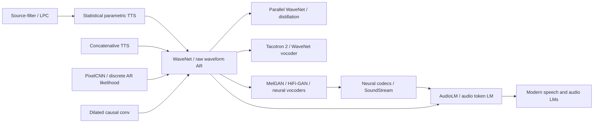

# WaveNet - 直接生成原始波形的神经声码器起点

> **2016 年 9 月 8 日，Google DeepMind 在博客发布 [WaveNet](https://arxiv.org/abs/1609.03499)：一个看起来近乎任性的选择，直接让神经网络以 $p(x_t\mid x_{<t})$ 的形式一秒预测 16000 个以上的原始音频采样点。** 当时最强 TTS 还在 concatenative unit selection 和统计参数声码器之间摇摆，WaveNet 却绕过声码器参数，逐点生成波形，在英语和普通话上把合成语音到真人语音的 MOS 差距分别缩小 51% 和 69%。它的代价同样刺眼：采样必须一拍一拍往前走，质量越像人，部署越慢。正是这个矛盾，催生了 Parallel WaveNet、Tacotron 2 里的 WaveNet vocoder，以及后来整整一代神经声码器。 Gem 的地方在于：它第一次让很多人相信，声音不是只能被手工分析成频谱和源滤波参数，也可以像像素、字符一样被神经生成模型直接吞下去。

## 一句话总结

van den Oord、Dieleman、Zen 等 9 位作者 2016 年在 DeepMind / Google 完成的 WaveNet，把语音合成从“先预测声学参数、再交给 vocoder 还原波形”改成“直接最大化原始波形似然”：$p(x\mid h)=\prod_t p(x_t\mid x_{<t},h)$。方法核心是三件套：因果卷积保证不看未来，指数膨胀卷积用 $1,2,4,\dots,512$ 的 dilation 在少量层里得到大 receptive field，256-way $\mu$-law softmax 让每个采样点的分布可训练；再用 global conditioning 控制说话人、local conditioning 接入文本语言学特征和 $F_0$。它直接击败的失败路线是 LSTM-RNN 统计参数 TTS 和 HMM-driven concatenative TTS：英语 MOS 从 3.67 / 3.86 提到 4.21，普通话从 3.79 / 3.47 提到 4.08，把“最好合成语音到真人语音”的差距分别缩小 51% 和 69%。后续 [AudioLM](../era5_genai_explosion/2023_audiolm.md) 认为 WaveNet 的 raw waveform 自回归太慢，转向离散 audio token；但如果没有 WaveNet 证明神经网络能直接生成可信波形，就不会有 Parallel WaveNet、Tacotron 2、HiFi-GAN、神经 codec 和今天的 speech/audio LM。隐藏 lesson 是：高保真生成不一定从“更聪明的手工特征”开始，有时是从删掉整个手工中间层开始。

---

## 历史背景

### 2016 年前 TTS 卡在哪里

WaveNet 出现前，语音合成并不是一个“神经网络还没进场”的空白领域。Google、HTS、Merlin 和各类商业系统已经能做出可用的 TTS；问题是它们大多在两个不舒服的极端之间摆动。第一类是 concatenative TTS：录一大库真人语音片段，合成时从库里挑 unit 拼接。它的优点是局部音质高，因为声音来自真实录音；缺点是灵活性差，换说话人、情绪、语速或风格往往要重新录库，而且拼接边界、覆盖不足和数据库规模会限制泛化。

第二类是 statistical parametric TTS：先把语音分析成声学参数，例如谱包络、$F_0$ 和非周期成分，再训练 HMM、DNN 或 LSTM-RNN 从文本语言学特征预测这些参数，最后交给 vocoder 合成波形。它更轻、更可控，也更容易做 speaker adaptation；但代价是“vocoder sound”和过平滑。论文背景章节反复强调：传统流程有固定分析窗、线性滤波、Gaussian process 等假设；这些假设让优化可做，却会丢掉停爆音、呼吸、口腔动作和瞬态细节。

所以 2016 年的 TTS 矛盾不是“能不能说话”，而是“能不能既自然又可控”。Concatenative 方法自然但笨重，parametric 方法灵活但听起来闷。WaveNet 的冲击在于它没有在这两者之间再做折中，而是把整套 vocoder 参数中间层直接拿掉：让神经网络从文本条件和过去采样点直接生成下一枚采样点。

### PixelCNN 把生成建模推到原始音频

WaveNet 的直接前世不是语音论文，而是 2016 年初的 PixelRNN / PixelCNN。van den Oord、Kalchbrenner 和 Kavukcuoglu 已经证明，图像可以被看成一串离散像素值，按 $p(x)=\prod_i p(x_i\mid x_{<i})$ 逐点建模。这个思想本身不新，真正新的是深度卷积结构、离散 softmax 和条件建模结合后，样本质量突然变得可信。

把这个想法搬到音频上，难度立刻放大。图像一张也许是几千到几万像素；一秒 16 kHz 音频就是 16000 个时间步，24 kHz 则是 24000 个时间步。直接用 RNN 逐点训练会很慢；普通 causal convolution 又需要很多层才能覆盖足够长的上下文。WaveNet 的关键工程判断是：用 dilated causal convolution 代替循环，把训练时的所有时间步并行化，把生成时必须逐点的痛苦留到采样阶段。

这里的“直接生成原始波形”在当时有一点反直觉。语音信号处理传统上相信应该先做分析：频谱、pitch、声道滤波、源激励、cepstrum、MFCC。WaveNet 则说：除了 receptive field 和 $\mu$-law 编码，几乎不塞语音先验；模型自己从数据里学非线性滤波器。

### 作者团队与 DeepMind 语境

作者名单很能说明这篇论文的混合来源。Aäron van den Oord 和 Nal Kalchbrenner 来自 PixelCNN / neural autoregressive modeling 线；Sander Dieleman 长期做音乐和生成模型；Heiga Zen、Andrew Senior 来自 Google speech / TTS 系统；Alex Graves、Oriol Vinyals、Karen Simonyan、Koray Kavukcuoglu 则把序列建模、视觉网络和 DeepMind 工程经验接进来。WaveNet 不是纯 speech lab 的论文，也不是纯 generative modeling 的论文，而是 Google 语音系统与 DeepMind 生成建模在 2016 年的一次短路。

这也解释了论文的实验风格。它不只给一个玩具音频生成 demo，而是拿 Google 自己的英语和普通话 TTS 数据，与 Google 当时很强的 LSTM-RNN statistical parametric 和 HMM-driven concatenative 系统做公平比较。数据、linguistic features、测试句子都尽量对齐。换句话说，WaveNet 要证明的不是“能发出有趣声音”，而是“在工业 TTS 的评价规矩里，它能把现役路线打下去”。

### 发布时的工业反应

DeepMind 2016 年 9 月的博客把 WaveNet 包装得非常聪明：先让读者听同一句话的 parametric、concatenative 和 WaveNet 样例，再给 MOS 图。对普通人来说，公式不重要，重要的是“它真的不像传统机器人音”。博客也展示了不加文本条件时的 babbling、不同说话人 ID 控制，以及钢琴音乐生成，这让 WaveNet 看起来不只是一个 TTS 模块，而是“任意音频的生成模型”。

但博客同时承认一个关键代价：采样逐点进行，计算昂贵。2016 年的 WaveNet 更像一篇证明路线正确的研究论文，而不是可立刻部署的产品。真正进入 Google Assistant，要等到 2017 年 Parallel WaveNet 用 probability density distillation 把采样并行化，速度提升超过 1000 倍。也正因为有这一步，WaveNet 后来才不只是“听起来震撼的 demo”，而是变成神经 vocoder 工业化的起点。

## 研究背景与动机

### 问题定义

WaveNet 要解决的问题可以写成一句话：**给定过去的音频采样点和可选条件 $h$，直接建模下一枚原始波形采样点的概率分布**。无条件版本是 $p(x)=\prod_t p(x_t\mid x_{<t})$；TTS 版本是 $p(x\mid h)=\prod_t p(x_t\mid x_{<t},h)$，其中 $h$ 可以是文本导出的 linguistic features、$F_0$ 或 speaker ID。

这个问题有三个难点。第一，音频采样率太高，序列长度比大多数 NLP / CV 任务残酷。第二，波形细节与听感高度相关，简单均方误差容易平均掉尖锐瞬态，让声音发闷。第三，TTS 不只是局部音质，还要读对文本、保持韵律、控制说话人和风格。WaveNet 的设计就是围绕这三个难点展开：用卷积并行训练长序列，用 categorical likelihood 避免平均化，用 conditioning 把可控信息接进生成过程。

### 核心目标

WaveNet 的目标不是发明一个完整端到端文本前端。论文仍然使用现成 text analysis 和 linguistic features，甚至在最佳 TTS 设置中外接 $F_0$ 预测器。它真正要改变的是最后一段：从“预测声学参数 + vocoder”换成“神经网络直接作为波形生成器”。如果这段成立，TTS 的音质瓶颈就从手工声码器假设转移到神经生成模型的容量、条件信息和推理速度。

这也是为什么 WaveNet 同时做 free-form speech、TTS、music 和 TIMIT recognition。TTS 是主战场，证明它能击败现役系统；free-form speech 证明单一模型能学多个说话人的原始声学特征；music 证明架构不依赖语音专用假设；TIMIT 证明 dilated convolution raw-audio encoder 也能做判别任务。四个实验合起来的意思是：WaveNet 不是一个语音小技巧，而是一种通用 raw-audio modeling 接口。

---

## 方法详解

### 整体框架

WaveNet 可以被压缩成一个概率模型：把波形 $x_1,\dots,x_T$ 当作一串离散值，从左到右最大化每个采样点的条件似然。训练时，真实历史 $x_{<t}$ 已知，所以所有时间步的预测可以并行计算；生成时，只能采样一个点、喂回模型、再采样下一个点。这正是 WaveNet 的美感和痛点所在：训练像卷积网络，采样像极长的语言模型。

| 模块 | WaveNet 选择 | 作用 |
|---|---|---|
| 概率分解 | $p(x)=\prod_t p(x_t\mid x_{<t})$ | 直接建模 waveform likelihood |
| 因果结构 | causal convolution | 预测 $x_{t+1}$ 时不能看到未来 |
| 长上下文 | dilated convolution, $1,2,4,\dots,512$ | 不降采样也能扩大 receptive field |
| 输出分布 | 256-way $\mu$-law softmax | 避免 16-bit PCM 的 65536 类输出 |
| 条件控制 | global / local conditioning | 控制说话人、文本、$F_0$ 等信息 |

真正的概念跃迁，是把“vocoder”换成“条件生成模型”。传统 TTS 先预测一个低频率声学参数序列，再由信号处理模块合成波形；WaveNet 则把 linguistic features 和过去波形样本一起放进网络，让网络直接给出下一枚采样点分布。它没有完全端到端地从字符到音频，但把最难听感的一段改成了可学习的神经生成器。

### 关键设计 1：因果卷积与自回归似然

**功能**：保证模型只能用过去采样点预测未来采样点，同时让训练保留卷积并行性。RNN 也能做自回归，但在一秒几万步的音频上训练代价很高；causal convolution 让所有位置共享卷积核，并可在训练时一次性算出所有位置的 logits。

自回归目标是 $p(x)=\prod_{t=1}^{T}p(x_t\mid x_1,\dots,x_{t-1})$。在 TTS 中加入条件后变成 $p(x\mid h)=\prod_t p(x_t\mid x_{<t},h)$。这里 $h$ 不是一个可有可无的标签，而是把文本、音素、时长、说话人和 $F_0$ 注入波形空间的桥。

**设计动机**：如果不用因果约束，训练时网络可能偷看未来样本，生成时就崩；如果用普通逐步 RNN，训练效率又太差。Causal convolution 是二者之间的平衡：保留严格生成顺序，也保留 GPU 友好的卷积训练。

### 关键设计 2：膨胀卷积让 receptive field 指数增长

**功能**：在不做 pooling、不降低时间分辨率的前提下，让输出看到足够长的历史。普通 causal convolution 的 receptive field 随层数线性增长；dilated convolution 让第 $k$ 层隔着若干点看输入，dilation 按 $1,2,4,\dots,512$ 翻倍，一个 block 就有 1024 个采样点的 receptive field。

| 结构 | receptive field 增长 | 代价 | 对音频的意义 |
|---|---|---|---|
| 普通 causal conv | 线性 | 需要很多层 | 难覆盖音素级上下文 |
| 大卷积核 | 一步变大 | 参数和计算上升 | 不够非线性、效率差 |
| pooling / stride | 变大 | 丢失采样级输出 | 不适合直接生成 waveform |
| dilated causal conv | 指数增长 | 计算量温和 | 保持分辨率并覆盖更长历史 |

**设计动机**：音频既有局部结构，也有跨几十到几百毫秒的结构。停爆音、元音共振、音节、pitch contour 都不在同一时间尺度。膨胀卷积把多尺度上下文塞进同一个全卷积网络里，是 WaveNet 从“能训练”走向“听起来像声音”的关键。

### 关键设计 3：$\mu$-law 量化与离散 softmax

**功能**：把原本 16-bit PCM 的 65536 个可能值压成 256 个非线性量化 bins，然后用 categorical softmax 预测。论文显式比较了 mixture density / Gaussian mixture 的思路，但沿用 PixelCNN 的经验：离散 softmax 对复杂分布更灵活，不强行假设单峰或高斯形状。

$\mu$-law companding 的形式是 $f(x_t)=\operatorname{sign}(x_t)\frac{\ln(1+\mu |x_t|)}{\ln(1+\mu)}$，其中 $\mu=255$。它对小振幅区域给更高分辨率，对大振幅区域压缩；对语音来说，量化后的重建听起来接近原始信号。

| 输出建模方案 | 优点 | 问题 | WaveNet 判断 |
|---|---|---|---|
| 16-bit softmax | 完整表示 PCM | 每步 65536 类 | 太重 |
| Gaussian / MDN | 连续、参数少 | 分布形状假设强 | 音频细节容易不准 |
| 8-bit linear quantization | 简单 | 小信号细节差 | 语音听感不够好 |
| $\mu$-law 256-way softmax | 灵活、可训练、听感好 | 仍有量化上限 | 论文采用 |

**设计动机**：这一步常被低估。WaveNet 的输出不是回归一个均值，而是预测整个离散概率分布；采样时可以保留微小随机性和尖锐瞬态。很多神经 vocoder 后来换成 mixture of logistics、flow、GAN 或 diffusion，但“不要用普通 MSE 平均掉声音”的教训从这里开始变得清晰。

### 关键设计 4：门控激活、残差与 skip 连接

**功能**：让很深的 dilated convolution stack 可以训练，并用门控单元调制信息流。WaveNet 使用 gated PixelCNN 的激活形式：$z=\tanh(W_f*x)\odot\sigma(W_g*x)$。论文说初期实验里，它明显优于 ReLU。

残差连接负责把输入传到下一层，skip 连接把每层信息送到输出端。这类似 ResNet 在视觉里的作用：深度不是为了堆参数，而是为了获得大 receptive field 和多尺度非线性组合；没有残差和 skip，训练会慢且不稳。

```python
def wavenet_residual_block(x, cond, dilation):
    filtered = dilated_causal_conv(x, dilation, branch="filter") + project_filter(cond)
    gated = dilated_causal_conv(x, dilation, branch="gate") + project_gate(cond)
    z = tanh(filtered) * sigmoid(gated)
    skip = conv1x1(z, branch="skip")
    residual = conv1x1(z, branch="residual")
    return x + residual, skip

def sample(model, conditions, num_samples):
    waveform = []
    for _ in range(num_samples):
        logits = model(previous_samples=waveform, conditions=conditions)
        value = categorical_sample(softmax(logits[-1]))
        waveform.append(value)
    return waveform
```

**设计动机**：声音的局部结构很细，简单 ReLU stack 容易把门控、振幅和相位关系处理得粗糙。门控单元给每层一个“写入多少”的机制；残差和 skip 则保证深层模型能优化。这些选择让 WaveNet 像一个可训练的非线性滤波器组，而不是一个普通 CNN 分类器。

### 关键设计 5：全局与局部条件控制

**功能**：把 WaveNet 从无条件声音生成器变成可控 TTS / 多说话人模型。全局条件 $h$ 是整段音频共享的向量，例如 speaker ID；它通过线性投影加到每个时间步的 filter 和 gate 分支上。局部条件 $h_t$ 是一条低频时间序列，例如 linguistic features 或 $F_0$；论文用 transposed convolution 把它上采样到音频分辨率，再用 $1\times1$ convolution 加入门控单元。

| 条件类型 | 示例 | 注入方式 | 解决的问题 |
|---|---|---|---|
| global conditioning | speaker ID | 投影后广播到所有时间步 | 一个模型控制 109 个说话人 |
| local conditioning | linguistic features | learned upsampling 后逐点注入 | 让波形读指定文本 |
| local + $F_0$ | 预测出的 log $F_0$ | 低频轮廓作为额外条件 | 修正 240 ms receptive field 不足的韵律问题 |

**设计动机**：无条件 WaveNet 能学会像人说话，却不知道该说什么；只用 linguistic features 能读文本，但会在重音和韵律上犯错。条件机制把“内容”“说话人”和“音高轮廓”拆开，让 raw waveform 生成不再只是随机采样，而是成为一个可控模块。

### 训练与生成路径

WaveNet 的训练路径很干净：把真实 waveform 做 $\mu$-law 量化，输入过去样本和条件，最大化每个时间步的 categorical log-likelihood。TTS 实验里，输入是 16 kHz 语音；英语数据 24.6 小时，普通话数据 34.8 小时；评测时没有对 WaveNet 输出做后处理。free-form 多说话人实验在 VCTK 44 小时、109 speaker 上训练，receptive field 约 300 ms；TTS 设置里的 receptive field 是 240 ms。

生成路径则是瓶颈：每个新采样点都依赖已经生成的所有相关历史，不能像训练一样并行。论文阶段这还可以接受，因为目标是证明自然度；到了生产阶段就必须通过 Parallel WaveNet、WaveRNN、flow / GAN vocoder 等后继工作解决。这也是 WaveNet 留给后人的最大张力：它把音质天花板推高，也把推理速度问题推到台前。

---

## 失败案例

### 失败案例 1：统计参数 TTS 的 vocoder 瓶颈

WaveNet 最直接打掉的路线，是 LSTM-RNN statistical parametric TTS。这个路线在 2016 年并不弱：它小、快、可控，可以在移动端运行，也能用深度网络预测声学参数。但它仍然要先把语音压成 vocoder 参数，再从这些参数合成波形。论文背景把问题拆得很细：固定窗分析会错过短暂音素，线性滤波和 Gaussian 假设会抹掉真实语音分布的非线性形状，过平滑让声音发闷。

这类系统的失败不是“不会说”，而是“说得太平均”。如果一个参数模型不确定某个瞬态或高频细节，均值预测会把它抹平；vocoder 再把这个平滑参数变成波形，听感就会像隔了一层。WaveNet 用 sample-level categorical likelihood 绕过这个中间层，因此保留了更多局部细节、呼吸和口腔噪声。

### 失败案例 2：拼接式 TTS 的灵活性天花板

HMM-driven unit selection concatenative 系统是另一个强 baseline。它能保持真实录音片段的自然音质，英语 MOS 甚至达到 3.86，高于 LSTM-RNN 的 3.67。但它的优势来自数据库覆盖：要想说得自然，库里必须有合适的语音片段。换说话人、换情绪、换风格、换语言，成本都会上升。

WaveNet 对这个 baseline 的打击尤其明显，因为它不是用更大的录音库赢，而是用参数化模型赢。一个 speaker-conditioned WaveNet 可以在 VCTK 里学 109 个说话人；TTS 中也可以通过条件输入控制文本和音高。这说明“自然度”和“可控性”不必永远分属两条路线。

### 失败案例 3：无条件 raw-audio 生成的短上下文问题

WaveNet 自己也暴露了一个失败案例：不加文本条件时，它会生成很像人声的 babbling。音色、呼吸、口腔动作、语调都可以很真，但词语不存在，长程语义不稳定。论文把原因部分归结为 receptive field：free-form speech 实验里大约 300 ms，只够记住最近 2-3 个音素。

这不是小缺点，而是 raw waveform 自回归路线的结构性限制。采样点空间太底层，模型容量先被局部音质吃掉；要在同一个序列里学分钟级语义，代价极高。后来 AudioLM、VALL-E、MusicLM 选择先把音频离散成低速率 token，再让语言模型处理长程结构，本质上就是在修复 WaveNet 这里暴露的短上下文瓶颈。

### 失败案例 4：高质量与实时生成不可兼得

WaveNet 的最后一个失败案例，是它自己最成功的部分带来的：逐点自回归采样太慢。论文和博客都承认，生成时每个样本必须喂回网络预测下一个。对于 16 kHz 或 24 kHz 音频，这意味着每秒上万次严格串行决策。研究 demo 可以等，Google Assistant 不能等。

这直接逼出 Parallel WaveNet、WaveRNN、WaveGlow、MelGAN、HiFi-GAN 等后续。它们不是否定 WaveNet 的音质判断，而是承认原始 WaveNet 的推理路径不适合产品。WaveNet 因而是一个很典型的“先证明质量上限，再把速度债务交给下一代”的论文。

| 失败路线 | 当年为什么合理 | 具体问题 | WaveNet 的回答 |
|---|---|---|---|
| LSTM-RNN parametric TTS | 轻量、可控、可部署 | vocoder artifacts 与过平滑 | 直接建模 waveform distribution |
| concatenative TTS | 局部音质来自真实录音 | 数据库笨重、风格难改 | 用条件生成模型学可控自然度 |
| unconditional waveform LM | 不需要文本标注 | babbling、语义短视 | 用 local conditioning 约束内容 |
| original autoregressive sampling | 最高质量、精确 likelihood | 串行、慢、不适合实时 | 后续用 distillation / GAN / flow 并行化 |

## 实验关键数据

### 实验设置

WaveNet 的实验设计覆盖四类任务。第一是 VCTK 多说话人无文本语音生成：44 小时、109 个说话人，只用 speaker ID 做全局条件。第二是 Google 内部英语和普通话 TTS：英语 24.6 小时，普通话 34.8 小时，均为专业女声；WaveNet 用 linguistic features 做局部条件，并比较只用 linguistic features 的版本和额外加 $\log F_0$ 的版本。第三是 music modeling：MagnaTagATune 约 200 小时和 YouTube piano 约 60 小时。第四是 TIMIT raw-audio phoneme recognition。

TTS 是主结果。评价使用 blind crowdsourced subjective tests：100 个训练外句子，每个 pair 或 stimulus 由 8 位 native speaker 评价，并剔除约 40% 未戴耳机的评分。这个细节重要，因为 WaveNet 的主张不是客观指标刷榜，而是“人听起来更自然”。

### 关键数字

| 系统 | English MOS | Mandarin MOS | 备注 |
|---|---:|---:|---|
| LSTM-RNN parametric | 3.67 ± 0.098 | 3.79 ± 0.084 | 强统计参数 baseline |
| HMM-driven concatenative | 3.86 ± 0.137 | 3.47 ± 0.108 | 强 unit selection baseline |
| WaveNet (L+F) | 4.21 ± 0.081 | 4.08 ± 0.085 | linguistic features + $F_0$ |
| Natural 8-bit $\mu$-law | 4.46 ± 0.067 | 4.25 ± 0.082 | 与 WaveNet 编码一致 |
| Natural 16-bit PCM | 4.55 ± 0.075 | 4.21 ± 0.071 | 原始高质量录音 |

最容易记住的是差距缩小：英语里，最佳旧系统到自然 16-bit PCM 的差距是 $4.55-3.86=0.69$，WaveNet 到自然的差距是 $4.55-4.21=0.34$，缩小 51%；普通话里，最佳旧系统 3.79 到自然 4.21 的差距是 0.42，WaveNet 到自然的差距是 0.13，缩小 69%。

| Pairwise comparison | WaveNet or winner | Baseline | No preference |
|---|---:|---:|---:|
| English WaveNet (L+F) vs concatenative | 49.3 | 20.1 | 30.6 |
| English WaveNet (L+F) vs WaveNet (L) | 37.9 | 17.8 | 44.3 |
| Mandarin WaveNet (L+F) vs concatenative | 55.9 | 7.6 | 36.5 |
| Mandarin WaveNet (L+F) vs LSTM | 29.3 | 12.5 | 58.2 |

这些 pairwise 数字补充了 MOS 的含义：WaveNet 不是只在均值上小幅领先，它在直接 A/B 选择中也显著压过旧路线。尤其普通话里，concatenative baseline 的 MOS 低，WaveNet 的优势非常明显。

### 关键数据怎么读

第一，WaveNet (L+F) 比只用 linguistic features 的 WaveNet 更稳，说明 $F_0$ 不是“多余条件”。240 ms receptive field 难以覆盖长程韵律；外部 $F_0$ 预测器以较低频率建模音高轮廓，给 WaveNet 补了它在长程 prosody 上的短板。

第二，natural 8-bit $\mu$-law 和 16-bit PCM 的 MOS 差距不大，支持了论文使用 $\mu$-law 量化的工程判断。它不是无损，但在当时的 TTS 目标下足够接近。

第三，music 部分没有漂亮 leaderboard，却很诚实：即使 receptive field 到几秒，模型仍无法强制长期一致性，genre、instrumentation、volume 和 quality 会在秒级漂移。这个失败后来成为音频 tokenization 与分层生成路线的核心动机。

第四，TIMIT 18.8 PER 不是 WaveNet 最重要的结果，但它说明 dilated convolution raw-audio encoder 不只会做生成，也能作为判别模型。后来的 wav2vec、HuBERT、data2vec 并不直接继承 WaveNet 架构，却共享一个信念：raw audio 可以先进入神经网络，而不是必须先变成手工声学特征。

---

## 思想史脉络

### 前世：从源滤波器到像素自回归

WaveNet 的思想前世有两条。语音侧，是从 Dudley vocoder、source-filter model、LPC、HMM-based TTS 到统计参数语音合成的一整条工程传统。这条传统的优势是可解释、可控、能部署；弱点是每一步都把真实波形压进人为设计的声学参数。生成模型侧，是 PixelRNN / PixelCNN 把图像当作离散序列逐点建模。WaveNet 的动作，是把第二条路线砸进第一条路线最难听感的环节。



### 今生：神经声码器的默认问题

WaveNet 之后，“vocoder”这个词在深度学习语境里变了意思。它不再只指 WORLD、STRAIGHT、Vocaine 这类信号处理模块，也指一个把 mel spectrogram、linguistic features 或 codec tokens 变成 waveform 的神经生成器。Tacotron 2 把 WaveNet 放在最后一级：前端 seq2seq 预测 80 维 mel spectrogram，WaveNet-like vocoder 生成 24 kHz 波形。Parallel WaveNet 让这个思路进 Google Assistant。WaveRNN、WaveGlow、MelGAN、Parallel WaveGAN、HiFi-GAN 则围绕同一个问题竞争：如何保留 WaveNet 的音质，同时摆脱逐点采样。

这个后续路线很有意思，因为几乎每个成功者都在改掉 WaveNet 的某个部分。WaveRNN 改计算结构，Parallel WaveNet 改采样依赖，WaveGlow / FloWaveNet 改概率族，GAN vocoders 改训练目标，diffusion vocoders 又把 denoising 引进来。但它们保留了 WaveNet 的核心判断：最后的 waveform 生成不能再被简单 hand-crafted vocoder 垄断。

### 后世：从 waveform 到 audio token

更远的后世，是 AudioLM、VALL-E、MusicLM、SoundStorm 这条 audio token 路线。它们不再把 raw waveform 当作主要建模空间，而是先用 self-supervised speech model 或 neural codec 把音频压成低速率离散 token，再用语言模型处理长程结构。这看起来像对 WaveNet 的反驳，实际上更像继承：WaveNet 证明“声音可以被神经生成模型直接对待”，后来的 token 模型只是承认采样点不是最合适的长程语言。

思想史上，WaveNet 是一个必要的过渡点。没有它，大家可能会继续相信高保真音频必须依赖强手工声码器；有了它，后人可以更自由地问：raw waveform、mel spectrogram、codec token、semantic token，哪一个才是最合适的生成空间？

### 误读：WaveNet 不是“端到端 TTS 已经解决”

最常见的误读，是把 WaveNet 说成端到端 TTS。严格说，论文里的最佳 TTS 系统仍依赖文本分析、linguistic features、phone duration 和外部 $F_0$ 预测器。WaveNet 解决的是 waveform generation，不是完整文本到语音的所有环节。Tacotron 2、FastSpeech、VITS 后来才逐步把更多前端模块神经化。

另一个误读，是把 WaveNet 的价值归为“逐点自回归所以声音好”。逐点自回归确实给了精确 likelihood 和高质量，但它也是不可部署的瓶颈。WaveNet 真正长寿的部分不是“必须逐点生成”，而是“让神经网络直接承担波形合成，并用合适的条件控制它”。后来的成功系统几乎都试图保留后者、删除前者。

---

## 当代视角

### 经受住时间的判断

第一，WaveNet 关于“神经网络可以直接生成高质量波形”的判断完全经受住了时间。今天的 TTS、voice conversion、music generation、speech enhancement、codec 解码器、甚至一些端到端 spoken dialogue 系统，都默认最后可以由神经网络还原声音。手工 vocoder 没有消失，但不再是唯一可信路线。

第二，条件生成的接口保留下来了。无论条件是 linguistic features、mel spectrogram、speaker embedding、style prompt、codec tokens，还是文本描述，现代系统仍在做同一件事：给 waveform generator 一个足够好的控制变量。WaveNet 的 global / local conditioning 是这个接口的早期清晰版本。

第三，多尺度卷积的价值也留下来了。后来的神经 vocoder 未必使用 WaveNet 式 dilation stack，但几乎都承认音频需要同时处理局部相位、周期性、韵律、瞬态和长程结构。HiFi-GAN 的 multi-period discriminator、BigVGAN 的 anti-aliased periodic activations、diffusion vocoder 的多尺度噪声预测，都在用不同语言回答同一个多时间尺度问题。

### 站不住的假设

1. **“逐点自回归是高保真音频的必要条件”**：Parallel WaveNet、WaveRNN、WaveGlow、MelGAN、HiFi-GAN、diffusion vocoders 后来都证明，高质量 waveform 可以并行或半并行生成。逐点自回归是 2016 年最稳的路线，不是物理定律。
2. **“$\mu$-law 256 类足够代表未来音频生成”**：它对 2016 年 TTS 足够好，但后来的高保真系统转向 16-bit / 24-bit waveform、mixture logistics、flow、GAN 或 diffusion objective。$\mu$-law 是工程折中，不是终局。
3. **“文本前端可以长期留在手工特征层”**：Tacotron、Tacotron 2、FastSpeech、VITS 和端到端语音模型逐步把 text-to-acoustic mapping 神经化。WaveNet 留下的 linguistic features 很快成为历史过渡物。
4. **“raw waveform 是统一音频生成的最佳空间”**：WaveNet 对短程音质很强，但 AudioLM、SoundStream、EnCodec、VALL-E 说明，长程结构更适合在离散 token 或 latent 空间处理。

### 如果今天重写 WaveNet

如果 2026 年重写 WaveNet，研究者大概率不会再用原始 256-way $\mu$-law softmax 作为主路线，也不会接受逐点 CPU/GPU 串行采样。更自然的版本可能是：用 neural codec 把音频压成多层 RVQ tokens；用 Transformer、Conformer 或 Mamba 类模型处理长程结构；用 diffusion / flow / GAN vocoder 还原高频细节；再用 speaker、style、emotion、language 和 safety watermark 条件控制生成。

但核心问题不会变：**怎样让模型在不丢掉听感细节的前提下，被文本或其他条件可靠控制？** WaveNet 给出的答案是“直接建模波形”。今天的答案更复杂，可能是“在 token / latent 空间规划，在 waveform 空间还原”。无论怎样，WaveNet 仍是那个把问题从信号处理习惯中拽出来的起点。

## 局限与展望

### 作者承认或暴露的局限

- **生成慢**：逐点采样无法直接进入实时产品，这是论文和博客都承认的最大工程问题。
- **长程 prosody 不足**：TTS receptive field 只有 240 ms，单靠 linguistic features 会错误重读词，因此需要外部 $F_0$ 条件。
- **无条件语音不懂语言**：模型可以生成像人声的 babbling，但不能生成有稳定语义的长句。
- **音乐长期结构不稳**：即使 receptive field 到几秒，genre、instrumentation、volume 和 quality 仍会漂移。
- **依赖外部文本前端**：论文没有解决 grapheme-to-phoneme、duration、prosody、text normalization 等完整 TTS 前端问题。

### 2026 年视角的局限

- **评价窄**：MOS 覆盖自然度，但没有系统评估 speaker similarity、intelligibility、robustness、情感控制和安全风险。
- **数据不可复现**：核心 Google TTS 数据不是公开数据，学术社区无法完全复现实验设置。
- **安全讨论缺席**：2016 年还没有今天的 voice cloning / deepfake 语境，论文没有讨论水印、检测、同意与滥用。
- **表达空间太低层**：sample-level 建模对局部音质有效，但把语义、韵律、身份、录音条件全部塞进同一序列，学习负担过重。

### 已被后续工作验证的改进方向

- **并行化**：Parallel WaveNet 用 probability density distillation 把生成速度提升超过 1000 倍。
- **前端神经化**：Tacotron 2 用 seq2seq 模型预测 mel spectrogram，再接 WaveNet-like vocoder。
- **轻量 autoregressive**：WaveRNN 重新设计计算，使 autoregressive vocoder 更接近实时。
- **GAN / flow / diffusion vocoder**：HiFi-GAN、WaveGlow、Parallel WaveGAN 等把速度和音质推到产品级。
- **离散 token 化**：SoundStream、EnCodec、AudioLM、VALL-E 把长程音频生成从 sample 空间迁到 codec / semantic token 空间。

## 相关工作与启发

### 和相邻论文的关系

| 对照对象 | 关系 | 启发 |
|---|---|---|
| PixelCNN | 把离散自回归似然从图像搬到音频 | 好的 generative interface 可以跨模态 |
| ResNet | 残差连接让深层 dilated stack 可训练 | 结构优化常常先于规模扩张 |
| Tacotron 2 | 用 WaveNet-like vocoder 接 seq2seq acoustic model | 模块化组合比端到端口号更快落地 |
| Parallel WaveNet | 用 distillation 解决采样速度 | 研究模型到产品模型之间常有第二篇关键论文 |
| AudioLM | 从 raw waveform 转到 audio token | 表示空间选择决定长程生成能力 |

WaveNet 对今天最有用的启发，是不要把“中间表示”当成天然真理。语音领域曾经默认必须先分析成参数；WaveNet 证明可以删掉这层。后来 audio token 模型又证明，raw waveform 也不是永远最优。真正的研究问题不是坚持某个表示，而是不断问：这个表示有没有把我要建模的结构放在合适的时间尺度上？

## 相关资源

- 论文：[WaveNet: A Generative Model for Raw Audio](https://arxiv.org/abs/1609.03499)
- DeepMind 发布博客：[WaveNet: a generative model for raw audio](https://deepmind.google/discover/blog/wavenet-a-generative-model-for-raw-audio/)
- 后续生产化博客：[High-fidelity speech synthesis with WaveNet](https://deepmind.google/discover/blog/high-fidelity-speech-synthesis-with-wavenet/)
- 后续必读：[Parallel WaveNet](https://arxiv.org/abs/1711.10433), [Tacotron 2](https://arxiv.org/abs/1712.05884), [HiFi-GAN](https://arxiv.org/abs/2010.05646), [AudioLM](https://arxiv.org/abs/2209.03143)
- 相关 deep note：[AudioLM](../era5_genai_explosion/2023_audiolm.md), [wav2vec 2.0](../era4_foundation_models/2020_wav2vec2.md)
- 🌐 [English version of this deep note](/en/era2_deep_renaissance/2016_wavenet/)


---

> 🌐 [English version](/en/era2_deep_renaissance/2016_wavenet/) · 📚 awesome-papers project · CC-BY-NC