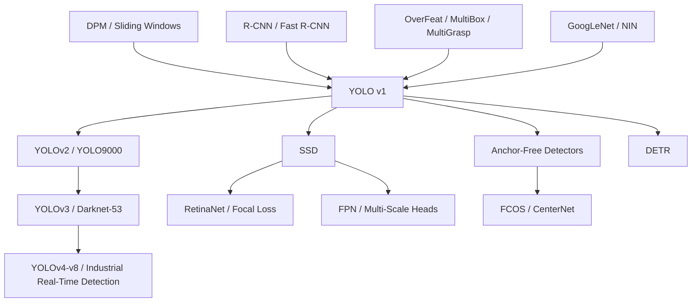

# YOLO — 把目标检测改写成一次前向的实时回归

> **2015 年 6 月 8 日，Joseph Redmon、Santosh Divvala、Ross Girshick、Ali Farhadi 四位作者把 [arXiv:1506.02640](https://arxiv.org/abs/1506.02640) 挂到网上，次年发表于 CVPR 2016。** 当时最强检测器还在 proposal、CNN、SVM、box regression、NMS 之间接力，YOLO 的赌注却很粗暴：把整张图缩到 448×448，只跑一次网络，直接回归 7×7×30 个检测量。它没有拿下最高 mAP，却把通用检测推到 45 FPS，Fast YOLO 更到 155 FPS；这篇论文真正改变的不是一个 leaderboard，而是目标检测开始以“实时系统”而非“离线 pipeline”自我定义。

## 一句话总结

Redmon、Divvala、Girshick、Farhadi 四位作者 2016 年发表于 CVPR 的 YOLO，把目标检测从“候选区域 + 分类器 + 后处理”的流水线，改写成一次前向的回归问题：输入 448×448 图像，输出 $S\times S\times(B\cdot5+C)$，在 PASCAL VOC 上具体是 $7\times7\times30$，再用 $\Pr(\mathrm{Class}_i|\mathrm{Object})\Pr(\mathrm{Object})\mathrm{IoU}$ 得到 class-specific confidence。它输给了 Fast R-CNN/Faster R-CNN 的最高精度，VOC 2007 上 YOLO 是 63.4 mAP / 45 FPS，Fast YOLO 是 52.7 mAP / 155 FPS，而 Fast R-CNN 是 70.0 mAP / 0.5 FPS、Faster R-CNN VGG-16 是 73.2 mAP / 7 FPS；但它把检测速度的坐标系直接改了。

YOLO 的后续影响不是“一个粗糙 detector 很快”这么简单：从 [AlexNet](2012_alexnet.md) 和 [ResNet](2015_resnet.md) 带来的全图 CNN 表征，到 [SSD](https://arxiv.org/abs/1512.02325)、RetinaNet、YOLOv2/v3/v4/v5/v8、anchor-free detector，再到 DETR 对 post-processing 的重新清算，很多路线都在继续回答同一个问题：检测能不能少一点手工 pipeline、多一点端到端结构？反直觉的 lesson 是，YOLO v1 最被批评的粗网格和平方误差，恰好让它把“速度优先”的设计哲学讲得足够清楚。

---

## 历史背景

### 2015 年的检测：准确，但不像一个实时系统

YOLO 出现前，目标检测已经被深度学习改写了一半。2014 年 R-CNN 证明 ImageNet 预训练 CNN features 可以大幅超过 DPM；2015 年 Fast R-CNN 把每个 proposal 单独跑 CNN 的巨大浪费降下来；同一年 Faster R-CNN 又把 Selective Search 换成 Region Proposal Network。按精度看，这条路线非常成功：PASCAL VOC 上，两阶段 detector 已经是事实标准。

但按系统形态看，检测仍然不像一个真正的实时视觉模块。R-CNN 是 Selective Search、CNN、SVM、box regression、NMS 的拼装系统，测试一张图要几十秒；Fast R-CNN 共享了 CNN 计算，却还要等 Selective Search 生成候选框；Faster R-CNN 已经把 proposal 做进网络，但高精度 VGG-16 版本在论文对比里仍只有 7 FPS。对于自动驾驶、机器人、摄像头交互和辅助设备来说，这些分数很强，却还没到“画面来了就立刻反应”的状态。

YOLO 的历史价值就在这里：它不是在同一条 pipeline 上再省一点时间，而是直接问，**检测能不能从一开始就被写成一个全图函数？** 输入一张图，输出所有框和类别；没有外部 proposal，没有每类单独分类器，没有一串单独训练的模块。这是对检测问题接口的重写。

### R-CNN 路线为什么如此自然

YOLO 的激进，只有放在 R-CNN 路线的合理性里才显出来。当时大家相信 proposal 不是累赘，而是必要结构：先用 Selective Search 或 Edge Boxes 给出可能有物体的位置，再让 CNN 负责分类。这样做有两个优势：一是候选框能把搜索空间从整张图的所有位置/尺度压缩到约 2000 个 region；二是分类 CNN 可以复用 ImageNet 成熟经验。

| 前序路线 | 已经解决的问题 | 留下的缺口 | YOLO 的回应 |
|----------|----------------|------------|-------------|
| DPM / HOG parts | 可解释的部件模型与滑窗检测 | 特征固定，速度和精度都到瓶颈 | 用 CNN 学特征，用一次前向替代滑窗枚举 |
| R-CNN | CNN features 让 proposal 分类变强 | 多阶段、慢、每个模块分开训练 | 把 proposal、分类、回归并进一个网络 |
| Fast R-CNN | 共享卷积特征，分类阶段快很多 | 仍依赖外部 proposal | 取消 Selective Search 入口 |
| Faster R-CNN | RPN 让 proposal 神经网络化 | 高精度模型仍非实时，两阶段结构保留 | 用固定网格和直接回归换取延迟 |
| OverFeat / MultiBox | CNN 可以做 localization 或 box proposal | 不是完整通用检测系统 | 同时预测框、置信度和类别 |

这张表不是说前序工作错了。恰恰相反，它们每一步都很合理，也都让 YOLO 有了可借力的组件：CNN 表征、box regression、NMS、端到端训练的意识、GPU 工程栈。YOLO 的突破不是“凭空发明检测”，而是把这些组件重新排序，让速度成为结构设计的第一原则。

### Redmon 团队带来的工程气质

四位作者的组合也很有意思。Joseph Redmon 来自 University of Washington，维护 Darknet，论文和代码有很强的系统实现风格；Ali Farhadi 与 UW / Allen Institute for AI 视觉方向紧密相关；Ross Girshick 则是 R-CNN 和 Fast R-CNN 的核心作者之一，署名 YOLO 让这篇论文不是站在 R-CNN 外部喊“推倒重来”，而是从检测 pipeline 内部发出的简化冲动。

这种背景解释了论文的写法。YOLO 并不把自己包装成复杂理论，而是很直白地展示系统接口：resize、single network、threshold。它承认精度不如最高分 detector，甚至专门做错误分析说明自己定位误差多；但它也反过来指出 Fast R-CNN 背景误检更多，YOLO 与 Fast R-CNN 组合能把 71.8 mAP 提到 75.0。论文最聪明的地方，是把自己的弱点和互补性都摆上桌。

### 标题为什么有效

“You Only Look Once” 是一个罕见的好标题，因为它不是营销口号，而是方法定义。DPM 要看很多窗口，R-CNN 要看很多 proposal，Fast R-CNN 要先等候选框，Faster R-CNN 仍要 proposal 与检测头交互；YOLO 则把整个检测问题压成一次全图评估。这个标题让读者在看到架构图之前，就已经明白论文的设计哲学。

也正因为标题足够强，YOLO 很快脱离了单篇论文，变成一条长期工程路线的名字。后来 YOLOv2、YOLOv3、YOLOv4、YOLOv5、YOLOv8 在细节上已经和 v1 相差很大，甚至维护者和代码库都多次变迁，但“只看一次”的精神仍然保留下来：检测器应该先服务实时约束，再在这个约束内追求精度。

## 研究背景与动机

### 把检测从“枚举候选”改成“全图函数”

传统检测的默认思路是枚举：枚举窗口、枚举 proposal、枚举尺度、枚举类别，再通过后处理合并。这个思路很安全，因为它把问题拆成许多熟悉的小问题；但它也制造了系统性开销。只要候选生成和分类是两个阶段，延迟就很难真正压下来；只要每个候选框单独打分，模型就很难全局理解“这个图里哪些物体共存、哪些背景不该被当成物体”。

YOLO 的动机，是把检测看成从图像到结构化输出的一个函数。网格 cell 负责物体中心，box predictor 负责坐标和置信度，class probability 负责类别；所有预测共享整图特征。这样的代价是输出空间被硬编码得很粗，尤其不适合密集小物体；但收益也很直接：模型天然看到全图上下文，推理只有一次网络前向，训练目标也能端到端写在同一个 loss 里。

### 速度不是附属指标

很多论文把速度放在最后作为工程优化，YOLO 则把速度放在方法开头。45 FPS 和 155 FPS 的意义不只是“快”，而是让检测从 batch benchmark 走向交互系统。一个 0.5 FPS 的 detector 可以离线标注数据；一个 45 FPS 的 detector 可以接 webcam、接机器人、接车载视频流。用户体验和部署场景会因此变成模型设计的一部分。

这也是 YOLO 与同时代高精度 detector 的真正分歧。它不是不知道 mAP 重要，而是认为 mAP 不是唯一轴。早期 YOLO 的精度牺牲很真实，定位误差也很明显；但它提供了一条新坐标轴：**在可交互延迟内，通用检测能做到多好？** 后来的单阶段检测器、移动端检测器、工业实时检测框架，基本都在沿着这条轴继续推进。

---

## 方法详解

### 整体框架

YOLO v1 的整体框架可以压成一句话：**把一张图划成固定网格，让每个网格 cell 直接预测少量 bounding boxes、box confidence 和条件类别概率，再把这些量组合成 class-specific detection scores。** 对 PASCAL VOC，配置是 $S=7, B=2, C=20$，所以每张图输出 7×7×30 个数，代表 98 个候选框和每个 cell 的 20 类条件概率。

$$
\mathbf{y}\in\mathbb{R}^{S\times S\times (B\cdot 5 + C)}
\quad\Rightarrow\quad
\mathbb{R}^{7\times 7\times 30}\ \text{on PASCAL VOC}
$$

| 阶段 | YOLO v1 选择 | 功能 |
|------|--------------|------|
| 输入 | 448×448 RGB image | 保留比 ImageNet 224 更细的定位信息 |
| 全图 backbone | 24 conv + 2 FC | 一次前向提取全局上下文 |
| 网格输出 | 7×7 cells | 用物体中心决定责任 cell |
| box predictors | 每 cell 2 个 box | 预测位置、尺寸和 objectness / IoU |
| scoring + NMS | confidence 阈值 + 可选 NMS | 去掉低置信框，NMS 额外带来约 2-3 mAP |

这个框架的关键不是“少了 proposal”这一个点，而是所有检测决策共享同一张全图 feature map。一个 cell 预测框时，不只看自己的局部 patch，而是通过后层特征看到整张图的语义上下文。YOLO 因此背景误检较少，但也因为最后输出网格粗、每个 cell 只能承担有限对象，付出了小物体和精细定位的代价。

### 设计 1：7×7 网格责任分配 —— 把检测搜索空间硬编码成 49 个位置

**功能**：把“哪一个 predictor 负责哪个物体”这个问题简化成一条规则：如果物体中心落在某个 grid cell，那个 cell 负责检测这个物体。

这个规则听起来粗糙，却非常重要。传统 detector 的搜索空间是连续位置、尺度、长宽比的组合；YOLO 直接把位置责任离散成 49 个 cell，再让每个 cell 预测 2 个框。这样每张图只有 98 个 box prediction，而不是 R-CNN 的约 2000 个 Selective Search proposal。

| 输出组件 | 数量 | 含义 | 约束 |
|----------|------|------|------|
| $x,y$ | 每 box 2 个 | box 中心相对 cell 边界的偏移 | 归一到 0-1 |
| $w,h$ | 每 box 2 个 | box 宽高相对整图宽高 | 归一到 0-1，训练时用平方根 |
| confidence | 每 box 1 个 | 是否有物体 × 框是否准 | 目标是 $\Pr(\mathrm{Object})\cdot\mathrm{IoU}$ |
| class probabilities | 每 cell 20 个 | 条件类别分布 | 一个 cell 只预测一组类别概率 |
| final tensor | $7\times7\times30$ | 全图所有检测量 | 固定形状，极快 |

**设计动机**：这是一种强 spatial prior。它牺牲了灵活性，换来了速度、简单性和端到端训练。YOLO v1 的许多失败都来自这里：两个小物体中心落在同一个 cell，或者一个 cell 内存在不同类别时，模型没有足够表达能力。但也正是这条硬约束，让检测第一次像分类一样成为单次 dense prediction。

### 设计 2：置信度与类别分解 —— 用一个乘法同时表达“是什么”和“框准不准”

**功能**：每个 box 预测 confidence，每个 cell 预测条件类别概率；测试时把二者相乘，得到每一类在每个 box 上的 class-specific confidence。

$$
\Pr(\mathrm{Class}_i\mid\mathrm{Object})\cdot
\Pr(\mathrm{Object})\cdot\mathrm{IoU}^{\mathrm{truth}}_{\mathrm{pred}}
=
\Pr(\mathrm{Class}_i)\cdot\mathrm{IoU}^{\mathrm{truth}}_{\mathrm{pred}}
$$

这条公式让 YOLO 把分类和定位绑定在一起：一个框即使类别概率高，只要 objectness / IoU confidence 低，最终分数仍然低；反过来，一个框很像物体但类别不确定，也不会轻易成为高分检测。

| 分数项 | 由谁预测 | 监督信号 | 推理时作用 |
|--------|----------|----------|------------|
| $\Pr(\mathrm{Object})\cdot\mathrm{IoU}$ | 每个 box predictor | 有物体时接近 IoU，无物体时为 0 | 衡量 box 是否值得保留 |
| $\Pr(\mathrm{Class}_i\mid\mathrm{Object})$ | 每个 cell | 只在 cell 有物体时惩罚分类错误 | 给 box 分配类别 |
| class-specific confidence | 两者相乘 | 没有直接单独监督 | 排序、阈值和 NMS 的最终依据 |
| background suppression | confidence 学到的低分 | 大量 no-object cell | 降低背景误检 |

**设计动机**：R-CNN 系列常把“这是一个好 proposal 吗”“它属于哪一类”“box 该怎么修”拆成不同模块；YOLO 把它们压成一个 tensor。这样做不如两阶段 detector 精细，却让所有预测共享同一个全图上下文。论文错误分析中 Fast R-CNN 背景误检明显更多，正是这个设计带来的互补收益。

### 设计 3：multi-part sum-squared loss —— 一个不完美但可训练的检测目标

**功能**：用一个加权平方误差同时训练坐标、尺寸、confidence 和类别。论文明确承认 sum-squared error 不完全等价于 average precision，但它容易优化，适合当时的 Darknet 工程栈。

$$
\begin{aligned}
\mathcal{L}=&\lambda_{coord}\sum_{i,j}\mathbb{1}^{obj}_{ij}\left[(x_i-\hat{x}_i)^2+(y_i-\hat{y}_i)^2\right] \\
&+\lambda_{coord}\sum_{i,j}\mathbb{1}^{obj}_{ij}\left[(\sqrt{w_i}-\sqrt{\hat{w}_i})^2+(\sqrt{h_i}-\sqrt{\hat{h}_i})^2\right] \\
&+\sum_{i,j}\mathbb{1}^{obj}_{ij}(C_i-\hat{C}_i)^2
+\lambda_{noobj}\sum_{i,j}\mathbb{1}^{noobj}_{ij}(C_i-\hat{C}_i)^2 \\
&+\sum_i\mathbb{1}^{obj}_{i}\sum_c(p_i(c)-\hat{p}_i(c))^2
\end{aligned}
$$

| loss 部分 | 权重 | 解决的问题 | 副作用 |
|-----------|------|------------|--------|
| coordinate $x,y$ | $\lambda_{coord}=5$ | 提高定位梯度权重 | 仍不是 IoU loss |
| size $\sqrt{w},\sqrt{h}$ | $\lambda_{coord}=5$ | 小框误差更敏感 | 只是近似修正 |
| object confidence | 1 | 学 box 是否对准物体 | 与坐标回归纠缠 |
| no-object confidence | $\lambda_{noobj}=0.5$ | 防止海量背景 cell 压垮训练 | foreground/background imbalance 仍存在 |
| class probability | 1，仅 object cell | 避免背景 cell 学类别 | 一个 cell 只能一组类别分布 |

训练时，每个有物体的 cell 会把负责权交给当前与 ground truth IoU 最高的 box predictor。这个“responsibility assignment”会让两个 predictor 自动分工，有的更擅长某些尺寸、比例或类别。它没有 anchor matching 那么系统，却已经有了后续 dense detector 中“分配正负样本”的雏形。

**设计动机**：YOLO 的 loss 是工程折中，不是最终答案。它把检测目标硬塞进一个可微回归框架，给后来的改进留下了巨大空间：anchors、focal loss、GIoU/DIoU/CIoU、label assignment、objectness calibration，都可以看作对这套朴素 loss 的逐步修补。

### 设计 4：Darknet backbone —— GoogLeNet 风格，但为速度减法

**功能**：用一个专门为检测速度设计的 CNN 取代 VGG-heavy detector。YOLO backbone 受 GoogLeNet 启发，但不用 Inception module，而是交替使用 $1\times1$ reduction 和 $3\times3$ convolution；标准 YOLO 有 24 个卷积层和 2 个全连接层，Fast YOLO 只有 9 个卷积层。

```python
def yolo_v1_head(features, grid=7, boxes=2, classes=20):
    hidden = leaky_relu(linear(flatten(features), 4096), negative_slope=0.1)
    hidden = dropout(hidden, p=0.5)
    raw = linear(hidden, grid * grid * (boxes * 5 + classes))
    return raw.reshape(grid, grid, boxes * 5 + classes)
```

这段伪代码省略了 24 层卷积 backbone，但保留了 YOLO v1 的一个重要历史特征：最后仍然有两个 fully connected layers。今天的 YOLO 系列基本都变成 fully convolutional / multi-scale head，v1 则还处在“分类网络改成检测网络”的过渡时代。它既激进，又保留了 2014-2015 年 CNN 工程的很多痕迹。

**设计动机**：VGG-16 版 YOLO 在 VOC 2007 上能到 66.4 mAP，但只有 21 FPS；标准 YOLO 降到 63.4 mAP，却有 45 FPS。论文选择把主线放在后者，因为它要证明的是“实时通用检测”这件事成立，而不是在同一硬件上榨出最高 mAP。

### 训练配方与推理路径

YOLO 的训练 recipe 很典型地属于 2015 年：ImageNet 预训练、SGD、momentum、weight decay、手写 learning rate schedule、dropout、强数据增强。它没有 BatchNorm（YOLOv2 才系统加入），没有 anchor boxes，没有 focal loss，也没有多尺度 feature pyramid。

| 项 | 配置 | 说明 |
|----|------|------|
| Framework | Darknet | Redmon 自己维护的 C 框架 |
| Pretraining | 前 20 个 conv layers，224×224 ImageNet | 约一周，single-crop top-5 88% |
| Detection input | 448×448 | 为定位提高分辨率 |
| Dataset | VOC 2007 + 2012 train/val | 测 VOC 2012 时加入 VOC 2007 test 训练 |
| Epochs | 约 135 | 75 + 30 + 30 主阶段 |
| Batch / momentum / decay | 64 / 0.9 / 0.0005 | 标准 SGD 配方 |
| LR schedule | warmup 1e-3→1e-2，再 1e-2 / 1e-3 / 1e-4 | 高 LR 起步会发散 |
| Regularization | dropout 0.5 + scaling/translation/HSV jitter | 对抗 VOC 小数据过拟合 |
| Activation | final linear，其余 leaky ReLU 0.1 | 避免普通 ReLU 死区 |
| Inference | single forward + threshold + optional NMS | NMS 额外约 2-3 mAP |

从现代角度看，这套 recipe 很朴素，甚至显得脆弱；但它足以支撑论文的核心主张。YOLO 不是靠复杂训练技巧赢，而是靠重新定义检测系统的计算图赢。它把“快”从后处理优化挪到架构约束里，这正是后续十年实时检测器反复继承的部分。

---

## 失败案例

### 当时被 YOLO 重新定义的对手

YOLO 的“失败案例”不能只按 mAP 排名看。它在纯精度上并没有击败 Fast R-CNN 或 Faster R-CNN；它真正击败的是“通用检测必须慢”的默认假设。论文 Table 1 把这个取舍摆得很清楚：Fast R-CNN 有 70.0 mAP，但只有 0.5 FPS；Faster R-CNN VGG-16 有 73.2 mAP，但只有 7 FPS；YOLO 的 63.4 mAP 不是最高，却有 45 FPS。

| 对手 | 当时强项 | 暴露的问题 | YOLO 如何形成对照 |
|------|----------|------------|-------------------|
| 30Hz / 100Hz DPM | 真正实时，工程成熟 | mAP 只有 26.1 / 16.0 | Fast YOLO 155 FPS 且 52.7 mAP，精度翻倍以上 |
| R-CNN | CNN features 精度高 | 测试超过 40 秒，pipeline 很长 | YOLO 一次前向，取消 per-proposal CNN |
| Fast R-CNN | VOC 2007 mAP 70.0 | Selective Search 让速度停在 0.5 FPS | YOLO 少 6.6 mAP，但快约 90 倍 |
| Faster R-CNN VGG-16 | mAP 73.2，proposal 也神经网络化 | 7 FPS，仍不到实时 | YOLO 低 9.8 mAP，但超过实时门槛 |
| YOLO VGG-16 | mAP 66.4，比标准 YOLO 高 | 21 FPS，不够实时 | 说明 backbone 选择必须服从延迟目标 |

这张表里最重要的不是某一个数字，而是“不同失败方式”的对照。两阶段 detector 的失败，是系统延迟和模块复杂；YOLO 的失败，是定位精度和小物体召回。论文没有隐藏后者，而是用它换来了一个新的设计坐标系。

### YOLO 输给谁，为什么

如果只问“谁 mAP 更高”，YOLO v1 明确输给 Fast R-CNN 和 Faster R-CNN。原因并不神秘：两阶段 detector 先生成候选区域，再对每个区域做精细分类和 box refinement；YOLO 则用 7×7 网格和每 cell 两个 box 一次性完成所有预测。它的输出预算太紧，定位分辨率太粗。

| YOLO 失败点 | 直接原因 | 当时体现 | 后续修补路线 |
|-------------|----------|----------|--------------|
| 定位误差多 | 7×7 网格 + coarse features | error analysis 中 localization 是最大错误来源 | anchors、多尺度 head、IoU loss、feature pyramid |
| 小物体差 | 一个 cell 只能有限 box 和一组类别 | 鸟群、瓶子、羊、tv/monitor 等类别掉分 | SSD multi-scale、FPN、PAN、anchor-free assignment |
| 多目标拥挤差 | cell 责任由物体中心决定 | 同一 cell 内多个物体难表达 | denser grids、multi-anchor、set prediction |
| loss 与 AP 不一致 | sum-squared error 只是代理目标 | 大小框误差权重不理想 | focal loss、GIoU/DIoU/CIoU、quality focal loss |

这也是 YOLO v1 与后续 YOLO 系列的区别。后来的 YOLOv2/v3/v4/v5/v8 继承的是“single-stage real-time”哲学，不是原封不动继承 7×7 网格和平方误差。v1 更像一张宣言：方向对，但第一版的很多机制会被后来者替换。

### 论文自己承认的失败

YOLO 论文的限制部分非常坦率。它指出，每个 grid cell 只能预测两个 box 并且只有一组 class probabilities，因此会限制附近物体的预测数量；模型会挣扎于成群的小物体，如鸟群；从数据中直接学习 box 形状，也让它对新长宽比和不寻常姿态泛化较差；最后，虽然 loss 近似检测性能，但同样大小的平方误差对大框和小框的实际 IoU 影响完全不同。

这些承认很关键，因为它们几乎逐条预告了后续十年的检测研究。小物体、多尺度、label assignment、IoU-aligned loss、foreground/background imbalance、NMS 替代方案，后来都成了 dense detection 的主战场。YOLO v1 的价值，不是它已经解决这些问题，而是它把问题暴露在一个极简系统里，使每个后续修补都能被清楚地定位。

### 互补性而非全面胜利

最有意思的实验不是 YOLO 单独和 Fast R-CNN 比，而是二者组合。Fast R-CNN 的定位更准，但背景误检多；YOLO 定位更粗，却因为看整张图，背景误检少。论文把 YOLO 作为 Fast R-CNN detections 的重打分信号，VOC 2007 上把最好的 Fast R-CNN 从 71.8 mAP 提到 75.0，增益 3.2 点。相比之下，把 Fast R-CNN 与其他 Fast R-CNN 变体组合，只增 0.3 到 0.6。

这个结果说明 YOLO 的失败并不是“全方位更差”，而是错误分布不同。它对背景更谨慎，对位置更粗糙；两阶段 detector 对位置更精确，却更容易把背景 region 当成物体。好的失败案例往往不是完全失败，而是揭示一个新 axis。YOLO 就是这样的案例。

## 实验关键数据

### VOC 2007 的速度 / 精度取舍

论文 Table 1 是理解 YOLO 的核心表。它把所有模型放在 mAP 和 FPS 两个维度上，而不是只看 leaderboard 名次。

| 模型 | 训练数据 | mAP | FPS |
|------|----------|-----|-----|
| 100Hz DPM | VOC 2007 | 16.0 | 100 |
| 30Hz DPM | VOC 2007 | 26.1 | 30 |
| Fast YOLO | VOC 2007+2012 | 52.7 | 155 |
| YOLO | VOC 2007+2012 | 63.4 | 45 |
| Fastest DPM | VOC 2007 | 30.4 | 15 |
| Fast R-CNN | VOC 2007+2012 | 70.0 | 0.5 |
| Faster R-CNN VGG-16 | VOC 2007+2012 | 73.2 | 7 |
| YOLO VGG-16 | VOC 2007+2012 | 66.4 | 21 |

这组数字说明了两个结论。第一，Fast YOLO 是当时 PASCAL 上最快的通用 detector，并且 mAP 是先前实时 detector 的两倍以上。第二，标准 YOLO 虽然比 Fast YOLO 慢很多，但仍高于实时门槛，同时拿到 63.4 mAP；它把“实时”和“可用精度”第一次放进同一个通用检测模型。

### 错误分析：定位错 vs 背景错

YOLO 使用 Hoiem 等人的 detector diagnosis 工具，对 VOC 2007 的 top detections 做错误类型分解。结论非常有辨识度：YOLO 的 localization errors 比其他错误加起来还多；Fast R-CNN 的 localization errors 少很多，但 background false positives 高得多，论文给出的背景误检比例是 13.6%，几乎是 YOLO 的三倍。

| 错误类型 | YOLO 倾向 | Fast R-CNN 倾向 | 解释 |
|----------|-----------|-----------------|------|
| localization | 主要错误来源 | 明显更少 | YOLO 的网格与直接回归较粗 |
| background | 明显更少 | 13.6% top detections 是背景误检 | YOLO 看整图上下文，proposal detector 更容易局部误判 |
| similar / other | 不是主叙事 | 不是主叙事 | 类别混淆不是 YOLO 最核心瓶颈 |

这组错误分析让 YOLO 的定位更精确：它不是“全面弱一点”，而是“更快、更懂背景，但框不够准”。这也是为什么它能给 Fast R-CNN 重打分带来大增益。

### VOC 2012 与模型组合

VOC 2012 上，YOLO 单模型 57.9 mAP，接近原始 R-CNN VGG 级别，低于当时最强方法。论文并不回避这一点：它强调 YOLO 是 leaderboard 中唯一的实时 detector，并展示 Fast R-CNN + YOLO 的组合把 Fast R-CNN 提高 2.3 点，在公开榜上上升 5 位。

| 实验 | 基线 | 加 YOLO 后 | 增益 |
|------|------|------------|------|
| VOC 2007 best Fast R-CNN | 71.8 mAP | 75.0 mAP | +3.2 |
| VOC 2007 Fast R-CNN variants ensemble | 71.8 mAP | 72.1-72.4 mAP | +0.3 到 +0.6 |
| VOC 2012 YOLO single model | 57.9 mAP | 不适用 | 单模型低于 SOTA |
| VOC 2012 Fast R-CNN + YOLO | Fast R-CNN | Fast R-CNN + YOLO | +2.3 |

这说明 YOLO 的价值不只在速度，也在不同错误模式。即使不享受 YOLO 的实时速度，把它作为另一个 detector 加进 ensemble，也能提供和 Fast R-CNN 家族内部 ensemble 不同的信息。

### 艺术域泛化

论文最后一组实验常被忽略，但对理解 YOLO 很重要：从自然图像迁移到艺术作品的人检测。R-CNN 在 VOC 2007 上强，但在 Picasso 数据集上掉得很厉害；DPM 因为空间形状模型，跨域掉得少；YOLO 则兼有较强 VOC AP 和较好的跨域稳健性。

| 模型 | VOC 2007 person AP | Picasso AP | Picasso best F1 | People-Art AP |
|------|--------------------|------------|-----------------|---------------|
| YOLO | 59.2 | 53.3 | 0.590 | 45 |
| R-CNN | 54.2 | 10.4 | 0.226 | 26 |
| DPM | 43.2 | 37.8 | 0.458 | 32 |

这个结果支撑了论文的一个较深判断：YOLO 因为看整张图，会学到物体大小、形状和上下文关系，而不只是 proposal 内部的局部纹理。艺术作品和自然照片在像素外观上差异很大，但人在画面中的形状、比例和上下文仍有可迁移结构。YOLO 的全图建模让它在这种分布迁移里不至于像 R-CNN 那样崩掉。

---

## 思想史脉络

### 前世：从滑窗、proposal 到“能不能直接预测框”

YOLO 的前世不是单线的。它一边继承了 DPM / sliding window 对“在图像空间搜索物体”的执念，一边继承了 R-CNN 系列对 CNN 表征和 box regression 的信心，还从 OverFeat、MultiBox、MultiGrasp 这些工作里吸收了“神经网络可以直接输出位置”的可能性。真正的分叉点在于：这些前序大多仍把 detection 拆成多个模块，而 YOLO 把它们压进一个 tensor。

| 思想来源 | 核心贡献 | YOLO 继承了什么 | YOLO 放弃了什么 |
|----------|----------|----------------|----------------|
| DPM / sliding window | 位置与尺度的密集搜索 | detection 是空间函数 | 手工 HOG parts 与 exhaustive window |
| R-CNN | proposal + CNN features + box regression | CNN 表征和坐标回归 | Selective Search、SVM、分阶段训练 |
| Fast / Faster R-CNN | 共享卷积特征、神经网络 proposal | end-to-end 趋势 | 两阶段 refinement |
| OverFeat | CNN 同时做分类、定位、检测 | localization 可以由 CNN 学 | 仍偏 sliding-window / disjoint pipeline |
| MultiBox | CNN 预测候选框 | 直接 box prediction | 不是完整多类检测器 |
| MultiGrasp | grid-style grasp regression | 固定空间网格回归 | 单一 grasp 任务的简单设定 |
| Network in Network / GoogLeNet | 1×1 reduction、轻量 CNN 设计 | 速度友好的 backbone | Inception 的复杂 multi-branch |

如果说 R-CNN 把 CNN 带进检测，YOLO 则把检测带回 CNN 的原始承诺：一个可微函数，从输入到输出端到端学习。这个承诺后来被很多方法用不同方式重写，但“取消外部候选机制”这件事，YOLO 是最清楚、最有传播力的一次表达。

### Mermaid 引用图



这张图里，YOLO v1 不是所有后继的直接技术来源，却是一个清晰的分水岭。SSD 在多尺度 feature maps 上继承 single-shot 检测；RetinaNet 继续 single-stage，但用 focal loss 修 foreground/background imbalance；YOLOv2/v3 把 anchors、BatchNorm、多尺度预测和更强 backbone 接进来；anchor-free detector 把“直接预测”进一步推向无 anchor 的中心点或密集位置；DETR 则在另一个方向上继续消灭手工 pipeline，把 detection 写成 set prediction。

### 今生：YOLO 变成一条工业化路线

很多经典论文影响后续研究，YOLO 更特别的一点是它影响了部署文化。YOLO 这个名字后来逐渐从论文标题变成工程生态：Darknet YOLO、YOLOv2、YOLOv3、YOLOv4、Ultralytics YOLOv5/YOLOv8、各种移动端和边缘端 fork。学术上，v1 的许多细节早已过时；工程上，“YOLO”几乎成了实时检测的默认词。

| 后继 | 继承 YOLO 的部分 | 改掉 YOLO 的部分 | 历史意义 |
|------|------------------|------------------|----------|
| SSD | single-shot dense prediction | 加 default boxes 和多尺度 feature maps | 把一阶段检测推向更高 mAP |
| YOLOv2 / YOLO9000 | 实时检测哲学与 Darknet | 加 anchors、BatchNorm、高分辨率预训练 | 修补 v1 的定位和召回 |
| RetinaNet | 一阶段检测框架 | 用 focal loss 处理极端类别不平衡 | 证明一阶段也能高精度 |
| YOLOv3 | YOLO 工程路线 | Darknet-53、多尺度 head、logistic classifiers | 让 YOLO 成为实用默认选择 |
| FCOS / CenterNet | 直接 dense prediction | 去掉 anchors，重写 label assignment | 回到更纯的 anchor-free 思路 |
| DETR | 端到端、少后处理的野心 | transformer + bipartite matching | 用集合预测重启检测接口讨论 |

YOLO 的今生说明，一个有生命力的 idea 不一定以原始形式存活。7×7 网格、两层 FC、sum-squared loss 都不再是现代 YOLO 的核心；真正存活的是实时约束、单阶段推理、少 pipeline、工程可部署性。

### 误读：YOLO 不是“只是快一点”

常见误读之一，是把 YOLO 归纳成“速度快、精度低”的折中。这个说法没错，但太浅。YOLO 的速度不是压缩模型、剪枝、量化这类事后优化，而是来自问题建模：把 detection 变成固定形状输出，把候选生成变成网格责任，把类别和框质量变成同一个 tensor 里的预测。速度来自接口，而不是只来自实现。

另一个误读，是把 YOLO 当成“不要 NMS”。v1 论文其实仍使用 non-maximal suppression，并且说 NMS 能带来 2-3 mAP，只是它不像 R-CNN/DPM 那样依赖 NMS 才能把大量重叠候选框整理成结果。YOLO 真正减少的是 proposal machinery，不是完全消灭后处理。

第三个误读，是认为 YOLO 的核心是 7×7 网格。更准确地说，7×7 网格是 v1 为了实时目标做出的具体实现，而不是 YOLO 思想的永久核心。后来多尺度 head、anchors、anchor-free points、transformer queries 都在替代这种粗网格，但它们仍在回答 YOLO 提出的系统问题：检测输出能不能直接、共享、端到端地产生？

### 真正传下去的东西

YOLO 传下去的不是某个 loss，也不是某个 backbone，而是一组工程哲学。第一，速度应该进入模型定义，而不是最后才做优化。第二，检测器要尽量减少外部 pipeline，让训练和推理的结构一致。第三，全图上下文对减少背景误检有真实价值。第四，在 latency budget 下看 mAP，和无视 latency 看 mAP，是两种不同研究问题。

这也是 YOLO 在 2026 年仍然值得重读的原因。现代检测器比 v1 强太多，但很多工程讨论仍会回到 YOLO 的问题设定：能不能在给定硬件、给定延迟、给定场景里，用一个尽量直接的模型做到足够好？这个问题比 7×7×30 更长寿。

---

## 当代视角

### 2026 年看，YOLO 哪些判断仍成立

十年后看 YOLO，最经得住时间考验的不是 7×7 网格，也不是平方误差，而是它对检测系统形态的判断。第一，实时约束会反过来塑造模型架构；第二，单阶段检测不是“低配替代品”，而是一条独立路线；第三，全图上下文可以减少背景误检；第四，部署可用性会改变研究问题本身。

这些判断在 2026 年仍然成立。自动驾驶、工业质检、视频分析、移动端 AR、边缘摄像头都不会只问 mAP；它们会问延迟、吞吐、功耗、显存、框稳定性、可维护性。YOLO 让检测论文很早就学会用系统语言说话，这比 v1 的具体模块更长寿。

### 站不住的假设

YOLO v1 也有一些假设在今天已经站不住。最明显的是“固定粗网格足够表达检测输出”。现代检测器几乎都会使用多尺度 feature maps 或更灵活的 query / point / anchor 分配，因为小物体、拥挤场景和尺度变化太常见。另一个过时假设是用 sum-squared error 训练所有检测量；今天更常见的是分类/objectness/box quality 分离，并用 IoU-aligned loss 或 distributional regression 处理框质量。

| 2016 年假设 | 当时为什么合理 | 今天的问题 | 现代替代 |
|-------------|----------------|------------|----------|
| 7×7 固定网格够用 | VOC 物体较大，实时压力强 | 小物体和拥挤目标表达不足 | FPN/PAN、多尺度 head、dense points |
| 每 cell 一组类别概率 | 输出紧凑，计算便宜 | 同一 cell 多类别冲突 | anchor/point/query 级分类 |
| squared error 可训练检测 | 工程简单，Darknet 易实现 | 与 AP/IoU 对齐差 | focal loss、IoU loss、quality-aware loss |
| NMS 是轻量后处理 | 候选框很少，开销不大 | 仍有阈值敏感和拥挤问题 | soft-NMS、learned NMS、set prediction |
| 单尺度主干足够 | v1 目标是实时 proof-of-concept | 尺度鲁棒性不足 | feature pyramid、neck、multi-resolution training |

这些过时点并不削弱 YOLO 的历史地位。相反，它们说明 YOLO v1 是一个足够清楚的最小版本：把新范式立住，然后让后续十年逐项修补它。

### 如果今天重写 YOLO v1

如果今天重写 YOLO v1，但保留“single-stage real-time”精神，架构会完全不同。backbone 大概率是轻量 ConvNeXt/CSP/Darknet 变体或 mobile-friendly hybrid；head 会是多尺度 dense head；loss 会拆成 classification、objectness/quality、box regression；box loss 会对齐 IoU；训练会用 mosaic/mixup、EMA、cosine schedule、large-scale pretraining 和更强 label assignment。

| 模块 | YOLO v1 | 今天重写会怎样 | 保留的精神 |
|------|---------|----------------|------------|
| Backbone | 24 conv + 2 FC Darknet | fully convolutional multi-stage backbone | 为延迟预算设计 |
| Output | 7×7×30 fixed tensor | multi-scale anchors/points/queries | 一次前向产生全部检测 |
| Loss | weighted SSE | BCE/focal + IoU-aware box loss + quality score | 端到端联合优化 |
| Training | VOC + ImageNet pretrain | 大规模数据、强增强、EMA、自动调参 | 训练服务部署目标 |
| Postprocess | threshold + NMS | class-aware NMS、soft-NMS 或 set prediction | 后处理越少越好 |

但一个真正“今天的 YOLO v1”不应该只是追赶现代技巧。它还应该保留 Redmon 论文里的可读性：用一张图解释系统、用一张表说清速度/精度、主动承认错误类型。这种把工程约束讲清楚的能力，是很多高分检测论文反而欠缺的。

### 最反直觉的遗产

YOLO 最反直觉的遗产，是它证明“先做一个不够准但形态正确的系统”也可以改变领域。学术评价常偏爱当下最高分，但系统范式的转移不一定从最高分开始。YOLO v1 的 mAP 不如 Faster R-CNN，定位也粗；可是一旦它把 45 FPS 的通用检测跑起来，整个社区就无法再假装速度只是附录里的工程细节。

这种遗产在大模型时代也值得记住。很多方向都会遇到类似分歧：是先把离线精度推到最高，还是重写系统接口，让任务进入实时、交互、可部署的形态？YOLO 给出的答案不是“速度永远比精度重要”，而是“当速度改变可用场景时，它就是方法的一部分”。

## 局限与展望

### 技术局限

YOLO v1 的技术局限很具体。7×7 网格导致小物体和拥挤物体差；每 cell 一组类别概率限制多对象表达；两层 FC 让输入尺寸和空间结构不够灵活；SSE loss 与 IoU/AP 不一致；NMS 仍然存在阈值和重叠框处理问题。它也没有现代检测中几乎标配的 multi-scale neck、anchor assignment、batch normalization、large-scale training recipe。

因此，不应把 YOLO v1 当成现代 detector 的直接模板。它更适合作为思想模板：如果一个任务被复杂 pipeline 拖慢，是否可以把输出空间重新参数化，逼迫模型一次性预测？这个问题仍然开放，并且已经在检测、姿态估计、分割、跟踪和机器人感知里反复出现。

### 叙事局限

YOLO 的叙事也有局限。它把“统一、实时、端到端”讲得非常漂亮，但端到端并不自动带来最佳性能。很多后续高精度 detector 重新引入了 anchors、feature pyramid、careful assignment、NMS variants，这些看起来像“复杂 pipeline 回潮”，实则是在保留 single-stage 推理的同时，重新加入必要 inductive bias。

另一个局限是，YOLO 这个名字后来被过度泛化。许多版本已经不再和 v1 有直接技术连续性，但仍共享品牌。这对工程传播有利，对思想史分析却会制造混淆。读 v1 时要把两个层次分开：一篇 CVPR 2016 论文，和一个后来不断扩张的实时检测生态。

## 相关工作与启发

### 与两阶段检测的关系

YOLO 和 Faster R-CNN 的关系不应被简化成“谁取代谁”。两阶段检测在精细定位、样本分配、困难实例处理上长期更强；YOLO 则把速度和系统简洁性推到前台。后来检测发展并不是单阶段彻底消灭两阶段，而是二者互相借鉴：FPN、anchors、IoU loss、NMS 技巧、label assignment 都跨越了这条边界。

真正有启发的是它们的互补错误。YOLO 背景误检少、定位粗；Fast R-CNN 定位准、背景误检多。很多现代系统仍会利用类似互补性：轻量 detector 做预筛，高精 detector 做复核；实时模型给在线反馈，离线模型做高质量重标注；不同检测头在 ensemble 或 distillation 中互补。

### 对实时 AI 系统的启发

YOLO 对实时 AI 的启发超出了视觉检测。它提醒我们，模型设计可以从延迟预算倒推，而不是先追最高分再压缩。语音唤醒、在线翻译、视频理解、机器人控制、端侧多模态助手，都有类似约束：系统必须在用户感觉“正在发生”的时间尺度内完成推理。

这类任务里，最优论文指标和最佳系统体验常常不是同一个点。YOLO 的深层 lesson 是：当任务进入实时交互，研究问题本身会变。我们不再只问“最准确的 detector 是什么”，而是问“在 20ms、30ms、50ms 内，哪种错误最可接受，哪种结构最稳定，哪种模型最容易部署和维护”。

## 相关资源

### 资源清单

- 论文：[You Only Look Once: Unified, Real-Time Object Detection](https://arxiv.org/abs/1506.02640)
- 项目页：[YOLO: Real-Time Object Detection](https://pjreddie.com/darknet/yolo/)
- 代码：[pjreddie/darknet](https://github.com/pjreddie/darknet)
- 关键前序：[R-CNN](https://arxiv.org/abs/1311.2524)、[Fast R-CNN](https://arxiv.org/abs/1504.08083)、[Faster R-CNN](https://arxiv.org/abs/1506.01497)、[OverFeat](https://arxiv.org/abs/1312.6229)
- 关键后继：[SSD](https://arxiv.org/abs/1512.02325)、[RetinaNet](https://arxiv.org/abs/1708.02002)、[DETR](https://arxiv.org/abs/2005.12872)
- 相关深读：[AlexNet](2012_alexnet.md)、[ResNet](2015_resnet.md)


---

> 🌐 [English version](/en/era2_deep_renaissance/2016_yolo/) · 📚 awesome-papers project · CC-BY-NC