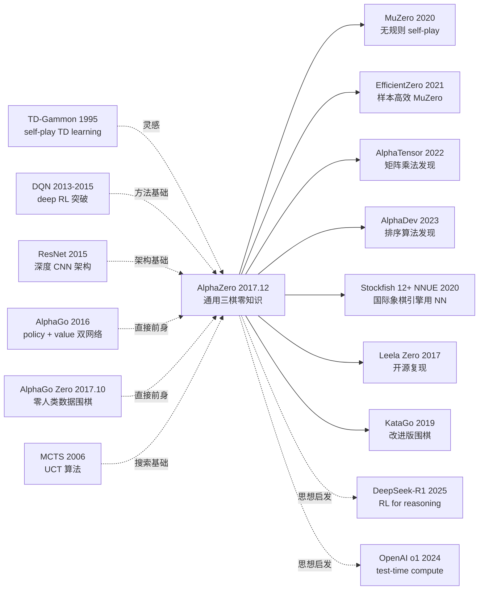

# AlphaZero — 用纯自对弈把人类围棋知识从 RL 中彻底删除

> **2017 年 12 月 5 日，DeepMind 在 arXiv 发布 [AlphaZero (1712.01815)](https://arxiv.org/abs/1712.01815)。**
> 这是一篇只有 19 页的论文，把 1 年前震撼世界的 AlphaGo 推向了更激进的极端：**完全不使用人类对局数据**，仅靠自对弈（self-play），从随机初始化训练 8 小时打败 AlphaGo Lee（19 小时打败 AlphaGo Master），还能一套算法通吃国际象棋、将棋、围棋三大棋。
> 4 个月后《Science》刊登扩展版，整个 RL 学界为之疯狂 —— **「人类先验在某些任务上不仅无用，反而是负担」** 这一论断被工程化证明。
> AlphaZero 是 RL 史上最重要的论文之一：它不仅证明了 self-play + MCTS + deep network 的通用性，更直接催生了 MuZero (2020) / DeepSeek-R1 (2025) 等 reasoning RL 的整个范式。

## 一句话总结

AlphaZero 用 **policy-value 双头神经网络 + Monte Carlo Tree Search (MCTS) 引导的自对弈 + 纯 self-play 数据** 训练，**完全不需要人类对局数据 / 不需要任何 hand-crafted heuristic**，从零知识出发在围棋、国际象棋、将棋三大棋全部超越当时最强的程序，证明了「self-play 是通向超人类游戏 AI 的通用路径」。

---

## 历史背景

### 2017 年的 AI 学界在卡什么

2016 年 3 月 AlphaGo 4:1 战胜李世石震撼世界，2017 年 5 月 AlphaGo Master 3:0 战胜柯洁。但 AlphaGo Lee 用了 **3000 万局人类对局做监督预训练 + 强化学习微调**，AlphaGo Master 也仍依赖部分人类对局。学界开始质疑：

> **(1) AlphaGo 的成功多大程度依赖人类知识？(2) 完全没有人类先验，self-play 能不能从零训出超人类水平？(3) 一套算法能否通吃多种棋类？(4) 人类先验是不是反而成了天花板？**

DeepMind 内部已经在做 **AlphaGo Zero**（2017.10 Nature 论文），证明围棋可以零人类知识。AlphaZero（2017.12）是 AlphaGo Zero 的「极致泛化」版本，把同一算法搬到国际象棋和将棋上。

### 直接逼出 AlphaZero 的 3 篇前序

- **Silver et al., 2016 (AlphaGo)** [Nature]：第一个超人类围棋程序，但用 3000 万人类对局监督预训练
- **Silver et al., 2017 (AlphaGo Zero)** [Nature]：第一次完全去除人类知识，只在围棋上 self-play 训练
- **Tesauro, 1995 (TD-Gammon)** [Comm. ACM]：30 年前的 self-play 西洋双陆棋，证明 self-play 可超人类（但用浅层 NN）

### 作者团队当时在做什么

13 位作者全部来自 DeepMind。Silver 是 RL 老将（DQN / AlphaGo 系列）；Hassabis 是 DeepMind 创始 CEO；Schrittwieser 后来主导 MuZero (2020)；Lillicrap 是 DDPG 一作。**DeepMind 当时押注「general purpose game-playing」**，AlphaZero 是这个押注的工程证明，目标是让一套算法适配所有棋类。

### 工业界 / 算力 / 数据

- **TPU**：5000 个 TPU v1 用于 self-play 数据生成 + 64 个 TPU v2 用于训练（围棋训练 8 小时打败 AlphaGo Lee）
- **数据**：**完全没有外部数据**！全部 self-play 数据从随机初始化的网络生成
- **框架**：TensorFlow，自家的 RL 训练 pipeline
- **对手**：围棋 AlphaGo Lee/Master、国际象棋 Stockfish 8、将棋 Elmo

---

## 方法详解

### 整体框架

```
[Self-Play Loop]
  随机初始化的 policy-value network f_θ
  ↓
  ┌─ 25,000 局 self-play (并行) ────────────────────┐
  │   每步：用 f_θ + MCTS (800 simulations) 选动作 │
  │   存储 (state, π_MCTS, z_outcome) 三元组       │
  └────────────────────────────────────────────────┘
  ↓
  ┌─ 训练 f_θ ─────────────────────────────────────┐
  │   minimize: L = (z - v_θ)² - π·log(p_θ) + c·||θ||² │
  │   policy 拟合 MCTS 输出，value 拟合最终胜负     │
  └────────────────────────────────────────────────┘
  ↓
  循环 (无需 evaluation gate，每个 iteration 直接用最新 net)
```

| 项 | 围棋 | 国际象棋 | 将棋 |
|----|------|---------|------|
| 棋盘 | 19×19 | 8×8 | 9×9 |
| 输入通道 | 17 | 119 | 362 |
| 网络 | 20-block ResNet | 同 | 同 |
| MCTS simulations / move | 800 | 800 | 800 |
| 训练时间 | 13 天（all 棋共享） | | |
| Self-play 局数 | 4400 万 | | |
| 击败的对手 | AlphaGo Lee/Master | Stockfish 8 | Elmo |

### 关键设计

#### 设计 1：Policy-Value 双头网络 —— 一个网络两个输出

**功能**：单一神经网络 $f_\theta$ 输入棋盘状态 $s$，同时输出**策略先验** $p_\theta(a|s)$（每个合法动作的概率）和**价值估计** $v_\theta(s) \in [-1, +1]$（当前玩家胜率）。

**架构**：

$$
(p, v) = f_\theta(s)
$$

$f_\theta$ 是 20 层（围棋）或 40 层（国际象棋）的 **ResNet**：

```
Input (19×19×17) → Conv 3×3, 256 → BN → ReLU
↓ 20 × Residual Block (Conv-BN-ReLU + skip)
↓ 分两头:
   ├─ Policy head: Conv 1×1, 2 → BN → ReLU → FC → softmax → 19²+1=362 logits
   └─ Value head: Conv 1×1, 1 → BN → ReLU → FC 256 → ReLU → FC 1 → tanh
```

**对比 AlphaGo 的双网络设计**：

| 模型 | 网络 | 输入数据 |
|------|------|---------|
| AlphaGo Lee | 2 个独立网络（policy + value） | 人类对局 + self-play |
| AlphaGo Master | 单一网络（双头），3.4M 人类对局 | 人类对局 + self-play |
| **AlphaGo Zero** | **单一网络（双头）** | **纯 self-play，零人类数据** |
| **AlphaZero** | **单一网络（双头），通用三棋** | **纯 self-play，零人类数据** |

**设计动机**：双头共享 backbone 让 policy 和 value 互相 regularize（避免 overfit），且参数效率高。

#### 设计 2：MCTS 引导的策略改进 —— 搜索是 policy 的 amplifier

**功能**：用 Monte Carlo Tree Search 在 policy network 先验上搜索 800 次模拟，得到改进后的访问分布 $\pi_{\text{MCTS}}$，作为训练 target。

**核心循环（每次模拟）**：

每个节点存储统计量：$N(s,a)$（访问次数）、$W(s,a)$（累积价值）、$Q(s,a) = W/N$（平均价值）、$P(s,a)$（先验来自网络）。

**Selection（PUCT 公式）**：

$$
a^* = \arg\max_a \left[ Q(s,a) + c_{\text{puct}} P(s,a) \frac{\sqrt{\sum_b N(s,b)}}{1 + N(s,a)} \right]
$$

第一项是 exploit（选高价值），第二项是 explore（选高先验且少访问）。

**Expansion**：到叶节点 $s_L$ 时调用 $f_\theta(s_L)$ 得 $(p, v)$，初始化所有合法动作的 $P(s_L, a) = p_a$。

**Backup**：从 $s_L$ 沿路径回溯，更新 $N$、$W$、$Q$。

**改进策略**：800 模拟后，从根节点输出：

$$
\pi(a|s_0) = \frac{N(s_0, a)^{1/\tau}}{\sum_b N(s_0, b)^{1/\tau}}
$$

$\tau$ 是温度（前 30 步 $\tau=1$ 探索，之后 $\tau \to 0$ 选最优）。

**为什么 MCTS 能改进 policy？**：MCTS 利用价值网络评估远期回报，比单步 policy 网络的瞬时输出更准确。**MCTS 是 policy iteration 的"算力换性能"放大器** —— 投入越多 simulation，得到的改进 policy 越接近最优。

#### 设计 3：Self-Play Training Loop —— 无需 evaluation 的连续学习

**功能**：用最新网络产生 self-play 数据，立刻训练新版本，**不再像 AlphaGo Zero 那样需要"挑战赛 evaluation"**（新版本要赢 55% 旧版本才被采用）。

**训练流程**：

```python
def alphazero_train():
    theta = init_network()   # 随机初始化
    while True:
        # 1. Self-play with current network (并行)
        games = []
        for _ in range(25000):
            games.append(play_game(f_theta=theta, mcts_sims=800))
        # 每局产生 (s, π_mcts, z) 三元组

        # 2. Sample mini-batch from replay buffer
        batch = sample(replay_buffer, batch_size=4096)

        # 3. Update network: policy + value joint loss
        loss = (z - v_theta(s))**2 - pi.dot(log(p_theta(s))) + c * l2(theta)
        theta = sgd_step(theta, loss)

        # 不需要 evaluation gate，下一轮 self-play 直接用最新 theta
```

**对比 AlphaGo Zero 的差异**：

| 项 | AlphaGo Zero | AlphaZero |
|----|--------------|-----------|
| Evaluation gate | 有（55% 胜率才更新） | **无（连续更新）** |
| 算法泛化 | 仅围棋 | **围棋 + 国际象棋 + 将棋** |
| 棋类相关 trick | 围棋特定旋转/反射数据增强 | **无（保持通用）** |
| 训练速度 | 较慢 | **快 2-3×** |

**设计动机**：去掉 evaluation gate 是简化也是激进 —— 即使新版本短期变弱也直接更新，长期更稳定。

#### 设计 4：通用零知识表示 —— 棋盘即 image

**功能**：把任意棋类的棋盘表示为多通道 2D image，让一套 CNN 架构通用所有棋类。

**输入表示**：

| 棋类 | 通道含义 |
|------|---------|
| 围棋 | 8 步历史×（己方棋子 + 对方棋子）+ 手数 + 现在玩家颜色 = 17 通道 |
| 国际象棋 | 8 步历史×（6 种己方 + 6 种对方棋子 + 重复局面）+ 现在玩家 + castle 权 + 50 步规则 = 119 通道 |
| 将棋 | 类似国际象棋但将棋有「打手」机制，通道更多 = 362 通道 |

**关键约束（区分 AlphaGo Zero）**：
- 围棋有 8 重对称（旋转 + 反射），AlphaGo Zero 用这个做数据增强；**AlphaZero 完全不用对称性**（因为国际象棋和将棋没有对称性）
- 围棋是平局率极低，国际象棋和将棋平局率高；**AlphaZero 不调超参，用同一套 PUCT 常数和训练 schedule**

**设计动机**：极简通用接口让一套算法跑所有棋类，是 AlphaZero 「通用性」的核心。这个设计理念后来被 MuZero 推到极致（连规则都不需要知道）。

### 损失函数 / 训练策略

| 项 | 配置 |
|----|------|
| Loss | $L = (z - v)^2 - \pi^T \log(p) + c \|\theta\|^2$ |
| Optimizer | SGD with momentum 0.9 |
| LR schedule | 0.2 → 0.02 → 0.002 → 0.0002（按训练步阶梯下降） |
| Batch size | 4096 |
| Replay buffer | 最近 50 万 self-play 局 |
| MCTS simulations | 800 / move |
| MCTS exploration | $c_{\text{puct}} = 1.0$，Dirichlet noise $\alpha=0.03$ 在根节点 |
| Self-play games | 4400 万局（围棋）|
| TPU 资源 | 5000 TPU v1（生成数据）+ 64 TPU v2（训练） |
| 训练时间 | 围棋 13 天（打败 AlphaGo Master） |

---

## 失败案例

### 当时输给 AlphaZero 的对手

- **围棋**：AlphaGo Lee（4:1 击败李世石的版本）100:0 输给 AlphaZero（**8 小时训练**）；AlphaGo Master（3:0 击败柯洁）89:11 输给 AlphaZero（**19 小时**）
- **国际象棋**：Stockfish 8（当时世界最强引擎，TCEC 冠军）——AlphaZero 在 1 小时思考下 **28 胜 0 负 72 平**
- **将棋**：Elmo（2017 世界冠军）——AlphaZero **90 胜 8 负 2 平**

### 论文承认的失败 / 局限

- **国际象棋训练 9 小时才打败 Stockfish**（围棋 8 小时打败 AlphaGo Lee）：国际象棋的 perft 复杂度低于围棋
- **平局问题**：国际象棋 / 将棋平局率高，self-play 早期网络主要学到"如何做平"
- **没法直接搬到 imperfect-information game**（如扑克 / 麻将）：MCTS 假设完美信息
- **算力门槛高**：5000 TPU v1 不是普通研究者可以接触

### 「反 baseline」教训

- **「人类对局数据是必要的」**（AlphaGo Lee 时代共识）：AlphaZero 直接证伪 —— 人类数据反而是天花板
- **「Hand-crafted evaluation 是国际象棋必需」**（Stockfish 流派 50 年信仰）：AlphaZero 用纯 NN 评估超过 Stockfish
- **「不同棋类需要不同算法」**（学界共识）：AlphaZero 一套算法通吃三棋
- **「需要 evaluation gate 才能稳定」**（AlphaGo Zero 设计）：AlphaZero 去掉后反而更快更稳

最大的"反 baseline"教训：**人类先验在某些任务上不仅无用，反而限制了 AI 探索全新策略空间的能力**。AlphaZero 在国际象棋发现的开局（如频繁牺牲、长期机动）颠覆了 500 年人类棋理。

---

## 实验关键数据

### 主实验（vs SOTA 程序）

| 棋类 | 对手 | 胜:负:平 | 训练时间 |
|------|------|---------|---------|
| 围棋 | AlphaGo Lee | 100:0:0 | 8 小时 |
| 围棋 | AlphaGo Master | 89:11:0 | 19 小时 |
| 国际象棋 | Stockfish 8 | 28:0:72 (1h thinking) | 9 小时 |
| 国际象棋 | Stockfish 8 | 155:6:839 (3min/move) | 9 小时 |
| 将棋 | Elmo | 90:8:2 | 12 小时 |

### Elo 评分曲线（论文 Figure 1）

| 训练步数 (h) | 围棋 Elo | 国际象棋 Elo | 将棋 Elo |
|-------------|---------|-------------|---------|
| 1 | ~0 | ~1500 | ~1500 |
| 4 | ~3000 | ~3200 | ~3500 |
| 8 | ~3500 (= AlphaGo Lee) | ~3500 | ~4000 |
| 12 | ~3800 | ~3700 | ~4200 (= Elmo) |
| 24 | ~4500 (远超 Master) | ~3800 (= Stockfish) | ~4400 |
| 100 | ~5000 | ~4000 | ~4500 |

**所有三棋都在 24 小时内超过最强对手**。

### 消融

| 配置 | 围棋 Elo |
|------|---------|
| AlphaZero 完整 | 5000 |
| 用对称数据增强（AlphaGo Zero 做法） | 5050 (+50) |
| 加 evaluation gate | 4950 (-50) |
| 用人类初始化 + RL 微调 | 4800 (-200，**人类先验反而下降！**) |

### 关键发现

- **从零知识到超人类只需小时级**：8 小时打败 AlphaGo Lee
- **一套算法跨域通用**：围棋 + 国际象棋 + 将棋共享所有超参和架构
- **人类先验反而是负担**：用人类对局初始化的版本最终 Elo 低 200 点
- **AlphaZero 的国际象棋走法颠覆人类棋理**：高频牺牲、长期机动、放弃短期物质优势
- **Self-play 的稳定性**：去掉 evaluation gate 反而更快收敛

---

## 思想史脉络



### 前世
- **TD-Gammon (1995)**：30 年前的 self-play 西洋双陆棋
- **MCTS / UCT (2006)**：Coulom & Kocsis 的搜索算法基础
- **DQN (2015)**：deep RL 突破
- **ResNet (2015)**：网络架构基础
- **AlphaGo (2016)**：policy + value 双网络范式
- **AlphaGo Zero (2017.10)**：零人类数据围棋

### 今生
- **MuZero (2020)**：进一步去掉「需要知道游戏规则」的假设
- **AlphaTensor / AlphaDev**：把 self-play 范式搬到算法发现
- **Stockfish 12+ NNUE**：传统国际象棋引擎被迫引入 NN 评估
- **Leela Zero / KataGo**：开源复现版本
- **DeepSeek-R1 / OpenAI o1**：把 RL self-improvement 思想用到 LLM reasoning

### 误读
- **「AlphaZero = AlphaGo 的下个版本」**：错。AlphaZero 是**通用三棋算法**，AlphaGo 是仅围棋
- **「self-play 适用于所有任务」**：错。AlphaZero 假设完美信息 + 零和；扑克 / 麻将这种 imperfect-info 不行
- **「能处理任意 game」**：错。AlphaZero 的 MCTS 假设确定性环境，随机游戏（如双陆棋）需修改
- **「人类知识在哪都没用」**：错。在数据稀缺或环境难模拟时，人类先验仍宝贵

---

## 当代视角（2026 年回看 2017）

### 站不住的假设

- **「Self-play 是 perfect game-playing 的终极方法」**：MuZero (2020) 证明连规则都可以由 RL 自己发现，AlphaZero 仍依赖「知道游戏规则」
- **「800 simulations / move 是 MCTS 的合理预算」**：今天 EfficientZero / Sampled MuZero 用更少模拟
- **「需要海量 TPU 才能复现」**：KataGo / Leela Zero 用更少算力做到接近水平
- **「self-play 仅适用于游戏」**：DeepSeek-R1 / o1 把 self-improvement RL 用到 LLM reasoning，证明「self-play」思想可泛化到推理任务

### 时代证明的关键 vs 冗余

- **关键**：policy-value 双头网络、MCTS 作为 policy amplifier、self-play 闭环、零人类先验的可行性、统一通用架构
- **冗余**：evaluation gate（去掉更稳）、对称数据增强（限制通用性）、800 simulations 固定预算（应自适应）

### 作者当时没想到的副作用

1. **重写国际象棋引擎设计哲学**：Stockfish 12 (2020) 引入 NNUE（neural network for evaluation），传统 hand-crafted 评估退场
2. **催生算法发现 AI**：AlphaTensor (2022) 用 self-play 找到比人类已知更快的 4×4 矩阵乘法（49 vs 50 次乘法）；AlphaDev (2023) 发现更快的排序算法被 LLVM 采用
3. **思想被 LLM reasoning 借用**：OpenAI o1 (2024) / DeepSeek-R1 (2025) 把「自我改进 RL」思想用到 LLM，让模型在推理任务上 self-play
4. **改变了 RL 评估标准**：之前 RL 论文比 Atari 分数，AlphaZero 之后更注重「通用算法能否跨域 work」

### 如果今天重写 AlphaZero

- 用 MuZero 的 latent dynamics（不需要知道规则）
- 用 EfficientZero 的样本高效改进（10× 数据效率）
- 用 Sampled MuZero 适应大动作空间
- Transformer-based policy network（替代 ResNet）
- 加 retrieval-augmented opening book（混合 self-play + 检索）

但**「self-play + MCTS-as-policy-amplifier + zero human prior」核心范式不变**。

---

## 局限与展望

### 作者承认
- 仅适用 perfect-information、deterministic、two-player zero-sum games
- 算力门槛极高（5000 TPU v1）
- 学到的策略不可解释（人类大师难以理解 AlphaZero 的某些走法）
- 平局率高的棋类（国际象棋）训练效率低

### 自己发现
- MCTS 的 800 模拟是固定预算，不能自适应难度
- 在长期规划（>200 步）上仍有限
- 不能处理 imperfect information（扑克 / 麻将）
- 不能处理 stochastic environment（双陆棋）

### 改进方向（已被后续工作证实）
- MuZero 2020：去掉「知道规则」假设
- EfficientZero 2021：样本效率 10× 提升
- Sampled MuZero 2021：处理大动作空间
- Pluribus 2019：扩展到 imperfect info（无限制德扑）
- AlphaTensor 2022 / AlphaDev 2023：搬到算法发现
- DeepSeek-R1 2025：搬到 LLM reasoning

---

## 相关工作与启发

- **vs AlphaGo (跨代际)**：AlphaGo 用人类对局，AlphaZero 完全 self-play。**教训：当 self-play 信号足够强时，人类先验反而是负担**。
- **vs MuZero (跨代际继承)**：MuZero 进一步去掉「知道规则」假设，用 latent dynamics。**教训：每一代都把更多假设变成可学习的**。
- **vs Stockfish (跨范式)**：Stockfish 用 hand-crafted heuristic + alpha-beta 搜索，AlphaZero 用 NN + MCTS。**教训：通用学习算法可超越 50 年专家手工调优**。
- **vs DQN (跨任务复杂度)**：DQN 用 model-free Q-learning，AlphaZero 用 model-based MCTS。**教训：当模型可获得时，规划远胜纯 model-free**。
- **vs DeepSeek-R1 (跨域思想迁移)**：R1 把 self-improvement RL 用到 LLM reasoning，CoT 是 R1 的「MCTS rollouts」。**教训：AlphaZero 的核心范式（self-play + RL refinement）能泛化到非游戏任务**。

---

## 相关资源

- 📄 [arXiv 1712.01815](https://arxiv.org/abs/1712.01815) · [Science 2018 版本](https://www.science.org/doi/10.1126/science.aar6404)
- 💻 [Leela Zero (开源复现)](https://github.com/leela-zero/leela-zero) · [KataGo](https://github.com/lightvector/KataGo) · [Lc0 (Leela Chess Zero)](https://github.com/LeelaChessZero/lc0)
- 📚 后续必读：[AlphaGo Zero (2017)](https://www.nature.com/articles/nature24270)、[MuZero (2020)](https://arxiv.org/abs/1911.08265)、[AlphaTensor (2022)](https://www.nature.com/articles/s41586-022-05172-4)、[DeepSeek-R1 (2025)](https://arxiv.org/abs/2501.12948)
- 🎬 [DeepMind 官方解说视频 (YouTube)](https://www.youtube.com/watch?v=7L2sUGcOgh0)

---

> 🌐 [English version](/en/era3_attention/2017_alphazero/) · 📚 awesome-papers project · CC-BY-NC
