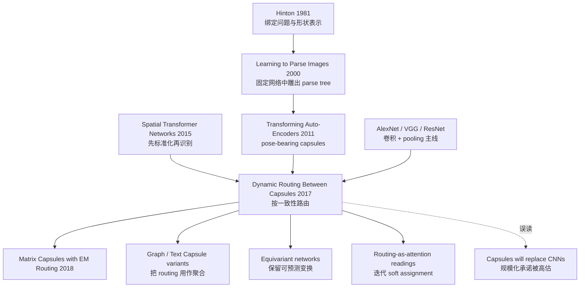

# Capsule Networks — 用动态路由替换池化的视觉旧梦

> **2017 年 10 月 26 日，Sara Sabour、Nicholas Frosst、Geoffrey Hinton 三位作者在 arXiv 上传 [1710.09829](https://arxiv.org/abs/1710.09829)。** 在 Transformer 刚把注意力推到序列建模中心的同一年，这篇论文从视觉另一端提出一个近乎反主流的问题：如果 CNN 的 max-pooling 把姿态信息扔掉了，能不能让神经元输出向量，把“有没有这个物体”写进长度，把“它以什么姿态出现”写进方向，再用动态路由把部件分配给整体？CapsNet 在 MNIST 上把单模型错误率做到 0.25%，在 80% 重叠的 MultiMNIST 上比卷积 baseline 明显更强，却也在 CIFAR-10 和 ImageNet 级真实视觉里暴露出算力、尺度和归纳偏置的代价。

## 一句话总结

Sabour、Frosst、Hinton 三位作者在 2017 年 NeurIPS 的这篇论文中，把 CNN 的标量特征和 max-pooling 换成“向量胶囊 + 按一致性动态路由”：每个低层 capsule 先投票 $\hat{\mathbf{u}}_{j|i}=\mathbf{W}_{ij}\mathbf{u}_i$，再用 $c_{ij}=\mathrm{softmax}(b_{ij})$ 聚合到高层 capsule，最后根据 $b_{ij}\leftarrow b_{ij}+\hat{\mathbf{u}}_{j|i}\cdot\mathbf{v}_j$ 迭代强化同意的 part-whole 关系。它在 MNIST 上以 8.2M 参数做到 $0.25\%_{\pm0.005}$ 错误率，明显优于 35.4M 参数 CNN baseline 的 0.39%，在 80% bbox 重叠的 MultiMNIST 上从 8.1% 降到 5.2%，但也证明“保留姿态的等变表示”比 [Transformer](2017_transformer.md) 的注意力更难规模化：CapsNet 赢在绑定与分割，输在真实图像的背景、效率和可并行性。

---

## 历史背景

### 2017 年视觉学界真正默认了什么

2017 年的主流视觉模型已经高度 CNN 化。AlexNet、VGG、Inception、ResNet 把 ImageNet 变成了深卷积网络的主战场；检测和分割也沿着 Faster R-CNN、Mask R-CNN 这条路线前进。卷积的强项非常清楚：局部连接、权重共享、平移等变，再加上 pooling 取得局部平移不变性。工程上这套东西太好用了，GPU 上的卷积核成熟，benchmark 也奖赏这种归纳偏置。

但 Hinton 长期不满意 pooling。他认为 pooling 不是“抽象”，而是把姿态信息直接扔掉：一个眼睛特征、一个鼻子特征、一个嘴巴特征都很强，并不意味着它们组成了一张正确的人脸。CNN 靠更深的层和更多数据慢慢学到组合关系，Capsule 的野心则是把组合关系显式放进表示里：低层部件不仅说“我出现了”，还说“我以这个姿态出现，因此我预测高层整体应该在那个姿态”。

### Hinton 这条线不是突然冒出来的

Capsule Networks 的历史根系比 2017 年更早。1981 年 Hinton 讨论过 parallel shape representation 和 binding problem；2000 年 Hinton、Ghahramani、Teh 在 *Learning to parse images* 中提出过“固定网络中雕出输入相关 parse tree”的图景；2011 年 Hinton、Krizhevsky、Wang 的 Transforming Auto-Encoders 已经把 capsule 作为“携带实例化参数的神经元组”提出，只是当时还缺一个真正可训练、可端到端用的父子分配机制。

这篇 2017 年论文补上的就是这个机制：**routing-by-agreement**。它把“部件应该归属哪个整体”的问题变成一个小型迭代优化过程，而不是像 max-pooling 一样让局部最大响应赢家通吃。换句话说，CapsNet 不是单纯换了一个 nonlinearity，而是在 CNN 中插入了一种软 parse-tree 构造过程。

### 为什么它会在 2017 年引发强烈反应

当时深度学习社区一边在视觉上被 ResNet 驱动，一边在 NLP 上刚看到 [Transformer](2017_transformer.md) 对 attention 的重写。Capsule 的动态路由看起来也像 attention：低层 capsule 对多个上层 capsule 分配权重，权重随当前输入迭代更新。但它又比普通 attention 更“几何”：agreement 是预测向量与父 capsule 输出的点积，目标是让多个 part 的 pose vote 在同一个 whole 上相遇。

这让它兼具两种气质。它有 Hinton 式的认知科学野心：视觉不是把一堆局部特征平均掉，而是解析部件、整体和姿态。它也有很硬的 benchmark 钩子：MNIST 0.25% 错误率、MultiMNIST 5.2% 错误率、affNIST 79% 迁移准确率。这些数字足够让人相信“这里可能有一条 CNN 之外的路线”。

### 当时的算力和数据环境

- **硬件**：GPU 卷积已经高度优化，但 capsule routing 需要大量小矩阵乘和迭代路由，硬件亲和性明显差。
- **数据**：MNIST、MultiMNIST、affNIST、smallNORB 都能凸显姿态和重叠物体问题；CIFAR-10 则暴露真实背景与纹理复杂性。
- **框架**：论文实现使用 TensorFlow 和默认 Adam，代码生态不像 CNN 那样成熟。
- **竞争范式**：ResNet 证明了“更深更稳”是可扩展路线；Spatial Transformer Networks 证明了“先标准化再识别”也是处理几何变换的路线；CapsNet 则押注“不要消除姿态，要保留姿态”。

这就是 Capsule Networks 的历史位置：它没有成为视觉的 Transformer，却把一个关键问题钉在墙上 —— 不变性不是免费午餐，模型把什么信息扔掉，迟早会在组合泛化、分割或视角变化里付账。

---

## 方法详解

### 整体框架

CapsNet 的整体结构故意很浅：两层卷积式特征提取，再接一个全连接式的 DigitCaps 层。真正的新东西不在深度，而在“每个单元输出什么”和“下层如何把信息送给上层”。

```
28x28 image
  ↓ Conv1: 256 filters, 9x9, stride 1, ReLU
  ↓ PrimaryCaps: 32 channels × 6 × 6 capsules, each capsule is 8D
  ↓ Dynamic Routing: lower capsule votes for every digit capsule
  ↓ DigitCaps: 10 capsules, each capsule is 16D
  ↓ Margin loss on vector length + reconstruction regularizer
```

| 层 | 输出 | capsule 维度 | 作用 |
|----|------|--------------|------|
| Conv1 | 20×20×256 scalar features | 1D scalar | 低级边缘/笔画特征 |
| PrimaryCaps | 32×6×6 capsule outputs | 8D | 把局部特征打包成 pose-like 向量 |
| DigitCaps | 10 digit capsules | 16D | 每个类别一个 capsule，长度表示类别存在概率 |
| Decoder | 3 层全连接网络 | 从 16D 重建图像 | 逼迫 DigitCaps 保留实例化细节 |

这里的关键不是“3 层网络赢了 MNIST”，而是它把 CNN 中被 pooling 抹掉的东西重新变成一等公民：位置、方向、宽度、局部笔画形态都被塞进向量方向；类别存在性则用向量长度表达。

### 关键设计

#### 设计 1：向量 capsule + squash 非线性 —— 用长度表示存在，用方向表示姿态

传统 CNN 神经元输出一个标量：大就是检测到了，小就是没有。Capsule 输出一个向量：**长度**接近 1 表示实体存在，**方向**携带实例化参数，例如姿态、宽度、偏斜、局部形状。

论文用 squash 函数约束长度，同时尽量保留方向：

$$
\mathbf{v}_j = \frac{\|\mathbf{s}_j\|^2}{1+\|\mathbf{s}_j\|^2}\frac{\mathbf{s}_j}{\|\mathbf{s}_j\|}
$$

短向量会被压到接近 0，长向量会被压到略小于 1。这比 sigmoid 更适合 capsule，因为它不是对每个维度独立压缩，而是把整根向量当作一个“实体状态”。

| 表示方式 | 输出 | 保存姿态吗 | 分类含义 | 代价 |
|----------|------|------------|----------|------|
| CNN 标量神经元 | 单个激活值 | 通常被 pooling 弱化 | 激活越大越像某特征 | 高效、硬件友好 |
| Max-pooling | 局部最大值 | 丢失局部精确位置 | 局部不变性 | 绑定关系模糊 |
| Spatial Transformer | 变换后的特征图 | 先做全局/局部标准化 | 让后续识别更容易 | 多目标变换较难 |
| Capsule 向量 | 向量长度 + 方向 | 显式保留 | 长度是存在概率 | 路由昂贵、实现复杂 |

设计动机很清楚：如果一个物体旋转了，理想表示不应该完全不变，而应该**等变**，也就是内部向量以可预测方式变化。Capsule 的反直觉点正是在这里：它不急着消灭姿态差异，而是保留差异，让上层通过变换矩阵理解 part-whole 几何关系。

#### 设计 2：预测向量 —— 低层部件先投票，再由高层整体解释

每个低层 capsule $i$ 不直接把自己的输出交给高层 capsule $j$，而是先用一组可学习矩阵预测“如果我属于你，你应该长什么样”：

$$
\mathbf{s}_j = \sum_i c_{ij}\hat{\mathbf{u}}_{j|i}, \qquad \hat{\mathbf{u}}_{j|i}=\mathbf{W}_{ij}\mathbf{u}_i
$$

$\mathbf{W}_{ij}$ 学的是 part-to-whole 的几何关系。比如一个“左上笔画” capsule 如果属于数字 7，它对 DigitCaps(7) 的 pose 预测应当与其他笔画预测一致；如果硬塞给 DigitCaps(3)，预测就会彼此冲突。

这个想法把分类从“哪个特征最大”改成“哪些部件共同支持同一个整体解释”。这也是论文中最有认知科学味道的部分：识别不是投票给 label，而是构造一个解释图。

#### 设计 3：动态路由 —— agreement 越高，耦合越强

动态路由的输入是所有预测向量，输出是每个上层 capsule 的向量。初始化时，每个低层 capsule 对所有可能父 capsule 一视同仁；随后迭代计算父 capsule、测量 agreement、更新路由 logits。

$$
c_{ij}=\frac{\exp(b_{ij})}{\sum_k\exp(b_{ik})},\qquad
\mathbf{s}_j=\sum_i c_{ij}\hat{\mathbf{u}}_{j|i},\qquad
b_{ij}\leftarrow b_{ij}+\hat{\mathbf{u}}_{j|i}\cdot\mathbf{v}_j
$$

| 变量 | 含义 | 输入相关吗 | 直觉 |
|------|------|------------|------|
| $b_{ij}$ | capsule $i$ 到父 capsule $j$ 的 routing logit | 迭代后相关 | “我更可能属于谁” |
| $c_{ij}$ | softmax 后的耦合系数 | 是 | 分配给每个父节点的权重 |
| $\hat{\mathbf{u}}_{j|i}$ | 低层对高层的预测向量 | 是 | part 对 whole 的 pose vote |
| $\hat{\mathbf{u}}_{j|i}\cdot\mathbf{v}_j$ | agreement | 是 | 预测和当前整体是否同向 |

路由伪代码如下：

```python
def dynamic_routing(votes, num_iterations=3):
    logits = zeros_like_parent_scores(votes)
    for _ in range(num_iterations):
        coupling = softmax(logits, axis="parents")
        total_input = weighted_sum(coupling, votes, axis="children")
        parent_output = squash(total_input)
        agreement = dot(votes, parent_output)
        logits = logits + agreement
    return parent_output
```

为什么 agreement 用点积？因为 capsule 向量的方向被设计成 pose-like 参数，预测向量和父输出越同向，说明“这个 part 对这个 whole 的解释”越一致。路由把这种一致性转成更大的 coupling，下次迭代这个 part 对该 whole 的贡献更强。

#### 设计 4：Margin loss + 重建正则 —— 分类长度，解释图像

因为类别概率由 DigitCaps 向量长度表示，论文不用普通 softmax 分类，而对每个类别 capsule 使用独立 margin loss：

$$
L_k = T_k\max(0,m^+ - \|\mathbf{v}_k\|)^2 + \lambda(1-T_k)\max(0,\|\mathbf{v}_k\|-m^-)^2
$$

其中 $m^+=0.9$、$m^-=0.1$、$\lambda=0.5$。目标类别 capsule 的长度应接近 1，非目标类别 capsule 的长度应低于 0.1。

重建正则是另一个关键细节。训练时只保留正确类别 capsule 的 16D 向量，把其他类别 mask 掉，再通过 3 层全连接 decoder 重建输入图像；重建损失乘以 0.0005，避免盖过分类 loss。这个设计不是为了生成漂亮图片，而是为了防止 DigitCaps 只学一个类别开关，逼它把笔画宽度、倾斜、局部形状等实例化参数编码进去。

### 损失函数 / 训练策略

| 项 | 设置 | 作用 |
|----|------|------|
| 主损失 | 对 10 个 DigitCaps 求 margin loss 总和 | 用向量长度做多标签式分类 |
| 重建损失 | 图像平方误差 × 0.0005 | 让 16D capsule 保存姿态与细节 |
| 路由次数 | 论文主实验用 3 次 | 在容量和过拟合之间折中 |
| 优化器 | TensorFlow 默认 Adam + 衰减学习率 | 工程上保持简单 |
| 数据增强 | MNIST 只做最多 2 像素平移 | 避免靠大规模 augmentation 赢 |
| 参数量 | CapsNet 8.2M；无重建 6.8M；CNN baseline 35.4M | Capsule 参数更少但计算模式更慢 |

方法的美感在于它把“识别”改写为“解释”。方法的脆弱也在这里：一旦场景里有背景、纹理、多个杂物和尺度变化，要求模型解释所有像素就会变成负担。

---

## 失败案例

### 当时输给 CapsNet 的 baseline

CapsNet 的胜利不是在 ImageNet 这种大规模自然图像上，而是在更能暴露 part-whole binding 的小型任务上。它打败的 baseline 可以分成三类：卷积 baseline、无路由/弱路由版本、以及更早的 sequential attention 模型。

| baseline | 它代表什么 | 输在哪里 | 关键数字 |
|----------|------------|----------|----------|
| 35.4M 参数 CNN | 强化版传统卷积分类器 | pooling 不显式保存姿态和绑定关系 | MNIST 0.39% vs CapsNet 0.25% |
| MultiMNIST CNN | 宽卷积 + pooling + sigmoid 多标签分类 | 两个高度重叠数字难分配像素证据 | 8.1% vs CapsNet 5.2% |
| 1 次 routing + 无重建 | routing 几乎退化为一次 soft assignment | capsule 向量未被逼迫保存姿态 | MNIST 0.34%，MultiMNIST 未报告 |
| Spatial Transformer 思路 | 先把输入标准化再识别 | 多个物体有不同姿态时难一次性标准化 | 论文强调 capsule 可同时处理多个变换 |
| Ba et al. 2014 sequential attention | 逐步看局部区域的多物体识别 | 任务重叠程度低得多 | <4% bbox 重叠上 5.0%，CapsNet 在 80% 重叠上接近该水平 |

这里最重要的失败案例是 MultiMNIST。两个数字平均 bbox 重叠 80%，CNN 的 pooling 机制很容易把局部证据混在一起；CapsNet 通过两个最活跃的 DigitCaps 分别重建两个数字，说明它确实学到了一种粗粒度的 explaining away。

### 实验关键数据

论文的实验数据既支持 Capsule 的核心直觉，也预示它的边界。MNIST 与 MultiMNIST 是强项；CIFAR-10 则是警告。

| 任务 / 设置 | 模型 | routing | reconstruction | 结果 |
|-------------|------|---------|----------------|------|
| MNIST | CNN baseline | - | - | 0.39% error |
| MNIST | CapsNet | 1 | no | 0.34% ± 0.032 error |
| MNIST | CapsNet | 1 | yes | 0.29% ± 0.011 error |
| MNIST | CapsNet | 3 | no | 0.35% ± 0.036 error |
| MNIST | CapsNet | 3 | yes | **0.25% ± 0.005 error** |
| MultiMNIST | CNN baseline | - | - | 8.1% error |
| MultiMNIST | CapsNet | 3 | yes | **5.2% error** |
| affNIST transfer | CapsNet vs CNN | 3 | yes | 79% vs 66% accuracy |

| 其他数据集 | 设置 | 结果 |
|------------|------|------|
| CIFAR-10 | 7 个模型 ensemble，24×24 patch，3 次 routing | 10.6% error |
| smallNORB | MNIST 同款架构，48×48 resize，32×32 crop | 2.7% error |
| SVHN | 更小网络，小训练集 73,257 张 | 4.3% error |

### 消融告诉我们什么

Table 1 的细节比“0.25%”这个 headline 更有信息量。1 次 routing 加重建已经能把 MNIST 从 0.34% 推到 0.29%；3 次 routing 如果没有重建反而是 0.35%，不比 1 次 routing 更好；3 次 routing + 重建才到 0.25%。这说明动态路由不是单独起作用，它需要 reconstruction regularizer 把 capsule 向量往实例化参数上推。

| 观察 | 直接解释 | 更深层 lesson |
|------|----------|---------------|
| 重建正则提高 MNIST | 16D DigitCaps 被迫编码笔画细节 | capsule 需要表示学习约束，不只是 routing 算法 |
| MultiMNIST 降到 5.2% | routing 能在重叠物体间分配证据 | explaining away 比 pooling 更适合绑定问题 |
| affNIST 79% vs 66% | capsule 对未见 affine 变换更稳 | 等变表示有真实泛化收益 |
| CIFAR-10 10.6% | 背景复杂时“解释所有东西”很难 | capsule 的 generative bias 在自然图像里成了负担 |
| 3 次 routing 可能过拟合 | 更多迭代增加容量 | iterative inference 不是免费算力 |

### 为什么这些 baseline 后来没有被彻底替代

CapsNet 暴露了 CNN 的一个真实弱点，但没有提供一条可扩展替代路线。第一，routing 的计算形态不适合当时也不适合今天的主流加速器：大量小矩阵乘、softmax 和迭代更新，远不如大卷积或大矩阵乘稳定高效。第二，Capsule 的归纳偏置太强：它假设每个局部位置每类实体最多一个实例，并希望模型解释所有像素；这在干净数字上很合理，在自然图像的背景和纹理里会变重。第三，后来的大规模视觉模型发现了一条更粗暴但有效的路：用更多数据、更大模型和更通用的 attention / convolution 混合结构吸收几何变化。

因此，CapsNet 的失败不是“想法错了”，而是“系统不够可扩展”。它证明了 pose-aware representation 和 routing-by-agreement 有价值，却没有证明这套机制能像 ResNet 或 Transformer 一样吃下规模红利。

---

## 思想史脉络



### 前世：从绑定问题到 Transforming Auto-Encoders

Capsule 的前世不是 CNN，而是 Hinton 对 binding problem 的长期执念。标量神经元很擅长说“这里有某个模式”，但很难自然表达“这个眼睛、这个鼻子、这个嘴巴属于同一张脸，并且共享同一个姿态解释”。一旦把局部证据做 pooling，模型获得不变性，也丢掉了构造整体的几何线索。

2000 年的 *Learning to parse images* 给出一个很重要的隐喻：parse tree 不一定要动态分配新内存，也可以从固定网络里“雕出来”。2011 年 Transforming Auto-Encoders 则把 capsule 作为 pose-bearing representation 具体化：一个对象不仅有类别，还有变换参数。2017 年论文的贡献，是把这条思想链推进到一个完整的判别式网络里，让 routing 负责把低层 capsule 分配给高层 capsule。

### 今生：它留下的几条支流

CapsNet 没有成为视觉默认架构，但它留下了几条很清楚的支流。

| 后继方向 | 代表工作 / 现象 | 继承了什么 | 改掉了什么 |
|----------|-----------------|------------|------------|
| Matrix Capsules | EM Routing 2018 | pose 表示和 part-whole agreement | 用矩阵 pose + EM 风格更新替代向量点积 |
| 图/文本 Capsule | Graph Capsule、TextCaps 等 | routing 作为动态聚合 | 不再坚持视觉几何解释 |
| 等变网络 | Group equivariant CNN、SE(3) Transformer | 表示应随变换可预测变化 | 用群论/几何约束替代 routing |
| Attention 解读 | routing-as-attention | soft assignment 与输入相关权重 | 放弃迭代 part-whole parse tree |
| 视觉基础模型 | ViT、ConvNeXt、SAM 等 | 组合关系重要 | 用规模、数据和 attention 吸收几何复杂性 |

最有生命力的不是具体的 routing algorithm，而是两个更抽象的思想：第一，**等变比不变更细腻**；第二，**聚合权重应该由当前输入中的一致性决定**。前者进入几何深度学习，后者被 attention、routing、MoE gating 以不同形式反复使用。

### 误读：把它当成 CNN 终结者

Capsule Networks 最常见的误读，是把它看成“下一代 CNN 替代品”。这在 2017 年并不奇怪：Hinton 的名字、MNIST 0.25%、MultiMNIST 的漂亮重建图，很容易让人期待一次范式替换。但论文自己其实已经写得很谨慎：Capsule 研究“还像 2000 年前后的 RNN for speech”，有表示上的理由，却还需要许多小洞察才能击败高度工程化的成熟技术。

更准确的历史定位应该是：CapsNet 是一篇把问题问得极准、把第一版系统做得足够漂亮、但没有解决规模化的论文。它没有消灭 pooling，也没有让 CNN 退场；它让后来的人更认真地问：模型获得不变性时到底牺牲了什么？如果姿态、部件归属和对象解释都重要，我们该用显式 routing、几何等变，还是用大规模 attention 让模型自己学？

---

## 当代视角

### 站不住的假设

从 2026 年回看，Capsule Networks 最有价值的部分是问题意识，最站不住的部分是系统假设。

| 当年假设 | 为什么合理 | 今天怎么看 | 后果 |
|----------|------------|------------|------|
| Pooling 是 CNN 的根本缺陷 | pooling 会丢姿态和绑定信息 | 缺陷真实，但可由 attention、数据增强、尺度和等变设计部分补上 | 不足以单独推翻 CNN/ViT 主线 |
| 动态路由可以规模化 | routing 是可微、端到端、解释性强的 soft assignment | 迭代小矩阵乘硬件效率差，深层堆叠难调 | 没吃到大模型时代红利 |
| 解释所有像素有助于识别 | MNIST/MultiMNIST 中背景干净，解释约束有效 | 自然图像背景复杂，解释所有内容反而拖累分类 | CIFAR-10 表现不够有说服力 |
| 显式 part-whole 结构会自然胜出 | 人类视觉确实有组合结构 | benchmark 更奖赏可扩展训练和大数据吸收 | 思想漂亮，但工程不够硬 |

最关键的修正是：**不变性确实有代价，但显式 routing 不是唯一补偿方式**。现代视觉模型可以通过 self-attention、patch token、强数据增强、对比学习、3D/SE(3) 等变约束、甚至 diffusion 式重建目标来保留或恢复一部分结构信息。Capsule 提出的痛点还在，处方不一定是 2017 年这版 CapsNet。

### 如果今天重写

如果今天重写 Dynamic Routing Between Capsules，我不会直接复刻 2017 年架构，而会保留三个原则：向量/矩阵表示、agreement-based assignment、可解释的 part-whole routing。系统层面则应大幅换代。

| 2017 版本 | 2026 年可能写法 | 原因 |
|-----------|----------------|------|
| 低层 capsule 对所有父 capsule 做小矩阵投票 | 用 batched tensor contraction 或 attention kernel 实现 routing | 让硬件看到大矩阵，而不是碎片化小乘法 |
| 固定 3 次 routing | 学习式 early-exit 或单步 amortized routing | 避免每层固定迭代成本 |
| MNIST/MultiMNIST 作为主证据 | ShapeNet、CLEVR、multi-object video、robotics manipulation | 更能测试 3D 姿态、遮挡和组合泛化 |
| 只靠 16D capsule 重建图像 | 与 masked modeling / diffusion decoder 结合 | 更强的表征压力和更稳定训练 |

真正值得保留的是“agreement”这个局部推理概念。今天的 MoE router、slot attention、object-centric learning、test-time refinement 都在不同程度上重访同一个问题：输入里的证据应该动态分配给哪个解释单元？CapsNet 的语言是 part-whole，现代系统的语言可能是 token-slot、expert、object query 或 latent variable。

### 局限 / 相关工作 / 资源

CapsNet 的局限可以分为三层。第一是工程层：routing 慢，张量形状复杂，不像卷积和 attention 那样自然适配加速器。第二是统计层：在小数据、干净几何任务上很强，在自然图像上需要处理背景、纹理、遮挡和长尾变化。第三是研究层：capsule 的解释性很诱人，但很难形成统一、稳定、可复现的训练 recipe。

| 类别 | 推荐读法 | 为什么相关 |
|------|----------|------------|
| 原始论文 | [Dynamic Routing Between Capsules](https://arxiv.org/abs/1710.09829) | capsule 向量、routing、margin loss 的源头 |
| 前序思想 | Transforming Auto-Encoders (2011) | pose-bearing capsule 的早期版本 |
| 直接后继 | Matrix Capsules with EM Routing (2018) | 试图用矩阵 pose 和 EM routing 修补第一版 |
| 对照路线 | Spatial Transformer Networks (2015) | 另一种处理几何变换的思路：标准化而非保留 |
| 现代相邻 | Slot Attention / object-centric learning | 动态分配证据给对象 slot 的现代路线 |

### 最后的历史判断

Capsule Networks 是一篇“没有赢下主线，但不该被忘掉”的论文。它的 benchmark 生命周期不长，后续路线也没有形成 ResNet、Transformer 那样的规模化飞轮；可它抓住了深度视觉里的一个根问题：识别系统不能只问“有没有特征”，还要问“这些特征如何组成一个对象”。

从这个意义上，它更像一枚思想楔子。它把 pooling、不变性、姿态、绑定、解释之间的张力暴露出来，让后来的研究者无法假装这些问题不存在。CapsNet 不是视觉模型的未来，但它是理解视觉模型未来为什么难的一把钥匙。


---

> 🌐 [English version](/en/era3_attention/2017_capsule_networks/) · 📚 awesome-papers project · CC-BY-NC