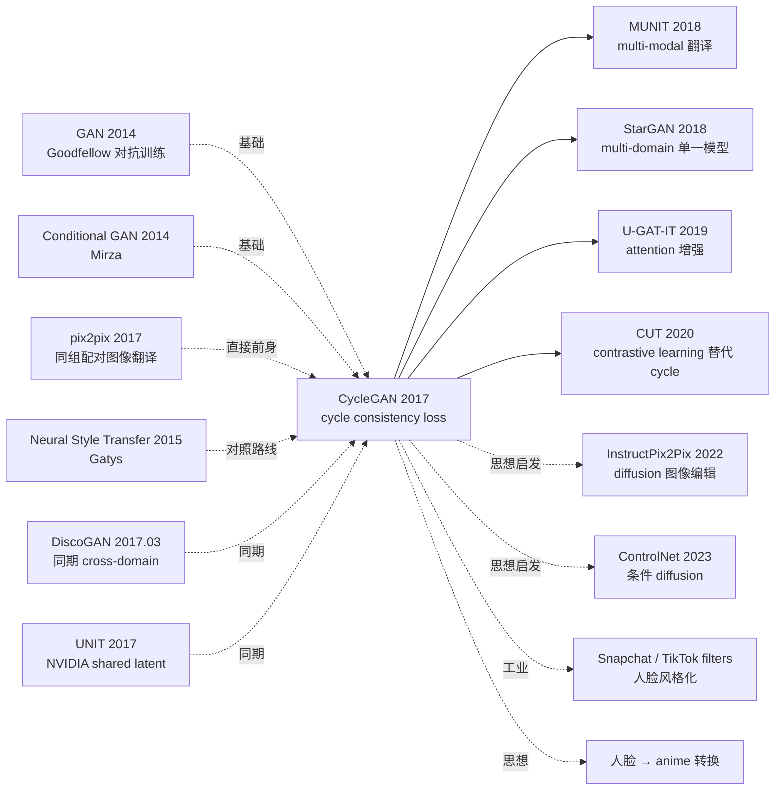

# CycleGAN — 用循环一致性损失打开无配对图像翻译大门

> **2017 年 3 月 30 日，UC Berkeley BAIR 的 Zhu、Park、Isola、Efros 在 arXiv 发布 [CycleGAN (1703.10593)](https://arxiv.org/abs/1703.10593)，ICCV 2017 接收。**
> 这是 pix2pix（同组 4 个月前的工作）的根本性升级 —— pix2pix 需要**配对数据**（input image / target image 一对一），而 CycleGAN 引入 **cycle consistency loss** 解决了「现实中绝大多数 domain pair 无配对」的问题。
> CycleGAN 让"horse ↔ zebra"、"photo ↔ Monet/Van Gogh/Cezanne"、"summer ↔ winter Yosemite"、"day ↔ night" 等无监督图像翻译成为可能，被引数 ~2.5 万次，是 GAN 应用领域被引最多的论文之一，**社交媒体上"人脸变 anime"等爆款应用全部基于 CycleGAN 思想**。

## 一句话总结

CycleGAN 用 **两个生成器 G:X→Y / F:Y→X + 两个判别器 + cycle consistency loss** $\|F(G(x))-x\|_1$ 强制保持「翻译再翻译回来等于原图」的约束，让模型在**无配对数据**下学到 X 与 Y 两个图像域之间的双向翻译，开启了 unpaired image-to-image translation 整个研究方向。

---

## 历史背景

### 2017 年的图像翻译学界在卡什么

2017 年初，UC Berkeley 同组的 Isola 等刚发布 pix2pix（CVPR 2017），用 conditional GAN 把图像翻译做到工程级质量（edge → photo, label → cityscape, sketch → photo）。但 pix2pix 有一个**致命局限**：

> **必须有配对数据 (input image, target image)**。
> 但现实中大多数有趣的图像翻译都是 **unpaired** —— 没人能拍同一匹马一次为马、一次为斑马；没人能拍同一片莫奈风景一次为油画、一次为照片；没人能拍同一片 Yosemite 一次夏天、一次冬天。

学界明显的开放问题：**「能否在无配对数据下做图像翻译？」** 同期还有 DiscoGAN (Kim, ICML 2017) / DualGAN / UNIT 等多篇并行工作探索这个问题。

### 直接逼出 CycleGAN 的 3 篇前序

- **Goodfellow et al., 2014 (GAN)** [NeurIPS]：对抗训练范式
- **Isola, Zhu, Zhou, Efros, 2017 (pix2pix)** [CVPR]：作者同组，conditional GAN 配对图像翻译，CycleGAN 是无配对版本
- **Kim et al., 2017 (DiscoGAN)** [ICML]：同期 cross-domain 翻译，类似 cycle 思想但应用更窄

### 作者团队当时在做什么

4 位作者全部来自 UC Berkeley BAIR。Jun-Yan Zhu 是核心一作（PhD，后任 CMU 教授）；Taesung Park 是 PhD 学生；Phillip Isola 是 pix2pix 一作（后任 MIT 教授）；Alexei Efros 是 BAIR 视觉教授（"Unreasonable Effectiveness of Data" 名家）。**Efros lab 当时押注「data-driven image synthesis」**，CycleGAN 是这条线的代表作之一。

### 工业界 / 算力 / 数据

- **GPU**：单 Titan X Pascal，每个 task 训 2-3 天
- **数据**：horse↔zebra (~1k 图 each)、Monet/Van Gogh/Cezanne/Ukiyo-e ↔ photo (~1k 各 domain)、summer↔winter Yosemite (~2k each, Flickr 收集)、CMP Facade、Cityscapes
- **框架**：作者代码 [github/junyanz/pytorch-CycleGAN-and-pix2pix](https://github.com/junyanz/pytorch-CycleGAN-and-pix2pix) star 23k+，至今最广泛使用的 GAN 实现之一
- **行业**：deepfake (2017 末) 即将引爆，CycleGAN + StyleGAN 是 2018 年图像生成爆款的两大基础

---

## 方法详解

### 整体框架

```
Domain X (e.g., horses)        Domain Y (e.g., zebras)
       |                                 |
       v                                 v
   ┌─────────┐                     ┌─────────┐
x ─→│   G    │─→ G(x)   y ─→│   F    │─→ F(y)
   └─────────┘                     └─────────┘
       |                                 |
   D_Y(G(x)) ↔ D_Y(y)              D_X(F(y)) ↔ D_X(x)

Cycle consistency:
   x → G → G(x) → F → F(G(x)) ≈ x   (forward cycle)
   y → F → F(y) → G → G(F(y)) ≈ y   (backward cycle)
```

| 配置 | CycleGAN |
|------|---------|
| 生成器 G, F | ResNet-9 (256×256) / ResNet-6 (128×128) |
| 判别器 D_X, D_Y | PatchGAN (70×70 receptive field) |
| 输入分辨率 | 256×256 |
| Loss 权重 | $\lambda_{cyc} = 10$ |
| Batch | 1 (instance norm 友好) |
| Epochs | 200 |

### 关键设计

#### 设计 1：Cycle Consistency Loss —— 无配对学习的关键约束

**功能**：在没有 paired data 的情况下，提供一个强约束告诉模型"翻译应该保留输入信息"。

**核心公式**：

$$
\mathcal{L}_{\text{cyc}}(G, F) = \mathbb{E}_{x \sim p_X}[\|F(G(x)) - x\|_1] + \mathbb{E}_{y \sim p_Y}[\|G(F(y)) - y\|_1]
$$

用 **L1** 而非 L2 是因为 L1 对像素级颜色 / 位置变化更鲁棒（pix2pix 的经验）。

**总损失**：

$$
\mathcal{L}(G, F, D_X, D_Y) = \mathcal{L}_{\text{GAN}}(G, D_Y) + \mathcal{L}_{\text{GAN}}(F, D_X) + \lambda \mathcal{L}_{\text{cyc}}(G, F)
$$

其中 $\lambda = 10$，GAN loss 用 LSGAN 形式（least squares）而非原始 BCE：

$$
\mathcal{L}_{\text{GAN}}(G, D_Y) = \mathbb{E}_y[(D_Y(y) - 1)^2] + \mathbb{E}_x[D_Y(G(x))^2]
$$

**为什么 cycle consistency 有效？**

理论上 G 可以把 X 中所有 horse 都映射到 Y 中**同一个** zebra（mode collapse + 满足 GAN loss）。但 cycle 约束要求 F(G(x)) = x，**强制 G 必须保留区分不同 x 的信息**（否则 F 无法重建）。这相当于 "信息瓶颈" + "可逆性" 的隐式约束。

#### 设计 2：双生成器 + 双判别器 —— 双向翻译

**功能**：与 pix2pix 单向不同，CycleGAN 同时学双向翻译 G:X→Y 和 F:Y→X。

**架构选择**：

- **Generator**：ResNet-based，输入图像经 down-sample × 2 → 6/9 个 ResBlock → up-sample × 2 → 输出图像。Instance Normalization（不是 BatchNorm，因为 batch=1）
- **Discriminator**：**PatchGAN**（70×70 patch），输出 N×N 网格，每个 cell 判断对应 patch 是否真。比 full-image discriminator 训练更稳定 + 关注 local texture

**对比 pix2pix**：

| 项 | pix2pix | CycleGAN |
|----|---------|----------|
| 数据 | 配对 (x, y) | 无配对 X, Y |
| Generator | 单一 G:X→Y | **双 G:X→Y, F:Y→X** |
| Discriminator | 单一 D_Y | **双 D_X, D_Y** |
| 关键 loss | L1 paired | **Cycle L1** |
| 训练数据需求 | ~数千 paired | ~1k unpaired each domain |

#### 设计 3：Identity Loss + 历史缓冲 —— 训练稳定性 trick

**Identity Loss**：当 $y$ 已经在 $Y$ 域时，$G(y)$ 应该等于 $y$（不应改变已经在目标域的图像）：

$$
\mathcal{L}_{\text{idt}}(G, F) = \mathbb{E}_{y \sim p_Y}[\|G(y) - y\|_1] + \mathbb{E}_{x \sim p_X}[\|F(x) - x\|_1]
$$

权重 0.5，主要用于 painting-to-photo 任务（防止颜色突变）。

**历史 Image Buffer**：discriminator 训练时不只用最新 batch 的生成图，而是从**前 50 个生成图**中随机采样。这缓解 G 和 D 振荡，是 SimGAN (Apple 2017) 提出的 trick。

**伪代码**：

```python
def train_cyclegan_step(G, F, D_X, D_Y, x_real, y_real, lambda_cyc=10, lambda_idt=5):
    # Forward cycle
    y_fake = G(x_real)         # X → Y
    x_recon = F(y_fake)        # Y → X (back)
    # Backward cycle
    x_fake = F(y_real)         # Y → X
    y_recon = G(x_fake)        # X → Y (back)

    # Generator loss
    loss_G_GAN = lsgan_loss(D_Y(y_fake), 1) + lsgan_loss(D_X(x_fake), 1)
    loss_cyc = l1(x_recon, x_real) + l1(y_recon, y_real)
    loss_idt = l1(G(y_real), y_real) + l1(F(x_real), x_real)
    loss_G = loss_G_GAN + lambda_cyc * loss_cyc + lambda_idt * loss_idt

    # Update G, F together
    update(G, F, loss_G)

    # Discriminator loss (use historical buffer)
    y_fake_hist = image_buffer.sample(y_fake)
    x_fake_hist = image_buffer.sample(x_fake)
    loss_D_Y = lsgan_loss(D_Y(y_real), 1) + lsgan_loss(D_Y(y_fake_hist.detach()), 0)
    loss_D_X = lsgan_loss(D_X(x_real), 1) + lsgan_loss(D_X(x_fake_hist.detach()), 0)
    update(D_X, D_Y, (loss_D_X + loss_D_Y) / 2)
```

#### 设计 4：PatchGAN Discriminator —— 训练稳定的关键

**功能**：判别器不输出 1 个全图分数，而输出 N×N 的 patch 分数矩阵，每个 cell 判别对应感受野内的 patch 真假。

**优势**：
- **训练稳定**：local texture 判别比 global 判别更容易学
- **细节质量高**：强制 G 在所有 local patch 上都生成真实纹理
- **参数少**：D 是 fully-convolutional，参数量小
- **对图像分辨率不敏感**：更换分辨率不需重训 D

CycleGAN 用 70×70 patch（输入 256×256，输出 30×30 grid），效果远胜 full-image discriminator。

### 损失函数 / 训练策略

| 项 | 配置 |
|----|------|
| Total Loss | $\mathcal{L}_{GAN} + 10 \mathcal{L}_{cyc} + 5 \mathcal{L}_{idt}$ |
| GAN form | LSGAN (least squares) |
| Optimizer | Adam ($\beta_1=0.5, \beta_2=0.999$) |
| LR | 2e-4，前 100 epoch 不变，后 100 epoch 线性衰减到 0 |
| Batch | 1 |
| Norm | Instance Normalization |
| Image buffer | 50 |
| Data augmentation | random crop, horizontal flip |

---

## 失败案例

### 当时输给 CycleGAN 的对手

- **DiscoGAN** (Kim 2017)：同期但 64×64 分辨率限制；CycleGAN 256×256 视觉质量胜
- **DualGAN** (Yi 2017)：cycle-style 但 GAN loss 不稳定；CycleGAN LSGAN + identity 更稳
- **UNIT** (Liu 2017, NVIDIA)：用 shared latent space 但需要相似 domain；CycleGAN 通用性更强
- **Neural style transfer** (Gatys 2015)：需要每对图像优化几小时；CycleGAN 训练后秒级推理

### 论文承认的失败 / 局限

- **形状不能改变**：cat → dog 在 cat 形状上画狗纹理（不能改变身体结构）
- **背景纠缠**：horse → zebra 经常把背景也变（草地变得"斑马化"）
- **极端 domain gap 失败**：sketch → photo 缺细节信息，无法生成
- **Mode collapse 风险**：在某些 domain pair 上仍可能 mode collapse
- **不能做 one-to-many**：一张 horse 只能产生一张 zebra（确定性）
- **远场景物体缺失**：地平线远处物体经常被忽略

### 「反 baseline」教训

- **「无配对数据无法做图像翻译」**（pre-CycleGAN 共识）：CycleGAN 直接证伪
- **「需要 shared latent space」**（UNIT 路线）：CycleGAN 用 cycle 约束完胜
- **「style transfer 需要每对图像优化」**（Gatys 路线）：CycleGAN 训练后通用
- **「BatchGAN 需要 batch>1」**：CycleGAN 用 instance norm + batch=1 work

---

## 实验关键数据

### 主实验（用户研究 + AMT 评分）

| 任务 | AMT 真实率 |
|------|-----------|
| Photo → Map (CycleGAN) | 26.8 ± 2.8% |
| Photo → Map (pix2pix paired) | 32.0 ± 2.6% |
| Map → Photo (CycleGAN) | 23.2 ± 3.4% |
| Map → Photo (pix2pix paired) | 32.6 ± 3.0% |

CycleGAN 接近 pix2pix paired 性能，但**无需配对数据**。

### Cityscapes labels↔photo（FCN-score）

| Method | per-pixel acc | per-class acc | mean IoU |
|--------|---------------|---------------|----------|
| CoGAN | 0.45 | 0.11 | 0.08 |
| BiGAN | 0.41 | 0.13 | 0.07 |
| SimGAN | 0.47 | 0.11 | 0.07 |
| Feature loss + GAN | 0.50 | 0.10 | 0.06 |
| **CycleGAN** | **0.58** | **0.22** | **0.16** |
| pix2pix (paired oracle) | 0.71 | 0.25 | 0.18 |

### 消融

| 配置 | per-pixel acc | mean IoU |
|------|---------------|---------|
| Cycle only (无 GAN) | 0.22 | 0.05 |
| GAN only (无 cycle) | 0.49 | 0.10 |
| GAN + forward cycle only | 0.55 | 0.13 |
| GAN + backward cycle only | 0.53 | 0.11 |
| **GAN + 双向 cycle (CycleGAN)** | **0.58** | **0.16** |

### 关键发现

- **Cycle 是关键**：去掉 cycle 性能掉一半
- **GAN + cycle 联合**：缺一不可
- **双向比单向好**：forward + backward cycle > 仅一方向
- **接近但不如 paired**：CycleGAN 在有 paired oracle 时仍输 ~10 点
- **跨域通用**：horse↔zebra / Monet↔photo / summer↔winter 全部 work

---

## 思想史脉络



### 前世
- **GAN (2014)**：对抗训练范式
- **Conditional GAN (2014)**：条件生成
- **pix2pix (2017)**：作者同组配对版本
- **Neural Style Transfer (2015)**：风格迁移对照路线
- **DiscoGAN / DualGAN / UNIT (2017)**：同期并行 cross-domain 工作

### 今生
- **MUNIT (2018, NVIDIA)**：CycleGAN + multi-modal（一对多）
- **StarGAN (2018)**：单一模型支持 multi-domain（不再每对 domain 训一对 G/F）
- **U-GAT-IT (2019)**：加 attention 增强 face → anime
- **CUT (2020)**：用 contrastive learning 替代 cycle，不需要双向 G/F
- **2022+ diffusion 时代**：InstructPix2Pix / ControlNet / SDEdit 在 diffusion 框架下做图像编辑，性能远胜 CycleGAN
- **工业**：Snapchat / TikTok 滤镜、人脸 → anime 应用、医学图像跨模态合成

### 误读
- **「Cycle consistency 是新 idea」**：实际上 cycle / dual learning / autoencoder 思想 1990s 就有，CycleGAN 是 GAN 框架下的工程实现
- **「CycleGAN 适合所有 domain pair」**：形状变化大 (cat→dog 身体形状) 失败
- **「CycleGAN 完全替代 pix2pix」**：有 paired data 时 pix2pix 仍胜

---

## 当代视角（2026 年回看 2017）

### 站不住的假设

- **「GAN 是图像翻译的最佳框架」**：2022+ diffusion (InstructPix2Pix / ControlNet) 完胜 GAN
- **「Cycle consistency 是必需的」**：CUT (2020) 证明 contrastive learning 可替代
- **「需要双向 G/F」**：StarGAN (2018) 证明单一 G 加 condition 可做 multi-domain
- **「无配对一定弱于配对」**：在某些任务上 (style transfer) 无配对的 CycleGAN 已足够好
- **「256×256 分辨率合理」**：今天主流 1024+

### 时代证明的关键 vs 冗余

- **关键**：cycle consistency 思想（在 GAN 之外仍被广泛使用）、PatchGAN discriminator（仍是 GAN 标配）、双向训练对称性
- **冗余 / 误导**：固定 $\lambda=10$（应自适应）、Identity loss（许多任务不需要）、Image buffer（diffusion 时代不再需要）

### 作者当时没想到的副作用

1. **开启 unpaired image translation 整个研究方向**：DiscoGAN / DualGAN / UNIT / MUNIT / StarGAN / CUT 等几十篇后续工作
2. **直接催生工业风格化应用**：Snapchat/TikTok 滤镜、Prisma、人脸 → anime 等
3. **医学影像跨模态合成**：CT ↔ MRI、PET ↔ MRI 等无配对学习
4. **Domain adaptation 标配 baseline**：CycleGAN-based domain adaptation 在自动驾驶 / 机器人广泛使用
5. **Diffusion 时代仍有思想遗产**：cycle consistency 在 ControlNet / Pix2Pix-Zero 中以变形形式存在

### 如果今天重写 CycleGAN

- 改用 diffusion model（per InstructPix2Pix）
- 加 CLIP 文本条件
- 用 contrastive loss 替代 cycle（per CUT）
- 用 StarGAN-style 单一 G + condition
- 分辨率 1024+

但**「无配对数据 + 通过约束保留信息」核心思想至今仍是 unsupervised translation 的基本原则**。

---

## 局限与展望

### 作者承认
- 形状不能改变（cat→dog 失败）
- 背景纠缠
- 不能 one-to-many 翻译
- 远场景物体丢失

### 自己发现
- 256×256 分辨率受限
- batch=1 训练慢
- $\lambda=10$ 需手调
- 训练 G 和 D 平衡敏感

### 改进方向（已被后续工作证实）
- StarGAN 2018：multi-domain 单 G
- MUNIT 2018：multi-modal 翻译
- CUT 2020：contrastive 替代 cycle
- StyleGAN-NADA / DragGAN 2021-2023：CLIP-guided
- InstructPix2Pix 2022：diffusion 图像编辑

---

## 相关工作与启发

- **vs pix2pix (跨配对)**：pix2pix 配对，CycleGAN 无配对。**教训：约束设计可以替代标注数据**
- **vs Neural Style Transfer (跨范式)**：NST 每对图像优化 hours；CycleGAN 训练后秒级推理 + 通用。**教训：训练-推理分离 >> 测试时优化**
- **vs DiscoGAN (跨同期)**：DiscoGAN 早 1 个月但 64×64；CycleGAN 256×256 + LSGAN + identity 更稳。**教训：工程细节决定成败**
- **vs UNIT (跨假设)**：UNIT 假设 shared latent space，CycleGAN 不假设。**教训：少假设 + 通用约束 > 强假设**
- **vs Diffusion (跨范式)**：diffusion 用迭代去噪 + 文本条件；CycleGAN 一次前向。**教训：generation 范式持续演化**

---

## 相关资源

- 📄 [arXiv 1703.10593](https://arxiv.org/abs/1703.10593) · [ICCV 2017 版本](https://openaccess.thecvf.com/content_iccv_2017/html/Zhu_Unpaired_Image-To-Image_Translation_ICCV_2017_paper.html)
- 💻 [作者 PyTorch 实现](https://github.com/junyanz/pytorch-CycleGAN-and-pix2pix) (star 23k+) · [TF 复现](https://github.com/vanhuyz/CycleGAN-TensorFlow)
- 📚 后续必读：[StarGAN (2018)](https://arxiv.org/abs/1711.09020)、[MUNIT (2018)](https://arxiv.org/abs/1804.04732)、[CUT (2020)](https://arxiv.org/abs/2007.15651)、[InstructPix2Pix (2022)](https://arxiv.org/abs/2211.09800)
- 🎬 [Two Minute Papers: CycleGAN](https://www.youtube.com/watch?v=AxrKVfjSBiA) · [Jun-Yan Zhu 个人主页](https://www.cs.cmu.edu/~junyanz/)

---

> 🌐 [English version](/en/era3_attention/2017_cyclegan/) · 📚 awesome-papers project · CC-BY-NC
