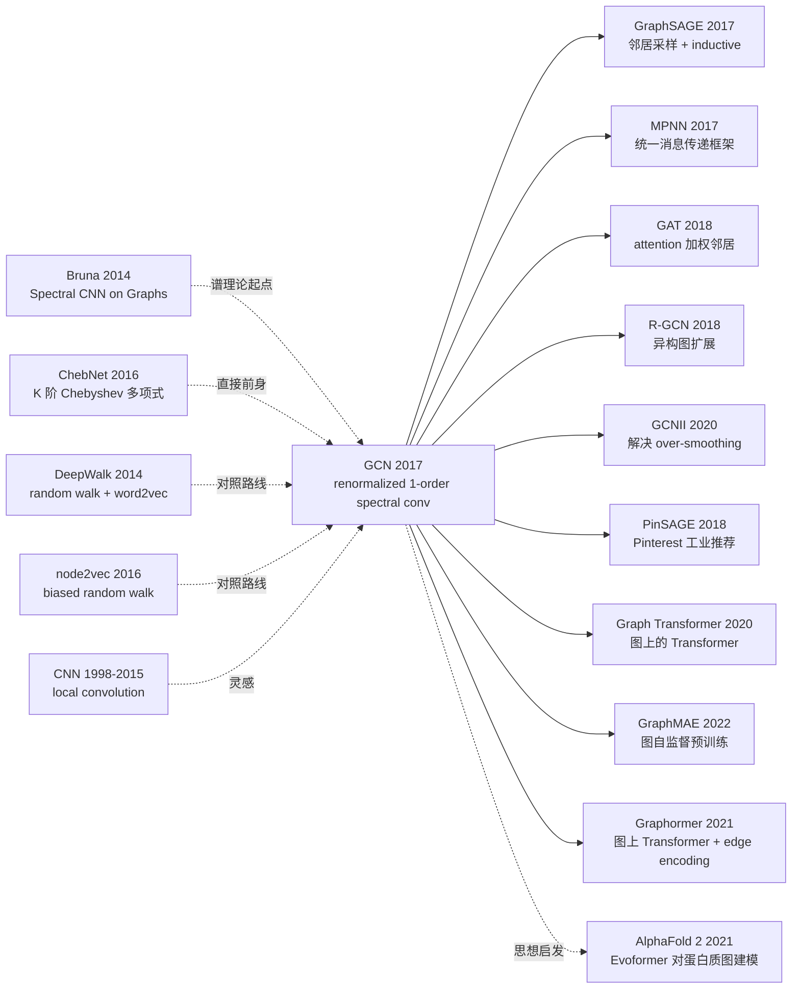

# GCN — 半监督节点分类与图神经网络的奠基

> **2016 年 9 月 9 日，Kipf & Welling 在 arXiv 发布 [GCN (1609.02907)](https://arxiv.org/abs/1609.02907)，2017 年 ICLR 接收。**
> 这是一篇只有 14 页的论文，把谱图卷积理论从 Bruna 2014 的复杂频域计算简化为 **一个 1 阶 Chebyshev 近似**，最终归结为一个朴素的传播公式 $H^{(l+1)} = \sigma(\hat{D}^{-1/2}\hat{A}\hat{D}^{-1/2}H^{(l)}W^{(l)})$。
> 在 Cora / CiteSeer / Pubmed 三大引用网络数据集上，GCN 把半监督节点分类准确率从之前的 70-75% 推到 80%+，且模型只需 2 层、几千个参数。
> GCN 是图神经网络（Graph Neural Network, GNN）的真正起点 —— 它把"图上的卷积"工程化为可微分、可批量训练、可端到端优化的层，直接催生了 GAT (2018) / GraphSAGE (2017) / Message Passing Neural Network (2017) 等整个 GNN 家族，被引数 ~3 万次，是 ICLR 2017 影响力最大的论文之一。

## 一句话总结

GCN 用 **谱图卷积的 1 阶 Chebyshev 近似** 推导出 $H^{(l+1)} = \sigma(\hat{D}^{-1/2}\hat{A}\hat{D}^{-1/2}H^{(l)}W^{(l)})$ 这一极简传播公式，让节点通过 2-3 层网络聚合"邻居 + 邻居的邻居"信息，把图上的半监督节点分类从复杂的谱方法变成与 CNN 一样易训的端到端层，成为整个 GNN 家族的奠基范式。

---

## 历史背景

### 2016 年的图机器学习在卡什么

2016 年的 graph ML 主流仍是**谱图方法 + 节点 embedding** 两大阵营：

> **(1) 谱方法**（Spectral，Bruna 2014 / Defferrard 2016）：理论严谨，把图卷积定义在 graph Laplacian 的特征空间里，但**计算昂贵**（每次需特征分解 $O(N^3)$）、**不能跨图泛化**（特征空间依赖图结构）；
> **(2) Random walk embedding**（DeepWalk 2014 / node2vec 2016）：把图上随机游走当成"句子"用 word2vec 训练节点向量，**简单高效**但**无法端到端训练**、**不能利用节点特征**、**新节点要重训**。

学界明显的开放问题：**「能不能设计一个像 CNN 一样易训、端到端、可跨图泛化、可利用节点特征的 graph 卷积层？」**

### 直接逼出 GCN 的 2 篇前序

- **Bruna et al., 2014 (Spectral CNN on Graphs)** [ICLR]：第一次在图上定义谱卷积，但每层需特征分解，复杂度 $O(N^3)$，不可扩展
- **Defferrard, Bresson, Vandergheynst, 2016 (ChebNet)** [NeurIPS]：用 K 阶 Chebyshev 多项式近似谱卷积，避开特征分解，复杂度 $O(K|E|)$。但 $K$ 阶超参敏感，且结构仍较复杂

GCN 把 ChebNet 进一步**激进简化**为 $K=1$（1 阶近似），得到一个非常优雅的传播规则。

### 作者团队当时在做什么

Thomas Kipf 当时是阿姆斯特丹大学的 PhD（导师 Max Welling），后加入 Google Brain 主导多个 GNN 工作（Relational GCN / Graph VAE）；Max Welling 是 VAE / Bayesian DL 名家。**这对师生当时的目标是用 deep learning 方法做半监督节点分类**，结果从谱方法的工程化简化中意外发现了通用的 GNN 范式。

### 工业界 / 算力 / 数据

- **GPU**：单 GPU 训完所有实验，Cora 数据集（2708 节点）几秒钟收敛
- **数据**：Cora（学术引用，7 类）、CiteSeer（6 类）、Pubmed（3 类）、NELL（知识图谱）
- **框架**：TensorFlow + 自家代码（[github/tkipf/gcn](https://github.com/tkipf/gcn) star 7k+，是早期 GNN 学习者必读源码）
- **行业**：图结构数据无处不在（社交网络 / 推荐系统 / 知识图谱 / 分子图），但缺乏统一框架

---

## 方法详解

### 整体框架

```
Graph G = (V, E):
  Adjacency A (N×N)
  Node features X (N×D)
  Labels Y_l (only N_l << N labeled)
↓
[GCN Layer 1] H^(1) = ReLU(Â · X · W^(0))   # Â = D^{-1/2}(A+I)D^{-1/2}
↓
[GCN Layer 2] H^(2) = softmax(Â · H^(1) · W^(1))
↓
Loss = -∑_{i∈labeled} ∑_c Y_{ic} log H^(2)_{ic}
```

| 配置 | 通常值 |
|------|--------|
| 层数 L | 2-3（再深会过平滑） |
| Hidden dim | 16-64 |
| Dropout | 0.5（防过拟合） |
| 参数量 | Cora 上 ~23k，比 CNN 小几个量级 |

### 关键设计

#### 设计 1：1 阶 Chebyshev 近似 + Renormalization Trick —— 极简传播公式

**功能**：把谱图卷积简化为一个矩阵乘法，避开特征分解，且层间数值稳定。

**推导起点（ChebNet 谱卷积）**：

$$
g_\theta \star x = \sum_{k=0}^{K} \theta_k T_k(\tilde{L}) x, \quad \tilde{L} = \frac{2L}{\lambda_{\max}} - I
$$

取 $K=1$、$\lambda_{\max} \approx 2$ 简化：

$$
g_\theta \star x \approx \theta_0 x + \theta_1 (L - I) x = \theta_0 x - \theta_1 D^{-1/2} A D^{-1/2} x
$$

进一步令 $\theta_0 = -\theta_1 = \theta$（只用一个参数）：

$$
g_\theta \star x \approx \theta (I + D^{-1/2} A D^{-1/2}) x
$$

**Renormalization Trick**：直接用 $I + D^{-1/2}AD^{-1/2}$ 在深层堆叠会数值爆炸（特征值范围 [0, 2]），改为：

$$
\hat{A} = A + I, \quad \hat{D}_{ii} = \sum_j \hat{A}_{ij}, \quad \tilde{A} = \hat{D}^{-1/2} \hat{A} \hat{D}^{-1/2}
$$

特征值范围被限制在 [0, 2)，深层堆叠数值稳定。

**最终传播规则**：

$$
H^{(l+1)} = \sigma\left(\tilde{A} H^{(l)} W^{(l)}\right)
$$

**为什么这个公式如此优雅？**

- $\tilde{A} H^{(l)}$：每个节点取「自己 + 邻居」的隐藏表示加权平均
- $W^{(l)}$：线性变换（学特征映射）
- $\sigma$：非线性激活
- **完全等价于 CNN 的"局部加权 + 卷积核 + 激活"，只是邻域定义在图上**

#### 设计 2：Message Passing 视角 —— 把 GCN 看作邻居聚合

**功能**：把上面的矩阵公式改写为节点级的"消息传递 + 聚合"，让 GCN 易于推广到边特征 / 异构图 / inductive 学习。

**节点级公式**：

$$
h_v^{(l+1)} = \sigma\left(\sum_{u \in \mathcal{N}(v) \cup \{v\}} \frac{1}{\sqrt{|\mathcal{N}(u)| + 1} \cdot \sqrt{|\mathcal{N}(v)| + 1}} W^{(l)} h_u^{(l)}\right)
$$

每个节点 $v$ 的更新 = 自己 + 所有邻居 $u$ 的特征经 $W^{(l)}$ 变换后**对称归一化**加权求和。

**对比同期 GNN 方法**：

| 方法 | 聚合公式 | 跨图泛化 | 用节点特征 |
|------|---------|---------|-----------|
| DeepWalk (2014) | random walk + word2vec | 否 | 否 |
| ChebNet (2016) | K 阶 Chebyshev 谱卷积 | 否 | 是 |
| **GCN (2017)** | **1 阶简化 + renormalize** | **半（同图）** | **是** |
| GraphSAGE (2017) | 邻居采样 + 多种聚合（mean/LSTM/pool） | **是（inductive）** | 是 |
| GAT (2018) | attention 加权邻居 | 是 | 是 |
| MPNN (2017) | 通用消息传递框架 | 是 | 是 |

#### 设计 3：半监督 Loss + Dropout —— 小标签 + 大未标节点的训练

**功能**：在 Cora 这种「只有 140/2708 节点有标签」的极端半监督场景下，让模型学到所有节点的有用 embedding。

**核心思路**：

$$
\mathcal{L} = -\sum_{l \in \mathcal{Y}_L} \sum_{c=1}^{F} Y_{lc} \ln H^{(L)}_{lc}
$$

只在标注节点 $\mathcal{Y}_L$（Cora 上 140 个，CiteSeer 120 个，Pubmed 60 个）算 cross-entropy，**但前向传播覆盖所有节点**。未标注节点通过邻接矩阵帮助标注节点，反过来标注节点也帮助未标注节点学到合理 embedding。

**伪代码**：

```python
import torch
import torch.nn as nn

class GCNLayer(nn.Module):
    def __init__(self, in_dim, out_dim):
        super().__init__()
        self.W = nn.Linear(in_dim, out_dim, bias=False)
    def forward(self, X, A_norm):
        # A_norm = D^{-1/2}(A+I)D^{-1/2} 预先计算
        return A_norm @ self.W(X)

class GCN(nn.Module):
    def __init__(self, in_dim, hidden, num_classes):
        super().__init__()
        self.gc1 = GCNLayer(in_dim, hidden)
        self.gc2 = GCNLayer(hidden, num_classes)
        self.dropout = nn.Dropout(0.5)
    def forward(self, X, A_norm):
        h = torch.relu(self.gc1(X, A_norm))
        h = self.dropout(h)
        return self.gc2(h, A_norm)        # 不加 softmax，CrossEntropyLoss 内部做

# 训练（半监督）
out = model(X, A_norm)                     # (N, num_classes)
loss = F.cross_entropy(out[train_mask], Y[train_mask])  # 只在标注节点
```

#### 设计 4：浅层堆叠（2-3 层）—— 暴露过平滑问题

**功能**：刻意保持网络浅（2-3 层）以避免节点表示在深层"过平滑"（Over-Smoothing）。

**核心观察**：GCN 每层等价于一次邻居聚合。**L 层后，每个节点的 receptive field 是 L-hop 邻居**。在小图（Cora 平均路径 ~6）上，L=2-3 已经覆盖大部分节点的有效邻域，再深会让所有节点的表示**收敛到同一个不可分的常数向量**（Over-Smoothing 现象）。

**对比深度对性能的影响**（论文 Figure 4）：

| 层数 | Cora acc | 现象 |
|------|---------|------|
| 1 | 79.0 | 信息覆盖不足 |
| 2 | 81.5 | 最优 |
| 3 | 80.2 | 略微下降 |
| 5 | 70.5 | over-smoothing |
| 7 | 49.7 | 严重 over-smoothing |

**设计动机 / 局限**：浅 GCN 是 ad-hoc 解决方案，真正解决 over-smoothing 的工作（DropEdge / GCNII / PairNorm）在 2019-2020 才出现，构成 GNN 后续核心研究方向。

### 损失函数 / 训练策略

| 项 | 配置 |
|----|------|
| Loss | Cross-entropy on labeled nodes only |
| Optimizer | Adam (lr=0.01) |
| Weight decay | 5e-4 |
| Dropout | 0.5 |
| Hidden | 16 |
| Layers | 2 |
| Epochs | 200 with early stopping |
| Renormalization | $\tilde{A} = \hat{D}^{-1/2}(A+I)\hat{D}^{-1/2}$（关键 trick） |
| Train/Val/Test split | 半监督，仅 ~5% 标签 |

---

## 失败案例

### 当时输给 GCN 的对手

- **DeepWalk** (Cora 67.2 → GCN 81.5)：纯结构 embedding 不能用节点特征，输 14 点
- **node2vec** (74.8 → 81.5)：同上
- **ICA + LP** (75.1 → 81.5)：传统 ML 方法，慢且效果差
- **ChebNet K=3** (81.2 → 81.5)：性能相当但模型复杂，参数多
- **Planetoid** (75.7 → 81.5)：random walk + 半监督但慢

### 论文承认的失败 / 局限

- **过平滑问题**：超过 3 层性能急剧下降（70+ → 49）
- **大图扩展性**：full-batch 训练在 100k+ 节点图上 OOM；GraphSAGE (2017) 用邻居采样解决
- **不能 inductive 学习**：训练时见过的图结构是固定的，新节点加入要重训
- **静态图假设**：动态图（社交网络新关系出现）需重训
- **同质图假设**：异构图（多种节点 / 边类型）需扩展（→ R-GCN 2018）

### 「反 baseline」教训

- **「谱方法理论上严谨，必须用 K 阶 Chebyshev」**（ChebNet 路线）：GCN 证明 K=1 + renormalization 已足够，复杂度从 $O(K|E|)$ 降到 $O(|E|)$
- **「random walk embedding 是 graph ML 标配」**（DeepWalk / node2vec 路线）：GCN 端到端学习直接超过 10+ 点
- **「图卷积难以训练 deep」**：浅 2-3 层就很强，但确实不能加深（暴露 over-smoothing 问题）

---

## 实验关键数据

### 主实验（节点分类准确率 %）

| Method | Cora | CiteSeer | Pubmed | NELL |
|--------|------|----------|--------|------|
| ManiReg | 59.5 | 60.1 | 70.7 | 21.8 |
| SemiEmb | 59.0 | 59.6 | 71.1 | 26.7 |
| LP | 68.0 | 45.3 | 63.0 | 26.5 |
| DeepWalk | 67.2 | 43.2 | 65.3 | 58.1 |
| ICA | 75.1 | 69.1 | 73.9 | 23.1 |
| Planetoid | 75.7 | 64.7 | 77.2 | 61.9 |
| **GCN** | **81.5** | **70.3** | **79.0** | **66.0** |

**全部 4 个数据集 SOTA**，平均 +6 点提升。

### 模型比较

| Model | Cora | 训练时间 | 参数量 |
|-------|------|---------|--------|
| ChebNet (K=2) | 81.2 | 7s | 47k |
| ChebNet (K=3) | 79.5 | 8s | 70k |
| **GCN (renorm)** | **81.5** | **4s** | **23k** |
| GCN (no renorm, $I+D^{-1/2}AD^{-1/2}$) | 79.5 | 4s | 23k |

GCN 用更少参数、更短时间拿更好结果。

### 关键发现

- **renormalization trick 是关键**：去掉后掉 2 点
- **2 层是甜点**：1 层不够、4+ 层 over-smoothing
- **小标签也能高准确率**：仅 ~5% 标签拿到 80%+ 准确率，证明半监督学习潜力
- **极简公式最强**：K=1 简化版打败 K=3 ChebNet
- **训练极快**：Cora 4 秒收敛，比 random walk + word2vec 快 100×

---

## 思想史脉络



### 前世
- **Spectral CNN (Bruna 2014)**：第一次定义谱图卷积
- **ChebNet (Defferrard 2016)**：K 阶 Chebyshev 多项式简化谱卷积
- **DeepWalk / node2vec (2014-2016)**：random walk embedding 对照路线
- **CNN (1998-2015)**：local convolution 灵感

### 今生
- **架构家族**：GraphSAGE 2017（inductive）、MPNN 2017（统一）、GAT 2018（attention）、R-GCN 2018（异构）、GCNII 2020（深 GCN）
- **大规模图**：PinSAGE 2018（Pinterest 工业推荐）、Cluster-GCN 2019（采样训练）
- **图上的 Transformer**：Graph Transformer 2020、Graphormer 2021
- **图自监督**：GraphMAE 2022、SimGRACE 2022
- **跨学科外溢**：AlphaFold 2 (2021) 的 Evoformer 把 GCN 思想用到蛋白质图建模；分子性质预测、药物发现、知识图谱推理

### 误读
- **「GCN 是 spectral 方法」**：实际上 GCN 因为 renormalization 已脱离严格谱解释，更像 spatial GNN
- **「GCN 适合所有图任务」**：Over-smoothing 让深 GCN 失败；inductive 任务需 GraphSAGE
- **「GCN 比 Transformer 弱」**：在异构图 / 长程依赖上是的，但在分子 / 物理仿真等局部交互任务上 GCN 仍是高效选择

---

## 当代视角（2026 年回看 2017）

### 站不住的假设

- **「2 层就够」**：今天 GCNII / PairNorm / GraphSAGE 等可训 50+ 层
- **「Full-batch 训练可行」**：大规模图（OGB benchmark 数百万节点）必须用采样（GraphSAGE / Cluster-GCN）
- **「图结构静态」**：动态图 / 时空图 / 流图需要专门方法（DyRep / TGN 2020）
- **「local aggregation 足够」**：长程依赖任务上 Graph Transformer 远胜 GCN
- **「同质图假设」**：异构图（社交网络多关系）需 R-GCN / HAN 等

### 时代证明的关键 vs 冗余

- **关键**：renormalization trick、对称归一化邻接矩阵、半监督 cross-entropy、message passing 视角、浅层网络默认值
- **冗余 / 误导**：纯谱解释（被 spatial / message passing 视角替代）、固定 2 层（被自适应深度替代）、full-batch（被采样替代）、only homogeneous graph（被异构 GNN 扩展）

### 作者当时没想到的副作用

1. **整个 GNN 学科诞生**：GCN 之后 5 年内 GNN 论文从每年几十篇暴涨到上万篇，ICLR / NeurIPS / KDD 都开 GNN 专题
2. **工业大规模部署**：PinSAGE (Pinterest)、TwHIN (Twitter)、阿里 GraphLearn / Embedding service、美团推荐 GNN —— GCN 直接催生工业图学习栈
3. **AlphaFold 2 借用思想**：Evoformer 的 pair representation update 本质是图上消息传递
4. **跨学科外溢**：分子性质预测（MolNet / OGB-mol）、物理仿真（GNS / MeshGraphNet）、社交推荐（GraphRec）、生物网络分析、城市交通（ST-GCN）
5. **Over-smoothing 成为 GNN 核心理论问题**：催生 DropEdge 2019 / PairNorm 2019 / GCNII 2020 / NodeNorm 等系列工作

### 如果今天重写 GCN

- 换成 GraphSAGE / GAT 风格的可 inductive 设计
- 加 GraphNorm / PairNorm 防 over-smoothing
- 用 mini-batch 邻居采样适应大图
- 加 edge feature 处理（用 R-GCN 或 MPNN 风格）
- 默认 8-16 层（per GCNII 经验）
- 加 attention / Transformer 层处理长程依赖

但**「邻居聚合 + 线性变换 + 非线性」核心 message passing 范式不变**。

---

## 局限与展望

### 作者承认
- 2 层网络的 receptive field 限制（仅 2-hop 邻居）
- 大图 OOM 问题（full-batch 训练）
- 训练 / 测试图必须相同（transductive 限制）
- 仅同质图（一种节点 + 边）

### 自己发现
- Over-smoothing 限制深度
- 不能利用边特征 / 边类型
- 不能处理动态 / 异构 / 多重图
- 在长程依赖任务上效果差

### 改进方向（已被后续工作证实）
- GraphSAGE (2017)：邻居采样 + inductive
- GAT (2018)：attention 加权邻居
- R-GCN (2018)：异构图
- GCNII (2020) / PairNorm (2020)：解决 over-smoothing
- Graph Transformer (2020+)：长程依赖
- Cluster-GCN / GraphSAINT (2019)：大图采样训练

---

## 相关工作与启发

- **vs ChebNet (跨简化层级)**：ChebNet K 阶 Chebyshev，GCN 取 K=1。**教训：极致简化往往比精细调参更有用，且对后续工作启发更大**
- **vs DeepWalk (跨范式)**：DeepWalk 把 graph 当 sequence，GCN 把 graph 当卷积域。**教训：选对正确的 inductive bias 可以省下 90% 工程量**
- **vs CNN (跨数据结构)**：CNN 在 grid 上做 local 卷积，GCN 在 graph 上做 local 聚合。**教训：CNN 的成功范式（局部 + 权重共享 + 深层堆叠）可以泛化到任何结构化数据**
- **vs Transformer (跨结构)**：Transformer 是 fully-connected attention（图的特殊情况），GCN 是 locally-connected。**教训：sparse local 和 dense full 各有优势，长程依赖用 Transformer，局部交互用 GCN**
- **vs GAT (跨代际继承)**：GAT 把 GCN 的固定归一化权重换成 attention。**教训：固定权重 → 可学习权重往往是 GNN 进化的方向**

---

## 相关资源

- 📄 [arXiv 1609.02907](https://arxiv.org/abs/1609.02907) · [ICLR 2017 OpenReview](https://openreview.net/forum?id=SJU4ayYgl)
- 💻 [作者原始 TF 实现](https://github.com/tkipf/gcn) · [PyG (PyTorch Geometric)](https://github.com/pyg-team/pytorch_geometric) · [DGL (Deep Graph Library)](https://github.com/dmlc/dgl)
- 📚 后续必读：[GraphSAGE (2017)](https://arxiv.org/abs/1706.02216)、[GAT (2018)](https://arxiv.org/abs/1710.10903)、[MPNN (2017)](https://arxiv.org/abs/1704.01212)、[GCNII (2020)](https://arxiv.org/abs/2007.02133)、[OGB benchmark](https://ogb.stanford.edu/)
- 🎬 [Kipf 自己的 GCN 介绍 blog](https://tkipf.github.io/graph-convolutional-networks/) · [Stanford CS224W (Graph ML 课程)](http://web.stanford.edu/class/cs224w/)

---

> 🌐 [English version](/en/era3_attention/2017_gcn/) · 📚 awesome-papers project · CC-BY-NC
