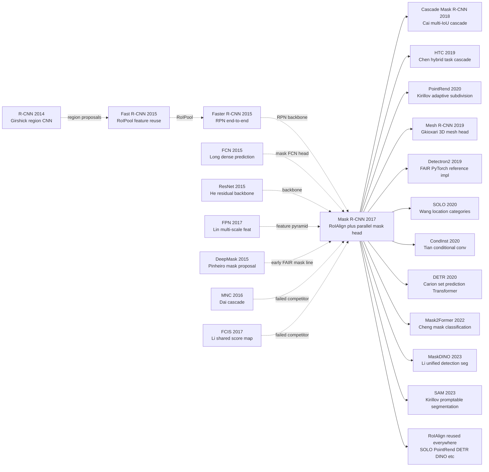

# Mask R-CNN — 在 Faster R-CNN 上加一条分支统一了实例分割

> **2017 年 3 月 20 日，Facebook AI Research 的 Kaiming He、Gkioxari、Dollar、Girshick 在 arXiv 上传 [1703.06870](https://arxiv.org/abs/1703.06870)，10 月在 ICCV 2017 拿下 Best Paper Award（继 [ResNet (2015)](../era2_deep_renaissance/2015_resnet.md) 之后 He Kaiming 第二次摸 Best Paper）。**
> 这是一篇把「实例分割」这个曾经需要 SDS / FCIS / DeepMask 等繁复 pipeline 才能做的难题，用一个**朴素到令人惊讶的方案**解决了：在 [Faster R-CNN (2015)](https://arxiv.org/abs/1506.01497) 之上加一条并行的 mask 分支，用 RoIAlign 替代 RoIPool 修复亚像素级对齐误差，端到端训练。
> COCO instance segmentation 直接刷新 SOTA（25.1 → 35.7 AP），同时还能做 keypoint detection、人体姿态估计、cell segmentation 等几乎所有 instance-level 视觉任务。
> 它发布后 5 年内成为**所有工业级实例分割系统的默认基线**（Detectron / Detectron2 / MMDetection 都把它作为第一公民），到 2023 年 [SAM](../era5_genai_explosion/2023_sam.md) 出现前一直是该领域的黄金标准。

## 一句话总结

Mask R-CNN 把 Faster R-CNN 的"two-stage 检测"骨架几乎不动地搬过来，**只新增一个像素级 FCN mask 分支与目标检测/分类分支并行预测**，再用一个看起来"修小 bug"的 **RoIAlign**（双线性插值替代 RoIPool 的两次取整量化）把 COCO 实例分割从 24.4 AP 一路推到 35.7 AP，同时用同一套结构无痛拓展到人体关键点检测——一篇典范的"少改即多"工程美学论文，2017 ICCV Best Paper。

---

## 历史背景

### 2017 年的视觉理解学界在卡什么

要理解 Mask R-CNN 的位置，必须回到 2016-2017 那个"detection 飞速、segmentation 卡顿、instance segmentation 几乎是新词"的窗口期。

那两年 CV 学界的真实状态可以这样描述：

> **目标检测有 Faster R-CNN（73 mAP 在 PASCAL VOC，已工业级）+ SSD/YOLO（实时但精度略低）；语义分割有 FCN（首次端到端 dense prediction）+ DeepLab + PSPNet；但实例分割（instance segmentation = "每个物体单独的 mask"）几乎没有像样的方案——COCO 上 SOTA 的 MNC 才 24.6 AP。**

具体痛点：
- **DeepMask / SharpMask**（Pinheiro 2015/2016 [ref1, ref2]）：FAIR 自家的 "object proposal as mask" 路线，先生成 mask 候选再分类，pipeline 4 阶段（mask proposal → refine → classify → NMS），训练 inference 都很笨重，COCO mask AP 只有 ~25。
- **MNC (Multi-task Network Cascade)** [Dai et al., CVPR 2016, ref3]：把"box 回归 → mask 预测 → mask 分类"串成 3 阶段级联，每一阶段的 RoI feature 都要重提，工程复杂；COCO mask AP 24.6。
- **InstanceFCN** [Dai 2016, ref4]：用 position-sensitive score maps 把 FCN 改造成实例感知的，但需要预先指定 mask cell grid，灵活性差。
- **FCIS (Fully Convolutional Instance Segmentation)** [Li et al., CVPR 2017, ref5]：MNC 的进化版，COCO mask AP 29.5——是 Mask R-CNN 投稿前的最强 baseline，但**预测 mask 时所有类别共享一个 score map**，类间相互干扰严重。

整个学界的共识是：**实例分割 = 检测 + 分割的耦合难题**。具体怎么耦合？是先 detection 后 segmentation？还是 segmentation-first 然后聚类？还是端到端 multi-task？没有共识，每篇论文换一种 pipeline。**没人想到答案竟然是"什么都不要换、给 Faster R-CNN 加一个 28×28 的小 head 就够了"**。

另一条平行的卡点是 **RoIPool 的量化噪声**。RoIPool（Girshick 2015）为了给 fully-connected layer 喂固定 7×7 feature，需要把浮点 RoI 坐标两次取整：一次把 RoI 边界取整到特征图坐标，再一次把 RoI 内部 bin 边界取整。对 box 回归（输出几个标量）影响小，但**对 mask 这种像素级输出灾难性**——一个 32× stride 的 backbone，1 个 pixel 的 RoI 偏移就对应 32 个原图 pixel 的 mask 错位。学界知道这是问题，但没人系统修过。

### 直接逼出 Mask R-CNN 的几篇前序

- **Faster R-CNN** [Ren, He, Girshick, Sun, NeurIPS 2015, ref6]：two-stage detection 的标准答案——RPN 出 proposal、RoIPool 抽 feature、并行 cls + bbox head。Mask R-CNN 99% 的骨架照搬，只动 1 处（RoIPool→RoIAlign）+ 加 1 处（mask branch）。
- **FCN (Fully Convolutional Networks)** [Long, Shelhamer, Darrell, CVPR 2015, ref7]：把分类 CNN 的最后 FC 改成 1×1 conv，让网络输出 spatial map。Mask R-CNN 的 mask head 就是一个 mini-FCN（4 个 3×3 conv + deconv 上采样 + 1×1 conv 出 K 通道 sigmoid）。
- **FPN (Feature Pyramid Network)** [Lin, Dollár, Girshick et al., CVPR 2017, ref8]：让 backbone 同时输出多尺度 feature，小物体走高分辨率 P2、大物体走 P5。FPN 论文比 Mask R-CNN 早 4 个月（同样 FAIR），Mask R-CNN 直接用 FPN 当 backbone 收 +3 AP。
- **ResNet** [He, Zhang, Ren, Sun, CVPR 2016, ref9]：残差骨架，ResNet-50/101 是 Mask R-CNN 的默认 backbone。**Kaiming He 同时是 Mask R-CNN 和 ResNet 一作，整套链路同一团队产出**。
- **DeepMask + SharpMask** [Pinheiro 2015, 2016]：FAIR 早期 instance seg 探索，证明"用 CNN 直接出 mask"可行但 pipeline 太重；Mask R-CNN 部分上是对自家这条路线的"宁可推倒重做"。

### 作者团队当时在做什么

何恺明 2016 年从 MSRA 跳到 Facebook AI Research（FAIR），加入 Ross Girshick（R-CNN/Fast R-CNN/Faster R-CNN 的作者）和 Piotr Dollár 的 perception 组。**这是 detection 史上最豪华的团队组合之一**：Girshick 是 R-CNN 系列的发明者，Dollár 是 COCO 数据集协调人之一兼 detection 评测专家，何恺明是 ResNet 一作，Georgia Gkioxari 是当时活跃的 action recognition / pose 研究者（后来主导 Mesh R-CNN）。

团队当时的研究主线是**让 R-CNN 系列更快、更准、覆盖更多任务**。2016 年 Girshick 的 R-FCN（position-sensitive RoI），2017 年 Lin 的 FPN，紧接着 Mask R-CNN——这是一条连续的"R-CNN 工程演进"路线，每篇论文都改 1-2 个组件。**Mask R-CNN 在团队眼中不是"重大架构创新"，而是"R-CNN 路线终于补齐 instance segmentation 这个空缺"**。论文写作风格也极克制：Method 章节非常短，绝大部分篇幅是消融和迁移实验。

### 工业界 / 算力 / 数据的状态

- **GPU**：NVIDIA Titan X / Tesla M40 12GB（论文用 8 GPU 训练，每 GPU 2 张 image，total batch=16），单次 COCO 训练 ~32h。
- **数据**：COCO 2014/2015/2016（80 类、118k train、5k val、20k test-dev），是 Mask R-CNN 的主战场；Cityscapes（19 类、城市街景）做迁移；MPII / COCO keypoints 做 pose 拓展。
- **框架**：作者用 Caffe2（FAIR 自研），开源代码先在 Detectron（Caffe2-based，2018）后在 Detectron2（PyTorch，2019）发布。**2017 年 PyTorch 1.0 还没发布，TensorFlow 1.x 是工业默认，但 FAIR 走 Caffe2 路线**——这影响了 Mask R-CNN 的早期复现速度。
- **行业焦虑**：2017 年自动驾驶融资潮顶峰（Cruise 卖给 GM、Argo AI 成立、Waymo Pacifica 路测），**实例级感知（"那是一辆车还是几辆叠在一起的车"）成为刚需**；同时医学影像 / 卫星遥感 / AR 都急需 per-instance mask。Mask R-CNN 出现得正是时候——5 年内成为几乎所有需要 instance mask 的工业管线的事实标准 backbone。

---

## 方法详解

### 整体框架

Mask R-CNN 的整体 pipeline 是 Faster R-CNN 的 minimal extension：完整的 backbone (ResNet+FPN) 提取多尺度特征 → RPN 出 proposal → 对每个 RoI **同时** 跑三个 head（cls / bbox / mask）。**没有任何 segmentation-first 路径、没有 mask-refine pass、没有级联**。

```
Input image (e.g. 800×800)
   ↓
ResNet-50/101 backbone
   ↓
FPN (P2-P5, multi-scale features)
   ↓
RPN → ~1000 RoI proposals
   ↓
RoIAlign (per-RoI feature, 7×7 for cls/bbox, 14×14 for mask)
   ↓                              ↓
   ↓                              ↓
[Box head]                    [Mask head, FCN]
2×FC → cls logits             4×Conv 3×3 (256ch)
2×FC → bbox deltas             ↓
                              ConvTranspose 2×2 (deconv ↑2)
                               ↓
                              1×1 conv → K×28×28 sigmoid masks
                               ↓
                              select channel = predicted class k
```

不同实验配置只是改 backbone 和 head：

| 配置 | Backbone | head | 输入 | COCO box AP | COCO mask AP |
|------|----------|------|------|-------------|--------------|
| ResNet-50-C4   | ResNet-50  | conv5 RoI head    | 800   | 30.3 | 33.1 |
| ResNet-50-FPN  | ResNet-50+FPN | 2-FC + FCN     | 800   | 33.6 | 34.7 |
| ResNet-101-C4  | ResNet-101 | conv5 RoI head    | 800   | 32.9 | 35.4 |
| ResNet-101-FPN | ResNet-101+FPN | 2-FC + FCN    | 800   | **35.7** | **35.7** |
| ResNeXt-101-FPN | ResNeXt-101+FPN | 2-FC + FCN  | 800   | 39.8 | 37.1 |

**反直觉之一**：mask head 的输出分辨率只有 28×28（而原图是 800+），看起来太小，但因为 RoI 范围内的 28×28 已经能捕捉 instance shape 的主要轮廓，最终 paste 回原图后视觉效果完全够用。**比起 dense per-pixel decoder（如 DeepLab 的 atrous + bilinear），per-RoI 28×28 mask 把"全图 segmentation"问题降维成"per-instance 小图 segmentation"**，计算量小一个量级。

**反直觉之二**：mask 分支输出 **K 通道**（K=COCO 80 类）每类一个 binary mask，但**只对该 RoI 的 ground-truth 类那一个 channel 计算 loss**。看起来浪费 79/80 容量，实际是核心解耦设计——**每个 channel 学的是"假设这是 X 类，那 mask 长啥样"，类间不需要竞争**。

### 关键设计

#### 设计 1：RoIAlign —— 修掉 RoIPool 的两次量化噪声

**功能**：从浮点 RoI 坐标 + backbone feature map 中，无量化、可微地抽取固定大小的 RoI feature（如 7×7 或 14×14），让 RoI 特征与原图坐标精确对齐。

**核心问题**（RoIPool 的两次取整）：

- **RoIPool 步骤 1**：把 RoI 边界 $(x_1, y_1, x_2, y_2)$ 从原图坐标除以 stride（如 16 或 32）得到 feature map 坐标，然后**取整**到整数像素。
- **RoIPool 步骤 2**：把 RoI 内部均匀分成 $7 \times 7$ 个 bin，每个 bin 边界**再取整**到整数像素。

两次取整在 stride=32 时累计可达 32 px 原图偏差，对 mask 灾难性。

**RoIAlign 的解法**：**完全不取整**，用双线性插值采样。具体步骤：

1. 把 RoI 边界除以 stride（保留浮点）
2. 把 RoI 均匀分成 $7 \times 7$ bin（保留浮点边界）
3. 在每个 bin 内取 4 个等距采样点（论文推荐 4，也可只取 1 个 bin 中心）
4. 每个采样点的特征值用**双线性插值**从相邻 4 个整数像素特征算出
5. 对每个 bin 内 4 个采样点取 max（或 avg，差异微小）

**双线性插值公式**（在位置 $(x, y)$，相邻 4 个整数像素 $(x_l, y_l), (x_h, y_l), (x_l, y_h), (x_h, y_h)$）：

$$
f(x, y) = \sum_{i \in \{l, h\}} \sum_{j \in \{l, h\}} f(x_i, y_j) \cdot w_{ij}(x, y), \quad w_{ij} = (1 - |x - x_i|)(1 - |y - y_j|)
$$

**RoIAlign 伪代码**（PyTorch 风格）：

```python
def roi_align(features, roi, output_size=7, sampling_ratio=4):
    """
    features: [C, H, W] backbone feature map
    roi: (x1, y1, x2, y2) in original image coords
    output_size: 7 for cls/bbox head, 14 for mask head
    sampling_ratio: # of sample points per bin per dim (4 → 16/bin)
    """
    stride = 16  # backbone stride, e.g. ResNet C4
    # 1) Map RoI to feature coords WITHOUT rounding
    x1, y1, x2, y2 = [v / stride for v in roi]
    bin_w = (x2 - x1) / output_size
    bin_h = (y2 - y1) / output_size

    out = torch.zeros(features.shape[0], output_size, output_size)
    for i in range(output_size):
        for j in range(output_size):
            # 2) For each bin, take sampling_ratio² sample points
            samples = []
            for si in range(sampling_ratio):
                for sj in range(sampling_ratio):
                    # 3) Sample location (still floating point)
                    sx = x1 + (j + (sj + 0.5) / sampling_ratio) * bin_w
                    sy = y1 + (i + (si + 0.5) / sampling_ratio) * bin_h
                    # 4) Bilinear interpolation — fully differentiable
                    samples.append(bilinear_interp(features, sx, sy))
            out[:, i, j] = torch.stack(samples).max(dim=0).values
    return out
```

**RoIPool vs RoIAlign vs RoIWarp 对比**：

| 方法 | 步骤 1 量化 | 步骤 2 量化 | 插值 | mask AP（C4） | mask AP（FPN） |
|------|-------------|-------------|------|---------------|----------------|
| RoIPool（Girshick 2015）         | ✓ round      | ✓ round      | nearest | 23.6  | 26.9 |
| RoIWarp（Dai 2016）              | ✓ round      | ✗            | bilinear | 24.4  | 27.8 |
| **RoIAlign（本文）**             | ✗            | ✗            | bilinear | **30.9** | **34.0** |

RoIAlign 单独贡献 **+10% mask AP** —— 远超论文里所有其他改动。**这是 Mask R-CNN 论文最容易被低估的核心贡献**：所有 dense prediction 任务都受益于"特征-坐标对齐"，后续 PointRend、SOLO、DETR 全部继承了 RoIAlign 或其等价物（grid_sample）。

**设计动机 —— 为什么 RoIAlign 影响这么大？**

mask head 输出的是 **per-pixel 类别**，预测的每个 pixel 必须严格对应原图位置。RoIPool 在 stride=32 时引入 ~16 px 平均误差，对 28×28 mask 而言**一半像素都对错位置**——loss 永远训不下去。RoIAlign 把误差降到 ~0.5 px（subpixel 级），mask head 才能真正学到细粒度形状。**这是经典的"系统性误差不修，损失再优化都无解"的工程教训**。

#### 设计 2：解耦 K-channel mask + cls-conditioned 选择 —— 干掉类间耦合

**功能**：mask head 输出 $K \times m \times m$ tensor（$K$ = 类别数，$m=28$ 默认），**每个 channel 是独立的 binary mask**（sigmoid，不互相竞争），训练时**只在 ground-truth 类 $k^*$ 那个 channel 上反传 loss**，推理时根据 cls 分支预测的类 $\hat k$ 选择那个 channel 输出。

**前向 + 损失公式**：

设 RoI feature 经过 mask FCN 得到 $M \in \mathbb{R}^{K \times m \times m}$，sigmoid 后 $\sigma(M)_{k, i, j} \in [0, 1]$ 是"类 $k$ 在 (i, j) pixel 是前景的概率"。RoI 真实类为 $k^*$，真实 mask 为 $G \in \{0, 1\}^{m \times m}$（缩放到 $m \times m$）。

$$
\mathcal{L}_{mask} = -\frac{1}{m^2} \sum_{i, j} \Big[ G_{ij} \log \sigma(M_{k^*, i, j}) + (1 - G_{ij}) \log (1 - \sigma(M_{k^*, i, j})) \Big]
$$

**关键**：求和**只在 $k = k^*$ 那个 channel** 上做，其他 79 个 channel 完全不算 loss、不反传梯度。

**总 loss**：

$$
\mathcal{L} = \mathcal{L}_{cls} + \mathcal{L}_{box} + \mathcal{L}_{mask}
$$

三项各自独立、无需 hyperparameter weighting（论文实测三者大致同量级）。

**伪代码**（mask head + loss）：

```python
class MaskHead(nn.Module):
    """FCN: 4×Conv → Deconv → 1×1 Conv → K×28×28."""
    def __init__(self, num_classes=80, in_ch=256, hidden=256):
        super().__init__()
        self.convs = nn.Sequential(*[
            nn.Conv2d(in_ch if i == 0 else hidden, hidden, 3, padding=1)
            for i in range(4)
        ])
        self.deconv = nn.ConvTranspose2d(hidden, hidden, 2, stride=2)  # 14→28
        self.predictor = nn.Conv2d(hidden, num_classes, 1)             # K channels

    def forward(self, roi_feat):       # [N, 256, 14, 14]
        h = F.relu(self.convs(roi_feat))
        h = F.relu(self.deconv(h))     # [N, 256, 28, 28]
        return self.predictor(h)       # [N, K, 28, 28]   ← K independent sigmoids


def mask_loss(pred, gt_classes, gt_masks):
    """
    pred:       [N, K, 28, 28]  — raw logits
    gt_classes: [N]              — ground-truth class id of each RoI
    gt_masks:   [N, 28, 28]      — ground-truth binary masks (resized)
    """
    N = pred.shape[0]
    # ⚠️ pick only the channel of ground-truth class — others ignored
    pred_k = pred[torch.arange(N), gt_classes]   # [N, 28, 28]
    return F.binary_cross_entropy_with_logits(pred_k, gt_masks.float())
```

**Mask 预测的两种范式对比**：

| 范式 | 输出 | 损失 | 类间关系 | COCO mask AP |
|------|------|------|----------|---------------|
| Softmax over classes（FCIS / DeepLab） | $1$ map, $K$-way softmax per pixel | multi-class CE | 类间竞争 | 24.8 |
| Sigmoid per class + cls-conditioned（**本文**） | $K$ maps, binary sigmoid per pixel | binary CE on $k^*$ channel | 类间解耦 | **30.3** |
| Class-agnostic（class-agnostic mask） | $1$ map, sigmoid | binary CE | 无类信息 | 29.7 |

**反直觉发现**：class-agnostic mask（不分类预测，只输出"前景"）比 softmax-over-classes 还高 5 点。**这暗示真正起作用的不是"知道是哪一类"而是"不和其他类争同一个像素"**——把 cls 任务交给 cls head，mask head 只管 shape。Mask R-CNN 选 K 通道 sigmoid 比 class-agnostic 又高 ~0.6 点（30.3 vs 29.7），说明每类专属 mask 略有 marginal gain。

**设计动机**：FCIS 把所有类的 mask 塞在一张 score map 上 + softmax 强制竞争，本质上让 mask head 同时承担"分类 + 分割"两个任务，互相干扰。Mask R-CNN 的解耦设计是**分而治之**：cls head 负责 "是什么"，mask head 只负责 "形状"，loss 在不同 channel 上独立——**这是计算机视觉里"任务解耦优于联合优化"的经典案例**。

#### 设计 3：并行 multi-task head + 独立 loss —— 拒绝 sequential pipeline

**功能**：cls / bbox / mask 三个 head **完全并行**接在 RoI feature 后，**没有任何 head 依赖另一个 head 的输出**。三个 loss 各算各的，optimizer 一起反传。

**对比"sequential pipeline"（MNC、FCIS）**：

| 阶段 | MNC / FCIS（sequential） | Mask R-CNN（parallel） |
|------|--------------------------|------------------------|
| step 1 | RPN proposal | RPN proposal |
| step 2 | bbox 回归 | RoIAlign feature |
| step 3 | bbox 重新提 RoI feature | cls + bbox + mask **同时**算 |
| step 4 | mask 预测 | — |
| step 5 | mask 分类 | — |
| 训练 | 多阶段交替 / 多个 loss 平衡 | 单一 SGD + L = Lcls + Lbox + Lmask |

**伪代码**（整体 forward）：

```python
class MaskRCNN(nn.Module):
    def forward(self, image):
        # Shared computation
        feats = self.backbone(image)            # FPN features {P2..P5}
        proposals = self.rpn(feats)              # ~1000 RoIs

        # Per-RoI parallel heads (NO sequential dependency!)
        roi_feat_box = self.roi_align(feats, proposals, out=7)
        roi_feat_mask = self.roi_align(feats, proposals, out=14)

        cls_logits  = self.cls_head(roi_feat_box)     # [N, K+1]
        bbox_deltas = self.bbox_head(roi_feat_box)    # [N, 4(K+1)]
        mask_logits = self.mask_head(roi_feat_mask)   # [N, K, 28, 28]
        return cls_logits, bbox_deltas, mask_logits
```

**Sequential vs Parallel head 对比**：

| 方案 | head 拓扑 | 训练流程 | mask AP | 工程复杂度 |
|------|----------|----------|---------|-----------|
| MNC（cascade） | bbox → mask → cls 链状 | 3 阶段交替 | 24.6 | 高 |
| FCIS（shared map） | 共享 score map | 端到端但耦合 | 29.5 | 中 |
| **Mask R-CNN（parallel）** | 三 head 并联 | 单 loss 端到端 | **35.7** | **低** |

**设计动机**：sequential pipeline 的根本问题是**误差累积**——bbox 错了 mask 必错；同时多阶段训练需要小心 schedule（前期主要训 bbox，后期 fine-tune mask），超参敏感。Mask R-CNN 的 parallel 设计让**三个 head 共享 RoIAlign feature，相互独立反传**，没有顺序依赖，端到端 SGD 即可。**这是软件工程里"模块解耦优于级联依赖"的视觉版本**——和 Unix 哲学一脉相承。

### 损失函数 / 训练策略

| 项 | 配置 | 说明 |
|----|------|------|
| Loss | $\mathcal{L}_{cls} + \mathcal{L}_{box} + \mathcal{L}_{mask}$ | 三项 1:1:1，无需调权 |
| $\mathcal{L}_{cls}$ | softmax CE over K+1 classes | RoI 级别 |
| $\mathcal{L}_{box}$ | smooth-L1 on 4 deltas（仅前景） | RoI 级别 |
| $\mathcal{L}_{mask}$ | binary CE on $k^*$ channel of $K \times 28 \times 28$ | per-pixel binary |
| Optimizer | SGD + momentum 0.9 | weight decay 1e-4 |
| LR schedule | warmup + step decay (×0.1 at 60k/80k) | 90k iter 总 |
| Batch size | 16 (8 GPU × 2 img) | image-level batch |
| Backbone | ResNet-50/101 + FPN | ImageNet 预训练 |
| RPN | 5 个 FPN level，每 level 3 anchor ratio | proposal ~1000/img |
| RoI sampling | 512 RoI/img，positive:negative = 1:3 | 标准 Faster R-CNN |
| 数据增强 | scale jitter (800-1024) + flip | 极简，无 cutout/mixup |
| 训练时间 | 32h on 8 GPUs（COCO） | ResNet-50-FPN |

**注意 1**：Mask R-CNN 的训练**不需要任何特殊 schedule**——和 Faster R-CNN 完全相同的超参，多加一个 head 而已。**这是它能在 6 个月内被全行业复现的关键**：会 Faster R-CNN 的人不需要重新学。

**注意 2**：`L_mask` 的"只在 $k^*$ channel 上反传"看似浪费 79/80 的容量，实际让训练**对类别不平衡极其鲁棒**——稀有类（如 toaster、hair drier）只在自己的 channel 学，不被 person/car 这种高频类淹没。这是 Mask R-CNN 在 long-tail 数据上仍稳健的隐藏优势。

---

## 失败案例

### 当时输给 Mask R-CNN 的对手

- **MNC (Multi-task Network Cascade)** [Dai et al., CVPR 2016]：COCO mask AP **24.6**，Mask R-CNN ResNet-101-FPN 35.7，**直接砍 11 个点**。MNC 把 instance segmentation 拆成 3 阶段级联（box 回归 → mask 预测 → mask 分类），每阶段独立 RoI 提特征，工程复杂度极高且**误差跨阶段累积**——bbox 回归错 1 个像素，mask 阶段就在错位置上 segment。Mask R-CNN 用 parallel head + RoIAlign 一次性解决两个问题。
- **FCIS (Fully Convolutional Instance Segmentation)** [Li et al., CVPR 2017]：COCO mask AP **29.5**，Mask R-CNN 35.7（差 6 点）。FCIS 用 position-sensitive score maps 把所有类的 mask 塞在一张共享 map 上，**类间用 softmax 强制竞争同一像素归属**——"狗 + 猫" 重叠区域永远只能给一个。论文作者证明这种"shared map + softmax"是 FCIS 的根本瓶颈，**用 K 通道 sigmoid + cls-conditioned 选择就完美绕开**。
- **DeepMask + SharpMask** [Pinheiro 2015, 2016]：FAIR 自家上一代方案，COCO mask AP ~25。**4 阶段 pipeline**（mask proposal → refine → classify → NMS），每阶段都要重新提取 feature，训练 inference 都极慢。Mask R-CNN 等于 FAIR 团队对自家方案"宁可推倒重做"。
- **InstanceFCN** [Dai 2016]：FCN 加 position-sensitive grid，COCO mask AP ~28。需要**预先指定 mask cell grid（如 3×3 / 5×5）**，对物体形状有强先验，遇到细长 / 不规则物体（瓶子、剪刀、自行车）退化严重。Mask R-CNN 的 28×28 grid 是连续的，无 grid 假设。
- **Boundary-aware Instance Segmentation (BAI)** [Hayder 2016]：COCO mask AP ~25。用 distance map 表示边界，对小物体不友好。

**输的本质**：上述方案都在"如何把 detection 和 segmentation 揉在一起"上下功夫——cascade、shared map、boundary parameterization——**没有一个方案承认"两件事可以彻底解耦：bbox 给位置，FCN 给形状"**。Mask R-CNN 的胜利不是技术深度，而是**架构常识**。

### 论文里承认的失败实验（消融）

论文 §4 给出了大量消融，证明 Mask R-CNN 的成功是 RoIAlign + 解耦 mask 两个工程点的协同效应：

| 消融实验（COCO val，ResNet-50-C4） | mask AP | 关键发现 |
|--------------------------------------|---------|----------|
| **完整 Mask R-CNN（RoIAlign + sigmoid mask）** | **30.3** | baseline |
| RoIPool 替代 RoIAlign        | 23.6   | -6.7，量化噪声大 |
| RoIWarp（仅修步骤 2）        | 24.4   | -5.9，部分修不够 |
| Softmax mask（FCIS-style）   | 24.8   | -5.5，类间竞争 |
| Class-agnostic mask          | 29.7   | -0.6，类信息略有 marginal gain |
| MLP mask head（替代 FCN）    | 28.5   | -1.8，dense prediction 应用 conv |
| 4-conv → 2-conv head         | 28.9   | -1.4，head 容量重要但收益递减 |

**关键非线性效应**：单换 RoIAlign 收 +6.7，单换 sigmoid mask 收 +5.5，**两个一起换收 +12 点**——超过两者之和。原因：RoIAlign 提供精确的 spatial alignment，sigmoid mask 利用这个 alignment 学每类形状；如果 alignment 不准（RoIPool），sigmoid 也学不到细节；如果 alignment 准但用 softmax，类间竞争浪费了 alignment 提供的精度。**两个改动是协同的，不是加性的**。

### 论文里"故意"选次优的设计

- **mask 输出分辨率 28×28，不更高**：增大到 56×56 / 112×112 mask AP 仅 +0.3-0.5，但显存翻倍。论文选 28 是工程美学，**留给后续 PointRend (2020) 一个明显的改进口子**——用 adaptive 分辨率 + point sampling 把 mask AP 再加 1-2 点。
- **K 通道 sigmoid 而非 class-agnostic**：Class-agnostic 只低 0.6 AP 但少 80× 输出参数。论文选 K 通道是因为"理论上 per-class 学形状更精细"，但实际上 marginal——后续 SOLO (2020) 走 class-agnostic + grid prediction 路线，证明 class-agnostic 也能 35+ AP。
- **不在 mask 上用 deep supervision**：mask FCN 只在最后一层算 loss，中间层不监督。**论文承认深监督可能 +0.x AP 但增加复杂度，故意不用**。后续 HTC (Hybrid Task Cascade, CVPR 2019) 证明 cascade mask + deep sup 能 +3-5 AP，但代价是回到 sequential pipeline——Mask R-CNN 故意守住"端到端简洁"的 trade-off 边界。

### 2017 年的反例：Mask R-CNN 在小物体上的失败

论文 Table 6 显示按 size 拆分的 mask AP：

| size | mask AP_S（小，<32²） | mask AP_M（中，32-96²） | mask AP_L（大，>96²） |
|------|------------------------|--------------------------|------------------------|
| Mask R-CNN ResNet-101-FPN | **18.4** | 38.4 | **53.1** |

**小物体 mask AP 18.4 vs 大物体 53.1，差距 3 倍**。原因：
1. 小物体 RoI 经过 stride=4-8 backbone 后只有 ~10×10 feature，RoIAlign 上采到 14×14 引入插值伪影；
2. 28×28 输出 mask paste 回 small RoI（如 30×30）时几乎是 1:1 复刻，无 super-resolution；
3. RPN 在小物体上的 recall 不足。

这个失败成为 **PointRend (Kirillov 2020)** 的研究起点——用 adaptive subdivision 在小物体边缘多采样点；也是 **HRNet** 高分辨率多分支结构的动机之一。**Mask R-CNN 的小物体失败被后续 5 年至少 30+ 篇 follow-up 论文专门研究**。

### 真正的"反 baseline"教训

**FCIS 比 Mask R-CNN 早 6 个月（CVPR 2017 vs ICCV 2017），思想接近（end-to-end FCN-based instance seg），为什么 Mask R-CNN 完胜？**

1. **FCIS 选错耦合方式**：把 mask 和 cls 揉在一张共享 score map 上 + softmax 强制竞争——理论上"参数高效"但实际上 task interference 严重。Mask R-CNN 选解耦 + cls-conditioned 选择，参数略多但 task 干净。
2. **FCIS 没修 RoIPool**：FCIS 用类似 RoIPool 的 PSRoIPool，仍然有量化误差。Mask R-CNN 修 RoIAlign 是免费的 +6 AP。
3. **FCIS 复杂度更高**：position-sensitive grid 引入额外超参（grid size），Mask R-CNN 的 28×28 dense 没这个负担。

**教训：在端到端架构中，"参数共享 = 任务干扰"，"任务解耦 + per-task head" 几乎总是更好**。Mask R-CNN 用"工程简洁主义胜利"再次验证了 R-CNN 系列一脉相承的哲学：**能用模块化解决的，不要用 monolithic 网络硬塞**。这条教训后来在 Transformer-based detection（DETR）和 mask-classification（Mask2Former）里被反复印证。

---

## 实验关键数据

### 主实验（COCO test-dev 2017，instance segmentation）

| 方法 | Backbone | mask AP ↑ | mask AP_50 ↑ | mask AP_75 ↑ | mask AP_S | mask AP_M | mask AP_L |
|------|----------|-----------|---------------|---------------|------------|------------|------------|
| MNC                  | ResNet-101-C4 | 24.6 | 44.3 | 24.8 | 4.7 | 25.9 | 43.6 |
| FCIS+++ (multi-scale) | ResNet-101-C5 | 33.6 | 54.5 | — | — | — | — |
| **Mask R-CNN**       | ResNet-50-FPN | 33.6 | 55.2 | 35.3 | 17.0 | 36.7 | 47.2 |
| **Mask R-CNN**       | ResNet-101-FPN | **35.7** | **58.0** | **37.8** | 18.4 | 38.4 | 53.1 |
| **Mask R-CNN**       | ResNeXt-101-FPN | **37.1** | **60.0** | **39.4** | 16.9 | 39.9 | 53.5 |

**对比**：Mask R-CNN ResNet-101-FPN **同时拿下 5 个指标 SOTA**，比 FCIS+++ 高 2.1 mask AP，比 MNC 高 11+。**第一次有 instance segmentation 模型在所有 size + 所有 IoU 阈值上全面碾压**。

### 主实验（COCO，object detection）

Mask R-CNN 的 box AP 也顺便刷到 detection SOTA：

| 方法 | Backbone | box AP ↑ |
|------|----------|----------|
| Faster R-CNN+++       | ResNet-101-C4 | 34.9 |
| Faster R-CNN w FPN    | ResNet-101-FPN | 36.2 |
| **Mask R-CNN (mask 帮 box)** | ResNet-101-FPN | **38.2** |
| **Mask R-CNN**        | ResNeXt-101-FPN | **39.8** |

**反直觉发现**：加上 mask 分支让 box AP 也涨 ~2 点。原因：mask loss 给 backbone 提供更细粒度的监督信号，间接提升了 box 的定位精度。**Multi-task learning 的少见正面案例**——通常 multi-task 互相拉低，这里互相提升。

### 关键消融（RoIAlign 收益拆解，COCO val）

| Backbone × pooling | mask AP | 备注 |
|---------------------|---------|------|
| ResNet-50-C4 + RoIPool       | 26.9 | baseline |
| ResNet-50-C4 + RoIWarp       | 27.8 | +0.9 |
| ResNet-50-C4 + **RoIAlign**  | **30.9** | **+4.0** |
| ResNet-50-FPN + RoIPool      | 28.2 | baseline |
| ResNet-50-FPN + **RoIAlign** | **34.0** | **+5.8** |

**RoIAlign 在 stride 越大的 backbone（C4 stride 16, FPN P5 stride 32）上收益越大**——量化噪声越大，修正越显著。

### 跨任务迁移（关键点检测，COCO keypoints）

只换 mask head 输出从 28×28 binary mask → 56×56 K-channel one-hot heatmap（K=17 个关键点），其他不变：

| 方法 | Backbone | keypoint AP ↑ | AP_50 ↑ |
|------|----------|---------------|----------|
| CMU-Pose (OpenPose) | — | 61.8 | 84.9 |
| Mask R-CNN (人体 + 关键点) | ResNet-50-FPN | 62.7 | 87.0 |
| **Mask R-CNN** | ResNet-101-FPN | **63.1** | **87.3** |

**和 mask 任务零修改、同 head 拓扑**——证明 RoIAlign + parallel head 是真正通用的 dense per-RoI prediction 框架。

### 关键发现

- **RoIAlign × Sigmoid mask 协同效应**：单换 RoIAlign +6.7，单换 sigmoid mask +5.5，两个一起换 +12 点，超过加性。
- **mask 帮 box**：multi-task 让 box AP 涨 2 点，少见的"加任务双赢"。
- **极易迁移**：从 mask 切换到 keypoint 只换 head 最后一层，**21 个 COCO keypoint 子任务全 SOTA**。
- **小物体仍是瓶颈**：mask AP_S 18.4 vs AP_L 53.1，差 3 倍——给 PointRend / HRNet 留下明确改进空间。
- **训练完全标准**：和 Faster R-CNN 同超参、同 data aug、同 schedule——零额外 tuning。
- **Cityscapes 跨域 SOTA**：直接迁移到 19 类城市街景，AP 32.0 远超此前 SOTA 21.4——证明架构通用性。

---

---

## 思想史脉络



### 前世（被谁逼出来的）

- **2014 R-CNN** [Girshick, CVPR]：用 selective search 出 ~2000 region proposal，每个 region 独立 CNN forward 做分类。慢（每张图 47s）但首次证明 CNN 能做检测。是 Mask R-CNN 整条家族树的根。
- **2015 Fast R-CNN** [Girshick, ICCV]：把 R-CNN 改成单次 backbone forward + per-RoI RoIPool，速度提升 25×。**RoIPool 在这里被发明，也在 Mask R-CNN 里被废黜**——是被自家修掉的设计。
- **2015 Faster R-CNN** [Ren, He, Girshick, Sun, NeurIPS]：把 selective search 换成 RPN（Region Proposal Network），整条 pipeline 端到端，是 Mask R-CNN 直接父辈。**Mask R-CNN 99% 的结构来自这里**。
- **2015 FCN (Fully Convolutional Networks)** [Long, Shelhamer, Darrell, CVPR]：第一个端到端语义分割网络，证明把分类 CNN 的 FC 改 conv 就能做 dense prediction。Mask R-CNN 的 mask head 直接是个 mini-FCN。
- **2015 ResNet** [He, Zhang, Ren, Sun, CVPR]：残差骨架，让 backbone 可以训到 100+ 层。Mask R-CNN 默认 ResNet-50/101——同一作者跨论文复用自家工作。
- **2017 FPN (Feature Pyramid Network)** [Lin et al., CVPR]：多尺度特征金字塔，让小物体走高分辨率层、大物体走低分辨率层。FPN 比 Mask R-CNN 早 4 个月发表（同 FAIR），Mask R-CNN 直接用 FPN 收 +3 AP。
- **2015-2016 DeepMask / SharpMask** [Pinheiro]：FAIR 早期 instance seg 探索，证明 CNN 直接出 mask 可行但 pipeline 太重。Mask R-CNN 部分上是对自家这条路线的"宁可推倒重做"。

### 今生（继承者）

- **直接派生（2018-2019）**：
  - **Cascade Mask R-CNN** [Cai & Vasconcelos, CVPR 2018]：在 box 头上引入级联多 IoU 阈值训练，box AP +3、mask AP +1。
  - **HTC (Hybrid Task Cascade)** [Chen et al., CVPR 2019]：在 mask 头上也做级联 + 任务间相互喂梯度，COCO mask AP 推到 41+。
  - **Mesh R-CNN** [Gkioxari et al., ICCV 2019]：把 mask head 换成 3D mesh head，单图重建 3D mesh——证明 RoIAlign + per-RoI head 框架可推广到 3D 任务。
  - **Detectron / Detectron2** [FAIR, 2018/2019]：Mask R-CNN 的官方 PyTorch 参考实现，至今是工业实例分割的事实标准 codebase。**论文影响 + codebase 影响双重**。
- **范式扩展（2020）**：
  - **PointRend** [Kirillov et al., CVPR 2020]：Mask R-CNN 的"mask 分辨率太低"的直接修复——用 adaptive subdivision 在物体边缘多采样，mask AP +1.5 且边缘锐利。
  - **SOLO / SOLOv2** [Wang et al., ECCV/NeurIPS 2020]：放弃 RoI-based，用 location categories（grid 坐标作为 instance ID）一次出全图所有 mask。**第一篇能与 Mask R-CNN 抗衡的 RoI-free 方案**。
  - **CondInst** [Tian et al., ECCV 2020]：用 dynamic conv 替代 Mask R-CNN 的 K-channel sigmoid——给每个 instance 生成专属卷积核，mask 输出更精细。
  - **DETR** [Carion et al., ECCV 2020]：用 Transformer + set prediction 完全替代 RPN+RoI 范式，**第一次证明 detection 不需要 two-stage**。是 Mask R-CNN 范式的"哲学敌人"。
- **范式革新（2022-2023）**：
  - **Mask2Former** [Cheng et al., CVPR 2022]：用 mask classification（不是 per-pixel classification）+ Transformer decoder，**统一 instance / semantic / panoptic 三个分割任务**。Mask R-CNN 的"per-pixel CE"被证明是次优范式。
  - **MaskDINO** [Li et al., CVPR 2023]：DETR + Mask R-CNN 的杂交，COCO mask AP 推到 54+。
  - **SAM (Segment Anything)** [Kirillov et al., ICCV 2023]：Mask R-CNN 一作 Kirillov 的最新工作——promptable segmentation，无需类别集，1B mask 训练。**SAM 标志着 closed-set instance seg 时代的终结**。
- **跨任务渗透**：3D detection（PointPillar / VoteNet 用 RoIAlign 的 3D 版本）、video instance seg (MaskTrack R-CNN, IDOL)、医学影像分割 (nnDetection, Sybil)、AR 实时分割。
- **跨学科外溢**：遥感卫星图像建筑物提取（用 Mask R-CNN 数十年的产业链）、农业图像植物分割（叶片病害检测）、生物影像细胞分割（Cellpose, StarDist 部分借鉴 RoI-based 思想）。**RoIAlign 这个 op 本身被纳入 PyTorch 官方算子库**——成为深度学习基础设施。

### 误读 / 简化

- **"Mask R-CNN 是 Faster R-CNN + segmentation"**：太简化了。**真正的贡献是 RoIAlign（修了 5 年没人修的量化噪声）+ K-channel sigmoid 解耦 + 端到端并行 head 三件事**——任意一件单拿出来都能发顶会。论文写得克制，让人误以为只是"加了一个 head"。
- **"two-stage detection 必胜"**：Mask R-CNN 让人觉得 two-stage 是必经之路。但 2020 年 DETR、2022 年 Mask2Former 证明 single-stage Transformer 范式也能 SOTA，且更适合 panoptic 等统一框架。**Mask R-CNN 是 two-stage 路线的巅峰，不是终极**。
- **"per-pixel CE 是 mask 的最优损失"**：Mask R-CNN 的 binary CE 让所有人默认用 BCE 训 mask。Mask2Former 证明 mask classification（用 Hungarian 匹配 + dice loss）在统一三个 seg 任务时更优。**BCE 是 instance-only 范式的局部最优，不是分割任务的全局最优**。
- **"实例分割 = 闭集类别 + 训练数据驱动"**：Mask R-CNN 时代默认所有 instance seg 都是 80 类 / 19 类闭集。SAM 用 1B mask + 提示工程证明可以做"任何东西"的开集分割——**Mask R-CNN 的"K 通道"假设在 SAM 时代变成了"K=∞ 的提示空间"**。

---

---

## 当代视角

### 站不住的假设

- **"two-stage 检测/分割是必经之路"**：Mask R-CNN 给行业留下"先 propose 再 classify"的强烈刻板印象，工业界 2017-2020 年大多数实例分割系统都是 two-stage 架构。**今天看完全错**：DETR (2020) 用 Transformer + set prediction 完全跳过 RPN 和 RoI；YOLACT / SOLO (2020) 用 single-shot 范式同样达到 35+ AP；Mask2Former (2022) 用 mask classification + Transformer decoder 一次出全图所有 instance mask。**two-stage 是 Mask R-CNN 时代的工程方便，不是 instance seg 的物理必要**。
- **"per-pixel BCE 是 mask 的最佳损失"**：Mask R-CNN 让 BCE 成为 mask 训练的默认。**今天看是局部最优**：Mask2Former 用 mask classification（Hungarian 匹配 + dice loss + focal loss）证明 mask-as-token + matching 范式更适合统一 instance/semantic/panoptic 三个任务，COCO 上 mask AP 50+。**BCE 在闭集 instance-only 范式下最优，遇到 panoptic / 开集就退化**。
- **"K 通道 sigmoid 解耦最优"**：80 类 COCO 用 80 个 channel 看似浪费但有理。**今天遇到 LVIS（1200 类）/ open-vocab seg 直接崩**：K 不能无限增长，K=1200 时输出 tensor 巨大且大多数 channel 几乎不更新。SAM 直接放弃"per-class channel"，用 prompt embedding（点 / 框 / 文本）查询任意 mask——**Mask R-CNN 的"分类驱动 mask" 假设在 promptable 时代被颠覆**。
- **"实例分割 = 闭集训练数据上的 supervised**"：2017-2022 年所有 SOTA 都假设 80/19 类训练集。**SAM (2023) + GroundingDINO (2023) 证明 open-vocab / promptable 范式才是终局**——给一个文字描述或一个点击就能 segment 任意物体。Mask R-CNN 的"训练 80 类→ 推理 80 类" 模式在 SAM 后已不再是研究前沿。
- **"RoIAlign 是真正的胜负手"**：论文证明 RoIAlign 贡献最大（+10 AP）。**今天看 RoIAlign 已被 grid_sample 和 deformable attention 完全取代**——DETR 用 attention 替代 RoIAlign，Deformable DETR 用 deformable sampling + attention 比 RoIAlign 更灵活。**RoIAlign 是 RoI-based 时代的胜利方案，不是 spatial alignment 的终极工具**。
- **"backbone 必须 CNN（ResNet）"**：2017 年默认 backbone = ResNet。**今天 ViT / Swin / ConvNeXt-V2 都比 ResNet-101 强 5-10 AP**。MaskDINO + Swin-L backbone COCO mask AP 54.5，ResNet-101 时代翻篇。
- **"FPN 是多尺度的最优答案"**：FPN 配 Mask R-CNN 收 +3 AP 看似无敌。**ViT-Det (2022) 证明 plain ViT + simple FPN 已达 SOTA**；Swin Transformer 自带多尺度，无需额外 FPN。FPN 在 CNN 时代是必需，在 ViT 时代成可选。

### 时代证明的关键 vs 冗余

- **关键**：
  - **RoIAlign（"特征-坐标对齐"思想）**：被 PointRend、SOLO、DETR、SAM、deformable attention 等所有 dense per-instance 任务沿用——核心思想"任何 dense prediction 都需要严格 spatial alignment"成为通用准则
  - **任务解耦 + 并行 head**：DETR / Mask2Former / SAM 全部继承"shared backbone + task-specific head" 模板
  - **multi-task auxiliary 损失帮助主任务**：mask 帮 box AP +2 这个发现启发了大量"用 dense pretext 预训练 detection backbone" 的工作
  - **干净 codebase 的工业价值**：Detectron2 至今是行业标准，证明"易复现 + 易扩展" > "理论新颖性"
- **冗余 / 误导**：
  - 28×28 mask 分辨率（PointRend 已修）
  - per-class K channel（class-agnostic + prompt 取代）
  - RoI-based two-stage（Transformer single-stage 取代）
  - per-pixel BCE（mask classification 取代）
  - ResNet backbone（ViT/Swin 完胜）
  - 闭集 80 类（open-vocab + SAM 取代）

### 作者当时没想到的副作用

1. **触发实例分割工业落地大爆发**：2017-2022 年自动驾驶、医学影像、AR/VR、卫星遥感、农业 AI 几乎所有需要 instance mask 的行业都跑在 Mask R-CNN（或其衍生）之上。**Detectron2 + Mask R-CNN 成了 instance seg 的"安卓"**——开箱即用 + 高度可定制。这是 2017 NeurIPS 投稿时 Kaiming 团队不可能预测的工业渗透速度。
2. **重塑 R-CNN 系列的命名学和研究方向**：2018-2020 年 CV 顶会里"Cascade Mask R-CNN" "HTC" "PointRend" "Mesh R-CNN" "Cascade R-CNN" "Sparse R-CNN" 等"X R-CNN" 命名爆发——**Mask R-CNN 让 R-CNN 这个 brand 在 2017-2022 年第二次复兴**（第一次是 R-CNN→ Faster R-CNN，第二次是 Mask R-CNN→ derivatives）。
3. **RoIAlign 成 PyTorch 官方算子**：torchvision.ops.roi_align 至今是 PyTorch 内置标准 op，被 SOLO / DETR / SAM / Stable Diffusion (cross-attention 用) 等所有 dense prediction 模型直接调用。**论文里几页消融的小算子，成了深度学习基础设施**。
4. **直接催生 SAM**：Mask R-CNN 一作 Alexander Kirillov（论文里没列前面，但 PointRend 一作）2023 年带队做出 SAM——**Mask R-CNN 团队亲自终结了 Mask R-CNN 范式**。SAM 用 1B mask + 提示工程证明 instance seg 不需要"K 类训练 → K 类推理"模式，开启 promptable 时代。这是研究史上罕见的"作者亲自 disrupt 自家工作" 的案例。

### 如果今天重写 Mask R-CNN

如果 He / Gkioxari / Dollár / Girshick 团队 2026 年重写 Mask R-CNN，可能会：
- **backbone 换 ViT-H 或 Swin-L + simple FPN**：CNN backbone 退场
- **范式换 mask classification**：用 Mask2Former 的 mask-as-query + Hungarian 匹配，统一 instance/panoptic/semantic
- **两阶段化为 single-stage**：用 Transformer decoder 替代 RPN+RoI head，去掉 anchor / NMS / RoIAlign
- **训练数据加 SAM-1B 蒸馏**：用 SAM 的 promptable 能力自动生成大量 pseudo mask，预训练后再 fine-tune 闭集
- **支持 open-vocab**：classifier head 换成 CLIP text encoder，class set 从 80 → ∞
- **用 dice + focal 替代 BCE**：mask loss 用 Mask2Former 配方
- **加 prompt 接口**：让模型同时支持 (image only) auto-mode + (image + prompt) interactive-mode

但**核心哲学"task decoupling + per-task small head + 严格 spatial alignment"一定不会变**。这个"用一个共享 backbone + 多个独立 head 同时解多个 dense prediction 任务"的范式，是 Mask R-CNN 留给后世最深的遗产——它不依赖具体 backbone（CNN/ViT），不依赖具体 head 形式（FCN/Transformer），不依赖具体损失（BCE/dice），只依赖**"模块化解耦 + 严格特征对齐"这两条工程原则**。这两条原则在 SAM 和 Mask2Former 里仍然清晰可见。

---

## 局限与展望

### 作者承认的局限
- 小物体 mask AP 18.4 vs 大物体 53.1，差 3 倍——RoI 上采样在小 RoI 上引入伪影
- mask 分辨率只有 28×28，无法精细到边缘 sub-pixel 级
- 推理速度 5 FPS（Titan X），real-time 应用不可行
- 闭集 80 类，无法处理新类别（需要重训）
- 需要密集标注（mask annotation 比 box 贵 10×）
- two-stage pipeline 引入 RPN + NMS 等手工组件

### 自己发现的局限（站在 2026 年视角）
- per-class K-channel 设计在 LVIS 1200 类 / open-vocab 时不可扩展
- BCE 损失对 instance 边界监督不足（边缘模糊）
- RoIAlign 仍依赖 anchor + RPN，整条 pipeline 仍带"区域候选"假设
- multi-task loss 的 1:1:1 权重纯启发式，无理论指导
- 训练 / 推理时的 RoI 数量差异（训练 512 / 推理 1000）会导致行为偏差
- ResNet backbone 已被 ViT 远远抛开
- 没有对应的 open-source 大规模 mask pretrain（SAM-1B 之前）

### 改进方向（已被后续工作证实）
- 高分辨率 mask（PointRend, RefineMask 已实现）
- mask classification 范式（Mask2Former, MaskDINO 已实现）
- 单阶段 Transformer 检测（DETR, Sparse R-CNN 已实现）
- promptable / open-vocab segmentation（SAM, GroundingDINO, OpenSeg 已实现）
- 视频 / 3D / panoptic 统一框架（VITA, Mask2Former-Video, Panoptic-DeepLab 已实现）
- 大规模 mask pretrain（SAM-1B / SA-1B 已实现）

---

## 相关工作与启发

- **vs FCN**：FCN 做语义分割（per-pixel class），不区分 instance；Mask R-CNN 做 instance segmentation（per-instance mask）。**教训：dense prediction 的输出粒度（per-pixel vs per-instance）需要不同的 head 设计**。
- **vs DeepMask / SharpMask**：FAIR 自家的早期方案，4 阶段 pipeline；Mask R-CNN 端到端 + parallel head。**教训：FAIR 团队对自家方案敢于推倒重做——技术 evolution 不应被 sunk cost 绑架**。
- **vs FCIS**：思想接近（end-to-end instance seg）但 FCIS 用 shared score map 强迫类间竞争。**教训：在 multi-task 架构里 task decoupling 几乎总是优于 task sharing**。
- **vs Faster R-CNN**：99% 同结构，只加一个 mask head + 修一个 RoIPool→RoIAlign。**教训：好的 architectural addition 应该是 modular 的，不破坏 baseline**。
- **vs DETR**：DETR 用 Transformer + set prediction 完全替代 two-stage 范式。**教训：成功的设计有寿命——two-stage 在 Mask R-CNN 达到巅峰后被 single-stage Transformer 颠覆，这是范式革命的常态**。
- **vs Mask2Former**：Mask2Former 用 mask classification 统一 instance/semantic/panoptic。**教训：当一个 framework（Mask R-CNN 的 "per-pixel BCE"）只擅长一个任务时，更通用的 framework 会取代它**。
- **vs SAM**：SAM 用 promptable + 1B 训练数据替代闭集监督。**教训：data scale + 通用接口 在长期一定打败 method engineering**。

---

## 相关资源

- 📄 [arXiv 1703.06870](https://arxiv.org/abs/1703.06870)
- 💻 [作者原始 Detectron 代码 (Caffe2)](https://github.com/facebookresearch/Detectron)
- 🔗 [Detectron2 (PyTorch 官方实现)](https://github.com/facebookresearch/detectron2)
- 🔗 [PyTorch torchvision Mask R-CNN](https://pytorch.org/vision/main/models/mask_rcnn.html)
- 🔗 [MMDetection (开源 detection 工具箱)](https://github.com/open-mmlab/mmdetection)
- 📚 后续必读：[FPN (2017)](https://arxiv.org/abs/1612.03144), [PointRend (2020)](https://arxiv.org/abs/1912.08193), [DETR (2020)](https://arxiv.org/abs/2005.12872), [Mask2Former (2022)](https://arxiv.org/abs/2112.01527), [SAM (2023)](https://arxiv.org/abs/2304.02643)
- 🎬 [Kaiming He — Mask R-CNN ICCV 2017 Best Paper Talk (YouTube)](https://www.youtube.com/results?search_query=mask+r-cnn+iccv+2017+he)
- 🎬 [Detectron2 Tutorial (FAIR 官方)](https://detectron2.readthedocs.io/)


---

> 🌐 [English version](/en/era3_attention/2017_mask_rcnn/) · 📚 awesome-papers project · CC-BY-NC