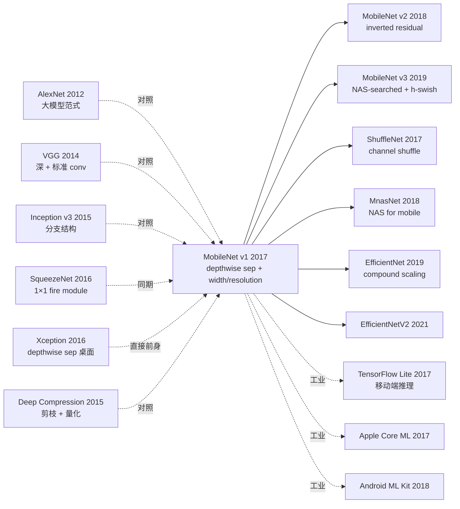

# MobileNet — 用 depthwise separable conv 把深度学习装进手机

> **2017 年 4 月 17 日，Google 的 Howard 等 8 位作者在 arXiv 发布 [MobileNet (1704.04861)](https://arxiv.org/abs/1704.04861)。**
> 这是移动端深度学习的奠基论文 —— 用 **depthwise separable convolution** 把标准卷积的计算量减少 **8-9×**，再配合 **width multiplier α** 和 **resolution multiplier ρ** 两个旋钮线性调节模型大小，让 ImageNet 分类模型能跑在手机 CPU 上。
> MobileNet v1 (4.2M 参数 / 569M FLOPs) 在 ImageNet top-1 拿 70.6%，**与 VGG-16 (138M / 15G FLOPs) 71.5% 几乎相同，但参数少 33×、FLOPs 少 27×**。
> 直接催生 MobileNet v2 / v3 / EfficientNet / ShuffleNet / MnasNet 整个移动端 CNN 家族，是手机摄像头实时 AI、安卓 ML Kit、iOS Core ML 的实际背后架构。

## 一句话总结

MobileNet 用 **depthwise separable convolution**（depthwise + 1×1 pointwise）替代标准卷积把计算量降 8-9×，再用 **width multiplier α**（通道缩放）和 **resolution multiplier ρ**（输入分辨率缩放）两个超参线性调节模型规模，让 4.2M 参数模型在 ImageNet 上达到与 138M VGG 几乎相同的 top-1 准确率，第一次让深度学习真正可在手机 CPU 实时跑。

---

## 历史背景

### 2017 年的移动端深度学习在卡什么

2012-2016 ImageNet 分类模型快速演化：AlexNet (60M, 727M FLOPs) → VGG-16 (138M, 15.5G FLOPs) → GoogLeNet (6.8M, 1.55G FLOPs) → ResNet-50 (25.6M, 4.1G FLOPs)。但所有这些模型**离手机部署都远**：

> **(1) 参数量太大**：手机 RAM 4GB，模型 100MB+ 就吃紧；
> **(2) 计算量太大**：手机 CPU 1-3 GFLOPs/s，处理一张图要数秒；
> **(3) 功耗 / 发热**：连续推理手机会过热降频；
> **(4) 当时方案不通用**：SqueezeNet (压缩通道) 准确率不够，Xception (depthwise sep 但桌面) 不够轻；
> **(5) 工业界急需**：Google Photos / Snapchat / 安卓相机滤镜都需要端侧 AI。

学界明显的开放问题：**「能否设计一个原生面向移动端、可参数化的高效 CNN 家族？」**

### 直接逼出 MobileNet 的 3 篇前序

- **Iandola et al., 2016 (SqueezeNet)** [arXiv]：用 1×1 fire module 压缩通道，参数量降 50× 但准确率 57.5%
- **Chollet, 2016 (Xception)** [CVPR 2017]：第一个系统化使用 depthwise separable conv 的网络，但目标是桌面 SOTA，不是移动端
- **Han et al., 2015 (Deep Compression)** [ICLR]：剪枝 + 量化把 VGG 压缩 49×，但训练复杂

### 作者团队当时在做什么

8 位作者全部来自 Google。Andrew Howard 是核心一作（后续主导 MobileNet v2 / v3 / MnasNet / EfficientNet）；Hartwig Adam 是 Google 视觉老将。**Google 当时押注「手机端 AI」战略**：MobileNet 是 Google Mobile Vision API 的核心模型，直接服务 Google Photos、Google Lens、Pixel 相机等产品。

### 工业界 / 算力 / 数据

- **GPU**：训练用 Tesla K80 / Titan X；目标推理硬件是 ARM 移动 CPU
- **数据**：ImageNet 1.28M 图、1000 类
- **框架**：TensorFlow + TensorFlow Mobile（后续 TFLite）
- **行业**：苹果 2017 推 CoreML，Google 推 ML Kit，移动端 AI 战略竞赛白热化

---

## 方法详解

### 整体框架

```
Input 224×224×3
  ↓ Conv 3×3 stride=2 (32 channels)        ← 唯一的标准 conv
  ↓ Depthwise Separable Block × 13:
      ├─ Depthwise Conv 3×3 + BN + ReLU6  (per channel)
      └─ Pointwise Conv 1×1 + BN + ReLU6  (combine channels)
  ↓ Average Pool 7×7
  ↓ Fully Connected (1000 classes)
  ↓ Softmax
```

| Layer | Type | Stride | Output |
|-------|------|--------|--------|
| Conv 3×3 | Standard | 2 | 112×112×32 |
| DW + PW | Depthwise sep | 1 | 112×112×64 |
| DW + PW | Depthwise sep | 2 | 56×56×128 |
| DW + PW × 2 | Depthwise sep | 1+2 | 28×28×256 |
| DW + PW × 2 | Depthwise sep | 1+2 | 14×14×512 |
| DW + PW × 5 | Depthwise sep | 1 | 14×14×512 |
| DW + PW × 2 | Depthwise sep | 2+1 | 7×7×1024 |
| AvgPool 7×7 | - | - | 1×1×1024 |
| FC + Softmax | - | - | 1×1×1000 |

| 配置 | 参数 | FLOPs | top-1 |
|------|------|-------|-------|
| MobileNet 1.0 (224) | 4.2M | 569M | 70.6% |
| MobileNet 0.75 (224) | 2.6M | 325M | 68.4% |
| MobileNet 0.5 (224) | 1.32M | 149M | 63.7% |
| MobileNet 0.25 (224) | 0.47M | 41M | 50.6% |

### 关键设计

#### 设计 1：Depthwise Separable Convolution —— 核心计算革命

**功能**：把标准卷积分解为 depthwise 和 pointwise 两步，大幅减少计算量。

**标准卷积**：

$$
G_{k,l,n} = \sum_{i,j,m} K_{i,j,m,n} \cdot F_{k+i-1, l+j-1, m}
$$

计算量：$D_K \cdot D_K \cdot M \cdot N \cdot D_F \cdot D_F$（其中 $D_K$ 是 kernel size，$M$ 是输入通道，$N$ 是输出通道，$D_F$ 是输出空间尺寸）

**Depthwise Separable Conv**：

第一步 **Depthwise Conv**：每个输入通道独立卷积（M 个 $D_K \times D_K$ 卷积核，每个只对一个输入通道操作）

$$
\hat{G}_{k,l,m} = \sum_{i,j} \hat{K}_{i,j,m} \cdot F_{k+i-1, l+j-1, m}
$$

计算量：$D_K \cdot D_K \cdot M \cdot D_F \cdot D_F$

第二步 **Pointwise Conv (1×1)**：跨通道线性组合（标准 1×1 conv，N 个 1×1×M 卷积核）

$$
G_{k,l,n} = \sum_m K^{1\times 1}_{m,n} \cdot \hat{G}_{k,l,m}
$$

计算量：$M \cdot N \cdot D_F \cdot D_F$

**总计算量缩减比例**：

$$
\frac{D_K^2 M D_F^2 + M N D_F^2}{D_K^2 M N D_F^2} = \frac{1}{N} + \frac{1}{D_K^2}
$$

对于 $D_K = 3, N = 512$：缩减比例 $\approx 1/512 + 1/9 \approx 1/9$，即 **9× 计算节省**。

**对比标准 conv vs depthwise separable**：

| 配置 | 标准 Conv FLOPs | Depthwise Sep FLOPs | 减少比 |
|------|----------------|---------------------|--------|
| 224×224 → 112×112, 32→64, K=3 | 1.2G | 152M | 7.9× |
| 56×56, 128→128, K=3 | 463M | 65M | 7.1× |
| 14×14, 512→512, K=3 | 924M | 113M | 8.2× |
| 7×7, 1024→1024, K=3 | 462M | 60M | 7.7× |
| **整体 MobileNet vs VGG-style** | **15.5G** | **569M** | **27×** |

**设计动机**：把"空间过滤"和"通道组合"两个独立过程**显式解耦**，是 Inception / Xception 路线的极简化产物。

#### 设计 2：Width Multiplier α —— 通道缩放旋钮

**功能**：用一个超参数 $\alpha \in (0, 1]$ 同时缩放所有层的输入和输出通道数。

**核心机制**：

对所有 $M, N$，替换为 $\alpha M, \alpha N$。计算量缩减为：

$$
D_K^2 \cdot \alpha M \cdot D_F^2 + \alpha M \cdot \alpha N \cdot D_F^2 = D_K^2 \alpha M D_F^2 + \alpha^2 M N D_F^2
$$

总 FLOPs 大约缩减 $\alpha^2$（参数也是 $\alpha^2$），但 top-1 accuracy 只**线性下降**几个点：

| α | 参数 | FLOPs | top-1 |
|---|------|-------|-------|
| 1.0 | 4.2M | 569M | 70.6% |
| 0.75 | 2.6M | 325M | 68.4% |
| 0.5 | 1.32M | 149M | 63.7% |
| 0.25 | 0.47M | 41M | 50.6% |

**关键 insight**：α 给出了一个**线性 + 可预测**的"准确率-计算量"权衡曲线。工程师可以根据手机硬件预算精准选择。

#### 设计 3：Resolution Multiplier ρ —— 输入分辨率旋钮

**功能**：用 $\rho \in (0, 1]$ 缩放输入图像分辨率（224 / 192 / 160 / 128）。

**核心机制**：

输入分辨率从 $224 \times 224$ 变为 $\rho \cdot 224 \times \rho \cdot 224$，所有 feature map 空间尺寸 $D_F$ 等比缩放。计算量缩减为 $\rho^2$（参数不变）。

**ρ 调节实验**（α=1.0）：

| ρ (input res) | FLOPs | top-1 |
|--------------|-------|-------|
| 1.0 (224) | 569M | 70.6% |
| 0.857 (192) | 418M | 69.1% |
| 0.714 (160) | 291M | 67.2% |
| 0.571 (128) | 186M | 64.4% |

**设计动机**：很多移动场景输入图像本来就小（如缩略图、拍照预览），降低输入分辨率几乎免费降低 FLOPs。

#### 设计 4：ReLU6 激活 + 简化架构 —— 量化友好的工程选择

**ReLU6**：$\text{ReLU6}(x) = \min(\max(x, 0), 6)$。把激活上限到 6，是为了 **8-bit 量化**（uint8 范围 0-255，6 在 fixed-point 友好）。

**伪代码**：

```python
class DepthwiseSeparableBlock(nn.Module):
    def __init__(self, in_ch, out_ch, stride=1):
        super().__init__()
        # Depthwise: groups=in_ch makes each channel its own conv
        self.dw = nn.Conv2d(in_ch, in_ch, kernel_size=3, stride=stride,
                            padding=1, groups=in_ch, bias=False)
        self.bn1 = nn.BatchNorm2d(in_ch)
        # Pointwise: 1x1 conv combining channels
        self.pw = nn.Conv2d(in_ch, out_ch, kernel_size=1, bias=False)
        self.bn2 = nn.BatchNorm2d(out_ch)

    def forward(self, x):
        x = F.relu6(self.bn1(self.dw(x)))      # Depthwise + BN + ReLU6
        x = F.relu6(self.bn2(self.pw(x)))      # Pointwise + BN + ReLU6
        return x

class MobileNetV1(nn.Module):
    def __init__(self, width_multiplier=1.0, num_classes=1000):
        super().__init__()
        a = width_multiplier
        ch = lambda c: int(c * a)
        self.features = nn.Sequential(
            nn.Conv2d(3, ch(32), 3, stride=2, padding=1, bias=False),
            nn.BatchNorm2d(ch(32)), nn.ReLU6(),
            DepthwiseSeparableBlock(ch(32), ch(64)),
            DepthwiseSeparableBlock(ch(64), ch(128), stride=2),
            DepthwiseSeparableBlock(ch(128), ch(128)),
            DepthwiseSeparableBlock(ch(128), ch(256), stride=2),
            DepthwiseSeparableBlock(ch(256), ch(256)),
            DepthwiseSeparableBlock(ch(256), ch(512), stride=2),
            *[DepthwiseSeparableBlock(ch(512), ch(512)) for _ in range(5)],
            DepthwiseSeparableBlock(ch(512), ch(1024), stride=2),
            DepthwiseSeparableBlock(ch(1024), ch(1024)),
        )
        self.avgpool = nn.AdaptiveAvgPool2d(1)
        self.fc = nn.Linear(ch(1024), num_classes)

    def forward(self, x):
        x = self.features(x)
        x = self.avgpool(x).flatten(1)
        return self.fc(x)
```

**简化设计哲学**：MobileNet 故意**不加 residual connection**（与 Inception / ResNet 不同），因为 mobile 部署时 skip connection 增加 memory bandwidth 压力。后来 MobileNet v2 用 inverted residual 解决这个问题。

### 损失函数 / 训练策略

| 项 | 配置 |
|----|------|
| Loss | Cross-entropy |
| Optimizer | RMSprop with momentum 0.9 |
| LR | 0.1 (large batch) / 0.045 (typical) |
| Batch | 96 |
| Weight decay | 4e-5（小，因为参数已少） |
| Data augmentation | 较弱（避免对小模型 overfit） |
| Label smoothing | 0.1 |
| Epochs | 90 |
| BN momentum | 0.9997 |
| Dropout | 仅 FC 层 0.001 |

---

## 失败案例

### 当时输给 MobileNet 的对手

- **VGG-16**：138M params, 15.5G FLOPs, 71.5% top-1 → MobileNet 1.0 4.2M params, 569M FLOPs, 70.6% top-1。**参数 33× 少，FLOPs 27× 少，准确率仅低 0.9 点**
- **GoogLeNet**：6.8M / 1550M / 69.8% → MobileNet 1.0 全面胜出
- **SqueezeNet**：1.25M / 833M / 57.5% → MobileNet 0.5 (1.32M / 149M / 63.7%) 全面胜出
- **AlexNet**：60M / 727M / 57.2% → MobileNet 0.5 1.32M / 149M / 63.7% 全面胜出

### 论文承认的失败 / 局限

- **未做架构搜索**：手工设计 28 层结构（后续 MnasNet / EfficientNet 用 NAS 进一步改进）
- **不加 residual connection**：MobileNet v1 训练较深时仍受梯度问题困扰（v2 修复）
- **Top-1 准确率仍低于桌面模型**：70.6% vs ResNet-50 76% vs Inception v3 78%
- **GPU/TPU 上不快**：depthwise conv 在 GPU 上 BLAS 优化弱（pointwise 更亲近 GPU）—— 这是 MobileNet 在桌面端不流行的根本原因
- **Object detection / segmentation 适配弱**：v1 主要为分类设计

### 「反 baseline」教训

- **「准确率第一，效率第二」**（VGG/Inception 信仰）：MobileNet 反过来——**先定义计算预算，再做最佳架构**
- **「越深越好」**：MobileNet 28 层已够，过深无收益
- **「需要 residual connection 才能训」**：MobileNet 不用也 work（虽然 v2 加了）
- **「mobile = compromise on accuracy」**：MobileNet 证明可以同时高效和高准确

---

## 实验关键数据

### ImageNet 分类（vs 大模型）

| 模型 | 参数 | FLOPs | top-1 |
|------|------|-------|-------|
| AlexNet | 60M | 727M | 57.2% |
| SqueezeNet | 1.25M | 833M | 57.5% |
| GoogLeNet | 6.8M | 1550M | 69.8% |
| VGG-16 | 138M | 15.5G | 71.5% |
| Inception v3 | 23.8M | 5.7G | 78.0% |
| **MobileNet 1.0 (224)** | **4.2M** | **569M** | **70.6%** |
| **MobileNet 0.5 (160)** | **1.32M** | **76M** | **60.2%** |

### Width / Resolution multiplier (Table 6/7)

| α \ ρ | 224 | 192 | 160 | 128 |
|-------|-----|-----|-----|-----|
| 1.0 | **70.6** / 569M | 69.1 / 418M | 67.2 / 291M | 64.4 / 186M |
| 0.75 | 68.4 / 325M | 67.4 / 239M | 65.2 / 167M | 61.8 / 107M |
| 0.5 | 63.7 / 149M | 61.7 / 110M | 59.1 / 76M | 56.2 / 49M |
| 0.25 | 50.6 / 41M | 47.7 / 30M | 45.5 / 21M | 41.5 / 14M |

### Down-stream tasks

| 任务 | MobileNet | 对比 baseline | 备注 |
|------|----------|--------------|------|
| Stanford Dogs (FGV) | 83.3% | 84.0% (Inception v3) | 准确率接近，模型小 6× |
| COCO detection (SSD-MobileNet) | 19.3 mAP | 21.9 (SSD-Inception v2) | 模型小 5×，速度快 3× |
| 人脸属性识别 | 88.7% | 87.3% (Inception v3) | **超过 Inception v3** |
| YouTube-8M Audio | 51.2% | 52.7% (Inception v3) | 接近 |

### 关键发现

- **Depthwise sep 是核心**：去掉换标准 conv FLOPs 增加 8×，准确率几乎不变
- **Width multiplier 工程价值高**：α=0.5 已在低端机可跑
- **Resolution 对延迟敏感**：224→160 推理快 2.4×
- **跨任务通用**：分类 / 检测 / 属性 / 声音都 work
- **不是 GPU 友好**：depthwise conv 在 GPU 上 BLAS 优化差

---

## 思想史脉络



### 前世
- **AlexNet/VGG/Inception/ResNet (2012-2016)**：标准 CNN 演化
- **Xception (2016)**：第一个系统化用 depthwise sep
- **SqueezeNet (2016)**：另一条压缩路线（fire module）
- **Deep Compression (2015)**：剪枝 + 量化对照路线

### 今生
- **MobileNet v2 (2018)**：inverted residual block
- **MobileNet v3 (2019)**：NAS + h-swish
- **ShuffleNet (2017-2019)**：channel shuffle
- **MnasNet (2018)**：NAS for mobile
- **EfficientNet (2019)**：compound scaling，作者部分重叠
- **工业落地**：TFLite / CoreML / Android ML Kit / Snapchat / TikTok

### 误读
- **「MobileNet 是最快的 CNN」**：在 GPU 上 ResNet 仍可能更快（depthwise GPU 不友好）
- **「Depthwise sep = MobileNet 独创」**：Xception 早 6 个月，但 MobileNet 工程化和参数化更彻底
- **「MobileNet 适合所有任务」**：在分割 / 检测上 MobileNet 仍逊于专门设计

---

## 当代视角（2026 年回看 2017）

### 站不住的假设

- **「Depthwise sep 是移动端最优 conv」**：今天 MobileViT / EfficientFormer 用 attention + conv 混合更好
- **「不需要 residual」**：MobileNet v2 加 inverted residual 显著提升
- **「ReLU6 是量化最佳激活」**：今天 h-swish (v3) 表现更好
- **「手工设计架构已够」**：NAS-searched (MnasNet / EfficientNet) 显著超过手工
- **「ImageNet 70% 是合理目标」**：今天移动端 SOTA (EfficientNet-B0 / MobileViT) 已 80%+

### 时代证明的关键 vs 冗余

- **关键**：depthwise separable convolution 思想、width / resolution multiplier 参数化、mobile-first 设计哲学、量化友好 (ReLU6)
- **冗余 / 误导**：手工架构设计（被 NAS 替代）、ReLU6（被 h-swish 替代）、不加 residual（被 inverted residual 替代）、固定 28 层（被自适应深度替代）

### 作者当时没想到的副作用

1. **开启 mobile AI 时代**：直接催生 TFLite、CoreML、ML Kit 等移动 ML 框架
2. **Edge AI 工业**：Pixel 摄像头 / iPhone 相册 / Snapchat 滤镜全部基于 MobileNet 系列
3. **NAS for Mobile 研究方向**：MnasNet / EfficientNet 都是 MobileNet 的 NAS 升级版
4. **作者团队持续输出**：Howard 主导 MobileNet v2/v3 + MnasNet + EfficientNet，是 Google mobile AI 学派的核心
5. **教学影响**：MobileNet 是计算机视觉课程"高效模型设计"的标准案例

### 如果今天重写 MobileNet

- 用 NAS 搜索架构
- 加 inverted residual + SE block
- 用 h-swish 替代 ReLU6
- 加 attention 模块 (per MobileViT)
- 用 compound scaling (per EfficientNet)
- 默认混合精度训练 / 量化感知训练 (QAT)

但**「先定义计算预算，再优化准确率」+「parameterizable family」核心思想仍是移动 AI 设计的基础范式**。

---

## 局限与展望

### 作者承认
- 不加 residual，深度受限
- GPU 上 depthwise 优化弱
- 手工架构设计，未做 NAS
- ReLU6 是 ad-hoc 量化选择
- Top-1 仍低于桌面 SOTA 5+ 点

### 自己发现
- depthwise conv 在 GPU 上 BLAS 优化弱
- 检测 / 分割任务适配差
- 训练对超参敏感
- 跨硬件性能不一致

### 改进方向（已被后续工作证实）
- MobileNet v2 (2018)：inverted residual + linear bottleneck
- MobileNet v3 (2019)：NAS + h-swish + SE
- ShuffleNet (2017)：channel shuffle
- MnasNet (2018) / EfficientNet (2019)：NAS + compound scaling
- MobileViT (2022)：mobile + Transformer

---

## 相关工作与启发

- **vs VGG (跨规模)**：VGG 大而精，MobileNet 小而准。**教训：在硬件约束下，重新思考"高效"定义**
- **vs Xception (跨场景)**：Xception 桌面 SOTA，MobileNet 移动端工程化。**教训：相同 idea 不同场景需不同优化**
- **vs SqueezeNet (跨压缩路线)**：SqueezeNet 压缩通道，MobileNet 改卷积分解。**教训：compute reduction 比 param reduction 更直接对应延迟**
- **vs MobileNet v2 (跨代际继承)**：v1 不加 residual，v2 加 inverted residual。**教训：原始版本暴露问题，后续逐步改进**
- **vs EfficientNet (跨代际继承)**：EfficientNet 用 NAS + compound scaling 把 MobileNet 思路推到极致。**教训：手工 → 自动化 → 系统化是高效模型设计的演化路径**

---

## 相关资源

- 📄 [arXiv 1704.04861](https://arxiv.org/abs/1704.04861)
- 💻 [作者 TF 实现](https://github.com/tensorflow/models/tree/master/research/slim/nets/mobilenet_v1) · [PyTorch 复现](https://github.com/marvis/pytorch-mobilenet) · [HuggingFace](https://huggingface.co/google/mobilenet_v1_1.0_224)
- 📚 后续必读：[MobileNet v2 (2018)](https://arxiv.org/abs/1801.04381)、[MobileNet v3 (2019)](https://arxiv.org/abs/1905.02244)、[ShuffleNet (2017)](https://arxiv.org/abs/1707.01083)、[MnasNet (2018)](https://arxiv.org/abs/1807.11626)、[EfficientNet (2019)](https://arxiv.org/abs/1905.11946)
- 📦 部署：[TensorFlow Lite](https://www.tensorflow.org/lite) · [Core ML](https://developer.apple.com/documentation/coreml) · [Android ML Kit](https://developers.google.com/ml-kit)
- 🎬 [Andrej Karpathy: MobileNets paper review (older)](https://www.youtube.com/watch?v=t1KdDdDJBkk) · [Howard 在 ICCV 2019 讲 MobileNet 系列](https://www.youtube.com/watch?v=BWXXjF3ms9c)

---

> 🌐 [English version](/en/era3_attention/2017_mobilenet/) · 📚 awesome-papers project · CC-BY-NC
