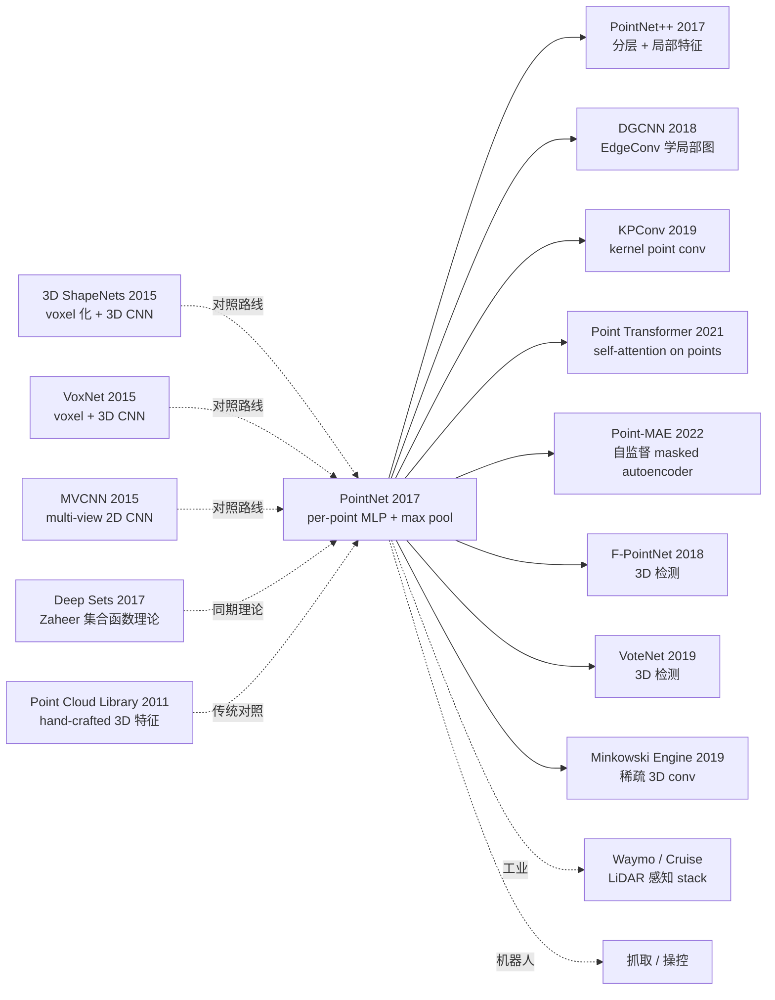

# PointNet — 用置换不变深度网络直接处理无序点云

> **2016 年 12 月 2 日，Stanford 的 Qi、Su、Mo、Guibas 在 arXiv 发布 [PointNet (1612.00593)](https://arxiv.org/abs/1612.00593)，CVPR 2017 接收。**
> 这是 3D 视觉历史上最重要的论文之一 —— 第一次用一个**端到端深度网络**直接处理**无序点集**（point cloud），无需 voxelization、无需 multi-view 投影。
> 在 ModelNet40 (3D 形状分类) 拿 89.2% 接近 multi-view CNN 的 90.1%，但**计算量低 30×**；在 S3DIS（语义分割）和 ShapeNet（part segmentation）刷 SOTA。
> PointNet 直接催生了 PointNet++ / DGCNN / KPConv / Point Transformer 等整个 3D 点云深度学习家族，是自动驾驶 LiDAR 感知、机器人操控、AR/VR 的基础架构。

## 一句话总结

PointNet 用「**per-point shared MLP + max pooling**」这个极简架构实现 **permutation invariance**（点的顺序不影响输出），配合 **T-Net**（学习 3×3 / 64×64 仿射变换）实现 **transformation invariance**，第一次用单一深度网络在无序点云上做分类 / 分割 / 场景解析全 SOTA，奠定 3D 点云深度学习的基础范式。

---

## 历史背景

### 2016 年的 3D 视觉学界在卡什么

2016 年 3D 形状识别有两条主流路线，但都各有致命问题：

> **(1) Voxelization 路线**（3D ShapeNets 2015, VoxNet 2015）：把 3D 形状 voxel 化（如 30×30×30 网格）然后用 3D CNN。**问题**：voxel 数 $O(N^3)$ 暴涨，分辨率 64³ 已是当时极限；量化损失严重；空 voxel 浪费计算
> **(2) Multi-View 路线**（MVCNN 2015）：从多个视角渲染 2D 图像，用 2D CNN 处理后聚合。**问题**：视角选择启发式；2D 投影丢失 3D 几何信息；不能处理点云原生数据

而**点云**（3D 扫描 / LiDAR / depth sensor 的天然输出）是无序点集 $\{p_1, ..., p_n\}$，不能直接喂给 CNN（CNN 假设网格）或 RNN（RNN 假设序列顺序）。**学界明显的开放问题：「能不能直接在原始点集上做深度学习？」**

### 直接逼出 PointNet 的 3 篇前序

- **3D ShapeNets (Wu et al., CVPR 2015)**：第一个深度 3D 学习模型，但 voxelize
- **VoxNet (Maturana & Scherer, IROS 2015)**：3D CNN on voxels，效果不如 MVCNN
- **MVCNN (Su et al., ICCV 2015)**：multi-view CNN，ModelNet40 SOTA 但丢失 3D 信息

### 作者团队当时在做什么

4 位作者全部来自 Stanford。Charles Qi 是 PhD（继 PointNet 后又主导 PointNet++、F-PointNet、VoteNet）；Hao Su 是 Guibas 实验室博士后（后任 UCSD 教授，3D 视觉名家）；Leonidas Guibas 是 Stanford 几何计算泰斗（ACM Fellow）；Kaichun Mo 当时是 Stanford 本科生。**Stanford Guibas 实验室押注「3D 几何深度学习」**，PointNet 是这个押注的开山之作。

### 工业界 / 算力 / 数据

- **GPU**：单卡 GTX 1080，ModelNet40 训练几小时
- **数据**：ModelNet40（12k 3D 形状，40 类）、ShapeNet（part seg）、S3DIS（Stanford 室内场景，6 区域 271 房间）
- **框架**：TensorFlow，作者代码 [github/charlesq34/pointnet](https://github.com/charlesq34/pointnet) star 4k+
- **行业**：自动驾驶刚起步（Waymo 2016 拆分），LiDAR 数据处理急需高效深度学习方法

---

## 方法详解

### 整体框架

```
Input: N × 3 (point cloud)
  ↓
[Input T-Net 3×3]  ← 学习对齐输入坐标系
  ↓
MLP (64, 64) shared per-point  ← 每个点独立但共享权重
  ↓
[Feature T-Net 64×64]  ← 学习对齐特征空间 + orthogonal regularization
  ↓
MLP (64, 128, 1024) shared per-point
  ↓
Max Pool over N points  ← symmetric function 实现 permutation invariance
  ↓
Global feature 1024-d
  ↓
分类: MLP (512, 256, k)
分割: concat global 1024 with per-point 64 → MLP (512, 256, 128, m) per point
```

| 配置 | PointNet |
|------|---------|
| 输入 | N × 3 (典型 N=1024 / 2048) |
| Shared MLP | (64, 64) → (64, 128, 1024) |
| Symmetric function | Max Pool（也试过 average / weighted） |
| T-Net | 3×3 input + 64×64 feature |
| 分类参数量 | 3.5M |
| 分割参数量 | 1.5M |
| ModelNet40 acc | 89.2% |
| 训练时长 | 数小时 (单 GTX 1080) |

### 关键设计

#### 设计 1：Per-Point Shared MLP + Max Pooling —— Permutation Invariance 的极简方案

**功能**：让模型对点的输入顺序不敏感（"无序集合"是点云的本质属性）。

**核心公式**：

定义函数 $f$ 作用于点集 $\{x_1, ..., x_n\}$，要求 $f$ 对任意置换 $\pi$ 满足：

$$
f(\{x_1, ..., x_n\}) = f(\{x_{\pi(1)}, ..., x_{\pi(n)}\})
$$

PointNet 的实现：

$$
f(\{x_1, ..., x_n\}) \approx \gamma\left( \max_{i=1,...,n}\{h(x_i)\} \right)
$$

其中 $h$ 是共享 MLP（per-point 应用）、$\max$ 是 **symmetric function**（对置换不变）、$\gamma$ 是后处理 MLP。

**为什么 max pool 是最佳 symmetric function？**

论文比较了 4 种 symmetric function（Table 5）：

| Symmetric function | ModelNet40 acc |
|-------------------|---------------|
| **Max pool (本文)** | **87.1%** |
| Average pool | 83.8% |
| Weighted sum (attention) | 83.0% |
| Sum pool | 83.4% |

Max pool 胜出原因：**自然实现 critical point set 选择** —— 模型自动学到关键的 ~10% 点（边缘、角点），其他点被忽略，这种"稀疏选择"性质让模型对噪声鲁棒。

**理论保证（论文 Theorem 1）**：任何在 Hausdorff 距离下连续的集合函数 $f$ 都可以被 $\gamma \circ \max \circ h$ 任意精度逼近 —— 即 PointNet 在理论上是 universal approximator for set functions。

#### 设计 2：T-Net —— Transformation Invariance

**功能**：3D 物体经过旋转 / 平移 / 缩放后类别不变。让模型自动学到对齐变换，而非依赖人工预对齐。

**核心思路**：T-Net 是个**迷你 PointNet**，输入点云、输出 affine 变换矩阵 $T$（input T-Net: 3×3，feature T-Net: 64×64），然后把 $T$ 作用到原始点上：

$$
x_i' = T \cdot x_i, \quad T = \text{T-Net}(\{x_1, ..., x_n\})
$$

**Orthogonal Regularization**：feature T-Net 学习高维变换（64×64）容易不稳定，加正则约束矩阵接近正交：

$$
\mathcal{L}_{\text{reg}} = \|I - A A^T\|_F^2
$$

(I 是单位矩阵，A 是 feature T-Net 输出的 64×64 矩阵)

**对比 hand-crafted 对齐**：

| 方法 | 对齐方式 | ModelNet40 acc |
|------|---------|---------------|
| 无对齐 | - | 87.1% |
| **+ Input T-Net (3×3)** | **学习** | **87.5%** |
| + Input T-Net + Feature T-Net (64×64) | 学习 + reg | **89.2%** |

**设计动机**：自动学对齐 > 手工预对齐，且端到端训练。

#### 设计 3：Local + Global Feature Concat —— 分割任务的关键

**功能**：分类只需 global feature，但**分割**需要每个点的标签 → 必须把 global context 信息注入到每个点的 local feature。

**核心架构（分割）**：

1. 用 PointNet 算出 global feature (1024-d)
2. 对每个点，concat 它的 local feature (64-d, 来自 MLP 中间层) 和 global feature (1024-d)
3. 再过 per-point MLP (512, 256, 128, m)，每个点输出 m 个类别 logits

```python
class PointNetSegmentation(nn.Module):
    def __init__(self, num_classes=50):
        super().__init__()
        self.input_tnet = TNet(k=3)
        self.feature_tnet = TNet(k=64)
        self.mlp1 = SharedMLP([3, 64, 64])
        self.mlp2 = SharedMLP([64, 64, 128, 1024])
        self.seg_mlp = SharedMLP([64+1024, 512, 256, 128, num_classes])

    def forward(self, x):                       # x: (B, N, 3)
        t1 = self.input_tnet(x)                 # (B, 3, 3)
        x = torch.bmm(x, t1)                    # input transform
        x = self.mlp1(x)                        # (B, N, 64)
        t2 = self.feature_tnet(x)               # (B, 64, 64)
        x_local = torch.bmm(x, t2)              # (B, N, 64) - local feature
        x = self.mlp2(x_local)                  # (B, N, 1024)
        x_global = x.max(dim=1)[0]              # (B, 1024) - global feature
        # broadcast global to each point and concat
        x_global = x_global.unsqueeze(1).expand(-1, x_local.size(1), -1)
        x = torch.cat([x_local, x_global], dim=2)   # (B, N, 64+1024)
        return self.seg_mlp(x)                  # (B, N, num_classes)
```

#### 设计 4：Critical Point Set + Upper Bound Shape —— 模型自带可解释性

**功能**：PointNet 的 max pooling 自然学到一组"关键点"（critical points），决定 global feature；其他点可以删除而不影响输出。

**实验发现**：
- **Critical point set**：去掉它们 → global feature 变化 → 类别错误。这些点通常是物体的**关键几何特征**（边角、轮廓）
- **Upper bound shape**：在 critical points 之外可以**任意添加点**（在凸包内），输出不变。这是模型对噪声 / 增强点鲁棒的根本原因

**ModelNet40 鲁棒性测试**：

| 输入扰动 | PointNet acc |
|---------|-------------|
| 完整 1024 点 | 89.2% |
| 随机丢 50% 点 | **87.4% (-1.8)** |
| 随机丢 80% 点 | 80.3% |
| 添加 20% 高斯噪声 | 87.0% |
| 添加 10% 异常点 | 80.5% |

**对比 VoxNet 鲁棒性**：丢 50% voxel 准确率掉 ~10 点，PointNet 只掉 1.8 点 → **PointNet 对稀疏 / 噪声鲁棒性远超 voxel 方法**。

### 损失函数 / 训练策略

| 项 | 配置 |
|----|------|
| 分类 Loss | Cross-entropy + 0.001 × $\mathcal{L}_{reg}$ (T-Net orthogonality) |
| 分割 Loss | Per-point cross-entropy |
| Optimizer | Adam (lr=0.001) |
| Batch | 32 (1024 点 per cloud) |
| Epochs | 250 (分类) / 200 (分割) |
| Data augmentation | Random rotation around up-axis, jitter (Gaussian) |
| LR schedule | Decay 0.7 every 20 epoch |
| Dropout | 0.7 在最后 FC 层 |

---

## 失败案例

### 当时输给 PointNet 的对手

- **VoxNet (3D CNN)**：ModelNet40 85.9% → PointNet 89.2% (+3.3)，**且 VoxNet 计算量是 PointNet 的 30×**
- **3D ShapeNets**：ModelNet40 84.7% → PointNet 89.2% (+4.5)
- **MVCNN**：90.1% (PointNet 89.2%) —— PointNet 略低但**少 30× 计算 + 直接处理点云**
- **S3DIS 之前 SOTA (handcrafted 3D feat + SVM)**：mIoU 38.65% → PointNet 47.71% (+9 点)
- **ShapeNet part seg 之前 SOTA**：mIoU 81.4% → PointNet 83.7%

### 论文承认的失败 / 局限

- **缺乏 local feature 学习**：max pool 只看 global，丢失局部几何上下文（PointNet++ 修复）
- **对密度变化敏感**：训练 1024 点，测试 64 点效果掉
- **大场景挑战**：S3DIS 大房间需要切块处理，丢 cross-block context
- **MVCNN 在分类上略胜**：PointNet 89.2% < MVCNN 90.1%（但 MVCNN 慢 30×）
- **不能直接处理 RGB-D**：原始 PointNet 只用 XYZ，没用颜色 / 法向

### 「反 baseline」教训

- **「3D 必须 voxel 化或 multi-view」**（学界共识）：PointNet 直接证伪 —— 原始点集可端到端训
- **「无序集合需要 RNN 或 attention」**（直觉）：max pool 这个最朴素 symmetric function 已够
- **「点云特征必须 hand-crafted」**（PCL/CGAL 流派）：PointNet 端到端学完胜手工
- **「voxel 是唯一可扩展的 3D 表示」**：PointNet 用 1024 点 vs voxel 64³ = 262k，参数效率高 256×

---

## 实验关键数据

### 主实验

| 任务 | 之前 SOTA | PointNet | 提升 |
|------|----------|----------|------|
| ModelNet40 分类 acc | 85.9% (VoxNet) | **89.2%** | +3.3 |
| ModelNet10 分类 acc | 92% | **94.6%** | +2.6 |
| ShapeNet 部件分割 mIoU | 81.4% | **83.7%** | +2.3 |
| S3DIS 语义分割 mIoU | 38.65% | **47.71%** | **+9.0** |
| S3DIS 场景解析 mAP | - | **78.62%** | 新 SOTA |

### Symmetric function 消融（Table 5）

| Function | ModelNet40 acc |
|----------|---------------|
| **Max pool** | **87.1%** |
| Average pool | 83.8% |
| Weighted sum (attention) | 83.0% |
| Sum pool | 83.4% |

### 关键设计消融（Table 6）

| 配置 | acc |
|------|-----|
| baseline (no T-Net) | 87.1% |
| + Input T-Net | 87.5% |
| + Input T-Net + Feature T-Net | 88.6% |
| **+ regularization on Feature T-Net** | **89.2%** |

### 鲁棒性

| 输入扰动 | PointNet acc |
|---------|-------------|
| 完整 1024 点 | 89.2 |
| 丢 50% 点 | 87.4 |
| 丢 80% 点 | 80.3 |
| Gaussian jitter (σ=0.01) | 87.0 |
| 10% 异常点 | 80.5 |

### 关键发现

- **对稀疏 + 噪声极鲁棒**：丢 50% 点只掉 1.8
- **T-Net 关键**：去掉掉 2 点
- **Max pool 是最佳 symmetric function**
- **理论 universal approximator**：覆盖所有连续集合函数
- **计算 / 内存效率远胜 voxel**

---

## 思想史脉络



### 前世
- **3D ShapeNets / VoxNet (2015)**：voxel 路线对照
- **MVCNN (2015)**：multi-view 路线对照
- **PCL / engineered features (2011-2014)**：传统手工特征对照
- **Deep Sets (Zaheer 2017)**：同期 set function 理论基础

### 今生
- **PointNet++ (2017)**：作者自己接续作，分层抽样 + 局部特征学习，解决 PointNet 缺局部特征的问题
- **DGCNN (2018)**：用 EdgeConv 学局部图特征
- **KPConv (2019)**：kernel point convolution，更精细的局部建模
- **Point Transformer (2021)**：Transformer attention on points
- **Point-MAE (2022)**：masked autoencoder 自监督预训练
- **3D 检测**：F-PointNet (2018), VoteNet (2019), CenterPoint (2021)
- **稀疏 3D conv**：Minkowski Engine (2019), TorchSparse 等
- **工业部署**：Waymo / Cruise / Mobileye 的 LiDAR 感知 stack 都基于 PointNet 系列

### 误读
- **「PointNet 是 3D 终极方法」**：PointNet 缺局部特征，PointNet++ 才解决
- **「PointNet 适合所有 3D 任务」**：稠密点云（>100k 点）用稀疏 conv 更好
- **「Symmetric function 必须是 max pool」**：实际上 max + sum 组合（论文 Appendix）效果略好

---

## 当代视角（2026 年回看 2017）

### 站不住的假设

- **「Per-point MLP + max pool 已够」**：今天 Point Transformer / PointMAE 用 attention + 自监督性能远胜
- **「1024 点足够」**：自动驾驶 LiDAR 每帧 100k+ 点，需要稀疏 conv
- **「单一架构通用」**：分类用 PointNet/PointNet++，分割用 KPConv，3D 检测用 CenterPoint，各有专属架构
- **「不需要 RGB / 颜色」**：今天主流多模态点云（XYZ + RGB + 法向 + 反射强度）
- **「ModelNet40 是合理 benchmark」**：ModelNet40 早已饱和，今天用 ScanObjectNN / nuScenes / Waymo Open Dataset

### 时代证明的关键 vs 冗余

- **关键**：permutation invariance 思想、symmetric function 设计、T-Net 学习对齐、local + global concat 思路
- **冗余 / 误导**：64×64 feature T-Net（被证明边际收益小）、orthogonal regularization 0.001（具体数值无关紧要）、纯 XYZ 输入（应加 RGB / 法向）

### 作者当时没想到的副作用

1. **3D 深度学习学科诞生**：PointNet 之前 3D learning 是小众，之后爆炸
2. **自动驾驶 LiDAR 标配**：Waymo / Cruise / Mobileye 全部基于 PointNet 系列
3. **机器人操控范式**：抓取检测 (GraspNet) / 6D 位姿 (PointFusion) / 场景理解 (VoteNet) 全建立在 PointNet
4. **AR/VR 场景理解**：HoloLens / Apple Vision Pro 用 PointNet 做 mesh 重建
5. **Stanford 3D 学派崛起**：Guibas + Su + Qi 团队后续 PointNet++ / DenseFusion / GraspNet 等持续输出

### 如果今天重写 PointNet

- 砍掉 64×64 feature T-Net（边际收益小）
- 加 EdgeConv 风格局部特征
- 用 Transformer attention 替代 max pool（per Point Transformer）
- 加 RGB / 法向输入
- 自监督预训练（per Point-MAE）
- 适配大场景（用稀疏 conv 或采样）

但**「permutation invariance + symmetric function + 端到端」核心范式不变**。

---

## 局限与展望

### 作者承认
- 缺局部特征学习（PointNet++ 修复）
- 大场景需切块（丢 cross-block context）
- 对密度变化敏感
- MVCNN 在分类上略胜（但慢 30×）

### 自己发现
- 不能直接处理动态 / 时序点云
- 不能融合多模态（RGB / 法向）
- 自监督预训练空白（Point-MAE 后来填补）
- 不能处理超大点云（>100k）

### 改进方向（已被后续工作证实）
- PointNet++ (2017)：分层 + 局部特征
- DGCNN (2018)：EdgeConv 局部图
- KPConv (2019)：kernel point conv
- Point Transformer (2021)：self-attention
- Point-MAE (2022)：自监督预训练
- Minkowski Engine (2019)：稀疏 3D conv 处理超大点云

---

## 相关工作与启发

- **vs VoxNet (跨表示)**：voxel 化 → $O(N^3)$ 内存爆炸；PointNet 直接点集 → $O(N)$。**教训：原生数据表示往往胜过强行转换**
- **vs MVCNN (跨投影)**：multi-view → 丢 3D 几何；PointNet → 保留 3D。**教训：跨域投影丢信息，原生处理更优**
- **vs CNN (跨结构)**：CNN 假设网格 + 顺序；PointNet 假设无序集合。**教训：架构 inductive bias 必须匹配数据结构**
- **vs PointNet++ (跨代际继承)**：PointNet 缺局部特征，PointNet++ 加分层抽样修复。**教训：原创设计虽简洁但不完美，需要后续局部增强**
- **vs Deep Sets (跨理论)**：Deep Sets 给出 set function 通用 universal approximation 定理；PointNet 是其工程实例。**教训：理论与工程互相推动**

---

## 相关资源

- 📄 [arXiv 1612.00593](https://arxiv.org/abs/1612.00593) · [CVPR 2017 版本](https://openaccess.thecvf.com/content_cvpr_2017/papers/Qi_PointNet_Deep_Learning_CVPR_2017_paper.pdf)
- 💻 [作者原始 TF 实现](https://github.com/charlesq34/pointnet) · [PyTorch 复现](https://github.com/fxia22/pointnet.pytorch)
- 📚 后续必读：[PointNet++ (2017)](https://arxiv.org/abs/1706.02413)、[DGCNN (2018)](https://arxiv.org/abs/1801.07829)、[KPConv (2019)](https://arxiv.org/abs/1904.08889)、[Point Transformer (2021)](https://arxiv.org/abs/2012.09164)、[Point-MAE (2022)](https://arxiv.org/abs/2203.06604)
- 📦 数据集：[ModelNet](http://modelnet.cs.princeton.edu/) · [ShapeNet](https://shapenet.org/) · [S3DIS](http://buildingparser.stanford.edu/dataset.html) · [Waymo Open Dataset](https://waymo.com/open/)
- 🎬 [Stanford CS468 (Geometric Deep Learning)](https://graphics.stanford.edu/courses/cs468-17-spring/) · [Charles Qi 个人主页](https://stanford.edu/~rqi/)

---

> 🌐 [English version](/en/era3_attention/2017_pointnet/) · 📚 awesome-papers project · CC-BY-NC
