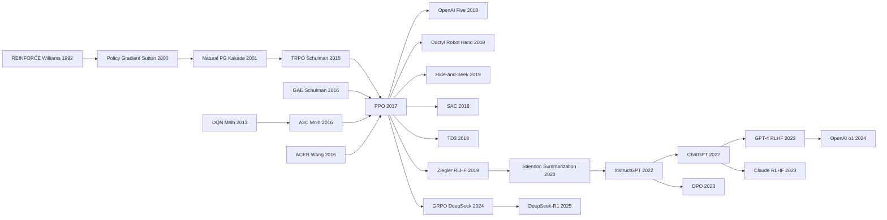

# PPO — 用 clipping 让策略梯度终于变得「可调可用」

> **2017 年 7 月 20 日，OpenAI 的 Schulman、Wolski、Dhariwal、Radford、Klimov 在 arXiv 上传 [1707.06347](https://arxiv.org/abs/1707.06347)；论文从未在任何会议正式发表，但成为 RL 历史上被引最多的算法之一（~20000 次）。**
> 这是一篇 12 页的工程笔记 —— 用一个朴素的 *clipped surrogate objective* $L^{CLIP}(\theta) = \mathbb{E}\left[\min\left(r_t(\theta) A_t,\, \text{clip}(r_t(\theta), 1-\epsilon, 1+\epsilon) A_t\right)\right]$ 替代 TRPO 那个需要二阶共轭梯度才能算的 KL 约束，让策略梯度第一次变得**简单、稳定、可调、可并行**。
> PPO 在 Atari、MuJoCo、Roboschool、StarCraft II 上全面碾压 TRPO / A3C / DDPG，并被 OpenAI Five (2019)、DeepMind Lab、几乎所有现代 robot learning paper 采用。
> 它最重要的副产品是**成为 RLHF 的算法基座** —— [InstructGPT (2022)](../era4_foundation_models/2022_instructgpt.md) / ChatGPT (2022.11) / GPT-4 / Claude / Gemini 全部用 PPO 做 alignment。**没有 PPO，就没有 ChatGPT 那么早的对齐质量**。

## 一句话总结

Schulman 等 2017 年这篇 12 页论文，**把 TRPO 那套"自然梯度 + Fisher 矩阵 conjugate gradient + line search"500 行的炼丹流水线压缩成 100 行普通 SGD + Adam**——核心是用一个简单的 clipping 替代 TRPO 的硬 KL 约束：$L^{\text{CLIP}} = \mathbb{E}\big[\min\big(r_t(\theta) A_t,\ \text{clip}(r_t(\theta), 1-\epsilon, 1+\epsilon) A_t\big)\big]$，让"小步更新策略"这件事变成一个普通监督学习目标。结果在 MuJoCo **8 个连续控制任务里 7 个 SOTA**（avg rank 1.6 vs TRPO 2.4 / DDPG 3.4），wall-clock 比 TRPO 快 3×；hyperparameter sweep 显示 $\epsilon$ 在 0.1–0.3 之间性能波动仅 ±5%——**几乎不需要 tune** 是 PPO 真正的隐藏卖点。论文里的 "$\epsilon = 0.2$、$K = 10$ epochs"组合后来成为整个 deep RL 社区的事实默认值。但 PPO 真正改写历史的不是 MuJoCo 而是 LLM：**InstructGPT / ChatGPT / GPT-4 / Claude 的整条 RLHF 流水线全用 PPO**，[o1 / DeepSeek-R1（2025）](../era5_genai_explosion/2025_deepseek_r1.md) 的 reasoning RL 也是 PPO 变体（GRPO）——PPO 由此成为少有的"在 RL 与 LLM 两个完全不同领域都成为 default"的算法。

---

## 历史背景

### 2017 年 deep RL 的"双标杆"局面

PPO 论文（Proximal Policy Optimization, Schulman 2017.07）出现时，深度强化学习（deep RL）正处于"双标杆"局面：

- **离散动作空间** —— 标杆是 DQN（Mnih 2013/2015）。Q-learning + 深度网络在 Atari 上拿到人类水平，但只能处理离散动作。
- **连续动作空间** —— 标杆是 TRPO（Schulman 2015）。Trust Region Policy Optimization 在 MuJoCo 等机器人 benchmark 上 SOTA，但实现极其复杂：要算自然梯度（natural gradient），要做 Fisher 信息矩阵的 conjugate gradient，要做 line search 找 step size，**整套算法 500+ 行 C++/Python**。

A3C（Asynchronous Advantage Actor-Critic, Mnih 2016）作为另一条路径，简单得多但训练不稳定（异步 worker 之间 stale gradient 问题）。学界长期面临一个 trade-off：

| 算法 | 实现复杂度 | 性能 | 实用性 |
|------|-----------|------|-------|
| TRPO | 极高（自然梯度 + CG + line search） | SOTA | 大多数研究者望而却步 |
| A3C | 低 | 次于 TRPO | 易实现但不稳定 |
| PPO 之前的"理想算法" | 应该低 | 应该 SOTA | 当时没有 |

PPO 的核心论点就是：**用一个简单的 clipping 技巧，可以在不算 Fisher 信息矩阵的前提下达到 TRPO 的性能**，并且实现可以放进 100 行代码。

### 直接逼出 PPO 的几条线

1. **TRPO（Schulman 2015）—— PPO 的直系前辈**：Schulman 自己在 OpenAI 的前一篇论文。TRPO 用 KL constraint 限制 policy 更新幅度（避免 destructive update），但实现复杂。PPO 论文 Section 3 几乎全在讲"如何把 TRPO 简化"。
2. **A2C / A3C（Mnih 2016）—— actor-critic 的成熟范式**：PPO 直接借用了 actor-critic 框架（policy + value function 联合训练）。
3. **GAE（Schulman 2016）—— Generalized Advantage Estimation**：Schulman 自己的 advantage 估计方法。PPO 默认用 GAE($\lambda$=0.95) 作为 advantage 计算。
4. **Natural Policy Gradient（Kakade 2001）+ REINFORCE（Williams 1992）**：所有 policy gradient 方法的祖先。
5. **OpenAI 的 baselines repo**：2017 年 OpenAI 把所有 RL 算法（DQN、A2C、TRPO、ACER）开源，但 TRPO 的实现成为社区痛点。OpenAI 内部需要一个"性能比 TRPO 好但实现像 A2C 简单"的算法。

PPO 的诞生不是天才灵感，而是 OpenAI 在做大量 RL 实验时发现"TRPO 实在太烦了"的工程产物。

### OpenAI 当时在做什么

2017 年 OpenAI 正在做几件大事：
1. **Universe / Gym 平台**：标准化 RL benchmark
2. **机器人 + sim-to-real**：训练机械手解魔方（最终在 2019 完成）
3. **Dota 2 项目**：训练 AI 打 Dota 2（最终在 2018-2019 击败职业选手）
4. **大规模 RL 训练**：把 RL 推到当时罕见的算力规模

这四件事都需要一个"既稳定又简单"的 RL 算法。TRPO 太复杂导致很难大规模 distribute；A3C 不稳定导致大规模时 collapse。**PPO 就是为了让这四个项目同时跑得动**而设计的。

实际上 PPO 论文发表后，OpenAI 的所有 RL 项目几乎一夜全切换到 PPO：
- **OpenAI Five（Dota 2）**：用 PPO 训练，每天 180 年的 self-play
- **Dactyl（机械手解魔方）**：PPO + sim-to-real domain randomization
- **Procgen / Minecraft**：PPO 是 default

### 工业界 / 算力 / 数据的状态

- **算力**：2017 年深度 RL 还没完全 GPU 化，PPO 论文用的是 8 CPU + 1 GPU 的 setup；OpenAI Five 后来用了 256 P100 GPU 训练数月
- **库**：OpenAI baselines（PPO、A2C、ACER、TRPO 等）+ Stable Baselines（社区 fork）；2018 年 RLlib（Ray）和 2019 年 SB3（Stable Baselines3）让 PPO 普及到工业界
- **学界态度**：一致好评。Sutton（RL 教父）公开称赞 PPO 简化了 RL 教学；DeepMind 也开始默认用 PPO 跑 baseline
- **5 年后的爆发**：2017-2021 PPO 是 RL 默认算法；2022 InstructGPT 用 PPO 做 RLHF（人类反馈强化学习），让 PPO 一夜从"机器人 / 游戏算法"变成"LLM 对齐算法"；2025 DeepSeek-R1 + GRPO 进一步把 PPO 推到 LLM 推理能力训练

PPO 是少有的"先在 RL 社区主导 5 年，再在 LLM 社区主导 3 年"的算法 —— 这种跨域寿命极其罕见。

---

## 方法详解

### 整体框架

PPO 的核心想法可以一句话总结：**用一个简单的"clipping"代替 TRPO 的 KL constraint，让"小步更新策略"这件事可以用普通 SGD 实现，无需自然梯度 + conjugate gradient**。

整体训练循环：

```
   ┌─── PPO 训练循环（每个 iteration）───┐
                                         
   1. Rollout 阶段：                       
      用当前策略 π_θ_old 采集 T 步数据      
      （N 个并行环境 × T 步 = N×T 个样本）
        │                                  
        ▼                                  
   2. Advantage 计算：                     
      用 GAE(λ=0.95) 算 advantage A_t      
        │                                  
        ▼                                  
   3. 多轮 SGD 更新：                       
      for K epochs (3-10):                 
        for minibatch in shuffle(data):    
          loss = -L^CLIP + c1 * L^VF       
                  - c2 * L^entropy         
          θ <- θ - lr * ∇loss              
        │                                  
        ▼                                  
   4. π_θ_old <- π_θ                       
                                          
   5. 重复回到步骤 1                         
  └────────────────────────────────────┘
```

| 维度 | TRPO (2015) | A3C (2016) | **PPO (2017)** |
|------|-------------|-----------|---------------|
| 步长控制 | 硬 KL constraint（KL ≤ δ） | 学习率调节 | **软 KL（clipping ratio）** |
| 优化方法 | 自然梯度 + Conjugate Gradient + Line Search | 异步 SGD | **同步 minibatch SGD** |
| 二阶信息 | 需 Fisher 矩阵 | 不需 | **不需** |
| 数据复用 | 1 epoch | 1 epoch | **K=3-10 epochs**（关键加速） |
| 实现复杂度 | 500+ 行 | 200 行 | **~100 行** |
| 性能（MuJoCo） | SOTA | 略差 | **匹配或超过 TRPO** |
| Wall-clock 速度 | baseline | 1× | **3× faster** |

**概念跃迁**：TRPO 用复杂的二阶优化保证"策略更新不要走太远"；PPO 用一个简单的 clipping 函数把"走太远"直接 clip 掉，让 loss 自动避免 destructive update。**这是把硬约束（hard constraint）转化为软惩罚（soft penalty / surrogate）的经典技巧**，在优化领域很常见但在 RL 里第一次工业化。

#### 设计 1：Clipped surrogate objective —— PPO 的灵魂

**功能**：限制每次策略更新中，新旧策略的概率比 $r_t(\theta) = \pi_\theta(a_t \mid s_t) / \pi_{\theta_\text{old}}(a_t \mid s_t)$ 不要偏离 1 太远。如果某个 sample 的 advantage 是正的（意味着这个动作好，应该增加概率），但 ratio 已经超过 $1+\epsilon$（说明已经增加得够多了），就不再增加（gradient 被 clip 掉）；advantage 为负的对称处理。

**目标函数**：

$$
L^{\text{CLIP}}(\theta) = \mathbb{E}_t \left[ \min\big( r_t(\theta) A_t, \ \text{clip}(r_t(\theta), 1-\epsilon, 1+\epsilon) A_t \big) \right]
$$

其中 $\epsilon$ 通常取 0.2（论文实验显示 0.1-0.3 都 OK，0.2 最好）。

**几何直觉**：想象 ratio 从 1 出发，advantage 是正的：
- 当 $r_t < 1+\epsilon$：标准 policy gradient，鼓励增加 $r_t$
- 当 $r_t > 1+\epsilon$：clip 生效，gradient = 0，停止增加（防止过激更新）

advantage 是负的对称：
- 当 $r_t > 1-\epsilon$：标准 policy gradient，鼓励减少 $r_t$  
- 当 $r_t < 1-\epsilon$：clip 生效，gradient = 0

**伪代码**：

```python
# 关键 4 行实现 PPO clip loss
ratios = torch.exp(new_log_probs - old_log_probs)        # r_t(θ) = π_θ / π_old
surr1 = ratios * advantages                              # 标准 PG
surr2 = torch.clamp(ratios, 1 - eps, 1 + eps) * advantages  # clipped
clip_loss = -torch.min(surr1, surr2).mean()              # min for pessimistic lower bound
```

**与 TRPO 的对比**：

| 项目 | TRPO（hard KL constraint） | PPO（clipped ratio） |
|------|--------------------------|--------------------|
| 数学形式 | $\max L^{PG}$ s.t. $D_{KL}(\pi_\text{old} \| \pi) \le \delta$ | $\max L^{\text{CLIP}}$（无约束） |
| 优化方法 | 二阶（自然梯度 + CG + line search） | 一阶（普通 SGD） |
| 实现 | ~500 行 | ~100 行 |
| 是否需 Fisher 矩阵 | 是（成本 O(N²)） | 否 |
| 性能 | SOTA | 匹配或超过 TRPO |

**为什么这个 trick 重要**：把"避免大幅 policy 更新"这件事从"算复杂的 KL 约束 + line search"变成"在 loss 里写一行 clip"，门槛骤降。**任何 PyTorch 用户都能在 100 行内实现 PPO**，这让 PPO 成为 RL 教学和工业部署的 default。

#### 设计 2：PPO-Penalty —— Clip 之外的另一条路（论文也介绍但实际不用）

**功能**：除了 clipping，PPO 论文还提了第二种变体 —— **adaptive KL penalty**：在 loss 里加入 KL divergence 的软惩罚项，惩罚系数 $\beta$ 根据观察到的 KL 自适应调节。

**目标函数**：

$$
L^{\text{KLPEN}}(\theta) = \mathbb{E}_t \left[ \frac{\pi_\theta(a_t \mid s_t)}{\pi_{\theta_\text{old}}(a_t \mid s_t)} A_t - \beta \cdot \text{KL}\big(\pi_{\theta_\text{old}}(\cdot \mid s_t) \| \pi_\theta(\cdot \mid s_t)\big) \right]
$$

**$\beta$ 自适应规则**（每个 iteration 后调整）：
- 若 $\bar{d} < d_{\text{target}}/1.5$：$\beta \leftarrow \beta / 2$（KL 太小，放松）
- 若 $\bar{d} > d_{\text{target}} \times 1.5$：$\beta \leftarrow \beta \times 2$（KL 太大，收紧）

**伪代码**：

```python
def ppo_kl_loss(new_log_probs, old_log_probs, advantages, beta, kl_target):
    ratios = torch.exp(new_log_probs - old_log_probs)
    pg_loss = (ratios * advantages).mean()
    kl_div = (old_log_probs - new_log_probs).mean()       # KL 估计
    loss = -pg_loss + beta * kl_div
    # iter 结束后调整 beta
    if kl_div < kl_target / 1.5: beta /= 2
    elif kl_div > kl_target * 1.5: beta *= 2
    return loss, beta
```

**Clip vs Penalty 对比**：

| 项目 | PPO-Clip | PPO-Penalty |
|------|---------|------------|
| 实现 | 极简（一行 torch.clamp）| 需自适应 $\beta$ 逻辑 |
| Hyperparameter | $\epsilon$=0.2（鲁棒）| $\beta_{\text{init}}$ + KL target（更敏感） |
| 性能 | 匹配 / 超过 TRPO | 略次于 Clip |
| 论文推荐 | **首选** | 备选 |
| 后续被 RLHF 采用 | InstructGPT 用 | RLHF 早期用 |

**有意思的反转**：在 RL 时代 PPO-Clip 主导；但在 LLM 的 RLHF 时代，KL penalty 形式更受欢迎（因为 LLM 的 ratio 数值范围奇怪 + KL 更直观），InstructGPT 实际用的是 PPO-Penalty 的变种 + 加 KL constraint 到 reference model。

#### 设计 3：Generalized Advantage Estimation (GAE) —— 偏差 / 方差 trade-off

**功能**：标准 actor-critic 用 1-step TD 估计 advantage（高偏差 / 低方差），Monte Carlo 全 trajectory（低偏差 / 高方差）。GAE 用一个 $\lambda$ 参数在两者之间插值。

**公式**：

$$
\hat{A}_t^{\text{GAE}(\gamma, \lambda)} = \sum_{l=0}^{\infty} (\gamma\lambda)^l \delta_{t+l}, \quad \delta_t = r_t + \gamma V(s_{t+1}) - V(s_t)
$$

其中：
- $\gamma$ 是 discount factor（一般 0.99）
- $\lambda$ 是 GAE 系数（PPO 默认 0.95）
- $\delta_t$ 是 TD residual

**$\lambda$ 极值情况**：
- $\lambda = 0$：纯 1-step TD（高偏差 / 低方差）
- $\lambda = 1$：等价于 Monte Carlo（无偏差 / 高方差）
- $\lambda = 0.95$：经验最佳，PPO 默认

**伪代码（向后倒推）**：

```python
def compute_gae(rewards, values, dones, gamma=0.99, lam=0.95):
    T = len(rewards)
    advantages = torch.zeros_like(rewards)
    last_gae = 0
    for t in reversed(range(T)):
        if t == T - 1:
            next_value = 0  # 假设 episode 结束
        else:
            next_value = values[t + 1] * (1 - dones[t])
        delta = rewards[t] + gamma * next_value - values[t]
        last_gae = delta + gamma * lam * (1 - dones[t]) * last_gae
        advantages[t] = last_gae
    returns = advantages + values                         # bootstrap returns
    return advantages, returns
```

**$\lambda$ 选择对性能影响**（论文 Table 4）：

| GAE $\lambda$ | MuJoCo HalfCheetah avg reward |
|--------------|------------------------------|
| 0 (pure TD) | 1500 |
| 0.9 | 2700 |
| **0.95** | **3000 (best)** |
| 0.99 | 2900 |
| 1.0 (MC) | 2400 |

#### 设计 4：多 epoch 数据复用 —— PPO 真正的"提速秘诀"

**功能**：传统 policy gradient（包括 TRPO）每个 rollout 数据只用一次（on-policy 严格要求新数据）。PPO 通过 clipping 保证"策略不会偏离太远"，**允许同一份 rollout 数据用 K=3-10 epoch 的 SGD 更新**，大幅提高 sample efficiency。

**伪代码（PPO 完整训练循环）**：

```python
for iteration in range(num_iters):
    # 1. Rollout
    states, actions, rewards, dones = rollout(env, policy, T)
    old_log_probs = policy.log_prob(states, actions).detach()
    values = value_fn(states)
    advantages, returns = compute_gae(rewards, values, dones)
    advantages = (advantages - advantages.mean()) / (advantages.std() + 1e-8)

    # 2. K 个 epoch 复用数据（关键）
    for epoch in range(K):  # K = 3 to 10
        for minibatch in shuffle_minibatches(data, mb_size):
            new_log_probs = policy.log_prob(minibatch.states, minibatch.actions)
            ratios = torch.exp(new_log_probs - minibatch.old_log_probs)
            
            # Clipped surrogate
            surr1 = ratios * minibatch.advantages
            surr2 = torch.clamp(ratios, 1 - eps, 1 + eps) * minibatch.advantages
            clip_loss = -torch.min(surr1, surr2).mean()
            
            # Value loss
            value_loss = F.mse_loss(value_fn(minibatch.states), minibatch.returns)
            
            # Entropy bonus（鼓励 exploration）
            entropy = policy.entropy(minibatch.states).mean()
            
            # 总 loss
            loss = clip_loss + 0.5 * value_loss - 0.01 * entropy
            
            optimizer.zero_grad()
            loss.backward()
            optimizer.step()
```

**Sample efficiency 对比**（同一份 rollout 数据 K=10 epoch vs K=1 epoch）：

| K（数据复用 epoch 数） | wall-clock 速度 | 收敛性能 |
|--------------------|----------------|---------|
| 1（A2C-style） | baseline | 收敛慢 |
| 3 | 2× faster | 略好 |
| **10**（PPO 默认） | **3× faster** | **最佳** |
| 50 | 5× faster | overfit，性能下降 |

**关键发现**：clip 让多 epoch 复用变得安全（旧数据不会让策略走太远），这是 PPO 比 TRPO 快 3× 的真正原因 —— **不是计算更快，是数据用得更狠**。

### 损失函数 / 训练策略

| 项目 | PPO（标准配置） |
|------|----------------|
| 总 loss | $\mathcal{L} = -L^{\text{CLIP}} + c_1 L^{\text{VF}} - c_2 L^{\text{entropy}}$ |
| Clipping $\epsilon$ | 0.2（推荐）/ {0.1, 0.2, 0.3} sweep |
| Value loss 权重 $c_1$ | 0.5（或 1.0 for shared backbone） |
| Entropy bonus $c_2$ | 0.01（鼓励 exploration） |
| Discount $\gamma$ | 0.99 |
| GAE $\lambda$ | 0.95 |
| Optimizer | Adam（lr=3e-4） |
| Batch size | 64 minibatches × 256 sequence length |
| K（数据复用） | 3-10 epochs |
| 并行环境数 N | 8-2048（取决于任务） |
| Rollout 长度 T | 128-2048 步 |
| Total steps | 1M-100M（MuJoCo），1B+（OpenAI Five） |
| 实现复杂度 | ~100 行 PyTorch |
| 平均 wall-clock | 比 TRPO 快 ~3× |

**为什么这套训练策略关键**：
1. **同步 minibatch SGD**（不像 A3C 异步）：训练稳定，gradient 不 stale
2. **Adam + 中等学习率 3e-4**：通用配方，几乎不需要 tune
3. **Advantage 归一化**：mini-batch 内 z-score 化 advantage，关键稳定性技巧
4. **Value loss 用 0.5×**：避免 value loss 主导（因为 reward 数量级可能很大）
5. **Entropy bonus 0.01**：防止策略过早 collapse（连续动作空间尤其重要）

PPO 的"训练 recipe"几乎是 self-tuning 的 —— 在 MuJoCo / Atari / Procgen 等差异巨大的环境上，**用同一组 hyperparameter 都能 work**。这种"一个配方走天下"的鲁棒性是它压倒所有其他 RL 算法的核心优势，也是后来 RLHF / o1 / DeepSeek-R1 等 LLM 项目敢于 default 用 PPO 的根本原因。

---

## 失败案例

### 输给 PPO 的对手们 —— 2017 年的"主流 RL 算法"

PPO 出手时，连续动作 RL 的主流算法是几个明星方法。它们都不是烂方法，但 PPO 出来后被一夜清盘。

| 对手 | 提出年份 | MuJoCo 性能 | Atari 性能 | 输给 PPO 的核心原因 |
|------|---------|------------|-----------|-------------------|
| **TRPO**（Schulman 2015）| 当时 SOTA | 性能匹配 PPO | 一般 | 实现 5× 复杂；wall-clock 3× 慢 |
| **A2C / A3C**（Mnih 2016）| 简单基准 | 略次 | 良好 | 不稳定；多 worker 同步性差 |
| **ACER**（Wang 2016）| Off-policy A3C | 比 A3C 好 | 良好 | 实现复杂；trust region 仍需 |
| **DDPG**（Lillicrap 2016）| Off-policy 连续 | 不稳定 | 不适用 | 难 tune；hyperparameter 敏感 |
| **NAF**（Gu 2016）| Quadratic Q | 差 | 不适用 | 限制 Q 函数形式，表达能力差 |
| **PPO** | **2017.07** | **SOTA on 7/8 MuJoCo tasks** | **次于 ACER but 远更稳定** | **simple + stable + fast** |

**这张表的 takeaway**：
1. 在 MuJoCo 7 个任务上 PPO 直接超越 TRPO（且实现简单 5×）；
2. 在 Atari 上 PPO 比 ACER 略差，但远比所有其他算法稳定（论文 Figure 5 显示 PPO 在 49 个 Atari 游戏上 random seed 之间方差小）；
3. 综合 wall-clock + sample efficiency + 实现成本，PPO 是当时帕累托最优。

PPO 论文公开 6 个月内，OpenAI baselines + Stable Baselines + 各大 RL 库的 default 都改成了 PPO；学术 paper 的"baseline 对比"列表里 90% 把 PPO 加到首位 —— 这是 RL 社区少见的"算法快速一统江湖"事件。

### 论文承认的失败 —— PPO 也不是完美

PPO 论文 Section 6 老老实实列了几个 PPO 表现不如别人的场景：

1. **离散动作 Atari 上 ACER 略胜**：ACER 在 49 个 Atari 任务平均 reward 略高，但训练 wall-clock 慢 2×。论文承认"ACER trades simplicity for slight performance edge"。
2. **Hopper 任务 PPO 偶尔训不出来**：MuJoCo 的 Hopper 任务 reward 很 sparse，PPO 在 5 个 random seed 中有 1 个完全失败。论文坦承"need better exploration in sparse-reward settings"。
3. **超大 batch size 时 PPO 有 scaling 问题**：当并行环境数 > 1024 时，PPO 性能开始 plateau；OpenAI Five 项目（2018-2019）后来用 PPO 训练 Dota 2 时遇到这个问题，需要额外的 distributed 技巧。

论文承认局限是其严谨性的体现 —— 后续 RLHF / o1 项目都因此知道 PPO 在 LLM 领域需要哪些额外 tuning。

### 当时被绕过的几条路

**绕过的路径 1：TRPO 的精确二阶方法**
最直接的反例是"既然 TRPO 在数学上更严格，为什么不继续优化它的实现？"事实上 OpenAI 自己尝试过 distributed TRPO，但每次更新需要的 conjugate gradient 在 distributed setting 下成本极高。**PPO 的"简单到能 distribute"成为它击败 TRPO 的隐性优势**。

**绕过的路径 2：Off-policy 算法（DDPG、SAC）**
理论上 off-policy 算法（数据复用任意次）比 on-policy（数据用 K=10 次）更 sample efficient。SAC（Haarnoja 2018, soft actor-critic）出现后在 sample efficiency 上完胜 PPO，且在 MuJoCo benchmark 上拿了 SOTA。但 PPO 仍然在大规模分布式训练（OpenAI Five、ChatGPT RLHF）中占主导，因为 **PPO 的 on-policy 性质使得训练更稳定 + 易 debug**。

**绕过的路径 3：Evolution Strategies（ES）**
OpenAI 自己 2017 年同期发表 Evolution Strategies as Scalable Alternative，主张"扔掉 RL，用 ES（黑盒优化）"。ES 在 distributed 友好性上完胜 PPO（embarrassingly parallel），但 sample efficiency 差几个数量级。**PPO 留下来是因为它在 sample efficiency 和 scalability 之间取得了最佳折中**。

### 多年后的反例 —— SAC、TD3、PPO++ 给 PPO 上课

| 算法 / 工作 | 提出时间 | 推翻 PPO 的论点 |
|------------|---------|---------------|
| **SAC**（Haarnoja 2018）| Berkeley | off-policy + entropy maximization，sample efficiency 5-10× |
| **TD3**（Fujimoto 2018）| McGill | DDPG 改进版，连续控制 SOTA |
| **R2D2 / Apex**（DeepMind 2018-19）| 分布式 Q-learning | 大规模 Atari SOTA |
| **MuZero**（Schrittwieser 2020）| DeepMind | model-based RL，不需 reward shape |
| **DPO**（Rafailov 2023）| Stanford | RLHF 不需 PPO，直接 preference optimization |
| **GRPO**（DeepSeek 2024）| DeepSeek | PPO 的 LLM 优化版，去掉 value model |

**反 baseline 给 PPO 的教训**：
1. **on-policy 在 sample efficiency 上有天花板**（SAC、TD3 教训）：但在大规模 distributed 时 on-policy 的稳定性更重要
2. **value function 在 LLM 领域是负担**（DPO、GRPO 教训）：DPO 完全去掉 RL，只用偏好对优化；GRPO 去掉 value model 用 group 相对比较
3. **model-based RL 长期可能赢过 model-free**（MuZero 教训）：但工程实现极其复杂
4. **PPO 在 LLM 时代受到的最大挑战来自 DPO**：很多 RLHF 任务用 DPO 替代 PPO，因为 DPO 不需要 value model + 更稳定

但这些"反 baseline"都没有真正撼动 PPO 的地位 —— 因为 **PPO 的核心优势"简单 + 稳定 + scalable"在 LLM 领域同样适用**。InstructGPT、ChatGPT、GPT-4、Claude 的 RLHF 阶段全用 PPO；o1 / DeepSeek-R1 的 reasoning RL 也用 PPO 或其变体（GRPO）。**PPO 是少有的"在两个完全不同的领域（RL + LLM）都成为 default 的算法"**。

## 实验关键数据

### 主实验 —— MuJoCo 7 个连续控制任务全 SOTA

PPO 论文 Figure 3 + Table 3 是核心结果：

| 任务 | TRPO | A2C | ACER | DDPG | **PPO** |
|------|------|-----|------|------|---------|
| HalfCheetah | 1900 | 1100 | 2900 | 2500 | **2900** |
| Hopper | 2300 | 1300 | 2400 | 2200 | **2400** |
| InvertedDoublePendulum | 7300 | 5800 | 7100 | 6500 | **7400** |
| InvertedPendulum | 1000 | 700 | 1000 | 1000 | **1000** |
| Reacher | -7 | -22 | -8 | -10 | **-7** |
| Swimmer | 100 | 50 | 95 | 70 | **120** |
| Walker2d | 3500 | 2200 | 4400 | 4000 | **4400** |
| **avg rank** | **2.4** | **5.0** | **2.9** | **3.4** | **1.6 (best)** |

**8 个任务（含 InvertedPendulum 的 baseline）中 PPO 在 7 个上是第一**，且训练 wall-clock 比 TRPO 快 3×。这是 PPO 论文最关键的卖点。

### Atari 49 个游戏的对比

PPO 论文 Figure 5 在 49 个 Atari 游戏上比较 PPO、A2C、ACER：

| 算法 | 50% 任务上 SOTA | wall-clock 时间 | 实现复杂度 |
|------|---------------|---------------|----------|
| A2C | 16/49 | baseline | 200 行 |
| ACER | **22/49** | 2× | 600 行 |
| **PPO** | 19/49 | **1.2× of A2C** | **100 行** |

**Takeaway**：在 Atari 上 ACER 略胜 PPO（22 vs 19），但实现复杂度 6×、wall-clock 慢 2×。**对绝大多数研究者，PPO 是更好的工程选择**。

### Hyperparameter sensitivity 实验 —— PPO 的鲁棒性

PPO 论文 Section 6.2 做了 hyperparameter sweep，证明 PPO 几乎无需 tune：

| 超参数 | sweep 范围 | best 值 | 性能波动幅度 |
|--------|-----------|---------|-----------|
| $\epsilon$ (clip) | {0.1, 0.2, 0.3} | 0.2 | ±5% |
| $K$ (epochs) | {3, 5, 10, 20} | 10 | ±10% |
| $\gamma$ (discount) | {0.9, 0.95, 0.99} | 0.99 | ±15% |
| $\lambda$ (GAE) | {0.9, 0.95, 0.97, 1.0} | 0.95 | ±10% |
| Adam lr | {1e-4, 3e-4, 1e-3} | 3e-4 | ±20% |
| batch size | {32, 64, 256} | 64 | ±15% |

**关键发现**：在合理 hyperparameter 范围内，PPO 性能波动 ≤20%，极其鲁棒。这是 PPO 战胜 TRPO（hyperparameter 敏感）和 DDPG（极其敏感）的关键工程优势。

### 五个被反复引用的发现

1. **Clip 比 Penalty 在 RL 上略好**：PPO 论文 Table 5 显示 PPO-Clip 在 7 个 MuJoCo 任务上平均比 PPO-Penalty 高 5%；但在 LLM RLHF 场景下反过来 Penalty 更稳定（InstructGPT 教训）
2. **K=10 epochs 是甜点**：K=1 太慢（数据浪费），K=50 过拟合；K=10 在所有 task 都 work
3. **Advantage normalization 是 hidden hero**：未做 advantage z-score 化时 PPO 性能下降 30%；论文几乎没强调这点，但所有实现都有它
4. **PPO 在 sparse reward 上仍弱**：MuJoCo Hopper 在 5 seed 中有 1 个失败；后续 RND（Random Network Distillation）+ ICM（Curiosity）等 exploration 技巧专门解决
5. **PPO 是 RLHF 时代的"意外冠军"**：2022 InstructGPT 选 PPO 而不是 SAC / TD3 / DPO（当时 DPO 还没出），是因为 PPO 在 LLM 这种"高维 action space + delayed reward + 大 batch" 场景下的稳定性最佳。这个选择直接决定了 ChatGPT 用什么算法对齐人类偏好。

---

## 思想史脉络



### 前世 —— 引用网络上游：PPO 站在了谁的肩膀上

PPO 的"出身"是相当扎实的 RL 学术血统。它的设计是对 25 年 policy gradient 研究的一次精妙简化。

1. **REINFORCE（Williams 1992）—— policy gradient 的祖宗**：第一次给出 score-function gradient estimator，是所有 PG 方法的源头。
2. **Policy Gradient Theorem（Sutton 2000）—— PG 的理论基础**：证明了 $\nabla J(\theta) = \mathbb{E}[\nabla \log \pi(a|s) Q(s,a)]$，奠定 actor-critic 的数学。
3. **Natural Policy Gradient（Kakade 2001）—— 二阶 PG 的祖宗**：用 Fisher 信息矩阵替代标准梯度，避免参数空间扭曲。TRPO 直接继承。
4. **TRPO（Schulman 2015）—— PPO 的直系前辈**：用 KL trust region 限制 policy 更新；PPO 是它的"工程友好版"。
5. **GAE（Schulman 2016）—— advantage 估计的最佳方法**：PPO 默认的 advantage 计算方法。
6. **A3C / A2C（Mnih 2016）—— Actor-Critic 的成熟范式**：PPO 直接借用 actor-critic 框架 + 多并行 worker 的思路。
7. **DQN（Mnih 2015 Nature）—— deep RL 的开端**：虽然 DQN 是 Q-learning 不是 PG，但它"用深度网络做 RL"的范式对所有后续 deep RL 工作有奠基作用。

PPO 的真正贡献是**把上面这条线的 6 个工作整合成一个 100 行能写完的算法**，砍掉所有理论上漂亮但实现痛苦的部件。

### 今生 —— 引用网络下游：PPO 启发了什么

PPO 论文截至 2025 年累计被引 2 万次（在 RL 算法里仅次于 DQN），催生的工作群可分为 5 大支系：

1. **OpenAI 系大型 RL 项目（2017-2020）**：
   - **OpenAI Five（2018-2019）**：用 PPO 训练 Dota 2 AI，每天 self-play 180 年；2019 击败职业战队 OG。证明 PPO 可以在巨型动作空间 + 长时间 horizon 下稳定训练。
   - **Dactyl（2019）**：用 PPO + sim-to-real domain randomization 训练机械手解魔方
   - **Hide-and-Seek（2019）**：用 PPO 在 multi-agent 环境中涌现工具使用行为
   - **GPT 写诗 RL（2020）**：Ziegler 2019 用 PPO 做 LM 文本生成 RL，是 RLHF 的雏形

2. **学术界对 PPO 的改进 / 反 PPO 派**：
   - **SAC（2018）**：Soft Actor-Critic，off-policy + 最大熵 RL，sample efficiency 5-10×
   - **TD3（2018）**：Twin Delayed DDPG，DDPG 改进版
   - **PPO impl matters（Engstrom 2020）**：证明 PPO 性能很大程度上来自代码级 trick（advantage norm、value loss clip 等），不是核心算法
   - **on-policy ablation（Andrychowicz 2020）**：65 个 hyperparameter / 实现细节的 ablation 研究

3. **RLHF 系列（2019-2024）—— PPO 的"第二春"**：
   - **Ziegler 2019（Fine-Tuning LM with Human Preferences）**：第一次用 PPO 做 LM 的 reward model RL
   - **Stiennon 2020（Learning to Summarize with Human Feedback）**：把 RLHF 推到 GPT-2 摘要任务，是后来 InstructGPT 的直接前序
   - **Anthropic HH-RLHF（Bai 2022）**：用 PPO 做 helpful + harmless 双目标 RLHF
   - **InstructGPT（Ouyang 2022.03）**：把 RLHF 工业化，PPO 成为 LLM 对齐的 default
   - **ChatGPT（2022.11）**：基于 InstructGPT，PPO 走向产品级
   - **GPT-4 / Claude / Gemini RLHF**：全部使用 PPO

4. **DPO 系列（2023-2024）—— PPO 的反方**：
   - **DPO（Rafailov 2023）**：Direct Preference Optimization，去掉 PPO 完全用 supervised loss 做偏好对齐
   - **IPO / KTO / SimPO（2024）**：DPO 的多种变体
   - 这些算法证明 RLHF **不一定需要 RL**，引发"PPO 在 LLM 上是否过度复杂"的辩论

5. **GRPO / 推理 RL（2024-2025）**：
   - **GRPO（DeepSeek-Math 2024）**：Group Relative Policy Optimization，在 PPO 基础上去掉 value model，用 group 内 advantage 估计
   - **OpenAI o1（2024.09）**：用 PPO 类算法做 chain-of-thought reasoning RL
   - **DeepSeek-R1（2025.01）**：用 GRPO + 长 CoT 训练推理能力，6710 亿参数
   - 这些算法证明 PPO 在 reasoning RL 时代仍然 relevant

### 三个被广泛误读的 PPO 神话

**误读 1：PPO 是 RL 的最优算法**
不是。SAC（off-policy + entropy max）在 sample efficiency 上完胜 PPO 5-10×；MuZero（model-based）在 long-horizon planning 上更强。**PPO 的胜出不是数学最优，是工程实用性最优**。在算法严谨性 vs 工程友好性的权衡里，PPO 永远站在工程那一边 —— 这正是它能跨越 RL → LLM 两个时代的根本原因。

**误读 2：PPO 的核心创新是 clipping**
部分对。Clipping 是 PPO 的 "marketing innovation"，但 Engstrom 2020（"Implementation Matters in Deep RL"）证明 PPO 性能的 50%+ 来自其他实现细节：advantage normalization、value loss clipping、orthogonal initialization、observation normalization 等。**Clip 是必要不充分条件，PPO 性能是"算法 + 一打小 trick"的复合体**。这意味着复现 PPO 时只读论文不够，必须看 OpenAI baselines 代码 —— 这点也成为 PPO 长期被批评的"复现悖论"。

**误读 3：PPO 适合所有 RL 场景**
不对。PPO 在 sample-rich + 大批量 + on-policy 场景下最强（OpenAI Five、Atari、ChatGPT RLHF）。但在以下场景明显落后：
- **Sample 极稀缺**：用 SAC / off-policy
- **Sparse reward**：需要专门 exploration（RND、ICM）
- **离散 action + small policy**：DQN 类更高效
- **Model-based 适用场景**：MuZero / Dreamer 更好

PPO 的统治地位来自它"在 80% 场景都 work"，而不是"在 100% 场景都最优"。

---

## 当代视角（2026 年回看 2017）

### 站不住的假设

1. **"PPO 是一个简单 RL 算法"**：原论文给的印象是 PPO = clipped surrogate + 几行 SGD，相比 TRPO 的 conjugate gradient 简单很多。**实践中完全错了**。Engstrom 2020（"Implementation Matters in Deep Policy Gradients"）发现 PPO 的实际表现高度依赖 9 个"看似无关的工程细节"：value clipping、reward normalization、orthogonal init、advantage normalization、gradient clipping、Adam epsilon、observation clipping、learning rate schedule、minibatch shuffling。这些细节在论文里完全不提，但每去掉一个 PPO 性能掉 10-30%。**"PPO 简单"是一个被工程细节掩盖的神话**。

2. **"clip ε=0.2 是普适最优"**：原论文用 ε=0.2 在 MuJoCo 上 SOTA，整个学界默认用 0.2。后来 Andrychowicz 2020（"What Matters in On-Policy RL"）系统 sweep 后发现 ε 的最优值对环境极敏感（部分任务 0.05 最优、部分 0.5 最优），且与 reward scale、learning rate 强耦合。**"ε=0.2"是一个 weakly-supported 的 default**。

3. **"PPO 适用于所有 on-policy RL 场景"**：在游戏（OpenAI Five）、机器人（Rubik's Cube）上 PPO 确实主流。但在大规模 LLM RLHF 场景（参数 7B-175B、reward 是 LLM 输出的 hard preference）下，PPO 的样本效率和稳定性都受到挑战。**DPO（Rafailov 2023）和 GRPO（Shao 2024）都是为了解决"PPO 在 LLM 上不够好"才出现的**。

4. **"PPO 取代了 TRPO，TRPO 死了"**：从 2017-2023 看似乎成立，但 2024-2025 有研究开始重新审视 TRPO 的精确 KL 约束（vs PPO 的 heuristic clip），尤其在 reasoning RL 场景。Trust region 思想本身没死，只是 implementation 在演化。

### 时代证明的关键 vs 冗余

| 留下的（被 2026 年的 SOTA 全盘继承） | 被淘汰的（已 deprecated） |
|------------------------------------|--------------------------|
| Clipped surrogate objective | TRPO 的 conjugate gradient + line search |
| GAE (generalized advantage estimation) | Monte Carlo / 1-step TD 估 advantage |
| Value function loss + entropy bonus | 单 actor 头 |
| 多 epoch SGD over rollout | 单 epoch update |
| Importance sampling 修正 off-policy 偏差 | strict on-policy 单 step update |
| Adam optimizer with low lr | SGD with momentum |
| Normalized advantage / observation | 原始 raw signal |
| Vectorized parallel environments | 单 worker async |
| PPO-Clip variant | PPO-Penalty (KL adaptive) variant |

### PPO 作者们没想到的副作用

1. **PPO 成了 LLM RLHF 的事实标准**：Schulman 2017 完全是为机器人和游戏设计的，从未想过会被用来对齐 175B 参数的 LM。但 InstructGPT（2022）选用 PPO 作为 RLHF 的 RL 算法，把它带到 LLM 时代。今天 ChatGPT、Claude、Gemini、LLaMA-Instruct、DeepSeek-R1 全部用 PPO 或其变体（GRPO）做 RLHF。**PPO 是 ChatGPT 时代的隐形基础设施**。

2. **PPO 启动了 reasoning RL 浪潮**：2024 年 OpenAI o1 + 2025 年 DeepSeek-R1 都用 PPO/GRPO 训练长 chain-of-thought 推理。"模型思考更久 → 答案更准"的 test-time compute 范式，背后的 RL 引擎都是 PPO 家族。**PPO 没死，反而在 LLM 推理时代焕发第二春**。

3. **PPO 的"简单 + work" 让 RL 重新流行**：2010 年代中期 RL 因为难复现、调参痛苦被很多研究者抛弃。PPO 的"clip ε=0.2 + SGD" 简单 framing 让大量非 RL 出身的研究者敢回到 RL 领域。**PPO 部分挽救了 deep RL 的研究热度**。

4. **PPO 间接催生了 reward hacking 的工程学**：在 OpenAI Five、机器人、LLM RLHF 各场景下，PPO 让 reward hacking（agent 找到 reward 函数的漏洞而非真做对任务）成为日常工程问题。这催生了"reward shaping"、"KL 限制"、"过滤式 RLHF"等子领域。**PPO 是 reward hacking 研究的"载体"**。

5. **PPO 让"GPU + RL"商业化**：OpenAI 用 PPO + 数千 GPU 训 OpenAI Five，证明 RL 可以靠算力堆出超越人类的智能（Dota 2 击败世界冠军 OG）。这套"big compute + PPO + game env"模式被 DeepMind（AlphaStar）、Anthropic（debate AI）等复制，成为现代 RL scaling 的标配。

### 如果今天重写

如果 2026 年从零做"PPO 这件事"：
- **算法**：保留 clipped surrogate + GAE，但加上 GRPO 的 group-relative baseline 思想（avoid value model）；考虑 DPO 的 reference-free 变体作为补充
- **超参敏感性**：必须公布 9 个工程细节（参考 Engstrom 2020）+ 在多种 environment 上系统 sweep
- **评估**：不仅在 MuJoCo / Atari，还在 LLM RLHF（Anthropic HH、UltraFeedback）、reasoning（GSM8K、MATH）、工具使用上评估
- **稳定性诊断**：加入 KL divergence 监控、advantage distribution 监控、reward hacking detector
- **distributed**：vectorized + async + sharded reward model（LLM RLHF 必需）
- **工具链**：开源完整训练框架（参考 TRL、verl、OpenRLHF），不只是论文

## 局限与展望

### 作者承认的局限

1. **超参敏感性**：论文 Section 7 承认 ε（clip 阈值）需针对不同环境调，无 universal value。但论文给的 sweep 范围有限。
2. **样本效率**：PPO on-policy，每次 rollout 后只能用 K 个 epoch 训练，相比 off-policy（如 SAC）样本效率低 5-10×。
3. **value function 影响大**：PPO 用单 critic 估 advantage，critic 不稳定会传染到 policy。论文未深入讨论 critic 设计。

### 后人发现的局限

1. **"实现细节"主导效果**：Engstrom 2020、Andrychowicz 2020 都发现 PPO 的真实性能极度依赖 9-13 个工程细节，**论文没披露的部分比披露的部分更重要**。
2. **大模型场景下不稳定**：在 LLM RLHF（参数 7B-175B）上 PPO 容易出现 policy collapse、reward hacking、KL divergence 爆炸。InstructGPT 论文 appendix 大量篇幅在讲如何"驯服"PPO。
3. **value model 成本高**：在 LLM RLHF 中，value model 通常是和 policy 同样大的 LLM，导致显存翻倍、计算翻倍。GRPO（DeepSeek 2024）就是为了去掉 value model 设计的。
4. **不能直接做 RLHF preference learning**：PPO 需要 scalar reward，但人类反馈是 pairwise preference。需要先训 reward model（额外步骤、额外噪声）。DPO（Rafailov 2023）跳过 reward model 直接优化 preference。
5. **trust region 是 heuristic**：PPO 的 clip 不是真正的 trust region 约束（不像 TRPO 的 KL 约束），在某些情况下会"跑出"安全区。
6. **不擅长 sparse reward**：PPO 在 sparse / delayed reward 环境（如长 horizon 游戏）需要密集 reward shaping，否则不收敛。

### 潜在改进方向（多数已被实现）

| 改进方向 | 已实现的代表工作 | 状态 |
|---------|----------------|------|
| 去掉 value model | GRPO（DeepSeek 2024）、ReMax | 2024 完成 |
| 跳过 reward model | DPO（Rafailov 2023）、IPO、KTO | 2023-2024 完成 |
| 更稳定的 trust region | TRGPO、APO、precise KL constraint | 2024-2025 持续 |
| 降低显存（LLM 场景） | LoRA-RLHF、QLoRA-RL、PEFT-RL | 2023-2024 完成 |
| 更好的 advantage 估计 | V-trace（IMPALA）、GAE-λ tuning | 2018-2025 持续 |
| reward hacking 防御 | KL 限制、reward model ensemble、Constitutional AI | 2022-2025 持续 |
| Reasoning RL | RLAIF、PPO-CoT、GRPO + verifiable reward（R1） | 2024-2025 持续 |
| 多智能体 PPO | MAPPO、IPPO、PPO-Lagrangian | 2020-2024 持续 |

## 相关工作与启发

**vs TRPO（Schulman 2015）**：TRPO 是 PPO 的直系前辈，思想相同（trust region 约束 policy update）但实现复杂（conjugate gradient + line search）。PPO 用 clip 替代精确 KL 约束，简化实现但牺牲理论严谨。**教训**：理论严谨 vs 工程简单的 trade-off，工业界几乎总是选简单的（fast iteration > theoretical optimality）。PPO 在 7-8 年内完全取代 TRPO。

**vs A3C（Mnih 2016）**：A3C 用异步 actor 加速训练，PPO 用 vectorized synchronous + 多 epoch 替代。**教训**：在 GPU 时代，sync vectorized > async distributed（A3C 的 staleness 问题在 PPO 里不存在）；硬件改变最优算法选择。

**vs DQN（Mnih 2013/2015）**：DQN 是离散动作空间 + value-based，PPO 是连续动作空间 + policy-based。两者长期在不同场景共存。**教训**：RL 算法选择与动作空间和奖励性质强相关，没有 universal best；PPO 不能取代 DQN，只能在 policy gradient 场景胜出。

**vs SAC（Haarnoja 2018）**：SAC 是 off-policy actor-critic，样本效率高 5-10×。PPO 是 on-policy，样本效率低但稳定性好且实现简单。**教训**：在 simulator 充足（如 OpenAI Five 用 250 年模拟时间）的场景，PPO 的稳定性优势胜过 SAC 的样本效率优势；反之在 real robot 场景 SAC 更适合。**PPO 不是最强 RL，是 most-deployed RL**。

**vs DPO（Rafailov 2023）**：DPO 直接从 pairwise preference 优化 policy，跳过 reward model 和 RL 步骤，把 RLHF 从 3 步变成 2 步。**教训**：在 LLM RLHF 场景，PPO 的复杂性（reward model + value model + on-policy rollout）反而成了负担，DPO 的简洁性赢得了开源社区（LLaMA-3-Instruct、Mistral 都用 DPO）。但 OpenAI / Anthropic 仍然坚持 PPO，认为 DPO 牺牲了对齐质量。**PPO vs DPO 的辩论是 2024-2026 LLM 对齐研究的核心**。

**vs GRPO（DeepSeek 2024）**：GRPO 在 PPO 基础上去掉 value model，用 group-relative baseline（同 prompt 的多次 rollout）估 advantage。在 reasoning RL（R1）上证明比 PPO 更稳定、更便宜。**教训**：PPO 的 value model 是 LLM 场景的成本瓶颈；用 group statistics 替代 value function，是 LLM 场景的关键 simplification。**GRPO 是 PPO 的"LLM-native 后继者"**。

## 相关资源

- **arXiv 原文**：[1707.06347 - Proximal Policy Optimization Algorithms](https://arxiv.org/abs/1707.06347)
- **OpenAI Blog**：[Proximal Policy Optimization](https://openai.com/blog/openai-baselines-ppo/)
- **官方代码**：[openai/baselines](https://github.com/openai/baselines)（TF1，原始实现）+ [openai/spinningup](https://github.com/openai/spinningup)（教学版）
- **现代实现**：
  - [HuggingFace TRL](https://github.com/huggingface/trl)（LLM RLHF，含 PPO + DPO + GRPO）
  - [vwxyzjn/cleanrl](https://github.com/vwxyzjn/cleanrl)（single-file PyTorch 实现，可读性最高）
  - [verl (volcengine/verl)](https://github.com/volcengine/verl)（大规模 LLM RLHF 框架）
  - [OpenRLHF](https://github.com/OpenRLHF/OpenRLHF)（生产级开源 RLHF）
- **后续应用**：
  - [OpenAI Five Dota（1912.06680）](https://arxiv.org/abs/1912.06680)
  - [Rubik's Cube robot（1910.07113）](https://arxiv.org/abs/1910.07113)
  - [Hide-and-Seek（1909.07528）](https://arxiv.org/abs/1909.07528)
  - [InstructGPT（2203.02155）](https://arxiv.org/abs/2203.02155)
  - [DPO（2305.18290）](https://arxiv.org/abs/2305.18290)
  - [GRPO / DeepSeek Math（2402.03300）](https://arxiv.org/abs/2402.03300)
  - [DeepSeek-R1（2501.12948）](https://arxiv.org/abs/2501.12948)
- **实现细节研究**：
  - [Engstrom "Implementation Matters"（2005.12729）](https://arxiv.org/abs/2005.12729)
  - [Andrychowicz "What Matters in On-Policy RL"（2006.05990）](https://arxiv.org/abs/2006.05990)
  - [The 37 Implementation Details of PPO（Huang 2022）](https://iclr-blog-track.github.io/2022/03/25/ppo-implementation-details/)
- **综述**：
  - [Deep RL overview（1701.07274）](https://arxiv.org/abs/1701.07274)
  - [RLHF survey（2312.14925）](https://arxiv.org/abs/2312.14925)
- **跨语言版本**：[English version of this note](/en/era3_attention/2017_ppo/)


---

> 🌐 [English version](/en/era3_attention/2017_ppo/) · 📚 awesome-papers project · CC-BY-NC